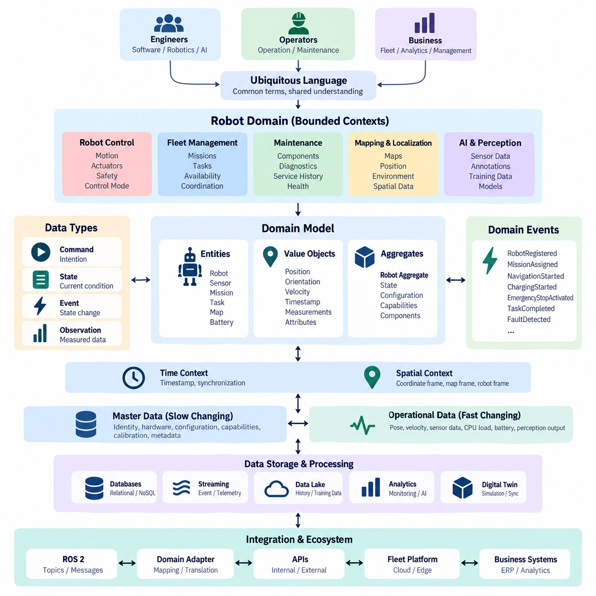
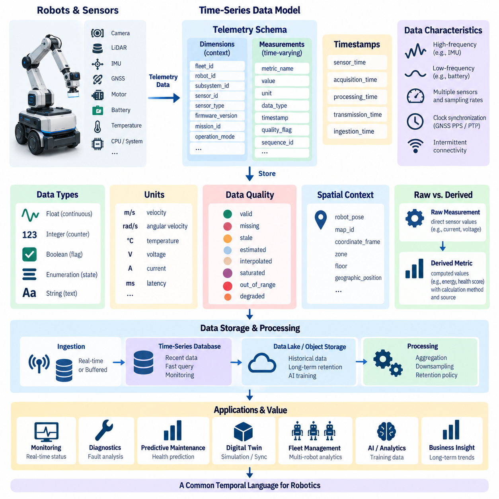
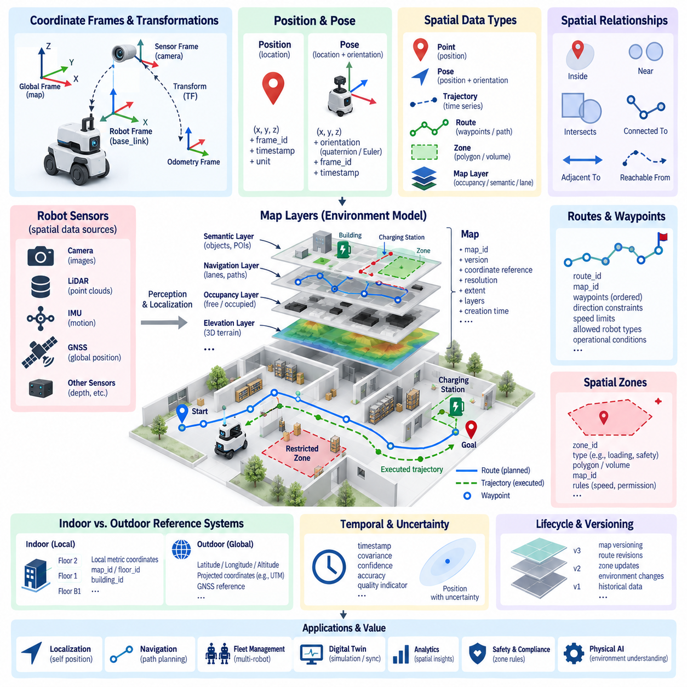
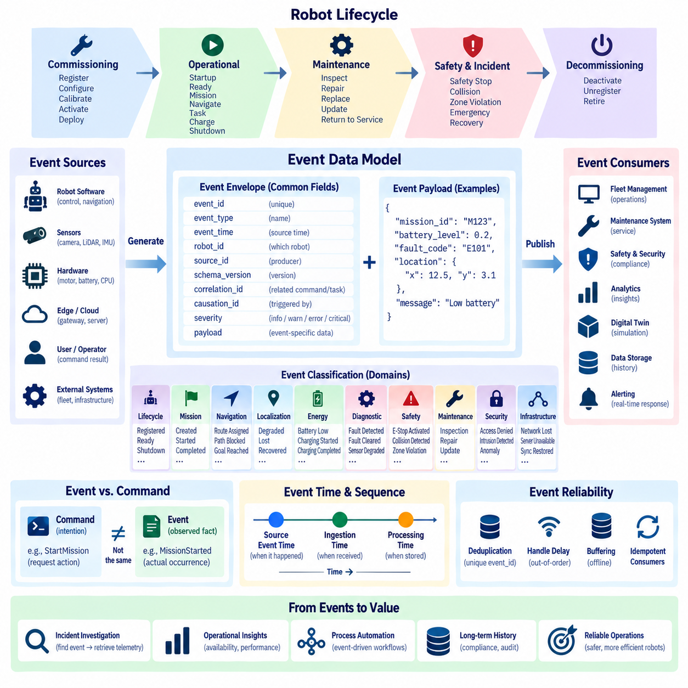
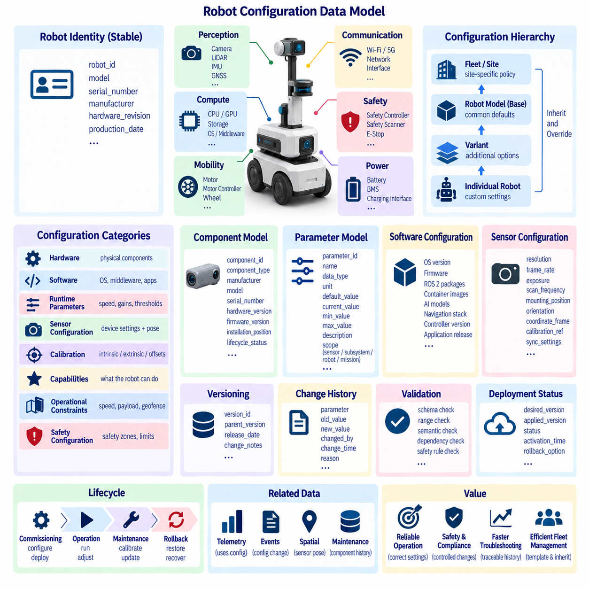
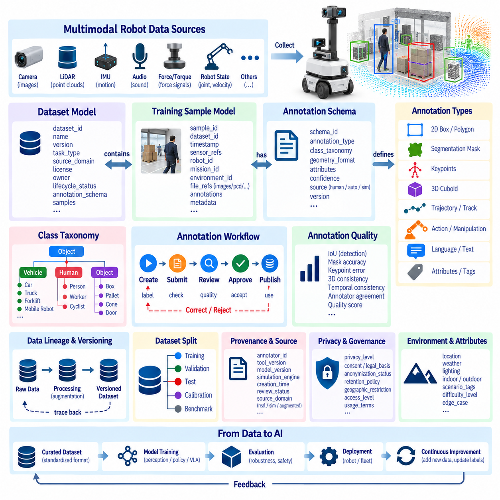
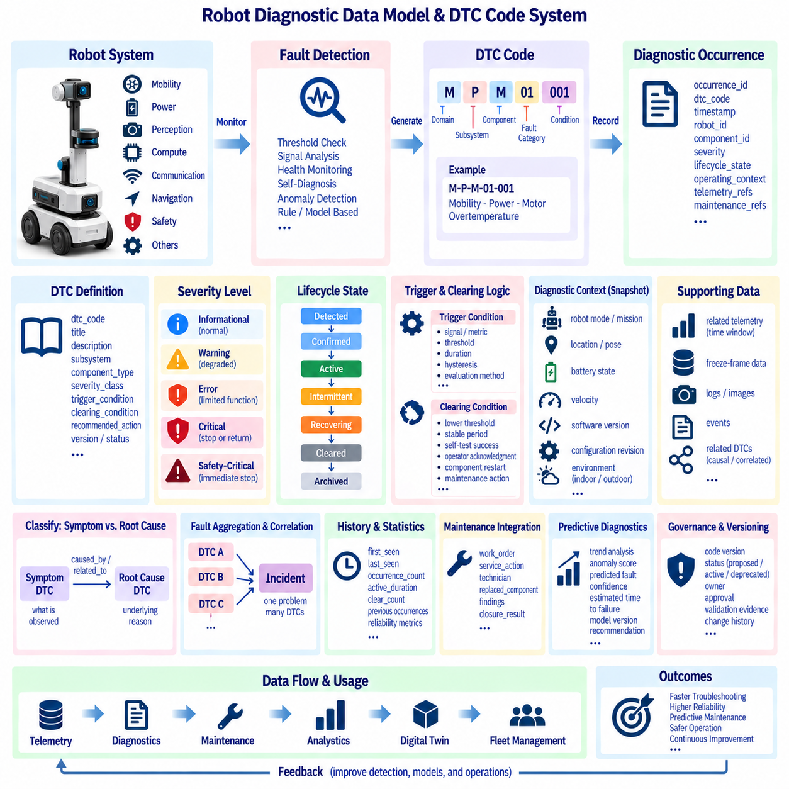
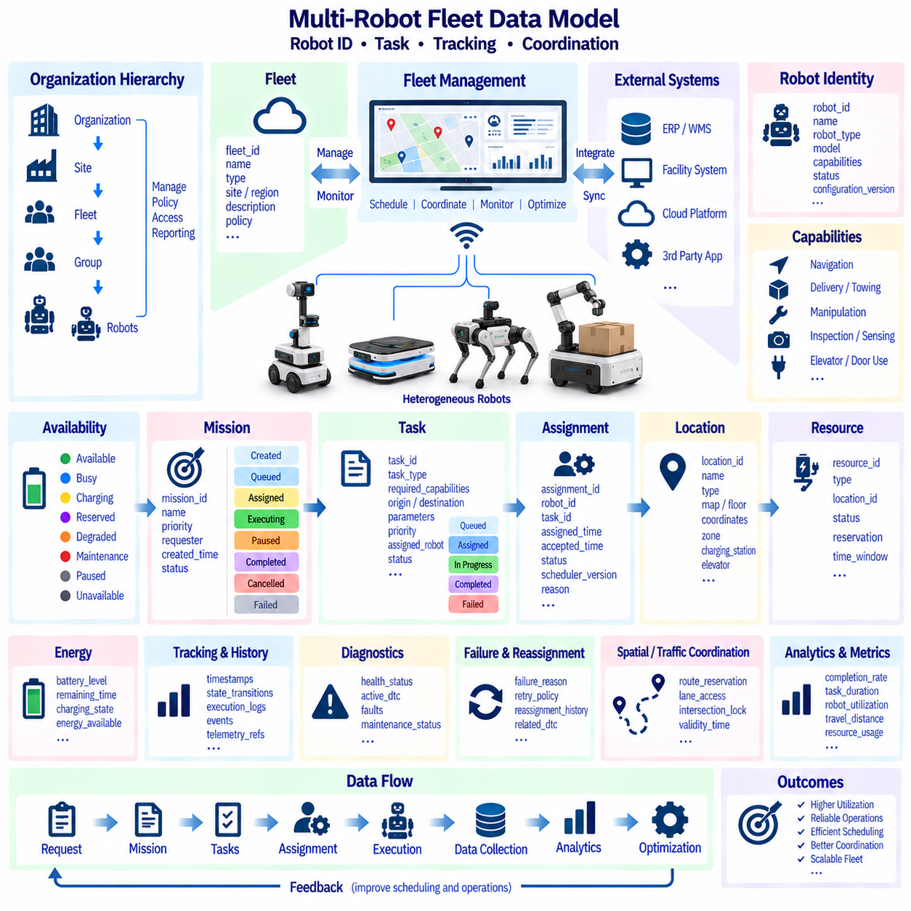
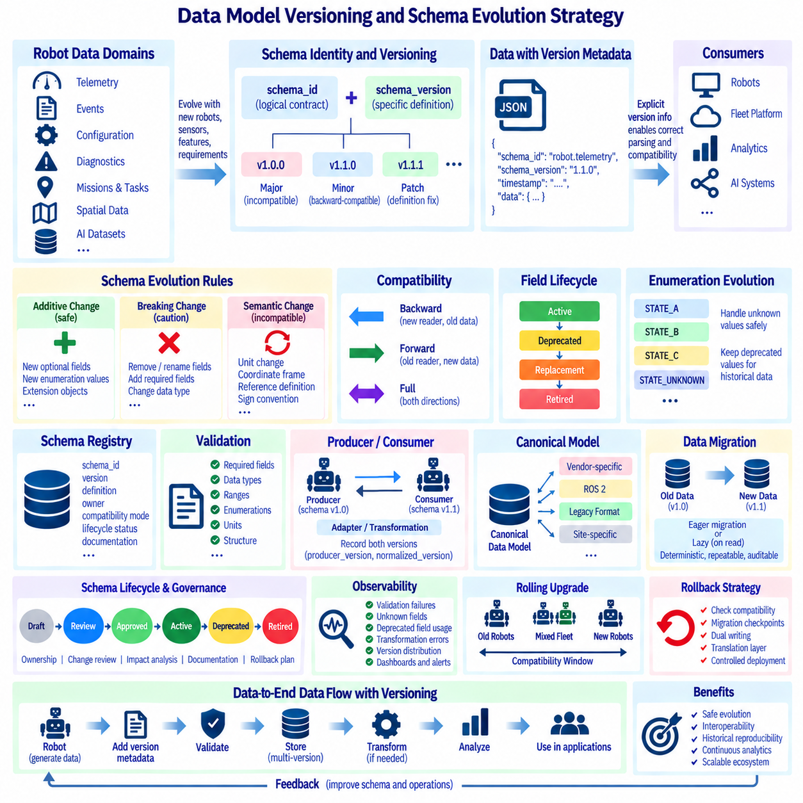
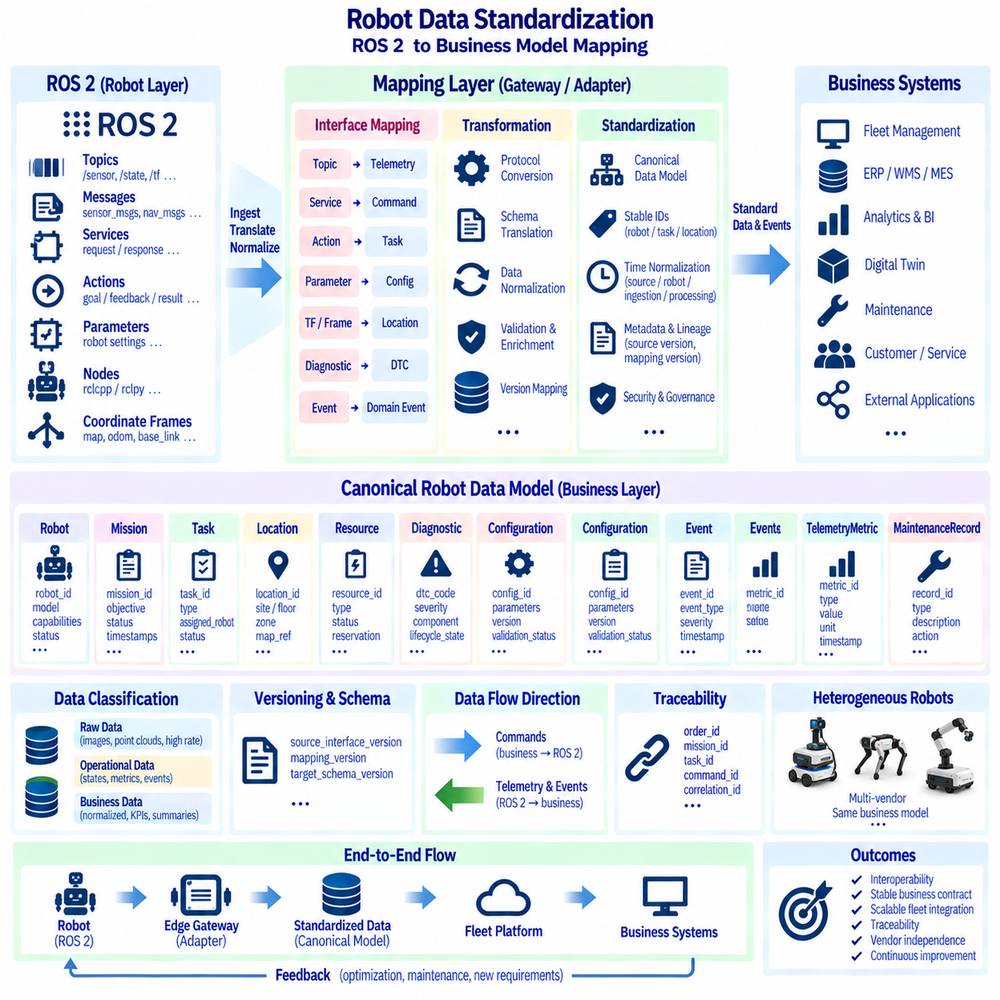

**Volume 07 Robot Data Architecture**

# 01. Data Modeling

## 01.01 Robot Data Modeling Principles: Domain-Driven Design

{width="7.268055555555556in" height="7.268055555555556in"}

Robot data modeling begins with the recognition that a robot is not merely a collection of sensors, actuators, and software nodes. It is a physical system that continuously changes state while interacting with people, equipment, infrastructure, and other robots. A useful data model must therefore represent identity, configuration, operational state, observations, actions, missions, faults, and environmental context as connected domain concepts.

Domain-Driven Design provides a practical foundation for organizing this complexity because it starts from the operational meaning of data rather than database technology. Instead of designing schemas directly from ROS 2 messages, device registers, API payloads, or database tables, engineers first identify the concepts that matter to the robot domain. Terms such as Robot, Mission, Task, Pose, Sensor, Battery, Fault, Map, and Fleet become part of a shared domain language.

This shared vocabulary is commonly described as a ubiquitous language. Software engineers, robotics engineers, AI developers, operators, and business teams should use important terms consistently across specifications, source code, APIs, telemetry, databases, and operational dashboards. If "robot state" means navigation mode in one subsystem and overall operational condition in another, integration becomes ambiguous. Explicit definitions reduce semantic inconsistency as the platform grows.

A robot domain should also be divided into bounded contexts so that one universal data model does not attempt to represent every concern. Robot Control may describe velocity, actuator commands, emergency stops, and controller modes, while Fleet Management represents assignments, missions, availability, and traffic coordination. Maintenance can independently model components, diagnostic events, service records, degradation indicators, and replacement history.

Bounded contexts are especially important because the same physical object can have different representations depending on its purpose. A battery in real-time control may be represented by voltage, current, temperature, and state of charge. In maintenance, the same battery may be represented by serial number, installation date, cycle count, health trend, and service history. These models are related, but forcing them into a single structure creates unnecessary coupling.

Domain entities represent objects whose identity remains meaningful even when their attributes change. A Robot, Sensor, Mission, Task, Map, or Battery can therefore be modeled with a persistent identifier and a lifecycle. A robot may change location, firmware, operational mode, or assigned mission while remaining the same entity. Stable identity enables historical analysis, traceability, fleet coordination, maintenance records, and relationships across distributed data systems.

Value objects describe information primarily through their values rather than independent identity. Position, orientation, velocity, geographic coordinates, temperature ranges, timestamps, and battery measurements are typical examples. Modeling these concepts explicitly improves consistency because units, coordinate frames, precision, validation rules, and allowed ranges can be defined once. A Pose should communicate not only numbers but also frame, timestamp, and representation conventions.

Aggregates define consistency boundaries around closely related entities and value objects. A Robot aggregate might contain its operational state, capabilities, active configuration, and references to installed components, while detailed telemetry remains outside the aggregate because it arrives at a much higher frequency. Aggregate boundaries should reflect operational transactions rather than physical containment, preventing large robot objects from becoming inefficient synchronization structures.

Domain events represent facts that have already occurred and are important to other parts of the system. Examples include RobotRegistered, MissionAssigned, NavigationStarted, ChargingStarted, EmergencyStopActivated, LocalizationLost, TaskCompleted, and FaultDetected. Unlike continuously sampled telemetry, domain events describe meaningful state transitions. They allow fleet, maintenance, analytics, digital-twin, and notification services to react without direct dependencies on the producing subsystem.

Robot data architecture must clearly distinguish commands, state, events, and observations. A command expresses an intention such as StartMission or StopRobot. State represents the latest known condition, such as IDLE, EXECUTING, CHARGING, or FAULT. An event records a transition that occurred, while an observation represents measured information from sensors or software. Mixing these categories makes replay, auditing, synchronization, and failure diagnosis significantly more difficult.

Time and spatial context are first-class modeling concerns in robotics. Every important observation should carry sufficient temporal meaning to determine when it was generated, and spatial data should identify the coordinate frame in which it is valid. Sensor time, system time, synchronization quality, map frame, robot frame, geographic frame, and transformation relationships may all affect interpretation. Values without reliable temporal and spatial context can become operationally misleading.

A scalable model separates stable master data from rapidly changing operational data. Robot identity, hardware configuration, capabilities, calibration references, and component metadata change relatively slowly. Pose, velocity, sensor measurements, CPU load, battery current, and perception outputs may change many times per second. Separating these lifecycles allows each category to use appropriate storage, retention, indexing, streaming, and synchronization mechanisms.

Identifiers must remain stable across edge computers, fleet servers, cloud platforms, databases, and AI pipelines. A practical hierarchy can connect fleet, robot, subsystem, sensor, mission, task, and dataset identifiers without depending on mutable names or network addresses. Correlation identifiers should also connect commands, events, telemetry, logs, and resulting actions. This makes distributed robot behavior traceable from a business mission down to individual system observations.

Schema design should preserve semantic meaning while allowing controlled evolution. Data contracts need explicit field definitions, units, coordinate conventions, nullability, enumerations, timestamps, identifiers, and compatibility rules. New robot models or software versions will inevitably introduce additional capabilities and fields. Versioned schemas and backward-compatible changes allow older consumers to continue operating while newer components progressively adopt expanded representations.

Domain-Driven Design also creates a bridge between low-level robotics data and enterprise information. ROS 2 topics and messages can remain optimized for real-time robot communication, while domain adapters translate relevant information into Robot, Mission, Task, Asset, Fault, and Maintenance concepts. This prevents middleware-specific structures from becoming permanent business schemas and allows the same domain model to support APIs, databases, analytics, digital twins, and fleet services.

The resulting robot data model should be treated as a living architectural contract rather than a static database diagram. Domain concepts evolve as robots acquire new sensors, autonomy functions, AI models, fleet behaviors, and business roles. Maintaining clear bounded contexts, stable identities, explicit semantics, traceable relationships, and controlled schema evolution creates a durable foundation for later telemetry, event streaming, sensor management, AI data pipelines, governance, and digital-twin architecture.

## 01.02 Time Series Data Model: Sensor / Telemetry Schema

{width="7.268055555555556in" height="7.268055555555556in"}

Time-series data is one of the most fundamental data categories in robotics because almost every robot continuously produces measurements that change over time. Motor current, wheel velocity, battery voltage, temperature, CPU utilization, localization confidence, joint position, and network latency are meaningful only when associated with time. A time-series model therefore organizes observations around timestamps, identities, measurements, and operational context.

A sensor telemetry schema defines how these continuously generated measurements are represented consistently across robot hardware, onboard software, edge infrastructure, fleet servers, and cloud platforms. The objective is not simply to store numerical values but to preserve enough context to interpret them correctly later. Each observation should identify what produced the value, when it was measured, what the value means, and under which robot configuration or operating condition it was generated.

The timestamp is the central axis of a time-series model. Robotics systems may contain sensor timestamps, acquisition timestamps, processing timestamps, transmission timestamps, and server ingestion timestamps. These values should not be treated as interchangeable because communication delays and processing queues can create significant differences between them. Whenever possible, the schema should preserve the original measurement time while separately recording later processing or ingestion times.

Clock synchronization becomes critical when observations from multiple sensors must be correlated. Cameras, LiDARs, IMUs, GNSS receivers, motor controllers, and edge computers may operate with independent clocks and different sampling frequencies. Technologies such as GNSS PPS, PTP, or other synchronization mechanisms can establish a common temporal reference. The data model should retain synchronization status or timing quality when precise temporal alignment affects downstream interpretation.

A practical telemetry record usually combines dimensions and measurements. Dimensions describe the source and context, such as robot identifier, subsystem identifier, sensor identifier, sensor type, firmware version, mission identifier, or operating mode. Measurements contain changing values such as temperature, voltage, current, speed, acceleration, utilization, or confidence. Separating relatively stable dimensions from rapidly changing measurements improves query efficiency and semantic consistency.

Measurement names must be standardized rather than created independently by each subsystem. Terms such as battery_voltage, motor_current, cpu_temperature, wheel_speed, localization_confidence, and network_latency should have explicit definitions. Naming conventions should describe the physical or logical quantity without embedding unnecessary implementation details. Consistent names make telemetry from different robot models easier to compare and allow dashboards, analytics, and maintenance applications to reuse common processing logic.

Units are part of the meaning of a measurement and should never be left implicit. Velocity may be represented in meters per second, angular velocity in radians per second, temperature in degrees Celsius, voltage in volts, current in amperes, and latency in milliseconds. A schema should define canonical units and conversion rules so that values produced by different devices cannot be accidentally combined under incompatible measurement systems.

Data types should reflect both the physical measurement and its intended processing behavior. Continuous sensor values are commonly represented as floating-point numbers, counters may use integers, operational flags may use Boolean values, and discrete robot conditions may use controlled enumerations. Choosing explicit types improves validation, storage efficiency, compression, and query performance while preventing ambiguous representations such as encoding numerical measurements as arbitrary strings.

Telemetry schemas should include data-quality information when the validity of a measurement cannot be assumed. A value may be valid, missing, stale, estimated, interpolated, saturated, out of range, or generated while a sensor is degraded. Quality flags allow downstream applications to distinguish a genuine physical observation from a questionable value. This distinction is particularly important for diagnostics, predictive maintenance, AI training, and safety-related analysis.

Sampling frequency strongly influences both schema design and storage architecture. An IMU may generate hundreds or thousands of observations per second, while battery state or environmental temperature may require only low-frequency updates. High-rate signals should not automatically use the same storage and retention policy as slow-changing operational metrics. The data model should preserve sampling characteristics while enabling aggregation, downsampling, and selective retention according to operational value.

Robot telemetry also requires clear relationships between raw measurements and derived metrics. Raw motor current, voltage, vibration, and temperature may be stored as direct observations, while energy consumption, health scores, anomaly indicators, or degradation trends are computed from them. Derived values should identify their calculation method, source data, and processing version when reproducibility matters. This prevents calculated metrics from being mistaken for direct sensor measurements.

Spatial context may be required alongside time-series observations. A temperature reading from a stationary machine differs from the same measurement collected by a mobile robot moving through a facility. Robot pose, map identifier, coordinate frame, zone, floor, or geographic position can provide valuable context for later analysis. Rather than duplicating full spatial data in every record, telemetry can reference synchronized pose streams or contextual identifiers when appropriate.

The schema must also account for intermittent connectivity, which is common in mobile robotics. Telemetry generated while a robot is disconnected should retain its original measurement timestamps and sequence information when buffered locally. When connectivity returns, delayed records can be uploaded without appearing to have been generated at the upload time. Sequence numbers, source timestamps, ingestion timestamps, and unique identifiers help detect missing, duplicated, or reordered observations.

At fleet scale, telemetry modeling should allow thousands of signals from heterogeneous robot types to coexist without losing common semantics. Shared fields such as fleet_id, robot_id, subsystem_id, sensor_id, timestamp, metric_name, value, unit, and quality can establish a common envelope, while robot-specific attributes remain extensible. This balance enables standard fleet analytics without forcing every robot platform to expose exactly the same measurements.

Schema evolution is unavoidable as new sensors, robot models, firmware versions, and diagnostic functions are introduced. Telemetry contracts should therefore support optional fields, controlled extensions, explicit schema versions, and backward-compatible changes. Consumers should not fail simply because a newer robot publishes an additional metric. At the same time, changes to units, meanings, identifiers, or coordinate conventions should be treated as semantic changes rather than harmless field modifications.

Storage design should follow the characteristics of time-series workloads. Recent telemetry is frequently queried by time range, robot, subsystem, and metric, while older data is more often used for trend analysis, incident investigation, or AI training. Time-series databases can support operational monitoring, whereas object storage or data lakes can retain larger historical datasets. The logical telemetry schema should remain understandable even when physical storage technologies differ.

Retention and downsampling policies should reflect the value of information over time. High-frequency raw telemetry may be essential during immediate fault investigation but unnecessarily expensive to retain indefinitely. Older data can often be summarized into minimum, maximum, average, percentile, count, or statistical windows. Critical fault intervals and unusual operating conditions may be preserved at full resolution while routine periods are progressively aggregated.

A well-designed sensor telemetry schema ultimately creates a common temporal language for the robot data architecture. It connects physical measurements with robot identity, time, quality, configuration, and operational context while remaining scalable across individual robots and large fleets. This foundation supports later telemetry pipelines, time-series databases, anomaly detection, predictive maintenance, digital twins, fleet monitoring, and AI data systems without requiring each application to reinterpret raw robot signals independently.

## 01.03 Spatial Data Model: Maps, Routes, Positions

{width="7.268055555555556in" height="7.268055555555556in"}

Spatial data modeling provides the foundation for describing where a robot, object, destination, obstacle, or operational event exists within the physical world. Unlike conventional business data, robot spatial information is meaningful only when its coordinate system, reference frame, timestamp, and environment are known. Maps, routes, positions, poses, zones, landmarks, and geographic coordinates therefore require explicit relationships rather than isolated numerical fields.

A position represents a location within a defined spatial reference, typically expressed using two-dimensional or three-dimensional coordinates. However, coordinates such as x, y, and z have no independent meaning without a coordinate frame. A robust spatial schema therefore associates every position with a frame identifier, timestamp, unit, and reference system. This prevents coordinates generated by different localization, mapping, simulation, or navigation components from being incorrectly interpreted as equivalent.

A robot pose extends position by describing orientation as well as location. In planar mobile robotics, pose is often represented by x, y, and heading, while three-dimensional systems may use x, y, z together with quaternion or Euler-angle orientation. The schema should explicitly define orientation conventions, axis directions, units, and rotation order. Ambiguous pose representations can produce serious errors when data is exchanged between navigation, perception, digital-twin, and analytics systems.

Coordinate frames establish relationships among different spatial representations. A robot may simultaneously use a global map frame, an odometry frame, a robot base frame, and multiple sensor frames. Transformations describe how positions and orientations in one frame relate to another. The spatial data model should preserve frame identifiers and transformation relationships so that observations from cameras, LiDARs, GNSS receivers, manipulators, and other sensors can be interpreted within a common spatial structure.

Maps provide persistent representations of environments in which robots operate. Depending on the application, a map may contain occupancy grids, geometric features, semantic objects, lanes, navigation graphs, elevation information, restricted areas, or three-dimensional point clouds. Rather than treating a map as a single binary file, the data model should describe map identity, version, coordinate reference, resolution, spatial extent, layers, creation time, and relationships to operational environments.

Map layers allow different forms of spatial knowledge to coexist without being merged into one representation. An occupancy layer can describe free and occupied space, a semantic layer can identify doors, elevators, workstations, charging stations, or storage areas, and a navigation layer can describe traversable paths. Additional layers may represent safety zones, speed restrictions, temporary obstacles, infrastructure, or localization landmarks while remaining referenced to the same map.

Map identity and versioning are essential because physical environments change over time. Furniture may move, construction may alter passages, warehouse racks may be relocated, and outdoor roads or facilities may be modified. Robots should therefore identify the exact map version used for localization and navigation. Historical telemetry, routes, incidents, and AI datasets can then be associated with the spatial environment that was valid when those records were generated.

Routes describe intended movement through a spatial environment and should be distinguished from the actual trajectory traveled by a robot. A route may consist of ordered waypoints, graph nodes, lane segments, or path sections connecting an origin to a destination. Each route should retain identifiers, map references, direction constraints, permitted robot classes, speed limits, and operational conditions when these attributes influence navigation or fleet coordination.

Waypoints represent meaningful positions along routes and may include more information than coordinates alone. A waypoint can describe a pickup point, charging location, elevator entrance, inspection location, waiting area, or navigation transition. Attributes such as approach direction, stopping tolerance, maximum speed, required action, and semantic type make waypoints reusable operational objects rather than arbitrary points embedded directly inside mission definitions.

A trajectory represents the actual or planned motion of a robot over time and therefore combines spatial and temporal information. Each trajectory sample may contain position, orientation, velocity, acceleration, curvature, and timestamp. Planned trajectories can be compared with executed trajectories to analyze tracking performance, navigation efficiency, localization drift, or abnormal behavior. This distinction also supports simulation, validation, and autonomous-navigation development.

Spatial zones provide a higher-level method for describing operational areas. Instead of reasoning only with individual coordinates, applications can define polygons or volumes representing loading zones, pedestrian areas, restricted regions, charging areas, hazardous locations, or service boundaries. A robot position can then be evaluated against these zones to determine permissions, behaviors, speed policies, mission rules, or safety constraints without embedding geographic logic directly in application code.

Indoor and outdoor robots often require different spatial reference systems. Indoor AMRs commonly use local metric coordinates referenced to building maps, floors, and localization frames, while outdoor robots may use latitude, longitude, altitude, projected coordinates, or GNSS-based references. A unified spatial model should support both forms without assuming that one coordinate representation is universal. Explicit coordinate reference system metadata enables reliable transformation between local and geographic spaces.

Multi-floor facilities introduce another modeling requirement because identical x and y coordinates may represent completely different physical locations on different floors. Floor identifiers, building identifiers, map identifiers, and vertical transitions should therefore be modeled explicitly. Elevators, ramps, stairs, and transfer points can be represented as connectivity relationships between spatial regions, allowing fleet and navigation systems to reason about movement across multiple maps or levels.

Spatial relationships can provide more useful information than absolute coordinates alone. Concepts such as inside, adjacent to, connected to, near, intersects, reachable from, or belongs to a zone can describe the structure of an environment. These relationships enable semantic navigation and business-level queries such as determining which robot is inside a loading area, which charging station is nearest, or whether a destination can be reached through an authorized route.

Dynamic spatial information should be separated from relatively stable map information. Walls, lanes, charging stations, and fixed infrastructure may change infrequently, while robot positions, moving obstacles, temporary closures, and detected objects can change continuously. Separating static, semi-static, and dynamic spatial data allows different update frequencies, storage strategies, validity periods, and synchronization mechanisms while preserving relationships through common map and frame identifiers.

Spatial uncertainty should also be represented when location estimates are probabilistic rather than exact. GNSS, SLAM, visual localization, and sensor fusion systems may produce covariance, confidence, accuracy, or quality indicators together with estimated poses. Storing only the estimated coordinates hides important information about localization reliability. Downstream navigation, diagnostics, mapping, and analytics systems can make better decisions when uncertainty information accompanies spatial observations.

At fleet scale, stable spatial identifiers enable multiple robots to share maps, routes, zones, and infrastructure references. Instead of each robot independently defining "Charging Station 1" or "Warehouse Zone A," fleet-level objects can use persistent identifiers that are referenced by missions, telemetry, events, and maintenance records. This allows heterogeneous robots to operate within a shared spatial vocabulary while still supporting platform-specific navigation representations.

Spatial schemas must evolve as facilities, maps, robot capabilities, and navigation algorithms change. Map versions, route revisions, zone updates, coordinate transformations, and semantic annotations should therefore be traceable over time. Compatibility rules are particularly important when a fleet contains robots operating with different map revisions. Controlled spatial versioning prevents historical positions or mission records from being silently interpreted against a newer and geometrically different environment.

A well-designed spatial data model ultimately creates a common geometric and semantic language for robot systems. Positions describe where entities exist, poses describe location and orientation, maps describe environments, routes express intended movement, trajectories record motion through time, and zones capture operational meaning. Connected through coordinate frames, identifiers, timestamps, and versions, these concepts form the spatial foundation for localization, navigation, fleet coordination, digital twins, simulation, analytics, and Physical AI.

## 01.04 Event Data Model: Robot Lifecycle Event Classification

{width="7.268055555555556in" height="7.268055555555556in"}

An event data model represents meaningful facts that occur during the operation and lifecycle of a robot. Unlike telemetry, which continuously reports measurements such as temperature, velocity, or battery voltage, an event describes something that happened at a specific point in time. RobotRegistered, MissionStarted, ChargingCompleted, LocalizationLost, EmergencyStopActivated, and FaultDetected are examples of events that communicate significant changes to other systems.

A robot event should describe an observed fact rather than an intention or request. StartMission is normally a command because it asks the robot to perform an action, whereas MissionStarted is an event confirming that the transition actually occurred. Maintaining this distinction between commands and events is fundamental to reliable distributed systems because a requested action may be rejected, delayed, interrupted, or fail before producing the corresponding event.

Every event requires a consistent envelope containing information that allows it to be identified, ordered, traced, and interpreted. Typical fields include event_id, event_type, event_time, robot_id, source_id, schema_version, correlation_id, severity, and payload. The envelope provides common metadata across heterogeneous events, while the payload contains information specific to the event, such as fault codes, mission identifiers, battery values, or localization status.

Event identity must be globally stable enough to distinguish one occurrence from another across robots, edge computers, brokers, fleet servers, and cloud systems. A unique event_id supports deduplication when network retries cause the same event to be transmitted more than once. Robot and source identifiers establish ownership, while correlation identifiers connect related commands, tasks, events, telemetry, and logs into a traceable operational sequence.

Event time should represent when the event actually occurred at the source whenever possible. In distributed robot systems, this may differ from the time when an edge gateway receives the event or a cloud server stores it. Source event time, ingestion time, and processing time can therefore be modeled separately. Preserving these distinctions enables accurate reconstruction of incidents even when communication is delayed or temporarily unavailable.

Robot lifecycle events can be organized according to major operational phases. Commissioning events describe registration, configuration, calibration, activation, and initial deployment. Operational events represent startup, readiness, mission execution, navigation, task processing, charging, docking, and shutdown. Maintenance events describe inspection, repair, component replacement, software updates, and return to service, creating a continuous history throughout the robot lifecycle.

Operational state-transition events form an important category because they explain how a robot moves between meaningful states. Examples include RobotBooted, RobotReady, MissionAssigned, MissionStarted, NavigationStarted, TaskCompleted, MissionCompleted, ChargingStarted, and RobotShutdown. Each event should describe a completed transition rather than simply duplicating the current state, allowing historical sequences to reconstruct how the robot reached its present condition.

Navigation and localization events describe significant changes in autonomous mobility rather than every pose update. RouteAssigned, GoalReached, NavigationPaused, PathBlocked, LocalizationDegraded, LocalizationLost, LocalizationRecovered, and GeofenceEntered are examples. High-frequency positions remain telemetry or spatial observations, while events are generated when a condition crosses a meaningful operational boundary that requires recording or reaction.

Mission and task events connect low-level robot behavior with fleet and business operations. MissionCreated, MissionAssigned, MissionAccepted, TaskStarted, TaskCompleted, TaskFailed, MissionCancelled, and MissionCompleted can describe the execution lifecycle. Mission and task identifiers should remain consistent across the event sequence so that operators can reconstruct execution history, calculate performance metrics, investigate failures, and connect robot activities with external workflows.

Energy and charging events represent transitions that influence robot availability. BatteryLow, BatteryCritical, ChargingRequested, DockingStarted, ChargingStarted, ChargingCompleted, and UndockingCompleted can be modeled as lifecycle events, while voltage, current, temperature, and state-of-charge remain telemetry measurements. This separation allows fleet systems to react to meaningful energy conditions without processing every individual battery sample.

Diagnostic events describe abnormal conditions detected by hardware, software, sensors, or AI components. FaultDetected, FaultConfirmed, FaultCleared, SensorDegraded, MotorOverTemperature, CommunicationLost, and ComputeResourceCritical are examples. Diagnostic events should reference standardized fault or diagnostic codes when available, while the payload may contain subsystem identity, severity, supporting measurements, and contextual information required for root-cause analysis.

Safety events require particularly clear semantics because they may trigger immediate operational responses and later compliance analysis. EmergencyStopActivated, SafetyScannerTriggered, CollisionDetected, ProtectiveStopEntered, RestrictedZoneViolation, and EmergencyStopReleased can represent safety-relevant transitions. Such events should preserve source, timestamp, severity, robot state, and relevant context so that the sequence surrounding a safety incident can be reconstructed accurately.

Event severity provides a standardized indication of operational importance but should remain separate from event type. Informational events may document normal transitions, warnings may indicate degraded conditions, errors may represent failed functions, and critical events may require immediate intervention. Separating severity from classification allows the same event family to express different levels of impact without creating excessive numbers of narrowly defined event types.

Events may also be classified by domain so that consumers can subscribe only to information relevant to their responsibilities. Lifecycle, mission, navigation, localization, energy, maintenance, diagnostic, safety, cybersecurity, perception, and infrastructure domains can form a practical classification hierarchy. Fleet management may consume mission and availability events, while maintenance systems focus on diagnostic and service events and security systems process cybersecurity events.

Event causality should be represented whenever one event results from an earlier command, event, or operational condition. Correlation and causation identifiers make it possible to determine that a MissionStarted event resulted from a particular StartMission command, or that a ProtectiveStopEntered event was triggered by a specific safety observation. These relationships are essential for distributed tracing, incident investigation, event sourcing, and automated workflow orchestration.

Event schemas must support evolution because robot capabilities and operational requirements change over time. New event types, fields, diagnostic information, or safety attributes will appear as platforms mature. Explicit schema versions, optional fields, compatibility rules, and controlled naming conventions allow producers and consumers to evolve independently. Changes that alter the semantic meaning of an existing event should be versioned rather than silently redefining previously established behavior.

Reliable event processing must also account for duplication, delayed delivery, reordering, and temporary network disconnection. Mobile robots may buffer events locally and publish them later when connectivity returns. Unique identifiers, source sequence numbers, event timestamps, and idempotent consumers help maintain consistency under these conditions. Critical lifecycle and safety events should not be discarded merely because communication with a central platform is temporarily unavailable.

Event retention creates a durable operational history that complements high-volume telemetry. Telemetry explains detailed physical behavior, while events identify important moments that organize that data into meaningful episodes. An incident investigation can first locate FaultDetected or EmergencyStopActivated and then retrieve telemetry surrounding that timestamp. This relationship significantly reduces the effort required to analyze long periods of continuous robot operation.

A well-designed robot lifecycle event model ultimately provides a common language for describing what happened, when it happened, where it originated, why it may have occurred, and what operational context surrounded it. Standardized event identities, classifications, timestamps, severities, lifecycle relationships, and schemas connect robot control, fleet management, maintenance, safety, analytics, digital twins, and business systems into a traceable event-driven architecture.

## 01.05 Robot Configuration Data Model Design

{width="7.268055555555556in" height="7.268055555555556in"}

Robot configuration data describes the relatively stable parameters that determine what a robot is, what hardware and software it contains, and how those components should operate together. Unlike telemetry, which changes continuously, configuration data changes mainly during commissioning, maintenance, calibration, software deployment, or mission preparation. A structured configuration model provides a reliable source of truth for robot identity, capabilities, components, parameters, and operational limits.

A configuration model should separate robot identity from mutable settings. Stable attributes such as robot_id, model, serial number, manufacturer, hardware revision, and production information identify the physical asset, while parameters such as speed limits, sensor settings, controller gains, network addresses, or operational policies may change over time. Keeping these categories distinct prevents configuration updates from unintentionally modifying the identity of the robot.

Robot configuration is naturally hierarchical because a robot consists of multiple subsystems and components. A top-level Robot configuration may reference mobility, compute, power, perception, communication, safety, manipulation, and payload subsystems. Each subsystem can contain components such as motors, motor controllers, batteries, cameras, LiDARs, IMUs, GNSS receivers, GPUs, network interfaces, or safety devices with their own parameters and metadata.

Component identity should remain stable independently of configuration values. Each installed component can have a component_id, component_type, manufacturer, model, serial_number, hardware_version, firmware_version, installation_position, and lifecycle status. This structure enables maintenance systems to determine which physical device produced particular telemetry or faults and allows replacement history to remain traceable even when a component is removed and another is installed.

Hardware configuration describes the physical composition and engineering characteristics of the robot. It can include wheel dimensions, drive type, motor ratings, battery capacity, sensor mounting positions, compute resources, communication interfaces, payload limits, and mechanical dimensions. These properties influence control, navigation, energy management, safety, and simulation, so they should be represented using explicit units, data types, allowed ranges, and engineering definitions.

Software configuration describes which software components are deployed and how they are configured to operate. Relevant information may include operating-system versions, firmware, middleware, ROS 2 packages, container images, AI models, navigation stacks, controller versions, and application releases. Recording software configuration together with hardware configuration makes it possible to reproduce the operational environment associated with a particular robot behavior, incident, or dataset.

Runtime parameters represent adjustable values used by software during operation. Examples include maximum velocity, acceleration limits, obstacle margins, planner parameters, controller gains, localization thresholds, sensor rates, logging levels, and communication timeouts. Parameters should include data type, unit, valid range, default value, current value, and description where appropriate. Explicit constraints prevent invalid values from reaching safety-critical or performance-sensitive components.

Configuration values should be organized according to ownership and scope rather than stored in one large undifferentiated file. Some parameters belong to an individual sensor, others to a subsystem, robot model, specific robot, fleet, site, or mission. A layered configuration model allows common defaults to be defined once and specialized values to override them at narrower scopes, reducing duplication while preserving the ability to customize individual robots.

Configuration inheritance can support efficient management of heterogeneous fleets. A base robot model may define common hardware and software defaults, while a variant adds different sensors or payloads. A specific robot can then override calibration values or network settings, and a deployment site can apply local speed or safety policies. The effective configuration is produced by combining these layers according to explicit precedence rules rather than manually duplicating complete configuration files.

Sensor configuration requires both device parameters and spatial information. Camera resolution, frame rate, exposure, LiDAR scan frequency, IMU range, GNSS settings, and sensor enablement may be combined with mounting position, orientation, coordinate frame, calibration reference, and synchronization settings. Connecting sensor configuration with the spatial data model ensures that sensor observations can later be interpreted using the correct geometry and calibration state.

Calibration data should be managed as a specialized configuration category because it affects the interpretation of physical measurements. Camera intrinsic parameters, sensor extrinsics, wheel radius corrections, steering offsets, IMU biases, and actuator calibration coefficients may change after service or recalibration. Each calibration record should therefore include identity, version, creation time, validity period, calibration method, and applicable component or robot reference.

Capability information describes what a configured robot can actually perform. Capabilities may include autonomous navigation, elevator integration, charging, towing, manipulation, inspection, thermal sensing, outdoor operation, or specific payload functions. Fleet and mission systems can use capability data when selecting robots for tasks. Separating capabilities from low-level component details prevents higher-level applications from needing to understand every hardware parameter.

Operational constraints define boundaries within which the robot is permitted to operate. Maximum speed, payload, slope, turning limits, minimum battery reserve, temperature range, geographic restrictions, sensor dependencies, or safety-mode limitations can be represented as configuration policies. These values may originate from engineering specifications, site rules, or mission requirements and should be distinguishable from dynamically measured operating conditions.

Safety-related configuration requires stronger governance than ordinary convenience settings. Emergency-stop behavior, safety scanner zones, protective speed limits, collision thresholds, braking parameters, and safety-controller settings should have explicit ownership, validation, authorization, and change history. Systems should distinguish between parameters that operators may adjust routinely and parameters that require engineering approval or controlled deployment procedures.

Configuration versioning is essential because a robot\'s behavior can change significantly even when its physical identity remains unchanged. Every deployable configuration should have a version or immutable revision identifier. Historical telemetry, events, faults, missions, and AI data can then reference the configuration active when they were generated. This allows engineers to determine whether a behavioral change resulted from hardware, software, calibration, parameter, or environmental differences.

Configuration changes should be recorded as auditable events rather than silently overwriting previous values. A change record can identify which parameter changed, its previous and new values, who or what initiated the change, when it occurred, why it was made, and which configuration revision resulted. This history supports debugging, compliance, rollback, fleet comparison, and root-cause analysis when problems appear after configuration updates.

Validation should occur before configuration is activated on a robot. Schema validation can verify data types, required fields, enumeration values, units, and ranges, while semantic validation checks relationships between parameters. For example, a maximum operational speed should not exceed the hardware or safety limit. Cross-component validation can also detect incompatible firmware, unsupported sensor combinations, missing calibration data, or conflicting configuration dependencies.

Deployment status should be modeled separately from desired configuration. A fleet server may define a desired configuration, while a robot currently runs an older applied configuration because it is offline or an update failed. Recording desired_version, applied_version, deployment_status, and activation_time makes configuration drift visible. Fleet management systems can then identify robots that have not successfully converged to the approved configuration baseline.

Configuration rollback is an important operational capability when a new parameter set or software release causes unexpected behavior. Because previous configuration revisions are retained, operators can restore a known stable version without reconstructing settings manually. Rollback records should preserve the reason, target revision, execution result, and resulting active configuration so that recovery actions remain fully traceable.

A well-designed robot configuration data model ultimately becomes the authoritative description of how each robot is assembled, configured, calibrated, constrained, and enabled to perform its functions. By combining stable identity, hierarchical components, layered parameters, versioning, validation, audit history, deployment state, and capability information, the model connects engineering definitions with actual fleet operation.

This configuration foundation also links directly with telemetry, event, spatial, maintenance, digital-twin, simulation, and AI data architectures. Telemetry can reference the configuration under which measurements were produced, events can identify configuration changes, and digital twins can instantiate the correct robot variant. Configuration data therefore acts as a reproducibility and traceability layer that connects the physical robot with its software-defined operational state.

## 01.06 AI Training Data Model: Annotation Schema Standard

{width="7.268055555555556in" height="7.268055555555556in"}

AI training data for robotics must represent more than raw sensor files and labels because learning systems depend on the context in which observations were produced. Images, point clouds, audio, force signals, trajectories, actions, and robot states may all become training samples. A training data model should therefore connect sensor observations with robot identity, timestamps, spatial context, configuration, task information, annotations, and dataset provenance.

A training sample is the fundamental unit that connects source data with learning metadata. Depending on the application, one sample may represent a single image, synchronized multi-camera frames, a LiDAR scan, a short temporal sequence, or an entire manipulation episode. Each sample should have a stable sample_id and references to its source files, timestamps, sensors, robot, mission, environment, and annotation records without requiring unnecessary duplication of large binary data.

Dataset identity should be separated from individual samples so that collections can be versioned and managed independently. A dataset record may contain dataset_id, name, version, creation time, task type, source domain, license, ownership, and lifecycle status. It should also reference the included samples and annotation schema. This structure allows the same underlying observations to participate in different datasets for perception, navigation, manipulation, or multimodal learning.

Annotation schemas define how human-generated, machine-generated, or automatically derived labels are represented consistently. A schema should specify annotation type, class taxonomy, geometry, attributes, confidence, source, and version. Bounding boxes, polygons, segmentation masks, keypoints, 3D cuboids, trajectories, actions, language descriptions, and quality flags require different structures but should share common identification and provenance conventions.

A class taxonomy provides controlled semantic definitions for annotation labels. Instead of allowing arbitrary strings such as person, pedestrian, human, or worker to be used interchangeably, the dataset should define canonical class identifiers and names. Hierarchical taxonomies can represent relationships such as vehicle as a parent class and forklift, truck, or mobile robot as specialized classes, supporting both detailed and generalized learning tasks.

Two-dimensional vision annotations typically reference an image and describe objects using bounding boxes, polygons, masks, or keypoints. Each annotation should identify its sample, class, geometry, attributes, visibility, occlusion state, and confidence when applicable. Coordinates must follow an explicit convention defining image origin, width and height interpretation, normalization, and clipping rules so that training frameworks do not interpret identical annotations differently.

Three-dimensional annotations require additional spatial definitions because geometry may be represented in sensor, robot, map, or global coordinate frames. A 3D cuboid can include center position, dimensions, orientation, class, velocity, and tracking identifier. The annotation must identify the coordinate frame and calibration reference used when it was created. Without this information, labels cannot be reliably transformed across LiDAR, camera, robot, or world representations.

Temporal annotation becomes important when robot behavior or object motion must be learned across sequences rather than independent frames. A track_id can connect the same object across multiple observations, while start and end timestamps define temporal segments for actions or events. Navigation and manipulation datasets may represent complete episodes containing observations, states, actions, rewards, task descriptions, and termination conditions in chronological order.

Robot learning introduces action annotations that are fundamentally different from conventional perception labels. An action may represent velocity commands, joint targets, end-effector poses, gripper states, discrete skills, or higher-level task primitives. Each action should be associated with the observation and robot state from which it was executed. This observation-action relationship is essential for imitation learning, policy learning, and Vision-Language-Action model training.

Multimodal datasets require explicit synchronization relationships among cameras, LiDAR, IMU, audio, force sensors, robot states, and language information. Rather than assuming files with similar names were captured simultaneously, the data model should preserve timestamps, synchronization groups, calibration references, and modality identifiers. This allows training pipelines to construct reliable multimodal samples even when sensors operate at different rates.

Language annotations can connect physical observations and actions with semantic instructions. A sample or episode may include task instructions, scene descriptions, question-answer pairs, action explanations, object references, or operator commands. Language records should identify language, annotation source, timestamp or temporal scope, and relationships to objects, actions, or episodes. These relationships become particularly important for multimodal foundation models and Vision-Language-Action systems.

Annotation provenance records how a label was produced. An annotation may originate from a human annotator, an automated model, simulation ground truth, rule-based processing, or a combination of these methods. Fields such as annotator_id, tool_version, model_version, creation_time, review_status, and confidence help determine whether a label is appropriate for training, evaluation, or further review and make annotation processes reproducible.

Human annotation workflows often require multiple lifecycle states rather than a simple labeled or unlabeled distinction. An annotation can progress through created, submitted, reviewed, corrected, approved, or rejected states. Reviewer information and change history should be retained when quality assurance is important. This makes it possible to measure disagreement, identify systematic labeling errors, and prevent unverified annotations from silently entering production training datasets.

Annotation quality should be represented using measurable criteria appropriate to each task. Object detection may use intersection over union, segmentation can evaluate mask agreement, keypoints can use positional error, and classification can use annotator agreement. Three-dimensional and temporal tasks require their own consistency measures. Quality metadata should remain connected to the annotation version so that corrections do not erase evidence about earlier labeling quality.

Dataset splitting must be modeled explicitly rather than implemented only through temporary training scripts. Samples may belong to training, validation, test, calibration, or benchmark partitions. Split assignment should be reproducible and protected against leakage, especially when sequential frames, repeated environments, identical robots, or related episodes are highly correlated. Group identifiers can ensure that related observations remain within the same partition when necessary.

Negative and difficult examples are important parts of a robotics training dataset and should be represented intentionally. Samples containing no target object, severe occlusion, unusual lighting, sensor degradation, rare obstacles, or failure conditions may be especially valuable for robust learning. Difficulty level, scenario tags, environmental conditions, and edge-case classifications can be stored as metadata so that training and evaluation can measure performance across meaningful operational conditions.

Training data should maintain lineage back to its original source. A transformed image, cropped region, downsampled point cloud, augmented sample, or synchronized multimodal package should reference the raw observation and processing operation from which it was produced. Transformation parameters, software versions, and pipeline identifiers allow engineers to reproduce generated datasets and determine whether a model issue originated from raw data, preprocessing, annotation, or augmentation.

Dataset versioning should capture changes in samples, annotations, taxonomies, splits, and preprocessing rules. Adding new data, correcting labels, modifying a class definition, or changing train-test partitions can alter model performance significantly. Immutable dataset versions and explicit parent-child relationships allow experiments to reference the exact data used for training and make comparisons between model generations scientifically meaningful.

Privacy and governance metadata should accompany training data when robots collect information in human environments. Images, audio, location records, or behavioral data may contain personally identifiable or sensitive information. The schema can record privacy classification, consent or legal basis where applicable, anonymization status, retention policy, geographic restrictions, and access level. Governance information should remain linked to derived datasets so restrictions are not lost during transformation.

Synthetic data should follow the same logical principles as real-world training data while preserving its origin. Simulation engine, scene identifier, asset versions, randomization parameters, environmental conditions, ground-truth generation method, and simulation version can be stored as provenance. A source_domain field can distinguish real, simulated, augmented, or generated samples, allowing experiments to measure domain gaps and control real-to-synthetic training ratios.

A standardized AI training data model ultimately connects raw robot observations, annotations, actions, language, provenance, quality, governance, and dataset versions into one traceable structure. The objective is not to force every AI task into an identical label format, but to provide common identities and relationships around task-specific schemas. This foundation enables reproducible perception, imitation learning, multimodal learning, Physical AI, and Vision-Language-Action training pipelines.

## 01.07 Robot Diagnostic Data Model: DTC Code System

{width="7.268055555555556in" height="7.268055555555556in"}

A robot diagnostic data model provides a standardized structure for representing faults, warnings, degradation, recovery, and maintenance-relevant conditions across the complete robot system. Unlike ordinary telemetry, diagnostic data describes interpreted system conditions rather than continuous measurements alone. A diagnostic architecture should connect fault codes with robot identity, subsystem, component, timestamp, severity, operating state, supporting telemetry, and recommended service actions.

A Diagnostic Trouble Code, or DTC, acts as a stable identifier for a recognized abnormal condition. Instead of allowing individual software modules to generate arbitrary fault strings, the robot platform should maintain a controlled DTC namespace. Codes can represent conditions such as motor overtemperature, battery undervoltage, sensor communication loss, localization degradation, compute overload, brake failure, or safety-controller faults using consistent definitions across the fleet.

The DTC code structure should communicate enough hierarchy to identify where a problem belongs without embedding excessive implementation detail. A code may contain fields representing domain, subsystem, component, fault category, and specific condition. For example, mobility, power, perception, compute, communication, navigation, and safety can form top-level diagnostic domains. This structure allows operators and software to filter and aggregate faults at different levels.

Each DTC definition should be maintained separately from individual fault occurrences. The definition describes the permanent meaning of the code, including dtc_code, title, description, subsystem, component type, severity class, trigger condition, clearing condition, and recommended action. A diagnostic occurrence then references this definition and records when, where, and under what operating conditions the fault was actually detected.

Diagnostic severity indicates the operational impact of a condition and should not be confused with the DTC identity itself. A practical model can distinguish informational, warning, error, critical, and safety-critical conditions. Severity may determine whether the robot continues normally, enters degraded operation, pauses a mission, returns to a safe location, requests maintenance, or performs an immediate protective stop according to defined operational policies.

Fault lifecycle state is required because diagnostic conditions evolve after they are first detected. A fault may progress through detected, confirmed, active, intermittent, recovering, cleared, and archived states. Some conditions should be confirmed only after repeated observations or persistence thresholds to prevent transient noise from generating unnecessary alarms. Maintaining lifecycle state allows systems to distinguish a historical fault from a condition that currently affects robot operation.

Trigger conditions should be explicitly defined and traceable to measurable evidence. A motor overtemperature DTC may activate when temperature remains above a threshold for a defined duration, while communication-loss diagnostics may depend on missed messages or heartbeat timeouts. Diagnostic logic should identify the signal, threshold, duration, hysteresis, and evaluation method whenever possible so that fault generation can be reproduced and validated.

Clearing logic requires the same level of definition as activation logic. A fault should not disappear simply because a measurement briefly returns to normal. Recovery may require a lower threshold, a stable period, a successful self-test, operator acknowledgement, component restart, or maintenance action. Explicit clearing conditions prevent diagnostic oscillation and make the transition from abnormal to healthy state understandable to operators and automated systems.

A diagnostic occurrence should capture a snapshot of relevant operational context when a fault is detected. Robot mode, mission identifier, task, pose, battery state, velocity, software version, configuration revision, and environmental information may be useful depending on the fault. This diagnostic snapshot provides immediate evidence for troubleshooting without requiring every investigation to search through large volumes of unrelated historical telemetry.

Diagnostic data should remain linked to supporting telemetry for deeper analysis. A DTC occurrence can define a time window before and after detection so that engineers can retrieve motor current, temperature, vibration, CPU utilization, network latency, localization confidence, or other relevant signals. This relationship allows events to identify the important moment while time-series data explains the physical or computational behavior that led to the fault.

Freeze-frame data can provide a compact representation of critical measurements captured at the instant a diagnostic condition becomes active. The concept is similar to diagnostic snapshots used in other engineered systems, but robot-specific freeze frames may include navigation state, sensor health, compute load, safety state, mission context, and pose. The selected fields should depend on the diagnostic domain rather than forcing every fault to store identical data.

Subsystem and component identity must be explicit because the same DTC condition may occur on multiple physical devices. A robot may contain several drive motors, cameras, LiDARs, batteries, network interfaces, or compute modules. component_id, subsystem_id, hardware serial number, firmware version, and installation position allow maintenance teams to identify exactly which component generated the fault and correlate repeated failures with specific hardware.

Diagnostic codes should distinguish symptoms from root causes. A localization failure, for example, may be observed as a navigation problem while its underlying cause could be LiDAR communication loss, camera obstruction, map inconsistency, or compute overload. The diagnostic model should support relationships such as caused_by, related_to, consequence_of, or suspected_cause without assuming that every detected symptom immediately identifies the true root cause.

Fault aggregation and correlation become important when one physical problem generates many secondary DTCs. A power failure may trigger communication, sensor, navigation, and compute faults almost simultaneously. Without correlation, operators may see dozens of independent alarms for one incident. Correlation rules, causation identifiers, timestamps, and component relationships can group related diagnostic occurrences into an incident while preserving the original fault records.

Diagnostic data should support both onboard and fleet-level processing. The robot must detect conditions requiring immediate local response even when network connectivity is unavailable, while the fleet platform can correlate recurring faults across many robots. Local diagnostics therefore focus on fast detection and safe reaction, whereas centralized analytics can identify fleet trends, component reliability issues, site-specific patterns, and candidates for predictive maintenance.

DTC history should be retained even after a condition is cleared because recurrence patterns are valuable for maintenance and reliability analysis. Fields such as first_seen, last_seen, occurrence_count, active_duration, clear_count, and previous occurrences can summarize repeated behavior. Historical diagnostic information helps distinguish isolated transient faults from systematic degradation and supports metrics such as failure frequency, downtime, and mean time between failures.

Maintenance actions should be connected directly to diagnostic records when service is performed. A technician may inspect wiring, clean a sensor, update firmware, recalibrate a component, replace hardware, or confirm that no defect is present. Linking work orders, service actions, replaced component identifiers, technician findings, and closure results to DTC occurrences creates traceability from fault detection through diagnosis, repair, verification, and return to service.

Predictive diagnostics extend the model beyond discrete threshold-based DTCs. Vibration trends, battery degradation, motor current signatures, temperature patterns, or AI anomaly scores may indicate emerging problems before a hard failure occurs. The data model can represent predicted faults with confidence, estimated time to failure, model version, contributing signals, and recommendation while clearly distinguishing predictions from confirmed diagnostic conditions.

Diagnostic schema versioning is necessary as robot platforms evolve. New hardware, software, sensors, and algorithms introduce new DTCs, while existing diagnostic definitions may require refinement. Each code definition should have controlled version information and lifecycle status such as proposed, active, deprecated, or retired. Historical occurrences must continue to reference the diagnostic definition that was valid when the fault was generated.

Governance is particularly important for safety-related DTCs because changes to thresholds, severity, clearing logic, or automatic responses can alter robot behavior. Ownership, approval, validation evidence, software release, configuration revision, and change history should therefore be traceable. Diagnostic definitions that influence protective stops or safety functions require stronger change control than ordinary maintenance notifications or informational warnings.

A standardized robot diagnostic data model ultimately creates a common fault language across robot control, fleet management, maintenance, safety, engineering, and analytics systems. DTC definitions identify abnormal conditions, occurrences record actual faults, lifecycle states describe their progression, telemetry provides evidence, and maintenance records capture resolution. Together these relationships transform isolated error messages into structured and traceable engineering information.

This diagnostic foundation supports faster troubleshooting, fleet reliability analysis, automated recovery, predictive maintenance, digital twins, and continuous engineering improvement. When diagnostic codes are connected with configuration, telemetry, events, spatial context, software versions, and component history, engineers can reconstruct not only what failed but also the conditions surrounding the failure and whether similar patterns exist across the wider robot fleet.

## 01.08 Multi-Robot Fleet Data Model: Robot ID / Task Tracking

{width="7.268055555555556in" height="7.268055555555556in"}

A multi-robot fleet data model provides a common structure for identifying robots, assigning work, tracking execution, and coordinating shared resources across heterogeneous autonomous systems. A fleet may contain robots with different hardware, software, mobility, payloads, and capabilities, yet fleet applications require a consistent operational view. The model should therefore connect fleet identity, robot identity, capabilities, availability, missions, tasks, locations, status, and execution history.

Robot identity is the fundamental reference for every fleet-level operation. Each physical robot should have a persistent robot_id that remains stable across software updates, network changes, maintenance activities, and mission assignments. Human-readable names may change for operational convenience, but the underlying identifier should remain immutable. Telemetry, events, diagnostics, configuration, missions, tasks, and maintenance records can then reference the same robot throughout its lifecycle.

Fleet identity provides an organizational boundary for groups of robots managed under a common operational context. A fleet_id can represent robots belonging to a facility, customer, region, service organization, or management domain. Large deployments may introduce hierarchical structures such as organization, site, fleet, group, and robot. This hierarchy enables access control, reporting, policy management, and workload allocation without embedding organizational assumptions directly into individual robot records.

A fleet robot record should provide a concise operational representation rather than duplicate the complete robot configuration. Typical attributes include robot_id, fleet_id, robot_type, model, capability references, current availability, operating mode, active mission, location reference, connectivity status, and configuration version. Detailed hardware or software information can remain in the configuration domain while the fleet model references only information required for scheduling and coordination.

Capability modeling allows fleet systems to determine whether a robot is suitable for a particular task. Capabilities may represent autonomous navigation, towing, delivery, inspection, manipulation, elevator use, outdoor operation, payload handling, or specialized sensing. Tasks can declare required capabilities, and the scheduler can compare these requirements against robot capability profiles. This approach avoids assigning work solely according to robot model names or manually maintained operator knowledge.

Availability should be modeled separately from basic connectivity because an online robot is not necessarily ready to accept work. A robot may be available, busy, charging, reserved, degraded, under maintenance, paused, or unavailable because of a safety condition. Availability can be derived from operational state, diagnostics, energy level, mission status, and maintenance constraints. Explicit availability semantics allow scheduling systems to make consistent assignment decisions.

Mission and task concepts should be separated because they represent different levels of work. A mission describes an operational objective such as delivering material from one area to another, performing an inspection route, or executing a sequence of service activities. A task represents an individual executable step within that mission. One mission may therefore contain navigation, pickup, waiting, docking, manipulation, inspection, or delivery tasks linked through execution dependencies.

Every mission should have a stable mission_id and maintain references to requesting systems, assigned robots, priority, creation time, operational context, and lifecycle state. Mission states may include created, queued, assigned, accepted, executing, paused, completed, cancelled, or failed. State transitions should be recorded as events rather than simply overwriting the current value, allowing fleet systems to reconstruct the complete history of how a mission progressed.

Tasks require their own task_id because individual steps may be retried, reassigned, skipped, or executed by different robots. A task record can describe task type, required capabilities, origin, destination, parameters, dependencies, priority, assigned robot, execution state, and timing information. Stable task identity enables precise tracking when complex missions contain many steps or when work is transferred between robots following failure or operational changes.

Task dependencies define the execution relationships between activities. Some tasks must execute sequentially, while others may run in parallel or begin only after a specified condition is satisfied. Relationships such as depends_on, follows, blocks, parallel_with, and optional_after can describe workflow structure. Modeling these dependencies explicitly allows the fleet system to represent complex operations without embedding every workflow rule directly into robot-specific control logic.

Assignment records should preserve the relationship between a robot and a task independently of the task definition itself. An assignment may include assignment_id, robot_id, task_id, assigned_time, accepted_time, assignment_status, scheduler version, and selection reason. This separation is useful because the same task may be offered to one robot, rejected, reassigned, and eventually completed by another robot while retaining a complete decision history.

Task tracking requires more than a simple completed flag. Execution may progress through queued, assigned, accepted, started, in_progress, paused, blocked, completed, failed, cancelled, or retrying states. Each transition should have a timestamp and relevant context. Current status provides an efficient operational view, while the transition history supports performance analysis, incident reconstruction, service-level measurement, and debugging of scheduling or robot behavior.

Time information is essential for fleet performance analysis. Missions and tasks may record requested_time, queued_time, assigned_time, start_time, completion_time, deadline, estimated_duration, and actual_duration. These timestamps support metrics such as queue delay, assignment latency, travel time, execution duration, completion rate, and deadline compliance. Estimated values should remain distinguishable from actual observations so prediction accuracy can also be evaluated.

Spatial references connect task tracking with the environment in which work occurs. Origins, destinations, waypoints, zones, maps, floors, charging stations, elevators, and docking locations should use stable spatial identifiers rather than arbitrary coordinate values embedded repeatedly in tasks. A task can reference a location object while the spatial data model provides coordinates, map version, access constraints, and semantic information required by navigation systems.

Robot position should remain linked to task execution when location is operationally relevant. The fleet system may maintain a current pose reference or summarized location such as zone, floor, or waypoint while high-frequency position data remains in the spatial or telemetry domain. This separation prevents fleet databases from becoming overloaded with continuous localization updates while still enabling scheduling decisions based on where robots currently operate.

Energy state influences task assignment because a technically capable robot may not have sufficient battery reserve to complete a mission safely. Fleet records can expose state of charge, estimated remaining runtime, charging state, and energy availability derived from telemetry. Scheduling policies may consider expected task energy, travel distance, charging opportunities, and minimum reserve constraints when deciding whether to assign work or send a robot to charge.

Resource tracking is required when multiple robots share infrastructure. Charging stations, elevators, doors, loading areas, work cells, narrow corridors, and docking points can be represented as shared resources with stable resource_id values. Reservation records can specify which robot or task owns a resource and for what time window. This allows coordination systems to prevent conflicts and provides historical evidence when congestion or resource contention affects mission performance.

Traffic coordination can extend the fleet data model with route reservations, lane ownership, intersection access, and temporary spatial locks. Rather than representing every navigation command centrally, the fleet layer can track coordination objects that affect multiple robots. Reservation identifiers, robot references, spatial segments, priorities, validity intervals, and release states provide a structured basis for managing shared movement without tightly coupling fleet logic to a specific navigation implementation.

Failure and reassignment must be treated as normal lifecycle conditions rather than exceptional database states. A task may fail because of robot faults, blocked routes, insufficient energy, communication loss, unavailable infrastructure, or external cancellation. The failure record should preserve reason, diagnostic references, execution context, and retry policy. If the task is reassigned, the original attempt should remain in history rather than being overwritten by the new assignment.

Heterogeneous fleets require abstraction boundaries between fleet-level semantics and vendor-specific robot interfaces. A fleet model should describe common concepts such as robot, mission, task, capability, state, location, and assignment without requiring every robot to expose identical internal structures. Adapters can translate proprietary APIs, ROS 2 interfaces, or interoperability standards into the common model while preserving vendor-specific extensions when necessary.

Fleet data should retain correlation identifiers that connect operational records across distributed systems. A mission may originate in a warehouse, hospital, manufacturing, or enterprise application and generate multiple tasks, commands, events, and robot actions. Correlation identifiers make these records traceable as one business transaction. This allows operators to follow an external request through scheduling, robot execution, completion, and downstream confirmation.

Historical fleet data supports optimization beyond immediate monitoring. Mission completion rates, task duration, robot utilization, charging frequency, travel distance, idle time, failure rates, reassignment counts, and resource congestion can be calculated from structured histories. These metrics can reveal whether performance problems originate from individual robots, scheduling policies, facility layouts, infrastructure limitations, or workload patterns.

A standardized multi-robot fleet data model ultimately creates a shared operational language across heterogeneous robots and higher-level applications. Stable robot, mission, task, assignment, location, and resource identities make every execution step traceable. Combined with lifecycle states, timestamps, capabilities, availability, energy, diagnostics, and spatial references, the model enables reliable scheduling, task tracking, fleet coordination, analytics, and scalable autonomous operations.

## 01.09 Data Model Versioning and Schema Evolution Strategy

{width="7.268055555555556in" height="7.268055555555556in"}

Robot data models must evolve continuously because sensors, hardware, software, autonomy functions, fleet services, and business requirements change throughout the system lifecycle. A schema designed for the first robot prototype will rarely remain sufficient for production fleets. Schema evolution therefore requires an explicit architectural strategy that allows data structures to change without breaking deployed robots, historical datasets, analytics pipelines, APIs, or downstream applications.

Schema identity should be separated from schema version. A stable schema_id identifies the logical data contract, while schema_version identifies a specific definition of that contract. Telemetry, events, configurations, diagnostics, missions, and AI datasets can each maintain independent schema families. This separation allows systems to recognize that two records represent the same conceptual model even when their field structures differ across software generations.

Version information should travel with the data rather than being inferred only from deployment dates or software releases. Every serialized record, message envelope, file manifest, or dataset should contain or reference its applicable schema version. Explicit version metadata enables consumers to select the correct parser, validator, transformation rule, and compatibility policy even when old and new robot generations operate simultaneously within the same fleet.

Semantic versioning concepts can provide a useful foundation when adapted to data contracts. A major version indicates an incompatible structural or semantic change, a minor version introduces backward-compatible additions, and a patch version corrects definitions without changing the intended interface. Not every internal schema requires three numeric levels, but the organization should define consistent rules that explain what constitutes compatible and incompatible change.

Backward compatibility means a newer consumer can correctly interpret data produced by an older schema. Forward compatibility means an older consumer can tolerate data generated by a newer schema, usually by ignoring unknown optional fields. Full compatibility supports both directions within defined limits. Compatibility requirements should be selected according to operational needs rather than assuming that every schema must remain universally compatible forever.

Additive changes are generally the safest evolution mechanism. New optional fields, metadata, enumeration values, or extension objects can often be introduced without invalidating existing records. Required fields should be added cautiously because historical data and older producers cannot provide them. When new information is essential, defaults, derived values, migration rules, or a new major schema version may be necessary to preserve deterministic interpretation.

Removing or renaming fields is more disruptive because existing consumers may depend on them. A safer strategy is to mark fields as deprecated, introduce replacements, support both representations during a transition period, and remove the obsolete form only in a controlled major version. Deprecation metadata should identify the replacement field, deprecation version, expected retirement version, and migration guidance so developers can update integrations before compatibility is lost.

Changes in meaning can be more dangerous than structural changes. Keeping the same field name while changing its unit, coordinate frame, reference definition, sign convention, or semantic interpretation can silently corrupt downstream analysis. Such semantic changes should be treated as incompatible unless explicit conversion rules exist. Units, coordinate systems, enumerations, and reference conventions should therefore be part of the formal schema contract rather than undocumented assumptions.

Enumerations require special evolution rules because new states frequently appear as robot functionality expands. Consumers should avoid assuming that the known enumeration set is permanently complete. Unknown values should be handled safely, while safety-critical states may require stricter validation. Deprecated values should remain interpretable in historical records even after producers stop generating them, preserving the meaning of archived operational data.

A schema registry provides centralized governance for data contracts used across robot, edge, fleet, cloud, analytics, and AI systems. The registry can store schema identifiers, versions, definitions, ownership, compatibility mode, lifecycle status, documentation, and transformation references. Producers register approved schemas, while consumers can retrieve or validate the expected contract. This prevents independent teams from creating incompatible interpretations of the same logical data.

Schema validation should occur as early as practical in the data pipeline. Robot software can validate configuration or command structures before execution, while gateways and ingestion services can validate telemetry and events before persistent storage. Validation can check required fields, types, ranges, enumerations, units, identifier formats, and structural constraints. Invalid data should be rejected, quarantined, or explicitly marked rather than silently entering trusted datasets.

Schema evolution should distinguish the producer version from the consumer version. A robot may continue publishing an older schema while a fleet platform has already upgraded to a newer internal representation. Adapters or transformation services can translate between these contracts. Recording producer_schema_version and normalized_schema_version preserves lineage and helps engineers determine whether unexpected behavior originated in the source data or during transformation.

Canonical data models reduce the number of direct transformations required between heterogeneous systems. Vendor-specific, ROS 2, legacy, or site-specific formats can be mapped into a common canonical representation used by fleet and enterprise services. Evolution of the canonical model should remain controlled because changes can affect many adapters simultaneously. Vendor extensions can be retained in namespaced extension fields when information cannot be represented directly in the common schema.

Data migration converts previously stored records to a newer representation when required. Migration may occur eagerly by rewriting historical data or lazily when records are read. Large telemetry and AI datasets often make full rewriting expensive, so transformation-on-read or version-aware query layers may be preferable. Migration procedures should be deterministic, repeatable, auditable, and capable of identifying records that cannot be converted without information loss.

Historical data should remain interpretable according to the schema that existed when it was created. Replacing old definitions with current ones can destroy reproducibility and make previous operational events impossible to reconstruct accurately. Schema definitions should therefore be immutable after release. Corrections can create new versions, while old definitions remain available for decoding archived telemetry, events, diagnostics, configurations, and datasets.

Versioning must also preserve relationships between schemas. A diagnostic record may reference telemetry, a mission may reference spatial objects, and an AI dataset may reference sensor observations generated under another schema version. Cross-domain references should retain enough version information to reconstruct these relationships. Otherwise, individually valid records may become ambiguous when combined after several generations of schema evolution.

Distributed robot systems require rolling-upgrade compatibility because all components cannot normally be updated simultaneously. During deployment, old robots, new robots, edge services, fleet servers, and external applications may coexist. Compatibility windows should define which producer and consumer versions are supported together. Automated contract tests can verify these combinations before deployment and prevent a software release from unexpectedly breaking fleet communication.

Schema changes should pass through a controlled lifecycle such as draft, review, approved, active, deprecated, and retired. Ownership must be clear so that changes are evaluated for effects on robotics software, storage, APIs, analytics, AI pipelines, and external integrations. Change proposals should document motivation, compatibility impact, migration requirements, affected consumers, validation evidence, and rollback strategy before an updated contract becomes operational.

Observability is important during schema transitions. Systems should monitor validation failures, unknown fields, deprecated-field usage, transformation errors, incompatible messages, and producer-version distribution across the fleet. These metrics reveal whether migration is progressing as expected and identify consumers that still depend on obsolete structures. Operational dashboards can therefore turn schema evolution from a documentation activity into a measurable engineering process.

Rollback must be considered before deploying a new schema or transformation. If a software release is reverted, older components may again become active while newer records already exist in storage or message streams. Compatibility design should determine whether those components can tolerate the newer data. Where rollback compatibility cannot be guaranteed, migration checkpoints, dual writing, translation layers, or controlled deployment boundaries may be required.

Schema evolution is ultimately a governance problem as much as a serialization problem. Stable identifiers, explicit versions, compatibility policies, immutable historical definitions, registries, validation, adapters, migration procedures, and lifecycle controls allow robot data to evolve without losing meaning. When these mechanisms are applied consistently, telemetry, events, diagnostics, configuration, spatial data, fleet records, and AI datasets remain traceable across generations.

A mature versioning strategy enables long-lived robot platforms to change safely while preserving interoperability and analytical continuity. New robot models and software generations can introduce richer data without forcing immediate upgrades across the entire ecosystem. Historical information remains reproducible, current services remain compatible, and future systems can understand how each record was defined, transformed, and consumed throughout its complete data lifecycle.

## 01.10 Robot Data Standardization: ROS2 to Business Model Mapping

{width="7.268055555555556in" height="7.268055555555556in"}

Robot data standardization must bridge two fundamentally different perspectives. ROS 2 represents robots through topics, messages, services, actions, parameters, nodes, and coordinate frames optimized for distributed robotic computation. Business systems instead require stable concepts such as robot, asset, mission, task, location, customer, service status, utilization, and maintenance. A mapping architecture connects these layers without forcing enterprise applications to understand robot middleware details.

Directly exposing ROS 2 interfaces to business applications creates unnecessary coupling. Topic names, message structures, namespaces, QoS settings, and node implementations may change as robot software evolves, while enterprise applications expect stable contracts. A standardization layer should therefore translate operational ROS 2 data into canonical business objects and events whose meaning remains stable even when underlying robot implementations or vendors change.

Robot identity provides the first mapping boundary. ROS 2 namespaces and node names can identify runtime software instances, but they should not become permanent enterprise identifiers. A persistent robot_id should represent the physical or logical fleet asset, while namespace, domain ID, node identity, hardware serial number, and network information remain technical attributes. This distinction allows software instances to restart or change without breaking maintenance, mission, or asset histories.

ROS 2 topics generally represent continuous state or asynchronous observations and can be mapped into telemetry, state, or event domains according to their semantics. Sensor messages such as images, laser scans, IMU measurements, battery states, and odometry belong primarily to operational data streams. Business systems rarely require every raw message, so gateways can extract summaries, health indicators, utilization metrics, exceptions, and references to retained raw data.

ROS 2 services represent request-response interactions and should be mapped carefully because enterprise operations usually require stronger transaction semantics. A service call may become a business command such as reset subsystem, request docking, change operating mode, or retrieve configuration. The standardized model should record command identity, requester, target robot, parameters, request time, result, status, and correlation identifiers rather than exposing only middleware-level request and response messages.

ROS 2 actions naturally align with long-running robot operations because they support goals, feedback, cancellation, and results. Navigation, docking, manipulation, inspection, and other actions can therefore map to task execution records. The business model should preserve task_id, robot_id, requested goal, lifecycle state, progress, timestamps, completion result, and failure reason while hiding implementation-specific action server names and message definitions.

Parameters and configuration interfaces can map into the standardized robot configuration model. ROS 2 parameters may describe controller gains, sensor settings, thresholds, frame names, planner options, or runtime behavior, but not every parameter should be exposed as a business attribute. The mapping layer should distinguish engineering configuration from operationally relevant settings and preserve parameter provenance, configuration version, validation status, and applied robot identity.

Coordinate frames and transforms require semantic mapping before business systems can use spatial information. ROS 2 may represent relationships among map, odom, base_link, sensors, and component frames through TF, while enterprise applications typically reason about sites, buildings, floors, zones, stations, routes, and named locations. A spatial standardization layer should associate technical coordinates with stable semantic location identifiers and map versions.

Mission and task models provide a major connection between enterprise intent and ROS 2 execution. A warehouse, hospital, factory, or facility system may request a business objective such as deliver item, inspect zone, or move material. The fleet platform decomposes this objective into tasks, and robot adapters translate those tasks into ROS 2 actions, services, or commands. Execution feedback is then normalized back into common mission and task lifecycle states.

This mapping should be bidirectional but not symmetrical. Downstream commands move from business intent through fleet orchestration and adapters toward ROS 2 interfaces, while upstream information moves from robot messages toward normalized telemetry, events, status, and business outcomes. Each direction requires different validation, authorization, timing, reliability, and safety controls. Treating the mapping as simple field conversion is therefore insufficient for production systems.

A canonical robot data model provides the stable intermediate representation between heterogeneous robot interfaces and business applications. Common entities may include Robot, Mission, Task, Assignment, Location, Resource, Diagnostic, Configuration, TelemetryMetric, Event, and MaintenanceRecord. Vendor-specific ROS 2 messages are transformed into these objects, allowing fleet, analytics, digital twin, ERP, WMS, MES, and service systems to consume a consistent data contract.

Not all ROS 2 data should be promoted into the canonical business model. High-frequency camera images, point clouds, control loops, transforms, and actuator-level signals may remain within the robot or specialized data platforms. The mapping architecture should classify information according to operational and business value. Raw data can be stored by reference, while normalized summaries, exceptions, KPIs, state transitions, and traceability metadata are exposed to higher layers.

Event normalization is particularly important because robot software may produce many implementation-specific status messages. These should be mapped into controlled domain events such as RobotAvailable, MissionStarted, TaskCompleted, ChargingStarted, LocalizationDegraded, SafetyStopActivated, or MaintenanceRequired. Standard event envelopes can include event_id, event_type, robot_id, timestamp, severity, correlation_id, source, schema_version, and context for consistent downstream processing.

Diagnostics require a similar translation boundary. ROS 2 diagnostic messages and component-specific errors can be mapped into the standardized DTC and diagnostic occurrence model. The mapping should retain the original technical source while adding canonical subsystem, component, severity, lifecycle state, and maintenance meaning. This enables business systems to reason about service impact without losing the engineering information required for troubleshooting.

Quality of Service, or QoS, is essential inside ROS 2 but should not leak directly into business semantics. Reliability, durability, history depth, and delivery behavior influence how robot messages are transported, while enterprise systems may use queues, event brokers, databases, or APIs with different guarantees. Gateways must translate communication behavior into appropriate delivery, persistence, retry, deduplication, and ordering policies for the standardized data layer.

Correlation identifiers provide traceability across these architectural boundaries. A business order may generate a mission, multiple tasks, ROS 2 actions, navigation goals, events, diagnostic records, and completion confirmations. Maintaining order_id, mission_id, task_id, command_id, action references, and correlation_id relationships allows operators to reconstruct the entire transaction from enterprise request to physical robot behavior and final business result.

Time semantics also require normalization. ROS 2 timestamps may originate from sensor clocks, system clocks, simulation time, or synchronized robot clocks, while business systems require consistent event and transaction timelines. The standardized envelope should distinguish source_time, robot_time, ingestion_time, and processing_time when necessary. Clock synchronization quality and timestamp uncertainty may also be retained for applications requiring precise reconstruction.

Schema translation should be version-aware because ROS 2 message definitions and canonical business schemas evolve independently. An adapter should record source interface version, mapping version, and target schema version so transformations remain reproducible. When a robot software update modifies a message, only the adapter may need to change while the business contract remains stable. This separation significantly reduces integration impact across large fleets.

Security and governance must be enforced at the mapping boundary. Enterprise systems should not automatically gain unrestricted access to ROS 2 topics, services, or actions simply because data integration exists. The gateway can apply authentication, authorization, command allowlists, validation, rate limits, audit logging, and safety policies. Sensitive engineering data can remain restricted while approved operational information is exposed through governed APIs and events.

The standardized layer also enables heterogeneous fleet interoperability. Robots from different vendors may use different ROS 2 distributions, namespaces, message packages, proprietary APIs, or non-ROS interfaces. Vendor adapters can translate each implementation into the same canonical robot and task model. Higher-level applications then operate on capabilities and business semantics rather than depending on the middleware technology used by each robot.

Mapping should preserve lineage from normalized business data back to its technical source. A KPI, fault, task result, or utilization metric should identify the robot data, transformation logic, schema version, and processing stage from which it was derived. This lineage supports debugging, audits, analytics validation, digital twins, AI pipelines, and regulatory evidence by making derived business information traceable to physical robot observations and actions.

A mature ROS 2-to-business mapping architecture therefore acts as an anti-corruption layer between rapidly evolving robotic software and long-lived enterprise systems. ROS 2 remains optimized for sensing, control, navigation, and distributed robot execution, while canonical models provide stable identities, tasks, events, diagnostics, locations, and business states. Adapters absorb implementation differences and protect both sides from unnecessary structural coupling.

The result is a standardized information flow from physical robots through ROS 2, edge gateways, fleet platforms, and enterprise applications. Commands can move safely from business objectives toward robot execution, while telemetry and events return as meaningful operational outcomes. This architecture enables scalable fleet integration, vendor independence, traceability, analytics, digital twins, maintenance, and continuous business optimization without sacrificing robotic engineering detail.
