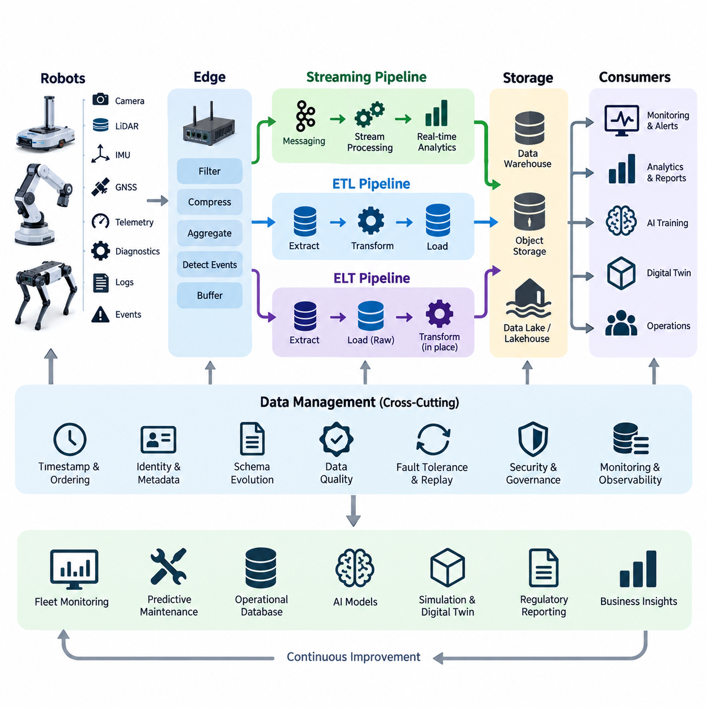
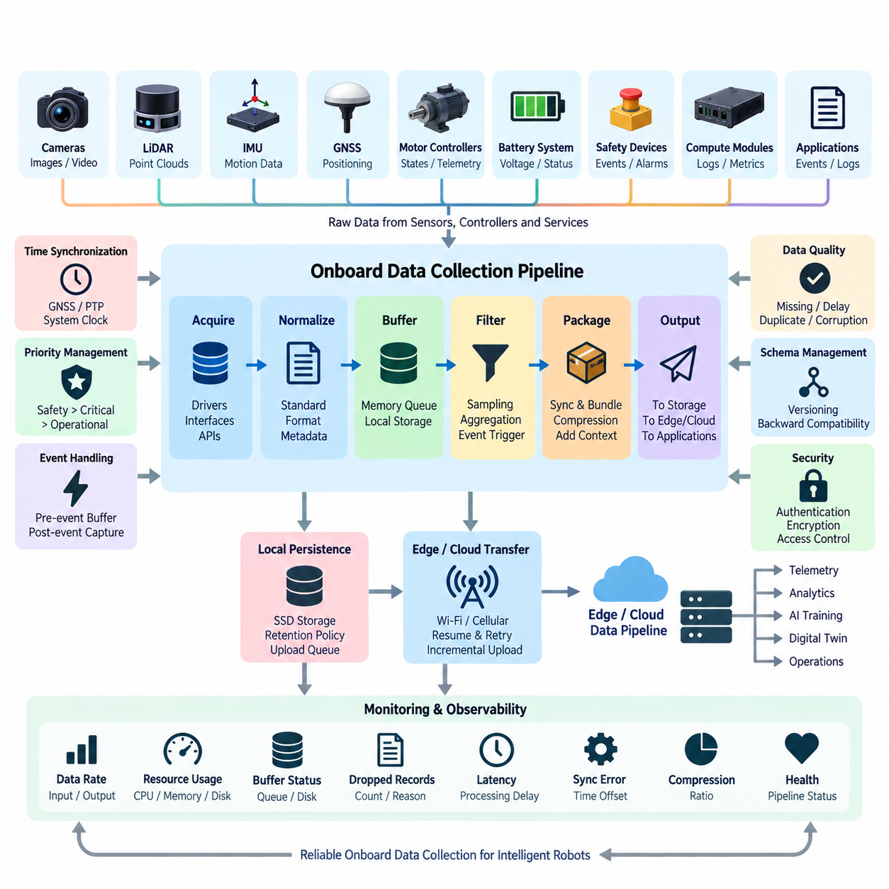
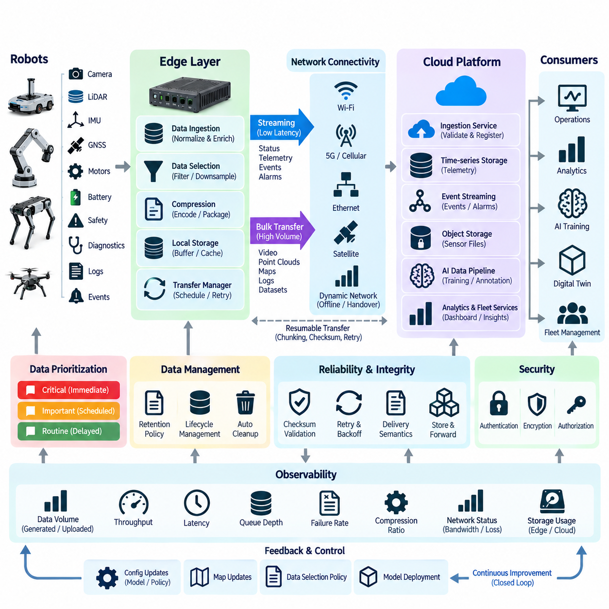
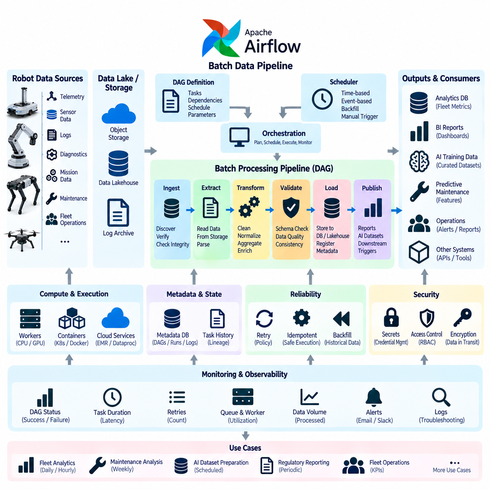
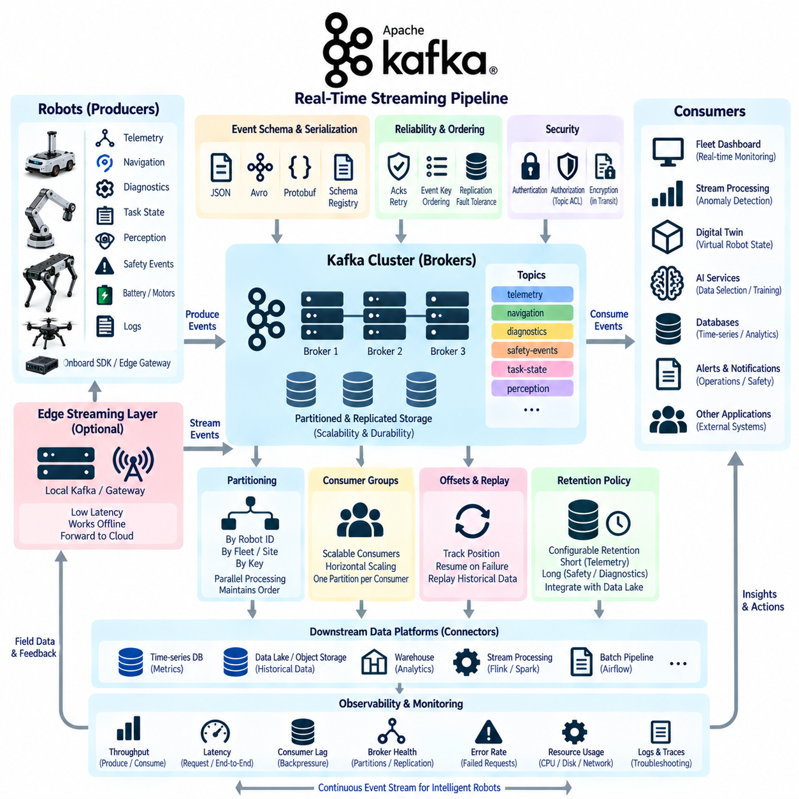
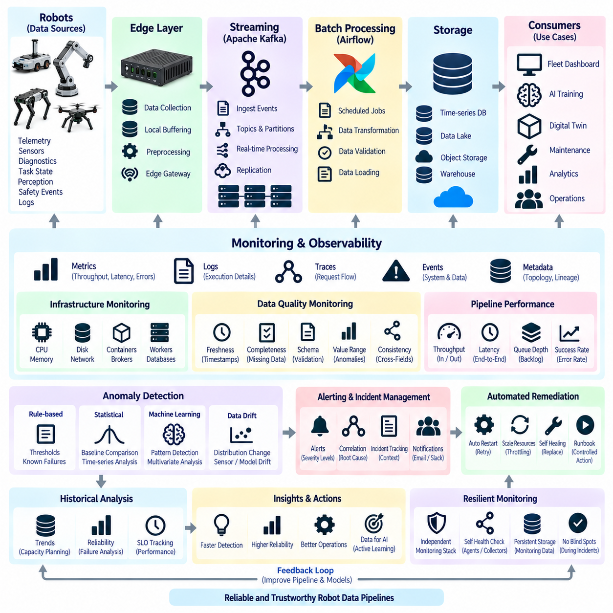
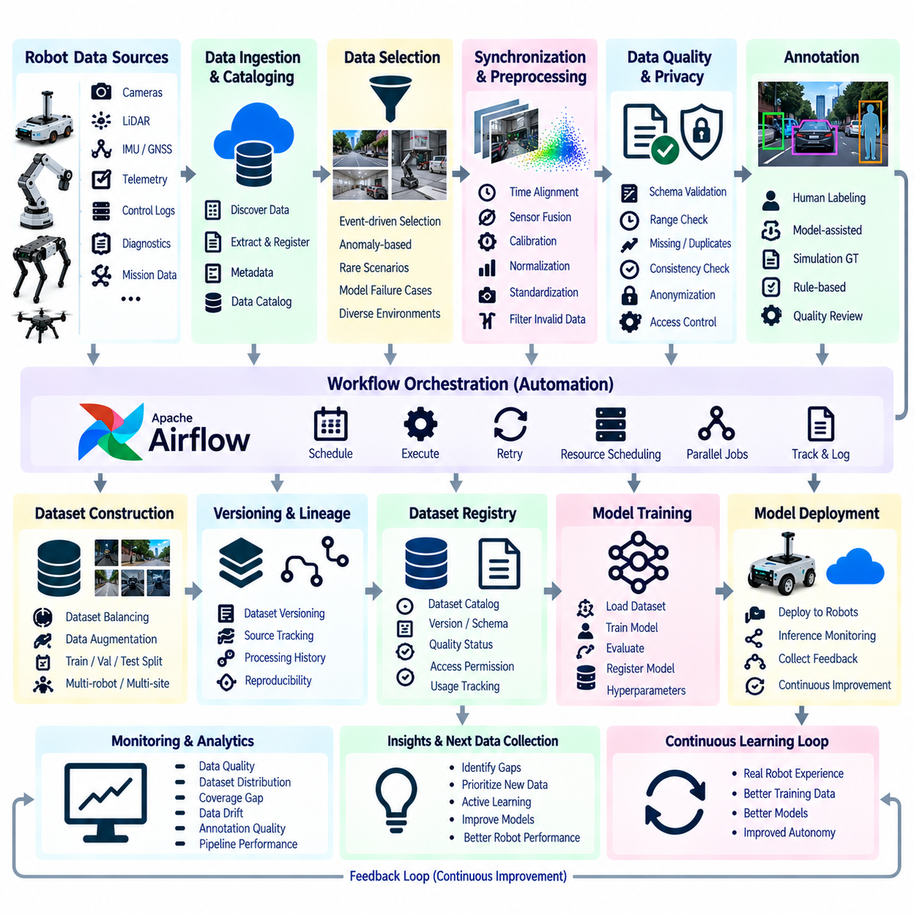
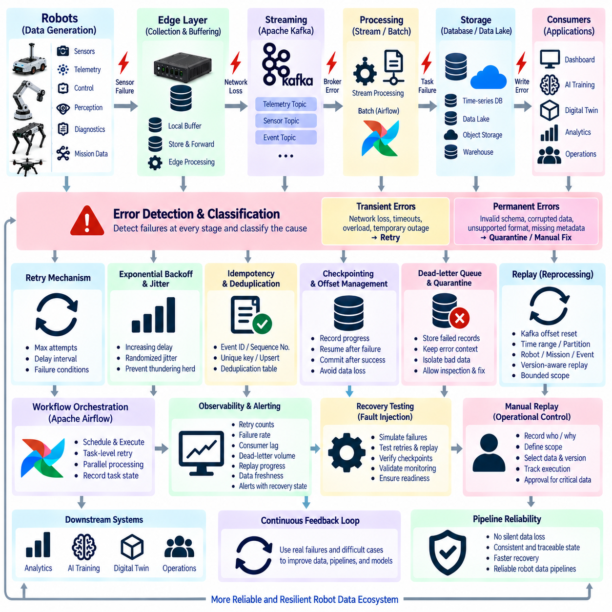
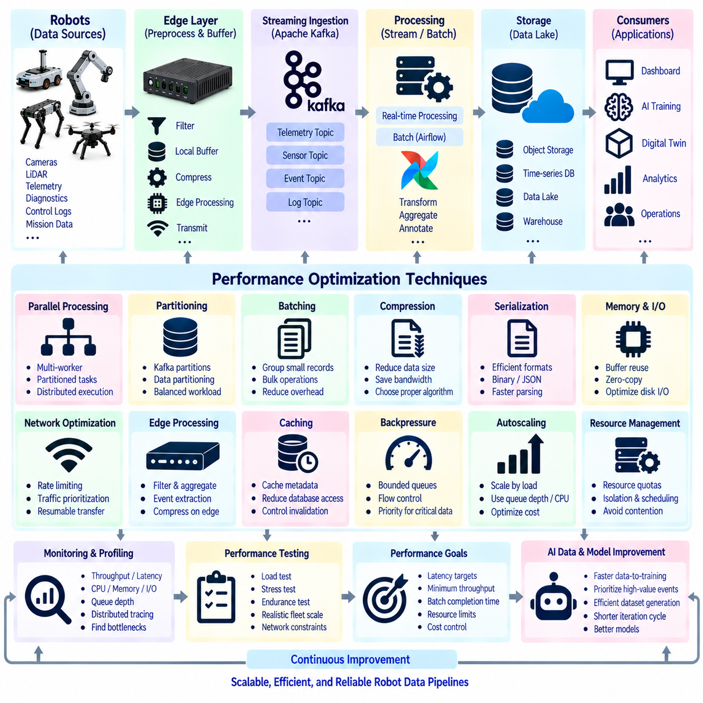
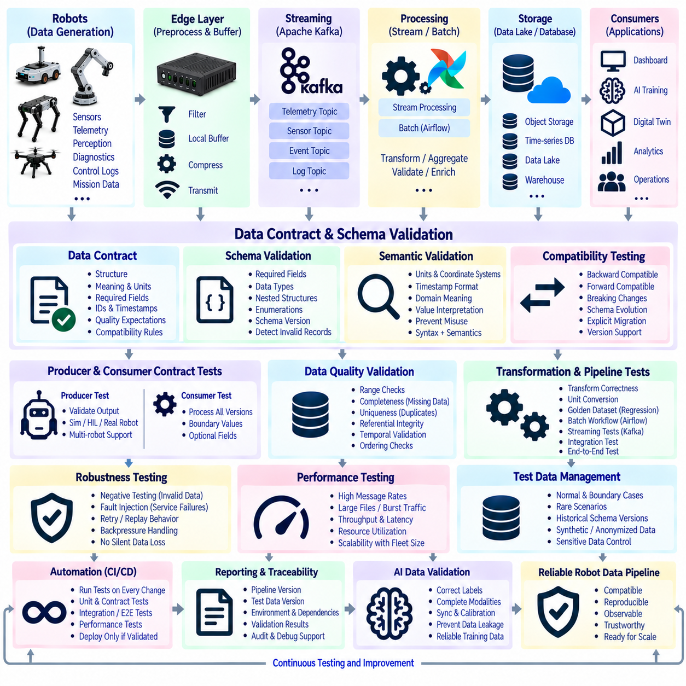

**Volume 07 Robot Data Architecture**

# 02. Data Pipelines

## 02.01 Data Pipeline Concepts: ETL vs ELT vs Streaming

{width="7.268055555555556in" height="7.268055555555556in"}

로봇 데이터 파이프라인(Robot Data Pipeline)은 원시 관측 데이터(Raw Observation Data)를 운영, 분석, 인공지능(AI), 장기 지식(Long-term Knowledge)에 활용할 수 있는 신뢰성 높은 정보로 변환하는 전체 경로이다. 로봇 데이터 아키텍처(Robot Data Architecture)에서는 온보드 수집(Onboard Collection), 엣지 처리(Edge Processing), 클라우드 전송(Cloud Transfer), 저장, 검증, 학습, 거버넌스(Data Governance)를 서로 연결한다.

ETL(Extract, Transform, Load)은 데이터를 원천 시스템(Source System)에서 먼저 추출(Extract)하고, 사전에 정의된 구조에 맞도록 변환(Transform)한 다음, 대상 저장소(Target Repository)에 적재(Load)하는 처리 방식이다. 변환 과정에서는 잘못된 레코드 필터링, 단위 변환, 타임스탬프(Timestamp) 정규화, 메타데이터(Metadata) 결합, 중복 제거, 표준 스키마(Schema) 매핑 등이 수행될 수 있다.

로보틱스(Robotics)에서 ETL은 목적지 시스템이 엄격하게 통제되고 예측 가능한 데이터를 요구할 때 특히 유용하다. 모터 제어기(Motor Controller), 배터리 관리 시스템(Battery Management System), 내비게이션 모듈(Navigation Module), 진단 서비스(Diagnostic Service)에서 수집한 텔레메트리(Telemetry)를 검증한 후 운영 데이터베이스나 분석용 데이터 웨어하우스(Data Warehouse)에 저장할 수 있다.

ETL의 주요 장점은 데이터가 대상 시스템에 저장되기 전에 데이터 품질(Data Quality)과 스키마 적합성(Schema Conformity)을 강제할 수 있다는 것이다. 따라서 규제 보고, 플릿 핵심성과지표(Fleet KPI), 유지보수 이력, 정제된 AI 데이터셋 등에 적합하다. 반면 적재 전에 변환 규칙을 설계해야 하므로 유연성이 낮아질 수 있으며, 대용량 센서 데이터는 상당한 중간 처리 자원을 요구할 수 있다.

ELT(Extract, Load, Transform)는 ETL의 마지막 두 단계를 반대로 수행한다. 로봇에서 데이터를 추출한 뒤 원시 상태 또는 최소한으로 처리된 상태로 확장 가능한 저장소에 먼저 적재하고, 이후 목적지 환경 내부에서 필요한 변환을 수행한다. 객체 저장소(Object Storage), 데이터 레이크(Data Lake), 레이크하우스(Lakehouse), 분산 분석 플랫폼의 발전으로 이러한 방식이 실용화되었다.

로봇 시스템에서 ELT는 카메라 이미지(Camera Image), 라이다 포인트 클라우드(LiDAR Point Cloud), ROS 2 기록 데이터, 진단 로그(Diagnostic Log), 위치추정 이력(Localization History), 멀티모달 데이터셋(Multimodal Dataset)처럼 향후 활용 목적이 처음부터 확정되지 않은 데이터에 적합하다. 원본 데이터를 보존한 뒤 필요에 따라 AI 학습, 고장 분석, 시뮬레이션, 플릿 분석용 데이터로 변환할 수 있다.

따라서 ELT는 데이터 보존(Data Preservation)과 데이터 해석(Data Interpretation)을 분리한다. 하나의 원시 데이터셋에서 신뢰성 분석용 텔레메트리, 인지 학습용 동기화 센서 데이터, 시각화용 저해상도 데이터, 이상 현상 분석용 이벤트 구간 등 여러 파생 데이터셋(Derived Dataset)을 만들면서도 원본 관측 데이터는 재현 가능한 기준 데이터로 유지할 수 있다.

스트리밍(Streaming)은 데이터가 생성되는 동안 지속적으로 처리해야 하는 요구사항을 해결한다. 완성된 배치(Batch)가 준비될 때까지 기다리지 않고 레코드나 이벤트(Event)를 연속적인 흐름으로 처리한다. 로봇 위치, 속도, 배터리 상태, 온도, 작업 상태, 장애물 감지, 안전 이벤트, 시스템 고장 등의 데이터를 발생 직후 수 밀리초에서 수 초 이내에 처리할 수 있다.

스트리밍 파이프라인(Streaming Pipeline)은 일반적으로 로봇 데이터 생산자(Producer), 메시징 또는 전송 인프라, 스트림 처리기(Stream Processor), 운영 소비자(Consumer), 영구 저장소를 연결한다. 이벤트를 필터링, 보강, 집계, 상호 연관하거나 규칙 및 머신러닝 모델(Machine Learning Model)로 평가하여 플릿 대시보드, 이상 감지, 경고, 디지털 트윈(Digital Twin), 운영 데이터베이스 등에 동시에 제공할 수 있다.

스트리밍은 데이터가 즉각적인 운영 의미를 가지는 경우 특히 중요하다. 예를 들어 모터 온도가 지속적으로 상승하여 고장 가능성을 나타낸다면 야간 ETL 작업까지 기다릴 수 없다. 위치추정 오류, 비상 정지(Emergency Stop), 예상하지 못한 장애물, 급격한 배터리 감소도 즉각적인 플릿 수준 대응이 필요할 수 있다. 스트리밍은 데이터 아키텍처를 단순 기록 시스템에서 능동적인 운영 신경망으로 변화시킨다.

ETL, ELT, 스트리밍은 서로 배타적인 대안으로 이해해서는 안 된다. 세 방식은 서로 다른 시간적·아키텍처적 문제를 해결한다. ETL은 저장 전 통제된 변환을 강조하고, ELT는 원본 보존과 저장 후 유연한 변환을 강조하며, 스트리밍은 지속적이고 낮은 지연시간(Low Latency)의 처리를 강조한다. 성숙한 로봇 플랫폼은 데이터 특성과 비즈니스 요구에 따라 세 방식을 함께 사용한다.

예를 들어 실외 자율이동로봇(Outdoor AMR)이 라이다, 카메라, 위성항법시스템(GNSS), 관성측정장치(IMU), 배터리, 모터, 진단 데이터를 수집한다고 가정할 수 있다. 중요한 상태값은 실시간 모니터링을 위해 스트리밍 파이프라인으로 전송하고, 대용량 센서 기록은 ELT 방식으로 객체 저장소에 업로드할 수 있다. 이후 ETL 작업을 통해 필요한 운영 데이터를 선별하고 품질 규칙을 적용하여 플릿 KPI를 생성할 수 있다.

배치 처리(Batch Processing)와 스트리밍 처리(Streaming Processing)의 차이도 중요하다. 배치 파이프라인은 수분, 수시간 또는 수일 동안 축적된 유한한 데이터 집합을 처리하므로 과거 데이터 분석, AI 모델 학습, 보고서 생성, 대규모 변환에 효율적이다. 반면 스트리밍은 끝없이 유입되는 데이터 흐름을 지속적으로 처리하며 지연시간, 이벤트 순서, 장애 복구, 지속 처리량(Throughput)을 중요하게 다룬다.

엣지 컴퓨팅(Edge Computing)은 데이터 파이프라인에 또 다른 중요한 요소를 추가한다. 로봇에서 발생하는 모든 원시 데이터를 중앙 시스템으로 전송하는 것은 네트워크 대역폭과 비용 때문에 현실적이지 않을 수 있다. 온보드 또는 인접 엣지 시스템은 중복 프레임 제거, 센서 데이터 압축, 텔레메트리 집계, 중요 이벤트 감지, 통신 장애 시 임시 버퍼링(Buffering)을 수행할 수 있다.

신뢰성 높은 데이터 파이프라인 설계에서는 타임스탬프(Timestamp), 데이터 순서(Ordering), 식별자(Identity), 스키마(Schema), 메타데이터(Metadata)를 함께 고려해야 한다. 어떤 로봇과 센서가 데이터를 생성했는지, 언제 획득했는지, 당시 어떤 소프트웨어와 설정이 사용되었는지, 이후 어떤 변환을 거쳤는지를 추적할 수 있어야 한다. 따라서 데이터 이동뿐 아니라 데이터 출처(Provenance)와 계보(Lineage)를 보존해야 한다.

물리 시스템(Physical System)에서는 무선 통신이 불안정할 수 있고 클라우드 연결이 끊어진 상태에서도 로봇은 계속 동작하므로 장애 허용성(Fault Tolerance)이 중요하다. 데이터 파이프라인은 버퍼링, 재시도(Retry), 확인 응답(Acknowledgment), 중복 제거(Deduplication), 체크포인트(Checkpoint), 재처리(Replay)를 지원해야 한다. 연결이 복구되면 로컬에 저장한 중요 데이터를 다시 전송할 수 있어야 한다.

스키마 진화(Schema Evolution)도 초기 설계부터 고려해야 한다. 로봇 소프트웨어, 센서, AI 모델, 플릿 서비스는 제품 수명주기(Product Lifecycle) 동안 계속 변경되므로 데이터 형식 역시 변화한다. 버전이 관리되는 스키마(Versioned Schema)와 하위 호환 가능한 변환 규칙을 사용하면 구형 로봇과 신형 로봇이 동일한 플릿에서 운영되더라도 하위 시스템이 데이터를 안정적으로 해석할 수 있다.

데이터 품질 제어(Data Quality Control)는 파이프라인 마지막 단계에만 존재해서는 안 된다. 데이터 수집 단계에서는 센서 가용성을 확인하고, 엣지에서는 비정상적인 측정 범위를 탐지하며, 스트리밍 시스템에서는 누락 이벤트를 감시할 수 있다. 배치 변환 단계에서는 데이터 완전성(Completeness)과 일관성(Consistency)을 평가하여 이후의 이상 감지, 재처리, 테스트, 데이터 계약 검증을 지원해야 한다.

AI 및 피지컬 AI(Physical AI) 시스템에서는 데이터 파이프라인 아키텍처가 모델 품질에 직접적인 영향을 미친다. 학습 데이터는 인지(Perception), 상태(State), 행동(Action), 환경 맥락(Environmental Context) 사이의 동기화를 유지해야 한다. ELT는 풍부한 원시 관측 데이터를 보존하고, ETL은 재현 가능한 정제 데이터셋을 생성하며, 스트리밍은 운영 중 가치 있는 상황과 이벤트를 실시간으로 식별할 수 있다.

결과적으로 효과적인 로봇 데이터 아키텍처는 하나의 파이프라인 방식을 모든 데이터에 적용하지 않고 지연시간(Latency), 데이터 용량(Volume), 신뢰성(Reliability), 비용(Cost), 향후 재사용성(Reusability)을 기준으로 적절한 방식을 선택한다. 스트리밍은 즉각적인 상황 인식을 담당하고, ELT는 가치 있는 원시 경험을 보존하며, ETL은 검증된 구조화 정보를 생성한다.

이 세 가지 방식을 통합하면 개별 로봇, 로봇 플릿(Robot Fleet), 엣지 시스템(Edge System), 클라우드 플랫폼(Cloud Platform), 디지털 트윈(Digital Twin), 데이터 분석(Analytics), AI 학습 워크플로(AI Learning Workflow)를 하나의 확장 가능한 데이터 기반으로 연결할 수 있다. 이는 로봇이 생성하는 물리 세계의 경험을 운영 정보와 장기 학습 자산으로 지속적으로 전환하기 위한 핵심 구조가 된다.

## 02.02 Robot Onboard Data Collection Pipeline Design [w/Code]

{width="7.268055555555556in" height="7.268055555555556in"}

로봇 온보드 데이터 수집(Robot Onboard Data Collection)은 로봇 데이터 파이프라인(Robot Data Pipeline)의 첫 번째 운영 단계로, 로봇이 동작하는 동안 센서, 제어기, 컴퓨팅 모듈, 애플리케이션, 진단 서비스에서 생성되는 정보를 수집한다. 전체 로봇 데이터 아키텍처(Robot Data Architecture)에서 이 단계는 물리적 로봇과 이후의 엣지(Edge), 클라우드(Cloud), 텔레메트리(Telemetry), 분석(Analytics), AI 데이터 시스템 사이의 신뢰할 수 있는 인터페이스를 구축한다.

온보드 수집 파이프라인(Onboard Collection Pipeline)은 서로 매우 다른 특성을 가진 이기종 데이터 소스(Heterogeneous Data Source)를 처리할 수 있어야 한다. 카메라는 높은 대역폭의 이미지 스트림을 생성하고, 라이다(LiDAR)는 구조화된 포인트 클라우드(Point Cloud)를 생성하며, 관성측정장치(IMU)는 고주파 동작 측정값을 제공한다. GNSS 수신기, 모터 제어기, 배터리 시스템, 안전 장치와 소프트웨어 서비스 역시 지속적으로 상태, 이벤트, 진단 정보와 로그를 생성한다.

수집 아키텍처(Collection Architecture)는 데이터 획득(Data Acquisition)과 애플리케이션별 처리(Application-specific Processing)를 분리해야 한다. 센서 드라이버와 하드웨어 인터페이스가 물리적 장치에서 측정값을 획득하고, 수집 서비스(Collection Service)는 이를 표준화된 내부 표현으로 변환한다. 이러한 분리를 통해 내비게이션, 인지, 모니터링, 로깅 애플리케이션마다 별도의 하드웨어 종속 수집 로직을 구현할 필요가 없으며 센서 교체 시 이식성도 향상된다.

일반적인 온보드 아키텍처(Onboard Architecture)는 소스(Source), 획득(Acquisition), 정규화(Normalization), 버퍼링(Buffering), 필터링(Filtering), 패키징(Packaging), 출력(Output) 단계로 수집 과정을 구성한다. 원시 측정값은 장치 드라이버, ROS 2 토픽(Topic), CAN 인터페이스, 이더넷 장치, 직렬 통신 또는 내부 소프트웨어 API를 통해 입력된다. 이후 타임스탬프, 로봇 ID, 센서 ID, 시퀀스 번호, 설정 참조 정보 등의 메타데이터(Metadata)가 추가된다.

시간 동기화(Time Synchronization)는 로봇 지능이 개별 측정값보다 여러 측정값 사이의 관계에 의존하기 때문에 매우 중요하다. 카메라 프레임, 라이다 스캔, IMU 측정값, 휠 오도메트리(Wheel Odometry), GNSS 위치, 제어 명령은 서로 다른 주기와 시계를 사용할 수 있다. 따라서 수집 파이프라인은 획득 타임스탬프를 보존하고 필요에 따라 GNSS 기반 시간, 정밀 시간 프로토콜(PTP), 시스템 시계 동기화와 같은 공통 시간 기준을 유지해야 한다.

데이터 전송률(Data Rate)은 각 데이터 소스별로 독립적으로 고려해야 한다. 온도 센서는 초당 몇 개의 값만 생성할 수 있지만, 여러 대의 카메라와 라이다는 짧은 시간에도 수백 메가바이트 이상의 데이터를 생성할 수 있다. 모든 데이터 소스를 동일하게 처리하면 컴퓨팅, 저장 공간, 네트워크 자원이 낭비된다. 따라서 데이터 종류에 따라 샘플링 주기, 우선순위, 보존 기간, 압축 방식, 전송 정책을 정의해야 한다.

온보드 필터링(Onboard Filtering)은 불필요한 데이터가 제한된 자원을 소비하기 전에 데이터량을 줄인다. 반복되는 상태값은 값이 변경될 때만 전송할 수 있고, 고주파 텔레메트리는 짧은 시간 구간을 기준으로 집계할 수 있으며, 센서 프레임은 임무 조건에 따라 선택적으로 보존할 수 있다. 다만 지나치게 공격적인 데이터 축소는 향후 고장 분석이나 AI 모델 개발에 필요한 정보를 제거할 수 있으므로 필터링 과정의 추적 가능성(Traceability)을 유지해야 한다.

버퍼링(Buffering)은 데이터 생성 속도와 소비 속도의 일시적인 차이로부터 파이프라인을 보호한다. 카메라와 같은 데이터 생산자(Producer)는 저장 장치나 통신 시스템이 일시적으로 느려졌다는 이유만으로 동작을 중단해서는 안 된다. 메모리 큐(Memory Queue)는 짧은 데이터 폭증을 흡수할 수 있고, 로컬 SSD는 보다 큰 영구 버퍼(Persistent Buffer)를 제공할 수 있다. 버퍼 크기와 오버플로(Overflow) 정책은 각 데이터 스트림의 중요도와 복구 가능성을 고려하여 결정해야 한다.

온보드 자원이 제한된 경우 우선순위 관리(Priority Management)가 중요해진다. 안전 이벤트, 비상 정지(Emergency Stop) 상태, 위치추정 실패, 배터리 고장, 중요 진단 정보는 일반적인 운영 데이터보다 높은 수집 및 보존 우선순위를 가져야 한다. 자원이 부족한 상황에서는 대용량 원시 센서 스트림을 축소하거나 일시적으로 중단할 수 있지만, 안전과 관련된 핵심 기록은 운영 대응과 사후 분석을 위해 반드시 유지되어야 한다.

파이프라인은 연속 텔레메트리(Continuous Telemetry)와 이벤트 기반 데이터(Event-triggered Data)를 구분해야 한다. 연속 텔레메트리는 배터리 전압, 모터 온도, 속도, CPU 사용률, 위치추정 상태와 같은 값을 정기적으로 제공한다. 반면 이벤트 기반 수집은 충돌, 비상 정지, 인지 이상, 내비게이션 실패, 비정상 진동과 같은 중요한 상황 전후의 상세 데이터를 저장하여 모든 데이터를 무기한 기록하지 않고도 가치 있는 상황 정보를 보존한다.

이벤트 이전 및 이후 버퍼링(Pre-event and Post-event Buffering)은 로봇 진단에 특히 유용하다. 순환 버퍼(Circular Buffer)를 사용하면 선택된 센서 및 시스템 데이터의 최근 수초 또는 수분을 지속적으로 유지할 수 있다. 중요한 이벤트가 발생하면 파이프라인은 해당 이벤트 이전의 데이터 구간을 보존하고 일정 시간 동안 추가 데이터를 기록한다. 이를 통해 엔지니어는 고장 발생 전, 발생 중, 발생 후의 전체 상황을 분석할 수 있다.

데이터 패키징(Data Packaging)은 서로 다른 데이터 스트림 사이의 관계를 보존해야 한다. 이미지, 포인트 클라우드, 텔레메트리, 이벤트를 서로 독립된 파일로만 취급하는 대신 임무(Mission), 로봇, 소프트웨어 버전, 센서 구성, 캘리브레이션(Calibration) 버전, 시간 범위를 식별할 수 있는 메타데이터를 유지해야 한다. 이러한 상황 정보는 이후 시스템이 실제 운영 상황을 재구성하고 엔지니어링 및 AI 워크플로를 위한 재현 가능한 데이터셋을 생성하도록 지원한다.

압축(Compression)은 온보드 저장 공간과 네트워크 사용량을 크게 줄일 수 있지만, 데이터 유형과 활용 목적에 적합한 방법을 선택해야 한다. 이미지와 영상은 이미지 또는 비디오 압축을 사용할 수 있고, 구조화된 텔레메트리는 효율적인 직렬화(Serialization)와 배치화를 적용할 수 있다. 라이다 데이터에는 포인트 클라우드 압축이나 선택적 기록을 사용할 수 있다. 향후 학습 또는 검증 데이터로 사용할 가능성이 있다면 손실 압축(Lossy Compression)은 신중하게 적용해야 한다.

로컬 영구 저장(Local Persistence)은 네트워크 연결이 불가능한 상황에서도 데이터 수집의 복원력(Resilience)을 제공한다. 이동 로봇은 약한 Wi-Fi 신호, 셀룰러 핸드오버(Cellular Handover), 터널, 엘리베이터, 산업 시설, 실외 통신 음영 지역을 통과할 수 있다. 온보드 파이프라인은 클라우드 연결이 항상 유지된다고 가정하지 않고 중요 데이터를 로컬에 계속 저장하며, 업로드 상태를 관리하고 연결이 복구되면 버퍼링된 데이터를 전송해야 한다.

저장소 관리(Storage Management)는 로컬 디스크가 무제한으로 채워지는 것을 방지해야 한다. 보존 정책(Retention Policy)은 데이터를 중요도에 따라 핵심 데이터, 중요 데이터, 대체 가능한 데이터 등으로 구분하고 서로 다른 삭제 정책을 적용할 수 있다. 성공적으로 업로드된 낮은 우선순위 데이터는 빠르게 삭제하고, 해결되지 않은 고장 기록이나 선택된 AI 학습 샘플은 더 오래 보존할 수 있다. 저장 공간 모니터링은 용량 부족이 로봇 동작에 영향을 주기 전에 통제된 정리를 수행해야 한다.

신뢰성 높은 데이터 수집을 위해서는 누락, 지연, 중복, 손상된 레코드에 대한 명확한 처리도 필요하다. 시퀀스 번호(Sequence Number)는 누락된 샘플을 확인하는 데 사용할 수 있고, 체크섬(Checksum)은 손상된 페이로드(Payload)를 식별할 수 있으며, 타임스탬프는 과도한 지연이나 시계 문제를 발견하는 데 활용할 수 있다. 수집 에이전트(Collection Agent) 자체의 상태도 보고하여 실제 환경 측정값과 데이터 획득 시스템의 장애를 구분할 수 있어야 한다.

로봇 소프트웨어가 발전하면서 스키마 관리(Schema Management)의 중요성도 증가한다. 새로운 펌웨어(Firmware)가 진단 필드를 추가하거나 센서가 교체될 수 있으며, AI 모듈이 새로운 추론 결과를 출력할 수도 있다. 따라서 수집된 레코드에는 버전 식별자를 포함하여 이후 처리 시스템이 과거와 현재 데이터 형식을 모두 정확하게 해석할 수 있도록 해야 한다. 이를 통해 모든 배치 로봇을 동시에 업그레이드하지 않고도 서로 다른 버전의 로봇을 운영할 수 있다.

자원 격리(Resource Isolation)는 데이터 수집 기능이 로봇의 주요 임무 수행을 방해하지 않도록 한다. 수집 서비스가 사용하는 CPU, GPU, 메모리, 저장장치 입출력(Storage I/O), 네트워크 대역폭을 제한하여 내비게이션, 인지, 제어, 안전 기능이 필요한 자원을 확보하도록 해야 한다. 과부하가 발생할 경우 프로세스 간 무제한 자원 경쟁을 허용하는 대신 사전에 정의된 우선순위에 따라 파이프라인 성능을 단계적으로 낮춰야 한다.

보안(Security)은 데이터가 수집되는 시점부터 적용되어야 한다. 로봇 ID와 데이터 소스의 신뢰성을 확보하고, 민감한 정보는 적절한 등급으로 분류하며, 저장된 데이터는 비인가 접근이나 변조로부터 보호해야 한다. 데이터가 로봇 외부로 전송될 때는 인증(Authentication), 무결성 보호(Integrity Protection), 암호화(Encryption)를 적용하여 엣지와 클라우드 경계를 넘어 데이터 신뢰성을 유지하고 이후의 데이터 거버넌스(Data Governance)를 지원할 수 있다.

관측 가능성(Observability)은 수집 대상 데이터뿐 아니라 수집 파이프라인 자체에도 적용되어야 한다. 주요 운영 지표에는 입력률(Input Rate), 출력률(Output Rate), 큐 깊이(Queue Depth), 손실 레코드, 버퍼 사용률, 디스크 용량, 처리 지연시간(Processing Latency), 압축률(Compression Ratio), 시간 동기화 오차, 업로드 백로그(Upload Backlog) 등이 포함된다. 이를 통해 실제 데이터 손실이 발생하기 전에 파이프라인 성능 저하를 탐지할 수 있다.

AI 및 피지컬 AI(Physical AI) 시스템에서 온보드 데이터 수집은 관측(Observation)과 행동(Action)의 연결 관계를 보존해야 한다. 센서 입력, 로봇 상태, 인지 결과, 플래너(Planner)의 결정, 제어 명령, 임무 상황, 최종적인 물리적 행동은 이후 학습이나 평가 데이터가 될 수 있다. 정확한 타임스탬프와 상황 메타데이터를 유지하면 이러한 시퀀스를 재구성하여 실제 현장 운영 경험을 재사용 가능한 학습 데이터로 변환할 수 있다.

따라서 잘 설계된 온보드 데이터 수집 파이프라인은 단순한 데이터 기록 장치 이상의 역할을 수행한다. 어떤 물리적 경험을 보존할 것인지, 얼마나 정확하게 재구성할 수 있는지, 그리고 이후 시스템으로 얼마나 효율적으로 전달할 것인지를 결정하는 통제된 데이터 획득 계층(Data Acquisition Layer)이다. 시간 동기화, 필터링, 버퍼링, 우선순위 관리, 영구 저장, 메타데이터, 품질 관리, 보안, 관측 가능성을 통해 이후의 엣지-클라우드(Edge-to-Cloud), 텔레메트리, 이벤트 스트리밍(Event Streaming), AI 데이터 파이프라인을 위한 신뢰성 높은 기반을 제공한다.

## 02.03 Edge.Cloud Data Transfer Pipeline [w/Code]

{width="7.268055555555556in" height="7.268055555555556in"}

엣지-클라우드 데이터 전송 파이프라인(Edge-Cloud Data Transfer Pipeline)은 로봇 내부의 데이터 수집 시스템을 중앙 집중형 저장소, 데이터 분석, 플릿 서비스(Fleet Service), AI 인프라와 연결한다. 목적은 로봇이 생성하는 모든 데이터를 단순히 업로드하는 것이 아니라, 어떤 정보를 로봇 외부로 전송할지, 언제 전송할지, 어떻게 보호할지, 그리고 변화하는 네트워크와 운영 조건에서도 어떻게 안정적인 전송을 유지할지를 결정하는 것이다.

로봇 워크로드(Robot Workload)는 대역폭(Bandwidth)과 지연시간(Latency)에 대한 요구사항이 서로 다른 데이터를 생성한다. 비상 이벤트, 상태 텔레메트리(Telemetry), 임무 상태, 고장 코드는 즉시 전달되어야 할 수 있지만, 카메라 영상, 라이다 포인트 클라우드(LiDAR Point Cloud), ROS 2 백(Bag), 진단 기록은 지연 전송이 가능하다. 따라서 실용적인 파이프라인은 긴급성, 데이터 용량, 보존 요구사항, 이후 데이터 소비자를 기준으로 트래픽을 분류해야 한다.

엣지 계층(Edge Layer)은 온보드 데이터 생산자(Onboard Producer)와 클라우드 서비스 사이의 연결 역할을 수행한다. 하나의 로봇 또는 로컬 플릿 전체에서 데이터를 수신하고, 메타데이터(Metadata)를 정규화하며, 텔레메트리를 집계하고, 페이로드(Payload)를 압축하며, 중복 정보를 제거하고, 데이터를 임시 저장할 수 있다. 이러한 처리를 물리 시스템 가까이에서 수행함으로써 불필요한 광역 네트워크 트래픽을 줄이면서 운영 및 분석 가치가 있는 정보를 보존할 수 있다.

데이터 선택(Data Selection)은 모든 원시 센서 정보를 지속적으로 전송하는 것이 경제적이지 않기 때문에 가장 중요한 엣지 기능 중 하나이다. 고주파 텔레메트리는 다운샘플링(Downsampling)할 수 있고, 반복되는 상태값은 제거할 수 있으며, 대용량 센서 스트림은 선택적으로 업로드할 수 있다. 이벤트 기반 정책(Event-triggered Policy)을 이용하면 충돌, 인지 실패, 위치추정 이상, 비상 정지와 같이 상세 분석이 필요한 상황의 데이터를 집중적으로 보존할 수 있다.

파이프라인은 스트리밍 전송(Streaming Transfer)과 대용량 일괄 전송(Bulk Transfer)을 모두 지원해야 한다. 스트리밍은 로봇 상태, 작업 진행 상황, 경보, 선택된 텔레메트리처럼 지속적으로 생성되면서 낮은 지연시간을 요구하는 작은 데이터에 적합하다. 대용량 일괄 전송은 영상, 포인트 클라우드, 지도, 로그, AI 학습 샘플과 같은 대형 파일 및 제한된 데이터셋에 적합하다. 두 방식을 결합하면 대용량 업로드가 중요한 운영 메시지의 전달을 방해하는 것을 방지할 수 있다.

전송 스케줄링(Transfer Scheduling)을 활용하면 네트워크 혼잡과 운영 비용을 추가로 줄일 수 있다. 중요도가 낮은 대용량 데이터셋은 충분한 대역폭이 확보되거나, 로봇이 충전소에 도착하거나, 선호하는 네트워크 연결이 확보될 때까지 엣지 버퍼(Edge Buffer)에 보관할 수 있다. 반면 중요한 데이터는 일반적인 스케줄링 규칙을 우회하여 즉시 전송할 수 있다. 이를 통해 단순한 선입선출(FIFO) 방식이 아니라 정책 기반 파이프라인(Policy-driven Pipeline)을 구현할 수 있다.

네트워크 조건(Network Condition)은 일정한 것이 아니라 동적으로 변화하는 요소로 다루어야 한다. 이동 로봇은 임무 수행 중 이더넷(Ethernet), Wi-Fi, 사설 5G(Private 5G), 공용 셀룰러 네트워크(Public Cellular Network), 일시적인 오프라인 상태 사이를 이동할 수 있다. 전송 서비스는 연결 상태, 대역폭, 지연시간, 패킷 손실(Packet Loss), 링크 안정성(Link Stability)을 관찰하고 이에 따라 전송 방식을 조정해야 한다.

저장 후 전달(Store-and-Forward) 방식은 네트워크 연결이 끊어진 상황에서도 복원력(Resilience)을 제공한다. 클라우드에 연결할 수 없을 때 엣지 시스템은 전송 대상 데이터를 목적지, 우선순위, 타임스탬프, 재시도 상태, 무결성 정보와 함께 로컬에 저장한다. 연결이 복구되면 로봇 애플리케이션이 데이터를 다시 생성하지 않아도 대기 중인 데이터를 이어서 전송할 수 있다. 이를 통해 로봇 운영을 외부 통신 인프라의 일시적인 장애와 분리할 수 있다.

재개 가능한 전송(Resumable Transfer)은 대용량 센서 파일에서 특히 중요하다. 수 기가바이트 규모의 업로드가 중단될 때마다 처음부터 다시 시작하면 네트워크 대역폭과 에너지가 낭비된다. 청킹(Chunking)을 이용하면 대형 객체를 독립적으로 전송할 수 있는 작은 단위로 분할할 수 있다. 수신 측은 성공적으로 저장된 청크(Chunk)를 확인하고, 송신 측은 누락되거나 손상된 부분만 다시 전송한 후 검증을 거쳐 전체 객체를 재구성할 수 있다.

재시도 메커니즘(Retry Mechanism)은 통제되지 않은 반복 전송을 방지하도록 설계해야 한다. 즉각적인 반복 재시도는 성능이 저하된 네트워크나 원격 서비스를 더욱 과부하시킬 수 있다. 지수 백오프(Exponential Backoff), 재시도 횟수 제한, 지터(Jitter), 우선순위 기반 스케줄링을 이용하면 재시도를 시간적으로 분산할 수 있다. 지속적인 실패가 발생하면 중요한 로봇 데이터를 조용히 삭제하지 않고 복구 가능한 오류 상태로 이동시켜야 한다.

전달 의미론(Delivery Semantics)은 송신자와 수신자가 재시도 및 확인 응답을 어떻게 해석할지를 결정한다. 최대 한 번 전달(At-most-once)은 중복을 최소화하지만 데이터가 손실될 수 있고, 최소 한 번 전달(At-least-once)은 신뢰성을 높이는 대신 중복이 발생할 수 있다. 정확히 한 번 전달(Exactly-once)은 분산 시스템 경계에서 구현하기 어렵다. 따라서 로봇 데이터 파이프라인에서는 영구 식별자, 시퀀스 번호, 확인 응답, 멱등성 소비자(Idempotent Consumer)를 결합하여 실질적인 신뢰성을 확보할 수 있다.

데이터 무결성(Data Integrity)은 전체 전송 경로에서 검증되어야 한다. 체크섬(Checksum) 또는 암호학적 해시(Cryptographic Hash)를 사용하면 클라우드가 수신한 페이로드가 엣지에서 생성한 데이터와 동일한지 확인할 수 있다. 메타데이터에는 로봇, 센서, 임무, 시간 범위, 스키마 버전, 소프트웨어 버전, 데이터 유형이 포함되어야 한다. 이를 통해 클라우드는 불완전하거나 일관되지 않은 객체를 거부하고 손상된 데이터가 분석 또는 AI 데이터셋에 유입되는 것을 방지할 수 있다.

압축(Compression)은 전송 데이터량을 줄이지만 데이터 유형에 따라 적절한 방식을 선택해야 한다. 구조화된 텔레메트리는 효율적인 바이너리 직렬화(Binary Serialization)와 배치화(Batching)를 사용할 수 있고, 이미지와 영상에는 적절한 코덱(Codec)을 적용할 수 있으며, 포인트 클라우드에는 전용 압축 기술을 사용할 수 있다. 압축 방식은 대역폭 절감 효과뿐 아니라 엣지 CPU 또는 GPU 사용량, 전송 지연시간, 복원 품질, 향후 AI 학습을 위한 원시 데이터 필요성까지 고려하여 결정해야 한다.

로봇 데이터가 신뢰 경계(Trust Boundary)를 통과할 때는 보안(Security)이 필수적이다. 엣지와 클라우드 엔드포인트(Endpoint)는 서로를 인증해야 하고, 전송되는 정보는 암호화되어야 하며, 권한 부여(Authorization)를 통해 각 로봇이나 서비스가 어떤 목적지에 데이터를 게시할 수 있는지를 결정해야 한다. 자격 증명과 키(Key)는 안전한 수명주기 관리가 필요하며, 변조된 데이터가 운영 판단이나 AI 학습 데이터 품질을 훼손하지 않도록 무결성 보호도 적용해야 한다.

클라우드 수집 계층(Cloud Ingestion Layer)은 통신과 이후 데이터 처리를 분리해야 한다. 전송된 데이터가 도착하면 수집 서비스(Ingestion Service)는 메타데이터를 검증하고, 무결성을 확인하고, 객체 또는 이벤트를 등록한 뒤 적절한 목적지로 전달한다. 텔레메트리는 시계열 저장소(Time-series Storage), 이벤트는 스트리밍 인프라, 센서 파일은 객체 저장소(Object Storage), 선택된 데이터셋은 AI 데이터 준비 워크플로로 전달할 수 있다.

역압력(Backpressure)은 클라우드 수집 시스템이 유입되는 트래픽을 처리하지 못할 때 필요하다. 흐름 제어(Flow Control)가 없다면 일시적인 혼잡이 로봇이나 엣지 시스템까지 전파되어 메모리를 고갈시킬 수 있다. 큐 깊이, 저장 공간 가용성, 처리 속도, 원격 서비스 상태에 따라 전송 속도를 조절해야 한다. 낮은 우선순위 트래픽은 지연하거나 제한하면서 안전 및 운영에 중요한 메시지는 예약된 전송 용량을 통해 계속 전달할 수 있다.

엣지 저장소(Edge Storage)는 버퍼링으로 인해 유한한 로컬 저장 공간을 사용하므로 명확한 수명주기 관리(Lifecycle Management)가 필요하다. 데이터는 운영 및 비즈니스 가치에 따라 서로 다른 보존 등급(Retention Class)을 부여할 수 있다. 성공적으로 전송된 일반 데이터는 즉시 삭제할 수 있지만, 중요 사고 데이터는 클라우드 검증이 완료될 때까지 유지해야 한다. 가치가 높은 AI 학습 샘플은 더 오래 보존할 수 있으며 자동 정리 기능을 통해 전송 백로그가 전체 디스크 공간을 소진하지 않도록 해야 한다.

메타데이터와 데이터 계보(Data Lineage)는 로봇, 엣지, 클라우드 경계를 지나더라도 일관되게 유지되어야 한다. 클라우드 데이터셋은 원본 로봇, 센서 구성, 소프트웨어 빌드, 캘리브레이션 상태, 임무, 데이터 획득 시점까지 추적할 수 있어야 한다. 전송 과정에서는 원래의 획득 상황 정보를 제거하지 않고 전송 관련 메타데이터를 추가해야 하며, 이를 통해 엔지니어는 고장을 재현하고 AI 개발자는 학습 데이터가 어떻게 생성되었는지 정확하게 확인할 수 있다.

관측 가능성(Observability)은 데이터 전송 파이프라인의 모든 단계에 적용되어야 한다. 주요 측정값에는 생성 데이터량, 대기 중인 바이트 수, 업로드 처리량(Throughput), 전송 지연시간, 재시도 횟수, 실패율, 압축률, 네트워크 사용률, 가장 오래 대기 중인 객체, 사용 가능한 엣지 저장 공간, 클라우드 확인 응답 지연시간 등이 포함된다. 이를 통해 문제가 로봇, 엣지 노드, 네트워크 연결, 수집 서비스 또는 이후 플랫폼 중 어디에서 발생했는지를 판단할 수 있다.

플릿 아키텍처(Fleet Architecture)는 여러 로봇이 동시에 데이터를 업로드하여 공유 인프라를 과부하시키는 상황도 방지해야 한다. 수백 대의 로봇이 동시에 충전소로 복귀하면 대량의 센서 데이터가 짧은 시간에 집중될 수 있다. 스케줄링, 대역폭 할당량(Bandwidth Quota), 우선순위 큐(Priority Queue), 무작위 업로드 시간창(Randomized Upload Window), 플릿 수준 수락 제어(Admission Control)를 사용하면 트래픽을 시간적으로 분산하면서 중요 운영 데이터의 우선권을 유지할 수 있다.

AI 및 피지컬 AI(Physical AI) 시스템에서 엣지-클라우드 전송은 현장 경험(Field Experience)을 재사용 가능한 학습 자산(Learning Asset)으로 변환하는 핵심 메커니즘이다. 중요한 센서 시퀀스, 인지 오류, 어려운 내비게이션 상황, 인간과의 상호작용, 특이한 환경 조건 등을 엣지에서 선택하고 상황 메타데이터와 함께 전송할 수 있다. 클라우드 시스템은 이러한 데이터를 선별하여 어노테이션(Annotation), 학습, 검증, 시뮬레이션 또는 지속 학습(Continual Learning)에 활용할 수 있다.

로봇 데이터 아키텍처가 점차 폐루프(Closed Loop) 형태로 운영되면서 반대 방향의 데이터 흐름도 중요해진다. 클라우드 분석은 설정 업데이트, 지도 수정, 데이터 선택 정책, 모델 배포 결정을 생성하여 이후의 데이터 수집 과정에 영향을 줄 수 있다. 이러한 결과물은 더 넓은 배포 파이프라인에 속하지만 데이터 전송 과정과 연계하면 현장 관측, 클라우드 분석, 시스템 개선, 재운영으로 이어지는 지속적인 순환 구조를 구축할 수 있다.

결과적으로 견고한 엣지-클라우드 데이터 전송 파이프라인은 지능형 데이터 선택, 스트리밍, 대용량 업로드, 압축, 버퍼링, 재개 가능한 전송, 재시도 제어, 무결성 검증, 보안, 수명주기 관리, 관측 가능성을 통합한다. 네트워크 연결을 단순하고 투명한 통신 통로로 가정하지 않고 제약과 장애 가능성이 존재하는 자원으로 관리함으로써, 자율 로봇과 확장 가능한 클라우드 데이터 및 AI 플랫폼 사이에 필요한 신뢰성 높은 연결 기반을 제공한다.

## 02.04 Apache Airflow Batch Data Pipeline [w/Code]

{width="7.268055555555556in" height="7.268055555555556in"}

아파치 에어플로(Apache Airflow)는 데이터 처리 워크플로(Data-processing Workflow)를 정의하고, 스케줄링하며, 실행하고, 모니터링하기 위한 워크플로 오케스트레이션 플랫폼(Workflow Orchestration Platform)이다. 로봇 데이터 아키텍처(Robot Data Architecture)에서는 텔레메트리 기록, 진단 로그, 센서 기록, 유지보수 이력, 플릿 운영 기록, AI 학습 데이터셋처럼 일정 기간 축적된 유한한 데이터셋을 처리하는 배치 파이프라인(Batch Pipeline)에 특히 적합하다.

실시간 스트리밍 시스템(Real-time Streaming System)이 이벤트가 도착하는 즉시 지속적으로 처리하는 것과 달리, 에어플로(Airflow)는 명확한 의존성과 실행 경계를 가진 작업(Task)을 조정한다. 로봇 플릿(Robot Fleet)이 하루 동안 운영 데이터를 계속 업로드하더라도 에어플로 워크플로는 축적된 데이터를 매시간 또는 야간에 처리할 수 있다. 이러한 분리는 계산량이 많은 데이터 변환이 실시간 로봇 운영에 영향을 주지 않도록 한다.

에어플로의 핵심 추상화는 방향성 비순환 그래프(Directed Acyclic Graph), 즉 DAG이다. DAG는 작업 사이의 의존 관계를 통해 실행 순서를 결정하는 워크플로를 표현한다. 예를 들어 로봇 데이터 워크플로는 업로드 파일 검증, 텔레메트리 추출, 레코드 검증, 스키마 변환, 운영 지표 계산, 결과 저장을 순차적으로 수행한 후 보고서를 생성하거나 이후 AI 처리를 실행할 수 있다.

각 작업(Task)은 독립적인 작업 단위를 나타내며 하나의 명확한 책임을 수행하도록 설계하는 것이 바람직하다. 작업은 파이썬 함수(Python Function), 셸 명령(Shell Command), 데이터베이스 쿼리(Database Query), 컨테이너화된 애플리케이션(Containerized Application), 클라우드 작업 또는 외부 처리 작업을 실행할 수 있다. 파이프라인을 작은 작업으로 분리하면 전체 워크플로를 다시 수행하지 않고도 실패한 단계를 식별하고 재실행할 수 있다.

스케줄러(Scheduler)는 DAG 정의를 평가하여 워크플로 인스턴스를 언제 시작할지 결정한다. 파이프라인은 고정된 시간 간격, 달력 기반 일정 또는 정의된 운영 기간에 따라 실행할 수 있다. 따라서 일일 플릿 보고서, 시간별 텔레메트리 집계, 주간 유지보수 분석, 주기적인 AI 데이터셋 준비 등을 각각의 비즈니스 및 엔지니어링 요구에 적합한 일정의 별도 DAG로 구성할 수 있다.

에어플로는 오케스트레이션(Orchestration)과 실제 계산 워크로드(Computational Workload)를 분리한다. 플랫폼은 어떤 작업을 언제 실행하고 어떤 의존 관계가 충족되어야 하는지를 결정하지만, 실제 데이터 처리는 워커(Worker) 또는 외부 컴퓨팅 플랫폼에서 수행할 수 있다. 이미지 처리, 포인트 클라우드 변환, 시뮬레이션, AI 데이터 준비 작업처럼 일반 텔레메트리 변환과 매우 다른 자원을 요구하는 로봇 워크로드에서 이러한 분리는 중요하다.

배치 로봇 파이프라인(Batch Robot Pipeline)은 일반적으로 데이터 탐색(Data Discovery)과 수집 검증(Ingestion Verification)으로 시작한다. 워크플로는 새롭게 업로드된 객체를 식별하고, 필요한 로봇 또는 임무 파일의 존재 여부를 확인하며, 메타데이터를 검사하고, 처리를 시작하기 전에 체크섬(Checksum)을 검증할 수 있다. 센서 파일이 누락되거나 레코드가 손상된 불완전한 업로드는 플릿 분석, 고장 조사, AI 학습 데이터셋을 왜곡할 수 있으므로 이후 처리 단계로 전달해서는 안 된다.

수집 검증 이후 추출 작업(Extraction Task)은 객체 저장소(Object Storage), 데이터베이스, NAS 시스템, 로그 아카이브(Log Archive), 로봇 기록 데이터셋과 같은 원천 저장소에서 데이터를 읽는다. 추출되는 정보에는 배터리 텔레메트리, 모터 온도, 내비게이션 상태, 진단 코드, 작업 이력, 이미지, 포인트 클라우드 등이 포함될 수 있다. 에어플로는 관련 처리 단계 사이의 의존 관계를 유지하면서 이러한 추출 작업을 조정한다.

변환 작업(Transformation Task)은 수집된 정보를 표준화된 분석 구조로 변환한다. 타임스탬프 정규화, 공학 단위 변환, 로봇별 필드를 공통 스키마(Common Schema)에 매핑, 중복 제거, 파생 변수 계산, 고주파 측정값 집계 등을 수행할 수 있다. 이러한 작업은 서로 다른 현장 데이터를 플릿 전체에서 일관되게 분석할 수 있는 정보로 변환하는 배치 변환 계층(Batch Transformation Layer)을 구현한다.

데이터 검증(Data Validation)은 선택적인 마지막 검사로 처리하는 것이 아니라 변환과 적재 사이에 통합해야 한다. 검증 작업은 스키마 호환성, 누락값, 타임스탬프 연속성, 값의 범위, 중복 식별자, 예상 레코드 수, 데이터셋 간 관계를 검사할 수 있다. 검증에 실패하면 신뢰할 수 없는 데이터가 검증된 분석 저장소나 AI 데이터 저장소로 승격되는 것을 차단할 수 있다.

적재 작업(Loading Task)은 검증된 결과를 지정된 목적지에 저장한다. 구조화된 플릿 지표는 관계형 데이터베이스(Relational Database) 또는 시계열 데이터베이스(Time-series Database)에 저장할 수 있고, 변환된 데이터셋은 레이크하우스(Lakehouse)에 저장할 수 있다. 대용량 센서 데이터는 메타데이터를 등록한 상태로 객체 저장소에 유지할 수 있으며, 원시(Raw), 정제(Cleaned), 큐레이션(Curated) 계층을 분리하여 데이터 처리 성숙도를 명확하게 표현할 수 있다.

작업 의존성(Task Dependency)을 사용하면 복잡한 워크플로를 분기하고 다시 결합할 수 있다. 공통 검증 단계 이후 하나의 분기는 플릿 핵심성과지표(Fleet KPI)를 계산하고, 다른 분기는 유지보수 특징(Maintenance Feature)을 생성하며, 또 다른 분기는 AI 학습 샘플을 준비할 수 있다. 서로 독립적인 분기는 병렬로 실행한 후 최종 품질 관리 또는 게시 작업에서 다시 결합하여 결정론적 워크플로 관계를 유지하면서 전체 처리 시간을 줄일 수 있다.

여러 로봇의 데이터를 처리할 때 병렬 실행(Parallel Execution)은 매우 중요하다. 모든 로봇 데이터를 순차적으로 처리하는 대신 로봇, 임무, 날짜, 사이트 또는 데이터셋 단위로 작업을 분할할 수 있다. 저장소와 컴퓨팅 자원이 충분하다면 여러 워커가 이러한 파티션(Partition)을 동시에 처리할 수 있다. 이를 통해 플릿 규모와 과거 데이터량이 증가하더라도 배치 아키텍처를 확장할 수 있다.

분산 데이터 시스템에서는 일시적인 장애가 발생할 수 있으므로 재시도(Retry)가 필수적이다. 데이터베이스 연결 시간이 초과되거나 객체 저장소를 일시적으로 사용할 수 없으며 워커 프로세스가 예기치 않게 종료될 수도 있다. 에어플로는 사전에 정의된 정책에 따라 실패한 작업을 재시도하여 성공한 이전 단계를 다시 수행하거나 운영자의 즉각적인 개입 없이 일시적인 문제에서 자동으로 복구할 수 있다.

그러나 재시도는 멱등성 작업 설계(Idempotent Task Design)와 함께 적용해야 한다. 동일한 작업이 여러 번 실행되더라도 불일치하는 중복 결과를 생성하거나 이미 처리된 데이터를 손상해서는 안 된다. 결정론적 식별자(Deterministic Identifier), 트랜잭션 기반 데이터베이스 작업, 안전한 파티션 덮어쓰기, 명시적인 처리 상태 등을 사용하면 반복 실행에서도 의도하지 않은 부작용 없이 동일한 유효 결과를 생성할 수 있다.

백필(Backfilling)은 현재 데이터와 동일한 워크플로 로직을 사용하여 과거 데이터를 다시 처리할 수 있도록 한다. 변환 알고리즘이 변경되거나 새로운 품질 규칙이 도입되거나 이전에 사용할 수 없었던 로봇 데이터가 확보되면 과거 시간 구간을 다시 처리할 수 있다. 이러한 기능은 과거 데이터와 최신 데이터에 일관된 처리 방식을 적용하여 비교 가능성과 재현성을 높일 수 있기 때문에 플릿 분석과 AI 데이터 처리에서 특히 중요하다.

파이프라인 상태(Pipeline State)와 메타데이터는 어떤 데이터가 처리되었는지 확인할 수 있는 가시성(Visibility)을 제공한다. 엔지니어는 어떤 DAG 실행(DAG Run)이 특정 데이터셋을 처리했는지, 어떤 작업이 성공하거나 실패했는지, 언제 실행되었는지, 어떤 워크플로 버전이 사용되었는지를 확인할 수 있어야 한다. 데이터 계보(Data Lineage)와 결합된 이러한 운영 이력은 문제 해결, 감사 가능성(Auditability), 재현 가능한 분석, 로봇 데이터 처리의 통제된 발전을 지원한다.

에어플로 모니터링(Airflow Monitoring)은 워크플로 실행 시간, 작업 실패, 재시도, 큐 지연, 워커 사용률, 스케줄링 동작에 대한 정보를 제공한다. 이러한 운영 지표를 통해 비정상적으로 느린 데이터 변환이나 과부하된 워커와 같은 병목 현상을 발견할 수 있다. 중요 파이프라인이 실패하거나 처리 시간이 예상 범위를 초과하거나 필요한 플릿 데이터셋이 예정된 시간에 생성되지 않는 경우 운영자에게 경고(Alert)를 전달할 수 있다.

서로 다른 특성을 가진 워크로드가 하나의 파이프라인에 포함되는 경우 자원 관리(Resource Management)가 중요해진다. 단순한 SQL 집계 작업은 적은 계산 자원만 필요하지만 이미지 전처리나 포인트 클라우드 변환은 상당한 CPU, 메모리 또는 GPU 자원을 소비할 수 있다. 작업을 적절한 실행 환경으로 분배하여 무거운 AI 또는 센서 처리 워크로드가 가벼운 운영 데이터 변환 작업을 방해하지 않도록 해야 한다.

보안(Security)은 워크플로 정의, 자격 증명(Credential), 데이터 접근, 관리 기능을 보호해야 한다. 파이프라인 작업에는 데이터베이스 비밀번호, 객체 저장소 자격 증명, API 토큰 또는 암호화 키가 필요할 수 있지만 이러한 비밀 정보(Secret)를 워크플로 소스 코드에 직접 포함해서는 안 된다. 중앙 집중형 비밀 정보 관리(Centralized Secret Management)와 역할 기반 접근 제어(RBAC)를 사용하면 민감한 로봇 데이터와 인프라 작업을 승인된 사용자와 서비스로 제한할 수 있다.

에어플로는 오케스트레이터(Orchestrator)이며 모든 데이터 처리 기술을 대체하는 시스템은 아니다. 데이터베이스, 분산 처리 엔진(Distributed Processing Engine), 객체 저장소, 컨테이너 플랫폼, 데이터 품질 시스템, AI 도구를 연결하고 조정하면서 모든 계산을 에어플로 내부에서 직접 수행할 필요는 없다. 로봇 데이터 아키텍처에서는 다양한 전문 배치 처리 구성요소를 하나의 일관되고 관측 가능한 워크플로로 연결하는 제어 계층(Control Plane)의 역할을 수행한다.

AI 및 피지컬 AI(Physical AI) 파이프라인에서 에어플로는 축적된 현장 데이터를 학습 준비 데이터셋(Training-ready Dataset)으로 변환하는 과정을 자동화할 수 있다. 스케줄링된 워크플로는 새롭게 업로드된 로봇 경험 데이터를 탐색하고, 메타데이터를 검증하고, 필요한 에피소드를 추출하고, 센서 스트림을 동기화하며, 품질 검사를 수행하고, 어노테이션(Annotation)이나 특징(Feature)을 생성한 후 데이터셋을 분할하고 버전을 등록하여 이후 모델 학습으로 전달할 수 있다.

에어플로는 배치 분석(Batch Analytics)을 운영 의사결정 과정과 연결할 수도 있다. 야간 워크플로는 전체 플릿에서 배터리 열화, 모터 온도, 진동, 고장 이력, 임무 활용률을 집계할 수 있다. 생성된 특징은 예지 정비(Predictive Maintenance), 신뢰성 분석(Reliability Analysis), 용량 계획(Capacity Planning), 엔지니어링 고장 분석을 지원하며, 데이터 처리가 성공적으로 완료된 후 보고서와 경고를 자동으로 생성할 수 있다.

결과적으로 견고한 에어플로 배치 파이프라인(Airflow Batch Pipeline)은 명확한 DAG 의존성, 모듈화된 작업, 스케줄링, 데이터 검증, 병렬 처리, 재시도, 멱등성, 백필, 데이터 계보, 모니터링, 보안, 통제된 결과 게시를 통합한다. 로봇 데이터 아키텍처에서 에어플로는 온보드 데이터 수집, 엣지-클라우드 전송, 텔레메트리, 스트리밍 시스템을 보완하면서 대규모 과거 데이터 및 예약 데이터 처리를 위한 재현 가능한 오케스트레이션 계층(Reproducible Orchestration Layer)을 제공한다.

## 02.05 Apache Kafka Real-Time Streaming Pipeline [w/Code]

{width="7.268055555555556in" height="7.268055555555556in"}

아파치 카프카(Apache Kafka)는 확장 가능한 시스템 전반에서 연속적인 데이터 스트림을 이동, 보존, 분배하도록 설계된 분산 이벤트 스트리밍 플랫폼(Distributed Event-streaming Platform)이다. 로봇 데이터 아키텍처(Robot Data Architecture)에서 카프카는 로봇, 엣지 시스템, 플릿 서비스(Fleet Service), 분석 시스템, 데이터베이스, 디지털 트윈(Digital Twin), AI 애플리케이션을 연결하는 실시간 데이터 백본(Real-time Backbone)을 제공한다. 배치 파이프라인과 달리 운영 정보를 이벤트가 생성되는 즉시 지속적으로 처리한다.

로봇은 물리 세계와 컴퓨팅 시스템에서 발생하는 변화를 나타내는 이벤트(Event)를 지속적으로 생성한다. 위치 업데이트, 배터리 상태, 모터 온도, 내비게이션 상태 전환, 작업 진행 상황, 인지 결과, 진단 고장, 비상 정지, 안전 경보 등을 모두 이벤트 레코드(Event Record)로 표현할 수 있다. 카프카를 사용하면 이러한 레코드를 최종적으로 소비하는 애플리케이션과 독립적으로 발행할 수 있다.

생산자(Producer)는 이벤트를 카프카에 발행하는 구성요소이다. 로봇 온보드 서비스, 엣지 게이트웨이(Edge Gateway), 텔레메트리 수집기, 플릿 관리자 또는 클라우드 수집 서비스가 생산자로 동작할 수 있다. 각 생산자는 로봇 내부 정보를 정의된 이벤트 구조로 변환하여 적절한 카프카 토픽(Kafka Topic)으로 전송하며, 이후 애플리케이션은 개별 로봇과 직접 연결하지 않고도 데이터를 수신할 수 있다.

카프카 토픽(Kafka Topic)은 서로 관련된 이벤트의 논리적 스트림(Logical Stream)을 나타낸다. 로봇 데이터는 텔레메트리, 내비게이션, 진단, 안전 이벤트, 작업 상태, 인지 이벤트, 유지보수 정보 등의 토픽으로 구분할 수 있다. 토픽 설계를 통해 데이터 도메인을 논리적으로 분리하고, 각 이벤트 범주의 운영 중요도에 따라 서로 다른 보존, 보안, 파티셔닝(Partitioning), 처리 정책을 적용할 수 있다.

토픽은 파티션(Partition)으로 분할되며, 이는 카프카 확장성(Scalability)의 기본 메커니즘을 제공한다. 하나의 파티션 내부에서는 이벤트 순서가 유지되는 반면 서로 다른 파티션은 병렬로 처리할 수 있다. 로봇 이벤트는 로봇 ID, 플릿 ID, 사이트 또는 다른 안정적인 키(Key)를 기준으로 분할할 수 있다. 엄격한 순서가 필요한 이벤트는 일반적으로 동일한 파티션에 유지해야 하므로 올바른 파티션 키 선택이 중요하다.

카프카 브로커(Kafka Broker)는 토픽 파티션을 저장하고 생산자와 소비자의 요청을 처리하는 분산 클러스터(Distributed Cluster)를 구성한다. 여러 브로커가 저장 및 네트워크 워크로드를 여러 장비에 분산함으로써 스트리밍 인프라를 단일 서버의 한계를 넘어 확장할 수 있다. 로봇 플릿이 몇 대에서 수백 또는 수천 대로 증가하면 브로커와 파티션을 추가하여 생산자와 소비자 구조를 전면 재설계하지 않고도 처리량을 확장할 수 있다.

복제(Replication)는 여러 브로커에 파티션 복사본을 유지하여 장애 허용성(Fault Tolerance)을 제공한다. 하나의 브로커를 사용할 수 없게 되더라도 클러스터의 리더십(Leadership)과 복제 상태에 따라 다른 복제본이 해당 파티션을 계속 제공할 수 있다. 텔레메트리, 안전 이벤트, 진단 기록은 개별 인프라 구성요소에 장애가 발생한 상황에서도 중요한 가치를 가질 수 있기 때문에 이러한 기능은 로봇 운영에서 중요하다.

소비자(Consumer)는 카프카에서 이벤트를 읽어 이후 처리를 수행한다. 플릿 대시보드는 로봇 상태 이벤트를 소비하고, 이상 감지기(Anomaly Detector)는 모터와 배터리 텔레메트리를 처리하며, 디지털 트윈은 가상 로봇 상태를 갱신할 수 있다. AI 데이터 서비스는 가치 있는 센서 에피소드를 식별할 수 있다. 생산자와 소비자가 분리되어 있으므로 로봇 소프트웨어를 변경하지 않고도 새로운 애플리케이션이 기존 이벤트 스트림을 구독할 수 있다.

소비자 그룹(Consumer Group)은 확장 가능한 병렬 처리를 지원한다. 동일한 애플리케이션의 여러 인스턴스가 하나의 소비자 그룹에 참여하면 카프카가 토픽 파티션을 각 소비자에게 분배한다. 따라서 대규모 플릿 텔레메트리 서비스는 소비자 인스턴스를 추가하여 수평 확장(Horizontal Scaling)할 수 있다. 하나의 그룹 안에서는 각 파티션을 한 번에 하나의 소비자가 처리하므로 이벤트 순서를 유지하면서 여러 워커에 작업을 분산할 수 있다.

오프셋(Offset)은 각 파티션에서 소비자가 현재 어느 위치까지 처리했는지를 나타낸다. 카프카는 이벤트가 소비된 직후 삭제하는 대신 설정된 보존 정책(Retention Policy)에 따라 데이터를 유지하고, 소비자는 자신이 처리한 위치를 추적한다. 따라서 장애 후 소비자가 다시 시작하여 이전 위치부터 처리를 계속하거나, 의도적으로 오프셋을 초기화하여 새로운 처리 로직으로 과거 이벤트를 다시 재생할 수 있다.

이벤트 재생(Event Replay)은 로보틱스에서 특히 가치가 높다. 이상 감지 알고리즘이 개선되었다면 원래의 현장 데이터를 다시 수집하지 않고도 저장된 모터 텔레메트리를 새로운 알고리즘으로 재처리할 수 있다. 안전 사고, 내비게이션 실패, 비정상적인 인지 이벤트도 재처리하여 새로운 로직을 검증하고, 운영 시퀀스를 재구성하거나, 개선된 AI 학습 데이터셋을 생성할 수 있다.

메시지 키(Message Key)는 이벤트 사이의 관계를 유지하는 데 도움을 준다. 로봇 ID를 키로 사용하면 동일한 로봇에서 생성된 이벤트가 일관되게 특정 파티션으로 전달되어 상대적인 순서를 유지할 수 있다. 처리 요구사항에 따라 임무 ID, 자산 ID, 사이트 ID를 사용할 수도 있다. 따라서 키 선택은 이벤트 순서, 병렬성, 데이터 분산, 이후 애플리케이션의 확장성에 직접적인 영향을 준다.

이벤트 스키마(Event Schema)는 생산자와 소비자가 이벤트 페이로드(Payload)를 어떻게 해석할지를 정의한다. 로봇 텔레메트리 이벤트에는 로봇 ID, 타임스탬프, 센서 또는 서브시스템 ID, 측정값, 시퀀스 번호, 소프트웨어 버전, 상황 메타데이터(Contextual Metadata)가 포함될 수 있다. 명시적인 스키마 관리는 서비스 사이의 모호성을 줄이고 새로운 로봇 모델, 센서, 진단 필드, AI 출력이 추가될 때 통제된 구조 변경을 지원한다.

직렬화(Serialization)는 구조화된 이벤트를 효율적으로 전송할 수 있는 표현으로 변환한다. JSON은 가독성과 시스템 통합 측면에서 편리하며, 바이너리 형식(Binary Format)은 메시지 크기를 줄이고 처리 효율을 높일 수 있다. 어떤 표현 방식을 선택하더라도 생산자와 소비자는 일관된 스키마 정의를 공유하여 이벤트 구조의 변경으로 인해 이후 애플리케이션이 예기치 않게 중단되지 않도록 해야 한다.

전달 신뢰성(Delivery Reliability)은 생산자 확인 응답(Acknowledgment), 재시도(Retry), 복제, 소비자의 처리 방식에 의해 결정된다. 생산자는 이벤트가 성공적으로 발행되었다고 판단하기 전에 적절한 브로커 확인 응답을 기다릴 수 있다. 일시적인 장애를 처리하면서 통제되지 않은 중복이 발생하지 않도록 재시도를 신중하게 구성해야 하며, 소비자 역시 필요한 처리가 완료되기 전에 이벤트가 처리된 것으로 인정되지 않도록 오프셋 커밋(Offset Commit)을 관리해야 한다.

최소 한 번 처리(At-least-once Processing)는 모든 중복을 제거하는 것보다 이벤트를 보존하는 것이 중요한 경우 일반적으로 사용된다. 따라서 이후 서비스는 이벤트 ID, 시퀀스 번호, 중복 제거(Deduplication), 멱등성 업데이트(Idempotent Update)를 통해 반복된 레코드를 처리할 수 있도록 설계해야 한다. 예를 들어 동일한 로봇 고장 이벤트를 두 번 수신하더라도 하나의 물리적 고장을 두 개의 독립적인 유지보수 사고로 생성해서는 안 된다.

이벤트 생성 속도가 처리 용량보다 빠른 경우 역압력(Backpressure)을 고려해야 한다. 카프카는 소비자가 일시적으로 처리 속도를 따라가지 못하더라도 유입되는 이벤트를 보존하여 즉각적인 정보 손실을 방지할 수 있다. 소비자 지연(Consumer Lag)은 새롭게 사용 가능한 이벤트와 소비자가 실제 처리한 위치의 차이를 나타낸다. 지연이 계속 증가하면 애플리케이션 과부하, 부족한 파티션 수, 느린 외부 데이터베이스 또는 이후 시스템 장애를 의미할 수 있다.

보존 정책(Retention Policy)은 이벤트를 얼마나 오랫동안 사용할 수 있도록 유지할지를 결정한다. 일반적인 고주파 텔레메트리는 장기 저장소로 이동하기 전에 비교적 짧은 기간 동안 보존할 수 있지만, 안전 또는 진단 이벤트는 더 긴 보존 기간이 필요할 수 있다. 카프카는 데이터 레이크(Data Lake)나 장기 객체 저장소를 완전히 대체하기보다 장기 이력 보존에 최적화된 시스템으로 데이터를 전달하는 내구성 높은 스트리밍 계층(Durable Streaming Layer)으로 활용할 수 있다.

카프카는 실시간 스트리밍과 영구 데이터 플랫폼(Persistent Data Platform)을 연결할 수 있다. 소비자 또는 커넥터 서비스(Connector Service)는 텔레메트리를 시계열 데이터베이스에 저장하고, 이벤트를 분석 저장소에 기록하며, 선택된 데이터를 객체 저장소나 레이크하우스 환경으로 전달할 수 있다. 이를 통해 하나의 이벤트 스트림을 실시간 운영뿐 아니라 과거 분석, 예지 정비, 규제 증거, AI 데이터셋 구축에도 활용할 수 있다.

엣지 배포(Edge Deployment)는 지연시간을 줄이고 광역 네트워크 연결에 대한 의존성을 낮출 수 있다. 로컬 카프카 호환 스트리밍 계층 또는 게이트웨이가 공장, 병원, 물류창고, 실외 사이트의 로봇에서 이벤트를 수집하고 선택된 스트림을 중앙 인프라로 전달할 수 있다. 이러한 구조에서는 외부 클라우드 연결이 일시적으로 중단되더라도 로컬 운영 애플리케이션이 중요한 이벤트를 계속 소비할 수 있다.

보안(Security)은 생산자, 소비자, 브로커, 관리 인터페이스를 모두 보호해야 한다. 인증(Authentication)은 연결된 서비스의 신원을 확인하고, 암호화(Encryption)는 네트워크를 통과하는 이벤트를 보호하며, 권한 부여(Authorization)는 어떤 사용자가 특정 토픽에 데이터를 발행하거나 소비할 수 있는지를 결정한다. 특히 안전, 운영, 개인정보, AI 관련 정보에 서로 다른 접근 정책이 필요한 경우 토픽 수준 권한(Topic-level Permission)이 유용하다.

관측 가능성(Observability)은 스트리밍 시스템이 동작 중인 것처럼 보이면서 실제로는 지속적으로 처리 지연이 누적될 수 있기 때문에 중요하다. 주요 지표에는 생산자 처리량, 소비자 처리량, 요청 지연시간, 브로커 상태, 파티션 분포, 복제 상태, 실패한 요청, 저장 공간 사용률, 소비자 지연 등이 포함된다. 이러한 지표를 모니터링하면 정상적인 버퍼링과 지속적인 혼잡 또는 인프라 성능 저하를 구분할 수 있다.

AI 및 피지컬 AI(Physical AI) 시스템에서 카프카는 물리적 경험과 학습 인프라 사이의 실시간 연결을 제공한다. 인지 이상, 어려운 내비게이션 상황, 인간과의 상호작용, 비정상적인 환경 상태, 제어 실패 등을 이벤트로 발행할 수 있다. 이러한 이벤트를 이용하여 관련 센서 데이터의 보존을 실행하고, 어노테이션 워크플로(Annotation Workflow)를 시작하거나, 이후 학습 및 검증에 사용할 가치 있는 에피소드를 등록할 수 있다.

카프카는 여러 소비자가 동일한 이벤트 스트림에 독립적으로 반응할 수 있기 때문에 디지털 트윈 및 플릿 인텔리전스(Fleet Intelligence) 아키텍처도 지원한다. 하나의 로봇 상태 업데이트가 동시에 디지털 트윈을 갱신하고, 플릿 대시보드를 업데이트하며, 이상 감지기에 입력되고, 운영 지표 계산에 사용되며, 유지보수 로직을 실행할 수 있다. 생산자는 이벤트를 한 번만 발행하지만 아키텍처는 그 가치를 여러 서비스로 확장한다.

결과적으로 견고한 카프카 실시간 스트리밍 파이프라인(Kafka Real-time Streaming Pipeline)은 생산자, 토픽, 파티션, 브로커, 복제, 소비자 그룹, 오프셋, 스키마, 보존 정책, 이벤트 재생, 보안, 관측 가능성을 하나의 통합 이벤트 아키텍처(Unified Event Architecture)로 결합한다. 로봇 데이터 아키텍처에서 카프카는 온보드 데이터 수집, 엣지-클라우드 전송, 에어플로 배치 처리(Airflow Batch Processing)를 보완하면서 반응형 플릿 운영, 디지털 트윈, 데이터 분석, 피지컬 AI 데이터 루프(Physical AI Data Loop)에 필요한 지속적인 이벤트 백본(Continuous Event Backbone)을 제공한다.

## 02.06 Data Pipeline Monitoring and Anomaly Detection [w/Code]

{width="7.268055555555556in" height="7.268055555555556in"}

데이터 파이프라인 모니터링(Data Pipeline Monitoring)은 로봇 데이터가 예상대로 수집, 전송, 처리, 저장되고 최종 목적지까지 전달되는지를 지속적으로 확인할 수 있는 가시성(Visibility)을 제공한다. 로봇 데이터 아키텍처(Robot Data Architecture)에서는 온보드 데이터 획득과 엣지 버퍼링부터 스트리밍, 배치 처리, 클라우드 수집, 저장, 이후 AI 서비스까지 전체 경로를 모니터링해야 한다. 건전한 파이프라인은 단순한 가용성뿐 아니라 데이터의 정확성과 적시성까지 포함하여 평가해야 한다.

파이프라인 관측 가능성(Pipeline Observability)은 메트릭(Metrics), 로그(Logs), 트레이스(Traces), 이벤트(Events), 메타데이터(Metadata)를 기반으로 구축된다. 메트릭은 처리량, 지연시간, 큐 깊이, 오류율, 저장소 사용률, 처리 시간과 같은 측정 가능한 동작을 요약한다. 로그는 상세한 실행 상황을 제공하고, 분산 트레이스(Distributed Trace)는 개별 레코드나 요청이 여러 서비스를 통과하는 과정을 보여준다. 이러한 신호를 결합하면 파이프라인의 동작을 재구성하고 장애 위치를 파악할 수 있다.

모니터링에서는 인프라 상태(Infrastructure Health)와 데이터 상태(Data Health)를 구분해야 한다. 서버가 정상적으로 실행되고 있더라도 내부를 흐르는 데이터가 불완전하거나 지연, 중복 또는 의미적으로 잘못된 상태일 수 있다. 따라서 인프라 모니터링은 CPU, 메모리, 디스크, 네트워크, 컨테이너, 브로커, 워커, 데이터베이스를 확인하고, 데이터 모니터링은 데이터량, 최신성, 완전성, 스키마 유효성, 값의 범위, 순서, 관련 스트림 사이의 일관성을 평가해야 한다.

처리량 모니터링(Throughput Monitoring)은 각 파이프라인 단계로 들어오고 나가는 정보의 양을 측정한다. 로봇 플릿(Robot Fleet)은 임무 활동, 센서 구성, 운영 시간, 이벤트 발생 빈도에 따라 매우 다양한 워크로드를 생성할 수 있다. 처리량이 갑자기 감소하면 센서 고장이나 로봇 연결 해제를 의미할 수 있으며, 예상하지 못한 증가는 메시지 중복, 비정상적인 로깅, 설정 오류 또는 통제되지 않은 재시도 동작을 나타낼 수 있다.

지연시간 모니터링(Latency Monitoring)은 데이터가 전체 아키텍처를 통과하는 데 얼마나 많은 시간이 필요한지를 측정한다. 종단 간 지연시간(End-to-end Latency)은 데이터 획득 지연, 엣지 버퍼링 시간, 네트워크 전송, 브로커 지연, 처리 시간, 데이터베이스 기록 시간, 이후 소비 지연으로 세분화할 수 있다. 대시보드나 경고에서 나타나는 지연의 실제 원인이 해당 애플리케이션보다 훨씬 앞단에 존재할 수 있기 때문에 이러한 분해가 중요하다.

큐 깊이(Queue Depth)와 백로그(Backlog)는 데이터 처리 능력이 생성 속도를 따라가지 못하기 시작했음을 보여주는 조기 지표이다. 증가하는 카프카 소비자 지연(Kafka Consumer Lag), 에어플로 작업 큐(Airflow Task Queue), 엣지 업로드 백로그 또는 데이터베이스 수집 큐는 데이터가 손실되기 전에 혼잡 상태를 보여줄 수 있다. 일시적으로 일정하게 유지되는 큐와 지속적으로 증가하는 큐는 의미가 다르므로 현재 백로그 크기뿐 아니라 증가 속도도 함께 평가해야 한다.

최신성(Freshness)은 예상된 데이터가 허용 가능한 시간 범위 내에 도착했는지를 측정한다. 로봇이 연결된 상태로 표시되더라도 배터리 텔레메트리가 수분 동안 갱신되지 않을 수 있으며, 야간 분석 데이터셋이 존재하더라도 실제 내용은 전날 데이터일 수 있다. 따라서 최신성 검사는 파일 존재 여부나 서비스 가용성만 확인하는 것이 아니라 타임스탬프와 예상 갱신 주기를 함께 평가해야 한다.

완전성 모니터링(Completeness Monitoring)은 예상되는 모든 정보가 존재하는지를 판단한다. 시퀀스 번호(Sequence Number)를 사용하면 누락된 텔레메트리 레코드를 식별할 수 있고, 임무 매니페스트(Mission Manifest)를 통해 필요한 센서 파일이 모두 존재하는지 확인할 수 있다. 멀티모달 로봇 데이터셋의 경우 동일한 운영 시간 구간에 카메라, 라이다, IMU, GNSS, 제어 데이터, 상황 정보가 모두 존재하는지도 확인해야 한다.

스키마 모니터링(Schema Monitoring)은 이후 시스템을 중단시킬 수 있는 구조적 변화를 탐지한다. 로봇 소프트웨어가 발전하면서 생산자(Producer)는 필드를 추가하거나 데이터 유형을 변경하고, 속성 이름을 수정하거나 새로운 버전을 도입할 수 있다. 호환 가능한 변경은 자동으로 허용할 수 있지만 예상하지 못한 변경은 경고를 생성하거나 데이터 게시를 차단해야 한다. 따라서 스키마 검증은 생산자, 파이프라인, 저장 시스템, 소비자 사이의 인터페이스 계약(Interface Contract) 역할을 한다.

값 수준 모니터링(Value-level Monitoring)은 개별 측정값이 기술적으로 의미 있는 범위 안에 존재하는지를 검사한다. 배터리 전압, 모터 온도, 속도, 위치추정 신뢰도, CPU 사용률, 센서 주파수 등을 물리적 또는 운영상의 한계와 비교할 수 있다. 범위 검증만으로 측정값이 완전히 정확하다고 증명할 수는 없지만, 불가능한 값, 손상된 레코드, 단위 변환 오류, 센서 오작동을 빠르게 식별할 수 있다.

필드 간 및 스트림 간 일관성 검사(Cross-field and Cross-stream Consistency Check)는 단순 임계값보다 더 깊은 수준의 검증을 제공한다. 로봇 속도는 휠 오도메트리(Wheel Odometry)와 위치 변화에 부합해야 하고, 타임스탬프는 논리적인 순서로 진행되어야 한다. 배터리 상태는 전압 변화 추세와 일치해야 하며, 관련 데이터셋에서는 임무 식별자가 일관되게 유지되어야 한다. 이러한 관계를 분석하면 개별 필드 검증만으로 탐지하기 어려운 미묘한 파이프라인 오류를 발견할 수 있다.

이상 탐지(Anomaly Detection)는 예상되는 패턴에서 벗어난 동작을 식별함으로써 고정된 규칙 기반 모니터링을 확장한다. 통계적 기법은 현재 처리량, 지연시간, 오류율 또는 데이터 분포를 과거 기준선(Historical Baseline)과 비교할 수 있다. 머신러닝 모델(Machine Learning Model)은 다차원적인 정상 동작을 학습하고 비정상적인 신호 조합을 탐지할 수 있다. 하나의 사전 정의된 임계값으로 비정상 상태를 안정적으로 표현하기 어려운 경우 특히 유용하다.

정적 임계값(Static Threshold)은 명확한 운영 경계가 존재하는 조건에서 여전히 중요하다. 디스크 사용률이 위험 수준을 초과하거나, 복제 손실이 발생하거나, 브로커를 사용할 수 없거나, 예약 작업이 실패하거나, 소비자 지연이 과도하게 증가하거나, 안전 이벤트가 누락된 경우에는 결정론적인 경고가 필요하다. 동적 이상 탐지는 이러한 규칙을 대체하는 것이 아니라 보완해야 하며, 이미 알려진 장애 조건은 명시적이고 설명 가능한 제한을 통해 처리하는 것이 효과적이다.

시계열 기준선(Time-series Baseline)은 정상적인 운영 변동을 고려할 수 있다. 로봇 데이터량은 업무 시간 동안 증가하고 야간에는 감소할 수 있으며, 배치 워크로드는 플릿 임무가 종료된 이후 집중될 수 있다. 현재 측정값을 동일한 시간대, 요일, 임무 단계 또는 플릿 운영 상태와 비교하면 잘못된 경고(False Alarm)를 줄일 수 있다. 따라서 계절성과 상황을 반영한 기준선은 예측 가능한 워크로드 주기를 가진 환경에서 이상 탐지 정확도를 높인다.

데이터 분포 모니터링(Data Distribution Monitoring)은 AI 파이프라인에서 특히 중요하다. 레코드가 정상적으로 계속 도착하더라도 센서 데이터나 추론 데이터의 통계적 특성이 변할 수 있다. 카메라 밝기, 라이다 포인트 밀도, 위치추정 신뢰도, 객체 클래스, 환경 조건, 모델 신뢰도 분포 등이 시간에 따라 변화할 수 있다. 이러한 변화를 탐지하면 센서 성능 저하, 환경 변화, 설정 변경 또는 새로운 AI 데이터 드리프트(Data Drift)를 발견할 수 있다.

모니터링 시스템은 기술적 이상을 운영 상황(Operational Context)과 연계해야 한다. 로봇이 충전 모드에 들어갔을 때 텔레메트리가 감소하는 것은 정상일 수 있지만, 활성 임무 중 동일한 감소가 발생하면 장애를 의미할 수 있다. 따라서 임무 상태, 로봇 모드, 사이트, 소프트웨어 버전, 네트워크 상태, 유지보수 상태 등을 모니터링 신호에 추가하면 정상 동작과 조사가 필요한 사고를 효과적으로 구분할 수 있다.

경고 설계(Alert Design)는 모든 편차에 대해 알림을 생성하기보다 실제 대응 가능한 정보(Actionable Information)를 우선해야 한다. 경고에는 영향을 받는 로봇, 서비스, 토픽, 파이프라인 단계, 데이터셋 또는 워크플로와 관련 측정값 및 타임스탬프가 포함되어야 한다. 심각도 수준(Severity Level)을 사용하면 정보성 상태, 경고, 치명적 사고를 구분할 수 있다. 부적절한 경고 설계는 경고 피로(Alert Fatigue)를 발생시켜 실제 장애에 대한 대응 속도를 떨어뜨릴 수 있다.

가능하다면 서로 관련된 경고를 하나의 사고(Incident)로 연관시켜야 한다. 네트워크 장애 하나가 로봇 연결 해제, 업로드 백로그, 카프카 지연, 오래된 대시보드 정보, 배치 입력 누락을 동시에 발생시킬 수 있다. 각 증상을 별도의 사고로 처리하면 운영자가 과도한 경고를 받게 된다. 시간, 시스템 토폴로지, 의존 관계, 공통 인프라를 기준으로 경고를 연관시키면 공통 원인을 식별하고 중복 대응을 줄일 수 있다.

자동 복구(Automated Remediation)는 잘 이해된 장애를 사람의 즉각적인 개입 없이 해결할 수 있도록 한다. 실패한 수집기를 재시작하거나, 일시적으로 실패한 작업을 재시도하고, 비정상 소비자를 교체하거나, 저장 공간 부족이 증가할 때 중요도가 낮은 데이터를 제한할 수 있다. 다만 복구 자동화에는 명확한 정책과 제한을 적용하여 재시작 루프, 과도한 재시도 또는 추가적인 시스템 불안정을 발생시키지 않도록 해야 한다.

과거 모니터링 데이터(Historical Monitoring Data)는 용량 계획(Capacity Planning)과 신뢰성 엔지니어링(Reliability Engineering)을 지원한다. 처리량, 지연시간, 큐 증가, 저장 공간 소비, 장애 빈도, 복구 시간의 장기적인 추세를 분석하면 플릿 규모가 증가할 때 현재 인프라가 적절한 용량을 유지하는지 판단할 수 있다. 이를 기반으로 추가 브로커, 워커, 저장 공간, 네트워크 대역폭 또는 처리 자원이 필요한 시점을 결정할 수 있다.

서비스 수준 목표(Service-level Objective, SLO)는 파이프라인 동작에 대한 측정 가능한 기대 수준을 정의한다. 최대 텔레메트리 지연시간, 최소 성공 전달률, 허용 가능한 최대 데이터 손실, 최신성 한계, 예약 데이터셋 완료 기한 등을 설정할 수 있다. 모니터링 시스템은 실제 성능을 이러한 목표와 비교하여 파이프라인이 로봇 운영과 이후 데이터 소비자가 요구하는 신뢰성을 충족하는지 평가할 수 있다.

모니터링 시스템 자체도 높은 복원력(Resilience)을 유지해야 한다. 사고가 발생하는 동안 관측 가능성을 잃으면 장애 진단이 훨씬 어려워지기 때문이다. 메트릭과 로그는 모니터링 대상과 완전히 동일한 구성요소에만 의존하지 않아야 하며, 중요한 모니터링 데이터에는 독립적인 저장 또는 전달 경로가 필요할 수 있다. 상태 검사(Health Check)는 모니터링 에이전트와 수집기 자체도 검증하여 데이터가 없는 상황과 실제 정상 상태를 구분할 수 있어야 한다.

AI 및 피지컬 AI(Physical AI) 시스템에서는 이상 탐지를 데이터 운영(Data Operations)과 학습 운영(Learning Operations)을 연결하는 데 활용할 수 있다. 비정상적인 인지 결과, 희귀한 내비게이션 상황, 예상하지 못한 제어 동작, 비정상 센서 데이터 분포가 발견되면 해당 시점 전후의 원시 데이터를 자동으로 보존할 수 있다. 이러한 에피소드는 이후 어노테이션(Annotation), 시뮬레이션, 검증 또는 모델 학습 워크플로로 전달되어 모니터링 결과를 가치 있는 학습 데이터로 전환할 수 있다.

결과적으로 성숙한 모니터링 아키텍처(Monitoring Architecture)는 인프라 메트릭, 데이터 품질 검사, 로그, 트레이스, 최신성, 완전성, 스키마 검증, 통계적 기준선, 이상 탐지, 경고 상관분석(Alert Correlation), 자동 복구, 서비스 수준 목표를 통합한다. 로봇 데이터 아키텍처에서 이러한 기능은 온보드, 엣지, 카프카(Kafka), 에어플로(Airflow), 저장소, 분석 및 AI 파이프라인이 지속적으로 신뢰할 수 있고 정상적으로 운영되는지를 검증하는 피드백 계층(Feedback Layer)을 형성한다.

## 02.07 AI Training Data Pipeline Automation [w/Code]

{width="7.268055555555556in" height="7.268055555555556in"}

자동화된 AI 학습 데이터 파이프라인(AI Training Data Pipeline)은 원시 로봇 경험 데이터를 모델 개발에 사용할 수 있는 통제되고 추적 가능하며 재사용 가능한 데이터셋으로 변환한다. 로봇 데이터 아키텍처(Robot Data Architecture)에서 이 파이프라인은 현장 데이터 수집을 데이터 선택, 동기화, 필터링, 어노테이션(Annotation), 검증, 데이터셋 구축, 버전 관리, 학습 시스템과 연결한다. 자동화는 반복적인 수작업을 줄이는 동시에 로봇 플릿과 데이터 규모가 증가하더라도 학습 데이터를 재현할 수 있도록 한다.

파이프라인은 로봇 텔레메트리, 카메라 이미지, 비디오, 라이다 포인트 클라우드(LiDAR Point Cloud), IMU 측정값, GNSS 위치, 제어 명령, 인지 결과, 임무 기록, 진단 이벤트가 저장된 저장소에서 데이터를 탐색하는 과정으로 시작된다. 저장 시스템을 수동으로 검색하는 대신 자동화된 데이터 카탈로깅(Data Cataloging)을 통해 새롭게 생성된 데이터를 식별하고 로봇, 사이트, 임무, 센서, 소프트웨어 버전, 획득 시간, 운영 조건을 설명하는 메타데이터를 등록한다.

수집된 모든 레코드가 학습 데이터가 되어야 하는 것은 아니다. 지속적인 로봇 운영에서는 반복적이거나 정보 가치가 낮은 방대한 양의 관측 데이터가 생성될 수 있다. 따라서 데이터 선택(Data Selection)은 비정상적인 환경, 어려운 내비게이션 상황, 인지 실패, 인간과의 상호작용, 안전 이벤트, 희귀 객체 클래스, 배포된 모델이 낮은 신뢰도 또는 잘못된 예측을 생성한 상황 등 높은 학습 가치를 제공하는 샘플을 식별한다.

이벤트 기반 선택(Event-driven Selection)은 운영 모니터링을 AI 데이터 준비 과정과 직접 연결할 수 있다. 카프카(Kafka) 이벤트, 이상 탐지기(Anomaly Detector), 진단 시스템 또는 플릿 서비스(Fleet Service)가 중요한 상황을 식별하면 해당 시점 전후의 센서 데이터를 보존할 수 있다. 인지 이상, 위치추정 실패, 비상 정지 또는 예상하지 못한 제어 반응을 계기로 이벤트 전후 데이터를 추출하여 모든 원시 스트림을 무기한 보존하는 대신 중요한 에피소드 중심의 데이터를 생성할 수 있다.

멀티모달 동기화(Multimodal Synchronization)는 피지컬 AI(Physical AI) 모델이 여러 센서 및 행동 스트림 사이의 관계를 학습하는 경우 필수적이다. 카메라 프레임, 라이다 스캔, IMU 측정값, GNSS 위치, 오도메트리(Odometry), 로봇 상태, 인지 결과, 경로 계획 결정, 제어 명령은 서로 다른 주기로 동작할 수 있다. 파이프라인은 타임스탬프와 동기화 규칙을 이용하여 이러한 스트림을 정렬함으로써 각 학습 샘플이 일관된 물리적 순간 또는 시퀀스를 표현하도록 한다.

전처리(Preprocessing)는 서로 다른 형식의 로봇 데이터를 이후 처리에 적합한 표준화된 표현으로 변환한다. 이미지는 크기를 조정하거나 정규화할 수 있고, 포인트 클라우드는 공통 좌표계로 변환할 수 있으며, 텔레메트리 단위를 표준화하고 유효하지 않은 레코드를 제거할 수 있다. 기하학적 관계를 학습, 검증 또는 이후 분석 과정에서 재현할 수 있도록 보정 파라미터(Calibration Parameter)와 좌표 변환(Coordinate Transformation) 정보는 처리된 데이터와 계속 연결되어 있어야 한다.

데이터 품질 게이트(Data Quality Gate)는 적합하지 않은 정보가 신뢰할 수 있는 학습 데이터셋에 포함되는 것을 방지한다. 자동 검사를 통해 누락된 센서 프레임, 손상된 파일, 타임스탬프 불연속, 잘못된 보정 참조, 불가능한 값, 중복 샘플, 불완전한 임무, 일관되지 않은 메타데이터를 탐지할 수 있다. 품질 요구사항을 충족하지 못한 샘플은 자동 삭제하는 대신 검사를 위해 격리(Quarantine)하여 반복되는 데이터 수집 또는 파이프라인 문제에 대한 증거를 보존할 수 있다.

데이터셋이 광범위하게 배포되기 전에 개인정보 보호 및 보안 처리(Privacy and Security Processing)가 수행되어야 한다. 로봇 운영 환경에 따라 카메라 또는 오디오 데이터에는 얼굴, 차량 번호판, 대화, 시설 정보 또는 기타 민감한 정보가 포함될 수 있다. 자동화된 파이프라인은 민감한 레코드를 분류하고 필요한 경우 마스킹(Masking) 또는 익명화(Anonymization)를 적용하며, 접근 정책을 시행하고 처리 이력을 기록하여 AI 개발 과정이 조직의 데이터 거버넌스(Data Governance) 요구사항을 우회하지 않도록 할 수 있다.

어노테이션(Annotation)은 선택된 관측 데이터를 지도 학습(Supervised Learning)에 사용할 수 있는 정보로 변환한다. AI 작업에 따라 레이블(Label)은 객체, 의미 영역, 궤적, 자세, 행동, 이상 상태, 환경 상태, 내비게이션 결과 또는 인간-로봇 상호작용을 나타낼 수 있다. 어노테이션은 사람에 의한 라벨링, 모델 보조 라벨링(Model-assisted Labeling), 시뮬레이션 생성 정답 데이터(Ground Truth), 규칙 기반 생성, 기존 로봇 인지 결과를 결합할 수 있으며 모든 레이블의 출처를 보존해야 한다.

모델 보조 어노테이션(Model-assisted Annotation)을 적절하게 적용하면 라벨링 작업량을 크게 줄일 수 있다. 기존 모델이 초기 예측을 생성하고, 사람이 모든 샘플을 처음부터 라벨링하는 대신 불확실한 결과를 검증하거나 수정한다. 신뢰도 임계값(Confidence Threshold)을 이용하여 쉬운 샘플은 자동 승인 과정으로 보내고 어려운 샘플은 수동 검토로 전달할 수 있으며, 이를 통해 전문가의 작업을 가장 높은 가치가 있는 영역에 집중시키는 휴먼 인 더 루프(Human-in-the-loop) 프로세스를 구축할 수 있다.

능동 학습(Active Learning)은 모델의 동작이 다음에 어떤 데이터를 라벨링해야 하는지 결정하도록 함으로써 이러한 접근 방식을 확장한다. 높은 불확실성을 가진 샘플, 여러 모델 사이에서 예측이 불일치하는 샘플, 비정상적인 특징 분포 또는 낮은 성능을 보이는 데이터에 더 높은 우선순위를 부여할 수 있다. 대량의 유사한 로봇 데이터를 무작위로 어노테이션하는 대신 모델의 성능, 강건성(Robustness), 데이터 범위를 향상시킬 가능성이 높은 사례에 라벨링 자원을 집중할 수 있다.

센서 데이터가 유효하더라도 잘못된 레이블은 모델 성능을 저하시킬 수 있으므로 어노테이션 품질(Annotation Quality) 자체도 측정해야 한다. 자동 검증은 레이블의 기하학적 구조, 클래스 정의, 시간적 일관성, 객체 식별 정보, 허용 가능한 값, 어노테이터 간 일치도를 검사할 수 있다. 선택된 샘플은 2차 검토를 수행할 수 있으며, 의견 불일치는 전문가 판정으로 전달할 수 있다. 어노테이션 지침과 온톨로지 버전(Ontology Version) 역시 각 데이터셋과 추적 가능하게 연결되어야 한다.

데이터셋 균형화(Dataset Balancing)는 일반적인 운영 조건이 희귀하지만 중요한 상황을 압도하지 않도록 한다. 플릿은 일반적인 복도 주행 데이터를 대량으로 생성하지만 충돌 직전 상황, 어려운 조명 조건, 비정상 장애물 또는 위치추정 실패 데이터는 상대적으로 적게 생성할 수 있다. 자동화된 데이터셋 구축 과정은 클래스 빈도, 환경 분포, 로봇 모델, 사이트, 날씨, 임무 유형, 난이도 수준 등을 조절하여 보다 대표성 있는 학습 데이터 집단을 구성할 수 있다.

데이터 증강(Data Augmentation)은 모든 조건을 실제 환경에서 다시 수집하지 않고도 데이터의 다양성을 확대할 수 있다. 이미지에는 통제된 기하학적 또는 광학적 변환을 적용할 수 있으며, 센서 데이터에는 신중하게 정의된 변형을 추가할 수 있다. 시뮬레이션과 합성 데이터(Synthetic Data)를 이용하면 희귀 환경이나 위험 상황을 추가할 수도 있다. 증강된 샘플에는 데이터 출처(Provenance)를 유지하여 원래의 현장 관측 데이터와 변환 또는 합성된 학습 데이터를 구분할 수 있어야 한다.

데이터셋 분할(Dataset Splitting)은 학습, 검증, 테스트 데이터 집단 사이에서 정보 누출(Data Leakage)이 발생하지 않도록 해야 한다. 프레임 단위의 무작위 분할은 거의 동일한 연속 관측 데이터를 서로 다른 데이터셋에 배치하여 실제보다 높은 성능 평가를 만들 수 있다. 로봇 데이터는 임무, 경로, 사이트, 시간 구간, 로봇, 환경 조건 또는 전체 에피소드를 기준으로 분리하는 것이 효과적이며, 이를 통해 실제로 독립적인 운영 상황에 대한 일반화 성능을 평가할 수 있다.

버전 관리(Versioning)는 지속적으로 변화하는 파일 집합을 재현 가능한 데이터셋 산출물(Dataset Artifact)로 변환한다. 각 데이터셋 버전은 원본 레코드, 선택 규칙, 전처리 설정, 어노테이션 버전, 필터링 기준, 데이터 증강 설정, 데이터 분할 정의를 식별할 수 있어야 한다. 기반 데이터 레이크(Data Lake)에 이후 새로운 로봇 경험 데이터가 추가되더라도 몇 개월 후 학습된 모델이 정확히 어떤 데이터 버전을 사용했는지 추적할 수 있어야 한다.

데이터 계보(Data Lineage)는 최종 학습 샘플을 모든 변환 단계를 거슬러 최초의 물리적 관측 데이터까지 연결한다. 엔지니어는 어떤 로봇이 해당 샘플을 생성했는지, 어떤 센서가 활성화되어 있었는지, 어떤 소프트웨어와 보정 버전이 설치되어 있었는지, 어떤 파이프라인이 데이터를 처리했는지, 어떤 어노테이션 절차가 레이블을 생성했는지를 확인할 수 있어야 한다. 이러한 계보는 예상하지 못한 모델 동작을 디버깅하고 AI 실험을 재현하는 데 필수적이다.

워크플로 오케스트레이션(Workflow Orchestration)은 데이터 탐색, 추출, 전처리, 어노테이션, 검증, 데이터셋 생성, 게시 사이의 의존 관계를 자동화한다. 아파치 에어플로(Apache Airflow)와 같은 시스템은 반복 작업을 예약하고, 여러 작업을 병렬로 실행하며, 일시적인 실패를 재시도하고, 처리 상태를 기록할 수 있다. 이벤트 스트리밍 인프라는 가치 있는 현장 이벤트가 도착하면 특정 워크플로를 즉시 실행하여 예약된 배치 처리와 이벤트 기반 AI 데이터 운영을 결합할 수 있다.

파이프라인에 이미지 디코딩, 포인트 클라우드 처리, 시뮬레이션, 임베딩 생성(Embedding Generation), 모델 보조 어노테이션 등이 포함되면 자원 스케줄링(Resource Scheduling)이 중요해진다. 이러한 작업은 CPU, GPU, 대용량 메모리 또는 높은 처리량의 저장 시스템을 요구할 수 있다. 자동화된 오케스트레이션은 각 워크로드를 적합한 컴퓨팅 자원에 할당하고 동시 실행량을 제한하여 대규모 데이터 준비 작업이 공유 인프라에 과부하를 발생시키거나 운영 중인 로봇 서비스를 방해하지 않도록 한다.

검증이 완료된 데이터셋은 개발자 사이에서 비공식적으로 복사하기보다 통제된 레지스트리(Registry) 또는 카탈로그(Catalog)를 통해 게시해야 한다. 레지스트리는 데이터셋 식별자, 버전, 목적, 스키마, 크기, 지원 작업, 품질 상태, 데이터 계보, 접근 권한, 관련 모델 실험 등의 정보를 제공할 수 있다. 이를 통해 데이터 엔지니어링과 머신러닝 팀 사이에 안정적인 인터페이스를 구축하고 어떤 데이터셋이 학습용으로 승인되었는지에 대한 모호성을 줄일 수 있다.

학습 파이프라인(Training Pipeline)은 등록된 데이터셋을 자동으로 사용할 수 있다. 모델 개발 워크플로는 승인된 데이터셋 버전을 선택하고 필요한 설정을 불러온 후 학습을 실행하며, 하이퍼파라미터(Hyperparameter)를 기록하고 평가 메트릭을 계산하여 생성된 모델 산출물(Model Artifact)을 등록할 수 있다. 데이터셋 레지스트리와 모델 레지스트리(Model Registry)를 연결하면 현장 관측, 학습 데이터, 실험, 모델 버전, 최종 로봇 배포 사이에 추적 가능한 관계를 구축할 수 있다.

로봇 운영이 변화함에 따라 학습 데이터의 품질도 달라지므로 데이터셋이 게시된 이후에도 모니터링(Monitoring)을 계속해야 한다. 파이프라인은 클래스 분포, 사이트 범위, 센서 구성, 어노테이션 품질, 중복 비율, 환경 다양성, 데이터셋 수명 등을 추적할 수 있다. 새롭게 수집된 현장 데이터와 기존 학습 데이터 집단을 비교하면 데이터 범위의 공백(Coverage Gap)과 데이터 드리프트(Data Drift)를 식별하여 추가 데이터 수집 또는 라벨링이 필요한 영역을 결정할 수 있다.

배포 결과(Deployment Results)는 자동화 루프를 완성한다. 새로운 모델이 로봇에서 동작하면 추론 신뢰도, 오류, 이상 상태, 사람의 개입, 어려운 에피소드 등을 텔레메트리 및 이벤트 파이프라인을 통해 수집할 수 있다. 이러한 신호는 가치 있는 새로운 사례를 식별하고 다시 데이터 선택 및 어노테이션 단계로 전달한다. 이에 따라 시스템은 단방향 데이터 준비 프로세스에서 실제 로봇 경험을 기반으로 지속적으로 개선되는 연속 학습 피드백 루프(Continuous Learning Feedback Loop)로 발전한다.

결과적으로 성숙한 AI 학습 데이터 파이프라인(AI Training Data Pipeline)은 자동 데이터 탐색, 이벤트 기반 선택, 멀티모달 동기화, 전처리, 품질 관리, 개인정보 보호, 어노테이션, 능동 학습, 데이터 균형화, 데이터 증강, 데이터 분할, 버전 관리, 데이터 계보, 오케스트레이션, 모니터링, 데이터셋 등록을 하나의 자동화된 체계로 통합한다. 로봇 데이터 아키텍처에서 이러한 자동화는 지속적으로 생성되는 피지컬 AI 경험(Physical AI Experience)을 재현 가능한 학습 자산(Training Asset)으로 변환하여 확장 가능한 모델 개발과 반복적인 성능 개선을 지원한다.

## 02.08 Data Pipeline Error Handling and Replay [w/Code]

{width="7.268055555555556in" height="7.268055555555556in"}

오류 처리(Error Handling)는 물리적 데이터 생성에서 최종 소비에 이르는 모든 단계에서 장애가 발생할 수 있기 때문에 신뢰할 수 있는 로봇 데이터 파이프라인(Robot Data Pipeline)의 핵심 기능이다. 센서 연결이 끊기거나, 엣지 장치의 전원이 차단되거나, 네트워크를 사용할 수 없거나, 브로커가 메시지를 거부하거나, 처리 작업이 실패하거나, 저장 시스템에 일시적으로 접근하지 못할 수 있다. 파이프라인은 이러한 상태를 탐지하면서 가능한 경우 복구 가능한 데이터를 보존해야 한다.

오류는 먼저 발생 원인과 예상되는 복구 동작에 따라 분류해야 한다. 일시적 오류(Transient Error)에는 일시적인 네트워크 손실, 서비스 타임아웃, 브로커 과부하, 짧은 데이터베이스 중단 등이 포함되며 일반적으로 안전하게 재시도할 수 있다. 영구적 오류(Permanent Error)에는 잘못된 스키마, 손상된 파일, 지원되지 않는 형식, 필수 메타데이터 누락 등이 포함된다. 이러한 오류를 구분하면 사람의 개입 없이는 성공할 수 없는 레코드를 무한히 재시도하는 문제를 방지할 수 있다.

재시도 메커니즘(Retry Mechanism)은 일시적 장애에 대한 첫 번째 자동 복구 단계를 제공한다. 브로커에 연결하지 못한 생산자(Producer), 일시적인 연결 손실을 경험하는 엣지 업로더(Edge Uploader), 짧은 데이터베이스 장애를 만난 배치 작업은 해당 작업을 다시 시도할 수 있다. 재시도 정책(Retry Policy)은 최대 시도 횟수, 재시도 간격, 실패 조건을 정의하여 복구 과정이 지속적인 반복 루프가 아니라 통제된 방식으로 이루어지도록 해야 한다.

지수 백오프(Exponential Backoff)는 연속된 재시도 사이의 대기 시간을 점진적으로 증가시켜 이미 성능이 저하된 서비스에 추가적인 부하가 집중되는 것을 줄인다. 또한 무작위 지터(Randomized Jitter)를 적용하면 공통 장애 이후 수천 대의 로봇이나 워커가 동시에 재시도하는 것을 방지할 수 있다. 대규모 플릿에서는 네트워크, 클라우드, 브로커 또는 저장 인프라가 복구되기 시작한 직후 동기화된 재시도가 새로운 과부하를 발생시킬 수 있으므로 특히 중요하다.

멱등성(Idempotency)은 하나의 작업을 반복해서 수행하더라도 잘못된 중복 결과를 생성하지 않도록 한다. 재전송된 텔레메트리 메시지가 여러 개의 유지보수 사고를 생성해서는 안 되며, 반복된 데이터베이스 쓰기가 중복된 논리 레코드를 만들어서도 안 된다. 이벤트 식별자(Event Identifier), 시퀀스 번호(Sequence Number), 고유 키(Unique Key), 업서트(Upsert), 중복 제거 테이블(Deduplication Table)을 사용하면 이후 서비스가 반복된 전달이 동일한 원래 작업에서 발생했다는 것을 인식할 수 있다.

체크포인팅(Checkpointing)은 처리 진행 상태를 기록하여 파이프라인이 중단된 이후 알려진 상태에서 작업을 다시 시작할 수 있도록 한다. 스트리밍 소비자(Streaming Consumer)는 일반적으로 오프셋(Offset)을 사용하며, 배치 파이프라인은 완료된 파티션, 파일, 작업 또는 처리 단계를 기록할 수 있다. 체크포인트가 없다면 전체 워크플로를 처음부터 다시 시작해야 할 수 있다. 적절하게 설계된 체크포인트는 부분적으로 완료된 처리가 일관되지 않은 결과를 생성하지 않도록 하면서 복구 시간을 줄인다.

아파치 카프카(Apache Kafka)는 내구성 있는 이벤트 보존(Durable Event Retention)과 소비자 오프셋(Consumer Offset)을 이용하여 재처리(Replay)를 지원한다. 소비자는 저장된 이벤트와 독립적으로 자신의 처리 위치를 추적하므로 장애가 발생한 후 마지막으로 커밋된 오프셋에서 다시 시작할 수 있다. 과거 이벤트를 다시 처리해야 하는 경우 운영자가 오프셋을 이전 위치로 재설정할 수도 있다. 이를 통해 재처리는 예외적인 데이터 복원 작업이 아니라 일반적인 운영 복구 과정의 일부가 된다.

오프셋 관리(Offset Management)는 이후 작업의 실제 완료 상태를 반영해야 한다. 소비자가 데이터베이스 갱신이나 분석 작업이 성공하기 전에 오프셋을 커밋하면 장애 후 재시작 과정에서 해당 이벤트가 건너뛰어질 수 있다. 반대로 처리가 완료된 후에만 오프셋을 커밋하면 충돌 이후 동일한 이벤트가 다시 전달될 수 있다. 이러한 방식은 안정적인 복구에는 유리하지만 이후 처리 시스템이 중복 이벤트를 허용할 수 있도록 설계되어야 한다.

데드 레터 큐(Dead-letter Queue)는 정상 처리 과정에서 반복적으로 실패하는 레코드를 통제된 위치에 저장할 수 있도록 한다. 하나의 잘못된 이벤트를 해석할 수 없다는 이유로 전체 스트림을 중단하는 대신, 파이프라인은 문제가 있는 레코드를 데드 레터 토픽(Dead-letter Topic) 또는 별도의 저장 영역으로 이동할 수 있다. 해당 레코드에는 원본 페이로드, 오류 원인, 출처, 타임스탬프, 재시도 이력, 스키마 버전, 관련 처리 상황 정보가 유지되어야 한다.

격리(Quarantine)는 실행 가용성보다 데이터 품질과 관련된 장애를 처리할 때 유용하다. 손상된 센서 파일, 불완전한 멀티모달 에피소드, 잘못된 보정 참조, 일관되지 않은 타임스탬프 또는 알 수 없는 스키마를 신뢰할 수 있는 데이터셋과 분리할 수 있다. 격리된 데이터는 분석 및 복구 가능성을 위해 보존하면서 불확실한 레코드가 데이터 분석, AI 학습 데이터셋 또는 운영 의사결정을 오염시키는 것을 방지한다.

배치 파이프라인(Batch Pipeline)에는 작업 수준(Task-level)과 데이터셋 수준(Dataset-level)의 복구 전략이 필요하다. 아파치 에어플로(Apache Airflow)에서는 설정된 정책에 따라 실패한 작업을 다시 실행할 수 있으며, 성공한 상위 작업(Upstream Task)의 상태는 그대로 기록된다. 각 작업은 다시 실행하더라도 안전하도록 설계해야 한다. 대규모 데이터셋은 날짜, 로봇, 임무, 사이트 또는 파일 그룹별로 분할하여 전체 배치 워크플로를 반복하지 않고 문제가 발생한 파티션만 재처리할 수 있다.

부분 실패(Partial Failure)는 처리 중단 이전에 일부 출력이 이미 기록되었을 수 있기 때문에 특별한 주의가 필요하다. 변환 작업이 실패하기 전에 여러 파일을 생성했거나 데이터베이스 적재가 데이터셋 일부에 대해서만 완료될 수 있다. 임시 스테이징 영역(Temporary Staging Area), 원자적 파일 교체(Atomic File Replacement), 트랜잭션 기반 데이터베이스 작업, 완료 마커(Completion Marker), 매니페스트 검증(Manifest Validation)을 사용하면 불완전한 출력이 정상적으로 게시된 데이터로 잘못 인식되는 것을 방지할 수 있다.

재처리(Replay)는 명확하게 정의된 범위 안에서 수행되어야 한다. 한 시간 동안의 텔레메트리에 문제가 발생했다는 이유로 전체 플릿의 모든 과거 데이터를 다시 처리하면 컴퓨팅 자원을 낭비하고 불필요한 이후 시스템 변경을 발생시킬 수 있다. 재처리 범위는 시간 구간, 카프카 오프셋, 로봇 ID, 임무, 데이터셋 파티션, 이벤트 유형 또는 워크플로 실행 식별자를 기준으로 정의할 수 있다. 정확한 범위 설정은 복구를 빠르게 하고 감사 가능성(Auditability)을 높인다.

재처리에서는 버전 인식(Version Awareness)도 필요하다. 과거 데이터는 이전 버전의 스키마, 보정 정보, 전처리 알고리즘 또는 소프트웨어 릴리스로 생성되었을 수 있다. 이러한 데이터를 현재 로직으로 다시 처리하면 원래 파이프라인과 다른 결과가 생성될 수 있다. 따라서 재현 가능한 시스템은 스키마 버전, 처리 설정, 컨테이너 또는 소프트웨어 버전, 변환 메타데이터를 보존하여 과거 결과의 재현과 새로운 로직을 이용한 의도적인 재처리 중에서 선택할 수 있도록 해야 한다.

재시도와 재처리 과정에서는 이벤트 순서(Event Ordering)를 고려해야 한다. 로보틱스 애플리케이션은 임무 상태, 제어 명령, 위치추정 업데이트 또는 진단 상태 전환의 순서에 의존할 수 있다. 이벤트를 잘못된 순서로 재처리하면 실제로 존재할 수 없는 로봇 상태를 재구성할 수 있다. 파티션 키(Partition Key), 시퀀스 번호, 타임스탬프, 순서 검사를 이용하면 레코드가 다시 전달되거나 저장소에서 복구될 때 인과 관계를 유지할 수 있다.

정확히 한 번 처리(Exactly-once Processing)는 개념적으로 이상적이지만 서로 다른 로봇 시스템, 네트워크, 데이터베이스, 외부 서비스 전체에 걸쳐 구현하기는 어려울 수 있다. 따라서 많은 실제 아키텍처에서는 최소 한 번 전달(At-least-once Delivery)과 멱등성 소비자(Idempotent Consumer), 중복 제거(Deduplication)를 결합한다. 이 접근 방식은 중복 전달 가능성을 허용하지만 반복 처리가 잘못된 운영 결과나 분석 결과를 생성하지 않도록 한다.

로컬 버퍼링(Local Buffering)은 로봇, 엣지 시스템, 중앙 인프라 사이의 연결이 중단될 때 데이터를 보호한다. 이벤트를 온보드 또는 엣지 저장소에 일시적으로 보관한 후 연결이 복구되면 중앙 시스템으로 전달할 수 있다. 버퍼 관리(Buffer Management)는 저장 용량 한계, 데이터 우선순위, 보존 기간, 용량 초과 시 동작을 정의하여 대용량 저가치 텔레메트리보다 중요한 안전 및 진단 정보가 우선적으로 보존되도록 해야 한다.

역압력 제어(Backpressure Control)는 복구 작업이 이후 서비스를 과부하시키는 것을 방지한다. 장시간 네트워크 장애 후 연결이 복구되면 많은 로봇이 누적된 데이터를 동시에 업로드하려고 할 수 있다. 속도 제한(Rate Limiting), 우선순위 큐(Priority Queue), 단계적 동기화(Staged Synchronization), 적응형 동시성(Adaptive Concurrency), 대역폭 제어를 이용하면 현재 운영 이벤트의 허용 가능한 지연시간을 유지하면서 누적된 백로그를 점진적으로 처리할 수 있다.

관측 가능성(Observability)은 복구가 정상적으로 진행되고 있는지를 이해하는 데 필수적이다. 모니터링 시스템은 재시도 횟수, 재시도 지연, 실패한 레코드, 데드 레터 데이터량, 격리 데이터량, 소비자 지연, 재처리 진행률, 백로그 크기, 처리 성공률, 복구 시간을 추적해야 한다. 이러한 메트릭을 인프라 및 로봇 상태와 연계하면 개별적인 불량 레코드와 전체 사이트 또는 플릿에 영향을 주는 시스템 장애를 구분할 수 있다.

경고(Alert)는 최초 오류만 보고하는 것이 아니라 현재의 복구 상태도 전달해야 한다. 운영자는 문제가 자동으로 재시도되고 있는지, 연결 복구를 기다리는지, 백로그가 증가하고 있는지, 레코드가 데드 레터 큐로 이동하고 있는지 또는 수동 개입이 필요한지를 알아야 한다. 재시도가 모두 소진되거나 데이터 최신성이 한계를 초과하거나 중요한 레코드가 전달되지 않거나 복구 시간이 서비스 수준 목표(Service-level Objective)를 위반하면 경고 심각도를 높일 수 있다.

수동 재처리(Manual Replay)는 과거 정보의 재처리가 데이터베이스, 대시보드, AI 데이터셋, 유지보수 기록, 비즈니스 로직에 영향을 줄 수 있으므로 운영 작업으로 관리해야 한다. 재처리 요청에는 작업을 시작한 사람, 실행 이유, 범위, 원본 데이터, 처리 버전, 시작 시간, 완료 상태, 생성된 결과를 기록해야 한다. 재처리가 안전 관련 또는 규제 대상 기록을 변경할 수 있는 경우 승인 제어(Approval Control)를 적용하는 것이 적절할 수 있다.

복구 테스트(Recovery Testing)는 실제 사고가 발생하기 전에 장애 대응을 위해 설계된 메커니즘이 실제로 작동하는지를 검증한다. 엔지니어는 의도적으로 소비자를 종료하거나 네트워크를 차단하고, 저장소를 일시적으로 사용할 수 없도록 만들거나, 잘못된 이벤트를 주입하거나, 처리 도중 워커를 재시작할 수 있다. 이러한 장애 주입 테스트(Fault-injection Test)를 통해 재시도, 체크포인트, 버퍼링, 데드 레터 처리, 재처리, 모니터링이 실제 장애 조건에서 예상대로 동작하는지를 확인할 수 있다.

AI 및 피지컬 AI(Physical AI) 파이프라인에서 재처리는 운영 복구 이상의 가치를 제공한다. 과거의 인지 실패, 어려운 내비게이션 에피소드, 비정상적인 센서 패턴, 안전 개입 상황을 개선된 알고리즘으로 다시 처리할 수 있다. 동일하게 보존된 이벤트 및 센서 이력은 디버깅, 회귀 테스트(Regression Testing), 데이터셋 재생성, 모델 평가, 기존 AI 시스템과 새롭게 개발된 AI 시스템 사이의 성능 비교에도 활용할 수 있다.

결과적으로 성숙한 오류 처리 아키텍처(Error-handling Architecture)는 오류 분류, 재시도, 지수 백오프, 멱등성, 체크포인트, 오프셋, 데드 레터 처리, 격리, 로컬 버퍼링, 역압력 제어, 제한된 범위의 재처리(Bounded Replay), 버전 추적, 관측 가능성, 복구 테스트를 통합한다. 로봇 데이터 아키텍처(Robot Data Architecture)에서 이러한 메커니즘은 장애가 조용한 데이터 손실, 일관되지 않은 상태 또는 복구 불가능한 파이프라인 손상으로 이어지는 대신 통제되고 추적 가능한 이벤트로 관리되도록 한다.

## 02.09 Data Pipeline Performance Optimization: Parallel / Compress

{width="7.268055555555556in" height="7.268055555555556in"}

로봇 데이터 파이프라인의 성능 최적화(Performance Optimization)는 데이터량이 증가하더라도 지연시간, 자원 소비 또는 인프라 비용이 통제할 수 없을 정도로 증가하지 않도록 데이터를 이동, 처리, 저장하는 것을 목표로 한다. 로봇 플릿(Robot Fleet)은 서로 다른 대역폭 요구사항을 가진 텔레메트리, 이미지, 포인트 클라우드, 진단 정보, 이벤트, 로그를 지속적으로 생성한다. 따라서 최적화는 전체 파이프라인을 측정하고 실제 병목 지점(Bottleneck)을 식별한 후 아키텍처나 컴퓨팅 자원을 변경하는 것에서 시작해야 한다.

파이프라인은 데이터 획득(Acquisition), 버퍼링(Buffering), 직렬화(Serialization), 네트워크 전송, 수집(Ingestion), 처리, 저장, 소비 단계로 분해하여 분석해야 한다. 각 단계는 서로 다른 성능 제약을 가지며 플릿 규모가 증가하면 특정 단계가 전체 성능을 제한할 수 있다. 처리량, 지연시간, CPU 사용률, 메모리 압력, 디스크 입출력(Disk I/O), 네트워크 대역폭, 큐 깊이, 처리 시간을 측정하면 어떤 영역을 최적화해야 실질적인 개선을 얻을 수 있는지 판단하기 위한 기준선을 확보할 수 있다.

병렬 처리(Parallel Processing)는 독립적인 작업을 여러 실행 단위에 분배하여 처리량을 증가시킨다. 로봇 데이터는 로봇 ID, 임무, 시간 구간, 센서 유형, 사이트 또는 데이터셋 파티션을 기준으로 분할하여 동시에 처리할 수 있다. 수천 개의 센서 파일을 순차적으로 변환하는 대신 여러 워커(Worker)가 독립된 파티션을 동시에 처리하면 충분한 CPU, 메모리, 저장소, 네트워크 자원이 존재하는 경우 전체 완료 시간을 크게 줄일 수 있다.

병렬성(Parallelism)은 워크로드의 구조에 적합해야 한다. CPU 집약적 변환은 다중 프로세스 또는 분산 워커(Distributed Worker)를 활용할 수 있으며, 입출력 집약적 작업은 비동기 실행(Asynchronous Execution)이나 동시 요청을 사용하여 대기 시간을 중첩할 수 있다. GPU 기반 이미지, 포인트 클라우드, AI 전처리는 여러 샘플을 배치 처리할 수 있다. 올바른 실행 모델을 선택해야 동시성 증가가 단순히 병목을 다른 공유 자원으로 이동시키는 것을 방지할 수 있다.

파티셔닝(Partitioning)은 확장 가능한 스트리밍 아키텍처(Streaming Architecture)의 핵심 요소이다. 아파치 카프카(Apache Kafka)는 토픽을 여러 파티션에 분산하여 생산자와 소비자 그룹이 병렬로 동작할 수 있도록 한다. 파티션 수를 늘리면 전체 처리량을 향상시킬 수 있지만 지나치게 많은 파티션은 브로커 메타데이터, 파일 핸들, 복제 트래픽, 운영 복잡성을 증가시킨다. 파티션 키(Partition Key)는 이벤트 순서 요구사항을 유지하면서 로봇 워크로드를 사용 가능한 브로커와 소비자에 충분히 균등하게 분산하도록 설계해야 한다.

배치 워크플로(Batch Workflow)에서도 작업 수준 및 데이터 수준의 병렬성을 활용할 수 있다. 아파치 에어플로(Apache Airflow)는 서로 독립적인 작업을 동시에 실행하고 여러 워커에 워크로드를 분산할 수 있다. 대규모 로봇 데이터셋은 임무, 날짜, 사이트 또는 로봇별 파티션으로 분리하여 각각의 변환 작업을 독립적으로 실행할 수 있다. 작업 의존 관계는 명확하게 유지하여 필요한 병렬 처리 단계가 성공적으로 완료된 이후에만 이후 집계 작업이 시작되도록 해야 한다.

데이터 압축(Data Compression)은 정보를 보다 효율적으로 표현하여 저장 공간 사용량과 네트워크 대역폭을 줄인다. 로봇 데이터가 제한된 무선 네트워크나 광역 네트워크를 통과하거나 장기간 저장되어야 하는 경우 압축은 특히 유용하다. 그러나 압축 과정에서는 컴퓨팅 자원이 소비되고 추가적인 지연시간이 발생할 수 있다. 따라서 적절한 압축 전략은 데이터 유형, 사용 가능한 CPU 또는 가속기 자원, 네트워크 제약, 데이터 접근 빈도에 따라 결정해야 한다.

압축 알고리즘(Compression Algorithm)은 모든 데이터셋에 하나의 방식을 일괄 적용하기보다 워크로드 특성에 따라 선택해야 한다. 인코딩과 디코딩 지연을 최소화해야 하는 실시간 텔레메트리와 로그에는 빠른 압축 알고리즘이 적합할 수 있다. 보관 데이터셋이나 배치 전송에는 더 높은 압축률을 제공하는 방식이 적합할 수 있다. 이미지, 비디오, 포인트 클라우드는 이미 구조적 중복성을 포함하거나 압축된 센서 형식을 사용할 수 있으므로 데이터 특성에 적합한 전용 방식을 적용해야 한다.

압축 수준(Compression Level)은 데이터 크기와 처리 비용 사이에 직접적인 절충 관계(Trade-off)를 만든다. 압축률을 높이면 네트워크 대역폭과 저장 공간을 절약할 수 있지만 CPU 처리 시간이 증가하고 전송이 지연될 수 있다. 자원이 제한된 로봇 컴퓨터에서는 과도한 압축이 내비게이션, 인지 또는 제어 워크로드를 방해할 수 있다. 따라서 압축은 자원 예산(Resource Budget) 안에서 수행하고 안전에 중요한 로봇 기능을 데이터 파이프라인 효율보다 우선해야 한다.

배칭(Batching)은 여러 개의 작은 레코드를 더 큰 전송 또는 처리 단위로 결합하여 레코드당 오버헤드를 줄인다. 네트워크 프로토콜, 메시지 브로커, 데이터베이스, 객체 저장소(Object Storage)는 일반적으로 요청에 적절한 크기의 유효 페이로드가 포함될 때 더욱 효율적으로 동작한다. 텔레메트리 이벤트를 짧은 시간 동안 묶어 전송하고, 데이터베이스 쓰기에 벌크 작업(Bulk Operation)을 적용하며, 필요한 경우 작은 파일을 통합할 수 있다. 그러나 지나친 배칭은 지연시간과 메모리 사용량을 증가시킬 수 있다.

직렬화 형식(Serialization Format)도 파이프라인 성능에 영향을 준다. JSON과 같은 사람이 읽을 수 있는 형식은 디버깅과 상호운용성(Interoperability)에 유리하지만 압축된 바이너리 표현보다 더 많은 대역폭과 파싱 시간을 요구할 수 있다. 구조화된 바이너리 형식(Structured Binary Format)은 페이로드 크기를 줄이고 대용량 스트림의 직렬화 성능을 향상시킬 수 있다. 형식을 선택할 때는 스키마 진화, 프로그래밍 언어 호환성, 도구 지원, 디버깅 요구사항, 실제 워크로드에서 측정된 성능 향상을 함께 고려해야 한다.

메모리 관리(Memory Management)는 고대역폭 센서를 지속적으로 처리할 때 중요하다. 카메라 프레임, 포인트 클라우드 또는 대형 텐서를 프로세스와 메모리 영역 사이에서 반복적으로 복사하면 상당한 메모리 대역폭을 소비하고 지연시간을 증가시킬 수 있다. 버퍼 재사용(Buffer Reuse), 제한된 큐(Bounded Queue), 공유 메모리(Shared Memory), 스트리밍 처리, 지원되는 환경에서의 제로 카피(Zero-copy) 메커니즘을 활용하면 불필요한 데이터 이동을 줄이면서 통제되지 않은 메모리 증가를 방지할 수 있다.

디스크 및 저장소 성능(Storage Performance)은 대규모 센서 데이터셋을 처리하는 파이프라인의 전체 성능을 좌우할 수 있다. 수천 개의 작은 파일을 기록하면 메타데이터 오버헤드가 증가하고, 대형 순차 파일은 처리량을 높일 수 있지만 선택적 데이터 접근을 어렵게 만들 수 있다. 파일 구성, 파티션 크기, 저장 형식, 인덱싱(Indexing), 캐싱(Caching), 접근 패턴은 예상 워크로드에 맞추어 설계해야 한다. 실시간 운영 데이터와 장기 보관 데이터에는 서로 다른 저장 기술과 성능 정책이 필요할 수 있다.

네트워크 최적화(Network Optimization)는 대역폭뿐 아니라 데이터 전송 동작까지 이해해야 한다. 대규모 데이터 업로드가 로봇 명령, 모니터링, 안전 관련 트래픽과 동일한 연결을 공유하면 서로 경쟁할 수 있다. 속도 제한(Rate Limiting), 트래픽 우선순위 지정(Traffic Prioritization), 이어받기 가능한 전송(Resumable Transfer), 배칭, 압축, 예약 동기화를 사용하면 대용량 데이터 이동으로 운영 통신 성능이 저하되는 것을 방지할 수 있다. 엣지 필터링(Edge Filtering)을 통해 이후 시스템에서 가치가 있는 정보만 전송하면 트래픽을 추가로 줄일 수 있다.

엣지 처리(Edge Processing)는 중앙 데이터 파이프라인의 부하를 줄이는 가장 효과적인 방법 중 하나이다. 로봇 또는 엣지 게이트웨이는 반복적인 텔레메트리를 필터링하고, 메트릭을 집계하며, 이벤트를 추출하고, 데이터를 압축하거나, 가치 있는 센서 에피소드를 선택한 후 전송할 수 있다. 이를 통해 중요한 운영 정보를 유지하면서 네트워크 대역폭과 클라우드 처리 요구량을 줄일 수 있다. 다만 안전 사고 분석, 디버깅 또는 AI 학습을 위해 원시 데이터가 필요한 경우에는 이를 복구할 수 있도록 최적화 전략을 설계해야 한다.

캐싱(Caching)은 동일한 데이터 또는 메타데이터가 반복적으로 접근되는 경우 성능을 향상시킨다. 보정 파라미터, 로봇 설정, 스키마, 지도, 모델 메타데이터 또는 자주 요청되는 데이터셋 인덱스를 처리 서비스 가까이에 캐싱할 수 있다. 효과적인 캐싱은 데이터베이스와 네트워크 요청을 감소시키지만 캐시 무효화(Cache Invalidation)를 통제하여 오래된 설정이나 보정 정보가 잘못된 처리 결과를 조용히 생성하지 않도록 해야 한다.

역압력(Backpressure)은 이후 처리 속도가 유입되는 데이터 생성 속도보다 느려질 때 파이프라인을 보호한다. 제한된 큐(Bounded Queue)는 무제한적인 메모리 증가를 방지하며, 생산자나 중간 서비스는 데이터 생성 속도를 낮추거나 중요도가 낮은 처리를 지연시키거나 데이터를 내구성 저장소(Durable Storage)에 임시 저장할 수 있다. 로보틱스에서는 대용량 인지 데이터나 일반 텔레메트리가 제한되는 상황에서도 안전 이벤트와 중요 진단 데이터가 계속 전달될 수 있도록 우선순위 기반 역압력(Priority-aware Backpressure)을 적용하는 것이 중요하다.

자동 확장(Autoscaling)은 워크로드 변화에 따라 처리 용량을 조정할 수 있다. 스트리밍 소비자, 배치 워커, 변환 서비스, 클라우드 처리 노드는 큐 깊이, 소비자 지연(Consumer Lag), CPU 사용률 또는 예약된 작업량에 따라 확장하거나 축소할 수 있다. 확장 정책에서는 인스턴스 시작 시간과 워크로드 지속 시간을 고려해야 한다. 짧은 부하 증가가 이미 종료된 이후 워커를 추가하면 성능 향상 없이 비용만 증가할 수 있기 때문이다.

성능 최적화에서는 자원 경합(Resource Contention)을 고려해야 한다. 데이터 파이프라인은 인지, 내비게이션, 시뮬레이션 또는 AI 학습 워크로드와 CPU, GPU, 저장소, 네트워크를 공유하는 경우가 많다. 자원 관리 없이 파이프라인의 병렬성을 증가시키면 더 중요한 애플리케이션의 성능이 저하될 수 있다. 자원 할당량(Resource Quota), 실행 우선순위, 동시성 제한, 워크로드 격리(Workload Isolation), 스케줄링 정책을 통해 하나의 서브시스템 최적화가 전체 로봇 시스템 성능을 저하시키지 않도록 해야 한다.

프로파일링(Profiling)은 집계된 메트릭만으로는 발견하기 어려운 비용이 큰 작업을 식별한다. 함수 수준 CPU 프로파일링, 메모리 할당 분석, 입출력 추적(I/O Tracing), 분산 트레이싱(Distributed Tracing), 쿼리 프로파일링을 통해 불필요한 직렬화, 반복적인 변환, 비효율적인 데이터베이스 접근, 과도한 데이터 복사 또는 느린 외부 의존성을 발견할 수 있다. 최적화는 계산 시간이 많이 소비될 것이라고 추정되는 영역이 아니라 실제 측정을 통해 확인된 핫스팟(Hotspot)을 대상으로 수행해야 한다.

성능 테스트(Performance Testing)는 소규모 개발 데이터셋만을 대상으로 하지 않고 실제 로봇 워크로드를 재현해야 한다. 테스트에는 예상 플릿 규모, 센서 주기, 메시지 크기, 버스트 트래픽(Burst Traffic), 네트워크 제약, 동시 소비자, 저장소 동작을 포함해야 한다. 부하 테스트(Load Test)는 지속 가능한 처리량을 측정하고, 스트레스 테스트(Stress Test)는 시스템의 장애 경계를 확인하며, 장시간 테스트(Endurance Test)는 메모리 누수, 큐 누적, 저장 공간 증가 또는 장기간 운영에서 발생하는 점진적인 성능 저하를 탐지한다.

최적화는 명확한 성능 목표(Performance Objective)를 기준으로 평가해야 한다. 최대 종단 간 텔레메트리 지연시간, 최소 이벤트 처리량, 배치 완료 기한, 허용 가능한 소비자 지연, 최대 CPU 사용률, 네트워크 대역폭 예산 또는 저장 비용 한계 등을 설정할 수 있다. 이를 통해 개선 효과를 정량적으로 평가하고 한 단계의 속도를 향상시키는 대신 다른 영역의 신뢰성이나 효율성을 저하시키는 국부적 최적화(Local Optimization)를 방지할 수 있다.

AI 및 피지컬 AI(Physical AI) 파이프라인에서 성능 최적화는 현장 경험이 얼마나 빠르게 사용 가능한 학습 데이터로 전환될 수 있는지를 결정한다. 병렬 전처리, 압축 전송, 효율적인 저장, 분산 어노테이션 준비, 확장 가능한 데이터셋 생성을 통해 로봇 운영에서 모델 개선까지의 주기를 단축할 수 있다. 높은 가치의 이벤트는 우선적으로 처리하고 일반 데이터는 비용이 낮은 배치 경로를 사용하도록 구성하여 컴퓨팅 자원을 학습 가치(Learning Value)에 맞추어 배분할 수 있다.

결과적으로 성숙한 성능 아키텍처(Performance Architecture)는 측정, 파티셔닝, 병렬 실행, 배칭, 압축, 효율적인 직렬화, 메모리 최적화, 저장소 튜닝, 엣지 필터링, 캐싱, 역압력, 자동 확장, 프로파일링, 현실적인 성능 테스트를 통합한다. 로봇 데이터 아키텍처(Robot Data Architecture)에서 이러한 기술은 온보드, 엣지, 카프카(Kafka), 에어플로(Airflow), 저장소, 분석 및 AI 파이프라인이 처리량, 지연시간, 신뢰성, 자원 사용량, 운영 비용 사이의 균형을 유지하면서 확장될 수 있도록 한다.

## 02.10 Data Pipeline Testing: Contract Test / Data Validation

{width="7.268055555555556in" height="7.268055555555556in"}

데이터 파이프라인 테스트(Data Pipeline Testing)는 로봇 데이터가 수집, 스트리밍, 처리, 저장, 소비 단계를 거치는 동안 예상된 동작을 위반하지 않는지를 검증한다. 일반적인 소프트웨어 테스트와 달리 파이프라인 테스트는 실행 로직뿐 아니라 데이터 자체도 평가해야 한다. 서비스가 정상적으로 동작하면서도 불완전하거나 중복되거나 지연되거나 구조적으로 잘못된 레코드를 조용히 생성할 수 있으므로 로봇 데이터 아키텍처(Robot Data Architecture)에서는 체계적인 데이터 검증(Data Validation)이 필수적이다.

테스트는 생산자(Producer)와 소비자(Consumer) 사이의 명시적인 계약(Contract)에서 시작해야 한다. 데이터 계약(Data Contract)은 데이터셋이나 이벤트 스트림과 관련된 구조, 의미, 단위, 필수 필드, 식별자, 타임스탬프, 품질 요구사항, 호환성 규칙을 정의한다. 로봇 텔레메트리, 인지 결과, 진단 이벤트, 임무 기록, AI 출력은 각각 독립적인 계약을 유지하여 이후 시스템이 해당 데이터에 대해 어떤 사항을 전제로 사용할 수 있는지를 정의할 수 있다.

스키마 검증(Schema Validation)은 계약 테스트(Contract Testing)의 구조적 기반을 제공한다. 수신되는 레코드에서 필수 필드, 유효한 데이터 유형, 중첩 구조, 열거형 값, 지원되는 스키마 버전을 검사할 수 있다. 예를 들어 배터리 텔레메트리 이벤트에는 로봇 ID, 타임스탬프, 전압, 전류, 충전 상태, 소프트웨어 버전이 필요할 수 있다. 잘못된 구조는 저장소, 분석 또는 AI 파이프라인으로 전파되기 전에 탐지되어야 한다.

계약 테스트는 구문(Syntax)뿐 아니라 의미적 해석(Semantic Meaning)도 검증해야 한다. 속도로 정의된 필드는 합의된 단위와 좌표 규약을 사용해야 하며, 타임스탬프는 지정된 시계와 시간 표현 방식을 따라야 한다. GNSS 위치, 배터리 백분율, 온도, 신뢰도 점수, 임무 상태 역시 명확한 해석 기준이 필요하다. 생산자와 소비자가 동일한 필드를 서로 다르게 해석한다면 구조적으로 유효한 데이터라도 운영 측면에서는 잘못된 데이터가 될 수 있다.

호환성 테스트(Compatibility Testing)는 기존 소비자를 중단시키지 않으면서 파이프라인 구성요소를 발전시킬 수 있는지를 확인한다. 스키마 변경에는 선택적 필드 추가, 새로운 이벤트 유형 도입, 열거형 수정 또는 기존 속성의 사용 중단이 포함될 수 있다. 자동화된 테스트를 통해 변경 사항을 하위 호환(Backward Compatible), 상위 호환(Forward Compatible), 호환성을 깨는 변경(Breaking Change)으로 분류할 수 있다. 호환성을 깨는 변경은 운영 중인 로봇 플릿에 조용히 적용하는 대신 명시적인 마이그레이션 절차를 요구해야 한다.

생산자 계약 테스트(Producer Contract Testing)는 각 로봇 또는 상위 서비스가 실제로 공개된 사양을 만족하는 레코드를 생성하는지를 확인한다. 테스트는 기록된 샘플, 시뮬레이션 출력, 하드웨어 인 더 루프(Hardware-in-the-loop) 시스템 또는 개발용 실제 로봇을 대상으로 수행할 수 있다. 여러 로봇 모델이나 소프트웨어 버전이 동일한 파이프라인을 공유하는 경우 구현상의 차이로 일관되지 않은 이벤트 구조가 생성될 수 있으므로 특히 중요하다.

소비자 계약 테스트(Consumer Contract Testing)는 이후 애플리케이션이 지원되는 모든 버전과 유효한 입력 데이터의 변형을 올바르게 처리하는지를 검증한다. 플릿 대시보드, 이상 탐지기, 디지털 트윈(Digital Twin), 데이터베이스, AI 데이터 준비 서비스는 대표 이벤트, 경계값, 선택적 필드, 예상되는 스키마 진화를 대상으로 테스트해야 한다. 소비자 테스트를 통해 기술적으로 유효한 생산자 업데이트가 이후 운영 시스템을 예상하지 못하게 중단시키는 위험을 줄일 수 있다.

데이터 검증(Data Validation)은 계약 테스트를 실제 데이터 값의 품질 영역까지 확장한다. 범위 검사(Range Check)를 통해 불가능한 배터리 전압, 잘못된 온도, 음수 크기, 비현실적인 속도 또는 정의된 범위를 벗어난 신뢰도 값을 탐지할 수 있다. 도메인 제약조건(Domain Constraint)은 임의적인 소프트웨어 제한이 아니라 물리적 및 운영적 현실을 반영해야 하며, 이를 통해 손상된 측정값, 단위 오류, 잘못 설정된 센서를 식별할 수 있다.

완전성 테스트(Completeness Test)는 예상되는 레코드가 누락되었는지를 확인한다. 시퀀스 번호(Sequence Number)를 이용하여 텔레메트리 스트림의 누락 구간을 탐지할 수 있으며, 임무 매니페스트(Mission Manifest)를 통해 필요한 모든 센서 파일이 생성되었는지 확인할 수 있다. 멀티모달 데이터셋(Multimodal Dataset)은 동일한 시간 구간에 동기화된 카메라, 라이다, IMU, GNSS, 오도메트리, 제어 데이터가 존재해야 할 수 있다. 주요 파일 하나가 존재한다는 이유만으로 데이터셋을 완전한 것으로 판단해서는 안 된다.

고유성 테스트(Uniqueness Testing)는 재시도, 재처리, 동기화 오류 또는 반복적인 데이터 수집으로 생성될 수 있는 중복 이벤트나 레코드를 탐지한다. 이벤트 ID, 로봇 ID, 시퀀스 번호, 타임스탬프, 복합 키(Composite Key)를 사용하여 고유성 요구사항을 정의할 수 있다. 최소 한 번 전달(At-least-once Delivery) 아키텍처에서는 중복 전달이 허용될 수 있지만 검증 계층은 이를 식별하여 이후 중복 제거와 멱등성(Idempotency) 메커니즘이 올바르게 동작하는지 검증해야 한다.

참조 무결성 테스트(Referential Integrity Testing)는 데이터셋과 메타데이터 사이의 관계를 검사한다. 센서 레코드는 로봇 설정, 보정 파일, 임무, 지도, 모델 버전 또는 어노테이션 정의를 참조할 수 있다. 각각의 참조는 실제로 존재하면서 호환되는 객체로 연결되어야 한다. 참조 관계가 손상되면 데이터 자체가 유효하더라도 해당 데이터를 재현, 해석, 변환하거나 AI 학습 및 분석 워크플로에서 안전하게 사용하는 것이 불가능할 수 있다.

시간적 검증(Temporal Validation)은 많은 데이터 관계가 시간에 의존하는 로보틱스에서 특히 중요하다. 테스트를 통해 타임스탬프가 예기치 않게 역방향으로 이동하거나, 과도한 시간 간격이 발생하거나, 타임스탬프가 중복되거나, 시계 오프셋 또는 센서 간 동기화 오류가 발생하는지를 탐지해야 한다. 카메라 프레임, 라이다 스캔, IMU 측정값, 위치추정 출력, 제어 명령을 멀티모달 샘플로 결합할 때는 정의된 시간 허용 오차(Temporal Tolerance) 범위 안에 유지되어야 한다.

순서 테스트(Ordering Test)는 이벤트가 이후 처리 로직에서 요구되는 순서로 도착하거나 처리되는지를 검증한다. 임무 시작은 논리적으로 임무 완료보다 먼저 발생해야 하며, 상태 전환은 허용된 경로를 따라야 한다. 카프카(Kafka) 파티셔닝, 재처리, 재시도 또는 병렬 처리가 잘못 설정되면 처리 순서가 변경될 수 있다. 시퀀스 번호와 상태 전환 규칙(State-transition Rule)을 활용하면 잘못된 순서가 일관되지 않은 로봇 상태를 생성하기 전에 이를 탐지할 수 있다.

변환 테스트(Transformation Testing)는 파이프라인 처리 과정에서 의도된 정보가 올바르게 보존되는지를 확인한다. 단위 변환, 좌표 변환, 필터링, 집계, 압축, 정규화, 특징 추출(Feature Extraction)은 알려진 입력에 대해 결정론적인 결과를 생성해야 한다. 신뢰할 수 있는 입력과 출력 쌍을 포함한 골든 데이터셋(Golden Dataset)을 회귀 테스트(Regression Test)의 기준으로 사용하면 파이프라인 코드나 설정 변경 이후 발생한 의도하지 않은 동작 변화를 탐지할 수 있다.

배치 파이프라인 테스트(Batch Pipeline Test)는 작업 의존 관계, 파티션 처리, 재시도 동작, 부분 실패, 출력 게시 과정을 검증해야 한다. 아파치 에어플로(Apache Airflow) 워크플로는 전체 운영 작업을 실행하기 전에 작은 대표 데이터셋을 이용하여 테스트할 수 있다. 실패한 파티션을 독립적으로 다시 실행할 수 있고, 성공한 작업이 불필요하게 반복되지 않으며, 불완전한 출력이 정상적으로 게시된 데이터셋으로 잘못 인식되지 않는지를 확인해야 한다.

스트리밍 파이프라인 테스트(Streaming Pipeline Test)는 지속적인 처리 및 장애 중심 시나리오를 요구한다. 카프카 생산자와 소비자는 메시지 직렬화, 파티션 선택, 오프셋 관리, 중복 전달, 소비자 재시작, 브로커 중단, 재처리를 대상으로 테스트할 수 있다. 일시적인 장애로 인해 중요한 이벤트가 조용히 손실되지 않으며 서비스가 복구되었을 때 소비자가 적절한 위치부터 처리를 다시 시작하는지를 검증해야 한다.

통합 테스트(Integration Testing)는 여러 파이프라인 구성요소가 함께 동작할 때의 동작을 평가한다. 테스트에서 합성 로봇 텔레메트리(Synthetic Robot Telemetry)를 생성하여 카프카를 통해 발행하고, 스트리밍 서비스에서 처리한 후 데이터베이스에 결과를 기록하여 최종 레코드를 검증할 수 있다. 이러한 테스트는 호환되지 않는 설정, 인증 실패, 직렬화 차이, 서비스 사이의 잘못된 가정 등 개별 단위 테스트(Unit Test)로는 탐지하기 어려운 인터페이스 문제를 발견할 수 있다.

종단 간 테스트(End-to-end Testing)는 완전한 운영 데이터 이동 경로를 검증한다. 로봇 또는 시뮬레이터가 알려진 이벤트를 생성하고, 해당 이벤트가 온보드 수집, 엣지 버퍼링, 네트워크 전송, 데이터 수집, 처리, 저장, 애플리케이션 소비 단계를 통과하도록 할 수 있다. 최종 결과를 예상된 동작과 비교하는 동시에 전체 경로에서 지연시간, 완전성, 데이터 변환, 메타데이터 계보(Metadata Lineage)를 확인한다.

부정 테스트(Negative Testing)는 의도적으로 유효하지 않거나 예상하지 못한 데이터를 입력한다. 필수 필드 누락, 지원되지 않는 스키마 버전, 잘못된 형식의 메시지, 손상된 파일, 극단적인 값, 중복 레코드, 잘못된 타임스탬프 등이 통제되지 않은 파이프라인 장애를 발생시켜서는 안 된다. 시스템은 정의된 정책에 따라 문제가 있는 정보를 거부, 격리, 별도 경로로 전달 또는 보고하면서 가능한 경우 유효한 데이터 처리를 계속해야 한다.

장애 주입 테스트(Fault-injection Testing)는 데이터가 잘못되었을 때가 아니라 인프라가 실패했을 때의 동작을 평가한다. 네트워크를 차단하고, 브로커를 재시작하고, 데이터베이스를 사용할 수 없도록 만들거나, 워커를 종료하고, 디스크 공간을 소진하거나, 서비스 응답을 지연시킬 수 있다. 이러한 테스트를 통해 재시도, 로컬 버퍼링, 체크포인트, 데드 레터 처리, 역압력(Backpressure), 재처리, 경고 메커니즘이 실제 장애 조건에서도 올바르게 동작하는지를 확인한다.

성능 테스트(Performance Testing)는 예상되는 플릿 규모에서도 데이터의 정확성이 안정적으로 유지되는지를 검증한다. 높은 메시지 전송률, 대형 센서 파일, 버스트 트래픽(Burst Traffic), 여러 로봇의 동시 업로드, 병렬 소비자, 배치 워크로드를 통제된 조건에서 재현해야 한다. 테스트에서는 처리량, 지연시간, 큐 증가, 자원 사용률, 오류율을 측정하면서 부하 증가가 데이터 손실, 순서 위반 또는 데이터 검증 우회를 발생시키지 않는지도 확인해야 한다.

반복 가능한 검증을 위해서는 테스트 데이터 관리(Test Data Management)가 필요하다. 테스트 데이터셋에는 정상 레코드, 경계 조건, 희귀 상황, 잘못된 입력, 과거 스키마 버전, 알려진 장애 사례가 포함되어야 한다. 민감한 운영 데이터를 개발 환경으로 무분별하게 복사해서는 안 된다. 합성 데이터(Synthetic Data), 익명화된 데이터 또는 통제된 기록 데이터를 사용하면 보안과 개인정보 보호 요구사항을 유지하면서 재현 가능한 테스트 범위를 확보할 수 있다.

자동화된 테스트는 지속적 통합 및 배포(Continuous Integration and Deployment) 워크플로에 통합되어야 한다. 파이프라인 코드, 스키마 정의, 변환 로직, 인프라 설정, 데이터 계약의 변경은 배포 이전에 자동 검증을 실행하도록 구성할 수 있다. 빠른 단위 테스트와 계약 테스트는 모든 변경마다 수행하고, 통합, 재처리, 성능 및 종단 간 테스트는 소프트웨어가 운영 로봇 플릿에 배포되기 전 적절한 단계에서 수행할 수 있다.

테스트 결과는 소프트웨어, 설정, 스키마, 데이터셋 버전과 추적 가능하게 연결되어야 한다. 무엇을 테스트했는지 알 수 없는 성공 결과는 제한적인 증거만 제공한다. 보고서에는 파이프라인 버전, 테스트 데이터 버전, 실행 환경, 의존성 버전, 실행 시간, 검증 규칙, 결과를 기록해야 한다. 이러한 추적 가능성(Traceability)은 디버깅, 릴리스 결정, 회귀 분석, 안전 또는 품질에 민감한 데이터 시스템의 감사(Audit)를 지원한다.

AI 및 피지컬 AI(Physical AI) 파이프라인에서는 데이터 검증이 모델 신뢰성(Model Reliability)에 직접적인 영향을 미친다. 잘못된 레이블, 센서 모달리티 누락, 동기화 오류, 중복 에피소드, 보정 불일치 또는 학습 데이터셋과 테스트 데이터셋 사이의 데이터 누출(Data Leakage)은 실제와 다른 모델 성능을 만들어낼 수 있다. 따라서 자동화된 검증은 운영 데이터 파이프라인에서 데이터셋 생성, 어노테이션, 데이터 분할, 모델 학습 및 평가 워크플로까지 확장되어야 한다.

결과적으로 성숙한 테스트 아키텍처(Testing Architecture)는 단위 테스트, 계약 테스트, 스키마 검증, 의미 검증, 완전성 및 고유성 테스트, 시간적 검증, 통합 테스트, 종단 간 테스트, 부정 테스트, 장애 주입, 성능 테스트, 추적 가능한 테스트 데이터를 하나의 계층적 검증 체계로 결합한다. 로봇 데이터 아키텍처에서 이러한 접근 방식은 로봇, 스키마, 소프트웨어, 인프라, AI 워크플로가 지속적으로 변화하더라도 데이터 파이프라인의 호환성, 재현성, 관측 가능성, 신뢰성을 유지할 수 있도록 한다.
