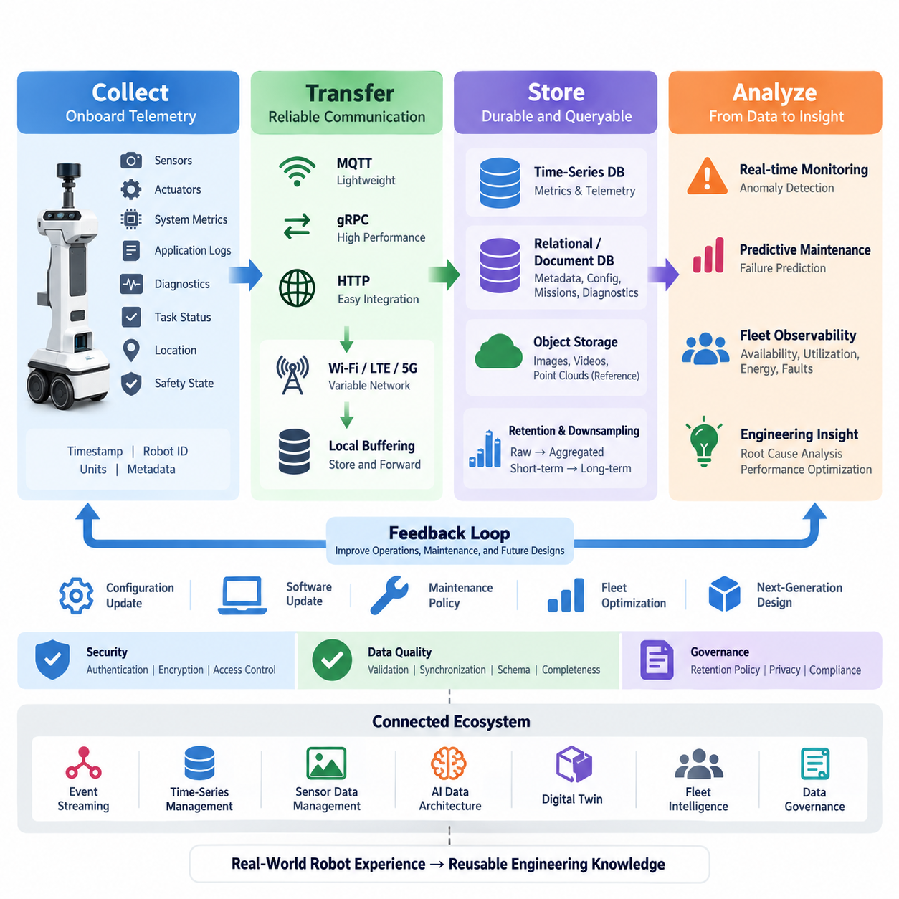
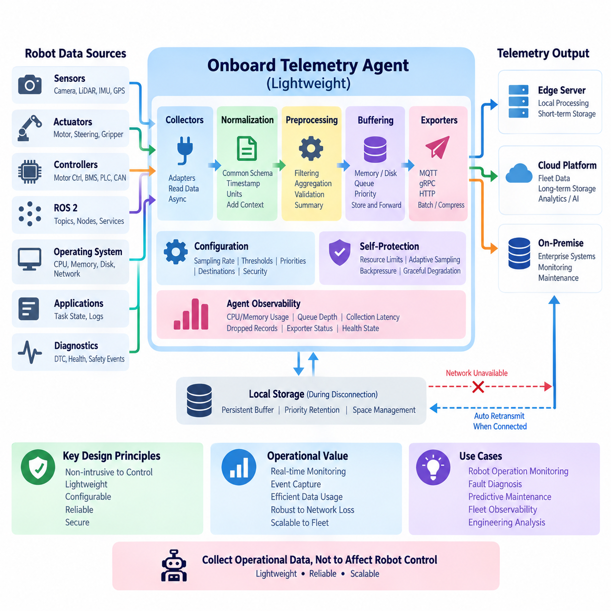
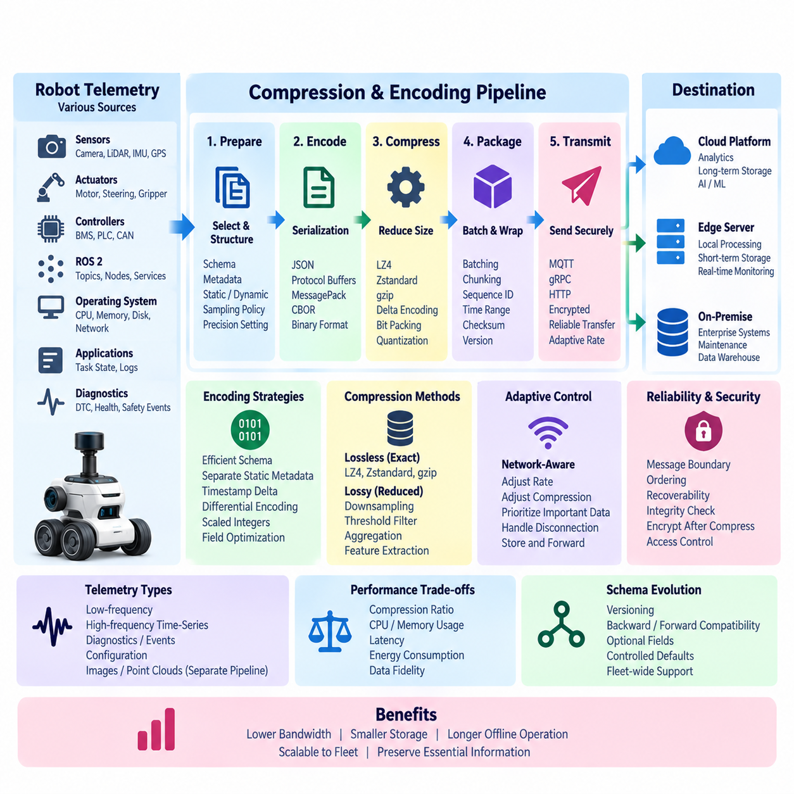
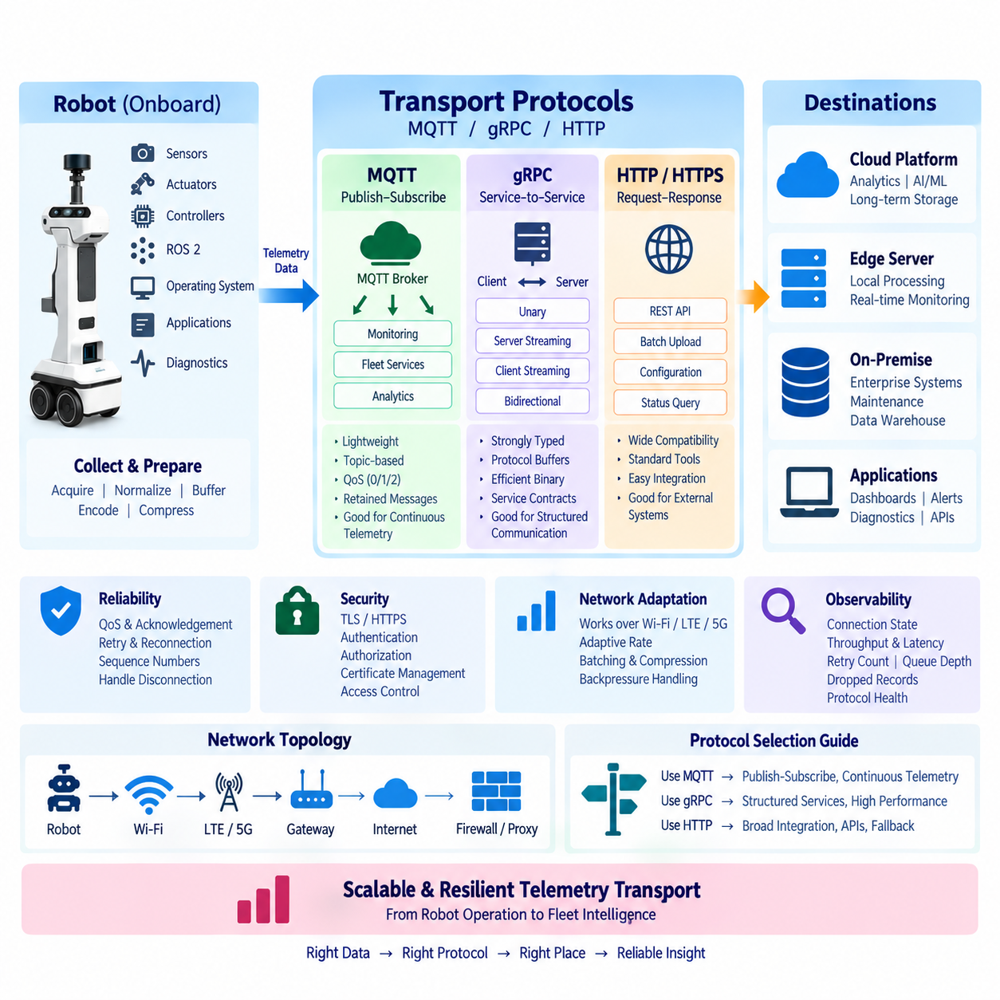
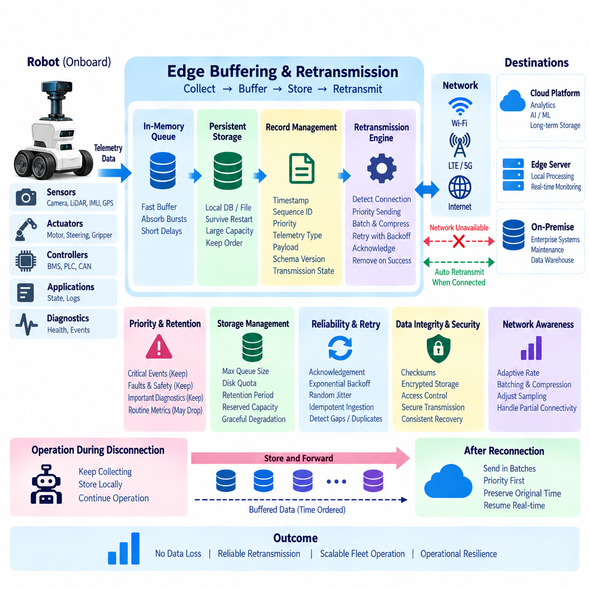
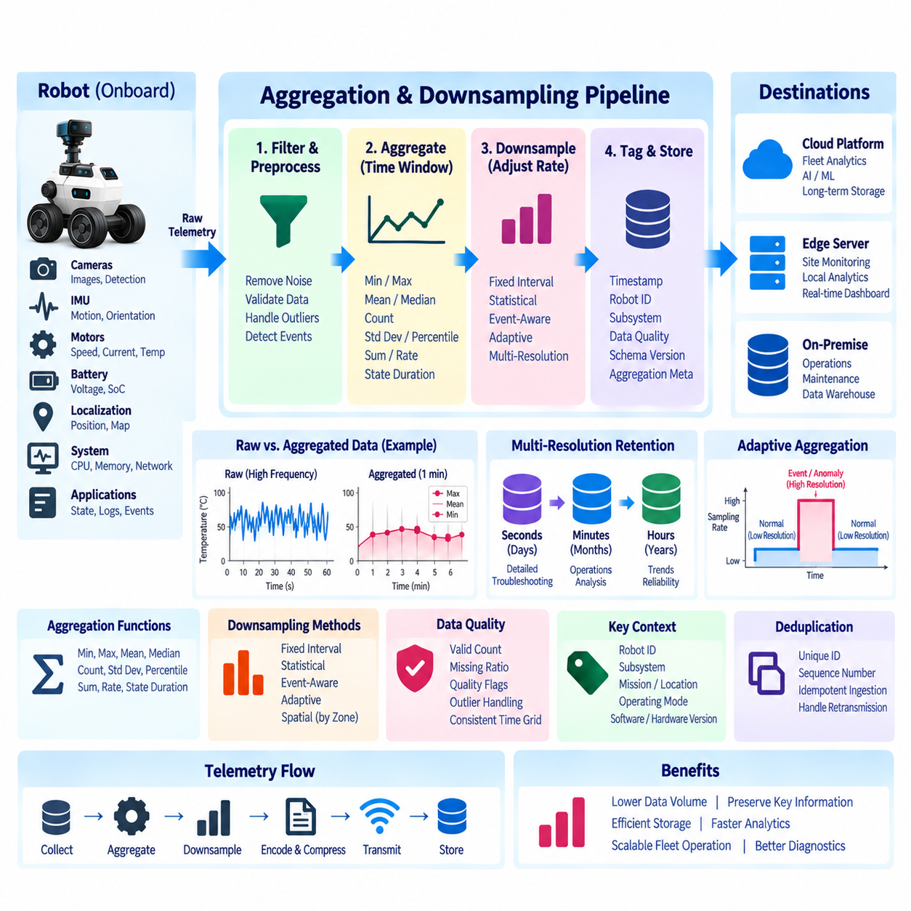
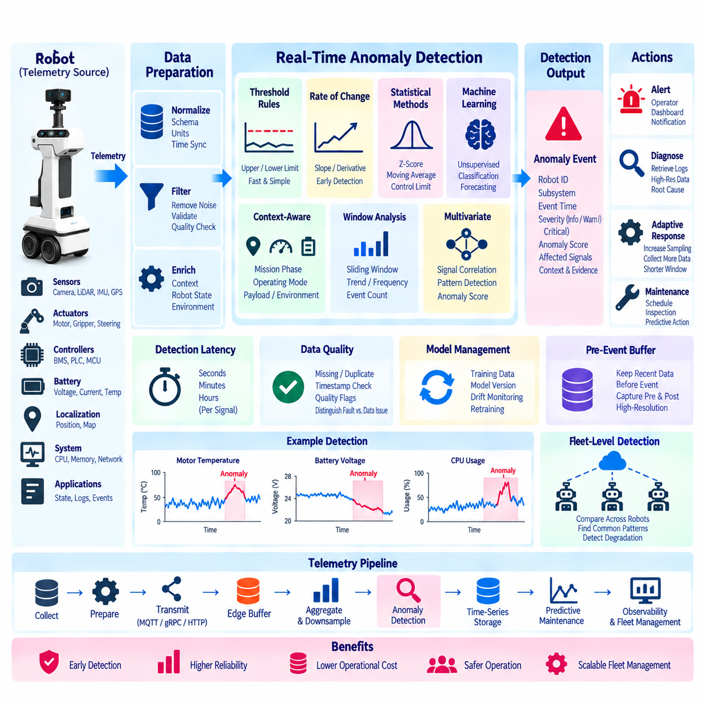
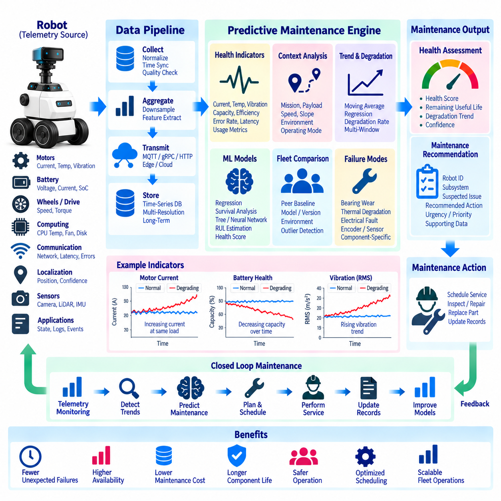
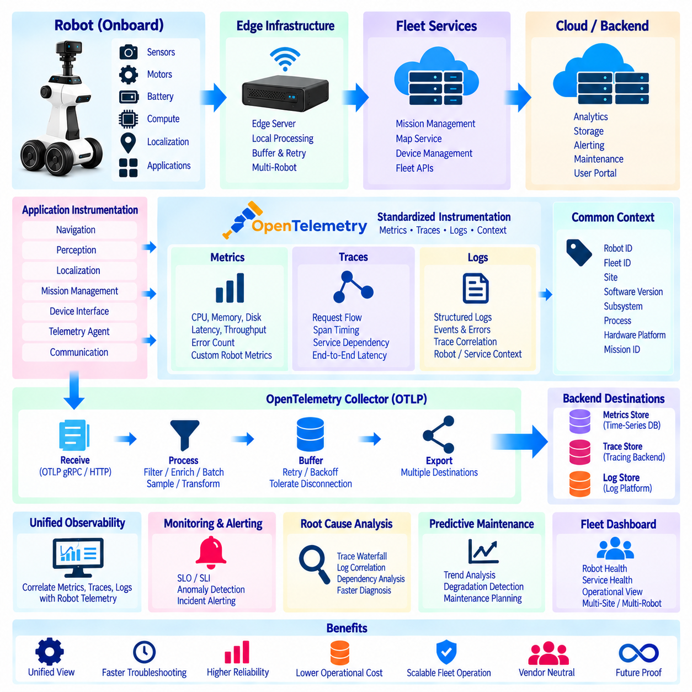
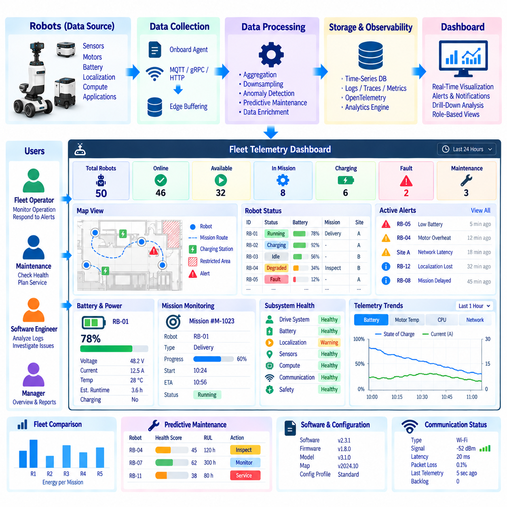

**Volume 07 Robot Data Architecture**


# 03. Telemetry Architecture

##  

## 03.01 Robot Telemetry Architecture: Collect, Transfer, Store, Analyze

{width="7.268055555555556in" height="7.268055555555556in"}

A robot telemetry architecture provides the continuous data foundation required to understand what a robot is doing, how its hardware and software are behaving, and whether the system is operating safely and efficiently. Within the Robot Data Architecture, telemetry forms a dedicated layer between onboard data generation and higher-level operational intelligence, following a recurring lifecycle of collect, transfer, store, and analyze.

The collect stage begins inside the robot, where telemetry originates from heterogeneous physical and software sources. Typical signals include battery voltage and current, motor temperature, wheel speed, CPU and GPU utilization, memory usage, network quality, localization confidence, task status, diagnostic codes, and safety states. Collection should preserve timestamps, robot identity, signal definitions, units, and quality metadata so downstream systems can interpret each observation consistently.

Telemetry collection should be separated from the robot\'s safety-critical control loops. A lightweight onboard telemetry agent can subscribe to selected ROS 2 topics, operating-system metrics, controller interfaces, application logs, and diagnostic channels without disturbing deterministic control behavior. Sampling frequency should reflect operational value: rapidly changing control-related measurements may require high rates, while configuration or health summaries can be collected much less frequently.

Raw robot data should not automatically be treated as telemetry that must leave the robot. Cameras, LiDAR point clouds, audio, and other high-bandwidth sensor streams can overwhelm communication and storage resources if continuously transmitted. The collection architecture therefore applies filtering, aggregation, event triggering, compression, and selective recording so that operational telemetry remains lightweight while important raw sensor evidence can be retained separately when required.

The transfer stage moves selected telemetry from onboard systems toward edge servers, on-premise infrastructure, fleet platforms, or cloud services. MQTT is suitable for lightweight publish-subscribe telemetry, while gRPC can support structured high-performance service communication and HTTP-based interfaces can simplify integration with conventional applications. The architecture should select transport mechanisms according to latency, bandwidth, reliability, interoperability, and deployment constraints.

Connectivity cannot be assumed to remain stable for mobile robots. Indoor AMRs may move through Wi-Fi coverage gaps, while outdoor robots can experience variable LTE or 5G quality. An effective telemetry architecture therefore uses local buffering and store-and-forward behavior. Messages that cannot be transmitted immediately are temporarily persisted, assigned sequence information, and retransmitted when connectivity returns, reducing gaps in the operational history.

Telemetry transport also requires explicit delivery and prioritization policies. Emergency stops, safety faults, critical temperatures, localization failures, and mission-blocking errors should receive higher priority than routine performance measurements. Systems may combine periodic transmission for normal metrics with event-driven transmission for abnormal conditions, allowing communication resources to focus on information that has immediate operational significance while still maintaining historical visibility.

The store stage converts incoming telemetry streams into durable and queryable operational records. Time-series databases are well suited to timestamped measurements such as temperatures, currents, velocities, resource utilization, and battery state, while relational or document-oriented stores can maintain robot metadata, configurations, missions, and diagnostic context. Large sensor artifacts can be referenced from object storage rather than inserted directly into telemetry databases.

Storage architecture should preserve relationships among robot ID, fleet ID, mission ID, timestamp, software version, hardware configuration, location, and operating state. These dimensions make telemetry useful beyond simple monitoring because engineers can compare behavior across robots, deployments, firmware releases, environments, and missions. Schema versioning is especially important when robot generations or software updates introduce new signals or change the interpretation of existing measurements.

Not all telemetry needs to remain at its original resolution forever. High-frequency data can be retained for a short diagnostic window and subsequently downsampled into minute, hourly, or daily summaries. Retention policies can distinguish operational monitoring data, failure evidence, engineering datasets, and long-term fleet statistics. This reduces storage cost while preserving the information required for trend analysis, reliability engineering, and lifecycle evaluation.

The analyze stage transforms stored and streaming telemetry into operational knowledge. Real-time rules can identify threshold violations, missing heartbeats, communication degradation, abnormal power consumption, excessive temperatures, or localization instability. More advanced analytics can combine multiple signals to recognize patterns that would not be visible from a single measurement, providing earlier indications of component degradation or system-level anomalies.

Historical telemetry enables predictive maintenance by revealing how equipment condition changes over time. Motor current, vibration, temperature, battery impedance, charging behavior, actuator load, and fault frequency can become features for statistical or machine-learning models. Rather than waiting for a component to fail, maintenance systems can estimate degradation trends, identify unusual behavior relative to comparable robots, and schedule inspection based on evidence accumulated during actual operation.

Telemetry also provides the foundation for fleet-level observability. Individual robot measurements can be aggregated into dashboards showing availability, utilization, mission completion, energy consumption, fault distribution, network health, and subsystem performance. Operators can move from fleet-wide indicators to a specific robot, mission, or time interval, while engineering teams can correlate operational symptoms with software versions, configuration changes, and environmental conditions.

The complete architecture should therefore be understood as a closed operational data loop rather than a one-way upload pipeline. Robots collect physical and software state, communication layers transfer selected information, storage systems maintain current and historical records, and analytical services convert those records into alerts, diagnostics, maintenance decisions, fleet optimization, and engineering feedback. The resulting knowledge can then influence configuration, software updates, maintenance policies, and future robot designs.

A mature implementation also treats telemetry quality as an architectural requirement. Missing timestamps, inconsistent units, duplicated messages, clock drift, invalid values, and schema mismatches can produce misleading analysis even when communication itself succeeds. Validation should therefore occur throughout the lifecycle, with synchronization, schema contracts, sequence tracking, range checks, completeness metrics, and provenance information supporting trustworthy interpretation of robot behavior.

Security and governance must span every stage of the telemetry lifecycle. Robot identities should be authenticated, communication channels protected, access controlled according to operational roles, and sensitive information separated from ordinary engineering metrics. Retention and deletion policies should reflect the type of data being collected, particularly when robot telemetry can be associated with images, locations, people, facilities, or customer operations.

The Collect--Transfer--Store--Analyze model ultimately creates a common data backbone connecting robot operation with observability, diagnostics, predictive maintenance, digital twins, fleet intelligence, and AI development. In the broader software architecture, this telemetry layer complements event streaming, time-series management, sensor-data management, AI data architecture, digital-twin data, and governance, allowing operational experience from deployed robots to become reusable engineering knowledge.

로봇 텔레메트리 아키텍처(Robot Telemetry Architecture)는 로봇이 무엇을 수행하고 있는지, 하드웨어(Hardware)와 소프트웨어(Software)가 어떤 상태인지, 시스템이 안전하고 효율적으로 운영되는지를 지속적으로 파악하기 위한 데이터 기반을 제공한다. 로봇 데이터 아키텍처(Robot Data Architecture)에서 텔레메트리(Telemetry)는 온보드 데이터 생성(Onboard Data Generation)과 상위 운영 지능(Operational Intelligence)을 연결하며, 수집(Collect), 전송(Transfer), 저장(Store), 분석(Analyze)의 반복적인 생명주기(Lifecycle)를 따른다.

수집 단계(Collect Stage)는 로봇 내부에서 시작되며, 텔레메트리 데이터(Telemetry Data)는 다양한 물리적 장치와 소프트웨어 소스(Software Source)에서 생성된다. 대표적인 데이터에는 배터리 전압과 전류, 모터 온도, 휠 속도, CPU 및 GPU 사용률, 메모리 사용량, 네트워크 품질, 위치추정 신뢰도(Localization Confidence), 작업 상태(Task Status), 진단 코드(Diagnostic Code), 안전 상태(Safety State) 등이 포함된다.

수집된 데이터는 단순한 측정값만으로 구성되어서는 안 된다. 각 데이터에는 타임스탬프(Timestamp), 로봇 식별자(Robot ID), 신호 정의(Signal Definition), 측정 단위(Unit), 데이터 품질 메타데이터(Data Quality Metadata)가 함께 관리되어야 한다. 이러한 정보가 일관되게 유지되어야 이후의 저장 및 분석 시스템에서 서로 다른 로봇과 센서에서 발생한 데이터를 정확하게 해석하고 비교할 수 있다.

텔레메트리 수집(Telemetry Collection)은 로봇의 안전 필수 제어 루프(Safety-Critical Control Loop)와 분리하는 것이 중요하다. 경량 온보드 텔레메트리 에이전트(Lightweight Onboard Telemetry Agent)는 결정론적 제어(Deterministic Control)에 영향을 주지 않으면서 ROS 2 토픽(Topic), 운영체제 메트릭(OS Metrics), 제어기 인터페이스(Controller Interface), 애플리케이션 로그(Application Log), 진단 채널(Diagnostic Channel)에서 필요한 데이터를 수집할 수 있다.

모든 데이터에 동일한 수집 주기(Sampling Frequency)를 적용할 필요는 없다. 빠르게 변화하는 제어 관련 신호는 높은 주파수로 수집할 수 있지만, 설정 정보(Configuration Information)나 시스템 상태 요약(Health Summary)은 상대적으로 낮은 주기로 수집할 수 있다. 데이터의 변화 속도와 운영상 중요도에 따라 적절한 수집 주기를 정의하면 로봇의 컴퓨팅 및 저장 자원을 효율적으로 사용할 수 있다.

로봇에서 생성되는 모든 원시 데이터(Raw Data)를 외부로 전송해야 하는 텔레메트리로 간주해서는 안 된다. 카메라(Camera), 라이다(LiDAR) 포인트 클라우드(Point Cloud), 오디오(Audio)와 같은 고대역폭 센서 스트림(High-Bandwidth Sensor Stream)을 지속적으로 전송하면 통신과 저장 자원이 빠르게 소모된다. 따라서 필터링(Filtering), 집계(Aggregation), 이벤트 트리거(Event Trigger), 압축(Compression), 선택적 기록(Selective Recording)이 필요하다.

전송 단계(Transfer Stage)는 선택된 텔레메트리를 로봇의 온보드 시스템(Onboard System)에서 엣지 서버(Edge Server), 온프레미스 인프라(On-Premise Infrastructure), 플릿 플랫폼(Fleet Platform), 클라우드 서비스(Cloud Service)로 전달한다. MQTT는 경량 발행-구독(Publish-Subscribe) 방식에 적합하고, gRPC는 구조화된 고성능 서비스 통신에 활용할 수 있으며, HTTP 기반 인터페이스는 기존 응용 시스템과의 통합을 단순화할 수 있다.

통신 방식은 하나의 프로토콜(Protocol)을 모든 상황에 적용하기보다 지연시간(Latency), 대역폭(Bandwidth), 신뢰성(Reliability), 상호운용성(Interoperability), 배포 환경(Deployment Environment)을 고려하여 선택해야 한다. 실시간 상태 정보와 일반적인 운영 데이터, 대용량 진단 데이터는 서로 요구사항이 다르므로 데이터의 특성에 따라 전송 경로와 프로토콜을 구분하는 것이 효율적이다.

이동 로봇(Mobile Robot)의 네트워크 연결은 항상 안정적이라고 가정할 수 없다. 실내 자율이동로봇(AMR)은 Wi-Fi 음영지역을 통과할 수 있고, 실외 로봇은 LTE 또는 5G의 통신 품질이 지속적으로 변할 수 있다. 따라서 효과적인 텔레메트리 아키텍처는 로컬 버퍼링(Local Buffering)과 저장 후 전달(Store-and-Forward) 메커니즘을 사용하여 일시적인 통신 장애에 대응해야 한다.

즉시 전송할 수 없는 메시지는 로봇 내부에 임시 저장되고 시퀀스 정보(Sequence Information)를 부여받은 후 연결이 복구되면 재전송(Retransmission)될 수 있다. 이를 통해 통신 장애가 발생하더라도 운영 기록의 데이터 손실을 최소화할 수 있다. 특히 장시간 현장에서 동작하는 로봇에서는 네트워크 연결 상태와 관계없이 연속적인 데이터 이력(Data History)을 확보하는 것이 중요하다.

텔레메트리 전송에는 명확한 전달 정책(Delivery Policy)과 우선순위 정책(Priority Policy)도 필요하다. 비상 정지(Emergency Stop), 안전 오류(Safety Fault), 임계 온도(Critical Temperature), 위치추정 실패(Localization Failure), 임무 중단 오류(Mission-Blocking Error)는 일반적인 성능 데이터보다 높은 우선순위를 가져야 한다. 정상 데이터는 주기적으로 전송하고 이상 상황은 이벤트 기반(Event-Driven)으로 즉시 전달하는 방식을 함께 사용할 수 있다.

저장 단계(Store Stage)는 수신된 텔레메트리 스트림(Telemetry Stream)을 지속적으로 보존하면서 검색과 분석이 가능한 운영 기록으로 변환한다. 시계열 데이터베이스(Time-Series Database)는 온도, 전류, 속도, 컴퓨팅 자원 사용률, 배터리 상태와 같이 시간에 따라 변화하는 데이터를 저장하는 데 적합하다. 로봇 메타데이터(Metadata), 설정, 임무, 진단 정보는 관계형 또는 문서형 저장소와 함께 관리할 수 있다.

이미지, 영상, 포인트 클라우드처럼 용량이 큰 센서 데이터(Sensor Data)는 텔레메트리 데이터베이스에 직접 저장하기보다 객체 저장소(Object Storage)에 보관하고 참조 정보만 연결하는 구조가 효율적이다. 이를 통해 비교적 작은 운영 메트릭(Operational Metrics)과 대용량 센서 데이터의 저장 특성을 분리하면서도 동일한 로봇, 임무, 시간 정보를 기준으로 필요한 데이터를 다시 연결할 수 있다.

저장 아키텍처(Storage Architecture)는 로봇 식별자(Robot ID), 플릿 식별자(Fleet ID), 임무 식별자(Mission ID), 타임스탬프(Timestamp), 소프트웨어 버전(Software Version), 하드웨어 구성(Hardware Configuration), 위치(Location), 운영 상태(Operating State) 사이의 관계를 유지해야 한다. 이러한 차원을 활용하면 서로 다른 로봇, 배포 환경, 소프트웨어 버전 및 임무 조건의 성능을 체계적으로 비교할 수 있다.

모든 텔레메트리 데이터를 최초 해상도(Original Resolution)로 영구 보관할 필요는 없다. 고주파 데이터(High-Frequency Data)는 장애 분석을 위해 일정 기간 원본으로 유지한 후 분, 시간, 일 단위의 요약 데이터로 다운샘플링(Downsampling)할 수 있다. 보존 정책(Retention Policy)을 운영 모니터링, 장애 분석, 엔지니어링 데이터셋, 장기 플릿 통계 등의 목적에 따라 구분하면 저장 비용을 줄이면서 필요한 정보는 유지할 수 있다.

분석 단계(Analyze Stage)는 저장되거나 실시간으로 유입되는 텔레메트리를 운영 지식(Operational Knowledge)으로 변환한다. 실시간 규칙(Real-Time Rule)을 이용하면 임계값 초과, 하트비트 손실(Missing Heartbeat), 통신 품질 저하, 비정상적인 전력 소비, 과도한 온도 상승, 위치추정 불안정 등을 탐지할 수 있다. 이러한 분석 결과는 경고(Alert), 진단(Diagnostics), 운영 대응으로 연결된다.

보다 발전된 분석에서는 여러 텔레메트리 신호를 결합하여 하나의 측정값만으로는 확인하기 어려운 이상 패턴(Anomaly Pattern)을 탐지한다. 예를 들어 모터 전류, 온도, 진동, 주행 부하를 함께 분석하면 단순한 임계값 기반 감시보다 부품 열화(Component Degradation)를 빠르게 발견할 가능성이 높아진다. 이는 상태 기반 유지보수(Condition-Based Maintenance)의 중요한 기반이 된다.

과거 텔레메트리(Historical Telemetry)는 예지정비(Predictive Maintenance, PdM)를 구현하는 핵심 데이터가 된다. 모터 전류, 진동, 온도, 배터리 임피던스(Battery Impedance), 충전 특성, 액추에이터 부하(Actuator Load), 오류 발생 빈도 등을 통계 모델이나 머신러닝 모델(Machine Learning Model)의 특징값(Feature)으로 사용할 수 있다.

이러한 분석을 통해 부품이 실제로 고장 날 때까지 기다리는 대신 열화 추세(Degradation Trend)를 추정하고, 동일한 유형의 다른 로봇과 비교하여 비정상적인 동작을 식별할 수 있다. 또한 실제 운영 과정에서 축적된 데이터에 근거하여 점검과 부품 교체 시점을 결정할 수 있으므로 시간 기반 유지보수(Time-Based Maintenance)에서 데이터 기반 유지보수(Data-Driven Maintenance)로 발전할 수 있다.

텔레메트리는 플릿 수준 관측가능성(Fleet-Level Observability)의 기반이기도 하다. 개별 로봇의 측정 데이터를 집계하면 가용성(Availability), 활용률(Utilization), 임무 완료율(Mission Completion), 에너지 소비(Energy Consumption), 오류 분포(Fault Distribution), 네트워크 상태(Network Health), 하위 시스템 성능(Subsystem Performance)을 하나의 운영 환경에서 모니터링할 수 있다.

운영자는 플릿 전체 지표(Fleet-Wide Indicator)에서 특정 로봇, 임무 또는 시간 구간으로 단계적으로 상세 분석할 수 있다. 엔지니어링 팀은 운영 중 나타난 이상 현상을 소프트웨어 버전, 설정 변경(Configuration Change), 하드웨어 구성, 환경 조건과 연계하여 분석할 수 있다. 결과적으로 텔레메트리는 단순한 상태 표시를 넘어 장애 원인 분석(Root Cause Analysis)을 지원하는 데이터 기반이 된다.

전체 텔레메트리 아키텍처는 단방향 데이터 업로드 파이프라인(One-Way Data Upload Pipeline)이 아니라 폐쇄형 운영 데이터 루프(Closed Operational Data Loop)로 이해해야 한다. 로봇이 물리적 상태와 소프트웨어 상태를 수집하고, 통신 계층이 데이터를 전달하며, 저장 시스템이 현재와 과거 기록을 관리하고, 분석 서비스가 이를 운영 의사결정에 사용할 수 있는 정보로 변환한다.

분석 결과는 다시 로봇 설정(Configuration), 소프트웨어 업데이트(Software Update), 유지보수 정책(Maintenance Policy), 플릿 최적화(Fleet Optimization), 차세대 로봇 설계에 반영될 수 있다. 따라서 수집(Collect) → 전송(Transfer) → 저장(Store) → 분석(Analyze)은 한 번으로 끝나는 데이터 처리 과정이 아니라 로봇 시스템을 지속적으로 개선하는 순환 구조를 형성한다.

성숙한 텔레메트리 시스템은 데이터 품질(Data Quality) 자체를 핵심 아키텍처 요구사항으로 취급해야 한다. 누락된 타임스탬프, 서로 다른 측정 단위, 중복 메시지, 시계 드리프트(Clock Drift), 비정상 값, 스키마 불일치(Schema Mismatch)는 통신이 정상적으로 이루어져도 잘못된 분석 결과를 만들 수 있다. 따라서 전체 데이터 생명주기에서 지속적인 검증이 필요하다.

이를 위해 시간 동기화(Time Synchronization), 스키마 계약(Schema Contract), 시퀀스 추적(Sequence Tracking), 범위 검사(Range Check), 데이터 완전성 지표(Completeness Metric), 데이터 출처 정보(Data Provenance)를 관리해야 한다. 이러한 품질 관리 체계가 구축되어야 텔레메트리를 기반으로 한 장애 분석, 예지정비, AI 학습 및 장기 성능 평가 결과에 대한 신뢰성을 확보할 수 있다.

보안(Security)과 데이터 거버넌스(Data Governance) 역시 텔레메트리 생명주기 전체에 적용되어야 한다. 로봇의 신원(Robot Identity)을 인증하고 통신 채널을 보호하며, 운영 역할에 따라 접근 권한(Access Control)을 제한해야 한다. 또한 일반적인 엔지니어링 메트릭과 민감 데이터(Sensitive Data)를 분리하여 관리하는 구조가 필요하다.

특히 로봇 텔레메트리가 이미지, 위치, 사람, 시설 또는 고객 운영 정보와 연결될 수 있는 경우에는 데이터 유형에 따라 보존 및 삭제 정책(Retention and Deletion Policy)을 정의해야 한다. 텔레메트리 시스템은 데이터를 많이 수집하는 것 자체를 목표로 하기보다 운영과 분석에 필요한 데이터를 명확한 목적과 정책에 따라 안전하게 관리하도록 설계되어야 한다.

결과적으로 수집--전송--저장--분석(Collect--Transfer--Store--Analyze) 모델은 로봇 운영과 관측가능성(Observability), 진단(Diagnostics), 예지정비(Predictive Maintenance), 디지털 트윈(Digital Twin), 플릿 인텔리전스(Fleet Intelligence), AI 개발을 연결하는 공통 데이터 백본(Data Backbone)을 형성한다.

이 텔레메트리 계층(Telemetry Layer)은 이벤트 스트리밍(Event Streaming), 시계열 데이터 관리(Time-Series Data Management), 센서 데이터 관리(Sensor Data Management), AI 데이터 아키텍처(AI Data Architecture), 디지털 트윈 데이터(Digital Twin Data), 데이터 거버넌스(Data Governance)와 결합된다. 이를 통해 현장에서 운용되는 로봇의 실제 경험을 재사용 가능한 엔지니어링 지식(Engineering Knowledge)으로 전환할 수 있다.

##  

## 03.02 Telemetry Collection Agent Design: Onboard Lightweight [w/Code]

{width="7.268055555555556in" height="7.268055555555556in"}

An onboard telemetry collection agent is a lightweight software component responsible for observing the operational state of a robot and converting selected measurements into structured telemetry without interfering with the robot's primary control functions. Within the telemetry architecture, it forms the first software layer of the collection stage, connecting sensors, controllers, ROS 2 nodes, operating-system resources, diagnostics, and application services to downstream telemetry pipelines.

The most important design principle is isolation from safety-critical and real-time control paths. Motor control, steering, localization, obstacle avoidance, and emergency functions must continue operating even if the telemetry agent crashes, becomes overloaded, or loses network connectivity. The agent should therefore observe existing interfaces asynchronously whenever possible rather than becoming a mandatory intermediary through which control commands or safety signals must pass.

A lightweight design begins by defining exactly which signals provide operational value. Typical sources include battery voltage, current and state of charge, motor temperature and current, wheel velocity, localization status, CPU and GPU utilization, memory consumption, disk capacity, network quality, task state, diagnostic codes, software health, and safety events. Collecting every available signal at maximum frequency creates unnecessary computational, network, and storage overhead.

The agent should support multiple data adapters so heterogeneous robot subsystems can be observed through a common collection framework. ROS 2 topic subscribers can acquire middleware-level information, while operating-system collectors obtain processor, memory, storage, process, and network metrics. Hardware adapters can communicate with motor controllers, battery management systems, PLCs, CAN interfaces, serial devices, or dedicated diagnostic services without forcing these sources to adopt one internal implementation.

After acquisition, measurements should be normalized into a consistent telemetry representation. Each record should contain a timestamp, robot identifier, signal or metric name, value, engineering unit, source, and relevant quality information. Additional context such as mission ID, software version, operating mode, subsystem identifier, or location reference may be attached when necessary. This normalization prevents downstream applications from depending directly on device-specific data formats.

Time handling is especially important because robot telemetry originates from components operating at different frequencies and sometimes using different clocks. The collection agent should preserve the original measurement timestamp whenever available and distinguish it from collection or transmission time. Clock synchronization mechanisms such as NTP, PTP, or hardware-assisted synchronization can improve correlation among telemetry, sensor recordings, diagnostic events, and control behavior.

Sampling policies should be configurable by signal class rather than fixed globally. CPU temperature may only require periodic sampling, while motor current or vibration can require substantially higher rates for condition monitoring. Configuration parameters can define collection frequency, aggregation interval, threshold conditions, priority, retention behavior, and transmission policy, allowing the same telemetry agent architecture to support different robot platforms and operational environments.

Adaptive collection can further reduce resource consumption. During normal operation, a signal may be collected or transmitted at a relatively low rate, but an abnormal condition can temporarily increase sampling frequency. For example, rising motor temperature or repeated localization errors may trigger higher-resolution collection of related signals. This approach preserves detailed evidence around important events without continuously generating high-volume telemetry.

The telemetry agent should distinguish periodic metrics from event-driven information. Resource utilization and battery measurements naturally fit periodic sampling, whereas emergency stops, controller faults, mission transitions, charging events, localization failures, and safety alarms should be captured immediately as events. Supporting both patterns allows the collection layer to represent slowly changing operational conditions and sudden state transitions through the same overall architecture.

Local preprocessing can significantly reduce unnecessary data transmission. The agent may perform filtering, aggregation, unit conversion, basic validation, duplicate suppression, or calculation of summary statistics before data leaves the robot. High-frequency measurements can be represented by minimum, maximum, mean, variance, or selected samples over a defined interval when full-resolution transmission is unnecessary. Raw values can still be retained temporarily when diagnostic detail is required.

Resource limits must be explicit because the agent shares onboard computing resources with navigation, perception, planning, AI inference, and control software. CPU utilization, memory allocation, disk I/O, network bandwidth, and thread activity should therefore remain bounded. Queues should have defined limits, collection operations should avoid uncontrolled blocking, and expensive processing should be excluded from the agent whenever it can be performed more efficiently at an edge server or backend system.

A robust internal architecture commonly separates acquisition, normalization, buffering, and transmission responsibilities. Collectors read data from individual sources, a normalization layer converts measurements into common schemas, a local queue or buffer absorbs short-term differences between collection and transmission rates, and exporters deliver telemetry through configured protocols. This separation allows individual adapters or transport mechanisms to change without redesigning the complete agent.

Local buffering becomes essential when communication is intermittent. The agent should continue collecting important telemetry even when Wi-Fi, LTE, 5G, or an upstream server becomes temporarily unavailable. Buffered records can be stored in memory for short disruptions and moved to persistent local storage when outages continue. Once connectivity returns, retransmission can resume while preserving timestamps and sequence information so the backend can reconstruct the operational timeline.

Buffer management requires clear policies because onboard storage is finite. Critical faults and safety-related events may receive stronger persistence guarantees than routine metrics, while old low-priority records may be downsampled or removed when storage pressure increases. Priority-aware queues, maximum retention periods, disk quotas, and backpressure mechanisms prevent telemetry collection from exhausting storage resources needed by navigation, logging, or other robot applications.

Transmission should be decoupled from acquisition so network latency does not directly affect collectors. MQTT can support lightweight publish-subscribe telemetry, gRPC can provide efficient structured communication, and HTTP-based exporters can integrate with conventional backend services. The agent may batch multiple records, compress payloads, or adjust transmission intervals according to network conditions while maintaining a stable internal telemetry schema independent of the transport protocol.

Reliability also requires protection against duplicate or missing records. Sequence numbers, unique message identifiers, timestamps, acknowledgement policies, and retry logic can help downstream systems determine whether telemetry has been delivered completely. Depending on the operational requirement, the system may accept occasional loss for low-priority metrics while applying stronger delivery guarantees to diagnostic, safety, or maintenance-related information.

The collection agent itself must be observable. It should expose its own CPU and memory usage, queue depth, collection latency, dropped-record count, buffer utilization, transmission failures, reconnect attempts, and exporter status. A telemetry system that cannot report the health of its collection mechanism can create dangerous blind spots because missing data may otherwise be incorrectly interpreted as normal robot behavior rather than failure of the monitoring infrastructure.

Self-protection mechanisms can keep the agent lightweight during abnormal conditions. If CPU load becomes excessive, network bandwidth decreases, or local storage approaches capacity, the agent can reduce low-priority sampling, increase aggregation, delay bulk transmission, or discard expendable records according to predefined policies. Safety and critical diagnostic telemetry should remain protected from such degradation whenever system resources permit.

Configuration should be externalized rather than embedded throughout source code. Robot-specific configuration can define enabled collectors, topic names, device interfaces, sampling frequencies, thresholds, priorities, buffer sizes, destinations, and security parameters. Version-controlled configuration also makes deployments reproducible and allows fleet operators to compare telemetry behavior across robot models, software releases, customer sites, and operational profiles.

Security begins with minimizing the agent's privileges. It should receive only the permissions required to read designated telemetry sources and write to approved local buffers or communication endpoints. Credentials and certificates should not be hard-coded, while encrypted transport and authenticated endpoints should protect telemetry leaving the robot. Access to sensitive sensor, location, diagnostic, or customer-related information should follow the broader data-governance policy.

Deployment and lifecycle management are equally important for fleet-scale operation. The telemetry agent should start automatically with the robot software environment, recover after failure, expose clear health states, and support controlled configuration and software updates. Containerized deployment may simplify dependency management on capable onboard computers, while smaller embedded platforms may require a native service optimized for minimal memory and startup overhead.

Testing should verify not only whether the agent collects correct values but also whether it remains harmless under failure conditions. Engineers should evaluate disconnected networks, unavailable topics, malformed measurements, full disks, slow backend services, clock changes, process restarts, excessive message rates, and corrupted configuration. The central requirement is graceful degradation: telemetry failures must not propagate into failures of navigation, control, perception, or safety functions.

When designed correctly, the lightweight onboard telemetry collection agent becomes a standardized boundary between robot execution and the broader data platform. It converts heterogeneous runtime information into consistent, timestamped, quality-aware records while controlling resource consumption and tolerating unreliable communication. This creates a dependable input for later compression, transport, buffering, aggregation, anomaly detection, predictive maintenance, unified observability, and fleet dashboards defined throughout the telemetry architecture.

온보드 텔레메트리 수집 에이전트(Onboard Telemetry Collection Agent)는 로봇의 운영 상태를 관찰하고, 선택된 측정 데이터를 구조화된 텔레메트리(Structured Telemetry)로 변환하는 경량 소프트웨어 구성요소(Lightweight Software Component)이다. 이 과정은 로봇의 주요 제어 기능에 영향을 주지 않아야 한다. 텔레메트리 아키텍처(Telemetry Architecture)에서는 수집 단계(Collection Stage)의 첫 번째 소프트웨어 계층으로 동작하며, 센서, 제어기, ROS 2 노드(Node), 운영체제 자원, 진단 기능, 애플리케이션 서비스를 이후의 텔레메트리 파이프라인(Telemetry Pipeline)과 연결한다.

가장 중요한 설계 원칙은 안전 필수 및 실시간 제어 경로(Safety-Critical and Real-Time Control Path)로부터 텔레메트리 기능을 분리하는 것이다. 모터 제어, 조향, 위치추정(Localization), 장애물 회피(Obstacle Avoidance), 비상 기능은 텔레메트리 에이전트가 중단되거나 과부하되거나 네트워크 연결을 잃더라도 계속 동작해야 한다. 따라서 에이전트는 제어 명령이나 안전 신호가 반드시 통과해야 하는 중간 구성요소가 되기보다 기존 인터페이스를 가능한 한 비동기 방식(Asynchronous Method)으로 관찰하도록 설계해야 한다.

경량 설계(Lightweight Design)는 어떤 신호가 실제 운영에 필요한 가치를 제공하는지 명확하게 정의하는 것에서 시작한다. 대표적인 데이터 소스에는 배터리 전압, 전류 및 충전 상태(State of Charge), 모터 온도와 전류, 휠 속도, 위치추정 상태, CPU 및 GPU 사용률, 메모리 사용량, 디스크 용량, 네트워크 품질, 작업 상태(Task State), 진단 코드(Diagnostic Code), 소프트웨어 상태(Software Health), 안전 이벤트(Safety Event) 등이 포함된다. 사용 가능한 모든 신호를 최대 주파수로 수집하면 불필요한 연산, 네트워크 및 저장 부하가 발생한다.

에이전트는 서로 다른 로봇 하위 시스템(Robot Subsystem)을 공통 수집 프레임워크(Collection Framework)를 통해 관찰할 수 있도록 여러 종류의 데이터 어댑터(Data Adapter)를 지원해야 한다. ROS 2 토픽 구독자(Topic Subscriber)는 미들웨어 수준의 정보를 수집할 수 있고, 운영체제 수집기(OS Collector)는 프로세서, 메모리, 저장장치, 프로세스 및 네트워크 메트릭을 수집할 수 있다. 하드웨어 어댑터는 모터 제어기, 배터리 관리 시스템(BMS), PLC, CAN 인터페이스, 직렬 장치 또는 전용 진단 서비스와 통신할 수 있다.

데이터를 획득한 이후에는 측정값을 일관된 텔레메트리 표현(Telemetry Representation)으로 정규화(Normalization)해야 한다. 각 레코드에는 타임스탬프(Timestamp), 로봇 식별자(Robot ID), 신호 또는 메트릭 이름, 값(Value), 공학 단위(Engineering Unit), 데이터 소스(Source), 관련 품질 정보(Quality Information)가 포함되어야 한다. 필요한 경우 임무 식별자(Mission ID), 소프트웨어 버전, 운영 모드(Operating Mode), 하위 시스템 식별자 또는 위치 참조 정보(Location Reference)와 같은 추가 컨텍스트(Context)를 포함할 수 있다.

시간 관리(Time Handling)는 로봇 텔레메트리가 서로 다른 주파수로 동작하고 경우에 따라 서로 다른 시계를 사용하는 구성요소에서 생성되기 때문에 특히 중요하다. 수집 에이전트는 원래 측정 타임스탬프(Original Measurement Timestamp)가 존재하는 경우 이를 보존하고, 수집 시간(Collection Time) 또는 전송 시간(Transmission Time)과 구분해야 한다. NTP, PTP 또는 하드웨어 지원 동기화(Hardware-Assisted Synchronization)를 활용하면 텔레메트리, 센서 기록, 진단 이벤트 및 제어 동작 사이의 시간적 상관관계를 향상시킬 수 있다.

샘플링 정책(Sampling Policy)은 전체 시스템에 하나의 고정값을 적용하기보다 신호 종류(Signal Class)에 따라 설정할 수 있어야 한다. CPU 온도는 주기적인 저속 샘플링으로 충분할 수 있지만, 모터 전류나 진동 데이터는 상태 모니터링(Condition Monitoring)을 위해 훨씬 높은 주파수가 필요할 수 있다. 설정 파라미터(Configuration Parameter)를 통해 수집 주파수, 집계 주기(Aggregation Interval), 임계 조건, 우선순위, 보존 방식 및 전송 정책을 정의하면 동일한 에이전트 구조를 다양한 로봇 플랫폼과 운영 환경에 적용할 수 있다.

적응형 수집(Adaptive Collection)을 적용하면 자원 사용량을 더욱 줄일 수 있다. 정상 운전 중에는 특정 신호를 비교적 낮은 주기로 수집하거나 전송하고, 이상 상태가 발생하면 일시적으로 샘플링 주파수를 높일 수 있다. 예를 들어 모터 온도가 상승하거나 위치추정 오류가 반복적으로 발생하면 관련 신호를 더 높은 해상도로 수집하도록 전환할 수 있다. 이러한 방식은 지속적으로 대량의 텔레메트리를 생성하지 않으면서 중요한 이벤트 주변의 상세한 데이터를 확보할 수 있게 한다.

텔레메트리 에이전트는 주기적 메트릭(Periodic Metrics)과 이벤트 기반 정보(Event-Driven Information)를 구분해야 한다. 자원 사용률과 배터리 측정값은 주기적인 샘플링 방식에 적합하지만, 비상 정지(Emergency Stop), 제어기 오류, 임무 상태 전환(Mission Transition), 충전 이벤트, 위치추정 실패 및 안전 경보(Safety Alarm)는 이벤트 발생 즉시 수집되어야 한다. 두 방식을 함께 지원하면 천천히 변화하는 운영 상태와 갑작스러운 상태 변화를 하나의 전체 아키텍처에서 표현할 수 있다.

로컬 전처리(Local Preprocessing)를 적용하면 불필요한 데이터 전송량을 크게 줄일 수 있다. 에이전트는 데이터가 로봇 외부로 전송되기 전에 필터링(Filtering), 집계(Aggregation), 단위 변환(Unit Conversion), 기본 검증(Basic Validation), 중복 제거(Duplicate Suppression), 요약 통계(Summary Statistics) 계산을 수행할 수 있다. 전체 해상도의 데이터 전송이 필요하지 않은 경우 고주파 측정값을 일정 시간 구간의 최솟값, 최댓값, 평균, 분산 또는 선택된 샘플로 표현할 수 있으며, 상세 진단이 필요한 경우 원시값(Raw Value)을 임시로 유지할 수 있다.

에이전트는 내비게이션(Navigation), 인지(Perception), 계획(Planning), AI 추론(AI Inference), 제어 소프트웨어와 온보드 컴퓨팅 자원을 공유하므로 명확한 자원 제한(Resource Limit)이 필요하다. CPU 사용률, 메모리 할당, 디스크 입출력(Disk I/O), 네트워크 대역폭 및 스레드 활동(Thread Activity)은 제한된 범위 내에서 관리되어야 한다. 큐(Queue)는 명확한 크기 제한을 가져야 하고, 수집 작업은 제어되지 않는 블로킹(Uncontrolled Blocking)을 피해야 하며, 비용이 큰 처리는 가능한 경우 엣지 서버(Edge Server) 또는 백엔드 시스템(Backend System)에서 수행하는 것이 효율적이다.

견고한 내부 아키텍처(Robust Internal Architecture)는 일반적으로 데이터 획득(Acquisition), 정규화(Normalization), 버퍼링(Buffering), 전송(Transmission)의 책임을 분리한다. 수집기(Collector)는 개별 데이터 소스에서 정보를 읽고, 정규화 계층은 측정값을 공통 스키마(Common Schema)로 변환한다. 로컬 큐 또는 버퍼는 수집 속도와 전송 속도 사이의 단기적인 차이를 흡수하며, 익스포터(Exporter)는 설정된 프로토콜을 통해 텔레메트리를 전달한다. 이러한 분리는 개별 어댑터나 전송 방식이 변경되더라도 전체 에이전트를 다시 설계하지 않도록 한다.

통신이 간헐적으로 불안정한 환경에서는 로컬 버퍼링(Local Buffering)이 필수적이다. 에이전트는 Wi-Fi, LTE, 5G 또는 상위 서버와의 연결이 일시적으로 끊어지더라도 중요한 텔레메트리를 계속 수집해야 한다. 짧은 통신 장애에서는 메모리에 데이터를 버퍼링하고, 장애가 장시간 지속되면 영구 로컬 저장소(Persistent Local Storage)로 이동할 수 있다. 연결이 복구되면 원래 타임스탬프와 시퀀스 정보(Sequence Information)를 유지한 상태에서 재전송을 시작하여 백엔드가 실제 운영 시간순서를 복원할 수 있도록 한다.

온보드 저장공간은 유한하므로 버퍼 관리(Buffer Management)에는 명확한 정책이 필요하다. 중요 장애와 안전 관련 이벤트에는 일반적인 메트릭보다 높은 영속성 보장(Persistence Guarantee)을 적용할 수 있으며, 저장공간이 부족해지면 오래된 저우선순위 데이터를 다운샘플링(Downsampling)하거나 삭제할 수 있다. 우선순위 인식 큐(Priority-Aware Queue), 최대 보존 기간, 디스크 할당량(Disk Quota), 백프레셔(Backpressure) 메커니즘을 사용하면 텔레메트리 수집으로 인해 내비게이션, 로깅 또는 다른 로봇 애플리케이션에 필요한 저장공간이 고갈되는 것을 방지할 수 있다.

네트워크 지연이 수집기에 직접 영향을 주지 않도록 전송(Transmission)은 데이터 획득과 분리되어야 한다. MQTT는 경량 발행-구독(Publish-Subscribe) 텔레메트리를 지원할 수 있고, gRPC는 효율적인 구조화 통신(Structured Communication)에 사용할 수 있으며, HTTP 기반 익스포터(HTTP-Based Exporter)는 기존 백엔드 서비스와 통합할 수 있다. 에이전트는 여러 레코드를 배치(Batch)하거나 페이로드(Payload)를 압축하고, 네트워크 상태에 따라 전송 간격을 조절하면서도 전송 프로토콜과 독립된 안정적인 내부 텔레메트리 스키마를 유지할 수 있다.

신뢰성(Reliability)을 확보하려면 중복되거나 누락된 레코드에 대한 보호 기능도 필요하다. 시퀀스 번호(Sequence Number), 고유 메시지 식별자(Unique Message Identifier), 타임스탬프, 확인응답 정책(Acknowledgement Policy), 재시도 로직(Retry Logic)을 사용하면 하위 시스템에서 텔레메트리가 완전하게 전달되었는지를 판단할 수 있다. 운영 요구사항에 따라 낮은 우선순위 메트릭에서는 일부 데이터 손실을 허용하면서 진단, 안전 또는 유지보수 관련 정보에는 더 강력한 전달 보장을 적용할 수 있다.

수집 에이전트 자체도 관측 가능(Observable)해야 한다. 자신의 CPU 및 메모리 사용량, 큐 깊이(Queue Depth), 수집 지연(Collection Latency), 삭제된 레코드 수(Dropped-Record Count), 버퍼 사용률, 전송 실패, 재연결 시도 및 익스포터 상태를 외부에 제공해야 한다. 수집 메커니즘 자체의 상태를 확인할 수 없는 텔레메트리 시스템은 데이터 누락을 정상적인 로봇 동작으로 잘못 해석할 수 있으므로 심각한 관측 사각지대(Observability Blind Spot)를 만들 수 있다.

자기 보호 메커니즘(Self-Protection Mechanism)은 비정상적인 상황에서도 에이전트를 경량 상태로 유지하도록 한다. CPU 부하가 과도하게 증가하거나 네트워크 대역폭이 감소하거나 로컬 저장공간이 한계에 가까워지면, 에이전트는 사전에 정의된 정책에 따라 낮은 우선순위 데이터의 샘플링을 줄이고, 집계 수준을 높이며, 대용량 전송을 지연하거나 불필요한 레코드를 폐기할 수 있다. 시스템 자원이 허용하는 범위에서는 안전 및 중요 진단 텔레메트리를 이러한 성능 저하로부터 보호해야 한다.

설정(Configuration)은 소스 코드 곳곳에 직접 삽입하기보다 외부화(Externalization)해야 한다. 로봇별 설정을 통해 활성화할 수집기, 토픽 이름, 장치 인터페이스, 샘플링 주파수, 임계값, 우선순위, 버퍼 크기, 전송 목적지 및 보안 파라미터를 정의할 수 있다. 버전 관리되는 설정(Version-Controlled Configuration)을 사용하면 배포 결과를 재현할 수 있으며, 서로 다른 로봇 모델, 소프트웨어 릴리스, 고객 현장 및 운영 프로파일 사이에서 텔레메트리 동작을 비교할 수 있다.

보안(Security)은 에이전트의 권한을 최소화하는 것에서 시작한다. 지정된 텔레메트리 소스를 읽고 승인된 로컬 버퍼 또는 통신 엔드포인트(Communication Endpoint)에 기록하는 데 필요한 권한만 부여해야 한다. 인증정보(Credential)와 인증서(Certificate)는 코드에 하드코딩하지 않아야 하며, 암호화된 전송(Encrypted Transport)과 인증된 엔드포인트(Authenticated Endpoint)를 통해 로봇 외부로 전달되는 텔레메트리를 보호해야 한다. 민감한 센서, 위치, 진단 또는 고객 관련 데이터에 대한 접근은 전체 데이터 거버넌스(Data Governance) 정책을 따라야 한다.

플릿 규모(Fleet Scale)의 운영에서는 배포 및 생명주기 관리(Deployment and Lifecycle Management)도 중요하다. 텔레메트리 에이전트는 로봇 소프트웨어 환경과 함께 자동으로 시작되고, 장애 발생 후 복구되며, 명확한 상태 정보(Health State)를 제공하고, 통제된 설정 및 소프트웨어 업데이트를 지원해야 한다. 충분한 성능의 온보드 컴퓨터에서는 컨테이너 기반 배포(Containerized Deployment)가 의존성 관리를 단순화할 수 있으며, 소형 임베디드 플랫폼에서는 최소한의 메모리와 시작 오버헤드에 최적화된 네이티브 서비스(Native Service)가 적합할 수 있다.

테스트(Testing)는 에이전트가 올바른 값을 수집하는지만 확인하는 것이 아니라 장애 상황에서도 로봇에 영향을 주지 않는지를 검증해야 한다. 네트워크 단절, 사용할 수 없는 토픽, 잘못된 측정값, 디스크 공간 부족, 느린 백엔드 서비스, 시스템 시간 변경, 프로세스 재시작, 과도한 메시지 발생률, 손상된 설정 등을 평가해야 한다. 핵심 요구사항은 우아한 성능 저하(Graceful Degradation)이며, 텔레메트리 장애가 내비게이션, 제어, 인지 또는 안전 기능의 장애로 전파되어서는 안 된다.

올바르게 설계된 경량 온보드 텔레메트리 수집 에이전트(Lightweight Onboard Telemetry Collection Agent)는 로봇 실행 환경과 광범위한 데이터 플랫폼 사이의 표준화된 경계(Standardized Boundary)가 된다. 다양한 런타임 정보(Runtime Information)를 일관된 타임스탬프 기반의 품질 인식 레코드(Quality-Aware Record)로 변환하면서 자원 사용을 제어하고 불안정한 통신 환경을 견딜 수 있어야 한다. 이를 통해 이후의 압축(Compression), 전송(Transport), 버퍼링(Buffering), 집계(Aggregation), 이상 탐지(Anomaly Detection), 예지정비(Predictive Maintenance), 통합 관측가능성(Unified Observability), 플릿 대시보드(Fleet Dashboard)를 위한 신뢰성 높은 데이터 입력 기반을 구축할 수 있다.

##  

## 03.03 Telemetry Data Compression and Encoding [w/Code]

{width="7.268055555555556in" height="7.268055555555556in"}

Telemetry compression and encoding are essential mechanisms for reducing the communication, storage, and processing cost of continuously generated robot data while preserving the information required for monitoring, diagnostics, predictive maintenance, and fleet analysis. In mobile robots, telemetry must often traverse bandwidth-constrained Wi-Fi, LTE, or 5G links, making efficient representation a fundamental part of the telemetry architecture rather than an optional optimization.

Compression and encoding address related but different problems. Encoding defines how telemetry values, timestamps, identifiers, status fields, and metadata are represented in a transferable binary or textual format. Compression reduces the size of that encoded representation by removing redundancy. A well-designed pipeline therefore defines a structured schema first, serializes the telemetry efficiently, and then applies compression when the expected reduction justifies its computational cost.

Human-readable formats such as JSON are convenient during development, debugging, and integration because engineers can inspect messages directly and many software systems support them natively. However, repeated field names, textual numbers, delimiters, and metadata can produce significant overhead when thousands of measurements are transmitted continuously. JSON can remain useful at external APIs while compact binary encoding is used internally for high-rate robot telemetry.

Binary serialization formats such as Protocol Buffers, MessagePack, CBOR, or similar schema-oriented representations can substantially reduce payload size compared with verbose textual formats. Numeric values are stored using compact binary representations, while schemas allow sender and receiver to interpret fields consistently. Protocol Buffers are particularly useful when telemetry interfaces require strongly defined message contracts and controlled schema evolution across robot and backend software versions.

The encoding schema should reflect the characteristics of telemetry rather than treating every measurement as an independent generic object. Robot ID, subsystem identity, units, software version, and other slowly changing metadata do not need to be repeated with every sample when they can be represented once at the session, batch, or stream level. Separating static metadata from rapidly changing values reduces redundancy before any general-purpose compression algorithm is applied.

Timestamps deserve special treatment because they appear in nearly every telemetry record and frequently increase by predictable intervals. Instead of repeatedly transmitting full absolute timestamps, a stream can encode an initial timestamp followed by time deltas. When sampling intervals are stable, delta-of-delta techniques can represent changes using very small values. Similar approaches can be applied to monotonically increasing counters, sequence numbers, odometry values, and other correlated measurements.

Numeric telemetry often changes gradually between adjacent samples, creating opportunities for differential encoding. Rather than storing every temperature, voltage, position, or speed as a complete value, the system can encode the difference from a previous sample or reference value. Small differences generally require fewer bits than full values, particularly when combined with variable-length integer encoding, bit packing, or specialized time-series compression techniques.

Floating-point measurements require careful treatment because unnecessary precision increases data volume. A temperature sensor may not provide meaningful information at six decimal places, and battery state or CPU utilization may tolerate bounded quantization. Converting suitable measurements to scaled integers can reduce payload size significantly. The acceptable precision must be defined per signal so compression never removes information required for control analysis, diagnostics, safety investigation, or engineering validation.

Lossless compression preserves the exact encoded telemetry and is generally appropriate for diagnostic records, safety events, configuration information, fault codes, and measurements whose original values may be required later. Algorithms such as LZ4, Zstandard, gzip, or platform-specific alternatives offer different trade-offs among compression ratio, CPU usage, memory consumption, and latency. The best choice depends on onboard resources, network conditions, message size, and backend compatibility.

Fast algorithms with moderate compression can be preferable onboard because telemetry processing shares CPU and memory resources with perception, localization, navigation, planning, and AI inference. Achieving the smallest possible file is not necessarily the correct objective if compression consumes excessive processor time or introduces transmission latency. The architecture should optimize total system cost by balancing payload reduction against compute utilization, energy consumption, and real-time operational requirements.

Lossy reduction can be appropriate for selected high-frequency signals when exact reconstruction is unnecessary. Downsampling, quantization, threshold-based suppression, deadband filtering, and statistical aggregation can reduce telemetry volume before serialization and compression. For example, a stable temperature may only need transmission when it changes beyond a defined threshold, while high-rate vibration measurements may be summarized by statistical or spectral features for routine monitoring.

Lossy methods must be signal-aware because telemetry classes have different engineering significance. Emergency events, diagnostic trouble codes, safety transitions, calibration values, and critical state changes should normally remain exact. In contrast, routine utilization metrics or slowly changing environmental measurements may tolerate controlled reduction. Compression policy should therefore be defined through telemetry metadata and configuration rather than applied uniformly to every stream.

Batching can improve compression efficiency by combining multiple telemetry records before encoding or transmission. Repeated patterns across adjacent records become easier for compression algorithms to exploit, and protocol overhead is amortized across many measurements. However, larger batches increase buffering requirements and delivery latency. Safety-related or urgent events should bypass long batching intervals even when routine telemetry is transmitted in larger compressed blocks.

Compression should be integrated with the onboard buffering architecture. Data stored during temporary network outages can be encoded and compressed before being written to persistent storage, extending the amount of telemetry that can survive prolonged disconnection. When connectivity returns, compressed batches can be retransmitted without repeating expensive transformations, provided the format contains sufficient version, ordering, timestamp, and integrity information for reliable reconstruction.

Network-aware compression can dynamically adjust behavior according to communication conditions. When bandwidth is abundant, the robot may transmit telemetry at higher resolution with minimal compression to reduce CPU cost. When LTE or 5G quality deteriorates, the system can increase aggregation, use stronger compression, reduce low-priority sampling, or delay noncritical data. Such adaptation allows telemetry quality and resource consumption to respond to real operating conditions.

Compression and encoding must preserve message boundaries, ordering, and recoverability. A corrupted compressed block should not make an excessive period of telemetry unusable. Chunking streams into independently decodable segments limits the impact of corruption and simplifies retry operations. Each chunk can include sequence information, schema version, time range, record count, compression method, and checksum so receivers can validate completeness before accepting the reconstructed data.

Schema evolution is particularly important for long-lived robot fleets. New software versions may introduce additional telemetry fields, modify optional metadata, or deprecate older measurements while older robots remain deployed. Encoding formats should therefore support backward and forward compatibility where practical. Field identifiers, optional values, explicit schema versions, and controlled defaults allow telemetry producers and consumers to evolve without requiring simultaneous fleet-wide upgrades.

Compression must occur in the correct order relative to encryption. Structured telemetry is normally serialized and compressed before transport encryption because encrypted data has intentionally high entropy and compresses poorly. The pipeline can therefore follow normalization, encoding, batching, compression, integrity protection, and secure transmission. Security design must also prevent compression mechanisms from exposing sensitive information through inappropriate cross-context processing or metadata leakage.

The telemetry agent should measure whether compression is actually beneficial. Useful metrics include original payload size, compressed size, compression ratio, encoding latency, compression latency, CPU consumption, memory use, queue delay, and decompression failures. These measurements allow engineers to compare algorithms and policies under real workloads rather than selecting a compression method solely from theoretical benchmark results.

Different telemetry classes may ultimately use different encoding profiles. Low-frequency configuration and diagnostic information can prioritize readability and compatibility, routine operational metrics can use compact binary serialization, and high-rate time-series streams can employ delta encoding, batching, and specialized compression. Large camera images or point clouds should normally follow dedicated sensor-data compression pipelines rather than being forced into the general telemetry representation.

At fleet scale, even modest reductions in message size can produce substantial savings because telemetry is generated continuously across many robots. Reduced bandwidth lowers communication cost, smaller buffers extend offline operating time, and compact storage improves long-term retention efficiency. Efficient encoding also reduces backend ingestion and I/O load, allowing telemetry infrastructure to scale from individual prototypes to hundreds or thousands of deployed robots.

The overall design objective is therefore not maximum compression but efficient preservation of operational information. A successful telemetry compression and encoding architecture reduces redundant bytes while maintaining timestamps, ordering, precision, semantic meaning, reliability, and compatibility. Combined with collection agents, transport protocols, edge buffering, aggregation, anomaly detection, predictive maintenance, and observability, it creates an efficient data path from robot operation to fleet intelligence.

텔레메트리 압축 및 인코딩(Telemetry Compression and Encoding)은 지속적으로 생성되는 로봇 데이터의 통신, 저장 및 처리 비용을 줄이면서 모니터링(Monitoring), 진단(Diagnostics), 예지정비(Predictive Maintenance), 플릿 분석(Fleet Analysis)에 필요한 정보를 보존하기 위한 핵심 메커니즘이다. 이동 로봇(Mobile Robot)의 텔레메트리는 대역폭이 제한된 Wi-Fi, LTE 또는 5G 네트워크를 통해 전송되는 경우가 많기 때문에 효율적인 데이터 표현은 선택적인 최적화가 아니라 텔레메트리 아키텍처(Telemetry Architecture)의 기본 요소가 된다.

압축(Compression)과 인코딩(Encoding)은 서로 연관되어 있지만 서로 다른 문제를 해결한다. 인코딩은 텔레메트리 값, 타임스탬프(Timestamp), 식별자, 상태 필드 및 메타데이터(Metadata)를 전송 가능한 바이너리 또는 텍스트 형식으로 표현하는 방법을 정의한다. 압축은 이렇게 인코딩된 데이터에서 중복성을 제거하여 크기를 줄인다. 따라서 잘 설계된 파이프라인은 먼저 구조화된 스키마(Schema)를 정의하고, 텔레메트리를 효율적으로 직렬화(Serialization)한 다음 계산 비용 대비 충분한 효과가 있을 경우 압축을 적용한다.

JSON과 같은 사람이 읽을 수 있는 형식(Human-Readable Format)은 개발, 디버깅(Debugging), 시스템 통합 과정에서 엔지니어가 메시지를 직접 확인할 수 있고 다양한 소프트웨어 시스템에서 기본적으로 지원되기 때문에 편리하다. 그러나 반복되는 필드 이름, 텍스트 형태의 숫자, 구분자 및 메타데이터는 수천 개의 측정값을 지속적으로 전송할 경우 상당한 오버헤드(Overhead)를 발생시킨다. 따라서 외부 API에서는 JSON을 사용하면서 내부 고주파 로봇 텔레메트리에는 압축된 바이너리 인코딩(Binary Encoding)을 적용할 수 있다.

프로토콜 버퍼(Protocol Buffers), 메시지팩(MessagePack), CBOR 또는 이와 유사한 스키마 중심 표현 방식(Schema-Oriented Representation)의 바이너리 직렬화(Binary Serialization)는 장황한 텍스트 형식과 비교하여 페이로드(Payload) 크기를 크게 줄일 수 있다. 숫자 데이터는 압축된 바이너리 형태로 저장되며, 스키마를 통해 송신자와 수신자가 필드를 일관되게 해석할 수 있다. 특히 프로토콜 버퍼는 명확한 메시지 계약(Message Contract)과 로봇 및 백엔드 소프트웨어 버전 사이의 체계적인 스키마 진화(Schema Evolution)가 필요한 경우 유용하다.

인코딩 스키마(Encoding Schema)는 모든 측정값을 독립적인 범용 객체로 처리하기보다 텔레메트리의 특성을 반영해야 한다. 로봇 식별자(Robot ID), 하위 시스템 식별정보, 측정 단위, 소프트웨어 버전 등 천천히 변경되는 메타데이터는 모든 샘플에 반복해서 포함할 필요가 없다. 이러한 정보는 세션(Session), 배치(Batch), 스트림(Stream) 수준에서 한 번만 표현할 수 있다. 정적 메타데이터와 빠르게 변화하는 측정값을 분리하면 일반적인 압축 알고리즘을 적용하기 전부터 데이터 중복을 줄일 수 있다.

타임스탬프(Timestamp)는 거의 모든 텔레메트리 레코드에 포함되고 일정한 간격으로 증가하는 경우가 많기 때문에 특별한 처리가 필요하다. 전체 절대 시간을 매번 전송하는 대신 최초 타임스탬프를 기록하고 이후에는 시간 차이(Time Delta)를 인코딩할 수 있다. 샘플링 간격이 일정한 경우 델타-오브-델타(Delta-of-Delta) 기법을 통해 변화량을 매우 작은 값으로 표현할 수 있다. 이와 유사한 방식은 단조 증가 카운터, 시퀀스 번호(Sequence Number), 오도메트리(Odometry) 값 등 상관관계가 높은 측정값에도 적용할 수 있다.

수치형 텔레메트리(Numeric Telemetry)는 인접한 샘플 사이에서 점진적으로 변화하는 경우가 많기 때문에 차분 인코딩(Differential Encoding)을 적용할 수 있다. 모든 온도, 전압, 위치 또는 속도를 완전한 값으로 저장하는 대신 이전 샘플이나 기준값과의 차이를 인코딩할 수 있다. 작은 변화량은 일반적으로 전체 값보다 적은 비트로 표현할 수 있으며, 가변 길이 정수 인코딩(Variable-Length Integer Encoding), 비트 패킹(Bit Packing), 특화된 시계열 압축(Time-Series Compression) 기법과 결합하면 더욱 효율적이다.

부동소수점 측정값(Floating-Point Measurement)은 불필요한 정밀도가 데이터 크기를 증가시키므로 신중하게 처리해야 한다. 예를 들어 온도 센서는 소수점 여섯 자리까지 의미 있는 정보를 제공하지 않을 수 있으며, 배터리 상태나 CPU 사용률도 제한된 양자화(Quantization)를 허용할 수 있다. 적절한 측정값을 스케일 정수(Scaled Integer)로 변환하면 페이로드 크기를 크게 줄일 수 있다. 다만 허용 가능한 정밀도는 신호별로 정의하여 제어 분석, 진단, 안전 조사 또는 엔지니어링 검증에 필요한 정보가 손실되지 않도록 해야 한다.

무손실 압축(Lossless Compression)은 인코딩된 텔레메트리를 정확하게 보존하며, 일반적으로 진단 기록, 안전 이벤트, 설정 정보, 오류 코드 및 향후 원본 값이 필요한 측정 데이터에 적합하다. LZ4, Zstandard, gzip 또는 플랫폼별 압축 방식은 압축률(Compression Ratio), CPU 사용량, 메모리 소비량 및 지연시간 사이에서 서로 다른 특성을 가진다. 최적의 방식은 온보드 자원, 네트워크 환경, 메시지 크기 및 백엔드 호환성을 고려하여 결정해야 한다.

온보드 환경에서는 빠른 처리 속도와 적절한 압축률을 제공하는 알고리즘이 더 적합할 수 있다. 텔레메트리 처리는 인지(Perception), 위치추정(Localization), 내비게이션(Navigation), 계획(Planning), AI 추론(AI Inference)과 CPU 및 메모리 자원을 공유하기 때문이다. 압축 과정에서 지나치게 많은 프로세서 자원을 사용하거나 전송 지연을 증가시킨다면 가장 작은 파일을 만드는 것이 반드시 최적의 목표는 아니다. 따라서 페이로드 감소량과 연산 자원, 에너지 소비, 실시간 운영 요구사항 사이의 균형을 고려해야 한다.

정확한 원본 복원이 필요하지 않은 일부 고주파 신호에는 손실형 축소(Lossy Reduction)를 적용할 수 있다. 다운샘플링(Downsampling), 양자화(Quantization), 임계값 기반 억제(Threshold-Based Suppression), 데드밴드 필터링(Deadband Filtering), 통계적 집계(Statistical Aggregation)를 사용하면 직렬화와 압축 이전에 텔레메트리 양을 줄일 수 있다. 예를 들어 안정적인 온도는 일정 임계값 이상 변화할 때만 전송하고, 고주파 진동 데이터는 일반적인 모니터링을 위해 통계 또는 주파수 특성으로 요약할 수 있다.

손실형 방식은 텔레메트리 종류마다 공학적 중요도가 다르기 때문에 신호 인식 방식(Signal-Aware Method)으로 적용해야 한다. 비상 이벤트, 진단 고장 코드(Diagnostic Trouble Code), 안전 상태 전환, 보정값(Calibration Value), 중요 상태 변화는 일반적으로 정확한 원본을 유지해야 한다. 반면 일반적인 자원 사용률이나 천천히 변화하는 환경 측정값에는 제한적인 데이터 축소를 적용할 수 있다. 따라서 압축 정책은 모든 스트림에 동일하게 적용하기보다 텔레메트리 메타데이터와 설정(Configuration)을 통해 정의해야 한다.

배치 처리(Batching)는 여러 텔레메트리 레코드를 인코딩 또는 전송 전에 결합하여 압축 효율을 높일 수 있다. 인접한 레코드 사이의 반복적인 패턴을 압축 알고리즘이 더욱 쉽게 활용할 수 있고, 프로토콜 오버헤드도 여러 측정값에 분산된다. 그러나 배치 크기가 증가하면 버퍼링 요구량과 전달 지연시간도 증가한다. 따라서 일반적인 텔레메트리는 큰 압축 배치로 전송하더라도 안전 관련 이벤트나 긴급 데이터는 긴 배치 주기를 우회하여 즉시 전달해야 한다.

압축은 온보드 버퍼링 아키텍처(Onboard Buffering Architecture)와 통합되어야 한다. 일시적인 네트워크 장애 동안 저장되는 데이터는 영구 저장소에 기록하기 전에 인코딩하고 압축할 수 있으며, 이를 통해 장시간 연결이 끊어져도 더 많은 텔레메트리를 보존할 수 있다. 네트워크가 복구되면 데이터 형식에 버전, 순서, 타임스탬프 및 무결성 정보가 충분히 포함되어 있다는 조건에서 이미 압축된 배치를 다시 변환하지 않고 재전송할 수 있다.

네트워크 인식 압축(Network-Aware Compression)은 통신 환경에 따라 동적으로 동작을 조정할 수 있다. 대역폭이 충분하면 CPU 비용을 줄이기 위해 최소한의 압축으로 높은 해상도의 텔레메트리를 전송할 수 있다. LTE 또는 5G 품질이 저하되면 집계 수준을 높이고, 더 강한 압축을 적용하며, 낮은 우선순위 신호의 샘플링을 줄이거나 중요하지 않은 데이터의 전송을 지연할 수 있다. 이러한 적응형 구조를 통해 실제 운영 환경에 따라 텔레메트리 품질과 자원 사용량을 조정할 수 있다.

압축 및 인코딩 과정에서는 메시지 경계(Message Boundary), 순서(Ordering), 복구 가능성(Recoverability)을 유지해야 한다. 하나의 압축 블록이 손상되었다고 해서 지나치게 긴 구간의 텔레메트리를 사용할 수 없게 되어서는 안 된다. 스트림을 독립적으로 디코딩 가능한 청크(Chunk)로 분리하면 데이터 손상의 영향을 제한하고 재전송을 단순화할 수 있다. 각 청크에는 시퀀스 정보, 스키마 버전, 시간 범위, 레코드 수, 압축 방식 및 체크섬(Checksum)을 포함하여 수신자가 복원된 데이터의 완전성을 검증할 수 있도록 한다.

장기간 운영되는 로봇 플릿에서는 스키마 진화(Schema Evolution)가 특히 중요하다. 새로운 소프트웨어 버전에서 추가 텔레메트리 필드가 도입되거나 선택적 메타데이터가 변경되고 기존 측정값이 더 이상 사용되지 않을 수 있지만, 구형 로봇은 계속 현장에서 운영될 수 있다. 따라서 인코딩 형식은 가능한 경우 이전 버전 호환성(Backward Compatibility)과 이후 버전 호환성(Forward Compatibility)을 지원해야 한다. 필드 식별자, 선택적 값, 명시적인 스키마 버전 및 통제된 기본값을 사용하면 전체 플릿을 동시에 업그레이드하지 않고도 생산자와 소비자를 발전시킬 수 있다.

압축은 암호화(Encryption)와의 처리 순서도 올바르게 설계해야 한다. 암호화된 데이터는 의도적으로 높은 엔트로피(Entropy)를 가지므로 일반적으로 압축 효율이 매우 낮다. 따라서 구조화된 텔레메트리는 일반적으로 전송 암호화를 적용하기 전에 직렬화하고 압축해야 한다. 전체 파이프라인은 정규화(Normalization), 인코딩, 배치 처리, 압축, 무결성 보호(Integrity Protection), 보안 전송(Secure Transmission)의 순서로 구성할 수 있다. 또한 압축 과정에서 민감한 정보가 부적절한 교차 컨텍스트 처리나 메타데이터 노출을 통해 유출되지 않도록 보안 측면을 고려해야 한다.

텔레메트리 에이전트(Telemetry Agent)는 압축이 실제로 효과적인지도 측정해야 한다. 유용한 지표에는 원본 페이로드 크기, 압축 후 크기, 압축률, 인코딩 지연시간, 압축 지연시간, CPU 사용량, 메모리 사용량, 큐 지연(Queue Delay), 압축 해제 실패(Decompression Failure) 등이 포함된다. 이러한 측정값을 활용하면 이론적인 벤치마크 결과만을 기준으로 압축 방식을 선택하는 대신 실제 로봇의 작업 부하(Workload)에서 알고리즘과 정책의 효과를 비교할 수 있다.

서로 다른 텔레메트리 종류에는 서로 다른 인코딩 프로파일(Encoding Profile)을 적용할 수 있다. 저주파 설정 및 진단 정보는 가독성과 호환성을 우선할 수 있고, 일반적인 운영 메트릭은 압축된 바이너리 직렬화를 사용할 수 있으며, 고주파 시계열 스트림은 델타 인코딩(Delta Encoding), 배치 처리 및 특화된 압축 방식을 사용할 수 있다. 대용량 카메라 이미지나 포인트 클라우드는 일반 텔레메트리 표현에 강제로 포함하기보다 전용 센서 데이터 압축 파이프라인(Sensor Data Compression Pipeline)을 사용하는 것이 적절하다.

플릿 규모(Fleet Scale)에서는 메시지 크기를 조금만 줄여도 많은 로봇에서 텔레메트리가 지속적으로 생성되기 때문에 전체적으로 상당한 비용 절감 효과를 얻을 수 있다. 대역폭 감소는 통신 비용을 줄이고, 작은 버퍼 데이터는 네트워크가 끊어진 상태에서 데이터를 더 오래 보존할 수 있게 하며, 압축된 저장 구조는 장기 데이터 보존 효율을 높인다. 효율적인 인코딩은 백엔드 데이터 수집(Backend Ingestion)과 입출력 부하도 감소시켜 단일 프로토타입부터 수백 또는 수천 대 규모의 로봇까지 텔레메트리 인프라를 확장할 수 있도록 한다.

따라서 전체 설계 목표는 최대 압축(Maximum Compression)이 아니라 운영 정보의 효율적인 보존(Efficient Preservation of Operational Information)이다. 성공적인 텔레메트리 압축 및 인코딩 아키텍처는 중복된 데이터 크기를 줄이면서 타임스탬프, 순서, 정밀도, 의미적 정보(Semantic Meaning), 신뢰성 및 호환성을 유지해야 한다. 수집 에이전트(Collection Agent), 전송 프로토콜(Transport Protocol), 엣지 버퍼링(Edge Buffering), 집계(Aggregation), 이상 탐지(Anomaly Detection), 예지정비(Predictive Maintenance), 관측가능성(Observability)과 결합함으로써 로봇 운영 데이터에서 플릿 인텔리전스(Fleet Intelligence)까지 이어지는 효율적인 데이터 경로를 구축할 수 있다.

##  

## 03.04 Telemetry Transport Protocol: MQTT, gRPC, HTTP

{width="7.268055555555556in" height="7.268055555555556in"}

Robot telemetry transport protocols define how operational data moves from onboard collection agents to edge servers, fleet platforms, on-premise infrastructure, and cloud services. MQTT, gRPC, and HTTP represent three complementary communication approaches rather than interchangeable alternatives. Their suitability depends on telemetry frequency, message size, latency, connection stability, delivery requirements, integration environment, and available onboard computing resources.

The transport layer should remain separated from telemetry acquisition and internal data representation. Collectors acquire measurements, normalization creates consistent schemas, buffering protects data during communication interruptions, and transport adapters deliver prepared records through the selected protocol. This separation allows a robot to change from MQTT to gRPC or HTTP without redesigning sensor interfaces, diagnostic collectors, sampling policies, or the underlying telemetry data model.

MQTT is particularly suitable for lightweight, continuous telemetry from mobile robots because it follows a publish-subscribe model. A robot publishes messages to logical topics, while interested applications subscribe through an MQTT broker. The producer does not need direct knowledge of every consumer, allowing monitoring dashboards, fleet services, maintenance systems, and analytics applications to receive the same telemetry stream without tightly coupling themselves to the robot.

Topic design becomes an important architectural decision in MQTT deployments. Topics can represent fleet, robot, subsystem, and telemetry category, enabling consumers to subscribe at different levels of granularity. A fleet monitoring service may receive health information from every robot, while a diagnostic application subscribes only to a specific robot or subsystem. Topic structures should remain predictable and stable so routing logic does not become dependent on frequently changing application details.

MQTT provides Quality of Service levels that allow delivery behavior to be selected according to telemetry importance. Routine measurements may tolerate occasional loss and use lower-overhead delivery, while important diagnostic events can request stronger delivery guarantees. Higher reliability introduces additional acknowledgements, state management, and network traffic, so the highest delivery level should not automatically be applied to every message simply because it appears safer.

Persistent sessions, retained information, and broker-side capabilities can further improve MQTT-based robot operations, but they must be used intentionally. A newly connected monitoring application may need the latest robot state without waiting for the next periodic update, while historical telemetry should normally remain the responsibility of dedicated storage systems. The MQTT broker should primarily support communication and distribution rather than becoming an uncontrolled long-term telemetry database.

MQTT is also effective under variable wireless connectivity because its relatively small protocol overhead fits bandwidth-constrained Wi-Fi, LTE, and 5G environments. Combined with onboard buffering, a robot can temporarily retain messages while disconnected and resume transmission when communication returns. Nevertheless, application-level sequence numbers, timestamps, and deduplication logic remain valuable because transport-level delivery behavior alone does not guarantee a complete and perfectly ordered operational history.

gRPC provides a different communication model based on strongly defined remote procedure calls and service contracts. It commonly uses Protocol Buffers to define message structures and supports efficient binary serialization. For robotics systems that require structured interactions between robot, edge, and backend services, gRPC provides explicit interfaces, typed messages, generated client and server code, and efficient communication without the verbosity associated with many text-based API formats.

Unary gRPC calls resemble conventional request-response operations, while streaming modes support longer-lived communication. Server streaming can return a sequence of updates from one request, client streaming can send multiple telemetry records efficiently, and bidirectional streaming can maintain simultaneous data exchange between endpoints. These patterns make gRPC useful when telemetry transfer is closely integrated with configuration, diagnostics, command services, or edge processing workflows.

The strong interface definition of gRPC is valuable for large software systems because producers and consumers share explicit message contracts. Field identifiers, optional values, versioning practices, and compatibility rules can support controlled schema evolution as robot software changes. However, this strength also requires disciplined interface governance. Poorly managed service definitions can create dependencies between robot and backend releases, particularly when compatibility is not considered during API evolution.

gRPC is generally more appropriate when the communication relationship is service-oriented and relatively direct. A robot may connect to an edge ingestion service, a diagnostic client may request structured status information, or an edge application may stream processed telemetry to a central platform. Unlike MQTT\'s broker-mediated publish-subscribe model, gRPC naturally represents explicit client-server relationships, making the two protocols useful for different architectural interaction patterns.

HTTP remains highly relevant because it offers broad interoperability with enterprise systems, web services, cloud platforms, and existing IT infrastructure. REST-style HTTP APIs can accept telemetry batches, expose robot status, retrieve configuration, or integrate operational data with external business applications. Standard tooling, proxies, gateways, authentication mechanisms, and monitoring systems make HTTP particularly attractive when robotics data must cross organizational or application boundaries.

For continuous high-frequency telemetry, sending every individual measurement as a separate HTTP request can create excessive headers, connection overhead, and backend processing load. HTTP therefore becomes more efficient when records are aggregated into batches or when it is used for lower-frequency status updates, configuration exchanges, historical uploads, and integration APIs. Persistent connections and modern HTTP versions can reduce overhead, but message design remains important for resource-constrained robots.

HTTP is also valuable as a fallback or compatibility transport because network infrastructure commonly permits HTTPS traffic even when specialized ports or protocols are restricted. This can simplify deployment at customer sites with strict firewall and proxy policies. However, compatibility should not be confused with universal optimality. A protocol that passes easily through enterprise infrastructure may still be inefficient for high-rate telemetry if every measurement is wrapped in a large textual request.

The choice among MQTT, gRPC, and HTTP should therefore begin with communication semantics rather than protocol popularity. Publish-subscribe distribution naturally favors MQTT, strongly typed service-to-service communication favors gRPC, and broadly interoperable request-response integration favors HTTP. A mature robot architecture can use all three simultaneously, assigning each protocol to the communication pattern where its characteristics provide the greatest operational value.

For example, routine robot health and fleet telemetry can flow through MQTT, structured edge services can communicate through gRPC, and external enterprise applications can access selected information through HTTPS APIs. This hybrid transport architecture avoids forcing one protocol to solve every communication problem. The internal telemetry schema can remain consistent while transport adapters map the same logical information into different delivery mechanisms for different consumers.

Transport selection must also consider network topology. Indoor robots may communicate primarily through managed Wi-Fi to an on-premise broker or edge server, while outdoor robots may rely on LTE or 5G connections with changing latency and temporary disconnections. Direct cloud connectivity may be appropriate in some deployments, whereas regulated, private, or industrial environments may require all telemetry to terminate first at an on-premise gateway or local edge platform.

Latency requirements should be classified by operational purpose. Safety-critical control should generally remain onboard and should not depend on remote telemetry transport. Near-real-time monitoring may tolerate hundreds of milliseconds, while historical engineering data can tolerate substantially longer delays. By separating control, operational monitoring, diagnostic transfer, and bulk historical upload, the architecture can avoid imposing unnecessary real-time requirements on every telemetry message.

Reliability must similarly be designed according to data importance. Routine utilization metrics may tolerate occasional loss, whereas fault events, maintenance evidence, and safety-related state changes may require acknowledgement, persistent buffering, retransmission, or application-level confirmation. Sequence numbers and timestamps allow receivers to detect missing or duplicated information regardless of whether MQTT, gRPC, or HTTP is used as the underlying transport mechanism.

Backpressure is necessary when telemetry is generated faster than the network or receiver can process it. MQTT publishers may encounter broker or connection limitations, gRPC streams can experience slow consumers, and HTTP upload endpoints may respond slowly or become temporarily unavailable. The robot should respond by buffering, batching, reducing low-priority sampling, or applying aggregation rather than allowing transport congestion to consume unlimited memory or interfere with navigation and control workloads.

Security requirements apply consistently across all transport options. MQTT connections can be protected with TLS and broker authentication, gRPC commonly operates over secure HTTP/2 channels, and HTTP telemetry should normally use HTTPS. Mutual authentication, certificate management, authorization, credential rotation, and endpoint identity should be designed as fleet-level capabilities rather than configured manually and independently on every deployed robot.

Transport security must also enforce authorization at the appropriate granularity. A telemetry consumer should receive only the robot fleets, topics, services, or API resources it is permitted to access. MQTT topic authorization, gRPC service authorization, and HTTP API access control can implement this principle through different mechanisms. Sensitive diagnostic, location, customer, or operational information may require stronger policies than ordinary performance metrics.

Observability of the transport layer is essential for diagnosing communication problems. Useful measurements include connection state, publish or request rate, transmitted bytes, acknowledgement latency, retry count, timeout count, queue depth, dropped records, reconnect frequency, throughput, and compression ratio. These metrics help engineers distinguish robot failures from network degradation, broker overload, backend congestion, or transport configuration problems.

Protocol adapters should expose a common health model so higher-level monitoring does not require completely different logic for MQTT, gRPC, and HTTP. States such as connected, degraded, disconnected, buffering, retransmitting, and failed can provide a consistent operational view. This abstraction becomes particularly valuable when a fleet contains different robot generations or customer deployments that use different communication technologies.

Testing should reproduce realistic failure conditions rather than validating only successful laboratory communication. Engineers should examine packet loss, high latency, limited bandwidth, broker restarts, expired certificates, DNS failures, server overload, interrupted gRPC streams, HTTP timeouts, duplicate delivery, and long offline periods. Recovery behavior is as important as normal throughput because mobile robots routinely operate in networks that are less predictable than data-center connections.

Performance evaluation should measure end-to-end behavior using representative telemetry workloads. Message rate, payload size, serialization cost, CPU and memory consumption, network utilization, latency distribution, reconnection time, and backend ingestion capacity should be evaluated together. A protocol that performs well with small synthetic messages may behave differently when hundreds of robots simultaneously reconnect and attempt to upload buffered telemetry after a network outage.

Ultimately, MQTT, gRPC, and HTTP should be viewed as complementary building blocks within the broader robot telemetry architecture. MQTT provides efficient asynchronous distribution, gRPC provides structured high-performance service communication, and HTTP provides universal integration with web and enterprise systems. Combined with lightweight collection, efficient encoding, compression, buffering, retransmission, aggregation, and security, they create a resilient transport layer capable of supporting individual robots and large heterogeneous fleets.

로봇 텔레메트리 전송 프로토콜(Robot Telemetry Transport Protocol)은 온보드 수집 에이전트(Onboard Collection Agent)에서 생성된 운영 데이터가 엣지 서버(Edge Server), 플릿 플랫폼(Fleet Platform), 온프레미스 인프라(On-Premise Infrastructure), 클라우드 서비스(Cloud Service)로 이동하는 방식을 정의한다. MQTT, gRPC, HTTP는 서로 대체하는 단일 선택지가 아니라 상호 보완적인 세 가지 통신 방식이다. 적합성은 텔레메트리 주파수, 메시지 크기, 지연시간, 연결 안정성, 전달 요구사항, 통합 환경 및 온보드 컴퓨팅 자원에 따라 결정된다.

전송 계층(Transport Layer)은 텔레메트리 획득(Telemetry Acquisition) 및 내부 데이터 표현과 분리되어야 한다. 수집기(Collector)는 측정값을 획득하고, 정규화(Normalization)는 일관된 스키마를 생성하며, 버퍼링(Buffering)은 통신 장애 동안 데이터를 보호하고, 전송 어댑터(Transport Adapter)는 준비된 레코드를 선택된 프로토콜을 통해 전달한다. 이러한 분리를 통해 센서 인터페이스, 진단 수집기, 샘플링 정책 또는 텔레메트리 데이터 모델을 다시 설계하지 않고 MQTT에서 gRPC 또는 HTTP로 변경할 수 있다.

MQTT는 발행-구독 모델(Publish-Subscribe Model)을 사용하기 때문에 이동 로봇의 경량 연속 텔레메트리(Lightweight Continuous Telemetry)에 특히 적합하다. 로봇은 논리적인 토픽(Topic)에 메시지를 발행하고, 필요한 애플리케이션은 MQTT 브로커(MQTT Broker)를 통해 이를 구독한다. 데이터 생산자는 모든 소비자를 직접 알 필요가 없으므로 모니터링 대시보드, 플릿 서비스, 유지보수 시스템, 분석 애플리케이션이 로봇과 강하게 결합되지 않고 동일한 텔레메트리 스트림을 수신할 수 있다.

MQTT 환경에서는 토픽 설계(Topic Design)가 중요한 아키텍처 결정이 된다. 토픽은 플릿, 로봇, 하위 시스템 및 텔레메트리 종류를 표현할 수 있어 소비자가 서로 다른 세분화 수준(Granularity)으로 데이터를 구독할 수 있다. 플릿 모니터링 서비스는 모든 로봇의 상태 정보를 수신하고, 진단 애플리케이션은 특정 로봇이나 하위 시스템만 구독할 수 있다. 라우팅 로직이 자주 변경되는 애플리케이션 세부사항에 의존하지 않도록 토픽 구조는 예측 가능하고 안정적으로 유지해야 한다.

MQTT는 서비스 품질(Quality of Service, QoS) 수준을 제공하여 텔레메트리의 중요도에 따라 전달 방식을 선택할 수 있다. 일반적인 측정 데이터는 일부 손실을 허용하면서 오버헤드가 낮은 전달 방식을 사용할 수 있고, 중요한 진단 이벤트는 보다 강력한 전달 보장을 요구할 수 있다. 높은 신뢰성은 추가적인 확인응답(Acknowledgement), 상태 관리 및 네트워크 트래픽을 발생시키므로 단순히 더 안전해 보인다는 이유로 모든 메시지에 가장 높은 전달 수준을 적용해서는 안 된다.

지속 세션(Persistent Session), 유지 정보(Retained Information), 브로커 측 기능(Broker-Side Capability)은 MQTT 기반 로봇 운영을 더욱 효과적으로 만들 수 있지만 목적에 맞게 사용해야 한다. 새롭게 연결된 모니터링 애플리케이션은 다음 주기 업데이트를 기다리지 않고 최신 로봇 상태를 확인해야 할 수 있다. 반면 과거 텔레메트리는 일반적으로 전용 저장 시스템에서 관리해야 한다. MQTT 브로커는 장기간 텔레메트리 데이터베이스가 아니라 통신과 데이터 분배를 지원하는 역할에 집중해야 한다.

MQTT는 프로토콜 오버헤드가 비교적 작기 때문에 대역폭이 제한된 Wi-Fi, LTE, 5G 환경에서도 효과적으로 사용할 수 있다. 온보드 버퍼링(Onboard Buffering)과 결합하면 로봇은 연결이 끊어진 동안 메시지를 임시 보관하고 통신이 복구되면 전송을 재개할 수 있다. 그러나 전송 계층의 전달 기능만으로 완전하고 정확한 운영 이력을 보장할 수 없으므로 애플리케이션 수준의 시퀀스 번호, 타임스탬프 및 중복 제거(Deduplication) 로직이 필요하다.

gRPC는 명확하게 정의된 원격 프로시저 호출(Remote Procedure Call)과 서비스 계약(Service Contract)을 기반으로 하는 다른 통신 모델을 제공한다. 일반적으로 프로토콜 버퍼(Protocol Buffers)를 사용하여 메시지 구조를 정의하고 효율적인 바이너리 직렬화(Binary Serialization)를 지원한다. 로봇, 엣지 및 백엔드 서비스 사이에 구조화된 상호작용이 필요한 시스템에서 gRPC는 명시적인 인터페이스, 형식화된 메시지(Typed Message), 자동 생성 클라이언트 및 서버 코드, 효율적인 통신 기능을 제공한다.

단항 gRPC 호출(Unary gRPC Call)은 일반적인 요청-응답(Request-Response) 방식과 유사하며, 스트리밍 모드(Streaming Mode)는 장시간 유지되는 통신을 지원한다. 서버 스트리밍(Server Streaming)은 하나의 요청에 여러 업데이트를 반환하고, 클라이언트 스트리밍(Client Streaming)은 여러 텔레메트리 레코드를 효율적으로 전송하며, 양방향 스트리밍(Bidirectional Streaming)은 두 엔드포인트 사이에서 동시에 데이터를 교환할 수 있다. 이러한 방식은 텔레메트리 전송이 설정, 진단, 명령 서비스 또는 엣지 처리와 밀접하게 통합되는 경우 유용하다.

gRPC의 강력한 인터페이스 정의(Interface Definition)는 데이터 생산자와 소비자가 명확한 메시지 계약을 공유하기 때문에 대규모 소프트웨어 시스템에서 유용하다. 필드 식별자, 선택적 값, 버전 관리 방식 및 호환성 규칙을 사용하면 로봇 소프트웨어가 변경되더라도 체계적인 스키마 진화(Schema Evolution)를 지원할 수 있다. 그러나 이러한 장점을 활용하려면 엄격한 인터페이스 거버넌스(Interface Governance)가 필요하며, 호환성을 고려하지 않으면 로봇과 백엔드 릴리스 사이에 강한 종속성이 발생할 수 있다.

gRPC는 통신 관계가 서비스 중심(Service-Oriented)이며 비교적 직접적인 경우에 일반적으로 적합하다. 로봇은 엣지 데이터 수집 서비스(Edge Ingestion Service)에 연결할 수 있고, 진단 클라이언트는 구조화된 상태 정보를 요청할 수 있으며, 엣지 애플리케이션은 처리된 텔레메트리를 중앙 플랫폼으로 스트리밍할 수 있다. MQTT가 브로커를 통한 발행-구독 모델을 사용하는 것과 달리 gRPC는 명시적인 클라이언트-서버(Client-Server) 관계를 자연스럽게 표현하므로 두 프로토콜은 서로 다른 아키텍처 상호작용 패턴에 적합하다.

HTTP는 기업 시스템, 웹 서비스, 클라우드 플랫폼 및 기존 정보기술 인프라와 광범위한 상호운용성(Interoperability)을 제공하기 때문에 여전히 매우 중요하다. REST 방식의 HTTP API는 텔레메트리 배치를 수신하고, 로봇 상태를 제공하며, 설정 정보를 검색하거나 운영 데이터를 외부 비즈니스 애플리케이션과 통합할 수 있다. 표준 도구, 프록시(Proxy), 게이트웨이(Gateway), 인증 메커니즘 및 모니터링 시스템을 활용할 수 있어 로봇 데이터를 조직이나 애플리케이션 경계를 넘어 통합해야 할 때 특히 유용하다.

연속적인 고주파 텔레메리에서는 모든 측정값을 각각 독립된 HTTP 요청으로 전송하면 헤더(Header), 연결 및 백엔드 처리 오버헤드가 지나치게 커질 수 있다. 따라서 여러 레코드를 배치(Batch)로 집계하거나 낮은 주파수의 상태 업데이트, 설정 정보 교환, 과거 데이터 업로드 및 통합 API에 HTTP를 사용하는 것이 효율적이다. 지속 연결(Persistent Connection)과 최신 HTTP 버전은 오버헤드를 줄일 수 있지만, 자원이 제한된 로봇에서는 여전히 적절한 메시지 설계가 중요하다.

HTTP는 특수 포트나 프로토콜이 제한된 환경에서도 HTTPS 트래픽은 일반적으로 허용되는 경우가 많기 때문에 폴백(Fallback) 또는 호환성 전송 방식(Compatibility Transport)으로도 유용하다. 엄격한 방화벽(Firewall) 및 프록시 정책을 가진 고객 현장에서 배포를 단순화할 수 있다. 그러나 높은 호환성이 모든 환경에서 최적이라는 의미는 아니다. 각 측정값을 큰 텍스트 요청으로 감싸야 한다면 기업 인프라를 쉽게 통과하더라도 고주파 텔레메트리에는 비효율적일 수 있다.

따라서 MQTT, gRPC, HTTP의 선택은 프로토콜의 인기도가 아니라 통신 의미론(Communication Semantics)에서 시작해야 한다. 발행-구독 방식의 데이터 분배에는 MQTT가 자연스럽고, 강력한 형식의 서비스 간 통신에는 gRPC가 적합하며, 광범위한 상호운용성을 가진 요청-응답 통합에는 HTTP가 적합하다. 성숙한 로봇 아키텍처에서는 세 가지를 동시에 사용하고 각각의 특성이 가장 높은 운영 가치를 제공하는 통신 패턴에 배치할 수 있다.

예를 들어 일반적인 로봇 상태 및 플릿 텔레메트리는 MQTT를 통해 전달하고, 구조화된 엣지 서비스는 gRPC로 통신하며, 외부 기업 애플리케이션은 HTTPS API를 통해 필요한 정보에 접근할 수 있다. 이러한 하이브리드 전송 아키텍처(Hybrid Transport Architecture)는 하나의 프로토콜로 모든 통신 문제를 해결하려는 구조를 피할 수 있게 한다. 내부 텔레메트리 스키마는 일관되게 유지하면서 전송 어댑터가 동일한 논리적 정보를 소비자의 요구에 따라 서로 다른 전달 방식으로 변환할 수 있다.

전송 프로토콜을 선택할 때는 네트워크 토폴로지(Network Topology)도 고려해야 한다. 실내 로봇은 주로 관리형 Wi-Fi를 통해 온프레미스 브로커나 엣지 서버와 통신할 수 있으며, 실외 로봇은 지연시간이 지속적으로 변화하고 일시적인 연결 중단이 발생하는 LTE 또는 5G에 의존할 수 있다. 일부 환경에서는 클라우드와 직접 연결할 수 있지만, 규제 또는 보안 요구가 높은 산업 환경에서는 모든 텔레메트리를 먼저 온프레미스 게이트웨이(On-Premise Gateway)나 로컬 엣지 플랫폼에 전달하도록 구성할 수 있다.

지연시간 요구사항(Latency Requirement)은 운영 목적에 따라 분류해야 한다. 안전 필수 제어(Safety-Critical Control)는 일반적으로 온보드에서 처리되어야 하며 원격 텔레메트리 전송에 의존해서는 안 된다. 준실시간 모니터링(Near-Real-Time Monitoring)은 수백 밀리초 수준의 지연을 허용할 수 있으며, 과거 엔지니어링 데이터는 훨씬 긴 지연을 허용할 수 있다. 제어, 운영 모니터링, 진단 전송, 대용량 과거 데이터 업로드를 분리하면 모든 텔레메트리 메시지에 불필요한 실시간 요구조건을 적용하는 것을 피할 수 있다.

신뢰성(Reliability) 역시 데이터의 중요도에 따라 설계해야 한다. 일반적인 자원 사용률 메트릭은 일부 손실을 허용할 수 있지만, 장애 이벤트, 유지보수 근거 데이터 및 안전 관련 상태 변화는 확인응답, 영구 버퍼링(Persistent Buffering), 재전송(Retransmission) 또는 애플리케이션 수준의 확인 절차가 필요할 수 있다. 시퀀스 번호와 타임스탬프를 사용하면 MQTT, gRPC, HTTP 중 어떤 전송 방식을 사용하더라도 수신 측에서 누락되거나 중복된 정보를 탐지할 수 있다.

텔레메트리가 네트워크 또는 수신 시스템이 처리할 수 있는 속도보다 빠르게 생성되는 경우에는 백프레셔(Backpressure)가 필요하다. MQTT 발행자는 브로커나 연결의 한계에 도달할 수 있고, gRPC 스트림은 느린 소비자(Slow Consumer)의 영향을 받을 수 있으며, HTTP 업로드 엔드포인트는 응답이 느려지거나 일시적으로 사용할 수 없게 될 수 있다. 로봇은 전송 혼잡으로 인해 메모리가 무제한으로 소비되거나 내비게이션 및 제어 작업에 영향을 주지 않도록 버퍼링, 배치 처리, 낮은 우선순위 데이터의 샘플링 감소 또는 집계를 수행해야 한다.

보안 요구사항(Security Requirement)은 모든 전송 방식에 일관되게 적용된다. MQTT 연결은 TLS와 브로커 인증으로 보호할 수 있고, gRPC는 일반적으로 보안 HTTP/2 채널을 사용하며, HTTP 텔레메트리는 기본적으로 HTTPS를 사용하는 것이 적절하다. 상호 인증(Mutual Authentication), 인증서 관리(Certificate Management), 권한 부여(Authorization), 자격증명 순환(Credential Rotation), 엔드포인트 신원(Endpoint Identity)은 개별 로봇에서 수동으로 설정하기보다 플릿 수준의 공통 기능으로 설계해야 한다.

전송 보안은 적절한 세분화 수준에서 접근 권한도 제어해야 한다. 텔레메트리 소비자는 허가된 로봇 플릿, 토픽, 서비스 또는 API 자원에만 접근할 수 있어야 한다. MQTT 토픽 권한 관리(Topic Authorization), gRPC 서비스 권한 관리(Service Authorization), HTTP API 접근 제어는 서로 다른 방식으로 이러한 원칙을 구현할 수 있다. 민감한 진단, 위치, 고객 또는 운영 정보에는 일반적인 성능 메트릭보다 강화된 보안 정책을 적용할 수 있다.

통신 문제를 진단하려면 전송 계층 자체의 관측가능성(Observability)이 필수적이다. 유용한 측정값에는 연결 상태, 발행 또는 요청 속도, 전송 바이트, 확인응답 지연시간, 재시도 횟수, 타임아웃 횟수, 큐 깊이(Queue Depth), 삭제된 레코드, 재연결 빈도, 처리량(Throughput), 압축률 등이 포함된다. 이러한 데이터를 통해 엔지니어는 로봇 자체의 장애와 네트워크 성능 저하, 브로커 과부하, 백엔드 혼잡 또는 잘못된 전송 설정을 구분할 수 있다.

프로토콜 어댑터(Protocol Adapter)는 공통 상태 모델(Common Health Model)을 제공하여 상위 모니터링 시스템이 MQTT, gRPC, HTTP마다 완전히 다른 로직을 사용하지 않도록 해야 한다. 연결됨(Connected), 성능 저하(Degraded), 연결 끊김(Disconnected), 버퍼링(Buffering), 재전송 중(Retransmitting), 실패(Failed)와 같은 상태를 사용하면 일관된 운영 관점을 제공할 수 있다. 이러한 추상화는 서로 다른 통신 기술을 사용하는 다양한 세대의 로봇이나 고객별 배포 환경이 하나의 플릿에 존재할 때 특히 중요하다.

테스트(Testing)는 실험실에서 정상적으로 통신하는지만 검증하는 것이 아니라 실제 운영에서 발생할 수 있는 장애 조건을 재현해야 한다. 패킷 손실(Packet Loss), 높은 지연시간, 제한된 대역폭, 브로커 재시작, 만료된 인증서, DNS 장애, 서버 과부하, gRPC 스트림 중단, HTTP 타임아웃, 중복 전달 및 장시간 오프라인 상태를 검증해야 한다. 이동 로봇은 데이터센터보다 예측하기 어려운 네트워크 환경에서 운영되므로 정상 처리량만큼 장애 이후의 복구 동작(Recovery Behavior)도 중요하다.

성능 평가(Performance Evaluation)는 실제 텔레메트리 작업 부하를 반영하여 종단 간 동작(End-to-End Behavior)을 측정해야 한다. 메시지 전송률, 페이로드 크기, 직렬화 비용, CPU 및 메모리 사용량, 네트워크 사용률, 지연시간 분포, 재연결 시간, 백엔드 수집 용량(Backend Ingestion Capacity)을 함께 평가해야 한다. 작은 합성 메시지에서 우수한 프로토콜도 수백 대의 로봇이 네트워크 장애 이후 동시에 재연결하여 버퍼링된 텔레메트리를 업로드하는 상황에서는 다른 성능 특성을 보일 수 있다.

결과적으로 MQTT, gRPC, HTTP는 광범위한 로봇 텔레메트리 아키텍처(Robot Telemetry Architecture)에서 상호 보완적인 구성요소로 이해해야 한다. MQTT는 효율적인 비동기 데이터 분배(Asynchronous Distribution), gRPC는 구조화된 고성능 서비스 통신(Structured High-Performance Service Communication), HTTP는 웹 및 기업 시스템과의 범용적인 통합(Universal Integration)을 제공한다. 경량 수집, 효율적인 인코딩, 압축, 버퍼링, 재전송, 집계 및 보안과 결합하면 개별 로봇부터 대규모 이기종 플릿(Heterogeneous Fleet)까지 지원할 수 있는 견고한 전송 계층을 구축할 수 있다.

##  

## 03.05 Edge Buffering and Retransmission Mechanism [w/Code]

{width="7.268055555555556in" height="7.268055555555556in"}

Edge buffering and retransmission provide the resilience required for robot telemetry when communication between the robot, edge infrastructure, and backend systems becomes unstable or temporarily unavailable. Mobile robots frequently operate across Wi-Fi, LTE, and 5G networks where coverage, bandwidth, and latency change continuously. The buffering layer therefore protects telemetry from transient connectivity failures while allowing robot operation to continue independently of remote infrastructure.

The fundamental principle is that telemetry generation and network transmission must be decoupled. Collection agents should continue acquiring important operational measurements even when an MQTT broker, gRPC service, HTTP endpoint, or network connection is unavailable. Instead of blocking collection or discarding data immediately, records are placed into a local buffer and transmitted asynchronously whenever communication resources become available.

A practical buffering architecture commonly uses multiple storage levels. A fast in-memory queue can absorb short transmission delays and temporary variations between collection and network throughput. When disconnection lasts longer or memory thresholds are reached, selected records can be transferred to persistent storage such as an embedded database, append-only file, or local disk queue. This prevents a process restart or power interruption from automatically destroying important buffered telemetry.

Each buffered record should preserve enough information to reconstruct the original operational sequence. A timestamp, robot identifier, message or sequence identifier, telemetry class, priority, payload, schema version, and transmission state can be maintained with the record. When data is retransmitted after an outage, the backend can distinguish when the measurement actually occurred from when it was eventually delivered, preventing delayed telemetry from being interpreted as current robot state.

Sequence numbers are especially useful for detecting gaps, duplicates, and ordering problems. A receiver can compare consecutive sequence values and determine whether telemetry is missing or has arrived more than once. Sequence tracking may operate globally, per robot, per subsystem, or per telemetry stream depending on scalability requirements. The selected scope should remain stable so that restart and reconnection behavior does not create ambiguous message histories.

Buffering policies should classify telemetry according to operational importance rather than treating every record equally. Emergency stops, safety faults, controller failures, critical battery conditions, and maintenance evidence may require persistent retention, while routine CPU utilization or repetitive environmental measurements may tolerate loss. Priority classes allow limited onboard storage to protect the information with the highest engineering and operational value.

When storage pressure increases, the system should degrade deliberately rather than fail unpredictably. Low-priority records can be downsampled, aggregated, expired, or removed before high-priority diagnostic information. Maximum queue sizes, disk quotas, retention periods, and reserved capacity for critical events should be defined explicitly. Such policies prevent telemetry buffering from consuming storage required by navigation maps, application software, sensor recordings, or other essential robot functions.

A store-and-forward mechanism extends buffering across longer communication outages. Telemetry is first stored locally with its original timing and ordering information and later forwarded when connectivity becomes available. This pattern is particularly important for outdoor robots that may leave cellular coverage and indoor AMRs that move through wireless dead zones. The robot remains operational while the data pipeline temporarily changes from real-time delivery to delayed delivery.

Connectivity recovery should not cause the entire buffered backlog to be transmitted without control. A robot reconnecting after a long outage may hold thousands or millions of records, and immediate full-rate retransmission can saturate the network or overload the backend. A controlled drain mechanism can limit retransmission bandwidth, send data in batches, and preserve capacity for newly generated real-time telemetry while historical records are gradually uploaded.

Priority-aware retransmission can ensure that important information arrives first after reconnection. Critical faults and safety events may be transmitted before routine historical metrics, even when they were generated later in the outage. At the same time, original timestamps and sequence information must remain intact so backend systems can reconstruct the true chronological history. Delivery priority and event chronology should therefore be treated as separate concepts.

Retransmission logic requires a clear acknowledgement model. A buffered record should not be permanently removed merely because transmission was attempted. Depending on the protocol, confirmation may come from an MQTT acknowledgement, successful gRPC response, HTTP success status, or application-level acknowledgement from the ingestion service. Records can remain in a pending state until the required confirmation is received and only then become eligible for deletion.

Retry behavior must avoid aggressive loops that waste network and computing resources. When a connection repeatedly fails, exponential backoff can progressively increase the delay between retry attempts, while random jitter prevents many robots from reconnecting simultaneously. Maximum retry intervals, connection timeouts, and recovery thresholds should be configurable according to the deployment environment and operational importance of the telemetry.

Exactly-once delivery is difficult to guarantee across distributed robot systems, particularly when acknowledgements can be lost even after the backend has successfully stored a message. A practical architecture often combines at-least-once transmission with idempotent ingestion. Unique message identifiers allow the backend to recognize repeated records and safely discard duplicates while preserving the stronger reliability provided by retransmission.

Data integrity must be protected throughout buffering and retransmission. Checksums, message authentication, database transactions, or append-only storage techniques can help detect corruption caused by incomplete writes, storage failures, or unexpected shutdowns. Persistent queues should recover into a known state after restart and identify records that were acknowledged, pending, partially written, or waiting for retransmission.

Compression and batching can extend buffer capacity and improve retransmission efficiency. Multiple telemetry records may be serialized into compact batches and compressed before being written to persistent storage or uploaded after reconnection. However, extremely large batches increase recovery cost when corruption or transmission failure occurs. Independently decodable chunks provide a practical compromise between compression efficiency, retransmission granularity, and fault isolation.

The buffering mechanism should cooperate with network-aware telemetry policies. When bandwidth decreases but connectivity remains available, the system may increase aggregation, compress more aggressively, reduce low-priority sampling, or postpone noncritical transfers before entering a fully disconnected state. This allows buffering to operate as part of a gradual adaptation strategy rather than only as an emergency response to complete network failure.

Fresh telemetry and historical backlog require separate handling because their operational meanings differ. Monitoring applications usually need the newest robot state with minimum delay, while engineering systems may require the complete historical record. A dual-queue or priority scheduling design can therefore reserve transport capacity for current telemetry while allocating remaining bandwidth to retransmission of buffered historical data.

Edge infrastructure can provide a second buffering tier beyond the robot itself. Robots may transmit telemetry reliably to a local edge gateway even when the site\'s connection to the cloud is unavailable. The gateway can aggregate data from multiple robots, maintain persistent queues, and forward records when upstream connectivity returns. This hierarchical buffering reduces onboard storage requirements and creates resilience across both robot-to-edge and edge-to-cloud communication paths.

In multi-robot deployments, edge buffering must prevent one robot from monopolizing shared resources. Per-robot quotas, stream priorities, fair scheduling, and maximum backlog limits can distribute storage and network capacity across the fleet. Critical events may still override ordinary fairness policies, but resource isolation prevents a malfunctioning or excessively verbose robot from exhausting the buffering infrastructure used by other robots.

Security must remain effective while telemetry is stored locally. Buffered records can contain diagnostic, location, operational, or customer-related information and should therefore be protected according to the same governance principles as transmitted telemetry. Access control, encrypted storage where appropriate, secure key management, and authenticated retransmission endpoints reduce the risk created by retaining operational data on robots or edge gateways.

Buffer lifecycle management should define when records are created, persisted, acknowledged, retransmitted, expired, and deleted. Retention cannot be based solely on available disk capacity because regulatory, engineering, and operational requirements may differ by telemetry category. Explicit lifecycle states also simplify recovery after software updates or unexpected shutdowns by allowing the system to determine which records still require delivery.

The buffering subsystem itself must be observable. Useful metrics include memory queue depth, persistent backlog size, oldest buffered record age, disk utilization, enqueue and dequeue rates, retry count, acknowledgement latency, retransmission throughput, dropped-record count, and current connectivity state. Alerts can be generated when backlog growth indicates that communication capacity is insufficient or when storage approaches configured safety thresholds.

Testing should reproduce realistic network failures rather than only verify normal operation. Important scenarios include short Wi-Fi interruptions, long cellular outages, repeated connection flapping, high latency, packet loss, backend overload, full disks, process restarts, power interruption, corrupted queue entries, and simultaneous fleet reconnection. Tests should confirm both successful data recovery and isolation of telemetry failures from navigation, perception, planning, and safety functions.

Recovery testing should also examine ordering and duplicate behavior. Engineers should verify that historical records retain their original timestamps, newly generated telemetry remains visible during backlog upload, acknowledged records are eventually removed, and repeated transmissions do not create duplicate operational events. Large outage backlogs should be tested to determine whether the system can recover without producing a second overload incident.

A mature edge buffering and retransmission mechanism therefore functions as a reliability boundary between robot operation and unreliable communication infrastructure. It combines memory queues, persistent storage, prioritization, acknowledgements, controlled retries, deduplication, compression, adaptive transmission, and lifecycle management to preserve important telemetry without allowing network failures to interfere with autonomous operation.

Within the broader telemetry architecture, this mechanism connects lightweight onboard collection, compression and encoding, MQTT/gRPC/HTTP transport, aggregation, time-series storage, anomaly detection, predictive maintenance, and unified observability. By preserving telemetry through temporary failures and delivering it safely after connectivity returns, edge buffering transforms intermittent mobile networks into a dependable operational data path from individual robots to fleet-level intelligence.

엣지 버퍼링 및 재전송(Edge Buffering and Retransmission)은 로봇, 엣지 인프라(Edge Infrastructure), 백엔드 시스템(Backend System) 사이의 통신이 불안정하거나 일시적으로 사용할 수 없는 상황에서 로봇 텔레메트리(Robot Telemetry)의 복원력(Resilience)을 확보한다. 이동 로봇은 Wi-Fi, LTE, 5G 환경에서 운용되며 통신 범위, 대역폭, 지연시간이 지속적으로 변할 수 있다. 따라서 버퍼링 계층(Buffering Layer)은 일시적인 연결 장애로부터 텔레메트리를 보호하면서 원격 인프라와 관계없이 로봇이 계속 동작할 수 있도록 해야 한다.

기본적인 원칙은 텔레메트리 생성(Telemetry Generation)과 네트워크 전송(Network Transmission)을 분리하는 것이다. MQTT 브로커(MQTT Broker), gRPC 서비스, HTTP 엔드포인트(Endpoint) 또는 네트워크 연결을 사용할 수 없는 상황에서도 수집 에이전트(Collection Agent)는 중요한 운영 데이터를 계속 획득해야 한다. 수집을 중단하거나 데이터를 즉시 폐기하는 대신 레코드를 로컬 버퍼(Local Buffer)에 저장하고 통신 자원을 사용할 수 있을 때 비동기 방식(Asynchronous Method)으로 전송해야 한다.

실용적인 버퍼링 아키텍처(Buffering Architecture)는 일반적으로 여러 단계의 저장 계층을 사용한다. 빠른 인메모리 큐(In-Memory Queue)는 짧은 전송 지연과 데이터 수집 속도 및 네트워크 처리량 사이의 일시적인 차이를 흡수할 수 있다. 연결 중단이 길어지거나 메모리 임계값에 도달하면 선택된 레코드를 임베디드 데이터베이스(Embedded Database), 추가 전용 파일(Append-Only File), 로컬 디스크 큐(Local Disk Queue)와 같은 영구 저장소(Persistent Storage)로 이동할 수 있다. 이를 통해 프로세스 재시작이나 전원 중단으로 중요한 버퍼 데이터가 자동으로 손실되는 것을 방지한다.

각 버퍼 레코드(Buffer Record)는 원래의 운영 순서를 복원하는 데 필요한 충분한 정보를 보존해야 한다. 타임스탬프(Timestamp), 로봇 식별자(Robot ID), 메시지 또는 시퀀스 식별자(Sequence Identifier), 텔레메트리 종류, 우선순위, 페이로드(Payload), 스키마 버전(Schema Version), 전송 상태 등을 함께 관리할 수 있다. 장애 이후 데이터가 재전송될 때 백엔드는 측정값이 실제 발생한 시간과 최종적으로 전달된 시간을 구분할 수 있어야 하며, 이를 통해 지연된 텔레메트리가 현재 로봇 상태로 잘못 해석되는 것을 방지한다.

시퀀스 번호(Sequence Number)는 데이터 누락, 중복 및 순서 문제를 탐지하는 데 특히 유용하다. 수신 시스템은 연속적인 시퀀스 값을 비교하여 텔레메트리가 누락되었는지 또는 동일한 데이터가 여러 번 도착했는지를 확인할 수 있다. 확장성 요구사항에 따라 시퀀스 추적(Sequence Tracking)은 전체 시스템, 로봇별, 하위 시스템별 또는 텔레메트리 스트림별로 적용할 수 있다. 선택된 범위는 재시작과 재연결 과정에서도 일관성을 유지하여 모호한 메시지 이력이 발생하지 않도록 해야 한다.

버퍼링 정책(Buffering Policy)은 모든 레코드를 동일하게 처리하기보다 운영 중요도(Operational Importance)에 따라 텔레메트리를 분류해야 한다. 비상 정지(Emergency Stop), 안전 오류(Safety Fault), 제어기 장애, 심각한 배터리 상태 및 유지보수 근거 데이터는 영구적인 보존이 필요할 수 있다. 반면 일반적인 CPU 사용률이나 반복되는 환경 측정 데이터는 일부 손실을 허용할 수 있다. 우선순위 클래스(Priority Class)를 적용하면 제한된 온보드 저장공간에서 공학적·운영적 가치가 높은 정보를 우선적으로 보호할 수 있다.

저장공간 부족(Storage Pressure)이 증가하면 시스템이 예측할 수 없게 실패하는 대신 정의된 정책에 따라 단계적으로 성능을 낮춰야 한다. 낮은 우선순위의 레코드는 중요한 진단 정보보다 먼저 다운샘플링(Downsampling), 집계(Aggregation), 만료 또는 삭제할 수 있다. 최대 큐 크기, 디스크 할당량(Disk Quota), 보존 기간(Retention Period), 중요 이벤트용 예약 공간을 명확하게 정의해야 한다. 이를 통해 텔레메트리 버퍼가 내비게이션 지도, 애플리케이션 소프트웨어, 센서 기록 또는 다른 필수 로봇 기능에 필요한 저장공간을 점유하는 것을 방지한다.

저장 후 전달(Store-and-Forward) 메커니즘은 장시간의 통신 장애에서도 버퍼링 기능을 확장한다. 텔레메트리를 원래 시간 및 순서 정보와 함께 로컬에 먼저 저장하고, 연결이 가능해지면 이후에 전달한다. 이 방식은 이동통신 범위를 벗어날 수 있는 실외 로봇이나 무선 음영지역(Wireless Dead Zone)을 통과하는 실내 자율이동로봇(AMR)에 특히 중요하다. 로봇은 정상적으로 계속 운용되며 데이터 파이프라인만 일시적으로 실시간 전달에서 지연 전달(Delayed Delivery) 방식으로 전환된다.

통신이 복구되었다고 해서 버퍼에 누적된 모든 데이터를 제어 없이 한꺼번에 전송해서는 안 된다. 장시간 연결이 끊어진 로봇은 수천 개 또는 수백만 개의 레코드를 보유할 수 있으며, 즉시 최대 속도로 재전송하면 네트워크가 포화되거나 백엔드 시스템이 과부하될 수 있다. 제어된 드레인 메커니즘(Controlled Drain Mechanism)은 재전송 대역폭을 제한하고 데이터를 배치(Batch) 단위로 전송하며, 과거 데이터가 점진적으로 업로드되는 동안 새롭게 생성되는 실시간 텔레메트리를 위한 통신 용량을 유지할 수 있다.

우선순위 기반 재전송(Priority-Aware Retransmission)은 연결 복구 이후 중요한 정보가 먼저 전달되도록 할 수 있다. 중요 장애 및 안전 이벤트는 장애 기간 중 나중에 생성되었더라도 일반적인 과거 메트릭보다 먼저 전송할 수 있다. 동시에 원래의 타임스탬프와 시퀀스 정보는 그대로 유지하여 백엔드 시스템이 실제 시간순 이력(Chronological History)을 복원할 수 있어야 한다. 따라서 전달 우선순위(Delivery Priority)와 이벤트 발생 순서(Event Chronology)는 서로 다른 개념으로 관리해야 한다.

재전송 로직(Retransmission Logic)에는 명확한 확인응답 모델(Acknowledgement Model)이 필요하다. 버퍼에 저장된 레코드는 단순히 전송을 시도했다는 이유만으로 영구 삭제되어서는 안 된다. 프로토콜에 따라 MQTT 확인응답, 성공적인 gRPC 응답, HTTP 성공 상태 또는 데이터 수집 서비스의 애플리케이션 수준 확인응답을 사용할 수 있다. 필요한 확인을 수신할 때까지 레코드를 대기 상태(Pending State)로 유지하고, 확인이 완료된 이후에만 삭제 대상으로 전환해야 한다.

재시도 동작(Retry Behavior)은 네트워크와 컴퓨팅 자원을 낭비하는 공격적인 반복 루프를 피해야 한다. 연결이 반복적으로 실패하면 지수 백오프(Exponential Backoff)를 사용하여 재시도 간격을 점진적으로 증가시킬 수 있으며, 무작위 지터(Random Jitter)를 추가하면 많은 로봇이 동시에 재연결하는 현상을 방지할 수 있다. 최대 재시도 간격, 연결 타임아웃(Connection Timeout), 복구 임계값(Recovery Threshold)은 배포 환경과 텔레메트리의 운영 중요도에 따라 설정할 수 있어야 한다.

분산 로봇 시스템(Distributed Robot System)에서는 정확히 한 번 전달(Exactly-Once Delivery)을 완벽하게 보장하기 어렵다. 백엔드가 메시지를 성공적으로 저장한 이후에도 확인응답이 손실될 수 있기 때문이다. 실용적인 아키텍처에서는 최소 한 번 전달(At-Least-Once Transmission)과 멱등적 데이터 수집(Idempotent Ingestion)을 결합할 수 있다. 고유 메시지 식별자(Unique Message Identifier)를 사용하면 백엔드는 반복적으로 수신된 레코드를 인식하고 중복을 안전하게 제거하면서 재전송을 통한 높은 신뢰성을 유지할 수 있다.

데이터 무결성(Data Integrity)은 버퍼링 및 재전송 전체 과정에서 보호되어야 한다. 체크섬(Checksum), 메시지 인증(Message Authentication), 데이터베이스 트랜잭션(Database Transaction), 추가 전용 저장(Append-Only Storage) 기술을 사용하면 불완전한 기록, 저장장치 장애 또는 예기치 않은 종료로 인한 데이터 손상을 탐지할 수 있다. 영구 큐(Persistent Queue)는 재시작 후 알려진 상태로 복구되어야 하며, 확인 완료, 대기, 부분 기록 또는 재전송 대기 상태의 레코드를 식별할 수 있어야 한다.

압축(Compression)과 배치 처리(Batching)를 활용하면 버퍼 용량을 확장하고 재전송 효율을 향상시킬 수 있다. 여러 텔레메트리 레코드를 압축된 배치 형태로 직렬화(Serialization)하여 영구 저장소에 기록하거나 연결 복구 후 업로드할 수 있다. 그러나 지나치게 큰 배치는 데이터 손상이나 전송 실패가 발생했을 때 복구 비용을 증가시킨다. 독립적으로 디코딩할 수 있는 청크(Independently Decodable Chunk)는 압축 효율, 재전송 단위 및 장애 격리(Fault Isolation) 사이에서 실용적인 균형을 제공한다.

버퍼링 메커니즘은 네트워크 인식 텔레메트리 정책(Network-Aware Telemetry Policy)과 함께 동작해야 한다. 연결은 유지되지만 대역폭이 감소하면 시스템은 완전한 연결 단절 상태에 들어가기 전에 집계 수준을 높이고, 압축을 강화하며, 낮은 우선순위 데이터의 샘플링을 줄이거나 중요하지 않은 전송을 연기할 수 있다. 이를 통해 버퍼링을 완전한 네트워크 장애에만 대응하는 비상 기능이 아니라 점진적인 통신 적응 전략(Communication Adaptation Strategy)의 일부로 사용할 수 있다.

최신 텔레메트리(Fresh Telemetry)와 과거 백로그(Historical Backlog)는 운영적 의미가 서로 다르므로 별도로 처리할 필요가 있다. 모니터링 애플리케이션은 일반적으로 최신 로봇 상태를 최소 지연으로 확인해야 하지만, 엔지니어링 시스템은 완전한 과거 이력을 필요로 할 수 있다. 따라서 이중 큐(Dual Queue) 또는 우선순위 스케줄링(Priority Scheduling)을 사용하여 현재 텔레메트리를 위한 전송 용량을 확보하고 남은 대역폭을 버퍼링된 과거 데이터의 재전송에 할당할 수 있다.

엣지 인프라는 로봇 자체를 넘어 두 번째 버퍼링 계층(Second Buffering Tier)을 제공할 수 있다. 현장의 클라우드 연결이 중단되어도 로봇은 로컬 엣지 게이트웨이(Local Edge Gateway)에 텔레메트리를 안정적으로 전달할 수 있다. 게이트웨이는 여러 로봇의 데이터를 집계하고 영구 큐를 유지하며 상위 네트워크 연결이 복구되면 데이터를 전달할 수 있다. 이러한 계층적 버퍼링(Hierarchical Buffering)은 온보드 저장 요구량을 줄이고 로봇-엣지 및 엣지-클라우드 통신 경로 모두에서 복원력을 높인다.

다중 로봇 배포(Multi-Robot Deployment)에서는 하나의 로봇이 공유 엣지 자원을 독점하지 않도록 해야 한다. 로봇별 할당량(Per-Robot Quota), 스트림 우선순위, 공정 스케줄링(Fair Scheduling), 최대 백로그 제한을 사용하여 플릿 전체에 저장 및 네트워크 자원을 분배할 수 있다. 중요 이벤트는 일반적인 공정성 정책보다 우선할 수 있지만, 자원 격리(Resource Isolation)를 통해 오작동하거나 지나치게 많은 데이터를 생성하는 로봇이 다른 로봇이 사용하는 버퍼링 인프라를 고갈시키는 것을 방지해야 한다.

텔레메트리가 로컬에 저장되는 동안에도 보안(Security)은 유지되어야 한다. 버퍼링된 레코드에는 진단, 위치, 운영 또는 고객 관련 정보가 포함될 수 있으므로 전송 중인 텔레메트리와 동일한 데이터 거버넌스(Data Governance) 원칙에 따라 보호해야 한다. 접근 제어(Access Control), 필요한 경우 암호화 저장(Encrypted Storage), 안전한 키 관리(Secure Key Management), 인증된 재전송 엔드포인트를 적용하면 로봇이나 엣지 게이트웨이에 운영 데이터를 보관함으로써 발생하는 위험을 줄일 수 있다.

버퍼 생명주기 관리(Buffer Lifecycle Management)는 레코드가 언제 생성되고, 영구 저장되며, 확인되고, 재전송되고, 만료되고, 삭제되는지를 정의해야 한다. 텔레메트리 종류에 따라 규제, 엔지니어링 및 운영 요구사항이 다를 수 있으므로 보존 정책을 단순히 사용 가능한 디스크 용량만으로 결정해서는 안 된다. 명확한 생명주기 상태(Lifecycle State)를 정의하면 소프트웨어 업데이트나 예기치 않은 종료 이후에도 어떤 레코드가 아직 전달되어야 하는지를 쉽게 판단할 수 있다.

버퍼링 하위 시스템(Buffering Subsystem) 자체도 관측 가능(Observable)해야 한다. 유용한 메트릭에는 메모리 큐 깊이(Memory Queue Depth), 영구 백로그 크기, 가장 오래된 버퍼 레코드의 경과 시간, 디스크 사용률, 입력 및 출력 속도, 재시도 횟수, 확인응답 지연시간, 재전송 처리량, 삭제된 레코드 수 및 현재 연결 상태 등이 포함된다. 백로그 증가가 통신 용량 부족을 의미하거나 저장공간이 설정된 안전 임계값에 접근하면 경고(Alert)를 발생시킬 수 있다.

테스트(Testing)는 정상 동작만 검증하는 것이 아니라 실제적인 네트워크 장애 상황을 재현해야 한다. 주요 시나리오에는 짧은 Wi-Fi 중단, 장시간 이동통신 장애, 반복적인 연결 변동(Connection Flapping), 높은 지연시간, 패킷 손실, 백엔드 과부하, 디스크 공간 부족, 프로세스 재시작, 전원 중단, 손상된 큐 레코드 및 플릿의 동시 재연결 등이 포함된다. 테스트에서는 데이터가 성공적으로 복구되는지뿐만 아니라 텔레메트리 장애가 내비게이션, 인지, 계획 및 안전 기능으로 전파되지 않는지도 확인해야 한다.

복구 테스트(Recovery Testing)에서는 데이터 순서와 중복 동작도 검증해야 한다. 과거 레코드가 원래 타임스탬프를 유지하는지, 백로그 업로드 중에도 새롭게 생성되는 텔레메트리를 확인할 수 있는지, 확인 완료된 레코드가 최종적으로 삭제되는지, 반복 전송이 중복 운영 이벤트를 생성하지 않는지를 확인해야 한다. 장시간 장애로 생성된 대규모 백로그에서도 시스템이 새로운 과부하 문제를 발생시키지 않고 정상 상태로 복구할 수 있는지 평가해야 한다.

성숙한 엣지 버퍼링 및 재전송 메커니즘(Edge Buffering and Retransmission Mechanism)은 로봇 운영과 불안정한 통신 인프라 사이의 신뢰성 경계(Reliability Boundary)로 기능한다. 메모리 큐, 영구 저장소, 우선순위 관리, 확인응답, 제어된 재시도, 중복 제거, 압축, 적응형 전송 및 생명주기 관리를 결합하여 중요한 텔레메트리를 보존하면서 네트워크 장애가 자율 로봇의 운영에 영향을 주지 않도록 한다.

전체 텔레메트리 아키텍처(Telemetry Architecture)에서 이 메커니즘은 경량 온보드 수집(Lightweight Onboard Collection), 압축 및 인코딩(Compression and Encoding), MQTT/gRPC/HTTP 전송, 집계(Aggregation), 시계열 저장(Time-Series Storage), 이상 탐지(Anomaly Detection), 예지정비(Predictive Maintenance), 통합 관측가능성(Unified Observability)을 연결한다. 일시적인 통신 장애에서도 텔레메트리를 보존하고 연결 복구 후 안전하게 전달함으로써 불안정한 이동통신 네트워크를 개별 로봇에서 플릿 수준 지능(Fleet-Level Intelligence)까지 연결하는 신뢰성 높은 운영 데이터 경로로 전환할 수 있다.

##  

## 03.06 Telemetry Data Aggregation and Downsampling [w/Code]

{width="7.268055555555556in" height="7.268055555555556in"}

Telemetry data aggregation and downsampling reduce the volume of continuously generated robot measurements while preserving the information needed for operational monitoring, diagnostics, fleet analysis, and long-term engineering evaluation. High-frequency telemetry can rapidly create large datasets when hundreds of signals are collected across many robots. Aggregation converts detailed samples into meaningful summaries, while downsampling reduces temporal resolution according to analytical and retention requirements.

Aggregation and downsampling should be treated as controlled transformations rather than simple data deletion. The objective is to preserve operational meaning while reducing redundant information. Raw measurements may be required for short-term troubleshooting, whereas minute-level or hourly summaries can be sufficient for long-term trend analysis. A layered architecture can therefore maintain several resolutions of the same telemetry stream for different operational and engineering purposes.

Time-window aggregation is one of the most common approaches. Measurements collected during a defined interval can be summarized using minimum, maximum, mean, median, count, variance, standard deviation, percentile, or other statistical values. For example, hundreds of motor-temperature samples collected during one minute can be transformed into a compact record describing average temperature, peak temperature, variability, and the number of valid observations.

The appropriate aggregation function depends on the physical meaning of each signal. Average values can describe CPU utilization or temperature trends, while maximum values are more important for identifying thermal or electrical stress. Counters may require sums or rates, and categorical robot states may require duration or frequency calculations. Applying the same statistical function to every telemetry field can remove precisely the information that engineers need.

Downsampling reduces the number of temporal observations retained or transmitted. A high-rate stream collected at tens or hundreds of samples per second may be reduced to one representative record per second, minute, or hour. The downsampling interval should reflect how quickly the underlying phenomenon changes and how the resulting data will be used. Motor vibration, battery state, localization confidence, and CPU load naturally require different resolutions.

Simple interval sampling can select one observation from each time window, but this approach may miss important short-duration events. Statistical downsampling is generally safer because it preserves characteristics such as minimum, maximum, average, and variation within the interval. A temperature spike lasting only a few seconds could disappear from a simple one-minute sample, while a maximum-value field would preserve evidence that the abnormal condition occurred.

Event-aware downsampling provides additional protection for operationally significant information. Normal measurements can be aggressively reduced, while samples surrounding faults, warnings, emergency stops, localization failures, charging anomalies, or maintenance events are retained at higher resolution. This creates a variable-resolution telemetry history in which routine periods consume little storage but abnormal periods preserve detailed evidence for later diagnosis.

Adaptive aggregation can change resolution according to robot state. During normal operation, battery voltage or motor temperature may be summarized over relatively long intervals. When a threshold is approached, the aggregation window can become shorter and more detailed measurements can be retained. After conditions return to normal, the system can gradually resume its standard resolution. This approach aligns telemetry detail with operational risk.

Aggregation can occur at several locations in the telemetry pipeline. A lightweight onboard agent may perform basic filtering and short-window summaries before transmission. An edge gateway can aggregate data from multiple robots and create site-level metrics, while backend systems can generate longer-term hourly, daily, or monthly summaries. Distributing aggregation across these layers reduces network traffic while retaining centralized analytical capability.

Onboard aggregation must remain computationally lightweight because it shares resources with navigation, perception, planning, control, and AI inference. Simple rolling statistics, counters, thresholds, and fixed-window calculations are generally more appropriate than expensive analytical operations. More complex aggregation, correlation, and historical computation can be delegated to edge or backend infrastructure where processing and storage resources are less constrained.

Edge aggregation provides an intermediate layer between individual robots and centralized platforms. A local edge server can combine telemetry from multiple robots to calculate fleet availability, active mission count, charging utilization, network quality, or site-level fault statistics. This reduces the amount of detailed data that must leave the facility while still providing centralized systems with meaningful operational summaries.

Backend aggregation supports long-term analysis across larger fleets, sites, software versions, and robot generations. High-resolution telemetry may be retained temporarily, while derived datasets provide progressively lower resolutions for longer retention periods. For example, second-level records may be retained for several days, minute-level summaries for several months, and hourly or daily summaries for years, depending on engineering and business requirements.

This multi-resolution retention model allows recent failures to be investigated using detailed data while preserving historical trends without storing every original measurement indefinitely. Retention policies should specify which resolution exists at each age of the data. Automated lifecycle processing can progressively transform older telemetry into smaller representations before deleting raw records after their required diagnostic retention period has expired.

Aggregation must preserve important contextual dimensions. A summary should remain associated with robot ID, subsystem, mission, software version, hardware configuration, location or site, operating mode, and time interval where relevant. Combining measurements from incompatible contexts can produce misleading results. For example, energy consumption during charging should not automatically be aggregated with consumption during autonomous navigation without retaining the operational state.

Data quality information should also survive aggregation. A calculated average is unreliable if half of the expected samples were missing, delayed, or invalid. Aggregated records can therefore include expected sample count, received sample count, missing-data ratio, valid-data ratio, and quality flags. These fields allow downstream analytics to distinguish genuine physical trends from artifacts caused by sensor failures or communication interruptions.

Irregularly sampled telemetry requires special handling because a simple arithmetic average may overrepresent periods with more observations. Time-weighted aggregation can better represent signals that remain valid until the next measurement. Resampling onto a consistent time grid can also simplify comparison across robots, sensors, and missions. The selected method should reflect whether each signal represents an instantaneous measurement, accumulated quantity, or persistent state.

Counters and cumulative values require different processing from continuous measurements. Energy counters, traveled distance, operating hours, fault counts, and message totals may be aggregated using differences between interval boundaries rather than averages. Reset events and counter rollover must be detected so they are not interpreted as negative consumption or impossible operational changes. Signal semantics therefore need to be encoded in aggregation configuration.

Robot state information often requires duration-based aggregation. Instead of averaging values such as IDLE, RUNNING, CHARGING, or FAULT, the system can calculate how much time the robot spent in each state during a window. These summaries can support utilization analysis, mission efficiency, charging behavior, and reliability metrics. State-transition counts can additionally reveal unstable behavior such as repeated switching between operational modes.

Spatial aggregation can complement time-based aggregation for mobile robots. Telemetry may be grouped by map zone, facility area, route segment, or geographic grid to identify locations associated with communication degradation, repeated localization uncertainty, high energy consumption, or frequent obstacles. Spatial summaries become especially valuable when fleet operators need to distinguish robot-specific problems from environmental conditions affecting multiple robots.

Fleet-level aggregation transforms individual measurements into operational indicators. Robot availability, mission completion rate, average energy consumption, charging occupancy, fault frequency, network quality, and subsystem health can be summarized across groups of robots. Aggregation dimensions may include robot model, site, customer deployment, software release, mission type, or hardware revision, allowing engineers to compare behavior across the installed fleet.

Aggregation pipelines should avoid repeatedly calculating the same summaries when possible. Incremental aggregation can update existing windows as new telemetry arrives rather than rescanning large historical datasets. Streaming frameworks and time-series databases can maintain rolling windows, materialized summaries, or continuous aggregates. This reduces backend computation and allows dashboards to query precomputed metrics with predictable latency.

Late-arriving telemetry creates an additional challenge because buffered robot data may reach the backend after an aggregation window has apparently closed. Systems should distinguish event time from ingestion time and define how long a window remains open for delayed records. Depending on the application, historical aggregates may be corrected when late data arrives, or late records may be stored separately while finalized summaries remain unchanged.

Aggregation must also handle duplicated records produced by retransmission. If at-least-once delivery is used, the same measurement may arrive multiple times after connectivity recovery. Unique message identifiers, sequence numbers, or idempotent ingestion can prevent duplicates from inflating counts, averages, or fault frequencies. Deduplication should therefore occur before or as part of aggregation whenever retransmitted telemetry is expected.

Compression and aggregation address different forms of efficiency and work best together. Compression reduces the number of bytes required to represent data, while aggregation reduces the number of observations that must be represented at all. A telemetry pipeline may therefore filter unnecessary signals, aggregate high-rate measurements, encode the resulting records efficiently, compress batches, and then transmit or store them according to operational priority.

Aggregation policies should be configurable and versioned because analytical requirements change as robot systems evolve. Each signal can define its sampling rate, aggregation functions, window sizes, downsampling schedule, retention duration, quality rules, and exception conditions. Version-controlled policies allow engineers to understand how historical summaries were produced and prevent silent changes from making measurements across software releases incomparable.

The aggregation subsystem itself should expose operational metrics such as input record rate, output record rate, reduction ratio, processing latency, late-record count, invalid-record count, window completion delay, and storage savings. Monitoring these values helps determine whether downsampling is achieving the intended efficiency without creating excessive delay or information loss. Unexpected changes can also reveal upstream telemetry or configuration problems.

Validation should compare aggregated data against original high-resolution telemetry under representative operating scenarios. Engineers should verify that short anomalies remain detectable, averages and extrema are calculated correctly, missing data is represented honestly, and state durations match actual robot behavior. Fault injection and replay of recorded telemetry can help evaluate whether proposed downsampling policies preserve the evidence required for diagnostics and maintenance.

The overall objective is not simply to minimize telemetry volume, but to create the appropriate information resolution for each stage of the data lifecycle. Detailed recent data supports troubleshooting, medium-resolution data supports operational analysis, and compact long-term summaries support reliability studies, fleet optimization, predictive maintenance, and business intelligence. Aggregation and downsampling provide the mechanism for moving efficiently between these levels.

Within the broader telemetry architecture, aggregation and downsampling connect onboard collection, compression and encoding, MQTT/gRPC/HTTP transport, edge buffering, time-series storage, anomaly detection, predictive maintenance, and unified observability. By retaining high detail where it matters and reducing redundancy where it does not, the architecture can scale from individual robots to large fleets while preserving useful operational knowledge.

텔레메트리 데이터 집계 및 다운샘플링(Telemetry Data Aggregation and Downsampling)은 운영 모니터링, 진단, 플릿 분석(Fleet Analysis), 장기 엔지니어링 평가에 필요한 정보를 유지하면서 지속적으로 생성되는 로봇 측정 데이터의 양을 줄이는 기술이다. 다수의 로봇에서 수백 개의 신호를 수집하면 고주파 텔레메트리(High-Frequency Telemetry)가 빠르게 대규모 데이터로 증가한다. 집계(Aggregation)는 세부 샘플을 의미 있는 요약 정보로 변환하고, 다운샘플링(Downsampling)은 분석 및 보존 요구사항에 맞추어 시간 해상도(Temporal Resolution)를 낮춘다.

집계와 다운샘플링은 단순한 데이터 삭제가 아니라 통제된 데이터 변환(Controlled Transformation)으로 이해해야 한다. 핵심 목표는 중복 정보를 줄이면서 운영적 의미(Operational Meaning)를 보존하는 것이다. 단기 장애 분석에는 원시 측정값(Raw Measurement)이 필요할 수 있지만, 장기 추세 분석에는 분 또는 시간 단위의 요약 데이터로 충분할 수 있다. 따라서 계층형 아키텍처(Layered Architecture)를 통해 동일한 텔레메트리 스트림을 여러 해상도로 유지할 수 있다.

시간 윈도우 집계(Time-Window Aggregation)는 가장 일반적인 방식 중 하나이다. 정의된 시간 구간에서 수집된 측정값을 최솟값, 최댓값, 평균, 중앙값, 개수, 분산, 표준편차, 백분위수(Percentile) 등의 통계값으로 요약할 수 있다. 예를 들어 1분 동안 수집된 수백 개의 모터 온도 샘플을 평균 온도, 최고 온도, 변동성 및 유효 관측값 개수를 포함하는 하나의 압축된 레코드로 변환할 수 있다.

적절한 집계 함수(Aggregation Function)는 각 신호가 가지는 물리적 의미에 따라 결정해야 한다. 평균값은 CPU 사용률이나 온도 추세를 표현하는 데 적합하지만, 열적 또는 전기적 스트레스(Thermal or Electrical Stress)를 파악하려면 최댓값이 더욱 중요할 수 있다. 카운터(Counter)는 합계나 변화율이 필요하고, 로봇의 범주형 상태(Categorical State)는 지속시간 또는 발생 빈도를 계산해야 할 수 있다. 모든 텔레메트리 필드에 동일한 통계 함수를 적용하면 엔지니어에게 필요한 핵심 정보가 오히려 사라질 수 있다.

다운샘플링은 보존하거나 전송해야 하는 시간축 관측 데이터의 개수를 감소시킨다. 초당 수십 또는 수백 개의 샘플로 수집된 고속 스트림을 초, 분 또는 시간마다 하나의 대표 레코드로 축소할 수 있다. 다운샘플링 간격은 실제 물리 현상이 얼마나 빠르게 변화하는지와 해당 데이터를 어떤 목적으로 사용할지를 고려하여 결정해야 한다. 모터 진동, 배터리 상태, 위치추정 신뢰도(Localization Confidence), CPU 부하는 서로 다른 시간 해상도가 필요하다.

단순 간격 샘플링(Simple Interval Sampling)은 각 시간 구간에서 하나의 관측값만 선택할 수 있지만, 짧은 시간 동안 발생하는 중요한 이벤트를 놓칠 가능성이 있다. 통계적 다운샘플링(Statistical Downsampling)은 시간 구간 내의 최솟값, 최댓값, 평균 및 변동성을 보존하므로 일반적으로 더 안전하다. 몇 초 동안만 발생한 온도 급상승은 단순한 1분 샘플에서는 사라질 수 있지만, 최댓값 필드를 유지하면 비정상 상태가 발생했다는 증거를 보존할 수 있다.

이벤트 인식 다운샘플링(Event-Aware Downsampling)은 운영상 중요한 정보를 추가적으로 보호할 수 있다. 정상 상태의 측정값은 적극적으로 축소하면서 장애, 경고, 비상 정지, 위치추정 실패, 충전 이상 또는 유지보수 이벤트 주변의 샘플은 높은 해상도로 유지한다. 이를 통해 정상 운전 구간은 적은 저장공간을 사용하면서 이상 상황이 발생한 구간은 이후 진단에 필요한 상세 데이터를 보존하는 가변 해상도 텔레메트리 이력(Variable-Resolution Telemetry History)을 구축할 수 있다.

적응형 집계(Adaptive Aggregation)는 로봇 상태에 따라 데이터 해상도를 변경할 수 있다. 정상 운전 중에는 배터리 전압이나 모터 온도를 비교적 긴 시간 구간으로 요약할 수 있지만, 측정값이 임계값에 접근하면 집계 윈도우(Aggregation Window)를 짧게 하고 보다 상세한 데이터를 유지할 수 있다. 상태가 정상으로 복귀하면 시스템은 점진적으로 기본 해상도로 돌아갈 수 있다. 이러한 방식은 텔레메트리의 상세 수준을 실제 운영 위험도와 연계한다.

집계는 텔레메트리 파이프라인(Telemetry Pipeline)의 여러 위치에서 수행할 수 있다. 경량 온보드 에이전트(Lightweight Onboard Agent)는 전송 전에 기본적인 필터링과 짧은 시간 윈도우 요약을 수행할 수 있다. 엣지 게이트웨이(Edge Gateway)는 여러 로봇의 데이터를 집계하여 현장 수준의 메트릭을 생성할 수 있으며, 백엔드 시스템은 시간, 일 또는 월 단위의 장기 요약을 생성할 수 있다. 이러한 계층별 집계는 중앙 집중형 분석 기능을 유지하면서 네트워크 트래픽을 줄인다.

온보드 집계(Onboard Aggregation)는 내비게이션, 인지(Perception), 계획(Planning), 제어 및 AI 추론(AI Inference)과 컴퓨팅 자원을 공유하기 때문에 연산 부하가 낮아야 한다. 단순한 이동 통계(Rolling Statistics), 카운터, 임계값 및 고정 윈도우 계산이 일반적으로 적합하다. 보다 복잡한 집계, 상관관계 분석 및 과거 데이터 연산은 처리 및 저장 자원이 상대적으로 풍부한 엣지 또는 백엔드 인프라에서 수행할 수 있다.

엣지 집계(Edge Aggregation)는 개별 로봇과 중앙 플랫폼 사이의 중간 계층을 제공한다. 로컬 엣지 서버는 여러 로봇의 텔레메트리를 결합하여 플릿 가용성(Fleet Availability), 활성 임무 수, 충전 설비 이용률, 네트워크 품질 또는 현장 수준의 장애 통계를 계산할 수 있다. 이를 통해 시설 외부로 전송해야 하는 상세 데이터의 양을 줄이면서 중앙 시스템에는 의미 있는 운영 요약 정보를 제공할 수 있다.

백엔드 집계(Backend Aggregation)는 대규모 플릿, 여러 현장, 소프트웨어 버전 및 로봇 세대에 걸친 장기 분석을 지원한다. 고해상도 텔레메리는 일정 기간만 보존하고, 시간이 지나면서 점차 낮은 해상도의 파생 데이터셋(Derived Dataset)을 장기간 유지할 수 있다. 예를 들어 초 단위 레코드는 며칠 동안, 분 단위 요약은 수개월 동안, 시간 또는 일 단위 요약은 엔지니어링 및 비즈니스 요구사항에 따라 수년 동안 보존할 수 있다.

이러한 다중 해상도 보존 모델(Multi-Resolution Retention Model)을 사용하면 최근 장애는 상세한 데이터로 분석하면서 모든 원본 측정값을 영구적으로 저장하지 않고도 장기 추세를 유지할 수 있다. 보존 정책(Retention Policy)은 데이터의 경과 시간에 따라 어떤 해상도를 유지할지 정의해야 한다. 자동화된 생명주기 처리(Lifecycle Processing)는 원시 데이터의 필수 진단 보존 기간이 끝난 후 이를 삭제하기 전에 점진적으로 더 작은 데이터 표현으로 변환할 수 있다.

집계 과정에서는 중요한 컨텍스트 차원(Contextual Dimension)을 유지해야 한다. 요약 데이터는 필요한 경우 로봇 식별자(Robot ID), 하위 시스템, 임무, 소프트웨어 버전, 하드웨어 구성, 위치 또는 현장, 운영 모드 및 시간 구간과 연결되어야 한다. 서로 호환되지 않는 조건의 측정값을 결합하면 잘못된 결과가 생성될 수 있다. 예를 들어 충전 중의 에너지 소비와 자율주행 중의 에너지 소비를 운영 상태 정보 없이 자동으로 하나의 값으로 집계해서는 안 된다.

데이터 품질 정보(Data Quality Information)도 집계 이후 유지되어야 한다. 예상된 샘플의 절반이 누락되거나 지연되거나 유효하지 않다면 계산된 평균값의 신뢰성은 낮아진다. 따라서 집계 레코드에는 예상 샘플 수, 수신 샘플 수, 누락 데이터 비율, 유효 데이터 비율 및 품질 플래그(Quality Flag)를 포함할 수 있다. 이를 통해 이후 분석 시스템은 실제 물리적 변화와 센서 장애 또는 통신 중단으로 발생한 데이터 이상을 구분할 수 있다.

불규칙하게 샘플링된 텔레메트리(Irregularly Sampled Telemetry)는 단순 산술 평균이 관측 횟수가 많은 시간 구간을 과도하게 반영할 수 있으므로 별도의 처리가 필요하다. 시간 가중 집계(Time-Weighted Aggregation)는 다음 측정값이 도착할 때까지 현재 값이 유효한 신호를 보다 정확하게 표현할 수 있다. 또한 일정한 시간 격자(Time Grid)로 리샘플링(Resampling)하면 서로 다른 로봇, 센서 및 임무 데이터를 쉽게 비교할 수 있다.

카운터 및 누적값(Cumulative Value)은 연속적인 측정값과 다른 방식으로 처리해야 한다. 에너지 카운터, 이동 거리, 운전 시간, 장애 횟수, 메시지 총계는 평균보다 시간 구간 경계값 사이의 차이를 이용하여 집계할 수 있다. 카운터 리셋(Reset)과 롤오버(Rollover)를 탐지하지 않으면 음수 소비량이나 실제로 불가능한 운영 변화로 잘못 해석될 수 있다. 따라서 각 신호의 의미론(Signal Semantics)을 집계 설정에 포함해야 한다.

로봇 상태 정보(Robot State Information)는 지속시간 기반 집계(Duration-Based Aggregation)가 필요한 경우가 많다. 대기(IDLE), 운전(RUNNING), 충전(CHARGING), 장애(FAULT)와 같은 상태값을 평균하는 대신 특정 시간 윈도우에서 각각의 상태로 유지된 시간을 계산할 수 있다. 이러한 요약은 활용률 분석, 임무 효율성, 충전 동작 및 신뢰성 지표에 활용할 수 있다. 상태 전환 횟수(State-Transition Count)를 함께 계산하면 운영 모드가 반복적으로 변경되는 불안정한 동작도 확인할 수 있다.

공간 집계(Spatial Aggregation)는 이동 로봇에서 시간 기반 집계를 보완할 수 있다. 텔레메트리를 지도 구역(Map Zone), 시설 영역, 경로 구간(Route Segment) 또는 지리적 격자(Geographic Grid)에 따라 그룹화하면 통신 품질 저하, 반복적인 위치추정 불확실성, 높은 에너지 소비 또는 빈번한 장애물이 발생하는 위치를 식별할 수 있다. 여러 로봇에 공통으로 발생하는 환경 문제와 특정 로봇 자체의 문제를 구분할 때 특히 유용하다.

플릿 수준 집계(Fleet-Level Aggregation)는 개별 로봇의 측정값을 운영 지표(Operational Indicator)로 변환한다. 로봇 가용성, 임무 완료율, 평균 에너지 소비량, 충전 설비 점유율, 장애 빈도, 네트워크 품질 및 하위 시스템 상태를 로봇 그룹 단위로 요약할 수 있다. 집계 차원에는 로봇 모델, 현장, 고객 배포 환경, 소프트웨어 릴리스, 임무 유형 또는 하드웨어 리비전(Hardware Revision)을 포함하여 전체 설치 플릿의 동작을 비교할 수 있다.

집계 파이프라인(Aggregation Pipeline)은 가능한 경우 동일한 요약 정보를 반복적으로 계산하지 않아야 한다. 증분 집계(Incremental Aggregation)는 대규모 과거 데이터셋을 반복적으로 검색하는 대신 새로운 텔레메트리가 도착할 때 기존 윈도우를 갱신한다. 스트리밍 프레임워크(Streaming Framework)와 시계열 데이터베이스(Time-Series Database)는 롤링 윈도우(Rolling Window), 구체화된 요약(Materialized Summary), 연속 집계(Continuous Aggregate)를 유지할 수 있으며, 이를 통해 백엔드 연산량을 줄이고 대시보드가 예측 가능한 지연시간으로 사전 계산된 메트릭을 조회하도록 할 수 있다.

지연 도착 텔레메트리(Late-Arriving Telemetry)는 버퍼링된 로봇 데이터가 집계 윈도우가 종료된 이후 백엔드에 도착할 수 있기 때문에 추가적인 문제가 된다. 시스템은 이벤트 시간(Event Time)과 수집 시간(Ingestion Time)을 구분하고 지연된 레코드를 위해 집계 윈도우를 얼마나 오래 유지할 것인지 정의해야 한다. 애플리케이션 요구사항에 따라 지연 데이터가 도착하면 과거 집계 결과를 수정하거나, 확정된 요약값은 유지하면서 지연 레코드를 별도로 저장할 수 있다.

집계는 재전송으로 발생하는 중복 레코드(Duplicated Record)도 처리해야 한다. 최소 한 번 전달(At-Least-Once Delivery)을 사용하는 경우 연결 복구 이후 동일한 측정값이 여러 번 도착할 수 있다. 고유 메시지 식별자(Unique Message Identifier), 시퀀스 번호 또는 멱등적 데이터 수집(Idempotent Ingestion)을 사용하면 중복 데이터가 개수, 평균값 또는 장애 빈도를 부풀리는 것을 방지할 수 있다. 따라서 재전송 텔레메트리가 예상되는 환경에서는 집계 이전 또는 집계 과정에서 중복 제거(Deduplication)를 수행해야 한다.

압축(Compression)과 집계는 서로 다른 형태의 효율성을 제공하며 함께 사용할 때 효과가 크다. 압축은 데이터를 표현하는 데 필요한 바이트 수를 줄이고, 집계는 표현해야 하는 관측값 자체의 개수를 줄인다. 따라서 텔레메트리 파이프라인은 불필요한 신호를 필터링하고, 고주파 측정값을 집계하며, 결과 레코드를 효율적으로 인코딩(Encoding)하고, 배치를 압축한 후 운영 우선순위에 따라 전송하거나 저장하는 구조로 설계할 수 있다.

로봇 시스템이 발전하면서 분석 요구사항도 변화하므로 집계 정책(Aggregation Policy)은 설정 가능하고 버전 관리(Versioning)가 가능해야 한다. 각 신호별로 샘플링 속도, 집계 함수, 윈도우 크기, 다운샘플링 일정, 보존 기간, 데이터 품질 규칙 및 예외 조건을 정의할 수 있다. 버전 관리되는 정책을 사용하면 과거의 요약 데이터가 어떤 방법으로 생성되었는지 추적할 수 있으며, 정책의 조용한 변경으로 인해 서로 다른 소프트웨어 릴리스의 측정 결과를 비교할 수 없게 되는 문제를 방지할 수 있다.

집계 하위 시스템(Aggregation Subsystem) 자체도 입력 레코드 속도, 출력 레코드 속도, 데이터 감소율(Reduction Ratio), 처리 지연시간, 지연 레코드 수, 유효하지 않은 레코드 수, 윈도우 완료 지연시간 및 저장공간 절감량과 같은 운영 메트릭을 제공해야 한다. 이러한 값을 모니터링하면 다운샘플링이 과도한 지연이나 정보 손실을 발생시키지 않으면서 의도한 효율성을 달성하는지 확인할 수 있다. 예상하지 못한 변화는 상위 텔레메트리 또는 설정 문제를 발견하는 단서가 될 수도 있다.

검증(Validation)은 대표적인 실제 운영 시나리오에서 집계 데이터와 원본 고해상도 텔레메트리를 비교하는 방식으로 수행해야 한다. 짧은 이상 현상이 여전히 탐지되는지, 평균값과 극값이 정확하게 계산되는지, 누락 데이터가 정직하게 표현되는지, 상태 지속시간이 실제 로봇 동작과 일치하는지를 확인해야 한다. 장애 주입(Fault Injection)과 기록된 텔레메트리의 재생(Replay)을 활용하면 제안된 다운샘플링 정책이 진단 및 유지보수에 필요한 증거를 충분히 보존하는지 평가할 수 있다.

전체적인 목표는 단순히 텔레메트리 데이터의 양을 최소화하는 것이 아니라 데이터 생명주기(Data Lifecycle)의 각 단계에 적합한 정보 해상도(Information Resolution)를 제공하는 것이다. 최근의 상세 데이터는 장애 분석을 지원하고, 중간 해상도 데이터는 운영 분석에 사용되며, 압축된 장기 요약 데이터는 신뢰성 분석, 플릿 최적화(Fleet Optimization), 예지정비(Predictive Maintenance), 비즈니스 인텔리전스(Business Intelligence)를 지원한다. 집계와 다운샘플링은 이러한 서로 다른 데이터 수준 사이를 효율적으로 전환하는 메커니즘을 제공한다.

전체 텔레메트리 아키텍처(Telemetry Architecture)에서 집계 및 다운샘플링은 온보드 수집(Onboard Collection), 압축 및 인코딩(Compression and Encoding), MQTT/gRPC/HTTP 전송, 엣지 버퍼링(Edge Buffering), 시계열 저장(Time-Series Storage), 이상 탐지(Anomaly Detection), 예지정비(Predictive Maintenance), 통합 관측가능성(Unified Observability)을 연결한다. 중요한 구간에서는 높은 상세도를 유지하고 불필요한 중복 데이터는 줄임으로써 개별 로봇에서 대규모 플릿까지 확장하면서도 유용한 운영 지식(Operational Knowledge)을 보존할 수 있다.

##  

## 03.07 Telemetry Stream Real-Time Anomaly Detection [w/Code]

{width="7.268055555555556in" height="7.268055555555556in"}

Real-time anomaly detection transforms continuous robot telemetry into an active operational intelligence layer capable of identifying abnormal behavior while the robot is still operating. Instead of waiting for engineers to inspect historical logs, telemetry streams from motors, batteries, localization, computing resources, networks, sensors, and applications can be evaluated continuously. The objective is early detection of conditions that may indicate degradation, failure, unsafe operation, or unexpected system behavior.

The anomaly-detection layer should operate downstream from telemetry collection and normalization so detection logic receives consistent, timestamped, quality-aware signals. Raw values from heterogeneous controllers and sensors should first be converted into common schemas, units, identifiers, and time references. This separation allows anomaly algorithms to focus on behavioral patterns rather than device-specific interfaces and makes the same detection framework reusable across different robot models and deployments.

Real-time detection does not mean that every telemetry signal requires microsecond-level processing. Detection latency should reflect the physical process and operational consequence of each signal. Motor overcurrent or rapid battery-temperature increase may require detection within seconds, while gradual storage degradation or long-term CPU utilization changes can tolerate longer windows. Defining appropriate latency classes prevents unnecessary computing load while preserving timely response to important conditions.

The simplest anomaly detectors are threshold-based rules. A measurement is considered abnormal when it exceeds a predefined upper or lower limit, such as excessive motor temperature, critically low battery voltage, high CPU temperature, or insufficient disk capacity. Threshold rules are computationally inexpensive, deterministic, and easy to explain, making them suitable for onboard or edge execution where predictable behavior and low processing overhead are important.

Static thresholds alone are insufficient when normal operating ranges depend on robot state. Motor current during acceleration differs naturally from current during idle operation, while battery voltage varies according to load and state of charge. Context-aware thresholds can therefore incorporate mission phase, velocity, payload, charging state, environmental condition, operating mode, or subsystem state. The same numerical value may be normal in one context and anomalous in another.

Rate-of-change detection can identify problems before an absolute threshold is crossed. A rapidly increasing motor temperature, sudden battery-voltage drop, escalating localization error, or accelerating memory consumption may indicate an emerging problem even though the current value remains within its nominal range. Monitoring derivatives, slopes, moving differences, and short-term trends enables earlier recognition of developing faults.

Statistical anomaly detection compares current telemetry with recent or historical behavior. Moving averages, standard deviations, z-scores, interquartile ranges, exponentially weighted statistics, and control limits can characterize expected variation. A measurement that deviates substantially from its recent distribution can then be flagged. These methods adapt better than fixed thresholds to signals whose normal values change gradually during operation.

Window-based analysis provides context across multiple observations rather than evaluating each sample independently. Sliding or tumbling windows can calculate average, maximum, variance, trend, frequency, or event count over a defined interval. Repeated localization resets, increasing communication retries, or intermittent current spikes may become obvious at the window level even when no individual measurement appears sufficiently abnormal.

Multivariate detection becomes important when failures are expressed through relationships among several signals. Motor current may appear normal by itself, but high current combined with low velocity and increasing temperature can indicate mechanical resistance. Likewise, rising CPU load combined with memory growth and processing latency may indicate software degradation. Multivariate models can identify abnormal relationships that independent single-signal thresholds cannot detect.

Machine-learning models can extend detection beyond manually defined rules when sufficient representative telemetry is available. Isolation Forest, one-class classification, clustering, autoencoders, forecasting models, and other techniques can learn patterns associated with normal operation and identify deviations. The appropriate model depends on available labels, signal dimensionality, computational resources, explainability requirements, and the expected characteristics of abnormal behavior.

Unsupervised and semi-supervised methods are particularly useful because robot fleets usually generate far more normal data than accurately labeled failure examples. A model can learn the distribution or representation of normal behavior and calculate an anomaly score for new observations. However, unusual behavior is not automatically a fault. Maintenance operations, unusual payloads, new routes, software updates, or environmental changes can legitimately create patterns that differ from historical data.

Anomaly scores should therefore be combined with context and persistence logic before generating operational alerts. A single unusual sample may represent noise, while repeated abnormal scores over several windows provide stronger evidence. Hysteresis, debounce intervals, minimum-duration rules, confidence thresholds, and multi-signal confirmation can reduce unnecessary alarms. This is important because excessive false alerts can cause operators to ignore the monitoring system.

Data quality must be evaluated before anomaly inference. Missing samples, duplicated records, delayed telemetry, corrupted measurements, clock errors, sensor disconnection, and communication outages can produce patterns that resemble equipment faults. Quality flags, expected sampling rates, sequence numbers, and timestamp checks should accompany detection logic so the system can distinguish an actual physical anomaly from a telemetry pipeline problem whenever possible.

Event time and ingestion time must also remain separate. Buffered telemetry may arrive after network recovery and should not be interpreted as a new real-time anomaly merely because it has just reached the backend. Detection systems should use the original measurement timestamp when reconstructing historical behavior. Current operational alerts should normally be generated from sufficiently fresh telemetry, while delayed records can still contribute to retrospective analysis.

The location of anomaly detection should reflect latency, computing cost, connectivity, and privacy requirements. Lightweight threshold and trend detectors can operate directly onboard for rapid local awareness. Edge servers can perform more complex multi-signal and multi-robot analysis with low network latency, while backend platforms can execute computationally intensive models and compare behavior across large fleets, sites, software versions, and long historical periods.

A hierarchical architecture can combine these levels effectively. The robot can detect immediate local abnormalities, the edge layer can correlate events across nearby robots, and the backend can identify fleet-wide patterns or slowly developing degradation. Detection results can move upward as compact events instead of requiring every high-frequency raw signal to be transmitted continuously, reducing bandwidth while retaining operational awareness.

Real-time anomaly detection should remain separated from safety-critical control unless the detector has been specifically engineered and validated as part of the safety function. A telemetry anomaly may trigger an alert, request additional data collection, initiate diagnostics, or recommend inspection, but it should not automatically replace certified protection mechanisms. Emergency stopping and fundamental safety behavior should remain governed by the robot\'s dedicated safety architecture.

An anomaly event should contain enough information for later interpretation. Useful fields include robot ID, subsystem, detection time, original event time, anomaly type, severity, affected signals, observed values, expected range, anomaly score, model or rule version, operating context, and supporting evidence. Structured events allow dashboards, maintenance systems, incident workflows, and historical analytics to process anomalies consistently.

Severity classification helps separate informational deviations from conditions requiring immediate attention. A minor anomaly may simply increase monitoring frequency, while a persistent warning may trigger maintenance review. A critical anomaly can be escalated rapidly to operators or diagnostic services. Severity should consider magnitude, duration, subsystem importance, confidence, and operational context rather than relying only on the numerical anomaly score.

Detection can dynamically modify telemetry collection. When an anomaly is identified, the system may temporarily increase sampling frequency, retain raw measurements, activate additional diagnostic signals, shorten aggregation windows, or preserve pre-event and post-event data. This event-driven high-resolution capture provides engineers with detailed evidence surrounding abnormal behavior without requiring maximum-resolution telemetry to be stored continuously.

Pre-event buffering is particularly valuable because the cause of a failure often begins before the alert threshold is reached. A rolling memory buffer can retain several seconds or minutes of recent high-resolution telemetry. When an anomaly occurs, the buffer is frozen or copied together with post-event data. Engineers can then examine the transition from normal operation to abnormal behavior instead of seeing only measurements collected after detection.

Anomaly detection can also support predictive maintenance by converting repeated weak deviations into degradation indicators. Gradual increases in motor current, vibration, thermal load, charging time, localization instability, or computation latency may not trigger immediate fault thresholds. Tracking anomaly frequency, duration, severity, and trend over longer periods can reveal deterioration that warrants inspection before functional failure occurs.

Fleet-level comparison provides another source of detection intelligence. Robots with similar hardware, software, missions, and operating environments can establish peer baselines. If one robot consistently consumes more energy, experiences more localization uncertainty, or operates at higher motor temperatures than comparable units, the deviation may indicate a developing issue. Peer comparison should control for payload, route, environment, configuration, and usage differences.

Model lifecycle management becomes necessary when machine-learning-based detection is deployed. Training datasets, feature definitions, thresholds, model versions, validation results, and deployment history should be traceable. Software updates, hardware revisions, seasonal changes, and new operating environments can alter normal telemetry distributions. Models therefore require monitoring for drift and controlled retraining rather than being treated as permanently valid after initial deployment.

Explainability is important for engineering acceptance. Operators need to understand why an alert was generated and which measurements contributed to it. Rule-based detectors are naturally interpretable, while statistical and machine-learning models should expose relevant features, deviations, confidence, or reconstruction errors where practical. An anomaly system that produces unexplained scores without supporting evidence is difficult to trust during maintenance and incident investigation.

The anomaly-detection subsystem itself must be observable. Useful metrics include processed record rate, detection latency, anomaly count, alert rate, false-positive feedback, missing-data rate, model inference time, queue depth, feature-generation latency, and detector availability. Monitoring these metrics helps determine whether the detection service is functioning correctly and whether changes in alert behavior originate from robots, data pipelines, or the detection system itself.

Validation should use historical replay, controlled fault injection, simulated degradation, and representative field data. Engineers should measure detection delay, false-positive rate, missed-event rate, precision, recall, and computational cost while examining whether important anomalies remain detectable after telemetry aggregation or downsampling. Testing should also include communication failures, delayed data, duplicated records, sensor faults, and software restarts.

The overall objective is to transform telemetry from passive monitoring data into an active mechanism for recognizing abnormal robot behavior early and consistently. Effective real-time anomaly detection combines deterministic rules, statistical analysis, contextual reasoning, multi-signal correlation, and machine learning according to the characteristics of each subsystem. The result is earlier awareness without imposing unnecessary computational or communication overhead.

Within the broader telemetry architecture, real-time anomaly detection connects collection agents, compression and encoding, MQTT/gRPC/HTTP transport, edge buffering, aggregation and downsampling, time-series storage, predictive maintenance, and unified observability. By continuously converting telemetry streams into contextual anomaly events, the architecture enables operators and engineering systems to move from simply observing robot status toward detecting, diagnosing, and managing emerging operational problems.

실시간 이상 탐지(Real-Time Anomaly Detection)는 지속적으로 생성되는 로봇 텔레메트리(Robot Telemetry)를 로봇이 실제 운용되는 동안 비정상 동작을 식별할 수 있는 능동형 운영 인텔리전스 계층(Active Operational Intelligence Layer)으로 전환한다. 엔지니어가 과거 로그를 분석할 때까지 기다리는 대신 모터, 배터리, 위치추정(Localization), 컴퓨팅 자원, 네트워크, 센서 및 애플리케이션에서 생성되는 텔레메트리 스트림을 지속적으로 평가할 수 있다. 목표는 성능 저하, 장애, 안전하지 않은 운용 또는 예상하지 못한 시스템 동작을 나타낼 수 있는 상태를 조기에 탐지하는 것이다.

이상 탐지 계층(Anomaly-Detection Layer)은 텔레메트리 수집 및 정규화(Normalization) 이후에 배치하여 탐지 로직이 일관되고 타임스탬프가 지정되며 데이터 품질 정보가 포함된 신호를 입력받도록 해야 한다. 서로 다른 제어기와 센서에서 생성된 원시 데이터는 먼저 공통 스키마(Common Schema), 단위, 식별자 및 시간 기준으로 변환해야 한다. 이러한 분리를 통해 이상 탐지 알고리즘은 장치별 인터페이스가 아니라 동작 패턴에 집중할 수 있으며, 동일한 탐지 프레임워크를 서로 다른 로봇 모델과 배포 환경에서 재사용할 수 있다.

실시간 탐지(Real-Time Detection)가 모든 텔레메트리 신호에 마이크로초 수준의 처리를 요구하는 것은 아니다. 탐지 지연시간(Detection Latency)은 각 신호가 나타내는 물리적 과정과 운영상 영향을 고려하여 결정해야 한다. 모터 과전류나 급격한 배터리 온도 상승은 수초 이내의 탐지가 필요할 수 있지만, 점진적인 저장장치 성능 저하나 장기적인 CPU 사용률 변화는 더 긴 분석 윈도우를 허용할 수 있다. 적절한 지연시간 등급(Latency Class)을 정의하면 중요한 상황에 대한 신속한 대응을 유지하면서 불필요한 연산 부하를 줄일 수 있다.

가장 단순한 이상 탐지기는 임계값 기반 규칙(Threshold-Based Rule)을 사용한다. 모터 온도 과열, 심각한 배터리 저전압, 높은 CPU 온도 또는 부족한 디스크 용량처럼 측정값이 사전에 정의된 상한 또는 하한을 초과하면 이상 상태로 판단한다. 임계값 규칙은 계산 비용이 낮고 결정론적(Deterministic)이며 설명하기 쉽기 때문에 예측 가능한 동작과 낮은 처리 부하가 중요한 온보드(Onboard) 또는 엣지(Edge) 환경에서 사용하기 적합하다.

정상 운전 범위가 로봇 상태에 따라 달라지는 경우 정적 임계값(Static Threshold)만으로는 충분하지 않다. 가속 중의 모터 전류는 대기 상태의 전류와 자연스럽게 다르며, 배터리 전압도 부하와 충전 상태(State of Charge)에 따라 달라진다. 따라서 컨텍스트 인식 임계값(Context-Aware Threshold)은 임무 단계, 속도, 적재량, 충전 상태, 환경 조건, 운영 모드 또는 하위 시스템 상태를 반영할 수 있다. 동일한 수치라도 특정 상황에서는 정상이고 다른 상황에서는 이상일 수 있다.

변화율 탐지(Rate-of-Change Detection)는 측정값이 절대 임계값을 초과하기 전에 문제를 발견할 수 있다. 급격하게 증가하는 모터 온도, 갑작스러운 배터리 전압 저하, 증가하는 위치추정 오차 또는 가속되는 메모리 사용량은 현재 값이 정상 범위에 있더라도 발생 중인 문제를 나타낼 수 있다. 미분값(Derivative), 기울기(Slope), 이동 차이(Moving Difference), 단기 추세를 모니터링하면 진행 중인 장애를 더욱 조기에 인식할 수 있다.

통계적 이상 탐지(Statistical Anomaly Detection)는 현재 텔레메트리를 최근 또는 과거의 동작 패턴과 비교한다. 이동평균(Moving Average), 표준편차(Standard Deviation), Z-점수(Z-Score), 사분위 범위(Interquartile Range), 지수가중 통계(Exponentially Weighted Statistics), 관리 한계(Control Limit)를 이용하여 예상되는 변동 범위를 정의할 수 있다. 최근 분포에서 크게 벗어난 측정값을 이상으로 판단할 수 있으며, 정상값이 운용 중 점진적으로 변화하는 신호에서는 고정 임계값보다 효과적으로 적응할 수 있다.

윈도우 기반 분석(Window-Based Analysis)은 각 샘플을 독립적으로 평가하는 대신 여러 관측값의 연속적인 컨텍스트를 이용한다. 슬라이딩 윈도우(Sliding Window) 또는 텀블링 윈도우(Tumbling Window)를 사용하여 정의된 구간의 평균, 최댓값, 분산, 추세, 빈도 또는 이벤트 발생 횟수를 계산할 수 있다. 반복되는 위치추정 초기화, 증가하는 통신 재시도 또는 간헐적인 전류 급상승은 개별 측정값에서는 충분히 비정상적으로 보이지 않더라도 윈도우 수준에서는 명확하게 나타날 수 있다.

다변량 탐지(Multivariate Detection)는 여러 신호 사이의 관계를 통해 장애가 나타나는 경우 중요하다. 모터 전류 자체는 정상 범위일 수 있지만 높은 전류와 낮은 속도, 증가하는 온도가 동시에 발생하면 기계적 저항(Mechanical Resistance)을 나타낼 수 있다. 마찬가지로 CPU 부하 증가와 메모리 사용량 증가, 처리 지연시간 증가가 동시에 나타나면 소프트웨어 성능 저하를 의미할 수 있다. 다변량 모델은 독립적인 단일 신호 임계값으로 탐지하기 어려운 비정상적인 관계를 식별할 수 있다.

충분한 대표 텔레메트리를 확보할 수 있다면 머신러닝 모델(Machine-Learning Model)을 이용하여 수동으로 정의한 규칙 이상의 탐지 기능을 구현할 수 있다. 아이솔레이션 포레스트(Isolation Forest), 원클래스 분류(One-Class Classification), 클러스터링(Clustering), 오토인코더(Autoencoder), 예측 모델(Forecasting Model) 등의 기법은 정상 운전과 관련된 패턴을 학습하고 이로부터 벗어나는 동작을 식별할 수 있다. 적절한 모델은 사용 가능한 라벨, 신호 차원, 컴퓨팅 자원, 설명가능성(Explainability) 요구사항 및 예상되는 이상 동작의 특성에 따라 결정해야 한다.

비지도 학습(Unsupervised Learning) 및 준지도 학습(Semi-Supervised Learning) 방식은 로봇 플릿에서 정확하게 라벨링된 장애 데이터보다 정상 데이터가 훨씬 많이 생성되기 때문에 특히 유용하다. 모델은 정상 동작의 분포 또는 표현을 학습하고 새로운 관측값에 대해 이상 점수(Anomaly Score)를 계산할 수 있다. 그러나 비정상적으로 보이는 동작이 항상 장애를 의미하는 것은 아니다. 유지보수 작업, 비정상적인 적재량, 새로운 경로, 소프트웨어 업데이트 또는 환경 변화도 과거 데이터와 다른 정상적인 패턴을 생성할 수 있다.

따라서 운영 경고를 생성하기 전에 이상 점수는 컨텍스트(Context) 및 지속성 로직(Persistence Logic)과 결합해야 한다. 하나의 비정상 샘플은 단순한 노이즈일 수 있지만 여러 윈도우에 걸쳐 반복적으로 높은 이상 점수가 발생하면 더 강한 장애 증거가 된다. 히스테리시스(Hysteresis), 디바운스 간격(Debounce Interval), 최소 지속시간 규칙, 신뢰도 임계값(Confidence Threshold), 다중 신호 확인(Multi-Signal Confirmation)을 사용하면 불필요한 경보를 줄일 수 있다. 과도한 오경보(False Alert)는 운영자가 모니터링 시스템 자체를 무시하게 만들 수 있기 때문에 이러한 처리가 중요하다.

이상 추론(Anomaly Inference)을 수행하기 전에 데이터 품질(Data Quality)을 평가해야 한다. 누락 샘플, 중복 레코드, 지연된 텔레메트리, 손상된 측정값, 시간 오류, 센서 연결 해제 및 통신 장애는 장비 고장과 유사한 패턴을 생성할 수 있다. 품질 플래그(Quality Flag), 예상 샘플링 속도, 시퀀스 번호(Sequence Number), 타임스탬프 검사를 탐지 로직과 함께 사용하면 실제 물리적 이상과 텔레메트리 파이프라인 문제를 가능한 범위에서 구분할 수 있다.

이벤트 시간(Event Time)과 수집 시간(Ingestion Time)도 서로 구분해야 한다. 네트워크 복구 후 도착한 버퍼링 텔레메트리는 단순히 백엔드에 방금 도착했다는 이유만으로 새로운 실시간 이상으로 해석해서는 안 된다. 탐지 시스템은 과거 동작을 재구성할 때 원래 측정 타임스탬프를 사용해야 한다. 현재 운영 경고는 일반적으로 충분히 최신 상태의 텔레메트리를 기반으로 생성하고, 지연된 레코드는 사후 분석(Retrospective Analysis)에 활용할 수 있다.

이상 탐지를 수행하는 위치는 지연시간, 연산 비용, 네트워크 연결성 및 개인정보 보호 요구사항을 고려하여 결정해야 한다. 경량 임계값 및 추세 탐지기는 신속한 로컬 인식을 위해 로봇 온보드에서 직접 실행할 수 있다. 엣지 서버(Edge Server)는 낮은 네트워크 지연으로 보다 복잡한 다중 신호 및 다중 로봇 분석을 수행할 수 있으며, 백엔드 플랫폼은 계산 집약적인 모델을 실행하고 대규모 플릿, 현장, 소프트웨어 버전 및 장기간의 과거 데이터를 비교할 수 있다.

계층형 아키텍처(Hierarchical Architecture)는 이러한 여러 탐지 계층을 효과적으로 결합할 수 있다. 로봇은 즉각적인 로컬 이상을 탐지하고, 엣지 계층은 인접한 여러 로봇에서 발생하는 이벤트의 상관관계를 분석하며, 백엔드는 플릿 전체의 패턴이나 서서히 진행되는 성능 저하를 식별할 수 있다. 탐지 결과를 고주파 원시 신호 전체 대신 압축된 이벤트 형태로 상위 계층에 전달하면 운영 인식 능력을 유지하면서 네트워크 대역폭을 줄일 수 있다.

실시간 이상 탐지는 해당 탐지기가 안전 기능(Safety Function)의 일부로 특별히 설계되고 검증되지 않은 경우 안전 필수 제어(Safety-Critical Control)와 분리되어야 한다. 텔레메트리 이상은 경고 발생, 추가 데이터 수집 요청, 진단 시작 또는 점검 권고를 수행할 수 있지만 인증된 보호 메커니즘을 자동으로 대체해서는 안 된다. 비상 정지(Emergency Stop)와 기본적인 안전 동작은 로봇의 전용 안전 아키텍처(Safety Architecture)에 의해 관리되어야 한다.

이상 이벤트(Anomaly Event)는 이후 해석에 필요한 충분한 정보를 포함해야 한다. 로봇 식별자(Robot ID), 하위 시스템, 탐지 시간, 원래 이벤트 시간, 이상 유형, 심각도(Severity), 영향을 받은 신호, 관측값, 예상 범위, 이상 점수, 모델 또는 규칙 버전, 운영 컨텍스트 및 근거 데이터를 포함할 수 있다. 구조화된 이벤트(Structured Event)를 사용하면 대시보드, 유지보수 시스템, 사고 처리 워크플로(Incident Workflow), 과거 데이터 분석 시스템에서 이상 이벤트를 일관된 방식으로 처리할 수 있다.

심각도 분류(Severity Classification)는 단순한 정보성 편차와 즉각적인 대응이 필요한 상태를 구분하는 데 도움을 준다. 경미한 이상은 단순히 모니터링 빈도를 높이는 수준으로 처리할 수 있으며, 지속적인 경고는 유지보수 검토를 시작할 수 있다. 심각한 이상은 운영자 또는 진단 서비스에 신속하게 에스컬레이션(Escalation)할 수 있다. 심각도는 단순히 이상 점수만 사용하는 것이 아니라 편차 크기, 지속시간, 하위 시스템 중요도, 신뢰도 및 운영 컨텍스트를 함께 고려해야 한다.

이상 탐지는 텔레메트리 수집 방식을 동적으로 변경할 수도 있다. 이상이 식별되면 시스템은 일시적으로 샘플링 주파수를 높이고, 원시 측정값을 유지하며, 추가 진단 신호를 활성화하거나, 집계 윈도우를 줄이고, 이벤트 전후 데이터를 보존할 수 있다. 이러한 이벤트 기반 고해상도 수집(Event-Driven High-Resolution Capture)을 사용하면 최대 해상도의 텔레메트리를 항상 저장하지 않고도 비정상 동작 주변의 상세한 증거를 확보할 수 있다.

이벤트 전 버퍼링(Pre-Event Buffering)은 장애의 원인이 경고 임계값에 도달하기 이전부터 시작되는 경우가 많기 때문에 특히 중요하다. 롤링 메모리 버퍼(Rolling Memory Buffer)는 최근 수초 또는 수분 동안의 고해상도 텔레메트리를 유지할 수 있다. 이상이 발생하면 버퍼를 고정하거나 복사하여 이벤트 이후 데이터와 함께 보존한다. 이를 통해 엔지니어는 탐지 이후의 측정값만 확인하는 것이 아니라 정상 상태에서 비정상 상태로 전환되는 전체 과정을 분석할 수 있다.

이상 탐지는 반복적으로 발생하는 약한 편차를 성능 저하 지표(Degradation Indicator)로 변환함으로써 예지정비(Predictive Maintenance)를 지원할 수도 있다. 모터 전류, 진동, 열 부하, 충전 시간, 위치추정 불안정성 또는 연산 지연시간이 점진적으로 증가하는 현상은 즉각적인 장애 임계값을 초과하지 않을 수 있다. 장기간에 걸쳐 이상 발생 빈도, 지속시간, 심각도 및 추세를 추적하면 실제 기능 장애가 발생하기 전에 점검이 필요한 성능 저하를 발견할 수 있다.

플릿 수준 비교(Fleet-Level Comparison)는 또 다른 이상 탐지 인텔리전스를 제공한다. 유사한 하드웨어, 소프트웨어, 임무 및 운영 환경을 가진 로봇을 이용하여 동료 기준선(Peer Baseline)을 설정할 수 있다. 특정 로봇이 유사한 다른 로봇보다 지속적으로 많은 에너지를 소비하거나, 더 높은 위치추정 불확실성을 나타내거나, 높은 모터 온도로 운용된다면 진행 중인 문제를 의미할 수 있다. 동료 비교에서는 적재량, 경로, 환경, 구성 및 사용 조건의 차이를 함께 고려해야 한다.

머신러닝 기반 탐지(Machine-Learning-Based Detection)를 적용하면 모델 생명주기 관리(Model Lifecycle Management)가 필요하다. 학습 데이터셋, 특징 정의(Feature Definition), 임계값, 모델 버전, 검증 결과 및 배포 이력을 추적할 수 있어야 한다. 소프트웨어 업데이트, 하드웨어 리비전(Hardware Revision), 계절 변화 및 새로운 운영 환경은 정상 텔레메트리 분포를 변화시킬 수 있다. 따라서 모델을 최초 배포 이후 영구적으로 유효한 것으로 간주해서는 안 되며 모델 드리프트(Model Drift)를 모니터링하고 통제된 재학습(Controlled Retraining)을 수행해야 한다.

설명가능성(Explainability)은 엔지니어링 관점에서 시스템을 수용하는 데 중요하다. 운영자는 경고가 왜 생성되었으며 어떤 측정값이 판단에 영향을 주었는지를 이해할 수 있어야 한다. 규칙 기반 탐지기는 본질적으로 해석하기 쉽지만, 통계 및 머신러닝 모델도 가능한 경우 관련 특징, 편차, 신뢰도 또는 재구성 오류(Reconstruction Error)를 제공해야 한다. 근거 없이 이상 점수만 출력하는 시스템은 유지보수 및 사고 조사 과정에서 신뢰하기 어렵다.

이상 탐지 하위 시스템(Anomaly-Detection Subsystem) 자체도 관측 가능(Observable)해야 한다. 유용한 메트릭에는 처리된 레코드 속도, 탐지 지연시간, 이상 발생 횟수, 경고 발생률, 오탐 피드백(False-Positive Feedback), 누락 데이터 비율, 모델 추론 시간, 큐 깊이(Queue Depth), 특징 생성 지연시간 및 탐지기 가용성(Detector Availability)이 포함된다. 이러한 메트릭을 모니터링하면 탐지 서비스가 정상적으로 동작하는지 확인하고, 경고 동작의 변화가 로봇, 데이터 파이프라인 또는 탐지 시스템 중 어디에서 발생하는지 파악할 수 있다.

검증(Validation)은 과거 데이터 재생(Historical Replay), 통제된 장애 주입(Controlled Fault Injection), 시뮬레이션된 성능 저하(Simulated Degradation), 대표적인 현장 데이터를 이용하여 수행해야 한다. 엔지니어는 탐지 지연시간, 오탐률(False-Positive Rate), 미탐률(Missed-Event Rate), 정밀도(Precision), 재현율(Recall), 연산 비용을 측정하면서 텔레메트리 집계 또는 다운샘플링 이후에도 중요한 이상을 탐지할 수 있는지 확인해야 한다. 또한 통신 장애, 지연 데이터, 중복 레코드, 센서 장애 및 소프트웨어 재시작 상황도 테스트해야 한다.

전체적인 목표는 텔레메트리를 단순한 수동형 모니터링 데이터(Passive Monitoring Data)에서 비정상적인 로봇 동작을 조기에 일관되게 인식하는 능동형 메커니즘(Active Mechanism)으로 전환하는 것이다. 효과적인 실시간 이상 탐지는 각 하위 시스템의 특성에 따라 결정론적 규칙(Deterministic Rule), 통계 분석, 컨텍스트 기반 추론(Contextual Reasoning), 다중 신호 상관관계 분석 및 머신러닝을 조합한다. 이를 통해 불필요한 연산 및 통신 부하를 증가시키지 않으면서 문제를 조기에 인식할 수 있다.

전체 텔레메트리 아키텍처(Telemetry Architecture)에서 실시간 이상 탐지는 수집 에이전트(Collection Agent), 압축 및 인코딩(Compression and Encoding), MQTT/gRPC/HTTP 전송, 엣지 버퍼링(Edge Buffering), 집계 및 다운샘플링(Aggregation and Downsampling), 시계열 저장(Time-Series Storage), 예지정비(Predictive Maintenance), 통합 관측가능성(Unified Observability)을 연결한다. 텔레메트리 스트림을 지속적으로 컨텍스트 기반 이상 이벤트(Contextual Anomaly Event)로 변환함으로써 운영자와 엔지니어링 시스템은 단순한 로봇 상태 관찰을 넘어 발생 중인 운영 문제를 탐지하고, 진단하며, 관리하는 단계로 발전할 수 있다.

##  

## 03.08 Telemetry-Based Predictive Maintenance (PdM) Design

{width="7.268055555555556in" height="7.268055555555556in"}

Telemetry-based predictive maintenance uses continuous operational data to estimate equipment degradation before functional failure occurs. Instead of servicing robots only at fixed intervals or after faults, predictive maintenance evaluates trends in motors, batteries, drives, wheels, sensors, computing hardware, communication systems, and other subsystems. The objective is to identify developing deterioration early enough to plan inspection, repair, or replacement without unnecessary downtime.

Predictive maintenance differs from conventional preventive maintenance because maintenance decisions are driven by observed equipment condition rather than primarily by calendar time or operating hours. Two identical robots may experience different degradation because of payload, route, temperature, floor condition, mission frequency, charging behavior, or operator environment. Telemetry provides the evidence needed to adapt maintenance decisions to the actual usage history of each robot.

A predictive-maintenance architecture begins with selecting telemetry signals that have a meaningful relationship with component health. Motor current, temperature, vibration, torque, wheel speed, battery voltage, current, state of charge, charging time, CPU temperature, fan speed, network errors, localization confidence, and controller faults may provide useful indicators. Collecting every available signal is less valuable than identifying measurements that can reveal specific degradation mechanisms.

Health indicators transform raw telemetry into interpretable measures of component condition. Increasing motor current at comparable speed and payload may indicate mechanical resistance, while rising vibration can suggest bearing or wheel degradation. Increasing battery internal resistance, reduced usable capacity, longer charging duration, or abnormal thermal behavior may indicate battery aging. Health indicators should therefore connect measurable telemetry patterns with plausible physical or software degradation processes.

Operating context must accompany health measurements because component behavior changes naturally with workload and environment. Motor temperature should be interpreted together with velocity, payload, slope, ambient temperature, and mission duration. Battery consumption depends on route, acceleration, payload, and auxiliary power usage. Context normalization prevents normal differences in operating conditions from being incorrectly interpreted as deterioration.

Trend analysis is fundamental to predictive maintenance because many failures develop gradually. Moving averages, exponentially weighted statistics, regression slopes, degradation rates, cumulative operating hours, and rolling distributions can reveal changes that are difficult to recognize from individual samples. The important question is often not whether a measurement is currently abnormal, but whether its baseline is moving consistently toward an undesirable condition.

Real-time anomaly detection and predictive maintenance should cooperate but serve different purposes. Anomaly detection identifies behavior that is unusual now, while predictive maintenance evaluates whether repeated anomalies or long-term trends indicate future maintenance needs. A short temperature spike may create an anomaly event without implying degradation, whereas a gradual increase in normal operating temperature across several weeks may provide stronger maintenance evidence.

Feature engineering converts telemetry into variables suitable for health assessment and prediction. Useful features can include mean, maximum, variance, rate of change, operating-state duration, event frequency, temperature rise relative to ambient conditions, energy consumed per distance, motor current per unit load, charging efficiency, or localization failure frequency. Features should be physically interpretable whenever possible so maintenance engineers can understand why health estimates are changing.

Time-window features can represent behavior over multiple temporal scales. Short windows capture immediate stress, while daily or weekly windows reveal gradual deterioration. A maintenance model may combine recent high-resolution features with longer-term historical summaries. Multi-resolution telemetry therefore allows predictive maintenance to preserve detailed evidence near abnormal events while using compact aggregated data for long-term degradation analysis.

Usage-based normalization is particularly important for mobile robots because accumulated calendar time alone does not describe mechanical stress. Distance traveled, number of missions, payload-distance, turning frequency, acceleration cycles, charging cycles, slope exposure, and operating hours can provide more meaningful usage measures. Component degradation can then be compared against actual workload rather than assuming that every robot ages at the same rate.

Fleet-level baselines improve health assessment by comparing similar robots under comparable conditions. Robots of the same model, hardware revision, software release, mission type, and operating environment can establish expected ranges for energy efficiency, temperature, vibration, fault frequency, and other indicators. A robot that gradually diverges from its peer group may require inspection even when no fixed threshold has yet been exceeded.

Predictive models can range from simple engineering rules to machine-learning algorithms. Threshold trends and linear degradation models are transparent and easy to validate, while regression, survival analysis, tree-based models, neural networks, and sequence models can capture more complex relationships. Model complexity should be justified by measurable improvement because maintenance decisions require reliability, traceability, and understandable evidence rather than prediction accuracy alone.

Remaining useful life estimation attempts to predict how much usable operating time remains before a component reaches a defined maintenance or failure condition. RUL can be expressed in operating hours, missions, distance, charging cycles, or calendar time depending on the component. The estimate should include uncertainty because degradation rates change with operating conditions and future workload cannot usually be known exactly.

Health scores provide a simpler alternative when precise remaining useful life cannot be estimated reliably. A subsystem can be represented by a normalized health index derived from several telemetry indicators. The score may describe states such as healthy, degrading, inspection recommended, or maintenance required. The underlying measurements and reasons for score changes should remain accessible so the health index does not become an unexplained maintenance decision.

Maintenance prediction should consider failure modes separately because a single component can degrade in multiple ways. A drive motor may experience bearing wear, thermal degradation, electrical problems, encoder faults, or mechanical loading issues, each producing different telemetry patterns. Failure-mode-oriented models make predictions easier to interpret and allow the system to recommend appropriate diagnostic procedures rather than generating only a generic health warning.

Data quality directly affects maintenance predictions. Missing telemetry, sensor drift, calibration errors, duplicated records, delayed uploads, software changes, or incorrect timestamps can appear as degradation trends. Predictive pipelines should therefore incorporate quality flags, completeness metrics, calibration information, and schema versions. Maintenance recommendations should be suppressed or marked with lower confidence when the supporting telemetry is unreliable.

Maintenance labels are often difficult to obtain because actual failures are relatively rare and service records may not precisely identify the failed component or root cause. Work orders, replacement records, technician findings, fault codes, inspection results, and warranty data should therefore be connected with telemetry whenever possible. These maintenance outcomes provide the ground truth needed to validate whether detected degradation patterns actually correspond to physical problems.

The feedback loop between maintenance activity and telemetry is essential. When a wheel, motor, battery, sensor, or computing module is repaired or replaced, the system should record the maintenance event and establish a new health baseline where appropriate. If telemetry returns to normal after service, that evidence can strengthen the relationship between the detected pattern and the diagnosed failure mode.

Predictive maintenance should produce actionable outputs rather than only analytical scores. A maintenance event can include robot ID, subsystem, suspected degradation mode, health score, trend, confidence, supporting signals, recommended inspection, urgency, and relevant telemetry history. These structured outputs can be integrated with fleet-management systems, maintenance dashboards, work-order systems, spare-parts planning, and technician workflows.

Maintenance priority should combine predicted condition with operational importance. A moderate degradation signal on a mission-critical robot may require earlier intervention than a similar condition on a redundant unit. Priority can consider health state, predicted failure horizon, mission schedule, robot availability, spare units, technician availability, parts inventory, and service location. Predictive maintenance therefore connects technical health assessment with operational planning.

Maintenance scheduling should balance failure risk against the cost of unnecessary intervention. Replacing components too early wastes useful life and increases service cost, while waiting too long increases the probability of breakdown and unplanned downtime. Condition-based thresholds and prediction confidence can support maintenance windows that align with planned charging periods, low-demand hours, scheduled inspections, or other opportunities to minimize operational disruption.

Edge processing can support predictive maintenance when immediate local health assessment is valuable or cloud connectivity is limited. Lightweight feature extraction and health rules can run onboard or on a local edge server, while more computationally intensive fleet comparisons and model training remain in backend infrastructure. This hierarchical approach reduces bandwidth requirements and allows basic health monitoring to continue during network interruptions.

Long-term storage is necessary because degradation may develop over weeks, months, or thousands of operating cycles. High-resolution raw telemetry does not need to be retained indefinitely if meaningful health features and aggregated summaries are preserved. A multi-resolution retention strategy can keep detailed recent data, event-centered diagnostic records, and compact long-term health histories while controlling storage cost.

Model lifecycle management is required when predictive models are deployed across evolving robot fleets. Hardware revisions, firmware updates, control-software changes, new battery suppliers, different tires, and modified missions can change telemetry distributions and degradation relationships. Training datasets, feature versions, model versions, thresholds, validation results, and deployment history should therefore remain traceable throughout the system lifecycle.

Prediction performance should be evaluated using maintenance-oriented metrics rather than generic machine-learning accuracy alone. Important measures include early-warning time, missed-failure rate, false-maintenance recommendation rate, RUL error, precision, recall, prediction stability, and operational downtime avoided. Evaluation should also determine whether the warning arrives early enough for technicians, spare parts, and maintenance windows to be arranged.

Validation should include historical failure replay, controlled degradation tests, fault injection where safe, accelerated lifecycle testing, and comparison with technician findings. Models should be evaluated across different robots, environments, payloads, routes, and software versions. A model that performs well on one deployment may not generalize to another if environmental and operational conditions differ substantially.

The predictive-maintenance subsystem itself should be observable. Useful metrics include feature-processing latency, health-score distribution, prediction frequency, model inference time, data completeness, number of active maintenance warnings, model drift indicators, recommendation acceptance, and maintenance outcomes. Monitoring these measures helps engineers determine whether changes originate from robot health, telemetry quality, model behavior, or maintenance processes.

A mature predictive-maintenance design ultimately creates a closed loop from telemetry to maintenance action and back to verified operational evidence. Robot data is collected, normalized, aggregated, analyzed for anomalies and degradation, converted into health assessments, and translated into maintenance decisions. Service results then return to the data platform, improving future rules, models, thresholds, and engineering understanding.

Within the broader telemetry architecture, predictive maintenance connects onboard collection, compression and encoding, MQTT/gRPC/HTTP transport, edge buffering, aggregation and downsampling, real-time anomaly detection, time-series storage, maintenance records, and unified observability. By converting long-term telemetry patterns into condition-based maintenance intelligence, the architecture can reduce unexpected failures, improve robot availability, optimize component life, and support scalable fleet operations.

텔레메트리 기반 예지정비(Telemetry-Based Predictive Maintenance)는 지속적인 운영 데이터를 활용하여 실제 기능 장애가 발생하기 전에 장비의 성능 저하(Degradation)를 추정한다. 고정된 주기에 따라 로봇을 정비하거나 장애 발생 이후에만 대응하는 대신, 예지정비(Predictive Maintenance)는 모터, 배터리, 구동장치, 휠, 센서, 컴퓨팅 하드웨어, 통신 시스템 및 기타 하위 시스템의 변화 추세를 평가한다. 목표는 불필요한 가동 중단 없이 점검, 수리 또는 교체를 계획할 수 있을 만큼 충분히 이른 시점에 진행 중인 성능 저하를 식별하는 것이다.

예지정비는 유지보수 결정이 주로 달력상의 시간이나 누적 운전시간이 아니라 실제 관측된 장비 상태(Equipment Condition)를 기반으로 이루어진다는 점에서 기존의 예방정비(Preventive Maintenance)와 다르다. 동일한 두 로봇이라도 적재량, 경로, 온도, 바닥 상태, 임무 빈도, 충전 방식 또는 운영 환경에 따라 서로 다른 성능 저하를 경험할 수 있다. 텔레메트리(Telemetry)는 각 로봇의 실제 사용 이력에 맞추어 유지보수 결정을 조정하는 데 필요한 근거를 제공한다.

예지정비 아키텍처(Predictive-Maintenance Architecture)는 부품 상태와 의미 있는 관계를 가지는 텔레메트리 신호를 선정하는 것에서 시작한다. 모터 전류, 온도, 진동, 토크, 휠 속도, 배터리 전압, 전류, 충전 상태(State of Charge), 충전 시간, CPU 온도, 팬 속도, 네트워크 오류, 위치추정 신뢰도(Localization Confidence), 제어기 장애 등이 유용한 지표가 될 수 있다. 사용 가능한 모든 신호를 수집하는 것보다 특정 성능 저하 메커니즘(Degradation Mechanism)을 나타낼 수 있는 측정값을 식별하는 것이 더 중요하다.

건전성 지표(Health Indicator)는 원시 텔레메트리를 부품 상태를 해석할 수 있는 측정값으로 변환한다. 동일한 속도와 적재량에서 모터 전류가 증가하면 기계적 저항(Mechanical Resistance)을 의미할 수 있으며, 진동이 증가하면 베어링 또는 휠의 성능 저하를 나타낼 수 있다. 배터리 내부 저항 증가, 사용 가능 용량 감소, 충전 시간 증가 또는 비정상적인 열적 거동은 배터리 노화를 나타낼 수 있다. 따라서 건전성 지표는 측정 가능한 텔레메트리 패턴을 실제 물리적 또는 소프트웨어 성능 저하 과정과 연결해야 한다.

부품의 동작은 작업 부하와 환경에 따라 자연스럽게 변화하므로 운영 컨텍스트(Operating Context)가 건전성 측정값과 함께 제공되어야 한다. 모터 온도는 속도, 적재량, 경사도, 주변 온도 및 임무 지속시간과 함께 해석해야 한다. 배터리 소비량도 경로, 가속, 적재량 및 보조 전력 사용량에 영향을 받는다. 컨텍스트 정규화(Context Normalization)는 정상적인 운영 조건의 차이가 성능 저하로 잘못 해석되는 것을 방지한다.

추세 분석(Trend Analysis)은 많은 장애가 점진적으로 진행되기 때문에 예지정비에서 핵심적인 역할을 한다. 이동평균(Moving Average), 지수가중 통계(Exponentially Weighted Statistics), 회귀 기울기(Regression Slope), 성능 저하율(Degradation Rate), 누적 운전시간 및 롤링 분포(Rolling Distribution)를 활용하면 개별 샘플에서는 식별하기 어려운 변화를 발견할 수 있다. 중요한 질문은 측정값이 현재 비정상인지 여부뿐만 아니라 기준선(Baseline)이 바람직하지 않은 상태를 향해 지속적으로 이동하고 있는지 여부이다.

실시간 이상 탐지(Real-Time Anomaly Detection)와 예지정비는 서로 연계되어야 하지만 서로 다른 목적을 가진다. 이상 탐지는 현재 시점에서 비정상적인 동작을 식별하는 반면, 예지정비는 반복되는 이상이나 장기적인 추세가 미래의 유지보수 필요성을 나타내는지를 평가한다. 짧은 온도 급상승은 성능 저하를 의미하지 않으면서 이상 이벤트를 생성할 수 있지만, 수주에 걸쳐 정상 운전 온도가 점진적으로 상승하는 현상은 보다 강력한 유지보수 근거가 될 수 있다.

특징 공학(Feature Engineering)은 텔레메트리를 건전성 평가 및 예측에 적합한 변수로 변환한다. 유용한 특징에는 평균, 최댓값, 분산, 변화율, 운영 상태 지속시간, 이벤트 발생 빈도, 주변 환경 대비 온도 상승량, 이동 거리당 에너지 소비량, 단위 부하당 모터 전류, 충전 효율 또는 위치추정 실패 빈도 등이 포함될 수 있다. 가능하면 특징은 물리적으로 해석 가능해야 하며, 이를 통해 유지보수 엔지니어가 건전성 추정값이 변화하는 이유를 이해할 수 있어야 한다.

시간 윈도우 특징(Time-Window Feature)은 여러 시간 척도에서 로봇의 동작을 표현할 수 있다. 짧은 윈도우는 즉각적인 스트레스를 포착하고, 일 또는 주 단위의 긴 윈도우는 점진적인 성능 저하를 나타낸다. 유지보수 모델은 최근의 고해상도 특징과 장기적인 과거 요약 데이터를 결합할 수 있다. 따라서 다중 해상도 텔레메트리(Multi-Resolution Telemetry)는 비정상 이벤트 주변의 상세한 증거를 보존하면서 장기적인 성능 저하 분석에는 압축된 집계 데이터를 활용할 수 있게 한다.

사용량 기반 정규화(Usage-Based Normalization)는 누적된 달력 시간만으로는 기계적 스트레스를 정확하게 표현할 수 없기 때문에 이동 로봇에서 특히 중요하다. 이동 거리, 임무 횟수, 적재량-거리(Payload-Distance), 회전 빈도, 가속 사이클, 충전 사이클, 경사로 운행량 및 운전시간 등이 보다 의미 있는 사용량 지표가 될 수 있다. 이를 통해 모든 로봇이 동일한 속도로 노화된다고 가정하지 않고 실제 작업 부하를 기준으로 부품의 성능 저하를 비교할 수 있다.

플릿 수준 기준선(Fleet-Level Baseline)은 유사한 조건에서 운용되는 로봇을 비교함으로써 건전성 평가를 향상시킨다. 동일한 로봇 모델, 하드웨어 리비전(Hardware Revision), 소프트웨어 릴리스, 임무 유형 및 운영 환경을 가진 로봇들을 이용하여 에너지 효율, 온도, 진동, 장애 발생 빈도 및 기타 지표의 예상 범위를 설정할 수 있다. 특정 로봇이 고정 임계값을 초과하지 않았더라도 동료 로봇 집단(Peer Group)에서 점진적으로 벗어난다면 점검이 필요할 수 있다.

예측 모델(Predictive Model)은 단순한 엔지니어링 규칙에서 머신러닝 알고리즘까지 다양한 수준으로 구성할 수 있다. 임계값 추세와 선형 성능 저하 모델(Linear Degradation Model)은 투명하고 검증하기 쉬우며, 회귀(Regression), 생존 분석(Survival Analysis), 트리 기반 모델(Tree-Based Model), 신경망(Neural Network), 시퀀스 모델(Sequence Model)은 보다 복잡한 관계를 학습할 수 있다. 유지보수 결정에서는 단순한 예측 정확도뿐만 아니라 신뢰성, 추적 가능성 및 이해할 수 있는 근거가 필요하므로 모델 복잡성은 측정 가능한 성능 향상으로 정당화되어야 한다.

잔여 유효 수명(Remaining Useful Life, RUL) 추정은 부품이 정의된 유지보수 또는 장애 상태에 도달하기 전까지 얼마나 더 사용할 수 있는지를 예측한다. RUL은 부품 특성에 따라 운전시간, 임무 횟수, 이동 거리, 충전 사이클 또는 달력 시간으로 표현할 수 있다. 성능 저하 속도는 운영 조건에 따라 변화하고 미래의 작업 부하를 정확하게 알기 어렵기 때문에 RUL 추정값에는 불확실성(Uncertainty)을 함께 제공해야 한다.

정확한 잔여 유효 수명을 신뢰성 있게 추정하기 어려운 경우 건전성 점수(Health Score)를 보다 단순한 대안으로 사용할 수 있다. 여러 텔레메트리 지표를 이용하여 하위 시스템 상태를 정규화된 건전성 지수(Health Index)로 표현할 수 있다. 점수는 정상(Healthy), 성능 저하(Degrading), 점검 권고(Inspection Recommended), 유지보수 필요(Maintenance Required)와 같은 상태를 나타낼 수 있다. 건전성 지수가 설명할 수 없는 유지보수 결정값이 되지 않도록 점수 변화의 근거가 되는 측정값과 이유를 확인할 수 있어야 한다.

하나의 부품도 여러 방식으로 성능이 저하될 수 있기 때문에 유지보수 예측은 장애 모드(Failure Mode)를 구분하여 고려해야 한다. 구동 모터는 베어링 마모, 열적 열화, 전기적 문제, 엔코더 장애 또는 기계적 부하 문제를 경험할 수 있으며 각각 서로 다른 텔레메트리 패턴을 생성한다. 장애 모드 중심 모델(Failure-Mode-Oriented Model)은 예측 결과를 더욱 쉽게 해석할 수 있게 하며, 단순한 일반 건전성 경고 대신 적절한 진단 절차를 권고할 수 있도록 한다.

데이터 품질(Data Quality)은 유지보수 예측 결과에 직접적인 영향을 준다. 누락된 텔레메트리, 센서 드리프트(Sensor Drift), 교정 오류, 중복 레코드, 지연된 업로드, 소프트웨어 변경 또는 잘못된 타임스탬프는 성능 저하 추세처럼 나타날 수 있다. 따라서 예측 파이프라인(Predictive Pipeline)은 품질 플래그(Quality Flag), 데이터 완전성 메트릭(Completeness Metric), 교정 정보 및 스키마 버전을 포함해야 한다. 근거가 되는 텔레메트리의 신뢰성이 낮으면 유지보수 권고를 억제하거나 낮은 신뢰도로 표시해야 한다.

유지보수 라벨(Maintenance Label)은 실제 장애가 상대적으로 드물고 서비스 기록이 고장난 부품이나 근본 원인(Root Cause)을 정확하게 식별하지 못하는 경우가 있기 때문에 확보하기 어려울 수 있다. 따라서 가능한 경우 작업 지시서(Work Order), 부품 교체 기록, 기술자 점검 결과, 장애 코드, 검사 결과 및 보증 데이터를 텔레메트리와 연결해야 한다. 이러한 유지보수 결과는 탐지된 성능 저하 패턴이 실제 물리적 문제와 연관되는지를 검증하는 데 필요한 정답 데이터(Ground Truth)를 제공한다.

유지보수 활동과 텔레메트리 사이의 피드백 루프(Feedback Loop)는 매우 중요하다. 휠, 모터, 배터리, 센서 또는 컴퓨팅 모듈을 수리하거나 교체하면 시스템은 유지보수 이벤트를 기록하고 필요한 경우 새로운 건전성 기준선(Health Baseline)을 설정해야 한다. 정비 이후 텔레메트리가 정상 상태로 복귀한다면 이러한 결과는 탐지된 패턴과 진단된 장애 모드 사이의 관계를 강화하는 근거가 될 수 있다.

예지정비는 단순한 분석 점수가 아니라 실행 가능한 출력(Actionable Output)을 생성해야 한다. 유지보수 이벤트에는 로봇 식별자(Robot ID), 하위 시스템, 추정 성능 저하 모드, 건전성 점수, 변화 추세, 신뢰도, 관련 신호, 권장 점검 내용, 긴급도 및 관련 텔레메트리 이력을 포함할 수 있다. 이러한 구조화된 출력은 플릿 관리 시스템(Fleet Management System), 유지보수 대시보드, 작업 지시 시스템, 예비부품 계획 및 기술자 작업흐름(Technician Workflow)과 연계할 수 있다.

유지보수 우선순위(Maintenance Priority)는 예측된 상태와 운영 중요도(Operational Importance)를 함께 고려해야 한다. 임무 핵심 로봇(Mission-Critical Robot)에서 나타난 중간 수준의 성능 저하 신호는 예비 로봇에서 발생한 동일한 상태보다 더 빠른 개입이 필요할 수 있다. 우선순위에는 건전성 상태, 예상 장애 시점, 임무 일정, 로봇 가용성, 예비 로봇, 기술자 가용성, 부품 재고 및 서비스 위치 등을 반영할 수 있다. 따라서 예지정비는 기술적인 건전성 평가를 실제 운영 계획과 연결한다.

유지보수 일정 계획(Maintenance Scheduling)은 장애 위험과 불필요한 정비 비용 사이의 균형을 맞추어야 한다. 부품을 지나치게 일찍 교체하면 남은 유효 수명을 낭비하고 서비스 비용을 증가시키지만, 너무 늦게 교체하면 고장과 계획되지 않은 가동 중단(Unplanned Downtime)의 가능성이 높아진다. 상태 기반 임계값(Condition-Based Threshold)과 예측 신뢰도를 활용하면 계획된 충전 시간, 낮은 작업 부하 시간, 정기 점검 또는 기타 적절한 시점과 유지보수 일정을 연계하여 운영 중단을 최소화할 수 있다.

즉각적인 로컬 건전성 평가가 필요하거나 클라우드 연결이 제한적인 경우 엣지 처리(Edge Processing)를 활용하여 예지정비를 지원할 수 있다. 경량 특징 추출(Feature Extraction)과 건전성 규칙은 온보드 또는 로컬 엣지 서버에서 실행하고, 계산량이 많은 플릿 비교 및 모델 학습은 백엔드 인프라에서 수행할 수 있다. 이러한 계층형 접근 방식(Hierarchical Approach)은 대역폭 요구량을 줄이고 네트워크 장애 중에도 기본적인 건전성 모니터링을 계속 수행할 수 있게 한다.

성능 저하는 수주, 수개월 또는 수천 번의 운전 사이클에 걸쳐 진행될 수 있으므로 장기 저장(Long-Term Storage)이 필요하다. 의미 있는 건전성 특징과 집계 요약 데이터를 보존한다면 고해상도 원시 텔레메트리를 무기한 저장할 필요는 없다. 다중 해상도 보존 전략(Multi-Resolution Retention Strategy)을 통해 최근의 상세 데이터, 이벤트 중심 진단 레코드 및 압축된 장기 건전성 이력을 유지하면서 저장 비용을 제어할 수 있다.

변화하는 로봇 플릿에 예측 모델을 배포하려면 모델 생명주기 관리(Model Lifecycle Management)가 필요하다. 하드웨어 리비전, 펌웨어 업데이트, 제어 소프트웨어 변경, 새로운 배터리 공급업체, 서로 다른 타이어 및 변경된 임무는 텔레메트리 분포와 성능 저하 관계를 변화시킬 수 있다. 따라서 학습 데이터셋, 특징 버전, 모델 버전, 임계값, 검증 결과 및 배포 이력을 시스템 전체 생명주기에 걸쳐 추적할 수 있어야 한다.

예측 성능은 일반적인 머신러닝 정확도만이 아니라 유지보수 중심 메트릭(Maintenance-Oriented Metric)을 사용하여 평가해야 한다. 중요한 지표에는 조기 경고 시간(Early-Warning Time), 장애 미탐률(Missed-Failure Rate), 잘못된 유지보수 권고율(False-Maintenance Recommendation Rate), RUL 오차, 정밀도(Precision), 재현율(Recall), 예측 안정성 및 방지된 운영 중단 시간이 포함된다. 또한 기술자, 예비부품 및 유지보수 일정을 준비할 수 있을 만큼 충분히 이른 시점에 경고가 발생하는지도 평가해야 한다.

검증(Validation)은 과거 장애 데이터 재생(Historical Failure Replay), 통제된 성능 저하 시험, 안전이 확보된 범위에서의 장애 주입(Fault Injection), 가속 수명 시험(Accelerated Lifecycle Testing), 기술자 점검 결과와의 비교를 포함해야 한다. 모델은 서로 다른 로봇, 환경, 적재량, 경로 및 소프트웨어 버전에 걸쳐 평가해야 한다. 환경과 운영 조건이 크게 다르면 하나의 배포 환경에서 우수한 성능을 보인 모델이 다른 환경에서는 동일하게 일반화되지 않을 수 있다.

예지정비 하위 시스템(Predictive-Maintenance Subsystem) 자체도 관측 가능(Observable)해야 한다. 유용한 메트릭에는 특징 처리 지연시간, 건전성 점수 분포, 예측 빈도, 모델 추론 시간, 데이터 완전성, 활성 유지보수 경고 수, 모델 드리프트(Model Drift) 지표, 권고 수용 여부 및 유지보수 결과가 포함된다. 이러한 지표를 모니터링하면 변화의 원인이 로봇의 실제 건전성, 텔레메트리 품질, 모델 동작 또는 유지보수 프로세스 중 어디에 있는지 판단할 수 있다.

성숙한 예지정비 설계(Predictive-Maintenance Design)는 궁극적으로 텔레메트리에서 유지보수 실행으로 이어지고 다시 검증된 운영 증거로 돌아오는 폐쇄 루프(Closed Loop)를 구축한다. 로봇 데이터는 수집되고 정규화되며 집계된 후 이상 및 성능 저하를 분석하여 건전성 평가로 변환되고 최종적으로 유지보수 결정으로 이어진다. 이후 서비스 결과는 다시 데이터 플랫폼으로 전달되어 향후 규칙, 모델, 임계값 및 엔지니어링 지식을 개선한다.

전체 텔레메트리 아키텍처(Telemetry Architecture)에서 예지정비는 온보드 수집(Onboard Collection), 압축 및 인코딩(Compression and Encoding), MQTT/gRPC/HTTP 전송, 엣지 버퍼링(Edge Buffering), 집계 및 다운샘플링(Aggregation and Downsampling), 실시간 이상 탐지(Real-Time Anomaly Detection), 시계열 저장(Time-Series Storage), 유지보수 기록(Maintenance Record), 통합 관측가능성(Unified Observability)을 연결한다. 장기간의 텔레메트리 패턴을 상태 기반 유지보수 인텔리전스(Condition-Based Maintenance Intelligence)로 변환함으로써 예상하지 못한 장애를 줄이고, 로봇 가용성을 높이며, 부품 수명을 최적화하고, 확장 가능한 플릿 운영(Scalable Fleet Operation)을 지원할 수 있다.

##  

## 03.09 OpenTelemetry-Based Unified Observability Architecture [w/Code]

{width="7.268055555555556in" height="7.268055555555556in"}

OpenTelemetry-based unified observability provides a common architecture for understanding robot software behavior across onboard computers, edge infrastructure, fleet services, and backend platforms. Instead of monitoring application logs, system metrics, communication traces, and robot events through separate mechanisms, OpenTelemetry provides standardized instrumentation and telemetry pipelines. This creates a consistent operational view across distributed robotic systems while reducing dependence on vendor-specific monitoring interfaces.

Unified observability should distinguish operational telemetry from observability telemetry while allowing them to complement each other. Robot telemetry describes physical and mission behavior such as battery state, motor temperature, localization quality, and velocity, whereas observability data describes software and infrastructure behavior. Metrics, logs, traces, and contextual events can therefore be correlated with robot state to explain not only what happened physically but also which software or service behavior contributed to it.

OpenTelemetry provides a vendor-neutral framework for generating, collecting, processing, and exporting observability data. Applications can use standardized APIs and software development kits to create metrics, traces, and logs without being tightly coupled to a specific backend. Export destinations can later change while much of the instrumentation remains unchanged. This separation is valuable for robot platforms expected to operate across different customers, cloud environments, and fleet-management infrastructures.

A unified architecture normally begins with instrumentation inside robot applications and services. Navigation, perception, localization, mission management, device interfaces, telemetry agents, and communication services can expose relevant measurements through OpenTelemetry instrumentation. Common resource attributes such as robot ID, fleet ID, site, software version, subsystem, process, and hardware platform provide the context needed to correlate observations originating from many distributed components.

Metrics represent numerical measurements that change over time. Useful observability metrics include CPU utilization, memory consumption, disk usage, queue depth, message rate, processing latency, dropped frames, inference time, network retries, RPC duration, and service error counts. Robot-domain metrics can also be exposed when appropriate, but naming and semantic conventions should clearly distinguish software infrastructure measurements from physical operational telemetry.

Distributed traces describe how requests or operations propagate through multiple components. A mission command may pass from a fleet server to an edge gateway, robot mission manager, navigation service, planner, and controller. Trace identifiers and span relationships allow engineers to reconstruct this execution path and measure latency at each stage. This becomes particularly useful when a delay appears at the robot level but the actual cause exists in an upstream service.

Spans should represent meaningful operations rather than every low-level function call. Examples include mission assignment, route calculation, map retrieval, localization initialization, AI inference, telemetry upload, charging request, or remote command execution. Each span can contain timing information, status, attributes, and related events. Excessive instrumentation creates overhead and large observability datasets, so span granularity should reflect diagnostic value.

Logs remain essential because they contain detailed descriptions of discrete software events. OpenTelemetry can associate structured logs with trace and resource context, allowing a log message to be connected with the robot, service, process, request, and software version that produced it. Structured fields are preferable to unstructured text because they enable reliable filtering, correlation, aggregation, and automated analysis across large robot fleets.

Correlation is the central value of unified observability. A localization failure can be examined together with CPU saturation, sensor-processing latency, network delay, application errors, and the trace of the active mission operation. Shared timestamps, robot identifiers, trace IDs, span IDs, and consistent metadata allow previously isolated signals to be analyzed as one operational timeline. This substantially reduces the effort required to reconstruct complex incidents.

The OpenTelemetry Collector can provide a common processing layer between instrumentation and observability backends. Collectors can receive telemetry using OpenTelemetry Protocol, process records, batch data, filter unnecessary attributes, enrich metadata, sample traces, and export data to one or more destinations. This architecture prevents every robot application from implementing separate integrations for each monitoring or analytics platform.

Collector deployment can follow a hierarchical model. A lightweight collector or agent may operate on the robot, while a more capable collector runs on an edge server or backend infrastructure. The robot-level component can perform local batching and filtering, the edge collector can aggregate site-level observability, and the backend collector can route information toward long-term storage and analytical systems. This hierarchy aligns well with distributed robot architectures.

The OpenTelemetry Protocol, commonly called OTLP, provides a standardized mechanism for transferring metrics, traces, and logs. OTLP can operate over gRPC or HTTP depending on deployment requirements. Standardized transport reduces custom integration effort and allows common collector infrastructure to receive observability data from heterogeneous robot applications. Network reliability and resource constraints should still be considered when configuring export intervals and batch sizes.

Observability pipelines must tolerate intermittent connectivity because mobile robots cannot assume continuous backend access. OpenTelemetry exporters and collectors should therefore cooperate with local buffering, retry, batching, and backoff mechanisms. Critical diagnostic information may require persistent retention, while low-value high-frequency metrics can tolerate controlled loss. Observability transport should never block navigation, perception, control, or safety-critical robot functions.

Sampling is particularly important for distributed traces because recording every operation across a large fleet can generate excessive data. Head-based sampling can decide whether to retain a trace when it begins, while tail-based sampling can make decisions after observing the completed trace. Tail sampling can preserve traces containing errors, excessive latency, or unusual conditions while discarding a portion of routine successful operations.

Metrics require careful control of label and attribute cardinality. Attributes such as robot model, software version, site, and subsystem are useful dimensions, but identifiers with extremely high variability can create excessive time-series counts. Mission IDs, request IDs, map coordinates, or arbitrary error strings should not automatically become metric labels. High-cardinality information is often better preserved in traces or structured logs.

Semantic conventions improve consistency across robot software teams. Standard names, units, attribute definitions, and resource conventions should be established for common concepts such as robot identity, subsystem, mission state, software version, site, device type, and communication interface. Domain-specific conventions can extend OpenTelemetry standards while maintaining compatibility with general infrastructure observability practices.

Time synchronization is fundamental when correlating data across robots, edge servers, and backend services. NTP, PTP, GNSS-derived timing, or other synchronization mechanisms can reduce timestamp inconsistencies. Accurate clocks allow engineers to align a physical telemetry anomaly with software logs and distributed traces. Systems should also record clock quality or synchronization status where timing accuracy is important for diagnosis.

Observability data should support multiple backend technologies rather than requiring one fixed platform. Metrics may be stored in a time-series monitoring system, traces in a distributed tracing backend, and logs in a searchable log platform. OpenTelemetry collectors can route the standardized data to appropriate destinations while dashboards and analytical tools provide a unified operational view above these specialized storage systems.

Service-level indicators can be derived from observability data to measure the reliability of robot software services. Mission-command latency, navigation-request success rate, telemetry delivery delay, map-service availability, inference latency, or fleet API error rate can become measurable indicators. Service-level objectives can then define acceptable operating targets and provide a systematic basis for detecting software reliability degradation.

Robot-level health and service-level health should be correlated rather than monitored independently. A robot may appear mechanically healthy while its mission service experiences repeated timeouts, or backend services may appear healthy while a particular robot suffers sensor-processing overload. Unified dashboards should therefore combine infrastructure metrics, software traces, application logs, anomaly events, and selected robot telemetry to provide operational context.

Observability can also support root-cause analysis by preserving relationships among symptoms. A mission delay may originate from network congestion, database latency, map-service slowdown, overloaded onboard computing, or planner instability. Trace waterfalls, correlated logs, metrics, and robot events allow engineers to follow the dependency chain instead of diagnosing each subsystem independently. This is especially important in distributed autonomous systems where failures propagate across boundaries.

Alerting should be based on meaningful operational conditions rather than every isolated metric deviation. Alerts can combine service errors, latency thresholds, resource saturation, anomaly events, and persistence rules. Correlated alerts reduce noise by grouping symptoms associated with the same incident. Severity and routing can then reflect whether the issue affects one process, one robot, one site, or the entire fleet.

Security and privacy requirements apply to observability data because logs and traces may contain customer identifiers, locations, commands, configuration values, or diagnostic details. Sensitive fields should be filtered or transformed before export where necessary. Authentication, encrypted transport, access control, retention policies, and audit mechanisms should protect observability pipelines without interfering with the real-time operation of robots.

Observability architecture must control resource overhead on the robot. Instrumentation consumes CPU, memory, network bandwidth, and storage, so collection frequency, trace sampling, log level, batch size, and export interval should be configurable. The monitoring system should never become a source of operational instability. Resource budgets can define maximum acceptable observability overhead for different robot computing platforms.

Dynamic configuration can adjust observability detail according to operational conditions. Normal operation may use moderate metric frequency and sampled traces, while an active incident can temporarily enable detailed logs, higher-frequency metrics, or additional traces. This adaptive observability approach preserves diagnostic depth when needed without continuously paying the computational and storage cost of maximum instrumentation.

Software versioning and deployment metadata should be included in observability context. When a new release causes increased CPU usage, navigation latency, or error frequency, engineers should be able to compare behavior across versions and deployment groups. Hardware revision, firmware version, model version, and configuration profile can provide additional dimensions for identifying regressions that affect only particular robot configurations.

The observability platform itself must also be observable. Collector queue depth, export failures, dropped records, processing latency, memory usage, sampling rate, backend availability, and ingestion throughput should be monitored. Otherwise, missing observability data may incorrectly appear to indicate healthy robot operation. Pipeline health metrics allow engineers to distinguish actual system silence from failures in the monitoring infrastructure.

Validation should include service failures, network interruptions, collector restarts, backend outages, clock drift, high-cardinality inputs, log bursts, trace overload, and robot reconnection. Engineers should verify that important diagnostic context survives failures, resource limits remain acceptable, and the observability pipeline recovers without disrupting autonomous operation. Cross-service traces should also be checked to confirm that context propagation remains intact.

A mature OpenTelemetry-based architecture creates a common diagnostic language across robot software, edge systems, and cloud services. Metrics describe system condition, traces reveal execution paths, logs provide detailed event evidence, and robot telemetry supplies physical context. Standardized identifiers and metadata connect these signals into a coherent operational model that can be queried from individual processes to fleet-wide services.

Within the broader telemetry architecture, unified observability connects onboard collection, MQTT/gRPC/HTTP communication, edge buffering, aggregation and downsampling, anomaly detection, predictive maintenance, time-series storage, logs, traces, metrics, and operational dashboards. OpenTelemetry provides the standardized instrumentation and transport foundation that allows these distributed signals to be correlated, enabling scalable monitoring, faster diagnosis, and consistent operational understanding across the complete robot fleet.

OpenTelemetry 기반 통합 관측가능성 아키텍처(OpenTelemetry-Based Unified Observability Architecture)는 로봇 온보드 컴퓨터, 엣지 인프라(Edge Infrastructure), 플릿 서비스(Fleet Service), 백엔드 플랫폼(Backend Platform)에 걸쳐 로봇 소프트웨어의 동작을 이해하기 위한 공통 아키텍처를 제공한다. 애플리케이션 로그, 시스템 메트릭(System Metric), 통신 트레이스(Trace), 로봇 이벤트를 각각 별도의 메커니즘으로 모니터링하는 대신 OpenTelemetry는 표준화된 계측(Instrumentation)과 텔레메트리 파이프라인(Telemetry Pipeline)을 제공한다. 이를 통해 분산 로봇 시스템 전반에서 일관된 운영 관점을 구축하면서 특정 공급업체의 모니터링 인터페이스에 대한 의존성을 줄일 수 있다.

통합 관측가능성(Unified Observability)은 운영 텔레메트리(Operational Telemetry)와 관측가능성 텔레메트리(Observability Telemetry)를 구분하면서 서로 보완할 수 있도록 설계해야 한다. 로봇 텔레메트리는 배터리 상태, 모터 온도, 위치추정 품질(Localization Quality), 속도와 같은 물리적·임무 동작을 설명하는 반면, 관측가능성 데이터는 소프트웨어와 인프라의 동작을 설명한다. 따라서 메트릭, 로그, 트레이스 및 컨텍스트 이벤트(Contextual Event)를 로봇 상태와 연계하여 물리적으로 무엇이 발생했는지뿐만 아니라 어떤 소프트웨어 또는 서비스 동작이 이에 영향을 주었는지 분석할 수 있다.

OpenTelemetry는 관측가능성 데이터를 생성, 수집, 처리 및 내보내기 위한 공급업체 중립적 프레임워크(Vendor-Neutral Framework)를 제공한다. 애플리케이션은 표준화된 API와 소프트웨어 개발 키트(Software Development Kit, SDK)를 사용하여 특정 백엔드에 강하게 종속되지 않고 메트릭, 트레이스 및 로그를 생성할 수 있다. 이후 내보내기 대상(Export Destination)이 변경되더라도 대부분의 계측 구조를 그대로 유지할 수 있다. 이러한 분리는 다양한 고객, 클라우드 환경 및 플릿 관리 인프라에서 운용될 로봇 플랫폼에 특히 유용하다.

통합 아키텍처(Unified Architecture)는 일반적으로 로봇 애플리케이션과 서비스 내부의 계측에서 시작한다. 내비게이션, 인지(Perception), 위치추정(Localization), 임무 관리, 장치 인터페이스, 텔레메트리 에이전트 및 통신 서비스에서 OpenTelemetry 계측을 통해 관련 측정값을 제공할 수 있다. 로봇 식별자(Robot ID), 플릿 식별자(Fleet ID), 현장(Site), 소프트웨어 버전, 하위 시스템, 프로세스 및 하드웨어 플랫폼과 같은 공통 리소스 속성(Resource Attribute)은 여러 분산 컴포넌트에서 발생한 관측 데이터를 연계하는 데 필요한 컨텍스트를 제공한다.

메트릭(Metric)은 시간에 따라 변화하는 수치형 측정값을 나타낸다. 유용한 관측가능성 메트릭에는 CPU 사용률, 메모리 사용량, 디스크 사용량, 큐 깊이(Queue Depth), 메시지 처리율, 처리 지연시간, 드롭된 프레임(Dropped Frame), 추론 시간, 네트워크 재시도 횟수, 원격 프로시저 호출 시간(RPC Duration), 서비스 오류 횟수 등이 포함된다. 필요한 경우 로봇 도메인 메트릭(Robot-Domain Metric)도 제공할 수 있지만, 명명 규칙과 의미 규약(Semantic Convention)을 통해 소프트웨어 인프라 측정값과 물리적 운영 텔레메트리를 명확하게 구분해야 한다.

분산 트레이스(Distributed Trace)는 요청이나 작업이 여러 컴포넌트를 통해 어떻게 전달되는지를 설명한다. 하나의 임무 명령(Mission Command)은 플릿 서버에서 엣지 게이트웨이, 로봇 임무 관리자, 내비게이션 서비스, 플래너(Planner), 제어기(Controller)로 전달될 수 있다. 트레이스 식별자(Trace ID)와 스팬 관계(Span Relationship)를 사용하면 엔지니어는 이러한 실행 경로를 재구성하고 각 단계의 지연시간을 측정할 수 있다. 로봇에서 지연 현상이 나타나지만 실제 원인이 상위 서비스에 존재하는 경우 특히 유용하다.

스팬(Span)은 모든 저수준 함수 호출이 아니라 의미 있는 작업을 표현해야 한다. 예를 들어 임무 할당, 경로 계산, 지도 검색, 위치추정 초기화, AI 추론, 텔레메트리 업로드, 충전 요청 또는 원격 명령 실행 등을 스팬으로 정의할 수 있다. 각 스팬은 시간 정보, 상태, 속성 및 관련 이벤트를 포함할 수 있다. 과도한 계측은 처리 부하와 대규모 관측가능성 데이터를 생성하므로 스팬의 세분성(Span Granularity)은 실제 진단 가치를 기준으로 결정해야 한다.

로그(Log)는 개별 소프트웨어 이벤트에 대한 상세한 설명을 포함하기 때문에 여전히 필수적이다. OpenTelemetry는 구조화된 로그(Structured Log)를 트레이스 및 리소스 컨텍스트와 연결하여 로그 메시지를 해당 로그를 생성한 로봇, 서비스, 프로세스, 요청 및 소프트웨어 버전과 연계할 수 있다. 구조화된 필드는 대규모 로봇 플릿에서 안정적인 필터링, 상관관계 분석(Correlation), 집계 및 자동 분석을 가능하게 하므로 비정형 텍스트(Unstructured Text)보다 바람직하다.

상관관계 분석(Correlation)은 통합 관측가능성의 핵심 가치이다. 위치추정 장애(Localization Failure)를 CPU 포화, 센서 처리 지연시간, 네트워크 지연, 애플리케이션 오류 및 현재 실행 중인 임무의 트레이스와 함께 분석할 수 있다. 공통 타임스탬프, 로봇 식별자, 트레이스 식별자, 스팬 식별자(Span ID) 및 일관된 메타데이터를 사용하면 이전에는 분리되어 있던 신호들을 하나의 운영 타임라인(Operational Timeline)으로 분석할 수 있다. 이를 통해 복잡한 사고 상황을 재구성하는 데 필요한 작업을 크게 줄일 수 있다.

OpenTelemetry 컬렉터(OpenTelemetry Collector)는 계측과 관측가능성 백엔드 사이에서 공통 처리 계층(Common Processing Layer)을 제공할 수 있다. 컬렉터는 OpenTelemetry 프로토콜(OpenTelemetry Protocol)을 통해 텔레메트리를 수신하고, 레코드를 처리하며, 데이터를 배치 처리하고, 불필요한 속성을 필터링하며, 메타데이터를 보강하고, 트레이스를 샘플링하여 하나 이상의 대상으로 내보낼 수 있다. 이러한 구조를 사용하면 각 로봇 애플리케이션이 개별 모니터링 또는 분석 플랫폼마다 별도의 통합 기능을 구현할 필요가 없다.

컬렉터 배포(Collector Deployment)는 계층형 모델(Hierarchical Model)을 적용할 수 있다. 경량 컬렉터 또는 에이전트를 로봇에서 실행하고, 보다 높은 처리 능력을 가진 컬렉터를 엣지 서버 또는 백엔드 인프라에서 실행할 수 있다. 로봇 수준 컴포넌트는 로컬 배치 처리와 필터링을 수행하고, 엣지 컬렉터는 현장 수준의 관측가능성 데이터를 집계하며, 백엔드 컬렉터는 장기 저장 및 분석 시스템으로 정보를 라우팅(Routing)할 수 있다. 이러한 계층 구조는 분산 로봇 아키텍처와 잘 부합한다.

일반적으로 OTLP라고 하는 OpenTelemetry 프로토콜(OpenTelemetry Protocol, OTLP)은 메트릭, 트레이스 및 로그를 전송하기 위한 표준화된 메커니즘을 제공한다. OTLP는 배포 요구사항에 따라 gRPC 또는 HTTP를 통해 동작할 수 있다. 표준화된 전송 방식은 사용자 정의 통합 작업을 줄이고 공통 컬렉터 인프라가 서로 다른 로봇 애플리케이션의 관측가능성 데이터를 수신할 수 있도록 한다. 다만 내보내기 간격과 배치 크기를 설정할 때 네트워크 신뢰성과 자원 제약을 함께 고려해야 한다.

이동 로봇은 백엔드와의 지속적인 연결을 보장할 수 없으므로 관측가능성 파이프라인(Observability Pipeline)은 간헐적인 연결 상태를 견딜 수 있어야 한다. OpenTelemetry 익스포터(Exporter)와 컬렉터는 로컬 버퍼링(Local Buffering), 재시도(Retry), 배치 처리(Batching), 백오프(Backoff) 메커니즘과 연계되어야 한다. 중요한 진단 정보는 영구적인 보존이 필요할 수 있지만 가치가 낮은 고주파 메트릭은 통제된 손실을 허용할 수 있다. 관측가능성 데이터 전송이 내비게이션, 인지, 제어 또는 안전 필수 로봇 기능을 차단해서는 안 된다.

분산 트레이스는 대규모 플릿의 모든 작업을 기록할 경우 지나치게 많은 데이터를 생성할 수 있으므로 샘플링(Sampling)이 특히 중요하다. 헤드 기반 샘플링(Head-Based Sampling)은 트레이스가 시작될 때 보존 여부를 결정할 수 있으며, 테일 기반 샘플링(Tail-Based Sampling)은 전체 트레이스를 관찰한 이후 보존 여부를 결정할 수 있다. 테일 샘플링은 오류, 과도한 지연시간 또는 비정상 상태가 포함된 트레이스는 보존하면서 일반적인 정상 작업의 일부는 제거할 수 있다.

메트릭은 레이블 및 속성 카디널리티(Cardinality)를 신중하게 제어해야 한다. 로봇 모델, 소프트웨어 버전, 현장 및 하위 시스템과 같은 속성은 유용한 분석 차원이지만, 값의 변동성이 지나치게 높은 식별자를 사용하면 시계열(Time Series)의 수가 급격히 증가할 수 있다. 임무 식별자, 요청 식별자, 지도 좌표 또는 임의의 오류 문자열을 자동으로 메트릭 레이블로 사용해서는 안 된다. 높은 카디널리티 정보(High-Cardinality Information)는 일반적으로 트레이스나 구조화된 로그에 보존하는 것이 적합하다.

의미 규약(Semantic Convention)은 여러 로봇 소프트웨어 팀 사이에서 일관성을 향상시킨다. 로봇 식별, 하위 시스템, 임무 상태, 소프트웨어 버전, 현장, 장치 유형 및 통신 인터페이스와 같은 공통 개념에 대해 표준 이름, 단위, 속성 정의 및 리소스 규약(Resource Convention)을 설정해야 한다. 로봇 도메인별 규약(Domain-Specific Convention)은 일반적인 인프라 관측가능성 방식과의 호환성을 유지하면서 OpenTelemetry 표준을 확장할 수 있다.

로봇, 엣지 서버 및 백엔드 서비스 사이의 데이터를 상호 연계하려면 시간 동기화(Time Synchronization)가 필수적이다. NTP, PTP, GNSS 기반 시간 또는 기타 동기화 메커니즘을 사용하면 타임스탬프 불일치를 줄일 수 있다. 정확한 시계 동기화를 통해 엔지니어는 물리적 텔레메트리 이상과 소프트웨어 로그 및 분산 트레이스를 정확하게 정렬할 수 있다. 진단 과정에서 시간 정확도가 중요한 경우 시계 품질(Clock Quality)이나 동기화 상태도 함께 기록해야 한다.

관측가능성 데이터는 하나의 고정된 플랫폼에 의존하기보다 여러 백엔드 기술을 지원해야 한다. 메트릭은 시계열 모니터링 시스템(Time-Series Monitoring System)에 저장하고, 트레이스는 분산 트레이싱 백엔드(Distributed Tracing Backend)에 저장하며, 로그는 검색 가능한 로그 플랫폼에 저장할 수 있다. OpenTelemetry 컬렉터는 표준화된 데이터를 적절한 대상으로 라우팅하고, 대시보드와 분석 도구는 이러한 전문 저장 시스템 위에서 통합된 운영 관점을 제공할 수 있다.

서비스 수준 지표(Service-Level Indicator, SLI)는 관측가능성 데이터를 이용하여 로봇 소프트웨어 서비스의 신뢰성을 측정할 수 있다. 임무 명령 지연시간, 내비게이션 요청 성공률, 텔레메트리 전달 지연, 지도 서비스 가용성, 추론 지연시간 또는 플릿 API 오류율 등을 측정 가능한 지표로 정의할 수 있다. 이후 서비스 수준 목표(Service-Level Objective, SLO)를 통해 허용 가능한 운영 목표를 정의하고 소프트웨어 신뢰성 저하를 체계적으로 탐지할 수 있다.

로봇 수준 건전성(Robot-Level Health)과 서비스 수준 건전성(Service-Level Health)은 독립적으로 모니터링하기보다 서로 연계해야 한다. 로봇의 기계적 상태는 정상일 수 있지만 임무 서비스에서 반복적인 타임아웃이 발생할 수 있으며, 반대로 백엔드 서비스가 정상이어도 특정 로봇에서는 센서 처리 과부하가 발생할 수 있다. 따라서 통합 대시보드(Unified Dashboard)는 인프라 메트릭, 소프트웨어 트레이스, 애플리케이션 로그, 이상 이벤트 및 선택된 로봇 텔레메트리를 결합하여 운영 컨텍스트를 제공해야 한다.

관측가능성은 증상 사이의 관계를 보존함으로써 근본 원인 분석(Root-Cause Analysis)도 지원할 수 있다. 임무 지연은 네트워크 혼잡, 데이터베이스 지연, 지도 서비스 성능 저하, 온보드 컴퓨팅 과부하 또는 플래너 불안정성에서 발생할 수 있다. 트레이스 워터폴(Trace Waterfall), 상관관계가 설정된 로그, 메트릭 및 로봇 이벤트를 활용하면 각 하위 시스템을 독립적으로 진단하는 대신 전체 의존성 체인(Dependency Chain)을 따라 원인을 분석할 수 있다. 이는 장애가 여러 시스템 경계를 넘어 전파될 수 있는 분산 자율 시스템에서 특히 중요하다.

경고(Alerting)는 개별 메트릭의 일시적인 편차가 아니라 의미 있는 운영 상태를 기반으로 생성해야 한다. 경고는 서비스 오류, 지연시간 임계값, 자원 포화(Resource Saturation), 이상 이벤트 및 지속성 규칙(Persistence Rule)을 결합할 수 있다. 상관관계 기반 경고(Correlated Alert)는 동일한 사고와 관련된 여러 증상을 하나로 그룹화하여 경고 노이즈를 줄인다. 이후 심각도와 전달 경로를 문제가 하나의 프로세스, 하나의 로봇, 하나의 현장 또는 전체 플릿에 영향을 미치는지에 따라 결정할 수 있다.

로그와 트레이스에는 고객 식별자, 위치, 명령, 설정값 또는 진단 세부정보가 포함될 수 있으므로 관측가능성 데이터에도 보안 및 개인정보 보호 요구사항(Security and Privacy Requirements)이 적용된다. 필요한 경우 민감한 필드는 외부로 내보내기 전에 필터링하거나 변환해야 한다. 인증(Authentication), 암호화된 전송(Encrypted Transport), 접근 제어(Access Control), 보존 정책(Retention Policy), 감사 메커니즘(Audit Mechanism)을 통해 로봇의 실시간 운용을 방해하지 않으면서 관측가능성 파이프라인을 보호해야 한다.

관측가능성 아키텍처는 로봇에서 사용하는 자원 오버헤드(Resource Overhead)를 제어해야 한다. 계측은 CPU, 메모리, 네트워크 대역폭 및 저장공간을 소비하므로 수집 주기, 트레이스 샘플링, 로그 수준(Log Level), 배치 크기 및 내보내기 간격을 설정할 수 있어야 한다. 모니터링 시스템 자체가 운영 불안정성의 원인이 되어서는 안 된다. 서로 다른 로봇 컴퓨팅 플랫폼에 대해 관측가능성 기능이 사용할 수 있는 최대 자원을 자원 예산(Resource Budget)으로 정의할 수 있다.

동적 설정(Dynamic Configuration)을 사용하면 운영 상태에 따라 관측가능성의 상세 수준을 조절할 수 있다. 정상 운전에서는 중간 수준의 메트릭 수집 빈도와 샘플링된 트레이스를 사용하고, 사고가 발생한 동안에는 상세 로그, 높은 빈도의 메트릭 또는 추가 트레이스를 일시적으로 활성화할 수 있다. 이러한 적응형 관측가능성(Adaptive Observability)은 최대 수준의 계측에 필요한 연산 및 저장 비용을 지속적으로 부담하지 않으면서 필요한 시점에 충분한 진단 깊이를 제공한다.

소프트웨어 버전 관리 및 배포 메타데이터(Deployment Metadata)는 관측가능성 컨텍스트에 포함되어야 한다. 새로운 소프트웨어 릴리스 이후 CPU 사용량, 내비게이션 지연시간 또는 오류 발생 빈도가 증가하면 엔지니어는 버전과 배포 그룹 사이의 동작 차이를 비교할 수 있어야 한다. 하드웨어 리비전, 펌웨어 버전, 모델 버전 및 설정 프로파일(Configuration Profile)을 추가 분석 차원으로 활용하면 특정 로봇 구성에서만 발생하는 회귀 문제(Regression)를 식별할 수 있다.

관측가능성 플랫폼 자체도 관측 가능해야 한다. 컬렉터 큐 깊이, 내보내기 실패, 손실된 레코드, 처리 지연시간, 메모리 사용량, 샘플링 비율, 백엔드 가용성 및 수집 처리량(Ingestion Throughput)을 모니터링해야 한다. 그렇지 않으면 관측가능성 데이터가 누락된 상황이 로봇 시스템이 정상적으로 동작하고 있는 것으로 잘못 해석될 수 있다. 파이프라인 건전성 메트릭(Pipeline Health Metric)을 사용하면 실제 시스템에서 이벤트가 발생하지 않은 상태와 모니터링 인프라 자체의 장애를 구분할 수 있다.

검증(Validation)에는 서비스 장애, 네트워크 중단, 컬렉터 재시작, 백엔드 장애, 시계 드리프트(Clock Drift), 높은 카디널리티 입력, 대량 로그 발생(Log Burst), 트레이스 과부하, 로봇 재연결 등의 상황을 포함해야 한다. 엔지니어는 장애 상황에서도 중요한 진단 컨텍스트가 유지되는지, 자원 사용량이 허용 범위 내에 있는지, 관측가능성 파이프라인이 자율 운용을 방해하지 않고 복구되는지를 확인해야 한다. 또한 서비스 간 트레이스를 검증하여 컨텍스트 전파(Context Propagation)가 정상적으로 유지되는지 확인해야 한다.

성숙한 OpenTelemetry 기반 아키텍처는 로봇 소프트웨어, 엣지 시스템 및 클라우드 서비스 전반에 공통된 진단 언어(Common Diagnostic Language)를 구축한다. 메트릭은 시스템 상태를 설명하고, 트레이스는 실행 경로를 보여주며, 로그는 상세한 이벤트 근거를 제공하고, 로봇 텔레메트리는 물리적 컨텍스트를 제공한다. 표준화된 식별자와 메타데이터는 이러한 신호들을 일관된 운영 모델(Coherent Operational Model)로 연결하여 개별 프로세스에서 전체 플릿 서비스까지 통합적으로 조회하고 분석할 수 있도록 한다.

전체 텔레메트리 아키텍처(Telemetry Architecture)에서 통합 관측가능성은 온보드 수집(Onboard Collection), MQTT/gRPC/HTTP 통신, 엣지 버퍼링(Edge Buffering), 집계 및 다운샘플링(Aggregation and Downsampling), 이상 탐지(Anomaly Detection), 예지정비(Predictive Maintenance), 시계열 저장(Time-Series Storage), 로그, 트레이스, 메트릭 및 운영 대시보드(Operational Dashboard)를 연결한다. OpenTelemetry는 이러한 분산 신호를 서로 연계할 수 있는 표준화된 계측 및 전송 기반을 제공함으로써 전체 로봇 플릿에서 확장 가능한 모니터링, 신속한 진단 및 일관된 운영 이해(Operational Understanding)를 가능하게 한다.

##  

## 03.10 Fleet Telemetry Dashboard Configuration Case [w/Code]

{width="7.268055555555556in" height="7.268055555555556in"}

A fleet telemetry dashboard should convert continuous robot data into a concise operational view that allows operators, engineers, and maintenance teams to understand fleet condition without inspecting individual telemetry streams. The dashboard should emphasize actionable information such as robot availability, mission status, battery condition, subsystem health, communication quality, active anomalies, and maintenance warnings while preserving access to detailed data when deeper investigation is required.

A practical dashboard architecture begins by separating fleet-level awareness from robot-level diagnosis. The first view should answer whether the fleet is operating normally, how many robots are available, executing missions, charging, idle, degraded, or offline, and whether critical events require attention. Operators can then drill down from fleet summaries into a site, robot, subsystem, signal, or event without losing the operational context that triggered the investigation.

The dashboard data pipeline should consume normalized telemetry rather than directly processing heterogeneous raw device messages. Onboard collection agents acquire measurements, transport mechanisms deliver them through MQTT, gRPC, or HTTP, and edge buffering protects data during connectivity interruptions. Aggregation, downsampling, anomaly detection, and predictive-maintenance services then produce operational metrics that can be queried efficiently by visualization and alerting components.

A fleet overview should present a small number of key performance indicators that describe current operational condition. Useful indicators include total robots, online robots, available robots, active missions, mission completion rate, charging robots, faulted robots, active critical alerts, and robots requiring maintenance. These values should be calculated using clearly defined states so that different dashboards and backend services interpret fleet availability consistently.

Robot status should use a controlled state model rather than arbitrary application text. States such as RUNNING, IDLE, CHARGING, MAINTENANCE, DEGRADED, FAULT, and OFFLINE can provide a common operational vocabulary. State transitions should include timestamps and reasons where possible, allowing the dashboard to show both current condition and recent operational history. Ambiguous states should be avoided because they make fleet-level aggregation unreliable.

Site and map views are particularly useful for mobile robot fleets. Robot position, mission route, charging station, restricted area, communication quality, and active incident locations can be displayed on an indoor map or geographic view. Position information should be updated at a rate appropriate for human monitoring rather than at the full localization frequency, reducing network and visualization load without noticeably reducing operational usefulness.

Battery visualization should combine current charge state with operational context. State of charge, voltage, current, temperature, charging status, estimated remaining operating time, charging duration, and battery-health indicators can be displayed together. A low battery level is not necessarily abnormal when a robot is returning to charge, while unexpectedly rapid discharge during a normal mission may require investigation. Context prevents simple threshold displays from creating unnecessary alarms.

Mission monitoring should connect robot health with task execution. The dashboard can show mission identifier, assigned robot, mission type, current phase, start time, elapsed time, progress, destination, estimated completion, and failure state. Mission latency and repeated retries can reveal operational problems even when the robot itself remains online. Linking mission events with telemetry makes it easier to determine whether delays originate from planning, navigation, traffic, hardware, or infrastructure.

Subsystem panels provide a structured view of robot health. Drive systems, battery, localization, sensors, computing, communication, safety interfaces, and applications can each expose a summarized condition such as healthy, warning, degraded, or fault. Selecting a subsystem can reveal supporting measurements and recent events. This hierarchy prevents operators from being overwhelmed by hundreds of raw signals while retaining diagnostic depth for engineering users.

Time-series panels remain essential for detailed investigation. Motor current, temperature, battery voltage, CPU utilization, localization confidence, network latency, or other measurements can be plotted over selectable time windows. Operators should be able to compare related signals on synchronized timelines because relationships between measurements often provide more information than isolated charts. Event markers can indicate faults, software updates, mission transitions, or maintenance actions.

Aggregation and downsampling policies should match dashboard purpose. Fleet overview panels may require only minute-level summaries, while incident investigation may require second-level or higher-resolution telemetry. The visualization layer should request the appropriate resolution for the selected time range rather than retrieving maximum-resolution data for every query. This improves dashboard responsiveness and reduces unnecessary backend processing and network traffic.

Real-time anomaly events should appear as structured operational information rather than unexplained warning symbols. Each event can include robot ID, subsystem, detection time, severity, anomaly type, affected signal, observed value, expected range, and confidence. Selecting the event should expose supporting telemetry and related logs or traces where available. This allows operators to understand why the system generated the alert instead of treating anomaly detection as a black box.

Alert severity should be visually consistent across the dashboard. Informational, warning, major, and critical conditions can be represented through standardized status indicators, but color should not be the only method of communication. Text, icons, labels, and severity values improve accessibility and reduce ambiguity. Critical alerts should remain visible until acknowledged or resolved according to operational policy, while transient informational events can expire automatically.

Alert grouping is important in large fleets because one underlying failure can produce many secondary symptoms. A network outage may simultaneously make several robots appear offline, interrupt telemetry, delay missions, and trigger service errors. Correlation logic should group related symptoms into an incident where possible. The dashboard can then show the probable shared context rather than presenting dozens of independent alerts that overwhelm the operator.

Predictive-maintenance information should be integrated without dominating real-time operations. Health scores, degradation trends, remaining useful life estimates, repeated anomaly counts, and recommended inspections can be presented in a dedicated maintenance view. Robots approaching maintenance conditions can be ranked by urgency, while supporting trends remain accessible. Maintenance warnings should clearly distinguish predicted degradation from confirmed faults.

Communication status deserves dedicated visibility because fleet monitoring itself depends on connectivity. Wi-Fi, LTE, 5G, or Ethernet state, signal quality, latency, packet loss, retry count, last telemetry time, and buffered backlog can help distinguish robot failures from network problems. When a robot becomes temporarily disconnected, the dashboard should indicate the last known state and data freshness rather than presenting stale telemetry as if it were current.

Data freshness should be visible wherever current state is displayed. A timestamp or age indicator can show how recently each robot or panel was updated. Backend systems should define thresholds for fresh, delayed, stale, and offline data. This is particularly important when edge buffering and retransmission are used because historical records may arrive after reconnection and must not be mistaken for current operational status.

Fleet comparison views can reveal robots that behave differently from their peers. Energy consumption per mission, average motor temperature, localization failure frequency, mission duration, charging time, network quality, and anomaly rate can be compared across robots with similar configurations. Filtering by model, hardware revision, software version, site, mission type, or operating period prevents misleading comparisons between robots working under substantially different conditions.

Software and configuration information should be visible during diagnosis. Robot software version, firmware version, AI model version, hardware revision, map version, configuration profile, and recent deployment time can explain sudden behavioral changes. Fleet-level views can identify robots running outdated or inconsistent configurations, while incident analysis can determine whether a problem began shortly after a particular software deployment.

OpenTelemetry observability data can enrich the dashboard beyond physical robot telemetry. CPU and memory metrics, service error counts, distributed traces, structured logs, queue depths, and RPC latency can be correlated with mission and robot events. A navigation slowdown can therefore be investigated together with planner latency, onboard CPU saturation, communication delay, and related application logs from the same operational period.

Dashboard navigation should support progressive drill-down. An operator may begin with the complete fleet, select a site with abnormal conditions, identify an affected robot, open a subsystem, and finally inspect a specific telemetry signal or trace. Filters for time, site, robot model, status, software version, mission type, and severity should remain consistent across views so users can move between summaries and detailed diagnostics efficiently.

Role-based views can reduce unnecessary complexity. Fleet operators primarily need availability, missions, alerts, locations, and immediate actions, while maintenance personnel require degradation trends and service history. Software engineers may need logs, traces, processing latency, and resource utilization. A common data platform can support these different views without forcing every user to navigate the same highly technical dashboard.

Dashboard queries should be designed for scalability. Precomputed fleet metrics, continuous aggregates, time-series indexes, cached summaries, and appropriate retention tiers reduce the cost of repeatedly scanning high-resolution telemetry. Large time ranges should automatically use lower-resolution datasets, while recent incident windows can access detailed records. This allows dashboard performance to remain predictable as the number of robots and retained data grows.

Access control should reflect organizational responsibilities and deployment boundaries. Users may be authorized for particular customers, sites, fleets, robots, or maintenance functions. Sensitive location, operational, diagnostic, and customer information should only be displayed to permitted roles. Authentication, authorization, encrypted communication, audit records, and session controls should protect dashboard access without preventing operators from responding quickly to incidents.

Dashboard availability should not become a dependency for autonomous robot operation. Robots must continue navigation, mission execution, local safety behavior, and essential control even when visualization services are unavailable. The dashboard is an operational supervision and diagnostic interface rather than a fundamental control loop. Commands initiated from the dashboard should pass through authenticated, validated service interfaces rather than directly manipulating robot processes.

The dashboard itself should expose health metrics such as query latency, data-source availability, ingestion delay, rendering failures, alert-processing delay, and last successful update. If a backend data source becomes unavailable, the interface should communicate that limitation explicitly. Otherwise, an empty graph or missing robot may be incorrectly interpreted as evidence that no event occurred or that the robot is operating normally.

A representative fleet-dashboard case can combine a top-level fleet summary, robot status table, map view, active alert panel, mission monitor, battery and subsystem health panels, maintenance forecast, and synchronized telemetry trends. These components should share common filters and identifiers so selecting a robot or incident updates related views. The objective is one coherent operational workspace rather than a collection of unrelated charts.

Validation should use realistic fleet scenarios including robot faults, communication outages, charging events, delayed telemetry, retransmitted records, software deployments, maintenance warnings, site-level network failures, and simultaneous incidents. Operators should be able to identify the affected scope, determine data freshness, locate supporting evidence, and navigate to the appropriate diagnostic detail without requiring direct database or log access.

Dashboard effectiveness should be evaluated through operational outcomes rather than visual appearance alone. Useful measures include time to detect an incident, time to identify the affected robot, time to determine probable cause, alert acknowledgement time, dashboard query latency, false-alert burden, and operator navigation effort. Feedback from operators, maintenance engineers, and software teams should guide continuous refinement of views and information hierarchy.

A mature fleet telemetry dashboard therefore acts as the operational presentation layer above the complete robot data architecture. It converts telemetry, aggregated metrics, anomaly events, predictive-maintenance indicators, logs, traces, and fleet context into a unified view while preserving drill-down access to supporting evidence. The dashboard helps teams move efficiently from fleet awareness to incident detection, diagnosis, maintenance planning, and operational improvement.

Within the broader telemetry architecture, the fleet dashboard integrates onboard collection, compression and encoding, MQTT/gRPC/HTTP transport, edge buffering, aggregation and downsampling, real-time anomaly detection, predictive maintenance, time-series storage, and OpenTelemetry-based observability. By presenting these capabilities through a consistent operational interface, the dashboard transforms distributed robot data into actionable fleet intelligence for scalable monitoring and engineering.

플릿 텔레메트리 대시보드(Fleet Telemetry Dashboard)는 지속적으로 생성되는 로봇 데이터를 간결한 운영 화면으로 변환하여 운영자, 엔지니어 및 유지보수 담당자가 개별 텔레메트리 스트림을 직접 확인하지 않고도 전체 플릿 상태를 이해할 수 있도록 해야 한다. 대시보드는 로봇 가용성, 임무 상태, 배터리 상태, 하위 시스템 건전성, 통신 품질, 활성 이상 이벤트 및 유지보수 경고와 같은 실행 가능한 정보(Actionable Information)를 강조하면서, 심층 분석이 필요한 경우 상세 데이터에 접근할 수 있도록 해야 한다.

실용적인 대시보드 아키텍처(Dashboard Architecture)는 플릿 수준 상황 인식(Fleet-Level Awareness)과 로봇 수준 진단(Robot-Level Diagnosis)을 분리하는 것에서 시작한다. 첫 번째 화면에서는 플릿이 정상적으로 운용되고 있는지, 몇 대의 로봇이 사용 가능, 임무 수행, 충전, 대기, 성능 저하 또는 오프라인 상태인지, 그리고 즉각적인 대응이 필요한 중요 이벤트가 있는지를 확인할 수 있어야 한다. 운영자는 이후 플릿 요약에서 현장, 로봇, 하위 시스템, 신호 또는 이벤트 수준으로 단계적으로 상세 분석할 수 있어야 한다.

대시보드 데이터 파이프라인(Dashboard Data Pipeline)은 서로 다른 장치에서 생성되는 원시 메시지를 직접 처리하는 대신 정규화된 텔레메트리(Normalized Telemetry)를 사용해야 한다. 온보드 수집 에이전트(Onboard Collection Agent)가 측정값을 획득하고, MQTT, gRPC 또는 HTTP 전송 메커니즘이 데이터를 전달하며, 엣지 버퍼링(Edge Buffering)이 연결 중단 상황에서 데이터를 보호한다. 이후 집계, 다운샘플링, 이상 탐지 및 예지정비 서비스가 시각화 및 경고 컴포넌트에서 효율적으로 조회할 수 있는 운영 메트릭(Operational Metric)을 생성한다.

플릿 개요(Fleet Overview)는 현재 운영 상태를 나타내는 소수의 핵심성과지표(Key Performance Indicator, KPI)를 제공해야 한다. 유용한 지표에는 전체 로봇 수, 온라인 로봇 수, 사용 가능한 로봇 수, 활성 임무 수, 임무 완료율, 충전 중인 로봇 수, 장애 로봇 수, 활성 중요 경고 수 및 유지보수가 필요한 로봇 수 등이 포함된다. 서로 다른 대시보드와 백엔드 서비스가 플릿 가용성(Fleet Availability)을 일관되게 해석할 수 있도록 이러한 값은 명확하게 정의된 상태를 기준으로 계산해야 한다.

로봇 상태(Robot Status)는 임의의 애플리케이션 텍스트가 아니라 통제된 상태 모델(Controlled State Model)을 사용해야 한다. 운전(RUNNING), 대기(IDLE), 충전(CHARGING), 유지보수(MAINTENANCE), 성능 저하(DEGRADED), 장애(FAULT), 오프라인(OFFLINE)과 같은 상태를 공통 운영 용어로 사용할 수 있다. 상태 전환(State Transition)에는 가능한 경우 타임스탬프와 원인을 포함하여 대시보드에서 현재 상태뿐만 아니라 최근 운영 이력도 확인할 수 있도록 해야 한다. 모호한 상태는 플릿 수준 집계의 신뢰성을 떨어뜨리므로 피해야 한다.

현장 및 지도 화면(Site and Map View)은 이동 로봇 플릿에서 특히 유용하다. 로봇 위치, 임무 경로, 충전 스테이션, 제한 구역, 통신 품질 및 활성 사고 위치를 실내 지도 또는 지리적 화면에 표시할 수 있다. 위치 정보는 전체 위치추정 주파수(Localization Frequency)가 아니라 사람이 모니터링하기에 적합한 속도로 업데이트해야 한다. 이를 통해 운영상의 유용성을 거의 감소시키지 않으면서 네트워크 및 시각화 부하를 줄일 수 있다.

배터리 시각화(Battery Visualization)는 현재 충전 상태와 운영 컨텍스트(Operational Context)를 함께 제공해야 한다. 충전 상태(State of Charge), 전압, 전류, 온도, 충전 여부, 예상 잔여 운전시간, 충전 지속시간 및 배터리 건전성 지표(Battery-Health Indicator)를 함께 표시할 수 있다. 로봇이 충전을 위해 복귀 중이라면 낮은 배터리 수준이 반드시 비정상적인 것은 아니지만, 정상 임무 중 예상보다 빠른 방전은 조사가 필요할 수 있다. 컨텍스트를 활용하면 단순한 임계값 표시로 인해 불필요한 경고가 발생하는 것을 줄일 수 있다.

임무 모니터링(Mission Monitoring)은 로봇 건전성과 작업 수행 상태를 연결해야 한다. 대시보드는 임무 식별자, 할당된 로봇, 임무 유형, 현재 단계, 시작 시간, 경과 시간, 진행률, 목적지, 예상 완료 시점 및 실패 상태를 표시할 수 있다. 임무 지연시간과 반복적인 재시도는 로봇 자체가 온라인 상태를 유지하고 있더라도 운영 문제를 나타낼 수 있다. 임무 이벤트와 텔레메트리를 연결하면 지연의 원인이 계획, 내비게이션, 트래픽, 하드웨어 또는 인프라 중 어디에 있는지 보다 쉽게 판단할 수 있다.

하위 시스템 패널(Subsystem Panel)은 로봇 건전성을 구조적으로 보여준다. 구동 시스템, 배터리, 위치추정, 센서, 컴퓨팅, 통신, 안전 인터페이스 및 애플리케이션은 각각 정상(Healthy), 경고(Warning), 성능 저하(Degraded), 장애(Fault)와 같은 요약 상태를 제공할 수 있다. 특정 하위 시스템을 선택하면 관련 측정값과 최근 이벤트를 확인할 수 있다. 이러한 계층 구조는 운영자가 수백 개의 원시 신호에 압도되는 것을 방지하면서 엔지니어링 사용자를 위한 진단 깊이를 유지한다.

시계열 패널(Time-Series Panel)은 상세 분석을 위해 여전히 필수적이다. 모터 전류, 온도, 배터리 전압, CPU 사용률, 위치추정 신뢰도, 네트워크 지연시간 및 기타 측정값을 선택 가능한 시간 범위에 따라 그래프로 표시할 수 있다. 측정값 사이의 관계가 개별 차트보다 더 많은 정보를 제공하는 경우가 많으므로 운영자는 관련 신호를 동기화된 타임라인(Synchronized Timeline)에서 비교할 수 있어야 한다. 이벤트 마커(Event Marker)를 사용하여 장애, 소프트웨어 업데이트, 임무 전환 또는 유지보수 작업을 표시할 수도 있다.

집계 및 다운샘플링 정책(Aggregation and Downsampling Policy)은 대시보드의 목적에 맞추어야 한다. 플릿 개요 패널에서는 분 단위 요약 데이터만 필요할 수 있지만, 사고 분석에서는 초 단위 또는 그 이상의 고해상도 텔레메트리가 필요할 수 있다. 시각화 계층(Visualization Layer)은 모든 조회에 최대 해상도 데이터를 요청하는 대신 선택된 시간 범위에 적합한 해상도를 요청해야 한다. 이를 통해 대시보드 응답성을 높이고 불필요한 백엔드 처리 및 네트워크 트래픽을 줄일 수 있다.

실시간 이상 이벤트(Real-Time Anomaly Event)는 설명되지 않은 경고 기호가 아니라 구조화된 운영 정보(Structured Operational Information)로 표시해야 한다. 각 이벤트에는 로봇 식별자(Robot ID), 하위 시스템, 탐지 시간, 심각도, 이상 유형, 영향을 받은 신호, 관측값, 예상 범위 및 신뢰도를 포함할 수 있다. 이벤트를 선택하면 관련 텔레메트리와 가능한 경우 관련 로그 또는 트레이스를 확인할 수 있어야 한다. 이를 통해 운영자는 이상 탐지를 블랙박스(Black Box)처럼 받아들이지 않고 시스템이 경고를 생성한 이유를 이해할 수 있다.

경고 심각도(Alert Severity)는 대시보드 전체에서 시각적으로 일관되어야 한다. 정보(Informational), 경고(Warning), 주요(Major), 심각(Critical) 상태를 표준화된 상태 표시로 표현할 수 있지만 색상만으로 정보를 전달해서는 안 된다. 텍스트, 아이콘, 레이블 및 심각도 값을 함께 사용하면 접근성을 높이고 모호성을 줄일 수 있다. 중요 경고는 운영 정책에 따라 확인(Acknowledgement) 또는 해결될 때까지 표시하고, 일시적인 정보성 이벤트는 자동으로 만료되도록 할 수 있다.

대규모 플릿에서는 하나의 근본적인 장애가 여러 개의 2차 증상을 발생시킬 수 있으므로 경고 그룹화(Alert Grouping)가 중요하다. 네트워크 장애가 발생하면 여러 로봇이 동시에 오프라인으로 표시되고, 텔레메트리가 중단되며, 임무가 지연되고, 서비스 오류가 발생할 수 있다. 가능한 경우 상관관계 로직(Correlation Logic)을 이용하여 관련 증상을 하나의 사고(Incident)로 그룹화해야 한다. 이를 통해 대시보드는 운영자를 압도하는 수십 개의 독립적인 경고 대신 공통 원인과 관련된 컨텍스트를 보여줄 수 있다.

예지정비 정보(Predictive-Maintenance Information)는 실시간 운영 정보를 방해하지 않도록 통합해야 한다. 건전성 점수(Health Score), 성능 저하 추세(Degradation Trend), 잔여 유효 수명(Remaining Useful Life, RUL) 추정값, 반복 이상 발생 횟수 및 권장 점검 내용을 전용 유지보수 화면에 표시할 수 있다. 유지보수 상태에 접근하는 로봇은 긴급도에 따라 정렬할 수 있으며 관련 추세 정보도 확인할 수 있어야 한다. 유지보수 경고는 예측된 성능 저하와 확인된 장애를 명확하게 구분해야 한다.

플릿 모니터링 자체가 네트워크 연결에 의존하므로 통신 상태(Communication Status)는 별도로 명확하게 표시할 필요가 있다. Wi-Fi, LTE, 5G 또는 Ethernet 상태, 신호 품질, 지연시간, 패킷 손실, 재시도 횟수, 마지막 텔레메트리 수신 시간 및 버퍼링된 백로그(Buffered Backlog)를 통해 로봇 자체 장애와 네트워크 문제를 구분할 수 있다. 로봇의 연결이 일시적으로 끊어지면 오래된 텔레메트리를 현재 상태처럼 표시하지 않고 마지막 확인 상태(Last Known State)와 데이터 최신성(Data Freshness)을 표시해야 한다.

현재 상태가 표시되는 모든 위치에서는 데이터 최신성(Data Freshness)을 확인할 수 있어야 한다. 타임스탬프 또는 경과 시간 표시를 통해 각 로봇이나 패널이 얼마나 최근에 업데이트되었는지 보여줄 수 있다. 백엔드 시스템은 최신(Fresh), 지연(Delayed), 오래됨(Stale), 오프라인(Offline) 데이터에 대한 임계값을 정의해야 한다. 엣지 버퍼링 및 재전송을 사용하는 경우 연결 복구 이후 과거 레코드가 도착할 수 있으므로 이를 현재 운영 상태로 잘못 해석하지 않도록 하는 것이 특히 중요하다.

플릿 비교 화면(Fleet Comparison View)을 사용하면 동료 로봇과 다르게 동작하는 로봇을 식별할 수 있다. 임무당 에너지 소비량, 평균 모터 온도, 위치추정 실패 빈도, 임무 수행시간, 충전 시간, 네트워크 품질 및 이상 발생률을 유사한 구성의 로봇 사이에서 비교할 수 있다. 로봇 모델, 하드웨어 리비전(Hardware Revision), 소프트웨어 버전, 현장, 임무 유형 또는 운영 기간에 따라 필터링하면 서로 크게 다른 조건에서 운용되는 로봇을 잘못 비교하는 것을 방지할 수 있다.

진단 과정에서는 소프트웨어 및 설정 정보(Software and Configuration Information)를 확인할 수 있어야 한다. 로봇 소프트웨어 버전, 펌웨어 버전, AI 모델 버전, 하드웨어 리비전, 지도 버전, 설정 프로파일(Configuration Profile), 최근 배포 시간을 통해 갑작스러운 동작 변화를 설명할 수 있다. 플릿 수준 화면에서는 오래되거나 일관되지 않은 설정을 사용하는 로봇을 식별할 수 있으며, 사고 분석에서는 특정 소프트웨어 배포 직후 문제가 시작되었는지 확인할 수 있다.

OpenTelemetry 관측가능성 데이터(OpenTelemetry Observability Data)를 활용하면 물리적인 로봇 텔레메트리를 넘어 대시보드의 분석 범위를 확장할 수 있다. CPU 및 메모리 메트릭, 서비스 오류 횟수, 분산 트레이스(Distributed Trace), 구조화된 로그(Structured Log), 큐 깊이 및 원격 프로시저 호출 지연시간(RPC Latency)을 임무 및 로봇 이벤트와 연계할 수 있다. 따라서 내비게이션 성능 저하를 동일한 운영 시간대의 플래너 지연, 온보드 CPU 포화, 통신 지연 및 관련 애플리케이션 로그와 함께 분석할 수 있다.

대시보드 탐색(Dashboard Navigation)은 점진적인 상세 분석(Progressive Drill-Down)을 지원해야 한다. 운영자는 전체 플릿에서 시작하여 비정상 상태가 발생한 현장을 선택하고, 영향을 받은 로봇을 식별하며, 하위 시스템을 열고, 최종적으로 특정 텔레메트리 신호 또는 트레이스를 분석할 수 있다. 시간, 현장, 로봇 모델, 상태, 소프트웨어 버전, 임무 유형 및 심각도에 대한 필터는 화면 전체에서 일관되게 유지하여 사용자가 요약 화면과 상세 진단 사이를 효율적으로 이동할 수 있도록 해야 한다.

역할 기반 화면(Role-Based View)을 적용하면 불필요한 복잡성을 줄일 수 있다. 플릿 운영자는 주로 가용성, 임무, 경고, 위치 및 즉각적인 조치가 필요하지만 유지보수 담당자는 성능 저하 추세와 서비스 이력을 필요로 한다. 소프트웨어 엔지니어는 로그, 트레이스, 처리 지연시간 및 자원 사용률이 필요할 수 있다. 공통 데이터 플랫폼(Common Data Platform)은 모든 사용자가 동일한 고도로 기술적인 화면을 사용하도록 강요하지 않으면서 이러한 서로 다른 화면을 지원할 수 있다.

대시보드 조회(Dashboard Query)는 확장성(Scalability)을 고려하여 설계해야 한다. 사전 계산된 플릿 메트릭(Precomputed Fleet Metric), 연속 집계(Continuous Aggregate), 시계열 인덱스(Time-Series Index), 캐시된 요약(Cached Summary) 및 적절한 보존 계층(Retention Tier)을 활용하면 고해상도 텔레메트리를 반복적으로 검색하는 비용을 줄일 수 있다. 긴 시간 범위에서는 자동으로 낮은 해상도의 데이터셋을 사용하고 최근 사고 구간에서는 상세 레코드에 접근하도록 하여 로봇 수와 보존 데이터가 증가하더라도 예측 가능한 대시보드 성능을 유지할 수 있다.

접근 제어(Access Control)는 조직의 책임 범위와 배포 경계를 반영해야 한다. 사용자는 특정 고객, 현장, 플릿, 로봇 또는 유지보수 기능에 대해서만 권한을 가질 수 있다. 민감한 위치, 운영, 진단 및 고객 정보는 허가된 역할에만 표시해야 한다. 인증(Authentication), 권한 부여(Authorization), 암호화 통신(Encrypted Communication), 감사 기록(Audit Record), 세션 제어(Session Control)를 통해 운영자의 신속한 사고 대응을 방해하지 않으면서 대시보드 접근을 보호해야 한다.

대시보드의 가용성(Dashboard Availability)이 자율 로봇 운용의 필수 의존성이 되어서는 안 된다. 시각화 서비스가 사용할 수 없는 상황에서도 로봇은 내비게이션, 임무 실행, 로컬 안전 동작 및 필수 제어를 계속 수행해야 한다. 대시보드는 기본 제어 루프(Fundamental Control Loop)가 아니라 운영 감독 및 진단 인터페이스(Operational Supervision and Diagnostic Interface)이다. 대시보드에서 시작되는 명령은 로봇 프로세스를 직접 조작하는 대신 인증되고 검증된 서비스 인터페이스를 통과해야 한다.

대시보드 자체도 조회 지연시간(Query Latency), 데이터 소스 가용성, 수집 지연(Ingestion Delay), 렌더링 실패(Rendering Failure), 경고 처리 지연 및 마지막 정상 업데이트 시간과 같은 건전성 메트릭을 제공해야 한다. 백엔드 데이터 소스를 사용할 수 없게 되면 인터페이스에서 해당 제한 사항을 명확하게 알려야 한다. 그렇지 않으면 빈 그래프나 누락된 로봇이 실제로 이벤트가 발생하지 않았거나 로봇이 정상 운용 중이라는 잘못된 근거로 해석될 수 있다.

대표적인 플릿 대시보드 구성 사례(Fleet-Dashboard Configuration Case)는 상위 수준의 플릿 요약, 로봇 상태 테이블, 지도 화면, 활성 경고 패널, 임무 모니터, 배터리 및 하위 시스템 건전성 패널, 유지보수 예측, 동기화된 텔레메트리 추세를 하나의 환경에 결합할 수 있다. 이러한 컴포넌트는 공통 필터와 식별자를 공유하여 특정 로봇이나 사고를 선택하면 관련 화면도 함께 갱신되도록 해야 한다. 목표는 서로 연관되지 않은 차트를 모아 놓는 것이 아니라 하나의 일관된 운영 작업공간(Coherent Operational Workspace)을 구축하는 것이다.

검증(Validation)은 로봇 장애, 통신 중단, 충전 이벤트, 지연된 텔레메트리, 재전송 레코드, 소프트웨어 배포, 유지보수 경고, 현장 수준의 네트워크 장애 및 동시다발적인 사고를 포함하는 실제적인 플릿 시나리오를 사용해야 한다. 운영자는 데이터베이스나 로그에 직접 접근하지 않고도 영향을 받은 범위를 식별하고, 데이터 최신성을 확인하며, 관련 근거를 찾고, 적절한 진단 상세 정보로 이동할 수 있어야 한다.

대시보드의 효과는 단순한 시각적 외관이 아니라 실제 운영 성과(Operational Outcome)를 기준으로 평가해야 한다. 유용한 지표에는 사고 탐지 시간, 영향을 받은 로봇 식별 시간, 예상 원인 판단 시간, 경고 확인 시간, 대시보드 조회 지연시간, 오경보 부담(False-Alert Burden), 운영자 탐색 노력(Operator Navigation Effort)이 포함된다. 운영자, 유지보수 엔지니어 및 소프트웨어 팀의 피드백을 활용하여 화면 구성과 정보 계층(Information Hierarchy)을 지속적으로 개선해야 한다.

성숙한 플릿 텔레메트리 대시보드는 전체 로봇 데이터 아키텍처 위에서 운영 표현 계층(Operational Presentation Layer)으로 기능한다. 텔레메트리, 집계 메트릭, 이상 이벤트, 예지정비 지표, 로그, 트레이스 및 플릿 컨텍스트를 하나의 통합 화면으로 변환하면서 관련 근거 데이터에 대한 상세 분석 접근을 유지한다. 이를 통해 운영팀은 플릿 상황 인식에서 사고 탐지, 진단, 유지보수 계획 및 운영 개선까지 효율적으로 진행할 수 있다.

전체 텔레메트리 아키텍처(Telemetry Architecture)에서 플릿 대시보드는 온보드 수집(Onboard Collection), 압축 및 인코딩(Compression and Encoding), MQTT/gRPC/HTTP 전송, 엣지 버퍼링(Edge Buffering), 집계 및 다운샘플링(Aggregation and Downsampling), 실시간 이상 탐지(Real-Time Anomaly Detection), 예지정비(Predictive Maintenance), 시계열 저장(Time-Series Storage), OpenTelemetry 기반 관측가능성(OpenTelemetry-Based Observability)을 통합한다. 이러한 기능을 일관된 운영 인터페이스(Operational Interface)를 통해 제공함으로써 대시보드는 분산된 로봇 데이터를 확장 가능한 모니터링과 엔지니어링을 위한 실행 가능한 플릿 인텔리전스(Actionable Fleet Intelligence)로 변환한다.
