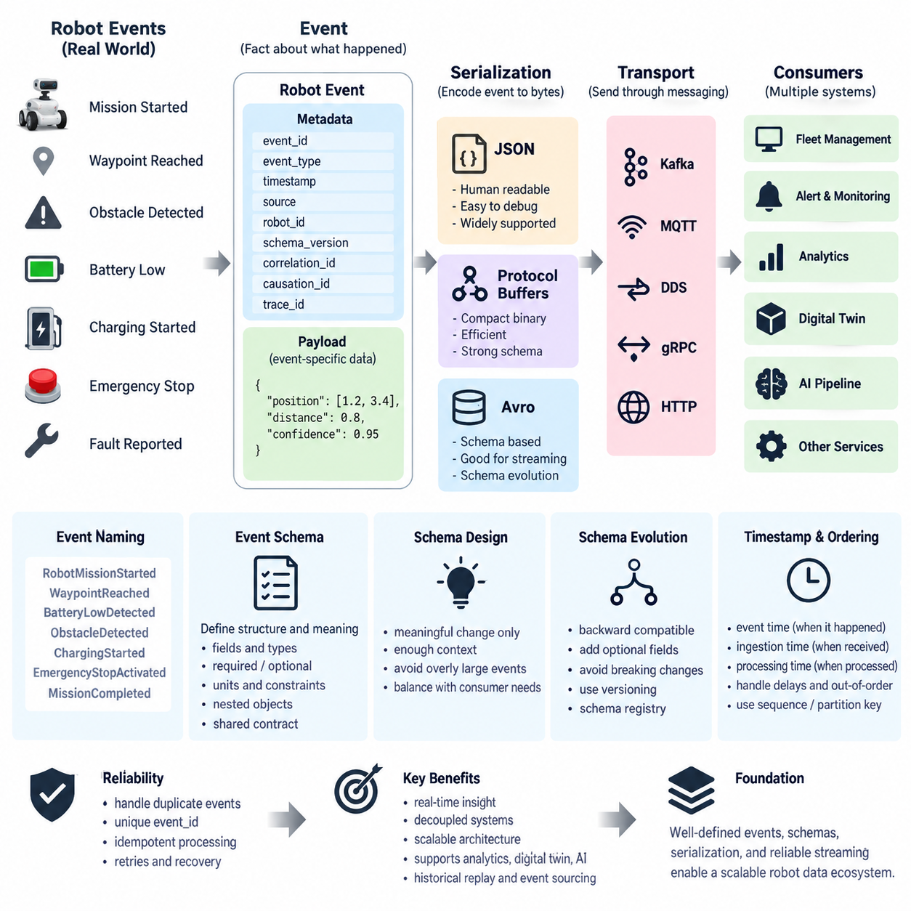
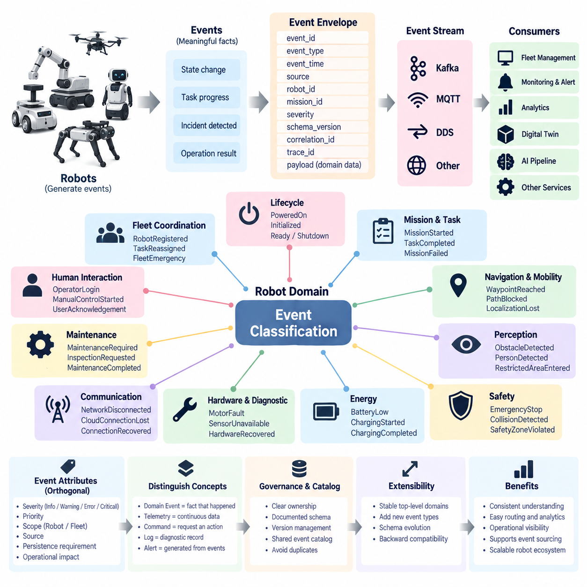
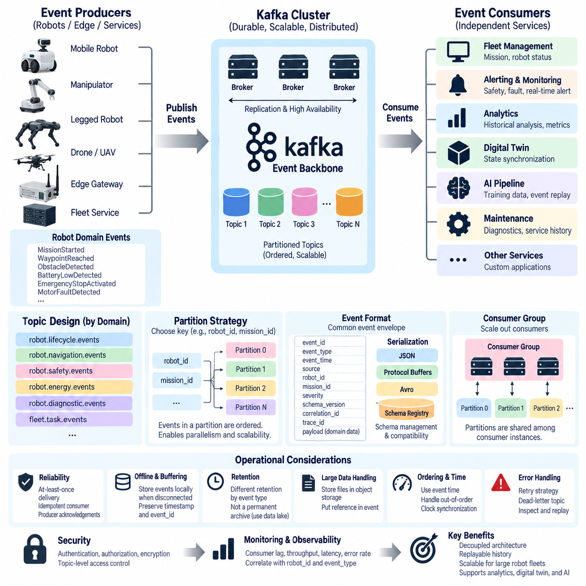
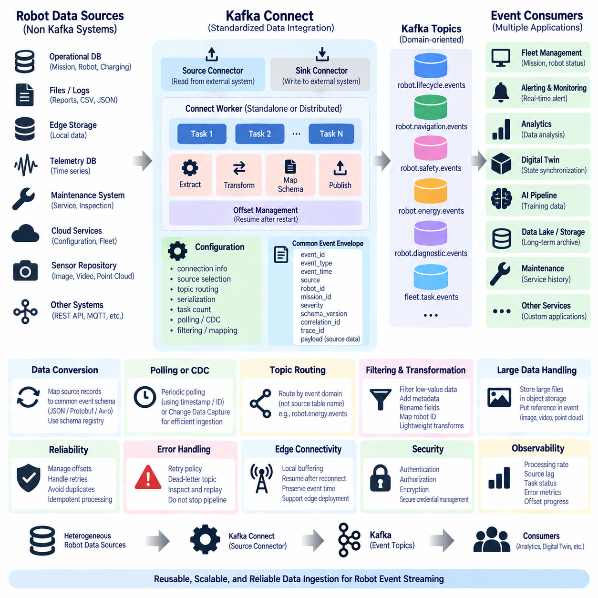
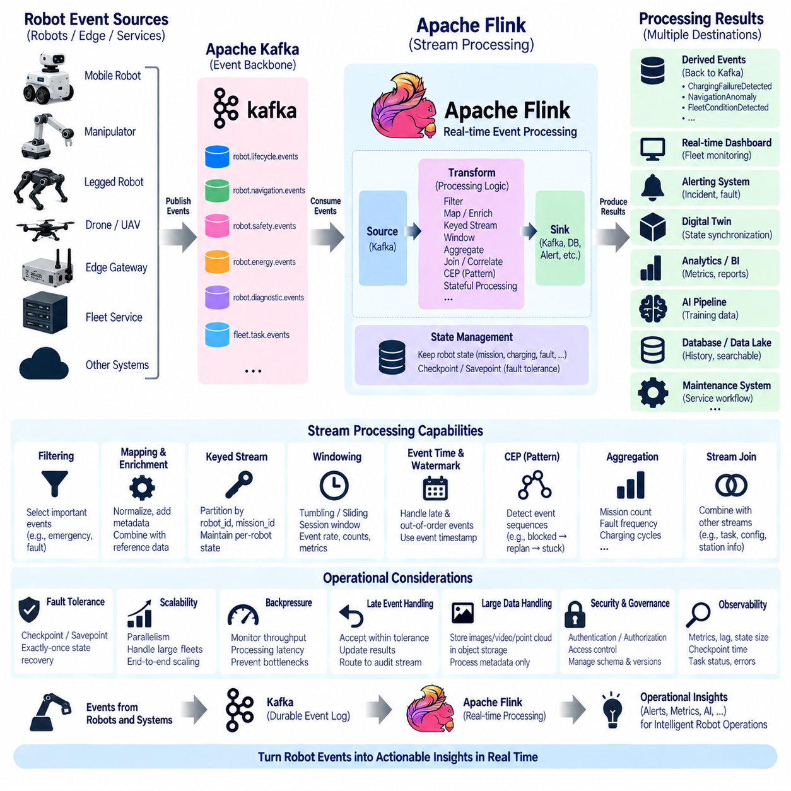
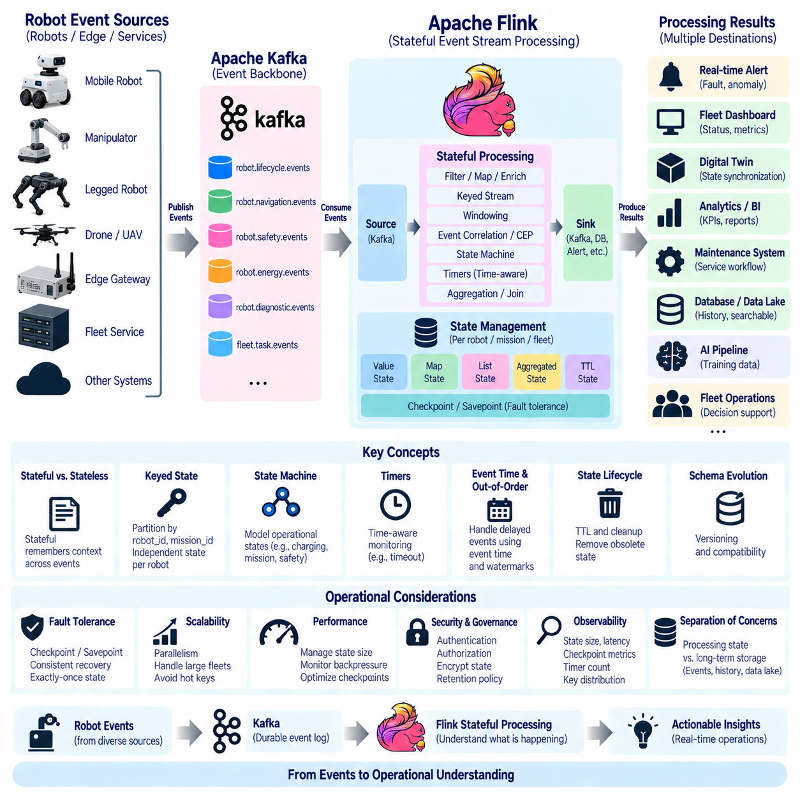
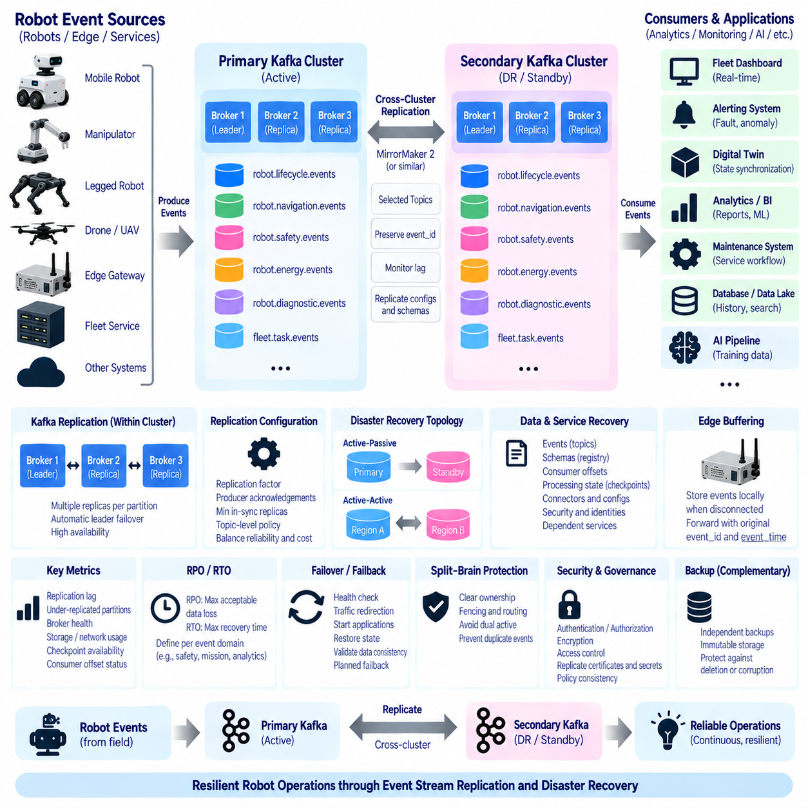
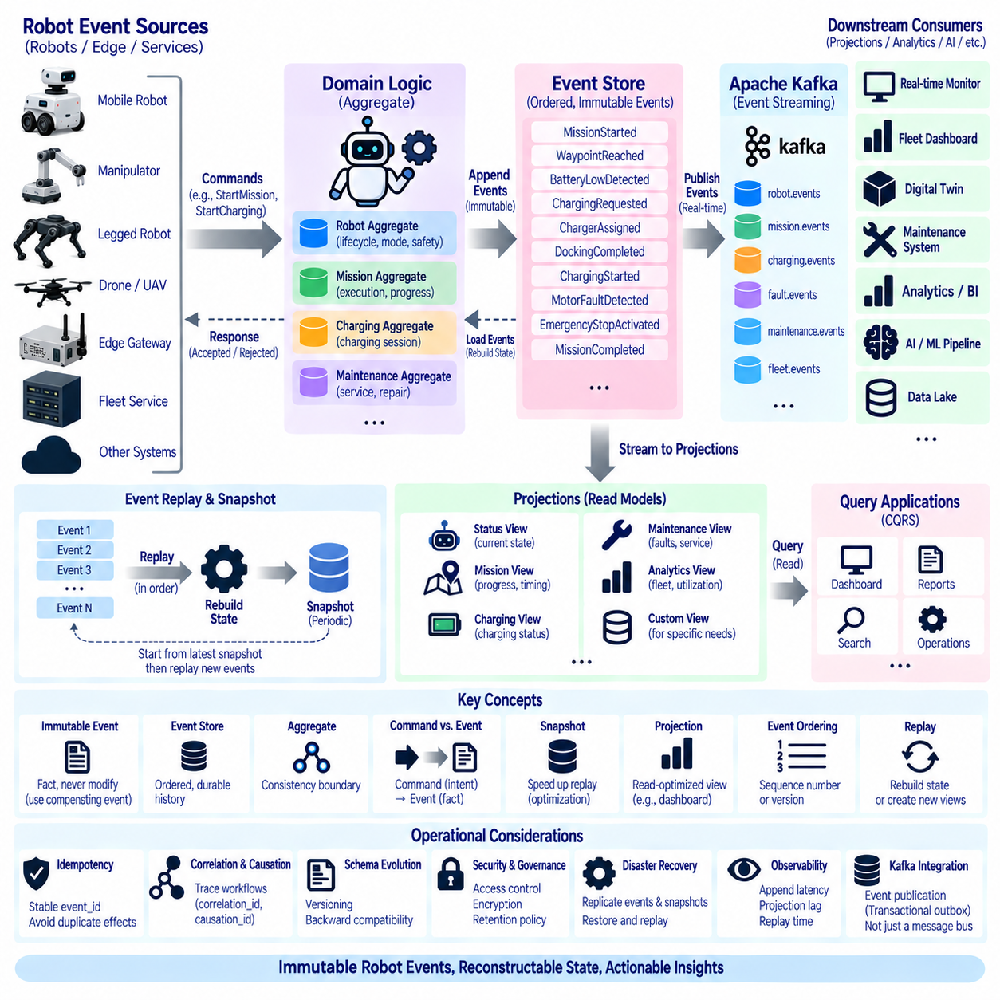
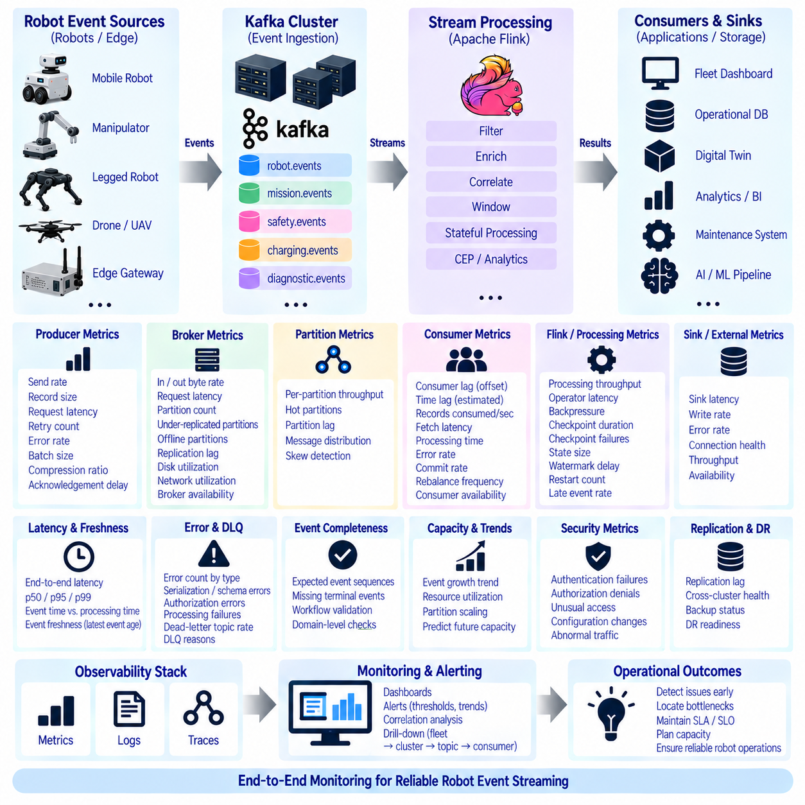
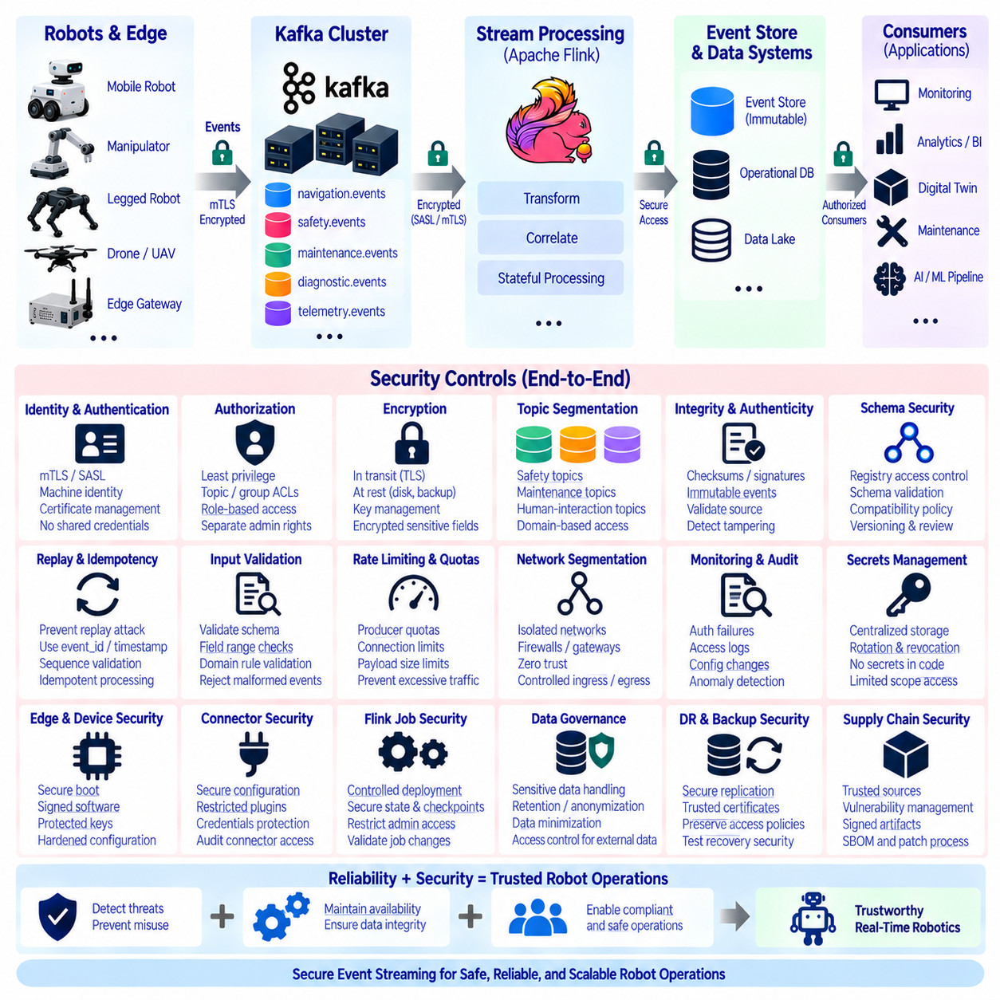

**Volume 07 Robot Data Architecture**

# 04. Event Streaming

## 04.01 Event Streaming Basics: Event Definition, Schema, Serialization

{width="7.268055555555556in" height="7.268055555555556in"}

이벤트 스트리밍(Event Streaming)은 로봇 또는 주변 시스템에서 발생하는 의미 있는 변화를 개별 이벤트(Event)로 표현하고, 이를 관심 있는 소비자(Consumer)에게 지속적으로 전달하는 데이터 아키텍처(Data Architecture) 방식이다. 주기적으로 데이터베이스(Database)를 조회하는 방식과 달리, 이벤트 스트림(Event Stream)은 변화가 발생하는 시점에 해당 사실을 전달한다.

예를 들어 로봇이 임무를 시작하거나 웨이포인트(Waypoint)에 도착하고, 장애물을 감지하거나 충전 스테이션(Charging Station)에 진입하며, 고장 상태를 보고하는 상황을 각각 독립적인 이벤트(Event)로 표현할 수 있다. 이러한 구조는 로봇 시스템에서 발생하는 상태 변화를 실시간으로 다른 시스템에 전달하는 기반이 된다.

이벤트(Event)는 앞으로 수행해야 할 동작을 요청하는 명령(Command)이 아니라, 이미 발생한 사실(Fact)을 나타낸다. 예를 들어 "스테이션 A로 이동하라"는 명령(Command)은 앞으로 수행할 의도를 표현하지만, "로봇이 스테이션 A에 도착했다"는 이벤트(Event)는 실제로 관찰된 결과를 기록한다.

이러한 구분은 이벤트 기반 시스템(Event-Driven System)의 핵심이다. 시스템은 변경할 수 없는 사실(Immutable Fact)을 이용해 후속 서비스(Service)를 동작시키고, 운영 이력(Operational History)을 유지하며, 워크플로(Workflow)를 시작할 수 있다. 또한 과거 이벤트를 이용하여 로봇 시스템이 현재 상태에 도달한 과정을 추적할 수도 있다.

유용한 로봇 이벤트(Robot Event)는 단순한 업무 정보만 포함해서는 충분하지 않다. 일반적으로 이벤트 식별자(Event Identifier), 이벤트 유형(Event Type), 타임스탬프(Timestamp), 발생 소스(Source), 로봇 또는 자산 식별자(Asset Identifier), 스키마 버전(Schema Version), 이벤트별 정보를 저장하는 페이로드(Payload)가 필요하다.

상관관계 식별자(Correlation Identifier)를 사용하면 동일한 임무(Mission)나 트랜잭션(Transaction)에 속하는 여러 이벤트를 연결할 수 있다. 인과관계 식별자(Causation Identifier)는 현재 이벤트를 발생시킨 이전 명령이나 이벤트를 나타낸다. 이러한 정보는 여러 서비스에 분산된 로봇의 동작을 추적 가능하게 만든다.

이벤트 이름(Event Name)은 로봇 도메인(Robot Domain)에서 발생한 사실을 명확하고 일관되게 표현해야 한다. 예를 들어 RobotMissionStarted, WaypointReached, BatteryLowDetected, ObstacleDetected, ChargingStarted, EmergencyStopActivated, MissionCompleted와 같은 형태를 사용할 수 있다.

이벤트 이름을 과거형(Past Tense)으로 정의하면 이벤트가 이미 발생한 사실이라는 의미가 명확해진다. 또한 일관된 이벤트 어휘(Event Vocabulary)를 사용하면 로봇 개발팀, 플릿 서비스(Fleet Service), 분석 시스템(Analytics System), 클라우드 애플리케이션(Cloud Application)이 동일한 사건을 서로 다르게 해석하는 문제를 줄일 수 있다.

이벤트 스키마(Event Schema)는 이벤트의 공식적인 구조와 의미를 정의한다. 필수 및 선택 필드(Field), 데이터 타입(Data Type), 허용 가능한 값, 중첩 객체(Nested Object), 단위(Unit), 식별자(Identifier), 의미적 제약조건(Semantic Constraint) 등을 명시하여 생산자(Producer)와 소비자(Consumer) 사이의 데이터 계약(Data Contract)을 형성한다.

로봇 데이터는 임베디드 컨트롤러(Embedded Controller), ROS 2 시스템, 엣지 컴퓨터(Edge Computer), 플릿 관리 플랫폼(Fleet Management Platform), 클라우드 서비스(Cloud Service), 데이터베이스(Database), 디지털 트윈(Digital Twin), 인공지능 파이프라인(AI Pipeline) 등을 통과할 수 있다. 따라서 스키마(Schema)는 서로 다른 시스템을 연결하는 공통 계약으로 중요하다.

일반적인 이벤트(Event)는 개념적으로 메타데이터(Metadata)와 페이로드(Payload)로 구분할 수 있다. 메타데이터에는 event_id, event_type, timestamp, source, robot_id, schema_version, trace_id와 같이 이벤트 자체를 설명하는 공통 속성이 포함된다. 페이로드에는 해당 이벤트의 도메인별 정보가 저장된다.

예를 들어 장애물 감지 이벤트(ObstacleDetected)는 위치(Position), 거리(Distance), 신뢰도(Confidence), 센서 소스(Sensor Source), 장애물 클래스(Obstacle Class), 이동 상태(Motion State)를 포함할 수 있다. 배터리 부족 이벤트(BatteryLowDetected)는 충전 상태(State of Charge), 전압(Voltage), 온도(Temperature), 예상 잔여 운용시간을 포함할 수 있다.

스키마 설계(Schema Design)에서는 모든 이벤트에 로봇의 전체 상태(Complete Robot State)를 불필요하게 포함하지 않는 것이 중요하다. 이벤트는 소비자가 해당 변화를 이해하는 데 필요한 문맥(Context)을 제공하면서 의미 있는 상태 변화만 표현하는 것이 효율적이다.

이벤트 메시지가 지나치게 크면 네트워크 대역폭(Bandwidth), 직렬화 비용(Serialization Cost), 저장 공간(Storage), 처리 지연시간(Processing Latency)이 증가한다. 반대로 정보가 지나치게 적으면 소비자가 필요한 정보를 얻기 위해 다른 서비스를 반복적으로 조회해야 하므로 이벤트 기반 아키텍처(Event-Driven Architecture)의 독립성과 확장성이 감소할 수 있다.

직렬화(Serialization)는 메모리 내부의 이벤트 표현을 네트워크로 전달하거나 저장할 수 있는 바이트(Byte) 또는 텍스트(Text) 형식으로 변환하는 과정이다. JSON은 사람이 읽기 쉽고 디버깅(Debugging)이 편리하며 거의 모든 프로그래밍 환경에서 지원되기 때문에 개발과 시스템 통합 과정에서 널리 사용된다.

그러나 JSON과 같은 텍스트 표현은 메시지 크기와 파싱 오버헤드(Parsing Overhead)를 증가시킬 수 있다. 높은 빈도의 로봇 텔레메트리(Robot Telemetry)를 처리하거나 대규모 플릿(Fleet)을 운영하면 이러한 비용이 누적되므로 보다 압축된 바이너리 직렬화(Binary Serialization) 방식이 필요할 수 있다.

프로토콜 버퍼(Protocol Buffers)는 명확하게 정의된 스키마를 기반으로 비교적 작은 크기의 바이너리 메시지를 생성하며 효율적인 직렬화와 역직렬화(Deserialization)를 제공한다. 아파치 아브로(Apache Avro) 역시 스키마 기반 직렬화를 지원하며 스키마 진화(Schema Evolution)가 중요한 데이터 스트리밍 환경에서 활용될 수 있다.

JSON, 프로토콜 버퍼(Protocol Buffers), 아브로(Avro) 등의 형식을 선택할 때는 단순히 메시지 크기만 비교해서는 안 된다. 상호운용성(Interoperability), 대역폭, 처리 성능, 개발 편의성, 스키마 거버넌스(Schema Governance), 장기 호환성(Long-Term Compatibility)을 함께 고려해야 한다.

직렬화(Serialization)와 전송(Transport)은 개념적으로 분리해야 한다. 직렬화는 이벤트를 어떤 형식으로 인코딩(Encoding)할지를 결정하고, 전송은 인코딩된 이벤트를 시스템 사이에서 어떻게 이동시킬지를 결정한다. 동일한 로봇 이벤트를 JSON 또는 Protocol Buffers로 표현하면서 서로 다른 메시징 기술을 사용할 수 있다.

예를 들어 동일한 이벤트를 카프카(Kafka), MQTT, DDS 등의 메시징 인프라(Messaging Infrastructure)를 통해 전달할 수 있다. 도메인 이벤트 모델(Domain Event Model)과 통신 기술을 분리하면 향후 메시지 브로커(Message Broker)나 전송 프로토콜(Transport Protocol)이 변경되더라도 이벤트의 핵심 의미를 유지할 수 있다.

스키마 진화(Schema Evolution)는 여러 버전의 로봇 소프트웨어가 동시에 운영되기 시작하면 특히 중요해진다. 지리적으로 분산된 대규모 로봇 플릿에서는 생산자(Producer)와 소비자(Consumer)를 항상 동시에 업그레이드하기 어렵기 때문에 이전 버전과 새로운 버전 사이의 호환성(Compatibility)을 고려해야 한다.

기존 필드를 제거하거나 의미를 변경하는 것보다 새로운 선택 필드(Optional Field)를 추가하는 방식이 일반적으로 안전하다. 필드 이름을 변경하거나 단위(Unit)를 바꾸고, 기존 숫자 필드를 호환되지 않는 데이터 타입으로 변경하면 소비자 시스템에 장애가 발생할 수 있다. 따라서 스키마 호환성은 인터페이스 계약(Interface Contract)의 일부로 관리해야 한다.

버전 정보(Version Information)는 소비자가 이벤트를 어떤 방식으로 해석해야 하는지 판단할 수 있도록 명확하게 제공되어야 한다. 아키텍처에 따라 이벤트 메타데이터(Event Metadata), 토픽 구조(Topic Organization), 스키마 식별자(Schema Identifier), 스키마 레지스트리(Schema Registry)를 이용해 버전을 관리할 수 있다.

이러한 호환성 규칙(Compatibility Rule)을 배포 전에 검사하면 새로운 로봇 소프트웨어가 기존 플릿 관리, 분석, 모니터링(Monitoring), 디지털 트윈 서비스에서 처리할 수 없는 이벤트를 생성하는 위험을 줄일 수 있다. 따라서 스키마 관리는 단순한 데이터 형식 관리가 아니라 로봇 소프트웨어 배포 전략과 연결된다.

타임스탬프 의미론(Timestamp Semantics)도 로봇 시스템에서는 중요하다. 실제 물리적 현상이 발생한 시간, 온보드 소프트웨어(Onboard Software)가 이를 감지한 시간, 이벤트가 스트리밍 플랫폼(Streaming Platform)에 도착한 시간은 서로 다를 수 있다. 네트워크 지연이나 일시적인 연결 중단이 발생하면 이 차이는 더욱 커질 수 있다.

따라서 이벤트 순서와 지연시간 분석이 중요한 시스템에서는 이벤트 시간(Event Time)을 수집 시간(Ingestion Time)이나 처리 시간(Processing Time)과 구분해야 한다. 실제 현상이 발생한 시간을 기준으로 분석하면 네트워크 상태가 불안정한 환경에서도 로봇의 물리적 동작 순서를 보다 정확하게 재구성할 수 있다.

이벤트 순서(Event Ordering)는 분산 시스템 전체에서 자동으로 보장되지 않는다. 로봇이 짧은 시간에 여러 이벤트를 생성하거나 서로 다른 통신 경로에서 지연이 발생할 수 있으며, 통신이 끊긴 로봇이 저장된 이벤트를 나중에 한꺼번에 업로드할 수도 있다.

시퀀스 번호(Sequence Number), 타임스탬프(Timestamp), 파티션 키(Partition Key), 로봇 식별자(Robot Identifier)를 사용하면 필요한 이벤트 순서를 유지하거나 재구성할 수 있다. 모든 시스템에 하나의 전역 순서(Global Ordering)를 강제하기보다 로봇, 임무, 장치, 운영 객체 등 의미 있는 범위에서 순서를 정의하는 것이 현실적이다.

신뢰성 있는 이벤트 처리(Reliable Event Processing)에서는 중복 이벤트(Duplicate Event)도 고려해야 한다. 네트워크 재시도(Network Retry), 메시지 브로커의 전달 방식, 재접속(Reconnection), 생산자 복구 과정으로 인해 동일한 논리적 이벤트가 두 번 이상 전달될 수 있기 때문이다.

고유 이벤트 식별자(Unique Event Identifier)를 사용하면 소비자가 중복 이벤트를 식별할 수 있다. 또한 멱등 처리(Idempotent Processing)를 적용하여 같은 이벤트를 반복 처리하더라도 임무, 정비 티켓(Maintenance Ticket), 경고(Alert), 과금 기록, 상태 전이(State Transition)가 중복 생성되지 않도록 설계해야 한다.

이벤트 스트림(Event Stream)은 하나의 시간적 기록(Temporal Record)을 여러 소비자가 동시에 활용할 수 있도록 한다. 플릿 관리 서비스는 로봇 상태를 갱신하고, 경고 서비스는 고장을 감지하며, 분석 서비스는 신뢰성 지표를 계산하고, 디지털 트윈은 현재 상태를 갱신할 수 있다. AI 데이터 파이프라인은 학습에 가치 있는 데이터를 선별하는 데 이벤트를 활용할 수도 있다.

각 소비자(Consumer)가 독립적으로 이벤트를 구독(Subscribe)할 수 있으므로 새로운 애플리케이션을 추가하더라도 로봇 측 생산자(Producer)를 직접 수정하지 않아도 되는 구조를 만들 수 있다. 이는 로봇, 엣지, 서버, 클라우드 사이의 직접적인 결합도(Coupling)를 낮추고 시스템 확장성을 높이는 중요한 장점이다.

일관된 이벤트 정의(Event Definition), 스키마(Schema), 타임스탬프, 식별자, 직렬화 규칙이 마련되면 더욱 발전된 스트림 처리(Stream Processing)가 가능해진다. 스트리밍 플랫폼은 이벤트를 실시간으로 필터링(Filter), 집계(Aggregation), 상관분석(Correlation), 재생(Replay), 분석할 수 있다.

이러한 기반 위에서 이벤트 패턴(Event Pattern)을 탐지하고, 스트리밍 상태(Streaming State)를 유지하며, 과거 이벤트 시퀀스(Event Sequence)를 재현하거나 이벤트 소싱(Event Sourcing)을 구현할 수 있다. 따라서 이벤트 스트리밍 기초는 이후 카프카(Kafka), 플링크(Flink), 상태 기반 처리(Stateful Processing), 재생, 모니터링, 보안으로 확장되는 기술적 출발점이다.

로봇 데이터 아키텍처(Robot Data Architecture)에서 가장 중요한 원칙은 이벤트를 단순히 메시지 브로커(Message Broker)를 통과하는 데이터 패킷으로 이해하지 않는 것이다. 이벤트는 물리적 또는 디지털 로봇 도메인에서 의미 있는 어떤 일이 발생했다는 사실을 표현하는 지속 가능한 의미적 계약(Semantic Contract)이다.

명확한 이벤트 정의, 체계적인 스키마, 효율적인 직렬화, 명시적인 타임스탬프, 안정적인 식별자, 통제된 스키마 진화가 함께 적용되어야 한다. 이러한 기반을 통해 로봇, 엣지(Edge), 플릿(Fleet), 클라우드(Cloud), 디지털 트윈(Digital Twin), 인공지능(AI) 시스템은 대규모 환경에서도 운영 사실을 일관되고 신뢰성 있게 교환할 수 있다.

## 04.02 Robot Domain Event Classification System Design

{width="7.268055555555556in" height="7.268055555555556in"}

로봇 도메인 이벤트 분류(Robot Domain Event Classification)는 로봇 운용 전반에서 생성되는 수많은 이벤트(Event)를 체계적으로 조직하는 방법을 정의한다. 로봇은 단순히 센서 데이터만 생성하는 것이 아니라 임무, 이동, 내비게이션, 하드웨어, 안전, 에너지, 통신, 유지보수, 외부 시스템과의 상호작용과 관련된 사실을 지속적으로 생성한다. 이벤트 분류는 이러한 이질적인 정보를 로봇 데이터 아키텍처(Robot Data Architecture) 전체에서 일관되게 이해할 수 있는 공통 의미 구조(Semantic Structure)를 제공한다.

도메인 이벤트(Domain Event)는 특정 로봇 운용 문맥(Operational Context)에서 의미 있는 사건이 발생했음을 나타낸다. 모든 메시지, 센서 샘플, 상태 변수를 이벤트로 취급하는 대신 운영 또는 비즈니스 관점에서 의미 있는 변화에 집중한다. 휠 엔코더(Wheel Encoder)의 갱신은 텔레메트리(Telemetry)로 처리할 수 있지만, 위치추정 실패, 임무 시작, 충전 완료, 비상 정지, 화물 전달 등은 다른 구성요소가 대응해야 하므로 도메인 이벤트가 될 수 있다.

분류 모델(Classification Model)은 명확하게 정의된 로봇 도메인(Robot Domain)에서 시작해야 한다. 대표적으로 로봇 생명주기(Robot Lifecycle), 임무 및 작업 실행(Mission and Task Execution), 내비게이션 및 이동성(Navigation and Mobility), 인지(Perception), 안전(Safety), 에너지(Energy), 하드웨어 상태(Hardware Health), 통신(Communication), 유지보수(Maintenance), 인간 상호작용(Human Interaction), 플릿 협조(Fleet Coordination) 등이 있다. 이러한 도메인은 안정적인 의미 경계를 제공한다.

로봇 생명주기 이벤트(Robot Lifecycle Event)는 로봇의 운용 상태나 가용성(Availability)이 변화하는 과정을 나타낸다. RobotPoweredOn, RobotInitialized, RobotReady, RobotPaused, RobotShutdown, RobotOffline 등이 대표적인 예이다. 이러한 이벤트는 물리적 로봇이 작업을 받을 수 있는지 또는 플릿 운영에 참여할 수 있는지를 나타내므로 플릿 관리, 가용성 계산, 운영 감사(Operational Auditing), 디지털 트윈 동기화(Digital Twin Synchronization)에 활용할 수 있다.

임무 및 작업 이벤트(Mission and Task Event)는 로봇에 할당된 작업이 실행되는 전체 생명주기(Execution Lifecycle)를 표현한다. MissionAssigned, MissionAccepted, MissionStarted, TaskStarted, TaskCompleted, MissionCompleted, MissionCancelled, MissionFailed 등을 이용해 작업 할당부터 종료까지의 진행 과정을 나타낼 수 있다. 일관된 작업 이벤트 어휘(Event Vocabulary)를 유지하면 로봇 내부 상태 머신(State Machine)에 직접 의존하지 않고 실행 이력을 재구성할 수 있다.

내비게이션 및 이동성 이벤트(Navigation and Mobility Event)는 환경 내부에서 로봇이 이동하는 과정에서 발생하는 의미 있는 변화를 나타낸다. RouteAssigned, NavigationStarted, WaypointReached, GoalReached, PathBlocked, LocalizationLost, ReplanningStarted, RobotStuck 등이 대표적인 예이다. 연속적으로 생성되는 위치 데이터는 이벤트보다 텔레메트리 또는 시계열 데이터(Time-Series Data)로 관리하고, 의미 있는 상태 전이만 이벤트로 표현하는 것이 적절하다.

인지 이벤트(Perception Event)는 모든 원시 센서 관측값이 아니라 센서 처리 결과에서 도출된 중요한 해석을 나타낸다. ObstacleDetected, PersonDetected, RestrictedAreaEntered, FireDetected, FallDetected, UnknownObjectDetected 등은 내비게이션, 안전, 모니터링 또는 AI 워크플로(AI Workflow)를 실행시킬 수 있다. 이벤트는 원본 이미지, 포인트 클라우드(Point Cloud), 레이더 프레임(Radar Frame), 추론 텐서(Inference Tensor)와 구분해야 하며 대용량 센서 데이터는 이벤트 내부에 직접 포함하기보다 참조하는 방식이 적합하다.

안전 이벤트(Safety Event)는 일반 이벤트와 운영 의미와 대응 우선순위가 크게 다를 수 있으므로 특히 명확하게 분류해야 한다. EmergencyStopActivated, CollisionDetected, SafetyZoneViolated, ProtectiveStopActivated, SafetySensorFault 등을 별도의 안전 도메인(Safety Domain)으로 구성할 수 있다. 이벤트 스키마(Event Schema)에는 심각도(Severity), 안전 발생원(Safety Source), 영향받은 하위 시스템, 대응 상태(Response State), 확인 정보(Acknowledgement Information) 등을 포함할 수 있다.

에너지 이벤트(Energy Event)는 로봇의 가용성과 임무 계획에 영향을 주는 상태 변화를 표현한다. BatteryLowDetected, CriticalBatteryDetected, ChargingRequested, ChargingStarted, ChargingCompleted, ChargingInterrupted, BatteryFaultDetected 등이 대표적이다. 이러한 이벤트를 통해 플릿 오케스트레이션(Fleet Orchestration)은 충전 자원을 조정하고, 가용하지 않은 로봇에 임무가 할당되는 것을 방지하며, 에너지 기반 활용률과 비정상 충전 동작을 분석할 수 있다.

하드웨어 및 진단 이벤트(Hardware and Diagnostic Event)는 물리적 부품과 임베디드 하위 시스템(Embedded Subsystem)에서 발생하는 의미 있는 상태 변화를 나타낸다. MotorFaultDetected, DriveControllerFault, SensorUnavailable, ComputeOverTemperature, BrakeFault, HardwareRecovered 등이 대표적인 예이다. 연속적인 온도, 전류, 진동, 제어기 값은 텔레메트리로 유지하고, 임계값 초과, 진단된 고장, 열화 상태(Degradation State), 복구 상태 전이 등을 도메인 이벤트로 처리할 수 있다.

통신 이벤트(Communication Event)는 분산 로봇 운영에 영향을 주는 연결 상태의 변화를 나타낸다. NetworkDisconnected, NetworkRestored, CloudConnectionLost, BrokerConnectionRecovered, RemoteControlUnavailable 등을 하드웨어 고장과 별도로 분류할 수 있다. 로봇의 기계적 상태가 정상이어도 통신 장애가 발생할 수 있으므로, 후속 시스템에서는 별도의 복구, 버퍼링(Buffering), 재전송(Retransmission), 운영자 알림 절차를 적용할 수 있다.

유지보수 이벤트(Maintenance Event)는 로봇 운용과 서비스 관리(Service Management)를 연결하는 의미적 연결고리를 제공한다. MaintenanceRequired, InspectionRequested, ComponentReplacementScheduled, MaintenanceStarted, MaintenanceCompleted, FaultCleared 등을 이용해 유지보수 생명주기를 표현할 수 있다. 진단 및 텔레메트리 정보와 연계하면 신뢰성 분석, 예지보전(Predictive Maintenance), 서비스 이력 관리, 예비 부품 계획, 가동 중단시간(Downtime), 평균수리시간(Mean Time to Repair) 등의 분석을 지원할 수 있다.

인간-로봇 상호작용 이벤트(Human-Robot Interaction Event)는 운영자, 작업자, 승객, 환자 또는 기타 승인된 사용자와 관련된 의미 있는 상호작용을 표현한다. 응용 분야에 따라 OperatorLogin, ManualControlStarted, AssistanceRequested, HumanOverrideActivated, DoorOpened, UserAcknowledgementReceived 등이 사용될 수 있다. 이러한 이벤트에 개인 사용자와 관련된 식별자나 문맥 정보가 포함되는 경우 개인정보 보호(Privacy)와 접근 제어(Access Control)를 함께 고려해야 한다.

플릿 협조 이벤트(Fleet Coordination Event)는 개별 로봇보다 상위 수준에서 의미를 가지는 사실을 표현한다. RobotRegistered, RobotAssignedToFleet, TrafficReservationGranted, TrafficConflictDetected, ChargingSlotAssigned, TaskReassigned, FleetEmergencyDeclared 등을 통해 다중 로봇 오케스트레이션(Multi-Robot Orchestration)을 지원할 수 있다. 플릿 수준 이벤트와 로봇 로컬 이벤트(Robot-Local Event)를 분리하면 개별 로봇 구현이 플릿 관리 시스템의 모든 의사결정과 강하게 결합되는 것을 방지할 수 있다.

이벤트 분류는 기능적 도메인(Functional Domain)에만 의존해서는 안 된다. 이벤트에는 심각도(Severity), 우선순위(Priority), 범위(Scope), 발생원(Source), 영속성 요구사항(Persistence Requirement), 운영 영향도(Operational Impact)와 같은 직교 속성(Orthogonal Attribute)을 추가할 수 있다. 하나의 내비게이션 이벤트가 경고 수준이면서 로봇 로컬 범위를 가질 수 있고, 다른 내비게이션 이벤트는 치명적이며 플릿 전체에 영향을 줄 수도 있다.

심각도(Severity)는 일반적으로 이벤트의 운영상 중요성을 표현한다. 정보성 이벤트(Informational Event)는 정상적인 진행 상태를 나타내고, 경고(Warning)는 주의가 필요한 조건을 의미하며, 오류(Error)는 기능에 영향을 주는 실패를 나타낸다. 치명적 이벤트(Critical Event)는 즉각적인 대응이 필요한 상황을 의미한다. 동일한 도메인에도 정상 및 비정상 이벤트가 존재하므로 이벤트 이름만으로 심각도를 판단하지 않고 명시적으로 정의하는 것이 바람직하다.

이벤트 식별 체계(Event Identity)는 여러 소프트웨어 구성요소에서 안정적으로 유지되어야 한다. robot.navigation.localization_lost 또는 robot.energy.charging_started와 같은 구조화된 명명 규칙(Naming Convention)은 도메인과 이벤트의 의미를 동시에 표현하면서 필터링(Filtering)과 라우팅(Routing)을 지원할 수 있다. 명칭은 개발자와 운영자가 쉽게 이해할 수 있어야 하며 특정 전송 기술에 종속되지 않아야 한다.

각각의 분류된 이벤트는 공통 이벤트 엔벌로프(Common Event Envelope)를 사용하는 것이 좋다. 필요에 따라 event_id, event_type, event_time, source, robot_id, fleet_id, mission_id, severity, schema_version, correlation_id, trace_id 등의 공통 필드를 포함할 수 있다. 도메인별 정보는 페이로드(Payload)에 배치하여 전체 이벤트의 일관성을 유지하면서 각 도메인에 필요한 전문 데이터를 표현한다.

개별 이벤트의 분류뿐 아니라 이벤트 간 관계(Event Relationship)도 중요하다. MissionStarted가 NavigationStarted를 발생시키고, 이후 WaypointReached와 GoalReached를 거쳐 MissionCompleted로 이어질 수 있다. PathBlocked는 ReplanningStarted를 유발하고 BatteryLowDetected는 ChargingRequested로 연결될 수 있다. 상관관계(Correlation)와 인과관계(Causation) 정보를 이용하면 이러한 이벤트 체인(Event Chain)을 재구성할 수 있다.

이벤트 체인을 재구성하면 운영 디버깅(Operational Debugging), 근본원인 분석(Root-Cause Analysis), 워크플로 자동화(Workflow Automation), 이벤트 소싱(Event Sourcing) 등에 활용할 수 있다. 개별 이벤트를 독립된 메시지로만 처리하는 것이 아니라 이벤트 사이의 시간적·인과적 관계를 함께 관리함으로써 로봇 시스템의 전체 동작 과정을 보다 정확하게 추적할 수 있다.

분류 시스템은 도메인 이벤트(Domain Event)를 텔레메트리(Telemetry), 명령(Command), 로그(Log), 알림(Alert)과 명확하게 구분해야 한다. 텔레메트리는 지속적으로 측정되는 상태를 표현하고, 명령은 수행할 동작을 요청하며, 로그는 구현 중심의 진단 기록을 제공한다. 반면 도메인 이벤트는 실제로 발생한 의미 있는 사실을 표현한다.

알림(Alert)은 운영 정책에 따라 하나 이상의 이벤트로부터 생성될 수 있다. 이러한 개념을 명확히 구분하면 이벤트 플랫폼(Event Platform)이 로봇 내부에서 생성되는 모든 메시지를 무분별하게 전달하는 통제되지 않은 스트림으로 변하는 것을 방지할 수 있다. 이벤트 스트림에는 다른 시스템이 반응하거나 기록할 가치가 있는 의미 있는 운영 사실을 중심으로 포함해야 한다.

로봇 기능은 지속적으로 발전하므로 확장성(Extensibility)은 필수적인 설계 요소이다. 새로운 센서, 매니퓰레이터(Manipulator), AI 기능, 안전 메커니즘, 플릿 서비스가 추가되면 새로운 운영 사실도 생성된다. 따라서 분류 계층(Classification Hierarchy)은 안정적인 최상위 도메인을 유지하면서 통제된 스키마 진화(Schema Evolution)를 통해 새로운 이벤트 유형과 선택 속성을 추가할 수 있어야 한다.

새로운 로봇 소프트웨어가 기존 소비자가 아직 이해하지 못하는 이벤트 유형을 생성하더라도 기존 소비자는 자신이 알고 있는 이벤트를 계속 처리할 수 있어야 한다. 이를 위해 이벤트 분류 구조와 스키마 버전 관리(Schema Version Management)를 함께 설계하고, 하위 호환성(Backward Compatibility)을 유지하는 것이 장기간 운영되는 로봇 플릿 환경에서 중요하다.

거버넌스(Governance)는 이벤트 분류 설계를 완성하는 요소이다. 이벤트 정의에는 담당 소유자(Owner), 설명, 스키마, 버전 규칙, 심각도 의미, 보존 요구사항(Retention Requirement), 예상 소비자(Intended Consumer) 등이 문서화되어야 한다. 중복되거나 모호한 이벤트 정의는 배포 전에 검토하여 동일한 운영 사실이 서로 다른 이벤트로 정의되는 문제를 방지해야 한다.

공유 이벤트 카탈로그(Shared Event Catalog) 또는 스키마 레지스트리(Schema Registry)를 구축하면 이벤트 분류 체계를 쉽게 검색하고 관리할 수 있다. 이를 통해 로봇 소프트웨어, 엣지 플랫폼(Edge Platform), 플릿 서비스, 분석 시스템, 디지털 트윈, AI 파이프라인 사이에 통제된 공통 인터페이스를 제공하고 이벤트의 정의와 사용 방식을 장기적으로 일관되게 유지할 수 있다.

잘 설계된 로봇 도메인 이벤트 분류 시스템(Robot Domain Event Classification System)은 궁극적으로 이벤트 스트리밍(Event Streaming)을 위한 의미적 중추(Semantic Backbone)가 된다. 다양한 로봇의 사건을 체계적인 운영 사실로 변환함으로써 이벤트를 일관된 방식으로 라우팅, 저장, 상관분석, 재생, 모니터링, 분석할 수 있게 한다.

이러한 기반은 이후의 카프카 기반 로봇 이벤트 스트림(Kafka-Based Robot Event Stream), 스트림 처리(Stream Processing), 상태 관리(State Management), 이벤트 소싱(Event Sourcing), 모니터링(Monitoring), 복제(Replication), 보안(Security)으로 확장된다. 따라서 도메인 이벤트 분류는 개별 이벤트를 정리하는 작업을 넘어 전체 로봇 이벤트 스트리밍 아키텍처를 일관된 의미 체계로 연결하는 핵심 설계 요소이다.

## 04.03 Kafka-Based Robot Event Stream Design [w/Code]

{width="7.268055555555556in" height="7.268055555555556in"}

아파치 카프카(Apache Kafka)는 로봇, 엣지 컴퓨터(Edge Computer), 플릿 플랫폼(Fleet Platform), 클라우드 서비스(Cloud Service), 디지털 트윈(Digital Twin), 분석 애플리케이션(Analytics Application) 사이에서 운영 이벤트를 지속적으로 교환해야 하는 로봇 시스템을 위한 분산 이벤트 스트리밍(Distributed Event Streaming) 기반을 제공한다. 모든 생산자(Producer)와 소비자(Consumer)를 직접 연결하는 대신, 이벤트를 한 번 게시하고 여러 서비스가 독립적으로 소비할 수 있는 지속성 있는 이벤트 백본(Event Backbone)을 구성한다.

카프카 기반 로봇 아키텍처(Kafka-Based Robot Architecture)에서 생산자(Producer)는 MissionStarted, WaypointReached, ObstacleDetected, BatteryLowDetected, EmergencyStopActivated, MotorFaultDetected와 같이 의미 있는 사실을 나타내는 도메인 이벤트(Domain Event)를 생성한다. 생산자는 로봇 내부, 엣지 게이트웨이(Edge Gateway), 플릿 서비스에서 실행될 수 있으며, 정의된 스키마(Schema)에 따라 유효한 이벤트를 생성하고 직렬화(Serialization)하여 적절한 카프카 토픽(Kafka Topic)에 게시한다.

카프카 토픽(Kafka Topic)은 로봇 이벤트를 체계적으로 구성하기 위한 논리적 채널(Logical Channel)을 제공한다. 모든 개별 메시지마다 임의의 토픽을 만드는 대신 안정적인 도메인 경계(Domain Boundary)를 기준으로 설계해야 한다. 예를 들어 robot.lifecycle.events, robot.navigation.events, robot.safety.events, robot.energy.events, fleet.task.events와 같은 구조를 사용하면 서로 다른 로봇 모델과 운영 환경에서도 일관된 명명 전략(Naming Strategy)을 유지할 수 있다.

하나의 토픽(Topic)은 여러 파티션(Partition)으로 나뉘며, 이를 통해 카프카는 병렬 처리(Parallelism)와 확장성(Scalability)을 제공한다. 하나의 파티션 내부에서는 이벤트 순서가 유지되지만 모든 파티션을 포괄하는 전역 순서(Global Ordering)는 보장되지 않는다. 따라서 로봇 시스템에서는 파티션 키(Partition Key)를 신중하게 선택해야 하며, robot_id를 사용하면 동일한 로봇의 이벤트를 하나의 파티션에 유지할 수 있다.

특정 임무나 워크플로(Workflow)를 중심으로 순서를 유지해야 한다면 mission_id를 파티션 키로 사용할 수도 있다. 파티션 전략(Partition Strategy)은 시스템 확장성에 직접적인 영향을 준다. 수천 대의 로봇이 너무 적은 수의 파티션으로 이벤트를 전송하면 처리량(Throughput)이 제한될 수 있지만, 지나치게 많은 파티션을 생성하면 브로커(Broker)와 운영 시스템의 관리 부담이 증가한다.

따라서 파티션 수는 현재 배치 규모만을 기준으로 결정해서는 안 된다. 예상 플릿 규모(Fleet Size), 이벤트 발생률(Event Rate), 메시지 크기(Message Size), 소비자 병렬성(Consumer Parallelism), 보존 요구사항(Retention Requirement), 향후 확장 가능성을 함께 고려해야 한다. 이를 통해 현재 시스템 성능과 미래의 확장 요구사항 사이에서 균형을 유지할 수 있다.

카프카 브로커(Kafka Broker)는 생산자로부터 이벤트를 수신하여 토픽 파티션 내부에 순서가 있는 레코드(Ordered Record)로 저장한다. 여러 브로커는 카프카 클러스터(Kafka Cluster)를 구성하며 파티션과 복제본(Replica)을 여러 서버에 분산할 수 있다. 복제와 가용성 설정을 적절하게 구성하면 일부 인프라 구성요소에 장애가 발생하더라도 로봇 이벤트 스트림을 지속적으로 운영할 수 있다.

브로커는 시스템 요구사항에 따라 엣지 데이터센터(Edge Data Center), 온프레미스 인프라(On-Premise Infrastructure), 클라우드 환경(Cloud Environment)에 배치할 수 있다. 이러한 배치 구조는 로봇과 데이터 처리 시스템 사이의 네트워크 지연시간, 데이터 보안, 가용성, 운영 비용 등을 고려하여 결정해야 한다.

소비자(Consumer)는 생산자와 독립적으로 카프카 토픽에서 이벤트를 읽는다. 플릿 관리 서비스(Fleet Management Service)는 임무 이벤트를 처리하고, 알림 서비스(Alerting Service)는 안전 및 진단 이벤트를 구독하며, 분석 파이프라인(Analytics Pipeline)은 여러 도메인의 이벤트를 동시에 소비할 수 있다. 각 소비자는 자신의 처리 위치를 독립적으로 유지하므로 느린 분석 애플리케이션이 다른 실시간 운영 서비스의 이벤트 소비를 반드시 방해하지는 않는다.

소비자 그룹(Consumer Group)을 사용하면 동일한 애플리케이션의 여러 인스턴스가 이벤트 처리 작업을 분담할 수 있다. 카프카는 하나의 그룹 내부에 있는 소비자들에게 토픽 파티션을 분배하며, 각 파티션은 해당 그룹에서 한 번에 하나의 활성 소비자가 처리한다. 충분한 파티션이 존재한다면 소비자 인스턴스를 추가하여 플릿 모니터링, 이벤트 보강(Event Enrichment), 분석, AI 데이터 처리 서비스의 처리 용량을 확장할 수 있다.

카프카는 오프셋(Offset)을 이용하여 소비자의 처리 위치를 추적한다. 오프셋은 하나의 파티션 내부에서 이벤트 처리가 어느 지점까지 진행되었는지를 나타낸다. 서비스가 재시작되면 각 로봇에 이벤트를 다시 요청하는 대신 이전에 커밋(Commit)한 오프셋부터 처리를 재개할 수 있다. 필요하면 오프셋을 이전 위치로 재설정하여 과거 이벤트를 다시 처리할 수도 있다.

이벤트 재생(Event Replay)은 로봇 시스템에서 특히 유용하다. 운영 사고는 실제 상황이 종료된 이후 원인을 재구성해야 하는 경우가 많기 때문이다. 엔지니어는 물리적 상황을 다시 재현하지 않고도 장애 전후의 내비게이션, 임무, 안전, 진단, 통신 이벤트를 재생할 수 있다. 디지털 트윈은 과거 상태를 재구성하고, 분석 시스템은 새로운 알고리즘을 이전 이벤트에 적용하며, AI 파이프라인은 기존 로봇 운용 기록에서 유용한 학습 데이터를 식별할 수 있다.

모든 카프카 이벤트는 도메인 모델(Domain Model)에서 정의한 공통 로봇 이벤트 엔벌로프(Common Robot Event Envelope)를 유지해야 한다. event_id, event_type, event_time, source, robot_id, mission_id, severity, schema_version, correlation_id, trace_id 등의 필드는 일관된 메타데이터(Metadata)를 제공하고, 페이로드(Payload)는 도메인별 정보를 포함한다. 이러한 구조를 카프카 자체와 분리하면 이벤트의 비즈니스 의미가 특정 스트리밍 기술에 강하게 종속되는 것을 방지할 수 있다.

직렬화(Serialization)는 개발이나 통합 단계에서 가독성이 중요한 경우 JSON을 사용할 수 있으며, 작고 구조화된 운영 이벤트가 필요한 환경에서는 프로토콜 버퍼(Protocol Buffers) 또는 아브로(Avro)를 사용할 수 있다. 스키마 레지스트리(Schema Registry)는 이벤트 스키마와 호환성 규칙(Compatibility Rule)을 중앙에서 관리할 수 있도록 지원한다.

생산자가 호환되지 않는 스키마 변경을 게시하지 못하도록 제어할 수 있으며, 소비자는 이벤트를 역직렬화(Deserialization)하고 올바르게 해석하기 위해 필요한 스키마 버전을 확인할 수 있다. 이러한 방식은 서로 다른 버전의 로봇과 서비스가 동시에 운영되는 환경에서 이벤트 데이터의 장기적인 호환성(Long-Term Compatibility)을 유지하는 데 중요하다.

전달 의미론(Delivery Semantics)은 운영 요구사항에 따라 선택해야 한다. 최대 한 번 처리(At-Most-Once)는 중복을 방지하지만 이벤트가 손실될 가능성이 있고, 최소 한 번 처리(At-Least-Once)는 전달을 우선하여 장애나 재시도 과정에서 중복 처리가 발생할 수 있다. 정확히 한 번 처리(Exactly-Once) 기능은 지원되는 카프카 처리 과정에서 중복 효과를 줄일 수 있지만 애플리케이션 수준의 정확성은 별도의 설계가 필요하다.

많은 로봇 시스템에서는 최소 한 번 전달(At-Least-Once Delivery), 고유 이벤트 식별자(Unique Event Identifier), 멱등 소비자(Idempotent Consumer)를 결합하는 것이 실용적인 신뢰성 모델이 될 수 있다. BatteryLowDetected 또는 MissionCompleted 이벤트가 두 번 전달되더라도 수신 서비스가 중복을 식별하여 충전 요청, 임무 기록, 알림, 유지보수 작업을 반복 생성하지 않도록 해야 한다.

생산자 확인 응답(Producer Acknowledgement) 설정은 카프카가 이벤트 저장을 어느 수준까지 확인한 후 게시 성공으로 판단할지를 결정한다. 높은 내구성(Durability)이 필요한 설정에서는 적절한 복제 상태가 확인된 이후에 게시 성공으로 처리할 수 있다. 중요한 안전, 임무, 유지보수 이벤트에서는 최소 지연시간보다 내구성을 우선할 수 있으며, 중요도가 낮은 정보성 이벤트에서는 다른 성능 절충안을 적용할 수 있다.

로봇은 항상 카프카 인프라와 안정적으로 연결될 수 있는 것은 아니다. 실내 무선 네트워크, 실외 셀룰러 네트워크(Cellular Network), 터널, 엘리베이터, 원격 시설, 액세스 포인트(Access Point) 전환 과정에서 통신이 일시적으로 중단될 수 있다. 따라서 온보드(Onboard) 또는 엣지 버퍼링(Edge Buffering) 메커니즘을 사용하여 중요한 이벤트를 임시 저장하고 연결이 복구된 이후 전송할 수 있어야 한다.

지연된 이벤트를 새로운 이벤트로 잘못 해석하지 않도록 원래의 이벤트 타임스탬프(Event Timestamp)와 이벤트 식별자(Event Identifier)를 그대로 보존해야 한다. 이를 통해 통신 복구 이후 대량의 이벤트가 한꺼번에 전송되더라도 실제 발생 시간과 전송 시간을 구분하고 올바른 운영 순서를 재구성할 수 있다.

이벤트 생산량이 후속 처리 시스템의 용량을 초과할 경우 백프레셔(Backpressure)도 고려해야 한다. 카프카는 이벤트를 파티션에 저장하므로 생산자와 소비자 사이의 일시적인 처리 속도 차이를 흡수할 수 있다. 그러나 소비자 지연(Consumer Lag)이 지속적으로 증가한다면 후속 처리 용량이 부족하다는 의미가 될 수 있다.

따라서 로봇 시스템에서는 소비자 지연, 이벤트 처리량(Event Throughput), 브로커 사용률(Broker Utilization), 파티션 분포(Partition Distribution), 게시 지연시간(Publish Latency), 오류율(Error Rate), 저장 공간 사용량(Storage Consumption)을 운영 상태 지표로 모니터링해야 한다. 이러한 지표를 통해 이벤트 인프라의 병목과 장애 징후를 조기에 발견할 수 있다.

보존 정책(Retention Policy)은 소비자가 이벤트를 이미 처리했는지 여부와 관계없이 카프카가 이벤트를 얼마나 오래 유지할지를 결정한다. 대량으로 발생하는 일시적 이벤트에는 짧은 보존 기간을 적용할 수 있지만, 임무, 안전, 진단, 감사(Audit) 관련 이벤트는 더 긴 보존 기간이 필요할 수 있다.

카프카를 모든 로봇 데이터의 영구 아카이브(Permanent Archive)로 간주해서는 안 된다. 장기적으로 보존해야 하는 기록은 데이터베이스(Database), 객체 저장소(Object Storage), 데이터 레이크(Data Lake), 전문 분석 저장소(Analytical Repository) 등으로 이전할 수 있다. 카프카는 이벤트 전달과 일정 기간의 재생을 위한 스트리밍 플랫폼으로 역할을 명확하게 정의하는 것이 중요하다.

대용량 센서 객체(Large Sensor Object)는 일반적인 카프카 도메인 이벤트에 직접 포함하지 않는 것이 바람직하다. 이미지, 비디오 구간, 포인트 클라우드(Point Cloud), 지도(Map), 대용량 진단 파일은 브로커의 대역폭과 저장 공간을 빠르게 소비할 수 있다. 이러한 데이터는 객체 저장소나 센서 데이터 저장소에 저장하고 이벤트에는 해당 데이터를 참조하기 위한 정보만 포함하는 방식이 효율적이다.

카프카 이벤트에는 대용량 데이터의 위치를 나타내는 참조(Reference), 객체 식별자(Object Identifier), 타임스탬프, 체크섬(Checksum), 메타데이터 레코드(Metadata Record) 등을 포함할 수 있다. 이를 통해 이벤트 스트림은 가볍게 유지하면서도 필요한 경우 원본 센서 데이터와 정확하게 연결할 수 있다.

카프카에 이벤트가 입력된 순서가 실제 로봇의 물리적 행동 순서를 항상 나타내는 것은 아니므로 이벤트 시간(Event Time)을 명확하게 관리해야 한다. 버퍼링된 이벤트가 늦게 도착할 수 있고, 네트워크 경로마다 서로 다른 지연이 발생하며, 분산된 생산자 사이에 시계 오차(Clock Difference)가 존재할 수도 있다.

시간적 상관관계(Temporal Correlation)를 처리하는 소비자는 이벤트 시간과 브로커 수집 시간(Broker Ingestion Time)을 구분해야 한다. 필요한 경우 시간 동기화(Time Synchronization), 시퀀스 정보(Sequence Information), 도메인별 순서 규칙(Domain-Specific Ordering Rule)을 함께 사용하여 실제 로봇 운용 과정의 순서를 정확하게 재구성해야 한다.

상관관계 식별자(Correlation Identifier)를 사용하면 하나의 운영 흐름에 속하는 여러 이벤트를 함께 분석할 수 있다. MissionStarted는 공통 임무 또는 상관관계 식별자를 통해 NavigationStarted, WaypointReached, PathBlocked, ReplanningStarted, GoalReached, MissionCompleted와 연결될 수 있다.

추적 정보(Trace Information)를 사용하면 이러한 가시성을 로봇 소프트웨어에서 엣지 서비스, 카프카 소비자, 데이터베이스, API, 플릿 애플리케이션까지 확장할 수 있다. 이를 통해 하나의 임무나 장애가 여러 분산 시스템을 통과하는 전체 과정을 추적하고 근본원인 분석(Root-Cause Analysis)을 수행할 수 있다.

장애 처리(Failure Handling)에는 재시도 전략(Retry Strategy)과 데드 레터 처리(Dead-Letter Processing)가 포함되어야 한다. 역직렬화, 검증(Validation), 이벤트 보강, 처리 과정에서 실패한 이벤트가 전체 소비자 파이프라인을 반복적으로 차단해서는 안 된다. 제어된 횟수만큼 재시도한 이후 문제가 있는 이벤트를 별도의 데드 레터 토픽(Dead-Letter Topic)으로 전송할 수 있다.

데드 레터 토픽에는 원본 이벤트와 함께 실패 원인에 대한 메타데이터를 저장할 수 있다. 엔지니어는 정상적인 로봇 이벤트 처리를 중단하지 않고 해당 레코드를 검사하고, 수정하고, 재생하거나 격리(Quarantine)할 수 있다. 이러한 구조는 대규모 로봇 플릿에서 일부 잘못된 이벤트가 전체 스트리밍 시스템에 영향을 주는 것을 방지한다.

보안(Security)은 이벤트 스트리밍 아키텍처 초기 단계부터 통합되어야 한다. 로봇 생산자와 서비스 소비자는 카프카에 접근하기 전에 인증(Authentication)을 수행해야 하며, 필요한 경우 통신 채널을 암호화(Encryption)해야 한다. 권한 부여(Authorization) 정책을 이용해 각 신원(Identity)이 어떤 토픽에 이벤트를 게시하거나 소비할 수 있는지 제한해야 한다.

안전 이벤트, 운영 기록, 인간 상호작용 이벤트, 플릿 정보에는 서로 다른 접근 권한과 보존 정책이 필요할 수 있다. 따라서 이벤트의 도메인과 중요도에 따라 보안 정책을 세분화하고, 로봇과 엣지, 서버, 클라우드 사이의 전체 이벤트 경로에서 일관되게 적용해야 한다.

관측 가능성(Observability)은 카프카 인프라의 상태와 로봇 운영 상태를 연결한다. 가능하다면 브로커, 생산자, 소비자, 소비자 그룹의 메트릭(Metric)을 로봇 식별자, 이벤트 유형, 애플리케이션 추적 정보와 연계해야 한다. 소비자 지연 증가, 반복적인 직렬화 실패, 비정상적인 파티션 불균형, 이벤트 처리량의 갑작스러운 감소는 플릿 수준의 장애로 확대되기 전에 인프라 문제를 나타낼 수 있다.

카프카 기반 로봇 이벤트 스트림(Kafka-Based Robot Event Stream)은 궁극적으로 이벤트 생산과 이벤트 소비를 분리하면서 지속 가능하고 재생 가능한 운영 이력(Operational History)을 제공한다. 로봇은 모든 후속 애플리케이션을 알 필요 없이 의미 있는 사실을 게시할 수 있으며, 플릿 관리, 모니터링, 분석, 디지털 트윈, 유지보수 시스템, AI 파이프라인은 서로 독립적으로 발전할 수 있다.

이러한 느슨한 결합(Decoupling)은 확장 가능한 로봇 데이터 아키텍처의 기반을 제공한다. 카프카를 중심으로 구축된 이벤트 스트리밍 계층은 이후의 스트림 처리(Stream Processing), 상태 관리(State Management), 이벤트 소싱(Event Sourcing), 복제(Replication), 모니터링(Monitoring), 보안(Security) 계층으로 확장되며, 대규모 로봇 플릿의 실시간 데이터 흐름과 장기적인 시스템 진화를 동시에 지원한다.

## 04.04 Kafka Connect: Robot Data Source Connector [w/Code]

{width="7.268055555555556in" height="7.268055555555556in"}

카프카 커넥트(Kafka Connect)는 모든 데이터 전송 경로를 사용자 정의 애플리케이션(Custom Application)으로 구현하지 않고도 외부 시스템과 아파치 카프카(Apache Kafka) 사이에서 로봇 데이터를 이동할 수 있도록 표준화된 통합 계층(Integration Layer)을 제공한다. 로봇 데이터 아키텍처에서는 운영 데이터베이스, 엣지 저장소, 파일, 텔레메트리 저장소, 유지보수 시스템 등을 카프카와 연결하여 재사용 가능한 커넥터(Connector) 중심의 스트리밍 파이프라인을 구축할 수 있다.

카프카 커넥트(Kafka Connect)는 소스 커넥터(Source Connector)와 싱크 커넥터(Sink Connector)를 구분한다. 소스 커넥터는 외부 시스템에서 데이터를 읽어 카프카 토픽(Kafka Topic)에 레코드를 게시하고, 싱크 커넥터는 카프카 레코드를 소비하여 외부 목적지에 기록한다. 로봇 이벤트 스트리밍에서는 운영 정보가 카프카 이벤트를 직접 생성하지 못하는 시스템에서 발생할 때 소스 커넥터가 특히 유용하다.

로봇 데이터 소스 커넥터(Robot Data Source Connector)는 소스별 데이터 모델(Source-Specific Data Model)과 이벤트 스트리밍 아키텍처(Event Streaming Architecture) 사이에서 어댑터(Adapter) 역할을 수행한다. 소스에는 로봇 상태 기록, 임무 이력, 진단 결과, 충전 정보, 유지보수 기록, 텔레메트리 요약 등이 포함될 수 있다. 커넥터는 필요한 변경 사항을 추출하고 구조화된 레코드로 변환한 후 메타데이터를 추가하여 적절한 카프카 토픽에 게시한다.

카프카 커넥트는 커넥터 인스턴스(Connector Instance)와 태스크(Task)를 실행하는 워커(Worker)를 중심으로 동작한다. 커넥터는 외부 시스템에 접근하는 방법과 작업을 어떻게 분할할지를 정의하고, 태스크는 실제 데이터 이동을 수행한다. 이러한 분리를 통해 하나의 논리적 커넥터가 많은 로봇, 데이터베이스 파티션, 파일, 장치 또는 독립적인 데이터 스트림을 처리해야 할 때 여러 태스크로 확장될 수 있다.

워커(Worker)는 독립형 모드(Standalone Mode) 또는 분산 모드(Distributed Mode)로 운영할 수 있다. 독립형 모드는 구성과 실행이 비교적 단순하므로 개발, 로컬 테스트 또는 소규모 엣지 배치(Edge Deployment)에 적합하다. 분산 모드는 여러 워커가 하나의 클러스터로 협력하여 작업 분산, 구성 관리, 장애 복구, 확장성을 제공하므로 실제 로봇 플릿과 기업 데이터 플랫폼에 적합하다.

소스 커넥터 구성(Source Connector Configuration)은 일반적으로 연결 정보, 커넥터 구현체, 소스 선택 규칙, 목적지 토픽, 직렬화 설정, 태스크 수, 소스별 매개변수를 정의한다. 로봇 환경에서는 추가적으로 로봇 식별자, 플릿 식별자, 이벤트 도메인 매핑(Event-Domain Mapping), 폴링 간격(Polling Interval), 타임스탬프 규칙, 필터링 정책, 소스 필드와 공통 로봇 이벤트 스키마 사이의 매핑을 정의할 수 있다.

토픽 라우팅(Topic Routing)은 단순히 소스 시스템의 테이블이나 파일 이름을 그대로 재현하기보다 도메인 중심 이벤트 아키텍처(Domain-Oriented Event Architecture)를 따라야 한다. 서로 다른 시스템에서 발생한 데이터가 동일한 운영 도메인을 나타낼 수 있기 때문이다. 예를 들어 데이터베이스의 충전 기록과 엣지에서 생성된 충전 상태는 물리적 소스에 따라 별도 토픽을 생성하기보다 정규화한 후 robot.energy.events로 전달할 수 있다.

소스 데이터가 의미 있는 도메인 이벤트(Domain Event)를 나타낸다면 커넥터는 해당 레코드를 공통 이벤트 엔벌로프(Common Event Envelope)로 변환해야 한다. event_id, event_type, event_time, source, robot_id, mission_id, severity, schema_version, correlation_id, trace_id 등을 일관된 메타데이터로 사용할 수 있다. 소스별 속성은 페이로드(Payload)에 유지하여 원본 시스템과 관계없이 후속 소비자가 예측 가능한 구조를 받을 수 있도록 한다.

모든 소스 레코드를 자동으로 도메인 이벤트로 변환해서는 안 된다. 모터 전류, 온도, 위치, 배터리 전압과 같은 연속 측정값은 텔레메트리(Telemetry) 스트림에 속할 수 있지만, 임계값을 넘어서는 ComputeOverTemperature 또는 BatteryLowDetected와 같은 상태 전이는 도메인 이벤트가 될 수 있다. 따라서 커넥터 설계에서도 텔레메트리, 이벤트, 로그, 명령 등 로봇 데이터 유형의 구분을 유지해야 한다.

직렬화(Serialization)는 주변 카프카 아키텍처와 일관되게 선택해야 한다. JSON은 높은 가독성과 간편한 디버깅(Debugging)을 제공하며, 프로토콜 버퍼(Protocol Buffers) 또는 아브로(Avro)는 보다 압축된 표현과 강력한 스키마 제어를 제공할 수 있다. 스키마 레지스트리(Schema Registry)를 사용하면 커넥터가 생성하는 레코드가 관리되는 스키마를 참조하도록 구성하여 소스 시스템과 커넥터가 발전하더라도 일관된 이벤트 해석을 유지할 수 있다.

많은 로봇 데이터 소스는 본질적으로 이벤트 기반(Event-Native)이 아니므로 주기적으로 폴링(Polling)해야 한다. 커넥터는 타임스탬프, 증가하는 식별자(Incrementing Identifier), 갱신 표시자(Update Marker), 소스별 오프셋(Source-Specific Offset) 등을 이용하여 데이터베이스를 조회하고 새롭게 생성되거나 변경된 레코드를 식별할 수 있다.

폴링 간격(Polling Interval)은 데이터 지연과 소스 시스템 부하 사이의 절충 관계를 가진다. 짧은 간격은 데이터 지연시간(Data Latency)을 줄이지만 소스의 처리 부하를 증가시키며, 긴 간격은 소스 부하를 감소시키는 대신 이벤트 가용성을 늦춘다. 따라서 데이터 중요도와 실시간 처리 요구사항을 고려하여 적절한 간격을 결정해야 한다.

변경 데이터 캡처(Change Data Capture, CDC)는 데이터베이스 기반 로봇 시스템에서 보다 효율적인 접근법을 제공할 수 있다. 전체 테이블을 반복적으로 조회하는 대신 CDC 메커니즘은 데이터베이스의 변경을 관찰하고 삽입(Insert), 갱신(Update), 삭제(Delete)를 스트리밍 레코드로 변환한다. 이는 임무 데이터베이스, 플릿 구성 저장소, 유지보수 시스템 등에서 변경 사항을 카프카로 신속하게 전달해야 할 때 유용하다.

소스 오프셋(Source Offset)은 신뢰성 있는 데이터 수집에 필수적이다. 카프카 커넥트는 소스 태스크가 성공적으로 데이터를 처리한 위치를 기록하므로 워커가 재시작되거나 장애가 발생한 이후에도 해당 위치부터 수집을 계속할 수 있다. 소스 종류에 따라 오프셋은 데이터베이스 시퀀스(Database Sequence), 타임스탬프, 파일 위치(File Position), 메시지 식별자 또는 다른 진행 상태 표시자가 될 수 있다.

정확한 오프셋 관리는 장애 복구 이후 전체 로봇 데이터를 불필요하게 처음부터 다시 처리하는 것을 방지한다. 그러나 소스 작업과 카프카 게시가 하나의 원자적 트랜잭션(Atomic Transaction)에 포함되지 못하는 경우 장애와 재시도 과정에서 중복 레코드가 발생할 수 있다. 따라서 안정적인 이벤트 식별자, 결정적 매핑(Deterministic Mapping), 중복 감지, 멱등 처리(Idempotent Processing)를 함께 적용해야 한다.

외부 로봇 시스템은 스트리밍 아키텍처가 요구하는 형식으로 데이터를 제공하지 않는 경우가 많으므로 변환(Transformation)이 필요하다. 카프카 커넥트는 필드 이름 변경, 메타데이터 추가, 불필요한 속성 제거, 레코드 라우팅, 키 변경과 같은 가벼운 레코드 변환을 지원한다. 그러나 복잡한 도메인 해석은 커넥터 내부에 숨기기보다 전용 스트림 처리(Stream Processing) 또는 애플리케이션 서비스에서 수행하는 것이 적절하다.

로봇 식별자 매핑(Robot Identity Mapping)은 특별히 주의해야 한다. 서로 다른 시스템이 동일한 로봇을 일련번호(Serial Number), 데이터베이스 키(Database Key), 장치 ID(Device ID), 호스트 이름(Hostname), 플릿별 식별자 등 서로 다른 방식으로 표현할 수 있기 때문이다. 커넥터 계층은 이러한 소스 식별자를 로봇 데이터 아키텍처에서 정의한 표준 robot_id로 매핑해야 한다.

일관된 로봇 식별자가 없다면 텔레메트리, 임무, 진단, 디지털 트윈, 유지보수 기록 사이의 후속 상관분석(Correlation)이 신뢰성을 잃게 된다. 따라서 표준 robot_id는 여러 소스의 데이터를 하나의 물리적 로봇과 정확하게 연결하기 위한 핵심 키(Key)로 사용되어야 한다.

타임스탬프 처리(Timestamp Handling)에도 유사한 정규화(Normalization)가 필요하다. 소스에는 장치 시간(Device Time), 데이터베이스 갱신 시간, 서버 시간(Server Time), 수집 시간(Ingestion Time) 등이 존재할 수 있다. 커넥터는 실제 운영 사실이 발생한 시간을 나타내는 타임스탬프를 사용할 수 있다면 이를 보존하고, 필요한 경우 수집 또는 처리 시간도 별도로 유지해야 한다.

이러한 시간 분리를 통해 폴링 지연이나 일시적인 통신 중단으로 인해 로봇 행동의 실제 발생 순서가 변경되어 보이는 것을 방지할 수 있다. 특히 여러 소스에서 동일한 임무나 장애와 관련된 데이터를 수집하는 경우 표준화된 시간 정보는 이벤트 순서 재구성과 근본원인 분석(Root-Cause Analysis)에 중요한 역할을 한다.

엣지 연결성(Edge Connectivity)은 추가적인 설계 제약을 발생시킨다. 로봇이나 로컬 게이트웨이(Local Gateway)는 데이터를 계속 생성하면서 중앙 카프카 클러스터와 일시적으로 연결이 끊길 수 있다. 로컬 영속 저장(Local Persistence), 버퍼링(Buffering), 엣지 카프카 호환 계층을 사용하면 통신이 복구될 때까지 중요한 레코드를 보존할 수 있다.

연결이 복구되면 커넥터는 저장된 오프셋부터 처리를 재개해야 하며, 버퍼에 저장되었던 데이터를 새로운 사건으로 취급해서는 안 된다. 원래의 이벤트 식별자와 이벤트 시간(Event Time)을 그대로 유지함으로써 지연 전송된 레코드를 실제 발생 시점에 맞추어 해석할 수 있다.

대용량 바이너리 센서 데이터(Large Binary Sensor Data)는 일반적인 카프카 커넥트 이벤트 커넥터를 통해 직접 전송하지 않는 것이 바람직하다. 이미지, 비디오, 포인트 클라우드(Point Cloud), 지도, ROS 백(ROS Bag), 대용량 진단 결과는 객체 저장소(Object Storage) 또는 전용 센서 데이터 저장소에 보관하는 것이 효율적이다.

커넥터는 전체 바이너리 객체 대신 메타데이터, 저장소 참조(Storage Reference), 체크섬(Checksum), 로봇 식별자, 타임스탬프, 관련 이벤트 정보를 카프카에 게시할 수 있다. 이를 통해 이벤트 스트림의 메시지 크기와 처리 비용을 제한하면서 필요한 경우 원본 대용량 데이터에 접근할 수 있다.

필터링(Filtering)은 불필요한 네트워크 트래픽과 후속 처리 부하를 감소시킨다. 커넥터는 변경되지 않은 레코드, 가치가 낮은 필드, 개발 전용 진단 데이터, 대상 로봇 집단 외의 데이터를 제외할 수 있다. 그러나 지나치게 공격적인 필터링은 사고 재구성, 분석, 규정 준수, AI 데이터 선별에 필요한 정보를 제거할 수 있으므로 필터링 정책을 명확하고 통제 가능하게 관리해야 한다.

오류 처리(Error Handling)는 잘못된 소스 데이터가 전체 수집 파이프라인을 중단시키지 않도록 설계해야 한다. 잘못된 스키마, 변환 오류, 누락된 식별자, 지원되지 않는 값, 직렬화 실패 등을 관측할 수 있어야 하며, 정의된 정책에 따라 재시도하거나 감사 정보와 함께 건너뛰거나 데드 레터 토픽(Dead-Letter Topic)으로 전송할 수 있다.

데드 레터 토픽은 정상적으로 처리할 수 없는 레코드를 위한 별도의 경로를 제공한다. 실패 메타데이터에는 관련 커넥터, 소스, 타임스탬프, 오류 유형(Error Category), 처리 단계 등을 포함할 수 있다. 엔지니어는 정상적인 로봇 데이터 수집을 중단하지 않고 이러한 레코드를 조사하고 수정하고 재생(Replay)하거나 격리(Quarantine)할 수 있다.

커넥터 관측 가능성(Connector Observability)은 카프카 측과 소스 측 동작을 모두 포함해야 한다. 초당 처리 레코드 수, 폴링 지연시간, 소스 지연(Source Lag), 태스크 상태, 재시작 빈도, 직렬화 실패, 오류 횟수, 카프카 게시 지연시간, 오프셋 진행 상태 등이 중요한 지표가 될 수 있다.

이러한 메트릭(Metric)을 모니터링하면 로봇 이벤트가 누락되는 원인이 로봇 데이터 소스, 커넥터 워커, 네트워크, 카프카 클러스터 또는 후속 소비자 중 어디에 있는지 구분할 수 있다. 대규모 로봇 시스템에서는 데이터 파이프라인 자체의 상태를 로봇 운영 상태와 함께 관측할 수 있는 구조가 중요하다.

보안(Security)은 커넥터의 양쪽 연결을 모두 보호해야 한다. 데이터베이스, 파일 시스템, 클라우드 서비스, 엣지 게이트웨이에 접근하기 위한 자격 증명(Credential)을 구성 파일에 부주의하게 저장해서는 안 된다. 카프카 인증(Authentication), 권한 부여(Authorization), 암호화(Encryption)를 안전한 비밀정보 관리(Secret Management)와 결합해야 한다.

각 커넥터에는 외부 소스와 카프카 토픽에 대해 해당 기능을 수행하는 데 필요한 최소 권한(Least Privilege)만 제공해야 한다. 이를 통해 하나의 커넥터가 침해되거나 잘못 구성되더라도 전체 로봇 데이터 플랫폼으로 영향이 확산될 가능성을 줄일 수 있다.

배포 아키텍처(Deployment Architecture)에 따라 커넥터를 중앙에 배치하거나 로봇 데이터 소스 가까이에 배치할 수 있다. 안정적인 기업 네트워크를 통해 시스템에 접근할 수 있다면 중앙 집중형 커넥터(Centralized Connector)가 관리 측면에서 유리하다. 반면 엣지 배치 커넥터(Edge-Deployed Connector)는 지연시간을 줄이고 불안정한 광역 네트워크 연결에 대응하며 로컬 로봇 시스템을 클라우드에 직접 노출하지 않을 수 있다.

하이브리드 아키텍처(Hybrid Architecture)는 엣지 데이터 수집과 중앙 카프카 처리, 장기 데이터 플랫폼을 결합할 수 있다. 현장에서 데이터의 초기 수집과 버퍼링을 수행하고, 중앙 시스템에서 이벤트 통합, 분석, 장기 저장을 수행함으로써 로컬 자율성과 전체 플릿 데이터 통합을 동시에 지원할 수 있다.

구성(Configuration)과 커넥터 버전(Connector Version)은 통제된 소프트웨어 산출물(Software Artifact)로 관리해야 한다. 토픽 라우팅, 스키마 매핑, 필터링, 자격 증명, 폴링 동작, 변환 로직의 변경은 운영 데이터의 의미를 바꿀 수 있다. 따라서 버전 관리(Version Control), 자동 검증(Automated Validation), 단계적 배포(Staged Deployment), 롤백(Rollback), 호환성 테스트(Compatibility Testing)를 커넥터 생명주기 관리에 포함해야 한다.

카프카 커넥트(Kafka Connect)는 궁극적으로 서로 다른 로봇 데이터 소스와 카프카 이벤트 백본(Kafka Event Backbone)을 연결하는 재사용 가능한 브리지(Bridge)를 제공한다. 소스 접근, 태스크 실행, 오프셋 추적, 스키마 매핑, 오류 처리, 보안, 운영 모니터링을 표준화함으로써 사용자 정의 통합 코드를 줄이면서도 도메인 중심 이벤트 모델(Domain-Oriented Event Model)을 유지할 수 있다.

이러한 구조는 이후 플링크 처리(Flink Processing), 상태 기반 스트리밍(Stateful Streaming), 이벤트 소싱(Event Sourcing), 복제(Replication), 모니터링(Monitoring), 보안이 적용된 로봇 데이터 운영으로 확장하기 위한 신뢰성 있는 데이터 수집 기반을 제공한다. 따라서 Kafka Connect 기반 로봇 데이터 소스 커넥터는 이질적인 현장 데이터와 확장 가능한 이벤트 스트리밍 플랫폼을 연결하는 핵심 통합 계층으로 볼 수 있다.

## 04.05 Apache Flink Event Stream Processing [w/Code]

{width="7.268055555555556in" height="7.268055555555556in"}

아파치 플링크(Apache Flink)는 끝이 정해지지 않은 데이터 스트림(Unbounded Data Stream)을 대상으로 연속적인 계산을 수행하도록 설계된 분산 스트림 처리 프레임워크(Distributed Stream-Processing Framework)이다. 로봇 데이터 아키텍처에서 플링크는 로봇, 엣지 게이트웨이(Edge Gateway), 카프카 토픽(Kafka Topic), 플릿 서비스(Fleet Service), 운영 시스템에서 발생하는 이벤트를 실시간으로 처리한다. 완전한 배치(Batch)가 만들어질 때까지 기다리지 않고 들어오는 이벤트를 지속적으로 평가하여 낮은 처리 지연시간으로 운영 결과를 생성한다.

일반적인 로봇 스트리밍 파이프라인(Robot Streaming Pipeline)에서는 아파치 카프카(Apache Kafka)와 같은 이벤트 백본(Event Backbone)의 후단에 플링크를 배치한다. 로봇과 통합 서비스는 내비게이션, 임무, 안전, 에너지, 진단, 인지, 플릿 이벤트를 카프카 토픽에 게시한다. 플링크는 이러한 스트림을 소비하고 변환 및 분석 로직을 적용한 후 파생 이벤트(Derived Event)나 처리 결과를 카프카, 데이터베이스, 경고 시스템, 디지털 트윈(Digital Twin), 대시보드, AI 데이터 파이프라인으로 전달한다.

플링크 애플리케이션(Flink Application)은 일반적으로 소스(Source), 변환(Transformation), 싱크(Sink)로 구성된 데이터 흐름 그래프(Dataflow Graph)로 표현된다. 소스는 카프카 또는 다른 시스템에서 로봇 이벤트를 수집하고, 변환 단계에서는 이벤트를 필터링, 매핑, 집계, 상관분석, 보강 또는 분석한다. 싱크는 처리 결과를 외부 시스템으로 전달하며, 이러한 모델을 통해 복잡한 로봇 이벤트 처리 로직을 주기적인 배치 작업이 아닌 연속적인 데이터 흐름으로 표현할 수 있다.

필터링(Filtering)은 가장 단순하지만 매우 유용한 스트림 연산(Stream Operation) 중 하나이다. 플릿에서는 수백만 건의 정상 운영 이벤트가 생성될 수 있지만 그중 일부만 즉각적인 처리가 필요하다. 플링크는 EmergencyStopActivated, LocalizationLost, BatteryLowDetected, MotorFaultDetected와 같은 이벤트를 선택하고 일반적인 이벤트는 다른 경로로 처리할 수 있다. 파이프라인 초기 단계에서 필터링하면 불필요한 후속 계산과 통신을 줄일 수 있다.

매핑 및 보강(Mapping and Enrichment)은 입력된 로봇 이벤트를 후속 애플리케이션에서 요구하는 구조로 변환한다. 스트림에서 필드 이름을 정규화하거나 운영 속성을 새롭게 계산하고, 플릿 메타데이터(Fleet Metadata)를 추가하거나 로봇 모델, 사이트, 기능, 유지보수 구성과 같은 참조 정보를 결합할 수 있다. 보강된 레코드가 원래 운영 사실까지 추적될 수 있도록 이벤트 식별자와 타임스탬프는 유지하는 것이 중요하다.

키 기반 스트림(Keyed Stream)을 사용하면 논리적인 로봇 객체를 중심으로 이벤트를 처리할 수 있다. 상태 기반 연산(Stateful Operation)을 적용하기 전에 robot_id, mission_id, site_id 또는 다른 도메인 키(Domain Key)를 기준으로 이벤트를 분할할 수 있다. 동일한 키를 가진 이벤트는 같은 논리적 문맥에서 처리되므로 하나의 분산 애플리케이션을 통해 수천 대의 로봇이나 임무별 상태를 독립적으로 관리할 수 있다.

윈도 연산(Window Operation)은 끝없이 이어지는 스트림을 일정한 범위로 구분하여 계산한다. 텀블링 윈도(Tumbling Window)는 시간을 겹치지 않는 고정 구간으로 나누고, 슬라이딩 윈도(Sliding Window)는 서로 겹치는 시간 구간을 평가한다. 세션 윈도(Session Window)는 비활동 기간을 기준으로 활동 구간을 식별한다. 이를 이용해 이벤트 발생률, 고장 횟수, 임무 처리량, 충전 빈도, 내비게이션 이상 등을 특정 운영 기간 단위로 계산할 수 있다.

로봇 이벤트는 실제 물리적 사건이 발생한 시간보다 늦게 도착할 수 있으므로 시간 의미론(Time Semantics)이 특히 중요하다. 플링크는 이벤트 시간(Event Time)과 처리 시간(Processing Time)을 구분하여 처리 엔진이 이벤트를 수신한 시점만이 아니라 원래 사건의 타임스탬프를 기준으로 계산할 수 있다. 이는 무선 통신 단절, 엣지 버퍼링(Edge Buffering), 네트워크 혼잡, 분산 통신으로 인해 전달 지연이 변하는 환경에서 중요하다.

워터마크(Watermark)는 이벤트 시간의 진행 정도를 추정하는 메커니즘을 제공한다. 일부 이벤트가 늦게 도착하거나 순서가 뒤바뀔 수 있는 상황에서도 특정 시간 윈도를 언제 계산할 수 있는지를 플링크가 판단하도록 한다. 로봇 시스템에서는 예상되는 통신 지연에 따라 워터마크 전략(Watermark Strategy)을 설정해야 하며, 창고 Wi-Fi 플릿과 실외 셀룰러 로봇 플릿에서는 허용 가능한 이벤트 지연 기준이 크게 달라질 수 있다.

지연 이벤트(Late Event)는 운영 중요도에 따라 처리 방법을 결정해야 한다. 늦게 도착한 임무 이벤트는 과거 분석에 여전히 유용할 수 있지만, 지연된 비상 이벤트는 실시간 대응 기회를 이미 놓쳤기 때문에 다른 처리가 필요할 수 있다. 처리 로직에서는 일정 허용 범위 내의 지연 레코드를 수용하고 필요한 경우 기존 결과를 갱신하거나, 지나치게 늦은 이벤트를 감사 및 오프라인 분석용 별도 스트림으로 전달할 수 있다.

상태 기반 처리(Stateful Processing)는 플링크의 핵심 기능 중 하나이다. 각각의 이벤트를 독립적으로 검사하는 대신 애플리케이션이 이전 이벤트의 정보를 기억하고 이후 이벤트를 처리할 때 사용할 수 있다. 시스템은 각 로봇에 대해 마지막 임무 상태, 충전 상태, 고장 조건, 내비게이션 모드, 최근 이벤트 이력 등을 유지할 수 있으며, 이를 통해 개별 메시지만으로는 식별하기 어려운 운영 패턴을 감지할 수 있다.

예를 들어 BatteryLowDetected 이후 ChargingRequested와 ChargingStarted가 순차적으로 발생한다면 정상적인 운영 흐름으로 볼 수 있다. 그러나 예상 시간 내에 ChargingStarted가 발생하지 않는다면 플링크는 충전 워크플로 실패 가능성을 식별할 수 있다. 마찬가지로 짧은 시간 동안 LocalizationLost가 반복된다면 각각의 이벤트는 심각하지 않더라도 환경 또는 센서 문제의 징후로 판단할 수 있다.

이벤트 상관분석(Event Correlation)을 이용하면 서로 다른 도메인의 스트림을 함께 분석할 수 있다. 내비게이션 장애를 동일한 시간대에 발생한 통신 단절, 배터리 부족, 센서 고장 또는 환경 인지 이벤트와 연결할 수 있다. 이러한 상관관계는 단일 도메인 모니터링보다 풍부한 운영 문맥을 제공하며 근본원인 분석(Root-Cause Analysis), 자동 복구 판단, 유지보수 우선순위 결정, 플릿 수준 이상 감지에 활용할 수 있다.

복합 이벤트 처리(Complex Event Processing, CEP)는 여러 이벤트 스트림에서 사전에 정의된 시퀀스(Sequence)나 패턴(Pattern)을 식별함으로써 이러한 개념을 확장한다. 예를 들어 일정 시간 안에 PathBlocked, ReplanningStarted, PathBlocked, RobotStuck가 순차적으로 발생하는 패턴을 탐지할 수 있다. 또한 ComputeOverTemperature, 반복적인 처리 지연, SensorUnavailable을 결합하여 온보드 컴퓨팅(Onboard Computing) 문제의 진행 상황을 식별할 수도 있다.

집계(Aggregation)는 많은 이벤트를 운영 메트릭(Operational Metric)이나 요약 정보로 변환한다. 플링크는 로봇별 완료 임무 수, 사이트별 고장 빈도, 평균 충전 주기, 플릿별 비상 이벤트 수, 특정 시간 동안의 내비게이션 실패 등을 지속적으로 계산할 수 있다. 이러한 파생 결과를 모니터링 시스템이나 시계열 데이터베이스(Time-Series Database)에 저장하면 후속 애플리케이션이 전체 원본 이벤트 이력을 반복적으로 처리할 필요가 없다.

플링크는 스트림 조인(Stream Join)도 지원하여 로봇 이벤트 스트림을 다른 동적 스트림이나 참조 스트림과 결합할 수 있다. 임무 이벤트를 작업 할당 정보와 결합하고, 진단 이벤트를 로봇 구성 정보와 연결하며, 충전 이벤트를 충전 스테이션 정보와 조인할 수 있다. 연속 스트림에는 전통적인 데이터베이스 테이블처럼 명확한 종료 경계가 없기 때문에 조인 키(Join Key)와 시간 관계를 신중하게 설계해야 한다.

스트림 처리 결과가 실제 운영 동작을 발생시키는 경우 처리 보장(Processing Guarantee)이 중요하다. 플링크는 체크포인팅(Checkpointing)을 통해 처리 상태와 소스 진행 위치를 조정하여 장애 발생 이후에도 애플리케이션이 일관된 상태로 복구되도록 할 수 있다. 지원되는 소스와 싱크가 적절하게 동작한다면 정확히 한 번 상태 일관성(Exactly-Once State Consistency)을 유지하여 복구 과정에서 상태 갱신이 손실되거나 반복 적용될 위험을 줄일 수 있다.

체크포인트(Checkpoint)는 실행 중인 애플리케이션의 처리 상태와 스트림 소비를 다시 시작하는 데 필요한 정보를 주기적으로 저장한다. 워커(Worker)에 장애가 발생하면 애플리케이션은 최근 체크포인트를 복원하고 일관된 위치에서 처리를 계속할 수 있다. 따라서 로봇 플릿에서 누적된 임무, 고장, 충전, 이벤트 상관관계 상태를 인프라 장애가 발생할 때마다 처음부터 다시 구축할 필요가 없다.

세이브포인트(Savepoint)는 일반적인 장애 복구보다 통제된 운영 변경을 위해 사용되는 관련 메커니즘이다. 애플리케이션 업그레이드, 구성 변경, 스케일링(Scaling), 마이그레이션(Migration) 전에 상태를 보존할 수 있다. 따라서 새로운 버전의 로봇 이벤트 처리 애플리케이션은 활성 임무와 플릿 운영 과정에서 축적된 상태 정보를 버리지 않고 기존 상태에서 처리를 계속할 수 있다.

병렬성(Parallelism)은 로봇 플릿 규모와 이벤트 양이 증가할 때 플링크 애플리케이션을 확장할 수 있게 한다. 처리 그래프의 연산자(Operator)는 여러 태스크 인스턴스에서 실행될 수 있으며 키 기반 데이터는 이들 사이에 분산된다. 확장 시에는 카프카 파티션 수, 키 분포, 상태 크기, 처리 복잡도, 네트워크 전송량, 체크포인트 소요시간, 싱크 처리 용량 등을 함께 고려해야 한다.

하나의 계층에서 병렬성만 증가시키면 병목이 다른 위치로 이동할 수 있다. 예를 들어 플링크 처리 인스턴스를 늘려도 카프카 파티션이 부족하거나 후단 데이터베이스의 쓰기 성능이 제한되어 있다면 전체 처리량은 증가하지 않는다. 따라서 이벤트 생산부터 카프카, 플링크, 최종 저장 및 서비스 계층까지 전체 스트리밍 경로를 기준으로 확장성을 설계해야 한다.

백프레셔(Backpressure)는 후단 연산자 또는 싱크가 상위 구성요소에서 생성되는 레코드보다 느리게 처리할 때 발생한다. 지속적인 백프레셔는 처리 지연시간을 증가시키고 결국 실시간 로봇 애플리케이션의 응답성에 영향을 줄 수 있다. 따라서 처리량, 처리 지연시간, 사용률(Busy Time), 백프레셔, 체크포인트 시간, 재시작 횟수, 카프카 소비자 지연(Kafka Consumer Lag), 상태 크기, 싱크 성능 등을 함께 모니터링해야 한다.

이 아키텍처에서 플링크가 카프카(Kafka)를 대체하는 것은 아니다. 카프카는 주로 지속 가능한 이벤트 전송, 버퍼링, 파티션 기반 저장, 이벤트 재생(Event Replay)을 제공하고, 플링크는 이러한 이벤트 스트림을 대상으로 지속적인 계산을 수행한다. 카프카가 여러 애플리케이션이 독립적으로 소비할 수 있도록 운영 사실을 유지한다면 플링크는 이러한 사실을 해석하고 상관분석, 집계, 변환하여 더 높은 수준의 정보와 파생 이벤트를 생성한다.

대용량 이미지, 비디오, 포인트 클라우드(Point Cloud), 지도, ROS 백(ROS Bag) 데이터는 일반적인 플링크 이벤트 처리 경로 외부에 유지하는 것이 바람직하다. 이벤트에는 전용 센서 저장소나 객체 저장소(Object Storage)에 저장된 데이터에 대한 참조를 포함할 수 있다. 플링크는 전체 바이너리 데이터를 모든 연산자로 전송하지 않고 메타데이터를 처리하거나 운영 이벤트와 참조 정보를 연결하고 AI 학습용으로 보존할 데이터셋을 결정할 수 있다.

스트림 처리 결과는 로봇 도메인 이벤트 모델(Robot Domain Event Model)과 일관성을 유지해야 한다. 플링크가 충전 실패, 내비게이션 이상, 반복적인 위치추정 문제, 플릿 수준의 이상 상태를 탐지하면 새로운 파생 도메인 이벤트(Derived Domain Event)를 생성할 수 있다. 새로운 event_id를 부여하면서 원본 이벤트를 참조하는 상관관계 식별자(Correlation Identifier)를 유지하면 원본 운영 사실과 고수준 분석 결과 사이의 데이터 계보(Lineage)를 보존할 수 있다.

플링크 애플리케이션은 여러 민감한 도메인의 이벤트를 소비하고 실제 운영 판단을 생성할 수 있으므로 보안(Security)과 거버넌스(Governance)가 필요하다. 카프카 토픽, 상태 백엔드(State Backend), 체크포인트, 구성 정보, 출력 시스템에 대한 접근은 적절한 인증(Authentication)과 권한 부여(Authorization) 정책을 따라야 한다. 처리 로직, 스키마, 이벤트 정의, 애플리케이션 버전 역시 관리하여 파생 이벤트의 의미를 명확하고 재현 가능하게 유지해야 한다.

아파치 플링크(Apache Flink)는 따라서 로봇 이벤트 스트리밍 아키텍처에서 실시간 계산 계층(Real-Time Computation Layer)을 형성한다. 카프카와 커넥터(Connector)가 운영 사실을 수집하고 전달한다면 플링크는 연속적인 이벤트 스트림을 상관된 상태, 메트릭, 패턴, 경고, 파생 이벤트로 변환한다. 이를 통해 상태 기반 이벤트 관리, 이벤트 소싱(Event Sourcing), 모니터링, 예지보전(Predictive Maintenance), 디지털 트윈, 지능형 플릿 운영으로 확장할 수 있는 실시간 처리 기반을 제공한다.

## 04.06 Event Stream State Management: Stateful Processing [w/Code]

{width="7.268055555555556in" height="7.268055555555556in"}

상태 관리(State Management)는 이벤트 스트림 처리 시스템(Event-Stream Processing System)이 이전에 처리한 이벤트의 정보를 기억하고 새로운 이벤트를 해석할 때 해당 정보를 사용할 수 있도록 하는 메커니즘이다. 로봇 시스템에서는 운영상의 의미가 개별 메시지가 아니라 일련의 이벤트와 누적된 조건에서 나타나는 경우가 많기 때문에 이러한 기능이 필수적이다. 로봇의 현재 임무, 내비게이션 모드, 배터리 상태, 고장 상태, 연결 상태는 모두 이전 이벤트의 영향을 받는다.

무상태 처리(Stateless Processing)는 들어오는 각각의 이벤트를 독립적으로 평가하고 향후 처리를 위한 정보를 유지하지 않은 채 결과를 생성한다. 반면 상태 기반 처리(Stateful Processing)는 여러 이벤트에 걸쳐 문맥(Context)을 유지한다. 하나의 BatteryLowDetected 이벤트도 유용하지만 로봇이 충전을 요청하고 충전소에 도착하여 실제 충전을 시작했는지 판단하려면 여러 이벤트와 일정 시간에 걸쳐 유지되는 상태가 필요하다.

로봇 이벤트 상태(Robot Event State)는 모든 원시 텔레메트리(Raw Telemetry)를 복제하기보다 운영 지식(Operational Knowledge)을 표현해야 한다. 유용한 상태에는 현재 임무 식별자, 활성 작업, 내비게이션 단계, 충전 모드, 최근 안전 상태, 통신 상태, 유지보수 상태, 최근 고장 이력 등이 포함될 수 있다. 개별 모터 전류나 카메라 프레임과 같은 고주파 측정값은 상태 기반 알고리즘에서 특별히 필요하지 않다면 일반적으로 텔레메트리 또는 센서 저장소에 유지한다.

일반적인 접근 방법은 키 기반 상태(Keyed State)이며, robot_id, mission_id, fleet_id, charging_station_id와 같은 도메인 식별자(Domain Identifier)에 따라 상태를 논리적으로 분리한다. 이벤트를 robot_id로 키잉(Keying)하면 수천 대의 로봇이 하나의 분산 처리 애플리케이션에서 처리되더라도 각 로봇이 독립적인 운영 문맥을 유지할 수 있다. 이러한 구조는 서로 관련 없는 로봇의 상태를 혼합하지 않으면서 수평 확장(Horizontal Scaling)을 가능하게 한다.

예를 들어 로봇별 상태에는 MissionStarted 이후 NavigationStarted와 연속적인 WaypointReached 이벤트가 기록될 수 있다. GoalReached가 도착하면 처리기는 해당 이벤트가 예상된 임무와 내비게이션 순서에 속하는지 확인할 수 있다. 필요한 선행 운영 상태 없이 MissionCompleted가 나타난다면 시스템은 일관되지 않은 상태 전이(State Transition)를 감지하고 추가 분석을 위한 진단 이벤트 또는 파생 이벤트(Derived Event)를 생성할 수 있다.

상태(State)는 단순 값, 컬렉션(Collection), 맵(Map) 또는 보다 특화된 애플리케이션 구조로 표현할 수 있다. 값 상태(Value State)는 현재 배터리 모드를 저장할 수 있으며, 맵 상태(Map State)는 고장 코드를 기준으로 활성 고장을 관리할 수 있다. 리스트 형태의 상태는 최근 내비게이션 이상을 유지할 수 있고, 집계 상태(Aggregated State)는 지속적으로 횟수나 통계를 계산할 수 있다. 메모리, 저장공간, 복구 비용을 제어하기 위해 상태 표현은 가능한 작고 의미 중심적으로 설계해야 한다.

상태 머신(State Machine)은 로봇 운영 처리를 표현하는 유용한 모델을 제공한다. 예를 들어 충전 워크플로(Charging Workflow)는 Normal, LowBattery, ChargingRequested, NavigatingToCharger, Charging, Charged 상태를 순차적으로 전이할 수 있다. 이벤트가 이러한 상태 사이의 전이를 발생시키며, 잘못되거나 누락된 전이는 운영상의 문제를 나타낼 수 있다. 유사한 상태 머신을 임무, 유지보수, 안전 상태, 원격 제어 세션 또는 로봇 생명주기 상태에 적용할 수 있다.

상태 기반 처리는 타이머(Timer)와 결합될 때 특히 강력해진다. ChargingRequested가 발생한 후 예상 응답 시간에 대한 타이머를 등록할 수 있다. 타이머가 만료되기 전에 ChargingStarted가 발생하면 타이머를 해제할 수 있다. 허용된 시간 내에 충전 이벤트가 도착하지 않으면 처리기는 ChargingStartTimeout과 같은 파생 이벤트를 생성할 수 있다. 따라서 타이머는 저장된 상태를 시간 인식형 운영 감시(Time-Aware Operational Supervision)로 확장한다.

타이머와 상태 전이가 실제 물리적 이벤트 발생 시점에 의존하는 경우 이벤트 시간(Event Time)을 고려해야 한다. 네트워크 지연, 엣지 버퍼링(Edge Buffering), 일시적인 연결 단절, 재전송 때문에 이벤트가 원래 발생 시점보다 늦게 도착할 수 있다. 도착 시간만을 기준으로 처리하면 지연된 로봇 이벤트를 잘못 해석할 수 있다. 이벤트 시간 기반 상태 처리(Event-Time State Processing)는 운영 상태와 실제 로봇 행동 시간선 사이의 관계를 유지한다.

순서가 뒤바뀐 이벤트(Out-of-Order Event)는 또 다른 상태 관리 문제를 발생시킨다. 버퍼링이나 서로 다른 통신 경로 때문에 이전 WaypointReached보다 GoalReached가 먼저 도착할 수 있다. 처리 시스템은 이러한 지연 이벤트가 기존 상태를 갱신할 수 있는지, 기존 처리 결과를 수정해야 하는지 또는 별도의 분석 경로로 전달해야 하는지를 정의해야 한다. 이러한 정책은 각 이벤트 도메인의 운영 중요성과 시간 특성을 반영해야 한다.

상태에는 생명주기(State Lifecycle)가 존재하며 목적 없이 무기한 유지되어서는 안 된다. 완료된 임무는 적절한 보존 기간 이후에는 상세한 활성 처리 상태를 더 이상 필요로 하지 않을 수 있다. 임시 고장 상관분석 상태는 관찰 윈도(Observation Window)가 종료되면 만료될 수 있지만 장기간 사용되는 로봇 구성 상태는 훨씬 오래 유지될 수 있다. 유효기간(Time-to-Live, TTL) 정책은 오래된 상태를 제거하고 플릿 운영이 누적되면서 상태가 지속적으로 증가하는 것을 방지한다.

상태 기반 처리는 활성 계산 상태(Active Computational State)와 영구적인 이력 기록(Permanent Historical Record)을 구분해야 한다. 처리 상태는 현재의 스트림 계산과 빠른 복구를 지원하기 위해 존재하지만 데이터베이스, 이벤트 저장소(Event Store), 데이터 레이크(Data Lake)는 장기적인 운영 이력을 보존한다. 스트림 처리 상태를 영구 데이터베이스처럼 사용하면 복구 시간과 운영 복잡도가 증가할 수 있으므로 장기 이력은 지속적인 저장을 목적으로 설계된 시스템에 보존해야 한다.

체크포인팅(Checkpointing)은 애플리케이션 상태와 스트림 처리 진행 상황의 일관된 표현을 주기적으로 저장하여 장애 허용성(Fault Tolerance)을 제공한다. 처리 노드에 장애가 발생하면 애플리케이션은 최근 체크포인트(Checkpoint)를 복원하고 일관된 위치에서 처리를 계속할 수 있다. 이를 통해 인프라 구성요소가 재시작되거나 사용할 수 없게 될 때마다 활성 임무, 충전, 고장 또는 이벤트 상관분석 문맥이 사라지는 것을 방지할 수 있다.

상태 갱신과 이벤트 소비가 동시에 발생하는 경우 체크포인트 일관성(Checkpoint Consistency)이 특히 중요하다. 조정된 복구(Coordinated Recovery)가 없다면 이벤트가 두 번 처리되거나 입력 스트림과 일치하지 않는 위치로 상태가 복원될 수 있다. 아파치 플링크(Apache Flink)와 같은 프레임워크는 체크포인트와 스트림 위치를 조정하여 상태와 이벤트 진행 상황을 일관되게 복구함으로써 분산 로봇 워크로드에서 신뢰성 있는 상태 기반 처리를 지원한다.

세이브포인트(Savepoint)는 일반적인 장애 복구가 아니라 통제된 운영 변경을 위한 상태 스냅샷(State Snapshot)을 제공함으로써 체크포인트를 보완한다. 스트림 처리 애플리케이션 업그레이드, 병렬성 변경, 인프라 마이그레이션, 상태 로직 수정 전에 세이브포인트를 생성할 수 있다. 업데이트된 애플리케이션은 보존된 상태를 복원하여 전체 상태 모델을 빈 상태에서 다시 시작하지 않고 활성 로봇과 임무의 문맥을 계속 유지할 수 있다.

처리 애플리케이션은 시간이 지나면서 변경되므로 상태 스키마 진화(State Schema Evolution)를 계획해야 한다. 새로운 소프트웨어 버전에서 로봇 상태 필드를 추가하거나 고장 표현 방식을 변경하거나 새로운 임무 단계를 도입할 수 있다. 기존 상태를 업데이트된 애플리케이션에서 해석할 수 없다면 배포 위험이 증가한다. 따라서 상태 구조에도 이벤트 스키마 거버넌스(Event-Schema Governance)와 유사한 버전 관리, 호환성 규칙, 마이그레이션 절차, 검증 체계를 적용해야 한다.

상태 크기(State Size)는 처리 성능과 복구 동작에 직접적인 영향을 준다. 모든 로봇에 대해 광범위한 이력을 상태로 유지하면 메모리 사용량, 체크포인트 크기, 네트워크 트래픽, 복원 시간이 증가할 수 있다. 애플리케이션은 현재 계산에 필요한 정보만 유지하고 상세한 이력 데이터는 외부 저장소로 이동해야 한다. 집계(Aggregation), 만료(Expiration), 압축된 표현, 제한된 이력(Bounded History)을 활용하면 플릿 규모가 증가하더라도 예측 가능한 성능을 유지할 수 있다.

상태 백엔드(State Backend)는 처리 상태가 물리적으로 어디에 어떤 방식으로 유지되는지를 결정한다. 작은 상태는 메모리에서 효율적으로 관리할 수 있지만 대규모 플릿 워크로드는 내장형 영속 저장소(Embedded Persistent Storage) 또는 다른 관리형 상태 메커니즘이 필요할 수 있다. 상태 용량, 접근 빈도, 체크포인트 성능, 복구 목표, 하드웨어 자원, 동시에 활성화되는 로봇과 임무 및 이벤트 상관관계의 수를 고려하여 적절한 방식을 선택해야 한다.

파티셔닝(Partitioning)과 상태 지역성(State Locality)은 밀접하게 연결되어 있다. 동일한 키와 연관된 이벤트는 해당 상태를 소유한 처리 태스크(Processing Task)에 전달되어야 한다. 이를 통해 원격 접근을 최소화하고 효율적인 로컬 상태 연산을 수행할 수 있다. 애플리케이션의 병렬성이 변경되면 키 기반 상태가 여러 처리 태스크 사이에서 재분배될 수 있으므로 서로 다른 로봇의 문맥을 혼합하거나 상태를 잃지 않으면서 이러한 재분배를 지원해야 한다.

핫 키(Hot Key)는 전체 이벤트 양이 처리 가능한 수준이더라도 부하 불균형을 발생시킬 수 있다. 활동량이 매우 높은 로봇, 사이트, 플릿 또는 공유 자원이 다른 키보다 훨씬 많은 이벤트를 생성하면 계산과 상태가 하나의 처리 태스크에 집중될 수 있다. 따라서 키 분포(Key Distribution)와 워크로드 편향(Workload Skew)을 모니터링해야 하며, 도메인 키는 의미적 정확성뿐 아니라 예상되는 트래픽 패턴과 확장성도 고려하여 선택해야 한다.

상태 기반 이벤트 상관분석(Stateful Event Correlation)은 여러 운영 도메인을 결합할 수 있다. LocalizationLost가 발생한 로봇의 최근 상태에 SensorUnavailable, NetworkDisconnected 또는 ComputeOverTemperature가 함께 존재할 수 있다. 각각의 이벤트를 독립적으로 처리하는 대신 정의된 시간 범위 안에서 상관분석하여 보다 높은 수준의 상태를 생성할 수 있다. 이는 보다 풍부한 진단을 지원하고 단순 임계값 기반 경고에 대한 의존도를 줄인다.

상태는 플릿 수준 처리(Fleet-Level Processing)에도 활용할 수 있다. 개별 로봇 상태를 집계하여 사용 가능한 로봇 수, 충전 수요, 활성 고장, 임무 대기량, 교통 상태 등을 나타내는 사이트 또는 플릿 상태로 변환할 수 있다. 그러나 플릿 전체 집계는 중앙 집중형 병목을 발생시킬 수 있으므로 신중하게 설계해야 한다. 계층적 집계(Hierarchical Aggregation)를 통해 먼저 로봇 수준 정보를 요약한 후 더 넓은 운영 상태를 생성할 수 있다.

파생 이벤트(Derived Event)는 해당 이벤트를 생성한 상태와 원본 이벤트에 대한 데이터 계보(Lineage)를 유지해야 한다. 상태 기반 처리 결과 로봇이 반복적인 위치추정 실패 상태에 진입했다고 판단한다면 생성되는 이벤트에는 새로운 event_id를 부여하면서 robot_id, 상관관계 식별자(Correlation Identifier), 관련 타임스탬프, 필요한 경우 근거가 된 이벤트 참조를 유지해야 한다. 이를 통해 후속 시스템은 고수준 운영 판단이 어떤 근거에서 생성되었는지 이해할 수 있다.

정확히 한 번 상태 일관성(Exactly-Once State Consistency)은 상태 기반 처리 결과가 임무 기록, 유지보수 작업, 과금 또는 중복 효과를 허용하기 어려운 운영에 영향을 줄 때 유용하다. 그러나 처리 보장(Processing Guarantee)은 내부 상태를 넘어 확장되어야 한다. 외부 싱크(Sink)와 서비스 역시 적절한 트랜잭션(Transactional) 또는 멱등 동작(Idempotent Behavior)을 지원해야 하며, 스트림 처리기 내부의 정확히 한 번 상태만으로 전체 로봇 플랫폼에서 정확히 한 번의 비즈니스 효과가 보장되는 것은 아니다.

관측 가능성(Observability)은 처리 로직과 유지되는 상태 모두의 건전성을 보여주어야 한다. 중요한 지표에는 상태 크기, 체크포인트 소요시간, 체크포인트 실패, 복원 시간, 타이머 수, 처리 지연시간, 백프레셔(Backpressure), 이벤트 시간 지연, 만료된 상태, 키별 상태 증가량 등이 포함된다. 이러한 메트릭(Metric)을 통해 메모리 누수, 잘못된 보존 정책, 과부하된 파티션, 부적절한 복구 구성을 플릿 운영에 영향을 주기 전에 식별할 수 있다.

상태에는 임무 문맥, 운영 이력, 로봇 식별자, 고장 정보, 경우에 따라 사람과 관련된 데이터가 포함될 수 있으므로 보안(Security)과 거버넌스(Governance)가 적용되어야 한다. 상태 백엔드, 체크포인트, 세이브포인트, 관리 인터페이스에 대한 접근을 제한해야 하며, 보존 정책, 암호화 요구사항, 상태 소유권, 스키마 버전, 삭제 절차 등을 전체 로봇 데이터 거버넌스 모델의 일부로 정의해야 한다.

상태 기반 처리(Stateful Processing)는 궁극적으로 이벤트 스트림을 서로 독립된 메시지의 연속에서 지속적으로 변화하는 로봇 운영 상태 표현으로 전환한다. 임무 문맥을 유지하고, 정상 및 비정상 상태 전이를 감지하며, 시간에 따라 이벤트를 상관분석하고, 타이머를 사용하고, 체크포인트를 통해 복구하며, 플릿 전체에 걸쳐 키 기반 상태를 확장함으로써 시스템은 개별 이벤트를 단순히 관찰하는 것을 넘어 실제로 어떤 상황이 진행되고 있는지를 해석할 수 있다.

전체 이벤트 스트리밍 아키텍처(Event-Streaming Architecture)에서 카프카(Kafka)는 지속 가능한 이벤트 전송과 재생(Event Replay)을 제공하고, 아파치 플링크와 같은 상태 기반 처리 엔진(Stateful Processing Engine)은 이러한 이벤트를 지속적으로 이해하기 위해 필요한 계산 문맥(Computational Context)을 유지한다. 이들의 결합은 이벤트 소싱(Event Sourcing), 실시간 모니터링, 이상 감지(Anomaly Detection), 예지보전(Predictive Maintenance), 디지털 트윈 동기화(Digital-Twin Synchronization), 자동 복구(Automated Recovery), 지능형 플릿 수준 의사결정 지원(Intelligent Fleet-Level Decision Support)을 위한 기반을 형성한다.

## 04.07 Event Stream Replication and Disaster Recovery

{width="7.268055555555556in" height="7.268055555555556in"}

이벤트 스트림 복제(Event Stream Replication)는 인프라 구성요소, 데이터센터 또는 지역 서비스에 장애가 발생하더라도 로봇 이벤트를 계속 사용할 수 있도록 보장한다. 로봇 플릿(Robot Fleet)의 이벤트 스트림에는 임무 상태 전이, 안전 사고, 내비게이션 장애, 충전 활동, 진단 상태, 유지보수 이벤트 등이 포함될 수 있다. 이러한 기록의 손실은 운영 연속성, 과거 상황 재구성, 분석 및 복구 프로세스를 훼손할 수 있다.

복제(Replication)는 카프카 클러스터(Kafka Cluster) 내부에서 시작되며, 토픽 파티션(Topic Partition)은 서로 다른 브로커(Broker)에 여러 개의 복사본을 유지할 수 있다. 하나의 복제본이 파티션 리더(Partition Leader)로 동작하고 다른 복제본은 동기화된 사본을 유지한다. 생산자와 소비자는 일반적으로 리더를 통해 통신하지만 리더 브로커를 사용할 수 없게 되면 적합한 복제본이 리더 역할을 인계하여 전체 이벤트 이력을 다시 구성하지 않고 처리를 계속할 수 있다.

복제 계수(Replication Factor)는 각 파티션에 유지되는 복사본의 수를 결정한다. 높은 복제 계수는 브로커 장애에 대한 내성을 높이지만 저장공간과 네트워크 오버헤드(Network Overhead)를 증가시킨다. 따라서 로봇 이벤트 토픽은 운영 중요도에 따라 복제 정책을 선택해야 한다. 안전, 임무, 고장 이벤트에는 일시적이거나 쉽게 재구성할 수 있는 스트림보다 강력한 중복성(Redundancy)을 적용할 수 있다.

생산자(Producer)가 충분한 수의 복제본에 이벤트가 저장되기 전에 레코드를 성공으로 판단한다면 복제만으로 내구성(Durability)을 보장할 수 없다. 따라서 생산자 승인 설정(Producer Acknowledgement Setting)과 최소 동기화 복제본(Minimum In-Sync Replica) 요구사항을 복제 전략과 함께 조정해야 한다. 중요한 로봇 이벤트는 특히 사고 분석이나 임무 복구에 필요할 가능성이 있다면 취약한 단일 복사본만 남는 조건에서 성공 처리해서는 안 된다.

브로커 수준 복제(Broker-Level Replication)는 개별 서버 장애를 방어하지만 사이트 전체에 영향을 미치는 재해까지 완전히 해결하지는 못한다. 정전, 네트워크 장애, 저장장치 손상, 자연재해, 구성 오류 또는 보안 사고는 전체 클러스터에 영향을 줄 수 있다. 따라서 재해 복구(Disaster Recovery)는 다른 가용 영역(Availability Zone), 데이터센터, 클라우드 리전(Cloud Region) 또는 지리적으로 분리된 사이트와 같은 별도의 장애 도메인(Failure Domain)에 중요한 이벤트 스트림의 추가 복사본을 유지해야 한다.

클러스터 간 복제(Cross-Cluster Replication)는 선택된 카프카 토픽을 기본 클러스터(Primary Cluster)에서 다른 클러스터로 전송한다. 보조 클러스터(Secondary Cluster)는 재해 복구 환경, 지역 복제본, 분석 플랫폼 또는 마이그레이션 대상이 될 수 있다. 복제 정책에서는 어떤 로봇 이벤트 도메인을 복제할지, 토픽 이름을 유지하거나 변환할지, 얼마나 자주 데이터를 전송할지, 복제 지연(Replication Lag)을 어떻게 측정할지를 정의해야 한다.

아파치 카프카 미러메이커 2(Apache Kafka MirrorMaker 2)와 유사한 복제 메커니즘을 사용하여 카프카 클러스터 사이의 토픽 데이터를 동기화할 수 있다. 이러한 메커니즘은 단순한 복사 도구가 아니라 전체 복구 아키텍처의 일부로 다루어야 한다. 보조 환경이 실제 운영을 인계하려면 토픽 구성, 소비자 처리 위치, 접근 정책, 스키마 정보, 커넥터 구성 및 애플리케이션 의존성도 함께 보호해야 할 수 있다.

복제 토폴로지(Replication Topology)는 로봇 플랫폼의 운영 구조를 반영해야 한다. 액티브-패시브(Active-Passive) 설계에서는 일반적으로 운영 트래픽을 기본 클러스터로 전달하고 보조 클러스터는 복제된 데이터를 수신하면서 장애조치(Failover)를 대기한다. 액티브-액티브(Active-Active) 설계에서는 여러 클러스터가 동시에 트래픽을 처리할 수 있지만 이벤트 소유권, 중복 레코드, 토픽 이름, 라우팅 및 충돌 방지를 보다 신중하게 관리해야 한다.

액티브-패시브 아키텍처(Active-Passive Architecture)는 정상 운영 중 하나의 환경이 권한을 가진 시스템으로 유지되기 때문에 로봇 이벤트 시스템에서 상대적으로 이해하고 관리하기 쉽다. 기본 환경을 사용할 수 없게 되면 서비스를 복구 환경으로 전환할 수 있다. 핵심 과제는 복제된 이벤트, 스키마, 애플리케이션 상태, 보안 구성 및 종속 서비스가 통제된 장애조치를 수행할 수 있을 만큼 최신 상태인지 보장하는 것이다.

액티브-액티브 아키텍처(Active-Active Architecture)는 각 사이트나 지역이 독립적으로 운영을 지속해야 하는 지리적으로 분산된 로봇 플릿에 적합할 수 있다. 이벤트를 각 지역에서 로컬로 생성하고 글로벌 가시성(Global Visibility)을 위해 지역 간에 복제할 수 있다. 동일한 운영 사실이 여러 클러스터에서 독립적으로 생성되어 동기화 이후 서로 다른 이벤트로 해석되지 않도록 명확한 소유권 모델(Ownership Model)이 필요하다.

전역적으로 고유한 이벤트 식별자(Globally Unique Event Identifier)는 복제 아키텍처에서 중요하다. 이벤트가 다른 클러스터로 복사되더라도 event_id는 변경되지 않아야 하며, 이를 통해 후속 소비자는 복제된 레코드가 동일한 운영 사실을 나타낸다는 것을 인식할 수 있다. 복제 과정에서 식별자를 변경하면 중복 감지, 이벤트 계보(Event Lineage), 사고 재구성 및 지역 간 상관분석이 훨씬 어려워질 수 있다.

복제 지연(Replication Lag)은 복구용 복사본이 기본 이벤트 스트림보다 얼마나 뒤처져 있는지를 나타낸다. 네트워크 혼잡, 클러스터 과부하, 대규모 트래픽 급증, 통신 링크 장애 또는 복제 서비스 장애로 인해 이러한 지연이 증가할 수 있다. 보조 클러스터가 정상으로 보이더라도 수 시간 뒤처져 있다면 핵심 로봇 운영의 실제 복구 요구사항을 충족하지 못할 수 있으므로 복제 지연을 지속적으로 모니터링해야 한다.

복구 시점 목표(Recovery Point Objective, RPO)는 장애가 발생했을 때 허용할 수 있는 최대 데이터 손실량을 정의한다. 0에 가까운 RPO를 달성하려면 매우 빈번하거나 거의 연속적인 복제가 필요하다. 중요도가 낮은 과거 데이터 또는 분석용 스트림은 더 큰 데이터 손실 간격을 허용할 수 있다. 따라서 모든 토픽에 하나의 값을 일괄 적용하기보다 이벤트 도메인과 비즈니스 영향에 따라 RPO를 정의해야 한다.

복구 시간 목표(Recovery Time Objective, RTO)는 장애 발생 이후 서비스를 얼마나 빠르게 복원해야 하는지를 정의한다. 짧은 RTO를 달성하려면 단순히 이벤트 데이터를 복제하는 것만으로는 충분하지 않다. 카프카 클러스터, 스키마 서비스, 스트림 처리 애플리케이션, 커넥터, 데이터베이스, 인증 인프라, 모니터링, 네트워크, 라우팅 등을 복구 환경에 사전 구축하거나 신속하게 배포할 수 있어야 한다.

재해 복구에서는 데이터 복구(Data Recovery)와 서비스 복구(Service Recovery)를 구분해야 한다. 카프카 토픽을 성공적으로 복사했다고 해서 로봇 플랫폼이 즉시 운영을 재개할 수 있는 것은 아니다. 소비자는 다시 연결되어야 하고, 생산자는 새로운 클러스터를 찾아야 하며, 처리 애플리케이션은 상태를 복구하고 자격 증명은 계속 유효해야 하며, 후속 시스템은 출력 데이터를 정상적으로 받아야 한다. 따라서 복구 계획은 전체 이벤트 처리 의존성 체인을 포함해야 한다.

스키마 레지스트리(Schema Registry)와 이벤트 정의(Event Definition) 역시 이러한 의존성 체인의 일부이다. 복구 환경에 이벤트 역직렬화(Deserialization)에 필요한 스키마 버전이 없다면 복제된 이벤트를 사용할 수 없을 수 있다. 따라서 스키마 메타데이터, 호환성 규칙, 서브젝트 구성(Subject Configuration)을 이벤트 스트림과 함께 보호해야 한다. 카프카 커넥트(Kafka Connect), 플링크(Flink) 애플리케이션 및 다른 이벤트 처리 서비스에 필요한 구성에도 동일한 원칙이 적용된다.

상태 기반 스트림 처리(Stateful Stream Processing)는 추가적인 복구 요구사항을 발생시킨다. 카프카는 입력 이벤트 이력을 보존하지만 아파치 플링크(Apache Flink)와 같은 처리기는 활성 임무, 고장 상관관계, 타이머, 플릿 상태를 나타내는 계산 상태(Computational State)를 유지한다. 체크포인트(Checkpoint) 또는 세이브포인트(Savepoint)는 기본 처리 환경의 장애에서도 생존하고 복원 과정에서 접근할 수 있는 내구성 있는 인프라에 저장해야 한다.

소비자 오프셋(Consumer Offset)은 각 소비자가 스트림을 어디까지 처리했는지를 나타내므로 복구 동작에도 영향을 준다. 장애조치 이후 오프셋 정보가 없거나 일관되지 않으면 소비자가 이전 이벤트를 다시 처리하거나 일부 레코드를 건너뛸 수 있다. 애플리케이션은 복구가 항상 정확히 하나의 완벽한 레코드 경계에서 시작된다고 가정하기보다 안정적인 이벤트 식별자와 멱등 처리(Idempotent Processing)를 통해 통제된 이벤트 재생(Controlled Replay)을 허용하도록 설계해야 한다.

엣지 버퍼링(Edge Buffering)은 로봇이 기본 클러스터와 복구 클러스터 모두에 접근할 수 없는 경우 추가적인 복원력(Resilience)을 제공한다. 로봇이나 엣지 게이트웨이는 중앙 연결이 중단된 동안 중요한 이벤트를 로컬에 임시 저장할 수 있다. 통신이 복구되면 원래 event_id와 event_time을 유지한 상태로 버퍼링된 이벤트를 전송하여 이벤트가 실제 발생한 시점과 중앙 인프라에 도착한 시점을 구분할 수 있다.

대용량 로봇 데이터셋에서는 복제를 선택적으로 수행해야 한다. 이벤트 메타데이터, 임무 기록, 고장, 운영 상태 전이는 일반적으로 지속적인 복제에 적합하지만 비디오, 이미지, 포인트 클라우드(Point Cloud), 지도, ROS 백(ROS Bag) 파일은 별도의 객체 저장소 복제(Object-Storage Replication) 정책이 필요할 수 있다. 카프카 이벤트에는 참조 정보와 체크섬(Checksum)을 유지하여 대용량 데이터를 직접 포함하지 않고도 복제된 이벤트 이력과 외부 데이터 객체 사이의 관계를 유지할 수 있다.

장애조치(Failover)는 장애가 발생했거나 성능이 저하된 기본 환경에서 복구 환경으로 운영을 통제된 방식으로 전환하는 과정이다. 여기에는 상태 확인, 트래픽 리디렉션(Traffic Redirection), 애플리케이션 시작 또는 활성화, 상태 복원, 생산자와 소비자 재연결, 데이터 일관성 검증 등이 포함되어야 한다. 자동 장애조치는 복구 시간을 줄일 수 있지만 잘못 설계하면 일시적인 네트워크 분리 상황에서도 트래픽을 전환하여 서로 충돌하는 활성 환경을 만들 수 있다.

장애복귀(Failback)는 사고가 해결된 이후 운영을 원래의 기본 환경 또는 새로운 기본 환경으로 되돌리는 과정이다. 복구 클러스터가 운영 권한을 가진 동안 새로운 이벤트가 누적될 수 있으므로 장애복귀는 장애조치보다 복잡할 수 있다. 이러한 이벤트를 어떻게 다시 동기화하고 중복을 방지하며 운영 연속성을 잃지 않은 상태에서 생산자와 소비자를 언제 안전하게 원래 환경으로 복귀시킬지를 아키텍처에서 정의해야 한다.

스플릿 브레인(Split-Brain) 상태는 여러 환경이 각각 자신이 운영 권한을 가지고 있다고 판단할 때 발생한다. 로봇 운영에서는 중복 명령, 충돌하는 임무 상태, 일관되지 않은 이벤트 이력 또는 서로 경쟁하는 플릿 의사결정을 발생시킬 수 있다. 따라서 복구 아키텍처에서는 명시적인 권한(Authority), 펜싱(Fencing), 라우팅, 소유권 메커니즘을 구축하여 서로 단절된 두 클러스터가 동일한 운영 범위를 동시에 제어하지 못하도록 해야 한다.

재해 복구 과정에서도 보안 정책(Security Policy)은 계속 유효해야 한다. 비상 운영을 위해 인증(Authentication), 권한 부여(Authorization), 암호화(Encryption), 토픽 수준 접근 제어(Topic-Level Access Control)를 비활성화해서는 안 된다. 인증서, 비밀정보(Secret), 서비스 아이덴티티(Service Identity), 접근 정책, 암호화 키를 보호된 복구 절차를 통해 사용할 수 있어야 하며 복제 데이터는 기본 환경과 보조 환경에서 동등한 수준으로 보호되어야 한다.

관측 가능성(Observability)은 실제 재해가 발생한 후 문제를 발견하는 것이 아니라 복제 상태를 지속적으로 검증해야 한다. 중요한 지표에는 복제 지연, 복제 태스크 실패, 사용할 수 없는 파티션, 복제 부족 파티션(Under-Replicated Partition), 브로커 상태, 저장공간 용량, 네트워크 처리량, 체크포인트 가용성, 소비자 오프셋 상태, 복구 사이트 준비 상태 등이 포함된다. 경고는 일시적인 성능 저하와 RPO 또는 RTO 목표를 위협하는 상황을 구분할 수 있어야 한다.

백업(Backup)과 복제(Replication)는 서로 다른 목적을 가지며 필요한 경우 함께 사용해야 한다. 복제는 운영 연속성을 위해 빠르게 접근할 수 있는 데이터 복사본을 제공하지만 실수로 발생한 삭제, 데이터 손상 또는 잘못된 구성까지 보조 환경으로 전파할 수 있다. 독립적인 백업이나 불변 이력 저장소(Immutable Historical Storage)를 사용하면 운영상의 오류가 이미 보조 환경으로 복제된 경우에도 이전 버전의 데이터를 보존할 수 있다.

재해 복구 절차(Disaster-Recovery Procedure)는 정기적으로 테스트해야 한다. 문서로만 존재하는 복구 계획은 자격 증명이 만료되거나, 라우팅이 변경되거나, 스키마가 동기화되지 않았거나, 애플리케이션에 새로운 의존성이 추가되거나, 복원 절차가 오래되어 실제 상황에서 실패할 수 있다. 통제된 복구 훈련을 통해 이벤트 가용성, 상태 복원, 서비스 시작, 연결성, 장애조치 시간, 로봇 애플리케이션의 정상적인 처리 지속 여부를 검증해야 한다.

복제 및 재해 복구(Replication and Disaster Recovery)는 궁극적으로 개별 브로커와 애플리케이션 수준을 넘어 이벤트 스트림의 신뢰성을 확장한다. 브로커 복제본(Broker Replica)은 로컬 인프라 장애를 방어하고, 클러스터 간 복제는 더 넓은 장애 도메인에 대응하며, 복구 절차는 전체 처리 환경을 복원한다. 여기에 내구성 있는 상태, 엣지 버퍼링, 백업, 보안, 모니터링을 결합하면 로봇 운영의 연속성을 유지할 수 있다.

전체 로봇 이벤트 스트리밍 아키텍처(Robot Event-Streaming Architecture)에서 재해 복구는 카프카만의 기능이 아니라 종단 간 기능(End-to-End Capability)으로 설계되어야 한다. 이벤트, 스키마, 오프셋, 처리 상태, 커넥터, 아이덴티티, 라우팅, 외부 데이터 참조 및 종속 서비스가 일관되게 복구되어야 한다. 이를 통해 심각한 장애 이후에도 데이터 손실과 운영 중단을 최소화하면서 로봇 플랫폼이 신뢰할 수 있는 이벤트 처리를 다시 시작할 수 있다.

## 04.08 Event Sourcing Pattern in Robot Domain [w/Code]

{width="7.268055555555556in" height="7.268055555555556in"}

이벤트 소싱(Event Sourcing)은 로봇의 운영 상태 변화를 데이터베이스의 최신 상태만으로 저장하는 대신, 변경을 발생시킨 불변 이벤트(Immutable Event)의 순서 있는 연속으로 저장하는 아키텍처 패턴(Architectural Pattern)이다. 로봇이 현재 충전 중이라는 상태만 기록하는 것이 아니라 BatteryLowDetected, ChargingRequested, ChargerAssigned, DockingCompleted, ChargingStarted와 같은 이벤트를 보존한다. 현재 상태는 이러한 이벤트를 다시 적용하여 재구성할 수 있다.

핵심 개념은 이벤트(Event)가 이미 발생한 사실(Fact)을 나타내며 이벤트 이력(Event History)에 정상적으로 수용된 이후에는 변경하지 않는다는 것이다. MissionStarted, WaypointReached, EmergencyStopActivated, MotorFaultDetected, MissionCompleted는 과거에 실제로 발생한 사실을 표현한다. 이후 정보가 잘못되었다는 사실이 확인되더라도 원본 이벤트를 조용히 수정하여 과거 문맥을 잃기보다 수정 이벤트(Correcting Event) 또는 보상 이벤트(Compensating Event)를 추가하는 것이 바람직하다.

이벤트 저장소(Event Store)는 이벤트 소싱이 적용된 도메인에서 권위 있는 영속화 메커니즘(Authoritative Persistence Mechanism)이다. 이벤트 저장소는 식별자, 타임스탬프, 이벤트 유형, 스키마 버전, 도메인별 페이로드와 함께 이벤트를 안정적인 순서로 저장한다. 로봇 이벤트는 robot_id, mission_id, 충전 세션, 유지보수 사례 또는 다른 애그리게이트 식별자(Aggregate Identifier)를 기준으로 스트림을 구성하여 특정 운영 객체의 이력을 효율적으로 재구성할 수 있다.

애그리게이트(Aggregate)는 이벤트 이력으로부터 상태가 도출되는 일관성 경계(Consistency Boundary)를 나타낸다. 로봇 애그리게이트는 생명주기 상태, 현재 임무, 운영 모드 또는 안전 상태를 유지할 수 있으며, 임무 애그리게이트는 작업 할당, 실행, 내비게이션 진행, 완료 또는 취소를 표현할 수 있다. 애그리게이트 경계는 데이터베이스 테이블, 서비스 또는 물리적 메시지 소스를 그대로 반영하기보다 도메인 동작(Domain Behavior)을 기준으로 설계해야 한다.

이벤트 소싱 아키텍처에서 명령(Command)과 이벤트(Event)는 서로 다른 의미를 가진다. StartMission과 같은 명령은 의도(Intention)를 표현하며 잘못된 상태, 권한 또는 안전 조건 때문에 거부될 수 있다. 명령이 승인되면 도메인 로직(Domain Logic)은 불변의 사실인 MissionStarted를 생성할 수 있다. 이러한 구분을 유지하면 요청된 동작과 로봇 시스템에서 실제로 발생한 동작이 혼동되는 것을 방지할 수 있다.

명령이 도착하면 애플리케이션은 관련 애그리게이트 상태를 로드하거나 재구성하고 도메인 규칙을 검증한 후 새로운 이벤트를 생성할 것인지 결정한다. StartCharging 명령은 로봇이 적절한 충전기에 도킹되어 있고 충전을 방해하는 안전 조건이 없을 때만 승인될 수 있다. 그 결과 생성된 ChargingStarted 이벤트는 이벤트 저장소에 추가되고 이후 후속 표현(Downstream Representation)을 갱신하는 데 사용된다.

현재 상태(Current State)는 이벤트를 원래의 논리적 순서로 재생(Replay)하여 얻는다. 초기 상태에서 시작하여 각각의 이벤트가 결정적 상태 전이(Deterministic State Transition)를 적용하고 최종적으로 최신 상태에 도달한다. MissionStarted는 활성 임무를 생성하고, WaypointReached는 진행 상태를 갱신하며, MissionPaused는 실행 모드를 변경하고, MissionCompleted는 임무를 종료할 수 있다. 따라서 결과 상태는 저장된 이벤트 이력의 투영(Projection)이다.

재생(Replay)은 이벤트 소싱의 주요 장점 중 하나이다. 새로운 애플리케이션이 로봇 운영에 대한 다른 표현을 요구하면 원본 기록을 수정하지 않고 과거 이벤트를 재생하여 새로운 표현을 생성할 수 있다. 필요한 정보가 기존 이벤트에 기록되어 있다면 새로운 유지보수 모델, 플릿 활용 대시보드, 디지털 트윈 상태, 이상 탐지기(Anomaly Detector), AI 특징 데이터셋(Feature Dataset)을 기존 운영 사실에서 생성할 수 있다.

매우 긴 이벤트 이력을 반복적으로 재생하면 처리 비용이 증가할 수 있다. 스냅샷(Snapshot)은 알려진 이벤트 위치에서 파생된 애그리게이트 상태를 주기적으로 저장하여 이러한 비용을 줄일 수 있다. 복구는 가장 최근의 유효한 스냅샷에서 시작하고 이후 발생한 이벤트만 적용한다. 스냅샷은 최적화(Optimization)를 위한 수단이며 권위 있는 이력 자체가 아니므로 상태 의미의 근본적인 출처는 계속 이벤트 스트림(Event Stream)이다.

이벤트 순서(Event Ordering)는 서로 다른 이벤트 순서가 서로 다른 상태를 생성할 수 있기 때문에 매우 중요하다. 동일한 애그리게이트에 속하는 이벤트에는 단조 증가 시퀀스 번호(Monotonically Increasing Sequence Number) 또는 애그리게이트 버전(Aggregate Version)과 같은 안정적인 순서 관리 메커니즘이 필요하다. 로봇 시계, 엣지 게이트웨이, 중앙 시스템에는 시간 차이, 통신 지연, 버퍼링, 재전송이 발생할 수 있으므로 분산 타임스탬프만으로는 충분한 순서를 보장하지 못할 수 있다.

낙관적 동시성 제어(Optimistic Concurrency Control)는 여러 주체가 동일한 이벤트 스트림을 동시에 변경하려고 할 때 애그리게이트 일관성을 보호할 수 있다. 명령은 자신이 판단의 기준으로 사용한 애그리게이트 버전을 지정할 수 있다. 다른 이벤트가 이미 해당 버전을 증가시켰다면 추가(Append) 작업을 거부하고 명령이 새로운 상태를 다시 로드하도록 할 수 있다. 이를 통해 동시 결정이 서로를 조용히 덮어쓰는 문제를 방지한다.

이벤트 소싱은 승인된 모든 상태 전이가 이력에 남기 때문에 자연스럽게 감사 추적(Audit Trail)을 제공한다. 엔지니어는 로봇이 특정 임무 상태에 어떻게 진입했는지, 안전 상태가 언제 발생했는지, 어떤 고장이 시스템 종료보다 먼저 발생했는지 또는 충전 과정이 어떻게 진행되었는지를 확인할 수 있다. 이러한 이력 추적은 사고 조사, 유지보수 분석, 운영 검증 및 분산 로봇 동작의 디버깅에 유용하다.

이벤트 소싱은 모든 센서 샘플을 도메인 이벤트(Domain Event)로 저장한다는 의미가 아니다. 카메라 프레임, 포인트 클라우드(Point Cloud), 모터 전류 샘플, IMU 측정값, 고주파 텔레메트리는 일반적으로 전문 센서 저장소 또는 시계열 저장소(Time-Series Storage)에 보관한다. 도메인 이벤트는 의미 있는 운영 사실과 상태 전이를 기록해야 한다. 대용량 데이터 객체가 이벤트의 근거가 되는 경우 이벤트에는 영속적인 참조, 타임스탬프, 체크섬(Checksum) 또는 데이터셋 식별자를 포함할 수 있다.

프로젝션(Projection)은 이벤트 이력을 특정 조회에 최적화된 표현으로 변환한다. 플릿 대시보드는 모든 로봇의 최신 상태가 필요할 수 있고, 유지보수 애플리케이션은 고장 횟수와 정비 이력이 필요할 수 있다. 임무 화면에는 작업 진행 상태와 시간 정보가 필요할 수 있다. 모든 요청마다 전체 이벤트 스트림을 조회하는 대신 새로운 이벤트가 도착할 때마다 전용 프로젝션을 지속적으로 갱신하여 조회 중심 뷰(Read-Oriented View)를 유지할 수 있다.

이러한 이벤트 기반 쓰기(Event-Based Write)와 조회 중심 읽기(Query-Oriented Read)의 분리는 명령 조회 책임 분리(Command Query Responsibility Segregation, CQRS)와 자주 연결된다. 명령은 도메인 규칙을 대상으로 동작하고 이벤트를 생성하며, 조회 서비스는 각 접근 패턴에 최적화된 프로젝션을 읽는다. 모든 이벤트 소싱 구현에 CQRS가 반드시 필요한 것은 아니지만 복잡한 쓰기 동작과 다양한 읽기 요구사항을 가진 로봇 시스템에서는 두 패턴이 서로 보완적으로 작동할 수 있다.

카프카(Kafka)는 여러 로봇 서비스 사이에서 이벤트를 배포할 수 있지만 이벤트 브로커(Event Broker)와 이벤트 저장소(Event Store)를 자동으로 동일한 개념으로 취급해서는 안 된다. 카프카는 내구성 있는 스트리밍, 파티셔닝, 버퍼링, 재생 및 소비자 독립성을 제공한다. 이벤트 소싱 시스템에서는 여기에 애그리게이트 식별자, 권위 있는 이벤트 이력, 순서, 동시성, 보존 정책, 상태 재구성에 사용되는 이벤트의 장기적인 해석 가능성에 대한 명시적인 규칙이 추가로 필요하다.

그러나 카프카는 이러한 아키텍처에서 중요한 역할을 수행할 수 있다. 도메인에서 확정된 이벤트를 카프카에 게시하면 모니터링, 분석, 디지털 트윈, 유지보수 시스템, AI 파이프라인 및 다른 소비자가 비동기적으로 이벤트를 수신할 수 있다. 또는 보존, 순서, 거버넌스, 복구 요구사항을 명확하게 충족하는 경우 신중하게 설계된 아키텍처에서 내구성 있는 카프카 스트림을 권위 있는 이벤트 이력의 일부로 사용할 수도 있다.

이벤트 저장소와 카프카 사이에서 신뢰성 있게 이벤트를 게시하려면 일관성(Consistency)을 고려해야 한다. 애플리케이션이 이벤트 저장에는 성공했지만 게시 전에 장애가 발생하면 후속 시스템은 해당 변경을 관찰하지 못할 수 있다. 트랜잭셔널 아웃박스(Transactional Outbox)와 같은 패턴을 사용하면 도메인 이벤트와 게시 의도를 하나의 일관된 트랜잭션에 기록하고 이후 별도의 게시자가 재시도 및 중복 방지 기능을 사용하여 이벤트를 카프카로 전달할 수 있다.

재시도, 재생, 복제, 복구 과정에서 동일한 이벤트가 한 번 이상 관찰될 수 있으므로 멱등성(Idempotency)이 중요하다. 모든 도메인 이벤트에는 안정적인 event_id가 있어야 하며 소비자는 동일한 비즈니스 효과를 반복 적용하지 않도록 설계해야 한다. 애그리게이트 식별자, 시퀀스 번호, 상관관계 식별자(Correlation Identifier), 인과관계 식별자(Causation Identifier)는 이벤트의 정체성, 순서, 워크플로 관계 및 처리 이력을 구분하는 데 추가적으로 활용할 수 있다.

상관관계 및 인과관계 메타데이터(Correlation and Causation Metadata)는 분산된 로봇 워크플로를 재구성할 때 특히 유용하다. MissionStarted가 NavigationStarted를 발생시키고 이후 PathBlocked, ReplanningStarted, GoalReached로 이어질 수 있다. correlation_id는 전체 워크플로를 연결하고 causation_id는 다른 이벤트를 직접 발생시킨 이벤트 또는 명령을 식별할 수 있다. 이를 통해 여러 서비스에 걸친 운영 동작을 추적 가능한 그래프 형태로 구성할 수 있다.

과거 이벤트가 수년 동안 저장될 수 있기 때문에 스키마 진화(Schema Evolution)는 장기적인 과제가 된다. 미래에 배포되는 소프트웨어도 재생 과정에서 이전 이벤트 표현을 이해할 수 있어야 한다. 따라서 이벤트 스키마는 신중하게 버전 관리되고 거버넌스되어야 한다. 관대한 리더(Tolerant Reader), 스키마 마이그레이션(Schema Migration), 이벤트 변환(Event Transformation), 업캐스팅(Upcasting) 등을 사용하여 이전 표현을 새로운 애플리케이션 로직이 이해할 수 있는 구조로 변환할 수 있다.

과거 이벤트는 일반적으로 처음 기록되었을 당시의 의미를 유지해야 한다. 새롭게 변경된 비즈니스 규칙에 따라 과거 이벤트를 다시 해석하면 실제 당시 관찰된 상태와 다른 상태가 만들어질 수 있다. 따라서 재생 로직(Replay Logic)은 기술적 표현의 진화와 도메인 의미의 변화를 구분해야 한다. 로봇 행동 모델이 크게 변경되는 경우 버전이 지정된 이벤트 핸들러(Versioned Event Handler) 또는 통제된 마이그레이션이 필요할 수 있다.

불변성(Immutability)이 데이터를 법적 또는 운영적으로 영원히 유지해야 한다는 의미는 아니므로 삭제와 보존(Deletion and Retention)을 신중하게 관리해야 한다. 로봇 이벤트에는 식별자, 위치 문맥, 사람과의 상호작용 정보 또는 보안에 민감한 데이터가 포함될 수 있다. 보존 정책은 어떤 데이터를 권위 있는 기록으로 유지하고 어떤 데이터를 보관, 익명화, 암호화 또는 삭제할 수 있는지와 운영 추적성을 훼손하지 않으면서 외부 참조를 어떻게 처리할지를 정의해야 한다.

이벤트 저장소에는 로봇과 플릿 운영에 대한 상세한 이력이 포함되므로 보안 제어(Security Control)를 적용해야 한다. 인증(Authentication), 권한 부여(Authorization), 암호화(Encryption), 무결성 검증(Integrity Verification), 백업 보호 및 관리자 감사(Administrative Auditing)를 통해 승인되지 않은 수정이나 정보 노출을 방지해야 한다. 이벤트 추가 권한은 신중하게 제한하고 과거 이벤트의 직접적인 변경은 방지하거나 강력하게 탐지할 수 있어야 한다.

이벤트 소싱은 권위 있는 이벤트와 스냅샷이 서로 다른 장애 도메인(Failure Domain)에 안전하게 보호되는 경우 재해 복구(Disaster Recovery)도 강화할 수 있다. 로봇 애그리게이트나 프로젝션은 이벤트 이력을 복원하고 적절한 위치부터 이벤트를 재생하여 다시 구성할 수 있다. 그러나 복구 계획에서는 스키마, 애그리게이트 버전, 스냅샷, 보안 구성, 외부 데이터 참조, 과거 기록을 해석할 수 있는 소프트웨어까지 함께 보존해야 한다.

관측 가능성(Observability)은 이벤트 저장과 상태 재구성 동작을 모두 포함해야 한다. 유용한 지표에는 이벤트 추가 지연시간(Append Latency), 거부된 동시성 작업, 이벤트 스트림 크기, 프로젝션 지연(Projection Lag), 재생 시간, 스냅샷 생성 이후 경과 시간, 실패한 프로젝션, 중복 감지, 스키마 오류, 카프카 게시 지연 등이 포함된다. 이러한 지표를 모니터링하면 권위 있는 이벤트 이력이 정상적인지와 후속 표현이 동기화된 상태를 유지하는지를 확인할 수 있다.

이벤트 소싱은 추가적인 아키텍처 복잡성을 발생시키므로 과거 상태 전이가 명확한 운영 가치를 제공하는 영역에 적용해야 한다. 단순 참조 데이터나 일시적인 텔레메트리는 이벤트 소싱의 이점을 충분히 얻지 못할 수 있다. 반면 임무 실행, 충전 워크플로, 유지보수 이력, 안전 상태 전이, 생명주기 관리와 같이 추적성, 상태 재구성, 재생 또는 복잡한 상태 추론이 필요한 도메인은 이벤트 소싱 적용에 더 적합하다.

로봇 데이터 아키텍처(Robot Data Architecture)에서 이벤트 소싱(Event Sourcing)은 이벤트를 일시적인 통합 메시지로 취급하는 대신 운영 이력을 내구성 있는 도메인 자산(Durable Domain Asset)으로 전환한다. 불변 이벤트는 무엇이 발생했는지를 설명하고, 애그리게이트는 해당 이벤트를 해석하며, 프로젝션은 효율적인 운영 뷰를 제공하고, 재생은 상태를 복원하거나 새로운 표현을 생성한다. 카프카와 상태 기반 스트림 처리(Stateful Stream Processing)를 결합하면 추적 가능하고 복구 가능하며 지속적으로 발전할 수 있는 로봇 운영의 기반을 구축할 수 있다.

## 04.09 Event Stream Monitoring: Lag, Throughput, Metrics [w/Code]

{width="7.268055555555556in" height="7.268055555555556in"}

이벤트 스트림 모니터링(Event Stream Monitoring)은 로봇 이벤트가 예상된 운영 범위 안에서 생성, 전송, 처리, 소비되고 있는지를 지속적으로 확인할 수 있는 가시성(Visibility)을 제공한다. 로봇 플랫폼은 실시간 의사결정을 위해 내비게이션, 임무, 안전, 에너지, 진단, 유지보수 이벤트에 의존할 수 있다. 따라서 모니터링은 단순히 인프라가 실행 중인지를 확인하는 것을 넘어 유효한 이벤트가 전체 파이프라인을 필요한 속도로 이동하고 있는지를 보여주어야 한다.

모니터링은 로봇 및 엣지 생산자(Edge Producer)에서 카프카 브로커(Kafka Broker), 스트림 처리기(Stream Processor), 소비자 그룹(Consumer Group), 후속 애플리케이션(Downstream Application)까지 전체 경로를 포함해야 한다. 브로커가 정상이라고 해서 로봇 데이터 파이프라인 전체가 정상이라는 의미는 아니다. 이벤트는 엣지 게이트웨이에서 지연되거나 카프카에 누적되거나 플링크(Flink) 연산자에서 처리 속도가 느려지거나 데이터베이스 싱크(Database Sink)에서 정체될 수 있다. 실제 성능 저하 위치를 파악하려면 종단 간 가시성(End-to-End Visibility)이 필요하다.

소비자 지연(Consumer Lag)은 가장 중요한 카프카 메트릭(Kafka Metric) 중 하나이다. 지연은 파티션에서 사용할 수 있는 최신 오프셋(Offset)과 소비자 그룹이 이미 처리한 오프셋 사이의 차이를 나타낸다. 작고 안정적인 지연은 일반적으로 소비자가 입력되는 로봇 이벤트를 정상적으로 따라가고 있음을 의미한다. 반대로 지연이 지속적으로 증가한다면 이벤트 유입 속도가 소비자의 처리 속도보다 빠르거나 소비가 일부 중단되었음을 의미할 수 있다.

지연(Lag)은 운영 영향을 정확하게 설명하기 위해 시간과 함께 해석해야 한다. 지연된 10,000개의 레코드는 고주파 텔레메트리에서는 몇 초에 불과할 수 있지만 발생 빈도가 낮은 안전 이벤트에서는 수 시간에 해당할 수도 있다. 따라서 특히 원시 메시지 수보다 대응 시간 제한이 중요한 이벤트 도메인에서는 레코드 지연(Record Lag)과 예상 시간 지연(Estimated Time Lag)을 함께 고려해야 한다.

처리량(Throughput)은 일정 시간 동안 스트리밍 아키텍처를 통해 이동하는 이벤트 데이터의 양을 측정한다. 초당 레코드 수, 초당 이벤트 수, 초당 바이트 수 또는 도메인별 이벤트 발생률로 표현할 수 있다. 생산자, 브로커, 처리기, 소비자의 처리량을 각각 모니터링하면 용량 제약이 발생하는 위치와 로봇 수, 임무 활동, 이벤트 발생 빈도의 변화가 시스템 부하에 미치는 영향을 파악할 수 있다.

예상 처리량(Expected Throughput)은 항상 일정하지 않다. 창고 로봇은 운영 시간에 내비게이션과 작업 이벤트를 더 많이 생성할 수 있으며 교대 시간에는 충전 이벤트가 증가할 수 있다. 실외 플릿은 통신 환경이나 임무 일정에 따라 트래픽 패턴이 달라질 수 있다. 따라서 모든 편차를 하나의 고정 임계값으로 판단하기보다 관측된 처리량을 운영 문맥을 반영한 기준선(Contextual Baseline)과 비교해야 한다.

생산자 메트릭(Producer Metric)은 로봇 이벤트가 스트리밍 백본(Streaming Backbone)에 성공적으로 진입하고 있는지를 보여준다. 주요 지표에는 전송률, 레코드 크기, 요청 지연시간(Request Latency), 재시도 횟수, 오류율, 배치 크기, 압축률, 승인 지연(Acknowledgement Delay) 등이 포함된다. 생산자가 기술적으로 연결된 상태라도 반복적인 재시도나 긴 승인 시간이 발생하면 로봇 이벤트가 예상보다 상당히 늦게 카프카에 도착할 수 있다.

브로커 메트릭(Broker Metric)은 카프카 인프라의 상태와 처리 용량을 나타낸다. 주요 측정값에는 입력 및 출력 바이트 전송률, 요청 지연시간, 파티션 수, 복제 부족 파티션(Under-Replicated Partition), 오프라인 파티션(Offline Partition), 복제 지연(Replication Lag), 디스크 사용률, 네트워크 사용률, 브로커 가용성 등이 포함된다. 이를 통해 이벤트 처리 문제가 애플리케이션 동작에서 발생하는지 또는 기반 스트리밍 인프라에서 발생하는지를 판단할 수 있다.

클러스터 전체 평균은 국지적인 문제를 숨길 수 있으므로 파티션 수준 모니터링(Partition-Level Monitoring)이 중요하다. 특정 키(Key)가 활동량이 높은 로봇, 사이트 또는 임무를 동일한 파티션에 집중시키면 하나의 파티션에 훨씬 많은 트래픽이 발생할 수 있다. 이러한 핫 파티션(Hot Partition)은 전체 클러스터 사용률이 보통 수준이더라도 지연시간과 소비자 지연을 증가시킬 수 있다. 따라서 전체 용량뿐 아니라 워크로드 분포(Workload Distribution)도 관측해야 한다.

소비자 메트릭(Consumer Metric)은 애플리케이션이 수신한 이벤트를 어떻게 처리하는지 보여줌으로써 소비자 지연을 보완한다. 초당 소비 레코드 수, 페치 지연시간(Fetch Latency), 처리 시간, 오류율, 커밋 비율(Commit Rate), 리밸런싱 빈도(Rebalance Frequency), 소비자 가용성 등이 소비자 동작을 이해하는 데 사용될 수 있다. 카프카 브로커가 안정적인데 지연이 빠르게 증가한다면 소비자 용량 부족, 느린 처리 로직 또는 제한된 후속 시스템이 원인일 가능성이 있다.

소비자 그룹 리밸런싱(Consumer-Group Rebalancing)도 관측해야 한다. 소비자가 참여하거나 이탈하거나 장애가 발생하거나 파티션 할당이 변경될 때 리밸런싱이 발생한다. 간헐적인 리밸런싱은 정상적이지만 빈번한 리밸런싱은 이벤트 소비를 중단시키고 지연을 증가시킬 수 있다. 불안정한 애플리케이션 인스턴스, 긴 처리 중단, 잘못된 타임아웃 설정 또는 반복적인 배포가 카프카 자체는 정상임에도 스트림 성능 문제처럼 나타날 수 있다.

아파치 플링크(Apache Flink) 또는 유사한 엔진이 로봇 이벤트를 변환하는 경우 스트림 처리 메트릭(Stream-Processing Metric)이 필수적이다. 처리량, 연산자 지연시간(Operator Latency), 백프레셔(Backpressure), 활성 시간(Busy Time), 유휴 시간(Idle Time), 체크포인트 소요시간, 체크포인트 실패, 상태 크기(State Size), 워터마크 지연(Watermark Delay), 재시작 횟수, 지연 이벤트 비율 등을 통해 상태 기반 계산이 입력 이벤트 스트림을 정상적으로 따라가고 있는지 판단할 수 있다.

백프레셔는 처리 그래프 전체로 전파될 수 있기 때문에 특별히 주의해야 한다. 데이터베이스 싱크가 처리 결과를 충분히 빠르게 수용하지 못하면 상위 플링크 연산자의 처리 속도가 감소하고, 결국 카프카 소비 속도가 낮아져 소비자 지연이 증가할 수 있다. 따라서 각각의 메트릭을 독립적인 인프라 증상으로 취급하기보다 백프레셔, 싱크 지연시간(Sink Latency), 상위 스트림 지연을 함께 상관분석해야 한다.

종단 간 지연시간(End-to-End Latency)은 운영 이벤트가 발생한 시점부터 해당 결과가 목표 소비자에게 제공되는 시점까지의 시간을 측정한다. 예를 들어 로봇에서 EmergencyStopActivated가 발생한 시점부터 모니터링 서비스에 표시되는 시점까지의 시간이 브로커 지연시간만 측정하는 것보다 운영적으로 더 의미가 있을 수 있다. 이벤트 시간, 수집 시간, 처리 시간, 출력 시간을 기록하면 전체 지연시간을 개별 단계별로 분해할 수 있다.

백분위 지연시간(Percentile Latency)은 평균 지연시간보다 더 유용한 경우가 많다. 평균이 100밀리초라 하더라도 운영적으로 중요한 일부 이벤트가 수 초 이상 걸릴 수 있다. p50, p95, p99, 최대 지연시간(Maximum Latency)과 같은 메트릭을 사용하면 이러한 꼬리 지연(Tail Latency)을 확인할 수 있다. 안전 및 제어 관련 이벤트 도메인에는 분석 또는 유지보수 스트림보다 훨씬 엄격한 꼬리 지연 목표가 필요할 수 있다.

오류 메트릭(Error Metric)은 전체 오류 횟수만 표시하는 대신 실패 유형을 분류해야 한다. 직렬화 실패, 스키마 비호환성, 권한 오류, 생산자 타임아웃, 소비자 예외, 처리 실패, 싱크 오류, 데드 레터 레코드(Dead-Letter Record)는 각각 원인과 대응 방법이 다르다. 도메인별 오류 분류를 통해 운영자는 문제가 이벤트 내용, 인프라, 보안 또는 애플리케이션 로직 중 어디에서 발생했는지 판단할 수 있다.

데드 레터 토픽(Dead-Letter Topic)의 활동 자체도 중요한 모니터링 신호이다. 거부되는 로봇 이벤트가 갑자기 증가한다면 새롭게 배포된 비호환 스키마, 잘못된 소스 데이터, 식별자 매핑 문제 또는 변환 결함을 의미할 수 있다. 따라서 대시보드는 데드 레터 이벤트 발생률과 원인을 표시해야 하며, 잘못된 레코드가 인지되지 않은 상태로 누적되기 전에 비정상적인 증가를 경고할 수 있어야 한다.

이벤트 완전성(Event Completeness)은 도메인에서 예상되는 이벤트 관계를 이용하여 모니터링할 수 있다. MissionStarted가 일반적으로 MissionCompleted 또는 MissionFailed로 이어진다면 종료 이벤트가 없는 상황은 데이터 손실이나 불완전한 워크플로를 의미할 수 있다. 마찬가지로 ChargingRequested 이후 예상 시간 내에 ChargingStarted가 나타나지 않는다면 실제 운영 문제 또는 스트리밍 문제를 나타낼 수 있다. 의미 기반 모니터링(Semantic Monitoring)은 예상 이벤트 관계가 유지되는지를 검사하여 인프라 메트릭을 보완한다.

이벤트 신선도(Event Freshness)는 마지막으로 성공적으로 처리된 이벤트가 현재 시간 또는 원래 이벤트 시간에 비해 얼마나 오래되었는지를 측정한다. 신선도는 메시지 수가 적고 지연 메트릭도 작아 보이는 상황에서 스트림이 중단되었는지를 탐지할 수 있다. 처리 중단 시 큰 백로그가 발생하지 않는 저빈도 핵심 토픽(Low-Frequency Critical Topic)에서 특히 유용하다.

가용성 메트릭(Availability Metric)은 각 단계가 의도한 기능을 수행할 수 있는지를 설명해야 한다. 생산자 연결 상태, 브로커 가용성, 소비자 그룹 상태, 플링크 작업 상태, 스키마 레지스트리(Schema Registry) 가용성, 커넥터 상태, 싱크 접근성 등이 서비스 수준 지표에 포함될 수 있다. 그러나 기술적으로 실행 중인 서비스도 유효한 로봇 정보를 전달하지 못할 수 있으므로 인프라 가용성과 이벤트 전달 성공 여부를 함께 확인해야 한다.

서비스 수준 지표(Service Level Indicator, SLI)는 원시 메트릭을 기대되는 서비스 동작과 직접 연결된 측정값으로 변환한다. 예를 들어 정의된 지연시간 이내에 전달된 안전 이벤트의 비율, 오류 없이 처리된 임무 이벤트의 비율, 소비자 지연이 허용 임계값 이하로 유지되는 시간 비율 등을 사용할 수 있다. 이러한 지표를 기반으로 중요한 로봇 이벤트 도메인에 명시적인 서비스 수준 목표(Service Level Objective, SLO)를 설정할 수 있다.

경고 임계값(Alert Threshold)은 일시적인 변화와 지속적인 운영 성능 저하를 구분해야 한다. 짧은 처리량 급증이나 일시적인 지연 증가는 문제가 아닐 수 있지만 지속적으로 증가하는 지연은 주의가 필요하다. 경고는 임계값 지속시간, 변화율, 기준선 편차, 여러 상관 메트릭을 조합하여 불필요한 알림을 줄이면서도 이벤트 처리 목표를 위협하는 상태를 탐지할 수 있다.

대시보드(Dashboard)는 구조화되지 않은 그래프를 단순히 나열하기보다 운영 계층에 따라 메트릭을 구성해야 한다. 플릿 수준 화면에서는 여러 사이트의 이벤트 상태를 요약하고, 상세 화면에서는 클러스터, 토픽, 파티션, 소비자 그룹, 플링크 작업, 커넥터, 개별 로봇 이벤트 도메인을 확인할 수 있다. 이러한 계층 구조를 통해 운영자는 눈에 보이는 서비스 증상에서 시작하여 문제를 발생시킨 인프라 또는 애플리케이션 구성요소까지 단계적으로 추적할 수 있다.

메트릭에는 클러스터, 토픽, 파티션, 소비자 그룹, 사이트, 로봇 클래스, 이벤트 도메인, 애플리케이션, 환경과 같은 유용한 차원(Dimension)을 포함해야 한다. 그러나 대규모 플릿에서 모든 robot_id를 메트릭 레이블(Metric Label)로 사용하면 지나치게 높은 메트릭 카디널리티(Metric Cardinality)가 발생할 수 있다. 높은 카디널리티의 상세 진단 정보는 로그, 추적 또는 대상 이벤트 조회로 처리하고 메트릭은 통제된 집계 차원을 유지하는 것이 적절하다.

분산 추적(Distributed Tracing)은 이벤트가 여러 서비스를 통과하는 경우 메트릭을 보완할 수 있다. correlation_id, trace_id, event_id, causation_id를 이용하면 생산자 활동, 카프카 게시, 스트림 처리, 후속 서비스 호출, 최종 출력까지 연결할 수 있다. 전체 지연시간이 증가했지만 인프라 메트릭만으로 어느 애플리케이션 단계에서 지연이 발생했는지 판단하기 어려운 경우 추적 기능이 특히 유용하다.

로그(Log)는 모니터링 신호에 대한 상세한 진단 문맥을 제공한다. 브로커 오류, 커넥터 장애, 플링크 예외, 스키마 검증 메시지, 소비자 충돌, 싱크 오류를 통해 특정 메트릭이 변화한 이유를 설명할 수 있다. 메트릭은 문제가 존재한다는 사실을 보여주고, 추적(Trace)은 이벤트가 이동한 경로를 보여주며, 로그는 개별 구성요소 내부에서 무엇이 발생했는지에 대한 상세한 근거를 제공한다. 이 세 가지 관측 가능성 메커니즘은 서로 보완하도록 설계해야 한다.

용량 모니터링(Capacity Monitoring)은 자원이 완전히 소진될 때까지 기다리기보다 변화 추세를 관찰해야 한다. 이벤트 증가율, 파티션 사용률, 디스크 소비량, 네트워크 처리량, 소비자 처리 용량, 상태 크기, 체크포인트 소요시간 등을 통해 추가 자원이 필요한 시점을 예측할 수 있다. 따라서 플릿 확장 계획을 용량 계획(Capacity Planning)에 반영하여 로봇 배치 증가가 지속적인 지연이나 처리 불안정을 발생시키기 전에 이벤트 인프라를 확장해야 한다.

모니터링 시스템 자체도 장애 상황에서 신뢰성을 유지해야 한다. 관측 가능성 시스템이 모니터링 대상과 동일한 클러스터, 네트워크 또는 저장 시스템에 완전히 의존한다면 대규모 장애가 발생했을 때 가장 필요한 순간에 가시성을 잃을 수 있다. 따라서 핵심 메트릭과 경고에는 독립적인 저장소, 외부 상태 확인(External Health Check), 중복 수집 경로 또는 기본 사이트 장애 중에도 접근할 수 있는 재해 복구 모니터링이 필요할 수 있다.

보안 모니터링(Security Monitoring)은 비정상적인 인증 실패, 권한 거부, 예상하지 못한 토픽 접근, 구성 변경, 비정상적인 생산자 또는 소비자 동작을 탐지해야 한다. 따라서 이벤트 스트림 모니터링은 성능에만 한정되지 않는다. 운영 및 보안 텔레메트리를 결합하면 비정상적인 지연, 트래픽 양 또는 소비자 활동이 용량 문제, 소프트웨어 결함, 구성 오류 또는 승인되지 않은 접근 중 무엇에서 발생했는지 판단하는 데 도움이 된다.

효과적인 이벤트 스트림 모니터링(Event-Stream Monitoring)은 궁극적으로 인프라 메트릭과 로봇 도메인의 의미를 연결한다. 지연, 처리량, 지연시간, 오류, 신선도, 백프레셔, 가용성, 복제 상태는 기술적 파이프라인을 설명하며, 워크플로 완전성(Workflow Completeness)과 도메인별 서비스 수준 지표는 로봇 운영에 필요한 정보가 제대로 제공되는지를 설명한다. 이러한 측정값을 함께 사용하면 이벤트 스트리밍을 불투명한 전송 계층이 아니라 관측 가능한 운영 시스템으로 전환할 수 있다.

로봇 데이터 아키텍처(Robot Data Architecture)에서 모니터링은 카프카(Kafka), 커넥터(Connector), 플링크 처리(Flink Processing), 이벤트 소싱(Event Sourcing), 복제(Replication), 후속 소비자 사이의 피드백 루프(Feedback Loop)를 완성한다. 이벤트의 이동을 지속적으로 측정하고 기술적 메트릭을 임무, 안전, 에너지, 내비게이션, 유지보수 요구사항과 연결함으로써 운영자는 성능 저하를 조기에 탐지하고 병목을 찾으며 용량을 계획하고 복구 상태를 검증하여 신뢰할 수 있는 실시간 로봇 운영을 유지할 수 있다.

## 04.10 Robot Event Streaming Security Design

{width="7.268055555555556in" height="7.268055555555556in"}

로봇 이벤트 스트리밍 보안(Robot Event-Streaming Security)은 운영 이벤트가 생성, 전송, 처리, 저장, 재생, 소비되는 전체 경로를 보호해야 한다. 임무, 내비게이션, 안전, 에너지, 진단, 유지보수 및 인간 상호작용 이벤트는 로봇 운영에 직접적인 영향을 줄 수 있다. 따라서 보안은 실시간 시스템에 필요한 저지연 처리를 방해하지 않으면서 기밀성(Confidentiality), 무결성(Integrity), 가용성(Availability), 진위성(Authenticity), 추적성(Traceability)을 보장해야 한다.

보안 경계(Security Boundary)는 카프카 브로커(Kafka Broker)를 넘어 확장된다. 로봇, 온보드 컴퓨터(Onboard Computer), 엣지 게이트웨이(Edge Gateway), 카프카 커넥트(Kafka Connect), 스키마 레지스트리(Schema Registry), 아파치 플링크(Apache Flink) 애플리케이션, 이벤트 저장소(Event Store), 데이터베이스, 모니터링 플랫폼, 디지털 트윈(Digital Twin), 관리 시스템 모두가 이벤트 파이프라인에 참여한다. 중앙 카프카 클러스터가 강력하게 보호되어 있더라도 어느 하나의 구성요소에 취약점이 존재하면 전체 스트림의 신뢰성이 훼손될 수 있다.

모든 생산자(Producer)와 소비자(Consumer)는 검증 가능한 신원(Identity)을 가져야 한다. 로봇, 게이트웨이, 서비스, 커넥터, 처리 애플리케이션은 스트리밍 인프라에 접근하기 전에 인증(Authentication)을 수행해야 한다. 개별 구성요소별로 권한 부여, 감사, 자격 증명 교체 및 폐기를 독립적으로 수행할 수 있기 때문에 공유 자격 증명보다 머신 신원(Machine Identity)을 사용하는 것이 바람직하다. 하나의 로봇이 침해되더라도 다른 로봇의 신원이나 권한까지 자동으로 획득해서는 안 된다.

상호 전송 계층 보안(Mutual Transport Layer Security, mTLS)은 네트워크 트래픽을 암호화하면서 연결 양측을 인증할 수 있다. 로봇 또는 엣지 게이트웨이는 승인된 서비스와 통신하고 있는지 검증할 수 있으며, 서버는 장치가 제공한 클라이언트 인증서를 검증한다. 따라서 인증서 발급, 갱신, 폐기, 만료 모니터링 및 개인 키(Private Key)의 안전한 저장은 운영 보안 기능으로 관리해야 한다.

카프카는 조직의 신원 시스템과 통합할 수 있는 SASL 기반 인증 방식도 지원한다. 선택하는 인증 메커니즘은 배포 환경의 제약, 장치 성능, 자격 증명 수명주기(Credential Lifecycle), 인프라 아키텍처를 고려해야 한다. 기술 방식과 관계없이 장기간 사용되는 자격 증명이 노출될 수 있으므로 소스 코드, 컨테이너 이미지, 배포 스크립트 또는 로봇 소프트웨어 패키지에 자격 증명을 영구적으로 포함해서는 안 된다.

인증(Authentication)은 신원을 확인하고, 권한 부여(Authorization)는 해당 신원이 무엇을 수행할 수 있는지를 결정한다. 카프카 접근 제어 정책(Access-Control Policy)은 생산자와 소비자가 실제로 필요한 토픽, 소비자 그룹(Consumer Group), 작업에만 접근할 수 있도록 제한해야 한다. 내비게이션 서비스는 내비게이션 이벤트를 게시할 수 있지만 안전 토픽을 변경할 권한은 가질 필요가 없으며, 분석 소비자는 선택된 이벤트 도메인을 읽을 수 있지만 생산자 권한까지 부여받을 필요는 없다.

최소 권한 원칙(Principle of Least Privilege)은 전체 이벤트 아키텍처에 적용해야 한다. 카프카 브로커, 커넥터, 플링크 작업(Flink Job), 스키마 서비스, 이벤트 저장소, 모니터링 시스템, 관리 도구에는 각 역할을 수행하는 데 필요한 최소한의 권한만 제공해야 한다. 읽기, 쓰기, 구성, 배포, 관리 권한을 분리하면 계정, 애플리케이션 또는 로봇 장치가 침해되었을 때 발생할 수 있는 영향을 제한할 수 있다.

토픽 설계(Topic Design)는 보안 분할(Security Segmentation)을 지원할 수 있다. 안전 이벤트, 유지보수 이벤트, 인간 상호작용 이벤트, 진단 정보, 일반 운영 텔레메트리는 서로 다른 민감도와 접근 요구사항을 가질 수 있다. 모든 로봇 이벤트를 하나의 제한 없는 스트림에 저장하는 것보다 도메인을 통제된 토픽으로 분리하면 더욱 세밀한 권한 부여, 보존, 감사 및 모니터링 정책을 적용할 수 있다.

전송 중 암호화(Encryption in Transit)는 이벤트가 로봇, 게이트웨이, 브로커, 처리기 및 후속 서비스 사이를 이동하는 동안 데이터를 보호한다. 민감하거나 운영상 중요한 이벤트를 전달하는 네트워크 경로에는 TLS를 적용해야 한다. 조직 내부에서도 호스트 침해, 구성 오류, 측면 이동(Lateral Movement), 네트워크 가로채기가 발생할 수 있으므로 데이터센터 내부 트래픽이라고 해서 자동으로 신뢰해서는 안 된다.

저장 데이터 암호화(Encryption at Rest)는 브로커 디스크, 이벤트 저장소, 체크포인트(Checkpoint), 백업, 객체 저장소(Object Storage), 재해 복구 복제본에 저장된 이벤트 데이터를 보호한다. 저장소 수준 암호화는 물리적 미디어와 인프라 스냅샷을 보호할 수 있으며, 특히 민감한 이벤트 필드에는 애플리케이션 수준 암호화가 적합할 수 있다. 암호화 키는 보호 대상 데이터와 분리하여 관리하고 통제된 키 관리(Key Management) 절차를 적용해야 한다.

변조된 이벤트는 후속 시스템이 잘못된 로봇 운영 상태를 구성하도록 만들 수 있으므로 이벤트 무결성(Event Integrity)은 매우 중요하다. TLS는 전송 중인 레코드를 보호하지만 영구적인 무결성을 위해서는 제한된 추가(Append) 권한, 체크섬(Checksum), 전자 서명(Signature), 불변 저장소(Immutable Storage), 변조 탐지형 감사 기록(Tamper-Evident Audit Record)과 같은 추가적인 제어가 필요할 수 있다. 이벤트가 분석용인지 또는 안전, 조사, 운영 의사결정에도 사용되는지에 따라 보안 요구사항을 설정해야 한다.

이벤트 진위성(Event Authenticity)은 레코드가 주장된 로봇이나 서비스에서 실제로 생성되었는지를 의미한다. 전송 연결에 대한 인증은 중요한 기반을 제공하지만 높은 보증 수준이 필요한 애플리케이션에서는 장치 신원, 이벤트 메타데이터, 암호학적 증거를 추가로 결합할 수 있다. 이벤트가 게이트웨이를 통과하거나 장기간 저장되거나 이후 사고 재구성의 증거로 사용되는 경우 이러한 기능은 더욱 중요해진다.

재생 공격(Replay Attack)은 정상적인 이벤트 재생(Event Replay)과 구분해야 한다. 카프카는 소비자가 상태를 재구성하거나 과거 데이터를 다시 처리할 수 있도록 의도적으로 재생 기능을 제공한다. 그러나 공격자는 오래된 운영 이벤트를 새로운 이벤트처럼 다시 삽입할 수 있다. 안정적인 event_id, 타임스탬프, 애그리게이트 시퀀스 번호(Aggregate Sequence Number), 논스(Nonce) 또는 세션 정보, 도메인별 검증을 사용하면 승인된 과거 재생과 악의적인 중복 삽입을 구분하는 데 도움이 된다.

멱등 처리(Idempotent Processing) 역시 보안 회복탄력성(Security Resilience)에 기여한다. 동일한 MissionCompleted, ChargingStarted 또는 유지보수 이벤트가 여러 번 수신되더라도 소비자는 되돌릴 수 없는 비즈니스 효과를 반복적으로 적용하지 않아야 한다. event_id와 도메인 상태를 기반으로 중복을 탐지하면 정상적인 재시도 및 복구 동작을 처리하면서 의도적인 이벤트 반복 전달이 미치는 영향도 줄일 수 있다.

이벤트 해석은 신뢰할 수 있는 스키마에 의존하기 때문에 스키마 보안(Schema Security)이 필요하다. 승인되지 않은 스키마 변경은 소비자가 필드를 잘못 해석하거나 검증을 우회하거나 역직렬화(Deserialization) 과정에서 실패하도록 만들 수 있다. 따라서 스키마 레지스트리 접근에는 인증과 권한 부여가 필요하며 호환성 정책(Compatibility Policy)을 강제해야 한다. 중요한 로봇 도메인 스키마 변경은 통제된 검토, 버전 관리 및 배포 절차를 따라야 한다.

생산자가 인증된 경우에도 입력 검증(Input Validation)을 수행해야 한다. 침해되거나 결함이 발생한 로봇도 잘못된 값, 불가능한 상태 전이, 지나치게 큰 페이로드, 예상하지 못한 이벤트 유형 또는 과도한 트래픽을 생성할 수 있다. 소비자와 스트림 처리기는 인증된 소스가 항상 신뢰할 수 있는 데이터를 생성한다고 가정하지 말고 스키마, 필드 범위, 식별자, 시퀀스 관계, 페이로드 크기, 도메인 규칙을 검증해야 한다.

속도 제한(Rate Limiting)과 할당량 관리(Quota Management)는 가용성을 보호한다. 오작동하거나 침해된 로봇 생산자가 지나치게 많은 이벤트를 생성하면 브로커 대역폭, 파티션 용량, 저장 공간 또는 처리 자원을 소모할 수 있다. 생산자 할당량, 연결 제한, 페이로드 제한, 도메인별 속도 제어를 적용하면 정상적인 운영상의 순간적인 트래픽 증가를 허용하면서도 하나의 소스가 전체 플릿의 이벤트 서비스를 저하시키는 것을 방지할 수 있다.

서비스 거부 공격(Denial-of-Service) 보호는 카프카 진입 지점뿐 아니라 전체 파이프라인을 고려해야 한다. 카프카가 트래픽을 성공적으로 수용하더라도 과도한 이벤트는 커넥터, 플링크 상태, 데이터베이스, 경고 시스템 또는 외부 API에 과부하를 발생시킬 수 있다. 백프레셔 모니터링(Backpressure Monitoring), 자원 격리(Resource Isolation), 제한된 큐(Bounded Queue), 워크로드 할당량, 회로 차단기(Circuit Breaker), 통제된 성능 저하 전략을 통해 비정상적인 부하에서도 핵심 이벤트 경로를 유지할 수 있다.

네트워크 분할(Network Segmentation)은 로봇 네트워크, 엣지 시스템, 이벤트 인프라, 기업 서비스 사이의 불필요한 노출을 줄인다. 브로커와 관리 인터페이스가 기본적으로 모든 네트워크 영역에서 접근 가능해서는 안 된다. 방화벽, 사설 네트워크, 서비스 게이트웨이, 통제된 인바운드 및 아웃바운드 경로, 제로 트러스트(Zero Trust) 원칙을 적용하여 인증된 구성요소 사이에서 명시적으로 허용된 통신 관계만 사용할 수 있도록 제한할 수 있다.

로봇과 게이트웨이는 중앙 인프라보다 물리적 환경에 가깝고 외부에 더 많이 노출될 수 있으므로 엣지 보안(Edge Security)이 특히 중요하다. 장치 자격 증명과 개인 키는 적절한 하드웨어 또는 운영체제 보안 메커니즘으로 보호해야 한다. 보안 부팅(Secure Boot), 서명된 소프트웨어, 통제된 업데이트, 로컬 방화벽, 강화된 서비스 구성(Hardened Service Configuration)을 적용하면 물리적 또는 소프트웨어 침해가 이벤트 플랫폼으로 진입하는 통로가 될 가능성을 줄일 수 있다.

카프카 커넥트(Kafka Connect)는 커넥터가 카프카와 외부 데이터베이스, 저장 시스템 또는 API의 자격 증명을 동시에 보유하는 경우가 많기 때문에 또 다른 보안 경계를 형성한다. 따라서 커넥터 구성에는 민감한 연결 정보가 포함될 수 있다. 침해된 커넥터가 서로 분리된 시스템 사이의 연결 통로가 되는 것을 방지하려면 커넥터 배포, 플러그인 설치, 비밀정보 처리, REST 인터페이스, 구성 변경을 제한하고 감사해야 한다.

아파치 플링크 애플리케이션도 여러 이벤트 도메인을 소비하고 상태를 유지하며 파생된 운영 결과를 생성할 수 있으므로 유사한 보호가 필요하다. 플링크 관리 기능, 작업 배포, 상태 백엔드(State Backend), 체크포인트, 세이브포인트(Savepoint)에 대한 접근을 통제해야 한다. 처리 로직이 승인 없이 변경되면 원본 카프카 레코드를 수정하지 않으면서도 이벤트 필터링, 상관분석, 집계 또는 경고 생성 결과를 은밀하게 변경할 수 있다.

이벤트 소싱(Event Sourcing)은 이벤트 이력이 로봇 상태를 재구성하는 권위 있는 기록(Authoritative Record)이 될 수 있으므로 추가 보안(Append Security)의 중요성을 더욱 높인다. 과거 이벤트는 통제된 절차 외부에서 조용히 수정되거나 삭제되어서는 안 된다. 추가 권한, 낙관적 동시성 제어(Optimistic Concurrency Control), 불변 저장 메커니즘, 무결성 검사, 관리자 감사를 통해 장기간 유지되는 이벤트 이력의 신뢰성을 보호할 수 있다.

모니터링과 감사 로깅(Audit Logging)은 스트리밍 플랫폼 전체의 보안 관련 활동을 기록해야 한다. 인증 실패, 권한 거부, 비정상적인 토픽 접근, 스키마 변경, 커넥터 수정, 관리자 작업, 인증서 오류, 비정상적인 생산자 전송률, 소비자 이상 동작, 구성 변경 등을 관측할 수 있어야 한다. 보안 로그 자체도 승인되지 않은 변경이나 부적절한 삭제로부터 보호되어야 한다.

운영 메트릭과 보안 신호를 상관분석하면 보안 모니터링(Security Monitoring)을 더욱 강화할 수 있다. 소비자 지연이 갑자기 증가하는 것은 단순한 용량 문제일 수 있지만 비정상적인 생산자 트래픽과 인증 실패가 동시에 발생한다면 악의적이거나 침해된 동작일 가능성을 고려할 수 있다. 마찬가지로 안전 토픽에 대한 예상하지 못한 접근과 구성 변경이 동시에 발생한다면 각각의 신호를 독립적으로 관찰할 때보다 더 높은 주의가 필요하다.

비밀정보 관리(Secrets Management)는 비밀번호, 토큰, 인증서, 개인 키, 서비스 자격 증명의 수명주기를 중앙에서 관리해야 한다. 비밀정보는 적절한 범위로 발급하고 주기적으로 교체하며 더 이상 필요하지 않을 경우 폐기하고 소스 저장소와 일반 로그에서는 제외해야 한다. 수백 또는 수천 대의 장치에 대한 자격 증명을 수동으로 교체하기 어려운 대규모 로봇 플릿에서는 자동화된 교체(Automated Rotation)가 특히 중요하다.

재해 복구(Disaster Recovery)는 보안 제어를 우회하는 것이 아니라 그대로 보존해야 한다. 복구 클러스터가 운영 트래픽을 인계받기 위해서는 신뢰할 수 있는 인증서, 서비스 신원, 권한 정책, 암호화 키, 스키마 권한 및 보호된 비밀정보가 필요하다. 보안 수준이 낮은 복구 환경은 공격자가 이용할 수 있는 경로가 될 수 있으며 주 시스템이 강력하게 보호되어 있더라도 복제된 로봇 이벤트를 노출할 수 있다.

데이터 거버넌스(Data Governance)는 어떤 이벤트 필드에 민감한 정보가 포함될 수 있는지와 이러한 필드를 어떻게 보존, 공유, 익명화 또는 삭제할지를 정의해야 한다. 인간 상호작용 이벤트, 위치 정보, 운영자 식별자, 카메라 기반 메타데이터, 유지보수 기록은 일반적인 기계 상태 이벤트보다 강력한 제한이 필요할 수 있다. 이벤트 최소화(Event Minimization)는 개인정보 노출과 데이터 침해 발생 시 보안 영향을 모두 줄여준다.

보안 정책은 이벤트에서 참조하는 대규모 외부 데이터 객체도 고려해야 한다. 이미지, 비디오, 포인트 클라우드(Point Cloud), 지도, ROS 백(ROS Bag) 파일은 카프카가 아니라 객체 저장소에 저장될 수 있다. 이벤트를 읽을 권한이 있다고 해서 참조된 모든 객체에 무제한 접근할 수 있어서는 안 된다. 서명된 참조(Signed Reference), 별도의 저장소 권한, 만료 제어, 체크섬, 감사 추적을 적용하여 이벤트와 외부 객체 사이의 관계에서도 보안을 유지할 수 있다.

소프트웨어 공급망 보안(Software Supply-Chain Security)은 스트리밍 플랫폼의 신뢰성에 직접적인 영향을 준다. 카프카 플러그인, 커넥터 패키지, 플링크 의존성, 컨테이너 이미지, 로봇 에이전트, 지원 라이브러리는 통제된 소스에서 제공되어야 하며 취약점 관리(Vulnerability Management)를 거쳐야 한다. 서명된 아티팩트, 의존성 목록, 소프트웨어 자재 명세서(Software Bill of Materials, SBOM), 통제된 빌드 파이프라인, 패치 절차를 통해 침해된 구성요소가 유입될 위험을 줄일 수 있다.

보안 테스트(Security Testing)는 구성 검토에만 의존하지 않고 실제 시스템 동작을 검증해야 한다. 승인되지 않은 생산자가 이벤트를 게시할 수 없는지, 소비자가 제한된 토픽에 접근할 수 없는지, 만료된 인증서가 거부되는지, 잘못된 이벤트가 격리되는지, 과도한 트래픽이 통제되는지, 재해 복구 시스템에서도 접근 정책이 유지되는지를 테스트할 수 있다. 주기적인 검증 훈련을 통해 문서화된 보안 아키텍처와 실제 배포 상태 사이의 차이를 발견할 수 있다.

하나의 보안 메커니즘만으로 전체 로봇 이벤트 스트리밍 시스템을 보호할 수 없기 때문에 심층 방어(Defense in Depth) 모델이 적합하다. 장치 신원, 네트워크 분할, 암호화된 전송, 토픽 권한 부여, 스키마 검증, 속도 제어, 안전한 스트림 처리, 불변 이력, 모니터링, 백업 보호, 사고 대응(Incident Response)은 서로 중첩되는 방어 계층을 제공한다. 하나의 보안 계층이 실패하더라도 전체 이벤트 아키텍처가 즉시 노출되지 않도록 설계해야 한다.

로봇 이벤트 스트리밍 보안은 궁극적으로 운영 사실(Operational Fact)에 대한 신뢰를 보호한다. 목표는 단순히 카프카 트래픽을 암호화하는 것이 아니라 누가 이벤트를 생성했는지, 해당 생산자에게 권한이 있었는지, 이벤트가 변경되지 않았는지, 소비자가 해당 이벤트를 사용할 권한이 있는지, 이벤트의 전체 수명주기 동안 비정상적인 동작을 탐지하고 조사할 수 있는지를 플랫폼이 판단할 수 있도록 하는 것이다.

보다 넓은 로봇 데이터 아키텍처(Robot Data Architecture)에서 보안은 생산자, 카프카, 커넥터, 플링크 처리, 이벤트 저장소, 복제, 모니터링, 후속 소비자 전체에 내재되어야 한다. 강력한 신원 관리, 최소 권한, 암호화, 무결성 보호, 검증, 가용성 제어, 감사 가능성(Auditability), 안전한 복구, 거버넌스를 결합하면 신뢰할 수 있는 실시간 로봇 및 플릿 운영을 지원하는 이벤트 스트리밍 기반을 구축할 수 있다.
