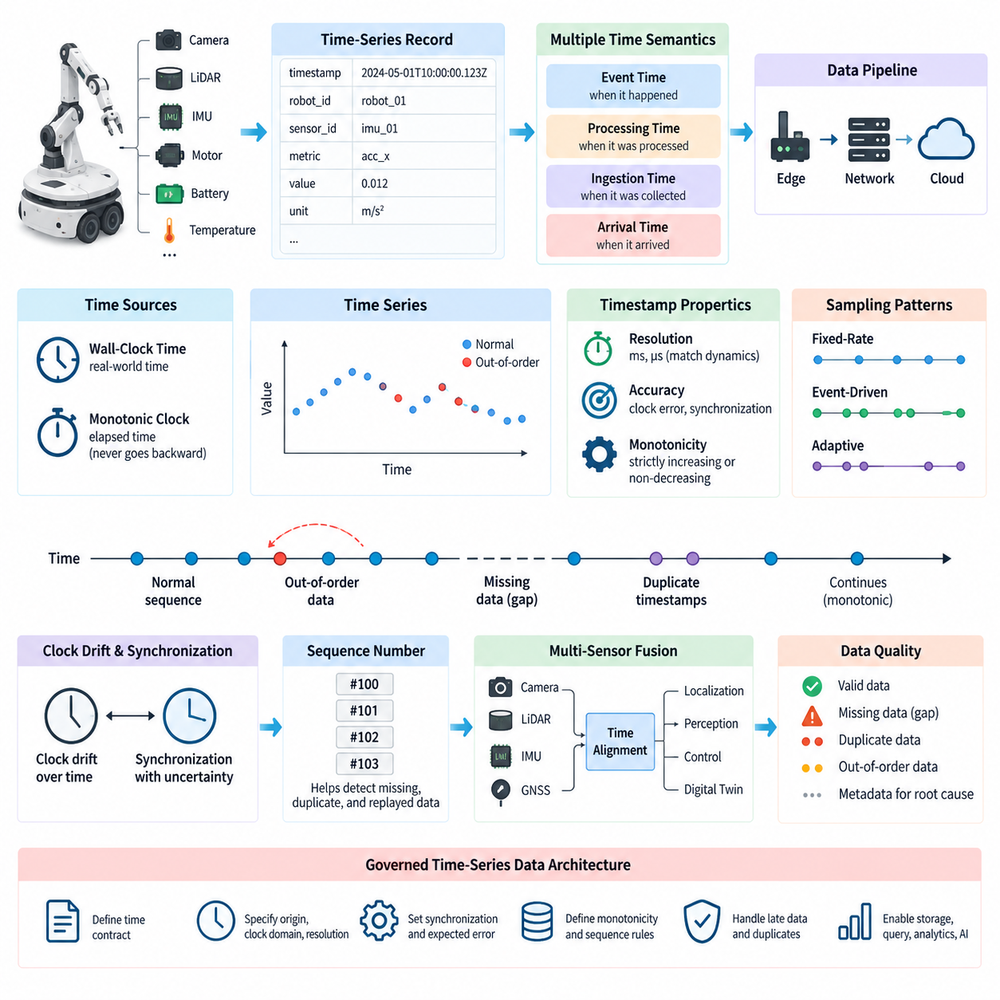
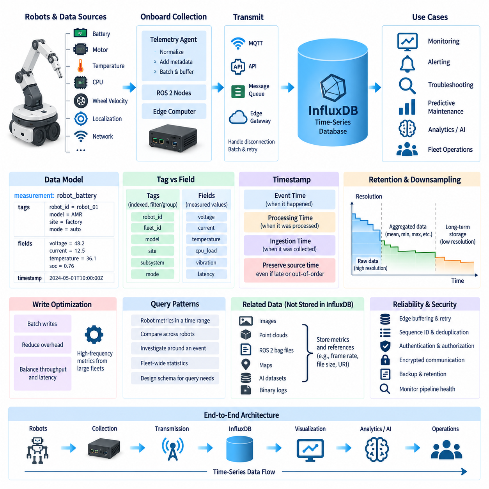
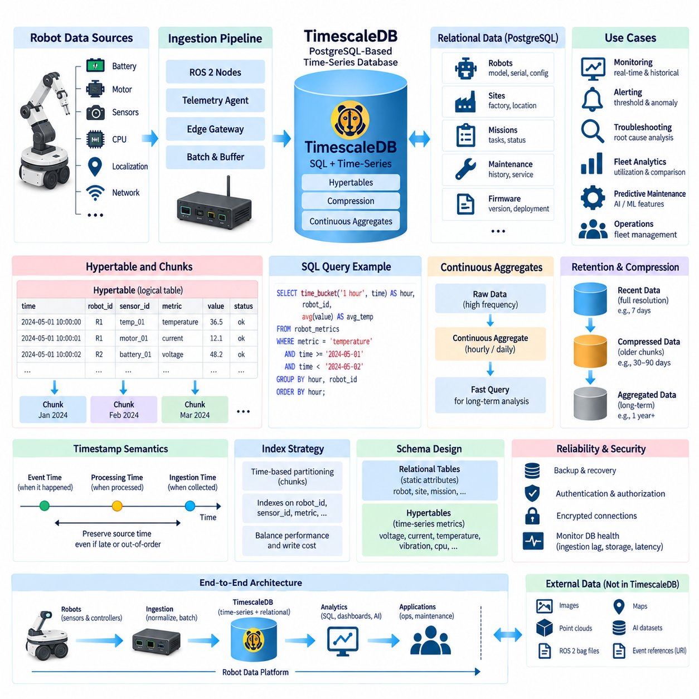
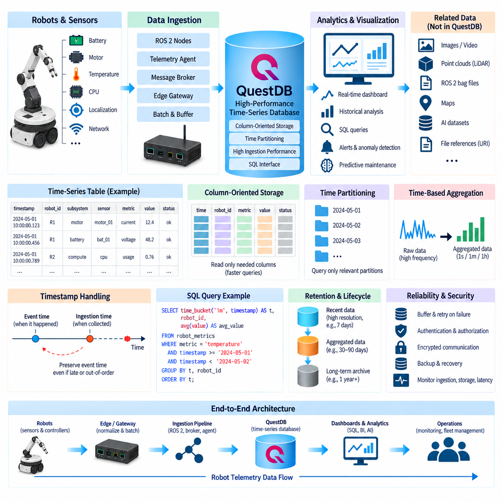
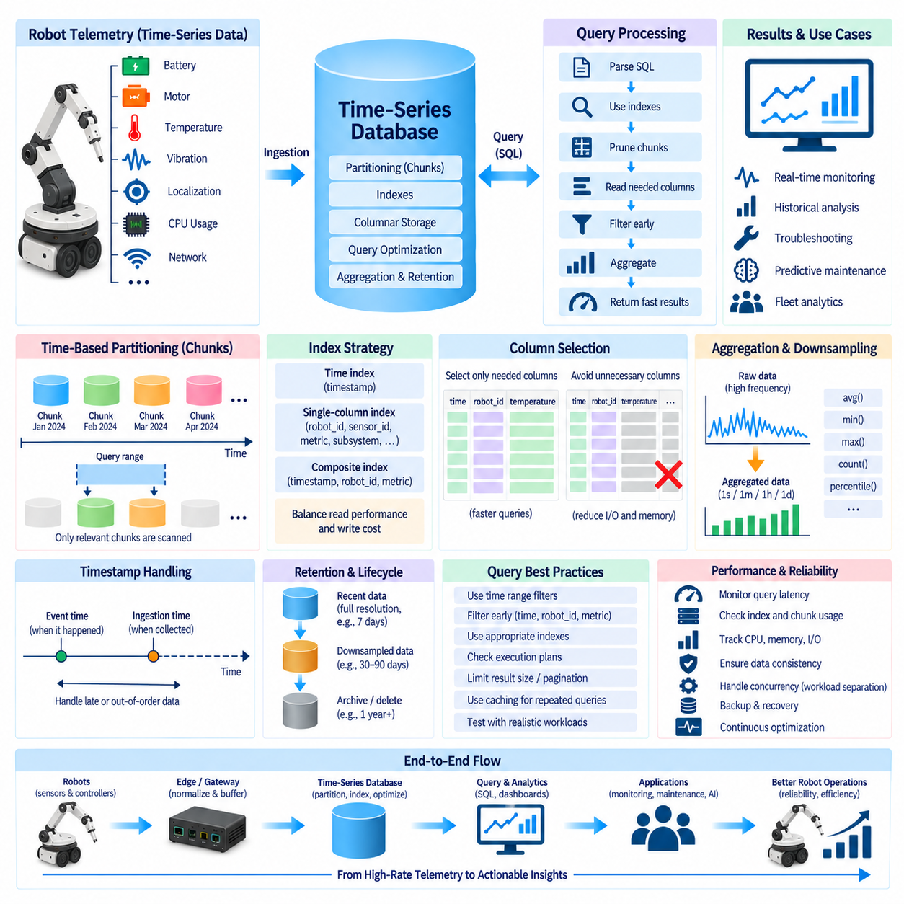
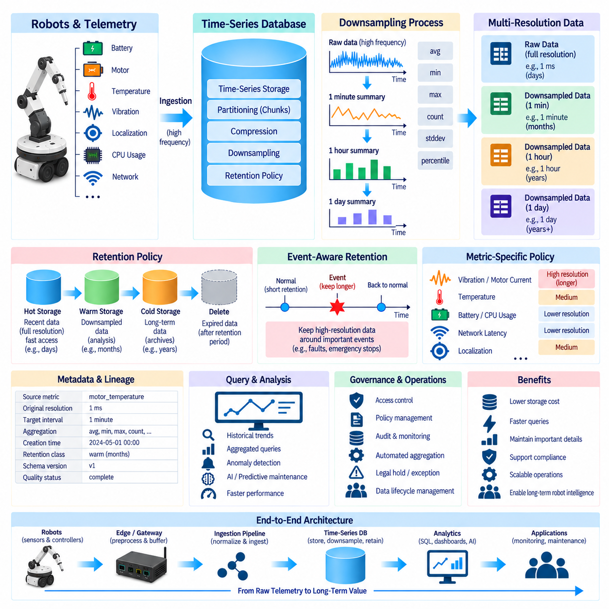
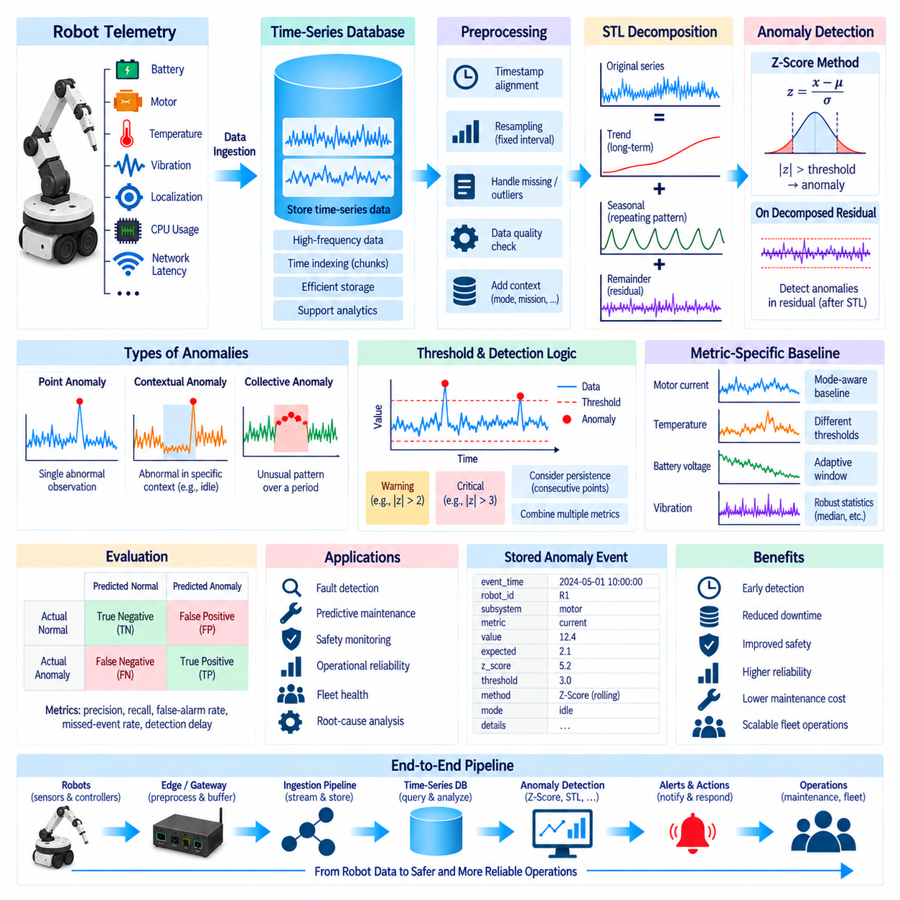
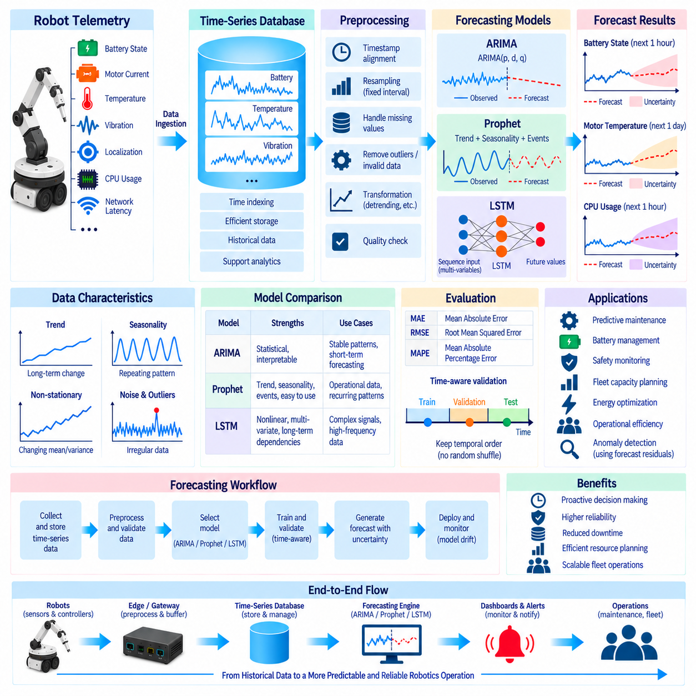
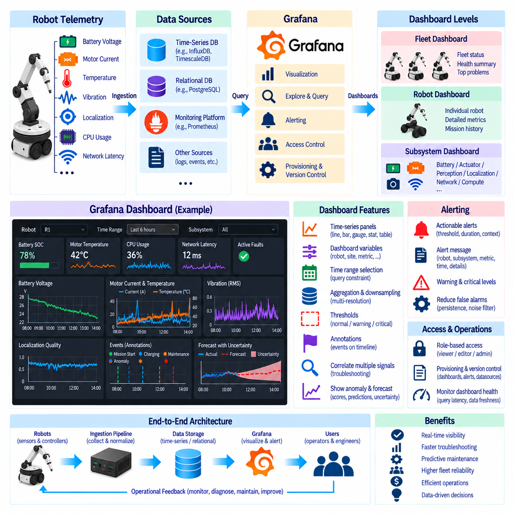
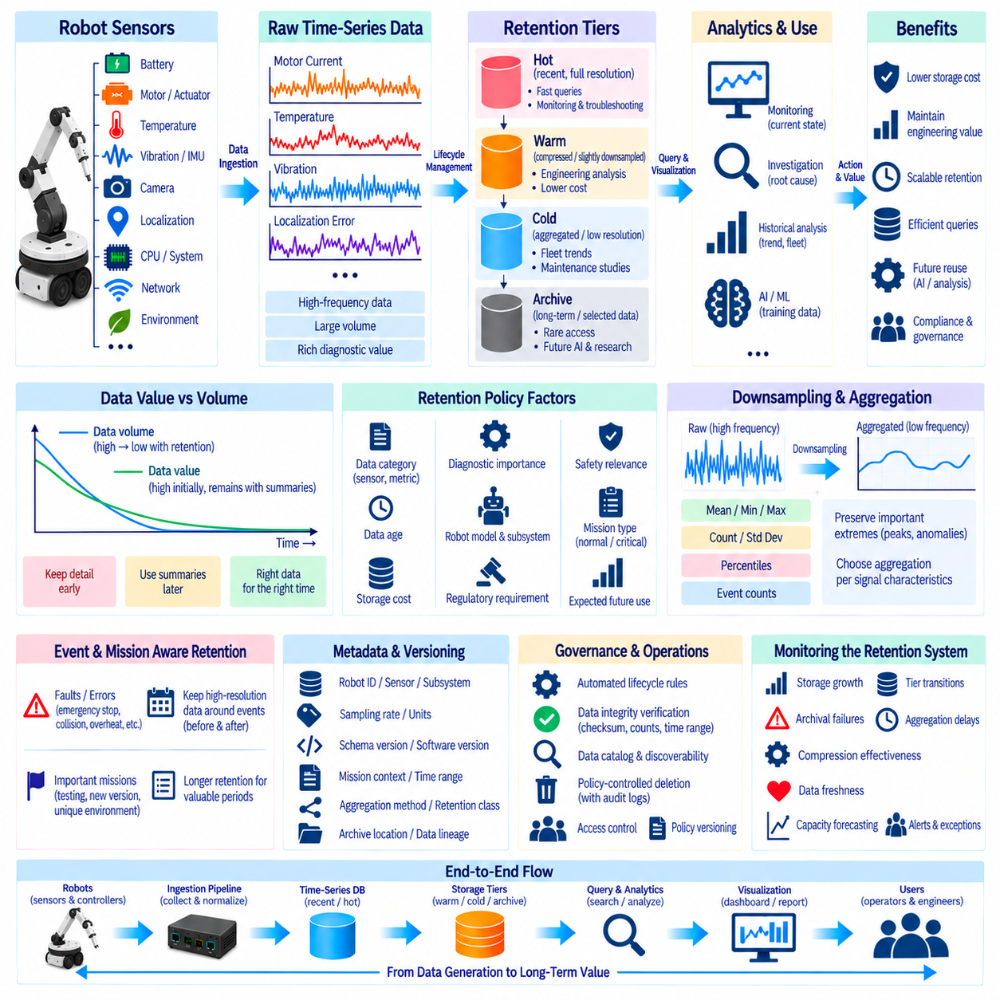

**Volume 07 Robot Data Architecture**

# 05. Time Series Data

## 05.01 Time Series Data Characteristics: Timestamp / Monotonic

{width="7.268055555555556in" height="7.268055555555556in"}

시계열 데이터(Time-Series Data)는 대부분의 물리적 상태가 시간에 따라 지속적으로 변화하는 로봇 텔레메트리(Robot Telemetry)를 표현하기 위한 기본적인 데이터 형태이다. 모터 전류, 배터리 전압, 휠 속도, 관절 위치, CPU 온도, 위치추정 신뢰도, 진동, 네트워크 지연시간 등은 개별 값 자체뿐만 아니라 언제 발생했으며 어떤 순서로 관측되었는지를 함께 고려해야 의미를 갖는다.

시계열 레코드(Time-Series Record)는 일반적으로 타임스탬프(Timestamp)와 하나 이상의 측정값(Measured Value), 그리고 문맥을 식별하기 위한 식별자(Identifier)를 결합한다. 로봇은 타임스탬프, 로봇 ID, 센서 ID, 메트릭 이름, 값, 단위 등의 레코드를 생성할 수 있다. 타임스탬프는 시간 좌표를 정의하고 식별자는 서로 다른 장치나 서브시스템에서 생성된 데이터 스트림(Data Stream)을 구분한다.

타임스탬프 의미론(Timestamp Semantics)은 하나의 로봇 데이터 파이프라인(Data Pipeline) 안에서도 여러 종류의 시간이 존재할 수 있으므로 명확하게 정의해야 한다. 센서는 물리적 측정값이 획득된 순간을 기록할 수 있고, 제어기는 메시지가 생성된 시간을 추가할 수 있으며, 엣지 게이트웨이(Edge Gateway)는 데이터가 수집된 시점을 기록할 수 있다. 클라우드 플랫폼(Cloud Platform)에서도 레코드가 도착한 시간을 별도로 추가할 수 있다.

이벤트 시간(Event Time)은 관측이나 사건이 실제 물리 시스템에서 발생한 시점을 의미하며, 처리 시간(Processing Time)은 소프트웨어가 해당 데이터를 처리한 시점을 의미한다. 저지연 시스템(Low-Latency System)에서는 두 시간의 차이가 작아 보일 수 있지만, 무선 통신 지연, 버퍼링(Buffering), CPU 스케줄링, 재전송, 일시적인 네트워크 단절 등이 발생하면 그 차이는 크게 증가할 수 있다.

타임스탬프 해상도(Timestamp Resolution)는 측정 대상의 동적 특성에 맞추어 결정해야 한다. 배터리 충전 상태(State of Charge)처럼 천천히 변화하는 정보는 비교적 낮은 시간 해상도로도 충분하지만, 관성측정장치(IMU), 모터 제어 신호, 진동 데이터, 고주기 위치추정 스트림에는 밀리초(Millisecond) 또는 마이크로초(Microsecond) 수준의 정밀도가 필요할 수 있다. 지나치게 높은 해상도는 저장 및 처리 부담을 증가시킬 수 있다.

클록 정확도(Clock Accuracy)와 타임스탬프 해상도(Timestamp Resolution)는 서로 다른 속성이다. 시스템이 나노초(Nanosecond) 단위의 필드를 저장하더라도 실제 물리적 클록이 수 밀리초만큼 부정확할 수 있다. 반대로 잘 동기화된 클록은 저장 해상도가 다소 낮더라도 신뢰할 수 있는 순서를 제공할 수 있다. 따라서 시간 정밀도는 데이터 형식만으로 판단해서는 안 된다.

단조성(Monotonicity)은 관측 데이터가 생성될 때 타임스탬프 또는 순서 좌표가 일관되게 앞으로 진행되는지를 나타낸다. 엄격 증가 시계열(Strictly Increasing Series)은 새로운 타임스탬프가 항상 이전 값보다 커야 하며, 비감소 시계열(Non-Decreasing Series)은 동일한 타임스탬프를 허용한다. 이러한 단조 순서는 윈도 계산, 보간, 변화율 계산, 상태 재구성 및 데이터베이스 수집 과정을 단순화한다.

벽시계 시간(Wall-Clock Time)은 로봇의 관측 데이터를 실제 날짜 및 시간과 연결할 때 필요하지만 경과 시간을 측정하는 용도로 항상 적합한 것은 아니다. 시간 동기화나 관리자의 시간 변경과 같은 보정으로 벽시계 값이 변경될 수 있기 때문이다. 반면 단조 클록(Monotonic Clock)은 경과 시간에 따라 전진하며 일반적인 시간 보정 때문에 뒤로 이동하지 않도록 설계된다.

분산 로봇 시스템(Distributed Robot System)에서는 하나의 프로세스 내부보다 전역 타임스탬프 단조성(Global Timestamp Monotonicity)을 보장하기가 훨씬 어렵다. 카메라, 라이다(LiDAR), 관성측정장치(IMU), 모터 제어기, 엣지 컴퓨터(Edge Computer), 클라우드 서비스(Cloud Service)는 서로 다른 클록과 동기화 방식을 사용할 수 있다. 작은 클록 오프셋(Clock Offset)이나 드리프트(Drift)도 센서 간 데이터 순서를 왜곡할 수 있다.

클록 드리프트(Clock Drift)는 물리적인 클록들이 완전히 동일한 속도로 진행하지 않기 때문에 발생한다. 작은 주파수 차이라도 장시간의 로봇 임무에서는 상당한 타임스탬프 오차로 누적될 수 있다. 동기화 메커니즘(Synchronization Mechanism)은 이러한 차이를 주기적으로 추정하고 보정하지만, 네트워크 비대칭성과 가변 지연으로 인해 동기화 자체에도 불확실성이 존재한다. 정밀한 다중 센서 상관관계 분석에서는 이러한 시간 품질도 함께 관리해야 한다.

네트워크에 연결된 로봇은 각 장치의 클록이 정확하더라도 순서가 뒤바뀐 데이터(Out-of-Order Data)를 생성할 수 있다. 메시지가 서로 다른 네트워크 경로를 사용하거나, 큐(Queue)에 머무는 시간이 달라지거나, 일시적인 통신 장애 이후 재전송될 수 있기 때문이다. 따라서 늦게 도착한 레코드가 더 이전의 이벤트 타임스탬프를 가질 수 있으며, 스트리밍 시스템(Streaming System)은 도착 순서와 이벤트 시간 순서를 구분해야 한다.

누락된 타임스탬프(Missing Timestamp)는 단순한 숫자형 널 값(Null Value)이 아니라 시간상의 공백(Gap)을 형성한다. 이러한 공백은 센서 드롭아웃(Sensor Dropout), 통신 장애, 선택적 샘플링(Selective Sampling), 저장 손실 또는 의도적인 데이터 획득 주기 변경을 의미할 수 있다. 원인이 서로 다르기 때문에 시계열 처리 시스템은 정상적인 무데이터 상태와 비정상적인 데이터 손실을 구별할 수 있는 메타데이터(Metadata)를 유지해야 한다.

중복 타임스탬프(Duplicate Timestamp) 역시 신중하게 처리해야 한다. 여러 채널이 동시에 샘플링되면 동일한 타임스탬프를 갖는 복수의 측정값이 정상적으로 존재할 수 있지만, 메시지 재생(Replay)이나 재시도(Retry)로 인해 중복이 발생할 수도 있다. 따라서 견고한 스키마(Schema)는 타임스탬프만을 고유 식별자로 사용하기보다 로봇 ID, 소스 ID, 메트릭 식별자, 시퀀스 번호 또는 이벤트 ID를 함께 사용해야 한다.

샘플링 간격(Sampling Interval)은 시계열의 시간적 밀도를 결정한다. 고정 주기 샘플링(Fixed-Rate Sampling)은 대체로 일정한 시간 간격으로 관측값을 생성하지만, 이벤트 기반(Event-Driven) 또는 적응형 데이터 획득(Adaptive Acquisition)은 불규칙한 시간 간격을 만든다. 실제 로봇 데이터셋에서는 두 방식이 동시에 존재하며, 제어 신호는 주기적이고 진단 이벤트는 비동기적이며 텔레메트리는 운용 조건에 따라 동적으로 다운샘플링(Downsampling)될 수 있다.

시퀀스 번호(Sequence Number)는 결정론적 순서(Deterministic Ordering)가 중요한 경우 타임스탬프를 보완한다. 타임스탬프가 관측값이 언제 발생했는지를 나타낸다면 시퀀스 번호는 생산자가 생성한 데이터 스트림에서 해당 레코드의 위치를 나타낸다. 두 정보를 함께 사용하면 누락된 레코드, 중복 데이터, 재생된 메시지 및 동일한 타임스탬프로 인해 발생하는 모호성을 보다 효과적으로 탐지할 수 있다.

여러 센서 모달리티(Sensor Modality)를 융합할 때 시간적 일관성(Temporal Consistency)은 더욱 중요해진다. 카메라 프레임, 포인트 클라우드(Point Cloud), 관성측정장치(IMU), 위성항법시스템(GNSS), 휠 오도메트리(Wheel Odometry), 액추에이터 상태는 서로 다른 주기로 동작할 수 있다. 센서 융합(Sensor Fusion)은 데이터베이스에 비슷한 시간에 저장된 데이터가 아니라 실제로 동일하거나 매우 가까운 물리적 시점에서 측정된 관측값을 필요로 한다.

실용적인 로봇 시계열 데이터 아키텍처(Robot Time-Series Data Architecture)는 시간을 단순한 부가 메타데이터가 아니라 관리 대상 데이터(Governed Data)로 취급해야 한다. 타임스탬프의 생성 원점, 클록 도메인(Clock Domain), 해상도, 동기화 방식, 예상 오차, 단조성, 시퀀스 의미론, 지연 도착 정책 및 중복 처리 규칙을 데이터 계약(Data Contract)의 일부로 명확하게 정의해야 한다. 이러한 기반은 이후 저장, 질의 최적화, 다운샘플링, 이상 탐지, 예측, 시각화 및 장기 보존을 위한 핵심 토대가 된다.

## 05.02 InfluxDB Architecture and Robot Metrics Storage [w/Code]

{width="7.268055555555556in" height="7.268055555555556in"}

InfluxDB는 데이터가 지속적으로 생성되고 시간(Time)을 기준으로 인덱싱되며 특정 시간 범위에 따라 분석되는 워크로드(Workload)를 위해 설계된 시계열 데이터베이스(Time-Series Database)이다. 로보틱스(Robotics)에서는 배터리 전압, 모터 전류, CPU 사용률, 온도, 휠 속도, 위치추정 품질, 작업 수행 시간, 네트워크 지연시간과 같은 운영 메트릭(Operational Metric)에 적합하다. 일반적인 트랜잭션 저장소와 달리 타임스탬프 기반 측정값의 효율적인 수집과 조회를 중점적으로 처리한다.

로봇 메트릭(Robot Metric)은 일반적으로 온보드 제어기(Onboard Controller), ROS 2 노드(Node), 센서 처리 모듈(Sensor-Processing Module), 엣지 컴퓨터(Edge Computer), 플릿 관리 서비스(Fleet-Management Service)에서 연속적인 스트림(Stream) 형태로 생성된다. InfluxDB 기반 아키텍처는 텔레메트리 에이전트(Telemetry Agent)나 애플리케이션 인터페이스(Application Interface)를 통해 이러한 데이터를 수집하고 시계열 레코드(Time-Series Record)로 구성할 수 있다. 각 레코드는 측정값을 타임스탬프와 문맥 정보에 연결한다.

논리적 데이터 모델(Logical Data Model)은 자주 조회되는 차원(Dimension)과 실제 측정되는 수치값을 구분해야 한다. 로봇 메트릭은 모니터링 영역을 나타내는 측정항목(Measurement), 로봇 또는 서브시스템 문맥을 나타내는 태그(Tag), 실제 측정값을 저장하는 필드(Field), 관측 시점을 나타내는 타임스탬프(Timestamp)로 구성할 수 있다. 예를 들어 배터리 측정항목은 로봇, 배터리 팩, 운용 모드를 식별하면서 전압, 전류, 온도, 충전 상태(State of Charge)를 필드로 저장할 수 있다.

태그(Tag)는 시계열 데이터를 필터링하고 그룹화하는 데 사용되는 인덱싱된 차원(Indexed Dimension)을 제공하므로 특히 중요하다. 로봇 ID, 플릿 ID, 모델, 사이트, 서브시스템, 운용 모드는 일반적인 질의를 지원하는 유용한 태그 후보가 될 수 있다. 그러나 고유값의 종류나 조합이 지나치게 많고 지속적으로 증가하는 데이터는 신중하게 선택해야 한다. 부적절한 태그 설계는 시리즈 카디널리티(Series Cardinality)를 과도하게 증가시켜 메모리와 인덱싱 부하를 높일 수 있다.

필드(Field)는 실제 메트릭 값을 저장하며 일반적으로 시간에 따라 반복적으로 변화하는 물리량을 표현한다. 모터 전류, 관절 온도, CPU 부하, 메모리 사용률, 배터리 전압, 위치추정 오차, 진동 수준, 통신 지연시간 등이 대표적인 필드 값이다. 이러한 값을 설명용 태그와 분리하면 데이터베이스는 효율적인 필터링 차원을 유지하면서 모니터링, 진단, 통계 분석 및 예지보전(Predictive Maintenance)에 필요한 고주기 수치 데이터를 저장할 수 있다.

타임스탬프 설계(Timestamp Design)는 저장 아키텍처에서도 핵심 요소이다. 타임스탬프는 명확하게 정의된 시간적 사건을 나타내야 하며, 가능하면 실제 물리적 측정이나 소스 이벤트가 발생한 이벤트 시간(Event Time)을 사용하는 것이 바람직하다. 엣지 버퍼링(Edge Buffering)이나 네트워크 재전송으로 데이터 전달이 지연되더라도 데이터베이스 입력 시간이 원래 타임스탬프를 임의로 대체해서는 안 된다. 원본 시간을 보존하면 늦게 도착하거나 순서가 뒤바뀐 데이터에서도 로봇 동작을 올바르게 재구성할 수 있다.

실용적인 수집 경로(Ingestion Path)는 로봇 센서와 제어 소프트웨어에서 시작하여 온보드 텔레메트리 수집기(Onboard Telemetry Collector), 엣지 게이트웨이(Edge Gateway) 또는 메시지 인프라(Message Infrastructure)를 거쳐 InfluxDB에 도달할 수 있다. 수집기는 전송 전에 메트릭 이름, 타임스탬프, 단위, 로봇 식별자 및 품질 메타데이터(Quality Metadata)를 표준화할 수 있다. 여러 레코드를 배치(Batch)로 묶으면 통신과 쓰기 부하를 줄일 수 있으며 엣지 버퍼링은 연결 장애 시 데이터 연속성을 보호한다.

플릿(Fleet)이 높은 주기로 많은 메트릭을 생성하면 쓰기 성능(Write Performance)이 중요해진다. 각 관측값마다 독립적인 데이터베이스 연산을 수행하는 대신 텔레메트리 서비스는 레코드를 적절한 크기의 배치로 모아 주기적으로 전송할 수 있다. 이를 통해 프로토콜 및 트랜잭션 오버헤드(Overhead)를 줄일 수 있다. 그러나 배치 크기와 플러시 간격(Flush Interval)은 처리량(Throughput)과 지연시간(Latency) 사이에서 균형을 이루어야 한다.

InfluxDB 저장소는 로봇 데이터의 서로 다른 시간적 요구사항을 반영해야 한다. 고주기 원시 메트릭(Raw Metric)은 최근 장애 분석에는 매우 유용하지만 전체 해상도로 무기한 저장하면 비용이 커질 수 있다. 오래된 관측값은 평균, 최솟값, 최댓값, 백분위수(Percentile), 개수, 표준편차와 같은 집계 통계(Aggregated Statistics)로 표현할 수 있다. 보존 정책(Retention Policy)과 다운샘플링(Downsampling)을 이용하면 상세한 최신 데이터와 압축된 장기 데이터를 함께 유지할 수 있다.

로봇 메트릭은 일관된 명명 규칙(Naming Convention)과 단위 규칙(Unit Convention)을 따라야 한다. 서로 다른 세대의 로봇에서 동일한 물리량에 서로 다른 단위나 메트릭 이름을 사용하면 플릿 전체 분석이 어려워진다. 따라서 메트릭 계약(Metric Contract)은 측정항목 이름, 필드 이름, 단위, 타임스탬프 의미론, 태그 규칙, 유효 범위 및 버전 정보를 정의하여 하드웨어와 소프트웨어가 변경되더라도 대시보드와 분석 기능의 호환성을 유지해야 한다.

질의 패턴(Query Pattern)은 초기 단계부터 스키마 설계(Schema Design)에 반영되어야 한다. 플릿 운영자는 특정 임무 동안 로봇의 메트릭을 조회하거나, 여러 로봇의 동일한 메트릭을 비교하거나, 장애 이벤트 전후의 데이터를 분석하거나, 선택한 시간 범위에서 플릿 전체 통계를 계산해야 할 수 있다. 데이터 수집 성능만 고려해 최적화된 스키마는 이러한 운영 질의에서 낮은 성능을 보일 수 있으므로 시간 범위, 로봇 ID, 서브시스템 및 메트릭 범주를 주요 조회 조건과 정렬해야 한다.

InfluxDB는 모든 종류의 로봇 데이터를 저장하는 범용 저장소(Universal Repository)가 아니라 운영 텔레메트리 저장소(Operational Telemetry Store)로 활용하는 것이 적합하다. 대용량 카메라 이미지, 라이다 포인트 클라우드(LiDAR Point Cloud), ROS 2 백(Bag) 파일, 지도, AI 데이터셋, 바이너리 진단 파일은 대용량 객체나 전문 데이터셋에 적합한 저장 시스템에서 관리하는 것이 바람직하다. InfluxDB에는 프레임률, 드롭 프레임 수, 파일 크기, 기록 상태, 센서 상태 또는 외부 데이터 위치를 나타내는 URI와 같은 관련 메트릭과 참조정보를 저장할 수 있다.

데이터베이스는 로봇 관측가능성(Observability) 워크플로와 연결될 때 특히 유용하다. 대시보드(Dashboard)는 배터리 방전, 모터 온도, 컴퓨팅 자원 사용률, 통신 품질, 임무 진행률, 위치추정 상태 등을 지속적으로 갱신되는 시계열 형태로 표시할 수 있다. 경보 로직(Alerting Logic)은 최근 시간 구간을 평가하여 임계값 초과나 비정상적인 추세를 탐지할 수 있으며, 엔지니어는 동일한 시간대의 여러 측정값을 상관 분석하여 장애 원인을 추적할 수 있다.

예지보전(Predictive Maintenance)은 이러한 아키텍처를 단순한 모니터링 이상의 영역으로 확장한다. 모터 전류, 진동, 온도, 충전 특성, 액추에이터 부하, 장애 발생 빈도 등의 장기 이력은 즉각적인 경보를 발생시키지 않는 점진적인 성능 저하를 발견하는 데 활용될 수 있다. 집계된 시계열 특징(Time-Series Feature)은 통계 분석이나 머신러닝(Machine Learning) 파이프라인으로 전달할 수 있으며, 원본 메트릭은 추적성(Traceability)을 위해 유지할 수 있다.

신뢰성(Reliability)을 확보하려면 수집 계층(Ingestion Layer)이 일시적인 통신 장애에서도 시간적 의미를 잃지 않아야 한다. 엣지 버퍼링은 메트릭을 로컬에 임시 저장하고 연결이 복구되면 다시 전송할 수 있다. 시퀀스 식별자(Sequence Identifier), 소스 타임스탬프(Source Timestamp), 중복 처리 규칙은 재전송으로 잘못된 레코드가 생성되는 것을 방지한다. 또한 수집률, 쓰기 실패, 큐 깊이, 저장 공간 사용량, 지연 레코드 및 데이터베이스 질의 지연시간 등 텔레메트리 파이프라인 자체도 모니터링해야 한다.

저장되는 정보가 단순한 기술 메트릭처럼 보이더라도 보안(Security)과 거버넌스(Governance)는 필요하다. 로봇 식별자, 사이트 이름, 운용 일정, 임무 패턴, 진단 상태는 중요한 운영 정보를 노출할 수 있다. 따라서 인증(Authentication), 권한 부여(Authorization), 암호화 통신, 데이터베이스 접근 제어, 백업 정책, 보존 규칙 및 감사 가능성(Auditability)을 배포 아키텍처에 포함해야 하며 엔지니어링, 운영, 분석, 서비스 역할에 따라 접근 수준을 구분할 수 있다.

전체 로봇 데이터 아키텍처(Robot Data Architecture)에서 InfluxDB는 시간 중심의 운영 측정값을 효율적으로 저장하고 조회하기 위한 전문 계층(Specialized Layer)을 제공한다. 핵심은 모든 신호를 단순히 시계열 데이터베이스에 저장하는 것이 아니라 체계적인 메트릭 스키마, 태그와 필드 규칙, 타임스탬프 의미론, 배치 처리, 보존 정책, 집계 및 관측가능성 정책을 확립하는 것이다. 이러한 기반은 이후 질의 최적화, 다운샘플링, 이상 탐지, 예측, 시각화 및 장기 보존 워크플로를 지원한다.

## 05.03 TimescaleDB: PostgreSQL-Based Time Series Extension [w/Code]

{width="7.268055555555556in" height="7.268055555555556in"}

TimescaleDB는 PostgreSQL의 관계형 데이터베이스 모델(Relational Database Model), SQL 인터페이스(SQL Interface), 트랜잭션(Transaction), 인덱스(Index), PostgreSQL 생태계(Ecosystem)를 유지하면서 시계열 워크로드(Time-Series Workload)에 특화된 기능을 확장한다. 로봇 데이터 아키텍처에서는 운영 텔레메트리(Operational Telemetry)를 로봇 식별정보, 하드웨어 구성, 임무, 사이트, 유지보수 기록, 플릿 메타데이터(Fleet Metadata)와 함께 분석해야 하는 경우가 많기 때문에 이러한 결합이 유용하다.

일반적인 PostgreSQL 테이블에서도 타임스탬프가 포함된 로봇 측정값을 저장할 수 있지만, 시계열 데이터의 규모와 질의 범위가 증가하면 매우 큰 워크로드를 처리하는 데 어려움이 발생한다. TimescaleDB는 시계열 데이터를 하이퍼테이블(Hypertable)로 구성하여 이러한 문제를 해결한다. 하이퍼테이블은 논리적인 테이블 추상화(Logical Table Abstraction)를 제공하면서 내부적으로 레코드를 더 작은 물리적 저장 단위로 분할한다.

따라서 하이퍼테이블(Hypertable)은 TimescaleDB 시계열 아키텍처의 핵심 추상화이다. 엔지니어는 타임스탬프, 로봇 식별자, 센서 식별자, 메트릭 값, 상태 및 기타 문맥 속성과 같은 컬럼(Column)을 정의하고, TimescaleDB는 수집되는 레코드를 청크(Chunk)에 분산한다. 애플리케이션은 익숙한 SQL 테이블을 사용하는 것처럼 데이터를 처리하지만 내부 저장 구조는 시간적 특성에 맞추어 관리된다.

청크(Chunk)는 하이퍼테이블 데이터의 일부를 나타내는 물리적 파티션(Physical Partition)이며 일반적으로 시간 간격에 따라 구성된다. 특정 기간의 로봇 메트릭을 조회하면 데이터베이스는 조건에 해당하는 레코드를 포함할 수 없는 청크를 스캔 대상에서 제외할 수 있다. 청크 간격(Chunk Interval)은 데이터 수집률, 질의 패턴, 보존 요구사항, 메모리 자원, 플릿에서 생성되는 예상 데이터량 등을 고려하여 결정해야 한다.

PostgreSQL의 관계형 모델(Relational Model)은 텔레메트리를 비즈니스 및 운영 엔터티(Operational Entity)와 연계해야 할 때 중요한 장점을 제공한다. 로봇 텔레메트리 하이퍼테이블은 로봇 모델, 배치 사이트, 고객, 임무, 유지보수 이력, 펌웨어 버전, 서브시스템 구성을 저장하는 관계형 테이블을 참조할 수 있다. SQL 조인(Join)을 통해 온도 이상을 해당 로봇의 하드웨어 버전, 현재 임무 또는 최근 유지보수 활동과 연결하여 분석할 수 있다.

스키마 설계(Schema Design)는 안정적인 관계형 속성과 빠르게 변화하는 시계열 관측값을 구분해야 한다. 로봇 일련번호, 모델 정의, 설치 사이트, 하드웨어 구성 등은 일반적인 관계형 테이블에 저장하는 것이 적합하며, 배터리 전압, 모터 전류, 온도, 진동, CPU 부하, 위치추정 오차, 통신 지연시간 등은 하이퍼테이블에 저장하는 것이 적합하다. 이러한 분리는 불필요한 데이터 중복을 줄이면서 구조화된 문맥 정보와 운영 측정값을 함께 조회할 수 있게 한다.

PostgreSQL이 풍부한 데이터 모델을 제공하더라도 타임스탬프 의미론(Timestamp Semantics)은 여전히 중요하다. 텔레메트리 행(Row)은 데이터베이스 입력 시간에만 의존하지 않고 실제 소스 측정값이나 이벤트가 발생한 시간을 보존해야 한다. 엣지 버퍼링(Edge Buffering), 간헐적 연결, 재전송으로 인해 데이터가 생성된 시점보다 늦게 도착할 수 있다. 정확한 소스 타임스탬프(Source Timestamp)는 원래의 물리적 순서를 복원하고 지연되거나 순서가 뒤바뀐 관측값을 정확하게 분석할 수 있게 한다.

인덱스(Index)는 질의가 추가적인 차원(Dimension)을 자주 필터링하는 경우 시간 기반 파티셔닝(Time-Based Partitioning)을 보완한다. 예상되는 질의 패턴에 따라 로봇 ID, 서브시스템, 센서 식별자, 임무 또는 기타 선택적 속성을 인덱스에 포함할 수 있다. 그러나 과도한 인덱싱(Indexing)은 모든 텔레메트리 레코드가 입력될 때 인덱스 유지 작업을 증가시키므로 쓰기 비용과 저장 공간 사용량을 높인다. 따라서 실제 질의 요구사항을 기반으로 인덱스 전략을 설계해야 한다.

TimescaleDB는 SQL을 주요 분석 인터페이스(Analytical Interface)로 유지하므로 로봇 시계열 데이터에 필터링, 그룹화, 조인, 윈도 함수(Window Function), 집계 계산(Aggregate Calculation)을 적용할 수 있다. 특정 기간의 평균 모터 온도, 최대 전류, 배터리 방전율, 임무 수행시간 또는 플릿 통계를 계산할 수 있다. 따라서 PostgreSQL에 익숙한 엔지니어가 별도의 완전히 새로운 질의 언어를 도입하지 않고도 시간 중심의 분석을 수행할 수 있다.

연속 집계(Continuous Aggregate)는 대규모 시계열 데이터의 요약 표현을 유지하는 데 활용할 수 있다. 시간별 또는 일별 통계를 계산하기 위해 매번 원시 측정값 전체를 반복적으로 스캔하는 대신 집계된 결과를 유지하여 장기 분석을 빠르게 수행할 수 있다. 로봇 플릿은 상세한 최신 텔레메트리를 유지하면서 장기 대시보드, 신뢰성 분석, 활용도 분석, 유지보수 추세처럼 모든 고주기 샘플이 필요하지 않은 작업에는 요약 데이터를 활용할 수 있다.

보존 정책(Retention Policy)은 로봇 텔레메트리의 수명주기(Lifecycle)를 제어하는 또 다른 메커니즘이다. 수십 대 또는 수백 대의 로봇이 운영 상태를 지속적으로 보고하면 고주기 측정 데이터는 매우 빠르게 증가한다. 원시 데이터는 제한된 진단 기간 동안 보존하고 집계된 정보는 훨씬 오랫동안 유지할 수 있다. 수명주기 정책은 엔지니어링 추적성, 서비스 요구사항, AI 분석 요구, 규제 조건, 저장 용량 및 과거 데이터의 가치를 고려해야 한다.

압축(Compression)은 오래된 시계열 레코드의 저장 공간을 추가로 줄이는 데 활용할 수 있다. 로봇 텔레메트리는 반복적인 식별정보와 시간적 지역성(Temporal Locality)을 갖는 측정값을 포함하는 경우가 많으므로 더 이상 자주 변경되지 않는 과거 데이터를 저장 최적화 대상으로 사용할 수 있다. 실용적인 아키텍처는 최신 데이터를 빈번한 쓰기와 상세한 장애 분석에 적합한 형태로 유지하면서 오래된 청크를 장기 분석에 적합한 효율적인 저장 형태로 전환할 수 있다.

수집 아키텍처(Ingestion Architecture)는 로봇 메트릭이 지속적으로 생성되는 특성을 고려해야 한다. ROS 2 노드, 제어기, 텔레메트리 에이전트(Telemetry Agent), 엣지 서비스(Edge Service)는 측정값을 표준화한 후 게이트웨이나 데이터 파이프라인을 통해 TimescaleDB로 전달할 수 있다. 배치 입력(Batch Insertion)은 통신과 트랜잭션 오버헤드를 줄이고 로컬 버퍼링(Local Buffering)은 일시적인 네트워크 장애에 대응한다. 이 과정에서도 원본 타임스탬프와 식별정보는 그대로 유지되어야 한다.

트랜잭션 지원(Transaction Support)은 시계열 데이터가 관계형 상태와 일관성 있게 상호작용해야 할 때 유용하다. 예를 들어 임무 상태 업데이트와 관련 운영 레코드는 제어된 데이터베이스 동작이 필요할 수 있으며, 유지보수 애플리케이션은 텔레메트리 분석과 서비스 기록을 함께 처리할 수 있다. PostgreSQL의 트랜잭션 기반은 데이터 일관성을 유지하기 위한 익숙한 메커니즘을 제공하지만 고주기 텔레메트리에서는 불필요한 트랜잭션 오버헤드와 경합(Contention)을 피하도록 설계해야 한다.

TimescaleDB는 시계열 저장소가 더 큰 로봇 데이터 플랫폼의 한 구성요소인 아키텍처에도 적합하다. 카메라 이미지, 라이다 포인트 클라우드(LiDAR Point Cloud), ROS 2 백(Bag) 기록, 지도, 대규모 AI 데이터셋은 각각의 크기와 접근 패턴에 적합한 저장 시스템에 유지하는 것이 바람직하다. 데이터베이스에는 이러한 외부 데이터와 구조화된 텔레메트리 분석을 연결하기 위한 타임스탬프, 메타데이터, 상태 메트릭, 이벤트 참조정보 또는 객체 위치를 저장할 수 있다.

운영 모니터링(Operational Monitoring)은 데이터베이스를 활용하여 개별 로봇과 플릿 전체의 동작을 모두 분석할 수 있다. 엔지니어는 선택한 시간 범위에서 온도, 전류, 진동, 배터리 상태, 컴퓨팅 자원 사용률, 위치추정 품질 및 네트워크 성능을 조회할 수 있다. 이러한 측정값을 임무 및 구성정보와 조인하면 하나의 환경에서 장애 분석, 성능 비교, 플릿 활용도 분석, 신뢰성 엔지니어링 및 예지보전 특징 생성(Predictive-Maintenance Feature Generation)을 지원할 수 있다.

PostgreSQL 기반 시계열 플랫폼과 전용 시계열 시스템(Dedicated Time-Series System) 사이의 선택은 단순한 데이터 수집 속도가 아니라 아키텍처 요구사항을 기준으로 이루어져야 한다. TimescaleDB는 로봇 텔레메트리가 관계형 정보와 밀접하게 공존해야 하고 SQL 호환성이 중요한 경우 특히 유용하다. 단순한 메트릭 수집에 집중하는 시스템은 다른 특성을 우선할 수 있지만 복잡한 운영 플랫폼은 시계열 질의와 관계형 질의를 결합함으로써 이점을 얻을 수 있다.

텔레메트리가 현장 장애를 진단하기 위한 중요한 증거가 될 수 있으므로 신뢰성(Reliability), 백업(Backup), 접근 제어(Access Control), 데이터베이스 운영(Database Operations)도 전체 설계에 포함되어야 한다. 데이터베이스 상태, 수집 지연, 저장 공간 증가, 질의 지연시간, 쓰기 실패 및 청크 동작 자체를 관측할 수 있어야 한다. 저장된 로봇 정보의 운영 중요도와 민감도에 따라 인증, 권한 부여, 암호화 연결, 역할 분리, 백업 절차 및 복구 전략을 적용해야 한다.

전체 로봇 데이터 아키텍처(Robot Data Architecture)에서 TimescaleDB는 대규모 시간 기반 측정 데이터와 PostgreSQL 기반 구조화 데이터 관리 사이를 연결하는 역할을 수행한다. 하이퍼테이블과 청크는 시간 중심의 확장성을 지원하고, SQL, 관계형 모델링, 조인, 인덱스, 집계, 보존 및 트랜잭션 기능은 PostgreSQL의 장점을 유지한다. 이러한 결합은 최근 장애 분석부터 플릿 분석, 장기 운영 이력 관리, AI 기반 유지보수 워크플로를 위한 데이터 준비까지 폭넓게 지원한다.

## 05.04 QuestDB: High-Performance Time Series Database [w/Code]

{width="7.268055555555556in" height="7.268055555555556in"}

QuestDB는 대량의 타임스탬프 기반 레코드를 지속적으로 수집하면서 빠른 분석 질의(Analytical Query)를 수행해야 하는 워크로드를 위해 설계된 고성능 시계열 데이터베이스(High-Performance Time-Series Database)이다. 로보틱스에서는 모터 전류, 배터리 전압, 관절 상태, 온도, 진동, 위치추정 품질, CPU 사용률, 네트워크 지연시간, 플릿 운영 메트릭(Fleet Operational Metric)과 같이 로봇과 엣지 시스템에서 높은 주기로 생성되는 텔레메트리 스트림(Telemetry Stream)에 적합하다.

데이터베이스 아키텍처(Database Architecture)는 추가 중심 시계열 데이터(Append-Oriented Time-Series Data)를 효율적으로 처리하는 데 중점을 둔다. 로봇 측정 데이터는 일반적으로 지속적으로 유입되며 원래의 이벤트 시간(Event Time)이 결정된 이후에는 거의 수정되지 않는다. QuestDB는 이러한 특성을 활용하여 시간 중심의 데이터 접근과 컬럼 지향 처리(Column-Oriented Processing)를 수행한다. 따라서 대량의 관측값을 수집하면서 최근 운용 상태나 과거 추세를 동시에 분석해야 하는 환경에 유용하다.

로봇 텔레메트리 테이블(Robot Telemetry Table)은 지정된 타임스탬프(Designated Timestamp)와 함께 로봇 식별자, 서브시스템 정보, 센서 이름, 운용 상태 및 측정값을 포함할 수 있다. 타임스탬프는 시간 기반 연산에 사용되는 주요 시간 차원(Temporal Dimension)을 정의한다. 모터, 배터리, 컴퓨팅 모듈, 위치추정 시스템 또는 통신 인터페이스의 측정값은 일관된 스키마(Schema)를 공유하면서 로봇, 서브시스템, 센서 또는 메트릭 속성을 통해 구분될 수 있다.

컬럼 지향 저장(Column-Oriented Storage)은 많은 질의가 전체 속성 중 일부만 사용하는 로봇 분석 워크로드에 적합하다. 모터 온도를 분석하는 대시보드는 배터리 전압이나 네트워크 지연시간 같은 관련 없는 컬럼을 읽지 않고 타임스탬프, 로봇 식별자, 온도 값만 필요로 할 수 있다. 관련 컬럼만 읽으면 불필요한 데이터 이동을 줄일 수 있으며, 많은 필드와 대규모 레코드를 포함하는 텔레메트리 테이블의 분석 효율을 향상시킬 수 있다.

파티셔닝(Partitioning)은 시간적 경계에 따라 시계열 데이터를 추가로 구성한다. 대규모 로봇 텔레메트리 테이블을 시간 중심의 파티션(Time-Oriented Partition)으로 나누면 특정 기간을 대상으로 하는 질의가 주로 관련 데이터만 처리할 수 있다. 적절한 파티셔닝 전략은 데이터 수집량, 플릿 규모, 질의 시간 범위, 보존 요구사항 및 운영 패턴에 따라 달라진다. 고주기 데이터를 생성하는 대규모 플릿은 상대적으로 작은 시스템보다 세밀한 시간 구성이 필요할 수 있다.

QuestDB는 SQL 중심 상호작용(SQL-Oriented Interaction)을 지원하여 엔지니어가 시계열 정보를 탐색할 때 익숙한 관계형 개념(Relational Concept)을 사용할 수 있도록 한다. 로봇 운영자는 시간 범위, 로봇 ID, 서브시스템 또는 운용 상태에 따라 측정값을 필터링하고 선택한 구간에 대한 집계값을 계산할 수 있다. SQL 접근성은 모든 엔지니어링 및 운영 애플리케이션에 완전히 새로운 전용 질의 모델을 도입하지 않고 기존 분석 워크플로에 텔레메트리를 통합할 수 있게 한다.

시계열 분석(Time-Series Analysis)에서는 원시 관측값을 일정한 시간 간격으로 그룹화해야 하는 경우가 많다. 높은 주기로 생성되는 모터 또는 센서 측정값을 초, 분, 시간 단위로 요약하여 대시보드와 장기 분석에 활용할 수 있다. 시간 기반 샘플링(Time-Based Sampling)을 이용하면 평균 온도, 최대 전류, 최소 배터리 전압 또는 통신 지연시간 통계 등을 계산하면서 시각화 및 분석 애플리케이션으로 반환해야 하는 개별 관측값의 수를 줄일 수 있다.

로봇 데이터가 항상 완벽한 타임스탬프 순서로 도착하는 것은 아니다. 무선 통신, 엣지 버퍼링(Edge Buffering), 일시적인 네트워크 장애, 재전송 또는 장치 간 클록 차이로 인해 늦게 도착하거나 순서가 뒤바뀐 관측값(Out-of-Order Observation)이 발생할 수 있다. 따라서 저장 아키텍처는 데이터 도착 순서가 물리적 발생 순서를 나타낸다고 가정하지 않고 원래 이벤트 타임스탬프(Event Timestamp)를 보존해야 한다. 이를 통해 전송 상황과 관계없이 실제 로봇에서 발생한 시간 흐름을 재구성할 수 있다.

로봇 플릿이 여러 개의 독립적인 스트림을 동시에 생성하는 환경에서는 높은 수집 성능(High Ingestion Performance)이 특히 중요하다. 카메라는 상태 메트릭을 생성하고, 모터 제어기는 전기적·열적 측정값을 전송하며, 내비게이션 모듈은 위치추정 품질을 보고하고, 엣지 컴퓨터는 자원 사용률을 제공할 수 있다. 효율적인 데이터 수집을 통해 각각의 서브시스템에 별도의 텔레메트리 데이터베이스를 구축하지 않고 이러한 스트림을 중앙 운영 저장소에 통합할 수 있다.

배치 처리(Batching)는 여러 로봇 관측값을 적은 수의 쓰기 작업으로 묶어 데이터 수집 효율을 향상시킬 수 있다. 로봇이나 엣지 게이트웨이에 위치한 텔레메트리 수집기(Telemetry Collector)는 짧은 시간 동안 측정값을 모은 후 데이터베이스로 전송할 수 있다. 이를 통해 통신 및 요청별 오버헤드를 줄이면서 준실시간 가시성(Near-Real-Time Visibility)을 유지할 수 있다. 배치 크기와 전송 간격은 허용 가능한 지연시간, 네트워크 조건, 장애 복구 요구사항 및 데이터 생성률을 고려하여 결정해야 한다.

QuestDB는 모든 로봇 구성요소를 데이터베이스에 직접 연결하는 대신 표준 텔레메트리 및 데이터베이스 인터페이스를 사용하는 아키텍처에 참여할 수 있다. ROS 2 노드, 임베디드 제어기(Embedded Controller), 텔레메트리 에이전트(Telemetry Agent), 메시지 브로커(Message Broker), 엣지 서비스(Edge Service)가 입력 신호를 표준화하여 수집 계층(Ingestion Layer)으로 전달할 수 있다. 이러한 분리를 통해 로봇 소프트웨어는 센싱과 제어에 집중하고 데이터 인프라는 저장, 질의, 보존 및 운영 분석을 담당할 수 있다.

기반 데이터베이스가 속도에 최적화되어 있더라도 스키마 설계(Schema Design)는 중요하다. 서로 다른 하드웨어 세대에서도 로봇, 플릿, 서브시스템, 센서, 메트릭 및 단위를 일관되게 식별할 수 있도록 안정적인 명명 규칙(Naming Convention)을 적용해야 한다. 소스, 단위 또는 운용 문맥이 명확하지 않은 온도 값은 분석 가치가 제한된다. 따라서 대규모 데이터 수집을 시작하기 전에 데이터 계약(Data Contract)을 통해 타임스탬프 의미론, 식별자, 측정 단위, 유효 범위, 품질 지표 및 스키마 버전 정보를 정의해야 한다.

높은 카디널리티(High Cardinality)를 갖는 속성도 신중하게 고려해야 한다. 로봇 일련번호와 센서 식별자는 필터링에 필수적일 수 있지만 지속적으로 변화하는 값은 구조적 식별자가 아니라 일반적으로 측정 데이터로 유지하는 것이 적절하다. 잘못된 데이터 모델링은 메타데이터 복잡성을 증가시키고 최적화된 시계열 엔진의 장점을 감소시킬 수 있다. 따라서 스키마 결정은 실제 플릿 질의, 그룹화 요구사항 및 예상 고유값 수를 고려해야 한다.

QuestDB는 로봇에서 생성되는 모든 종류의 정보를 저장하기보다는 구조화된 시간 기반 측정 데이터(Structured Temporal Measurement)를 저장하는 데 적합하다. 대용량 카메라 이미지, 비디오 스트림, 라이다 포인트 클라우드(LiDAR Point Cloud), 지도, ROS 2 백(Bag) 기록 및 AI 학습 데이터셋은 일반적으로 객체 저장소(Object Storage), 파일 시스템 또는 전문 데이터 플랫폼에 저장하는 것이 적절하다. 시계열 데이터베이스에는 관련 타임스탬프, 상태 메트릭, 프레임률, 드롭 프레임 수, 기록 상태, 파일 참조정보 등의 검색 가능한 메타데이터를 저장할 수 있다.

운영 대시보드(Operational Dashboard)는 저장된 텔레메트리를 이용하여 개별 로봇 또는 전체 플릿의 최근 및 과거 동작을 표시할 수 있다. 배터리 방전, 모터 온도, 액추에이터 전류, 컴퓨팅 부하, 위치추정 신뢰도, 임무 처리량 및 통신 지연시간을 선택된 기간에 따라 비교할 수 있다. 엔지니어는 장애 발생 전후의 변화를 조사하고 여러 서브시스템에서 서로 연관된 이상 현상이 발생했는지를 분석하여 장애 원인을 추적할 수 있다.

시계열 데이터는 이상 탐지(Anomaly Detection)와 예지보전(Predictive Maintenance)에도 활용할 수 있다. 진동, 온도, 전류, 충전 특성 또는 자원 사용률의 장기 이력은 개별 샘플만으로 발견하기 어려운 점진적인 변화를 보여줄 수 있다. 분석 파이프라인(Analytical Pipeline)은 데이터베이스 질의로부터 이동 통계(Rolling Statistics), 추세 또는 모델 특징(Model Feature)을 생성하여 외부 머신러닝 시스템에 제공하고, 원본 텔레메트리는 추적성과 엔지니어링 분석을 위해 유지할 수 있다.

보존 전략(Retention Strategy)은 시간이 지나면서 전체 해상도 텔레메트리의 가치가 변화한다는 점을 고려해야 한다. 최근의 고주기 측정값은 디버깅(Debugging)에 필수적일 수 있지만 오래된 데이터는 신뢰성 추세, 플릿 통계 또는 AI 특징 생성에 주로 활용될 수 있다. 따라서 원시 데이터(Raw Data), 집계 데이터(Aggregated Data), 장기 아카이브(Long-Term Archive)는 서로 다른 수명주기를 적용할 수 있다. 저장 정책은 장애 분석, 운영 이력, 규제 의무, 비용 및 향후 분석 가치를 함께 고려해야 한다.

데이터베이스 성능(Database Performance)은 단순한 데이터 수집 벤치마크가 아니라 종단간 특성(End-to-End Property)으로 평가해야 한다. 네트워크 전송, 텔레메트리 표준화, 배치 처리, 디스크 처리량, 동시 질의, 스키마 설계, 시간 범위 및 집계 복잡성이 실제 배포 환경의 성능에 모두 영향을 준다. 고성능 데이터베이스를 사용하더라도 잘못된 타임스탬프, 일관되지 않은 메트릭, 통제되지 않은 카디널리티 또는 연결 장애 시 데이터를 손실하는 수집 파이프라인의 문제를 해결할 수는 없다.

실제 로봇 운영 환경에서는 성능과 함께 신뢰성(Reliability)과 보안(Security)이 확보되어야 한다. 텔레메트리 수집기는 통신 장애 동안 데이터를 버퍼링하고 소스 타임스탬프를 훼손하거나 통제되지 않은 중복 데이터를 생성하지 않으면서 재전송할 수 있어야 한다. 데이터베이스 접근에는 인증, 권한 부여, 암호화 통신, 백업 및 복구 절차, 운영 모니터링을 적용해야 한다. 수집률, 저장 공간 증가, 질의 지연시간, 쓰기 실패 및 시스템 자원 사용률 자체도 관측 가능한 메트릭으로 관리해야 한다.

전체 로봇 데이터 아키텍처(Robot Data Architecture)에서 QuestDB는 대규모 타임스탬프 기반 운영 측정 데이터를 저장하고 분석하기 위한 고성능 선택지를 제공한다. 시간 중심 저장 구조, 컬럼 지향 분석 처리, 파티셔닝, SQL 접근, 효율적인 데이터 수집 및 시간 기반 질의 기능은 높은 요구 수준의 로봇 텔레메트리 워크로드에 적합하다. 체계적인 스키마와 데이터 수명주기 정책을 함께 적용하면 실시간 플릿 모니터링부터 장애 진단, 과거 데이터 분석, 이상 탐지 및 AI 기반 유지보수까지 연결할 수 있다.

## 05.05 Time Series Query Optimization: Indexes / Chunks

{width="7.268055555555556in" height="7.268055555555556in"}

시계열 질의 최적화(Time-Series Query Optimization)는 텔레메트리 테이블(Telemetry Table)이 지속적으로 증가하는 상황에서도 운영자가 최신 메트릭, 과거 추세, 장애 관련 데이터를 빠르게 조회해야 하므로 로봇 데이터 플랫폼에서 매우 중요하다. 모터 전류, 배터리 전압, 온도, 진동, 위치추정 품질, 컴퓨팅 자원 사용률은 플릿 전체에서 수십억 개의 레코드를 생성할 수 있다. 따라서 효율적인 질의는 단순히 데이터베이스 하드웨어를 확장하기보다 실제로 검사해야 하는 데이터의 양을 줄이는 데 중점을 두어야 한다.

시간(Time)은 일반적으로 시계열 질의에서 가장 중요한 필터링 차원(Filtering Dimension)이다. 운영 관련 질의는 대부분 최근 5분, 특정 임무 기간 또는 장애 발생 전후와 같이 제한된 시간 구간을 대상으로 한다. 따라서 가능한 경우 명시적인 타임스탬프 범위(Timestamp Range)를 질의에 포함해야 한다. 잘 설계된 시계열 엔진은 이러한 시간 범위를 이용하여 로봇 식별자, 메트릭, 상태 또는 추가 분석 조건을 평가하기 전에 관련 없는 저장 영역을 제외할 수 있다.

시간 기반 파티셔닝(Time-Based Partitioning)은 지속적으로 증가하는 논리적 데이터셋을 더 작은 물리적 영역으로 분할한다. 데이터베이스에 따라 이러한 영역은 청크(Chunk), 파티션(Partition) 또는 세그먼트(Segment)라고 부를 수 있다. 전체 텔레메트리 이력을 검색하는 대신 질의 계획기(Query Planner)는 조건에 해당하는 타임스탬프를 포함할 가능성이 있는 시간 영역만 선택한다. 이러한 프루닝(Pruning)은 데이터가 수개월 또는 수년간 누적되더라도 대부분의 운영 질의가 짧은 기간만 조회하는 환경에서 특히 효과적이다.

청크 크기(Chunk Size)는 성능에 큰 영향을 준다. 청크가 지나치게 크면 짧은 시간 범위의 질의에서도 상당한 양의 관련 없는 데이터를 읽어야 할 수 있다. 반대로 청크가 너무 작으면 데이터베이스가 많은 파티션과 관련 메타데이터를 관리해야 하므로 질의 계획과 유지관리 오버헤드가 증가한다. 적절한 청크 기간은 데이터 수집률, 플릿 규모, 일반적인 질의 범위, 메모리 용량, 보존 작업, 압축 전략 및 각 시간 구간에서 생성되는 데이터량을 고려하여 결정해야 한다.

인덱스(Index)는 불필요한 데이터 스캔을 방지하는 또 다른 메커니즘이다. 타임스탬프 인덱스는 시간 기반 접근을 가속할 수 있으며, 로봇 ID, 센서 ID, 서브시스템, 임무 또는 메트릭을 포함하는 인덱스는 자주 실행되는 필터링 패턴의 성능을 향상시킬 수 있다. 하나의 로봇에서 특정 시간 범위의 모터 온도를 조회하는 것처럼 여러 차원을 반복적으로 결합하는 질의에는 복합 인덱스(Composite Index)가 유용할 수 있다. 인덱스 컬럼 순서는 실제 질의 조건을 반영해야 한다.

인덱스를 많이 생성한다고 반드시 성능이 향상되는 것은 아니다. 모든 인덱스는 저장 공간을 사용하며 새로운 텔레메트리가 입력될 때마다 유지되어야 하므로 데이터 수집 처리량(Ingestion Throughput)을 감소시킬 수 있다. 고주기 로봇 시스템은 짧은 시간 동안 수천 개에서 수백만 개의 레코드를 삽입할 수 있기 때문에 불필요한 인덱스는 상당한 비용을 발생시킨다. 따라서 인덱스 설계는 읽기 성능 향상과 쓰기 증폭(Write Amplification), 메모리 사용량, 저장 공간, 유지관리 비용 사이의 균형을 고려해야 한다.

카디널리티(Cardinality)는 인덱스 효율성과 질의 계획 모두에 영향을 준다. 로봇 ID, 플릿 ID, 서브시스템, 센서 유형과 같은 속성은 유용한 선택적 필터(Selective Filter)를 제공하지만, 통제되지 않는 고유 식별자나 빠르게 변화하는 값은 매우 큰 인덱스 구조를 만들 수 있다. 엔지니어는 반복적으로 검색과 그룹화에 사용되는 차원과 단순히 기록만 필요한 값을 구분해야 한다. 따라서 스키마 설계(Schema Design)와 인덱싱 전략(Indexing Strategy)은 독립적으로 최적화하는 것이 아니라 함께 설계해야 한다.

질의 계획기(Query Planner)는 테이블 통계(Table Statistics), 인덱스, 파티션 메타데이터 및 조건식(Predicate)을 이용하여 실행 전략을 결정한다. 단순해 보이는 SQL 문장도 통계 정보가 오래되었거나 조건이 효율적인 프루닝을 방해하면 높은 비용을 발생시킬 수 있다. 중요한 텔레메트리 질의가 느려지면 실행 계획(Execution Plan)을 확인하여 예상하지 못한 청크를 스캔하는지, 유용한 인덱스를 사용하지 않는지, 너무 많은 행을 처리하는지 또는 비용이 높은 정렬과 집계를 수행하는지를 분석해야 한다.

필터링(Filtering)은 질의 처리 경로에서 가능한 한 이른 단계에 수행해야 한다. 한 로봇의 10분 동안의 온도를 요청하는 경우에는 비용이 높은 집계나 추가 테이블 조인을 수행하기 전에 시간, 로봇 식별정보, 메트릭 조건을 먼저 적용해야 한다. 작업 데이터셋(Working Dataset)을 초기에 줄이면 CPU, 메모리 및 입출력(I/O) 요구량이 감소한다. 이러한 원칙은 수백 대의 로봇 데이터를 처리할 수 있는 플릿 분석(Fleet Analytics)에서 특히 중요하다.

필요한 컬럼만 선택하는 것도 질의 비용을 줄인다. 타임스탬프, 모터 온도, 로봇 ID를 표시하는 대시보드는 텔레메트리 레코드에 저장된 모든 진단 속성을 읽을 필요가 없다. 컬럼 지향 엔진(Column-Oriented Engine)은 이러한 방식에서 직접적인 이점을 얻으며 관계형 시스템에서도 불필요한 컬럼 선택을 피하면 전송 및 처리 오버헤드를 줄일 수 있다. 명시적인 컬럼 선택은 데이터 의존성을 명확하게 하고 데이터베이스와 분석 클라이언트 사이의 불필요한 데이터 이동도 감소시킨다.

집계(Aggregation)는 고주기 스트림에서 반환되는 레코드 수를 크게 줄일 수 있다. 수개월의 데이터를 표시하는 시각화에서는 일반적으로 모든 밀리초 단위 샘플이 필요하지 않다. 관측값을 초, 분, 시간 또는 일 단위로 그룹화하고 평균, 최솟값, 최댓값, 개수, 백분위수(Percentile) 등의 통계 요약을 계산할 수 있다. 집계 간격(Aggregation Interval)은 분석 목적에 맞게 설정하여 필요한 시간적 세부정보를 유지하면서 성능을 향상시켜야 한다.

사전 계산 집계(Precomputed Aggregate) 또는 연속 집계(Continuous Aggregate)는 반복적인 대시보드와 보고 워크로드의 속도를 높일 수 있다. 원시 텔레메트리에서 시간별 배터리 통계를 매번 다시 계산하는 대신 새로운 데이터가 수집될 때 요약 결과를 유지할 수 있다. 장기간의 질의에서는 이러한 작은 집계 표현을 사용하고 최근 장애 분석에서는 전체 해상도의 원시 데이터를 사용할 수 있다. 이를 통해 필요한 시간적 상세도에 따라 질의 비용을 조절하는 다중 해상도 아키텍처(Multi-Resolution Architecture)를 구성할 수 있다.

다운샘플링(Downsampling)과 보존 정책(Retention Policy)은 전체 해상도로 유지되는 과거 데이터의 양을 제어하여 질의 최적화를 보완한다. 최근 텔레메트리는 상세한 진단을 위해 즉시 접근할 수 있도록 유지하고, 오래된 측정값은 수명주기 요구사항에 따라 집계, 압축, 아카이빙 또는 삭제할 수 있다. 활성 데이터셋이 작아지면 저장 공간 부담뿐만 아니라 캐시 효율, 인덱스 크기, 유지관리 작업 및 장기 분석 성능도 개선할 수 있다.

정렬 연산(Ordering Operation)은 대규모 텔레메트리 결과를 처리할 때 상당한 메모리와 CPU 자원을 소비할 수 있으므로 주의가 필요하다. 시계열 데이터는 자연스럽게 시간 순서로 조회되지만 애플리케이션은 불필요하게 넓은 데이터셋 전체를 정렬하지 않아야 한다. 시간 조건, 파티션 프루닝, 인덱스 또는 네이티브 시간 순서(Native Temporal Ordering)를 활용하여 명시적으로 정렬해야 하는 레코드 수를 줄여야 한다. 페이지네이션(Pagination)과 제한된 결과 집합도 과도한 질의 부하를 방지할 수 있다.

고주기 텔레메트리를 대규모 관계형 테이블 또는 다른 시계열 스트림과 결합하면 조인(Join) 비용이 크게 증가할 수 있다. 정적인 로봇 메타데이터는 시간 필터링을 통해 텔레메트리 데이터셋을 충분히 줄인 이후 조인하는 것이 일반적으로 효율적이다. 서로 다른 센서 스트림의 시간 정렬 조인(Time-Aligned Join)은 타임스탬프가 정확히 일치하지 않을 수 있으므로 추가적인 고려가 필요하며, 센서 상관관계에 요구되는 정밀도에 따라 최근접 시간 관계, 제한된 시간 윈도 또는 사전 정렬된 데이터셋을 사용할 수 있다.

캐싱(Caching)은 기반 데이터가 천천히 변경되는 반복적인 질의의 성능을 향상시킬 수 있다. 플릿 대시보드는 유사한 과거 시간 범위, 구성정보 또는 집계 통계를 반복적으로 요청하는 경우가 많다. 적절한 캐싱은 데이터베이스의 반복 계산을 줄일 수 있지만 빠르게 변화하는 최신 텔레메트리에는 데이터 최신성(Freshness)을 신중하게 관리해야 한다. 따라서 캐시 설계는 실시간 운영 화면과 과거 데이터 분석을 구분하여 성능 향상으로 인해 오래된 로봇 상태가 최신 상태처럼 표시되지 않도록 해야 한다.

실제 운영 플랫폼에서는 새로운 데이터가 지속적으로 수집되는 동시에 대시보드, 경보 시스템, 엔지니어, 유지보수 애플리케이션 및 AI 파이프라인이 텔레메트리를 조회할 수 있으므로 질의 동시성(Query Concurrency)도 고려해야 한다. 하나의 비용이 큰 과거 데이터 분석이 최근 안전 또는 상태 메트릭을 조회하는 운영 모니터링을 방해해서는 안 된다. 동시성이 증가하면 자원 제한, 워크로드 분리, 질의 시간제한, 복제본(Replica) 또는 전용 분석 경로를 적용할 수 있다.

성능 시험(Performance Testing)은 단순한 합성 질의(Synthetic Query)만이 아니라 실제 로봇 워크로드를 반영해야 한다. 대표적인 시험에는 예상 플릿 규모, 메트릭 생성 주기, 데이터 보존 기간, 일반적인 시간 범위, 동시 사용자, 집계 패턴 및 데이터 수집 활동이 포함되어야 한다. 실제 병목을 파악하려면 질의 지연시간뿐만 아니라 CPU 사용량, 메모리 소비량, 디스크 입출력, 캐시 동작, 스캔된 행이나 파티션 수, 데이터 수집 처리량을 함께 평가해야 한다.

데이터베이스 자체에 대한 관측가능성(Observability)은 지속적인 최적화를 가능하게 한다. 느린 질의 로그(Slow-Query Log), 실행 계획, 캐시 적중률(Cache Hit Rate), 인덱스 활용률, 청크 통계, 질의 지연시간, 저장 공간 증가 및 자원 사용량을 분석하면 로봇 플릿이 확대되면서 워크로드 특성이 어떻게 변화하는지 파악할 수 있다. 따라서 최적화는 스키마, 청크 간격, 인덱스, 집계 전략, 보존 규칙 및 질의를 실제 운영 측정 결과에 따라 지속적으로 조정하는 반복 과정으로 접근해야 한다.

전체 로봇 데이터 아키텍처(Robot Data Architecture)에서 효과적인 시계열 질의 최적화는 시간 기반 파티셔닝, 청크 프루닝(Chunk Pruning), 선택적 인덱스, 체계적인 스키마, 조기 필터링, 효율적인 집계 및 데이터 수명주기 관리(Data Lifecycle Management)를 결합하여 이루어진다. 하나의 인덱스나 데이터베이스 설정만으로는 범위가 제대로 제한되지 않은 질의나 통제되지 않는 데이터 증가 문제를 해결할 수 없다. 이러한 메커니즘을 통합적으로 설계하면 고주기 로봇 텔레메트리를 보존하면서도 빠른 대시보드, 장애 진단, 플릿 분석, 예지보전 및 장기 운영 분석을 지원할 수 있다.

## 05.06 Time Series Downsampling and Retention Policy [w/Code]

{width="7.268055555555556in" height="7.268055555555556in"}

다운샘플링(Downsampling)은 이후 분석에 필요한 통계적 또는 운영적 정보를 유지하면서 시계열 데이터(Time-Series Data)의 시간 해상도(Temporal Resolution)를 낮추는 과정이다. 로봇 시스템은 밀리초 또는 초 이하 간격으로 텔레메트리(Telemetry)를 생성할 수 있어 수개월 동안 운영하면 방대한 데이터셋이 만들어진다. 모든 원시 측정값(Raw Measurement)을 무기한 유지하는 것은 경제적이지 않으므로 데이터 아키텍처는 상세 관측값을 점진적으로 압축된 과거 데이터 형태로 전환하는 방법을 결정해야 한다.

로봇은 임무 수행 중 모터 전류, 관절 온도, 배터리 전압, 진동, CPU 사용률, 위치추정 품질, 네트워크 지연시간 및 기타 메트릭(Metric)을 지속적으로 생성할 수 있다. 최근의 고주기 샘플은 디버깅(Debugging)과 근본 원인 분석(Root-Cause Analysis)에 중요하지만 오래된 데이터는 주로 추세를 파악하거나 운영 기간을 비교하는 데 사용된다. 다운샘플링은 이러한 차이를 활용하여 밀집된 과거 데이터 스트림을 낮은 주기의 요약 데이터로 변환한다.

가장 단순한 다운샘플링 전략은 시간을 고정 윈도(Fixed Window)로 나누고 각 구간에 대한 대표값을 계산하는 것이다. 수 밀리초마다 수집된 측정값을 1초, 1분, 1시간 또는 1일 단위로 요약할 수 있다. 각 윈도에는 평균, 최솟값, 최댓값, 개수, 합계, 표준편차 또는 백분위수(Percentile) 등의 통계를 저장할 수 있다. 선택되는 통계는 모니터링, 진단, 신뢰성 분석 및 AI 워크플로에 필요한 특성을 보존해야 한다.

평균값(Average)만 사용하면 중요한 로봇 동작을 숨길 수 있다. 모터가 1분 동안 대부분 정상적으로 작동하다가 짧은 순간 위험한 전류 스파이크(Current Spike)를 경험하더라도 1분 평균값은 정상 범위처럼 보일 수 있다. 따라서 순간적인 이벤트가 중요한 경우 다운샘플링 데이터셋에는 극값(Extrema)이나 기타 분포 정보도 보존해야 한다. 최솟값, 최댓값, 백분위수, 분산, 개수 및 이상 지표(Anomaly Indicator)를 평균과 함께 사용하면 짧은 시간 동안 발생한 운영 변화를 보존할 수 있다.

샘플링 간격(Sampling Interval)은 모든 데이터 스트림에 하나의 해상도를 동일하게 적용하기보다 각 메트릭의 동적 특성을 반영해야 한다. CPU 사용률이나 배터리 상태는 비교적 거친 과거 시간 간격을 허용할 수 있지만 진동, 액추에이터 전류 또는 제어 관련 신호는 의미 있는 패턴을 보존하기 위해 더 세밀한 해상도가 필요할 수 있다. 따라서 메트릭별 정책(Metric-Specific Policy)은 모든 로봇 텔레메트리에 동일한 규칙을 적용하는 방식보다 높은 분석 가치를 제공할 수 있다.

다중 해상도 저장(Multi-Resolution Storage)은 대용량 텔레메리를 위한 실용적인 수명주기(Lifecycle)를 제공한다. 전체 해상도 데이터는 짧은 진단 기간 동안 유지하고, 중간 해상도의 요약 데이터는 최근 운영 분석에 사용하며, 더 낮은 해상도의 집계 데이터는 장기 추세 분석을 위해 유지할 수 있다. 예를 들어 원시 측정값은 며칠, 분 단위 요약은 수개월, 시간 또는 일 단위 통계는 수년 동안 유지할 수 있지만 실제 기간은 운영 요구사항에 따라 결정해야 한다.

보존 정책(Retention Policy)은 시계열 데이터의 각 유형과 해상도를 얼마 동안 사용할 수 있도록 유지할지를 정의한다. 보존은 단순한 저장 공간 정리 메커니즘이 아니라 정보의 미래 가치에 대한 명시적인 결정이다. 즉각적인 디버깅에 필요한 로봇 데이터는 보증 조사, 플릿 신뢰성 분석, 예지보전(Predictive Maintenance), AI 학습, 규제 증거 또는 장기적인 제품 개선에 사용되는 데이터와 서로 다른 보존 기간을 가질 수 있다.

보존 규칙(Retention Rule)은 데이터 가치, 저장 비용, 운영 위험 및 재구성 요구사항을 함께 고려해야 한다. 원시 텔레메트리를 너무 일찍 삭제하면 드물게 발생하는 현장 장애를 조사하지 못할 수 있지만 모든 고주기 신호를 무기한 유지하면 과도한 저장 공간과 관리 복잡성이 발생한다. 따라서 모든 샘플을 영구적으로 가치 있는 데이터로 취급하기보다 예상되는 엔지니어링 및 비즈니스 요구사항을 충족할 수 있는 충분한 증거를 보존하는 것이 중요하다.

계층형 보존 아키텍처(Tiered Retention Architecture)는 접근 빈도와 시간적 상세도에 따라 핫 데이터(Hot Data), 웜 데이터(Warm Data), 콜드 데이터(Cold Data)를 구분할 수 있다. 핫 저장소(Hot Storage)는 빠른 질의와 장애 분석을 위해 최근의 전체 해상도 텔레메트리를 저장한다. 웜 저장소(Warm Storage)는 정기적인 분석에 사용되는 다운샘플링 또는 압축 데이터를 저장하며, 콜드 저장소(Cold Storage)나 아카이브는 즉각적인 대화형 접근이 필요하지 않은 장기 요약 및 중요한 원시 데이터를 낮은 비용으로 보존할 수 있다.

다운샘플링은 일반적으로 해당 원시 데이터가 삭제되기 전에 수행되어야 한다. 시스템은 먼저 필요한 집계 데이터(Aggregated Data)가 성공적으로 생성되었는지 확인하고 생성된 데이터가 완전성과 품질 요구사항을 만족하는지 검증해야 한다. 이후에만 원래의 고해상도 레코드를 만료 대상으로 지정해야 한다. 이러한 순서는 대시보드, 분석 또는 유지보수 시스템에 필요한 과거 데이터 표현이 생성되기 전에 수명주기 자동화가 원본 데이터를 삭제하는 것을 방지한다.

연속 집계(Continuous Aggregation) 또는 예약 집계(Scheduled Aggregation)를 사용하면 이러한 변환을 자동화할 수 있다. 시계열 플랫폼은 완료된 새로운 시간 윈도를 주기적으로 처리하여 낮은 해상도의 표현을 생성할 수 있다. 로봇 텔레메트리는 엣지 버퍼링(Edge Buffering), 무선 네트워크 장애 또는 재전송으로 인해 늦게 도착할 수 있으므로 집계 과정에서는 지연 데이터(Late-Arriving Data)를 고려해야 한다. 수정 메커니즘이 없다면 늦게 도착한 데이터가 반영되기 전에 집계를 확정하여 불완전한 과거 통계를 만들 수 있다.

이벤트 인식 보존(Event-Aware Retention)은 일반적인 운영 구간보다 예외적인 기간을 더 높은 해상도로 보존할 수 있게 한다. 평상시에는 원시 텔레메트리를 짧은 기간만 유지하더라도 모터 장애, 비상 정지, 위치추정 실패, 충돌, 비정상 진동 또는 열적 이벤트 주변의 데이터는 장기간 보호할 수 있다. 이러한 전략은 모든 시간 구간에 동일한 보존 기간을 적용하지 않고 운영적으로 중요한 사건 주변의 상세한 증거를 유지하면서 저장 비용을 효율적으로 관리할 수 있게 한다.

임무 문맥(Mission Context)도 데이터 수명주기 결정에 영향을 줄 수 있다. 시운전, 검증, 특수 환경, 새로운 펌웨어 버전 또는 실험적 제어 알고리즘과 관련된 텔레메트리는 반복적인 일반 운영 데이터보다 장기적인 가치가 높을 수 있다. 보존 정책을 로봇 ID, 임무 ID, 소프트웨어 버전, 사이트, 서브시스템 또는 이벤트 분류와 연결하면 중복되는 과거 데이터는 줄이면서 전략적으로 중요한 관측값을 보존할 수 있다.

여러 메트릭을 함께 분석하려면 다운샘플링 과정에서도 시간 정렬(Temporal Alignment)을 유지해야 한다. 배터리, 모터, 위치추정 및 컴퓨팅 메트릭이 서로 호환되지 않는 시간 윈도로 집계되면 이후 상관관계 분석이 어렵거나 잘못된 결과를 만들 수 있다. 표준화된 윈도 경계와 명확하게 정의된 집계 의미론(Aggregation Semantics)을 사용하면 메트릭 간 분석의 신뢰성을 높일 수 있다. 시간대 처리, 이벤트 시간 정의, 불완전 윈도 및 지연 데이터 처리 방식도 일관되게 적용해야 한다.

메타데이터(Metadata)는 각 다운샘플링 데이터셋이 어떻게 생성되었는지를 설명해야 한다. 유용한 정보에는 소스 측정항목, 원본 해상도, 대상 시간 간격, 집계 함수, 생성 시간, 보존 등급, 스키마 버전 및 품질 상태가 포함된다. 이러한 데이터 계보(Data Lineage)를 유지하면 엔지니어가 원시 관측값과 파생된 요약 데이터를 구분하고 장기 로봇 동작을 분석할 때 특정 값이 평균, 최댓값, 백분위수, 개수 또는 다른 변환 결과인지를 정확하게 이해할 수 있다.

보존 정책은 데이터베이스 전체 수준에서만 적용하기보다 적절한 범위(Scope)에 따라 적용해야 한다. 서로 다른 플릿, 사이트, 로봇, 서브시스템 또는 메트릭 범주는 서로 다른 보존 기간을 필요로 할 수 있다. 안전 관련 장애 메트릭은 일반적인 CPU 사용률보다 오래 보존할 가치가 있으며, 대역폭이 큰 실험용 신호는 적극적인 만료 정책이 필요할 수 있다. 세분화된 정책(Policy Granularity)을 적용하면 모든 시계열 데이터를 하나의 수명주기로 강제하지 않고 운영 가치에 따라 저장 자원을 배분할 수 있다.

저장 압축(Storage Compression)은 다운샘플링을 보완하지만 서로 다른 목적을 수행한다. 압축은 보존되는 레코드의 논리적 값을 유지하면서 물리적 크기를 줄이는 반면, 다운샘플링은 낮은 해상도의 표현을 생성하여 관측값 자체의 수를 줄인다. 플랫폼은 두 방법을 함께 사용할 수 있다. 비교적 최근의 원시 텔레메트리는 압축하고, 오래된 기간은 다운샘플링하며, 정의된 보존 기간이 종료된 데이터는 아카이빙하거나 삭제할 수 있다.

수명주기 정책이 활성 고해상도 데이터의 양을 감소시키면 질의 성능(Query Performance)도 향상될 수 있다. 작은 핫 데이터셋은 더 적은 파티션, 인덱스 및 캐시 자원을 필요로 하며, 장기 대시보드는 수십억 개의 원시 샘플 대신 압축된 집계 데이터를 조회할 수 있다. 따라서 보존과 다운샘플링은 단순한 저장 비용 관리 수단이 아니라 플릿 규모와 운영 이력이 증가하는 상황에서도 예측 가능한 분석 성능을 유지하기 위한 중요한 메커니즘이다.

AI와 예지보전 요구사항은 일반적인 대시보드에서 필요한 기간보다 일부 원시 데이터를 더 오래 보존해야 하는 이유가 될 수 있다. 미세한 진동 변화, 액추에이터 성능 저하 또는 비정상적인 시간 패턴을 탐지하는 모델은 거친 집계 과정에서 사라지는 정보에 의존할 수 있다. 데이터 아키텍트(Data Architect)는 향후 학습 특징(Training Feature)이 될 가능성이 있는 신호를 식별하고 상세한 시간 구조의 가치가 결정되기 전에는 되돌릴 수 없는 다운샘플링을 피해야 한다.

거버넌스(Governance) 요구사항은 보존 규칙을 변경할 수 있는 주체와 데이터 삭제를 감사하는 방법을 정의해야 한다. 자동 만료(Automated Expiration)는 엔지니어링 증거를 영구적으로 제거할 수 있으므로 정책 변경은 통제되고 버전 관리되며 관측 가능해야 한다. 법적 보존(Legal Hold), 사고 조사, 보증 사례 또는 중요한 실험에는 일시적인 예외가 필요할 수 있다. 따라서 삭제 상태, 집계 완료 여부, 아카이브 이동 및 정책 실행 실패도 데이터 운영의 일부로 모니터링해야 한다.

성숙한 로봇 시계열 아키텍처(Robot Time-Series Architecture)는 다운샘플링과 보존을 독립적인 데이터베이스 설정이 아니라 통합된 수명주기 파이프라인(Lifecycle Pipeline)으로 취급한다. 데이터는 정의된 가치와 정책에 따라 고해상도 운영 텔레메트리에서 검증된 집계 데이터, 압축된 과거 데이터 계층, 아카이브 저장소를 거쳐 최종 삭제 단계로 이동한다. 이러한 접근 방식은 지속적으로 증가하는 로봇 데이터 환경에서 진단 상세도, 질의 성능, 저장 효율성, 거버넌스, 예지보전 및 장기 플릿 인텔리전스(Fleet Intelligence)의 균형을 유지한다.

## 05.07 Time Series Anomaly Detection: Z.Score / STL [w/Code]

{width="7.268055555555556in" height="7.268055555555556in"}

시계열 이상 탐지(Time-Series Anomaly Detection)는 예상되는 로봇 동작에서 벗어난 관측값이나 시간적 패턴을 식별하는 과정이다. 실제 로봇 운영에서는 모터 전류, 관절 온도, 배터리 전압, 진동, 위치추정 오차, CPU 사용률, 통신 지연시간 또는 임무 수행시간에서 이상이 나타날 수 있다. 이러한 편차를 조기에 탐지하면 비정상적인 동작이 더 큰 운영 장애로 발전하기 전에 장애 진단, 예지보전(Predictive Maintenance), 안전 모니터링 및 플릿 신뢰성(Fleet Reliability)을 지원할 수 있다.

이상(Anomaly)은 반드시 극단적인 수치만을 의미하지 않는다. 예를 들어 60°C의 온도는 높은 부하 상태에서는 정상일 수 있지만 유휴 상태에서는 의심스러울 수 있으며, 중간 수준의 진동도 예상보다 오랫동안 지속되면 비정상으로 판단할 수 있다. 따라서 시계열 이상 탐지는 모든 메트릭을 서로 독립적인 측정값의 집합으로 처리하기보다 시간적 문맥(Temporal Context), 운용 모드, 과거 분포, 추세 및 반복 패턴을 함께 고려해야 한다.

점 이상(Point Anomaly)은 개별 관측값이 주변 값이나 예상값에서 크게 벗어날 때 발생한다. 갑작스러운 모터 전류 스파이크(Current Spike), 배터리 전압 급락 또는 단발성 위치추정 오류가 대표적인 사례이다. 문맥 이상(Contextual Anomaly)은 이동 중에는 정상인 온도가 정지 상태에서는 비정상이 되는 것처럼 상황에 따라 결정된다. 집단 이상(Collective Anomaly)은 개별 관측값은 정상 범위에 있더라도 연속된 데이터의 전체 패턴이 비정상적인 경우를 의미한다.

Z-점수 탐지(Z-Score Detection)는 평균으로부터 비정상적으로 멀리 떨어진 관측값을 식별하는 간단한 통계적 방법을 제공한다. 측정값 x에 대한 표준화 점수는 z = (x − μ) / σ로 표현할 수 있으며, 여기서 μ는 예상 평균(Mean), σ는 표준편차(Standard Deviation)를 의미한다. 절대 Z-점수가 크다는 것은 해당 관측값이 기준 분포에서 멀리 떨어져 있음을 의미하며 선택된 임계값에 따라 이상으로 분류할 수 있다.

일반적인 구현에서는 과거 기준선(Historical Baseline) 또는 최근 이동 윈도(Moving Window)를 이용하여 평균과 표준편차를 계산한다. 이후 로봇 텔레메트리를 해당 기준에 따라 표준화할 수 있다. 모터 전류가 일반적으로 안정적인 운용 범위에 있다면 갑작스러운 편차로 높은 절대 Z-점수가 발생할 때 조사를 시작할 수 있다. 그러나 허용 가능한 민감도는 메트릭 특성, 운영 위험, 노이즈 수준 및 오경보 비용에 따라 달라지므로 임계값을 모든 상황에 동일하게 적용해서는 안 된다.

전역 Z-점수 탐지(Global Z-Score Detection)는 분석 기간 전체에서 비교적 안정적인 분포가 의미 있는 기준을 제공한다는 가정을 사용한다. 그러나 로봇 메트릭이 임무 단계, 적재량, 속도, 지형, 배터리 상태 또는 환경 조건에 따라 자연스럽게 변하면 이러한 가정이 성립하지 않을 수 있다. 하나의 전역 평균이 여러 정상 운용 상태를 혼합하면 정상적인 동작을 비정상으로 잘못 분류할 수 있으므로 다양한 로봇 운용 환경에서는 문맥별 기준선(Context-Specific Baseline)이 더 유용할 수 있다.

이동 Z-점수(Rolling Z-Score)는 최근 관측값에 맞추어 기준 분포를 조정한다. 이동 윈도에서 지역 평균(Local Mean)과 표준편차를 계산함으로써 변화하는 운용 조건에 대응할 수 있다. 이는 기준선이 점진적으로 변하는 신호의 탐지 성능을 향상시킬 수 있지만 윈도 크기(Window Size)가 중요한 매개변수가 된다. 짧은 윈도는 변화에 빠르게 적응하지만 노이즈에 민감할 수 있으며, 긴 윈도는 안정적이지만 실제 동작 변화에 느리게 반응할 수 있다.

Z-점수 방식은 분포가 심하게 비대칭이거나 빈번한 이상값(Outlier)을 포함하거나 분산이 거의 0에 가까운 경우에도 신뢰성이 떨어질 수 있다. 하나의 극단적인 이벤트가 이후 이상을 탐지하는 데 사용되는 평균과 표준편차 자체를 왜곡할 수 있다. 필요한 경우 중앙값 기반 통계(Median-Based Statistics)나 기타 강건 추정량(Robust Estimator)을 사용할 수 있다. 따라서 모든 텔레메트리 스트림에 동일한 탐지 규칙을 일괄적으로 적용하기보다 각 로봇 메트릭의 통계적 가정을 검증해야 한다.

많은 로봇 신호에는 단순한 임계값 방식으로 효과적으로 표현하기 어려운 추세(Trend)와 계절성 또는 주기적 동작(Seasonal or Periodic Behavior)이 포함된다. 배터리 전압은 임무 수행 중 점진적으로 감소할 수 있고, 열 관련 측정값은 시스템 시작 이후 증가할 수 있으며, 컴퓨팅 자원 사용률은 반복되는 작업 주기를 따를 수 있다. 일반적으로 STL이라고 하는 로이스 기반 계절성-추세 분해(Seasonal-Trend Decomposition using Loess)는 시계열을 추세, 계절성 및 잔차 성분으로 분리한다.

개념적으로 관측된 시계열은 추세(Trend), 계절 성분(Seasonal Component), 잔차(Remainder)의 결합으로 표현할 수 있다. 추세는 장기간의 점진적인 움직임을 나타내며, 계절 성분은 알려져 있거나 추정된 주기에 따라 반복되는 패턴을 나타낸다. 잔차는 이러한 요소로 설명되지 않는 변동을 포함한다. 이상 탐지는 잔차에 집중할 수 있으며, 예상되는 추세나 주기적 동작을 제거하면 기존 패턴에 가려져 있던 비정상적인 변화가 더 명확하게 나타날 수 있다.

로봇 운영에서 STL은 텔레메트리가 반복적인 주기를 나타낼 때 유용하다. 예를 들어 물류 로봇이 반복적으로 가속하고, 자재를 운반하고, 정지하고, 하역한 뒤 복귀한다면 모터 전류나 에너지 소비에서도 주기적인 패턴이 발생할 수 있다. 단순한 전역 임계값은 이러한 정상적인 상태 전환을 반복적으로 이상으로 판단할 수 있다. 분해(Decomposition)를 이용하면 반복 동작을 모델링하고 평소보다 비정상적으로 높은 전류와 같은 잔차 패턴을 식별할 수 있다.

적절한 계절 주기(Seasonal Period)를 선택하는 것은 시계열 분해에서 중요하다. 주기성은 제어 주기, 반복적인 제조 작업, 충전 일정, 교대 근무, 임무 또는 기타 반복적인 프로세스와 연관될 수 있다. 잘못된 주기 가정은 의미 있는 동작을 잘못된 성분으로 이동시켜 이상 탐지 품질을 저하시킬 수 있다. 따라서 엔지니어는 로봇 도메인 지식, 자기상관(Autocorrelation), 과거 패턴 및 임무 구조를 분석하여 텔레메트리의 주기적 특성을 정의하고 검증해야 한다.

분해 이후에는 잔차를 Z-점수 또는 강건 편차 측정(Robust Deviation Measure)과 같은 통계적 임계값을 이용하여 평가할 수 있다. 이러한 방식은 STL이 예상되는 추세와 계절성을 제거하고 통계적 탐지가 설명되지 않는 잔차의 이상 동작을 식별하는 유용한 조합을 제공한다. 정상적인 예열로 인한 온도 상승은 추세에 포함되는 반면 갑작스럽고 설명되지 않는 열적 변화는 잔차에 나타나 높은 이상 점수(Anomaly Score)를 받을 수 있다.

이상 탐지는 일반적으로 일관된 샘플링 간격을 가진 이벤트 시간 정렬 데이터(Event-Time-Aligned Data)를 기반으로 수행해야 한다. 누락된 관측값, 불규칙한 샘플링, 중복 타임스탬프 및 순서가 뒤바뀐 레코드는 이동 통계와 계절성 분해를 왜곡할 수 있다. 따라서 전처리(Preprocessing)에는 타임스탬프 검증, 리샘플링(Resampling), 데이터 공백 식별, 필요한 경우 보간(Interpolation), 품질 라벨링이 포함될 수 있다. 긴 공백을 변환 기록 없이 인위적으로 채우면 잘못된 패턴을 만들 수 있으므로 피해야 한다.

개별 시계열을 기반으로 탐지를 시작하더라도 다변량 문맥(Multivariate Context)을 활용하면 이상에 대한 해석을 향상시킬 수 있다. 진동과 온도가 동시에 증가하는 모터 전류 이상은 관련 변화가 없는 단발성 전류 스파이크와 다른 의미를 갖는다. 로봇 시스템은 전기적, 기계적, 열적, 컴퓨팅, 위치추정 및 네트워크 메트릭의 이상 점수를 결합하여 더욱 풍부한 진단 정보를 제공할 수 있다. 상관관계가 인과관계를 증명하지는 않지만 시간적으로 동기화된 증거는 조사 범위를 좁히는 데 도움이 된다.

임계값 설계(Threshold Design)는 거짓 양성(False Positive)과 거짓 음성(False Negative) 사이의 균형을 유지해야 한다. 지나치게 민감한 탐지는 경보 피로(Alert Fatigue)를 유발하여 운영자가 경고를 무시하게 만들 수 있으며, 지나치게 둔감한 임계값은 성능 저하의 초기 징후를 놓칠 수 있다. 임계값은 로봇 모델, 서브시스템, 운용 모드, 임무 단계 또는 심각도 수준에 따라 달라질 수 있다. 경고(Warning)와 위험(Critical) 수준을 구분하여 이상 정도에 따라 서로 다른 운영 대응을 적용할 수도 있다.

이상의 크기(Magnitude)만큼 지속성(Persistence)도 중요할 수 있다. 하나의 높은 Z-점수는 센서 노이즈에서 발생할 수 있지만 중간 수준의 비정상 값이 연속적으로 나타나면 실제 성능 저하를 의미할 수 있다. 따라서 탐지 로직은 연속적인 임계값 위반, 이상 지속시간, 누적 점수 또는 특정 윈도 내 반복 발생 횟수를 고려할 수 있다. 이러한 시간적 추론(Temporal Reasoning)은 일시적인 측정 노이즈와 진행 중인 기계적, 전기적, 열적 또는 통신 문제를 구분하는 데 도움이 된다.

이상 이벤트(Anomaly Event)는 이후 조사를 위해 충분한 문맥과 함께 저장해야 한다. 유용한 레코드에는 이벤트 시간, 로봇 ID, 서브시스템, 메트릭, 관측값, 예상 기준선, 이상 점수, 임계값, 탐지 방법, 모델 또는 규칙 버전, 운용 모드 및 주변 텔레메트리에 대한 참조정보가 포함된다. 이러한 정보를 보존하면 엔지니어가 특정 경보가 발생한 이유를 재현하고 알고리즘과 임계값이 변경되면서 탐지기의 동작이 어떻게 달라졌는지 비교할 수 있다.

평가(Evaluation)는 가능한 경우 라벨링된 사고 데이터(Labeled Incident Data) 또는 신중하게 검토된 과거 데이터를 사용해야 한다. 정밀도(Precision), 재현율(Recall), 오경보율(False-Alarm Rate), 미탐지율(Missed-Event Rate), 탐지 지연시간(Detection Delay), 경보 빈도(Alert Frequency)는 탐지기의 서로 다른 품질 특성을 보여준다. 로봇 운영에서는 장애를 결국 발견하더라도 실제 서브시스템이 이미 고장 난 이후에 탐지한다면 운영적 가치가 제한되므로 탐지 지연시간이 특히 중요할 수 있다.

Z-점수와 STL 방식은 모든 이상 탐지 문제를 해결하는 완전한 방법이라기보다 해석 가능한 기초 방법(Interpretable Foundation)을 제공한다. Z-점수는 비교적 안정적인 통계적 동작을 갖는 데이터에서 효율적이고 이해하기 쉬우며, STL은 잔차 변동을 분석하기 전에 추세와 주기성을 분리해야 하는 경우 유용하다. 더 복잡한 로봇 시스템에서는 이후 변화점 탐지(Change-Point Detection), 예측 잔차(Forecasting Residual), 다변량 모델 또는 머신러닝 방법이 필요할 수 있지만 단순한 방법은 투명한 기준선(Baseline)으로서 여전히 중요한 가치를 갖는다.

전체 로봇 데이터 아키텍처(Robot Data Architecture)에서 이상 탐지는 저장된 시계열 텔레메트리를 모니터링과 유지보수 의사결정을 지원할 수 있는 운영 신호(Operational Signal)로 변환한다. 실용적인 파이프라인은 타임스탬프를 정렬하고 데이터 품질을 검증하며 문맥별 기준선을 설정하고 필요한 경우 예상되는 시간 구조를 분리한 뒤 이상 점수를 계산한다. 이후 지속성과 심각도 규칙을 적용하고 탐지된 이벤트를 추적 가능한 메타데이터와 함께 저장함으로써 원시 로봇 메트릭을 설명 가능한 진단, 플릿 신뢰성 및 예지보전 워크플로와 연결할 수 있다.

## 05.08 Time Series Forecasting: ARIMA, Prophet, LSTM [w/Code]

{width="7.268055555555556in" height="7.268055555555556in"}

시계열 예측(Time-Series Forecasting)은 과거의 관측값과 시간적 패턴을 이용하여 미래의 로봇 동작을 추정하는 방법이다. 로보틱스 분야에서 예측은 배터리 관리, 열 상태 감독, 부품 유지보수, 워크로드 계획, 에너지 최적화 및 플릿 운영(Fleet Operations)을 지원할 수 있다. 이미 발생한 상황만을 식별하는 것이 아니라 앞으로 발생할 가능성이 있는 상황을 추정함으로써 운영자가 적절한 대응을 준비할 수 있는 추가 시간을 제공한다.

로봇 텔레메트리(Robot Telemetry)에는 배터리 상태, 모터 온도, 액추에이터 전류, 진동, CPU 사용률, 통신 지연시간, 위치추정 품질, 충전 동작 및 임무 수행시간 등 예측에 적합한 다양한 신호가 포함된다. 이러한 신호는 동적 특성과 예측 가능성이 크게 다르다. 일부는 점진적으로 변화하고, 일부는 반복적인 주기를 가지며, 다른 신호는 외부 조건에 강하게 영향을 받는다. 따라서 각 메트릭의 시간적 특성과 운영 목적에 따라 예측 방법을 선택해야 한다.

예측 문제는 대상 변수(Target Variable)와 예측 구간(Forecast Horizon)을 정의하는 것에서 시작한다. 10분 후의 배터리 상태를 예측하는 것은 수주 후의 모터 성능 저하를 추정하는 것과 목적이 다르다. 단기 예측은 즉각적인 임무 제어를 지원할 수 있으며 장기 예측은 유지보수 일정과 플릿 용량 계획에 활용할 수 있다. 따라서 예측 알고리즘을 선택하기 전에 샘플링 주기, 예측 간격, 사용 가능한 과거 데이터 및 요구 정확도를 결정해야 한다.

예측 모델은 과거 레코드에서 시간적 관계를 학습하므로 데이터 품질(Data Quality)이 기본적으로 중요하다. 누락된 타임스탬프, 중복 관측값, 불규칙한 샘플링, 센서 장애, 시계 드리프트(Clock Drift), 순서가 뒤바뀐 레코드는 학습되는 패턴을 왜곡할 수 있다. 전처리 파이프라인(Preprocessing Pipeline)은 타임스탬프 정렬, 리샘플링(Resampling), 데이터 공백 식별, 결측값 처리, 유효하지 않은 측정값 제거 및 품질 지표 추가 등을 수행할 수 있다. 이후 사용자가 학습 시퀀스가 어떻게 구성되었는지 이해할 수 있도록 이러한 변환 과정은 추적 가능해야 한다.

정상성(Stationarity)은 특히 전통적인 예측 방법에서 중요하다. 정상 시계열은 시간에 따라 통계적 특성이 비교적 안정적으로 유지되지만 로봇 텔레메트리에는 추세, 분산 변화, 운용 상태 전환 또는 계절성 패턴이 자주 포함된다. 차분(Differencing), 데이터 변환, 추세 제거(Detrending) 또는 운용 모드별 분할을 통해 일부 신호를 통계적 모델링에 더 적합하게 만들 수 있다. 그러나 전처리 과정에서 모든 장기 변화를 자동으로 제거하기보다 운영적으로 의미 있는 변화를 보존해야 한다.

ARIMA(AutoRegressive Integrated Moving Average)는 자기회귀 동작(Autoregressive Behavior), 차분 및 이동평균 관계(Moving-Average Relationship)를 이용하여 시계열을 모델링한다. 자기회귀 구성요소는 이전 관측값을 사용하고, 적분 구성요소(Integrated Component)는 차분을 통해 비정상성을 처리하며, 이동평균 구성요소는 이전 예측 오차와의 관계를 표현한다. ARIMA는 비교적 간결한 통계 모델을 통해 구조화된 시간 의존성을 효과적으로 표현할 수 있는 로봇 메트릭에 유용하다.

ARIMA는 일반적으로 p, d, q 매개변수로 표현된다. p는 자기회귀 시차(Autoregressive Lag)의 개수, d는 차분 차수(Degree of Differencing), q는 이동평균 차수(Moving-Average Order)를 의미한다. 이러한 매개변수는 임의로 설정하기보다 시계열 분석을 통해 선택해야 한다. 자기상관(Autocorrelation), 부분 자기상관(Partial Autocorrelation), 정보 기준(Information Criteria), 검증 결과 및 도메인 지식을 이용하여 특정 로봇 메트릭에 적합한 모델 구조를 결정할 수 있다.

반복적인 시간 패턴이 중요한 경우에는 계절성 ARIMA(Seasonal ARIMA)와 같은 확장 모델이 필요할 수 있다. 충전 주기, 생산 일정, 물류창고 임무 또는 주기적인 검사 작업은 에너지 소비나 서브시스템 부하에 반복적인 동작을 발생시킬 수 있다. 이러한 주기를 명시적으로 모델링하면 비계절성 모델보다 예측 성능을 향상시킬 수 있다. 그러나 갑작스러운 임무 변화나 복잡한 비선형 상호작용은 전통적인 통계적 접근 방법의 효과를 제한할 수 있다.

Prophet은 시계열을 추세(Trend), 계절성(Seasonality), 이벤트 관련 효과(Event-Related Effect)와 같이 해석 가능한 구성요소로 분해하는 예측 방법을 제공한다. 이러한 구조는 데이터에 강한 반복 패턴과 점진적인 시간 변화가 존재하는 경우 유용하다. 시간 또는 일 단위로 집계된 로봇 플릿 메트릭, 충전 수요, 임무 횟수, 에너지 소비량 또는 가동률 통계는 초고주파 제어 신호보다 이러한 방식의 예측에 더 적합할 수 있다.

Prophet의 추세 구성요소는 장기적인 증가 또는 감소를 나타내며, 계절성 구성요소는 정의된 시간 주기에 따라 반복되는 패턴을 표현한다. 필요한 경우 추가 이벤트나 특수 기간을 이용하여 알려진 운영 변화를 나타낼 수도 있다. 로봇 플릿에서는 유지보수 일정, 교대 근무 구조, 배치 주기 또는 계획된 시설 변경이 관측되는 워크로드에 영향을 줄 수 있다. 이러한 요인을 명시적으로 표현하면 엔지니어와 운영팀이 예측 결과를 보다 쉽게 해석할 수 있다.

Prophet은 매우 복잡한 비선형 동역학을 모델링하는 것보다 해석 가능성과 구조화된 운영 데이터의 실용적인 예측이 중요한 경우 일반적으로 유용하다. 엔지니어는 추세와 계절성 구성요소를 개별적으로 확인하고 모델이 특정 예측을 생성한 이유를 이해할 수 있다. 그러나 실제 텔레메트리를 기반으로 모델의 가정을 검증해야 한다. 편리한 모델링 인터페이스가 로봇 동작이 빠르게 변하거나 다변량 물리적 상호작용에 크게 의존하는 환경에서 정확한 예측을 자동으로 보장하지는 않는다.

장단기 메모리(Long Short-Term Memory, LSTM)는 시퀀스 전체에 걸친 의존성을 학습하도록 설계된 순환 신경망(Recurrent Neural Network) 아키텍처이다. LSTM 네트워크는 게이팅 메커니즘(Gating Mechanism)을 이용하여 시간 단계에 따라 정보가 유지되고, 갱신되고, 잊히는 방식을 조절한다. 이러한 특성은 기존 선형 통계 모델로 표현하기 어려운 장기적이고 복잡한 비선형 관계에 미래 동작이 의존하는 로봇 텔레메트리에 유용할 수 있다.

LSTM 예측 모델은 일반적으로 과거 관측값의 시퀀스를 입력으로 받아 하나 이상의 미래 값을 예측한다. 입력 특징(Input Feature)에는 대상 메트릭뿐만 아니라 속도, 적재량, 모터 전류, 주변 온도, 배터리 상태, 임무 단계 또는 CPU 부하와 같은 문맥 변수를 포함할 수 있다. 다변량 입력(Multivariate Input)을 사용하면 모델이 여러 로봇 신호 사이의 관계를 학습할 수 있으며, 대상 변수 자체의 과거 정보만으로 충분히 설명할 수 없는 경우 예측 성능을 향상시킬 가능성이 있다.

시퀀스 길이(Sequence Length)는 모델에 제공되는 과거 문맥의 범위를 결정하므로 중요한 LSTM 설계 매개변수이다. 지나치게 짧은 시퀀스는 중요한 의존성을 누락할 수 있고 지나치게 긴 시퀀스는 계산량을 증가시키면서 불필요한 정보를 포함할 수 있다. 적절한 문맥 윈도(Context Window)는 대상 신호의 동적 특성, 샘플링 주기, 임무 구조 및 예측 구간에 따라 달라지므로 편의에 따라 결정하기보다 검증을 통해 선택해야 한다.

LSTM 모델은 일반적으로 ARIMA나 구성요소 기반 예측 방법보다 더 많은 데이터, 계산 자원, 튜닝 및 운영 인프라를 요구한다. 학습 과정에서는 네트워크 아키텍처, 시퀀스 길이, 특징, 손실 함수(Loss Function), 최적화 매개변수 및 정규화 전략(Regularization Strategy)을 선택해야 한다. 대규모 모델은 과거 로봇 동작에 과적합(Overfitting)되어 운용 조건이 변하면 성능이 저하될 수 있다. 따라서 딥러닝이 본질적으로 우수하다는 가정보다 측정 가능한 예측 성능 향상을 기준으로 복잡성을 선택해야 한다.

세 가지 접근 방법은 단순한 기초 모델에서 고급 모델로 이어지는 순서라기보다 서로 다른 모델링 절충점(Modeling Tradeoff)을 나타낸다. ARIMA는 구조화된 시간 의존성에 대해 통계적 투명성을 제공하고, Prophet은 해석 가능한 추세 및 계절성 모델링을 강조하며, LSTM은 다변량 입력을 이용하여 비선형 시퀀스 관계를 표현할 수 있다. 로봇 데이터 플랫폼은 모든 텔레메트리 스트림에 하나의 예측 방법을 표준으로 적용하기보다 서로 다른 신호에 서로 다른 모델을 사용할 수 있다.

모델 평가(Model Evaluation)는 시간 순서를 유지해야 한다. 시계열 관측값을 학습 데이터와 시험 데이터 사이에서 무작위로 섞으면 미래의 정보가 모델 개발 과정에 영향을 주어 비현실적으로 좋은 결과를 만들 수 있다. 시간 순서 기반 학습-검증-시험 분할(Chronological Train-Validation-Test Split) 또는 롤링 오리진 평가(Rolling-Origin Evaluation)는 실제 배포 환경을 더 적절하게 표현한다. 모델은 항상 학습에 사용된 데이터 이후의 기간을 예측하도록 평가하여 실제 운영 환경에서의 예측 방식을 반영해야 한다.

예측 품질(Forecast Quality)은 평균 절대 오차(Mean Absolute Error), 평균 제곱근 오차(Root Mean Squared Error) 또는 도메인에 적합한 기타 지표를 사용하여 측정할 수 있다. 그러나 수치적 정확성만으로 운영 가치를 결정할 수는 없다. 배터리 예측은 임무 중단을 방지할 수 있을 정도로 정확해야 하며, 열 상태 예측은 위험 한계에 도달하기 전에 충분한 경고 시간을 제공해야 한다. 따라서 평가는 예측 오차와 실제 운영 의사결정의 결과를 연결해야 한다.

예측 구간(Prediction Interval) 또는 불확실성 추정(Uncertainty Estimation)은 예측값이 정확한 미래 관측값이 아니기 때문에 중요하다. 모터 온도를 하나의 값으로만 예측하면 잘못된 확신을 줄 수 있지만 예측 범위를 함께 제공하면 불확실성을 전달하고 위험을 고려한 의사결정을 지원할 수 있다. 예측 구간이 길어지거나 운용 조건이 변하고, 과거 데이터가 부족하거나 학습에 포함되지 않은 동작이 발생하면 불확실성이 증가할 수 있다. 운영 시스템은 기대값과 신뢰도 또는 불확실성 정보를 구분해야 한다.

예측은 예측값과 실제 동작을 비교함으로써 이상 탐지(Anomaly Detection)를 지원할 수도 있다. 실제 텔레메트리가 예측값과 예상 불확실성 범위에서 크게 벗어나면 예측 잔차(Forecast Residual)를 이상 신호로 사용할 수 있다. 이러한 방법은 고정된 임계값에만 의존하지 않고 추세와 시간 패턴에 따라 예상 동작을 조정한다. 지속적인 예측 오차는 센서 문제, 부품 성능 저하, 환경 변화 또는 운용 상태의 변화를 나타낼 수 있다.

운영 환경의 예측 시스템(Production Forecasting)은 로봇 동작이 시간에 따라 변하기 때문에 지속적인 모니터링이 필요하다. 새로운 펌웨어, 하드웨어 교체, 배터리 노화, 적재량 변화, 환경 조건, 임무 재설계 및 플릿 확장은 과거 데이터에서 학습한 관계를 변화시킬 수 있다. 따라서 예측 오차를 지속적으로 관찰하여 모델 드리프트(Model Drift)를 탐지하고 성능이 정의된 운영 한계 이하로 저하되면 재학습(Retraining) 또는 재보정(Recalibration)을 수행해야 한다.

전체 로봇 데이터 아키텍처(Robot Data Architecture)에서 시계열 예측은 과거 텔레메트리를 미래 지향적인 운영 정보(Forward-Looking Operational Information)로 변환한다. 실용적인 파이프라인은 시계열 데이터를 검증하고 정렬하며, 예측 대상과 구간을 정의하고, 적절한 통계 또는 신경망 모델을 선택하고, 시간 순서를 고려한 검증을 수행하며, 불확실성을 정량화한 후 예측 결과를 배포하고 시간에 따른 예측 오차를 모니터링한다. ARIMA, Prophet 및 LSTM은 로봇 데이터를 예지보전, 자원 계획, 플릿 인텔리전스(Fleet Intelligence) 및 선제적 운영(Proactive Operations)과 연결하는 상호 보완적인 접근 방법을 제공한다.

## 05.09 Grafana Time Series Visualization Dashboard [w/Code]

{width="7.268055555555556in" height="7.268055555555556in"}

Grafana는 로봇 시계열 데이터(Time-Series Data)를 위한 시각화(Visualization) 및 관측가능성(Observability) 계층을 제공하며, 운영자와 엔지니어가 연속적으로 생성되는 텔레메트리(Telemetry)를 현재 시스템 상태와 과거 동작을 설명하는 대시보드(Dashboard)로 변환할 수 있도록 한다. 사용자는 원시 데이터베이스 레코드를 직접 확인하는 대신 배터리 전압, 모터 전류, 온도, 진동, 위치추정 품질, 컴퓨팅 자원 사용률 및 네트워크 성능을 운영 목적에 따라 구성된 시각적 패널(Panel)을 통해 모니터링할 수 있다.

Grafana 대시보드는 일반적으로 로봇 텔레메트리의 기본 저장 시스템(Primary Storage System) 역할을 수행하지 않는다. 대신 시계열 데이터베이스, 관계형 데이터베이스 또는 모니터링 플랫폼과 같은 기반 데이터 소스(Data Source)에 연결하여 질의를 실행한다. 이러한 분리를 통해 저장 계층은 데이터 수집, 보존, 인덱싱 및 집계에 집중하고 Grafana는 시각화, 탐색, 경보 중심 화면 및 운영 데이터와의 상호작용에 집중할 수 있다.

대시보드 아키텍처(Dashboard Architecture)는 로봇 시스템의 계층 구조를 반영해야 한다. 플릿 수준 대시보드(Fleet-Level Dashboard)는 여러 로봇의 상태를 요약할 수 있으며, 로봇 수준 대시보드(Robot-Level Dashboard)는 개별 플랫폼의 상태를 상세하게 보여줄 수 있다. 추가적인 서브시스템 대시보드는 배터리, 액추에이터, 인지, 위치추정, 네트워크 또는 컴퓨팅 자원에 집중할 수 있다. 이러한 계층 구조를 통해 운영자는 모든 메트릭을 하나의 화면에 배치하지 않고 플릿 전체의 이상 징후에서 점차 세부적인 텔레메트리로 이동할 수 있다.

시계열 패널(Time-Series Panel)은 로봇 동작이 시간적 문맥(Temporal Context)에 크게 의존하기 때문에 핵심적인 역할을 한다. 선 그래프(Line Chart)는 운용 중 상승하는 모터 온도, 임무 수행 중 감소하는 배터리 전압 또는 인지 워크로드에 따라 변화하는 CPU 사용률을 보여줄 수 있다. 여러 관련 시계열은 동일한 시간축을 공유하여 이벤트가 동시에 발생했는지 조사할 수 있지만, 서로 호환되지 않는 단위나 지나치게 많은 시계열은 잘못된 시각적 비교를 방지하기 위해 분리해야 한다.

대시보드 변수(Dashboard Variable)를 사용하면 하나의 대시보드를 여러 로봇과 임무에 재사용할 수 있다. 변수는 로봇 ID, 플릿, 사이트, 서브시스템, 센서, 메트릭, 소프트웨어 버전 또는 임무 식별자를 나타낼 수 있으며 기반 질의에 삽입할 수 있다. 따라서 엔지니어는 별도의 대시보드를 생성하지 않고 다른 로봇을 선택할 수 있다. 잘 설계된 변수는 중복 대시보드를 줄이고 대규모 로봇 플릿에서 일관된 조사 워크플로(Investigation Workflow)를 제공한다.

대시보드 시간 범위(Time Range)는 단순한 시각적 선호가 아니라 명시적인 질의 제약조건(Query Constraint)으로 취급해야 한다. 최근 15분, 수 시간 또는 과거 임무를 선택하면 데이터베이스가 검색해야 하는 텔레메트리 양이 달라진다. 질의는 선택된 시간 범위를 데이터 소스에 전달하여 파티션 프루닝(Partition Pruning), 인덱스 및 시계열 최적화가 효과적으로 동작하도록 해야 한다. 시간 범위가 제한되지 않은 질의는 텔레메트리 이력이 증가할수록 대시보드 성능을 저하시킬 수 있다.

패널 해상도(Panel Resolution)는 질의 해상도(Query Resolution)에도 영향을 주어야 한다. 제한된 수의 가로 픽셀을 가진 화면에서 장기간의 과거 데이터를 표시하기 위해 수백만 개의 원시 샘플을 조회할 필요는 없다. 시간 버킷(Time Bucketing)과 집계(Aggregation)를 사용하면 선택된 시간 범위에 적합한 간격으로 대표적인 최솟값, 최댓값, 평균, 개수 또는 백분위수(Percentile)를 반환할 수 있다. 이를 통해 유용한 시각 정보를 유지하면서 데이터베이스 부하와 네트워크 전송량을 줄일 수 있다.

다운샘플링 데이터(Downsampled Data)와 연속 집계 데이터(Continuously Aggregated Data)는 특히 장기간 대시보드에 유용하다. 최근 운영 화면에서는 전체 해상도 텔레메트리를 조회하고, 주간·월간·연간 패널에서는 분, 시간 또는 일 단위 요약 데이터를 사용할 수 있다. 따라서 Grafana는 모든 과거 질의에서 고주기 원시 측정값을 강제로 조회하지 않고 시각화 목적에 적절한 데이터 표현을 선택하는 다중 해상도 아키텍처(Multi-Resolution Architecture)에 참여할 수 있다.

대시보드 레이아웃(Dashboard Layout)은 패널 수를 최대화하기보다 운영적 해석을 우선해야 한다. 상위 수준의 상태, 현재 발생한 문제 및 핵심 상태 지표는 눈에 잘 띄게 배치하고 상세한 진단 신호는 하단 영역이나 전용 대시보드에 배치할 수 있다. 유용한 대시보드는 전체 상태에서 관련 증거로 사용자의 시선을 자연스럽게 안내한다. 서로 관련 없는 그래프를 지나치게 많이 배치하면 인지 부하(Cognitive Load)가 증가하고 중요한 변화를 인식하기 어려워질 수 있다.

통계(Stat), 게이지(Gauge), 테이블(Table) 형식의 패널은 전체 과거 곡선보다 최신 값이나 범주형 상태가 중요한 경우 시계열 그래프를 보완할 수 있다. 배터리 충전 상태, 로봇 가용성, 임무 상태, 현재 소프트웨어 버전, 연결 상태 또는 활성 장애 수를 간결하게 표현할 수 있다. 운영자가 현재 상태가 어떻게 형성되었는지 이해해야 하는 경우에는 과거 그래프를 통해 시간적 문맥을 추가로 제공할 수 있다.

임계값(Threshold)을 사용하면 정상, 경고 및 위험 운용 영역을 시각적으로 구분할 수 있다. 예를 들어 모터 온도 패널에는 측정값과 함께 엔지니어링 한계를 표시하여 신호가 위험 범위에 접근하는지 운영자가 확인할 수 있다. 임계값은 임의의 시각적 선호보다는 가능한 경우 문서화된 운영 기준을 기반으로 설정해야 한다. 서로 다른 로봇 모델이나 운용 모드는 서로 다른 임계값을 필요로 할 수 있다.

주석(Annotation)은 이벤트 문맥(Event Context)을 시계열 시각화에 직접 추가한다. 소프트웨어 배포, 임무 시작, 충전 이벤트, 비상 정지, 유지보수 작업, 탐지된 이상 또는 구성 변경을 텔레메트리와 동일한 시간축에 표시할 수 있다. 이를 통해 동작 변화가 알려진 운영 이벤트와 동시에 발생했는지 쉽게 확인할 수 있으며 서로 독립적인 로그와 모니터링 시스템을 수동으로 비교해야 하는 작업을 줄일 수 있다.

여러 신호를 상호 연관하여 분석하는 것은 장애 분석(Troubleshooting)에서 특히 중요하다. 모터 장애 조사에서는 동일한 시간 구간의 전류, 온도, 진동, 명령 속도 및 배터리 전압을 비교할 수 있다. 위치추정 문제에서는 자세 불확실성, 센서 가용성, CPU 부하 및 네트워크 지연시간을 함께 비교할 수 있다. 패널을 시간 기준으로 동기화하면 엔지니어가 관계를 시각적으로 탐색할 수 있지만 관찰된 상관관계(Correlation)를 자동으로 인과관계(Causation)로 해석해서는 안 된다.

Grafana 대시보드는 이상 탐지(Anomaly Detection) 및 예측(Forecasting) 파이프라인의 결과도 표시할 수 있다. 이상 점수(Anomaly Score)를 원본 텔레메트리와 함께 표시할 수 있으며 예측값과 불확실성 범위를 실제 측정값과 비교할 수 있다. 이를 통해 설명적 모니터링(Descriptive Monitoring)과 예측 분석(Predictive Analytics)을 연결한다. 운영자는 단순히 메트릭이 변했다는 사실뿐만 아니라 해당 변화가 예상된 통계적 또는 모델 기반 운용 패턴을 벗어났는지 확인할 수 있다.

경보(Alerting)는 모든 수치적 편차가 아니라 실제 조치가 가능한 조건(Actionable Condition)을 중심으로 설계해야 한다. 유용한 경보는 임계값의 크기, 지속시간, 지속성(Persistence) 및 문맥 정보를 결합하여 일시적인 센서 노이즈가 반복적으로 운영자에게 통보되지 않도록 할 수 있다. 경고(Warning)와 위험(Critical) 조건을 서로 다른 심각도 수준으로 정의할 수 있다. 경보 메시지에는 영향을 받는 로봇, 서브시스템, 메트릭, 시간, 관측된 상태 및 조사를 시작하기 위한 충분한 문맥 정보가 포함되어야 한다.

플릿 대시보드(Fleet Dashboard)는 카디널리티(Cardinality)를 신중하게 제어해야 한다. 모든 로봇의 모든 메트릭을 동시에 표시하면 비용이 높은 질의와 시각적으로 사용할 수 없는 패널이 생성될 수 있다. 플릿 수준 화면에서는 정보를 집계하거나 요약하고 이후 선택한 로봇으로 드릴다운(Drill-Down)할 수 있도록 해야 한다. 변수, 필터링, 그룹화 및 주요 문제 중심 화면을 활용하면 시계열 데이터베이스에 과도한 부하를 발생시키지 않으면서 사용성을 유지할 수 있다.

대시보드 새로고침 간격(Refresh Interval)은 운영 요구사항과 데이터 도착 속도에 맞추어야 한다. 빠르게 변화하는 제어 관련 텔레메트리를 표시하는 패널은 빈번한 업데이트가 필요할 수 있지만 장기 유지보수 통계는 자주 변경되지 않을 수 있다. 모든 패널을 가능한 최고 빈도로 새로고침하면 데이터베이스, 네트워크 및 브라우저 자원을 낭비한다. 따라서 서로 다른 대시보드는 데이터 최신성(Freshness) 요구사항과 질의 비용 및 인프라 용량 사이에서 균형을 유지해야 한다.

대시보드 성능이 저하되는 경우 질의 검사(Query Inspection)가 중요하다. 엔지니어는 시각화 플랫폼 자체를 원인으로 단정하기보다 시간 범위, 반환되는 시계열 수, 집계 간격, 필터, 데이터베이스 실행 계획(Execution Plan), 검색된 파티션 및 응답 크기를 확인해야 한다. 느린 대시보드는 비효율적인 질의, 누락된 인덱스, 과도한 카디널리티 또는 불필요하게 세밀한 과거 데이터를 조회하려는 설계 문제를 드러내는 경우가 많다.

대시보드 프로비저닝(Dashboard Provisioning)과 버전 관리(Version Control)는 모니터링이 실제 로봇 운영의 일부가 되었을 때 일관성을 향상시킨다. 대시보드 정의, 데이터 소스 구성, 변수 및 경보 규칙을 수동 편집에만 의존하지 않고 통제된 산출물(Controlled Artifact)로 관리할 수 있다. 변경사항을 검토하고 여러 환경에서 재현하며 소프트웨어 릴리스와 연결할 수 있다. 이는 개발, 실험실, 스테이징 및 실제 배포 플릿에서 관련된 모니터링 화면을 운영할 때 특히 유용하다.

접근 제어(Access Control)는 로봇 데이터의 운영적 민감도를 반영해야 한다. 운영자는 대시보드를 수정할 권한 없이 모니터링 접근 권한만 필요할 수 있으며, 엔지니어는 탐색 및 편집 기능이 필요할 수 있다. 관리 기능과 데이터 소스 자격증명(Data-Source Credential)은 더욱 엄격하게 제한해야 한다. 조회, 편집 및 관리 권한을 분리하면 의도하지 않은 구성 변경을 줄이고 보다 통제된 관측가능성 환경을 구축할 수 있다.

운영 대시보드(Production Dashboard) 자체도 데이터 플랫폼의 일부로 모니터링해야 한다. 질의 지연시간, 데이터 소스 오류, 새로고침 실패, 누락된 시계열, 데이터 수집 지연 및 오래된 값(Stale Value)으로 인해 실제 텔레메트리가 불완전한 상황에서도 대시보드가 정상처럼 보일 수 있다. 데이터 최신성 지표(Data Freshness Indicator)와 파이프라인 상태 메트릭을 제공하면 사용자가 실제 로봇의 안정 상태와 누락되거나 지연된 관측 데이터를 구분할 수 있다.

전체 로봇 데이터 아키텍처(Robot Data Architecture)에서 Grafana는 저장된 텔레메트리와 사람이 이해할 수 있는 운영 정보(Human Operational Understanding)를 연결한다. 로봇 센서는 시계열 데이터를 생성하고, 데이터 수집 파이프라인은 이를 정규화하여 저장하며, 데이터베이스는 효율적인 시간 기반 질의를 관리하고, 대시보드는 그 결과를 플릿, 로봇 및 서브시스템 수준의 화면으로 변환한다. 변수, 집계, 주석, 경보, 접근 제어 및 성능을 고려한 질의를 함께 설계하면 Grafana는 모니터링, 진단, 예지보전(Predictive Maintenance) 및 장기적인 로봇 운영을 위한 효과적인 인터페이스가 된다.

## 05.10 Long-Term Robot Sensor Time Series Retention Strategy

{width="7.268055555555556in" height="7.268055555555556in"}

로봇 센서 시계열 데이터(Time-Series Data)의 장기 보존(Long-Term Retention)에는 엔지니어링 가치, 저장 용량, 분석 성능, 거버넌스(Governance) 및 미래 재사용 가능성 사이의 균형을 유지하는 전략이 필요하다. 로봇은 액추에이터, 배터리, 카메라, 위치추정 시스템, 컴퓨팅 장치, 환경 센서 및 통신 인터페이스에서 지속적으로 측정 데이터를 생성한다. 수명주기 계획(Lifecycle Planning)이 없다면 수년 동안 축적되는 고주기 텔레메트리(Telemetry)는 검색과 유지관리가 어려운 고비용 아카이브로 증가할 수 있다.

첫 번째 원칙은 데이터 가치(Data Value)와 데이터 용량(Data Volume)을 구분하는 것이다. 고주기 센서 측정값은 수집 직후 엔지니어가 디버깅, 검증 및 사고 조사에 상세한 증거를 필요로 하기 때문에 매우 중요할 수 있다. 그러나 데이터가 오래될수록 많은 운영적 질문은 모든 원본 샘플이 아니라 요약 데이터를 이용하여 해결할 수 있다. 따라서 보존 전략은 정보가 수명주기를 따라 이동하면서 시간적 상세도(Temporal Detail)를 점진적으로 낮출 수 있도록 설계해야 한다.

모든 로봇 센서에 동일한 보존 기간을 적용할 필요는 없다. 모터 전류, 진동, 관절 토크 및 관성측정장치(IMU) 데이터는 원시 이력이 매우 커질 수 있는 고주기 스트림을 생성하지만, 배터리 상태, 임무 상태, 열 상태 요약 및 유지보수 이벤트는 상대적으로 적은 저장 공간을 필요로 할 수 있다. 보존 등급(Retention Class)은 샘플링 주기, 진단 중요도, 재구성 가치, 안전 관련성 및 향후 예상되는 분석 활용도를 반영해야 한다.

실용적인 아키텍처는 최근 운영 데이터(Operational Data)와 과거 분석 데이터(Historical Analytical Data)를 분리한다. 최근 전체 해상도 텔레메트리는 엔지니어가 빠른 대화형 질의를 수행할 수 있도록 고성능 시계열 데이터베이스(Time-Series Database)에 유지할 수 있다. 오래된 정보는 압축, 다운샘플링(Downsampling) 또는 집계된 형태로 전환할 수 있다. 장기 과거 데이터셋은 밀리초 수준의 질의 지연시간보다 저장 용량에 최적화된 저비용 객체 저장소(Object Storage), 데이터 레이크하우스(Data Lakehouse) 또는 기타 아카이브 플랫폼으로 이동할 수 있다.

이러한 수명주기는 핫(Hot), 웜(Warm), 콜드(Cold) 및 아카이브(Archive) 계층으로 표현할 수 있다. 핫 저장소(Hot Storage)는 전체 시간 해상도로 최근 모니터링과 장애 분석을 지원한다. 웜 저장소(Warm Storage)는 엔지니어링 분석을 위해 압축되거나 중간 수준으로 다운샘플링된 텔레메트리를 유지한다. 콜드 저장소(Cold Storage)는 플릿 추세와 유지보수 연구를 위한 저해상도 과거 정보를 보존하며, 아카이브 저장소는 접근 빈도는 낮지만 향후 조사나 AI 개발에 가치가 있는 장기 데이터셋을 보호한다.

저장 계층 사이의 데이터 이동은 수동적인 판단이 아니라 명시적인 정책(Explicit Policy)에 따라 관리되어야 한다. 데이터의 경과 시간, 데이터 범주, 로봇 모델, 서브시스템, 임무 유형, 이벤트 심각도, 저장 비용 또는 규제 요구사항에 따라 데이터가 다른 계층으로 이동하는 시점을 결정할 수 있다. 자동화된 수명주기 규칙(Automated Lifecycle Rule)은 운영 부담을 줄이고 예측 가능한 저장 동작을 제공하지만 예상하지 못한 삭제나 불완전한 아카이브가 발생하지 않도록 전환 과정을 관측하고 검증해야 한다.

다운샘플링은 모든 원시 샘플을 무기한 저장할 필요가 거의 없기 때문에 지속 가능한 장기 보존의 핵심 요소이다. 고주기 텔레메트리는 점진적으로 초, 분, 시간 또는 일 단위의 요약 데이터로 변환할 수 있다. 평균, 최솟값, 최댓값, 개수, 표준편차, 백분위수(Percentile) 및 기타 통계를 이용하여 유용한 과거 동작을 보존할 수 있다. 집계 방법(Aggregation Method)은 하나의 보편적인 요약 함수를 모든 데이터에 적용하기보다 각 신호의 물리적 의미를 반영해야 한다.

장기 요약 데이터(Long-Term Summary)는 중요한 극값(Extreme Value)을 보존해야 한다. 모터 온도, 전류, 진동 또는 네트워크 지연시간을 평균화하면 성능 저하나 비정상 동작을 나타내는 짧은 시간의 피크를 숨길 수 있다. 따라서 과거 데이터 표현에서는 평균과 함께 최솟값, 최댓값 및 백분위수를 저장할 수 있다. 특정 신호의 경우 이상 발생 횟수, 임계값 위반 또는 한계 초과 지속시간과 같은 통계를 저장하여 일반적인 다운샘플링 과정에서 사라질 수 있는 증거를 보존할 수 있다.

이벤트 인식 보존(Event-Aware Retention)은 또 다른 중요한 메커니즘을 제공한다. 일반적인 텔레메트리는 표준 만료 규칙을 적용할 수 있지만 장애, 비상 정지, 충돌, 위치추정 실패, 과열, 비정상 진동 또는 안전 이벤트 주변의 고해상도 데이터는 훨씬 더 오래 보존할 수 있다. 중요한 이벤트 전후에 정의된 시간 윈도(Time Window)를 장기간 유지하면 전체 플릿 이력을 전체 해상도로 보존하지 않고도 근본 원인 분석(Root-Cause Analysis)에 필요한 문맥을 확보할 수 있다.

임무 인식 보존(Mission-Aware Retention)은 전략적으로 가치 있는 운영 기간을 보존할 수 있도록 한다. 시운전, 검증 시험, 특수 환경, 새로운 로봇 구성, 새로운 펌웨어 버전, 하드웨어 교체 및 실험적인 제어 알고리즘은 반복적인 일반 임무보다 장기간 보존할 가치가 있을 수 있다. 텔레메트리를 임무 메타데이터(Mission Metadata)와 연결하면 수명주기 정책이 중요한 엔지니어링 증거와 대량의 중복 운영 이력을 구분할 수 있다.

압축(Compression)은 다운샘플링을 대체하는 것이 아니라 보완해야 한다. 압축은 개별 데이터 값을 유지하면서 물리적인 저장 공간을 줄이는 반면, 다운샘플링은 보존되는 관측값의 개수를 줄인다. 최근 원시 데이터는 먼저 압축하고, 오래된 데이터는 이후 낮은 해상도의 집계 데이터로 변환하며, 선택된 과거 데이터셋은 최종적으로 아카이브 저장소로 이동할 수 있다. 이러한 메커니즘을 결합하면 데이터 충실도(Data Fidelity), 질의 성능 및 비용 사이의 균형을 단계적으로 조정할 수 있다.

장기 보존에서는 텔레메트리의 해상도나 저장 위치가 변경되더라도 메타데이터(Metadata)와 데이터 계보(Data Lineage)를 유지해야 한다. 레코드에는 로봇 ID, 센서 또는 메트릭, 서브시스템, 샘플링 특성, 스키마 버전, 소프트웨어 버전, 임무 문맥, 원본 시간 범위, 집계 방법, 보존 등급 및 아카이브 위치가 포함되어야 한다. 이러한 정보가 없다면 오래된 데이터셋이 물리적으로 존재하더라도 내용을 해석하거나 안전하게 재사용하기 어려울 수 있다.

로봇 플랫폼은 수년에 걸쳐 변화하기 때문에 스키마 진화(Schema Evolution)도 고려해야 한다. 센서가 교체되거나 단위가 변경될 수 있으며 메시지 구조가 발전하고 펌웨어 변경으로 측정값의 의미나 생성 주기가 달라질 수 있다. 과거 데이터는 수집 당시 유효했던 스키마와 구성 정보에 계속 연결되어야 한다. 명시적인 버전 관리(Versioning)는 새로운 소프트웨어가 호환되지 않는 가정을 이용하여 오래된 텔레메트리를 잘못 해석하는 것을 방지한다.

시간 동기화(Time Synchronization) 정보 역시 장기 아카이브에서 중요하다. 과거 사고 조사에서는 센서, 로봇 이벤트, 소프트웨어 로그 및 외부 시스템 사이의 상관관계를 분석해야 하는 경우가 많다. 따라서 필요한 경우 이벤트 타임스탬프(Event Timestamp), 시계 소스(Clock Source), 동기화 품질 및 알려진 시간 보정 정보를 함께 보존해야 한다. 충분한 시간적 문맥 없이 측정값만 보존하면 향후 다중 센서 분석이나 사고 재구성에서 데이터의 활용 가치가 크게 감소할 수 있다.

AI 개발은 선택된 고품질 원시 텔레메트리를 장기간 보존해야 하는 또 다른 이유를 제공한다. 이상 탐지, 예지보전(Predictive Maintenance), 인지, 행동 분석 또는 월드 모델링(World Modeling)을 위한 미래 모델은 운영 대시보드에서는 더 이상 필요하지 않은 세밀한 시간 정보를 요구할 수 있다. 그러나 구체적이지 않은 미래 AI 활용을 이유로 모든 데이터를 보존하는 것은 비효율적이다. 대표적인 운용 조건, 희귀 이벤트, 장애, 다양한 환경 및 신뢰할 수 있는 메타데이터를 갖춘 선별 데이터셋(Curated Dataset)이 통제되지 않은 데이터 축적보다 높은 가치를 제공할 수 있다.

보존 정책을 배포하기 전에 저장 용량 계획(Storage Planning)을 통해 미래 데이터 증가량을 추정해야 한다. 플릿 규모, 메트릭 수, 샘플링 주기, 레코드당 바이트 수, 압축률, 운영시간, 복제 방식 및 보존 기간이 장기적인 용량 요구사항을 결정한다. 서로 다른 정책을 기반으로 데이터 증가량을 예측하면 원시 데이터 보존 기간이나 집계 간격의 변화가 연간 저장 용량과 인프라 비용에 어떠한 영향을 주는지 파악할 수 있다.

질의 동작(Query Behavior) 역시 저장 아키텍처에 영향을 주어야 한다. 최근 운영 텔레메트리는 자주 조회되므로 최적화된 시계열 데이터베이스의 이점을 얻을 수 있지만, 여러 해에 걸친 플릿 분석은 일반적으로 더 낮은 시간 해상도로 넓은 기간을 조회한다. 모든 과거 데이터를 가장 비용이 높은 운영 데이터베이스에 유지하면 성능을 저하시키고 비용을 증가시킬 수 있다. 운영 워크로드와 분석 워크로드를 분리하면 각 저장 기술이 가장 적합한 접근 패턴을 처리할 수 있다.

아카이브된 데이터(Archived Data)는 계속 검색 가능(Discoverable)해야 한다. 카탈로그(Catalog) 또는 레지스트리(Registry)는 존재하는 데이터셋, 시간 범위, 로봇, 임무, 스키마, 저장 위치, 보존 상태 및 품질 정보를 기록해야 한다. 엔지니어가 과거 텔레메트리의 존재 여부를 확인하기 위해 저장 버킷을 직접 탐색할 필요가 없어야 한다. 데이터가 활성 데이터베이스에서 장기 객체 저장소와 아카이브로 이동할수록 데이터 검색(Data Discovery)은 더욱 중요해진다.

아카이브 이동 과정에서는 데이터 무결성(Data Integrity)을 검증해야 한다. 파일 수, 레코드 수, 체크섬(Checksum), 객체 크기, 시간 범위 또는 기타 검증 메커니즘을 사용하여 원본 데이터를 제거하기 전에 데이터가 성공적으로 전송되었는지 확인할 수 있다. 중요한 데이터셋은 조직의 요구사항에 따라 중복 저장이나 지리적으로 분리된 복사본을 필요로 할 수 있다. 수명주기 자동화는 전송 요청이 성공했다는 사실만으로 완전하고 복구 가능한 아카이브가 생성되었다고 가정해서는 안 된다.

삭제(Deletion)는 저장 공간 부족으로 우연히 발생하는 결과가 아니라 보존 수명주기의 명시적인 단계이다. 만료 규칙(Expiration Rule)은 삭제 가능한 데이터를 식별하고 필요한 집계 데이터나 아카이브가 존재하는지 확인하며 법적 보존이나 조사 보류 조건을 준수하고 실행 결과를 기록해야 한다. 정책에 따라 통제되는 삭제(Policy-Controlled Deletion)는 무제한적인 저장 공간 증가를 방지하면서 정의된 거버넌스 요구사항에 따라 데이터가 제거되었다는 증거를 제공한다.

운영 우선순위는 시간에 따라 변하기 때문에 보존 정책(Retention Policy)은 버전 관리되어야 한다. 플릿 운영 초기에는 원시 모터 텔레메트리를 짧은 기간만 보존하다가 이후 예지보전에서 높은 가치가 있다는 사실을 발견하여 보존 기간을 연장할 수 있다. 정책 버전(Policy Version)을 유지하면 서로 다른 과거 기간에 서로 다른 해상도나 보존 상태가 존재하는 이유를 이해할 수 있다. 변경사항에는 적용 시작일, 적용 범위, 책임자 및 예상 저장 용량 영향을 기록해야 한다.

보존 시스템 자체에도 관측가능성(Observability)이 필요하다. 운영자는 저장 공간 증가, 계층 전환, 아카이브 실패, 집계 지연, 압축 효율, 삭제 작업, 데이터 최신성(Data Freshness) 및 정책 예외를 모니터링해야 한다. 예상 용량 증가량과 실제 증가량을 비교하면 예상하지 못한 데이터 수집 변화도 조기에 식별할 수 있다. 이러한 모니터링은 보존을 수동적인 저장 규칙이 아니라 능동적으로 관리되는 데이터 서비스(Managed Data Service)로 전환한다.

성숙한 장기 보존 전략(Long-Term Retention Strategy)은 궁극적으로 로봇 센서 이력을 무제한적인 측정값의 집합이 아니라 관리되는 정보 자산(Managed Information Asset)으로 취급한다. 전체 해상도 텔레메트리는 진단 가치가 가장 높은 기간에 유지하고, 중요한 이벤트는 연장 보존하며, 과거 데이터는 점진적으로 압축 및 요약하고, 선택된 데이터셋은 내구성 있는 아카이브로 이동한다. 이러한 수명주기는 엔지니어링 및 AI 가치를 보존하면서 확장 가능한 저장 구조, 효율적인 질의, 추적 가능성(Traceability) 및 지속 가능한 플릿 전체 데이터 운영을 가능하게 한다.
