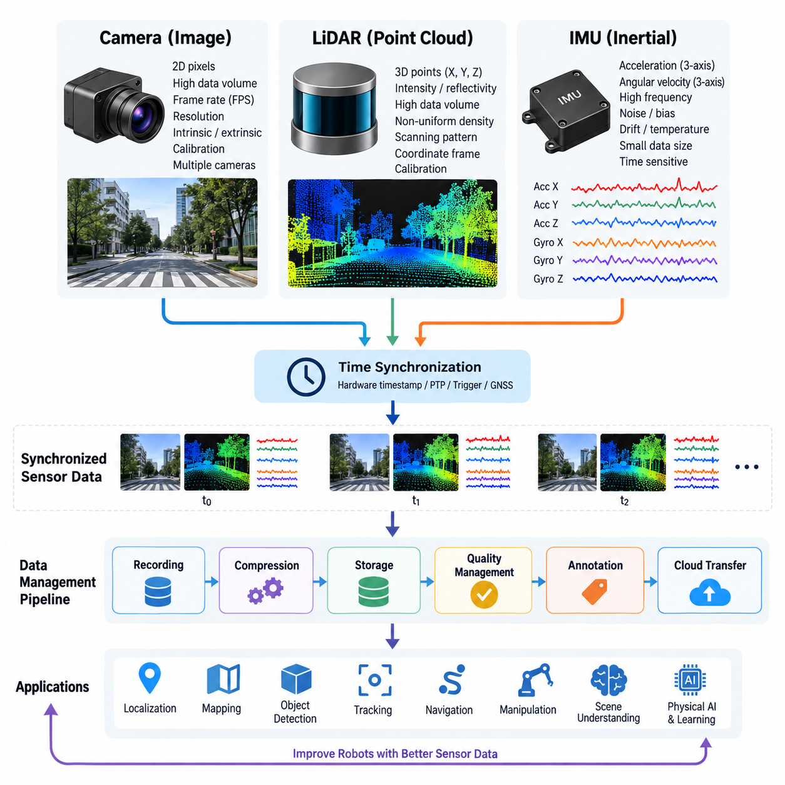
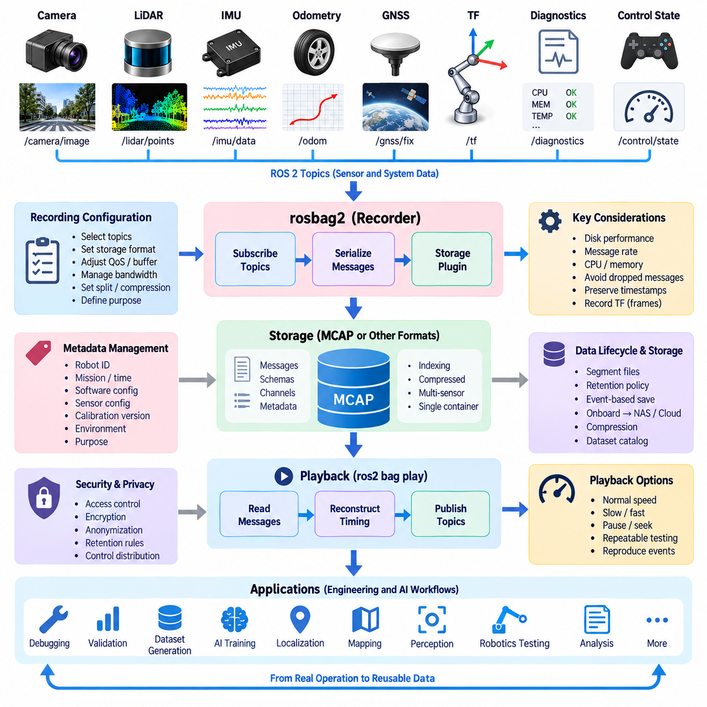
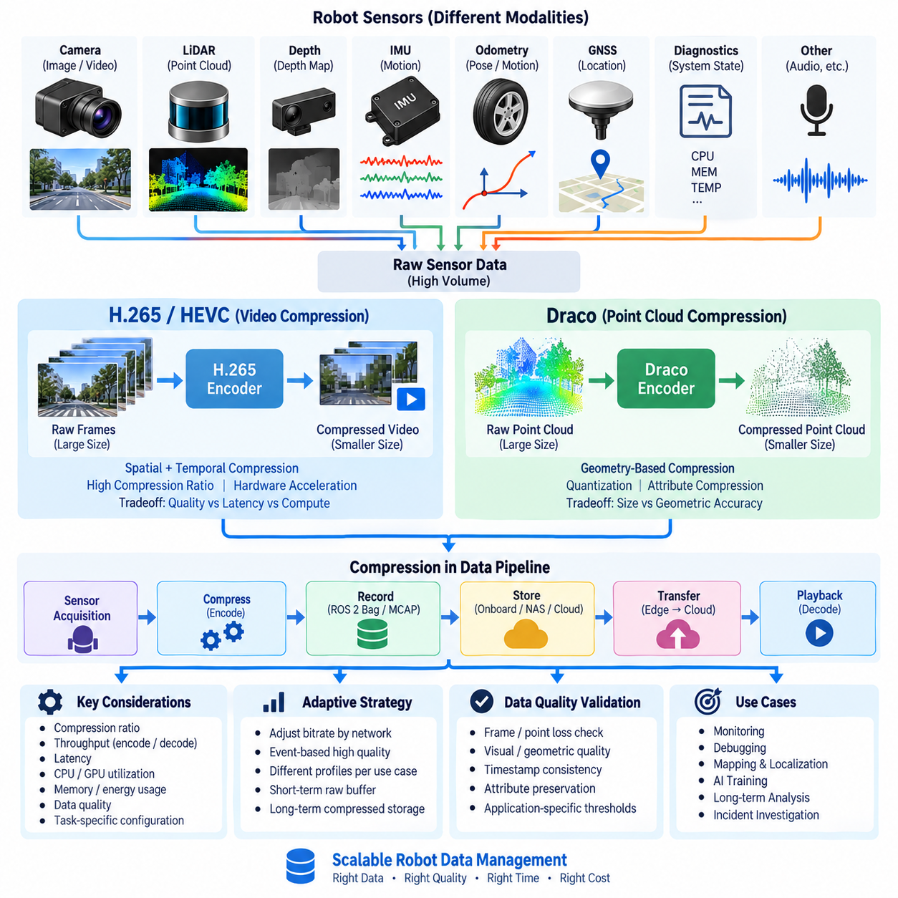
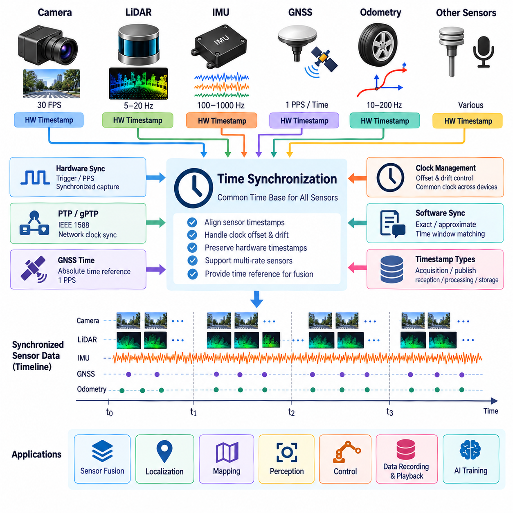
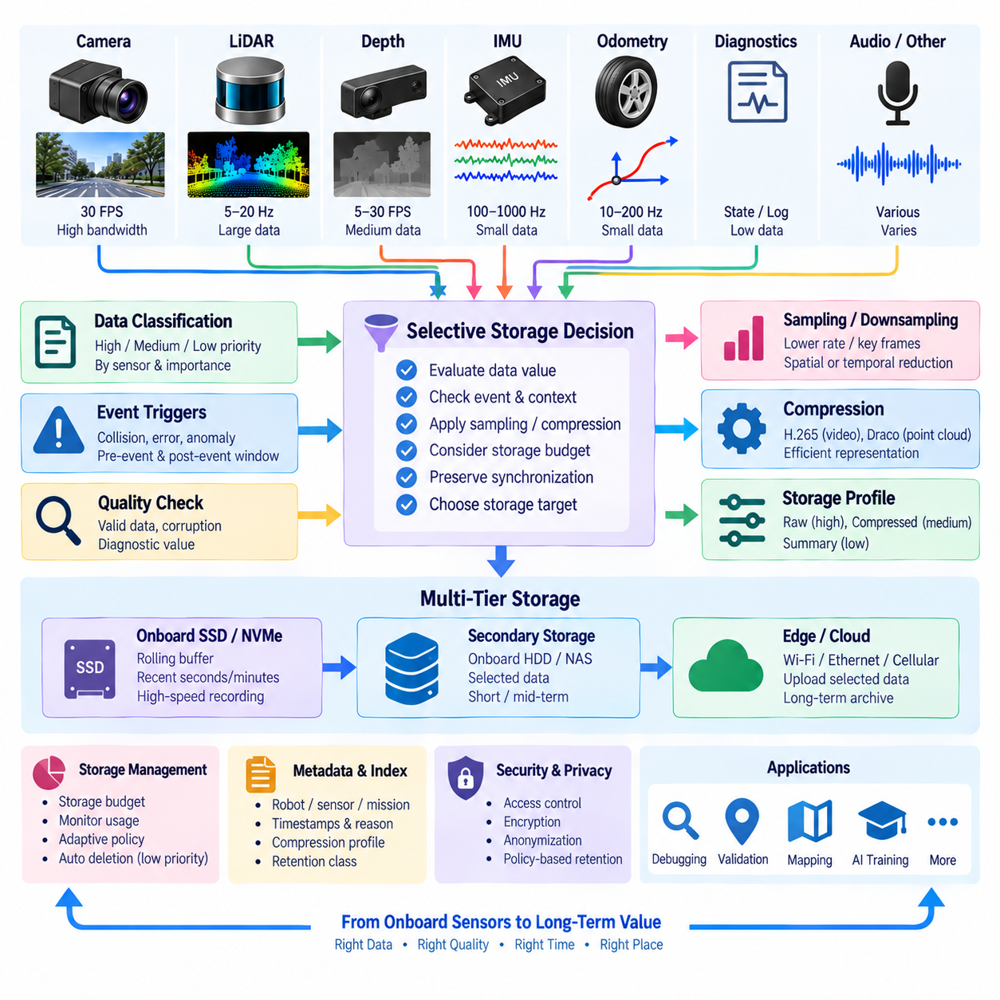
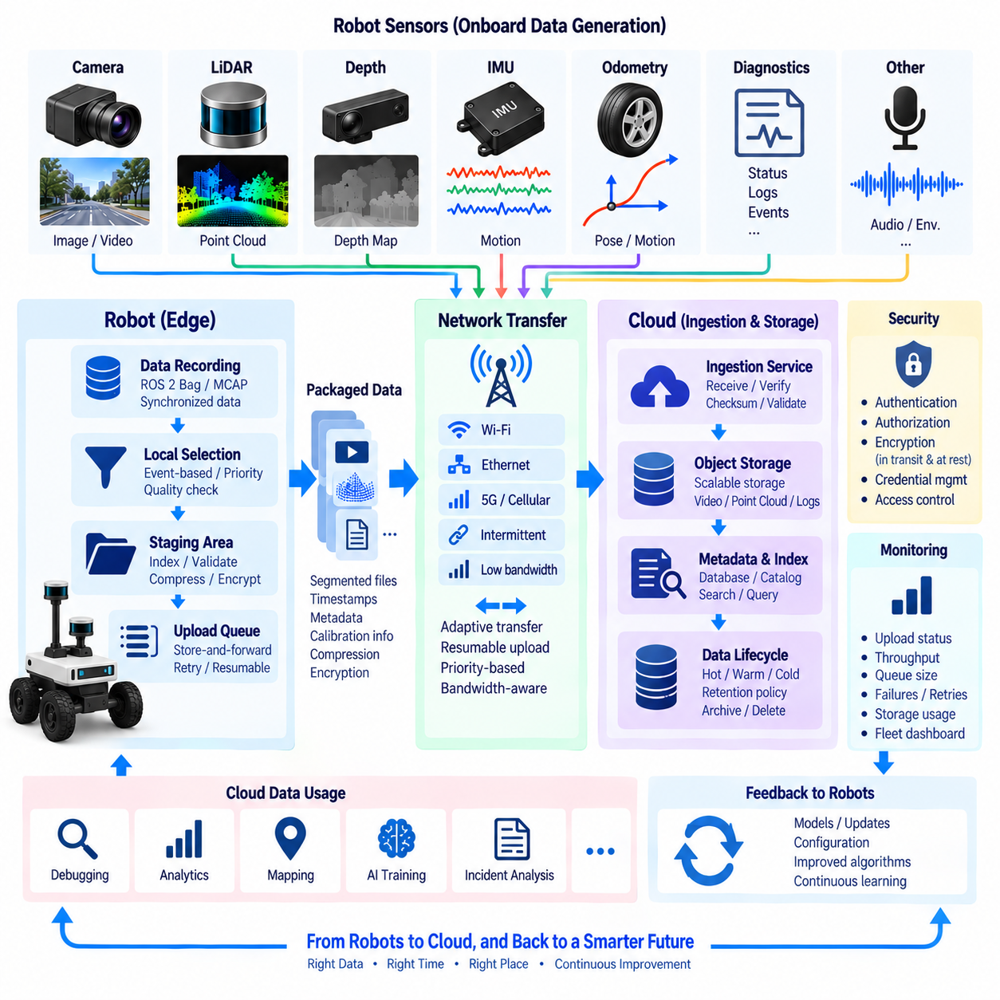
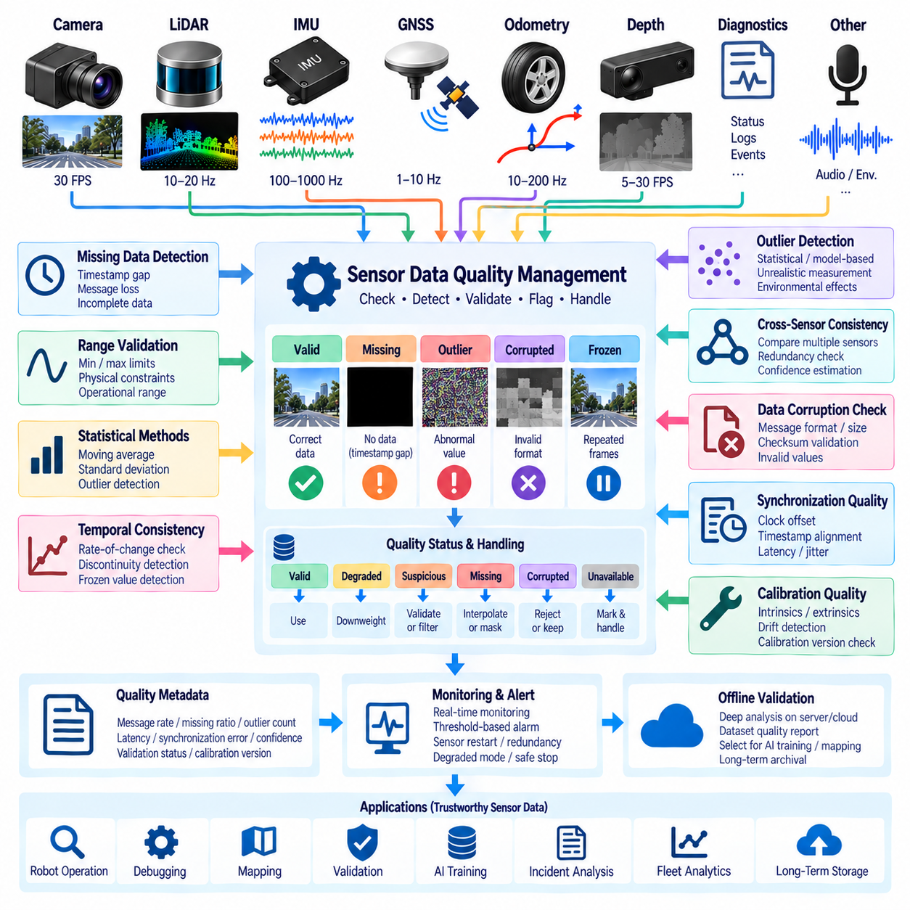
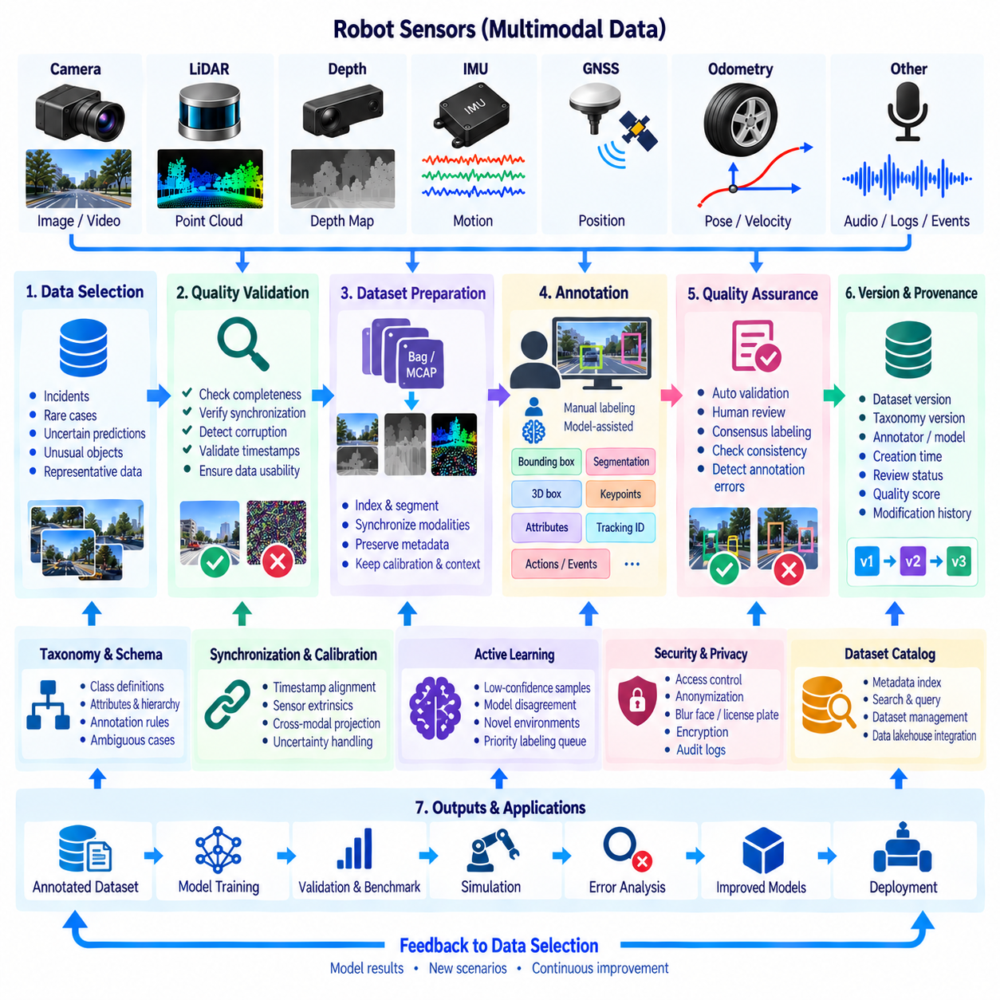
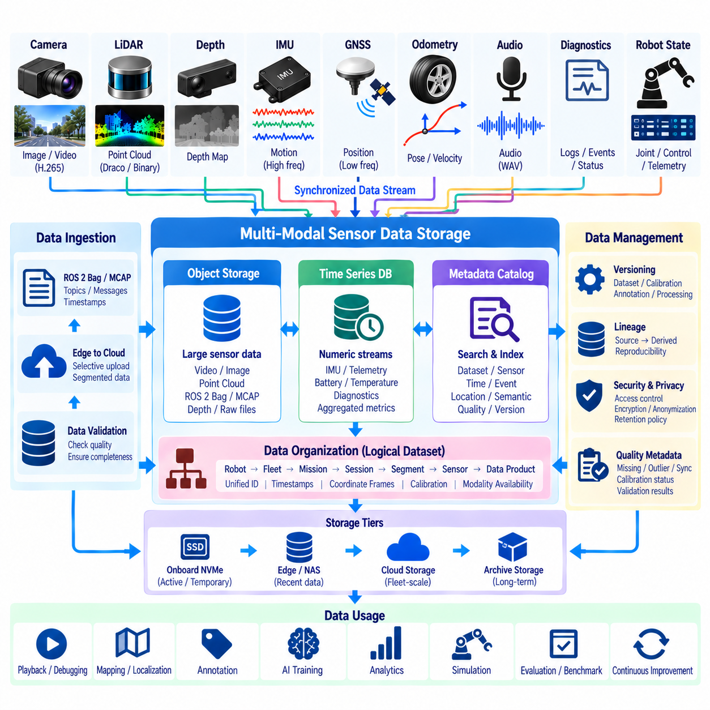
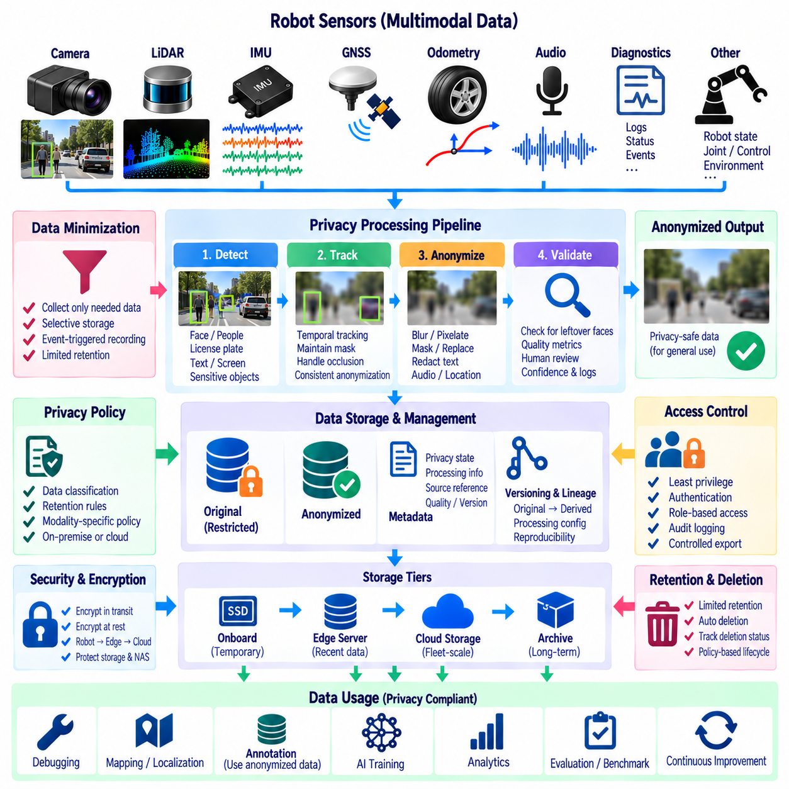

**Volume 07 Robot Data Architecture**

# 06. Sensor Data Management

## 06.01 Sensor Data Characteristics: Image, PointCloud, IMU

{width="7.268055555555556in" height="7.268055555555556in"}

Robot sensor data differs fundamentally from conventional business or application data because it represents continuous observations of the physical world. Cameras, LiDARs, depth sensors, and inertial measurement units generate data at different rates, dimensions, coordinate systems, and levels of uncertainty. Managing these heterogeneous streams therefore requires understanding not only their formats but also their temporal, spatial, and semantic relationships within the robot data architecture.

Image data is typically represented as a two-dimensional array of pixels acquired by RGB, monochrome, stereo, depth, thermal, or specialized cameras. Each frame contains spatially organized information whose interpretation depends on resolution, pixel format, exposure, focal length, distortion parameters, and camera calibration. Unlike scalar telemetry, an image may contain millions of values per observation, making camera streams one of the dominant sources of onboard data volume.

The characteristics of image streams are strongly affected by frame rate and resolution. A 30 FPS camera continuously produces thirty observations every second, while multiple cameras can generate several synchronized streams simultaneously. Raw images preserve maximum information but consume substantial storage and network bandwidth. Encoded formats reduce this requirement, although compression introduces tradeoffs involving latency, computational cost, image quality, and suitability for later AI training or forensic analysis.

Camera data also has an important geometric meaning. A pixel identifies a location on an image plane rather than a direct three-dimensional position in the environment. Camera intrinsic parameters describe focal length, principal point, and lens distortion, while extrinsic parameters describe the camera pose relative to another coordinate frame. Reliable calibration metadata must therefore accompany image datasets when images are used for localization, measurement, sensor fusion, or three-dimensional reconstruction.

Point clouds represent physical environments as collections of three-dimensional points, commonly expressed through X, Y, and Z coordinates. LiDAR is the primary source, although stereo cameras and depth cameras can also generate point-cloud representations. Individual points may additionally contain intensity, reflectivity, timestamp, ring number, confidence, color, or semantic attributes. Consequently, point clouds are irregular spatial datasets rather than fixed two-dimensional arrays like conventional images.

The size and structure of a point cloud depend on sensor architecture and acquisition conditions. A rotating multi-channel LiDAR can generate hundreds of thousands or millions of points per second, while solid-state sensors may produce different scanning patterns and densities. Point distribution is normally nonuniform because density changes with distance, viewing angle, occlusion, surface reflectivity, and sensor motion. Data processing must therefore account for both geometric structure and sensor-specific sampling behavior.

Point-cloud data is particularly dependent on coordinate frames. Measurements may initially exist in the LiDAR sensor frame and later be transformed into robot base, odometry, map, or global reference frames. These transformations require accurate extrinsic calibration and timestamp alignment. Even small temporal or calibration errors can produce duplicated edges, distorted structures, or inconsistent maps when a moving robot combines scans collected at different positions and orientations.

IMU data has characteristics that differ significantly from both images and point clouds. An inertial measurement unit normally produces acceleration and angular velocity measurements along three orthogonal axes, often at frequencies ranging from tens to hundreds or thousands of samples per second. Some devices additionally provide magnetic-field measurements, orientation estimates, temperature, or internal status information. Each individual sample is small, but the stream is dense and highly time-sensitive.

Inertial measurements contain noise, bias, scale-factor errors, axis misalignment, temperature effects, and accumulated integration error. Accelerometer readings include both motion-related acceleration and gravity, while gyroscope measurements describe angular velocity rather than absolute orientation. Estimating velocity, position, or attitude therefore requires filtering, calibration, integration, and frequently fusion with cameras, LiDAR, GNSS, wheel odometry, or other external observations.

Timestamp accuracy is a common requirement across image, point-cloud, and IMU data. A camera may operate at tens of frames per second, a LiDAR may complete scans at another frequency, and an IMU may produce hundreds of measurements during the same interval. Sensor fusion depends on determining which observations correspond to the same physical state. Hardware timestamps, synchronized clocks, trigger signals, PTP, GNSS timing, or carefully designed software synchronization mechanisms are therefore essential.

The temporal interpretation of sensor data must distinguish acquisition time from processing, publication, reception, and storage time. A frame may be captured at one instant but delivered several milliseconds later because of exposure, buffering, encoding, device drivers, middleware, or network transmission. Using reception time as acquisition time can introduce systematic errors. Sensor records should consequently preserve source timestamps and sufficient metadata to reconstruct the actual observation sequence.

Multi-modal robot datasets also require explicit relationships between timestamps and coordinate systems. An image without camera calibration, a point cloud without its reference frame, or an IMU stream without axis conventions may remain readable as a file while becoming unusable for reliable robotics processing. Sensor data management must therefore preserve calibration versions, frame identifiers, sensor identifiers, units, sampling configuration, encoding information, and transformation relationships together with the measurements themselves.

Data quality has modality-specific meanings. Image quality can deteriorate through blur, overexposure, underexposure, contamination, dropped frames, or compression artifacts. Point clouds can contain missing regions, multipath reflections, outliers, motion distortion, and low-return surfaces. IMU streams can suffer from saturation, bias drift, vibration, clipping, and timestamp jitter. Quality management should consequently evaluate sensor-specific indicators rather than applying one generic validation rule to every stream.

Storage architecture must reflect these differences. Images and point clouds are usually high-volume payloads that benefit from file, object, or specialized dataset storage, whereas IMU measurements can often be represented efficiently as structured time-series records. A robot recording system may nevertheless package all modalities into a synchronized container such as ROS 2 bag or MCAP so that their original temporal relationships can be replayed and analyzed consistently.

Selective storage becomes necessary when robots operate continuously. Retaining every raw camera frame and LiDAR return for long periods can create unsustainable storage and upload requirements, while aggressively discarding raw data can remove information needed for debugging or future AI training. Practical architectures combine short-term raw buffering, event-triggered preservation, sampling, compression, metadata indexing, and longer-term retention of strategically valuable sensor sequences.

Sensor data also forms the foundation of perception and Physical AI pipelines. Images provide appearance and semantic context, point clouds provide explicit three-dimensional geometry, and IMUs provide rapid motion information between slower external observations. Their complementary characteristics enable localization, mapping, object detection, tracking, navigation, scene understanding, manipulation, and learning systems that would be less robust if they depended on only one sensing modality.

For data architecture, the important principle is therefore to treat sensor observations as synchronized, calibrated, spatially referenced records rather than isolated files. Image, point-cloud, and IMU streams should remain connected through timestamps, coordinate transforms, calibration metadata, robot identity, mission context, and provenance. This foundation supports the subsequent recording, compression, synchronization, selective storage, cloud transfer, quality management, annotation, and multimodal storage stages defined for sensor data management.

## 06.02 ROS2 Bag / MCAP Sensor Data Record / Playback [w/Code]

{width="7.268055555555556in" height="7.268055555555556in"}

ROS 2 Bag provides a recording and playback mechanism for capturing message traffic exchanged through a ROS 2 system. Instead of storing each sensor through a separate application-specific logger, rosbag2 can subscribe to selected topics and preserve their messages together with timing and topic metadata. This makes it possible to reconstruct sensor activity after a robot mission and provides a common foundation for debugging, validation, dataset generation, and repeatable robotics experiments.

A robot may publish camera images, LiDAR point clouds, IMU measurements, wheel odometry, GNSS positions, transforms, diagnostics, and control states through different ROS 2 topics. Recording these topics into a bag preserves heterogeneous observations within a coordinated dataset. The resulting recording represents more than individual sensor files because topic names, message types, timestamps, and serialization information maintain the relationships required to interpret the robot state during a specific period.

The rosbag2 architecture separates recording logic from the underlying storage implementation. Messages arriving through ROS 2 middleware are received by the recorder and serialized before being written through a storage plugin. This abstraction allows the recording system to support different storage formats without requiring sensor applications to change. Playback performs the reverse operation by reading stored messages, reconstructing their timing sequence, and publishing them back into the ROS 2 communication environment.

MCAP is particularly useful as a storage format for heterogeneous robotics and sensor datasets. It is designed as a container capable of storing timestamped messages together with schemas, channels, metadata, and indexing information. Images, point clouds, IMU samples, transforms, and other ROS 2 messages can therefore remain associated within one structured recording while preserving the information required to identify and decode individual data streams.

Recording configuration should be designed around the purpose of the dataset rather than simply capturing every available topic. A debugging session may require control commands, diagnostics, transforms, and selected sensor streams, while an AI training dataset may prioritize raw images, point clouds, localization information, and synchronized state labels. Selecting appropriate topics reduces unnecessary storage consumption and makes later analysis, transfer, indexing, and dataset preparation more manageable.

Sensor bandwidth is an important consideration during recording. High-resolution cameras and dense LiDAR streams can produce substantially more data than IMU, odometry, or diagnostic topics. When several high-bandwidth sensors operate simultaneously, storage throughput can become a limiting resource. The recording architecture must therefore consider disk performance, message rate, serialization overhead, available CPU resources, buffering capacity, and the possibility of dropped messages under sustained load.

Timestamps remain essential even when different sensor streams are stored in the same bag. The order in which messages are received or written does not necessarily represent the exact physical acquisition order because device drivers, middleware queues, image encoding, network transport, and processing latency can differ between sensors. A robust recording design therefore preserves meaningful source timing information so that camera, LiDAR, IMU, and robot-state observations can later be aligned correctly.

Coordinate-frame information must also be recorded when spatial sensor data is expected to be replayed or analyzed. Camera frames, LiDAR frames, IMU frames, robot base frames, odometry frames, and map frames are normally connected through ROS 2 transform relationships. Recording the relevant static and dynamic transforms allows downstream applications to reconstruct where each sensor observation existed relative to the robot and environment at the corresponding time.

Playback transforms a recorded dataset into a repeatable virtual sensor sequence. Stored messages can be republished so that perception, localization, mapping, monitoring, or diagnostic nodes receive data resembling the original ROS 2 topic streams. Developers can therefore execute algorithms repeatedly against the same observations without physically operating the robot again, improving reproducibility when comparing software versions, parameters, perception models, or localization algorithms.

Playback timing is particularly important for robotics testing. Reproducing messages according to their recorded temporal relationships allows software components to experience approximately the same event sequence that occurred during collection. Depending on the experiment, playback may be performed at normal speed, slowed for detailed inspection, or accelerated for offline processing. Pausing and controlled replay can also help isolate short intervals associated with localization failures, perception errors, or abnormal robot behavior.

Recorded bags are valuable for debugging because they separate data acquisition from problem investigation. A failure that occurred during a field mission may be difficult or expensive to reproduce physically, but a sufficiently complete recording can preserve the sensor and system context surrounding the event. Engineers can inspect relevant topics, replay the sequence, modify algorithms, and compare new outputs against the same input conditions without repeatedly returning to the original environment.

ROS 2 Bag recordings also provide an effective bridge between robot operation and AI data pipelines. Raw sensor topics collected during missions can be extracted or transformed into image datasets, point-cloud sequences, trajectories, annotations, or multimodal training samples. Maintaining the original bag as a source dataset preserves provenance, while derived datasets can be generated for perception training, sensor fusion experiments, anomaly detection, imitation learning, or other Physical AI workflows.

Metadata management becomes increasingly important as the number of recordings grows. A useful sensor dataset should identify the robot, mission, recording time, software configuration, sensor configuration, calibration version, environment, and operational purpose in addition to the bag itself. Without this contextual information, large collections of technically valid recordings can become difficult to search or compare. Dataset catalogs should therefore connect bag files with operational and configuration metadata.

Large recordings also require lifecycle and storage planning. Continuous robot operation can rapidly generate hundreds of gigabytes or more, particularly when multiple cameras and LiDARs are recorded. Practical systems may divide recordings into manageable segments, apply retention policies, preserve event-related intervals, and move selected data from onboard storage to NAS, object storage, or cloud infrastructure. Compression can reduce storage requirements but must be balanced against processing overhead and future reuse requirements.

Reliability requires attention to abnormal recording conditions. Power loss, application termination, insufficient disk capacity, storage latency, or corrupted writes can interrupt data collection. A production-oriented recording architecture should therefore monitor available storage, recording status, throughput, message loss, and file integrity. Segmenting long missions can limit the impact of individual failures and simplify subsequent upload, recovery, indexing, and selective retention operations.

Security and privacy must also be considered because ROS 2 bags may contain much more information than developers initially expect. Camera recordings can include identifiable people or private environments, while location, audio, operational commands, and diagnostic data may reveal sensitive system information. Access control, encryption, retention rules, anonymization, and controlled dataset distribution should consequently be integrated into the sensor-data lifecycle rather than added only after recordings have accumulated.

Within a broader robot data architecture, ROS 2 Bag and MCAP should therefore be viewed as a structured capture and replay layer connecting physical robot operation with offline engineering and AI workflows. They preserve heterogeneous ROS 2 sensor streams in a reproducible form and enable later playback, analysis, debugging, validation, annotation, and training. Combined with synchronization, metadata, calibration, quality management, and storage governance, recorded sensor data becomes a reusable engineering asset rather than a temporary operational log.

## 06.03 Sensor Data Compression: H265 / Draco [w/Code]

{width="7.268055555555556in" height="7.268055555555556in"}

Sensor data compression is a fundamental capability in robot data architecture because modern robots continuously generate large volumes of images, video, point clouds, depth information, and other high-bandwidth sensor streams. Without compression, onboard storage can be exhausted quickly and edge-to-cloud transfer can consume excessive network bandwidth. Compression reduces data volume while attempting to preserve the information required for perception, debugging, replay, AI training, and long-term analysis.

Compression strategies must reflect the characteristics of each sensor modality rather than applying a single algorithm to all data. Camera streams contain spatial and temporal redundancy that video codecs can exploit, while LiDAR point clouds consist of irregular three-dimensional coordinates and attributes requiring geometry-oriented methods. IMU and scalar telemetry have much smaller payloads and may benefit from lightweight encoding rather than computationally expensive multimedia compression.

H.265, also known as High Efficiency Video Coding or HEVC, is well suited to high-volume camera streams generated by robots. Instead of storing every image frame independently, H.265 exploits similarities within individual frames and across consecutive frames. This significantly reduces the amount of data required for continuous video recording, making long-duration camera capture more practical for mobile robots equipped with multiple high-resolution cameras.

Temporal compression is particularly effective because consecutive robot camera frames often contain substantial similarities. H.265 can represent some frames using information derived from neighboring frames rather than encoding every pixel independently. As a robot moves, only portions of the visual scene may change significantly between frames. Motion estimation and prediction allow repeated visual information to be represented more efficiently, reducing storage and transmission requirements.

The benefits of H.265 introduce important architectural tradeoffs. Higher compression ratios can reduce bandwidth and storage consumption, but encoding and decoding require computational resources and may introduce latency. Compression settings can also affect image quality and the visibility of fine details. Robot systems must therefore balance bitrate, resolution, frame rate, latency, compute utilization, and visual quality according to whether the data supports monitoring, navigation analysis, incident investigation, or AI training.

Lossy compression requires particular attention when recorded images will later become training data. Compression artifacts may modify edges, textures, small objects, low-light details, or other visual features that perception models depend on. Operational video intended primarily for human monitoring may tolerate stronger compression, whereas datasets intended for computer vision development may require higher quality settings or selected raw frames. Compression policy should therefore be linked to the intended downstream use of the data.

Hardware acceleration can make video compression more practical on edge robots. GPU and dedicated video encoding hardware can process camera streams without placing the entire workload on general-purpose CPU cores. This is important when onboard computers simultaneously perform localization, object detection, navigation, sensor fusion, and control. Compression should consume bounded resources so that data management does not interfere with safety-critical or real-time robot functions.

Point clouds require a different compression approach because their fundamental structure is three-dimensional geometry rather than a rectangular pixel grid. LiDAR data may contain hundreds of thousands of points per scan, with each point carrying coordinates and optional attributes such as intensity, reflectivity, color, timestamp, or semantic information. Repeated recording of dense point clouds can therefore create substantial storage and network requirements even when camera data has already been compressed.

Draco is a compression technology designed for three-dimensional geometric data such as point clouds and meshes. For point-cloud applications, it can reduce the representation size of spatial coordinates and associated attributes by exploiting geometric structure and efficient encoding. This makes Draco relevant when LiDAR-derived datasets or reconstructed three-dimensional information must be stored, transferred, visualized, or exchanged between edge, server, and cloud components.

Point-cloud compression must preserve enough geometric accuracy for the intended robotics task. Quantization can represent coordinates with fewer bits, reducing data size while introducing positional approximation. A visualization workload may tolerate greater geometric reduction than precision mapping or localization. Similarly, semantic perception may tolerate some changes in point density while calibration analysis or detailed infrastructure inspection may require substantially higher spatial fidelity.

Attributes associated with point-cloud points also require explicit compression policies. Intensity, color, classification, confidence, timestamps, or sensor-channel information may be as important as XYZ geometry for certain algorithms. Removing or aggressively compressing these fields can produce a smaller dataset while reducing its future usefulness. A robust data architecture therefore defines which attributes are mandatory, optional, derived, or disposable for each recording and retention class.

Compression ratio alone is not an adequate measure of success. Encoding throughput, decoding throughput, latency, CPU and GPU utilization, memory consumption, energy usage, and reconstruction quality must also be evaluated. A codec that achieves excellent size reduction but cannot process sensor data at acquisition speed may cause buffering or message loss. Real-time robot compression must therefore sustain the incoming sensor rate under realistic onboard computational loads.

The location of compression within the data pipeline also matters. Compression can occur directly after sensor acquisition, during ROS 2 recording, before network upload, or during archival processing. Early compression minimizes storage and network load but commits the system to a particular representation sooner. Later compression preserves richer raw information temporarily but requires greater onboard capacity. Many robot architectures consequently combine short-term raw buffering with compressed operational storage.

Adaptive compression can improve efficiency when network and operational conditions change. A robot connected through high-bandwidth Wi-Fi or Ethernet may retain or transfer higher-quality data, while a constrained LTE or 5G connection may require reduced bitrate or selective uploads. Critical events can trigger preservation of higher-quality sensor segments, whereas routine operation can use stronger compression. This allows storage and communication resources to follow the operational value of the data.

Compression should also remain compatible with recording and playback workflows. When H.265 video or Draco-compressed point clouds are stored within or alongside ROS 2 Bag and MCAP datasets, metadata must describe the encoding method, parameters, timestamps, sensor identity, and calibration context. Playback and downstream processing require reliable decoding so that compressed representations can be reconstructed and associated with the correct ROS 2 topics and coordinate frames.

Data quality validation should be performed after compression rather than assuming that successful encoding guarantees useful sensor data. Camera streams can be checked for frame loss, visual degradation, corruption, and timestamp continuity, while reconstructed point clouds can be evaluated for geometric error, point loss, attribute preservation, and spatial consistency. Quality thresholds should reflect downstream requirements instead of relying only on generic codec parameters.

Compression also affects long-term data governance. Raw sensor data may be retained for a short period, high-quality compressed data for engineering reuse, and more aggressively compressed derivatives for operational history. AI-relevant or incident-related segments may receive longer retention and higher fidelity. Recording class, compression profile, retention policy, and dataset purpose should therefore be connected through metadata so that future users understand what information has been preserved or discarded.

Within the broader robot sensor data pipeline, H.265 and Draco represent complementary approaches for two major high-bandwidth modalities. H.265 reduces camera and video data by exploiting spatial and temporal redundancy, while Draco addresses geometric redundancy in three-dimensional data. Combined with selective storage, ROS 2 Bag or MCAP recording, synchronization, quality management, and edge-to-cloud transfer, sensor compression enables scalable robot data management without treating every observation as equally expensive raw data.

## 06.04 Sensor Data Timestamp Synchronization Design [w/Code]

{width="7.268055555555556in" height="7.268055555555556in"}

Sensor timestamp synchronization is a foundational requirement for robot data architecture because sensors observe the physical world at different frequencies and through independent hardware pipelines. Cameras may operate at tens of frames per second, LiDARs at several scans per second, and IMUs at hundreds or thousands of samples per second. Synchronization establishes a common temporal reference so observations can be interpreted as parts of the same robot state.

A timestamp should represent a clearly defined event in the sensor data lifecycle. Acquisition time identifies when a physical measurement was captured, while publication, reception, processing, and storage timestamps describe later stages of the pipeline. These values may differ because of exposure time, sensor buffering, device drivers, serialization, middleware queues, computation, and network transmission. Sensor fusion should therefore rely on timestamps that most accurately represent physical acquisition.

Clock differences are a major source of synchronization error. Individual sensors, embedded controllers, onboard computers, and external servers may operate using independent oscillators whose clocks have different offsets and frequencies. Even if two devices initially show the same time, oscillator drift can gradually separate them. A synchronization architecture must consequently control both clock offset and clock drift rather than assuming that clocks remain aligned after initialization.

Hardware synchronization provides strong temporal consistency by coordinating sensors through physical timing signals. A trigger pulse can command multiple cameras or sensors to acquire observations at a known instant, while pulse-per-second signals can provide a periodic timing reference. When supported by the hardware, synchronized triggering reduces uncertainty introduced by software scheduling, operating-system latency, middleware queues, and variable communication delays.

Hardware timestamps improve synchronization by assigning timing information close to the actual acquisition or transmission event. A timestamp generated inside a sensor, network interface, or dedicated timing device is generally less affected by operating-system scheduling than one generated after data reaches an application. The architecture should preserve the original hardware timestamp through subsequent processing stages instead of replacing it with a later software reception time.

Precision Time Protocol, commonly represented by PTP and standardized as IEEE 1588, provides clock synchronization across networked devices. PTP exchanges timing information between clocks and estimates network delay so participating devices can align their local clocks to a common reference. Hardware timestamping can further improve precision because packet timing is measured closer to the physical network interface rather than after unpredictable software processing.

Generalized Precision Time Protocol, or gPTP, applies precision timing concepts to systems requiring coordinated time across networked components. In robotics, deterministic Ethernet and time-aware communication can use synchronized clocks to associate sensor acquisition, actuator commands, and distributed computation with a shared temporal domain. This becomes increasingly important when perception and control functions are distributed across several edge computers rather than executed on one processor.

GNSS can provide an external absolute time reference for outdoor robots, autonomous vehicles, and UAVs. GNSS receivers may provide both time information and a pulse-per-second output that can discipline local clocks. This allows sensor measurements to be related not only to one another but also to globally referenced time. However, indoor operation, signal blockage, interference, or degraded reception requires the system to maintain synchronization through local timing mechanisms.

Software synchronization remains necessary when sensors cannot accept hardware triggers or participate directly in a common clock infrastructure. Middleware can associate messages using timestamps and select observations that fall within an acceptable temporal window. Exact synchronization requires closely matching timestamps, while approximate synchronization allows bounded differences between streams. The permitted tolerance should be derived from sensor rates, robot motion, and application accuracy requirements.

Synchronization tolerance has direct physical meaning. A small timestamp error may be insignificant for a stationary robot but become important when the robot, sensor, or observed object moves rapidly. During motion, temporal error becomes spatial error because measurements from different times correspond to different physical poses. High-speed navigation, manipulation, UAV flight, and dynamic scene perception therefore generally require tighter synchronization than slow monitoring applications.

LiDAR motion distortion demonstrates the relationship between time and geometry. A rotating LiDAR does not necessarily capture an entire point cloud at one instant; points can be acquired sequentially during a scan. If the robot moves during this interval, different points correspond to different sensor poses. Per-point or packet-level timestamps combined with IMU or odometry information can support motion compensation and reconstruct a geometrically more consistent point cloud.

Camera synchronization also requires consideration of exposure behavior. The timestamp of a frame should have a defined relationship to exposure start, exposure midpoint, or exposure completion. Multi-camera systems used for stereo vision or surround perception require closely aligned exposures to avoid observing moving objects at different positions. Rolling-shutter cameras introduce additional temporal variation because different image rows may be exposed at different times, complicating precise sensor fusion.

IMUs provide high-frequency measurements that often serve as temporal bridges between slower sensors. Multiple IMU samples may occur between consecutive camera frames or LiDAR scans, allowing motion to be estimated during those intervals. Accurate timestamps are essential because integration of acceleration and angular velocity is sensitive to sampling intervals. Timing errors can therefore propagate into orientation, velocity, motion compensation, localization, and state-estimation errors.

ROS 2 sensor pipelines should preserve synchronization information from acquisition through recording and playback. Message headers commonly carry sensor timestamps, while coordinate transforms and related state information must correspond to compatible times. ROS 2 Bag and MCAP recordings should retain these temporal relationships so offline algorithms can reconstruct the original sequence rather than relying only on the order in which messages happened to be written to storage.

Synchronization metadata should document the timing architecture used during data collection. Useful information includes clock source, timestamp origin, synchronization method, trigger configuration, expected precision, measured offset, sensor frequency, and known timing limitations. Calibration should therefore include temporal calibration as well as geometric calibration. A dataset with accurate spatial transforms but unknown temporal relationships may still produce incorrect results in sensor-fusion applications.

Monitoring is required because synchronization quality can change during robot operation. Systems can track clock offset, synchronization status, timestamp discontinuities, message latency, jitter, missing samples, and abnormal time jumps. Threshold violations should generate diagnostic events and may cause affected sensor intervals to be marked as degraded. This prevents apparently valid but temporally inconsistent data from silently entering mapping, AI training, or evaluation datasets.

Resynchronization and fault handling should be designed for temporary network failures, sensor resets, clock-source changes, or loss of an external reference. A sensor that restarts may return with a different clock offset, while a disconnected node may continue operating on its local oscillator and accumulate drift. The system should detect these transitions, re-establish synchronization, and identify intervals whose temporal accuracy cannot be guaranteed rather than treating the complete recording as uniformly synchronized.

A robust robot timing architecture therefore combines physical timing mechanisms, synchronized clocks, accurate acquisition timestamps, middleware alignment, temporal calibration, and continuous monitoring. Hardware triggers and timestamps provide strong local timing, PTP or gPTP coordinates distributed devices, GNSS can supply external reference time, and software synchronization handles heterogeneous streams. Together these mechanisms create the common time foundation required for reliable recording, replay, sensor fusion, mapping, localization, perception, and Physical AI data pipelines.

## 06.05 Onboard Sensor Data Selective Storage Strategy [w/Code]

{width="7.268055555555556in" height="7.268055555555556in"}

Onboard sensor data storage is constrained by the fundamental mismatch between continuous sensor generation and finite robot storage capacity. Cameras, LiDARs, depth sensors, IMUs, and diagnostic systems can collectively generate enormous data volumes during long missions. Selective storage addresses this problem by deciding which observations should be retained, compressed, summarized, transferred, or discarded according to their operational and future engineering value.

The objective of selective storage is not simply to minimize data volume. An overly aggressive deletion policy may remove information needed for incident analysis, algorithm debugging, AI training, or system validation. Conversely, storing every raw observation can exhaust local storage and increase transfer costs. A practical strategy therefore balances data fidelity, storage capacity, mission duration, network availability, computational resources, and expected downstream reuse.

Sensor streams should first be classified according to their data characteristics and operational importance. High-bandwidth camera and LiDAR streams normally require more restrictive policies than IMU, odometry, or diagnostic telemetry. Safety-related states, fault events, control commands, localization results, and synchronization metadata may consume relatively little capacity while providing essential context. Storage priority should therefore reflect information value rather than payload size alone.

Continuous raw buffering provides an effective foundation for selective retention. Instead of permanently writing every incoming sensor observation, the robot can maintain a rolling buffer containing the most recent seconds or minutes of raw data. Older information is overwritten during normal operation, limiting storage growth. When an important event occurs, selected intervals can be protected from deletion and committed to persistent storage for later analysis.

Event-triggered recording extends this concept by linking storage decisions to robot behavior and system conditions. Collision warnings, emergency stops, localization failures, perception anomalies, navigation errors, operator interventions, abnormal vibration, or diagnostic faults can trigger preservation of surrounding sensor data. Capturing both pre-event and post-event windows is important because the cause of a failure may occur before the event itself becomes visible to the system.

Not every retained interval requires identical quality. Storage profiles can define different fidelity levels for different purposes. Critical incidents may preserve raw or near-lossless images and dense point clouds, while routine navigation can retain compressed video, downsampled point clouds, and summarized telemetry. Long-term operational history may contain only key frames, trajectories, statistics, events, and health indicators rather than complete high-rate sensor streams.

Sampling and downsampling provide additional mechanisms for reducing storage requirements. A camera operating at 30 FPS may not require every frame for a particular monitoring task, while dense LiDAR scans can sometimes be spatially or temporally reduced. IMU streams can also be summarized for long-term analytics when high-frequency motion reconstruction is unnecessary. Sampling policies must nevertheless preserve sufficient temporal and spatial resolution for the intended downstream application.

Compression should complement rather than replace selective storage. H.265 can reduce camera video volume, while geometry-oriented techniques such as Draco can reduce point-cloud representation size. Compression allows more observations to be retained within the same storage budget, but compressed data still accumulates continuously. Selective retention determines which intervals deserve storage, whereas compression determines how efficiently those selected intervals are represented.

Multi-tier storage can separate data according to urgency and lifetime. Fast onboard SSD or NVMe storage can support temporary raw buffers and active mission recording, while longer-lived selected data can be moved to secondary onboard storage, NAS, edge servers, or cloud infrastructure. This hierarchy prevents high-rate acquisition workloads from being constrained by slower archival systems and allows data to migrate according to retention value.

Storage decisions should also consider network connectivity. When high-bandwidth Wi-Fi or Ethernet is available, selected datasets may be transferred quickly to edge or central storage, freeing onboard capacity. During operation over limited cellular connections, the robot may upload only metadata, thumbnails, events, or critical segments while retaining larger payloads locally. Deferred synchronization can transfer remaining data when a suitable network becomes available.

A storage budget provides a quantitative mechanism for controlling retention. The system can allocate capacity by sensor type, mission, data class, or priority and monitor remaining space continuously. As available capacity decreases, policies may progressively increase compression, reduce sampling rates, shorten raw-buffer duration, or delete low-priority data. Critical safety and incident records should remain protected from automatic eviction according to defined retention rules.

Metadata is essential because selective storage creates datasets containing intentional gaps and multiple quality levels. Each retained segment should identify its robot, sensor, mission, timestamps, coordinate frames, calibration version, compression profile, selection reason, and retention class. Event-triggered segments should also record the triggering condition. Without this context, later users may incorrectly interpret missing intervals as sensor failures rather than deliberate storage decisions.

Synchronization relationships must remain intact when only subsets of sensor data are retained. Saving a camera sequence without the corresponding transforms, IMU measurements, or timing information may make the sequence difficult to use for localization or sensor fusion. Selection policies should therefore operate on logically related multimodal groups when necessary, preserving the supporting data required to reconstruct robot state around important events.

ROS 2 Bag and MCAP can support selective recording by organizing chosen topics and time intervals into structured datasets. Rather than treating a mission as one indivisible recording, the system can create segments associated with operational phases, events, or retention classes. These segments can later be indexed, replayed, transferred, or deleted independently, improving lifecycle management while maintaining the message schemas and temporal relationships needed for analysis.

AI training introduces another dimension to storage value. Routine operation may contain large amounts of repetitive data, while unusual objects, difficult lighting, localization uncertainty, near-collision situations, or perception disagreements may provide disproportionately valuable training examples. Selection mechanisms can identify such informative observations and preserve them at higher fidelity, turning operational robots into distributed sources of targeted learning data.

Quality-aware selection can prevent storage resources from being consumed by unusable observations. Severe image corruption, invalid LiDAR packets, missing timestamps, synchronization failures, or sensor saturation may reduce the value of recorded data. However, abnormal data should not always be discarded because it may reveal hardware or software failures. The system should distinguish meaningless corruption from diagnostically valuable degradation and label retained segments accordingly.

Retention policies determine how stored data evolves after collection. Temporary raw buffers may survive only minutes or hours, operational recordings may remain for days or weeks, and validated incident or AI datasets may be retained substantially longer. Data can transition between classes as its value becomes clearer. Automated lifecycle rules can compress, archive, transfer, anonymize, or delete information according to age, purpose, regulatory requirements, and engineering importance.

Privacy and security should influence selection before unnecessary sensitive data is permanently stored. Camera, audio, location, and environmental observations may contain personal or confidential information. Robots should retain only data justified by operational or engineering requirements and apply access control, encryption, anonymization, and deletion policies appropriate to each data class. Minimizing unnecessary retention also reduces both privacy exposure and cybersecurity impact.

A robust onboard selective storage architecture therefore combines rolling raw buffers, event-triggered preservation, priority classes, adaptive sampling, compression, storage tiers, metadata, synchronization awareness, and lifecycle policies. Instead of treating every sensor observation as equally valuable, the robot continuously evaluates what should remain available and at what fidelity. This converts limited onboard capacity into a managed data resource supporting operations, debugging, validation, AI training, and long-term Physical AI improvement.

## 06.06 Edge-to-Cloud Sensor Data Upload Pipeline [w/Code]

{width="7.268055555555556in" height="7.268055555555556in"}

An edge-to-cloud sensor data upload pipeline connects robot-side data acquisition with centralized storage, analytics, and AI development environments. Robots continuously generate images, video, point clouds, IMU measurements, telemetry, diagnostics, and operational events, but network capacity is rarely sufficient to transmit every raw observation immediately. The pipeline therefore controls what data leaves the robot, when it is transferred, how it is packaged, and where it is stored.

The upload process normally begins after sensor acquisition, synchronization, recording, and local selection have established a usable onboard dataset. ROS 2 Bag or MCAP recordings may contain synchronized multimodal streams, while separate files may contain compressed H.265 video, point clouds, logs, or derived metadata. The upload layer should preserve relationships among these artifacts so that cloud-side systems can reconstruct the mission context rather than receiving unrelated files.

Onboard staging provides a controlled boundary between real-time robot operation and network transfer. Selected sensor segments are moved into a staging area where they can be indexed, validated, compressed, encrypted, and prepared for upload. This prevents network operations from directly interfering with sensor acquisition or control workloads. Staging also allows a robot to continue collecting data when external connectivity is temporarily unavailable or unstable.

Data packaging should create manageable transfer units rather than treating an entire mission as one extremely large object. Recordings can be divided by time interval, event, mission phase, sensor group, or storage class. Smaller segments simplify retries, parallel transfers, integrity verification, and selective prioritization. However, segmentation must preserve timestamps, schemas, calibration references, and identifiers that allow individual pieces to be reassembled into a coherent dataset.

Upload priority should reflect operational value. Safety incidents, critical failures, diagnostic events, and high-value AI samples may require immediate transfer, while routine sensor recordings can wait for lower-cost or higher-bandwidth connectivity. Metadata and compact event summaries may be uploaded before large payloads, allowing central systems to discover important events quickly and request additional sensor segments when detailed analysis is required.

Network-aware transfer is essential because robots may move between Ethernet, Wi-Fi, private 5G, public cellular networks, or disconnected environments. The pipeline should detect available connectivity and adapt transfer behavior to bandwidth, latency, reliability, and cost. High-bandwidth connections can support bulk synchronization, whereas constrained links may carry only critical events, thumbnails, metadata, or aggressively compressed data until better connectivity becomes available.

Store-and-forward operation enables reliable data movement across intermittent networks. When connectivity disappears, upload candidates remain safely stored in the onboard queue instead of being discarded. Once communication returns, the pipeline resumes transfer according to priority and retention policies. This approach is particularly important for outdoor robots, logistics systems, remote inspection platforms, and mobile robots operating across facilities with inconsistent wireless coverage.

Resumable upload mechanisms prevent large sensor datasets from restarting from the beginning after a network interruption. Large objects can be transferred in chunks or multipart units, with completed portions tracked independently. If a connection fails, only missing or incomplete parts need to be retransmitted. This reduces bandwidth waste and improves reliability when transferring multi-gigabyte recordings or long-duration camera and LiDAR datasets.

Integrity verification ensures that cloud-side data matches what was prepared at the edge. Checksums or cryptographic hashes can be generated before transfer and compared after upload. Object size, segment count, metadata consistency, and container validity can also be checked. A successful network response should not automatically imply a valid dataset; the pipeline should distinguish transfer completion from verified ingestion into persistent storage.

Compression reduces transfer volume but should be coordinated with the original sensor-data policy. H.265 video, compressed point clouds, and compressed ROS 2 or MCAP payloads can substantially reduce network demand. Recompressing already compressed data may provide little benefit while consuming edge computation or reducing quality. The pipeline should therefore understand encoding profiles and avoid unnecessary transformations that could damage future engineering or AI value.

Security must protect data while it moves beyond the physical robot. Authentication establishes which robot or edge node is allowed to upload, while authorization determines which storage destinations and services it can access. Transport encryption protects data in transit, and encryption at rest can protect cloud copies. Credentials should be managed independently from sensor payloads and rotated without requiring modification of historical datasets.

Each uploaded object should carry or reference metadata that preserves its provenance. Useful fields include robot identity, mission identifier, sensor type, recording interval, software version, calibration version, compression profile, synchronization status, selection reason, and data-quality state. Cloud-side catalogs can use this metadata to make large sensor repositories searchable and to distinguish raw, compressed, derived, incident-related, and AI-oriented datasets.

Cloud ingestion should separate durable object storage from metadata and indexing services. Large video, point-cloud, and recording files are naturally suited to scalable object storage, while searchable metadata can be maintained in databases, catalogs, or lakehouse tables. This separation allows engineers and AI systems to query small metadata records first and retrieve expensive sensor payloads only when required for analysis or training.

The pipeline should support multiple destination tiers according to data purpose. Recent operational data may first enter hot storage for immediate debugging or monitoring, while validated datasets can later move to lower-cost warm or cold storage. Critical incidents and curated AI datasets may follow different retention rules. Lifecycle policies can automate transitions between storage tiers without changing the logical identity or provenance of the dataset.

Observability is necessary to manage upload operations across a robot fleet. The system should monitor queued data volume, upload throughput, network utilization, retry counts, transfer latency, failure reasons, available onboard storage, and cloud ingestion status. Fleet-level dashboards can reveal robots that are accumulating excessive backlogs or repeatedly failing transfers, allowing infrastructure problems to be detected before onboard storage becomes exhausted.

Backpressure management connects network limitations with onboard storage policy. If uploads remain slower than sensor-data generation for an extended period, the local queue will continue to grow. The robot may then reduce sampling, increase compression, postpone low-priority transfers, shorten retention periods, or delete eligible data according to predefined policies. Critical records should remain protected while lower-value data absorbs the effects of resource scarcity.

Cloud-side validation should confirm that uploaded data is usable before the edge copy is deleted. The system can verify checksums, required metadata, expected files, recording readability, timestamp ranges, and schema compatibility. Only after durable storage and validation are confirmed should local lifecycle rules mark an uploaded segment as safely removable. This two-phase behavior reduces the risk of losing the only valid copy of valuable sensor data.

The edge-to-cloud pipeline also creates the entry point for downstream AI and analytics workflows. Uploaded recordings can be indexed, extracted, annotated, transformed, and converted into training or evaluation datasets. Rare events and difficult perception cases can be routed into data curation pipelines, while operational telemetry can support fleet analytics. Model-development results may eventually return to robots through a separate deployment pipeline, creating a continuous data-learning cycle.

A robust edge-to-cloud sensor data upload architecture therefore combines onboard staging, prioritization, adaptive networking, store-and-forward queues, resumable transfer, integrity verification, security, metadata, cloud ingestion, lifecycle management, and observability. Rather than treating upload as simple file copying, it manages sensor data as a traceable and valuable asset from robot acquisition to centralized storage, analysis, AI training, and long-term Physical AI improvement.

## 06.07 Sensor Data Quality Management: Missing / Outlier [w/Code]

{width="7.268055555555556in" height="7.268055555555556in"}

Sensor data quality management ensures that robotic systems can distinguish reliable observations from missing, corrupted, delayed, inconsistent, or physically implausible measurements. Because perception, localization, mapping, control, and AI training depend on sensor data, quality problems can propagate across the entire robot software stack. A robust architecture therefore evaluates data quality continuously rather than assuming that every received message represents a valid physical observation.

Missing data occurs when expected measurements are not produced, transmitted, received, or stored. Causes include sensor failures, dropped network packets, middleware congestion, recording errors, temporary disconnections, and computational overload. Missing information may appear as an absent message, a gap in timestamps, incomplete image frames, lost LiDAR packets, or missing fields. Detection therefore requires knowledge of expected sensor frequency, message structure, and temporal continuity.

Timestamp analysis provides one of the simplest mechanisms for detecting missing measurements. If a camera is expected to operate at 30 FPS, consecutive frames should arrive at approximately predictable intervals. Similar expectations can be defined for LiDAR, IMU, odometry, GNSS, and telemetry streams. Monitoring inter-arrival time, sequence numbers, and timestamp continuity allows the system to identify gaps and distinguish normal timing variation from abnormal data loss.

Outliers are measurements that differ significantly from expected physical or statistical behavior. An IMU may suddenly report an unrealistic acceleration, a GNSS position may jump several meters, or a depth sensor may produce values outside its usable range. Outliers do not always indicate hardware failure; reflections, occlusion, vibration, electromagnetic interference, environmental conditions, or legitimate unusual events can also generate extreme measurements.

Range validation checks whether measurements remain within physically or operationally meaningful boundaries. Sensor specifications can provide basic minimum and maximum limits, while robot-specific constraints can define narrower operational ranges. Wheel velocity, battery voltage, temperature, acceleration, depth, and distance measurements can all be checked this way. Values outside these limits can be rejected, clipped, flagged, or preserved as diagnostic evidence depending on the application.

Statistical methods provide another layer of outlier detection. Moving averages, moving medians, variance, standard deviation, percentile ranges, and robust statistics can describe recent sensor behavior. A measurement that deviates strongly from the local distribution can be marked as suspicious. Sliding-window methods are particularly useful because robot operating conditions change over time, making a single global threshold inappropriate for many dynamic environments.

Temporal consistency checks evaluate whether changes between consecutive observations are physically plausible. A robot pose should not instantaneously move across a large distance without corresponding velocity, while temperature or battery state normally changes within bounded rates. Rate-of-change constraints can therefore reveal spikes, discontinuities, or frozen values. Such checks complement simple range validation because an individual measurement may be valid in isolation but inconsistent with preceding observations.

Cross-sensor consistency uses redundancy between different modalities to detect quality problems that cannot be identified from one sensor alone. Wheel odometry can be compared with visual or LiDAR odometry, GNSS motion can be compared with IMU measurements, and depth observations can be checked against geometric expectations. Large disagreement does not automatically identify which sensor is wrong, but it provides an important signal that confidence should be reduced or additional validation should occur.

Frozen sensor detection is important because a failed sensor may continue publishing apparently valid values. Repeated identical images, unchanged IMU measurements, constant range values, or a fixed position can satisfy normal message frequency checks while no longer representing the environment. Quality management should therefore monitor both communication activity and information change, distinguishing a functioning data channel from a sensor that is genuinely producing new observations.

Data corruption may occur during acquisition, serialization, transmission, storage, or decoding. Image payloads may be incomplete, point-cloud records may contain invalid values, and recorded messages may fail schema or checksum validation. Structural validation should verify message size, required fields, encoding, numeric validity, container integrity, and checksums where available. This prevents malformed data from silently entering downstream processing or long-term datasets.

Quality management should assign explicit status rather than relying only on deletion. Measurements can be classified as valid, degraded, suspicious, missing, corrupted, or unavailable, with confidence values when appropriate. Preserving quality state enables downstream algorithms to decide how to respond. A mapping system may reject degraded measurements, while an incident-analysis pipeline may intentionally retain them because the failure itself contains valuable diagnostic information.

Handling missing data depends on modality and application. Short gaps in low-rate telemetry may sometimes be interpolated, while missing high-frequency IMU samples can significantly affect state estimation. Reusing the previous value may be acceptable for slowly changing status signals but dangerous for dynamic motion measurements. The architecture should therefore define modality-specific policies for interpolation, substitution, masking, rejection, or explicit representation of missing values.

Outlier handling should similarly avoid automatically removing every abnormal observation. Filtering techniques can suppress isolated noise, but aggressive filtering may erase real events such as collisions, rapid maneuvers, or unexpected obstacles. The system should distinguish data cleaning for operational algorithms from preservation for diagnostics and AI development. Raw observations, quality flags, and cleaned representations may therefore coexist when storage capacity and safety requirements justify them.

Synchronization quality is part of overall sensor data quality. Individually valid camera, LiDAR, and IMU measurements can produce incorrect sensor fusion if their timestamps are misaligned. Quality checks should monitor clock offset, timestamp discontinuities, synchronization tolerance, and message latency. Segments with synchronization failures should be marked explicitly so that offline datasets do not incorrectly treat temporally inconsistent observations as accurately aligned multimodal samples.

Calibration quality must also be considered because correctly transmitted measurements can still be systematically wrong. Camera intrinsics, sensor extrinsics, LiDAR alignment, IMU bias, and scale parameters may drift or become invalid after mechanical impact or hardware replacement. Data-quality systems should associate observations with calibration versions and detect evidence of calibration degradation, ensuring that geometric inconsistency is not mistaken for random sensor noise.

Quality metrics should be recorded as metadata alongside sensor data. Useful metrics include expected and observed message rates, missing-sample ratio, outlier count, latency, jitter, synchronization error, corruption events, confidence, and validation status. Aggregated metrics can describe the quality of a recording segment or entire mission, enabling engineers to search datasets by reliability before using them for debugging, validation, annotation, or AI training.

Real-time monitoring enables the robot to react when data quality falls below operational requirements. Warning thresholds may trigger diagnostics, sensor restart procedures, redundancy mechanisms, degraded operating modes, or safe-stop behavior depending on system criticality. Quality management therefore connects data engineering with runtime safety and reliability. The response should reflect the importance of the affected sensor rather than treating every quality violation identically.

Offline quality validation provides deeper analysis after recordings reach edge servers, NAS, or cloud storage. More computationally expensive algorithms can examine long-term distributions, cross-sensor relationships, duplicate data, temporal gaps, calibration consistency, and unusual patterns. Results can update dataset metadata and determine whether segments are suitable for AI training, simulation replay, performance evaluation, incident investigation, or long-term archival.

A robust sensor data quality architecture therefore combines missing-data detection, outlier analysis, range and temporal validation, cross-sensor consistency, corruption checks, synchronization monitoring, calibration awareness, and explicit quality metadata. Instead of silently correcting every anomaly, it preserves the distinction between original observations and validated or cleaned data. This creates trustworthy sensor datasets for robot operation, debugging, mapping, validation, AI training, and long-term Physical AI improvement.

## 06.08 Sensor Data Annotation Pipeline Integration [w/Code]

{width="7.268055555555556in" height="7.268055555555556in"}

Sensor data annotation pipeline integration connects raw robot observations with the semantic information required for perception models, multimodal learning, evaluation, and Physical AI development. Images, video, point clouds, depth maps, trajectories, and synchronized sensor streams become substantially more useful when objects, regions, actions, states, relationships, and events are represented as structured labels. Annotation should therefore be treated as part of the robot data architecture rather than an isolated offline activity.

The annotation pipeline begins with carefully selected sensor data rather than every observation produced by a robot. Onboard selective storage and edge-to-cloud upload mechanisms can preserve incidents, rare situations, uncertain predictions, unusual objects, and representative operating conditions. Data-quality validation should occur before expensive annotation begins so corrupted, incomplete, unsynchronized, or unusable segments do not consume labeling resources without providing reliable training value.

Dataset preparation converts operational recordings into annotation-ready units. ROS 2 Bag or MCAP recordings may need to be indexed and segmented into camera sequences, LiDAR frames, synchronized multimodal samples, or event-centered clips. Each unit should preserve timestamps, sensor identity, coordinate frames, calibration parameters, robot state, and mission context. This information enables annotation tools to display consistent observations and maintain relationships between modalities.

Annotation schemas define what information humans or automated systems are expected to produce. Camera datasets may require bounding boxes, segmentation masks, keypoints, lanes, objects, attributes, or tracking identifiers. Point clouds may require 3D bounding boxes, semantic classes, instance labels, or geometric regions. Robot datasets can additionally represent actions, task phases, failures, interactions, environmental states, and temporal events that extend beyond conventional computer-vision labeling.

A well-designed taxonomy provides consistent semantic meaning across datasets. Class names, hierarchical relationships, attributes, unknown categories, exclusion rules, and ambiguous cases should be defined before large-scale labeling begins. Without stable definitions, different annotators may interpret the same observation differently. Taxonomy versions should therefore be tracked so labels created under different definitions can be identified, migrated, or evaluated correctly.

Multimodal annotation requires synchronization and calibration information to remain available throughout the pipeline. A 2D object labeled in a camera frame may correspond to points in LiDAR data or a region in a depth map. Accurate timestamps and sensor extrinsics allow labels to be projected between coordinate systems when appropriate. If synchronization or calibration quality is uncertain, automatically transferred annotations should be flagged rather than treated as equivalent to independently verified ground truth.

Manual annotation remains important when semantic interpretation requires human judgment. Annotators can review difficult objects, occlusions, unusual events, interactions, and ambiguous scenes that automated methods may not reliably understand. Annotation interfaces should provide sufficient contextual information, including neighboring frames or synchronized modalities, because isolated frames may hide motion, object identity, or event meaning that becomes obvious when temporal context is available.

Model-assisted annotation can reduce human workload by generating initial predictions that annotators review and correct. Existing detection, segmentation, tracking, or foundation models can pre-label large datasets, allowing people to focus on uncertain or incorrect regions. The resulting labels should record whether they originated from a model, a human, or a combined process. Model version and confidence should also be retained to support later quality analysis.

Active learning can prioritize samples whose annotation is expected to provide the greatest model improvement. Instead of labeling large amounts of repetitive operational data, the system can identify low-confidence predictions, disagreement between models, novel environments, rare classes, or unusual robot behavior. These samples can be routed into annotation queues with higher priority, creating a feedback loop between deployed robots, data selection, annotation, model training, and future deployment.

Quality assurance is necessary because annotation itself can introduce errors. Labels may be missing, geometrically inaccurate, inconsistent with the taxonomy, assigned to the wrong class, or temporally inconsistent across frames. Automated validation can detect invalid coordinates, impossible dimensions, missing required fields, duplicate identifiers, or broken tracks. Human review can then focus on semantic ambiguity and difficult cases that cannot be resolved by structural checks alone.

Consensus and review workflows improve reliability for high-value datasets. Multiple annotators may independently label selected samples, after which disagreement can be measured and resolved by a reviewer or domain expert. This is especially useful for ambiguous classes, safety-critical events, or evaluation datasets where label errors directly affect performance measurements. Review results can also reveal unclear annotation guidelines that should be revised before further labeling.

Annotation provenance should be stored as metadata alongside the labels. Useful information includes dataset version, source recording, annotation schema, taxonomy version, annotator or annotation process, model version, creation time, review status, quality score, and modification history. Provenance allows teams to determine how a label was created and whether it remains compatible with the current training or evaluation requirements.

Version management becomes important as annotations evolve. A label may be corrected after review, converted to a new taxonomy, enriched with additional attributes, or regenerated using an improved model. Original sensor data should remain stable while annotation versions are managed separately. This separation allows experiments to reproduce earlier datasets and compare model behavior across different labeling strategies without duplicating large raw sensor payloads.

Annotation outputs should use structured formats that can be consumed by downstream systems without manual conversion. Image labels, point-cloud annotations, temporal events, and multimodal relationships may use different physical representations, but they should share consistent dataset identifiers and metadata conventions. Conversion layers can generate task-specific formats for detection, segmentation, tracking, 3D perception, imitation learning, or evaluation while preserving a canonical annotation representation.

Privacy and security controls remain necessary during annotation because sensor data may contain people, vehicle identifiers, locations, voices, or confidential environments. Annotation workers and automated services should receive only the data required for their tasks. Access control, anonymization, face or license-plate blurring, encryption, and audit records can reduce unnecessary exposure while preserving sufficient information for legitimate labeling objectives.

Integration with data lakehouse or dataset catalogs makes annotated data discoverable across the organization. Raw sensor data can remain in object storage while annotation metadata, dataset versions, quality metrics, and semantic indexes are registered in searchable tables or catalogs. Engineers can then query for particular robots, environments, classes, events, quality levels, or annotation versions before retrieving the larger sensor payloads needed for model development.

The completed annotation dataset becomes an input to training, validation, simulation, benchmarking, and error analysis. Model results can then be compared with annotations to identify false positives, false negatives, uncertain classes, and difficult environmental conditions. These findings can return to the data-selection stage, where additional examples are collected or prioritized. Annotation therefore participates in a continuous data-model feedback cycle rather than ending after labels are produced.

A robust sensor data annotation architecture consequently integrates data selection, quality validation, synchronization, calibration, dataset preparation, schema design, human labeling, model assistance, active learning, quality assurance, provenance, versioning, security, and dataset catalogs. By maintaining traceability from the original robot observation to validated semantic labels, the pipeline converts operational sensor data into reusable knowledge assets for perception, robotics intelligence, evaluation, and continuous Physical AI improvement.

## 06.09 Multi-Modal Sensor Data Storage Design

{width="7.268055555555556in" height="7.268055555555556in"}

Multimodal sensor data storage must preserve the relationships among heterogeneous observations produced by a robot rather than treating each sensor stream as an independent collection of files. Cameras, LiDARs, depth sensors, IMUs, GNSS, odometry, audio, diagnostics, and robot-state streams differ greatly in size, frequency, structure, and access pattern. The storage architecture must accommodate these differences while maintaining a coherent representation of the same physical mission.

The central design principle is to separate physical storage format from logical dataset identity. Camera video may be stored as H.265, point clouds in compressed binary or geometry-oriented formats, and high-frequency state data inside ROS 2 Bag or MCAP recordings. These representations can remain physically different while belonging to one logical mission dataset through shared identifiers, timestamps, metadata, calibration references, and coordinate-frame definitions.

Time provides the primary axis for connecting multimodal observations. Every stored sensor sample should retain an acquisition timestamp that can be related to a common robot time domain. Camera frames, LiDAR scans, IMU samples, poses, and control states can then be retrieved around the same time interval. Storage systems should preserve original timestamps rather than relying only on file creation time, upload order, or database insertion time, which may differ substantially from physical acquisition.

Spatial relationships are equally important because multimodal observations originate from sensors mounted at different positions and orientations. Coordinate frames, sensor extrinsics, camera intrinsics, calibration versions, and transform histories should therefore remain associated with stored data. Without these references, individually valid images and point clouds may become difficult to combine later for sensor fusion, mapping, localization, 3D reconstruction, or multimodal AI training.

A mission-oriented hierarchy provides a practical organization model. Data can be grouped by robot, fleet, mission, session, time segment, sensor, and data product while preserving globally unique identifiers. This hierarchy supports human navigation without forcing downstream applications to depend on directory names alone. Metadata catalogs should provide the authoritative logical relationships so datasets remain discoverable even when physical objects move between storage systems.

Large binary sensor payloads are naturally suited to object or file storage rather than conventional relational tables. Video, images, point clouds, ROS 2 Bag files, MCAP recordings, and large depth sequences can be stored as immutable or versioned objects. Databases and lakehouse tables can separately maintain compact metadata, indexes, quality metrics, event descriptions, and references to those objects, allowing queries to avoid repeatedly scanning large binary payloads.

Time-series databases can complement object storage for high-frequency numeric streams and aggregated operational telemetry. IMU summaries, battery measurements, temperatures, latency metrics, diagnostic states, and robot health indicators may benefit from timestamp-oriented queries and downsampling. The architecture does not need to force every modality into one database technology; instead, different storage engines can participate in one logical dataset through consistent identifiers and metadata.

ROS 2 Bag and MCAP provide useful containers for preserving message schemas, topics, timestamps, and replayable robot communication. They are particularly valuable when engineers need to reconstruct system behavior or rerun algorithms against recorded messages. However, long-term repositories may also extract selected images, point clouds, telemetry, or metadata into specialized storage forms. The original recording and extracted products should remain linked through provenance information.

Segmentation prevents long robot missions from becoming unmanageable storage objects. Recordings can be divided into bounded time windows, operational phases, events, or storage classes while retaining continuity metadata between segments. Smaller units improve upload, retry, indexing, parallel processing, selective deletion, and partial retrieval. Segment boundaries should not destroy the temporal context required to reconstruct important events or synchronized multimodal windows.

Indexes are essential because scanning entire recordings to find a particular event is inefficient. Temporal indexes can locate observations within a requested interval, while sensor, mission, event, quality, geographic, or semantic indexes can narrow searches further. An engineer should be able to identify relevant data through metadata first and retrieve large payloads only afterward. This becomes increasingly important as robot fleets accumulate millions of files and long-duration recordings.

Multimodal storage must explicitly represent missing or unavailable modalities. A dataset segment may contain camera and IMU data but lack LiDAR because of a sensor failure or selective-storage decision. Metadata should distinguish intentional omission from packet loss, corruption, or unavailable hardware. Explicit modality availability prevents downstream pipelines from assuming that every segment contains the same sensor configuration and allows training systems to filter datasets according to required inputs.

Quality metadata should remain attached to each modality and segment. Missing-sample ratios, outlier counts, synchronization error, calibration status, frame corruption, latency, and validation results can indicate whether data is suitable for a particular use. A dataset acceptable for operational debugging may not satisfy the stricter requirements of benchmark evaluation or high-quality AI training. Storage design should therefore support quality-based discovery rather than a simple stored-or-not-stored distinction.

Derived data should remain distinguishable from original observations. Rectified images, filtered point clouds, motion-compensated scans, anonymized video, annotations, trajectories, features, and model predictions may all originate from the same raw recording. These products should reference their source data and processing version instead of overwriting the original. Such lineage enables reproducibility and allows new algorithms to regenerate derived products when processing methods improve.

Versioning is particularly important for calibration, annotation, and processed datasets. The underlying sensor payload may remain unchanged while calibration parameters, semantic labels, quality assessments, or processing outputs evolve. Separating these versions avoids unnecessary duplication of large binary data and allows experiments to reproduce historical dataset states. Dataset manifests can bind specific sensor objects, metadata, calibration, and annotation versions into a reproducible snapshot.

Storage tiers should reflect both access frequency and data value. Fast onboard NVMe may hold active recordings and temporary raw buffers, edge or NAS systems may store recently collected engineering data, and scalable object storage can maintain fleet-level repositories. Older or rarely accessed datasets can migrate to lower-cost archival tiers. Logical identifiers and catalog entries should remain stable even when the physical storage location changes.

Compression and selective retention should be coordinated with multimodal relationships. Strongly compressing one modality or deleting supporting streams may reduce the usefulness of otherwise valuable data. A camera sequence intended for visual-inertial research may require corresponding IMU and pose information, while LiDAR mapping data may require transforms and calibration. Retention policies should therefore understand dataset dependencies instead of making decisions solely on individual file size.

Cloud and edge storage should share a consistent dataset model even when their physical infrastructure differs. An onboard robot may initially store synchronized segments locally, an edge server may aggregate multiple missions, and cloud storage may organize fleet-scale historical datasets. Upload processes should preserve identifiers, checksums, metadata, and provenance so movement between these layers changes storage location without changing the meaning or identity of the data.

Security and privacy controls can be applied at modality, dataset, and storage-tier levels. Camera, audio, location, and environmental data may require stronger access restrictions than non-sensitive diagnostics. Encryption, authorization, audit records, anonymized derivatives, and retention rules should remain associated with dataset metadata. This allows multimodal storage to preserve useful relationships without requiring every user or service to receive unrestricted access to every modality.

A robust multimodal sensor data storage architecture therefore combines heterogeneous physical formats with unified logical identity, common timestamps, coordinate frames, calibration, metadata catalogs, indexing, quality information, lineage, versioning, and tiered storage. The goal is not to place every sensor stream into one technology, but to preserve their relationships as one reconstructable robot experience that can support replay, debugging, mapping, analytics, annotation, AI training, and long-term Physical AI development.

## 06.10 Privacy-Compliant Sensor Data Management: Face Blur

{width="7.268055555555556in" height="7.268055555555556in"}

Privacy-compliant sensor data management ensures that robot observations remain useful for perception, debugging, analytics, and AI development without unnecessarily exposing identifiable people or sensitive environments. Cameras are particularly important because faces, license plates, employee badges, screens, documents, and private spaces may appear unintentionally in ordinary recordings. Privacy protection should therefore be integrated into the sensor-data lifecycle rather than added only after datasets have already been distributed.

The first principle is data minimization. A robot should collect and retain only the sensor information required for its operational, engineering, safety, or learning objectives. Continuous recording does not automatically justify continuous long-term retention. Selective storage, event-triggered recording, limited retention periods, and modality-specific policies can reduce unnecessary exposure before anonymization is required, while still preserving information needed for legitimate technical purposes.

Privacy processing can occur at several stages of the architecture. Sensitive content may be detected directly on the robot before persistent storage, processed on an edge server before cloud upload, or anonymized during dataset preparation. Earlier processing reduces the number of systems that ever receive identifiable information, but it also requires sufficient onboard compute. The appropriate location should balance privacy risk, latency, computational resources, and the need to preserve evidence for authorized uses.

Face blurring is a common visual anonymization mechanism for robot camera data. A face detector identifies regions likely to contain human faces, after which those regions can be blurred, pixelated, masked, or replaced before the image or video is released for broader use. The anonymization operation should be applied consistently across frames because a face that is protected in one frame but visible in adjacent frames can still expose identity.

Video anonymization therefore benefits from temporal tracking in addition to frame-by-frame detection. Once a face is detected, tracking can maintain the protected region across short detection failures, motion blur, partial occlusion, or changing viewpoints. Temporal consistency also reduces distracting fluctuations in the anonymization mask. The pipeline should nevertheless avoid assuming that tracking guarantees privacy, because lost tracks and newly appearing people still require repeated detection and validation.

Detection confidence requires careful handling. A high threshold may reduce false detections but allow difficult faces to remain visible, while a very low threshold may unnecessarily obscure non-sensitive image regions. Privacy-oriented systems often favor conservative protection when uncertainty exists. Confidence scores, detector versions, processing parameters, and validation results should be retained as metadata so the organization can understand how an anonymized dataset was produced.

Face blurring alone may not provide complete privacy protection. People can sometimes be identified through clothing, body appearance, location, vehicle information, badges, text, or surrounding context. Depending on the dataset and intended use, additional processing may include license-plate blurring, text redaction, person masking, audio anonymization, or removal of precise location information. Privacy policy should therefore consider the entire observation rather than treating faces as the only sensitive element.

An important architectural decision is whether identifiable originals should be retained after anonymized derivatives are created. Some applications may require temporary restricted originals for incident investigation, quality verification, or legally authorized purposes, while general AI development may use only anonymized copies. Original and privacy-processed datasets should be stored as separate data classes with clearly different access permissions, retention periods, and lifecycle rules.

When original data must be preserved temporarily, access should follow the principle of least privilege. Only authorized users or services should be able to retrieve identifiable recordings, while broader engineering teams work with anonymized derivatives. Authentication, role-based or attribute-based authorization, encryption, audit logging, and controlled export mechanisms can reduce the possibility that sensitive sensor data is copied outside its intended environment.

Encryption protects sensitive data both during transmission and while stored. Transport encryption should protect robot-to-edge and edge-to-cloud communication, while encryption at rest should protect onboard storage, NAS systems, servers, and cloud objects where appropriate. Encryption does not replace anonymization because authorized users may still decrypt data, but it provides an additional security boundary against unauthorized access, theft, or infrastructure compromise.

Metadata should describe privacy state explicitly. A sensor object can be classified as original, restricted, anonymized, partially anonymized, or approved for a particular downstream purpose. Useful metadata may include anonymization method, detector version, processing timestamp, privacy validation status, retention class, access policy, and source-data reference. This prevents downstream systems from assuming that every camera file has received the same privacy treatment.

Privacy transformation should preserve provenance between original and derived data. An anonymized video should reference its source recording and the processing configuration used to create it without exposing the restricted payload to ordinary users. Provenance supports reproducibility, auditing, reprocessing, and quality investigation. If a better face detector becomes available, authorized systems can regenerate improved anonymized derivatives from retained originals when policy permits.

Quality validation is essential because failed anonymization can expose sensitive information. Automated checks can verify whether detectable faces remain after processing, whether masks cover the intended regions, and whether video frames were skipped. Selected datasets may also require human review under controlled access conditions. Validation results should become part of dataset quality metadata so privacy compliance is measurable rather than assumed from successful pipeline execution.

Anonymization must also preserve enough information for the intended technical task. Excessive blurring may remove features needed for obstacle detection, human-robot interaction, behavior analysis, or scene understanding. Privacy processing should therefore distinguish identity-related information from task-relevant structure whenever possible. For example, a protected human region may still preserve body position, motion, segmentation boundaries, or non-identifying geometric information required by robotics algorithms.

Annotation pipelines must operate consistently with privacy controls. External or internal annotators should receive anonymized data whenever identifiable content is unnecessary for the labeling task. If restricted originals are genuinely required, access should be limited, logged, and separated from general annotation workflows. Annotation outputs should reference privacy-safe dataset identifiers so labels do not unintentionally create new links to restricted source material.

Retention and deletion are fundamental privacy mechanisms. Sensitive originals should not remain indefinitely merely because storage capacity is available. Lifecycle policies can automatically delete temporary raw recordings after anonymized derivatives have been validated, unless another authorized retention requirement applies. Deletion status should be tracked so data catalogs do not continue advertising objects that have been intentionally removed from physical storage.

Edge-to-cloud upload policies should recognize privacy classifications before data leaves the robot or facility. Anonymized data may be eligible for normal cloud ingestion, while identifiable recordings may require restricted destinations or may be prohibited from leaving an on-premise environment. Privacy classification can therefore participate directly in routing decisions, ensuring that network transfer does not bypass protections established by local storage and access policies.

Multimodal datasets require special attention because removing identity from images may not anonymize the complete dataset. GNSS coordinates, audio, timestamps, trajectories, environmental context, or associated metadata can reveal sensitive information when combined. Privacy assessment should consider relationships among modalities and the possibility of re-identification through correlated data. Access and anonymization policies should therefore operate at dataset level as well as individual file level.

Auditability allows an organization to demonstrate how sensitive robot data has been handled. Logs can record collection, anonymization, access, transfer, modification, export, and deletion events without duplicating the sensitive content itself. Combined with dataset versions, privacy metadata, and processing provenance, these records provide traceability from original sensor acquisition to approved downstream use and help identify failures in the privacy-processing pipeline.

A robust privacy-compliant sensor data architecture therefore combines data minimization, selective retention, face and identifier anonymization, edge processing, access control, encryption, provenance, validation, lifecycle management, and auditability. Privacy becomes a property of the complete robot data pipeline rather than a single face-blur operation. This enables sensor data to support debugging, annotation, analytics, AI training, and long-term Physical AI development while systematically reducing unnecessary exposure of identifiable information.
