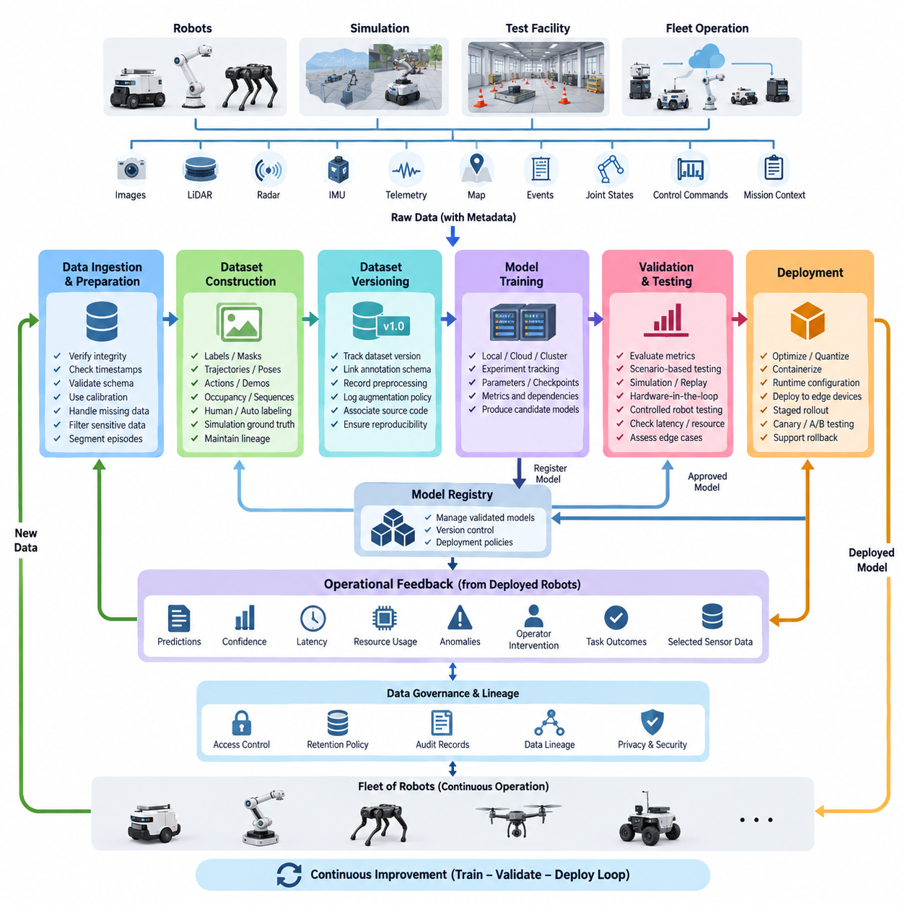
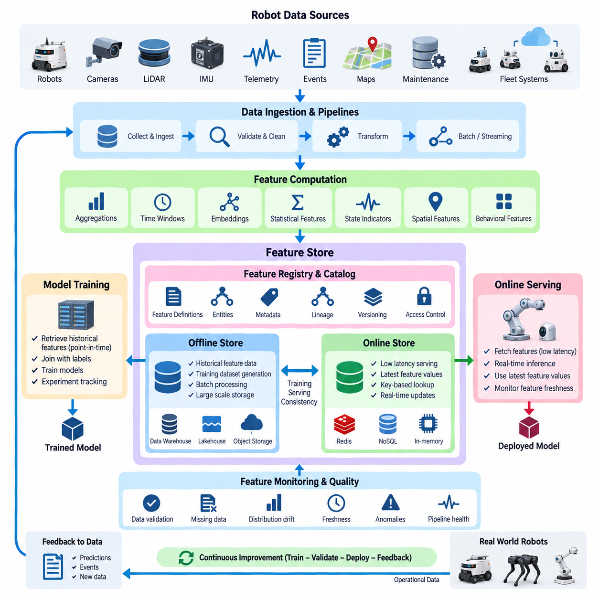
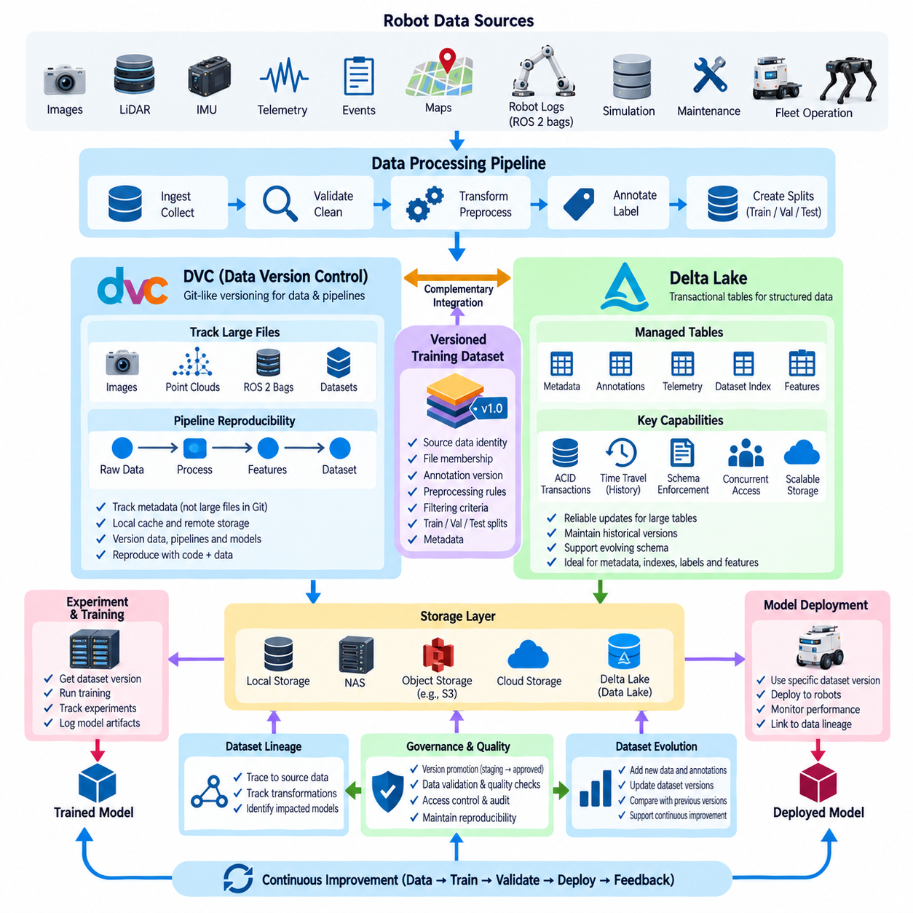
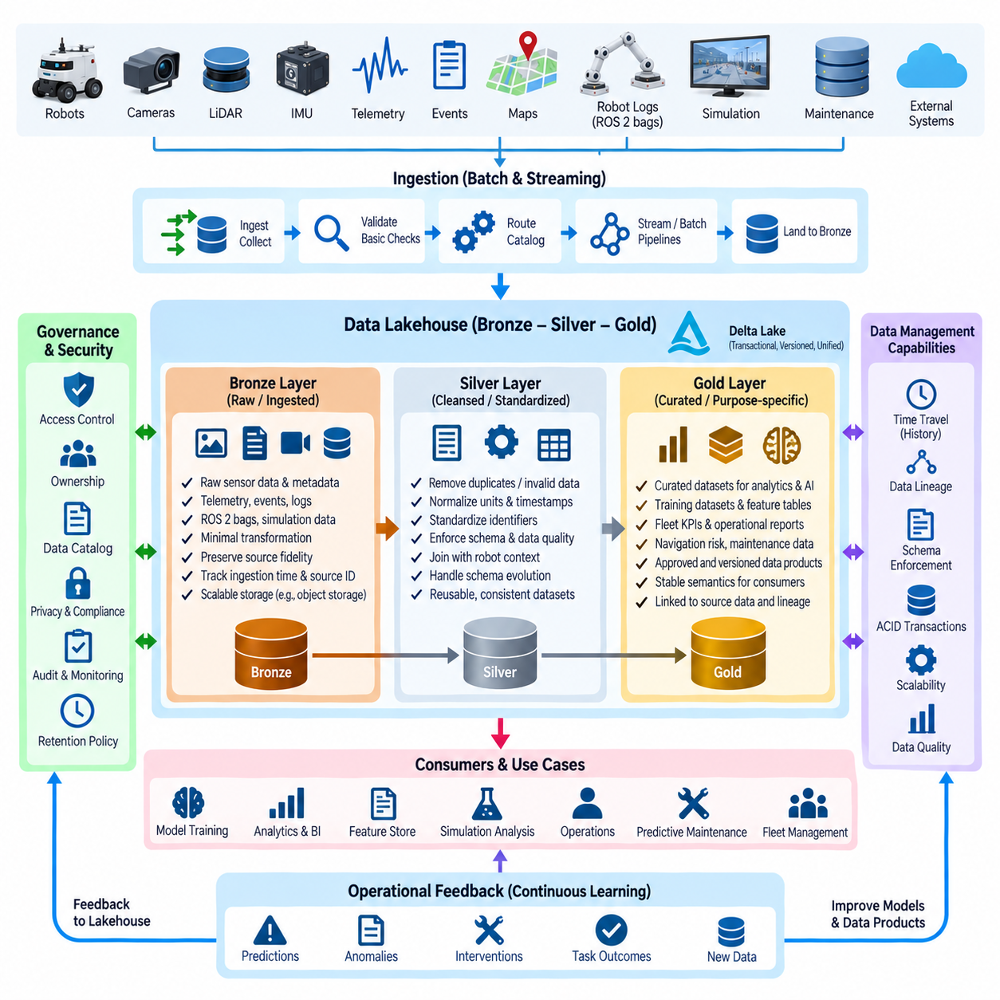
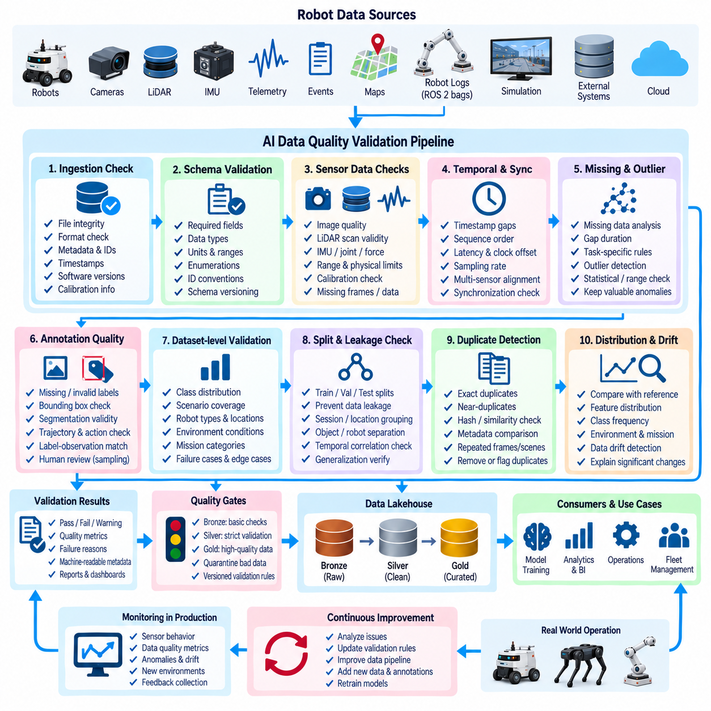
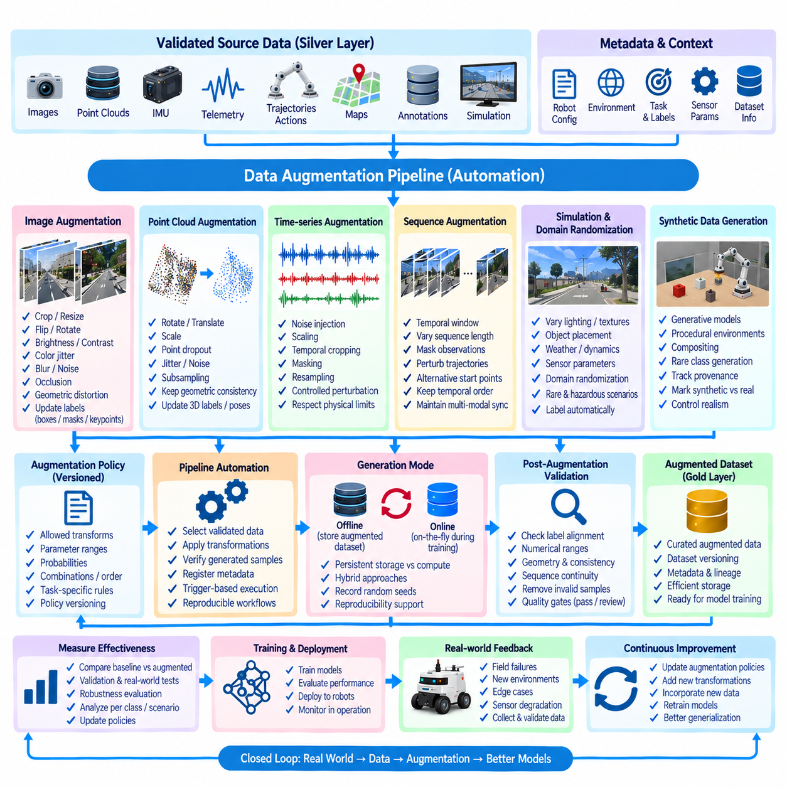
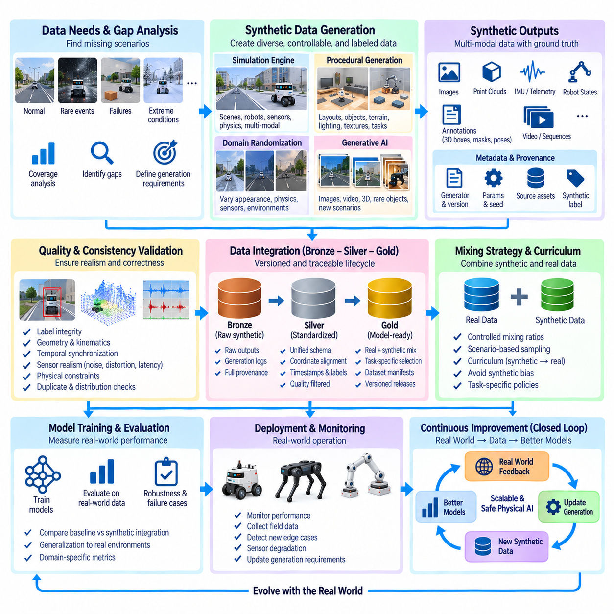
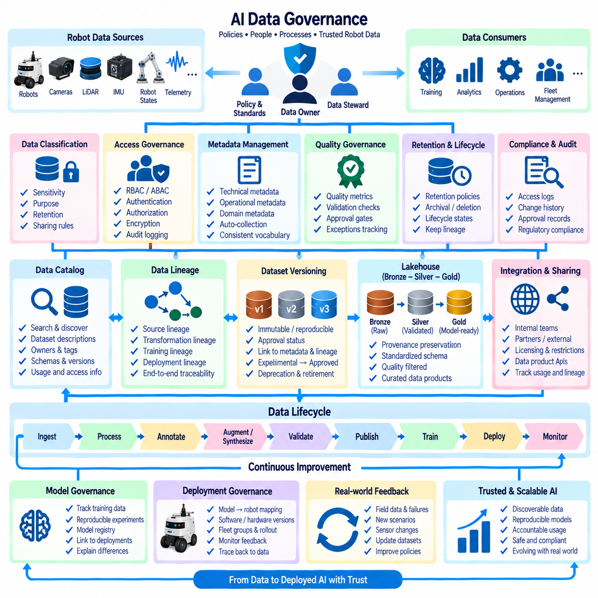
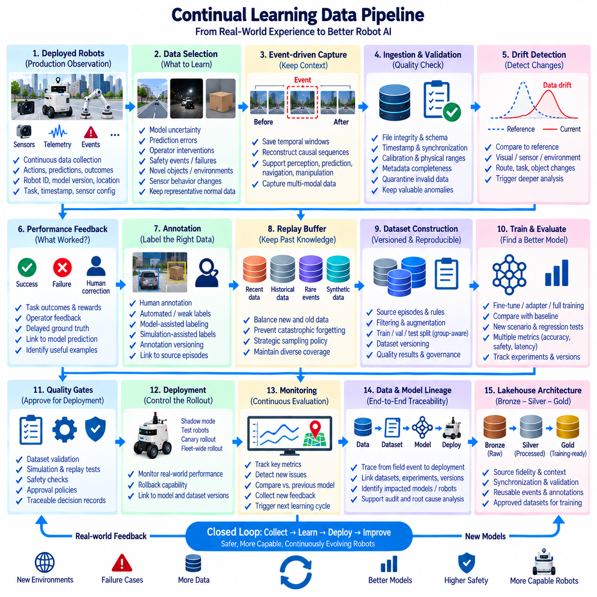
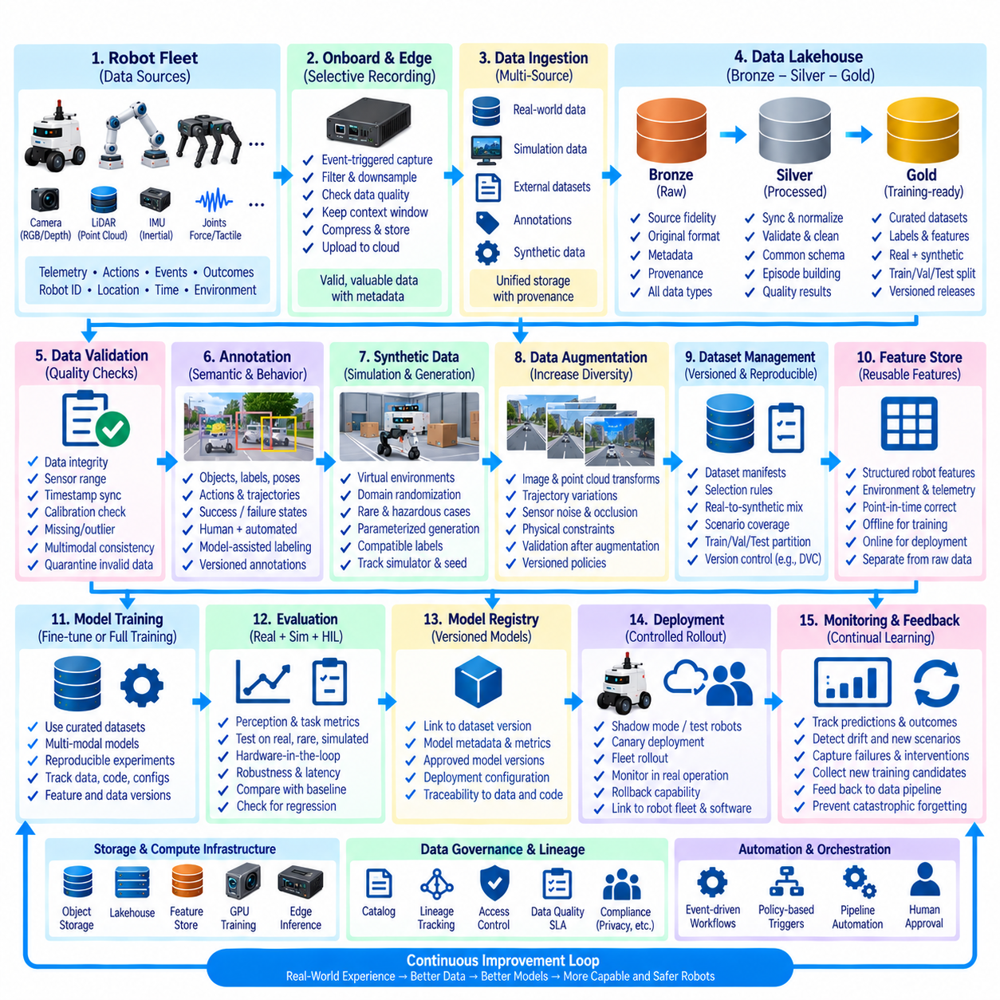

**Volume 07 Robot Data Architecture**


# 07. AI Data Architecture

##  

## 07.01 AI Data Architecture Overview: Train, Val, Deploy Flow

{width="7.268055555555556in" height="7.268055555555556in"}

AI data architecture in robotics defines the controlled flow that transforms raw operational data into validated models deployed on physical machines. Unlike conventional analytics pipelines, robot AI must handle synchronized images, point clouds, IMU streams, telemetry, maps, events, and task context. The architecture therefore connects data collection, dataset preparation, training, validation, deployment, and operational feedback as one traceable lifecycle.

The lifecycle begins with data generated by robots, simulation environments, test facilities, and fleet operations. Camera frames, LiDAR scans, radar observations, joint states, localization results, control commands, and mission events are collected with timestamps and contextual metadata. Preserving robot identity, sensor configuration, software version, operating environment, and task state is essential because these attributes determine whether samples can later be interpreted and reproduced correctly.

Raw data should not move directly into model training. It first passes through ingestion and preparation stages that verify file integrity, timestamp consistency, schema compatibility, sensor calibration references, missing values, and metadata completeness. Large multimodal recordings may then be segmented into meaningful episodes or samples. Sensitive information can be filtered, and unusable observations are rejected or quarantined before entering curated AI datasets.

Dataset construction converts operational records into learning-ready representations. Depending on the task, this may include object labels, segmentation masks, trajectories, poses, actions, demonstrations, occupancy information, or temporal sequences. Annotation can combine human labeling, automated labeling, model-assisted labeling, and simulation-generated ground truth. Each resulting dataset should retain lineage linking derived samples to their original source data and transformation history.

Training, validation, and test partitions must represent distinct roles rather than merely random percentages of one dataset. Training data drives parameter optimization, validation data supports model selection and hyperparameter decisions, and test data provides an independent estimate of expected behavior. In robotics, splitting must also consider location, route, robot, operating session, weather, object instance, mission, and temporal correlation to prevent information leakage between partitions.

Dataset versioning makes the training process reproducible. A model artifact should be associated with a specific dataset version, annotation schema, preprocessing configuration, augmentation policy, source-code revision, model configuration, and training environment. When a model improves or degrades, engineers can then determine whether the change originated from new data, altered labels, modified preprocessing, different hyperparameters, or software changes rather than treating the model as an isolated binary artifact.

The training layer consumes approved dataset versions and produces candidate models together with experiment metadata. Training may occur on local GPU workstations, on-premise clusters, cloud infrastructure, or distributed accelerators depending on dataset size and computational requirements. Experiment tracking records parameters, checkpoints, metrics, execution environments, and dependencies so that important training runs can be reconstructed instead of becoming one-time experiments with unknown provenance.

Validation is a gate between model creation and operational deployment. Conventional metrics such as precision, recall, IoU, trajectory error, or success rate remain important, but robot AI also requires scenario-oriented evaluation. Models should be examined across lighting conditions, obstacle configurations, motion states, sensor degradation, environmental changes, and difficult edge cases. Performance must therefore be interpreted in relation to the operational domain in which the robot will act.

A candidate that satisfies offline validation can progress toward simulation, replay, hardware-in-the-loop, or controlled robot testing. Recorded sensor streams allow deterministic replay of known situations, while simulation can expose the model to rare or dangerous scenarios without placing hardware at unnecessary risk. Physical tests then determine whether latency, memory consumption, GPU utilization, thermal behavior, communication delays, and interaction with surrounding software remain acceptable on the target platform.

Deployment converts an approved model into a controlled operational artifact. The model may require optimization, quantization, compilation, container packaging, runtime configuration, or hardware-specific acceleration before installation on an edge computer. Deployment metadata should identify the model version, runtime dependencies, supported hardware, preprocessing requirements, configuration parameters, and rollback target so that every robot can be associated with an exact executable AI configuration.

Model rollout should normally be separated from model creation. A registry can hold validated artifacts while deployment policies determine which robots, sites, or fleet groups receive each release. Staged rollout, canary deployment, shadow inference, and controlled A/B evaluation reduce the consequences of unexpected behavior. If operational indicators violate predefined conditions, the system should support rapid rollback to a previously validated model without rebuilding the complete software environment.

Once deployed, the model becomes a new source of data. Predictions, confidence values, inference latency, resource consumption, detected anomalies, operator interventions, task outcomes, and selected sensor observations can be captured as operational feedback. This closes the Train--Validate--Deploy loop by connecting real-world behavior to the next dataset generation cycle rather than considering deployment the final stage of AI development.

Production feedback is especially valuable when it identifies situations poorly represented in the original training distribution. False detections, missed objects, unusual terrain, new equipment, changed lighting, localization failures, and human intervention can be converted into prioritized data candidates. Instead of storing every sensor byte indefinitely, the architecture can selectively retain high-information episodes based on events, uncertainty, novelty, failure conditions, or explicit engineering requests.

The feedback process enables continual improvement, but production data should not automatically become training data. Newly collected samples must pass through quality checks, privacy controls, annotation, review, versioning, and dataset approval before they influence another model. This separation prevents corrupted labels, sensor faults, anomalous operations, or unintended environmental bias from silently propagating through automated retraining pipelines.

Data lineage provides the connective tissue across the complete architecture. Engineers should be able to trace a deployed prediction backward from robot and model version to deployment package, validation results, training experiment, dataset version, annotation revision, preprocessing pipeline, and ultimately the originating sensor records. The same lineage should operate forward, allowing teams to identify which models or robots may be affected when problematic source data or labels are discovered.

Governance surrounds every stage of the Train--Validate--Deploy flow. Access control determines who can read sensitive sensor records, modify labels, approve datasets, register models, or authorize deployment. Retention policies determine how long raw recordings, intermediate datasets, checkpoints, and production feedback remain available. Audit records provide evidence of who changed critical artifacts and when, supporting reproducibility, operational accountability, security, and later investigation.

The architecture also separates data responsibilities from model responsibilities. Data pipelines manage acquisition, validation, transformation, storage, annotation, versioning, and lineage, while MLOps mechanisms manage experiments, model registration, deployment, monitoring, and rollback. These domains remain tightly connected through shared identifiers and metadata. This separation aligns AI data architecture with the broader robotics software stack while avoiding uncontrolled coupling between storage, training, and runtime systems.

At fleet scale, the loop operates continuously across many robots rather than around a single training workstation. Different robot types and deployment sites contribute observations with different sensors, environments, missions, and failure patterns. Centralized or federated data services can normalize these observations into governed datasets, while deployment services distribute approved model variants according to hardware capability, robot configuration, geographic region, or operational requirements.

A mature AI data architecture therefore treats Train--Validate--Deploy as a repeatable closed-loop system rather than a linear machine-learning project. Operational data becomes governed training evidence, training produces traceable candidate models, validation determines deployment eligibility, deployment produces measurable field behavior, and field behavior generates the next data priorities. This cycle establishes the data foundation required for increasingly adaptive, reliable, and scalable Physical AI systems.

로봇공학(Robotics)의 AI 데이터 아키텍처(AI Data Architecture)는 원시 운영 데이터(Raw Operational Data)를 검증된 모델(Validated Model)로 변환하고, 이를 실제 물리적 로봇(Physical Robot)에 배포하는 통제된 데이터 흐름을 정의한다. 일반적인 분석 파이프라인(Analytics Pipeline)과 달리 로봇 AI는 동기화된 이미지(Image), 포인트 클라우드(Point Cloud), 관성측정장치(IMU) 스트림, 텔레메트리(Telemetry), 지도(Map), 이벤트(Event), 작업 문맥(Task Context)을 함께 처리해야 한다. 따라서 데이터 수집(Data Collection), 데이터셋 준비(Dataset Preparation), 학습(Training), 검증(Validation), 배포(Deployment), 운영 피드백(Operational Feedback)을 하나의 추적 가능한 생명주기(Lifecycle)로 연결해야 한다.

이 생명주기(Lifecycle)는 로봇, 시뮬레이션 환경(Simulation Environment), 시험 시설(Test Facility), 플릿 운영(Fleet Operation)에서 생성되는 데이터로 시작한다. 카메라 프레임(Camera Frame), 라이다 스캔(LiDAR Scan), 레이더 관측(Radar Observation), 관절 상태(Joint State), 위치추정 결과(Localization Result), 제어 명령(Control Command), 임무 이벤트(Mission Event)는 타임스탬프(Timestamp) 및 문맥 메타데이터(Contextual Metadata)와 함께 수집된다. 로봇 식별자(Robot Identity), 센서 구성(Sensor Configuration), 소프트웨어 버전(Software Version), 운영 환경(Operating Environment), 작업 상태(Task State)를 보존해야 이후 샘플을 정확하게 해석하고 재현할 수 있다.

원시 데이터(Raw Data)를 모델 학습(Model Training)에 직접 투입해서는 안 된다. 먼저 수집 및 준비 단계(Ingestion and Preparation Stage)를 통해 파일 무결성(File Integrity), 타임스탬프 일관성(Timestamp Consistency), 스키마 호환성(Schema Compatibility), 센서 보정 참조정보(Sensor Calibration Reference), 결측값(Missing Value), 메타데이터 완전성(Metadata Completeness)을 확인한다. 대규모 멀티모달 기록(Multimodal Recording)은 의미 있는 에피소드(Episode)나 샘플(Sample)로 분할할 수 있으며, 민감 정보(Sensitive Information)를 제거하고 사용할 수 없는 관측 데이터는 정제된 AI 데이터셋(Curated AI Dataset)에 포함되기 전에 제외하거나 격리한다.

데이터셋 구축(Dataset Construction)은 운영 기록(Operational Record)을 학습 가능한 표현(Learning-ready Representation)으로 변환한다. 작업에 따라 객체 라벨(Object Label), 세그멘테이션 마스크(Segmentation Mask), 궤적(Trajectory), 자세(Pose), 행동(Action), 시연(Demonstration), 점유 정보(Occupancy Information), 시계열 시퀀스(Temporal Sequence) 등이 포함될 수 있다. 어노테이션(Annotation)은 사람에 의한 라벨링(Human Labeling), 자동 라벨링(Automated Labeling), 모델 지원 라벨링(Model-assisted Labeling), 시뮬레이션 생성 정답 데이터(Simulation-generated Ground Truth)를 결합할 수 있다. 생성된 데이터셋은 파생 샘플(Derived Sample)을 원본 데이터(Source Data) 및 변환 이력(Transformation History)과 연결하는 데이터 계보(Data Lineage)를 유지해야 한다.

학습(Training), 검증(Validation), 테스트(Test) 데이터 분할은 하나의 데이터셋을 단순히 임의의 비율로 나누는 것이 아니라 서로 다른 역할을 수행하도록 구성해야 한다. 학습 데이터(Training Data)는 파라미터 최적화(Parameter Optimization)에 사용되고, 검증 데이터(Validation Data)는 모델 선택(Model Selection)과 하이퍼파라미터 결정(Hyperparameter Decision)을 지원하며, 테스트 데이터(Test Data)는 예상 성능을 독립적으로 평가한다. 로봇공학에서는 데이터 분할 시 위치(Location), 경로(Route), 로봇(Robot), 운영 세션(Operating Session), 날씨(Weather), 객체 인스턴스(Object Instance), 임무(Mission), 시간적 상관관계(Temporal Correlation)를 함께 고려하여 데이터 분할 간 정보 누출(Information Leakage)을 방지해야 한다.

데이터셋 버전 관리(Dataset Versioning)는 학습 과정의 재현성(Reproducibility)을 확보한다. 모델 아티팩트(Model Artifact)는 특정 데이터셋 버전(Dataset Version), 어노테이션 스키마(Annotation Schema), 전처리 구성(Preprocessing Configuration), 데이터 증강 정책(Augmentation Policy), 소스 코드 리비전(Source-code Revision), 모델 구성(Model Configuration), 학습 환경(Training Environment)과 연결되어야 한다. 이를 통해 모델 성능이 향상되거나 저하될 경우 그 원인이 새로운 데이터, 변경된 라벨, 수정된 전처리, 다른 하이퍼파라미터 또는 소프트웨어 변경 중 어디에서 발생했는지 추적할 수 있다.

학습 계층(Training Layer)은 승인된 데이터셋 버전(Approved Dataset Version)을 사용하여 후보 모델(Candidate Model)과 실험 메타데이터(Experiment Metadata)를 생성한다. 학습은 데이터셋 규모와 계산 요구사항에 따라 로컬 GPU 워크스테이션(Local GPU Workstation), 온프레미스 클러스터(On-premise Cluster), 클라우드 인프라(Cloud Infrastructure), 분산 가속기(Distributed Accelerator)에서 수행될 수 있다. 실험 추적(Experiment Tracking)은 파라미터(Parameter), 체크포인트(Checkpoint), 성능 지표(Metric), 실행 환경(Execution Environment), 종속성(Dependency)을 기록하여 중요한 학습 결과를 일회성 실험이 아닌 재구성 가능한 자산으로 관리한다.

검증(Validation)은 모델 생성(Model Creation)과 실제 운영 배포(Operational Deployment) 사이의 게이트(Gate) 역할을 한다. 정밀도(Precision), 재현율(Recall), IoU(Intersection over Union), 궤적 오차(Trajectory Error), 성공률(Success Rate)과 같은 일반적인 지표도 중요하지만, 로봇 AI에서는 시나리오 중심 평가(Scenario-oriented Evaluation)가 추가로 필요하다. 조명 조건(Lighting Condition), 장애물 구성(Obstacle Configuration), 운동 상태(Motion State), 센서 성능 저하(Sensor Degradation), 환경 변화(Environmental Change), 어려운 엣지 케이스(Edge Case)에 걸쳐 모델을 평가해야 하며, 성능은 로봇이 실제 작동할 운영 영역(Operational Domain)과 연계하여 해석해야 한다.

오프라인 검증(Offline Validation)을 통과한 후보 모델은 시뮬레이션(Simulation), 리플레이(Replay), 하드웨어 인 더 루프(Hardware-in-the-Loop), 통제된 로봇 시험(Controlled Robot Testing) 단계로 진행할 수 있다. 기록된 센서 스트림(Sensor Stream)을 이용하면 알려진 상황을 결정론적으로 재생할 수 있고, 시뮬레이션은 실제 하드웨어를 불필요한 위험에 노출하지 않고 희귀하거나 위험한 시나리오를 시험할 수 있게 한다. 실제 로봇 시험에서는 지연시간(Latency), 메모리 사용량(Memory Consumption), GPU 사용률(GPU Utilization), 열적 거동(Thermal Behavior), 통신 지연(Communication Delay), 주변 소프트웨어와의 상호작용이 목표 플랫폼(Target Platform)에서 허용 가능한지 확인한다.

배포(Deployment)는 승인된 모델(Approved Model)을 통제 가능한 운영 아티팩트(Operational Artifact)로 변환한다. 모델은 엣지 컴퓨터(Edge Computer)에 설치되기 전에 최적화(Optimization), 양자화(Quantization), 컴파일(Compilation), 컨테이너 패키징(Container Packaging), 런타임 구성(Runtime Configuration), 하드웨어별 가속(Hardware-specific Acceleration)이 필요할 수 있다. 배포 메타데이터(Deployment Metadata)는 모델 버전(Model Version), 런타임 종속성(Runtime Dependency), 지원 하드웨어(Supported Hardware), 전처리 요구사항(Preprocessing Requirement), 구성 파라미터(Configuration Parameter), 롤백 대상(Rollback Target)을 명확하게 식별해야 한다.

모델 롤아웃(Model Rollout)은 일반적으로 모델 생성(Model Creation) 과정과 분리하는 것이 바람직하다. 모델 레지스트리(Model Registry)는 검증된 아티팩트(Validated Artifact)를 관리하고, 배포 정책(Deployment Policy)은 어떤 로봇, 사이트 또는 플릿 그룹(Fleet Group)에 각 릴리스(Release)를 적용할지 결정한다. 단계적 롤아웃(Staged Rollout), 카나리 배포(Canary Deployment), 섀도 추론(Shadow Inference), 통제된 A/B 평가(Controlled A/B Evaluation)는 예상하지 못한 동작의 영향을 줄인다. 운영 지표가 사전에 정의된 조건을 위반하면 전체 소프트웨어 환경을 다시 구축하지 않고 이전에 검증된 모델로 신속하게 롤백(Rollback)할 수 있어야 한다.

배포된 모델은 다시 새로운 데이터의 생성원이 된다. 예측 결과(Prediction), 신뢰도(Confidence), 추론 지연시간(Inference Latency), 자원 사용량(Resource Consumption), 감지된 이상(Detected Anomaly), 운영자 개입(Operator Intervention), 작업 결과(Task Outcome), 선택된 센서 관측(Sensor Observation)을 운영 피드백(Operational Feedback)으로 수집할 수 있다. 이를 통해 배포를 AI 개발의 최종 단계로 보는 대신 실제 환경에서의 동작을 다음 데이터셋 생성 주기(Dataset Generation Cycle)와 연결하여 학습--검증--배포(Train--Validate--Deploy) 순환 구조를 완성한다.

운영 피드백(Production Feedback)은 기존 학습 분포(Training Distribution)에 충분히 포함되지 않았던 상황을 식별할 때 특히 가치가 높다. 오검출(False Detection), 미검출(Missed Object), 비정상적인 지형(Unusual Terrain), 새로운 장비(New Equipment), 조명 변화(Changed Lighting), 위치추정 실패(Localization Failure), 사람의 개입(Human Intervention)을 우선순위가 높은 데이터 후보(Data Candidate)로 전환할 수 있다. 모든 센서 데이터를 무기한 저장하는 대신 이벤트(Event), 불확실성(Uncertainty), 신규성(Novelty), 실패 조건(Failure Condition), 엔지니어링 요청(Engineering Request)을 기준으로 정보 가치가 높은 구간만 선택적으로 보존할 수 있다.

피드백 프로세스(Feedback Process)는 지속적인 개선(Continual Improvement)을 가능하게 하지만, 운영 데이터(Production Data)를 자동으로 학습 데이터(Training Data)로 전환해서는 안 된다. 새롭게 수집된 샘플은 다음 모델에 영향을 주기 전에 데이터 품질 검사(Data Quality Check), 개인정보 보호 통제(Privacy Control), 어노테이션(Annotation), 검토(Review), 버전 관리(Versioning), 데이터셋 승인(Dataset Approval)을 거쳐야 한다. 이러한 분리는 손상된 라벨(Corrupted Label), 센서 결함(Sensor Fault), 비정상적인 운영(Anomalous Operation), 의도하지 않은 환경 편향(Environmental Bias)이 자동 재학습 파이프라인(Automated Retraining Pipeline)을 통해 확산되는 것을 방지한다.

데이터 계보(Data Lineage)는 전체 아키텍처를 연결하는 핵심 구조이다. 엔지니어는 배포된 예측 결과(Deployed Prediction)에서 시작하여 로봇과 모델 버전, 배포 패키지(Deployment Package), 검증 결과(Validation Result), 학습 실험(Training Experiment), 데이터셋 버전, 어노테이션 리비전(Annotation Revision), 전처리 파이프라인(Preprocessing Pipeline), 최종적으로 원본 센서 기록(Original Sensor Record)까지 역방향으로 추적할 수 있어야 한다. 동시에 문제가 있는 원본 데이터나 라벨이 발견되었을 때 어떤 모델이나 로봇이 영향을 받을 수 있는지도 순방향으로 식별할 수 있어야 한다.

데이터 거버넌스(Data Governance)는 학습--검증--배포(Train--Validate--Deploy)의 모든 단계를 둘러싼다. 접근 제어(Access Control)는 민감한 센서 기록을 읽거나, 라벨을 수정하거나, 데이터셋을 승인하거나, 모델을 등록하거나, 배포를 승인할 수 있는 주체를 결정한다. 보존 정책(Retention Policy)은 원시 기록, 중간 데이터셋, 체크포인트, 운영 피드백을 얼마나 오래 유지할지 정의한다. 감사 기록(Audit Record)은 누가 언제 핵심 아티팩트를 변경했는지에 대한 증거를 제공하여 재현성, 운영 책임성(Operational Accountability), 보안(Security), 사후 조사(Investigation)를 지원한다.

이 아키텍처는 데이터 책임(Data Responsibility)과 모델 책임(Model Responsibility)도 분리한다. 데이터 파이프라인(Data Pipeline)은 수집, 검증, 변환, 저장, 어노테이션, 버전 관리, 데이터 계보를 담당하고, 머신러닝 운영(MLOps) 메커니즘은 실험(Experiment), 모델 등록(Model Registration), 배포, 모니터링(Monitoring), 롤백을 담당한다. 두 영역은 공통 식별자(Shared Identifier)와 메타데이터를 통해 긴밀하게 연결되지만 역할은 분리되며, 이를 통해 AI 데이터 아키텍처를 전체 로보틱스 소프트웨어 스택(Robotics Software Stack)과 연계하면서 저장, 학습, 런타임 시스템(Runtime System) 사이의 불필요한 결합을 방지할 수 있다.

플릿 규모(Fleet Scale)에서는 이 순환 구조가 하나의 학습 워크스테이션을 중심으로 동작하는 것이 아니라 다수의 로봇 전체에서 지속적으로 작동한다. 서로 다른 로봇 유형(Robot Type)과 배포 사이트(Deployment Site)는 서로 다른 센서, 환경, 임무, 실패 패턴(Failure Pattern)을 가진 관측 데이터를 생성한다. 중앙집중형 또는 연합형 데이터 서비스(Centralized or Federated Data Service)는 이러한 관측 데이터를 표준화하여 관리되는 데이터셋으로 구성하고, 배포 서비스(Deployment Service)는 하드웨어 성능, 로봇 구성, 지리적 지역, 운영 요구사항에 따라 승인된 모델 변형(Model Variant)을 배포할 수 있다.

성숙한 AI 데이터 아키텍처(AI Data Architecture)는 학습--검증--배포(Train--Validate--Deploy)를 일회성의 선형 머신러닝 프로젝트(Linear Machine Learning Project)가 아니라 반복 가능한 폐루프 시스템(Repeatable Closed-loop System)으로 다룬다. 운영 데이터는 통제된 학습 근거(Training Evidence)가 되고, 학습은 추적 가능한 후보 모델을 생성하며, 검증은 배포 적격성(Deployment Eligibility)을 판단한다. 배포된 모델의 현장 동작(Field Behavior)은 다시 측정 가능한 데이터로 변환되어 다음 데이터 우선순위를 결정하며, 이러한 지속적 순환 구조가 더욱 적응적이고 신뢰할 수 있으며 확장 가능한 피지컬 AI(Physical AI) 시스템을 위한 데이터 기반을 형성한다.

##  

## 07.02 Feature Store Design and Implementation: Feast / Tecton [w/Code]

{width="7.268055555555556in" height="7.268055555555556in"}

A feature store provides a managed data layer between raw robot data pipelines and machine-learning models. Its primary purpose is to define, compute, store, discover, and serve reusable features consistently across training and inference. Within robot AI architecture, it prevents individual teams from repeatedly rebuilding transformations for telemetry, perception, localization, fleet behavior, diagnostics, and operational context while maintaining a common definition of each feature.

Robot features are derived from heterogeneous sources such as sensor streams, time-series telemetry, event records, mission histories, maps, maintenance databases, and fleet-management systems. Raw measurements are rarely suitable for direct model consumption. They may be converted into rolling averages, statistical summaries, temporal windows, categorical states, embeddings, health indicators, spatial attributes, or historical behavior variables before being supplied to perception, prediction, anomaly-detection, or decision models.

A feature store separates feature definitions from the applications that consume them. Instead of embedding transformation logic independently inside every training script or inference service, feature definitions are registered as governed data assets. A definition can describe source fields, transformation logic, entity keys, timestamps, data types, ownership, and update policies. Multiple models can therefore reuse the same feature while preserving consistent semantics throughout the AI lifecycle.

Entities provide the keys that connect features to real-world objects. In robotics, typical entities include robot ID, fleet ID, mission ID, component ID, location, sensor ID, or operator-independent task identifiers. A feature such as battery temperature alone has limited meaning unless it is associated with a specific robot and observation time. Entity-aware organization allows feature values originating from different systems to be joined consistently for training and inference.

Time is particularly important because robot observations continuously change. Feature retrieval must reproduce what information was actually available at a particular historical moment rather than accidentally using future information. Point-in-time correct joins associate labels with feature values that existed before the prediction timestamp. This mechanism reduces training data leakage and is essential when constructing datasets for predictive maintenance, failure forecasting, mission-risk prediction, and other temporal robot applications.

Feature-store architecture commonly distinguishes an offline store from an online store. The offline store maintains large historical feature datasets used for model training, batch analysis, experimentation, and backtesting. It can rely on data warehouses, lakehouses, object storage, or analytical databases. Because training may consume months or years of robot history, the offline layer emphasizes scalable storage, historical retrieval, reproducibility, and efficient processing of large datasets.

The online store serves the latest feature values to deployed models with low latency. A robot inference service may need recent battery state, mission context, component health indicators, environmental conditions, or fleet statistics within milliseconds. Online storage therefore prioritizes fast key-based lookup and predictable response time. Only features required for operational inference normally need to be materialized online, reducing storage cost and synchronization complexity.

The relationship between offline and online stores is critical for training-serving consistency. A model trained using one feature calculation but served with a slightly different implementation can suffer from training-serving skew. A well-designed feature store allows common feature definitions and transformation logic to support both historical dataset generation and production inference. The goal is not merely faster retrieval but semantic consistency between what the model learned and what it receives after deployment.

Feature computation may operate in batch, streaming, or hybrid modes. Batch pipelines are appropriate for historical statistics, long-term maintenance indicators, aggregated fleet behavior, and slowly changing features. Streaming computation is useful for rapidly changing robot states such as recent velocity, fault-event frequency, short-term temperature trends, or mission activity. Hybrid architectures combine historical context with near-real-time updates to provide models with both long-term and immediate operational information.

Feature freshness defines how current a feature must be when it is consumed. Some attributes, such as robot hardware type, may change rarely, while motion state or battery measurements can become obsolete within seconds. Each feature should therefore have an explicit update frequency or freshness expectation. Monitoring feature freshness helps detect failed pipelines, delayed telemetry, disconnected robots, or stale online values before those conditions silently degrade deployed AI behavior.

Feature quality management extends conventional data validation into model-facing variables. Feature values can be checked for missing data, unexpected ranges, invalid categories, abnormal distributions, timestamp delays, duplicate records, and schema changes. Statistical monitoring can additionally identify feature drift between historical training data and production observations. These controls allow teams to distinguish model degradation caused by changing feature distributions from failures originating in software or model parameters.

Feast is an open-source feature store framework that organizes features around concepts such as entities, feature views, data sources, offline retrieval, and online serving. Feature definitions can be maintained alongside machine-learning code and connected to existing data infrastructure rather than requiring all robot data to be moved into a proprietary storage system. This makes Feast suitable when engineering teams want explicit control over storage technologies, pipelines, deployment environments, and feature definitions.

In a Feast-based workflow, engineers define entities and feature views that describe how feature data is associated with source systems. Historical retrieval creates training datasets using timestamp-aware joins, while materialization transfers selected feature values from offline sources into an online store for low-latency serving. Deployed inference applications can then retrieve feature vectors using entity keys, helping maintain a structured connection between training data generation and production model inputs.

Tecton represents a managed feature-platform approach in which feature engineering, orchestration, serving, monitoring, and governance are integrated into a broader operational service. Such an approach can reduce the amount of infrastructure that engineering teams must construct themselves, particularly when many models and teams share production features. The architectural decision between Feast and a managed platform therefore involves operational ownership, infrastructure control, integration requirements, scale, governance, and organizational resources.

For robotics, the feature store should not be interpreted as a replacement for raw sensor storage. High-bandwidth camera images, LiDAR point clouds, radar frames, ROS 2 bags, and other large multimodal records normally remain in dedicated object storage, data lakes, or sensor-data repositories. The feature store primarily manages derived variables and references needed by machine-learning models, while preserving lineage back to the datasets and sensor records from which those features were calculated.

Feature lineage connects every feature to its source data and transformation history. When a deployed model produces an unexpected result, engineers should be able to identify the feature values supplied to the model, their timestamps, transformation versions, originating datasets, and upstream pipelines. Conversely, when a source schema or transformation changes, lineage information helps identify which features, training datasets, models, and inference services may be affected by that change.

Feature versioning supports controlled evolution of machine-learning inputs. Changing a rolling window, normalization rule, aggregation function, coordinate transformation, or categorical encoding can alter model behavior even if the feature name remains unchanged. Significant semantic changes should therefore create identifiable feature versions. Training experiments can then reference exact versions, and production models can continue using validated definitions until a newer feature-model combination has completed validation.

Security and governance become increasingly important when feature stores are shared across fleets and AI teams. Access policies can restrict sensitive operational, location, customer, or human-related features while allowing broader reuse of non-sensitive variables. Ownership metadata identifies the team responsible for each feature, while documentation, tags, schemas, lineage, and audit records improve discovery and accountability. The feature catalog consequently becomes both an engineering interface and a governance mechanism.

In a fleet-scale robot AI system, reusable features can support predictive maintenance, energy estimation, task-duration prediction, anomaly detection, navigation-risk assessment, and fleet optimization simultaneously. A common robot entity may connect battery statistics, motor health, mission history, environmental context, and fault-event features. Models can consume different combinations without duplicating the complete upstream transformation pipeline, improving consistency while reducing repeated computation and engineering effort.

The feature store ultimately forms a bridge between robot data architecture and MLOps. Data pipelines transform operational observations into governed features, offline retrieval supplies reproducible training datasets, validation verifies model behavior, and online serving delivers corresponding features to deployed inference systems. Production observations then return through the data pipeline, allowing features and models to evolve together within the broader Train--Validate--Deploy feedback loop established by the AI data architecture.

피처 스토어(Feature Store)는 원시 로봇 데이터 파이프라인(Raw Robot Data Pipeline)과 머신러닝 모델(Machine Learning Model) 사이에 위치하는 관리형 데이터 계층(Managed Data Layer)을 제공한다. 주요 목적은 학습(Training)과 추론(Inference) 전반에서 재사용 가능한 피처(Feature)를 일관되게 정의, 계산, 저장, 검색, 제공하는 것이다. 로봇 AI 아키텍처(Robot AI Architecture)에서는 개별 팀이 텔레메트리(Telemetry), 인지(Perception), 위치추정(Localization), 플릿 동작(Fleet Behavior), 진단(Diagnostics), 운영 문맥(Operational Context)에 대한 변환 로직을 반복적으로 구축하는 것을 방지하면서 각 피처의 공통 정의를 유지한다.

로봇 피처(Robot Feature)는 센서 스트림(Sensor Stream), 시계열 텔레메트리(Time-series Telemetry), 이벤트 기록(Event Record), 임무 이력(Mission History), 지도(Map), 유지보수 데이터베이스(Maintenance Database), 플릿 관리 시스템(Fleet Management System)과 같은 이기종 데이터 소스(Heterogeneous Data Source)에서 생성된다. 원시 측정값(Raw Measurement)은 일반적으로 모델에 직접 입력하기에 적합하지 않다. 따라서 이동 평균(Rolling Average), 통계 요약(Statistical Summary), 시간 윈도우(Temporal Window), 범주형 상태(Categorical State), 임베딩(Embedding), 상태 지표(Health Indicator), 공간 속성(Spatial Attribute), 과거 행동 변수(Historical Behavior Variable) 등으로 변환한 후 인지, 예측, 이상 탐지 또는 의사결정 모델에 제공할 수 있다.

피처 스토어(Feature Store)는 피처 정의(Feature Definition)를 이를 사용하는 애플리케이션(Application)으로부터 분리한다. 모든 학습 스크립트(Training Script)나 추론 서비스(Inference Service)에 변환 로직을 독립적으로 구현하는 대신 피처 정의를 관리되는 데이터 자산(Governed Data Asset)으로 등록한다. 피처 정의에는 원본 필드(Source Field), 변환 로직(Transformation Logic), 엔터티 키(Entity Key), 타임스탬프(Timestamp), 데이터 유형(Data Type), 소유권(Ownership), 갱신 정책(Update Policy)을 기술할 수 있다. 이를 통해 여러 모델이 동일한 피처를 재사용하면서 AI 생명주기(AI Lifecycle) 전체에서 일관된 의미를 유지할 수 있다.

엔터티(Entity)는 피처를 실제 객체(Real-world Object)와 연결하는 키(Key)를 제공한다. 로봇공학(Robotics)에서 일반적인 엔터티에는 로봇 ID(Robot ID), 플릿 ID(Fleet ID), 임무 ID(Mission ID), 컴포넌트 ID(Component ID), 위치(Location), 센서 ID(Sensor ID), 작업 식별자(Task Identifier) 등이 포함된다. 배터리 온도(Battery Temperature)와 같은 피처도 특정 로봇과 관측 시간(Observation Time)에 연결되지 않으면 의미가 제한적이다. 엔터티 기반 구성(Entity-aware Organization)은 서로 다른 시스템에서 생성된 피처 값을 학습과 추론 과정에서 일관되게 결합할 수 있도록 한다.

로봇의 관측값은 지속적으로 변화하기 때문에 시간(Time)은 특히 중요하다. 피처 조회(Feature Retrieval)는 미래 정보를 실수로 사용하는 것이 아니라 특정 과거 시점에 실제로 사용할 수 있었던 정보를 재현해야 한다. 시점 정합 조인(Point-in-time Correct Join)은 라벨(Label)을 예측 시점 이전에 존재했던 피처 값과 연결한다. 이러한 메커니즘은 학습 데이터 누출(Training Data Leakage)을 줄이며 예지보전(Predictive Maintenance), 고장 예측(Failure Forecasting), 임무 위험 예측(Mission-risk Prediction)과 같은 시간 기반 로봇 애플리케이션의 데이터셋을 구축할 때 필수적이다.

피처 스토어 아키텍처(Feature Store Architecture)는 일반적으로 오프라인 스토어(Offline Store)와 온라인 스토어(Online Store)를 구분한다. 오프라인 스토어는 모델 학습, 배치 분석(Batch Analysis), 실험(Experimentation), 백테스팅(Backtesting)에 사용되는 대규모 과거 피처 데이터셋을 유지한다. 데이터 웨어하우스(Data Warehouse), 레이크하우스(Lakehouse), 객체 스토리지(Object Storage), 분석 데이터베이스(Analytical Database)를 활용할 수 있다. 학습에는 수개월 또는 수년간의 로봇 이력이 사용될 수 있으므로 오프라인 계층은 확장 가능한 저장, 과거 데이터 조회, 재현성(Reproducibility), 대규모 데이터의 효율적인 처리에 중점을 둔다.

온라인 스토어(Online Store)는 배포된 모델(Deployed Model)에 최신 피처 값을 낮은 지연시간(Low Latency)으로 제공한다. 로봇 추론 서비스(Robot Inference Service)는 최근 배터리 상태, 임무 문맥, 컴포넌트 상태 지표, 환경 조건, 플릿 통계를 수 밀리초 이내에 필요로 할 수 있다. 따라서 온라인 저장소는 빠른 키 기반 조회(Key-based Lookup)와 예측 가능한 응답시간(Response Time)을 우선한다. 일반적으로 실제 운영 추론에 필요한 피처만 온라인으로 구체화(Materialization)하여 저장 비용과 동기화 복잡성을 줄인다.

오프라인 스토어와 온라인 스토어의 관계는 학습--서빙 일관성(Training-serving Consistency)을 확보하는 데 중요하다. 하나의 피처 계산 방식으로 학습된 모델에 운영 단계에서 조금이라도 다른 구현으로 계산된 값을 제공하면 학습--서빙 불일치(Training-serving Skew)가 발생할 수 있다. 잘 설계된 피처 스토어는 공통 피처 정의와 변환 로직을 사용하여 과거 학습 데이터셋 생성과 운영 추론을 모두 지원한다. 목표는 단순히 조회 속도를 높이는 것이 아니라 모델이 학습한 데이터와 배포 이후 입력받는 데이터 사이의 의미적 일관성(Semantic Consistency)을 확보하는 것이다.

피처 계산(Feature Computation)은 배치(Batch), 스트리밍(Streaming), 하이브리드(Hybrid) 방식으로 수행할 수 있다. 배치 파이프라인(Batch Pipeline)은 과거 통계, 장기 유지보수 지표, 집계된 플릿 동작, 변화가 느린 피처에 적합하다. 스트리밍 계산(Streaming Computation)은 최근 속도, 고장 이벤트 빈도, 단기 온도 추세, 임무 활동과 같이 빠르게 변화하는 로봇 상태에 유용하다. 하이브리드 아키텍처(Hybrid Architecture)는 과거 문맥과 준실시간 업데이트(Near-real-time Update)를 결합하여 모델에 장기적 정보와 즉각적인 운영 정보를 함께 제공한다.

피처 최신성(Feature Freshness)은 피처가 사용되는 시점에 얼마나 최신 상태여야 하는지를 정의한다. 로봇 하드웨어 유형(Robot Hardware Type)과 같은 속성은 거의 변경되지 않지만, 운동 상태(Motion State)나 배터리 측정값은 몇 초 이내에도 오래된 정보가 될 수 있다. 따라서 각 피처에는 명시적인 갱신 주기(Update Frequency) 또는 최신성 요구사항(Freshness Expectation)이 필요하다. 피처 최신성을 모니터링하면 실패한 파이프라인, 지연된 텔레메트리, 연결이 끊어진 로봇, 오래된 온라인 값을 탐지하여 이러한 문제가 배포된 AI의 동작을 조용히 저하시키는 것을 방지할 수 있다.

피처 품질 관리(Feature Quality Management)는 기존 데이터 검증(Data Validation)을 모델 입력 변수까지 확장한다. 피처 값은 결측 데이터(Missing Data), 예상 범위를 벗어난 값(Unexpected Range), 잘못된 범주(Invalid Category), 비정상적인 분포(Abnormal Distribution), 타임스탬프 지연(Timestamp Delay), 중복 레코드(Duplicate Record), 스키마 변경(Schema Change)에 대해 검사할 수 있다. 통계적 모니터링(Statistical Monitoring)을 통해 과거 학습 데이터와 운영 관측값 사이의 피처 드리프트(Feature Drift)를 추가로 탐지할 수 있으며, 이를 통해 소프트웨어나 모델 파라미터 문제가 아닌 피처 분포 변화에 의한 모델 성능 저하를 구분할 수 있다.

피스트(Feast)는 엔터티(Entity), 피처 뷰(Feature View), 데이터 소스(Data Source), 오프라인 조회(Offline Retrieval), 온라인 서빙(Online Serving) 등의 개념을 중심으로 피처를 구성하는 오픈소스 피처 스토어 프레임워크(Open-source Feature Store Framework)이다. 피처 정의를 머신러닝 코드와 함께 관리하고 기존 데이터 인프라(Data Infrastructure)에 연결할 수 있으므로 모든 로봇 데이터를 독점적인 저장 시스템으로 이동시킬 필요가 없다. 따라서 저장 기술, 파이프라인, 배포 환경, 피처 정의에 대한 명시적인 제어가 필요한 엔지니어링 조직에 적합하다.

피스트 기반 워크플로(Feast-based Workflow)에서는 엔지니어가 피처 데이터와 원본 시스템의 관계를 설명하는 엔터티와 피처 뷰를 정의한다. 과거 데이터 조회(Historical Retrieval)는 타임스탬프를 고려한 조인(Timestamp-aware Join)을 이용하여 학습 데이터셋을 생성하고, 구체화(Materialization)는 선택된 피처 값을 오프라인 데이터 소스에서 온라인 스토어로 전송하여 저지연 서빙(Low-latency Serving)을 지원한다. 이후 배포된 추론 애플리케이션은 엔터티 키를 이용해 피처 벡터(Feature Vector)를 조회하여 학습 데이터 생성과 운영 모델 입력 사이의 구조적인 연결을 유지할 수 있다.

텍톤(Tecton)은 피처 엔지니어링(Feature Engineering), 오케스트레이션(Orchestration), 서빙(Serving), 모니터링(Monitoring), 거버넌스(Governance)를 보다 광범위한 운영 서비스에 통합하는 관리형 피처 플랫폼(Managed Feature Platform) 접근방식을 제공한다. 이러한 방식은 특히 여러 모델과 팀이 운영 피처를 공유하는 환경에서 엔지니어링 조직이 직접 구축해야 하는 인프라의 규모를 줄일 수 있다. 따라서 피스트와 관리형 플랫폼 사이의 아키텍처 선택은 운영 책임(Operational Ownership), 인프라 제어(Infrastructure Control), 통합 요구사항(Integration Requirement), 규모(Scale), 거버넌스, 조직의 자원을 종합적으로 고려해야 한다.

로봇공학에서 피처 스토어를 원시 센서 저장소(Raw Sensor Storage)의 대체 수단으로 이해해서는 안 된다. 고대역폭 카메라 이미지, 라이다 포인트 클라우드, 레이더 프레임, ROS 2 백(ROS 2 Bag) 및 기타 대규모 멀티모달 기록은 일반적으로 전용 객체 스토리지, 데이터 레이크(Data Lake), 센서 데이터 저장소(Sensor-data Repository)에 유지된다. 피처 스토어는 주로 머신러닝 모델에 필요한 파생 변수(Derived Variable)와 참조정보(Reference)를 관리하면서 해당 피처가 계산된 원본 데이터셋과 센서 기록까지의 데이터 계보를 유지한다.

피처 계보(Feature Lineage)는 모든 피처를 원본 데이터(Source Data) 및 변환 이력(Transformation History)과 연결한다. 배포된 모델이 예상하지 못한 결과를 생성할 경우 엔지니어는 모델에 제공된 피처 값, 타임스탬프, 변환 버전(Transformation Version), 원본 데이터셋, 업스트림 파이프라인(Upstream Pipeline)을 식별할 수 있어야 한다. 반대로 원본 스키마나 변환 로직이 변경되었을 때 데이터 계보 정보를 통해 어떤 피처, 학습 데이터셋, 모델, 추론 서비스가 영향을 받을 수 있는지 파악할 수 있다.

피처 버전 관리(Feature Versioning)는 머신러닝 입력의 통제된 진화(Controlled Evolution)를 지원한다. 이동 윈도우(Rolling Window), 정규화 규칙(Normalization Rule), 집계 함수(Aggregation Function), 좌표 변환(Coordinate Transformation), 범주형 인코딩(Categorical Encoding)의 변경은 피처 이름이 동일하더라도 모델 동작을 변화시킬 수 있다. 따라서 중요한 의미적 변경(Semantic Change)은 식별 가능한 피처 버전을 생성해야 한다. 학습 실험은 정확한 버전을 참조하고, 운영 모델은 새로운 피처--모델 조합(Feature-model Combination)의 검증이 완료될 때까지 기존에 검증된 정의를 계속 사용할 수 있다.

보안(Security)과 거버넌스(Governance)는 피처 스토어가 여러 플릿과 AI 팀 사이에서 공유될수록 더욱 중요해진다. 접근 정책(Access Policy)은 민감한 운영, 위치, 고객 또는 사람 관련 피처에 대한 접근을 제한하면서 민감하지 않은 변수의 폭넓은 재사용을 허용할 수 있다. 소유권 메타데이터(Ownership Metadata)는 각 피처를 담당하는 팀을 식별하며, 문서화(Documentation), 태그(Tag), 스키마(Schema), 데이터 계보, 감사 기록(Audit Record)은 검색 가능성과 책임성을 향상시킨다. 이에 따라 피처 카탈로그(Feature Catalog)는 엔지니어링 인터페이스와 거버넌스 메커니즘의 역할을 동시에 수행한다.

플릿 규모의 로봇 AI 시스템(Fleet-scale Robot AI System)에서 재사용 가능한 피처는 예지보전, 에너지 추정(Energy Estimation), 작업 소요시간 예측(Task-duration Prediction), 이상 탐지(Anomaly Detection), 주행 위험 평가(Navigation-risk Assessment), 플릿 최적화(Fleet Optimization)를 동시에 지원할 수 있다. 공통 로봇 엔터티(Common Robot Entity)는 배터리 통계, 모터 상태(Motor Health), 임무 이력, 환경 문맥, 고장 이벤트 피처를 연결할 수 있다. 모델은 전체 업스트림 변환 파이프라인을 중복 구축하지 않고 서로 다른 피처 조합을 사용할 수 있으므로 일관성을 높이면서 반복 계산과 엔지니어링 작업을 줄일 수 있다.

궁극적으로 피처 스토어(Feature Store)는 로봇 데이터 아키텍처(Robot Data Architecture)와 머신러닝 운영(MLOps)을 연결하는 가교 역할을 한다. 데이터 파이프라인은 운영 관측값을 관리되는 피처로 변환하고, 오프라인 조회는 재현 가능한 학습 데이터셋을 제공하며, 검증(Validation)은 모델 동작을 확인하고, 온라인 서빙은 대응되는 피처를 배포된 추론 시스템에 제공한다. 이후 운영 관측값은 다시 데이터 파이프라인으로 반환되며, 이를 통해 피처와 모델은 AI 데이터 아키텍처의 보다 광범위한 학습--검증--배포(Train--Validate--Deploy) 피드백 루프(Feedback Loop) 안에서 함께 지속적으로 발전할 수 있다.

##  

## 07.03 Training Data Version Control: DVC / Delta Lake [w/Code]

{width="7.268055555555556in" height="7.268055555555556in"}

Training data version control is the discipline of preserving exactly which data was used to produce a particular AI model. In robotics, datasets evolve continuously as new sensor recordings, annotations, simulation results, operational failures, and edge cases are collected. Without explicit versioning, engineers may know the model code and parameters but still be unable to reconstruct the precise dataset that generated a deployed model.

Conventional source control systems such as Git are highly effective for code and small text files, but robot training datasets can contain millions of images, point clouds, trajectories, ROS 2 recordings, and large binary artifacts. Storing these objects directly in a Git repository is inefficient. Training data version control therefore separates lightweight metadata and references from the large data objects stored in remote or scalable storage systems.

A dataset version should represent more than a directory snapshot. It should capture source-data identity, file membership, annotation versions, preprocessing rules, filtering criteria, train-validation-test splits, and relevant metadata. When these elements are versioned together, a model experiment can reference a stable dataset state even while newer observations and annotations continue to enter the broader robot data platform.

DVC, or Data Version Control, applies Git-like versioning principles to datasets, machine-learning artifacts, and data pipelines. Instead of requiring large files to reside inside Git history, DVC tracks metadata describing those files while their contents can remain in local storage, NAS systems, object stores, or cloud storage. Git then versions the lightweight DVC metadata together with training code and configuration, connecting software revisions with corresponding dataset states.

A typical DVC workflow begins by placing raw or processed training data under DVC tracking. DVC calculates identifiers for the tracked content and records references that can be committed to Git. Large data objects are maintained separately in the DVC cache and optionally synchronized with remote storage. Another engineer can check out the required code revision and retrieve the corresponding data version, creating a reproducible relationship between source code and training data.

DVC remote storage enables teams and compute environments to share versioned datasets without copying every historical version into every Git repository. Depending on the infrastructure, a remote may be implemented using shared storage or object-storage services. Training workstations, GPU servers, CI pipelines, and other environments can retrieve required data versions when needed while maintaining lightweight source repositories and centralized control of large artifacts.

DVC can also describe reproducible data-processing stages rather than tracking only static files. A pipeline can express dependencies, parameters, commands, and outputs for operations such as filtering sensor records, resizing images, generating labels, extracting features, or constructing dataset splits. When an upstream dependency or parameter changes, affected stages can be identified and reproduced, linking dataset evolution to the transformations that created it.

This pipeline-oriented approach is important in robotics because one raw recording may generate many derived datasets. A ROS 2 bag or multimodal sensor session can produce synchronized frames, cropped images, point-cloud subsets, trajectories, annotations, and model-specific training samples. Versioning both source data and transformation definitions allows engineers to distinguish a change in original observations from a change introduced by preprocessing or dataset construction.

Delta Lake addresses a different but complementary version-control problem. It provides a transactional storage layer for large tabular datasets stored in a data lake, supporting reliable updates while preserving historical table states. Robot metadata, telemetry, annotation indexes, feature tables, training manifests, and structured sensor references can therefore evolve as managed tables rather than collections of loosely coordinated files.

A central Delta Lake capability is transaction management. Concurrent jobs may ingest robot data, update labels, calculate features, or construct training records at the same time. Transactional consistency helps ensure that readers observe a valid table state rather than a partially completed update. This becomes increasingly important when fleet-scale pipelines continuously modify datasets while training and analytical workloads access the same underlying information.

Delta Lake maintains a transaction log that records changes applied to a table. This history enables data changes to be tracked across successive table versions and supports access to previous states. For AI development, historical access means an experiment can be associated with a specific table version rather than simply referring to the latest contents of a constantly changing dataset.

Time travel allows previous table states to be queried when historical versions remain available under the configured retention policy. If an annotation update or preprocessing operation unexpectedly changes model performance, engineers can compare current data with the version used by an earlier experiment. Historical access therefore supports debugging, auditing, experiment reproduction, and investigation of regressions caused by changes in structured training data.

Schema enforcement and controlled schema evolution are also valuable for robotics AI datasets. Incoming records may change when sensors, software, annotation formats, or robot platforms evolve. Allowing arbitrary fields and incompatible types to enter training tables can silently damage downstream pipelines. Schema controls help reject or manage incompatible records, while intentional evolution mechanisms allow datasets to expand as legitimate requirements change.

DVC and Delta Lake operate at different architectural levels and can be used together rather than treated as direct substitutes. DVC is particularly useful for connecting code revisions, configurations, pipelines, and large file-based artifacts to identifiable versions. Delta Lake is suited to transactional management and historical versioning of large structured tables. A robot AI platform can therefore use DVC for dataset manifests and file-oriented artifacts while Delta Lake manages continuously evolving structured records.

For example, raw images, point clouds, simulation outputs, and model-specific dataset packages may reside in object storage or NAS and be referenced through DVC-managed metadata. Meanwhile, sample indexes, robot identifiers, timestamps, annotation states, quality flags, dataset membership, and feature metadata can be stored in Delta tables. A training release can then reference both a DVC revision and specific structured-table versions, creating a stronger reproducibility boundary.

Train-validation-test splits should themselves be treated as versioned data assets. Regenerating a split without recording the algorithm, random seed, grouping policy, or resulting sample membership can make two apparently identical experiments incomparable. In robotics, split definitions may additionally isolate locations, robots, missions, recording sessions, weather conditions, or object instances to prevent leakage. Preserving the exact split is therefore part of dataset reproducibility.

Annotation changes require equally careful version control. Corrections to bounding boxes, segmentation masks, object classes, trajectories, actions, or failure labels can alter model performance without any change to training code. Annotation releases should be associated with identifiable dataset versions, quality-review status, and transformation history so that teams can determine which label state was used by each experiment and deployed model.

Storage efficiency becomes important because naïvely duplicating complete robot datasets for every version is rarely practical. Version-control architectures should reuse unchanged objects where possible and record only the information needed to identify new or modified states. Large immutable sensor files can remain stable while metadata, manifests, labels, and table records evolve around them, reducing unnecessary duplication while preserving logical dataset history.

Dataset lineage extends version control beyond simple identifiers. A model should be traceable to its training dataset, which should in turn be traceable to preprocessing stages, annotation releases, source recordings, robot configurations, and collection conditions. When a defective sensor calibration, incorrect label set, or corrupted source recording is discovered, lineage allows engineers to identify the dataset versions, experiments, and models potentially affected by the problem.

Version promotion can introduce governance into the lifecycle. Newly collected data may first exist as an experimental or staging dataset and later become an approved training release after quality validation, annotation review, privacy checks, and split verification. Models intended for deployment can then be restricted to approved dataset versions, preventing uncontrolled intermediate data from becoming part of production AI without review.

At fleet scale, training data version control becomes the historical memory of the robot AI system. DVC-style artifact tracking and pipeline reproducibility can coexist with Delta Lake-style transactional tables and historical queries to connect large sensor assets, structured metadata, annotations, and experiments. Together they support a repeatable path from field observations to governed datasets, model training, validation, deployment, and future retraining within the broader robot data architecture.

학습 데이터 버전 관리(Training Data Version Control)는 특정 AI 모델을 생성하는 데 정확히 어떤 데이터가 사용되었는지를 보존하는 체계이다. 로봇공학(Robotics)에서는 새로운 센서 기록(Sensor Recording), 어노테이션(Annotation), 시뮬레이션 결과(Simulation Result), 운영 실패 데이터(Operational Failure Data), 엣지 케이스(Edge Case)가 지속적으로 수집되면서 데이터셋이 계속 변화한다. 명시적인 버전 관리가 없다면 엔지니어가 모델 코드와 파라미터를 알고 있더라도 배포된 모델을 생성한 정확한 데이터셋을 재구성하지 못할 수 있다.

깃(Git)과 같은 기존 소스 제어 시스템(Source Control System)은 코드와 작은 텍스트 파일을 관리하는 데 매우 효과적이지만, 로봇 학습 데이터셋에는 수백만 개의 이미지(Image), 포인트 클라우드(Point Cloud), 궤적(Trajectory), ROS 2 기록(ROS 2 Recording), 대용량 바이너리 아티팩트(Binary Artifact)가 포함될 수 있다. 이러한 객체를 Git 저장소에 직접 저장하는 것은 비효율적이다. 따라서 학습 데이터 버전 관리는 경량 메타데이터(Lightweight Metadata)와 참조정보(Reference)를 확장 가능한 저장 시스템에 보관된 대용량 데이터 객체와 분리한다.

데이터셋 버전(Dataset Version)은 단순한 디렉터리 스냅샷(Directory Snapshot) 이상의 정보를 표현해야 한다. 원본 데이터 식별정보(Source-data Identity), 파일 구성(File Membership), 어노테이션 버전(Annotation Version), 전처리 규칙(Preprocessing Rule), 필터링 기준(Filtering Criteria), 학습--검증--테스트 분할(Train--Validation--Test Split), 관련 메타데이터를 함께 포함해야 한다. 이러한 요소를 함께 버전 관리하면 새로운 관측 데이터와 어노테이션이 계속 추가되더라도 모델 실험(Model Experiment)은 안정적으로 고정된 데이터셋 상태를 참조할 수 있다.

DVC(Data Version Control)는 데이터셋, 머신러닝 아티팩트(Machine-learning Artifact), 데이터 파이프라인(Data Pipeline)에 Git과 유사한 버전 관리 원칙을 적용한다. 대용량 파일을 Git 이력에 직접 저장하는 대신 DVC는 해당 파일을 설명하는 메타데이터를 추적하고 실제 데이터는 로컬 저장소(Local Storage), NAS, 객체 스토리지(Object Store), 클라우드 스토리지(Cloud Storage)에 유지할 수 있다. Git은 경량 DVC 메타데이터를 학습 코드 및 구성(Configuration)과 함께 버전 관리하여 소프트웨어 리비전(Software Revision)과 해당 데이터셋 상태를 연결한다.

일반적인 DVC 워크플로(DVC Workflow)는 원시 또는 처리된 학습 데이터를 DVC 추적 대상으로 지정하는 것에서 시작한다. DVC는 추적되는 콘텐츠의 식별자(Identifier)를 계산하고 Git에 커밋할 수 있는 참조정보를 기록한다. 대용량 데이터 객체는 별도의 DVC 캐시(DVC Cache)에 유지되며 필요에 따라 원격 저장소(Remote Storage)와 동기화할 수 있다. 다른 엔지니어는 필요한 코드 리비전을 체크아웃(Check-out)하고 이에 대응하는 데이터 버전을 가져와 소스 코드와 학습 데이터 사이의 재현 가능한 관계를 구성할 수 있다.

DVC 원격 저장소(DVC Remote Storage)는 모든 과거 데이터 버전을 각 Git 저장소에 복사하지 않고도 팀과 컴퓨팅 환경 사이에서 버전이 관리되는 데이터셋을 공유할 수 있게 한다. 인프라에 따라 원격 저장소는 공유 스토리지(Shared Storage) 또는 객체 스토리지 서비스(Object-storage Service)로 구현할 수 있다. 학습 워크스테이션(Training Workstation), GPU 서버(GPU Server), 지속적 통합 파이프라인(CI Pipeline) 등의 환경은 필요할 때 해당 데이터 버전을 가져오면서 경량 소스 저장소와 대용량 아티팩트의 중앙집중식 관리를 유지할 수 있다.

DVC는 정적 파일(Static File)을 추적하는 것뿐 아니라 재현 가능한 데이터 처리 단계(Reproducible Data-processing Stage)를 기술할 수도 있다. 파이프라인은 센서 기록 필터링, 이미지 크기 조정, 라벨 생성, 피처 추출(Feature Extraction), 데이터셋 분할 구성과 같은 작업에 필요한 종속성(Dependency), 파라미터(Parameter), 명령(Command), 출력(Output)을 표현할 수 있다. 업스트림 종속성이나 파라미터가 변경되면 영향을 받는 단계를 식별하고 다시 실행할 수 있으므로 데이터셋의 변화와 이를 생성한 변환 과정이 연결된다.

이러한 파이프라인 중심 접근방식(Pipeline-oriented Approach)은 하나의 원시 기록으로부터 여러 파생 데이터셋(Derived Dataset)이 만들어질 수 있는 로봇공학에서 특히 중요하다. 하나의 ROS 2 백(ROS 2 Bag) 또는 멀티모달 센서 세션(Multimodal Sensor Session)으로부터 동기화 프레임(Synchronized Frame), 잘라낸 이미지(Cropped Image), 포인트 클라우드 부분집합(Point-cloud Subset), 궤적, 어노테이션, 모델별 학습 샘플(Model-specific Training Sample)을 생성할 수 있다. 원본 데이터와 변환 정의를 함께 버전 관리하면 원래 관측값의 변화와 전처리 또는 데이터셋 구성 과정에서 발생한 변화를 구분할 수 있다.

델타 레이크(Delta Lake)는 서로 다르지만 상호보완적인 버전 관리 문제를 해결한다. 데이터 레이크(Data Lake)에 저장된 대규모 테이블형 데이터셋(Tabular Dataset)을 위한 트랜잭션 저장 계층(Transactional Storage Layer)을 제공하여 과거 테이블 상태를 보존하면서 신뢰성 있는 업데이트를 지원한다. 따라서 로봇 메타데이터, 텔레메트리, 어노테이션 인덱스(Annotation Index), 피처 테이블(Feature Table), 학습 매니페스트(Training Manifest), 구조화된 센서 참조정보(Structured Sensor Reference)를 느슨하게 관리되는 파일 집합이 아니라 관리되는 테이블(Managed Table) 형태로 발전시킬 수 있다.

델타 레이크의 핵심 기능 중 하나는 트랜잭션 관리(Transaction Management)이다. 여러 작업이 동시에 로봇 데이터를 수집하거나, 라벨을 갱신하거나, 피처를 계산하거나, 학습 레코드를 구성할 수 있다. 트랜잭션 일관성(Transactional Consistency)은 데이터 사용자가 부분적으로 완료된 업데이트가 아니라 유효한 테이블 상태를 조회하도록 지원한다. 플릿 규모(Fleet Scale)의 파이프라인이 지속적으로 데이터셋을 수정하는 동시에 학습 및 분석 워크로드(Analytical Workload)가 동일한 기반 데이터에 접근하는 환경에서 이러한 기능은 더욱 중요해진다.

델타 레이크는 테이블에 적용된 변경사항을 기록하는 트랜잭션 로그(Transaction Log)를 유지한다. 이 이력을 통해 연속적인 테이블 버전 사이에서 데이터 변경을 추적하고 이전 상태에 접근할 수 있다. AI 개발에서는 이러한 과거 데이터 접근을 통해 지속적으로 변화하는 데이터셋의 최신 내용만 참조하는 대신 특정 실험을 명확한 테이블 버전(Table Version)과 연결할 수 있다.

시간 여행(Time Travel) 기능은 설정된 보존 정책(Retention Policy)에 따라 과거 버전이 유지되는 동안 이전 테이블 상태를 조회할 수 있도록 한다. 어노테이션 업데이트나 전처리 작업이 예상하지 못하게 모델 성능을 변화시킨 경우 엔지니어는 현재 데이터와 이전 실험에서 사용했던 버전을 비교할 수 있다. 따라서 과거 데이터 접근은 디버깅(Debugging), 감사(Auditing), 실험 재현(Experiment Reproduction), 구조화된 학습 데이터의 변경으로 발생한 성능 회귀(Regression) 조사에 활용될 수 있다.

스키마 적용(Schema Enforcement)과 통제된 스키마 진화(Controlled Schema Evolution)도 로봇 AI 데이터셋에서 중요하다. 센서, 소프트웨어, 어노테이션 형식 또는 로봇 플랫폼이 발전하면서 새롭게 입력되는 레코드의 구조도 변경될 수 있다. 임의의 필드와 호환되지 않는 데이터 유형이 학습 테이블에 유입되면 다운스트림 파이프라인(Downstream Pipeline)이 조용히 손상될 수 있다. 스키마 제어는 호환되지 않는 레코드를 거부하거나 관리하고, 의도적인 진화 메커니즘은 정당한 요구사항 변화에 따라 데이터셋 구조를 확장할 수 있도록 한다.

DVC와 델타 레이크(Delta Lake)는 서로 다른 아키텍처 계층(Architectural Level)에서 동작하므로 직접적인 대체재로 보기보다 함께 사용할 수 있다. DVC는 코드 리비전, 구성, 파이프라인, 대용량 파일 기반 아티팩트(File-based Artifact)를 식별 가능한 버전과 연결하는 데 특히 유용하다. 델타 레이크는 대규모 구조화 테이블(Structured Table)의 트랜잭션 관리와 과거 버전 관리에 적합하다. 따라서 로봇 AI 플랫폼은 데이터셋 매니페스트와 파일 중심 아티팩트에는 DVC를 사용하고 지속적으로 변화하는 구조화 레코드는 델타 레이크로 관리할 수 있다.

예를 들어 원시 이미지, 포인트 클라우드, 시뮬레이션 출력(Simulation Output), 모델별 데이터셋 패키지(Model-specific Dataset Package)는 객체 스토리지나 NAS에 저장하고 DVC 관리 메타데이터를 통해 참조할 수 있다. 반면 샘플 인덱스(Sample Index), 로봇 식별자, 타임스탬프, 어노테이션 상태(Annotation State), 품질 플래그(Quality Flag), 데이터셋 구성정보(Dataset Membership), 피처 메타데이터는 델타 테이블(Delta Table)에 저장할 수 있다. 하나의 학습 릴리스(Training Release)가 DVC 리비전과 특정 구조화 테이블 버전을 함께 참조하도록 구성하면 더욱 강력한 재현성 경계(Reproducibility Boundary)를 만들 수 있다.

학습--검증--테스트 분할(Train--Validation--Test Split) 자체도 버전이 관리되는 데이터 자산(Versioned Data Asset)으로 취급해야 한다. 알고리즘(Algorithm), 난수 시드(Random Seed), 그룹화 정책(Grouping Policy), 실제 샘플 구성정보를 기록하지 않고 데이터 분할을 다시 생성하면 겉보기에는 동일한 두 실험도 직접 비교하기 어려울 수 있다. 로봇공학에서는 데이터 누출을 방지하기 위해 위치, 로봇, 임무, 기록 세션(Recording Session), 날씨 조건, 객체 인스턴스 등을 분리할 수도 있으므로 정확한 데이터 분할을 보존하는 것은 데이터셋 재현성의 중요한 일부이다.

어노테이션 변경(Annotation Change)에도 동일하게 세밀한 버전 관리가 필요하다. 바운딩 박스(Bounding Box), 세그멘테이션 마스크(Segmentation Mask), 객체 클래스(Object Class), 궤적, 행동(Action), 고장 라벨(Failure Label)의 수정은 학습 코드가 전혀 변경되지 않아도 모델 성능을 변화시킬 수 있다. 어노테이션 릴리스(Annotation Release)는 식별 가능한 데이터셋 버전, 품질 검토 상태(Quality-review Status), 변환 이력과 연결되어야 하며, 이를 통해 각 실험과 배포 모델이 어떤 라벨 상태를 사용했는지 확인할 수 있다.

모든 버전마다 전체 로봇 데이터셋을 단순 복제하는 방식은 현실적이지 않기 때문에 저장 효율성(Storage Efficiency)이 중요하다. 버전 관리 아키텍처는 가능한 경우 변경되지 않은 객체를 재사용하고 새롭게 생성되거나 변경된 상태를 식별하는 데 필요한 정보만 기록해야 한다. 대규모 불변 센서 파일(Immutable Sensor File)은 그대로 유지하면서 메타데이터, 매니페스트, 라벨, 테이블 레코드를 주변에서 변화시키는 방식으로 불필요한 중복 저장을 줄이면서 논리적인 데이터셋 이력(Logical Dataset History)을 보존할 수 있다.

데이터셋 계보(Dataset Lineage)는 단순한 버전 식별자를 넘어 버전 관리 범위를 확장한다. 모델은 해당 학습 데이터셋까지 추적할 수 있어야 하며, 학습 데이터셋은 다시 전처리 단계, 어노테이션 릴리스, 원본 기록(Source Recording), 로봇 구성(Robot Configuration), 데이터 수집 조건(Collection Condition)까지 추적할 수 있어야 한다. 잘못된 센서 보정(Defective Sensor Calibration), 부정확한 라벨 집합(Incorrect Label Set), 손상된 원본 기록(Corrupted Source Recording)이 발견되면 데이터 계보를 이용하여 영향을 받을 가능성이 있는 데이터셋 버전, 실험, 모델을 식별할 수 있다.

버전 승격(Version Promotion)을 적용하면 데이터 생명주기(Data Lifecycle)에 거버넌스(Governance)를 도입할 수 있다. 새롭게 수집된 데이터는 먼저 실험용 또는 스테이징 데이터셋(Experimental or Staging Dataset)으로 존재하고, 데이터 품질 검증(Data Quality Validation), 어노테이션 검토(Annotation Review), 개인정보 보호 검사(Privacy Check), 데이터 분할 검증(Split Verification)을 통과한 후 승인된 학습 릴리스(Approved Training Release)로 승격될 수 있다. 배포를 목적으로 하는 모델은 승인된 데이터셋 버전만 사용하도록 제한하여 검토되지 않은 중간 데이터가 운영 AI에 포함되는 것을 방지할 수 있다.

플릿 규모에서 학습 데이터 버전 관리(Training Data Version Control)는 로봇 AI 시스템의 역사적 기억(Historical Memory) 역할을 한다. DVC 방식의 아티팩트 추적(Artifact Tracking)과 파이프라인 재현성(Pipeline Reproducibility)은 델타 레이크 방식의 트랜잭션 테이블(Transactional Table) 및 과거 데이터 조회와 함께 사용되어 대규모 센서 자산, 구조화된 메타데이터, 어노테이션, 실험을 연결할 수 있다. 이를 통해 현장 관측(Field Observation)에서 관리되는 데이터셋, 모델 학습, 검증, 배포, 향후 재학습(Retraining)으로 이어지는 반복 가능하고 추적 가능한 경로를 전체 로봇 데이터 아키텍처(Robot Data Architecture) 안에서 구축할 수 있다.

##  

## 07.04 Data Lakehouse Architecture: Bronze, Silver, Gold [w/Code]

{width="7.268055555555556in" height="7.268055555555556in"}

A data lakehouse combines the scalable storage characteristics of a data lake with the management, reliability, and query capabilities traditionally associated with a data warehouse. In robot AI systems, this architecture provides a common foundation for sensor metadata, telemetry, annotations, training records, simulation outputs, features, and operational events. It reduces fragmentation by allowing heterogeneous data to progress through controlled quality stages within a unified data platform.

The Bronze--Silver--Gold pattern organizes lakehouse data according to processing maturity rather than simply separating it by file type or application. Bronze represents data close to its original ingested form, Silver contains validated and standardized information, and Gold provides curated datasets optimized for specific consumers. This layered approach makes transformation boundaries explicit and allows engineers to understand how operational robot data becomes trusted AI and analytical data.

The Bronze layer is the primary landing zone for incoming information. Robot telemetry, event streams, sensor references, ROS 2 recording metadata, mission logs, annotation imports, simulation results, and external system records can enter this layer with minimal transformation. Preserving source identifiers, timestamps, ingestion times, robot IDs, software versions, and collection context ensures that downstream processing retains a traceable connection to the original observations.

Bronze data should preserve source fidelity even when incoming records contain imperfections. Missing fields, duplicated messages, inconsistent schemas, delayed telemetry, or unusual values may be retained rather than silently corrected during ingestion. The objective is to maintain an auditable representation of what was actually received. Validation results and ingestion status can accompany the records so that downstream stages can distinguish trustworthy observations from questionable or incomplete data.

Storage in the Bronze layer is commonly designed for scale and append-oriented ingestion. Large immutable sensor assets such as images, point clouds, video, or ROS 2 bags may remain in object storage while lakehouse tables maintain metadata and references to those objects. Structured and semi-structured operational records can be stored in transactional table formats, allowing the platform to ingest large volumes without requiring every data type to be physically represented in the same format.

The Silver layer transforms raw observations into consistent, reusable data products. Processing may remove duplicates, resolve invalid records, normalize units, align timestamps, standardize identifiers, enforce schemas, and join related robot context. Sensor metadata can be connected with robot configuration, mission information, calibration versions, or environmental conditions. The result is not yet necessarily a model-specific dataset, but a reliable representation suitable for reuse across multiple downstream workloads.

Schema management becomes particularly important in Silver because robot platforms evolve over time. New firmware may introduce telemetry fields, a sensor may be replaced, or an annotation schema may gain additional classes. Silver processing establishes canonical representations that isolate downstream applications from unnecessary source variation. Controlled schema evolution allows legitimate changes while preventing incompatible records from silently altering analytical or machine-learning behavior.

Data quality rules can be applied systematically as information moves from Bronze to Silver. Timestamp validity, required fields, numeric ranges, coordinate conventions, duplicate detection, referential integrity, calibration availability, and annotation consistency can be checked before records are promoted. Invalid data can remain traceable in quarantine or quality-status structures instead of being permanently discarded, preserving evidence for debugging and later correction.

The Gold layer contains curated information designed for specific business, analytical, or AI use cases. Examples include predictive-maintenance training tables, fleet reliability indicators, perception dataset manifests, navigation-risk features, robot utilization summaries, and approved model-training datasets. Gold data is normally more aggregated or purpose-specific than Silver data and should expose stable semantics that downstream users can consume without reconstructing complex transformation logic.

For machine learning, Gold can represent an explicit boundary between generally trusted platform data and model-ready datasets. Training samples can reference approved annotations, feature versions, source sensor objects, and reproducible train-validation-test membership. A Gold dataset should therefore identify not only the values consumed by a model but also the data version, transformation rules, quality state, and lineage required to reconstruct the training input later.

The Bronze--Silver--Gold architecture does not require all information to be copied physically at every layer. Large robot sensor files can remain immutable in object storage while metadata tables and manifests progress through increasingly refined states. This avoids duplicating terabytes of images or point clouds merely to represent quality transitions. Logical layering can therefore coexist with efficient physical storage, using references and metadata to connect curated records with original assets.

Transactional table technologies such as Delta Lake can strengthen the lakehouse by providing reliable updates, table versioning, schema enforcement, and historical access. Multiple pipelines may ingest fleet telemetry, modify annotations, generate features, and build training manifests concurrently. Transactional consistency helps ensure that consumers observe coherent table states, while historical versions make it possible to reproduce or investigate datasets that existed before later updates.

Batch and streaming workloads can share the same architectural foundation. Historical sensor archives and large annotation jobs may be processed through scheduled batch pipelines, while telemetry and operational events arrive continuously through streaming systems. Both flows can eventually populate standardized Silver structures and curated Gold products. This reduces the need to maintain completely separate architectures for historical analysis and near-real-time robot operations.

Data lineage should connect every Gold product backward through Silver transformations to Bronze source records and, where applicable, original sensor objects. If a training dataset contains an incorrect label or an operational dashboard shows suspicious statistics, engineers should be able to identify the upstream transformations and source observations involved. Forward lineage can likewise reveal which datasets, features, models, or reports may be affected by a discovered data problem.

Governance operates across all three layers rather than being confined to the final curated datasets. Bronze may contain sensitive or minimally processed information and therefore require restrictive access controls. Silver may expose standardized data to broader engineering teams, while Gold can provide approved products for specific AI or business purposes. Ownership, access policies, retention periods, privacy classifications, and audit records should follow data as it moves through these stages.

Retention policies can differ significantly by layer. High-volume Bronze data may be expensive to retain indefinitely, while selected source episodes associated with failures or model development may require long-term preservation. Silver data may retain normalized historical records for analysis, and Gold releases may need extended retention because deployed models depend on them. The policy should preserve reproducibility without assuming that every intermediate artifact must remain forever.

The lakehouse also provides an important connection to feature stores and training-data version control. Silver tables can provide standardized inputs for feature computation, while Gold tables or manifests can identify model-ready training releases. DVC-style artifact tracking can reference large file-based datasets, and Delta Lake-style table versions can identify structured records. Together these mechanisms connect storage architecture with reproducible AI experiments and model lineage.

A robot fleet increases the value of this architecture because data arrives from different hardware generations, software releases, environments, sites, and missions. Bronze preserves these heterogeneous observations, Silver normalizes them into common domain representations, and Gold reorganizes them around specific operational or AI objectives. This progression allows fleet-wide learning without requiring every robot to generate perfectly standardized data at the point of collection.

Operational feedback can continuously re-enter the lakehouse. Predictions, anomalies, interventions, failures, task outcomes, and selected sensor episodes from deployed robots become new Bronze inputs. After validation and contextual enrichment, valuable observations move into Silver and can eventually contribute to new Gold training releases. The architecture therefore supports continual learning while maintaining explicit quality gates rather than allowing production data to enter training automatically.

A mature Bronze--Silver--Gold lakehouse ultimately acts as the data backbone of the robot AI lifecycle. Bronze protects source fidelity, Silver establishes quality and common semantics, and Gold delivers trusted data products for training, validation, analytics, and operations. Combined with versioning, lineage, governance, and scalable storage, the architecture creates a repeatable path from physical robot observations to deployable AI and from field feedback back into the next learning cycle.

데이터 레이크하우스(Data Lakehouse)는 데이터 레이크(Data Lake)의 확장 가능한 저장 특성과 전통적으로 데이터 웨어하우스(Data Warehouse)가 제공해 온 관리, 신뢰성, 질의(Query) 기능을 결합한다. 로봇 AI 시스템(Robot AI System)에서 이러한 아키텍처는 센서 메타데이터(Sensor Metadata), 텔레메트리(Telemetry), 어노테이션(Annotation), 학습 레코드(Training Record), 시뮬레이션 출력(Simulation Output), 피처(Feature), 운영 이벤트(Operational Event)를 위한 공통 기반을 제공한다. 이기종 데이터(Heterogeneous Data)가 하나의 통합 데이터 플랫폼(Unified Data Platform)에서 통제된 품질 단계를 거치도록 하여 데이터 분산과 단절을 줄인다.

브론즈--실버--골드(Bronze--Silver--Gold) 패턴은 데이터를 단순히 파일 유형이나 애플리케이션에 따라 분리하는 대신 처리 성숙도(Processing Maturity)에 따라 레이크하우스 데이터를 구성한다. 브론즈(Bronze)는 원래 수집된 형태에 가까운 데이터를 나타내고, 실버(Silver)는 검증되고 표준화된 정보를 포함하며, 골드(Gold)는 특정 사용자를 위해 최적화된 정제 데이터셋(Curated Dataset)을 제공한다. 이러한 계층형 접근방식(Layered Approach)은 변환 경계를 명확하게 하고 운영 로봇 데이터가 신뢰할 수 있는 AI 및 분석 데이터로 변화하는 과정을 엔지니어가 이해할 수 있도록 한다.

브론즈 계층(Bronze Layer)은 입력되는 정보의 기본 랜딩 존(Landing Zone)이다. 로봇 텔레메트리, 이벤트 스트림(Event Stream), 센서 참조정보(Sensor Reference), ROS 2 기록 메타데이터(ROS 2 Recording Metadata), 임무 로그(Mission Log), 어노테이션 입력(Annotation Import), 시뮬레이션 결과, 외부 시스템 레코드(External System Record)가 최소한의 변환만 거쳐 이 계층으로 들어올 수 있다. 원본 식별자(Source Identifier), 타임스탬프(Timestamp), 수집 시간(Ingestion Time), 로봇 ID(Robot ID), 소프트웨어 버전(Software Version), 수집 문맥(Collection Context)을 보존함으로써 다운스트림 처리(Downstream Processing)가 원래 관측 데이터와 추적 가능한 연결을 유지할 수 있다.

브론즈 데이터(Bronze Data)는 입력 레코드에 불완전성이 존재하더라도 원본 충실도(Source Fidelity)를 보존해야 한다. 누락된 필드(Missing Field), 중복 메시지(Duplicated Message), 일관되지 않은 스키마(Inconsistent Schema), 지연된 텔레메트리(Delayed Telemetry), 비정상적인 값(Unusual Value)을 수집 과정에서 조용히 수정하기보다는 그대로 유지할 수 있다. 목적은 실제로 수신된 정보를 감사 가능한 형태(Auditable Representation)로 보존하는 것이다. 검증 결과(Validation Result)와 수집 상태(Ingestion Status)를 레코드와 함께 관리하면 다운스트림 단계에서 신뢰할 수 있는 관측값과 의심스럽거나 불완전한 데이터를 구분할 수 있다.

브론즈 계층의 저장소는 일반적으로 대규모 확장성과 추가 중심 수집(Append-oriented Ingestion)을 고려하여 설계된다. 이미지, 포인트 클라우드(Point Cloud), 비디오(Video), ROS 2 백(ROS 2 Bag)과 같은 대용량 불변 센서 자산(Immutable Sensor Asset)은 객체 스토리지(Object Storage)에 유지하고, 레이크하우스 테이블(Lakehouse Table)에는 해당 객체에 대한 메타데이터와 참조정보를 저장할 수 있다. 구조화 및 반구조화 운영 레코드(Structured and Semi-structured Operational Record)는 트랜잭션 테이블 형식(Transactional Table Format)으로 저장하여 모든 데이터 유형을 동일한 물리적 형식으로 표현하지 않고도 대규모 데이터를 수집할 수 있다.

실버 계층(Silver Layer)은 원시 관측값을 일관되고 재사용 가능한 데이터 제품(Data Product)으로 변환한다. 처리 과정에서는 중복 제거(Deduplication), 잘못된 레코드 처리, 단위 정규화(Unit Normalization), 타임스탬프 정렬(Timestamp Alignment), 식별자 표준화(Identifier Standardization), 스키마 적용(Schema Enforcement), 관련 로봇 문맥의 결합 등을 수행할 수 있다. 센서 메타데이터는 로봇 구성(Robot Configuration), 임무 정보(Mission Information), 보정 버전(Calibration Version), 환경 조건(Environmental Condition)과 연결될 수 있다. 결과는 반드시 특정 모델 전용 데이터셋일 필요는 없으며 여러 다운스트림 워크로드에서 재사용할 수 있는 신뢰성 높은 표현이 된다.

로봇 플랫폼이 시간이 지나면서 발전하기 때문에 스키마 관리(Schema Management)는 실버 계층에서 특히 중요하다. 새로운 펌웨어(Firmware)가 텔레메트리 필드를 추가하거나 센서가 교체되거나 어노테이션 스키마(Annotation Schema)에 새로운 클래스가 추가될 수 있다. 실버 처리(Silver Processing)는 다운스트림 애플리케이션을 불필요한 원본 데이터 변화로부터 분리하는 표준 표현(Canonical Representation)을 구축한다. 통제된 스키마 진화(Controlled Schema Evolution)는 정당한 변경을 허용하면서 호환되지 않는 레코드가 분석이나 머신러닝 동작을 조용히 변화시키는 것을 방지한다.

데이터가 브론즈에서 실버로 이동할 때 데이터 품질 규칙(Data Quality Rule)을 체계적으로 적용할 수 있다. 타임스탬프 유효성(Timestamp Validity), 필수 필드(Required Field), 수치 범위(Numeric Range), 좌표 규칙(Coordinate Convention), 중복 탐지(Duplicate Detection), 참조 무결성(Referential Integrity), 보정정보 가용성(Calibration Availability), 어노테이션 일관성(Annotation Consistency)을 확인한 후 레코드를 승격할 수 있다. 유효하지 않은 데이터는 영구 삭제하지 않고 격리 영역(Quarantine)이나 품질 상태 구조(Quality-status Structure)에 추적 가능한 형태로 유지하여 디버깅(Debugging)과 이후 수정에 활용할 수 있다.

골드 계층(Gold Layer)은 특정 비즈니스(Business), 분석(Analytics), AI 활용 사례(Use Case)를 위해 설계된 정제된 정보를 포함한다. 예지보전 학습 테이블(Predictive-maintenance Training Table), 플릿 신뢰성 지표(Fleet Reliability Indicator), 인지 데이터셋 매니페스트(Perception Dataset Manifest), 주행 위험 피처(Navigation-risk Feature), 로봇 활용률 요약(Robot Utilization Summary), 승인된 모델 학습 데이터셋(Approved Model-training Dataset) 등이 대표적인 예이다. 골드 데이터는 일반적으로 실버 데이터보다 집계 수준이 높거나 목적에 특화되어 있으며, 다운스트림 사용자가 복잡한 변환 로직을 다시 구성하지 않고 사용할 수 있도록 안정적인 의미 체계(Stable Semantics)를 제공해야 한다.

머신러닝(Machine Learning) 관점에서 골드 계층은 일반적으로 신뢰할 수 있는 플랫폼 데이터와 모델 준비 완료 데이터셋(Model-ready Dataset) 사이의 명확한 경계를 나타낼 수 있다. 학습 샘플(Training Sample)은 승인된 어노테이션, 피처 버전(Feature Version), 원본 센서 객체(Source Sensor Object), 재현 가능한 학습--검증--테스트 구성(Train--Validation--Test Membership)을 참조할 수 있다. 따라서 골드 데이터셋은 모델이 사용하는 값뿐만 아니라 이후 학습 입력을 재구성하는 데 필요한 데이터 버전(Data Version), 변환 규칙(Transformation Rule), 품질 상태(Quality State), 데이터 계보(Data Lineage)를 함께 식별해야 한다.

브론즈--실버--골드 아키텍처는 모든 정보를 각 계층마다 물리적으로 복사해야 한다는 의미가 아니다. 대용량 로봇 센서 파일은 객체 스토리지에서 불변 상태로 유지하면서 메타데이터 테이블과 매니페스트(Manifest)만 점차 정제된 상태로 발전시킬 수 있다. 이를 통해 단순히 품질 단계의 변화를 표현하기 위해 수 테라바이트의 이미지나 포인트 클라우드를 중복 저장하는 문제를 피할 수 있다. 따라서 논리적 계층화(Logical Layering)는 효율적인 물리적 저장(Physical Storage)과 공존할 수 있으며 참조정보와 메타데이터를 통해 정제된 레코드를 원본 자산과 연결할 수 있다.

델타 레이크(Delta Lake)와 같은 트랜잭션 테이블 기술(Transactional Table Technology)은 신뢰성 높은 업데이트, 테이블 버전 관리(Table Versioning), 스키마 적용, 과거 데이터 접근(Historical Access)을 제공하여 레이크하우스를 강화할 수 있다. 여러 파이프라인이 플릿 텔레메트리를 수집하고, 어노테이션을 수정하고, 피처를 생성하고, 학습 매니페스트를 동시에 구축할 수 있다. 트랜잭션 일관성(Transactional Consistency)은 데이터 사용자가 일관된 테이블 상태를 조회하도록 지원하며, 과거 버전은 이후 업데이트 이전에 존재했던 데이터셋을 재현하거나 조사할 수 있도록 한다.

배치 워크로드(Batch Workload)와 스트리밍 워크로드(Streaming Workload)는 동일한 아키텍처 기반을 공유할 수 있다. 과거 센서 아카이브(Historical Sensor Archive)와 대규모 어노테이션 작업은 예약된 배치 파이프라인(Scheduled Batch Pipeline)을 통해 처리할 수 있으며, 텔레메트리와 운영 이벤트는 스트리밍 시스템을 통해 지속적으로 유입된다. 두 흐름 모두 최종적으로 표준화된 실버 구조와 정제된 골드 데이터 제품을 생성할 수 있다. 이를 통해 과거 분석과 준실시간 로봇 운영(Near-real-time Robot Operation)을 위해 완전히 별도의 아키텍처를 유지해야 하는 필요성을 줄인다.

데이터 계보(Data Lineage)는 모든 골드 데이터 제품을 실버 변환(Silver Transformation)을 거쳐 브론즈 원본 레코드와 필요한 경우 원본 센서 객체까지 역방향으로 연결해야 한다. 학습 데이터셋에 잘못된 라벨이 포함되어 있거나 운영 대시보드(Operational Dashboard)에 의심스러운 통계가 나타나는 경우 엔지니어는 관련 업스트림 변환(Upstream Transformation)과 원본 관측값을 식별할 수 있어야 한다. 반대로 순방향 데이터 계보(Forward Lineage)를 통해 발견된 데이터 문제가 어떤 데이터셋, 피처, 모델 또는 보고서에 영향을 줄 수 있는지도 확인할 수 있다.

거버넌스(Governance)는 최종 정제 데이터셋에만 적용되는 것이 아니라 세 계층 전체에서 작동한다. 브론즈 계층에는 민감하거나 최소한으로 처리된 정보가 포함될 수 있으므로 보다 엄격한 접근 제어(Access Control)가 필요할 수 있다. 실버 계층은 표준화된 데이터를 더 넓은 엔지니어링 팀에 제공할 수 있으며, 골드 계층은 특정 AI 또는 비즈니스 목적을 위해 승인된 데이터 제품을 제공할 수 있다. 소유권(Ownership), 접근 정책(Access Policy), 보존 기간(Retention Period), 개인정보 분류(Privacy Classification), 감사 기록(Audit Record)은 데이터가 각 단계를 이동하는 동안 함께 관리되어야 한다.

보존 정책(Retention Policy)은 계층별로 크게 달라질 수 있다. 대용량 브론즈 데이터는 무기한 보관하기에는 비용이 높을 수 있지만, 고장이나 모델 개발과 관련된 일부 원본 에피소드(Source Episode)는 장기간 보존해야 할 수 있다. 실버 데이터는 분석을 위해 정규화된 과거 레코드를 유지할 수 있으며, 골드 릴리스(Gold Release)는 배포된 모델이 이에 의존하기 때문에 장기간 보존해야 할 수 있다. 정책은 모든 중간 아티팩트를 영구적으로 보관한다고 가정하기보다 재현성(Reproducibility)을 유지할 수 있도록 설계해야 한다.

레이크하우스는 피처 스토어(Feature Store)와 학습 데이터 버전 관리(Training-data Version Control)를 연결하는 중요한 기반도 제공한다. 실버 테이블은 피처 계산(Feature Computation)을 위한 표준화된 입력을 제공할 수 있고, 골드 테이블이나 매니페스트는 모델 준비가 완료된 학습 릴리스(Training Release)를 식별할 수 있다. DVC 방식의 아티팩트 추적(Artifact Tracking)은 대용량 파일 기반 데이터셋을 참조하고, 델타 레이크 방식의 테이블 버전은 구조화된 레코드를 식별할 수 있다. 이러한 메커니즘을 결합하면 저장 아키텍처를 재현 가능한 AI 실험 및 모델 계보(Model Lineage)와 연결할 수 있다.

로봇 플릿(Robot Fleet)은 서로 다른 하드웨어 세대(Hardware Generation), 소프트웨어 릴리스(Software Release), 환경(Environment), 사이트(Site), 임무(Mission)에서 데이터가 생성되기 때문에 이러한 아키텍처의 가치를 더욱 높인다. 브론즈 계층은 이러한 이기종 관측값을 보존하고, 실버 계층은 이를 공통 도메인 표현(Common Domain Representation)으로 표준화하며, 골드 계층은 특정 운영 또는 AI 목적을 중심으로 데이터를 다시 구성한다. 이러한 진행 과정은 모든 로봇이 데이터 수집 시점부터 완벽하게 표준화된 데이터를 생성하도록 요구하지 않으면서 플릿 전체의 학습(Fleet-wide Learning)을 가능하게 한다.

운영 피드백(Operational Feedback)은 지속적으로 레이크하우스로 다시 유입될 수 있다. 배포된 로봇의 예측(Prediction), 이상 현상(Anomaly), 개입(Intervention), 고장(Failure), 작업 결과(Task Outcome), 선택된 센서 에피소드(Selected Sensor Episode)는 새로운 브론즈 입력이 된다. 검증과 문맥 정보 보강(Contextual Enrichment)을 거친 가치 있는 관측 데이터는 실버로 이동하고 최종적으로 새로운 골드 학습 릴리스에 포함될 수 있다. 따라서 이 아키텍처는 운영 데이터를 자동으로 학습에 투입하는 대신 명확한 품질 게이트(Quality Gate)를 유지하면서 지속 학습(Continual Learning)을 지원한다.

성숙한 브론즈--실버--골드 레이크하우스(Bronze--Silver--Gold Lakehouse)는 궁극적으로 로봇 AI 생명주기(Robot AI Lifecycle)의 데이터 백본(Data Backbone) 역할을 한다. 브론즈는 원본 충실도를 보호하고, 실버는 데이터 품질과 공통 의미 체계를 확립하며, 골드는 학습, 검증, 분석, 운영을 위한 신뢰할 수 있는 데이터 제품을 제공한다. 버전 관리(Versioning), 데이터 계보, 거버넌스, 확장 가능한 저장소(Scalable Storage)를 결합하면 물리적 로봇 관측(Physical Robot Observation)에서 배포 가능한 AI로 이어지고 현장 피드백(Field Feedback)이 다시 다음 학습 주기로 연결되는 반복 가능한 데이터 경로를 구축할 수 있다.

##  

## 07.05 AI Data Quality Validation Pipeline [w/Code]

{width="7.268055555555556in" height="7.268055555555556in"}

An AI data quality validation pipeline ensures that datasets entering robot model training are sufficiently complete, consistent, accurate, traceable, and representative for their intended task. Unlike conventional database validation, robotics AI validation must examine multimodal sensor observations, annotations, temporal relationships, spatial information, operational context, and dataset composition. Quality is therefore evaluated as a continuous pipeline rather than as a single inspection performed immediately before training.

Validation begins at data ingestion, where the system verifies whether expected files, records, metadata, and identifiers have arrived correctly. Checks can confirm file integrity, supported formats, schema compatibility, robot and sensor identifiers, collection timestamps, software versions, calibration references, and ingestion status. Detecting corruption or structural errors at this stage prevents invalid source data from propagating into expensive annotation, preprocessing, and model-training workflows.

Schema validation establishes whether each record conforms to the expected structure and data types. Required fields must exist, numerical values should use defined units, categorical values should belong to accepted domains, and identifiers should follow consistent conventions. As robot platforms evolve, schema versions must also be tracked so that legitimate changes can be distinguished from unexpected incompatibilities that could silently alter downstream processing or model inputs.

Sensor data requires domain-specific quality checks beyond ordinary schema validation. Camera streams can be examined for missing frames, unexpected resolution, corrupted images, exposure problems, or invalid calibration references. LiDAR data may be checked for empty scans, abnormal point counts, range violations, or coordinate-frame inconsistencies. IMU, joint, force, radar, and other signals require corresponding checks based on their physical ranges, sampling behavior, and expected operating characteristics.

Temporal quality is particularly important because robot AI frequently learns from synchronized sequences rather than independent records. Validation should detect timestamp gaps, non-monotonic sequences, duplicated timestamps, excessive latency, clock offsets, and unexpected sampling-rate changes. For multimodal datasets, the pipeline can verify whether camera, LiDAR, IMU, control, and telemetry observations are aligned within acceptable synchronization tolerances before samples are admitted into downstream datasets.

Missing data must be interpreted according to context rather than handled by one universal rule. A short telemetry gap may be recoverable through interpolation, while missing camera frames during a critical manipulation sequence may invalidate the episode. The validation pipeline should classify missingness, measure its duration and frequency, apply task-specific acceptance rules, and record any correction or exclusion so that downstream users know how the final dataset differs from the original observations.

Outlier detection identifies values that are statistically unusual or physically implausible. Simple range checks can reject impossible temperatures, velocities, joint angles, or coordinates, while statistical techniques can identify observations that deviate strongly from historical distributions. However, unusual robot events may represent valuable failures or rare edge cases rather than errors. The pipeline should therefore distinguish suspicious data from automatically invalid data and preserve potentially informative anomalies for review.

Annotation quality directly affects supervised and imitation-learning models. Validation can examine missing labels, invalid class identifiers, malformed bounding boxes, segmentation masks outside image boundaries, inconsistent trajectories, impossible actions, or temporal disagreement between labels and observations. Automated rules can identify obvious defects, while sampling-based human review remains useful for semantic errors that cannot be reliably detected through structural validation alone.

Agreement metrics can support annotation quality assessment when multiple annotators or automated labeling systems produce overlapping results. Bounding-box overlap, segmentation consistency, class agreement, trajectory deviation, or reviewer acceptance rates can reveal unstable labeling processes. Quality thresholds should reflect the downstream task because a small localization error may be insignificant for one application but unacceptable for precise manipulation or safety-related perception.

Dataset-level validation examines whether individually valid samples collectively form an appropriate training dataset. Class distribution, scenario coverage, robot types, locations, environmental conditions, mission categories, hardware versions, and failure cases should be measured. A dataset can contain technically correct records while still producing a weak model because important operational conditions are absent or severely underrepresented. Quality therefore includes coverage and representativeness as well as correctness.

Train-validation-test split validation is necessary to prevent information leakage. Samples from the same recording session, route, physical location, object instance, robot, or temporally adjacent sequence may be highly correlated. Random splitting can place nearly identical observations into multiple partitions and produce misleading evaluation results. Validation should inspect grouping rules and sample membership to ensure that evaluation data provides a meaningful test of generalization rather than memorization.

Duplicate and near-duplicate detection further protects dataset integrity. Exact duplicates can arise from repeated ingestion, file copying, pipeline retries, or annotation exports, while near-duplicates may occur when adjacent video frames or repeated simulation scenes contain almost identical information. Excessive duplication can distort class frequencies and evaluation metrics. Hashing, metadata comparison, similarity measures, or embedding-based methods can help identify redundant samples at different levels.

Distribution validation compares new data with established reference datasets or previous releases. Changes in feature distributions, class frequencies, sensor statistics, environment composition, or mission patterns can indicate data drift(Data Drift). Drift is not automatically an error because robot operations naturally evolve, but significant changes should be visible and explainable. This allows engineers to decide whether a new distribution requires additional review, dataset rebalancing, or model retraining.

Quality rules should be implemented as explicit, versioned validation contracts rather than informal assumptions embedded in individual scripts. Each dataset type can define required schemas, acceptable ranges, synchronization tolerances, completeness thresholds, annotation rules, and distribution expectations. Versioning these contracts is important because quality requirements evolve with robot hardware, software, AI tasks, and operational environments, and historical dataset releases must remain interpretable under the rules used when they were created.

Validation results should generate machine-readable quality metadata rather than only human-readable reports. Individual samples, episodes, partitions, or complete dataset releases can receive validation status, failure reasons, warning flags, quality metrics, and validator versions. These records allow downstream pipelines to automatically select approved data, quarantine problematic observations, prioritize human review, and reproduce the decision process that determined whether particular data entered model training.

Quality gates control promotion between stages of the AI data architecture. Raw data may enter a Bronze layer with minimal restrictions, while promotion into standardized Silver data can require schema, integrity, timestamp, and normalization checks. Promotion into Gold model-ready datasets can impose stricter requirements for annotations, coverage, split integrity, privacy, and task-specific quality. Failed data can remain traceable without being allowed to silently enter approved training releases.

Automation allows quality validation to become part of continuous data operations. Scheduled pipelines, event-driven workflows, or CI-style checks can execute validators whenever new data, annotations, schemas, or dataset versions are introduced. A failed validation can stop dataset promotion, generate an alert, or route samples into a review queue. Automated validation reduces dependence on manual inspection while preserving human review for ambiguous or semantically complex cases.

Data lineage connects every validation decision to the source and transformation history of the affected data. Engineers should be able to determine which robot, recording session, sensor configuration, preprocessing version, annotation release, and validation contract produced a particular dataset state. If a defective calibration or validation rule is later discovered, lineage can identify affected dataset versions, experiments, models, and deployed systems that may require reevaluation.

Monitoring continues after deployment because production observations reveal quality problems that may not have appeared in historical datasets. Changes in sensor behavior, missing telemetry, new environments, unexpected objects, annotation uncertainty, and feature drift can generate new quality signals. Selected production episodes can return through the validation pipeline before being incorporated into future training releases, maintaining a controlled boundary between operational feedback and continual learning.

A mature AI data quality validation pipeline therefore acts as a trust layer across the complete robot AI lifecycle. It combines structural validation, sensor checks, temporal consistency, annotation quality, distribution analysis, split verification, automated quality gates, lineage, and governance. By ensuring that data quality is measured and recorded from ingestion through training and production feedback, the architecture creates a reliable foundation for reproducible, scalable, and continuously improving Physical AI systems.

AI 데이터 품질 검증 파이프라인(AI Data Quality Validation Pipeline)은 로봇 모델 학습(Robot Model Training)에 투입되는 데이터셋이 의도된 작업에 필요한 완전성(Completeness), 일관성(Consistency), 정확성(Accuracy), 추적 가능성(Traceability), 대표성(Representativeness)을 충분히 갖추었는지 확인한다. 일반적인 데이터베이스 검증(Database Validation)과 달리 로봇 AI 검증은 멀티모달 센서 관측(Multimodal Sensor Observation), 어노테이션(Annotation), 시간적 관계(Temporal Relationship), 공간 정보(Spatial Information), 운영 문맥(Operational Context), 데이터셋 구성을 함께 검사해야 한다. 따라서 데이터 품질은 학습 직전에 수행하는 단일 검사가 아니라 지속적인 파이프라인으로 평가된다.

검증은 데이터 수집(Data Ingestion) 단계에서 시작하며, 시스템은 예상되는 파일, 레코드, 메타데이터, 식별자가 올바르게 도착했는지 확인한다. 파일 무결성(File Integrity), 지원 형식(Supported Format), 스키마 호환성(Schema Compatibility), 로봇 및 센서 식별자, 수집 타임스탬프(Collection Timestamp), 소프트웨어 버전(Software Version), 보정 참조정보(Calibration Reference), 수집 상태(Ingestion Status)를 확인할 수 있다. 이 단계에서 손상이나 구조적 오류를 발견하면 잘못된 원본 데이터가 비용이 많이 드는 어노테이션, 전처리(Preprocessing), 모델 학습 워크플로(Model-training Workflow)로 확산되는 것을 방지할 수 있다.

스키마 검증(Schema Validation)은 각 레코드가 예상된 구조와 데이터 유형(Data Type)을 준수하는지 확인한다. 필수 필드(Required Field)가 존재해야 하고, 수치 값은 정의된 단위(Unit)를 사용해야 하며, 범주형 값(Categorical Value)은 허용된 도메인에 속해야 하고, 식별자는 일관된 규칙을 따라야 한다. 로봇 플랫폼이 발전함에 따라 스키마 버전(Schema Version)도 추적해야 하며, 이를 통해 정상적인 변경과 다운스트림 처리 또는 모델 입력을 조용히 변화시킬 수 있는 예상하지 못한 비호환성을 구분할 수 있다.

센서 데이터(Sensor Data)는 일반적인 스키마 검증을 넘어 도메인별 품질 검사(Domain-specific Quality Check)가 필요하다. 카메라 스트림(Camera Stream)은 누락 프레임(Missing Frame), 예상하지 못한 해상도, 손상된 이미지, 노출 문제(Exposure Problem), 잘못된 보정 참조정보 등을 검사할 수 있다. 라이다(LiDAR) 데이터는 빈 스캔(Empty Scan), 비정상적인 포인트 수, 거리 범위 위반(Range Violation), 좌표 프레임 불일치(Coordinate-frame Inconsistency)를 확인할 수 있다. 관성측정장치(IMU), 관절(Joint), 힘(Force), 레이더(Radar) 등의 신호도 물리적 범위, 샘플링 특성, 예상 운영 특성을 기준으로 각각 적절한 검사가 필요하다.

로봇 AI는 독립적인 레코드보다 동기화된 시퀀스(Synchronized Sequence)를 학습하는 경우가 많기 때문에 시간적 품질(Temporal Quality)이 특히 중요하다. 검증 과정에서는 타임스탬프 공백(Timestamp Gap), 비단조 시퀀스(Non-monotonic Sequence), 중복 타임스탬프, 과도한 지연시간(Latency), 클록 오프셋(Clock Offset), 예상하지 못한 샘플링 속도 변화(Sampling-rate Change)를 탐지해야 한다. 멀티모달 데이터셋에서는 카메라, 라이다, IMU, 제어(Control), 텔레메트리 관측값이 허용 가능한 동기화 오차(Synchronization Tolerance) 범위 안에서 정렬되었는지 확인한 후 다운스트림 데이터셋으로 전달할 수 있다.

결측 데이터(Missing Data)는 하나의 공통 규칙으로 처리하기보다 상황에 따라 해석해야 한다. 짧은 텔레메트리 공백은 보간(Interpolation)을 통해 복구할 수 있지만, 중요한 조작 시퀀스(Manipulation Sequence)에서 카메라 프레임이 누락되면 전체 에피소드가 무효화될 수 있다. 검증 파이프라인은 결측 유형(Missingness)을 분류하고 지속시간과 발생 빈도를 측정하며 작업별 허용 규칙(Task-specific Acceptance Rule)을 적용해야 한다. 또한 모든 수정 또는 제외 사항을 기록하여 최종 데이터셋이 원본 관측 데이터와 어떻게 달라졌는지 다운스트림 사용자가 파악할 수 있도록 해야 한다.

이상치 탐지(Outlier Detection)는 통계적으로 비정상적이거나 물리적으로 불가능한 값을 식별한다. 단순 범위 검사는 불가능한 온도, 속도, 관절 각도(Joint Angle), 좌표를 걸러낼 수 있으며, 통계 기법(Statistical Technique)은 과거 분포에서 크게 벗어난 관측값을 식별할 수 있다. 그러나 비정상적인 로봇 이벤트가 오류가 아니라 가치 있는 고장 사례나 희귀 엣지 케이스(Edge Case)일 수도 있다. 따라서 파이프라인은 의심스러운 데이터와 자동으로 무효화해야 하는 데이터를 구분하고 잠재적으로 중요한 이상 데이터를 검토 대상으로 보존해야 한다.

어노테이션 품질(Annotation Quality)은 지도학습(Supervised Learning)과 모방학습(Imitation Learning) 모델에 직접적인 영향을 준다. 검증 과정에서는 누락된 라벨(Missing Label), 잘못된 클래스 식별자(Class Identifier), 비정상적인 바운딩 박스(Bounding Box), 이미지 경계를 벗어난 세그멘테이션 마스크(Segmentation Mask), 일관되지 않은 궤적(Trajectory), 불가능한 행동(Action), 라벨과 관측값 사이의 시간적 불일치 등을 검사할 수 있다. 자동화 규칙(Automated Rule)은 명확한 오류를 식별할 수 있지만 구조적 검증만으로 탐지하기 어려운 의미적 오류(Semantic Error)에 대해서는 샘플링 기반 사람 검토(Human Review)가 여전히 유용하다.

여러 어노테이터(Annotator) 또는 자동 라벨링 시스템(Automated Labeling System)이 중복된 결과를 생성하는 경우 일치도 지표(Agreement Metric)를 활용하여 어노테이션 품질을 평가할 수 있다. 바운딩 박스 중첩(Bounding-box Overlap), 세그멘테이션 일관성(Segmentation Consistency), 클래스 일치도(Class Agreement), 궤적 편차(Trajectory Deviation), 검토자 승인율(Reviewer Acceptance Rate)은 불안정한 라벨링 프로세스를 식별하는 데 활용할 수 있다. 품질 임계값(Quality Threshold)은 다운스트림 작업에 따라 설정해야 하며, 작은 위치 오차가 어떤 애플리케이션에서는 중요하지 않을 수 있지만 정밀 조작(Precise Manipulation)이나 안전 관련 인지(Safety-related Perception)에서는 허용되지 않을 수 있다.

데이터셋 수준 검증(Dataset-level Validation)은 개별적으로 유효한 샘플들이 전체적으로 적절한 학습 데이터셋을 구성하는지 확인한다. 클래스 분포(Class Distribution), 시나리오 커버리지(Scenario Coverage), 로봇 유형(Robot Type), 위치(Location), 환경 조건(Environmental Condition), 임무 범주(Mission Category), 하드웨어 버전(Hardware Version), 고장 사례(Failure Case)를 측정해야 한다. 데이터셋이 기술적으로 정확한 레코드만 포함하더라도 중요한 운영 조건이 누락되거나 심각하게 부족하면 약한 모델을 생성할 수 있다. 따라서 품질에는 정확성뿐 아니라 커버리지와 대표성도 포함된다.

학습--검증--테스트 분할 검증(Train--Validation--Test Split Validation)은 정보 누출(Information Leakage)을 방지하기 위해 필요하다. 동일한 기록 세션(Recording Session), 경로(Route), 물리적 위치(Physical Location), 객체 인스턴스(Object Instance), 로봇 또는 시간적으로 인접한 시퀀스의 샘플은 높은 상관관계를 가질 수 있다. 무작위 분할(Random Split)은 거의 동일한 관측값을 여러 파티션에 포함시켜 오해를 유발하는 평가 결과를 만들 수 있다. 따라서 검증 과정에서는 그룹화 규칙(Grouping Rule)과 샘플 구성(Sample Membership)을 확인하여 평가 데이터가 암기(Memorization)가 아닌 일반화(Generalization)를 의미 있게 시험하도록 해야 한다.

중복 및 유사 중복 탐지(Duplicate and Near-duplicate Detection)는 데이터셋 무결성(Dataset Integrity)을 추가로 보호한다. 정확한 중복은 반복 수집, 파일 복사, 파이프라인 재시도(Pipeline Retry), 어노테이션 내보내기 과정에서 발생할 수 있으며, 유사 중복은 인접한 비디오 프레임이나 반복되는 시뮬레이션 장면이 거의 동일한 정보를 포함할 때 발생할 수 있다. 과도한 중복은 클래스 빈도와 평가 지표를 왜곡할 수 있다. 해싱(Hashing), 메타데이터 비교, 유사도 측정(Similarity Measure), 임베딩 기반 방법(Embedding-based Method)을 사용하여 다양한 수준의 중복 샘플을 식별할 수 있다.

분포 검증(Distribution Validation)은 새로운 데이터를 기존 참조 데이터셋(Reference Dataset) 또는 이전 릴리스와 비교한다. 피처 분포(Feature Distribution), 클래스 빈도(Class Frequency), 센서 통계(Sensor Statistics), 환경 구성(Environment Composition), 임무 패턴(Mission Pattern)의 변화는 데이터 드리프트(Data Drift)를 나타낼 수 있다. 로봇 운영 환경은 자연스럽게 변화하므로 드리프트 자체가 반드시 오류를 의미하지는 않지만, 중요한 변화는 관찰 가능하고 설명 가능해야 한다. 이를 통해 엔지니어는 새로운 분포에 추가 검토, 데이터셋 재균형(Dataset Rebalancing), 모델 재학습(Model Retraining)이 필요한지 판단할 수 있다.

품질 규칙(Quality Rule)은 개별 스크립트에 포함된 비공식적인 가정이 아니라 명시적이고 버전이 관리되는 검증 계약(Validation Contract)으로 구현해야 한다. 각 데이터셋 유형은 필수 스키마, 허용 범위, 동기화 허용오차, 완전성 임계값(Completeness Threshold), 어노테이션 규칙, 분포 기대값(Distribution Expectation)을 정의할 수 있다. 로봇 하드웨어, 소프트웨어, AI 작업, 운영 환경에 따라 품질 요구사항이 변화하므로 이러한 계약을 버전 관리해야 하며, 과거 데이터셋 릴리스도 생성 당시 적용된 규칙을 기준으로 해석할 수 있어야 한다.

검증 결과는 사람이 읽는 보고서(Human-readable Report)에만 머물지 않고 기계 판독 가능한 품질 메타데이터(Machine-readable Quality Metadata)를 생성해야 한다. 개별 샘플, 에피소드(Episode), 파티션(Partition), 전체 데이터셋 릴리스에 검증 상태(Validation Status), 실패 원인(Failure Reason), 경고 플래그(Warning Flag), 품질 지표(Quality Metric), 검증기 버전(Validator Version)을 부여할 수 있다. 이러한 레코드를 통해 다운스트림 파이프라인은 승인된 데이터를 자동으로 선택하고, 문제가 있는 관측값을 격리하며, 사람의 검토 우선순위를 지정하고, 특정 데이터가 모델 학습에 포함되었는지를 결정한 과정을 재현할 수 있다.

품질 게이트(Quality Gate)는 AI 데이터 아키텍처의 각 단계 사이에서 데이터 승격(Data Promotion)을 통제한다. 원시 데이터는 최소한의 제한으로 브론즈 계층(Bronze Layer)에 들어갈 수 있지만, 표준화된 실버 데이터(Silver Data)로 승격하려면 스키마, 무결성, 타임스탬프, 정규화 검사를 통과하도록 할 수 있다. 골드 계층(Gold Layer)의 모델 준비 완료 데이터셋(Model-ready Dataset)으로 승격할 때는 어노테이션, 커버리지, 데이터 분할 무결성(Split Integrity), 개인정보 보호(Privacy), 작업별 품질에 대해 더욱 엄격한 요구사항을 적용할 수 있다. 검증에 실패한 데이터는 추적 가능한 상태로 유지하면서 승인된 학습 릴리스에 조용히 포함되지 않도록 해야 한다.

자동화(Automation)는 품질 검증을 지속적인 데이터 운영(Continuous Data Operation)의 일부로 만든다. 예약된 파이프라인(Scheduled Pipeline), 이벤트 기반 워크플로(Event-driven Workflow), 지속적 통합 방식 검사(CI-style Check)는 새로운 데이터, 어노테이션, 스키마 또는 데이터셋 버전이 추가될 때마다 검증기를 실행할 수 있다. 검증 실패는 데이터셋 승격을 중단하거나 경고를 생성하거나 샘플을 검토 대기열(Review Queue)로 전달할 수 있다. 자동화된 검증은 수동 검사에 대한 의존성을 줄이면서 모호하거나 의미적으로 복잡한 사례에는 사람의 검토를 유지할 수 있도록 한다.

데이터 계보(Data Lineage)는 모든 검증 결정을 해당 데이터의 원본과 변환 이력(Transformation History)에 연결한다. 엔지니어는 특정 데이터셋 상태가 어떤 로봇, 기록 세션, 센서 구성(Sensor Configuration), 전처리 버전(Preprocessing Version), 어노테이션 릴리스(Annotation Release), 검증 계약에 의해 생성되었는지 확인할 수 있어야 한다. 이후 잘못된 보정(Defective Calibration)이나 검증 규칙이 발견되면 데이터 계보를 통해 영향을 받은 데이터셋 버전, 실험(Experiment), 모델, 배포 시스템(Deployed System)을 식별하여 재평가할 수 있다.

운영 환경에서 발생하는 관측값은 과거 데이터셋에서 나타나지 않았던 품질 문제를 보여줄 수 있기 때문에 배포 이후에도 모니터링(Monitoring)은 계속된다. 센서 동작 변화, 텔레메트리 누락, 새로운 환경, 예상하지 못한 객체, 어노테이션 불확실성(Annotation Uncertainty), 피처 드리프트(Feature Drift)는 새로운 품질 신호(Quality Signal)를 생성할 수 있다. 선택된 운영 에피소드는 향후 학습 릴리스에 포함되기 전에 다시 검증 파이프라인을 통과하도록 하여 운영 피드백(Operational Feedback)과 지속 학습(Continual Learning) 사이에 통제된 경계를 유지할 수 있다.

성숙한 AI 데이터 품질 검증 파이프라인은 전체 로봇 AI 생명주기(Robot AI Lifecycle)를 관통하는 신뢰 계층(Trust Layer)의 역할을 한다. 구조 검증(Structural Validation), 센서 검사(Sensor Check), 시간적 일관성(Temporal Consistency), 어노테이션 품질, 분포 분석(Distribution Analysis), 데이터 분할 검증, 자동화된 품질 게이트, 데이터 계보, 거버넌스(Governance)를 결합한다. 데이터 수집부터 학습과 운영 피드백까지 데이터 품질을 지속적으로 측정하고 기록함으로써 재현 가능하고 확장 가능하며 지속적으로 개선되는 피지컬 AI(Physical AI) 시스템을 위한 신뢰성 높은 기반을 구축할 수 있다.

##  

## 07.06 Data Augmentation Pipeline Automation [w/Code]

{width="7.268055555555556in" height="7.268055555555556in"}

Data augmentation is the controlled process of expanding training diversity by transforming existing observations or generating additional variations while preserving task-relevant meaning. In robot AI, augmentation can be applied to images, point clouds, trajectories, actions, sensor signals, maps, and multimodal sequences. An automated pipeline makes these transformations reproducible, configurable, measurable, and directly connected to dataset versions and training experiments.

The augmentation pipeline begins with validated source data rather than arbitrary raw observations. Samples should first satisfy integrity, schema, synchronization, annotation, and quality requirements so that augmentation does not multiply existing defects. Dataset metadata identifies sensor types, robot configuration, environment, task, labels, and collection conditions, allowing the pipeline to select transformations that are appropriate for each modality and learning objective.

Image augmentation is widely used for robot perception because visual conditions can vary substantially between deployment environments. Transformations may include cropping, resizing, flipping, rotation, brightness and contrast adjustment, color variation, blur, noise, occlusion, and geometric distortion. Each transformation must preserve label validity; bounding boxes, segmentation masks, keypoints, depth maps, and other spatial annotations must be transformed consistently with the corresponding image.

Geometric augmentation requires particular care in robotics because spatial relationships often have physical meaning. Rotating or translating an image may require corresponding changes to object coordinates, poses, camera parameters, or reference frames. Transformations that are harmless for generic image classification can become invalid for localization, manipulation, or navigation. Augmentation policies should therefore be defined according to the semantics and physical constraints of the target task.

Point-cloud augmentation can increase robustness to changes in viewpoint, measurement noise, sensor sparsity, and environmental geometry. Common operations include rotation, translation, scaling, point dropout, jitter, subsampling, and controlled noise injection. For 3D detection or pose-estimation tasks, associated boxes, poses, coordinate frames, and labels must remain geometrically consistent. Sensor-specific characteristics should also be respected so that augmented samples remain plausible.

Time-series and telemetry augmentation requires different techniques from visual augmentation. Noise injection, scaling, temporal cropping, masking, resampling, or controlled perturbation can expose models to realistic variation in robot states and sensor measurements. However, arbitrary modification of velocity, temperature, battery, force, or joint signals can violate physical relationships. Constraints should therefore reflect robot dynamics, sensor limits, temporal continuity, and the operational meaning of each variable.

Sequence augmentation is useful for models that learn from trajectories, demonstrations, or multimodal episodes. Pipelines may select temporal windows, vary sequence lengths, mask observations, perturb trajectories, or generate alternative starting points. Transformations must preserve causal order and synchronization across modalities. Camera frames, actions, robot states, and labels belonging to one episode should remain temporally coherent after augmentation rather than being independently modified without context.

Simulation provides another augmentation mechanism by generating observations under controlled variations that may be difficult or expensive to collect physically. Lighting, textures, object placement, obstacles, weather, sensor parameters, robot poses, and task configurations can be varied systematically. Simulation-based augmentation can increase scenario coverage, particularly for rare failures or hazardous situations, while metadata should distinguish synthetic observations from physically collected data.

Domain randomization extends simulation augmentation by deliberately varying visual, physical, and environmental parameters across broad ranges. The objective is to prevent a model from depending excessively on narrow simulation characteristics and improve transfer to real environments. Randomization may affect appearance, illumination, friction, mass, object dimensions, sensor noise, or dynamics, but parameter ranges should remain connected to plausible deployment conditions whenever physical realism matters.

Synthetic data generation can complement conventional transformation-based augmentation. Generative models, procedural environments, simulation engines, or controlled compositing can produce additional examples for rare classes and difficult scenarios. Synthetic samples should carry provenance identifying the generation method, model or simulator version, parameters, and source assets. This allows synthetic data to be analyzed separately and prevents generated content from becoming indistinguishable from verified real-world observations.

Augmentation policies define which transformations are allowed, their parameter ranges, probabilities, combinations, and ordering. These policies should be versioned just like training code and datasets because changing augmentation can significantly alter model behavior. A training experiment should therefore reference an exact augmentation-policy version so that engineers can reconstruct not only the original dataset but also the transformations applied when samples were presented to the model.

Automation converts augmentation from ad hoc training-script logic into a repeatable data-processing capability. Workflow engines can select validated datasets, apply configured transformations, verify resulting samples, register metadata, and publish augmented datasets or dynamically generated training streams. Trigger-based execution can regenerate augmentation when source datasets, labels, transformation code, or policies change, reducing manual processing while preserving controlled dependencies.

Augmentation can be performed offline or online. Offline augmentation generates transformed samples before training and stores them as dataset artifacts, which simplifies inspection and reuse but can substantially increase storage requirements. Online augmentation applies transformations dynamically during training, reducing duplicated storage and producing greater variation across epochs. Hybrid approaches can precompute expensive transformations while generating lightweight stochastic variations at training time.

Determinism and randomness must be balanced carefully. Random augmentation increases sample diversity, but uncontrolled randomness makes experiments difficult to reproduce. Pipelines should record random seeds, policy versions, transformation parameters, and software dependencies when reproducibility is required. Deterministic replay allows an experiment or problematic sample to be reconstructed, while controlled stochastic execution still provides the diversity needed for robust model training.

Quality validation should follow augmentation as well as precede it. Generated samples can contain clipped objects, invalid masks, unrealistic geometry, corrupted sensor values, broken synchronization, or physically impossible states. Automated post-augmentation checks can verify annotation alignment, numerical ranges, geometry, sequence continuity, and modality consistency. Samples that violate defined contracts can be rejected or quarantined before entering approved training datasets.

Augmentation effectiveness should be measured rather than assumed. Experiments can compare baseline and augmented models across validation sets, operational scenarios, rare classes, environmental changes, and robustness tests. An augmentation that increases training diversity but reduces real-world accuracy should not be retained merely because it produces more data. Policies should therefore evolve according to measured generalization improvements and observed deployment requirements.

Class and scenario imbalance can guide augmentation priorities. If training data contains many normal navigation episodes but few obstacle encounters, failures, unusual lighting conditions, or rare object classes, targeted augmentation can increase exposure to underrepresented conditions. The goal is not necessarily to make every category numerically equal, but to improve coverage of conditions that are important for model reliability and operational performance.

Data lineage must connect augmented samples to their original observations and transformation history. Engineers should be able to trace a generated sample to its source dataset, source sample, augmentation policy, transformation parameters, software version, and resulting training release. This traceability is important when an augmentation defect is discovered because affected datasets, experiments, models, and deployed systems can then be identified systematically.

Augmentation also interacts with the Bronze--Silver--Gold data architecture. Raw observations can remain in Bronze, standardized and validated source data can reside in Silver, and approved augmented datasets or model-specific manifests can become Gold data products. Large derived assets do not always need permanent storage; reproducible policies and source references can regenerate some transformations when required, reducing storage while preserving logical reproducibility.

Production feedback can continuously improve augmentation policies. Field failures, unusual environments, new robot configurations, sensor degradation, and difficult edge cases reveal gaps that were not sufficiently represented during training. These observations can be validated, categorized, and used to design new transformations or simulation scenarios. Augmentation therefore becomes part of a closed learning loop connecting real-world operation with future dataset construction.

A mature automated data augmentation pipeline combines validated source data, modality-aware transformations, simulation, policy versioning, workflow automation, quality gates, lineage, and measurable model feedback. Rather than simply multiplying training samples, it systematically expands meaningful operational diversity while protecting physical and semantic consistency. This creates more reproducible training workflows and improves the ability of Physical AI models to generalize across changing robots, sensors, environments, and tasks.

데이터 증강(Data Augmentation)은 기존 관측 데이터를 변환하거나 추가적인 변형 데이터를 생성하여 작업과 관련된 의미(Task-relevant Meaning)를 유지하면서 학습 데이터의 다양성을 확장하는 통제된 과정이다. 로봇 AI에서는 이미지(Image), 포인트 클라우드(Point Cloud), 궤적(Trajectory), 행동(Action), 센서 신호(Sensor Signal), 지도(Map), 멀티모달 시퀀스(Multimodal Sequence)에 데이터 증강을 적용할 수 있다. 자동화된 파이프라인(Automated Pipeline)은 이러한 변환을 재현 가능하고 설정 가능하며 측정 가능한 형태로 만들고 데이터셋 버전(Dataset Version) 및 학습 실험(Training Experiment)과 직접 연결한다.

데이터 증강 파이프라인(Augmentation Pipeline)은 임의의 원시 관측 데이터가 아니라 검증된 원본 데이터(Validated Source Data)에서 시작한다. 샘플은 먼저 무결성(Integrity), 스키마(Schema), 동기화(Synchronization), 어노테이션(Annotation), 품질 요구사항(Quality Requirement)을 충족해야 하며, 이를 통해 데이터 증강이 기존 결함을 확대하는 것을 방지한다. 데이터셋 메타데이터(Dataset Metadata)는 센서 유형, 로봇 구성(Robot Configuration), 환경(Environment), 작업(Task), 라벨(Label), 수집 조건(Collection Condition)을 식별하여 파이프라인이 각 모달리티(Modality)와 학습 목표에 적합한 변환을 선택할 수 있도록 한다.

이미지 증강(Image Augmentation)은 배포 환경에 따라 시각적 조건이 크게 달라질 수 있기 때문에 로봇 인지(Robot Perception)에 널리 사용된다. 변환에는 자르기(Cropping), 크기 조정(Resizing), 뒤집기(Flipping), 회전(Rotation), 밝기 및 대비 조정(Brightness and Contrast Adjustment), 색상 변화(Color Variation), 흐림(Blur), 노이즈(Noise), 가림(Occlusion), 기하학적 왜곡(Geometric Distortion) 등이 포함될 수 있다. 각 변환은 라벨의 유효성을 유지해야 하며 바운딩 박스(Bounding Box), 세그멘테이션 마스크(Segmentation Mask), 키포인트(Keypoint), 깊이 맵(Depth Map) 등의 공간 어노테이션도 해당 이미지와 일관되게 변환되어야 한다.

기하학적 증강(Geometric Augmentation)은 공간적 관계(Spatial Relationship)가 물리적 의미를 갖는 경우가 많기 때문에 로봇공학에서 특히 주의해야 한다. 이미지를 회전하거나 이동하면 객체 좌표(Object Coordinate), 자세(Pose), 카메라 파라미터(Camera Parameter), 기준 좌표계(Reference Frame)도 이에 맞게 변경해야 할 수 있다. 일반적인 이미지 분류(Image Classification)에서는 문제가 없는 변환도 위치추정(Localization), 조작(Manipulation), 내비게이션(Navigation)에서는 유효하지 않을 수 있다. 따라서 데이터 증강 정책(Augmentation Policy)은 목표 작업의 의미와 물리적 제약(Physical Constraint)에 따라 정의해야 한다.

포인트 클라우드 증강(Point-cloud Augmentation)은 시점(Viewpoint), 측정 노이즈(Measurement Noise), 센서 희소성(Sensor Sparsity), 환경 기하구조(Environmental Geometry)의 변화에 대한 강건성(Robustness)을 높일 수 있다. 일반적인 연산에는 회전, 이동(Translation), 크기 조절(Scaling), 포인트 드롭아웃(Point Dropout), 지터(Jitter), 서브샘플링(Subsampling), 통제된 노이즈 주입(Controlled Noise Injection)이 포함된다. 3D 탐지(3D Detection)나 자세 추정(Pose Estimation)에서는 관련 박스, 자세, 좌표계, 라벨이 기하학적으로 일관되어야 하며 증강된 샘플이 현실성을 유지하도록 센서별 특성도 고려해야 한다.

시계열 및 텔레메트리 증강(Time-series and Telemetry Augmentation)에는 시각 데이터와 다른 기법이 필요하다. 노이즈 주입, 스케일링(Scaling), 시간 구간 자르기(Temporal Cropping), 마스킹(Masking), 리샘플링(Resampling), 통제된 섭동(Controlled Perturbation)을 통해 로봇 상태와 센서 측정값의 현실적인 변화에 모델을 노출할 수 있다. 그러나 속도, 온도, 배터리, 힘, 관절 신호를 임의로 변경하면 물리적 관계가 깨질 수 있으므로 로봇 동역학(Robot Dynamics), 센서 한계(Sensor Limit), 시간적 연속성(Temporal Continuity), 각 변수의 운영적 의미를 반영한 제약이 필요하다.

시퀀스 증강(Sequence Augmentation)은 궤적, 시연(Demonstration), 멀티모달 에피소드(Multimodal Episode)를 학습하는 모델에 유용하다. 파이프라인은 시간 윈도우(Temporal Window)를 선택하고 시퀀스 길이를 변경하거나 관측값을 마스킹하고 궤적을 변형하거나 다른 시작 지점을 생성할 수 있다. 변환 과정에서도 인과적 순서(Causal Order)와 모달리티 간 동기화를 유지해야 한다. 하나의 에피소드에 속하는 카메라 프레임, 행동, 로봇 상태, 라벨은 서로 독립적으로 수정되는 것이 아니라 증강 이후에도 시간적으로 일관되어야 한다.

시뮬레이션(Simulation)은 실제 환경에서 수집하기 어렵거나 비용이 높은 변화를 통제된 방식으로 생성하는 또 다른 데이터 증강 메커니즘을 제공한다. 조명(Lighting), 텍스처(Texture), 객체 배치(Object Placement), 장애물(Obstacle), 날씨(Weather), 센서 파라미터, 로봇 자세, 작업 구성을 체계적으로 변화시킬 수 있다. 시뮬레이션 기반 증강(Simulation-based Augmentation)은 특히 희귀한 고장이나 위험한 상황에 대한 시나리오 커버리지(Scenario Coverage)를 확대할 수 있으며, 메타데이터를 통해 합성 관측 데이터와 실제 수집 데이터를 명확하게 구분해야 한다.

도메인 랜덤화(Domain Randomization)는 시뮬레이션의 시각적, 물리적, 환경적 파라미터를 넓은 범위에서 의도적으로 변화시켜 데이터 증강을 확장한다. 목적은 모델이 제한된 시뮬레이션 특성에 지나치게 의존하는 것을 방지하고 실제 환경으로의 전이(Transfer)를 향상시키는 것이다. 랜덤화 대상에는 외형(Appearance), 조명, 마찰(Friction), 질량(Mass), 객체 크기(Object Dimension), 센서 노이즈, 동역학(Dynamics)이 포함될 수 있지만 물리적 현실성이 중요한 경우 파라미터 범위는 실제 배포 조건과 연결되어야 한다.

합성 데이터 생성(Synthetic Data Generation)은 기존 데이터 변환 기반의 증강을 보완할 수 있다. 생성 모델(Generative Model), 절차적 환경(Procedural Environment), 시뮬레이션 엔진(Simulation Engine), 통제된 합성(Controlled Compositing)을 이용하여 희귀 클래스(Rare Class)와 어려운 시나리오에 대한 추가 샘플을 생성할 수 있다. 합성 샘플에는 생성 방법, 사용한 모델 또는 시뮬레이터 버전(Simulator Version), 파라미터, 원본 자산(Source Asset)을 식별하는 출처정보(Provenance)를 포함해야 한다. 이를 통해 합성 데이터를 별도로 분석하고 생성 콘텐츠가 검증된 실제 관측 데이터와 구분되지 않는 상태로 혼합되는 것을 방지할 수 있다.

데이터 증강 정책(Augmentation Policy)은 허용되는 변환, 파라미터 범위(Parameter Range), 적용 확률(Probability), 변환 조합(Combination), 적용 순서(Ordering)를 정의한다. 데이터 증강의 변경은 모델 동작에 상당한 영향을 줄 수 있기 때문에 이러한 정책도 학습 코드 및 데이터셋과 마찬가지로 버전 관리(Versioning)해야 한다. 따라서 학습 실험은 정확한 데이터 증강 정책 버전을 참조하여 엔지니어가 원본 데이터셋뿐 아니라 모델에 샘플이 제공될 때 적용된 변환까지 재구성할 수 있도록 해야 한다.

자동화(Automation)는 데이터 증강을 개별 학습 스크립트에 포함된 임시 로직에서 반복 가능한 데이터 처리 기능으로 전환한다. 워크플로 엔진(Workflow Engine)은 검증된 데이터셋을 선택하고, 설정된 변환을 적용하고, 결과 샘플을 검증하고, 메타데이터를 등록하며, 증강 데이터셋 또는 동적으로 생성되는 학습 스트림(Training Stream)을 배포할 수 있다. 트리거 기반 실행(Trigger-based Execution)을 이용하면 원본 데이터셋, 라벨, 변환 코드, 정책이 변경될 때 데이터 증강을 다시 생성하여 수작업을 줄이면서 통제된 종속 관계를 유지할 수 있다.

데이터 증강은 오프라인(Offline) 또는 온라인(Online) 방식으로 수행할 수 있다. 오프라인 증강(Offline Augmentation)은 학습 전에 변환된 샘플을 생성하여 데이터셋 아티팩트(Dataset Artifact)로 저장하므로 검사와 재사용이 용이하지만 저장 공간 요구량이 크게 증가할 수 있다. 온라인 증강(Online Augmentation)은 학습 과정에서 동적으로 변환을 적용하여 중복 저장을 줄이고 에포크(Epoch)마다 더 다양한 변형을 생성할 수 있다. 하이브리드 접근방식(Hybrid Approach)은 계산 비용이 높은 변환은 미리 생성하고 가벼운 확률적 변환(Stochastic Variation)은 학습 시점에 수행할 수 있다.

결정성(Determinism)과 무작위성(Randomness)은 신중하게 균형을 맞춰야 한다. 무작위 데이터 증강은 샘플 다양성을 높이지만 통제되지 않은 무작위성은 실험 재현을 어렵게 만든다. 재현성이 필요한 경우 파이프라인은 난수 시드(Random Seed), 정책 버전, 변환 파라미터, 소프트웨어 종속성(Software Dependency)을 기록해야 한다. 결정론적 재생(Deterministic Replay)을 통해 실험이나 문제가 발생한 샘플을 다시 구성할 수 있으며, 통제된 확률적 실행은 강건한 모델 학습에 필요한 다양성을 계속 제공할 수 있다.

품질 검증(Quality Validation)은 데이터 증강 이전뿐 아니라 이후에도 수행해야 한다. 생성된 샘플에는 잘린 객체(Clipped Object), 잘못된 마스크(Invalid Mask), 비현실적인 기하구조(Unrealistic Geometry), 손상된 센서 값, 깨진 동기화(Broken Synchronization), 물리적으로 불가능한 상태가 포함될 수 있다. 자동화된 증강 후 검사(Post-augmentation Check)를 통해 어노테이션 정렬(Annotation Alignment), 수치 범위, 기하구조, 시퀀스 연속성(Sequence Continuity), 모달리티 일관성(Modality Consistency)을 확인할 수 있다. 정의된 검증 계약(Validation Contract)을 위반한 샘플은 승인된 학습 데이터셋에 포함되기 전에 거부하거나 격리할 수 있다.

데이터 증강의 효과(Augmentation Effectiveness)는 단순히 가정하는 것이 아니라 측정해야 한다. 실험을 통해 기본 모델(Baseline Model)과 증강 모델(Augmented Model)을 검증 데이터셋, 운영 시나리오, 희귀 클래스, 환경 변화, 강건성 시험(Robustness Test)에서 비교할 수 있다. 학습 데이터의 다양성을 증가시키더라도 실제 환경의 정확도를 저하시키는 증강 방식은 단순히 더 많은 데이터를 생성한다는 이유만으로 유지해서는 안 된다. 따라서 정책은 측정된 일반화 성능 향상(Generalization Improvement)과 실제 배포 요구사항을 기반으로 발전해야 한다.

클래스 및 시나리오 불균형(Class and Scenario Imbalance)은 데이터 증강의 우선순위를 결정하는 기준이 될 수 있다. 학습 데이터에 정상적인 내비게이션 에피소드는 많지만 장애물 상황, 고장, 비정상적인 조명 조건, 희귀 객체 클래스가 부족하다면 목표 지향적 데이터 증강(Targeted Augmentation)을 통해 부족한 조건에 대한 노출을 증가시킬 수 있다. 목적은 모든 범주의 수량을 반드시 동일하게 만드는 것이 아니라 모델의 신뢰성과 운영 성능에 중요한 조건의 커버리지를 향상시키는 것이다.

데이터 계보(Data Lineage)는 증강된 샘플을 원본 관측 데이터와 변환 이력(Transformation History)에 연결해야 한다. 엔지니어는 생성된 샘플에서 원본 데이터셋, 원본 샘플(Source Sample), 데이터 증강 정책, 변환 파라미터, 소프트웨어 버전, 최종 학습 릴리스(Training Release)까지 추적할 수 있어야 한다. 이러한 추적 가능성은 데이터 증강 과정의 결함이 발견되었을 때 영향을 받은 데이터셋, 실험, 모델, 배포 시스템(Deployed System)을 체계적으로 식별하는 데 중요하다.

데이터 증강은 브론즈--실버--골드(Bronze--Silver--Gold) 데이터 아키텍처와도 연계된다. 원시 관측 데이터는 브론즈(Bronze)에 유지하고, 표준화되고 검증된 원본 데이터는 실버(Silver)에 배치하며, 승인된 증강 데이터셋 또는 모델별 매니페스트(Model-specific Manifest)는 골드(Gold) 데이터 제품이 될 수 있다. 대용량 파생 자산(Derived Asset)을 항상 영구 저장할 필요는 없으며, 재현 가능한 정책과 원본 참조정보(Source Reference)를 이용하여 필요할 때 일부 변환을 다시 생성하면 저장 공간을 줄이면서 논리적 재현성(Logical Reproducibility)을 유지할 수 있다.

운영 피드백(Production Feedback)은 데이터 증강 정책을 지속적으로 개선할 수 있다. 현장 고장(Field Failure), 비정상적인 환경, 새로운 로봇 구성, 센서 성능 저하(Sensor Degradation), 어려운 엣지 케이스(Edge Case)는 학습 과정에서 충분히 표현되지 않았던 데이터의 공백을 보여준다. 이러한 관측값을 검증하고 분류하여 새로운 변환이나 시뮬레이션 시나리오를 설계하는 데 활용할 수 있다. 따라서 데이터 증강은 실제 운영과 향후 데이터셋 구축을 연결하는 폐루프 학습(Closed Learning Loop)의 일부가 된다.

성숙한 자동화 데이터 증강 파이프라인(Automated Data Augmentation Pipeline)은 검증된 원본 데이터, 모달리티 인식 변환(Modality-aware Transformation), 시뮬레이션, 정책 버전 관리(Policy Versioning), 워크플로 자동화(Workflow Automation), 품질 게이트(Quality Gate), 데이터 계보, 측정 가능한 모델 피드백(Model Feedback)을 결합한다. 단순히 학습 샘플의 수를 늘리는 것이 아니라 물리적·의미적 일관성을 보호하면서 의미 있는 운영 다양성(Operational Diversity)을 체계적으로 확대하며, 이를 통해 로봇, 센서, 환경, 작업의 변화에 일반화할 수 있는 피지컬 AI(Physical AI) 모델과 재현 가능한 학습 워크플로를 구축할 수 있다.

##  

## 07.07 Synthetic Data Generation and Integration Strategy

{width="7.268055555555556in" height="7.268055555555556in"}

Synthetic data generation is the systematic creation of artificial observations that reproduce selected characteristics of real robot environments, sensors, objects, behaviors, and tasks. Within an AI data architecture, synthetic data complements physically collected datasets rather than simply replacing them. It expands scenario coverage, supplies rare conditions, supports controlled experimentation, and reduces dependence on costly or hazardous real-world data collection while maintaining explicit provenance.

A synthetic data strategy begins by identifying gaps in existing training data. Fleet observations may contain abundant normal navigation or manipulation examples but relatively few collisions, sensor failures, unusual objects, extreme lighting conditions, hazardous interactions, or uncommon task configurations. Coverage analysis can identify these deficiencies and translate them into generation requirements so that synthetic production is driven by measurable model and dataset needs rather than arbitrary volume targets.

Simulation engines provide a primary environment for generating robot data because they allow scenes, objects, robots, sensors, and physical parameters to be controlled systematically. Virtual cameras, LiDAR, depth sensors, IMUs, joint states, force sensors, and control signals can generate synchronized multimodal observations. Simulator configurations should record scene versions, robot models, sensor parameters, physics settings, and random seeds so that generated episodes can be reproduced.

Procedural generation can expand simulation beyond manually constructed scenarios. Object placement, room layouts, terrain, obstacles, routes, task goals, lighting, textures, and environmental conditions can be generated according to configurable rules. Parameterized generation enables thousands of related but distinct environments to be produced automatically, increasing diversity while preserving known constraints. The generation rules themselves should be treated as versioned data-production assets.

Domain randomization deliberately varies appearance, geometry, sensor characteristics, and physical properties to prevent models from overfitting to a narrow simulated world. Lighting intensity, textures, object colors, camera parameters, friction, mass, dimensions, noise, and dynamics may be sampled across defined ranges. Randomization should remain connected to the intended deployment domain because unrealistic variation can consume training capacity without improving real-world generalization.

Generative AI can provide another source of synthetic observations. Image, video, 3D, or multimodal generation models can create visual variations, rare objects, backgrounds, environmental conditions, and scenario concepts that are difficult to obtain through conventional collection. Generated content must retain metadata identifying the generator, model version, prompt or conditioning information, source assets, and generation parameters so that its origin remains distinguishable from physically observed data.

Synthetic generation can also support annotation production. Simulation environments often provide direct access to object identities, positions, poses, depth, segmentation, trajectories, contact states, and other ground-truth variables that are expensive to label manually in real data. These automatically generated labels can accelerate supervised learning, but their definitions and coordinate conventions must remain compatible with real-world annotation schemas before synthetic and physical datasets are combined.

Physical consistency is particularly important for robotics synthetic data. A visually convincing scene may still contain impossible robot poses, incorrect contact behavior, unrealistic dynamics, inconsistent shadows, invalid sensor geometry, or actions that violate actuator limits. Validation should therefore evaluate not only visual quality but also kinematic, dynamic, spatial, temporal, and sensor consistency according to the requirements of the target AI task.

Sensor modeling determines how closely synthetic observations reproduce the characteristics of deployed hardware. Ideal simulation outputs can differ substantially from real cameras, LiDAR, radar, depth sensors, and IMUs. Noise, distortion, resolution, field of view, latency, sampling frequency, missing measurements, motion effects, and calibration characteristics can be modeled to narrow this gap. Sensor profiles should be versioned and linked to corresponding physical robot configurations.

The difference between synthetic and real observations is commonly described as the simulation-to-reality gap, or sim-to-real gap. This gap can arise from appearance, physics, sensor behavior, object diversity, environmental complexity, or operational behavior. Reducing it may involve improved simulation fidelity, domain randomization, sensor modeling, calibration against real measurements, domain adaptation, or mixed training with both synthetic and physically collected datasets.

Integration strategy determines how synthetic data enters the broader training-data lifecycle. Synthetic outputs should pass through ingestion, metadata registration, schema validation, quality checks, version control, and lineage processes comparable to those used for real data. Explicit source-type fields can identify whether a sample is real, simulated, procedurally generated, or produced by a generative model, preventing synthetic observations from becoming indistinguishable from verified field data.

The Bronze--Silver--Gold architecture can provide a useful integration structure. Raw synthetic outputs and generation logs can enter Bronze while preserving complete provenance. Silver processing can standardize schemas, coordinate systems, timestamps, labels, and sensor representations so that synthetic and real observations share compatible interfaces. Gold datasets can then combine approved subsets according to task-specific mixing policies and release them as model-ready training products.

Mixing synthetic and real data requires deliberate control. Simply increasing the proportion of synthetic samples does not guarantee better performance and may bias the model toward artifacts of the generator or simulator. Dataset manifests should record synthetic-to-real ratios, scenario categories, source domains, and sampling policies. Experiments can then determine which mixtures improve validation and real-world performance for particular perception, navigation, manipulation, or prediction tasks.

Curriculum strategies can vary the synthetic-to-real mixture across the training process. Early training may use large volumes of diverse synthetic observations to establish broad representations, followed by increasing emphasis on high-quality real data for adaptation. Other tasks may interleave both sources continuously or use synthetic data only for underrepresented scenarios. The appropriate strategy should be determined empirically rather than assuming one universal mixing ratio.

Synthetic data is especially valuable for rare, dangerous, or expensive events. Collisions, near misses, equipment failures, hazardous obstacles, extreme weather, unusual object configurations, and recovery behaviors may be difficult to collect safely at useful scale. Simulation can generate controlled variations of these situations without exposing people, robots, or infrastructure to unnecessary risk, enabling models to encounter operational conditions that may otherwise be absent from training.

Quality validation should evaluate synthetic datasets before promotion into approved training releases. Checks can examine label integrity, geometry, temporal synchronization, physical constraints, sensor plausibility, duplication, distribution coverage, and generation failures. Statistical comparisons with representative real datasets can reveal major distribution differences. Failed or questionable samples should remain traceable and can be quarantined rather than silently mixed into trusted model-ready data.

Version control is necessary because synthetic datasets can change even when the scenario concept remains identical. Updates to a simulator, physics engine, robot model, generative model, asset library, sensor configuration, or generation policy may alter the resulting observations. Each synthetic release should therefore identify generation software, configuration versions, source assets, random seeds, validation rules, and dataset manifests required to reconstruct or explain the release.

Data lineage connects each synthetic sample to the process that produced it. Engineers should be able to trace a training sample back to its simulator or generator, environment, robot configuration, sensor profile, scenario definition, randomization policy, generation parameters, and validation results. This lineage becomes essential when a synthetic-data defect is discovered because affected experiments, datasets, models, and deployed systems can then be identified systematically.

Model evaluation must ultimately determine whether synthetic data contributes useful information. Performance should be measured on representative real-world validation and test data rather than only on synthetic benchmarks. Improvements in simulated accuracy may not transfer to physical operation. Evaluation should therefore examine generalization, robustness, rare-scenario performance, failure modes, and domain-specific metrics to determine whether synthetic integration actually improves deployed behavior.

Production feedback can guide future synthetic generation. Field failures, novel environments, sensor degradation, unexpected objects, and difficult robot interactions reveal gaps between training data and operational reality. These cases can be categorized and translated into new simulation scenarios, procedural rules, randomization ranges, or generative conditions. Synthetic production thereby becomes responsive to observed deployment weaknesses rather than remaining a disconnected offline process.

A mature synthetic data generation and integration strategy forms a closed loop between real-world operation, coverage analysis, generation, validation, training, deployment, and feedback. Synthetic data expands controllable diversity, while real data anchors the system to physical reality. By combining provenance, versioning, quality gates, real--synthetic mixing policies, lineage, and real-world evaluation, the architecture can use synthetic data as a governed component of scalable and continuously improving Physical AI development.

합성 데이터 생성(Synthetic Data Generation)은 실제 로봇 환경, 센서, 객체, 행동, 작업의 특정 특성을 재현하는 인공 관측 데이터(Artificial Observation)를 체계적으로 생성하는 과정이다. AI 데이터 아키텍처(AI Data Architecture)에서 합성 데이터는 실제 환경에서 수집된 데이터셋을 단순히 대체하는 것이 아니라 이를 보완한다. 시나리오 커버리지(Scenario Coverage)를 확장하고 희귀 조건을 제공하며 통제된 실험을 지원하고, 명확한 출처정보(Provenance)를 유지하면서 비용이 높거나 위험한 실제 데이터 수집에 대한 의존도를 줄일 수 있다.

합성 데이터 전략(Synthetic Data Strategy)은 기존 학습 데이터에 존재하는 공백을 식별하는 것에서 시작한다. 플릿 관측 데이터(Fleet Observation)에는 정상적인 내비게이션이나 조작 사례가 풍부할 수 있지만 충돌, 센서 고장, 비정상적인 객체, 극단적인 조명 조건, 위험한 상호작용, 드문 작업 구성은 상대적으로 부족할 수 있다. 커버리지 분석(Coverage Analysis)을 통해 이러한 부족 영역을 식별하고 생성 요구사항(Generation Requirement)으로 변환하면 단순한 데이터 양의 확대가 아니라 측정 가능한 모델 및 데이터셋 요구에 따라 합성 데이터 생성을 수행할 수 있다.

시뮬레이션 엔진(Simulation Engine)은 장면, 객체, 로봇, 센서, 물리 파라미터를 체계적으로 제어할 수 있기 때문에 로봇 데이터를 생성하는 핵심 환경을 제공한다. 가상 카메라, 라이다(LiDAR), 깊이 센서(Depth Sensor), 관성측정장치(IMU), 관절 상태(Joint State), 힘 센서(Force Sensor), 제어 신호(Control Signal)를 이용하여 동기화된 멀티모달 관측 데이터(Multimodal Observation)를 생성할 수 있다. 생성된 에피소드(Episode)를 재현할 수 있도록 시뮬레이터 설정에는 장면 버전, 로봇 모델, 센서 파라미터, 물리 설정(Physics Setting), 난수 시드(Random Seed)를 기록해야 한다.

절차적 생성(Procedural Generation)은 수작업으로 구성된 시나리오를 넘어 시뮬레이션 환경을 확장할 수 있다. 객체 배치(Object Placement), 공간 배치(Room Layout), 지형(Terrain), 장애물(Obstacle), 경로(Route), 작업 목표(Task Goal), 조명(Lighting), 텍스처(Texture), 환경 조건을 설정 가능한 규칙에 따라 생성할 수 있다. 파라미터화된 생성(Parameterized Generation)을 이용하면 알려진 제약을 유지하면서 수천 개의 서로 연관되지만 서로 다른 환경을 자동으로 생성하여 다양성을 높일 수 있다. 생성 규칙 자체도 버전이 관리되는 데이터 생산 자산(Data-production Asset)으로 취급해야 한다.

도메인 랜덤화(Domain Randomization)는 모델이 제한된 시뮬레이션 환경에 과적합(Overfitting)되는 것을 방지하기 위해 외형, 기하구조, 센서 특성, 물리적 속성을 의도적으로 변화시킨다. 조명 강도, 텍스처, 객체 색상, 카메라 파라미터, 마찰(Friction), 질량(Mass), 크기(Dimension), 노이즈(Noise), 동역학(Dynamics)을 정의된 범위에서 샘플링할 수 있다. 비현실적인 변화는 실제 환경의 일반화 성능을 개선하지 않으면서 학습 용량만 소비할 수 있으므로 랜덤화 범위는 목표 배포 도메인(Target Deployment Domain)과 연결되어야 한다.

생성형 AI(Generative AI)는 합성 관측 데이터를 생성하는 또 다른 수단을 제공할 수 있다. 이미지, 비디오, 3D 또는 멀티모달 생성 모델(Multimodal Generative Model)은 기존 방식으로 수집하기 어려운 시각적 변형, 희귀 객체, 배경, 환경 조건, 시나리오 개념을 생성할 수 있다. 생성된 콘텐츠에는 생성기(Generator), 모델 버전(Model Version), 프롬프트 또는 조건 정보(Conditioning Information), 원본 자산(Source Asset), 생성 파라미터를 식별하는 메타데이터를 유지하여 실제 물리 환경에서 관측된 데이터와 출처를 명확하게 구분해야 한다.

합성 데이터 생성은 어노테이션 생성(Annotation Production)에도 활용할 수 있다. 시뮬레이션 환경에서는 실제 데이터에서 수작업으로 라벨링하는 데 많은 비용이 필요한 객체 식별자, 위치, 자세(Pose), 깊이(Depth), 세그멘테이션(Segmentation), 궤적(Trajectory), 접촉 상태(Contact State) 등의 정답 변수(Ground-truth Variable)에 직접 접근할 수 있다. 이러한 자동 생성 라벨은 지도학습(Supervised Learning)을 가속할 수 있지만 합성 데이터와 실제 데이터를 결합하기 전에 라벨 정의와 좌표 규칙(Coordinate Convention)이 실제 환경의 어노테이션 스키마(Annotation Schema)와 호환되어야 한다.

물리적 일관성(Physical Consistency)은 로봇 합성 데이터에서 특히 중요하다. 시각적으로 사실적인 장면이라도 불가능한 로봇 자세, 잘못된 접촉 동작(Contact Behavior), 비현실적인 동역학, 일관되지 않은 그림자, 잘못된 센서 기하구조(Sensor Geometry), 액추에이터 한계(Actuator Limit)를 위반하는 행동을 포함할 수 있다. 따라서 검증 과정에서는 시각적 품질뿐 아니라 목표 AI 작업의 요구사항에 따라 운동학적(Kinematic), 동역학적(Dynamic), 공간적(Spatial), 시간적(Temporal), 센서 일관성(Sensor Consistency)을 함께 평가해야 한다.

센서 모델링(Sensor Modeling)은 합성 관측 데이터가 실제 배포된 하드웨어의 특성을 얼마나 잘 재현하는지를 결정한다. 이상적인 시뮬레이션 출력은 실제 카메라, 라이다, 레이더(Radar), 깊이 센서, IMU와 상당히 다를 수 있다. 노이즈, 왜곡(Distortion), 해상도(Resolution), 시야각(Field of View), 지연시간(Latency), 샘플링 주파수(Sampling Frequency), 측정값 누락, 움직임 효과(Motion Effect), 보정 특성(Calibration Characteristic)을 모델링하여 이러한 차이를 줄일 수 있다. 센서 프로파일(Sensor Profile)은 버전 관리하고 해당 실제 로봇 구성과 연결해야 한다.

합성 관측 데이터와 실제 관측 데이터의 차이는 일반적으로 시뮬레이션-현실 격차(Simulation-to-Reality Gap), 즉 심투리얼 격차(Sim-to-Real Gap)라고 한다. 이러한 격차는 외형, 물리 특성, 센서 동작, 객체 다양성, 환경 복잡성, 운영 행동에서 발생할 수 있다. 이를 줄이기 위해 향상된 시뮬레이션 충실도(Simulation Fidelity), 도메인 랜덤화, 센서 모델링, 실제 측정값 기반 보정(Calibration), 도메인 적응(Domain Adaptation), 합성 데이터와 실제 데이터를 함께 사용하는 혼합 학습(Mixed Training)을 적용할 수 있다.

통합 전략(Integration Strategy)은 합성 데이터가 전체 학습 데이터 생명주기(Training-data Lifecycle)에 어떻게 진입하는지를 결정한다. 합성 출력 데이터도 실제 데이터에 적용되는 과정과 유사하게 데이터 수집(Ingestion), 메타데이터 등록(Metadata Registration), 스키마 검증(Schema Validation), 품질 검사(Quality Check), 버전 관리(Version Control), 데이터 계보(Data Lineage)를 거쳐야 한다. 명시적인 원본 유형 필드(Source-type Field)를 사용하여 샘플이 실제 데이터인지, 시뮬레이션 데이터인지, 절차적으로 생성된 데이터인지, 생성 모델에서 만들어진 데이터인지 식별함으로써 합성 데이터가 검증된 현장 데이터와 구분되지 않는 상태로 혼합되는 것을 방지할 수 있다.

브론즈--실버--골드(Bronze--Silver--Gold) 아키텍처는 유용한 통합 구조를 제공할 수 있다. 원시 합성 출력과 생성 로그(Generation Log)는 전체 출처정보를 유지하면서 브론즈(Bronze)에 저장할 수 있다. 실버(Silver) 처리 단계에서는 스키마, 좌표계(Coordinate System), 타임스탬프(Timestamp), 라벨, 센서 표현(Sensor Representation)을 표준화하여 합성 관측 데이터와 실제 관측 데이터가 호환되는 인터페이스를 공유하도록 한다. 이후 골드(Gold) 데이터셋은 작업별 혼합 정책(Task-specific Mixing Policy)에 따라 승인된 하위 집합을 결합하고 모델 학습 준비 데이터 제품(Model-ready Training Product)으로 제공할 수 있다.

합성 데이터와 실제 데이터의 혼합은 의도적으로 통제해야 한다. 합성 샘플의 비율을 단순히 높이는 것만으로 성능 향상을 보장할 수 없으며 모델이 생성기 또는 시뮬레이터의 인공적 특성에 편향될 수 있다. 데이터셋 매니페스트(Dataset Manifest)에는 합성-실제 데이터 비율(Synthetic-to-real Ratio), 시나리오 범주, 원본 도메인(Source Domain), 샘플링 정책(Sampling Policy)을 기록해야 한다. 이를 통해 특정 인지(Perception), 내비게이션(Navigation), 조작(Manipulation), 예측(Prediction) 작업에서 어떤 혼합 구성이 검증 및 실제 환경 성능을 향상시키는지 실험할 수 있다.

커리큘럼 전략(Curriculum Strategy)을 사용하면 학습 과정에 따라 합성 데이터와 실제 데이터의 혼합 비율을 변화시킬 수 있다. 초기 학습에서는 대량의 다양한 합성 관측 데이터를 이용하여 폭넓은 표현(Representation)을 형성하고 이후에는 적응(Adaptation)을 위해 고품질 실제 데이터의 비중을 높일 수 있다. 다른 작업에서는 두 데이터 소스를 지속적으로 혼합하거나 부족한 시나리오에 대해서만 합성 데이터를 사용할 수 있다. 적절한 전략은 하나의 보편적인 혼합 비율을 가정하는 것이 아니라 실험적으로 결정해야 한다.

합성 데이터는 특히 희귀하거나 위험하거나 수집 비용이 높은 이벤트에서 높은 가치를 갖는다. 충돌(Collision), 근접 사고(Near Miss), 장비 고장(Equipment Failure), 위험한 장애물, 극한 날씨(Extreme Weather), 비정상적인 객체 구성, 복구 행동(Recovery Behavior)은 실제 환경에서 안전하게 대규모로 수집하기 어려울 수 있다. 시뮬레이션을 이용하면 사람, 로봇, 인프라를 불필요한 위험에 노출하지 않고 이러한 상황을 통제된 방식으로 다양하게 생성하여 실제 학습 데이터에서 누락될 수 있는 운영 조건을 모델이 경험하도록 할 수 있다.

품질 검증(Quality Validation)은 합성 데이터셋이 승인된 학습 릴리스로 승격되기 전에 수행해야 한다. 검증 과정에서는 라벨 무결성(Label Integrity), 기하구조(Geometry), 시간 동기화(Temporal Synchronization), 물리적 제약(Physical Constraint), 센서 현실성(Sensor Plausibility), 중복(Duplication), 분포 커버리지(Distribution Coverage), 생성 실패(Generation Failure)를 검사할 수 있다. 대표적인 실제 데이터셋과의 통계적 비교를 통해 주요 분포 차이를 식별할 수 있으며, 검증에 실패하거나 의심스러운 샘플은 신뢰할 수 있는 모델 준비 데이터에 자동으로 혼합하지 않고 추적 가능한 상태로 격리할 수 있다.

동일한 시나리오 개념을 유지하더라도 합성 데이터셋의 결과가 변경될 수 있기 때문에 버전 관리(Version Control)가 필요하다. 시뮬레이터, 물리 엔진(Physics Engine), 로봇 모델, 생성 모델, 자산 라이브러리(Asset Library), 센서 구성, 생성 정책(Generation Policy)의 업데이트는 결과 관측 데이터를 변화시킬 수 있다. 따라서 각 합성 데이터 릴리스(Synthetic Release)는 생성 소프트웨어, 설정 버전(Configuration Version), 원본 자산, 난수 시드, 검증 규칙(Validation Rule), 데이터셋 매니페스트를 식별하여 해당 릴리스를 재구성하거나 변경 원인을 설명할 수 있도록 해야 한다.

데이터 계보(Data Lineage)는 각각의 합성 샘플을 이를 생성한 과정과 연결한다. 엔지니어는 학습 샘플에서 시뮬레이터 또는 생성기, 환경, 로봇 구성, 센서 프로파일, 시나리오 정의(Scenario Definition), 랜덤화 정책(Randomization Policy), 생성 파라미터, 검증 결과까지 추적할 수 있어야 한다. 합성 데이터의 결함이 발견되었을 때 이러한 데이터 계보는 영향을 받은 실험, 데이터셋, 모델, 배포 시스템(Deployed System)을 체계적으로 식별하는 데 필수적이다.

합성 데이터가 실제로 유용한 정보를 제공하는지는 최종적으로 모델 평가(Model Evaluation)를 통해 결정해야 한다. 성능은 합성 벤치마크(Synthetic Benchmark)만이 아니라 실제 환경을 대표하는 검증 및 테스트 데이터에서 측정해야 한다. 시뮬레이션 환경의 정확도 향상이 실제 물리 환경으로 반드시 전이되는 것은 아니다. 따라서 합성 데이터 통합이 실제 배포 동작을 개선하는지 판단하기 위해 일반화(Generalization), 강건성(Robustness), 희귀 시나리오 성능(Rare-scenario Performance), 실패 모드(Failure Mode), 도메인별 지표(Domain-specific Metric)를 평가해야 한다.

운영 피드백(Production Feedback)은 향후 합성 데이터 생성을 안내할 수 있다. 현장 고장(Field Failure), 새로운 환경, 센서 성능 저하(Sensor Degradation), 예상하지 못한 객체, 어려운 로봇 상호작용은 학습 데이터와 실제 운영 환경 사이의 공백을 보여준다. 이러한 사례를 분류하여 새로운 시뮬레이션 시나리오, 절차적 생성 규칙, 랜덤화 범위(Randomization Range), 생성 조건(Generative Condition)으로 변환할 수 있다. 이를 통해 합성 데이터 생산은 독립적인 오프라인 프로세스에 머무르지 않고 실제 배포 과정에서 관측된 취약점에 대응하는 과정으로 발전한다.

성숙한 합성 데이터 생성 및 통합 전략(Synthetic Data Generation and Integration Strategy)은 실제 환경 운영, 커버리지 분석, 데이터 생성, 검증, 학습, 배포, 피드백을 하나의 폐루프(Closed Loop)로 연결한다. 합성 데이터는 통제 가능한 다양성(Controllable Diversity)을 확장하고 실제 데이터는 시스템을 물리적 현실에 연결하는 기준점 역할을 한다. 출처정보, 버전 관리, 품질 게이트(Quality Gate), 실제--합성 데이터 혼합 정책(Real--Synthetic Mixing Policy), 데이터 계보, 실제 환경 평가(Real-world Evaluation)를 결합함으로써 합성 데이터를 확장 가능하고 지속적으로 개선되는 피지컬 AI(Physical AI) 개발의 통제된 구성요소로 활용할 수 있다.

##  

## 07.08 AI Data Governance: Lineage Tracking / Catalog

{width="7.268055555555556in" height="7.268055555555556in"}

AI data governance establishes the policies, responsibilities, controls, and metadata required to manage data throughout the robot AI lifecycle. It determines who can create, access, modify, approve, share, retain, and retire datasets while ensuring that training and operational data remain trustworthy and traceable. In robotics, governance must cover heterogeneous sensor data, telemetry, annotations, features, synthetic data, training datasets, and production feedback across robots and fleets.

Governance begins with clear data ownership and stewardship. Every important dataset or data product should have an accountable owner responsible for its purpose, access rules, lifecycle, and approval status, while data stewards maintain definitions, quality requirements, metadata, and operational consistency. This prevents shared robot data platforms from becoming collections of files whose meaning, authority, and maintenance responsibilities are unclear.

Data classification provides a foundation for applying appropriate controls. Robot data can be categorized according to sensitivity, operational importance, source, intended use, retention requirement, and sharing restrictions. Images containing people, facility maps, customer environments, maintenance records, safety events, or proprietary process data may require different treatment from public simulation assets. Classification metadata allows policies to be applied consistently across storage and processing systems.

Access governance should follow explicit authorization policies rather than relying on storage location alone. Role-based or attribute-based access controls can determine which users, services, training jobs, and applications may read or modify particular datasets. Permissions can also distinguish raw data, standardized data, approved training releases, and sensitive operational records. Authentication, authorization, encryption, and audit logging together provide a controlled boundary around AI data assets.

A data catalog creates a searchable inventory of available AI and robotics data assets. Catalog entries can describe dataset names, owners, schemas, source systems, robot platforms, sensors, collection periods, locations, quality status, versions, classifications, and intended uses. Instead of searching storage directories manually, engineers can discover datasets through consistent metadata and understand whether a data product is appropriate for perception, navigation, manipulation, analytics, or another task.

The catalog should represent more than physical files. Tables, object-storage collections, ROS 2 bag archives, feature sets, annotation releases, synthetic datasets, training manifests, and Gold-layer data products can all be registered as governed assets. Logical catalog entries allow one dataset to reference multiple physical locations or formats while presenting a stable identity to users and downstream pipelines. This separates data discovery from underlying storage implementation.

Data lineage records how information moves and changes across the architecture. A lineage graph can connect raw robot observations to ingestion jobs, Bronze records, Silver transformations, annotations, augmented or synthetic samples, Gold datasets, features, training experiments, models, and deployments. This makes it possible to answer not only where data is stored, but also where it came from, which processes changed it, and which downstream systems depend on it.

Source lineage identifies the origin of each dataset. Relevant metadata may include robot ID, sensor ID, mission or episode, collection time, software version, calibration version, environment, simulator, external source, or generation method. Preserving these references is essential when multiple fleets and data-generation systems contribute to a shared platform because similar-looking records may have very different operational meaning, reliability, and usage restrictions.

Transformation lineage captures the processing steps between source and derived data. Filtering, synchronization, normalization, coordinate conversion, annotation, feature computation, augmentation, aggregation, and dataset splitting should be associated with identifiable pipeline versions and parameters. When a transformation changes, lineage enables engineers to determine which derived datasets were created with the old logic and whether they need to be regenerated or revalidated.

Training lineage extends traceability from datasets into machine-learning experiments. A model version should reference the exact training dataset release, validation dataset, feature definitions, augmentation policy, synthetic-data mixture, preprocessing configuration, code version, and relevant parameters. Connecting model artifacts to governed data versions makes experiment reproduction possible and provides evidence for explaining why two models trained for the same task may behave differently.

Deployment lineage continues the chain into production. Model registry entries can be connected to deployment packages, robot software versions, hardware configurations, fleet groups, rollout periods, and operational feedback. If a dataset defect or annotation problem is later discovered, the lineage graph can identify models trained from the affected data and the robots or applications receiving those models, enabling targeted investigation rather than fleet-wide uncertainty.

Metadata management supports governance and lineage by defining a consistent vocabulary for describing assets. Technical metadata includes schemas, formats, partitions, timestamps, storage locations, and processing dependencies. Operational metadata can include owners, approval states, quality scores, retention policies, and access classifications. Domain metadata describes robot tasks, sensors, environments, objects, behaviors, failures, and scenarios that give the data its physical and business meaning.

Metadata should be captured automatically whenever possible. Ingestion services can register source information, transformation pipelines can record inputs and outputs, validation jobs can publish quality results, and training systems can attach dataset and feature versions to experiments. Automatic metadata collection reduces incomplete documentation and ensures that governance information evolves with the data pipeline rather than depending entirely on engineers to update separate records manually.

Dataset versioning and governance must operate together. A catalog entry may represent a logical dataset across many releases, while each version identifies a specific immutable or reproducible state. Approval status, quality results, schema versions, lineage, and usage restrictions can be associated with each release independently. This allows an organization to distinguish experimental, validated, approved, deprecated, and retired data without losing historical traceability.

The Bronze--Silver--Gold architecture can express governance maturity as data moves through the lakehouse. Bronze preserves source fidelity and provenance with restricted access where necessary. Silver introduces standardized schemas, validated metadata, quality checks, and reusable identities. Gold contains curated data products approved for defined analytics or AI purposes. Promotion between layers can therefore function as a governed lifecycle rather than merely a technical transformation.

Quality governance connects validation results with data usability decisions. Quality metrics, failed checks, missing metadata, drift indicators, annotation confidence, and coverage measurements can be recorded in the catalog. Policies can prevent a dataset from becoming an approved training release until required thresholds are satisfied. Exceptions should also be documented so that downstream users can distinguish formally approved data from experimental data accepted under known limitations.

Retention and lifecycle management prevent unlimited accumulation of robot data. Policies can specify how long raw sensor recordings, derived datasets, intermediate artifacts, annotations, training releases, and audit records should be retained. Frequently used Gold datasets may remain readily accessible while replaceable intermediate outputs can be regenerated or archived. Retirement should preserve enough metadata and lineage to explain historical models even after large underlying assets are moved or removed.

Governance also controls data sharing across teams, partners, sites, and external environments. Catalog metadata can record licensing, contractual restrictions, permitted purposes, export constraints, or project-specific access boundaries. Derived datasets should inherit relevant restrictions from their sources unless an explicit governance process changes them. Lineage is therefore important not only for technical reproducibility but also for understanding whether downstream use remains consistent with source obligations.

Auditability requires recording important actions performed on governed data. Access events, permission changes, dataset approvals, schema modifications, quality overrides, release promotions, and retirement decisions can be logged with identities and timestamps. Audit records help reconstruct how a dataset reached its current state and provide operational evidence when investigating unexpected model behavior, security incidents, compliance questions, or errors in data-processing pipelines.

At fleet scale, governance must remain automated and federated enough to support many robots, sites, sensors, and teams without creating a central manual bottleneck. Common metadata standards, catalog APIs, policy engines, lineage collectors, and automated quality gates can provide shared controls while allowing domain teams to manage specialized datasets. The goal is consistent governance across distributed data production without eliminating the flexibility required by different robot applications.

A mature governance architecture connects the catalog, lineage graph, quality system, version control, feature store, lakehouse, experiment tracking, model registry, and deployment platform. Together they create an evidence chain from physical observation to deployed AI behavior. Engineers can discover what data exists, understand its meaning, verify its quality and permissions, reproduce how it was transformed, and determine which models and robots depend on it.

AI data governance therefore becomes an operational control plane for the complete Physical AI data lifecycle rather than a documentation activity performed after development. By combining ownership, classification, access control, cataloging, metadata, lineage, quality, versioning, retention, auditability, and deployment traceability, the architecture enables robot data to remain discoverable, reproducible, accountable, and safely reusable as datasets, models, and fleets continuously evolve.

AI 데이터 거버넌스(AI Data Governance)는 로봇 AI 생명주기(Robot AI Lifecycle) 전반에서 데이터를 관리하기 위한 정책(Policy), 책임(Responsibility), 통제(Control), 메타데이터(Metadata)를 수립한다. 이는 학습 및 운영 데이터의 신뢰성과 추적 가능성(Traceability)을 유지하면서 누가 데이터셋을 생성하고 접근하고 수정하고 승인하고 공유하고 보존하고 폐기할 수 있는지를 결정한다. 로봇공학에서 거버넌스는 로봇과 플릿(Fleet) 전반의 이기종 센서 데이터, 텔레메트리(Telemetry), 어노테이션(Annotation), 피처(Feature), 합성 데이터(Synthetic Data), 학습 데이터셋, 운영 피드백(Production Feedback)을 포괄해야 한다.

거버넌스는 명확한 데이터 소유권(Data Ownership)과 데이터 스튜어드십(Data Stewardship)에서 시작한다. 모든 중요한 데이터셋 또는 데이터 제품(Data Product)에는 목적, 접근 규칙, 생명주기, 승인 상태에 대한 책임을 지는 소유자가 있어야 하며, 데이터 스튜어드(Data Steward)는 정의, 품질 요구사항, 메타데이터, 운영 일관성을 관리한다. 이를 통해 공유 로봇 데이터 플랫폼이 의미, 권한, 유지관리 책임이 불분명한 단순한 파일 집합으로 변하는 것을 방지할 수 있다.

데이터 분류(Data Classification)는 적절한 통제를 적용하기 위한 기반을 제공한다. 로봇 데이터는 민감도(Sensitivity), 운영 중요도(Operational Importance), 원본(Source), 사용 목적(Intended Use), 보존 요구사항(Retention Requirement), 공유 제한(Sharing Restriction)에 따라 분류할 수 있다. 사람이 포함된 이미지, 시설 지도, 고객 환경, 유지보수 기록, 안전 이벤트, 독점적인 공정 데이터는 공개 시뮬레이션 자산과 다른 방식으로 관리해야 할 수 있다. 분류 메타데이터(Classification Metadata)를 사용하면 스토리지 및 처리 시스템 전반에 정책을 일관되게 적용할 수 있다.

접근 거버넌스(Access Governance)는 단순히 데이터 저장 위치에 의존하는 것이 아니라 명시적인 권한 부여 정책(Authorization Policy)을 따라야 한다. 역할 기반 접근 제어(Role-based Access Control) 또는 속성 기반 접근 제어(Attribute-based Access Control)를 이용하여 어떤 사용자, 서비스, 학습 작업, 애플리케이션이 특정 데이터셋을 읽거나 수정할 수 있는지 결정할 수 있다. 권한은 원시 데이터, 표준화 데이터, 승인된 학습 릴리스, 민감한 운영 기록을 구분할 수도 있다. 인증(Authentication), 권한 부여(Authorization), 암호화(Encryption), 감사 로깅(Audit Logging)은 함께 AI 데이터 자산을 보호하는 통제된 경계를 형성한다.

데이터 카탈로그(Data Catalog)는 사용 가능한 AI 및 로봇 데이터 자산을 검색할 수 있는 인벤토리(Searchable Inventory)를 제공한다. 카탈로그 항목에는 데이터셋 이름, 소유자, 스키마(Schema), 원본 시스템(Source System), 로봇 플랫폼, 센서, 수집 기간, 위치, 품질 상태, 버전, 분류, 사용 목적을 기술할 수 있다. 엔지니어는 스토리지 디렉터리를 직접 검색하는 대신 일관된 메타데이터를 통해 데이터셋을 발견하고 해당 데이터 제품이 인지(Perception), 내비게이션(Navigation), 조작(Manipulation), 분석(Analytics) 또는 다른 작업에 적합한지 이해할 수 있다.

카탈로그는 물리적인 파일만 표현해서는 안 된다. 테이블(Table), 객체 스토리지 컬렉션(Object-storage Collection), ROS 2 백 아카이브(ROS 2 Bag Archive), 피처 집합(Feature Set), 어노테이션 릴리스(Annotation Release), 합성 데이터셋, 학습 매니페스트(Training Manifest), 골드 계층 데이터 제품(Gold-layer Data Product)을 모두 관리 대상 자산으로 등록할 수 있다. 논리적 카탈로그 항목(Logical Catalog Entry)을 이용하면 하나의 데이터셋이 여러 물리적 위치나 형식을 참조하면서도 사용자와 다운스트림 파이프라인에 안정적인 식별자를 제공할 수 있다. 이를 통해 데이터 검색(Data Discovery)을 실제 스토리지 구현 방식과 분리할 수 있다.

데이터 계보(Data Lineage)는 정보가 아키텍처 전반에서 어떻게 이동하고 변화하는지를 기록한다. 계보 그래프(Lineage Graph)는 원시 로봇 관측 데이터를 수집 작업(Ingestion Job), 브론즈 레코드(Bronze Record), 실버 변환(Silver Transformation), 어노테이션, 증강 또는 합성 샘플, 골드 데이터셋(Gold Dataset), 피처, 학습 실험(Training Experiment), 모델, 배포(Deployment)와 연결할 수 있다. 이를 통해 데이터가 어디에 저장되어 있는지만이 아니라 어디에서 생성되었고 어떤 프로세스에 의해 변경되었으며 어떤 다운스트림 시스템이 해당 데이터에 의존하는지도 확인할 수 있다.

원본 계보(Source Lineage)는 각 데이터셋의 출처를 식별한다. 관련 메타데이터에는 로봇 ID, 센서 ID, 임무 또는 에피소드(Mission or Episode), 수집 시간(Collection Time), 소프트웨어 버전, 보정 버전(Calibration Version), 환경, 시뮬레이터(Simulator), 외부 원본(External Source), 생성 방법(Generation Method)이 포함될 수 있다. 여러 플릿과 데이터 생성 시스템이 하나의 공유 플랫폼에 데이터를 제공할 경우 외형적으로 유사한 레코드도 운영적 의미, 신뢰성, 사용 제한이 크게 다를 수 있으므로 이러한 참조정보를 보존하는 것이 중요하다.

변환 계보(Transformation Lineage)는 원본 데이터와 파생 데이터 사이의 처리 단계를 기록한다. 필터링(Filtering), 동기화(Synchronization), 정규화(Normalization), 좌표 변환(Coordinate Conversion), 어노테이션, 피처 계산(Feature Computation), 데이터 증강(Augmentation), 집계(Aggregation), 데이터셋 분할(Dataset Splitting)은 식별 가능한 파이프라인 버전과 파라미터에 연결되어야 한다. 변환 로직이 변경되면 데이터 계보를 통해 이전 로직으로 생성된 파생 데이터셋을 확인하고 재생성 또는 재검증이 필요한지를 판단할 수 있다.

학습 계보(Training Lineage)는 데이터셋에서 머신러닝 실험(Machine-learning Experiment)까지 추적 범위를 확장한다. 모델 버전(Model Version)은 정확한 학습 데이터셋 릴리스, 검증 데이터셋(Validation Dataset), 피처 정의(Feature Definition), 데이터 증강 정책(Augmentation Policy), 합성 데이터 혼합(Synthetic-data Mixture), 전처리 설정(Preprocessing Configuration), 코드 버전(Code Version), 관련 파라미터를 참조해야 한다. 모델 아티팩트(Model Artifact)를 거버넌스가 적용된 데이터 버전과 연결하면 실험 재현이 가능해지고 동일한 작업을 위해 학습된 두 모델이 서로 다른 동작을 보이는 이유를 설명할 수 있는 근거를 확보할 수 있다.

배포 계보(Deployment Lineage)는 이러한 연결 관계를 실제 운영 환경까지 확장한다. 모델 레지스트리(Model Registry)의 항목은 배포 패키지(Deployment Package), 로봇 소프트웨어 버전, 하드웨어 구성(Hardware Configuration), 플릿 그룹(Fleet Group), 롤아웃 기간(Rollout Period), 운영 피드백과 연결할 수 있다. 이후 데이터셋 결함이나 어노테이션 문제가 발견되면 계보 그래프를 이용하여 영향을 받은 데이터로 학습된 모델과 해당 모델을 적용받은 로봇 또는 애플리케이션을 식별할 수 있으므로 전체 플릿을 불확실한 상태로 조사하는 대신 영향 범위를 대상으로 분석할 수 있다.

메타데이터 관리(Metadata Management)는 데이터 자산을 설명하는 일관된 용어 체계(Vocabulary)를 정의함으로써 거버넌스와 데이터 계보를 지원한다. 기술 메타데이터(Technical Metadata)에는 스키마, 형식, 파티션(Partition), 타임스탬프, 저장 위치, 처리 종속성(Processing Dependency)이 포함된다. 운영 메타데이터(Operational Metadata)에는 소유자, 승인 상태, 품질 점수(Quality Score), 보존 정책, 접근 분류가 포함될 수 있다. 도메인 메타데이터(Domain Metadata)는 데이터에 물리적·비즈니스적 의미를 부여하는 로봇 작업, 센서, 환경, 객체, 행동, 고장, 시나리오를 설명한다.

메타데이터는 가능한 경우 자동으로 수집해야 한다. 데이터 수집 서비스(Ingestion Service)는 원본 정보를 등록하고, 변환 파이프라인은 입력과 출력을 기록하며, 검증 작업(Validation Job)은 품질 결과를 게시하고, 학습 시스템은 데이터셋 및 피처 버전을 실험에 연결할 수 있다. 자동화된 메타데이터 수집(Automatic Metadata Collection)은 불완전한 문서화를 줄이고 엔지니어가 별도의 기록을 수동으로 갱신하는 방식에 전적으로 의존하지 않으면서 거버넌스 정보가 데이터 파이프라인과 함께 지속적으로 변화하도록 한다.

데이터셋 버전 관리(Dataset Versioning)와 거버넌스는 함께 작동해야 한다. 하나의 카탈로그 항목은 여러 릴리스에 걸쳐 논리적 데이터셋(Logical Dataset)을 나타낼 수 있으며 각 버전은 특정한 불변 또는 재현 가능한 상태(Immutable or Reproducible State)를 식별한다. 승인 상태, 품질 결과, 스키마 버전, 데이터 계보, 사용 제한을 각 릴리스에 독립적으로 연결할 수 있다. 이를 통해 조직은 과거 추적 가능성을 잃지 않으면서 실험용(Experimental), 검증 완료(Validated), 승인 완료(Approved), 사용 중단(Deprecated), 폐기(Retired) 데이터를 구분할 수 있다.

브론즈--실버--골드(Bronze--Silver--Gold) 아키텍처는 데이터가 레이크하우스(Lakehouse)를 이동하면서 거버넌스 성숙도(Governance Maturity)를 표현할 수 있다. 브론즈(Bronze)는 원본 충실도(Source Fidelity)와 출처정보를 보존하며 필요한 경우 접근을 제한한다. 실버(Silver)는 표준화된 스키마, 검증된 메타데이터, 품질 검사, 재사용 가능한 식별자를 적용한다. 골드(Gold)는 정의된 분석 또는 AI 목적을 위해 승인된 큐레이션 데이터 제품(Curated Data Product)을 포함한다. 따라서 계층 간 승격(Promotion)은 단순한 기술적 변환이 아니라 거버넌스가 적용된 생명주기로 작동할 수 있다.

품질 거버넌스(Quality Governance)는 검증 결과를 데이터 사용 가능 여부에 대한 결정과 연결한다. 품질 지표(Quality Metric), 실패한 검사, 누락된 메타데이터, 드리프트 지표(Drift Indicator), 어노테이션 신뢰도(Annotation Confidence), 커버리지 측정값(Coverage Measurement)을 카탈로그에 기록할 수 있다. 정책은 요구되는 임계값을 충족하기 전까지 데이터셋이 승인된 학습 릴리스로 전환되지 못하도록 할 수 있다. 예외 사항도 기록하여 다운스트림 사용자가 공식적으로 승인된 데이터와 알려진 제한 조건 아래 허용된 실험 데이터를 구분할 수 있도록 해야 한다.

보존 및 생명주기 관리(Retention and Lifecycle Management)는 로봇 데이터가 제한 없이 축적되는 것을 방지한다. 정책을 통해 원시 센서 기록, 파생 데이터셋(Derived Dataset), 중간 아티팩트(Intermediate Artifact), 어노테이션, 학습 릴리스, 감사 기록(Audit Record)을 얼마나 오래 보존할 것인지 정의할 수 있다. 자주 사용되는 골드 데이터셋은 즉시 접근 가능한 상태로 유지하는 반면 재생성 가능한 중간 결과는 다시 생성하거나 아카이브할 수 있다. 대규모 원본 자산이 이동되거나 삭제된 이후에도 과거 모델을 설명할 수 있도록 폐기 과정에서는 충분한 메타데이터와 데이터 계보를 보존해야 한다.

거버넌스는 팀, 파트너, 사이트, 외부 환경 사이의 데이터 공유(Data Sharing)도 통제한다. 카탈로그 메타데이터에는 라이선스(Licensing), 계약상 제한(Contractual Restriction), 허용 목적(Permitted Purpose), 반출 제한(Export Constraint), 프로젝트별 접근 경계(Project-specific Access Boundary)를 기록할 수 있다. 명시적인 거버넌스 절차를 통해 변경하지 않는 한 파생 데이터셋은 원본 데이터의 관련 제한을 상속해야 한다. 따라서 데이터 계보는 기술적 재현성뿐 아니라 다운스트림 사용이 원본 데이터의 의무사항과 일치하는지를 이해하는 데에도 중요하다.

감사 가능성(Auditability)을 확보하려면 거버넌스가 적용된 데이터에 수행된 중요한 작업을 기록해야 한다. 접근 이벤트(Access Event), 권한 변경(Permission Change), 데이터셋 승인, 스키마 수정, 품질 예외 승인(Quality Override), 릴리스 승격(Release Promotion), 폐기 결정(Retirement Decision)을 사용자 또는 시스템 식별정보와 타임스탬프와 함께 기록할 수 있다. 감사 기록을 통해 데이터셋이 현재 상태에 도달한 과정을 재구성하고 예상하지 못한 모델 동작, 보안 사고(Security Incident), 규정 준수 문제(Compliance Question), 데이터 처리 파이프라인 오류를 조사할 때 운영상의 근거를 확보할 수 있다.

플릿 규모(Fleet Scale)에서 거버넌스는 중앙의 수작업 병목을 만들지 않으면서 많은 로봇, 사이트, 센서, 팀을 지원할 수 있도록 충분히 자동화되고 연합형(Federated)으로 운영되어야 한다. 공통 메타데이터 표준(Common Metadata Standard), 카탈로그 API(Catalog API), 정책 엔진(Policy Engine), 계보 수집기(Lineage Collector), 자동화된 품질 게이트(Automated Quality Gate)는 공통 통제를 제공하면서 각 도메인 팀이 전문화된 데이터셋을 관리하도록 할 수 있다. 목적은 서로 다른 로봇 애플리케이션에 필요한 유연성을 제거하지 않으면서 분산된 데이터 생산 전반에 일관된 거버넌스를 적용하는 것이다.

성숙한 거버넌스 아키텍처(Governance Architecture)는 데이터 카탈로그, 계보 그래프, 품질 시스템(Quality System), 버전 관리, 피처 스토어(Feature Store), 레이크하우스, 실험 추적(Experiment Tracking), 모델 레지스트리, 배포 플랫폼(Deployment Platform)을 연결한다. 이들은 함께 실제 물리적 관측(Physical Observation)에서 배포된 AI 동작까지 이어지는 증거 사슬(Evidence Chain)을 형성한다. 엔지니어는 어떤 데이터가 존재하는지 검색하고, 데이터의 의미를 이해하고, 품질과 권한을 검증하고, 데이터가 어떻게 변환되었는지를 재현하며, 어떤 모델과 로봇이 해당 데이터에 의존하는지를 확인할 수 있다.

따라서 AI 데이터 거버넌스는 개발 이후 수행하는 단순한 문서화 작업이 아니라 전체 피지컬 AI 데이터 생명주기(Physical AI Data Lifecycle)를 관리하는 운영 제어 계층(Operational Control Plane)이 된다. 소유권, 분류, 접근 제어, 카탈로그 관리(Cataloging), 메타데이터, 데이터 계보, 품질, 버전 관리, 보존, 감사 가능성, 배포 추적성(Deployment Traceability)을 결합함으로써 데이터셋, 모델, 플릿이 지속적으로 발전하는 환경에서도 로봇 데이터를 검색 가능하고 재현 가능하며 책임성을 갖추고 안전하게 재사용할 수 있는 상태로 유지할 수 있다.

##  

## 07.09 Continual Learning Data Pipeline Design [w/Code]

{width="7.268055555555556in" height="7.268055555555556in"}

A continual learning data pipeline enables robot AI systems to improve after deployment by converting operational experience into controlled future training data. Unlike one-time model development, continual learning treats production data as part of an ongoing lifecycle connecting robots, data platforms, training systems, validation, and redeployment. The objective is not unrestricted automatic retraining, but governed adaptation that preserves reliability while incorporating meaningful changes from the real world.

The pipeline begins with production observation. Deployed robots continuously generate sensor streams, telemetry, events, predictions, actions, mission outcomes, system states, and diagnostic information. Storing every signal indefinitely is usually inefficient, so collection policies should determine which observations require preservation. Metadata such as robot ID, model version, software version, location context, task, timestamp, and sensor configuration provides the context required for later analysis.

Data selection is a central component because the most useful continual-learning samples are not necessarily the most frequent ones. Selection mechanisms can prioritize model uncertainty, prediction errors, operator interventions, safety events, task failures, novel objects, unusual environments, or changes in sensor behavior. Sampling normal successful operation remains important as a reference distribution, but targeted selection prevents large volumes of repetitive fleet data from overwhelming more informative examples.

Event-driven capture can preserve high-value context surrounding important incidents. When a robot detects a failure, intervention, anomaly, or low-confidence prediction, the pipeline can retain a temporal window before and after the event rather than saving only the triggering record. This contextual data helps reconstruct causal sequences and supports perception, prediction, navigation, manipulation, and behavior-learning tasks that depend on temporal relationships between observations and actions.

Selected production data must pass through ingestion and validation before becoming training material. File integrity, schemas, timestamps, sensor synchronization, calibration references, missing observations, physical ranges, and metadata completeness should be checked. Invalid data can be quarantined while potentially valuable anomalies remain available for review. Continual learning should not convert every unusual production observation directly into a trusted training sample without determining whether it represents reality or a data defect.

Data drift detection identifies changes between current production observations and established reference distributions. Changes may appear in visual features, object frequencies, routes, environments, sensor statistics, robot configurations, task patterns, or user behavior. Drift does not automatically indicate model failure, but it provides evidence that the operating domain is evolving. Drift metrics can therefore trigger deeper analysis, additional data collection, or candidate dataset construction.

Performance feedback provides another signal for deciding what should enter the learning cycle. Ground-truth outcomes, operator corrections, mission completion, collision avoidance, manipulation success, recovery behavior, and downstream system responses can reveal whether predictions were useful. Where immediate labels are unavailable, delayed outcomes or human review may provide supervision. Linking these outcomes to the exact model prediction and input context is essential for constructing meaningful feedback data.

Annotation can be integrated selectively rather than applied uniformly to all collected data. High-value samples may be routed to human annotation, automated labeling, weak supervision, simulation-assisted labeling, or model-assisted review. Existing models can propose labels to reduce effort, but uncertain or safety-relevant examples may require stronger verification. Annotation versions and reviewer decisions should remain linked to the source production episodes through data lineage.

A replay buffer or historical reference dataset helps prevent the learning process from focusing exclusively on recent observations. New data may represent emerging conditions, while older data preserves knowledge of established environments and behaviors. Training datasets can therefore combine recent samples, representative historical examples, rare events, and strategically selected synthetic data. Sampling policies control this balance and provide an important defense against catastrophic forgetting.

Catastrophic forgetting occurs when adaptation to new data degrades capabilities previously learned by the model. Continual-learning pipelines must therefore preserve representative historical coverage and evaluate both new and established scenarios. Replay data, balanced sampling, regularization techniques, frozen components, or selective fine-tuning can be used depending on the model architecture. Data design is fundamental because an adaptation dataset containing only recent conditions can itself create forgetting.

Candidate dataset construction should be reproducible and versioned. Each release can identify source episodes, selection rules, annotation versions, filtering logic, augmentation policies, synthetic-data contributions, train-validation-test partitions, and quality results. The dataset should be treated as a governed artifact rather than a temporary collection assembled inside a training script. This enables engineers to reconstruct why a particular model update received specific operational experiences.

Train-validation-test separation remains necessary in continual learning. Newly collected episodes can be highly correlated by robot, route, site, time, task, or object instance. Random sample splitting may therefore leak nearly identical observations into training and evaluation sets. Group-aware and time-aware partitioning helps ensure that updated models are evaluated against meaningful unseen conditions rather than simply demonstrating improved performance on variations of recently observed data.

Model retraining does not always require full training from the beginning. Depending on the change, the pipeline may perform fine-tuning, adapter updates, feature updates, partial retraining, or complete retraining. The selected method should be recorded with dataset and model versions. Continual learning is therefore closely connected to experiment tracking, because each candidate model must preserve the relationship between training data, configuration, code, checkpoints, and evaluation results.

Evaluation should compare candidate models against the currently deployed baseline across multiple dimensions. New scenarios that motivated the update must be tested, but established capabilities should also be protected through regression evaluation. Metrics can cover accuracy, task success, robustness, latency, resource consumption, safety-related behavior, and fleet-specific requirements. A candidate should advance only when evidence shows acceptable performance across both adaptation and retention objectives.

Quality gates separate model creation from model promotion. Passing training metrics alone should not automatically authorize deployment. Dataset validation, regression tests, simulation evaluation, replay tests, hardware-in-the-loop testing, safety checks, and approval policies can form staged release gates. Failed candidates remain traceable for analysis, while approved models enter the model registry with links to their datasets, experiments, evaluation evidence, and intended deployment scope.

Deployment should use controlled rollout rather than immediate fleet-wide replacement whenever operational risk requires caution. A candidate model can first run in shadow mode, simulation, a test robot, or a limited fleet group before broader promotion. Canary deployment and staged rollout provide opportunities to compare new and previous behavior under real conditions. Rollback capability should preserve the previous trusted model so that unexpected degradation can be contained quickly.

Model and data lineage must remain continuous through this entire cycle. Engineers should be able to trace a field event to the robot and deployed model, then to the selected production episode, annotation, dataset release, training experiment, candidate model, evaluation, and subsequent deployment. This end-to-end lineage allows an unexpected behavior to be investigated in both directions and identifies which models or fleet groups are affected by a defective dataset or processing rule.

The Bronze--Silver--Gold architecture can organize continual-learning data as it matures. Raw fleet observations and event captures enter Bronze with source fidelity and operational context. Silver processing performs synchronization, normalization, validation, annotation integration, and reusable event construction. Gold contains approved continual-learning datasets, evaluation sets, replay collections, or training manifests that satisfy defined quality and governance requirements for model development.

Automation coordinates the repeated cycle without removing necessary control. Workflow orchestration can detect new data, execute validation, calculate drift metrics, select samples, initiate annotation, construct datasets, launch training, run evaluations, and register candidate models. Policy-driven triggers determine whether a change merely produces an alert or proceeds toward retraining. Human approval can remain at critical gates where operational, safety, or business judgment is required.

Fleet-scale continual learning benefits from aggregation across many robots while retaining local context. A rare failure on one robot may provide useful training information for an entire fleet, while site-specific conditions may justify specialized models or datasets. Metadata and segmentation policies can distinguish global patterns from local variation. This enables shared learning without assuming that every observation from every robot should influence all deployments identically.

A mature continual learning data pipeline forms a governed closed loop from deployment to observation, selection, validation, dataset construction, training, evaluation, controlled rollout, and renewed monitoring. Real-world experience becomes a managed source of evidence rather than an uncontrolled stream of retraining data. By combining drift detection, replay data, lineage, versioning, quality gates, regression testing, and fleet feedback, Physical AI systems can evolve while preserving reproducibility, accountability, and previously acquired capabilities.

지속 학습 데이터 파이프라인(Continual Learning Data Pipeline)은 운영 환경에 배포된 이후 로봇이 경험한 데이터를 통제된 미래 학습 데이터로 전환함으로써 로봇 AI 시스템이 지속적으로 개선될 수 있도록 한다. 일회성 모델 개발과 달리 지속 학습(Continual Learning)은 운영 데이터를 로봇, 데이터 플랫폼, 학습 시스템, 검증, 재배포를 연결하는 지속적인 생명주기의 일부로 다룬다. 목적은 제한 없는 자동 재학습(Automatic Retraining)이 아니라 실제 환경의 의미 있는 변화를 반영하면서 신뢰성을 유지하는 통제된 적응(Governed Adaptation)을 구현하는 것이다.

파이프라인은 운영 관측(Production Observation)에서 시작한다. 배포된 로봇은 센서 스트림(Sensor Stream), 텔레메트리(Telemetry), 이벤트(Event), 예측(Prediction), 행동(Action), 임무 결과(Mission Outcome), 시스템 상태(System State), 진단 정보(Diagnostic Information)를 지속적으로 생성한다. 모든 신호를 무기한 저장하는 것은 일반적으로 비효율적이므로 수집 정책(Collection Policy)을 통해 어떤 관측 데이터를 보존해야 하는지 결정해야 한다. 로봇 ID, 모델 버전, 소프트웨어 버전, 위치 문맥(Location Context), 작업(Task), 타임스탬프(Timestamp), 센서 구성(Sensor Configuration) 등의 메타데이터는 이후 분석에 필요한 문맥을 제공한다.

가장 유용한 지속 학습 샘플이 반드시 가장 빈번하게 발생하는 샘플은 아니기 때문에 데이터 선택(Data Selection)은 핵심 구성요소이다. 선택 메커니즘(Selection Mechanism)은 모델 불확실성(Model Uncertainty), 예측 오류(Prediction Error), 운영자 개입(Operator Intervention), 안전 이벤트(Safety Event), 작업 실패(Task Failure), 새로운 객체(Novel Object), 비정상적인 환경, 센서 동작 변화 등을 우선적으로 선택할 수 있다. 정상적인 성공 운영 데이터도 기준 분포(Reference Distribution)로 중요하지만 목표 지향적 선택을 통해 대량의 반복적인 플릿 데이터가 더 유용한 사례를 압도하는 것을 방지할 수 있다.

이벤트 기반 수집(Event-driven Capture)은 중요한 사고나 이벤트 전후의 높은 가치가 있는 문맥을 보존할 수 있다. 로봇이 실패, 개입, 이상(Anomaly), 낮은 신뢰도의 예측(Low-confidence Prediction)을 감지하면 파이프라인은 해당 이벤트를 발생시킨 단일 레코드만 저장하는 대신 이벤트 전후의 시간 윈도우(Temporal Window)를 보존할 수 있다. 이러한 문맥 데이터는 인과적 시퀀스(Causal Sequence)를 재구성하는 데 도움이 되며 관측과 행동 사이의 시간적 관계에 의존하는 인지(Perception), 예측, 내비게이션(Navigation), 조작(Manipulation), 행동 학습(Behavior Learning)을 지원한다.

선택된 운영 데이터는 학습 자료가 되기 전에 데이터 수집(Ingestion)과 검증(Validation)을 통과해야 한다. 파일 무결성(File Integrity), 스키마(Schema), 타임스탬프, 센서 동기화(Sensor Synchronization), 보정 참조정보(Calibration Reference), 누락 관측값(Missing Observation), 물리적 범위(Physical Range), 메타데이터 완전성(Metadata Completeness)을 검사해야 한다. 잘못된 데이터는 격리(Quarantine)할 수 있지만 잠재적으로 가치 있는 이상 데이터는 검토를 위해 유지할 수 있다. 지속 학습에서는 모든 비정상적인 운영 관측값을 실제 현상인지 데이터 결함인지 확인하지 않고 곧바로 신뢰할 수 있는 학습 샘플로 변환해서는 안 된다.

데이터 드리프트 탐지(Data Drift Detection)는 현재 운영 관측 데이터와 기존 기준 분포 사이의 변화를 식별한다. 변화는 시각적 피처(Visual Feature), 객체 빈도(Object Frequency), 경로(Route), 환경, 센서 통계(Sensor Statistics), 로봇 구성, 작업 패턴(Task Pattern), 사용자 행동(User Behavior)에서 나타날 수 있다. 드리프트가 반드시 모델 실패를 의미하는 것은 아니지만 운영 도메인(Operating Domain)이 변화하고 있다는 근거를 제공한다. 따라서 드리프트 지표(Drift Metric)는 심층 분석, 추가 데이터 수집 또는 후보 데이터셋(Candidate Dataset) 구축을 시작하는 신호로 활용할 수 있다.

성능 피드백(Performance Feedback)은 어떤 데이터를 학습 주기(Learning Cycle)에 포함해야 하는지를 결정하는 또 다른 신호를 제공한다. 정답 결과(Ground-truth Outcome), 운영자 수정(Operator Correction), 임무 완료(Mission Completion), 충돌 회피(Collision Avoidance), 조작 성공(Manipulation Success), 복구 행동(Recovery Behavior), 다운스트림 시스템 반응(Downstream System Response)을 통해 예측이 실제로 유용했는지를 확인할 수 있다. 즉각적인 라벨을 확보할 수 없는 경우 지연된 결과(Delayed Outcome)나 사람의 검토(Human Review)가 지도 정보(Supervision)를 제공할 수 있다. 이러한 결과를 정확한 모델 예측 및 입력 문맥과 연결하는 것은 의미 있는 피드백 데이터를 구축하는 데 필수적이다.

어노테이션(Annotation)은 수집된 모든 데이터에 동일하게 적용하기보다 선택적으로 통합할 수 있다. 가치가 높은 샘플은 사람에 의한 어노테이션(Human Annotation), 자동 라벨링(Automated Labeling), 약지도 학습(Weak Supervision), 시뮬레이션 보조 라벨링(Simulation-assisted Labeling), 모델 보조 검토(Model-assisted Review)로 전달할 수 있다. 기존 모델이 라벨 후보를 제안하여 작업량을 줄일 수 있지만 불확실하거나 안전과 관련된 사례는 더 강력한 검증이 필요할 수 있다. 어노테이션 버전(Annotation Version)과 검토자의 결정은 데이터 계보(Data Lineage)를 통해 원본 운영 에피소드와 연결된 상태를 유지해야 한다.

리플레이 버퍼(Replay Buffer) 또는 과거 참조 데이터셋(Historical Reference Dataset)은 학습 과정이 최근 관측 데이터에만 지나치게 집중되는 것을 방지한다. 새로운 데이터는 새롭게 등장하는 조건을 나타내며 과거 데이터는 기존 환경과 행동에 대한 지식을 보존한다. 따라서 학습 데이터셋은 최근 샘플, 대표적인 과거 사례, 희귀 이벤트(Rare Event), 전략적으로 선택된 합성 데이터(Synthetic Data)를 함께 구성할 수 있다. 샘플링 정책(Sampling Policy)은 이러한 균형을 제어하며 치명적 망각(Catastrophic Forgetting)을 방지하는 중요한 수단이 된다.

치명적 망각(Catastrophic Forgetting)은 새로운 데이터에 대한 적응 과정에서 모델이 이전에 학습한 능력을 잃는 현상을 의미한다. 따라서 지속 학습 파이프라인은 대표적인 과거 데이터의 커버리지(Coverage)를 유지하면서 새로운 시나리오와 기존 시나리오를 모두 평가해야 한다. 모델 아키텍처에 따라 리플레이 데이터(Replay Data), 균형 샘플링(Balanced Sampling), 정규화 기법(Regularization Technique), 동결된 구성요소(Frozen Component), 선택적 미세조정(Selective Fine-tuning)을 활용할 수 있다. 최근 조건만 포함하는 적응 데이터셋 자체가 망각을 유발할 수 있기 때문에 데이터 설계(Data Design)는 매우 중요하다.

후보 데이터셋 구축(Candidate Dataset Construction)은 재현 가능하고 버전이 관리되어야 한다. 각 릴리스는 원본 에피소드(Source Episode), 선택 규칙(Selection Rule), 어노테이션 버전, 필터링 로직(Filtering Logic), 데이터 증강 정책(Augmentation Policy), 합성 데이터 기여분(Synthetic-data Contribution), 학습--검증--테스트 파티션(Train--Validation--Test Partition), 품질 결과를 식별할 수 있다. 데이터셋은 학습 스크립트 내부에서 일시적으로 조합되는 데이터가 아니라 거버넌스가 적용된 아티팩트(Governed Artifact)로 관리해야 한다. 이를 통해 특정 모델 업데이트가 어떤 운영 경험을 학습했는지 재구성할 수 있다.

지속 학습에서도 학습--검증--테스트 분리(Train--Validation--Test Separation)는 필요하다. 새롭게 수집된 에피소드는 로봇, 경로, 사이트, 시간, 작업, 객체 인스턴스(Object Instance)에 따라 높은 상관관계를 가질 수 있다. 무작위 샘플 분할(Random Sample Splitting)은 거의 동일한 관측값을 학습 데이터와 평가 데이터에 동시에 포함시켜 데이터 누출(Data Leakage)을 발생시킬 수 있다. 그룹 인식 분할(Group-aware Partitioning)과 시간 인식 분할(Time-aware Partitioning)을 사용하면 최근 관측 데이터의 변형에 대한 성능 향상이 아니라 의미 있는 미관측 조건(Unseen Condition)에 대한 업데이트 모델의 성능을 평가할 수 있다.

모델 재학습(Model Retraining)은 항상 처음부터 전체 학습을 수행할 필요는 없다. 변화의 특성에 따라 미세조정(Fine-tuning), 어댑터 업데이트(Adapter Update), 피처 업데이트(Feature Update), 부분 재학습(Partial Retraining), 전체 재학습(Complete Retraining)을 수행할 수 있다. 선택된 방법은 데이터셋 및 모델 버전과 함께 기록해야 한다. 따라서 지속 학습은 실험 추적(Experiment Tracking)과 밀접하게 연결되며 각 후보 모델은 학습 데이터, 설정(Configuration), 코드, 체크포인트(Checkpoint), 평가 결과 사이의 관계를 보존해야 한다.

평가(Evaluation)는 후보 모델(Candidate Model)을 현재 배포된 기준 모델(Deployed Baseline)과 여러 측면에서 비교해야 한다. 업데이트의 원인이 된 새로운 시나리오를 평가해야 하지만 회귀 평가(Regression Evaluation)를 통해 기존 능력도 보호해야 한다. 평가 지표에는 정확도(Accuracy), 작업 성공률(Task Success), 강건성(Robustness), 지연시간(Latency), 자원 사용량(Resource Consumption), 안전 관련 동작(Safety-related Behavior), 플릿별 요구사항(Fleet-specific Requirement)이 포함될 수 있다. 후보 모델은 새로운 환경에 대한 적응과 기존 능력 유지라는 두 목표 모두에서 허용 가능한 성능을 입증한 경우에만 다음 단계로 진행해야 한다.

품질 게이트(Quality Gate)는 모델 생성과 모델 승격(Model Promotion)을 분리한다. 학습 지표를 통과했다는 사실만으로 자동 배포를 허용해서는 안 된다. 데이터셋 검증(Dataset Validation), 회귀 테스트(Regression Test), 시뮬레이션 평가(Simulation Evaluation), 리플레이 테스트(Replay Test), 하드웨어 인더 루프 시험(Hardware-in-the-loop Testing), 안전 검사(Safety Check), 승인 정책(Approval Policy)을 단계별 릴리스 게이트(Staged Release Gate)로 구성할 수 있다. 실패한 후보 모델도 분석을 위해 추적 가능한 상태로 유지하고 승인된 모델은 데이터셋, 실험, 평가 근거(Evaluation Evidence), 의도된 배포 범위와 연결하여 모델 레지스트리(Model Registry)에 등록한다.

운영 위험을 신중하게 관리해야 하는 경우 배포(Deployment)는 즉각적인 전체 플릿 교체보다 통제된 롤아웃(Controlled Rollout)을 사용해야 한다. 후보 모델은 광범위한 배포 전에 섀도 모드(Shadow Mode), 시뮬레이션, 시험 로봇(Test Robot), 제한된 플릿 그룹(Limited Fleet Group)에서 먼저 실행할 수 있다. 카나리 배포(Canary Deployment)와 단계적 롤아웃(Staged Rollout)은 실제 조건에서 새로운 모델과 기존 모델의 동작을 비교할 기회를 제공한다. 롤백 기능(Rollback Capability)은 이전의 신뢰할 수 있는 모델을 보존하여 예상하지 못한 성능 저하가 발생했을 때 영향을 신속하게 제한할 수 있도록 해야 한다.

모델 및 데이터 계보(Model and Data Lineage)는 전체 주기에서 연속적으로 유지되어야 한다. 엔지니어는 현장 이벤트(Field Event)를 해당 로봇과 배포 모델로 추적하고, 다시 선택된 운영 에피소드, 어노테이션, 데이터셋 릴리스, 학습 실험, 후보 모델, 평가, 이후 배포까지 연결할 수 있어야 한다. 이러한 엔드투엔드 계보(End-to-end Lineage)를 통해 예상하지 못한 동작을 양방향으로 조사할 수 있으며 결함이 있는 데이터셋 또는 처리 규칙(Processing Rule)의 영향을 받은 모델이나 플릿 그룹을 식별할 수 있다.

브론즈--실버--골드(Bronze--Silver--Gold) 아키텍처는 지속 학습 데이터가 성숙해 가는 과정을 체계적으로 구성할 수 있다. 원시 플릿 관측 데이터와 이벤트 캡처(Event Capture)는 원본 충실도(Source Fidelity)와 운영 문맥을 유지한 상태로 브론즈(Bronze)에 저장된다. 실버(Silver) 처리에서는 동기화, 정규화(Normalization), 검증, 어노테이션 통합, 재사용 가능한 이벤트 구성을 수행한다. 골드(Gold)는 모델 개발을 위해 정의된 품질 및 거버넌스 요구사항을 충족하는 승인된 지속 학습 데이터셋, 평가 데이터셋, 리플레이 컬렉션(Replay Collection), 학습 매니페스트(Training Manifest)를 포함한다.

자동화(Automation)는 필요한 통제를 제거하지 않으면서 반복되는 학습 주기를 조정한다. 워크플로 오케스트레이션(Workflow Orchestration)은 새로운 데이터를 탐지하고, 검증을 실행하고, 드리프트 지표를 계산하고, 샘플을 선택하고, 어노테이션을 시작하고, 데이터셋을 구축하고, 학습을 실행하고, 평가를 수행하고, 후보 모델을 등록할 수 있다. 정책 기반 트리거(Policy-driven Trigger)는 변화가 단순히 경고만 생성할 것인지 재학습 과정으로 진행할 것인지를 결정한다. 운영, 안전, 비즈니스 판단이 필요한 핵심 게이트에서는 사람의 승인(Human Approval)을 유지할 수 있다.

플릿 규모 지속 학습(Fleet-scale Continual Learning)은 개별 로봇의 지역적 문맥(Local Context)을 유지하면서 여러 로봇의 경험을 집계함으로써 효과를 높일 수 있다. 한 대의 로봇에서 발생한 희귀한 고장 사례가 전체 플릿에 유용한 학습 정보를 제공할 수 있는 반면, 특정 사이트의 조건은 특화된 모델이나 데이터셋을 필요로 할 수 있다. 메타데이터와 세분화 정책(Segmentation Policy)을 통해 전역 패턴(Global Pattern)과 지역적 변형(Local Variation)을 구분할 수 있다. 이를 통해 모든 로봇의 모든 관측 데이터가 모든 배포에 동일한 영향을 미친다고 가정하지 않으면서 공유 학습(Shared Learning)을 수행할 수 있다.

성숙한 지속 학습 데이터 파이프라인은 배포에서 운영 관측, 데이터 선택, 검증, 데이터셋 구축, 학습, 평가, 통제된 롤아웃, 그리고 다시 모니터링으로 이어지는 거버넌스 기반 폐루프(Governed Closed Loop)를 형성한다. 실제 환경 경험은 통제되지 않은 재학습 데이터 스트림이 아니라 관리되는 근거(Evidence)의 원천이 된다. 드리프트 탐지, 리플레이 데이터, 데이터 계보, 버전 관리, 품질 게이트, 회귀 테스트, 플릿 피드백(Fleet Feedback)을 결합함으로써 피지컬 AI(Physical AI) 시스템은 재현성(Reproducibility), 책임성(Accountability), 기존에 획득한 능력을 유지하면서 지속적으로 발전할 수 있다.

##  

## 07.10 Robot Physical AI Training Data Architecture Case

{width="7.268055555555556in" height="7.268055555555556in"}

A Robot Physical AI training data architecture can be understood as an integrated case in which operational robot data, simulation data, annotations, features, and model feedback are transformed into governed training products. The architecture connects the earlier AI data components---lakehouse, quality validation, augmentation, synthetic data, lineage, and continual learning---into one lifecycle. Its purpose is to provide reproducible multimodal datasets that reflect physical interaction rather than isolated digital observations.

Consider a fleet containing mobile robots and manipulators operating across warehouses, laboratories, or industrial environments. Each robot may generate RGB and depth images, LiDAR point clouds, IMU measurements, joint states, force or tactile signals, localization estimates, commands, actions, telemetry, and task events. Physical AI training requires these streams to be interpreted together because useful learning examples often describe relationships between perception, robot state, action, environment, and resulting outcome.

Onboard collection should preserve operational context without attempting to upload every sensor stream continuously. Recording policies can capture routine samples, mission episodes, failures, operator interventions, uncertain predictions, collisions or near misses, and other high-value events. Each recording should carry robot ID, hardware configuration, software and model versions, calibration references, task information, timestamps, and environmental context so that later processing can reconstruct the conditions under which the experience occurred.

Edge processing can reduce unnecessary transfer while protecting the fidelity of important evidence. Lightweight validation may detect corrupted files, missing frames, timestamp problems, or incomplete recordings before data leaves the robot. Selection logic can retain event windows around failures or uncertain predictions while downsampling repetitive normal operation. Large camera, LiDAR, and ROS 2 bag assets may remain as immutable objects, with structured metadata describing their locations and relationships.

After transfer to the central data platform, raw operational data enters the Bronze layer of the lakehouse. Bronze preserves source fidelity, original identifiers, ingestion timestamps, robot configuration, calibration information, and provenance. Real-world recordings, simulation outputs, external datasets, annotation imports, and synthetic-generation logs can coexist at this level while retaining explicit source types. The objective is preservation and traceability rather than immediate model readiness.

Silver processing converts raw observations into standardized reusable data. Pipelines synchronize sensor streams, normalize units, resolve coordinate frames, validate schemas, associate mission context, remove invalid duplicates, and register quality results. Camera frames, point clouds, robot states, actions, and task outcomes can be organized into consistent episodes. This layer creates a common representation that allows data from different robots, sites, simulators, and collection periods to participate in shared downstream workflows.

Quality validation determines whether these episodes are trustworthy enough for AI use. Checks can examine image integrity, LiDAR density, sensor ranges, timestamp synchronization, calibration validity, missing observations, physical constraints, and multimodal consistency. Invalid records can be quarantined rather than silently deleted. Rare failures that appear statistically abnormal should remain available when they represent genuine robot behavior because Physical AI models often need precisely these difficult examples.

Annotation adds semantic and behavioral meaning to validated observations. Perception data may receive object classes, bounding boxes, segmentation masks, poses, or scene labels, while manipulation and navigation episodes can include actions, trajectories, contacts, success states, interventions, and task outcomes. Human annotation can be combined with automated or model-assisted labeling. Annotation versions remain connected to source episodes so that corrected labels can be propagated into future dataset releases.

Simulation and synthetic generation complement real-world collection where coverage is insufficient. Virtual environments can create unusual obstacles, object configurations, lighting conditions, sensor disturbances, failures, and hazardous interactions that are expensive or unsafe to reproduce physically. Procedural generation and domain randomization can expand diversity further. Synthetic samples should use compatible schemas and labels while retaining generator, simulator, configuration, random seed, and source information.

Data augmentation increases variation within approved observations without losing task semantics. Image transformations, point-cloud perturbations, temporal sampling, trajectory variations, sensor noise, or controlled occlusion can improve robustness when they respect physical constraints. Augmentation policies are versioned and associated with training experiments. Post-augmentation validation checks that transformed labels, geometry, temporal relationships, and multimodal alignment remain valid before the samples are accepted.

A Gold-layer training product is created after selection, validation, annotation, and transformation requirements are satisfied. Rather than copying every large sensor asset, the Gold release may consist of curated tables, manifests, references, labels, features, and approved object-storage locations. Each release defines its real-to-synthetic mixture, scenario coverage, augmentation policy, quality status, and train-validation-test membership, creating a stable contract between the data platform and model-training system.

Dataset partitioning must account for physical correlation. Frames recorded seconds apart, repeated routes, identical objects, the same robot, or multiple views of one manipulation episode should not be randomly distributed across training and evaluation sets when doing so creates leakage. Group-aware partitioning by episode, robot, site, route, object, or time period provides a more realistic measure of generalization to new physical conditions.

A feature store can complement the training dataset by managing reusable structured features derived from robot history, telemetry, environment state, maintenance information, or mission context. Offline feature retrieval supports training with point-in-time correct historical values, while online serving can provide equivalent features during deployment. Large raw images and point clouds remain in scalable storage rather than being forced into the feature store, preserving separation between heavy sensor assets and model-ready structured features.

Training data version control connects the Gold dataset to reproducible experiments. Dataset manifests, table versions, file references, annotation releases, feature definitions, preprocessing configurations, augmentation policies, and synthetic-data mixtures should be identifiable for every model run. A model registry can then reference the exact dataset release used to create each model, establishing a reproducible chain from physical observation through data preparation to trained artifact.

Evaluation combines conventional validation metrics with tests reflecting physical deployment. Candidate models can be assessed on held-out real episodes, rare events, simulation scenarios, replay collections, and hardware-in-the-loop environments. Perception accuracy alone may be insufficient when prediction errors influence navigation or manipulation. Evaluation should therefore consider task success, robustness, latency, resource requirements, failure behavior, and the consequences of model decisions within the robot system.

Deployment should preserve the connection between model and data. A registered model can be associated with robot hardware, software release, sensor configuration, fleet group, and rollout period. Shadow execution, test robots, or canary deployment can provide controlled exposure before fleet-wide adoption. Monitoring then records predictions, interventions, failures, task outcomes, and changing data distributions, providing evidence about whether the model behaves as expected under real physical conditions.

Operational feedback closes the Physical AI data loop. New failures, uncertain predictions, environmental changes, sensor degradation, and previously unseen objects can trigger selective capture and become candidates for future learning. Useful episodes return through ingestion, validation, annotation, dataset construction, training, and evaluation. Historical replay data remains part of the process so that adapting to new conditions does not unintentionally remove capabilities required in established operating environments.

Data governance and lineage span every stage of this architecture. Catalog records identify datasets, owners, schemas, classifications, quality status, and approved uses, while lineage connects robots and simulations to Bronze sources, Silver transformations, Gold releases, experiments, models, and deployments. If a calibration error, defective annotation, or transformation problem is discovered, affected datasets and deployed models can be identified without reconstructing relationships manually.

Storage and compute responsibilities can be separated according to workload. Object storage or scalable file systems hold large immutable sensor assets, lakehouse tables manage structured metadata and dataset state, feature stores serve reusable features, GPU infrastructure performs training, and edge computers execute deployed inference. Common identifiers and metadata contracts connect these systems so that scaling one component does not require collapsing the entire architecture into a single storage or processing technology.

Automation coordinates the architecture through event-driven and scheduled workflows. New recordings can trigger ingestion and validation; approved samples can enter annotation or dataset construction; dataset releases can initiate training and evaluation; accepted models can proceed through deployment gates. Automation reduces repetitive manual operations, but quality, safety, governance, and rollout policies determine whether an artifact is allowed to advance from one stage to another.

The resulting architecture treats Physical AI training data as a continuously evolving system rather than a static collection of files. Real robots provide grounded experience, simulation expands controlled coverage, augmentation increases useful diversity, validation protects trust, versioning preserves reproducibility, and lineage maintains accountability. By connecting these elements through Bronze--Silver--Gold data products and a governed continual-learning loop, robot fleets can convert physical experience into increasingly capable models while retaining traceability and control.

로봇 피지컬 AI 학습 데이터 아키텍처(Robot Physical AI Training Data Architecture)는 운영 로봇 데이터, 시뮬레이션 데이터(Simulation Data), 어노테이션(Annotation), 피처(Feature), 모델 피드백(Model Feedback)을 거버넌스가 적용된 학습 데이터 제품(Governed Training Product)으로 변환하는 통합 사례로 이해할 수 있다. 이 아키텍처는 앞서 다룬 레이크하우스(Lakehouse), 품질 검증(Quality Validation), 데이터 증강(Data Augmentation), 합성 데이터(Synthetic Data), 데이터 계보(Data Lineage), 지속 학습(Continual Learning)을 하나의 생명주기로 연결한다. 목적은 단편적인 디지털 관측이 아니라 실제 물리적 상호작용을 반영하는 재현 가능한 멀티모달 데이터셋(Multimodal Dataset)을 제공하는 것이다.

창고, 연구실 또는 산업 환경에서 운영되는 이동 로봇(Mobile Robot)과 매니퓰레이터(Manipulator)로 구성된 플릿(Fleet)을 고려할 수 있다. 각 로봇은 RGB 및 깊이 이미지(Depth Image), 라이다 포인트 클라우드(LiDAR Point Cloud), 관성측정장치(IMU) 측정값, 관절 상태(Joint State), 힘 또는 촉각 신호(Force or Tactile Signal), 위치추정 결과(Localization Estimate), 명령(Command), 행동(Action), 텔레메트리(Telemetry), 작업 이벤트(Task Event)를 생성할 수 있다. 피지컬 AI 학습에서는 유용한 학습 사례가 인지, 로봇 상태, 행동, 환경, 그리고 그 결과 사이의 관계를 설명하는 경우가 많기 때문에 이러한 데이터 스트림을 함께 해석해야 한다.

온보드 데이터 수집(Onboard Collection)은 모든 센서 스트림을 지속적으로 업로드하려고 하기보다 운영 문맥(Operational Context)을 보존해야 한다. 기록 정책(Recording Policy)은 정상 운영 샘플, 임무 에피소드(Mission Episode), 실패, 운영자 개입(Operator Intervention), 불확실한 예측(Uncertain Prediction), 충돌 또는 근접 사고(Collision or Near Miss), 기타 가치가 높은 이벤트를 수집할 수 있다. 각 기록에는 로봇 ID, 하드웨어 구성(Hardware Configuration), 소프트웨어 및 모델 버전, 보정 참조정보(Calibration Reference), 작업 정보, 타임스탬프(Timestamp), 환경 문맥(Environmental Context)을 포함하여 이후 처리 과정에서 해당 경험이 발생한 조건을 재구성할 수 있도록 해야 한다.

엣지 처리(Edge Processing)는 중요한 증거의 충실도(Fidelity)를 보호하면서 불필요한 데이터 전송을 줄일 수 있다. 경량 검증(Lightweight Validation)은 데이터가 로봇을 떠나기 전에 손상된 파일, 누락된 프레임, 타임스탬프 문제, 불완전한 기록을 탐지할 수 있다. 선택 로직(Selection Logic)은 반복적인 정상 운영 데이터를 다운샘플링(Downsampling)하면서 실패나 불확실한 예측 전후의 이벤트 윈도우(Event Window)를 보존할 수 있다. 대용량 카메라, 라이다, ROS 2 백(ROS 2 Bag) 자산은 불변 객체(Immutable Object)로 유지하고 구조화된 메타데이터를 통해 해당 위치와 관계를 기술할 수 있다.

중앙 데이터 플랫폼(Central Data Platform)으로 전송된 이후 원시 운영 데이터는 레이크하우스의 브론즈 계층(Bronze Layer)에 저장된다. 브론즈는 원본 충실도(Source Fidelity), 원본 식별자, 수집 타임스탬프(Ingestion Timestamp), 로봇 구성, 보정 정보, 출처정보(Provenance)를 보존한다. 실제 환경 기록, 시뮬레이션 출력, 외부 데이터셋, 어노테이션 가져오기(Annotation Import), 합성 데이터 생성 로그(Synthetic-generation Log)는 명시적인 원본 유형(Source Type)을 유지하면서 이 계층에 함께 존재할 수 있다. 이 단계의 목적은 즉각적인 모델 학습 준비가 아니라 데이터 보존과 추적 가능성(Traceability)의 확보이다.

실버 처리(Silver Processing)는 원시 관측 데이터를 표준화되고 재사용 가능한 데이터로 변환한다. 파이프라인은 센서 스트림을 동기화하고 단위를 정규화(Normalization)하며 좌표 프레임(Coordinate Frame)을 정리하고 스키마를 검증하며 임무 문맥(Mission Context)을 연결하고 잘못된 중복 데이터를 제거하며 품질 결과를 등록한다. 카메라 프레임, 포인트 클라우드, 로봇 상태, 행동, 작업 결과를 일관된 에피소드(Episode)로 구성할 수 있다. 이 계층은 서로 다른 로봇, 사이트, 시뮬레이터, 수집 기간에서 생성된 데이터가 공통 다운스트림 워크플로에 참여할 수 있도록 공통 표현(Common Representation)을 구축한다.

품질 검증(Quality Validation)은 이러한 에피소드가 AI 활용에 충분한 신뢰성을 갖는지 판단한다. 검사 항목에는 이미지 무결성(Image Integrity), 라이다 밀도(LiDAR Density), 센서 범위, 타임스탬프 동기화, 보정 유효성(Calibration Validity), 누락 관측값(Missing Observation), 물리적 제약(Physical Constraint), 멀티모달 일관성(Multimodal Consistency)이 포함될 수 있다. 잘못된 레코드는 조용히 삭제하는 대신 격리(Quarantine)할 수 있다. 통계적으로 비정상적으로 보이는 희귀 실패 사례가 실제 로봇 동작을 나타낸다면 피지컬 AI 모델에 중요한 학습 사례가 될 수 있으므로 계속 활용 가능한 상태로 보존해야 한다.

어노테이션(Annotation)은 검증된 관측 데이터에 의미적 및 행동적 정보(Semantic and Behavioral Meaning)를 추가한다. 인지 데이터에는 객체 클래스(Object Class), 바운딩 박스(Bounding Box), 세그멘테이션 마스크(Segmentation Mask), 자세(Pose), 장면 라벨(Scene Label)을 추가할 수 있으며, 조작 및 내비게이션 에피소드에는 행동, 궤적(Trajectory), 접촉(Contact), 성공 상태(Success State), 개입(Intervention), 작업 결과를 포함할 수 있다. 사람에 의한 어노테이션(Human Annotation)은 자동 또는 모델 보조 라벨링(Model-assisted Labeling)과 결합할 수 있다. 수정된 라벨이 향후 데이터셋 릴리스에 반영될 수 있도록 어노테이션 버전은 원본 에피소드와 연결된 상태로 유지해야 한다.

시뮬레이션(Simulation)과 합성 데이터 생성(Synthetic Generation)은 실제 환경 데이터의 커버리지(Coverage)가 부족한 영역을 보완한다. 가상 환경(Virtual Environment)은 실제 환경에서 재현하기에 비용이 높거나 위험한 비정상적인 장애물, 객체 구성, 조명 조건, 센서 교란(Sensor Disturbance), 고장, 위험한 상호작용을 생성할 수 있다. 절차적 생성(Procedural Generation)과 도메인 랜덤화(Domain Randomization)를 통해 다양성을 더욱 확대할 수 있다. 합성 샘플은 호환되는 스키마와 라벨을 사용하면서 생성기, 시뮬레이터, 설정, 난수 시드(Random Seed), 원본 정보를 유지해야 한다.

데이터 증강(Data Augmentation)은 작업의 의미를 잃지 않으면서 승인된 관측 데이터의 변형을 증가시킨다. 이미지 변환(Image Transformation), 포인트 클라우드 섭동(Point-cloud Perturbation), 시간 샘플링(Temporal Sampling), 궤적 변형(Trajectory Variation), 센서 노이즈(Sensor Noise), 통제된 가림(Controlled Occlusion)은 물리적 제약을 준수할 경우 모델의 강건성(Robustness)을 높일 수 있다. 데이터 증강 정책(Augmentation Policy)은 버전 관리되고 학습 실험(Training Experiment)과 연결되어야 한다. 증강 후 검증(Post-augmentation Validation)은 변환된 라벨, 기하구조, 시간적 관계, 멀티모달 정렬이 유효한지 확인한 후 샘플을 승인한다.

골드 계층 학습 데이터 제품(Gold-layer Training Product)은 선택, 검증, 어노테이션, 변환 요구사항이 충족된 이후 생성된다. 모든 대용량 센서 자산을 다시 복사하는 대신 골드 릴리스(Gold Release)는 큐레이션된 테이블(Curated Table), 매니페스트(Manifest), 참조정보(Reference), 라벨, 피처, 승인된 객체 스토리지 위치(Object-storage Location)로 구성할 수 있다. 각 릴리스는 실제--합성 데이터 혼합(Real-to-synthetic Mixture), 시나리오 커버리지, 데이터 증강 정책, 품질 상태, 학습--검증--테스트 구성(Train--Validation--Test Membership)을 정의하여 데이터 플랫폼과 모델 학습 시스템 사이의 안정적인 계약(Stable Contract)을 형성한다.

데이터셋 분할(Dataset Partitioning)은 물리적 상관관계(Physical Correlation)를 고려해야 한다. 몇 초 간격으로 기록된 프레임, 반복되는 경로, 동일한 객체, 동일한 로봇, 하나의 조작 에피소드에 대한 여러 시점을 무작위로 학습 및 평가 데이터에 분배하면 데이터 누출(Data Leakage)이 발생할 수 있다. 에피소드, 로봇, 사이트, 경로, 객체, 시간 구간을 기준으로 하는 그룹 인식 분할(Group-aware Partitioning)은 새로운 물리적 조건에 대한 일반화(Generalization)를 더욱 현실적으로 평가할 수 있도록 한다.

피처 스토어(Feature Store)는 로봇 이력, 텔레메트리, 환경 상태, 유지보수 정보, 임무 문맥에서 파생된 재사용 가능한 구조화 피처(Structured Feature)를 관리하여 학습 데이터셋을 보완할 수 있다. 오프라인 피처 조회(Offline Feature Retrieval)는 시점 정확성이 보장된 과거 값(Point-in-time Correct Historical Value)을 이용한 학습을 지원하고 온라인 서빙(Online Serving)은 배포 시 동일한 피처를 제공할 수 있다. 대용량 원시 이미지와 포인트 클라우드는 피처 스토어에 강제로 저장하지 않고 확장 가능한 스토리지에 유지하여 대규모 센서 자산과 모델 준비 구조화 피처의 역할을 분리한다.

학습 데이터 버전 관리(Training Data Version Control)는 골드 데이터셋을 재현 가능한 실험(Reproducible Experiment)과 연결한다. 데이터셋 매니페스트(Dataset Manifest), 테이블 버전(Table Version), 파일 참조정보(File Reference), 어노테이션 릴리스, 피처 정의(Feature Definition), 전처리 설정(Preprocessing Configuration), 데이터 증강 정책, 합성 데이터 혼합 구성을 모든 모델 실행에서 식별할 수 있어야 한다. 이후 모델 레지스트리(Model Registry)는 각 모델을 생성할 때 사용한 정확한 데이터셋 릴리스를 참조하여 물리적 관측에서 데이터 준비와 학습된 아티팩트(Trained Artifact)까지 재현 가능한 연결 관계를 구축할 수 있다.

평가(Evaluation)는 일반적인 검증 지표와 실제 물리적 배포를 반영하는 시험을 결합한다. 후보 모델(Candidate Model)은 홀드아웃 실제 에피소드(Held-out Real Episode), 희귀 이벤트(Rare Event), 시뮬레이션 시나리오, 리플레이 컬렉션(Replay Collection), 하드웨어 인더 루프 환경(Hardware-in-the-loop Environment)에서 평가할 수 있다. 예측 오류가 내비게이션이나 조작에 영향을 미치는 경우 인지 정확도만으로는 충분하지 않을 수 있다. 따라서 평가는 작업 성공률(Task Success), 강건성, 지연시간(Latency), 자원 요구사항(Resource Requirement), 실패 동작(Failure Behavior), 로봇 시스템 내 모델 의사결정의 결과를 함께 고려해야 한다.

배포(Deployment)는 모델과 데이터 사이의 연결 관계를 유지해야 한다. 등록된 모델은 로봇 하드웨어, 소프트웨어 릴리스, 센서 구성, 플릿 그룹(Fleet Group), 롤아웃 기간(Rollout Period)과 연결할 수 있다. 섀도 실행(Shadow Execution), 시험 로봇(Test Robot), 카나리 배포(Canary Deployment)를 이용하면 전체 플릿에 적용하기 전에 통제된 환경에서 모델을 노출할 수 있다. 이후 모니터링(Monitoring)은 예측, 개입, 실패, 작업 결과, 변화하는 데이터 분포를 기록하여 실제 물리적 환경에서 모델이 예상대로 동작하는지 판단할 수 있는 근거를 제공한다.

운영 피드백(Operational Feedback)은 피지컬 AI 데이터 폐루프(Physical AI Data Loop)를 완성한다. 새로운 실패, 불확실한 예측, 환경 변화, 센서 성능 저하(Sensor Degradation), 이전에 관측되지 않았던 객체는 선택적 데이터 수집(Selective Capture)을 유발하고 향후 학습 후보 데이터가 될 수 있다. 가치 있는 에피소드는 다시 데이터 수집, 검증, 어노테이션, 데이터셋 구축, 학습, 평가 과정을 통과한다. 새로운 조건에 적응하는 과정에서 기존 운영 환경에 필요한 능력을 의도하지 않게 잃지 않도록 과거 리플레이 데이터(Historical Replay Data)도 이 과정에 계속 포함된다.

데이터 거버넌스(Data Governance)와 데이터 계보(Data Lineage)는 이 아키텍처의 모든 단계에 걸쳐 적용된다. 카탈로그 레코드(Catalog Record)는 데이터셋, 소유자, 스키마, 분류(Classification), 품질 상태, 승인된 사용 목적을 식별하며 데이터 계보는 로봇과 시뮬레이션을 브론즈 원본, 실버 변환, 골드 릴리스, 실험, 모델, 배포와 연결한다. 보정 오류(Calibration Error), 잘못된 어노테이션, 변환 문제가 발견되면 이러한 관계를 수동으로 다시 구성하지 않고도 영향을 받은 데이터셋과 배포 모델을 식별할 수 있다.

스토리지(Storage)와 컴퓨팅(Compute)의 역할은 워크로드에 따라 분리할 수 있다. 객체 스토리지(Object Storage) 또는 확장 가능한 파일 시스템(Scalable File System)은 대용량 불변 센서 자산을 저장하고, 레이크하우스 테이블(Lakehouse Table)은 구조화 메타데이터와 데이터셋 상태를 관리하며, 피처 스토어는 재사용 가능한 피처를 제공하고, GPU 인프라(GPU Infrastructure)는 모델 학습을 수행하며, 엣지 컴퓨터(Edge Computer)는 배포된 추론(Inference)을 실행한다. 공통 식별자(Common Identifier)와 메타데이터 계약(Metadata Contract)이 이들 시스템을 연결하여 특정 구성요소를 확장하더라도 전체 아키텍처를 하나의 스토리지 또는 처리 기술로 통합할 필요가 없도록 한다.

자동화(Automation)는 이벤트 기반 및 예약된 워크플로(Event-driven and Scheduled Workflow)를 통해 전체 아키텍처를 조정한다. 새로운 기록은 데이터 수집과 검증을 시작할 수 있고 승인된 샘플은 어노테이션 또는 데이터셋 구축으로 이동할 수 있으며 데이터셋 릴리스는 학습과 평가를 시작할 수 있고 승인된 모델은 배포 게이트(Deployment Gate)를 통과할 수 있다. 자동화는 반복적인 수작업을 줄이지만 품질, 안전, 거버넌스, 롤아웃 정책(Rollout Policy)이 각 아티팩트가 다음 단계로 진행할 수 있는지를 결정한다.

최종적으로 이 아키텍처는 피지컬 AI 학습 데이터를 정적인 파일 집합이 아니라 지속적으로 발전하는 시스템으로 다룬다. 실제 로봇(Real Robot)은 물리적 현실에 기반한 경험을 제공하고, 시뮬레이션은 통제된 커버리지를 확장하며, 데이터 증강은 유용한 다양성을 증가시키고, 검증은 데이터 신뢰성을 보호하며, 버전 관리는 재현성을 유지하고, 데이터 계보는 책임성(Accountability)을 보장한다. 이러한 요소를 브론즈--실버--골드(Bronze--Silver--Gold) 데이터 제품과 거버넌스 기반 지속 학습 폐루프(Governed Continual-learning Loop)로 연결함으로써 로봇 플릿은 추적 가능성과 통제력을 유지하면서 실제 물리적 경험을 지속적으로 향상되는 모델로 전환할 수 있다.
