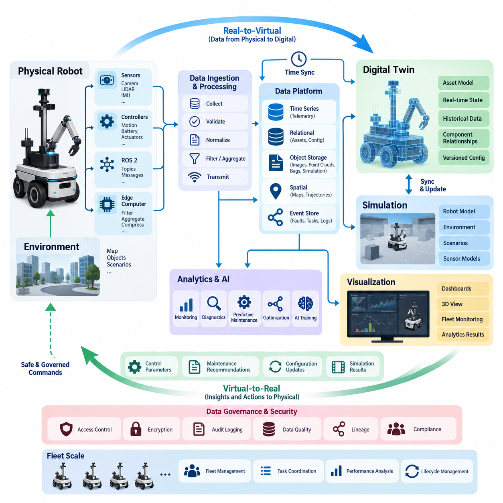
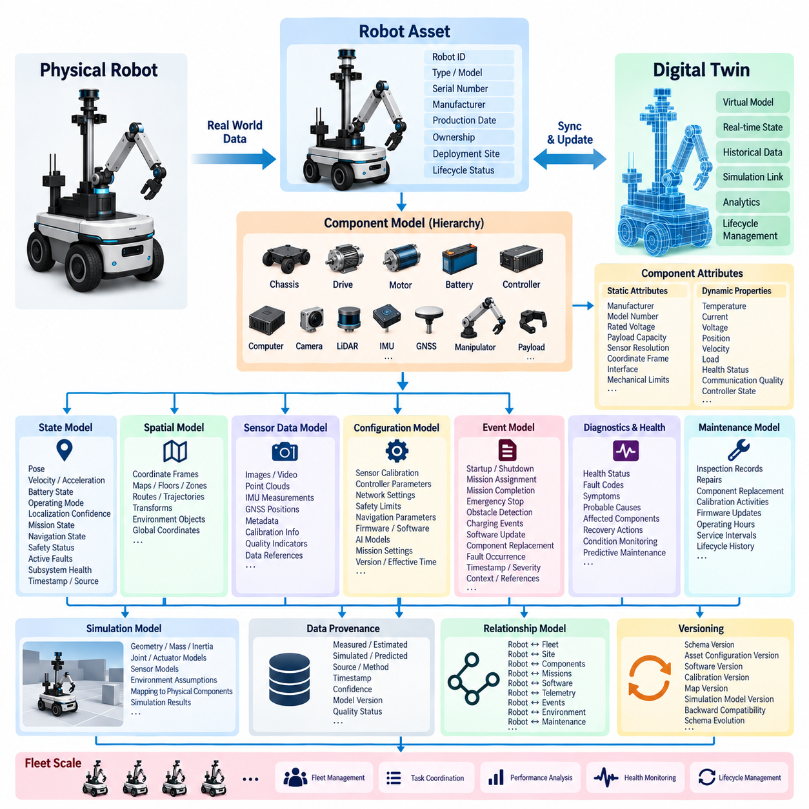
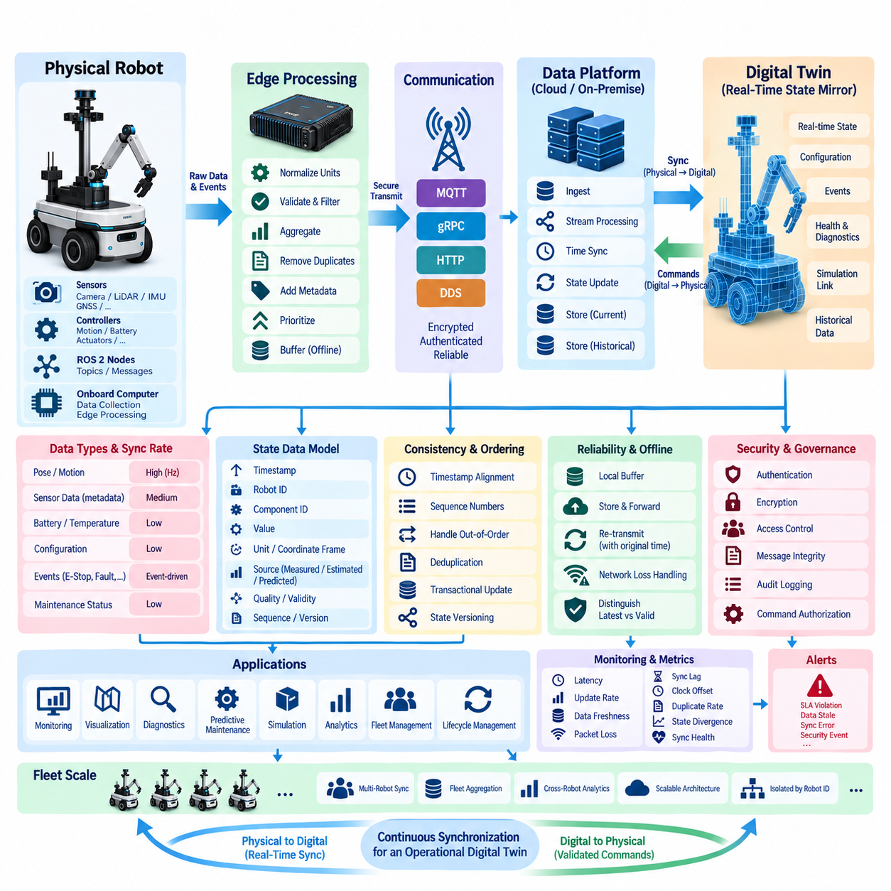
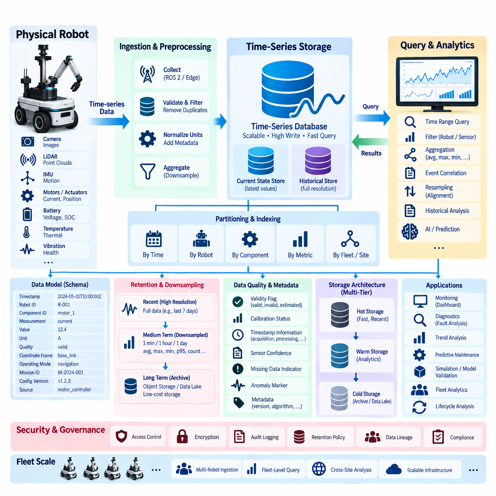
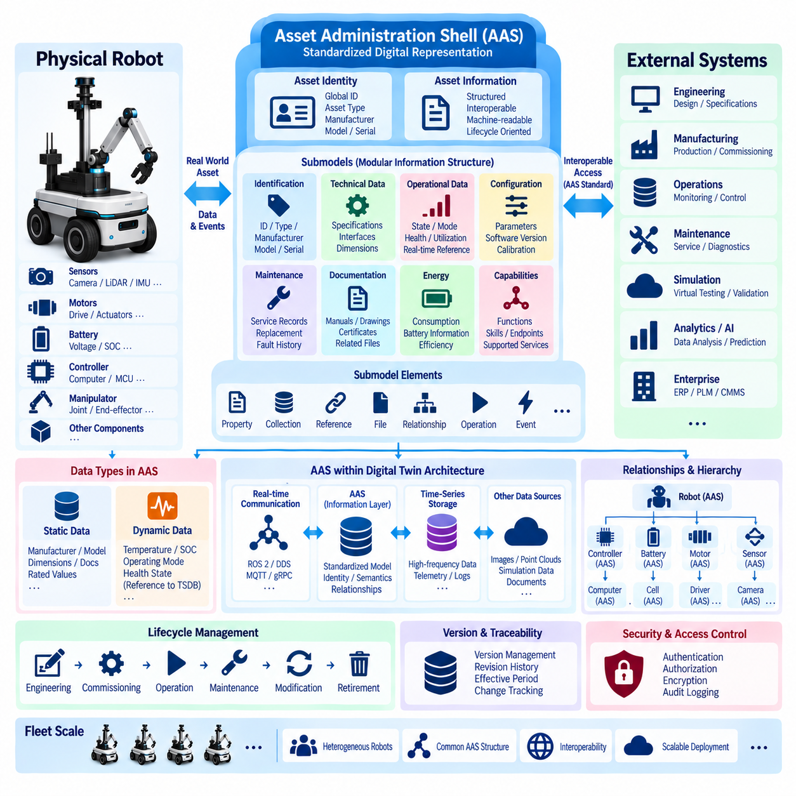
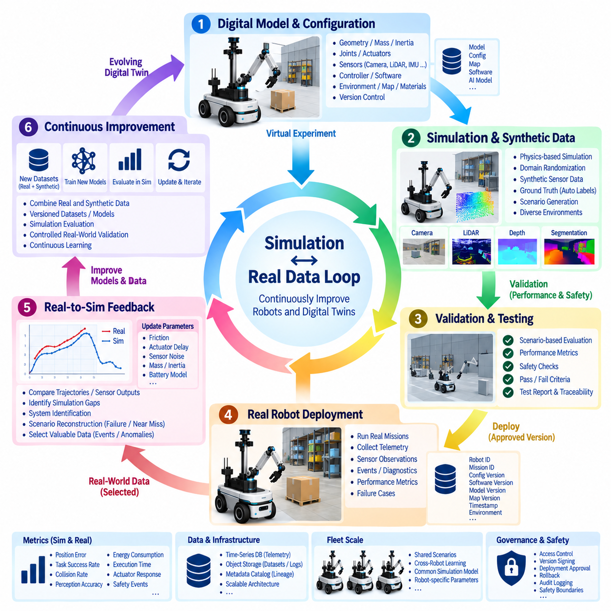
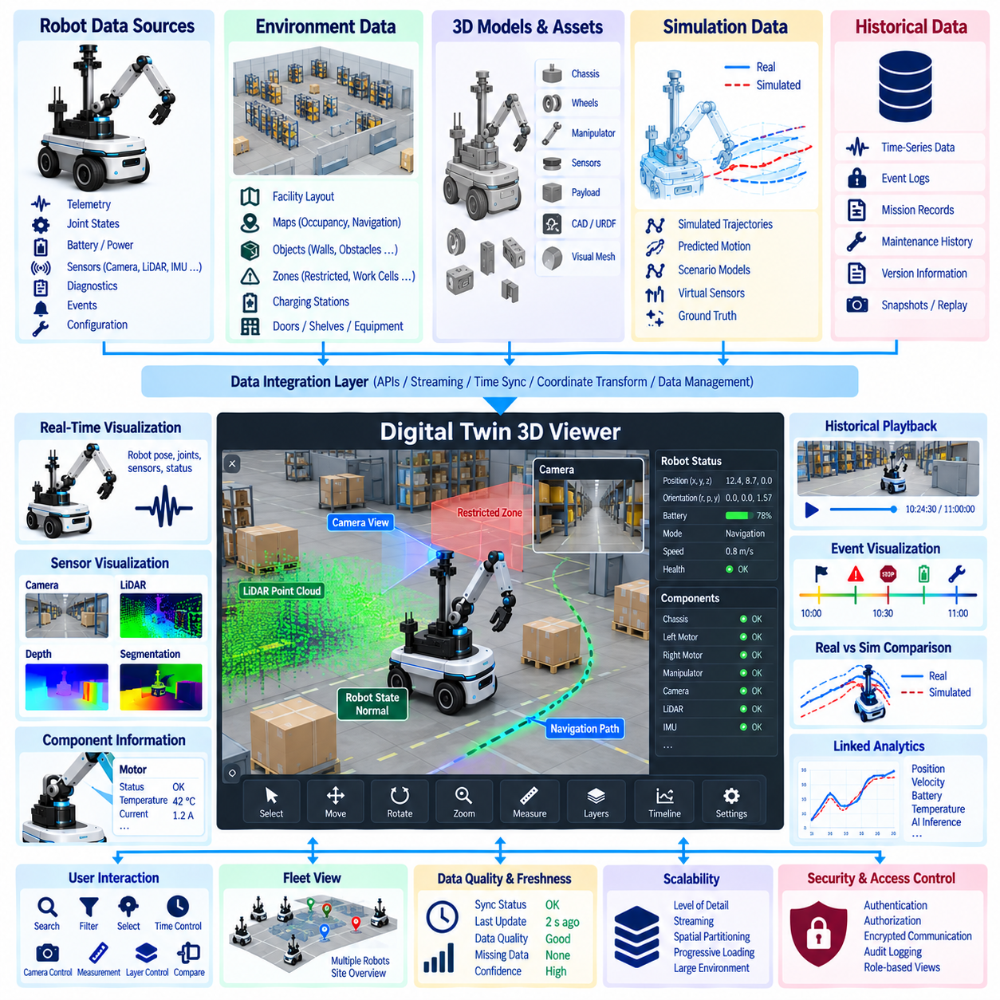
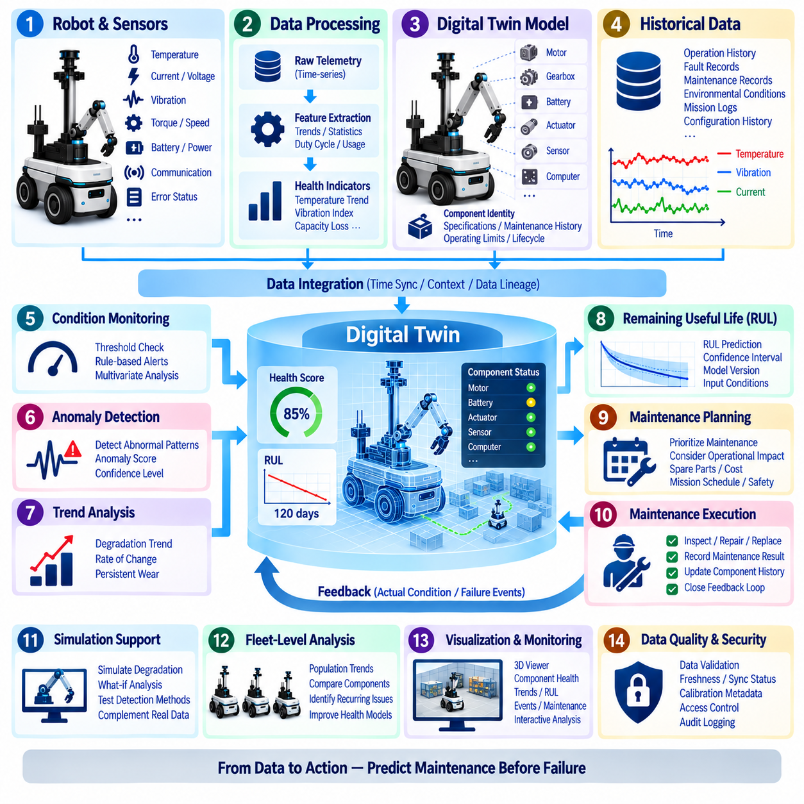
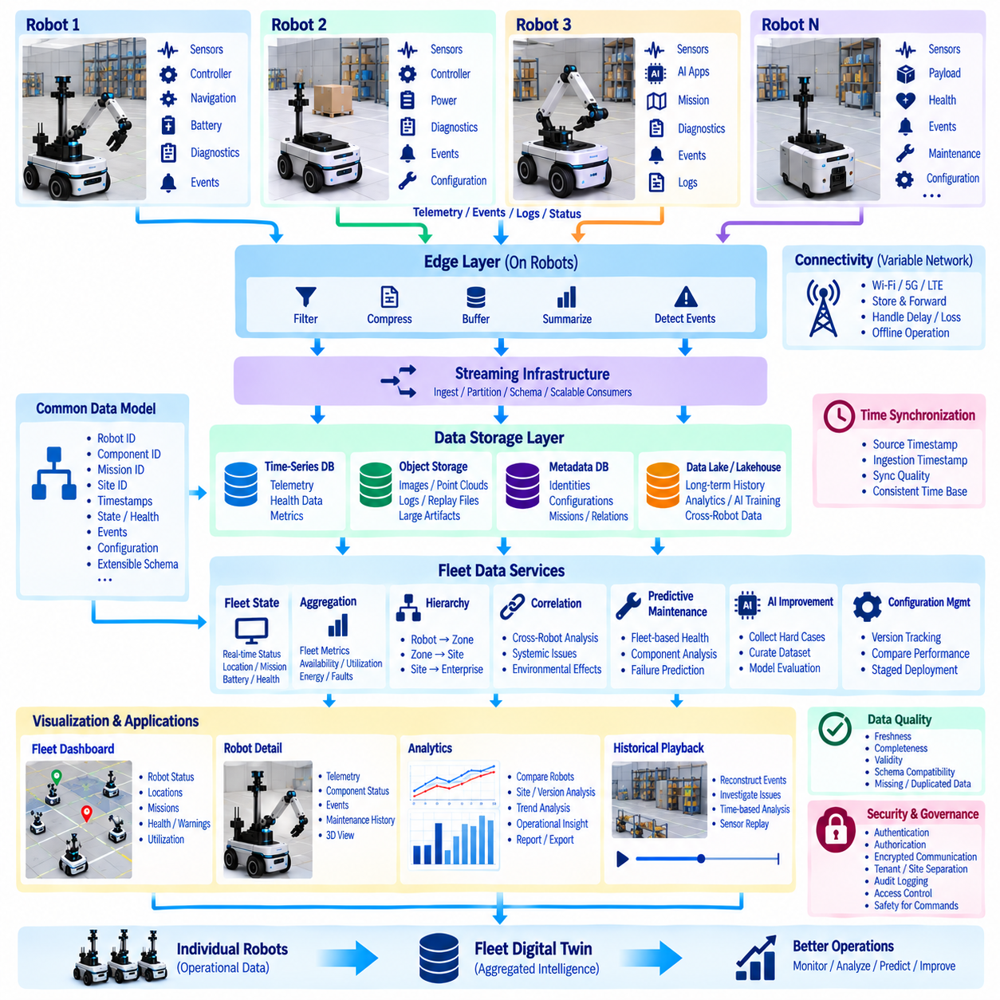
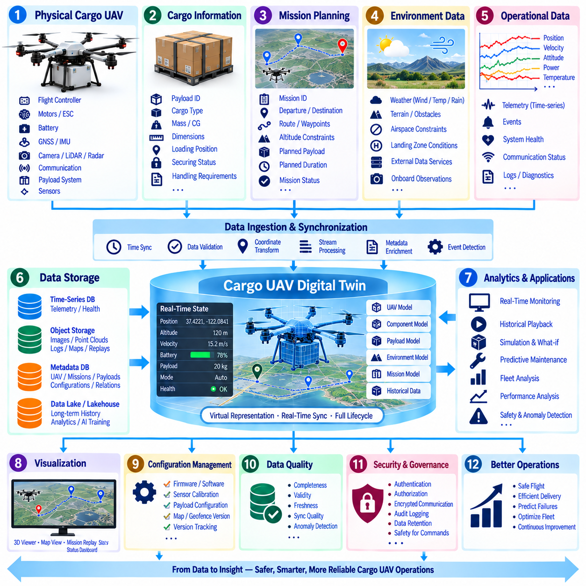

**Volume 07 Robot Data Architecture**

# 08. Digital Twin Data

## 08.01 Digital Twin Data Architecture Overview

{width="7.268055555555556in" height="7.268055555555556in"}

디지털 트윈 데이터 아키텍처(Digital Twin Data Architecture)는 물리적 로봇(Physical Robot), 로봇의 운영 환경(Operating Environment), 임무 컨텍스트(Mission Context)를 지속적으로 변화하는 디지털 표현(Digital Representation)으로 유지하기 위한 정보 기반을 제공한다. 정적인 시뮬레이션 모델(Static Simulation Model)과 달리 디지털 트윈(Digital Twin)은 엔지니어링 모델(Engineering Model)과 운영 데이터(Operational Data)를 결합하여 실제 물리 시스템의 구성, 동작 및 시간에 따른 변화를 가상 표현에 반영한다.

아키텍처(Architecture)는 일반적으로 물리적 자산(Physical Asset), 온보드 컴퓨팅(Onboard Computing), 통신 인프라(Communication Infrastructure), 데이터 플랫폼(Data Platform), 시뮬레이션 환경(Simulation Environment), 분석 서비스(Analytics Service), 시각화 애플리케이션(Visualization Application)을 연결한다. 로봇의 센서(Sensor)와 제어기(Controller)는 위치, 속도, 배터리 상태, 액추에이터 동작, 온도, 진동, 인지 결과, 고장 및 임무 진행 상태를 생성하며, 이러한 관측 데이터가 디지털 표현을 지속적으로 갱신하는 핵심 근거가 된다.

디지털 트윈 데이터 아키텍처(Digital Twin Data Architecture)의 기본 원칙 중 하나는 상대적으로 정적인 자산 정보(Asset Information)와 빠르게 변화하는 운영 상태(Operational State)를 분리하는 것이다. 로봇 형상, 부품 정의, 일련번호, 보정 파라미터, 소프트웨어 버전, 센서 구성 및 기계적 제약 조건은 비교적 느리게 변화한다. 반면 위치, 속도, 모터 전류, 배터리 전압, 열 상태, 위치추정 신뢰도 및 작업 상태는 초당 여러 차례 변화할 수 있으므로 서로 다른 저장 및 처리 전략이 필요하다.

디지털 트윈 정보(Digital Twin Information)는 텔레메트리(Telemetry)를 서로 관련 없는 개별 측정값으로 취급하지 않고 구성요소(Component) 사이의 관계를 보존해야 한다. 이동 로봇(Mobile Robot)은 구동 모듈, 배터리, 컴퓨터, 센서, 통신 장치 및 페이로드 시스템으로 구성된 하나의 자산으로 표현할 수 있다. 측정 데이터는 각각의 구성요소와 연결되며, 구성요소 간 관계는 측정값 해석, 이상 진단 및 시뮬레이션 환경에서 시스템 구성을 재현하기 위한 컨텍스트(Context)를 제공한다.

시간(Time)은 아키텍처의 또 다른 핵심 차원이다. 유용한 디지털 트윈(Digital Twin)은 현재 상태(Current State)와 과거 상태(Historical State)를 구분하고, 운영 과정에서 로봇의 상태가 어떻게 변화했는지를 재구성할 수 있을 정도로 정확한 타임스탬프(Timestamp)를 유지해야 한다. 센서 시간, 제어기 클록, 엣지 시스템 시간, 서버 수집 시간 및 시뮬레이션 시간은 서로 다를 수 있으므로 이벤트 재구성, 디버깅, 예측 분석 및 물리-디지털 비교를 위해 시간 동기화(Time Synchronization)와 명확한 시간 의미 체계(Time Semantics)가 필요하다.

물리-디지털 데이터 경로(Physical-to-Digital Data Path)는 일반적으로 센서, 제어기, ROS 2 노드(ROS 2 Node), 임베디드 시스템(Embedded System), 엣지 컴퓨터(Edge Computer)에서 시작된다. 원시 신호(Raw Signal)는 수집, 타임스탬프 부여, 정규화, 검증 과정을 거쳐 로봇 및 구성요소 식별자와 연결된다. 엣지 처리(Edge Processing)는 필터링, 집계, 압축 또는 이벤트 기반 선택을 통해 불필요한 데이터 전송량을 줄이고, 필요한 정보를 온프레미스(On-Premise) 또는 클라우드 플랫폼(Cloud Platform)으로 전송하여 영구 저장과 상위 수준 분석을 수행하게 한다.

서로 다른 디지털 트윈 정보 클래스(Digital Twin Information Class)는 서로 다른 저장 기술(Storage Technology)을 필요로 한다. 고주파 텔레메트리(High-Frequency Telemetry)는 시계열 저장소(Time-Series Storage)에 적합하며, 구성 정보와 자산 메타데이터(Asset Metadata)는 관계형 데이터베이스(Relational Database) 또는 문서 지향 데이터베이스(Document-Oriented Database)에 저장할 수 있다. 이미지, 포인트 클라우드(Point Cloud), ROS 백(ROS Bag), 시뮬레이션 결과 및 대규모 엔지니어링 파일은 일반적으로 객체 저장소(Object Storage)에 보관한다. 공간 데이터베이스(Spatial Database)는 지도와 궤적을 관리하고, 이벤트 저장소(Event Store)는 고장, 정비 작업, 작업 상태 전환 및 기타 운영 이벤트를 보존한다.

아키텍처는 단방향 텔레메트리 파이프라인(One-Way Telemetry Pipeline)으로 이해해서는 안 된다. 성숙한 디지털 트윈(Digital Twin)은 물리 시스템(Physical System)과 가상 시스템(Virtual System) 사이에 양방향 정보 루프(Bidirectional Information Loop)를 구축한다. 물리적 관측 데이터는 디지털 표현을 갱신하고, 시뮬레이션 및 분석 모델은 예측 결과, 최적화된 파라미터, 유지보수 권고 또는 검증된 구성 변경을 생성할 수 있다. 로봇 방향으로 다시 전달되는 모든 정보에는 운영 영향도에 적합한 거버넌스(Governance)와 안전 제어(Safety Control)가 적용되어야 한다.

상태 동기화(State Synchronization)는 가상 시스템이 물리적 자산을 얼마나 충실하게 표현하는지를 결정한다. 모든 변수가 동일한 갱신 주기(Update Frequency)나 지연시간(Latency)을 요구하는 것은 아니다. 동작 및 안전 관련 상태는 준실시간(Near-Real-Time) 갱신이 필요할 수 있지만, 유지보수 기록이나 구성 메타데이터(Configuration Metadata)는 훨씬 느린 동기화를 허용할 수 있다. 따라서 아키텍처 설계에서는 갱신 주기, 허용 지연시간, 일관성 요구사항, 누락 데이터 처리 방식 및 통신 중단 이후의 복구 방법을 정의하는 명확한 동기화 정책(Synchronization Policy)이 필요하다.

디지털 트윈(Digital Twin)은 과거 데이터(Historical Data)를 분석 모델(Analytical Model) 및 시뮬레이션 모델(Simulation Model)과 결합할 때 특히 높은 가치를 제공한다. 현재의 모터 온도만으로 얻을 수 있는 정보는 제한적이지만, 온도 이력을 부하, 속도, 주변 환경, 진동 및 유지보수 기록과 함께 분석하면 열화 패턴(Degradation Pattern)을 파악할 수 있다. 디지털 트윈은 이러한 관계를 이용하여 상태 지표(Health Indicator)를 추정하고 실제 동작과 예상 동작을 비교하며, 구성요소가 치명적인 고장 상태에 도달하기 전에 예지정비(Predictive Maintenance)를 지원할 수 있다.

시뮬레이션(Simulation)은 또 하나의 중요한 데이터 영역(Data Domain)을 형성한다. 로봇 형상, 물리 파라미터, 센서 모델, 환경 자산, 시나리오 및 제어 구성은 실제 로봇에서 수집된 운영 정보와 연결되어야 한다. 실제 환경의 관측 데이터는 시뮬레이션 가정을 개선할 수 있으며, 시뮬레이션 시나리오는 테스트 및 인공지능 학습(AI Training)을 위한 합성 데이터(Synthetic Data)를 생성할 수 있다. 이를 통해 엔지니어링 데이터와 운영 데이터를 분리된 사일로(Data Silo)로 유지하는 대신 시뮬레이션-실세계(Simulation-to-Real) 및 실세계-시뮬레이션(Real-to-Simulation) 피드백 루프를 구축할 수 있다.

디지털 트윈 아키텍처(Digital Twin Architecture)는 버전 정보(Version Information)도 보존해야 한다. 현재 운영 중인 로봇은 펌웨어, 인공지능 모델(AI Model), 보정 파라미터, 기계 부품, 지도 또는 안전 설정의 변경으로 인해 수개월 전의 동일한 로봇과 크게 달라질 수 있다. 버전이 관리된 구성(Versioned Configuration)과 데이터 계보(Data Lineage)가 없다면 과거 텔레메트리를 잘못된 시스템 정의에 기반하여 해석할 수 있다. 따라서 재현성(Reproducibility)을 확보하려면 운영 기록을 해당 시점에 실제 적용되었던 정확한 시스템 구성과 연결해야 한다.

플릿 규모(Fleet Scale)에서는 아키텍처가 개별 자산 트윈(Individual Asset Twin)에서 다수 로봇의 협력적 표현으로 확장된다. 각각의 로봇은 고유한 식별 정보, 구성, 상태, 건전성 및 이력을 유지하고, 플릿 수준 서비스(Fleet-Level Service)는 작업 수행, 교통 상황, 충전 상태, 활용률, 고장 및 운영 성능을 통합한다. 이를 통해 동일하거나 유사한 자산 간 비교가 가능해지며 플릿 최적화(Fleet Optimization), 협력적 유지보수 및 플릿 디지털 트윈(Fleet Digital Twin) 애플리케이션을 위한 데이터 기반을 제공한다.

디지털 트윈이 서로 다른 로봇 유형, 시뮬레이션 도구, 엔지니어링 시스템 및 기업 애플리케이션을 연결할수록 상호운용성(Interoperability)의 중요성이 증가한다. 표준화된 식별자, 스키마(Schema), 단위, 좌표계(Coordinate Frame), 메타데이터 및 인터페이스는 독점적인 데이터 표현 방식에 대한 의존성을 줄인다. 자산 관리 셸(Asset Administration Shell, AAS)과 관련 산업 디지털화 개념은 자산과 하위 모델(Submodel)을 구조적으로 기술하는 방법을 제공하여 전체 수명주기 시스템 간에 보다 일관된 정보 교환을 지원할 수 있다.

데이터 품질(Data Quality)은 디지털 트윈의 신뢰성을 직접적으로 결정한다. 텔레메트리 누락, 중복 이벤트, 잘못된 타임스탬프, 보정 드리프트(Calibration Drift), 일관되지 않은 단위 및 잘못된 좌표 변환은 가상 표현을 실제 상태로부터 벗어나게 만들 수 있다. 따라서 품질 관리(Quality Control)는 완전성, 최신성, 값의 범위, 시간적 일관성, 스키마 준수 및 센서 간 관계를 검증해야 한다. 애플리케이션이 현재 디지털 트윈 상태의 신뢰 가능 여부를 판단할 수 있도록 데이터 품질 상태 자체도 하나의 데이터로 표현하는 것이 중요하다.

보안(Security)과 데이터 거버넌스(Data Governance)는 디지털 트윈의 전체 수명주기(Lifecycle)에 걸쳐 적용되어야 한다. 아키텍처에는 로봇 동작, 시설 배치, 운영 일정, 소프트웨어 구성, 유지보수 이력 및 인공지능 데이터에 관한 상세 정보가 포함될 수 있다. 인증(Authentication), 권한 부여(Authorization), 암호화(Encryption), 감사 로그(Audit Logging), 보존 정책(Retention Policy), 데이터 분류(Data Classification) 및 데이터 계보 추적(Data Lineage Tracking)을 통해 이러한 자산을 보호하고 엔지니어, 운영자, 분석 서비스 및 자동화 시스템이 허용된 정보에만 접근하도록 해야 한다.

궁극적으로 디지털 트윈 데이터 아키텍처(Digital Twin Data Architecture)는 로보틱스 데이터 엔지니어링(Robotics Data Engineering)과 시뮬레이션 기반 운영(Simulation-Driven Operation)을 연결하는 가교 역할을 한다. 이 아키텍처는 이질적인 로봇 정보를 시간 인식(Time-Aware), 버전 인식(Version-Aware), 자산 중심(Asset-Centered)의 표현으로 조직하여 시각화, 진단, 예측, 최적화, 인공지능 개발 및 수명주기 관리를 지원한다. 핵심 가치는 단순한 가상 모델 생성이 아니라 물리적 동작, 과거 데이터, 분석 지능(Analytical Intelligence), 가상 실험(Virtual Experimentation)을 연결하는 관리 가능한 데이터 루프(Governed Data Loop)를 지속적으로 유지하는 데 있다.

## 08.02 Robot Digital Twin Data Model Design

{width="7.268055555555556in" height="7.268055555555556in"}

로봇 디지털 트윈 데이터 모델(Robot Digital Twin Data Model)은 물리적 로봇(Physical Robot)을 전체 운영 수명주기(Operational Lifecycle)에 걸쳐 구조화되고 기계 판독 가능한 정보(Machine-Readable Information)로 표현하는 방법을 정의한다. 이 모델은 로봇을 하나의 단일 자산으로 표현하는 것뿐만 아니라 구성요소, 설정, 동적 상태, 관계, 환경, 운영 이력 및 시뮬레이션 대응 요소까지 기술해야 한다. 이러한 구조화된 표현은 물리적 로봇 데이터와 디지털 트윈 서비스(Digital Twin Service)를 연결하는 의미론적 기반(Semantic Foundation)이 된다.

데이터 모델(Data Model)의 루트 엔터티(Root Entity)는 일반적으로 전역적으로 고유한 로봇 식별자(Robot ID)와 관련 메타데이터(Metadata)를 가진 로봇 자산(Robot Asset)이다. 이 엔터티에는 로봇 유형, 모델, 일련번호, 제조사, 생산일, 하드웨어 개정판, 소프트웨어 기준선, 소유권, 배치 장소 및 수명주기 상태 등이 포함될 수 있다. 텔레메트리, 유지보수 기록, 설정, 시뮬레이션 및 인공지능 생성 정보가 장기간 올바른 물리적 자산과 연결되기 위해서는 안정적인 식별 체계가 필수적이다.

로봇은 실제 물리적 및 컴퓨팅 구조를 반영하는 계층적 구성요소 엔터티(Hierarchical Component Entity)로 세분화되어야 한다. 대표적인 구성요소에는 섀시, 구동 모듈, 모터, 배터리, 모터 제어기, 온보드 컴퓨터, 카메라, 라이다(LiDAR), 관성측정장치(IMU), 위성항법시스템 수신기(GNSS Receiver), 통신 모듈, 매니퓰레이터 및 페이로드 장치가 포함된다. 부모-자식 관계(Parent-Child Relationship)와 의존 관계(Dependency Relationship)를 통해 각 측정값, 고장, 설정 및 유지보수 활동이 어느 하위 시스템에 속하는지 파악할 수 있다.

각 구성요소(Component)는 정적 속성(Static Attribute)과 동적 속성(Dynamic Property)을 모두 가져야 한다. 정적 속성에는 제조사, 모델 번호, 정격 전압, 페이로드 용량, 센서 해상도, 좌표계, 통신 인터페이스 또는 기계적 한계 등이 포함될 수 있다. 동적 속성은 온도, 전류, 전압, 속도, 위치, 부하, 사용률, 건전성 상태, 통신 품질 및 제어기 상태처럼 운용 중 변화하는 값을 나타낸다. 이러한 두 범주를 분리하면 저장 효율성과 의미론적 명확성을 향상시킬 수 있다.

동적 상태 모델(Dynamic State Model)은 특정 시점의 로봇 상태를 표현한다. 여기에는 자세(Pose), 속도, 가속도, 배터리 충전 상태(State of Charge), 운전 모드, 위치추정 신뢰도, 현재 임무, 내비게이션 상태, 안전 상태, 활성 고장 및 하위 시스템 건전성 등이 포함될 수 있다. 각 상태 기록에는 타임스탬프(Timestamp)와 출처 정보(Source Information)를 포함하여 값이 언제 측정되었는지, 어떤 하위 시스템에서 생성되었는지, 그리고 측정값, 추정값 또는 파생값 중 무엇인지 구분할 수 있어야 한다.

로봇은 물리적 환경에서 작동하므로 공간 정보(Spatial Information)가 특히 중요하다. 따라서 로봇 자세는 명확하게 정의된 좌표계(Coordinate Frame), 지도, 층, 구역, 경로 및 기준 시스템과 연결되어야 한다. 로봇 베이스 좌표계, 센서, 매니퓰레이터, 지도 및 전역 좌표 사이의 변환 관계(Transform Relationship)를 일관되게 표현해야 한다. 이를 통해 디지털 트윈 애플리케이션은 위치추정, 인지, 궤적, 시뮬레이션 및 환경 정보를 공간적 모호성 없이 통합할 수 있다.

센서 관측 데이터(Sensor Observation)는 센서마다 근본적으로 다른 정보를 생성하기 때문에 전용 데이터 구조가 필요하다. 카메라는 이미지 또는 비디오를 생성하고, 라이다는 포인트 클라우드(Point Cloud)를 생성하며, 관성측정장치는 고주파 관성 측정값을 생성하고, 위성항법시스템은 지리 참조 위치(Georeferenced Position)를 제공한다. 대용량 센서 데이터를 트윈 상태에 직접 포함하기보다는 메타데이터, 타임스탬프, 보정 정보, 품질 지표 및 전문 센서 저장소나 객체 저장소(Object Storage)에 저장된 데이터의 참조 정보를 관리할 수 있다.

설정 데이터(Configuration Data)는 특정 시점에 로봇이 어떻게 작동하도록 정의되었는지를 나타낸다. 여기에는 센서 보정, 제어기 파라미터, 네트워크 설정, 안전 한계, 내비게이션 파라미터, 펌웨어 버전, 소프트웨어 패키지, 인공지능 모델(AI Model) 및 임무별 설정이 포함된다. 설정 기록은 버전 관리(Versioning)되고 적용 시간 구간(Effective Time Interval)과 연결되어야 하며, 이를 통해 특정 동작, 고장 또는 성능 결과가 발생했을 때 실제로 어떤 설정이 활성화되어 있었는지를 정확하게 재구성할 수 있다.

운영 이벤트(Operational Event)는 의미 있는 상태 전환을 기록함으로써 연속적인 상태 정보(Continuous State Information)를 보완한다. 대표적인 예로 로봇 시작, 종료, 임무 할당, 임무 완료, 비상 정지, 위치추정 상실, 장애물 감지, 충전 시작, 충전 완료, 소프트웨어 업데이트, 부품 교체 및 고장 발생 등이 있다. 이벤트 기록에는 일반적으로 이벤트 유형, 타임스탬프, 로봇 식별자, 구성요소 식별자, 심각도, 출처, 상황 파라미터 및 관련 텔레메트리 또는 진단 정보에 대한 참조가 포함된다.

데이터 모델은 로봇 건전성(Robot Health)과 진단 정보(Diagnostic Information)를 명시적으로 표현해야 한다. 구성요소는 정상, 성능 저하, 경고, 위험 또는 사용 불가와 같은 건전성 상태를 나타낼 수 있으며, 진단 기록은 고장 코드, 증상, 예상 원인, 영향을 받는 구성요소 및 복구 조치를 기술한다. 진단 이벤트를 과거 텔레메트리와 연결하면 디지털 트윈을 단순한 시각화 모델이 아니라 근본 원인 분석(Root-Cause Analysis), 신뢰성 엔지니어링, 상태 모니터링 및 예지정비(Predictive Maintenance)를 지원하는 시스템으로 확장할 수 있다.

유지보수 정보(Maintenance Information)는 물리적 자산의 전체 수명주기에 걸쳐 디지털 표현을 확장한다. 검사 기록, 수리, 구성요소 교체, 보정 작업, 펌웨어 업데이트, 운영 시간 및 정비 주기는 해당 로봇과 구성요소 엔터티에 연결되어야 한다. 모터, 배터리, 센서 또는 컴퓨터가 교체되는 경우 기존 관계를 단순히 덮어쓰는 것이 아니라 이전 구성요소의 이력과 새롭게 설치된 구성요소의 식별 정보를 모두 보존해야 한다.

시뮬레이션 표현(Simulation Representation)은 대응되는 물리적 엔터티(Physical Entity)와 연결되어야 한다. 로봇 형상, 질량, 관성, 관절 특성, 액추에이터 특성, 센서 모델, 마찰 파라미터 및 환경 가정은 직접 저장하거나 시뮬레이션 자산(Simulation Asset)을 통해 참조할 수 있다. 물리적 구성요소와 가상 구성요소 사이의 매핑을 통해 실제 측정값으로 시뮬레이션 파라미터를 갱신하고, 시뮬레이션 결과와 실제 관측 동작을 비교하여 모델 차이(Model Discrepancy)를 식별할 수 있다.

디지털 트윈 데이터 모델은 측정값(Measured Value), 추정값(Estimated Value), 시뮬레이션값(Simulated Value), 예측값(Predicted Value)을 명확하게 구분해야 한다. 동일한 공학 단위를 사용하더라도 물리적 센서에서 측정된 온도와 시뮬레이션된 온도 또는 인공지능이 생성한 미래 온도 예측값은 근본적으로 다른 정보이다. 따라서 각 값에는 출처, 생성 방법, 타임스탬프, 신뢰도, 모델 버전 및 품질 상태를 설명하는 데이터 출처 메타데이터(Provenance Metadata)를 포함하는 것이 중요하다.

개별 엔터티(Entity)만큼 엔터티 간 관계(Relationship)도 중요하다. 로봇은 플릿(Fleet)에 소속되고, 특정 사이트(Site)에서 운용되며, 임무를 수행하고, 여러 구성요소를 포함하며, 소프트웨어를 사용하고, 텔레메트리를 생성하고, 이벤트를 발생시키며, 궤적을 따라 이동하고, 환경 객체와 상호작용하며, 유지보수 활동에 참여한다. 이러한 관계를 명시적으로 모델링하면 애플리케이션이 서로 분리된 데이터베이스에서 연결 관계를 매번 재구성하지 않고도 여러 데이터 영역을 아우르는 정보를 활용할 수 있다.

버전 관리(Versioning)는 스키마(Schema)와 자산 데이터(Asset Data) 모두에 적용되어야 한다. 로봇이 발전함에 따라 새로운 센서, 필드, 구성요소 유형, 인공지능 모델 및 운영 개념이 추가될 수 있다. 데이터 모델은 과거 기록과의 하위 호환성(Backward Compatibility)을 유지하면서 통제된 스키마 진화(Schema Evolution)를 허용해야 한다. 스키마 버전, 자산 설정 버전, 소프트웨어 버전, 보정 버전, 지도 버전 및 시뮬레이션 모델 버전은 과거 시스템 상태와 실험 결과를 재현하는 데 필요한 컨텍스트를 제공한다.

플릿 규모(Fleet Scale)에서는 동일한 데이터 모델을 수백 또는 수천 대의 로봇에 적용하면서 각 로봇의 고유한 식별 정보와 이력을 유지할 수 있다. 플릿 엔터티(Fleet Entity)는 로봇 가용성, 임무 상태, 충전 상태, 사용률, 건전성 지표, 지리적 분포 및 성능 지표를 통합한다. 공통 스키마(Common Schema)를 사용하면 로봇 간 비교가 가능해지고, 플릿 서비스는 서로 다른 로봇 집단에서 반복적으로 발생하는 부품 문제, 운영 병목, 비정상 동작 및 유지보수 요구사항을 식별할 수 있다.

따라서 최종적인 로봇 디지털 트윈 데이터 모델(Robot Digital Twin Data Model)은 자산 중심(Asset-Centered), 시간 인식(Time-Aware), 공간적 일관성(Spatial Consistency), 관계 중심(Relationship-Oriented), 버전 관리(Version-Controlled), 출처 인식(Provenance-Aware)의 특성을 가져야 한다. 목적은 단순히 로봇의 외형을 가상으로 재현하는 것이 아니라 엔지니어링 정의, 실시간 상태, 과거 데이터, 시뮬레이션 자산, 진단, 유지보수, 분석 및 플릿 운영을 연결하는 지속적인 디지털 표현을 구축하는 것이다. 이러한 기반을 통해 물리적 로봇과 지속적으로 진화하는 디지털 대응체(Digital Counterpart) 사이의 신뢰성 높은 동기화를 구현할 수 있다.

## 08.03 Real.Physical.Digital Sync: Real-Time State Mirror [w/Code]

{width="7.268055555555556in" height="7.268055555555556in"}

실제 물리-디지털 동기화(Real Physical-Digital Synchronization)는 디지털 트윈(Digital Twin)을 해당 물리적 로봇(Physical Robot)의 상태와 지속적으로 일치시키는 메커니즘이다. 디지털 트윈을 독립적으로 갱신되는 데이터베이스나 시각화 시스템으로 취급하는 대신, 센서 관측값, 제어기 상태, 설정 변경, 운영 이벤트 및 파생 정보가 시간 인식 디지털 표현(Time-Aware Digital Representation)을 지속적으로 갱신하도록 통제된 데이터 관계를 구축한다.

실시간 상태 미러(Real-Time State Mirror)는 물리 시스템의 최신 신뢰 가능한 운영 상태를 디지털 영역(Digital Domain)에 표현한다. 대표적인 미러링 변수에는 자세(Pose), 속도, 가속도, 배터리 상태, 모터 전류, 액추에이터 위치, 온도, 위치추정 신뢰도, 내비게이션 모드, 임무 상태, 안전 상태, 통신 품질 및 활성 고장이 포함된다. 상태 미러는 각 서비스가 모든 로봇 하위 시스템과 직접 통신하지 않아도 일관된 상태 정보를 사용할 수 있도록 한다.

동기화 파이프라인(Synchronization Pipeline)은 일반적으로 로봇 내부의 센서, 임베디드 제어기(Embedded Controller), ROS 2 노드(ROS 2 Node) 및 온보드 컴퓨팅 서비스(Onboard Computing Service)에서 시작된다. 측정값과 상태 전환은 타임스탬프, 로봇 식별자, 구성요소 식별자, 좌표계 정보 및 품질 메타데이터와 함께 수집된다. 전송 전에 엣지 소프트웨어(Edge Software)는 단위를 정규화하고, 값의 범위를 검증하며, 고주파 신호를 집계하고, 중복 데이터를 제거하며, 운영상 중요한 정보를 우선 처리하여 불필요한 네트워크 트래픽을 줄일 수 있다.

시간 동기화(Time Synchronization)는 관측값 사이의 시간적 관계가 보존될 때만 상태 미러가 의미를 가질 수 있기 때문에 매우 중요하다. 센서 획득 시간, 제어기 시간, 엣지 처리 시간, 네트워크 전송 시간, 서버 수집 시간 및 디지털 트윈 갱신 시간은 서로 다를 수 있다. 따라서 아키텍처는 원본 타임스탬프(Source Timestamp)와 동기화 메타데이터를 보존하여 지연된 정보와 실제로 최신인 물리적 상태를 구분할 수 있어야 한다.

서로 다른 상태 변수(State Variable)는 서로 다른 동기화 주기(Synchronization Frequency)를 요구한다. 로봇 자세와 움직임 정보는 초당 여러 차례 갱신해야 할 수 있지만, 배터리 건전성, 구성요소 온도, 설정 정보 또는 유지보수 상태는 훨씬 느리게 변화할 수 있다. 실용적인 아키텍처는 모든 변수를 동일한 고정 주기 동기화 방식으로 처리하는 대신 각 데이터 클래스(Data Class)의 동적 특성과 운영 중요도에 따라 갱신 정책(Update Policy)을 할당한다.

상태 갱신(State Update)은 주기적 전송(Periodic Transmission), 이벤트 기반 전송(Event-Driven Transmission) 또는 하이브리드 전송(Hybrid Transmission) 전략을 사용할 수 있다. 주기적 동기화는 지속적으로 변화하는 텔레메트리에 적합하며, 이벤트 기반 갱신은 비상 정지, 고장 발생, 임무 변경, 충전 이벤트 또는 소프트웨어 설정 변경과 같은 불연속적인 상태 전환에 효율적이다. 하이브리드 동기화는 두 방식을 결합하여 정기적인 상태 갱신을 수행하면서 다음 예정 갱신까지 기다릴 수 없는 중요 이벤트를 즉시 전송한다.

상태 미러(State Mirror)는 가장 최근에 수신된 값(Latest Received Value)과 가장 최근의 유효한 값(Latest Valid Value)을 구분해야 한다. 네트워크 지연, 패킷 손실, 센서 고장, 오래된 측정값 또는 잘못된 데이터로 인해 디지털 표현이 실제로는 최신이 아닌데도 최신 상태처럼 보일 수 있기 때문이다. 따라서 각각의 미러링 속성에는 측정 시간, 수신 시간, 유효성, 최신성(Freshness), 신뢰도, 출처 및 품질 지표를 포함할 수 있으며, 이를 통해 애플리케이션은 시각화, 분석, 진단 또는 자동화된 의사결정에 해당 값을 사용할 수 있는지 판단할 수 있다.

여러 변수가 하나의 물리적 상태를 함께 설명할 때 일관성 관리(Consistency Management)가 중요해진다. 위치, 속도, 내비게이션 상태, 지도 버전 및 위치추정 신뢰도는 서로 다른 프로세스에서 생성될 수 있지만 함께 해석되어야 한다. 동기화 계층(Synchronization Layer)은 타임스탬프, 시퀀스 번호(Sequence Number), 상태 버전(State Version) 또는 트랜잭션 경계(Transactional Boundary)를 사용하여 관련 갱신을 그룹화함으로써 하위 애플리케이션이 서로 다른 시점이나 호환되지 않는 시스템 설정을 나타내는 값을 잘못 결합하지 않도록 할 수 있다.

통신 중단(Communication Interruption)은 예외적인 상황이 아니라 정상적인 운영 조건 중 하나로 처리해야 한다. 온프레미스(On-Premise) 또는 클라우드 플랫폼(Cloud Platform)과의 연결이 불가능한 경우 엣지 버퍼(Edge Buffer)가 상태 갱신과 이벤트를 임시로 보관할 수 있다. 연결이 복구되면 저장된 정보를 원래의 타임스탬프 및 시퀀스 정보와 함께 재전송하여 플랫폼이 과거 상태를 재구성하는 동시에 현재 실시간 상태 미러에 필요한 최신 상태를 별도로 식별할 수 있도록 한다.

아키텍처는 순서가 뒤바뀐 메시지(Out-of-Order Message)와 중복 메시지(Duplicated Message)도 관리해야 한다. 무선 네트워크, 재전송, 분산 메시지 브로커(Distributed Broker) 및 비동기 처리로 인해 오래된 갱신이 새로운 갱신보다 늦게 도착하거나 동일한 이벤트가 여러 번 전달될 수 있다. 시퀀스 식별자, 이벤트 식별자, 타임스탬프, 멱등 처리(Idempotent Processing) 및 버전 검사를 사용하면 오래된 정보가 새로운 상태를 덮어쓰거나 중복 이벤트가 디지털 트윈 이력을 손상시키는 것을 방지할 수 있다.

실시간 동기화(Real-Time Synchronization)가 모든 원시 센서 샘플(Raw Sensor Sample)을 디지털 트윈으로 전송해야 한다는 의미는 아니다. 고대역폭 카메라 스트림, 라이다 포인트 클라우드(LiDAR Point Cloud) 및 고주파 관성측정장치(IMU) 데이터는 현실적인 통신 및 저장 한계를 초과할 수 있다. 상태 미러에는 감지 객체, 위치추정 결과, 건전성 지표 또는 데이터 참조와 같은 압축된 파생 정보를 유지하고, 선택된 원시 데이터는 별도의 저장소에 보관한 뒤 타임스탬프와 객체 식별자를 통해 연결할 수 있다.

물리-디지털 동기화(Physical-to-Digital Synchronization)는 아키텍처의 한 방향에 불과하다. 성숙한 디지털 트윈은 검증된 파라미터, 임무 갱신, 유지보수 권고, 내비게이션 제약 또는 시뮬레이션에서 도출된 설정을 포함하는 디지털-물리 정보 흐름(Digital-to-Physical Information Flow)도 지원할 수 있다. 로봇의 동작을 변경할 수 있는 정보에는 일반 상태 미러링보다 강력한 권한 부여, 검증, 안전성 확인, 버전 관리 및 감사 가능성(Auditability)이 요구되므로 두 정보 흐름은 명확하게 분리되어야 한다.

동기화 서비스(Synchronization Service)는 각 상태 변수에 대한 명확한 데이터 권한(Source Authority)을 유지해야 한다. 물리 센서 또는 제어기는 일반적으로 측정된 로봇 상태의 권위 있는 출처(Authoritative Source)가 되고, 기업 시스템은 임무 정의를, 엔지니어링 시스템은 설정 기준선(Configuration Baseline)을 관리할 수 있다. 시뮬레이션 및 인공지능 서비스는 추정 또는 예측 상태를 생성할 수 있지만 이러한 값이 측정값을 암묵적으로 대체해서는 안 된다. 명시적인 출처 권한을 정의하면 물리적 정보, 시뮬레이션 정보, 예측 정보 및 수동 입력 정보 사이의 충돌을 방지할 수 있다.

디지털 트윈 상태(Digital Twin State)는 현재 상태 계층(Current-State Layer)과 과거 상태 계층(Historical-State Layer)으로 구성할 수 있다. 현재 상태 계층은 최신의 신뢰 가능한 표현에 빠르게 접근하도록 최적화하고, 과거 저장소는 이전 측정값, 상태 전환 및 이벤트를 분석 목적으로 보존한다. 두 계층을 결합하면 운영자는 현재 로봇 상태를 확인할 수 있고, 엔지니어는 동일한 식별 체계를 이용하여 과거 상태를 재구성하고 임무 간 동작 비교, 고장 진단 및 장기적인 열화 분석을 수행할 수 있다.

동기화 정확도(Synchronization Accuracy)는 종단 간 지연시간(End-to-End Latency), 갱신 주기, 데이터 최신성, 패킷 손실, 동기화 지연(Synchronization Lag), 클록 오프셋(Clock Offset), 중복률 및 상태 불일치(State Divergence)와 같은 운영 지표를 통해 평가할 수 있다. 디지털 트윈은 기술적으로 연결된 상태를 유지하면서도 점차 실제 상태와 불일치할 수 있으므로 이러한 지표를 모니터링하는 것이 중요하다. 따라서 명시적인 동기화 건전성(Synchronization Health) 자체를 트윈 상태의 일부로 관리하고 정의된 서비스 수준을 위반하면 경고를 발생시킬 수 있다.

플릿 규모(Fleet Scale)에서는 동기화가 개별 로봇의 식별 정보와 시간적 순서를 잃지 않으면서 여러 로봇의 동시 운영을 지원해야 한다. 각 로봇은 자체 상태 미러를 유지하고, 플릿 서비스(Fleet Service)는 가용성, 위치, 임무 진행 상태, 충전 상태, 고장 및 건전성 지표를 통합한다. 로봇 식별자, 사이트, 플릿 또는 데이터 영역에 따라 데이터를 분할하면 격리성을 유지하면서 아키텍처를 확장하고 플릿 수준 모니터링, 최적화 및 협력 운영을 지원할 수 있다.

보안(Security)은 동기화가 운영 기술(Operational Technology)과 디지털 플랫폼(Digital Platform)을 직접 연결하기 때문에 특히 중요하다. 로봇 신원 인증, 암호화 통신, 접근 제어, 메시지 무결성 검사, 인증서 관리, 감사 로그 및 명령 권한 부여를 통해 동기화 경로를 보호해야 한다. 중요한 상태 변경과 디지털-물리 동작은 추적 가능해야 하며, 이를 통해 운영자는 무엇이 변경되었는지, 언제 변경되었는지, 정보가 어디에서 생성되었는지, 그리고 어떤 시스템이 해당 갱신을 수락했는지를 확인할 수 있어야 한다.

궁극적으로 실제 물리-디지털 동기화(Real Physical-Digital Synchronization)는 정적인 로봇 모델을 운영 가능한 디지털 트윈(Operational Digital Twin)으로 전환하는 지속적인 연결을 구축한다. 타임스탬프 기반 상태 수집, 최신성 관리, 버퍼링, 이벤트 처리, 일관성 제어, 출처 권한, 과거 데이터 저장 및 안전한 양방향 통신을 결합함으로써 모니터링, 시뮬레이션, 진단, 예지정비, 플릿 지능(Fleet Intelligence) 및 수명주기 관리를 지원하는 신뢰성 높은 실시간 상태 미러(Real-Time State Mirror)를 유지할 수 있다.

## 08.04 Digital Twin Time Series Storage and Query [w/Code]

{width="7.268055555555556in" height="7.268055555555556in"}

시계열 저장(Time-Series Storage)은 로봇의 상태가 시간에 따라 지속적으로 변화하기 때문에 디지털 트윈 데이터 아키텍처(Digital Twin Data Architecture)의 핵심 요소이다. 위치, 속도, 모터 전류, 배터리 전압, 온도, 진동, 위치추정 신뢰도, 액추에이터 부하, 네트워크 품질 및 건전성 지표는 대규모 타임스탬프 기반 관측 데이터를 생성할 수 있다. 디지털 트윈은 이러한 값을 효율적으로 보존하면서 현재 상태에 대한 빠른 접근과 과거 동작 분석을 동시에 지원해야 한다.

일반적인 비즈니스 기록과 달리 로봇 시계열 데이터(Robot Time-Series Data)는 주로 시간, 자산 식별 정보 및 측정 유형을 중심으로 구성된다. 각각의 관측값에는 타임스탬프, 로봇 식별자(Robot ID), 구성요소 또는 센서 식별자, 측정 항목, 값, 공학 단위 및 관련 품질 정보가 포함되어야 한다. 좌표계, 운영 모드, 임무 식별자, 설정 버전 및 데이터 출처와 같은 추가 메타데이터를 사용하면 과거 측정값을 올바른 운영 컨텍스트(Operational Context)에서 해석할 수 있다.

하나의 디지털 트윈 안에서도 여러 종류의 시간 개념이 존재할 수 있으므로 타임스탬프 설계(Timestamp Design)는 특별한 주의가 필요하다. 센서 획득 시간은 물리적 현상이 실제 측정된 시점을 나타내며, 엣지 처리 시간, 전송 시간 및 데이터베이스 수집 시간은 파이프라인의 이후 단계를 나타낸다. 원래의 측정 타임스탬프를 처리 메타데이터와 함께 보존하면 엔지니어가 지연시간을 분석하고, 늦게 도착한 관측값의 순서를 재정렬하며, 실제 물리적 이벤트의 발생 순서를 재구성할 수 있다.

시계열 데이터베이스(Time-Series Database)는 범용 트랜잭션 시스템(General-Purpose Transactional System)과 다른 방식으로 데이터를 구성한다. 측정값은 일반적으로 로봇, 하위 시스템, 센서 또는 메트릭별로 그룹화되고 효율적인 검색을 위해 시간 범위 단위로 분할된다. 시간 및 선택된 차원(Dimension)에 대한 인덱스를 사용하면 전체 과거 데이터셋을 검색하지 않고도 최근 로봇 상태 조회, 여러 센서 비교, 고장 이전 구성요소 분석 또는 특정 임무 분석을 수행할 수 있다.

디지털 트윈은 일반적으로 현재 상태 접근(Current-State Access)과 장기 이력 저장(Long-Term Historical Storage)을 분리해야 한다. 현재 상태 저장소(Current-State Store)는 중요한 속성의 최신 신뢰 값을 유지하고 대시보드, 모니터링 및 운영 애플리케이션에 낮은 지연시간으로 데이터를 제공한다. 과거 시계열 저장소는 이전 관측값을 보존하여 진단, 추세 분석, 모델 검증, 예지정비(Predictive Maintenance) 및 수명주기 분석을 지원하며, 두 표현은 일관된 식별자와 타임스탬프를 통해 연결되어야 한다.

데이터 수집(Data Ingestion)은 고주파이면서 이질적인 로봇 신호를 처리할 수 있어야 한다. 일부 동작 및 제어 변수는 초당 수십 회 또는 수백 회의 샘플을 생성할 수 있지만, 온도, 배터리 건전성, 임무 상태 및 유지보수 지표는 훨씬 느리게 변화한다. 수집 아키텍처(Ingestion Architecture)는 서로 다른 샘플링 속도(Sampling Rate)를 지원하고 저주파 운영 데이터와 고주파 제어 텔레메트리를 동일한 저장 패턴으로 강제하지 않아야 한다.

스키마 설계(Schema Design)는 시스템이 발전한 이후에도 저장된 텔레메트리를 올바르게 이해할 수 있는지를 결정한다. 측정 스키마는 로봇 식별자 및 구성요소 식별자와 같은 안정적인 차원과 온도 또는 전류처럼 변화하는 수치 필드를 분리할 수 있다. 측정 정의가 변경될 경우 스키마 버전 정보를 보존해야 하며, 이를 통해 서로 다른 단위, 보정 규칙, 펌웨어 버전 또는 처리 알고리즘을 사용해 생성된 값을 과거 쿼리가 무분별하게 결합하는 것을 방지할 수 있다.

고주파 디지털 트윈 데이터는 빠르게 증가할 수 있으므로 보존 관리(Retention Management)가 필수적이다. 최근 정보는 상세한 진단을 위해 전체 해상도(Full Resolution)로 유지하고, 오래된 데이터는 분, 시간 또는 일 단위 요약 데이터로 다운샘플링(Downsampling)할 수 있다. 최소값, 최대값, 평균값, 백분위수, 개수, 분산 또는 도메인별 통계량을 사용하면 저장 용량을 줄이면서 유용한 추세를 보존할 수 있으며, 안전 조사나 인공지능 개발에 필요한 원시 데이터는 별도의 보존 정책을 적용할 수 있다.

다운샘플링(Downsampling)은 모든 신호에 동일하게 적용하는 대신 각 신호의 물리적 의미에 따라 설계해야 한다. 평균값은 온도 데이터에 적합할 수 있지만 짧은 전류 스파이크, 진동 이상, 비상 이벤트 또는 순간적인 위치추정 실패를 숨길 수 있다. 이러한 신호에는 최대값, 백분위수, 이벤트 트리거 구간(Event-Triggered Window) 또는 이상 보존 요약(Anomaly-Preserving Summary)이 더 적합할 수 있으므로 디지털 트윈 저장소에는 단순히 데이터의 오래된 정도만을 기준으로 압축하지 않는 데이터 인식 집계 정책(Data-Aware Aggregation Policy)이 필요하다.

쿼리 설계(Query Design)는 디지털 트윈이 답해야 하는 실제 운영 질문을 반영해야 한다. 엔지니어는 모든 로봇의 최신 배터리 상태, 특정 임무 수행 중의 모터 온도, 고장 발생 직전 수분 동안의 센서 동작 또는 수개월 동안 진행된 특정 구성요소의 장기적인 열화를 확인해야 할 수 있다. 효율적인 쿼리 인터페이스는 시간 범위, 로봇 및 구성요소 필터, 측정 유형, 이벤트 상관관계, 집계 구간 및 설정 버전에 기반한 검색을 지원해야 한다.

이벤트 상관관계(Event Correlation)는 연속적인 텔레메트리를 불연속적인 운영 이벤트와 연결할 때 특히 높은 가치를 제공한다. 고장 이벤트를 기준으로 시간 구간을 설정하여 고장 전후의 모터 전류, 온도, 진동, 속도 및 제어기 상태를 조회할 수 있다. 마찬가지로 임무 시작 및 완료 이벤트를 이용해 연속 데이터를 운영 세션(Operational Session)으로 분할하면 작업과 로봇별로 성능 및 에너지 소비량을 비교할 수 있다.

디지털 트윈 쿼리는 서로 다른 센서가 서로 다른 주기로 작동하기 때문에 리샘플링(Resampling)과 시간 정렬(Temporal Alignment)을 자주 요구한다. 카메라 기반 인지 결과, 라이다 위치추정, 관성측정장치 데이터, 모터 피드백 및 배터리 텔레메트리는 동일한 타임스탬프를 공유하지 않을 수 있다. 쿼리 처리는 원래 측정 시간에 대한 정보를 유지하면서 보간(Interpolation), 최근접 이웃 매칭(Nearest-Neighbor Matching), 집계 또는 도메인별 동기화 규칙을 이용해 관측값을 공통 시간 구간에 정렬할 수 있다.

누락값(Missing Value)은 명시적으로 처리해야 한다. 텔레메트리의 공백은 통신 장애, 센서 고장, 로봇 종료, 필터링 또는 해당 기간에 갱신이 필요하지 않았던 신호를 의미할 수 있다. 모든 누락 구간을 자동으로 채우면 존재하지 않았던 물리적 상태가 생성될 수 있다. 따라서 쿼리는 실제 관측값과 보간값, 추정값, 사용 불가능한 값 및 오래된 값(Stale Value)을 구분하여 분석 및 시각화 시스템이 재구성된 시간 흐름의 신뢰성을 판단할 수 있도록 해야 한다.

저장 아키텍처(Storage Architecture)는 접근 빈도와 데이터 가치에 따라 여러 계층(Storage Tier)을 사용할 수 있다. 최근의 고해상도 텔레메트리는 빠른 시계열 저장소에 유지하고, 중기 데이터는 비용이 낮은 분석 저장소로 이동하며, 장기 보관 데이터는 객체 저장소(Object Storage) 또는 데이터 레이크(Data Lake)에 유지할 수 있다. 메타데이터 및 카탈로그 서비스는 이러한 저장 계층 사이의 참조 관계를 보존하여 오래된 데이터가 운영 데이터베이스에서 이동된 이후에도 검색 가능하도록 해야 한다.

많은 로봇 측정 데이터에는 시간적 중복성(Temporal Redundancy)이 존재하므로 압축(Compression)이 중요하다. 시계열 엔진(Time-Series Engine)은 타임스탬프 압축, 델타 인코딩(Delta Encoding), 컬럼형 압축(Columnar Compression) 또는 청크 기반 저장(Chunk-Based Storage)을 적용하여 저장 용량을 줄일 수 있다. 압축 전략은 저장 효율성과 쿼리 지연시간 및 계산 부하 사이에서 균형을 유지해야 하며, 자주 조회하는 운영 데이터에는 빠른 디코딩을, 장기 보관 텔레메트리에는 보다 적극적인 압축을 적용할 수 있다.

데이터 품질 정보(Data Quality Information)는 별도로 관리하기보다 시계열 측정값과 함께 유지하는 것이 중요하다. 유효성 플래그(Validity Flag), 보정 상태, 동기화 품질, 센서 신뢰도, 누락 데이터 표시 및 이상 마커(Anomaly Marker)를 통해 애플리케이션이 특정 측정값을 신뢰할 수 있는지 판단할 수 있다. 과거 데이터를 인공지능 학습, 시뮬레이션 보정, 예지정비 또는 안전 분석에 다시 사용할 경우 손상된 관측 데이터가 잘못된 결론을 생성할 수 있으므로 이러한 정보는 특히 중요하다.

플릿 규모(Fleet Scale)에서 시계열 저장소는 개별 로봇의 격리성과 쿼리 효율성을 유지하면서 다수 로봇에서 동시에 발생하는 데이터를 수집할 수 있어야 한다. 파티셔닝 전략(Partitioning Strategy)은 워크로드 특성에 따라 시간, 로봇 식별자, 플릿, 사이트 또는 측정 영역을 사용할 수 있다. 이를 통해 개별 로봇의 이력을 독립적으로 추적하면서도 여러 자산의 에너지 소비, 사용률, 온도, 고장, 내비게이션 성능 또는 구성요소 열화를 비교하는 플릿 수준 쿼리를 수행할 수 있다.

보안(Security)과 데이터 거버넌스(Data Governance)는 시계열 데이터의 전체 수명주기에 걸쳐 필요하다. 접근 제어를 통해 민감한 운영 데이터의 사용을 제한하고, 암호화를 통해 저장 및 전송되는 텔레메트리를 보호하며, 감사 로그(Audit Log)를 통해 중요한 쿼리나 변경 작업을 기록할 수 있다. 보존 및 삭제 정책은 운영, 계약, 개인정보 보호 및 규제 요구사항을 반영해야 하며, 데이터 계보(Data Lineage)는 원본 측정값으로부터 파생 메트릭과 집계 시계열이 어떻게 생성되었는지 추적할 수 있어야 한다.

궁극적으로 디지털 트윈 시계열 저장(Digital Twin Time-Series Storage)은 단순한 센서 값의 저장소가 아니다. 현재 상태, 과거 관측값, 이벤트, 설정, 구성요소 식별 정보 및 품질 정보를 시간 축으로 연결함으로써 물리 시스템의 시간적 기억(Temporal Memory)을 제공한다. 잘 설계된 저장 및 쿼리 메커니즘은 과거 동작 재구성, 현재 상태 모니터링, 초기 열화 감지, 시뮬레이션 및 인공지능 지원을 가능하게 하며 로봇이 전체 운영 수명주기 동안 어떻게 변화하는지를 이해할 수 있도록 한다.

## 08.05 Asset Administration Shell (AAS) Standard

{width="7.268055555555556in" height="7.268055555555556in"}

자산 관리 셸(Asset Administration Shell, AAS)은 산업 자산(Industrial Asset)과 해당 자산의 전체 수명주기(Lifecycle)에 걸친 정보를 표준화된 디지털 표현(Standardized Digital Representation)으로 제공한다. 로봇 디지털 트윈 아키텍처(Robot Digital Twin Architecture)에서 AAS는 물리적 로봇과 로봇의 식별 정보, 기능, 설정, 운영 상태, 문서 및 수명주기 정보를 일관되고 기계 판독 가능한 형태로 이해해야 하는 소프트웨어 시스템 사이의 구조화된 인터페이스 역할을 수행할 수 있다.

AAS로 표현되는 자산(Asset)은 완전한 로봇뿐만 아니라 제어기, 배터리, 모터, 센서, 매니퓰레이터, 컴퓨팅 장치 또는 기타 식별 가능한 물리적·논리적 요소가 될 수 있다. 물리적 자산과 디지털 표현은 개념적으로 구분되며, 자산은 실제 운영 환경에 존재하고 자산 관리 셸은 해당 자산에 관한 구조화된 디지털 정보를 제공한다. 이러한 분리를 통해 개별 구성요소와 전체 로봇 시스템을 일관된 방식으로 관리할 수 있다.

AAS는 자산 정보를 서브모델(Submodel)이라 불리는 모듈형 정보 구조(Modular Information Structure)로 구성한다. 로봇의 모든 속성을 하나의 거대한 단일 스키마(Monolithic Schema)에 포함하는 대신 목적이나 도메인에 따라 정보를 분리할 수 있다. 따라서 하나의 로봇은 식별 정보, 기술 사양, 운영 데이터, 문서, 유지보수, 에너지 소비, 통신 인터페이스, 기능, 설정 및 기타 수명주기 관련 정보를 설명하는 여러 서브모델을 가질 수 있다.

각 서브모델(Submodel)은 개별 정보 또는 기능을 표현하는 서브모델 요소(Submodel Element)를 포함한다. 이러한 요소는 속성(Property), 컬렉션(Collection), 참조(Reference), 파일, 관계(Relationship), 오퍼레이션(Operation), 이벤트(Event) 및 기타 구조화된 개념을 표현할 수 있다. 예를 들어 로봇 배터리의 경우 정격 용량, 제조사 정보, 현재 충전 상태, 온도, 운용 한계, 유지보수 정보 및 기술 문서에 대한 참조 등을 서브모델 요소로 표현할 수 있다.

의미론적 식별(Semantic Identification)은 AAS 기반 정보 모델링(AAS-Based Information Modeling)의 가장 중요한 개념 중 하나이다. 온도(Temperature)와 같은 속성 이름은 사람이 보기에는 이해하기 쉬워도 의미, 단위, 컨텍스트 및 정의가 명확하게 설정되지 않으면 시스템 간에는 모호할 수 있다. 의미론적 참조(Semantic Reference)를 통해 정보 요소를 외부에서 정의된 개념과 연결하면 서로 다른 애플리케이션과 조직이 교환된 정보를 보다 일관되게 해석할 수 있다.

식별자(Identifier) 역시 디지털 트윈 시스템에서 자산, 셸(Shell), 서브모델 및 정보 요소를 신뢰성 있게 구분해야 하므로 중요하다. 영속 식별자(Persistent Identifier)를 사용하면 엔지니어링 시스템, 로봇 소프트웨어, 유지보수 데이터베이스, 시뮬레이션 환경 및 기업 애플리케이션의 정보가 로컬 데이터베이스 키에 의존하지 않고 동일한 자산을 참조할 수 있다. 이는 로봇과 구성요소가 사이트, 조직, 소프트웨어 플랫폼 또는 수명주기 단계 사이를 이동할 때 특히 유용하다.

AAS 정보는 상대적으로 정적인 데이터(Static Data)와 동적으로 변화하는 데이터(Dynamic Data)를 모두 포함할 수 있다. 정적 정보에는 제조사, 모델, 크기, 정격값, 인터페이스, 문서 및 구성요소 사양 등이 포함될 수 있다. 온도, 배터리 상태, 운전 모드, 건전성 상태 및 사용률과 같은 동적 운영 값도 표현하거나 참조할 수 있다. 그러나 고주파 원시 텔레메트리(High-Frequency Raw Telemetry)는 전문 시계열 저장소나 센서 데이터 저장소에서 관리하고 필요한 경우 AAS에서 연결하는 방식이 더 적합할 수 있다.

이러한 구분을 통해 AAS는 디지털 트윈이 사용하는 모든 데이터베이스를 대체하는 것이 아니라 의미론적·구조적 계층(Semantic and Structural Layer)의 역할을 수행할 수 있다. 대용량 이미지, 포인트 클라우드(Point Cloud), ROS 백(ROS Bag), 과거 텔레메트리, 시뮬레이션 데이터셋 및 유지보수 문서는 전문 저장 시스템에 그대로 유지할 수 있다. AAS는 이러한 분산 정보 자원을 올바른 로봇이나 구성요소와 연결하기 위한 식별자, 메타데이터, 관계, 엔드포인트(Endpoint) 또는 참조를 제공할 수 있다.

자산 간 관계(Relationship)를 표현하여 디지털 모델이 실제 로봇 시스템의 구조를 반영하도록 할 수도 있다. 하나의 로봇은 모터, 센서, 배터리, 제어기, 컴퓨터 및 매니퓰레이터를 포함할 수 있으며, 이러한 구성요소는 다시 추가적인 하위 구성요소를 포함할 수 있다. 명시적인 관계 표현을 통해 전체 로봇에서 개별 구성요소까지 탐색하고 사양, 운영 상태, 문서, 진단 및 유지보수 정보를 적절한 자산과 연결할 수 있다.

디지털 트윈 아키텍처에서 AAS는 서로 이질적인 시스템 사이에 표준화된 경계(Standardized Boundary)를 제공할 수 있다. 로봇 미들웨어(Robot Middleware), 엣지 컴퓨터, 데이터베이스, 제조 시스템, 유지보수 애플리케이션, 시뮬레이션 플랫폼 및 기업용 소프트웨어는 서로 다른 내부 데이터 모델을 사용하는 경우가 많다. 관련 정보를 표준화된 AAS 구조로 매핑하면 각 애플리케이션이 서로의 독점적 표현을 직접 이해해야 하는 필요성을 줄이고 재사용 가능한 통합 인터페이스를 구축할 수 있다.

AAS 기반 아키텍처가 로봇 전용 실시간 통신(Real-Time Communication)의 필요성을 제거하는 것은 아니다. ROS 2, DDS, 산업용 네트워크, MQTT, gRPC 또는 기타 통신 기술은 시스템 요구사항에 따라 운영 데이터와 명령을 계속 전달할 수 있다. AAS는 구조화된 자산 정보와 디지털 표현에 대한 표준화된 접근을 제공하는 다른 아키텍처 계층에서 동작하며, 실시간 제어 경로는 결정성(Determinism)이나 낮은 지연시간(Low Latency)에 최적화된 구조를 그대로 유지할 수 있다.

물리-디지털 동기화 파이프라인(Physical-to-Digital Synchronization Pipeline)에서는 로봇에서 수집된 데이터가 관련 AAS 정보 또는 셸에서 참조하는 외부 자원을 갱신할 수 있다. 예를 들어 배터리 관리 시스템(Battery Management System)은 현재 충전 상태와 건전성 정보를 제공하고, 유지보수 시스템은 정비 기록을 갱신하며, 엔지니어링 시스템은 기술 사양을 관리할 수 있다. 디지털 트윈은 자산과 연결된 공통 식별 체계와 의미론적 구조를 통해 이러한 정보 출처를 결합할 수 있다.

AAS는 엔지니어링 및 시운전(Commissioning)부터 운영, 유지보수, 변경 및 폐기까지 자산과 정보를 지속적으로 연결할 수 있기 때문에 수명주기 연속성(Lifecycle Continuity)도 지원한다. 로봇은 사용 기간 동안 구성요소 교체, 소프트웨어 업데이트, 보정 변경 또는 설정 변경을 경험할 수 있다. 구조화된 수명주기 정보를 유지하면 로봇의 현재 상태뿐만 아니라 기술적·운영적 컨텍스트가 시간에 따라 어떻게 변화했는지도 이해할 수 있다.

AAS 구조 또는 표현되는 자산 정보가 변경될 경우 버전 및 개정 관리(Version and Revision Management)가 중요해진다. 디지털 트윈 애플리케이션은 정보 모델 자체의 변경과 물리적 자산 또는 설정의 변경을 구분할 수 있어야 한다. 버전 메타데이터, 적용 기간(Effective Period), 참조 및 과거 기록을 유지하면 특정 시점의 로봇에 어떤 기술 정의, 소프트웨어 설정, 구성요소 구조 또는 문서 집합이 적용되었는지 확인할 수 있다.

AAS는 서로 다른 유형의 로봇이 혼합된 플릿 환경(Fleet Environment)에서 특히 유용하다. 서로 다른 로봇은 각기 다른 제어기, 센서, 미들웨어, 데이터베이스 및 제조사별 API를 사용할 수 있지만 선택된 정보를 공통 서브모델 구조(Common Submodel Structure)를 통해 제공할 수 있다. 플릿 애플리케이션은 모든 로봇에 동일한 내부 구현을 요구하지 않고도 표준화된 속성이나 기능을 검색하고 해석할 수 있으므로 이기종 로봇 자산 간 상호운용성(Interoperability)을 향상시킬 수 있다.

AAS가 중요한 엔지니어링 및 운영 정보를 노출할 수 있으므로 보안(Security)과 접근 제어(Access Control)가 필요하다. 신원 관리, 인증(Authentication), 권한 부여(Authorization), 암호화 통신, 감사 로그(Audit Logging) 및 민감한 서브모델에 대한 통제된 접근을 주변 디지털 트윈 보안 아키텍처와 통합해야 한다. 사용자 또는 애플리케이션에 부여된 권한에 따라 공개 기술 정보, 운영 상태, 유지보수 데이터 또는 설정 기능에 서로 다른 접근 수준을 제공할 수 있다.

따라서 로보틱스(Robotics)에서 AAS의 가장 큰 가치는 또 하나의 디지털 데이터베이스를 만드는 데 있지 않다. 핵심 목적은 식별 정보, 의미론(Semantics), 속성, 관계, 문서, 기능, 수명주기 정보 및 외부 데이터 자원을 연결하는 표준화된 자산 중심 정보 구조(Standardized Asset-Oriented Information Structure)를 제공하는 것이다. AAS는 로봇 미들웨어, 시계열 데이터베이스, 시뮬레이션 시스템 및 기업 플랫폼을 대체하기보다 이러한 시스템을 보완하는 역할을 수행할 수 있다.

보다 광범위한 로봇 디지털 트윈 아키텍처에서 자산 관리 셸(Asset Administration Shell)은 물리적 자산과 분산된 디지털 정보를 연결하는 상호운용성 계층(Interoperability Layer)으로 기능할 수 있다. 영속 식별, 모듈형 서브모델, 의미론적 정의, 관계, 표준화된 정보 접근 및 수명주기 컨텍스트를 결합함으로써 AAS는 이질적인 로봇 및 산업 시스템이 자산 정보를 보다 일관되게 교환하도록 지원하면서 실시간 제어, 텔레메트리, 시뮬레이션, 분석 및 인공지능에 필요한 전문 시스템의 역할을 유지하도록 한다.

## 08.06 Simulation-to-Real Data Loop Design [w/Code]

{width="7.268055555555556in" height="7.268055555555556in"}

시뮬레이션-실세계 데이터 루프(Simulation-to-Real Data Loop)는 데이터, 모델, 파라미터 및 검증 결과의 지속적인 교환을 통해 가상 로봇 개발(Virtual Robot Development)과 물리적 운영(Physical Operation)을 연결한다. 시뮬레이션을 배포 이전에만 사용하는 별도의 엔지니어링 환경으로 취급하는 대신, 이 루프는 시뮬레이션을 로봇 수명주기(Robot Lifecycle)의 일부로 만든다. 가상 실험은 물리적 배포를 위한 지식을 생성하고, 실제 로봇의 관측 데이터는 향후 시뮬레이션의 충실도와 관련성을 지속적으로 향상시킨다.

이 루프는 로봇과 환경에 대한 디지털 표현(Digital Representation)에서 시작한다. 로봇 형상, 질량, 관성, 관절, 액추에이터, 센서, 제어기, 지도, 장애물, 재질 및 환경 조건을 목표 작업에 필요한 수준의 충실도(Fidelity)로 표현해야 한다. 목적은 모든 물리적 세부사항을 완벽하게 재현하는 것이 아니라 인지, 움직임, 상호작용, 안전, 에너지 소비 및 작업 수행에 실질적인 영향을 주는 특성을 보존하는 것이다.

시뮬레이션 설정(Simulation Configuration)은 버전 관리된 엔지니어링 정보(Version-Controlled Engineering Information)와 연결되어야 한다. 로봇 모델, 제어기 파라미터, 센서 설정, 물리 설정, 지도, 소프트웨어 버전 및 인공지능 모델은 시간에 따라 서로 독립적으로 변경될 수 있다. 따라서 모든 시뮬레이션 실행은 결과 생성에 사용된 정확한 설정을 참조해야 하며, 이를 통해 성능 변화가 소프트웨어, 하드웨어 가정, 환경 조건 또는 모델 개정 중 무엇에서 발생했는지 재현하고 판단할 수 있다.

합성 데이터 생성(Synthetic Data Generation)은 시뮬레이션 환경의 중요한 출력 중 하나이다. 가상 카메라, 라이다(LiDAR), 깊이 센서, 관성측정장치(IMU), 힘 센서 및 기타 시뮬레이션 장치는 자동으로 확보 가능한 정답 데이터(Ground Truth)와 함께 관측 데이터를 생성할 수 있다. 객체 클래스, 세그멘테이션 마스크, 깊이값, 자세(Pose), 궤적, 접촉 상태 및 환경 조건을 실제 데이터셋에서 일반적으로 필요한 수동 어노테이션 작업 없이 기록할 수 있다.

합성 데이터(Synthetic Data)를 실제 관측 데이터와 자동으로 동일한 것으로 취급해서는 안 된다. 조명, 텍스처, 센서 노이즈, 지연시간, 마찰, 액추에이터 동작, 객체 특성 및 환경 복잡성의 차이로 인해 시뮬레이션-실세계 격차(Simulation-to-Real Gap)가 발생할 수 있다. 데이터 아키텍처는 각 샘플이 실제, 시뮬레이션, 변환 또는 파생 데이터 중 무엇인지를 식별하는 정보와 함께 시뮬레이터 버전, 시나리오 설정, 랜덤화 파라미터 및 생성 메타데이터를 보존해야 한다.

도메인 랜덤화(Domain Randomization)는 불확실하거나 정확하게 재현하기 어려운 파라미터를 변화시켜 시뮬레이션 경험의 다양성을 높일 수 있다. 조명, 텍스처, 카메라 특성, 객체 배치, 마찰, 질량, 센서 노이즈, 지연시간 및 환경 조건을 시뮬레이션 실행마다 변화시킬 수 있다. 하나의 이상적인 가상 세계에 의존하는 대신 다양한 조건 분포를 학습과 검증에 사용함으로써 로봇이 실제 환경의 변화에 직면했을 때 강건성(Robustness)을 높일 수 있다.

시뮬레이션에서 물리적 배포(Physical Deployment)로 전환하려면 명확한 검증 게이트(Validation Gate)가 필요하다. 제어기, 인지 모델, 내비게이션 정책 또는 조작 전략은 먼저 정의된 가상 시나리오와 승인 기준(Acceptance Criteria)에 따라 평가할 수 있다. 요구되는 성능 및 안전 조건을 만족한 산출물만 하드웨어 시험으로 진행해야 하며, 배포 결정의 추적성을 유지하기 위해 시뮬레이션 결과, 시험 설정, 메트릭, 모델 버전 및 승인 정보를 보존해야 한다.

배포(Deployment)는 데이터 루프의 다음 단계를 형성한다. 검증된 소프트웨어, 인공지능 모델, 보정값 또는 설정 파라미터는 통제된 버전 관리 아래 물리적 로봇으로 전달된다. 이후 로봇은 실제 임무를 수행하면서 텔레메트리, 센서 관측값, 이벤트, 진단 정보, 궤적, 성능 메트릭 및 고장 정보를 생성한다. 이러한 기록은 시뮬레이션에서 설정한 가정이 실제 운영 조건에서 어떻게 나타나는지를 보여주는 근거가 된다.

실세계 데이터(Real-World Data)는 실제 배포된 정확한 설정과 연결되어야 한다. 내비게이션 실패가 발생했더라도 당시 어떤 지도, 위치추정 모델, 제어기 파라미터, 펌웨어, 인공지능 모델 또는 보정값이 활성화되어 있었는지 알 수 없다면 원인을 해석하기 어렵다. 로봇 식별자, 임무 식별자, 설정 버전, 소프트웨어 버전, 모델 버전, 지도 버전, 타임스탬프 및 환경 컨텍스트는 물리적 관측 데이터를 해당 시뮬레이션 가정과 연결하는 데이터 계보(Data Lineage)를 구성한다.

실세계-시뮬레이션 피드백(Real-to-Simulation Feedback)은 물리적 관측 데이터를 이용하여 가상 표현이 현실과 어떤 부분에서 다른지를 식별한다. 측정된 궤적은 시뮬레이션 궤적과, 실제 센서 출력은 가상 센서 출력과, 실제 에너지 소비량은 예측 소비량과 비교할 수 있다. 가속도, 정지 거리, 휠 슬립, 액추에이터 응답, 인지 신뢰도, 열적 거동 또는 작업 시간의 차이는 재보정이 필요한 파라미터와 모델을 식별하는 데 활용된다.

시스템 식별(System Identification)은 이러한 차이를 갱신된 시뮬레이션 파라미터로 변환할 수 있다. 물리적 실험을 통해 마찰계수, 액추에이터 지연, 모터 특성, 페이로드 영향, 센서 노이즈 분포 또는 배터리 동작을 추정할 수 있다. 이렇게 추정된 값은 디지털 모델을 갱신하여 이후의 시뮬레이션이 물리 시스템을 더욱 정확하게 표현하도록 하며, 시뮬레이션 충실도가 어떻게 발전했는지 추적할 수 있도록 파라미터 변경 사항은 버전 관리되어야 한다.

시나리오 재구성(Scenario Reconstruction)은 또 하나의 강력한 피드백 메커니즘이다. 로봇이 고장, 아차사고(Near Miss), 비정상적인 장애물, 위치추정 문제 또는 예상하지 못한 상호작용을 경험하면 관련 텔레메트리와 환경 정보를 사용하여 해당 상황을 가상 환경에서 재현할 수 있다. 엔지니어는 재구성된 시나리오를 반복 실행하고 파라미터를 변경하며 대체 알고리즘을 시험하여 실제 하드웨어를 반복적인 위험에 노출하지 않고도 제안된 수정 사항이 문제를 해결하는지 확인할 수 있다.

모든 실세계 관측 데이터를 다시 시뮬레이션으로 전달하는 것은 일반적으로 효율적이지 않기 때문에 데이터 선택(Data Selection)이 중요하다. 이벤트 트리거(Event Trigger), 이상 탐지, 불확실성 측정, 성능 임계값 또는 샘플링 정책을 통해 가치가 높은 구간을 식별할 수 있다. 정상 운영 데이터는 요약하고 비정상적인 고장, 희귀한 상호작용, 어려운 인지 사례 및 예상하지 못한 환경 조건은 시뮬레이션 재생, 디버깅, 인공지능 재학습 및 검증을 위해 높은 해상도로 보존할 수 있다.

이 루프는 지속적인 인공지능 개선(Continuous AI Improvement)도 지원할 수 있다. 실세계에서 발생한 실패 사례와 어려운 사례를 합성 변형 데이터와 결합하여 새로운 학습 데이터셋을 구성할 수 있다. 새로운 모델을 학습하고 시뮬레이션에서 평가하며 이전 버전과 비교한 후 통제된 물리적 검증을 수행할 수 있다. 학습 과정의 재현성을 확보하려면 데이터셋 버전, 학습 설정, 모델 산출물, 평가 결과 및 배포 이력을 데이터 계보를 통해 지속적으로 연결해야 한다.

메트릭(Metric)은 가상 동작과 물리적 동작을 정량적으로 연결한다. 위치 오차, 궤적 편차, 작업 완료율, 충돌 빈도, 인지 정확도, 에너지 소비, 수행 시간, 액추에이터 응답 및 안전 이벤트를 두 영역 모두에서 측정할 수 있다. 목표는 반드시 완벽한 수치적 일치를 달성하는 것이 아니라 의도한 엔지니어링 의사결정에 충분한 수준의 대응 관계를 확보하고 시뮬레이션의 신뢰성이 부족한 영역을 명확하게 이해하는 것이다.

확장 가능한 아키텍처(Scalable Architecture)는 대규모 시뮬레이션 산출물과 운영 상태 데이터를 분리하면서도 이들 사이의 참조 관계를 유지해야 한다. 대규모 합성 데이터셋, 렌더링 이미지, 포인트 클라우드, 재생 파일, 시나리오 패키지 및 시뮬레이션 로그는 객체 저장소(Object Storage) 또는 데이터 레이크(Data Lake)에 저장할 수 있다. 시계열 데이터베이스는 운영 텔레메트리를 보존하고, 메타데이터 카탈로그는 영속 식별자를 통해 시뮬레이션 실행, 물리적 임무, 데이터셋, 설정, 인공지능 모델 및 검증 결과를 연결할 수 있다.

플릿 규모(Fleet Scale)에서는 여러 로봇에서 축적된 물리적 경험을 활용하여 공유 시뮬레이션 환경(Shared Simulation Environment)을 개선할 수 있다. 플릿 전체에서 수집된 반복 고장, 지형 특성, 구성요소 열화, 인지 문제 및 임무 패턴을 분석하여 추가적인 가상 시험이 필요한 시나리오를 식별할 수 있다. 이후 갱신된 시뮬레이션 모델과 검증된 소프트웨어를 여러 로봇에 활용하면서 하드웨어 상태, 페이로드, 보정 또는 운영 환경이 다른 경우에는 로봇별 파라미터를 별도로 유지할 수 있다.

거버넌스(Governance)와 안전(Safety)은 특히 시뮬레이션 결과가 물리적 동작에 영향을 미치는 경우 전체 루프를 통제해야 한다. 접근 제어, 산출물 승인, 버전 서명(Version Signing), 배포 권한 부여, 롤백 기능, 감사 로그 및 검증 기록을 통해 실험적 설정이 운영 로봇에 임의로 적용되는 것을 방지해야 한다. 디지털-물리 변경(Digital-to-Physical Change)은 정의된 안전 경계(Safety Boundary)를 통과해야 하며, 물리-디지털 관측 데이터는 출처 및 품질 정보를 유지해야 한다.

궁극적으로 시뮬레이션-실세계 데이터 루프 설계(Simulation-to-Real Data Loop Design)는 가상 실험과 물리적 증거 사이에 폐쇄형 학습 순환(Closed Learning Cycle)을 구축한다. 시뮬레이션은 합성 경험, 예측 및 개선 후보를 생성하고, 통제된 배포를 통해 이를 현실에서 시험하며, 물리적 관측은 모델링 차이를 드러내고, 이러한 관측 결과는 다시 미래의 시뮬레이션, 데이터셋, 파라미터 및 인공지능 모델을 개선한다. 그 결과 가상 시스템과 물리 시스템이 로봇의 전체 수명주기에 걸쳐 서로를 지속적으로 개선하는 진화형 디지털 트윈 생태계(Evolving Digital Twin Ecosystem)를 구축할 수 있다.

## 08.07 Digital Twin Data Visualization: 3D Viewer [w/Code]

{width="7.268055555555556in" height="7.268055555555556in"}

디지털 트윈 3D 뷰어(Digital Twin 3D Viewer)는 분산된 로봇 데이터를 운영자와 엔지니어가 컨텍스트(Context) 속에서 이해할 수 있는 대화형 공간 표현(Interactive Spatial Representation)으로 변환한다. 텔레메트리를 단순히 표, 차트 또는 개별 수치로 표시하는 대신 로봇, 구성요소 및 주변 환경과 정보를 연결한다. 이러한 공간적 접근을 통해 사용자는 이벤트가 어디에서 발생했는지, 어떤 구성요소가 영향을 받았는지, 로봇의 동작이 물리적 공간과 어떻게 관련되는지를 확인할 수 있다.

시각화 아키텍처(Visualization Architecture)는 기반이 되는 디지털 트윈 데이터 모델(Digital Twin Data Model)과 렌더링 계층(Rendering Layer)을 분리해야 한다. 로봇 식별 정보, 설정, 텔레메트리, 이벤트, 진단, 지도 및 과거 기록은 전용 데이터 서비스에서 관리하고, 3D 뷰어는 정의된 인터페이스를 통해 필요한 정보만 사용한다. 이러한 분리는 시각화 소프트웨어가 권위 있는 데이터 출처(Authoritative Data Source)가 되는 것을 방지하고 여러 애플리케이션이 동일한 디지털 트윈 정보를 일관되게 사용할 수 있도록 한다.

로봇 표현(Robot Representation)은 일반적으로 섀시, 휠, 관절, 매니퓰레이터, 센서, 페이로드 및 기타 주요 구성요소를 포함하는 구조화된 3D 모델에서 시작한다. 형상 데이터(Geometry)는 CAD 모델, URDF 기술 정보, 시뮬레이션 자산 또는 시각화에 최적화된 메시(Visualization Mesh)에서 가져올 수 있다. 각 시각 객체는 영속적인 로봇 또는 구성요소 식별자와 매핑되어 텔레메트리, 설정, 진단 및 유지보수 정보를 올바른 그래픽 요소와 연결할 수 있어야 한다.

좌표계(Coordinate System)는 정확한 시각화를 위한 기본 요소이다. 로봇 베이스 좌표계, 센서 좌표계, 매니퓰레이터 좌표계, 지도 좌표, 시설 좌표 및 전역 기준 좌표계를 일관되게 변환한 후 데이터를 함께 렌더링해야 한다. 좌표계 관계가 잘못되면 원본 데이터가 정확하더라도 센서 관측값, 궤적 또는 환경 객체가 잘못된 위치에 표시될 수 있다. 따라서 뷰어는 명시적인 좌표계 정의와 타임스탬프 인식 변환(Timestamp-Aware Transformation)을 사용해야 한다.

실시간 시각화(Real-Time Visualization)를 위해서는 운영 데이터와 그래픽 상태 사이의 지속적인 동기화가 필요하다. 위치, 방향, 관절 각도, 액추에이터 상태, 배터리 상태, 임무 진행률, 내비게이션 모드 및 건전성 지표가 새로운 정보의 도착에 따라 해당 시각 요소를 갱신할 수 있다. 렌더링 속도가 모든 센서의 샘플링 속도와 동일할 필요는 없으며, 보간(Interpolation), 스로틀링(Throttling), 집계 및 우선순위 기반 갱신을 통해 모든 원시 측정값을 처리하지 않고도 부드러운 시각화를 유지할 수 있다.

환경 정보(Environmental Information)는 로봇의 동작을 이해하는 데 필요한 컨텍스트를 제공한다. 시설 배치, 점유 지도(Occupancy Map), 내비게이션 그래프, 제한 구역, 충전 스테이션, 작업 셀, 선반, 문, 장애물 및 기타 관련 객체를 동일한 장면 안에 표현할 수 있다. 로봇을 환경과 함께 시각화하면 텔레메트리만으로 이해하기 어려운 경로 선택, 공간 제약, 작업 진행 상황, 안전 경계 및 상호작용을 평가할 수 있다.

센서 시각화(Sensor Visualization)는 뷰어의 기능을 로봇의 물리적 외형 이상으로 확장할 수 있다. 카메라 이미지, 라이다 포인트 클라우드(LiDAR Point Cloud), 깊이 정보, 감지된 객체, 세그멘테이션 결과, 위치추정 불확실성 및 센서 시야(Field of View)를 3D 장면 위에 중첩할 수 있다. 이러한 데이터는 크기가 크고 빠르게 갱신될 수 있으므로 선택적 로딩, 상세도 수준(Level of Detail), 필터링 및 갱신률 제어를 통해 분석적 가치와 렌더링 성능 사이의 균형을 유지해야 한다.

운영 상태(Operational Status)는 사용자에게 과도한 정보를 제공하지 않으면서 시각적 인코딩(Visual Encoding)을 통해 전달해야 한다. 구성요소 상태는 레이블, 아이콘, 강조 표시, 상태 패널 또는 명확하게 정의된 색상 매핑을 사용하여 표현할 수 있다. 모터 경고, 배터리 열화, 위치추정 불확실성 또는 통신 장애를 영향을 받은 구성요소에 직접 연결할 수 있으며, 시각적 표시가 측정 가능한 엔지니어링 정보와 연결되도록 정확한 값과 타임스탬프에도 접근할 수 있어야 한다.

과거 재생(Historical Playback)은 많은 로봇 문제가 현재 상태만으로 진단될 수 없기 때문에 중요한 기능이다. 뷰어는 선택된 시간 구간의 시계열 데이터와 이벤트를 조회하여 로봇의 궤적, 관절 움직임, 센서 상태, 임무 진행 상황 및 고장을 재구성할 수 있다. 동기화된 타임라인(Synchronized Timeline)을 사용하면 운영 기록을 앞뒤로 이동하면서 고장, 안전 이벤트 또는 성능 저하가 발생하기 이전의 조건이 어떤 순서로 전개되었는지 확인할 수 있다.

이벤트 시각화(Event Visualization)는 연속적인 텔레메트리 안에서 의미 있는 기준점을 제공한다. 임무 시작, 장애물 감지, 비상 정지, 위치추정 상실, 충전, 구성요소 경고, 유지보수 작업 또는 소프트웨어 업데이트를 타임라인이나 공간 장면의 마커로 표시할 수 있다. 특정 이벤트를 선택하면 해당 시점 주변의 관련 텔레메트리 및 진단 정보를 조회할 수 있어 여러 데이터베이스를 수동으로 검색하지 않고도 상위 수준의 사고 정보에서 상세한 증거로 이동할 수 있다.

뷰어는 실제 상태(Real State)와 시뮬레이션 상태(Simulated State)의 비교도 지원할 수 있다. 물리적 로봇의 궤적을 시뮬레이션 궤적과 함께 표시하거나 실제 측정된 관절 위치를 예측된 움직임과 비교할 수 있다. 차이는 공간적으로 표현하거나 연결된 차트 및 메트릭으로 나타낼 수 있다. 이를 통해 가상 동작과 물리적 관측이 어디에서 달라지는지, 그리고 어떤 환경 또는 구성요소 조건이 이러한 차이에 영향을 주는지를 보여주는 시뮬레이션-실세계(Simulation-to-Real) 분석을 지원한다.

3차원 시각화(3D Visualization)는 분석적 뷰(Analytical View)를 대체하는 것이 아니라 서로 연결되어야 한다. 로봇, 센서, 모터, 배터리 또는 환경 객체를 선택하면 관련 시계열 차트, 진단 기록, 설정 정보, 유지보수 이력 또는 인공지능 추론 결과를 열 수 있다. 반대로 차트에서 이상 현상을 선택하면 3D 장면을 해당 로봇과 시점에 맞출 수 있다. 이러한 연결형 뷰(Linked View)는 공간 정보와 수치 정보를 통합하는 공통 조사 워크플로를 제공한다.

대규모 디지털 트윈 환경에서는 상세도 수준(Level of Detail)과 스트리밍 전략(Streaming Strategy)이 필요하다. 하나의 시설에는 다수의 로봇, 수천 개의 환경 객체, 상세한 CAD 자산, 지도, 포인트 클라우드 및 센서 오버레이가 포함될 수 있다. 모든 데이터를 최고 해상도로 로딩하면 네트워크, 메모리, GPU 및 CPU 자원을 과도하게 소비한다. 형상 단순화, 공간 분할, 점진적 로딩, 가시성 필터링 및 거리 기반 상세도 제어를 통해 장면의 복잡성이 증가하더라도 뷰어의 응답성을 유지할 수 있다.

플릿 시각화(Fleet Visualization)는 하나의 로봇에서 다수 자산의 협력적 모니터링으로 개념을 확장한다. 사이트 수준 뷰에서는 로봇 위치, 임무 상태, 충전 상태, 교통 혼잡, 경고 및 가용성을 표시할 수 있다. 사용자는 컨텍스트를 유지하면서 플릿 개요에서 특정 로봇으로, 다시 개별 구성요소 수준으로 이동할 수 있다. 이러한 계층적 탐색(Hierarchical Navigation)은 운영팀이 플릿 전체의 패턴을 파악하는 동시에 상세한 엔지니어링 분석을 수행할 수 있도록 한다.

기반 정보가 오래되거나 불완전한 상태에서도 설득력 있는 3D 장면은 잘못된 신뢰를 줄 수 있으므로 데이터 최신성(Data Freshness)과 품질(Data Quality)을 시각적으로 확인할 수 있어야 한다. 뷰어는 필요한 경우 동기화 상태, 타임스탬프 경과 시간, 통신 손실, 추정값, 누락 데이터 및 신뢰도 지표를 표시해야 한다. 특히 운영 또는 안전 관련 애플리케이션에서는 상태가 갱신되지 않은 로봇이 검증된 실시간 정보를 제공하는 로봇과 동일하게 보이지 않도록 해야 한다.

사용자 상호작용(User Interaction)은 단순한 시각화가 아니라 엔지니어링 분석을 지원해야 한다. 검색, 필터링, 구성요소 선택, 시간 탐색, 카메라 제어, 측정 도구, 레이어 표시 제어, 이벤트 선택 및 비교 기능을 통해 복잡한 디지털 트윈 정보를 탐색할 수 있다. 역할별 뷰(Role-Specific View)를 사용하면 운영자에게는 인터페이스를 단순화하면서 엔지니어, 유지보수 담당자 또는 시뮬레이션 개발자에게는 보다 상세한 진단, 설정 및 과거 데이터 기능을 제공할 수 있다.

보안(Security)과 접근 제어(Access Control)는 기반 데이터 플랫폼과 동일한 방식으로 시각화 서비스에도 적용되어야 한다. 사용자는 일반적인 로봇 상태를 확인할 권한은 있지만 상세 시설 지도, 설정 파라미터, 유지보수 기록 또는 명령 기능에 대한 접근은 제한될 수 있다. 인증(Authentication), 권한 부여(Authorization), 암호화 통신, 감사 로그(Audit Logging) 및 데이터 계층에 대한 통제된 접근을 통해 편리한 시각화 인터페이스가 민감한 운영 정보로 접근하는 의도하지 않은 경로가 되는 것을 방지해야 한다.

궁극적으로 디지털 트윈 3D 뷰어(Digital Twin 3D Viewer)는 로봇 형상, 실시간 상태, 과거 텔레메트리, 이벤트, 진단, 환경 모델, 시뮬레이션 결과 및 분석 정보를 연결하는 공간 통합 계층(Spatial Integration Layer)으로 기능한다. 핵심 가치는 이러한 데이터 영역을 공통 식별자, 좌표, 타임스탬프 및 관계를 통해 연결하는 데 있다. 올바르게 설계된 뷰어는 모니터링, 조사, 검증, 유지보수, 시뮬레이션 비교 및 플릿 수준 이해를 지원하는 운영 및 엔지니어링 작업 공간(Operational and Engineering Workspace)이 된다.

## 08.08 Digital Twin Data-Based Predictive Maintenance

{width="7.268055555555556in" height="7.268055555555556in"}

디지털 트윈 아키텍처(Digital Twin Architecture)의 예측 유지보수(Predictive Maintenance)는 운영 데이터를 활용하여 장비의 열화가 기능적 고장으로 발전하기 전에 이를 식별한다. 고정된 유지보수 주기에만 의존하거나 구성요소가 고장 난 이후 대응하는 대신, 디지털 트윈은 텔레메트리, 구성요소 식별 정보, 운영 조건, 고장 이력, 유지보수 기록 및 분석 모델을 지속적으로 연결한다. 이를 통해 자산 건전성(Asset Health)을 데이터 기반으로 표현하고 보다 조기에 정밀한 유지보수 의사결정을 지원할 수 있다.

예측 유지보수의 기반은 물리적 로봇(Physical Robot)에서 확보되는 신뢰할 수 있는 상태 데이터(Condition Data)이다. 모터, 기어박스, 배터리, 액추에이터, 관절, 컴퓨팅 모듈, 냉각 시스템 및 센서는 온도, 전류, 전압, 진동, 토크, 속도, 부하, 전력 소비, 통신 품질 및 오류 상태와 같은 측정값을 생성할 수 있다. 이러한 관측값을 타임스탬프, 로봇 식별자, 구성요소 식별자, 운영 모드, 임무 및 환경 조건과 연결하면 활용 가치가 더욱 높아진다.

원시 측정값(Raw Measurement)만으로는 장비의 건전성을 충분히 파악하기 어려운 경우가 많다. 데이터 처리 파이프라인(Data Processing Pipeline)은 텔레메트리를 온도 추세, 진동 통계, 전류 변화, 배터리 용량 감소, 액추에이터 응답 지연, 듀티 사이클(Duty Cycle), 누적 운영 시간 및 고장 빈도와 같은 건전성 지표(Health Indicator)로 변환할 수 있다. 이러한 파생 특징(Derived Feature)은 구성요소 동작을 압축하여 표현하며 개별 센서 측정값만으로는 인식하기 어려운 점진적인 변화를 발견할 수 있게 한다.

과거 시계열 데이터(Historical Time-Series Data)는 정상 동작과 열화를 구분하는 데 필요한 기준선(Baseline)을 제공한다. 높은 온도에서 동작하는 모터가 무거운 페이로드 조건에서는 정상일 수 있지만 가벼운 작업에서는 비정상일 수 있다. 따라서 예측 유지보수는 작업 부하, 로봇 속도, 환경 온도, 임무 유형, 구성요소 수명 및 설정을 고려한 상황별 기준선(Contextual Baseline)이 필요하다. 현재 동작을 적절한 과거 조건과 비교하면 정상적인 운영 변화로 인한 오경보(False Alarm)를 줄일 수 있다.

디지털 트윈 구성요소 모델(Digital Twin Component Model)은 유지보수 정보를 체계적으로 구성하는 데 필요한 구조적 컨텍스트를 제공한다. 각 물리적 구성요소를 사양, 설치 날짜, 운영 한계, 유지보수 이력, 교체 이력, 텔레메트리 채널 및 진단 기록과 연결할 수 있다. 구성요소가 교체되면 이전 장치의 이력을 보존하는 동시에 교체된 구성요소에 새로운 수명주기 기록(Lifecycle Record)을 생성해야 하며, 두 장치를 동일한 물리적 자산으로 취급해서는 안 된다.

상태 모니터링(Condition Monitoring)은 측정값이 예상 운영 범위 내에 유지되는지를 지속적으로 평가한다. 단순한 규칙을 이용하여 과도한 온도, 비정상적인 전류, 낮은 배터리 용량 또는 반복적인 통신 오류를 감지할 수 있다. 보다 발전된 방법은 여러 신호의 다변량 패턴(Multivariate Pattern)을 동시에 분석할 수 있다. 목적은 단순한 임계값 위반을 탐지하는 것이 아니라 구성요소의 물리적 상태가 시간에 따라 변화하고 있음을 나타내는 신호의 조합과 추세를 인식하는 것이다.

이상 탐지(Anomaly Detection)는 명시적인 고장 임계값에 도달하지 않았더라도 확립된 정상 운영 패턴과 다른 동작을 식별할 수 있다. 통계 모델, 머신러닝 알고리즘 또는 표현 학습(Representation Learning) 기법을 사용하여 현재 텔레메트리가 과거의 정상 동작과 얼마나 유사한지를 평가할 수 있다. 이후 이상 점수(Anomaly Score)를 관련 신호, 신뢰 수준, 타임스탬프 및 운영 컨텍스트와 함께 디지털 트윈의 건전성 상태(Health State)에 포함할 수 있다.

추세 분석(Trend Analysis)은 갑작스러운 이상보다는 점진적인 열화에 초점을 맞춘다. 모터 전류의 증가, 베어링 진동의 점진적 상승, 배터리 용량 감소, 액추에이터 응답 시간 증가 또는 열 회복 시간 증가 등은 진행성 마모(Progressive Wear)를 나타낼 수 있다. 이러한 변화의 방향과 속도를 측정함으로써 디지털 트윈은 일시적인 변동과 지속적인 열화를 구분하고 성능이 허용 불가능한 수준으로 저하되기 전에 유지보수를 검토해야 한다는 근거를 제공할 수 있다.

잔여 유효 수명(Remaining Useful Life, RUL)은 예상 운영 조건에서 구성요소가 의도된 기능을 얼마나 오랫동안 계속 수행할 수 있는지를 추정한다. RUL 모델은 과거 고장 데이터, 누적 사용량, 열화 지표, 물리 모델 및 머신러닝 예측을 결합할 수 있다. 이러한 추정에는 불확실성이 포함되므로 디지털 트윈은 RUL을 절대적인 단일 값으로 표현하기보다 신뢰 구간(Confidence Interval), 모델 버전, 입력 조건 및 예측 타임스탬프를 함께 보존해야 한다.

예측 모델(Predictive Model)은 결과를 생성하는 데 사용된 데이터와 설정에 지속적으로 연결되어야 한다. 건전성 예측은 센서 보정, 특징 정의, 소프트웨어 버전, 모델 파라미터, 학습 데이터셋 및 구성요소 사양에 따라 달라질 수 있다. 데이터 계보(Data Lineage)를 통해 엔지니어는 특정 경고가 발생한 이유를 확인하고 이후 동일한 분석을 재현할 수 있다. 이러한 추적성(Traceability)은 예측 유지보수 결과가 비용이 큰 유지보수 또는 운영 의사결정에 영향을 미칠 때 특히 중요하다.

유지보수 이벤트(Maintenance Event)는 예측 모델을 개선하는 피드백을 제공한다. 기술자가 구성요소를 검사, 수리 또는 교체하면 실제 물리적 상태와 예측된 상태를 비교할 수 있다. 확인된 마모, 예상하지 못한 손상, 오경보 및 경고에도 불구하고 정상 상태를 유지한 구성요소는 모두 중요한 레이블(Label)을 제공한다. 이러한 유지보수 결과를 이전의 텔레메트리와 연결하면 임계값, 특징, 이상 탐지 모델 및 RUL 추정을 개선하기 위한 폐쇄형 피드백 루프(Closed Feedback Loop)를 구축할 수 있다.

고장 이벤트(Failure Event)는 고장 발생 이전의 기간과 함께 분석해야 한다. 디지털 트윈은 모터 정지, 배터리 고장, 통신 장애 또는 액추에이터 오작동 이전의 텔레메트리 구간을 조회하여 정상 운영 상태와 비교할 수 있다. 여러 사고에서 반복되는 패턴은 이전에는 알려지지 않았던 전조 신호(Precursor Signal)를 발견하는 데 도움이 될 수 있다. 이러한 패턴은 이후 유사한 구성요소를 사용하는 다른 로봇을 위한 새로운 건전성 지표 또는 탐지 규칙으로 활용할 수 있다.

실제 고장 사례가 제한적인 경우 시뮬레이션(Simulation)은 과거 데이터를 보완할 수 있다. 디지털 모델을 활용하여 과부하, 마찰 변화, 센서 열화, 냉각 문제, 배터리 노화 또는 액추에이터 고장을 통제된 조건에서 탐색할 수 있다. 시뮬레이션된 열화 패턴(Simulated Degradation Pattern)은 실제 물리적 관측과 명확하게 구분되어야 하지만, 엔지니어가 가설을 수립하고 탐지 방법을 평가하며 고장 발생 초기의 증거를 제공할 수 있는 측정 항목을 식별하는 데 활용할 수 있다.

유지보수 우선순위 결정(Maintenance Prioritization)은 예측된 구성요소 상태뿐만 아니라 운영 영향도 함께 고려해야 한다. 임무 핵심 로봇(Mission-Critical Robot)의 중간 수준 열화 구성요소는 유휴 자산의 유사한 구성요소보다 더 빠른 조치가 필요할 수 있다. 따라서 유지보수 계획은 건전성 점수, 예측 고장 위험, RUL, 임무 일정, 예비 부품 가용성, 유지보수 비용, 안전 중요도 및 운영 중요도를 결합하여 실질적인 일정 결정을 지원할 수 있다.

플릿 수준 분석(Fleet-Level Analysis)은 예측 유지보수의 가치를 크게 높인다. 동일하거나 유사한 모터, 배터리, 센서 또는 액추에이터를 사용하는 여러 로봇의 데이터를 활용하면 하나의 로봇에서는 발견하기 어려운 집단 수준 열화 패턴(Population-Level Degradation Pattern)을 파악할 수 있다. 구성요소 수명, 사용 강도, 환경 조건, 고장 빈도 및 유지보수 결과를 플릿 전체에서 비교하여 반복적인 문제를 식별하고 더 광범위한 운영 근거를 활용해 건전성 모델을 개선할 수 있다.

데이터 품질(Data Quality)은 유지보수 예측 결과에 직접적인 영향을 준다. 누락된 텔레메트리, 잘못된 타임스탬프, 센서 드리프트(Sensor Drift), 보정 오류, 통신 단절 또는 설정 변경은 장비 열화와 유사하게 나타나 잘못된 경고를 생성할 수 있다. 따라서 예측 유지보수 파이프라인에는 유효성 검사, 동기화 상태, 최신성 지표, 보정 메타데이터 및 신뢰도 측정값을 포함해야 한다. 모델은 불확실한 데이터와 실제 물리적 열화의 증거를 구분할 수 있어야 한다.

시각화(Visualization)는 엔지니어가 설명되지 않은 경고만 전달받는 대신 예측 결과를 해석할 수 있도록 지원한다. 디지털 트윈 인터페이스는 로봇의 3D 표현과 함께 구성요소 건전성, 이상 추세, 과거 측정값, 예측된 열화, RUL 추정 및 유지보수 이벤트를 표시할 수 있다. 특정 구성요소를 선택하면 현재 건전성 평가에 영향을 준 신호와 이벤트를 확인할 수 있으므로 엔지니어는 유지보수 일정을 결정하기 전에 관련 근거를 조사할 수 있다.

보안(Security)과 거버넌스(Governance)는 예측 유지보수가 운영 및 경제적 의사결정에 영향을 주기 때문에 필요하다. 유지보수 기록, 모델 출력, 구성요소 이력 및 설정 정보에 대한 접근은 통제되고 감사 가능해야 한다. 모델 버전, 예측 결과, 확인 기록, 유지보수 작업 및 재정의(Override)를 기록함으로써 조직은 유지보수 결정이 어떤 과정으로 이루어졌는지 재구성하고 시간에 따른 예측 시스템의 성능을 평가할 수 있다.

궁극적으로 디지털 트윈 데이터 기반 예측 유지보수(Digital Twin Data-Based Predictive Maintenance)는 로봇 유지보수를 일정 기반(Calendar-Driven) 또는 고장 기반(Failure-Driven) 활동에서 지속적으로 정보를 반영하는 수명주기 프로세스(Continuously Informed Lifecycle Process)로 전환한다. 텔레메트리, 시계열 이력, 구성요소 식별 정보, 상황별 기준선, 이상 탐지, 열화 추세, RUL 추정, 유지보수 피드백, 시뮬레이션 및 플릿 인텔리전스(Fleet Intelligence)를 결합함으로써 디지털 트윈은 자산 건전성에 대한 지속적으로 진화하는 관점을 제공하고 초기 열화가 운영 고장으로 발전하기 전에 유지보수를 수행할 수 있도록 지원한다.

## 08.09 Fleet Digital Twin Data Aggregation Architecture

{width="7.268055555555556in" height="7.268055555555556in"}

플릿 디지털 트윈 데이터 집계 아키텍처(Fleet Digital Twin Data Aggregation Architecture)는 개별 로봇 중심의 디지털 트윈 개념을 상호 연계된 물리적 자산 집단으로 확장한다. 각 로봇은 고유한 식별 정보, 설정, 운영 상태, 텔레메트리, 이벤트, 진단 및 수명주기 이력을 유지하며, 이 가운데 선택된 정보가 플릿 수준 표현(Fleet-Level Representation)으로 집계된다. 이를 통해 운영자와 엔지니어는 개별 로봇의 상태뿐만 아니라 전체 플릿에서 나타나는 패턴도 함께 이해할 수 있다.

아키텍처는 로봇 수준의 실제 정보(Robot-Level Truth)와 플릿 수준 집계(Fleet-Level Aggregation)를 명확하게 구분해야 한다. 플릿 디지털 트윈은 개별 식별 정보가 사라지는 하나의 거대한 통합 데이터셋이 아니다. 로봇 식별자, 구성요소 식별자, 임무 식별자, 사이트 식별자, 설정 버전, 소프트웨어 버전 및 타임스탬프를 수신 데이터에 유지해야 한다. 이를 통해 플릿 서비스는 집계 메트릭을 계산하면서도 모든 결과를 해당 결과를 생성한 로봇과 원본 관측 데이터까지 추적할 수 있다.

데이터 수집(Data Collection)은 로봇 또는 엣지 계층(Edge Layer)에서 시작하며, 센서, 제어기, 인공지능 애플리케이션, 내비게이션 시스템, 전력 시스템 및 진단 서비스가 서로 다른 주기로 정보를 생성한다. 고주파 모션 및 센서 스트림은 저주파 건전성 보고, 임무 이벤트, 설정 변경 및 유지보수 기록과 함께 존재할 수 있다. 로컬 필터링, 압축, 버퍼링, 요약 및 이벤트 탐지를 통해 플릿 분석에 필요한 정보를 보존하면서 불필요한 데이터 전송을 줄일 수 있다.

로봇과 플릿 인프라 사이의 연결성(Connectivity)이 항상 지속된다고 가정할 수는 없다. 이동 로봇은 창고, 공장, 실외 지역 또는 원격 환경에서 운영될 수 있으며 대역폭과 네트워크 품질도 달라질 수 있다. 따라서 집계 아키텍처는 지연, 중복, 순서 변경 또는 일시적으로 사용할 수 없는 데이터를 처리할 수 있어야 한다. 로컬 영속 저장(Local Persistence)과 저장 후 전달(Store-and-Forward) 메커니즘을 사용하면 로봇이 중요한 기록을 보존하고 연결이 복구되었을 때 다시 동기화할 수 있다.

여러 로봇의 정보를 함께 분석하려면 시간 동기화(Time Synchronization)가 필수적이다. 센서 타임스탬프, 임무 이벤트, 충전 활동, 로봇 간 교통 상호작용 및 공유 환경 관측 데이터를 일관된 시간 기준에 따라 해석해야 한다. 아키텍처는 원본 타임스탬프(Source Timestamp)와 수집 타임스탬프(Ingestion Timestamp), 그리고 동기화 품질을 함께 보존해야 한다. 이를 통해 실제 운영 순서와 네트워크, 게이트웨이 또는 데이터 처리 파이프라인에서 발생한 지연을 구분할 수 있다.

공통 플릿 데이터 모델(Common Fleet Data Model)은 서로 다른 유형의 로봇이 동일한 집계 아키텍처에 참여할 수 있도록 한다. 서로 다른 로봇 모델은 각기 다른 센서, 액추에이터, 페이로드, 소프트웨어 스택 및 기능을 가질 수 있지만 식별 정보, 자세, 임무 상태, 배터리 상태, 건전성, 이벤트, 구성요소 및 설정과 같은 공통 개념은 표준화할 수 있다. 모든 로봇에 동일한 물리적 데이터 구조를 강제하지 않으면서도 모델별 정보는 확장 정보(Extension)로 유지할 수 있다.

스트리밍 인프라(Streaming Infrastructure)는 다수의 로봇에서 생성되는 운영 정보를 플릿 서비스로 전달하는 역할을 한다. 텔레메트리와 이벤트는 로봇, 사이트, 데이터 유형 또는 운영 영역에 따라 구성할 수 있으며 스키마(Schema)는 메시지의 의미와 구조를 정의한다. 파티셔닝(Partitioning)과 확장 가능한 소비자(Scalable Consumer)를 사용하면 로봇 수가 증가함에 따라 처리 용량을 확장할 수 있다. 배포된 플릿에서 로봇 소프트웨어와 메시지 형식은 서로 독립적으로 발전할 수 있으므로 스키마 버전 관리(Schema Versioning)가 중요하다.

플릿 집계에는 일반적으로 하나의 데이터베이스가 아니라 여러 저장 패턴(Storage Pattern)이 필요하다. 시계열 데이터베이스(Time-Series Database)는 운영 텔레메트리와 건전성 측정값을 저장하고, 객체 저장소(Object Storage)는 이미지, 포인트 클라우드, 로그, 재생 파일 및 기타 대규모 산출물을 보관할 수 있다. 관계형 시스템 또는 메타데이터 시스템은 식별 정보, 설정, 임무 및 관계를 관리할 수 있으며, 데이터 레이크(Data Lake) 또는 레이크하우스(Lakehouse)는 분석, 모델 개발 및 로봇 간 조사에 필요한 장기 플릿 이력을 보존할 수 있다.

플릿 상태 서비스(Fleet State Service)는 모든 로봇의 가장 최근 상태를 압축된 형태로 유지할 수 있다. 위치, 연결 상태, 임무 상태, 배터리 수준, 건전성 상태, 소프트웨어 버전, 현재 작업 및 마지막 갱신 시간을 수신 스트림으로부터 지속적으로 갱신할 수 있다. 이러한 현재 상태 계층(Current-State Layer)은 애플리케이션이 최신 상태를 확인하기 위해 대규모 과거 데이터셋을 반복적으로 검색하지 않고도 운영 대시보드와 플릿 감독 기능을 지원할 수 있도록 한다.

집계(Aggregation)는 개별 로봇의 관측값을 플릿 수준 메트릭(Fleet-Level Metric)으로 변환한다. 로봇 가용성, 임무 완료율, 활용률, 충전 수요, 고장 빈도, 에너지 소비, 내비게이션 지연, 구성요소 건전성 및 통신 품질을 로봇 그룹 전체에서 계산할 수 있다. 결과에는 로봇 유형, 사이트, 소프트웨어 버전, 임무 클래스, 구성요소 모델 및 시간 구간과 같은 차원(Dimension)을 유지하여 의미 있는 차이가 전체 플릿 평균값에 가려지지 않도록 해야 한다.

플릿이 여러 운영 위치에 걸쳐 존재하는 경우 계층적 집계(Hierarchical Aggregation)가 유용하다. 개별 구성요소는 로봇에 속하고, 로봇은 작업 셀이나 구역에 속하며, 구역은 사이트에, 사이트는 지역 또는 기업 수준 플릿에 속할 수 있다. 각 계층에서 메트릭과 이벤트를 집계하면서 상세 탐색(Drill-Down) 기능을 유지할 수 있다. 이를 통해 관리자는 기업 전체의 추세를 파악하고 엔지니어는 특정 사이트, 로봇, 구성요소 또는 임무까지 상세하게 조사할 수 있다.

플릿 디지털 트윈(Fleet Digital Twin)은 환경 및 운영 컨텍스트에 대한 공유 표현(Shared Representation)도 필요로 한다. 동일한 시설에서 운영되는 로봇은 공통 지도, 제한 구역, 충전 인프라, 교통 규칙, 작업 영역 또는 의미적 객체(Semantic Object)를 사용할 수 있다. 각 로봇 트윈에 모든 공유 자산을 중복 저장하는 대신 사이트 수준 디지털 엔터티(Site-Level Digital Entity)와 관계를 관리할 수 있다. 이후 로봇별 상태는 영속 식별자(Persistent Identifier)를 통해 이러한 공유 환경 객체를 참조할 수 있다.

로봇 간 상관관계 분석(Cross-Robot Correlation)은 하나의 로봇만으로는 식별하기 어려운 패턴을 발견할 수 있게 한다. 특정 시설에서 발생하는 유사한 위치추정 장애, 특정 하드웨어 개정판에서 반복되는 모터 온도 상승 또는 소프트웨어 업데이트 이후 증가하는 배터리 열화는 전체 플릿 데이터를 비교할 때만 명확하게 나타날 수 있다. 따라서 집계는 시스템 수준 문제, 환경 영향 및 설정 의존적 동작을 식별하기 위한 분석 기반을 제공한다.

플릿 데이터(Fleet Data)는 구성요소 건전성에 대한 집단 수준 근거(Population-Level Evidence)를 제공하여 예측 유지보수(Predictive Maintenance)를 지원할 수 있다. 유사한 구성요소를 사용하는 로봇의 운영 시간, 듀티 사이클, 온도 노출, 진동 패턴, 배터리 사이클, 고장, 수리 및 교체 이력을 비교할 수 있다. 개별 건전성 평가를 플릿 분포(Fleet Distribution)와 비교함으로써 열화가 특정 로봇만의 문제인지 더 광범위한 구성요소 또는 운영 패턴의 일부인지 판단할 수 있다.

아키텍처는 플릿 전체의 인공지능 및 소프트웨어 개선(Fleet-Wide AI and Software Improvement)도 지원할 수 있다. 어려운 인지 사례, 내비게이션 실패, 비정상적인 상호작용 및 높은 불확실성을 가진 관측 데이터를 여러 로봇에서 선택하여 선별 데이터셋(Curated Dataset)에 추가할 수 있다. 갱신된 모델은 통제된 배포 전에 과거 플릿 사례 및 시뮬레이션 시나리오를 이용하여 평가할 수 있다. 모델 버전과 배포 이력을 로봇 성능과 연결하여 변경의 영향을 실제 운영 근거를 통해 분석해야 한다.

플릿이 완전히 동일한 소프트웨어 및 하드웨어 상태로 운영되는 경우는 드물기 때문에 설정 관리(Configuration Management)가 특히 중요하다. 단계적 배포(Staged Deployment) 과정에서 로봇마다 서로 다른 펌웨어, 인공지능 모델, 지도, 보정값, 제어기 파라미터 또는 기능 릴리스를 사용할 수 있다. 디지털 트윈은 이러한 차이를 명확하게 기록해야 한다. 이를 통해 플릿 분석에서 설정별 성능을 비교하고 서로 호환되지 않는 버전의 관측값을 모든 로봇이 동일한 조건에서 운영된 것처럼 해석하는 오류를 방지할 수 있다.

플릿 메트릭을 신뢰하기 전에 데이터 품질(Data Quality)을 평가해야 한다. 누락된 로봇, 오래된 텔레메트리, 중복 메시지, 타임스탬프 오류, 센서 고장 및 일관되지 않은 스키마는 집계 결과를 왜곡할 수 있다. 따라서 주요 데이터셋과 메트릭에는 최신성(Freshness), 완전성(Completeness), 동기화 품질, 출처 유효성 및 스키마 호환성 정보를 함께 제공해야 한다. 플릿 대시보드는 실제로 건전한 플릿과 여러 로봇이 데이터 전송을 중단하여 단순히 건전하게 보이는 플릿을 구분할 수 있어야 한다.

시각화(Visualization)는 여러 수준에서 집계 아키텍처에 접근할 수 있도록 한다. 플릿 뷰(Fleet View)는 로봇 위치, 연결 상태, 임무 상태, 건전성, 충전 상태, 경고 및 활용률을 표시할 수 있으며 사용자는 개별 로봇과 구성요소 수준까지 상세하게 탐색할 수 있다. 과거 뷰(Historical View)는 시간에 따른 플릿 활동을 재구성하고 분석 뷰(Analytical View)는 로봇, 사이트, 버전 또는 구성요소 집단을 비교할 수 있다. 동일한 식별자와 타임스탬프를 통해 시각적 정보와 기반 증거를 연결해야 한다.

다수의 로봇과 사이트에서 생성되는 데이터가 중앙화될수록 보안(Security)과 거버넌스(Governance)의 중요성이 더욱 커진다. 인증, 권한 부여, 암호화 통신, 테넌트 또는 사이트 분리, 감사 로그, 보존 정책 및 지도, 텔레메트리, 진단, 설정 데이터에 대한 통제된 접근을 아키텍처 전체에 적용해야 한다. 특히 플릿 서비스에서 물리적 로봇으로 전달되는 명령과 설정 변경에는 강력한 권한 관리, 추적성 및 안전 경계(Safety Boundary)가 필요하다.

궁극적으로 플릿 디지털 트윈 데이터 집계 아키텍처(Fleet Digital Twin Data Aggregation Architecture)는 개별 물리적 로봇과 플릿 전체의 운영 인텔리전스(Operational Intelligence)를 연결하는 확장 가능한 정보 계층(Scalable Information Layer)을 구축한다. 식별 정보, 시간, 설정, 컨텍스트, 데이터 계보 및 데이터 품질을 보존하면서 텔레메트리, 이벤트, 건전성, 임무 및 수명주기 기록을 집계함으로써 각 물리적 로봇에 연결된 근거를 잃지 않고 모니터링, 분석, 예측 유지보수, 인공지능 개선 및 협력 운영(Coordinated Operations)을 지원할 수 있다.

## 08.10 Cargo UAV Digital Twin Data Management Case

{width="7.268055555555556in" height="7.268055555555556in"}

화물 무인항공기(Cargo UAV) 디지털 트윈 데이터 관리 아키텍처(Digital Twin Data Management Architecture)는 물리적 항공기, 페이로드, 임무 환경, 제어 시스템 및 운영 이력을 지속적으로 갱신되는 디지털 표현(Digital Representation)과 연결한다. 정적인 항공기 기록과 달리 디지털 트윈은 비행 상태, 에너지 상태, 내비게이션 상태, 화물 정보, 환경 관측 및 시스템 건전성이 변화함에 따라 각 임무 전반에서 지속적으로 갱신된다. 이를 통해 모니터링, 분석, 시뮬레이션, 유지보수 및 임무 재구성을 위한 통합 데이터 기반을 제공한다.

물리적 화물 무인항공기(Physical Cargo UAV)는 비행 제어기, 위성항법시스템 수신기(GNSS Receiver), 관성 센서, 카메라, 라이다(LiDAR), 레이더, 모터, 전자식 속도 제어기(Electronic Speed Controller), 배터리, 통신 모듈 및 페이로드 시스템을 통해 다양한 형태의 데이터를 생성한다. 위치, 속도, 자세, 가속도, 모터 회전속도, 전류, 전압, 온도, 진동, 통신 품질 및 고장 상태는 서로 다른 주기로 생성될 수 있다. 데이터 관리에서는 이러한 측정값과 함께 출처 식별 정보, 타임스탬프, 단위, 좌표계 및 품질 정보를 보존해야 한다.

화물 정보(Cargo Information)는 페이로드 특성이 항공기의 동작에 직접적인 영향을 미치기 때문에 디지털 트윈의 중요한 부분이다. 페이로드 식별자, 화물 유형, 질량, 무게중심, 크기, 적재 위치, 고정 상태 및 취급 요구사항을 각 임무와 연결할 수 있다. 따라서 디지털 트윈은 화물을 적재하지 않은 항공기와 무겁거나 비대칭적으로 배치된 페이로드를 운송하는 동일한 항공기를 구분할 수 있으며, 비행 성능과 에너지 소비를 올바른 운영 컨텍스트에서 해석할 수 있다.

임무 데이터(Mission Data)는 개별 관측 데이터를 하나의 운영 기록으로 연결하는 구조를 제공한다. 임무 식별자, UAV 식별자, 운영자 또는 제어 시스템, 출발 지점, 목적지, 계획 경로, 웨이포인트, 고도 제약, 예상 페이로드, 계획 비행시간 및 임무 상태를 비행 전에 기록할 수 있다. 임무 수행 중에는 디지털 트윈이 텔레메트리와 이벤트를 이러한 임무 컨텍스트와 지속적으로 연결하여 이후 서로 관련 없는 기록을 수작업으로 조합하지 않고도 전체 비행을 재구성할 수 있도록 한다.

비행 제어, 내비게이션, 인지, 에너지 및 통신 시스템은 서로 다른 샘플링 속도와 클록으로 동작할 수 있기 때문에 시간 동기화(Time Synchronization)가 매우 중요하다. 원본 타임스탬프(Source Timestamp)를 보존하면서 공통 시간 기준(Common Time Reference)을 이용하여 관측 데이터를 분석에 맞게 정렬해야 한다. 동기화 품질과 수집 시간(Ingestion Time)도 함께 기록할 수 있다. 이를 통해 자세 변화가 바람 교란, 모터 이상, 내비게이션 보정, 통신 품질 저하 또는 페이로드 관련 이벤트보다 이전에 발생했는지 이후에 발생했는지를 판단할 수 있다.

공간 데이터(Spatial Data) 역시 세심한 관리가 필요하다. GNSS 좌표, 로컬 내비게이션 좌표계, 기체 좌표계(Body Frame), 센서 좌표계, 지도 좌표 및 착륙 구역 기준을 명시적인 변환 관계로 연결해야 한다. 엔지니어가 카메라 관측, 장애물 탐지, 화물 방향 또는 항공기 자세를 해석해야 할 때 위치 정보만으로는 충분하지 않다. 좌표계 메타데이터(Coordinate-Frame Metadata)를 사용하면 비행 궤적과 센서 관측 데이터를 지도, 시뮬레이션 및 3D 디지털 트윈 뷰어에서 일관되게 재구성할 수 있다.

디지털 트윈은 비행 중 항공기의 실시간 상태 미러(Real-Time State Mirror)를 유지할 수 있다. 현재 위치, 고도, 방향, 속도, 자세, 비행 모드, 웨이포인트 진행 상황, 배터리 상태, 페이로드 상태, 통신 상태 및 시스템 건전성을 수신되는 텔레메트리를 통해 지속적으로 갱신할 수 있다. 압축된 현재 상태 표현(Current-State Representation)은 운영 모니터링을 지원하며, 고주파 원시 관측 데이터는 모든 애플리케이션이 전체 텔레메트리 이력을 처리하도록 강제하지 않도록 상세 분석용으로 별도 저장할 수 있다.

에너지 관리(Energy Management)는 페이로드, 경로, 바람, 온도, 기동 및 배터리 상태가 실제 사용 가능한 비행시간에 직접적인 영향을 주기 때문에 화물 무인항공기 운영에서 특히 중요하다. 전압, 전류, 전력, 충전 상태(State of Charge), 배터리 온도, 셀 불균형, 누적 사이클 및 예상 잔여 에너지를 비행 조건과 함께 기록할 수 있다. 이후 과거 임무를 기준선으로 활용하여 서로 다른 페이로드와 환경 조건에서 예상 에너지 소비량과 실제 소비량을 비교할 수 있다.

환경 컨텍스트(Environmental Context)는 비행 동작에 대한 해석을 향상시킨다. 풍속과 풍향, 온도, 강수, 가시성, 지형, 장애물, 공역 제약, 착륙 구역 상태 및 기타 관련 정보를 임무 트윈(Mission Twin)에 연결할 수 있다. 일부 정보는 탑재 센서에서 생성될 수 있고 다른 데이터는 외부 서비스 또는 사이트 인프라에서 제공될 수 있다. 모든 컨텍스트를 동일한 신뢰도로 취급하지 않도록 데이터 출처(Provenance)를 통해 환경 정보의 출처와 시간적 유효성을 식별해야 한다.

이벤트 기반 기록(Event-Driven Record)은 연속적인 텔레메트리에서 의미 있는 기준점을 제공한다. 이륙, 웨이포인트 도착, 경로 이탈, 장애물 회피, 통신 손실, GNSS 성능 저하, 배터리 부족 경고, 모터 이상, 비상 모드, 화물 투하, 착륙 시작 및 임무 완료를 이벤트로 표현할 수 있다. 각 이벤트는 해당 시점 주변의 텔레메트리 및 시스템 상태를 참조할 수 있으므로 엔지니어는 운영 사고에서 조사에 필요한 근거 데이터로 직접 이동할 수 있다.

확장 가능한 저장 아키텍처(Scalable Storage Architecture)는 접근 패턴과 데이터 규모에 따라 데이터를 분리한다. 시계열 데이터베이스(Time-Series Database)는 텔레메트리와 건전성 측정값을 저장하고, 관계형 또는 메타데이터 시스템은 UAV 식별 정보, 임무, 페이로드, 설정 및 관계를 관리할 수 있다. 객체 저장소(Object Storage)는 카메라 이미지, 포인트 클라우드, 비행 로그, 지도, 재생 파일 및 기타 대규모 산출물을 보존하며, 데이터 레이크(Data Lake) 또는 레이크하우스(Lakehouse)는 플릿 분석과 인공지능 개발을 위한 장기 임무 이력을 유지할 수 있다.

항공기의 동작은 비행 당시 활성화된 정확한 하드웨어 및 소프트웨어 설정에 따라 달라지기 때문에 설정 계보(Configuration Lineage)가 필요하다. 비행 제어기 펌웨어, 내비게이션 소프트웨어, 인공지능 모델, 모터 및 프로펠러 설정, 배터리 유형, 센서 보정, 페이로드 설정, 지오펜스(Geofence) 데이터 및 지도 버전은 모두 임무 결과에 영향을 줄 수 있다. 디지털 트윈은 모든 임무를 이러한 버전 정보와 연결하여 모든 비행이 동일한 설정을 사용했다고 가정하지 않고 비정상적인 동작을 비교할 수 있도록 해야 한다.

과거 재생(Historical Playback)은 전체 임무를 재구성할 수 있도록 한다. 엔지니어는 공통 타임라인을 따라 자세, 배터리 상태, 모터 동작, 통신 품질, 센서 관측, 이벤트 및 페이로드 정보를 동기화하면서 UAV의 궤적을 재생할 수 있다. 이러한 기능은 경로 이탈, 예상하지 못한 에너지 소비, 어려운 착륙, 통신 중단 또는 안전 이벤트 발생 이후 최종 고장 메시지에만 의존하지 않고 당시 조건이 전개된 순서를 분석하는 데 유용하다.

시뮬레이션(Simulation)은 디지털 트윈 기록을 이용하여 실제 임무를 재현하고 대체 조건을 평가할 수 있다. 기록된 경로, 페이로드, 항공기 설정 및 환경 상태를 이용하여 가상 임무를 초기화한 후 바람, 페이로드 질량, 배터리 상태, 제어 파라미터 또는 회피 동작을 변경할 수 있다. 시뮬레이션 결과와 실제 궤적, 에너지 소비 및 시스템 응답의 차이는 모델 개선과 시뮬레이션-실세계 격차(Simulation-to-Real Gap)를 이해하기 위한 근거를 제공한다.

예측 유지보수(Predictive Maintenance)는 구성요소 건전성과 비행 이력을 연결하여 통합할 수 있다. 모터 온도, 진동, 전류 소비, 배터리 사이클, 열 노출, 비행시간, 페이로드 스트레스 및 고장 이벤트를 각 물리적 구성요소별로 누적할 수 있다. 이후 여러 임무에 걸쳐 건전성 지표와 열화 추세(Degradation Trend)를 평가할 수 있다. 유지보수 작업과 구성요소 교체가 발생하면 제거된 구성요소의 수명주기 이력을 보존하면서 디지털 트윈을 갱신해야 한다.

플릿 수준 집계(Fleet-Level Aggregation)는 하나의 화물 무인항공기 사례를 다수의 항공기로 확장한다. 임무 성공률, 활용률, 에너지 효율, 배터리 열화, 모터 건전성, 경로 성능, 통신 품질, 페이로드 특성 및 고장 이벤트를 전체 플릿에서 비교할 수 있다. 공유된 관측 데이터는 특정 경로, 환경, 구성요소 개정판, 페이로드 클래스 또는 소프트웨어 버전에서 반복되는 운영 문제를 발견하는 데 도움이 되며, 이러한 문제는 하나의 항공기만 분석해서는 식별하기 어려울 수 있다.

잘못된 비행 데이터는 오해를 일으키는 분석 결과로 이어질 수 있으므로 데이터 품질 관리(Data Quality Control)가 필수적이다. 누락된 텔레메트리, GNSS 위치 급변, 센서 드리프트, 중복 메시지, 타임스탬프 오류, 통신 단절, 잘못된 페이로드 기록 또는 오래된 환경 정보를 탐지하고 명확하게 표현해야 한다. 유효성, 최신성, 완전성, 동기화 품질, 보정 상태 및 신뢰도 메타데이터를 통해 후속 애플리케이션이 검증된 측정값과 불확실하거나 추정된 정보를 구분할 수 있도록 한다.

보안(Security)과 거버넌스(Governance)는 운영 데이터뿐만 아니라 항공기의 제어 경계(Control Boundary)도 보호해야 한다. 인증, 권한 부여, 암호화 통신, 감사 로그, 데이터 보존, 설정 승인 및 역할 기반 접근 제어(Role-Based Access Control)를 임무 기록과 디지털 트윈 서비스에 적용해야 한다. 디지털 서비스에서 물리적 UAV로 전달되는 명령, 비행계획 변경, 설정 업데이트 또는 인공지능 모델 배포에는 읽기 전용 모니터링 데이터보다 더욱 강력한 권한 관리와 안전 통제가 필요하다.

궁극적으로 화물 무인항공기 디지털 트윈 데이터 관리 사례(Cargo UAV Digital Twin Data Management Case)는 식별 정보, 시간, 공간, 설정, 페이로드, 텔레메트리, 환경, 이벤트, 건전성 및 수명주기 정보를 각각의 물리적 항공기와 임무를 중심으로 어떻게 통합할 수 있는지를 보여준다. 구축된 디지털 트윈은 실시간 모니터링, 과거 임무 재구성, 시뮬레이션, 예측 유지보수, 플릿 분석 및 지속적 개선을 지원하며, 집계된 인텔리전스에서 원본 UAV, 임무, 구성요소 및 관측 데이터까지 이어지는 추적성(Traceability)을 보존한다.
