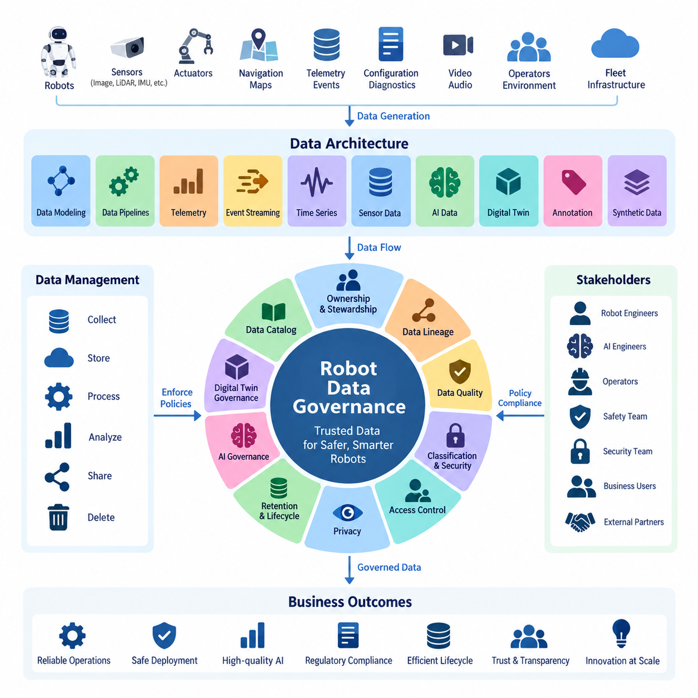
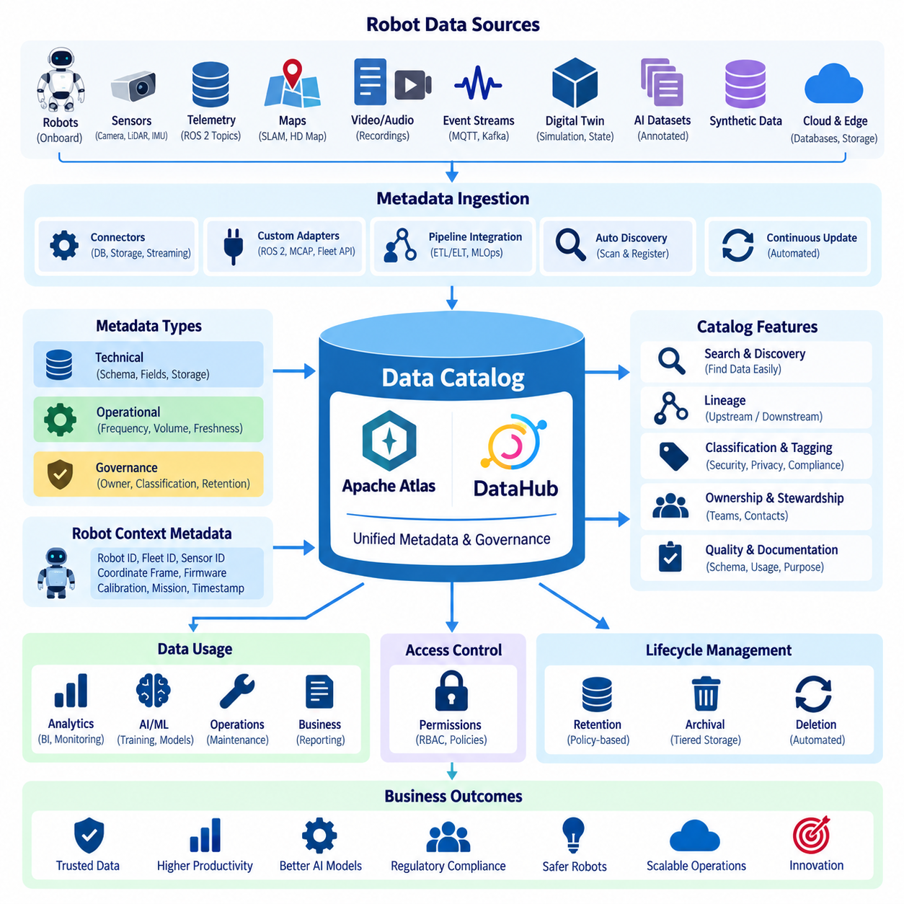
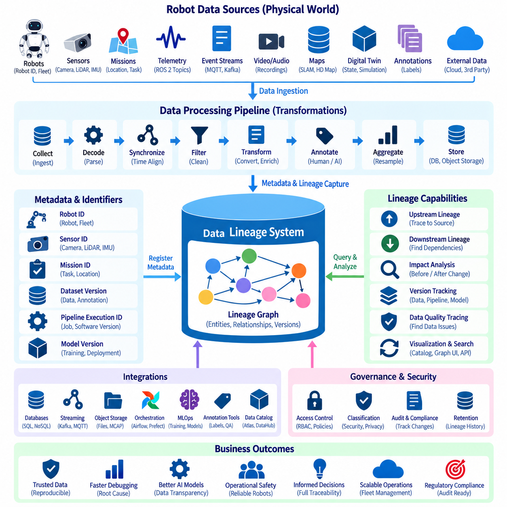
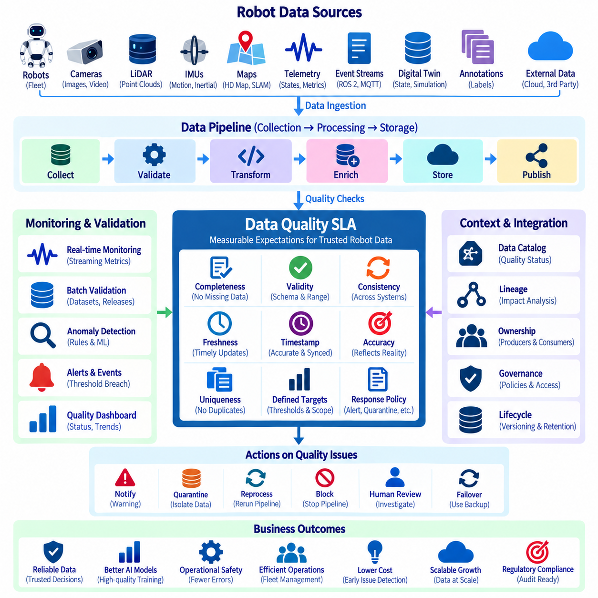
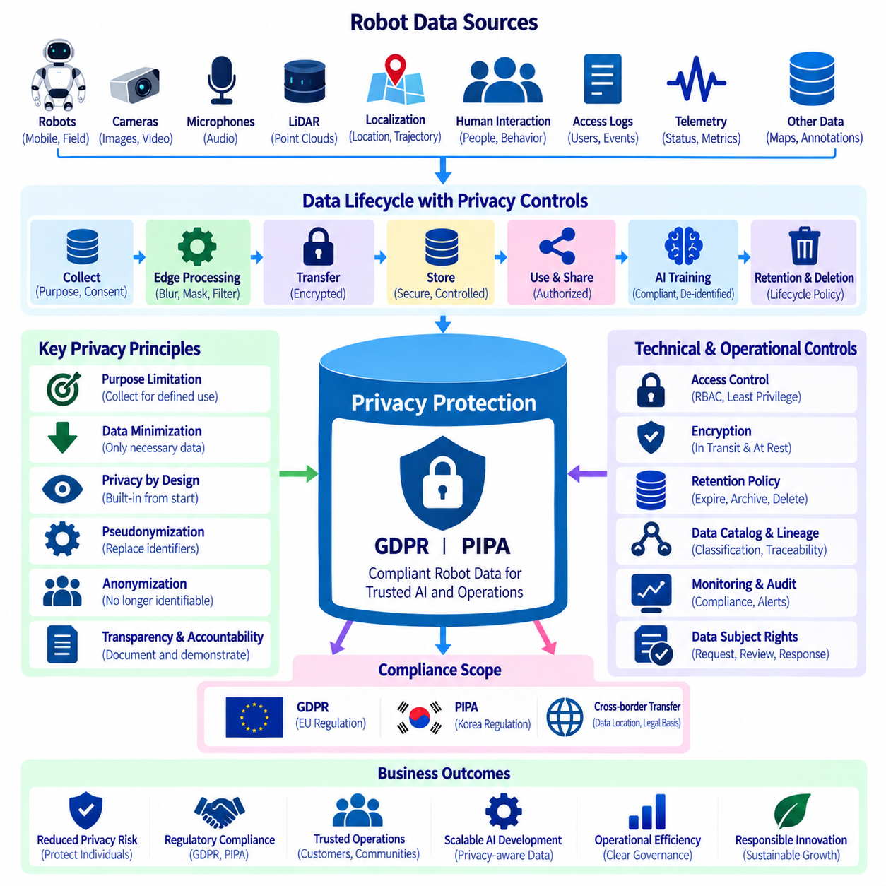
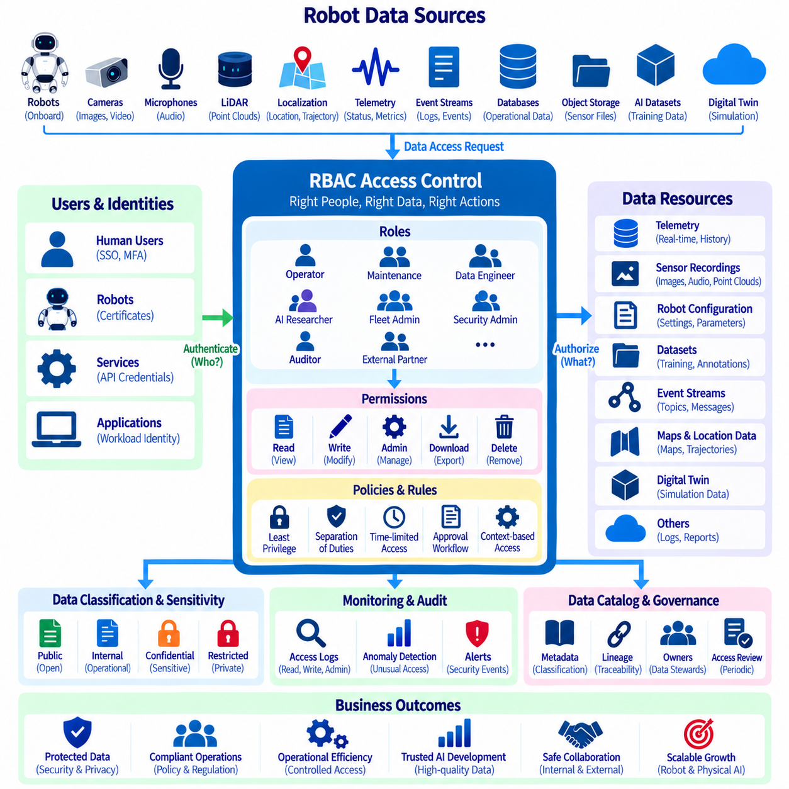
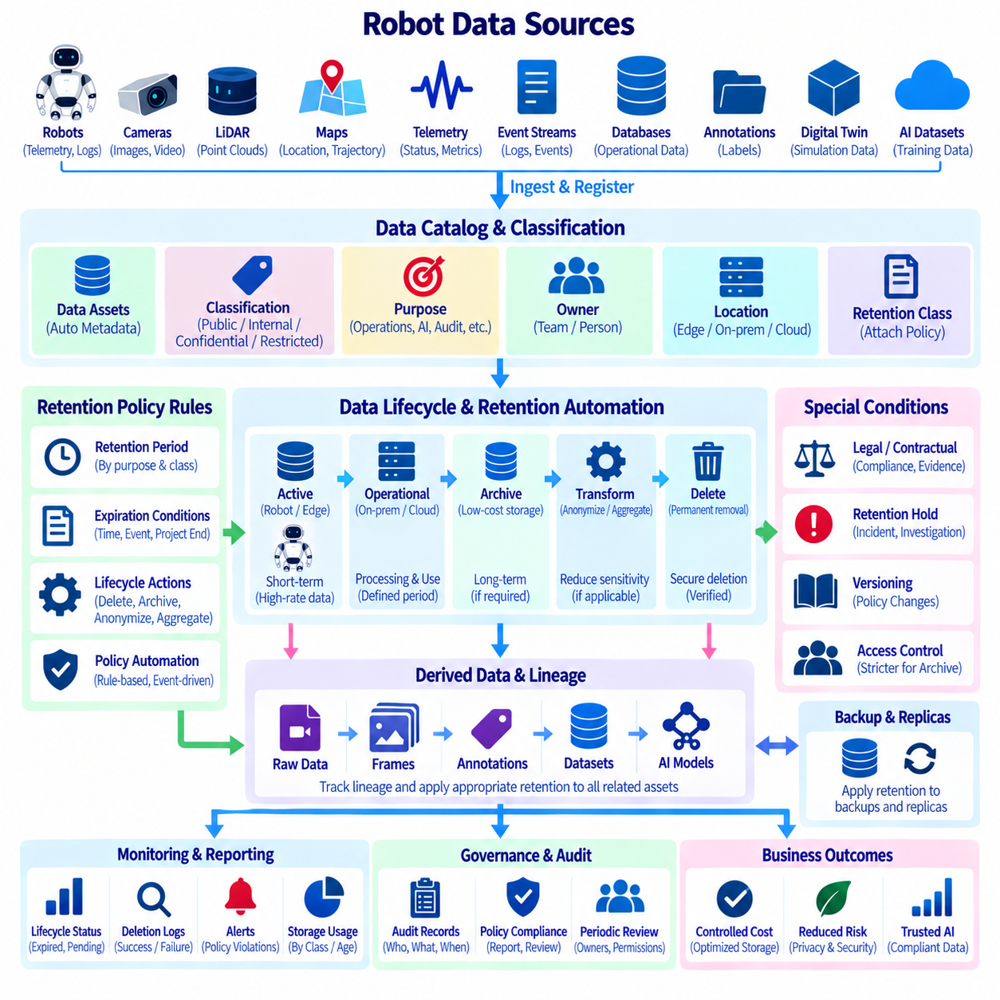
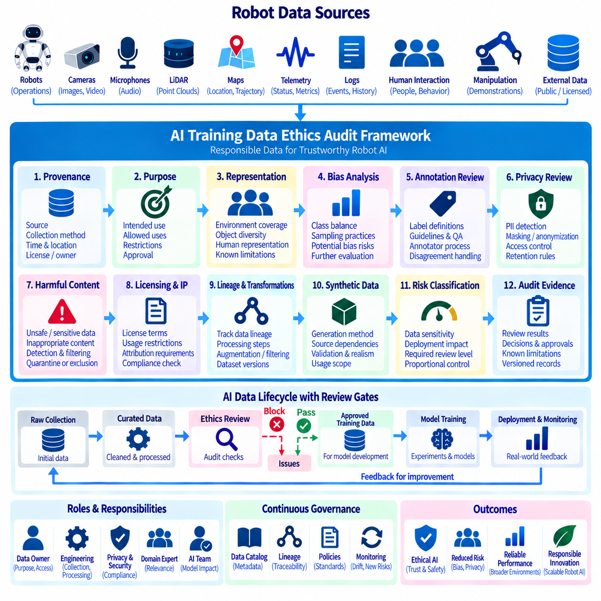
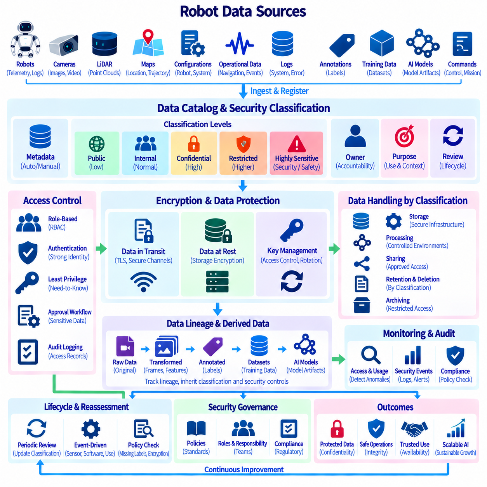
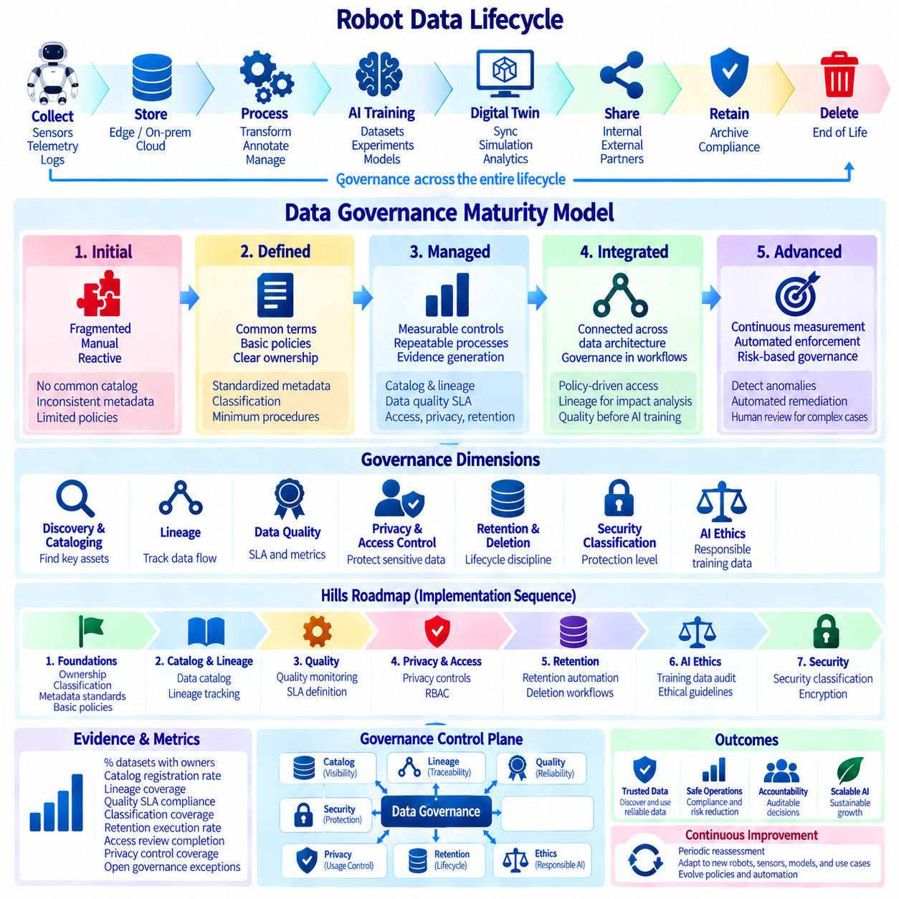

**Volume 07 Robot Data Architecture**


# 09. Data Governance

##  

## 09.01 Robot Data Governance Framework Overview

{width="7.268055555555556in" height="7.268055555555556in"}

Robot data governance establishes the organizational, technical, and operational rules that determine how data generated by robots is identified, collected, classified, stored, accessed, transformed, shared, retained, and deleted throughout its lifecycle. Unlike conventional enterprise data, robot data continuously originates from physical interactions involving sensors, actuators, navigation systems, AI models, operators, environments, and fleet infrastructure. Governance therefore must connect information management with real-world robot operations.

A robot data governance framework should cover the complete data architecture rather than operate as an isolated administrative layer. The architecture described in this volume includes data modeling, pipelines, telemetry, event streaming, time-series information, sensor data, AI datasets, digital twins, annotation, synthetic data, and operational case studies. Governance provides common policies and accountability across these domains so that independently developed pipelines remain compatible, traceable, secure, and manageable.

The framework begins by defining clear ownership and stewardship. Data ownership identifies the organization or business function accountable for a dataset, while data stewardship assigns responsibility for maintaining its quality, metadata, classification, accessibility, and lifecycle rules. Technical custodians operate storage platforms and pipelines, while robot engineers, AI engineers, safety teams, security teams, and business users become producers or consumers governed by explicitly defined responsibilities.

Robot data should be treated as a collection of distinct data domains rather than as one homogeneous resource. Telemetry, images, video, point clouds, IMU measurements, localization information, maps, diagnostic events, configuration records, mission histories, AI annotations, digital-twin states, and synthetic datasets have different rates, sizes, sensitivity levels, retention requirements, and operational value. Governance policies therefore need domain-specific controls under a common enterprise framework.

A fundamental governance mechanism is a data catalog that provides a searchable inventory of available data assets. Catalog entries should describe dataset names, owners, schemas, source robots, sensor types, timestamps, physical units, storage locations, classifications, retention policies, and permitted uses. The chapter structure subsequently introduces Apache Atlas and DataHub as technologies for implementing such catalog capabilities, connecting governance concepts with practical metadata management infrastructure.

Metadata alone is insufficient when robot information passes through complex processing chains. Data lineage records how information moves from its original source through collection agents, message brokers, transformations, databases, feature pipelines, annotation systems, training datasets, and AI models. A lineage graph makes it possible to determine which robot, sensor, software version, transformation process, and dataset contributed to a particular analytical result or trained model, supporting reproducibility and root-cause investigation.

Data quality governance defines measurable expectations for whether robot information is trustworthy enough for its intended purpose. Important dimensions include completeness, validity, consistency, accuracy, timestamp integrity, synchronization, freshness, and uniqueness. Sensor pipelines may additionally monitor missing frames, corrupted packets, calibration status, outliers, and synchronization errors. These requirements can be expressed through data-quality service-level agreements and continuously evaluated as part of automated pipelines.

Governance must also distinguish data according to sensitivity and operational impact. Public documentation, ordinary operational telemetry, proprietary engineering information, personally identifiable information, safety-related records, credentials, maps of restricted facilities, and security-sensitive robot configurations should not receive identical protection. Classification policies establish protection levels and connect them to encryption, authentication, authorization, logging, network controls, sharing restrictions, and approved storage environments.

Access governance converts these classifications into enforceable permissions. Role-based access control can assign privileges according to functions such as robot operator, maintenance engineer, data engineer, AI researcher, fleet administrator, security administrator, or external partner. The objective is to provide sufficient access for legitimate work while limiting unnecessary exposure. Access decisions should be auditable, periodically reviewed, and consistently applied across onboard computers, edge infrastructure, on-premise systems, cloud platforms, and data repositories.

Privacy becomes particularly important because mobile robots may observe people and environments that were never created specifically as datasets. RGB cameras can capture faces and documents, microphones can record conversations, localization records may reveal movement patterns, and service robots can operate in hospitals, offices, factories, or public spaces. Governance therefore needs policies for collection purpose, minimization, masking, anonymization, permitted reuse, transfer, retention, and deletion, aligned with applicable privacy requirements.

Retention governance determines how long each category of robot information remains available and what happens when its useful or legally required lifetime ends. High-rate raw sensor streams may require short retention because of their storage cost, while selected incident records, aggregated telemetry, maintenance histories, validated training datasets, or safety evidence may need substantially longer preservation. Automated lifecycle rules can migrate information between storage tiers and ultimately trigger controlled deletion according to policy.

AI introduces an additional governance dimension because training data directly influences robot behavior. Training datasets should preserve provenance, annotation history, transformation records, version identifiers, quality results, licensing information, and relationships to trained models. Governance should also examine representativeness, inappropriate content, collection conditions, annotation bias, and authorized purposes. These records allow organizations to reconstruct why a particular model behaves differently across environments, robot types, or operating conditions.

Digital-twin data further expands the governance boundary by maintaining representations of physical robots and fleets. The preceding chapter includes robot digital-twin models, real-to-digital synchronization, time-series storage, simulation-to-real loops, predictive maintenance, and fleet aggregation. Governance must preserve the identity and temporal relationship between physical assets and their digital representations so that stale, simulated, estimated, and directly measured states are not accidentally treated as equivalent information.

Governance should be embedded into the data platform rather than implemented only through documents and manual approvals. Schema validation, catalog registration, lineage capture, quality checks, access enforcement, encryption, retention execution, deletion workflows, and audit logging can become automated controls inside ingestion and processing pipelines. This approach turns governance from a periodic compliance activity into continuous operational behavior that accompanies data from the robot through edge, server, cloud, analytics, and AI environments.

The governance framework ultimately operates as a control plane above the robot data lifecycle. Policies define what should happen; metadata identifies what data exists; ownership establishes accountability; lineage explains where information came from; quality controls determine whether it can be trusted; security and privacy controls determine who may use it; and lifecycle policies determine how long it remains available. Together, these mechanisms transform rapidly growing robot data from unmanaged files and streams into governed organizational assets.

Governance maturity develops progressively as robot deployments scale. Early systems may depend on naming conventions, manually maintained inventories, and basic access permissions. Larger fleets require automated catalogs, lineage, quality monitoring, policy enforcement, privacy controls, retention automation, and governance metrics. The volume therefore progresses from this framework overview toward cataloging, lineage, quality SLAs, privacy, RBAC, retention, AI ethics, security classification, and finally a governance maturity model and roadmap.

로봇 데이터 거버넌스(Robot Data Governance)는 로봇이 생성하는 데이터를 전체 수명주기(Lifecycle)에 걸쳐 어떻게 식별하고, 수집하고, 분류하고, 저장하고, 접근하고, 변환하고, 공유하고, 보존하고, 삭제할 것인지를 결정하는 조직적·기술적·운영적 규칙을 확립한다. 기존 기업 데이터와 달리 로봇 데이터는 센서(Sensor), 액추에이터(Actuator), 내비게이션 시스템(Navigation System), AI 모델(AI Model), 운영자(Operator), 환경(Environment), 플릿 인프라(Fleet Infrastructure)와의 물리적 상호작용에서 지속적으로 생성된다. 따라서 거버넌스는 정보 관리(Information Management)를 실제 로봇 운영(Real-World Robot Operations)과 연결해야 한다.

로봇 데이터 거버넌스 프레임워크(Robot Data Governance Framework)는 독립된 관리 계층으로 운영되는 것이 아니라 전체 데이터 아키텍처(Data Architecture)를 포괄해야 한다. 이 볼륨(Volume)에서 설명하는 아키텍처에는 데이터 모델링(Data Modeling), 데이터 파이프라인(Data Pipeline), 텔레메트리(Telemetry), 이벤트 스트리밍(Event Streaming), 시계열 데이터(Time-Series Data), 센서 데이터(Sensor Data), AI 데이터셋(AI Dataset), 디지털 트윈(Digital Twin), 어노테이션(Annotation), 합성 데이터(Synthetic Data), 운영 사례(Operational Case Study)가 포함된다. 거버넌스는 이러한 영역에 공통 정책과 책임 체계를 적용하여 독립적으로 개발된 파이프라인들이 상호 호환되고 추적 가능하며 안전하고 관리 가능한 상태를 유지하도록 한다.

프레임워크는 명확한 데이터 소유권(Data Ownership)과 데이터 스튜어드십(Data Stewardship)을 정의하는 것에서 시작한다. 데이터 소유권은 데이터셋(Dataset)에 대해 책임을 지는 조직이나 업무 기능을 식별하며, 데이터 스튜어드십은 데이터의 품질, 메타데이터(Metadata), 분류, 접근성, 수명주기 규칙을 유지하는 책임을 정의한다. 기술 관리자는 저장 플랫폼과 파이프라인을 운영하며, 로봇 엔지니어, AI 엔지니어, 안전팀, 보안팀, 비즈니스 사용자는 명확하게 정의된 책임 체계에 따라 데이터 생산자(Data Producer) 또는 소비자(Data Consumer)가 된다.

로봇 데이터는 하나의 동질적인 자원으로 취급하기보다 서로 다른 데이터 도메인(Data Domain)의 집합으로 관리해야 한다. 텔레메트리, 이미지(Image), 비디오(Video), 포인트 클라우드(Point Cloud), 관성 측정 장치(IMU) 측정값, 위치추정 정보(Localization Information), 지도(Map), 진단 이벤트(Diagnostic Event), 구성 기록(Configuration Record), 임무 이력(Mission History), AI 어노테이션(AI Annotation), 디지털 트윈 상태(Digital Twin State), 합성 데이터셋(Synthetic Dataset)은 각각 데이터 생성 속도, 크기, 민감도, 보존 요구사항, 운영 가치가 다르다. 따라서 거버넌스 정책은 공통된 기업 프레임워크(Enterprise Framework) 아래에서 도메인별 제어 정책을 제공해야 한다.

거버넌스의 기본 메커니즘 중 하나는 사용 가능한 데이터 자산(Data Asset)을 검색 가능한 형태로 관리하는 데이터 카탈로그(Data Catalog)이다. 카탈로그 항목에는 데이터셋 이름, 소유자, 스키마(Schema), 데이터 생성 로봇, 센서 유형, 타임스탬프(Timestamp), 물리 단위, 저장 위치, 데이터 분류, 보존 정책, 허용된 사용 목적 등이 포함되어야 한다. 이후 장에서는 이러한 카탈로그 기능을 구현하기 위한 기술로 아파치 아틀라스(Apache Atlas)와 데이터허브(DataHub)를 다루며, 거버넌스 개념을 실제 메타데이터 관리(Metadata Management) 인프라와 연결한다.

로봇 정보가 복잡한 처리 체인을 통과하는 환경에서는 메타데이터만으로 충분하지 않다. 데이터 리니지(Data Lineage)는 정보가 최초 데이터 소스(Data Source)에서 시작하여 수집 에이전트(Collection Agent), 메시지 브로커(Message Broker), 데이터 변환(Transformation), 데이터베이스(Database), 피처 파이프라인(Feature Pipeline), 어노테이션 시스템(Annotation System), 학습 데이터셋(Training Dataset), AI 모델까지 어떻게 이동했는지를 기록한다. 리니지 그래프(Lineage Graph)를 활용하면 특정 분석 결과나 학습 모델에 어떤 로봇, 센서, 소프트웨어 버전, 변환 프로세스, 데이터셋이 기여했는지를 확인할 수 있으며, 이를 통해 재현성(Reproducibility)과 근본 원인 분석(Root-Cause Analysis)을 지원할 수 있다.

데이터 품질 거버넌스(Data Quality Governance)는 로봇 정보가 특정 목적에 사용하기에 충분히 신뢰할 수 있는지를 판단하기 위한 측정 가능한 기준을 정의한다. 주요 품질 요소에는 완전성(Completeness), 유효성(Validity), 일관성(Consistency), 정확성(Accuracy), 타임스탬프 무결성(Timestamp Integrity), 동기화(Synchronization), 최신성(Freshness), 고유성(Uniqueness)이 포함된다. 센서 파이프라인에서는 누락 프레임(Missing Frame), 손상 패킷(Corrupted Packet), 캘리브레이션 상태(Calibration Status), 이상치(Outlier), 동기화 오류 등을 추가로 모니터링할 수 있다. 이러한 요구사항은 데이터 품질 서비스 수준 협약(Data Quality SLA)으로 정의하고 자동화된 파이프라인의 일부로 지속적으로 평가할 수 있다.

거버넌스는 데이터의 민감도(Sensitivity)와 운영 영향도(Operational Impact)에 따라서도 데이터를 구분해야 한다. 공개 문서, 일반 운영 텔레메트리, 독점 엔지니어링 정보(Proprietary Engineering Information), 개인 식별 정보(PII), 안전 관련 기록(Safety-Related Record), 인증정보(Credential), 제한 시설 지도, 보안에 민감한 로봇 구성 정보는 동일한 보호 수준을 적용해서는 안 된다. 데이터 분류 정책(Data Classification Policy)은 보호 등급을 설정하고 이를 암호화(Encryption), 인증(Authentication), 권한 부여(Authorization), 로깅(Logging), 네트워크 제어(Network Control), 공유 제한, 승인된 저장 환경과 연결한다.

접근 거버넌스(Access Governance)는 이러한 데이터 분류를 실제로 집행 가능한 권한으로 변환한다. 역할 기반 접근 제어(RBAC)는 로봇 운영자, 유지보수 엔지니어, 데이터 엔지니어, AI 연구자, 플릿 관리자(Fleet Administrator), 보안 관리자(Security Administrator), 외부 파트너와 같은 역할에 따라 권한을 할당할 수 있다. 목적은 정상적인 업무 수행에 필요한 충분한 접근 권한을 제공하면서 불필요한 데이터 노출을 제한하는 것이다. 접근 결정은 감사 가능해야 하고 주기적으로 검토되어야 하며, 온보드 컴퓨터(Onboard Computer), 엣지 인프라(Edge Infrastructure), 온프레미스 시스템(On-Premise System), 클라우드 플랫폼(Cloud Platform), 데이터 저장소 전반에서 일관되게 적용되어야 한다.

개인정보 보호(Privacy)는 이동형 로봇이 애초에 데이터셋 생성을 목적으로 하지 않았던 사람과 환경을 관찰할 수 있기 때문에 특히 중요하다. RGB 카메라는 얼굴이나 문서를 촬영할 수 있고, 마이크는 대화를 녹음할 수 있으며, 위치 기록은 이동 패턴을 드러낼 수 있다. 또한 서비스 로봇은 병원, 사무실, 공장, 공공장소에서 운영될 수 있다. 따라서 거버넌스에는 데이터 수집 목적, 최소 수집(Data Minimization), 마스킹(Masking), 익명화(Anonymization), 허용된 재사용, 데이터 전송, 보존, 삭제 정책이 포함되어야 하며 적용 가능한 개인정보 보호 요구사항과 연계되어야 한다.

데이터 보존 거버넌스(Data Retention Governance)는 각 로봇 데이터 유형을 얼마 동안 유지하고 유용한 기간 또는 법적으로 요구되는 기간이 종료된 이후 어떻게 처리할지를 결정한다. 고속으로 생성되는 원시 센서 스트림(Raw Sensor Stream)은 저장 비용 때문에 짧은 보존 기간이 필요할 수 있지만, 선택된 사고 기록, 집계 텔레메트리(Aggregated Telemetry), 유지보수 이력, 검증된 학습 데이터셋, 안전 증거(Safety Evidence)는 훨씬 장기간 보존해야 할 수 있다. 자동화된 수명주기 규칙(Automated Lifecycle Rule)은 데이터를 서로 다른 저장 계층(Storage Tier)으로 이동시키고 최종적으로 정책에 따른 통제된 삭제를 수행할 수 있다.

AI는 학습 데이터(Training Data)가 로봇의 행동에 직접적인 영향을 미치기 때문에 추가적인 거버넌스 영역을 요구한다. 학습 데이터셋에는 데이터 출처(Provenance), 어노테이션 이력(Annotation History), 변환 기록, 버전 식별자(Version Identifier), 품질 평가 결과, 라이선스 정보(Licensing Information), 학습된 모델과의 관계가 보존되어야 한다. 또한 거버넌스는 데이터 대표성(Representativeness), 부적절한 콘텐츠, 수집 조건, 어노테이션 편향(Annotation Bias), 허가된 사용 목적을 검토해야 한다. 이러한 기록을 통해 조직은 특정 AI 모델이 환경, 로봇 유형, 운영 조건에 따라 서로 다른 행동을 보이는 이유를 재구성할 수 있다.

디지털 트윈 데이터(Digital Twin Data)는 물리적 로봇과 플릿의 디지털 표현(Digital Representation)을 유지하기 때문에 거버넌스의 범위를 더욱 확장한다. 앞선 장에서는 로봇 디지털 트윈 모델, 실제-디지털 동기화(Real-to-Digital Synchronization), 시계열 저장, 시뮬레이션-실환경 루프(Simulation-to-Real Loop), 예지 정비(Predictive Maintenance), 플릿 데이터 집계(Fleet Aggregation)를 다룬다. 거버넌스는 물리적 자산(Physical Asset)과 디지털 표현 사이의 식별 관계와 시간적 관계를 보존하여 오래된 상태(Stale State), 시뮬레이션 상태, 추정 상태(Estimated State), 직접 측정된 상태가 동일한 정보로 잘못 취급되지 않도록 해야 한다.

거버넌스는 문서와 수동 승인만으로 구현하기보다 데이터 플랫폼(Data Platform) 자체에 내재화되어야 한다. 스키마 검증(Schema Validation), 카탈로그 등록(Catalog Registration), 리니지 수집(Lineage Capture), 품질 검사(Quality Check), 접근 제어 집행, 암호화, 보존 정책 실행, 삭제 워크플로(Deletion Workflow), 감사 로깅(Audit Logging)을 데이터 수집 및 처리 파이프라인 내부의 자동화된 제어 기능으로 구현할 수 있다. 이러한 접근 방식은 거버넌스를 주기적으로 수행하는 규정 준수 활동(Compliance Activity)에서 데이터와 함께 지속적으로 실행되는 운영 기능으로 전환한다.

궁극적으로 거버넌스 프레임워크는 로봇 데이터 수명주기(Robot Data Lifecycle) 위에서 동작하는 제어 계층(Control Plane)의 역할을 수행한다. 정책(Policy)은 무엇이 수행되어야 하는지를 정의하고, 메타데이터는 어떤 데이터가 존재하는지를 식별하며, 데이터 소유권은 책임 소재를 확립한다. 데이터 리니지는 정보의 출처를 설명하고, 품질 제어(Quality Control)는 데이터를 신뢰할 수 있는지를 판단하며, 보안 및 개인정보 보호 제어는 누가 데이터를 사용할 수 있는지를 결정한다. 수명주기 정책은 데이터가 얼마 동안 유지될지를 결정한다. 이러한 메커니즘을 통해 빠르게 증가하는 로봇 데이터는 관리되지 않는 파일과 스트림에서 체계적으로 관리되는 조직의 데이터 자산(Data Asset)으로 전환된다.

거버넌스 성숙도(Governance Maturity)는 로봇 배치 규모가 증가함에 따라 점진적으로 발전한다. 초기 시스템에서는 명명 규칙(Naming Convention), 수동으로 관리되는 데이터 목록, 기본적인 접근 권한에 의존할 수 있다. 그러나 대규모 플릿 환경에서는 자동화된 데이터 카탈로그, 데이터 리니지, 품질 모니터링, 정책 집행(Policy Enforcement), 개인정보 보호 제어, 보존 자동화, 거버넌스 지표(Governance Metrics)가 필요하다. 따라서 이 볼륨은 이러한 프레임워크 개요를 시작으로 데이터 카탈로그, 리니지, 데이터 품질 SLA, 개인정보 보호, 역할 기반 접근 제어(RBAC), 보존 정책, AI 윤리(AI Ethics), 보안 분류(Security Classification), 그리고 최종적으로 거버넌스 성숙도 모델(Governance Maturity Model)과 로드맵(Roadmap)으로 확장된다.

##  

## 09.02 Data Catalog Build: Apache Atlas / DataHub [w/Code]

{width="7.268055555555556in" height="7.268055555555556in"}

A data catalog provides a searchable and governed inventory of data assets distributed across a robot data architecture. In robotics, these assets may include telemetry streams, ROS 2 topics, sensor recordings, time-series tables, event streams, maps, digital-twin states, annotated datasets, synthetic data, and AI training datasets. The catalog creates a common metadata layer that allows engineers and automated systems to discover what data exists, where it is stored, who owns it, and how it may be used.

Robot organizations often accumulate data across onboard computers, edge servers, on-premise infrastructure, object storage, databases, message brokers, and cloud platforms. Without a catalog, knowledge about these assets tends to remain inside individual teams or application code. A catalog replaces fragmented knowledge with structured metadata describing datasets, schemas, storage locations, owners, classifications, quality information, lifecycle policies, and relationships between data assets.

Metadata collected by the catalog can be divided conceptually into technical, operational, and governance information. Technical metadata describes schemas, fields, data types, topics, tables, files, APIs, and storage systems. Operational metadata records properties such as update frequency, volume, freshness, or pipeline execution. Governance metadata identifies ownership, sensitivity classification, retention requirements, access policies, business descriptions, and approved purposes for using the data.

A robotics catalog should represent the physical origin of data as well as its digital location. Sensor information can therefore be associated with robot IDs, fleet IDs, camera or LiDAR identifiers, coordinate frames, firmware versions, calibration versions, collection missions, and timestamps. This context is important because two files with identical formats may represent substantially different physical conditions. Metadata allows downstream users to understand those conditions without manually reconstructing the original robot configuration.

Apache Atlas provides a metadata governance architecture centered on entities, classifications, relationships, and lineage. Data platforms can represent databases, tables, files, processes, datasets, and other resources as typed entities. Relationships connect these entities into a metadata graph, while classifications attach governance meaning such as confidential, personal, safety-related, or training-approved. This model can be extended with robot-specific entity types representing robots, sensors, missions, recordings, and AI datasets.

In an Apache Atlas-based design, ingestion connectors or custom integration services collect metadata from robot data platforms and register it with the catalog. A telemetry database might contribute tables and schemas, an object store might expose sensor dataset locations, and a processing pipeline might register input-output relationships. Atlas then provides a centralized metadata representation through which users can search assets and examine relationships between raw robot information and processed data products.

DataHub follows a metadata-platform approach designed around discovery, metadata ingestion, search, ownership, lineage, domains, tags, and related governance capabilities. Metadata from heterogeneous platforms can be ingested into a unified catalog and associated with organizational context. For a robot data architecture, DataHub can provide a searchable interface through which engineers locate telemetry datasets, sensor recordings, analytical tables, features, training datasets, or other assets without needing detailed knowledge of every underlying storage platform.

A practical DataHub deployment begins with metadata ingestion from databases, data lakes, warehouses, streaming platforms, orchestration systems, and other supported sources. Robot-specific systems can require additional adapters because ROS 2 bags, MCAP files, specialized sensor archives, fleet APIs, or robotics metadata may not correspond directly to conventional enterprise tables. Custom ingestion logic can transform these resources into catalog entities while preserving robot-specific metadata as properties, tags, domains, or relationships.

Catalog construction should follow the data lifecycle rather than simply scanning storage directories. When a robot creates sensor data, metadata can identify its source and collection context. When pipelines transform that data, the catalog can record derived datasets and lineage. Annotation adds label versions and quality information, while AI training associates datasets with experiments or models. This produces a connected metadata graph rather than a flat inventory of unrelated files and database objects.

Automation is essential because robot fleets can generate new data assets continuously. Manual catalog registration becomes impractical when thousands of sensor sessions, telemetry partitions, event topics, and training dataset versions are created. Metadata registration should therefore be integrated into ingestion pipelines, ETL or ELT workflows, streaming infrastructure, annotation pipelines, and MLOps processes. New assets can then appear in the catalog automatically as part of normal data processing.

A useful catalog entry should provide enough context for users to evaluate a dataset before accessing its underlying contents. Descriptions can explain the operational purpose, collection environment, robot platform, sensor configuration, schema, units, coordinate system, sampling rate, time range, owner, quality status, sensitivity classification, and retention policy. AI datasets may additionally record annotation schema, dataset version, train-validation-test partition, license, provenance, and approved model-development purposes.

Search and discovery convert metadata into operational value. Engineers should be able to search by robot type, sensor, mission, location category, data format, time period, owner, tag, domain, or intended use. Instead of browsing storage paths manually, an AI engineer could locate validated camera datasets suitable for perception training, while a reliability engineer could discover telemetry associated with a particular hardware revision or failure event.

Ownership and stewardship should be visible directly within catalog records. A sensor dataset might identify the robotics platform team as its owner and a data engineering group as its technical steward. AI training data may have separate owners responsible for annotations and model-development suitability. Exposing these responsibilities reduces uncertainty when users encounter incorrect schemas, missing metadata, quality problems, access restrictions, or questions concerning permitted data usage.

Classification and tagging connect the catalog with security, privacy, and compliance controls. Robot camera recordings containing people may receive privacy-sensitive classifications, while facility maps can be classified as security-sensitive. Safety logs, proprietary configuration data, and externally licensed datasets may receive different tags. These classifications can then support access-control decisions, retention rules, encryption requirements, review workflows, and auditing across the broader governance architecture.

The catalog also provides the foundation for data lineage. When metadata relationships identify that raw camera recordings were transformed into selected frames, annotated objects, training datasets, features, and eventually AI models, users can navigate both upstream and downstream dependencies. If a source dataset contains an error, lineage information helps determine which derived datasets and models may be affected, making catalog metadata important for reproducibility and operational incident analysis.

Apache Atlas and DataHub should not be viewed simply as competing user interfaces. Both represent approaches to building an enterprise metadata and governance layer, while implementation choices depend on existing infrastructure, integration requirements, governance processes, and operational expertise. A robotics organization can evaluate them according to metadata modeling flexibility, ingestion support, lineage capabilities, search experience, APIs, extensibility, deployment complexity, and compatibility with its data platform.

The resulting catalog becomes a shared metadata control point across robot data modeling, pipelines, telemetry, event streaming, sensor management, AI data architecture, and digital twins. It does not replace databases, object stores, message brokers, or dataset repositories; instead, it describes and connects them. By separating metadata management from physical data storage, organizations can maintain a unified view even when the underlying robot information remains distributed across multiple infrastructure layers.

A mature robot data catalog ultimately changes data discovery from personal knowledge into an organizational capability. Engineers can determine what information exists, understand its physical and technical context, identify responsible owners, inspect lineage, evaluate quality and classifications, and request appropriate access. Apache Atlas or DataHub can provide the metadata foundation for this capability, enabling subsequent governance functions such as lineage tracking, quality SLA monitoring, access control, retention automation, security classification, and AI data auditing.

데이터 카탈로그(Data Catalog)는 로봇 데이터 아키텍처(Robot Data Architecture) 전반에 분산되어 있는 데이터 자산(Data Asset)을 검색하고 체계적으로 관리할 수 있도록 제공하는 통합 목록이다. 로보틱스(Robotics) 환경에서 이러한 자산에는 텔레메트리 스트림(Telemetry Stream), ROS 2 토픽(ROS 2 Topic), 센서 기록(Sensor Recording), 시계열 테이블(Time-Series Table), 이벤트 스트림(Event Stream), 지도(Map), 디지털 트윈 상태(Digital Twin State), 어노테이션 데이터셋(Annotated Dataset), 합성 데이터(Synthetic Data), AI 학습 데이터셋(AI Training Dataset) 등이 포함될 수 있다. 카탈로그는 엔지니어와 자동화 시스템이 어떤 데이터가 존재하고, 어디에 저장되어 있으며, 누가 소유하고, 어떻게 사용할 수 있는지를 파악할 수 있도록 공통 메타데이터 계층(Common Metadata Layer)을 제공한다.

로봇을 운영하는 조직에서는 온보드 컴퓨터(Onboard Computer), 엣지 서버(Edge Server), 온프레미스 인프라(On-Premise Infrastructure), 오브젝트 스토리지(Object Storage), 데이터베이스(Database), 메시지 브로커(Message Broker), 클라우드 플랫폼(Cloud Platform) 전반에 데이터가 축적되는 경우가 많다. 데이터 카탈로그가 없다면 이러한 자산에 대한 지식은 개별 팀이나 애플리케이션 코드(Application Code) 내부에 머무르게 된다. 데이터 카탈로그는 이러한 분산된 지식을 데이터셋, 스키마(Schema), 저장 위치, 소유자, 분류, 품질 정보, 수명주기 정책(Lifecycle Policy), 데이터 자산 간 관계를 설명하는 구조화된 메타데이터(Structured Metadata)로 전환한다.

카탈로그가 수집하는 메타데이터(Metadata)는 개념적으로 기술 메타데이터(Technical Metadata), 운영 메타데이터(Operational Metadata), 거버넌스 메타데이터(Governance Metadata)로 구분할 수 있다. 기술 메타데이터는 스키마, 필드(Field), 데이터 타입(Data Type), 토픽(Topic), 테이블(Table), 파일(File), API, 저장 시스템을 설명한다. 운영 메타데이터는 업데이트 주기, 데이터 용량, 최신성(Freshness), 파이프라인 실행과 같은 속성을 기록한다. 거버넌스 메타데이터는 소유권, 민감도 분류(Sensitivity Classification), 보존 요구사항, 접근 정책, 비즈니스 설명, 데이터 사용이 승인된 목적 등을 식별한다.

로보틱스 데이터 카탈로그는 데이터의 디지털 저장 위치뿐만 아니라 데이터가 발생한 물리적 출처(Physical Origin)도 표현해야 한다. 따라서 센서 정보는 로봇 ID(Robot ID), 플릿 ID(Fleet ID), 카메라 또는 라이다 식별자(LiDAR Identifier), 좌표 프레임(Coordinate Frame), 펌웨어 버전(Firmware Version), 캘리브레이션 버전(Calibration Version), 데이터 수집 임무(Collection Mission), 타임스탬프(Timestamp)와 연결될 수 있다. 동일한 파일 형식을 사용하는 두 데이터라도 서로 크게 다른 물리적 조건을 나타낼 수 있기 때문에 이러한 문맥(Context)이 중요하다. 메타데이터를 활용하면 이후 데이터를 사용하는 사람이 원래의 로봇 구성을 직접 재구성하지 않고도 해당 조건을 이해할 수 있다.

아파치 아틀라스(Apache Atlas)는 엔터티(Entity), 분류(Classification), 관계(Relationship), 리니지(Lineage)를 중심으로 구성되는 메타데이터 거버넌스 아키텍처(Metadata Governance Architecture)를 제공한다. 데이터 플랫폼에서는 데이터베이스, 테이블, 파일, 프로세스(Process), 데이터셋 등의 리소스를 유형화된 엔터티(Typed Entity)로 표현할 수 있다. 관계는 이러한 엔터티들을 메타데이터 그래프(Metadata Graph)로 연결하며, 분류는 기밀(Confidential), 개인정보(Personal), 안전 관련(Safety-Related), 학습 승인(Training-Approved)과 같은 거버넌스 의미를 부여한다. 이러한 모델은 로봇, 센서, 임무, 기록, AI 데이터셋을 표현하는 로봇 특화 엔터티 유형(Robot-Specific Entity Type)으로 확장할 수 있다.

아파치 아틀라스 기반 설계(Apache Atlas-Based Design)에서는 수집 커넥터(Ingestion Connector) 또는 사용자 정의 통합 서비스(Custom Integration Service)가 로봇 데이터 플랫폼에서 메타데이터를 수집하여 카탈로그에 등록한다. 텔레메트리 데이터베이스는 테이블과 스키마 정보를 제공할 수 있고, 오브젝트 스토리지는 센서 데이터셋의 저장 위치를 제공할 수 있으며, 데이터 처리 파이프라인은 입력과 출력 사이의 관계를 등록할 수 있다. 아틀라스는 이러한 정보를 중앙화된 메타데이터 표현(Centralized Metadata Representation)으로 구성하여 사용자가 원시 로봇 정보와 가공된 데이터 제품(Data Product)의 관계를 검색하고 확인할 수 있도록 한다.

데이터허브(DataHub)는 데이터 검색(Data Discovery), 메타데이터 수집(Metadata Ingestion), 검색(Search), 소유권(Ownership), 리니지, 도메인(Domain), 태그(Tag) 및 관련 거버넌스 기능을 중심으로 설계된 메타데이터 플랫폼(Metadata Platform) 접근 방식을 제공한다. 서로 다른 플랫폼에서 생성된 메타데이터를 통합 카탈로그(Unified Catalog)로 수집하고 조직적 문맥과 연결할 수 있다. 로봇 데이터 아키텍처에서는 엔지니어가 각각의 저장 플랫폼을 상세히 알지 못하더라도 텔레메트리 데이터셋, 센서 기록, 분석 테이블, 피처(Feature), 학습 데이터셋 등의 자산을 검색할 수 있는 인터페이스를 데이터허브를 통해 제공할 수 있다.

실제 데이터허브 구축(DataHub Deployment)은 데이터베이스, 데이터 레이크(Data Lake), 데이터 웨어하우스(Data Warehouse), 스트리밍 플랫폼(Streaming Platform), 오케스트레이션 시스템(Orchestration System) 및 기타 지원 데이터 소스에서 메타데이터를 수집하는 것으로 시작한다. ROS 2 백(ROS 2 Bag), MCAP 파일, 특수 센서 아카이브(Sensor Archive), 플릿 API(Fleet API)와 같은 로봇 특화 시스템은 기존 기업 환경의 테이블과 직접 대응하지 않을 수 있으므로 추가적인 어댑터(Adapter)가 필요할 수 있다. 사용자 정의 수집 로직(Custom Ingestion Logic)은 로봇 특화 메타데이터를 속성(Property), 태그, 도메인 또는 관계로 유지하면서 이러한 리소스를 카탈로그 엔터티로 변환할 수 있다.

카탈로그 구축은 단순히 저장 디렉터리(Storage Directory)를 검색하는 방식이 아니라 데이터 수명주기(Data Lifecycle)를 따라 이루어져야 한다. 로봇이 센서 데이터를 생성하면 메타데이터를 통해 데이터의 출처와 수집 환경을 식별할 수 있다. 파이프라인이 데이터를 변환하면 카탈로그는 파생 데이터셋(Derived Dataset)과 데이터 리니지를 기록할 수 있다. 어노테이션(Annotation) 과정에서는 라벨 버전(Label Version)과 품질 정보를 추가하고, AI 학습 과정에서는 데이터셋을 실험(Experiment)이나 모델(Model)과 연결한다. 이를 통해 서로 관련이 없는 파일과 데이터베이스 객체를 나열하는 평면적인 목록이 아니라 연결된 메타데이터 그래프(Connected Metadata Graph)를 구성할 수 있다.

로봇 플릿(Robot Fleet)은 새로운 데이터 자산을 지속적으로 생성할 수 있기 때문에 자동화(Automation)가 필수적이다. 수천 개의 센서 세션(Sensor Session), 텔레메트리 파티션(Telemetry Partition), 이벤트 토픽(Event Topic), 학습 데이터셋 버전이 생성되는 환경에서는 수동으로 카탈로그를 등록하는 것이 현실적이지 않다. 따라서 메타데이터 등록은 데이터 수집 파이프라인, ETL 또는 ELT 워크플로(Workflow), 스트리밍 인프라, 어노테이션 파이프라인, MLOps 프로세스에 통합되어야 한다. 그러면 새로운 데이터 자산이 정상적인 데이터 처리 과정의 일부로 자동으로 카탈로그에 등록될 수 있다.

유용한 카탈로그 항목(Catalog Entry)은 사용자가 실제 데이터에 접근하기 전에 해당 데이터셋의 적합성을 평가할 수 있을 정도로 충분한 문맥 정보를 제공해야 한다. 설명에는 운영 목적, 수집 환경, 로봇 플랫폼(Robot Platform), 센서 구성, 스키마, 단위(Unit), 좌표계(Coordinate System), 샘플링 속도(Sampling Rate), 시간 범위, 소유자, 품질 상태, 민감도 분류, 보존 정책 등이 포함될 수 있다. AI 데이터셋의 경우 어노테이션 스키마, 데이터셋 버전, 학습-검증-테스트 분할(Train-Validation-Test Partition), 라이선스(License), 데이터 출처(Provenance), 승인된 모델 개발 목적 등을 추가로 기록할 수 있다.

검색 및 발견(Search and Discovery)은 메타데이터를 실질적인 운영 가치로 전환한다. 엔지니어는 로봇 유형, 센서, 임무, 위치 범주(Location Category), 데이터 형식(Data Format), 기간, 소유자, 태그, 도메인, 사용 목적을 기준으로 데이터를 검색할 수 있어야 한다. AI 엔지니어는 저장 경로를 직접 탐색하는 대신 인식 모델 학습(Perception Training)에 적합하도록 검증된 카메라 데이터셋을 검색할 수 있고, 신뢰성 엔지니어(Reliability Engineer)는 특정 하드웨어 리비전(Hardware Revision)이나 고장 이벤트(Failure Event)와 관련된 텔레메트리를 검색할 수 있다.

소유권(Ownership)과 스튜어드십(Stewardship)은 카탈로그 레코드(Catalog Record)에서 직접 확인할 수 있어야 한다. 센서 데이터셋은 로보틱스 플랫폼 팀(Robotics Platform Team)을 소유자로 지정하고 데이터 엔지니어링 그룹(Data Engineering Group)을 기술 스튜어드(Technical Steward)로 지정할 수 있다. AI 학습 데이터는 어노테이션과 모델 개발 적합성을 담당하는 별도의 소유자를 가질 수 있다. 이러한 책임 관계를 명시하면 잘못된 스키마, 누락된 메타데이터, 품질 문제, 접근 제한, 허용된 데이터 사용과 관련된 문제가 발생했을 때 담당자를 파악하기 쉬워진다.

분류(Classification)와 태깅(Tagging)은 데이터 카탈로그를 보안(Security), 개인정보 보호(Privacy), 규정 준수(Compliance) 제어와 연결한다. 사람이 포함된 로봇 카메라 기록에는 개인정보 민감(Privacy-Sensitive) 분류를 적용할 수 있으며, 시설 지도는 보안 민감(Security-Sensitive) 데이터로 분류할 수 있다. 안전 로그(Safety Log), 독점 구성 데이터(Proprietary Configuration Data), 외부 라이선스 데이터셋(Externally Licensed Dataset)에는 서로 다른 태그를 적용할 수 있다. 이러한 분류 정보는 전체 거버넌스 아키텍처에서 접근 제어 결정, 보존 규칙, 암호화 요구사항, 검토 워크플로, 감사(Auditing)를 지원할 수 있다.

데이터 카탈로그는 데이터 리니지(Data Lineage)의 기반도 제공한다. 메타데이터 관계를 통해 원시 카메라 기록이 선택된 프레임(Selected Frame), 어노테이션 객체(Annotated Object), 학습 데이터셋, 피처, 최종 AI 모델로 변환되는 관계를 정의하면 사용자는 상류 및 하류 의존성(Upstream and Downstream Dependency)을 모두 탐색할 수 있다. 원본 데이터셋에 오류가 발견되면 리니지 정보를 이용하여 영향을 받을 수 있는 파생 데이터셋과 모델을 파악할 수 있으므로, 카탈로그 메타데이터는 재현성과 운영 장애 분석(Operational Incident Analysis)에 중요한 역할을 한다.

아파치 아틀라스와 데이터허브를 단순히 서로 경쟁하는 사용자 인터페이스(User Interface)로 이해해서는 안 된다. 두 플랫폼 모두 기업 수준의 메타데이터 및 거버넌스 계층(Enterprise Metadata and Governance Layer)을 구축하기 위한 접근 방식을 제공하며, 실제 선택은 기존 인프라, 통합 요구사항, 거버넌스 프로세스, 운영 전문성에 따라 달라진다. 로보틱스 조직은 메타데이터 모델링 유연성(Metadata Modeling Flexibility), 수집 지원, 리니지 기능, 검색 경험(Search Experience), API, 확장성(Extensibility), 배포 복잡성(Deployment Complexity), 기존 데이터 플랫폼과의 호환성을 기준으로 두 플랫폼을 평가할 수 있다.

구축된 데이터 카탈로그는 로봇 데이터 모델링, 데이터 파이프라인, 텔레메트리, 이벤트 스트리밍, 센서 데이터 관리, AI 데이터 아키텍처, 디지털 트윈 전반을 연결하는 공유 메타데이터 제어 지점(Shared Metadata Control Point)이 된다. 데이터 카탈로그가 데이터베이스, 오브젝트 스토리지, 메시지 브로커 또는 데이터셋 저장소(Dataset Repository)를 대체하는 것은 아니다. 대신 이러한 시스템에 존재하는 데이터 자산을 설명하고 서로 연결한다. 메타데이터 관리(Metadata Management)를 물리적 데이터 저장(Physical Data Storage)과 분리하면 실제 로봇 정보가 여러 인프라 계층에 분산되어 있더라도 조직은 통합된 데이터 관점(Unified Data View)을 유지할 수 있다.

성숙한 로봇 데이터 카탈로그(Robot Data Catalog)는 궁극적으로 개인의 경험이나 지식에 의존하던 데이터 탐색을 조직 전체의 역량(Organizational Capability)으로 전환한다. 엔지니어는 어떤 정보가 존재하는지 확인하고, 해당 데이터의 물리적·기술적 문맥을 이해하며, 책임 있는 소유자를 식별하고, 리니지를 확인하며, 데이터 품질과 분류 상태를 평가하고, 적절한 접근 권한을 요청할 수 있다. 아파치 아틀라스 또는 데이터허브는 이러한 기능을 위한 메타데이터 기반을 제공하며, 이후 데이터 리니지 추적, 품질 SLA 모니터링, 접근 제어, 보존 자동화, 보안 분류, AI 데이터 감사(AI Data Auditing)와 같은 거버넌스 기능으로 확장할 수 있다.

##  

## 09.03 Data Lineage Tracking System Design [w/Code]

{width="7.268055555555556in" height="7.268055555555556in"}

Data lineage describes the traceable history of data as it moves from its original source through collection, transformation, storage, analysis, and consumption. In robot systems, lineage must capture more than relationships between database tables. It should connect physical robots, sensors, ROS 2 topics, telemetry streams, event messages, files, processing pipelines, annotations, AI training datasets, digital twins, analytical products, and deployed models into a navigable dependency graph.

A lineage tracking system begins by assigning persistent identities to important data assets and processing activities. Robot ID, fleet ID, sensor ID, mission ID, dataset version, pipeline execution ID, software version, and model version can become references within the lineage graph. These identifiers prevent ambiguity when similar data is repeatedly generated by different robots, sensors, missions, or software configurations and allow historical relationships to remain traceable after systems evolve.

Source lineage records where information originally entered the data architecture. A camera frame may originate from a specific robot and camera during a particular mission, while telemetry may originate from motor controllers, batteries, localization modules, or navigation software. Recording timestamps, coordinate frames, calibration versions, firmware versions, and collection conditions provides the physical context needed to interpret downstream data correctly rather than treating every digital object as an isolated file.

Transformation lineage describes what happens after data enters a pipeline. Robot sensor information may be decoded, synchronized, filtered, compressed, resampled, aggregated, anonymized, converted, or enriched before reaching storage or analytical systems. Each transformation should identify its inputs, outputs, processing logic, software or container version, execution time, and relevant configuration so that engineers can understand how a derived data asset was produced.

Lineage should represent both upstream and downstream dependencies. Upstream navigation answers questions such as which sensor recordings and transformations produced a particular training dataset. Downstream navigation determines which analytical tables, dashboards, datasets, or models depend on a selected source. Bidirectional traversal is particularly important when corrupted sensor data, incorrect calibration, defective annotations, or pipeline errors are discovered after downstream products have already been created.

A practical architecture separates lineage capture from lineage storage and visualization. Capture components collect metadata from pipelines, databases, streaming platforms, orchestration systems, object stores, annotation workflows, and MLOps environments. A centralized lineage service converts these observations into standardized entities and relationships. The resulting dependency graph can then be queried through APIs or presented through a data catalog interface for engineers, governance teams, and automated systems.

Automated lineage capture is essential for robot platforms because manually documenting every data movement does not scale. Pipeline orchestration can emit lineage events whenever jobs execute, while ingestion services can register source and destination assets automatically. Streaming applications can describe relationships between input topics and output streams, and AI pipelines can register dataset-to-model dependencies during training. Automation makes lineage a normal consequence of data processing rather than a separate documentation task.

Batch and streaming lineage require different tracking strategies. Batch pipelines naturally produce relationships between input datasets, processing jobs, and output datasets at specific execution times. Event streaming systems continuously transform messages, making lineage potentially enormous if every event is represented individually. Streaming lineage therefore commonly focuses on relationships among topics, schemas, processors, windows, derived streams, and persistent sinks while retaining selected event-level identifiers where detailed traceability is operationally necessary.

Sensor data introduces additional lineage challenges because large binary objects may be separated from their metadata. Images, video, point clouds, ROS 2 bags, and MCAP recordings can reside in object or file storage while indexes and descriptive information exist elsewhere. The lineage system should connect physical files with metadata records, recording sessions, sensors, missions, timestamps, and processing outputs so that movement or archival of the underlying files does not destroy their provenance.

AI training creates one of the most important lineage chains in a Physical AI data architecture. Raw sensor recordings may pass through selection, privacy processing, annotation, quality validation, dataset assembly, augmentation, train-validation-test partitioning, feature generation, and model training. Lineage should connect these stages to the resulting model version, enabling teams to reconstruct which data and processing decisions contributed to a model that later controls or assists physical robot behavior.

Annotation lineage requires tracking both label origin and label evolution. A dataset may contain manually generated labels, AI-assisted labels, corrected annotations, or labels imported from previous versions. Recording annotation tool versions, schema versions, annotator or workflow identifiers, quality review results, and dataset revisions helps distinguish raw observations from human or machine interpretations. This separation becomes important when annotation defects are discovered during model evaluation.

Digital twin lineage connects measured physical states with derived or simulated representations. A digital-twin value may originate directly from a robot sensor, result from aggregation, be estimated by an analytical model, or be generated by simulation. These origins should remain distinguishable. Without lineage, users may incorrectly treat simulated, predicted, stale, and directly measured states as equivalent, reducing the reliability of maintenance analysis, operational monitoring, and simulation-to-real workflows.

Lineage also supports data quality management. When a quality rule identifies missing timestamps, abnormal values, synchronization failures, or corrupted records, the affected asset can be traced upstream to possible sources and downstream to dependent products. Instead of inspecting every dataset independently, engineers can use dependency relationships to determine the potential impact radius and prioritize validation, reprocessing, retraining, or rollback activities.

Integration with the data catalog allows lineage to become part of normal data discovery. A catalog entry can display an asset\'s owner, schema, classification, quality status, and retention policy together with its upstream and downstream relationships. Metadata platforms such as Apache Atlas or DataHub can therefore serve as interfaces for navigating lineage graphs while custom adapters register robot-specific entities such as robots, sensors, missions, ROS 2 recordings, datasets, and AI models.

Lineage records themselves require governance because they may reveal sensitive architectural information. Dependency graphs can expose storage locations, internal system names, data flows, security classifications, model relationships, or operational infrastructure. Access to lineage should therefore follow appropriate authorization policies, and metadata changes should be auditable. The lineage repository also needs reliable retention and versioning so historical dependencies are not lost when schemas, pipelines, or platforms change.

Version-aware lineage is especially important in rapidly evolving robot software. A logical pipeline name may remain unchanged while algorithms, configuration parameters, schemas, calibration files, or container images change. Recording only that a dataset passed through a pipeline is therefore insufficient. The lineage relationship should preserve the relevant execution and version context so that a previous result can be reproduced or compared with data generated after a software update.

A mature lineage system supports impact analysis before as well as after changes. If an engineer plans to modify a schema, remove a telemetry field, replace a sensor calibration, or deprecate a dataset, downstream dependencies can be inspected before deployment. Teams can identify affected dashboards, pipelines, AI datasets, models, or digital-twin processes and coordinate changes proactively, reducing hidden coupling across the robot data architecture.

Lineage ultimately provides the evidence chain connecting physical reality to digital decisions. It explains where robot data originated, how it changed, which systems consumed it, and what products or AI models were created from it. Combined with cataloging, quality management, access control, retention, and security classification, automated lineage tracking transforms distributed robot data pipelines into an observable and accountable architecture suitable for scalable fleet operations and Physical AI development.

데이터 리니지(Data Lineage)는 데이터가 최초의 원천(Source)에서 시작하여 수집(Collection), 변환(Transformation), 저장(Storage), 분석(Analysis), 활용(Consumption) 단계로 이동하는 전체 이력을 추적 가능하게 표현한다. 로봇 시스템에서 리니지는 단순히 데이터베이스 테이블 간 관계만 기록해서는 안 된다. 물리적 로봇(Physical Robot), 센서(Sensor), ROS 2 토픽(ROS 2 Topic), 텔레메트리 스트림(Telemetry Stream), 이벤트 메시지(Event Message), 파일(File), 처리 파이프라인(Processing Pipeline), 어노테이션(Annotation), AI 학습 데이터셋(AI Training Dataset), 디지털 트윈(Digital Twin), 분석 결과물(Analytical Product), 배포된 모델(Deployed Model)을 탐색 가능한 의존성 그래프(Dependency Graph)로 연결해야 한다.

리니지 추적 시스템(Lineage Tracking System)은 중요한 데이터 자산(Data Asset)과 처리 활동(Processing Activity)에 지속적으로 유지되는 식별자(Persistent Identity)를 부여하는 것에서 시작한다. 로봇 ID(Robot ID), 플릿 ID(Fleet ID), 센서 ID(Sensor ID), 임무 ID(Mission ID), 데이터셋 버전(Dataset Version), 파이프라인 실행 ID(Pipeline Execution ID), 소프트웨어 버전(Software Version), 모델 버전(Model Version)을 리니지 그래프 내부의 참조 정보로 사용할 수 있다. 이러한 식별자는 서로 다른 로봇, 센서, 임무, 소프트웨어 구성에서 유사한 데이터가 반복적으로 생성될 때 발생할 수 있는 모호성을 방지하고 시스템이 변화한 이후에도 과거의 관계를 추적할 수 있도록 한다.

소스 리니지(Source Lineage)는 정보가 데이터 아키텍처(Data Architecture)에 최초로 유입된 위치를 기록한다. 카메라 프레임(Camera Frame)은 특정 임무를 수행하는 특정 로봇과 카메라에서 생성될 수 있으며, 텔레메트리는 모터 컨트롤러(Motor Controller), 배터리(Battery), 위치추정 모듈(Localization Module), 내비게이션 소프트웨어(Navigation Software)에서 생성될 수 있다. 타임스탬프(Timestamp), 좌표 프레임(Coordinate Frame), 캘리브레이션 버전(Calibration Version), 펌웨어 버전(Firmware Version), 수집 조건(Collection Condition)을 기록하면 모든 디지털 객체를 독립된 파일로 취급하지 않고 이후 데이터를 정확하게 해석하는 데 필요한 물리적 문맥(Physical Context)을 유지할 수 있다.

변환 리니지(Transformation Lineage)는 데이터가 파이프라인에 유입된 이후 어떤 처리를 거쳤는지를 설명한다. 로봇 센서 정보는 저장 시스템이나 분석 시스템에 도달하기 전에 디코딩(Decoding), 동기화(Synchronization), 필터링(Filtering), 압축(Compression), 리샘플링(Resampling), 집계(Aggregation), 익명화(Anonymization), 변환(Conversion), 보강(Enrichment) 등의 과정을 거칠 수 있다. 각각의 변환 과정은 입력, 출력, 처리 로직(Processing Logic), 소프트웨어 또는 컨테이너 버전(Container Version), 실행 시간, 관련 구성(Configuration)을 식별하여 엔지니어가 파생 데이터 자산(Derived Data Asset)이 어떻게 생성되었는지를 이해할 수 있도록 해야 한다.

리니지는 상류 및 하류 의존성(Upstream and Downstream Dependencies)을 모두 표현해야 한다. 상류 탐색(Upstream Navigation)은 특정 학습 데이터셋을 생성하기 위해 어떤 센서 기록과 변환 과정이 사용되었는지를 확인하는 데 활용된다. 하류 탐색(Downstream Navigation)은 선택한 원천 데이터에 어떤 분석 테이블, 대시보드(Dashboard), 데이터셋, 모델이 의존하는지를 확인한다. 손상된 센서 데이터, 잘못된 캘리브레이션, 결함이 있는 어노테이션, 파이프라인 오류가 하류 결과물이 이미 생성된 이후 발견되는 경우 양방향 탐색(Bidirectional Traversal)은 특히 중요하다.

실용적인 리니지 아키텍처(Lineage Architecture)는 리니지 수집(Lineage Capture), 리니지 저장(Lineage Storage), 시각화(Visualization)를 분리한다. 수집 컴포넌트(Capture Component)는 파이프라인, 데이터베이스, 스트리밍 플랫폼(Streaming Platform), 오케스트레이션 시스템(Orchestration System), 오브젝트 스토리지(Object Storage), 어노테이션 워크플로(Annotation Workflow), MLOps 환경에서 메타데이터(Metadata)를 수집한다. 중앙화된 리니지 서비스(Centralized Lineage Service)는 이러한 정보를 표준화된 엔터티(Entity)와 관계(Relationship)로 변환한다. 생성된 의존성 그래프는 API를 통해 조회하거나 엔지니어, 거버넌스 팀, 자동화 시스템이 사용할 수 있도록 데이터 카탈로그(Data Catalog) 인터페이스를 통해 제공할 수 있다.

로봇 플랫폼에서는 모든 데이터 이동 과정을 수동으로 문서화하는 방식이 확장되지 않기 때문에 자동화된 리니지 수집(Automated Lineage Capture)이 필수적이다. 파이프라인 오케스트레이션(Pipeline Orchestration)은 작업이 실행될 때마다 리니지 이벤트(Lineage Event)를 생성할 수 있으며, 데이터 수집 서비스(Ingestion Service)는 원천 및 목적지 자산을 자동으로 등록할 수 있다. 스트리밍 애플리케이션(Streaming Application)은 입력 토픽과 출력 스트림 사이의 관계를 기록하고, AI 파이프라인은 학습 과정에서 데이터셋과 모델의 의존성을 등록할 수 있다. 이러한 자동화를 통해 리니지는 별도의 문서화 작업이 아니라 정상적인 데이터 처리 과정에서 자연스럽게 생성되는 정보가 된다.

배치 리니지(Batch Lineage)와 스트리밍 리니지(Streaming Lineage)는 서로 다른 추적 전략을 요구한다. 배치 파이프라인(Batch Pipeline)은 특정 실행 시점에 입력 데이터셋, 처리 작업, 출력 데이터셋 사이의 관계를 자연스럽게 생성한다. 반면 이벤트 스트리밍 시스템(Event Streaming System)은 메시지를 지속적으로 변환하기 때문에 모든 이벤트를 개별적으로 표현하면 리니지 규모가 지나치게 커질 수 있다. 따라서 스트리밍 리니지는 일반적으로 토픽, 스키마(Schema), 프로세서(Processor), 윈도(Window), 파생 스트림(Derived Stream), 영구 저장 대상(Persistent Sink) 간 관계를 중심으로 관리하고, 세부 추적이 운영상 필요한 경우에만 선택적으로 이벤트 수준 식별자(Event-Level Identifier)를 유지한다.

센서 데이터(Sensor Data)는 대용량 바이너리 객체(Binary Object)가 메타데이터와 분리되어 저장될 수 있기 때문에 추가적인 리니지 문제를 발생시킨다. 이미지(Image), 비디오(Video), 포인트 클라우드(Point Cloud), ROS 2 백(ROS 2 Bag), MCAP 기록은 오브젝트 또는 파일 스토리지(File Storage)에 저장되고 인덱스(Index)와 설명 정보는 다른 시스템에 존재할 수 있다. 리니지 시스템은 물리적 파일을 메타데이터 레코드(Metadata Record), 기록 세션(Recording Session), 센서, 임무, 타임스탬프, 처리 결과와 연결하여 원본 파일이 이동되거나 아카이빙(Archiving)되더라도 데이터 출처(Provenance)가 유지되도록 해야 한다.

AI 학습(AI Training)은 피지컬 AI 데이터 아키텍처(Physical AI Data Architecture)에서 가장 중요한 리니지 체인(Lineage Chain) 중 하나를 형성한다. 원시 센서 기록은 데이터 선택(Selection), 개인정보 보호 처리(Privacy Processing), 어노테이션, 품질 검증(Quality Validation), 데이터셋 구성(Dataset Assembly), 데이터 증강(Data Augmentation), 학습-검증-테스트 분할(Train-Validation-Test Partitioning), 피처 생성(Feature Generation), 모델 학습(Model Training) 단계를 거칠 수 있다. 리니지는 이러한 모든 단계를 최종 모델 버전과 연결하여 이후 물리적 로봇의 행동을 제어하거나 지원하는 모델에 어떤 데이터와 처리 결정이 영향을 미쳤는지를 재구성할 수 있도록 해야 한다.

어노테이션 리니지(Annotation Lineage)는 라벨(Label)의 출처뿐만 아니라 라벨의 변화 과정도 추적해야 한다. 하나의 데이터셋에는 사람이 직접 생성한 라벨(Manual Label), AI 보조 라벨(AI-Assisted Label), 수정된 어노테이션(Corrected Annotation), 이전 버전에서 가져온 라벨이 함께 존재할 수 있다. 어노테이션 도구 버전(Annotation Tool Version), 스키마 버전, 어노테이터 또는 워크플로 식별자, 품질 검토 결과(Quality Review Result), 데이터셋 리비전(Dataset Revision)을 기록하면 원시 관측 데이터(Raw Observation)와 사람 또는 기계가 생성한 해석을 구분할 수 있다. 이러한 구분은 모델 평가 과정에서 어노테이션 결함이 발견될 때 특히 중요하다.

디지털 트윈 리니지(Digital Twin Lineage)는 측정된 물리적 상태와 파생 또는 시뮬레이션된 표현 사이의 관계를 연결한다. 디지털 트윈의 값은 로봇 센서에서 직접 생성될 수도 있고, 집계 결과이거나 분석 모델이 추정한 값 또는 시뮬레이션(Simulation)에서 생성된 값일 수도 있다. 이러한 데이터의 출처는 명확하게 구분되어야 한다. 리니지가 없다면 사용자가 시뮬레이션 상태, 예측 상태(Predicted State), 오래된 상태(Stale State), 직접 측정된 상태를 동일한 정보로 잘못 판단할 수 있으며, 이는 유지보수 분석, 운영 모니터링, 시뮬레이션-실환경 워크플로(Simulation-to-Real Workflow)의 신뢰성을 저하시킬 수 있다.

리니지는 데이터 품질 관리(Data Quality Management)도 지원한다. 품질 규칙(Quality Rule)을 통해 누락된 타임스탬프, 비정상적인 값, 동기화 실패, 손상된 레코드가 발견되면 영향을 받은 데이터 자산에서 상류의 가능한 원인을 추적하고 하류의 종속 결과물을 확인할 수 있다. 모든 데이터셋을 개별적으로 조사하는 대신 엔지니어는 의존성 관계를 이용하여 잠재적인 영향 범위(Impact Radius)를 파악하고 검증, 재처리(Reprocessing), 재학습(Retraining), 롤백(Rollback) 작업의 우선순위를 결정할 수 있다.

데이터 카탈로그와 통합하면 리니지는 일반적인 데이터 검색(Data Discovery) 과정의 일부가 된다. 카탈로그 항목에서는 데이터 자산의 소유자, 스키마, 분류(Classification), 품질 상태, 보존 정책(Retention Policy)과 함께 상류 및 하류 관계를 표시할 수 있다. 따라서 아파치 아틀라스(Apache Atlas)나 데이터허브(DataHub)와 같은 메타데이터 플랫폼(Metadata Platform)을 리니지 그래프를 탐색하기 위한 인터페이스로 활용할 수 있으며, 사용자 정의 어댑터(Custom Adapter)를 통해 로봇, 센서, 임무, ROS 2 기록, 데이터셋, AI 모델과 같은 로봇 특화 엔터티(Robot-Specific Entity)를 등록할 수 있다.

리니지 기록 자체도 민감한 아키텍처 정보를 노출할 수 있기 때문에 거버넌스(Governance)가 필요하다. 의존성 그래프에는 저장 위치, 내부 시스템 이름, 데이터 흐름(Data Flow), 보안 분류(Security Classification), 모델 관계, 운영 인프라(Operational Infrastructure)가 포함될 수 있다. 따라서 리니지에 대한 접근은 적절한 권한 부여 정책(Authorization Policy)을 따라야 하며 메타데이터 변경은 감사 가능(Auditable)해야 한다. 또한 스키마, 파이프라인, 플랫폼이 변경되더라도 과거의 의존성이 사라지지 않도록 리니지 저장소(Lineage Repository)에 신뢰할 수 있는 보존 및 버전 관리(Versioning)를 적용해야 한다.

버전을 인식하는 리니지(Version-Aware Lineage)는 빠르게 변화하는 로봇 소프트웨어 환경에서 특히 중요하다. 논리적인 파이프라인 이름은 동일하게 유지되더라도 알고리즘(Algorithm), 구성 매개변수(Configuration Parameter), 스키마, 캘리브레이션 파일, 컨테이너 이미지(Container Image)가 변경될 수 있다. 따라서 특정 데이터셋이 하나의 파이프라인을 통과했다는 사실만 기록하는 것으로는 충분하지 않다. 리니지 관계는 관련 실행 정보와 버전 문맥(Version Context)을 함께 보존하여 이전 결과를 재현하거나 소프트웨어 업데이트 이후 생성된 데이터와 비교할 수 있도록 해야 한다.

성숙한 리니지 시스템(Mature Lineage System)은 변경 이후뿐만 아니라 변경 이전의 영향 분석(Impact Analysis)도 지원한다. 엔지니어가 스키마를 수정하거나, 텔레메트리 필드를 제거하거나, 센서 캘리브레이션을 교체하거나, 데이터셋을 폐기(Deprecate)하려는 경우 배포 전에 하류 의존성을 확인할 수 있다. 이를 통해 영향을 받는 대시보드, 파이프라인, AI 데이터셋, 모델, 디지털 트윈 프로세스를 식별하고 관련 팀이 변경 작업을 사전에 조율함으로써 로봇 데이터 아키텍처 전반의 숨겨진 결합(Hidden Coupling)을 줄일 수 있다.

궁극적으로 데이터 리니지는 물리적 현실(Physical Reality)과 디지털 의사결정(Digital Decision)을 연결하는 증거 체인(Evidence Chain)을 제공한다. 로봇 데이터가 어디에서 생성되었고, 어떻게 변화했으며, 어떤 시스템이 이를 사용했고, 어떤 데이터 제품이나 AI 모델이 생성되었는지를 설명한다. 자동화된 리니지 추적(Automated Lineage Tracking)을 데이터 카탈로그, 품질 관리, 접근 제어(Access Control), 데이터 보존(Retention), 보안 분류와 결합하면 분산된 로봇 데이터 파이프라인을 관찰 가능하고 책임 추적이 가능한 아키텍처로 전환하여 확장 가능한 플릿 운영(Scalable Fleet Operations)과 피지컬 AI 개발(Physical AI Development)을 지원할 수 있다.

##  

## 09.04 Data Quality SLA Definition and Monitoring [w/Code]

{width="7.268055555555556in" height="7.268055555555556in"}

Data quality service-level agreements define measurable expectations for the reliability of data used throughout a robot data architecture. Unlike conventional SLAs that focus mainly on infrastructure availability or response time, a Data Quality SLA specifies whether data itself is sufficiently complete, valid, timely, consistent, synchronized, and accurate for an intended purpose. These agreements transform abstract expectations about trustworthy robot data into explicit operational metrics that can be continuously monitored.

Robot systems generate heterogeneous information with very different quality characteristics. Telemetry may arrive continuously at high frequency, cameras produce ordered image frames, LiDAR generates large point clouds, IMUs require precise timing, and event streams represent discrete state changes. Maps, annotations, AI datasets, and digital-twin states introduce additional requirements. A single universal quality threshold is therefore inappropriate; quality objectives should reflect each data domain and its operational purpose.

Completeness measures whether expected data actually exists. For telemetry, completeness may represent the percentage of expected measurements received during a time window. For camera or LiDAR recordings, it can indicate missing frames or incomplete sessions. Training datasets may require mandatory labels, metadata, and partition information. A completeness SLA converts these expectations into thresholds so missing information can be detected before it silently propagates into analytics or AI pipelines.

Validity determines whether data conforms to defined structural and semantic rules. Schema validation checks fields, types, required attributes, formats, and allowed values, while domain validation examines whether measurements fall within physically meaningful ranges. A battery state-of-charge value, robot velocity, temperature measurement, coordinate, or mission status should satisfy its expected constraints. Invalid records can then be rejected, quarantined, flagged, or routed for investigation according to policy.

Consistency measures whether related representations of the same information agree across systems and processing stages. Robot identifiers should remain consistent between telemetry, mission records, sensor archives, and fleet databases. Units, coordinate frames, status codes, and schema interpretations should not change unexpectedly between producers and consumers. Consistency checks are especially important when edge, on-premise, cloud, analytics, and AI platforms exchange independently maintained representations of robot state.

Freshness describes how recently data has been produced or updated relative to operational requirements. Fleet monitoring may require telemetry only seconds old, while maintenance reports may tolerate longer delays. AI training datasets can remain useful for much longer periods but may become unsuitable when hardware, environments, or software distributions change. Freshness SLAs should therefore define acceptable age or update latency according to how rapidly each consumer requires new information.

Timestamp integrity and synchronization are critical quality dimensions for robotics because perception and control frequently depend on multiple sensors representing the same physical moment. Camera, LiDAR, IMU, wheel odometry, GNSS, and actuator telemetry can become misleading when clocks drift or timestamps are missing, duplicated, reordered, or incorrectly generated. Quality monitoring should measure timestamp continuity, ordering, clock offsets, synchronization errors, and other timing anomalies where multimodal alignment matters.

Accuracy is more difficult to monitor automatically because a value may satisfy its schema while still incorrectly represent physical reality. Calibration results, reference measurements, redundant sensors, known landmarks, operational constraints, or statistical models can provide comparison points. Accuracy SLAs should therefore distinguish easily automated validation from measurements requiring external references, calibration procedures, or periodic engineering verification rather than claiming that every data value can be continuously proven correct.

Uniqueness and duplication checks prevent repeated records from distorting downstream analysis. Network retries, message replay, pipeline recovery, synchronization errors, or duplicated uploads can produce multiple copies of logically identical robot observations. Unique event identifiers, composite keys, sequence numbers, timestamps, or dataset object IDs can support duplicate detection. The acceptable duplication rate depends on whether downstream systems provide idempotent processing and how duplicated information affects their results.

A Data Quality SLA should associate each metric with a defined scope, target, measurement window, evaluation method, owner, and response policy. For example, a telemetry stream may require a completeness target evaluated every few minutes, while an AI dataset may be evaluated at dataset release time. Defining the measurement context is as important as defining the threshold because a percentage without a time window, population, or calculation method cannot be interpreted consistently.

Quality monitoring should be embedded directly into data pipelines. Validation can begin at robot-side collection, continue during edge ingestion and streaming, and execute again when data enters databases, lakehouses, annotation systems, or AI training workflows. Early checks prevent obviously defective data from traveling unnecessarily, while downstream checks detect errors introduced by transformations. Distributed validation therefore creates multiple quality gates across the robot data lifecycle rather than relying on one centralized inspection stage.

Real-time monitoring is particularly valuable for telemetry and event streams. Streaming quality processors can calculate missing-message rates, schema violations, latency, timestamp disorder, duplicate rates, or abnormal distributions over rolling windows. When measurements cross SLA thresholds, the system can generate alerts or quality events. These events should include the affected data asset, metric, observed value, threshold, evaluation period, and sufficient context for engineers to investigate the problem efficiently.

Batch quality monitoring complements streaming validation for datasets that are produced periodically or processed in large groups. Sensor archives, annotated datasets, historical telemetry, digital-twin snapshots, and AI training releases can undergo scheduled profiling and validation. Batch jobs can calculate completeness, null ratios, distribution changes, label statistics, duplicate records, schema conformity, and other metrics before a dataset is promoted to a trusted processing or training stage.

Quality status should be integrated with the data catalog and lineage system. Catalog entries can display quality scores, SLA status, recent validation results, owners, and known incidents alongside ordinary metadata. Lineage then identifies which upstream sources may have caused a quality failure and which downstream datasets, dashboards, digital twins, or AI models may be affected. This connection turns quality monitoring from an isolated dashboard into part of broader governance and impact analysis.

Not every quality failure should trigger the same response. A minor freshness delay in historical analytics may require only logging, while missing safety-related telemetry could demand immediate escalation. Policies can classify violations by severity and initiate actions such as warning, quarantine, pipeline suspension, reprocessing, failover, dataset rejection, or human review. Response procedures should reflect the operational consequences of the affected data rather than treating every SLA breach identically.

Quality monitoring also requires observability of the monitoring process itself. Validation jobs can fail, quality metrics can stop updating, and rules can become outdated after schema changes. Systems should therefore monitor whether checks are executing successfully, whether expected assets are covered, and whether rule versions correspond to current schemas. Otherwise, a green dashboard may indicate missing measurements rather than healthy data, creating a false sense of reliability.

Historical quality metrics provide evidence for identifying long-term trends. Organizations can examine whether a sensor type repeatedly experiences missing data, whether a software release increases schema violations, or whether a particular robot fleet produces synchronization problems. Combining quality history with robot IDs, hardware revisions, firmware versions, missions, and lineage information helps teams distinguish isolated incidents from systematic architectural or operational weaknesses.

AI data pipelines require particularly strict quality controls because defects can propagate into model behavior without producing obvious pipeline failures. Training data SLAs can cover annotation completeness, class distribution, duplicate samples, corrupted media, dataset partition integrity, provenance, and required metadata. Quality gates can prevent an unvalidated dataset version from entering training and preserve the validation results alongside the dataset version for reproducibility and later model investigation.

Data Quality SLAs ultimately create a contract between data producers, platform operators, and data consumers. Producers understand the expected characteristics of their outputs, platform teams can monitor whether pipelines preserve those characteristics, and consumers can determine whether data is suitable for a particular purpose. Combined with catalogs, lineage, ownership, access control, and lifecycle governance, continuous SLA monitoring turns data quality from an informal expectation into a measurable and accountable capability across scalable robot and Physical AI systems.

데이터 품질 서비스 수준 협약(Data Quality SLA)은 로봇 데이터 아키텍처(Robot Data Architecture) 전반에서 사용되는 데이터의 신뢰성에 대해 측정 가능한 기대 수준을 정의한다. 주로 인프라 가용성(Infrastructure Availability)이나 응답 시간(Response Time)에 초점을 맞추는 기존 서비스 수준 협약(SLA)과 달리, 데이터 품질 SLA는 데이터 자체가 특정 목적에 사용하기에 충분한 완전성(Completeness), 유효성(Validity), 적시성(Timeliness), 일관성(Consistency), 동기화(Synchronization), 정확성(Accuracy)을 갖추었는지를 정의한다. 이를 통해 신뢰할 수 있는 로봇 데이터에 대한 추상적인 기대를 지속적으로 모니터링할 수 있는 명확한 운영 지표(Operational Metric)로 전환한다.

로봇 시스템은 서로 매우 다른 품질 특성을 가진 이기종 정보(Heterogeneous Information)를 생성한다. 텔레메트리(Telemetry)는 높은 빈도로 연속적으로 도착하고, 카메라는 순서가 있는 이미지 프레임(Image Frame)을 생성하며, 라이다(LiDAR)는 대용량 포인트 클라우드(Point Cloud)를 생성하고, 관성 측정 장치(IMU)는 정밀한 시간 정보를 요구한다. 이벤트 스트림(Event Stream)은 개별적인 상태 변화를 나타내며, 지도(Map), 어노테이션(Annotation), AI 데이터셋(AI Dataset), 디지털 트윈 상태(Digital Twin State)는 추가적인 품질 요구사항을 가진다. 따라서 하나의 보편적인 품질 임계값을 적용하는 것은 적절하지 않으며, 데이터 도메인(Data Domain)과 운영 목적에 따라 품질 목표를 설정해야 한다.

완전성(Completeness)은 예상되는 데이터가 실제로 존재하는지를 측정한다. 텔레메트리에서는 특정 시간 구간 동안 수신될 것으로 예상된 측정값 가운데 실제로 수신된 비율을 나타낼 수 있다. 카메라나 라이다 기록에서는 누락된 프레임(Missing Frame)이나 불완전한 기록 세션(Incomplete Session)을 나타낼 수 있다. 학습 데이터셋에서는 필수 라벨(Label), 메타데이터(Metadata), 데이터 분할(Partition) 정보가 존재해야 할 수 있다. 완전성 SLA는 이러한 기대 수준을 임계값(Threshold)으로 정의하여 누락된 정보가 분석이나 AI 파이프라인으로 조용히 전파되기 전에 탐지할 수 있도록 한다.

유효성(Validity)은 데이터가 정의된 구조적·의미적 규칙(Structural and Semantic Rule)을 준수하는지를 판단한다. 스키마 검증(Schema Validation)은 필드(Field), 데이터 타입(Data Type), 필수 속성, 형식(Format), 허용 값(Allowed Value)을 확인하고, 도메인 검증(Domain Validation)은 측정값이 물리적으로 의미 있는 범위에 있는지를 검사한다. 배터리 충전 상태(State of Charge), 로봇 속도, 온도 측정값, 좌표(Coordinate), 임무 상태(Mission Status)는 각각 예상된 제약 조건을 충족해야 한다. 유효하지 않은 레코드는 정책에 따라 거부, 격리(Quarantine), 표시 또는 조사 대상으로 전달할 수 있다.

일관성(Consistency)은 동일한 정보를 표현하는 관련 데이터들이 서로 다른 시스템과 처리 단계에서도 일치하는지를 측정한다. 로봇 식별자(Robot Identifier)는 텔레메트리, 임무 기록, 센서 아카이브(Sensor Archive), 플릿 데이터베이스(Fleet Database) 사이에서 일관되게 유지되어야 한다. 단위(Unit), 좌표 프레임(Coordinate Frame), 상태 코드(Status Code), 스키마 해석도 데이터 생산자와 소비자 사이에서 예상하지 못하게 변경되어서는 안 된다. 특히 엣지(Edge), 온프레미스(On-Premise), 클라우드(Cloud), 분석(Analytics), AI 플랫폼이 독립적으로 관리되는 로봇 상태 정보를 교환할 때 일관성 검사가 중요하다.

최신성(Freshness)은 운영 요구사항을 기준으로 데이터가 얼마나 최근에 생성되거나 갱신되었는지를 나타낸다. 플릿 모니터링(Fleet Monitoring)은 불과 몇 초 전에 생성된 텔레메트리를 요구할 수 있지만, 유지보수 보고서(Maintenance Report)는 더 긴 지연을 허용할 수 있다. AI 학습 데이터셋은 훨씬 오랜 기간 유용할 수 있지만 하드웨어, 환경 또는 소프트웨어의 데이터 분포(Distribution)가 변화하면 적합성을 잃을 수 있다. 따라서 최신성 SLA는 각각의 데이터 소비자가 새로운 정보를 얼마나 빠르게 필요로 하는지에 따라 허용 가능한 데이터 연령(Data Age)이나 업데이트 지연(Update Latency)을 정의해야 한다.

타임스탬프 무결성(Timestamp Integrity)과 동기화(Synchronization)는 인식(Perception)과 제어(Control)가 동일한 물리적 순간을 나타내는 여러 센서 데이터에 의존하는 경우가 많기 때문에 로보틱스에서 매우 중요한 품질 요소이다. 카메라, 라이다, IMU, 휠 오도메트리(Wheel Odometry), 위성항법시스템(GNSS), 액추에이터 텔레메트리(Actuator Telemetry)는 클록 드리프트(Clock Drift)가 발생하거나 타임스탬프가 누락, 중복, 순서 변경 또는 잘못 생성되면 잘못된 정보를 제공할 수 있다. 따라서 품질 모니터링은 다중 모달 정렬(Multimodal Alignment)이 중요한 환경에서 타임스탬프 연속성, 순서, 클록 오프셋(Clock Offset), 동기화 오류와 기타 시간 이상(Time Anomaly)을 측정해야 한다.

정확성(Accuracy)은 데이터가 스키마를 만족하더라도 실제 물리적 현실(Physical Reality)을 잘못 표현할 수 있기 때문에 자동으로 모니터링하기가 더 어렵다. 캘리브레이션 결과(Calibration Result), 기준 측정값(Reference Measurement), 중복 센서(Redundant Sensor), 알려진 랜드마크(Known Landmark), 운영 제약조건(Operational Constraint), 통계 모델(Statistical Model)을 비교 기준으로 활용할 수 있다. 따라서 정확성 SLA는 자동화가 쉬운 검증과 외부 기준, 캘리브레이션 절차 또는 정기적인 엔지니어링 검증(Engineering Verification)이 필요한 측정을 구분해야 하며, 모든 데이터 값이 지속적으로 정확하다고 검증할 수 있다고 가정해서는 안 된다.

고유성(Uniqueness)과 중복 검사(Duplication Check)는 반복된 레코드가 하류 분석(Downstream Analysis)을 왜곡하는 것을 방지한다. 네트워크 재시도(Network Retry), 메시지 재생(Message Replay), 파이프라인 복구(Pipeline Recovery), 동기화 오류, 중복 업로드(Duplicate Upload)는 논리적으로 동일한 로봇 관측값의 복사본을 여러 개 생성할 수 있다. 고유 이벤트 식별자(Unique Event Identifier), 복합 키(Composite Key), 시퀀스 번호(Sequence Number), 타임스탬프, 데이터셋 객체 ID를 이용하여 중복을 탐지할 수 있다. 허용 가능한 중복 비율은 하류 시스템이 멱등 처리(Idempotent Processing)를 지원하는지와 중복 정보가 결과에 미치는 영향에 따라 결정해야 한다.

데이터 품질 SLA는 각 지표를 명확한 범위(Scope), 목표(Target), 측정 구간(Measurement Window), 평가 방법(Evaluation Method), 책임자(Owner), 대응 정책(Response Policy)과 연결해야 한다. 예를 들어 텔레메트리 스트림은 몇 분 단위로 평가되는 완전성 목표를 요구할 수 있지만, AI 데이터셋은 데이터셋이 릴리스(Release)될 때 평가할 수 있다. 시간 구간, 평가 대상 집단(Population), 계산 방법이 정의되지 않은 백분율은 일관되게 해석할 수 없기 때문에 측정 문맥(Measurement Context)을 정의하는 것은 임계값을 정의하는 것만큼 중요하다.

품질 모니터링(Quality Monitoring)은 데이터 파이프라인(Data Pipeline)에 직접 내재화되어야 한다. 검증은 로봇 측 데이터 수집(Robot-Side Collection)에서 시작하여 엣지 수집(Edge Ingestion)과 스트리밍 과정에서 계속 수행하고, 데이터가 데이터베이스, 레이크하우스(Lakehouse), 어노테이션 시스템, AI 학습 워크플로(Training Workflow)에 입력될 때 다시 실행할 수 있다. 초기 검사는 명백하게 결함이 있는 데이터가 불필요하게 이동하는 것을 방지하고, 하류 검사는 데이터 변환 과정에서 발생한 오류를 탐지한다. 이러한 분산 검증(Distributed Validation)은 하나의 중앙 검사 단계에 의존하는 대신 로봇 데이터 수명주기(Robot Data Lifecycle) 전반에 여러 품질 게이트(Quality Gate)를 구성한다.

실시간 모니터링(Real-Time Monitoring)은 텔레메트리와 이벤트 스트림에서 특히 유용하다. 스트리밍 품질 프로세서(Streaming Quality Processor)는 롤링 윈도(Rolling Window)를 이용하여 메시지 누락률, 스키마 위반(Schema Violation), 지연 시간(Latency), 타임스탬프 순서 오류, 중복 비율, 비정상적인 데이터 분포를 계산할 수 있다. 측정값이 SLA 임계값을 벗어나면 시스템은 경고(Alert) 또는 품질 이벤트(Quality Event)를 생성할 수 있다. 이러한 이벤트에는 영향을 받은 데이터 자산, 지표, 관측값, 임계값, 평가 기간, 엔지니어가 문제를 효율적으로 조사하는 데 필요한 문맥 정보가 포함되어야 한다.

배치 품질 모니터링(Batch Quality Monitoring)은 주기적으로 생성되거나 대규모 단위로 처리되는 데이터셋에 대해 스트리밍 검증을 보완한다. 센서 아카이브, 어노테이션 데이터셋, 과거 텔레메트리, 디지털 트윈 스냅샷(Digital Twin Snapshot), AI 학습 데이터 릴리스는 예약된 프로파일링(Profiling)과 검증을 수행할 수 있다. 배치 작업은 데이터셋이 신뢰할 수 있는 처리 또는 학습 단계로 승격되기 전에 완전성, 널 비율(Null Ratio), 데이터 분포 변화, 라벨 통계(Label Statistics), 중복 레코드, 스키마 적합성과 기타 품질 지표를 계산할 수 있다.

품질 상태(Quality Status)는 데이터 카탈로그(Data Catalog)와 리니지 시스템(Lineage System)에 통합되어야 한다. 카탈로그 항목은 일반적인 메타데이터와 함께 품질 점수(Quality Score), SLA 상태, 최근 검증 결과, 책임자, 알려진 장애(Known Incident)를 표시할 수 있다. 리니지를 이용하면 품질 문제를 발생시켰을 가능성이 있는 상류 원천(Upstream Source)과 영향을 받을 수 있는 하류 데이터셋, 대시보드, 디지털 트윈, AI 모델을 식별할 수 있다. 이러한 연결을 통해 품질 모니터링은 독립된 대시보드가 아니라 더 광범위한 거버넌스 및 영향 분석(Impact Analysis)의 일부가 된다.

모든 품질 문제에 동일한 대응을 적용해서는 안 된다. 과거 분석 데이터의 사소한 최신성 지연은 로그 기록만 필요할 수 있지만, 안전 관련 텔레메트리(Safety-Related Telemetry)의 누락은 즉각적인 에스컬레이션(Escalation)을 요구할 수 있다. 정책은 위반을 심각도(Severity)에 따라 분류하고 경고, 격리, 파이프라인 중단(Pipeline Suspension), 재처리(Reprocessing), 장애조치(Failover), 데이터셋 거부(Dataset Rejection), 사람에 의한 검토(Human Review) 등의 작업을 시작할 수 있다. 대응 절차는 모든 SLA 위반을 동일하게 처리하기보다 영향을 받는 데이터가 운영에 미치는 결과를 반영해야 한다.

품질 모니터링은 모니터링 프로세스 자체에 대한 관측 가능성(Observability)도 필요로 한다. 검증 작업(Validation Job)이 실패하거나 품질 지표 업데이트가 중단될 수 있으며, 스키마 변경 이후 품질 규칙이 오래된 상태가 될 수도 있다. 따라서 시스템은 검사가 정상적으로 실행되는지, 예상된 데이터 자산이 검사 대상에 포함되는지, 규칙 버전(Rule Version)이 현재 스키마와 일치하는지를 모니터링해야 한다. 그렇지 않으면 정상 상태를 나타내는 대시보드가 실제로는 건강한 데이터를 의미하는 것이 아니라 측정 자체가 누락된 상태를 의미할 수 있어 잘못된 신뢰를 만들 수 있다.

과거 품질 지표(Historical Quality Metrics)는 장기적인 추세(Long-Term Trend)를 식별하기 위한 근거를 제공한다. 조직은 특정 센서 유형에서 데이터 누락이 반복적으로 발생하는지, 특정 소프트웨어 릴리스가 스키마 위반을 증가시키는지, 특정 로봇 플릿에서 동기화 문제가 발생하는지를 분석할 수 있다. 품질 이력을 로봇 ID, 하드웨어 리비전(Hardware Revision), 펌웨어 버전, 임무, 리니지 정보와 결합하면 개별적인 장애와 구조적인 아키텍처 또는 운영상의 취약점을 구분하는 데 도움이 된다.

AI 데이터 파이프라인(AI Data Pipeline)은 결함이 명확한 파이프라인 장애를 발생시키지 않은 상태에서도 모델 행동(Model Behavior)에 영향을 줄 수 있기 때문에 특히 엄격한 품질 제어가 필요하다. 학습 데이터 SLA는 어노테이션 완전성(Annotation Completeness), 클래스 분포(Class Distribution), 중복 샘플, 손상된 미디어(Corrupted Media), 데이터셋 분할 무결성(Dataset Partition Integrity), 데이터 출처(Provenance), 필수 메타데이터 등을 포함할 수 있다. 품질 게이트를 이용하면 검증되지 않은 데이터셋 버전이 학습에 사용되는 것을 차단하고, 검증 결과를 해당 데이터셋 버전과 함께 보존하여 재현성(Reproducibility)과 향후 모델 문제 분석을 지원할 수 있다.

궁극적으로 데이터 품질 SLA(Data Quality SLA)는 데이터 생산자(Data Producer), 플랫폼 운영자(Platform Operator), 데이터 소비자(Data Consumer) 사이의 계약(Contract)을 형성한다. 생산자는 자신의 출력 데이터에 요구되는 특성을 이해하고, 플랫폼 팀은 파이프라인이 이러한 특성을 유지하는지 모니터링하며, 소비자는 데이터가 특정 목적에 적합한지를 판단할 수 있다. 데이터 카탈로그, 리니지, 소유권(Ownership), 접근 제어(Access Control), 수명주기 거버넌스(Lifecycle Governance)와 지속적인 SLA 모니터링을 결합하면 데이터 품질을 비공식적인 기대 수준에서 벗어나 확장 가능한 로봇 및 피지컬 AI 시스템(Physical AI System) 전반에서 측정 가능하고 책임을 추적할 수 있는 역량으로 전환할 수 있다.

##  

## 09.05 Privacy Protection: GDPR / PIPA for Robot Data

{width="7.268055555555556in" height="7.268055555555556in"}

Privacy protection for robot data requires treating robots as mobile data-collection systems that continuously interact with people, objects, workplaces, homes, and public environments. Cameras, microphones, LiDAR, localization systems, access logs, telemetry, and human-robot interaction records can directly or indirectly contain information relating to identifiable individuals. Governance must therefore integrate privacy controls throughout collection, processing, storage, sharing, AI training, and deletion rather than addressing privacy only after data has been accumulated.

The European Union General Data Protection Regulation, commonly known as GDPR, provides a comprehensive framework for processing personal data, while Korea's Personal Information Protection Act, or PIPA, establishes major privacy obligations within the Korean legal environment. Robot operators should determine which legal requirements apply according to jurisdiction, organizational role, processing context, and data flows. Technical architecture should support compliance without assuming that one universal configuration satisfies every deployment.

A fundamental requirement is determining whether robot-generated information constitutes personal data. A clearly visible face, recorded voice, employee identifier, vehicle identifier linked to a person, or account information may provide obvious examples, while other information can become personal when combined with additional datasets. Location histories, movement trajectories, interaction records, timestamps, or repeated observations may enable identification even when a person\'s name is not explicitly stored.

Privacy governance should begin with purpose specification. Before collecting information, an organization should identify why the robot requires the data and how it will be used. Navigation, obstacle avoidance, safety investigation, remote assistance, maintenance, analytics, and AI training represent different purposes and may require different treatment. Data originally collected for operational purposes should not automatically become unrestricted training data merely because it is technically available in storage.

Data minimization reduces privacy risk by limiting collection and retention to information that is necessary for a defined purpose. A robot that requires obstacle geometry may not always need to preserve identifiable RGB video, while an operational metric may be stored without retaining the complete raw sensor stream. Minimization can occur through sensor selection, reduced resolution, region filtering, selective recording, event-triggered capture, aggregation, or early deletion of unnecessary information.

Privacy by design integrates these controls into the robot data architecture before deployment. Collection agents can classify sensitive sources, edge processors can remove unnecessary information, pipelines can enforce masking, storage systems can apply retention rules, and catalogs can record privacy classifications. This approach is stronger than depending entirely on policies or manual review because privacy requirements become executable properties of the technical system.

Edge processing can reduce unnecessary exposure by transforming sensitive information before it leaves the robot or local environment. Face blurring, license-plate masking, audio filtering, cropping, feature extraction, and other privacy transformations can be performed close to the data source when technically appropriate. The architecture should preserve metadata indicating that a transformation occurred so downstream consumers can distinguish original, masked, anonymized, and derived data products.

Pseudonymization replaces directly identifying information with controlled identifiers while preserving some ability to associate records when legitimately required. Robot IDs, user IDs, operator identifiers, or interaction records can use pseudonymous references instead of direct personal identifiers. However, pseudonymized information may remain personal data when re-identification is possible, so it should not automatically be treated as equivalent to fully anonymous information.

Anonymization aims to transform data so individuals are no longer identifiable under the applicable standard, but achieving reliable anonymization can be difficult for rich robot datasets. Video, voice, trajectories, spatial context, behavioral patterns, and combinations of metadata may permit re-identification. Privacy engineering should therefore evaluate the complete information environment rather than assuming that removing names or faces alone makes a dataset anonymous.

Access control limits who can view or process privacy-sensitive robot data. Role-based access control can distinguish robot operators, maintenance engineers, AI researchers, data engineers, security teams, and external partners. Raw recordings may require more restrictive permissions than anonymized analytical outputs. Authentication, least-privilege authorization, periodic access review, and separation of administrative responsibilities help reduce inappropriate internal or external use.

Encryption protects personal information while it moves between robots, edge systems, on-premise infrastructure, cloud platforms, and storage services. Data should receive appropriate protection in transit and at rest, with encryption keys managed separately according to organizational security policy. Encryption does not replace minimization or access control, but it reduces exposure when storage devices, communication channels, backups, or infrastructure components are compromised.

Retention policies should connect the purpose of processing with the period for which information remains necessary. High-resolution recordings captured for temporary navigation support may require a different retention period from records retained for an authorized safety investigation. Automated lifecycle policies can expire, archive, anonymize, or delete information according to classification and purpose, reducing the risk created by indefinitely accumulating sensitive robot observations.

Deletion is more complex when robot information has propagated into replicated storage, backups, derived datasets, annotation systems, feature stores, or AI pipelines. Data lineage can help identify where a sensitive source has moved and what downstream assets were created from it. A privacy-aware architecture should therefore coordinate deletion and retention with catalog and lineage information rather than treating removal from one database or object-storage location as complete lifecycle deletion.

Data catalogs can expose privacy metadata without exposing the sensitive data itself. Catalog entries may record the responsible owner, collection purpose, sensitivity classification, applicable retention rule, access restrictions, processing status, and whether masking or pseudonymization has occurred. This allows governance teams and automated systems to discover privacy obligations before users access or transfer the underlying robot data.

AI training creates additional privacy challenges because large datasets can combine information collected across many robots, locations, and time periods. Dataset preparation should verify whether information is authorized for the intended training purpose and whether required privacy transformations have been applied. Training-data versions should preserve provenance, privacy status, transformation history, and approval information so that later model investigations can reconstruct how the dataset was assembled.

Synthetic data can reduce dependence on some sensitive real-world observations, but synthetic does not automatically mean privacy-free. Synthetic generation processes may use real data as input, and generated outputs may retain characteristics derived from source datasets. Governance should document how synthetic data was produced, what source information contributed to it, and whether privacy evaluation is required before the resulting dataset is broadly shared or reused.

Transparency and accountability require organizations to understand and document their robot data processing activities. Depending on the applicable legal framework and processing context, organizations may need mechanisms for notices, records of processing, handling individual rights, responding to incidents, evaluating high-risk processing, and demonstrating that privacy controls operate as intended. Governance records should therefore connect policies with actual systems, datasets, owners, and processing activities.

International or organizational data transfers require additional attention because robot fleets may operate in one jurisdiction while data platforms, cloud infrastructure, development teams, or AI training environments exist elsewhere. Before transferring privacy-sensitive information, organizations should determine applicable requirements and approved transfer mechanisms. Architectural controls can help by identifying storage regions, limiting replication, applying classifications, and recording authorized destinations.

Privacy monitoring should operate continuously rather than only during initial system approval. New sensors, software releases, AI features, data-sharing arrangements, and robot deployment environments can change privacy risk. Automated checks can identify unclassified datasets, excessive retention, missing masking steps, unexpected destinations, or unauthorized access patterns, while periodic governance reviews determine whether existing purposes and controls remain appropriate.

Effective GDPR- and PIPA-aware robot data governance ultimately combines legal requirements with technical architecture and operational accountability. Purpose limitation, minimization, privacy-aware processing, access control, encryption, retention, deletion, cataloging, lineage, auditing, and continuous review form complementary layers rather than independent controls. Together they allow organizations to develop scalable robot and Physical AI data systems while reducing unnecessary exposure of personal information and preserving traceability throughout the data lifecycle.

로봇 데이터 개인정보 보호(Privacy Protection)는 로봇을 사람, 사물, 작업장, 가정, 공공 환경과 지속적으로 상호작용하는 이동형 데이터 수집 시스템(Mobile Data-Collection System)으로 간주하는 것에서 시작한다. 카메라(Camera), 마이크(Microphone), 라이다(LiDAR), 위치추정 시스템(Localization System), 접근 로그(Access Log), 텔레메트리(Telemetry), 인간-로봇 상호작용 기록(Human-Robot Interaction Record)은 식별 가능한 개인과 직간접적으로 관련된 정보를 포함할 수 있다. 따라서 거버넌스(Governance)는 데이터가 축적된 이후에만 개인정보 문제를 다루는 것이 아니라 수집, 처리, 저장, 공유, AI 학습, 삭제 전 과정에 개인정보 보호 제어를 통합해야 한다.

유럽연합 일반개인정보보호법(General Data Protection Regulation, GDPR)은 개인정보 처리에 관한 포괄적인 프레임워크를 제공하며, 한국의 개인정보 보호법(Personal Information Protection Act, PIPA)은 국내 법률 환경에서 주요 개인정보 보호 의무를 규정한다. 로봇 운영 조직은 관할권(Jurisdiction), 조직의 역할, 처리 환경(Processing Context), 데이터 흐름(Data Flow)에 따라 어떤 법적 요구사항이 적용되는지를 판단해야 한다. 기술 아키텍처(Technical Architecture)는 하나의 보편적인 설정이 모든 배포 환경을 만족한다고 가정하지 않고 관련 규정 준수(Compliance)를 지원할 수 있도록 설계되어야 한다.

기본적인 요구사항은 로봇이 생성한 정보가 개인정보(Personal Data)에 해당하는지를 판단하는 것이다. 명확하게 보이는 얼굴, 녹음된 음성, 직원 식별자(Employee Identifier), 개인과 연결된 차량 식별자, 계정 정보(Account Information)는 비교적 명확한 사례이지만 다른 정보도 추가 데이터셋과 결합되면 개인정보가 될 수 있다. 위치 이력(Location History), 이동 궤적(Movement Trajectory), 상호작용 기록, 타임스탬프(Timestamp), 반복적인 관측 정보는 개인의 이름을 직접 저장하지 않더라도 개인을 식별할 가능성을 만들 수 있다.

개인정보 거버넌스(Privacy Governance)는 처리 목적의 명확화(Purpose Specification)에서 시작해야 한다. 정보를 수집하기 전에 조직은 로봇이 해당 데이터를 필요로 하는 이유와 데이터를 어떻게 사용할 것인지를 정의해야 한다. 내비게이션(Navigation), 장애물 회피(Obstacle Avoidance), 안전 사고 조사(Safety Investigation), 원격 지원(Remote Assistance), 유지보수(Maintenance), 분석(Analytics), AI 학습(AI Training)은 서로 다른 목적이며 각각 다른 처리 방식이 필요할 수 있다. 운영 목적으로 처음 수집된 데이터가 저장 시스템에 존재한다는 이유만으로 제한 없이 AI 학습 데이터로 사용되어서는 안 된다.

데이터 최소화(Data Minimization)는 명확하게 정의된 목적에 필요한 정보만 수집하고 보존함으로써 개인정보 보호 위험을 줄인다. 장애물의 기하학적 정보(Obstacle Geometry)가 필요한 로봇이 항상 개인을 식별할 수 있는 RGB 비디오를 보존해야 하는 것은 아니며, 운영 지표(Operational Metric)는 전체 원시 센서 스트림(Raw Sensor Stream)을 저장하지 않고도 보존할 수 있다. 최소화는 센서 선택(Sensor Selection), 해상도 축소, 관심 영역 필터링(Region Filtering), 선택적 기록(Selective Recording), 이벤트 기반 캡처(Event-Triggered Capture), 집계(Aggregation), 불필요한 정보의 조기 삭제를 통해 구현할 수 있다.

설계 단계부터의 개인정보 보호(Privacy by Design)는 이러한 제어를 로봇 데이터 아키텍처에 배포 이전부터 통합한다. 데이터 수집 에이전트(Collection Agent)는 민감한 데이터 소스를 분류하고, 엣지 프로세서(Edge Processor)는 불필요한 정보를 제거하며, 파이프라인은 마스킹(Masking)을 적용하고, 저장 시스템은 보존 규칙(Retention Rule)을 실행하며, 데이터 카탈로그(Data Catalog)는 개인정보 분류(Privacy Classification)를 기록할 수 있다. 이러한 접근 방식은 개인정보 보호 요구사항을 기술 시스템이 실행할 수 있는 속성으로 구현하므로 정책이나 수동 검토에만 의존하는 방식보다 강력하다.

엣지 처리(Edge Processing)는 민감한 정보가 로봇이나 로컬 환경을 벗어나기 전에 변환함으로써 불필요한 노출을 줄일 수 있다. 기술적으로 적절한 경우 얼굴 흐림 처리(Face Blurring), 번호판 마스킹(License-Plate Masking), 오디오 필터링(Audio Filtering), 이미지 자르기(Cropping), 특징 추출(Feature Extraction) 등의 개인정보 보호 변환을 데이터 소스 가까이에서 수행할 수 있다. 아키텍처는 이러한 변환이 수행되었다는 메타데이터를 보존하여 하류 데이터 소비자가 원본, 마스킹된 데이터, 익명화된 데이터, 파생 데이터(Derived Data)를 구분할 수 있도록 해야 한다.

가명처리(Pseudonymization)는 직접적인 식별 정보를 통제된 식별자(Controlled Identifier)로 대체하면서 정당하게 필요한 경우 일부 레코드의 연계 가능성을 유지한다. 로봇 ID(Robot ID), 사용자 ID(User ID), 운영자 식별자(Operator Identifier), 상호작용 기록에는 직접적인 개인 식별정보 대신 가명 참조(Pseudonymous Reference)를 사용할 수 있다. 그러나 재식별(Re-identification)이 가능한 경우 가명처리된 정보도 개인정보에 해당할 수 있으므로 완전히 익명화된 정보(Anonymous Information)와 동일한 것으로 자동 판단해서는 안 된다.

익명화(Anonymization)는 적용되는 기준에 따라 개인을 더 이상 식별할 수 없도록 데이터를 변환하는 것을 목표로 하지만, 정보가 풍부한 로봇 데이터셋에서 신뢰할 수 있는 익명화를 달성하는 것은 어려울 수 있다. 비디오, 음성, 이동 궤적, 공간적 문맥(Spatial Context), 행동 패턴(Behavioral Pattern), 여러 메타데이터의 결합을 통해 개인이 재식별될 가능성이 있다. 따라서 개인정보 보호 엔지니어링(Privacy Engineering)은 이름이나 얼굴을 제거하는 것만으로 데이터셋이 익명화되었다고 가정하지 않고 전체 정보 환경(Information Environment)을 평가해야 한다.

접근 제어(Access Control)는 개인정보에 민감한 로봇 데이터를 누가 열람하거나 처리할 수 있는지를 제한한다. 역할 기반 접근 제어(Role-Based Access Control, RBAC)는 로봇 운영자, 유지보수 엔지니어, AI 연구자, 데이터 엔지니어, 보안팀, 외부 파트너를 구분할 수 있다. 원시 기록(Raw Recording)은 익명화된 분석 결과보다 더욱 엄격한 권한을 요구할 수 있다. 인증(Authentication), 최소 권한 기반 권한 부여(Least-Privilege Authorization), 주기적인 접근 권한 검토(Access Review), 관리 책임의 분리(Separation of Duties)를 통해 부적절한 내부 또는 외부 사용 위험을 줄일 수 있다.

암호화(Encryption)는 개인정보가 로봇, 엣지 시스템, 온프레미스 인프라(On-Premise Infrastructure), 클라우드 플랫폼(Cloud Platform), 저장 서비스 사이를 이동하는 동안 데이터를 보호한다. 전송 중 데이터(Data in Transit)와 저장 데이터(Data at Rest)는 적절한 보호를 받아야 하며, 암호화 키(Encryption Key)는 조직의 보안 정책(Security Policy)에 따라 별도로 관리되어야 한다. 암호화는 데이터 최소화나 접근 제어를 대체하지 않지만 저장 장치, 통신 채널, 백업(Backup), 인프라 구성요소가 침해되었을 때 정보 노출을 줄일 수 있다.

보존 정책(Retention Policy)은 개인정보 처리 목적과 해당 정보를 유지해야 하는 기간을 연결해야 한다. 일시적인 내비게이션 지원을 위해 수집한 고해상도 기록은 승인된 안전 사고 조사를 위해 보존되는 기록과 서로 다른 보존 기간을 요구할 수 있다. 자동화된 수명주기 정책(Automated Lifecycle Policy)은 데이터 분류와 목적에 따라 정보를 만료(Expire), 아카이빙(Archive), 익명화 또는 삭제할 수 있으며, 이를 통해 민감한 로봇 관측 데이터가 무기한 축적되면서 발생하는 위험을 줄일 수 있다.

로봇 정보가 복제 스토리지(Replicated Storage), 백업, 파생 데이터셋(Derived Dataset), 어노테이션 시스템(Annotation System), 피처 스토어(Feature Store), AI 파이프라인으로 전파된 경우 데이터 삭제(Deletion)는 더욱 복잡해진다. 데이터 리니지(Data Lineage)는 민감한 원천 데이터가 어디로 이동했으며 어떤 하류 데이터 자산이 생성되었는지를 식별하는 데 도움을 줄 수 있다. 따라서 개인정보 보호를 고려한 아키텍처는 하나의 데이터베이스나 오브젝트 스토리지(Object Storage)에서 데이터를 제거하는 것만으로 전체 수명주기 삭제가 완료되었다고 판단하지 않고, 카탈로그 및 리니지 정보와 삭제·보존 정책을 연계해야 한다.

데이터 카탈로그는 민감한 데이터 자체를 노출하지 않으면서 개인정보 보호 메타데이터(Privacy Metadata)를 제공할 수 있다. 카탈로그 항목에는 책임 소유자(Responsible Owner), 수집 목적(Collection Purpose), 민감도 분류(Sensitivity Classification), 적용되는 보존 규칙, 접근 제한(Access Restriction), 처리 상태(Processing Status), 마스킹 또는 가명처리 여부 등을 기록할 수 있다. 이를 통해 거버넌스 팀과 자동화 시스템은 사용자가 실제 로봇 데이터에 접근하거나 데이터를 전송하기 전에 개인정보 보호 의무를 확인할 수 있다.

AI 학습은 여러 로봇, 위치, 시간대에서 수집된 대규모 데이터셋을 결합할 수 있기 때문에 추가적인 개인정보 보호 문제를 발생시킨다. 데이터셋 준비 과정에서는 정보가 의도된 학습 목적에 사용하도록 허용되었는지와 필요한 개인정보 보호 변환(Privacy Transformation)이 적용되었는지를 확인해야 한다. 학습 데이터 버전(Training-Data Version)에는 데이터 출처(Provenance), 개인정보 보호 상태(Privacy Status), 변환 이력(Transformation History), 승인 정보(Approval Information)를 보존하여 이후 모델 조사 과정에서 데이터셋이 어떻게 구성되었는지를 재구성할 수 있도록 해야 한다.

합성 데이터(Synthetic Data)는 일부 민감한 실제 관측 데이터에 대한 의존성을 줄일 수 있지만 합성 데이터라고 해서 자동으로 개인정보 위험이 사라지는 것은 아니다. 합성 데이터 생성 프로세스(Synthetic Data Generation Process)는 실제 데이터를 입력으로 사용할 수 있으며 생성된 결과가 원본 데이터셋에서 파생된 특성을 유지할 수도 있다. 따라서 거버넌스는 합성 데이터가 어떻게 생성되었고 어떤 원천 정보가 사용되었으며, 생성된 데이터셋을 광범위하게 공유하거나 재사용하기 전에 개인정보 보호 평가(Privacy Evaluation)가 필요한지를 기록해야 한다.

투명성(Transparency)과 책임성(Accountability)을 확보하려면 조직은 로봇 데이터 처리 활동을 이해하고 문서화해야 한다. 적용되는 법적 프레임워크와 처리 환경에 따라 조직은 고지(Notice), 처리 활동 기록(Records of Processing), 개인의 권리 처리, 사고 대응(Incident Response), 고위험 처리 평가(High-Risk Processing Assessment), 개인정보 보호 제어가 의도대로 작동한다는 것을 입증하는 메커니즘을 필요로 할 수 있다. 따라서 거버넌스 기록은 정책을 실제 시스템, 데이터셋, 책임자, 처리 활동과 연결해야 한다.

국제적 또는 조직 간 데이터 이전(Data Transfer)은 로봇 플릿(Robot Fleet)이 한 관할권에서 운영되면서 데이터 플랫폼, 클라우드 인프라, 개발팀 또는 AI 학습 환경이 다른 지역에 존재할 수 있기 때문에 추가적인 주의가 필요하다. 개인정보에 민감한 정보를 이전하기 전에 조직은 적용되는 요구사항과 승인된 이전 메커니즘(Transfer Mechanism)을 확인해야 한다. 아키텍처 제어는 데이터 저장 지역(Storage Region)을 식별하고, 복제(Replication)를 제한하며, 데이터 분류를 적용하고, 승인된 목적지(Authorized Destination)를 기록함으로써 이러한 관리를 지원할 수 있다.

개인정보 보호 모니터링(Privacy Monitoring)은 최초 시스템 승인 단계에서만 수행하는 것이 아니라 지속적으로 운영되어야 한다. 새로운 센서, 소프트웨어 릴리스(Software Release), AI 기능, 데이터 공유 체계(Data-Sharing Arrangement), 로봇 배포 환경이 추가되면 개인정보 보호 위험이 변화할 수 있다. 자동화된 검사는 분류되지 않은 데이터셋, 과도한 데이터 보존, 누락된 마스킹 단계, 예상하지 못한 데이터 전송 목적지, 비인가 접근 패턴(Unauthorized Access Pattern)을 탐지할 수 있으며, 정기적인 거버넌스 검토를 통해 기존의 처리 목적과 보호 제어가 여전히 적절한지를 판단할 수 있다.

효과적인 GDPR 및 PIPA 기반 로봇 데이터 거버넌스는 궁극적으로 법적 요구사항(Legal Requirement), 기술 아키텍처, 운영 책임성(Operational Accountability)을 결합한다. 목적 제한(Purpose Limitation), 데이터 최소화, 개인정보 보호 기반 처리(Privacy-Aware Processing), 접근 제어, 암호화, 데이터 보존, 삭제, 데이터 카탈로그, 리니지, 감사(Auditing), 지속적인 검토(Continuous Review)는 독립적인 제어가 아니라 상호 보완적인 보호 계층을 형성한다. 이를 통해 조직은 개인정보의 불필요한 노출을 줄이고 데이터 수명주기 전체의 추적 가능성(Traceability)을 유지하면서 확장 가능한 로봇 및 피지컬 AI 데이터 시스템(Physical AI Data System)을 개발할 수 있다.

##  

## 09.06 Data Access Control and RBAC

{width="7.268055555555556in" height="7.268055555555556in"}

Data access control defines who or what may access robot data, which operations they may perform, and under what conditions those permissions remain valid. Robot data architectures span onboard computers, edge systems, on-premise servers, cloud platforms, databases, object stores, event streams, AI datasets, and digital twins. Access control must therefore operate consistently across distributed infrastructure while protecting information according to its sensitivity, operational importance, and intended use.

Role-Based Access Control, or RBAC, organizes permissions around defined organizational or system roles instead of assigning privileges independently to every user. A role represents a set of responsibilities such as robot operator, maintenance engineer, data engineer, AI researcher, fleet administrator, security administrator, auditor, or external partner. Users and services receive appropriate roles, and those roles determine which data resources and actions are available to them.

The fundamental RBAC relationship can be represented as users or service identities assigned to roles, roles associated with permissions, and permissions applied to protected resources. Permissions normally combine an action with a resource, such as reading telemetry, modifying configuration data, downloading sensor recordings, publishing events, administering datasets, or deleting archived information. This separation makes access policies easier to understand, review, and modify as robot fleets and organizations grow.

Authentication and authorization perform different functions within this architecture. Authentication verifies the identity of a human user, robot, application, service, or workload, while authorization determines what the authenticated identity is permitted to do. Human authentication may use enterprise identity systems and multi-factor authentication, whereas robots and services can use certificates, workload identities, API credentials, or other machine-oriented mechanisms appropriate to the deployment environment.

Robot data requires access policies at multiple levels of granularity. A user may be permitted to view aggregated fleet telemetry while being prohibited from downloading raw camera recordings. An AI engineer may access approved training datasets without receiving permission to modify operational robot configurations. A maintenance engineer may inspect diagnostic records for assigned robots but not access unrelated privacy-sensitive data collected by the fleet.

The principle of least privilege should guide role design. Each identity receives only the permissions required to perform its legitimate responsibilities and no unnecessary authority. Broad administrator privileges may simplify initial deployment but create significant risk as infrastructure expands. Separating read, write, modify, export, approve, administer, and delete permissions allows organizations to create roles that more closely correspond to actual operational duties.

Separation of duties provides an additional control for sensitive operations. The person who prepares a dataset does not necessarily need authority to approve its external release, and an engineer capable of modifying retention policies may not need permission to erase audit records. Critical workflows can require distinct roles for creation, review, approval, and execution, reducing the possibility that a single compromised or misused account can perform an entire high-impact operation.

Data classification should directly influence access-control policy. Public or low-sensitivity operational information may be available to broad internal groups, while proprietary engineering data, personal information, safety records, facility maps, credentials, and security-sensitive configurations require progressively stronger restrictions. Connecting classifications from the data catalog to authorization policies helps maintain consistent protection as datasets move between storage systems and processing pipelines.

Access control should protect both data and metadata. Data catalogs and lineage graphs may reveal dataset names, storage locations, system architecture, robot identities, processing relationships, security classifications, and model dependencies even when users cannot access the underlying files. Metadata permissions should therefore be designed deliberately rather than assuming that catalog information is harmless or universally visible.

Distributed robot architectures require enforcement at multiple control points. Onboard applications may restrict local files and ROS 2 resources, edge gateways can enforce service permissions, databases can control tables or views, object stores can protect buckets and objects, and streaming platforms can restrict topics. Cloud and on-premise systems may use different authorization technologies, but their policies should derive from a coherent governance model rather than independent conventions.

Machine-to-machine access is as important as human access in robotics. Collection agents, telemetry gateways, streaming processors, annotation services, digital-twin applications, training pipelines, and deployment systems continuously exchange information without direct human interaction. Each service should have its own identity and narrowly scoped permissions instead of sharing generic credentials, allowing compromised services to be isolated and access activity to be attributed correctly.

Temporary and contextual access can reduce the risks associated with permanently assigned privileges. Engineers investigating an incident may require elevated access only for a limited period, while external partners may need access to a specific dataset for a defined project. Time-limited authorization, approval workflows, scoped tokens, and automatic expiration can provide necessary access without converting exceptional requirements into permanent permissions.

Access policies must also consider privacy-sensitive robot information. Raw camera, audio, location, and human-interaction data may require stronger restrictions than anonymized or aggregated products derived from the same sources. RBAC can separate roles allowed to process raw information from roles allowed only to consume privacy-transformed outputs, complementing masking, pseudonymization, encryption, retention, and other privacy controls.

AI data pipelines introduce additional authorization boundaries. Training datasets, annotations, feature stores, experiment results, model artifacts, and deployment packages should not automatically share identical permissions. Researchers may require read access to approved datasets and permission to create experiments while production deployment remains restricted to designated engineering or operations roles. Such boundaries reduce accidental movement from experimentation into operational robot systems.

Audit logging records how access-control decisions are exercised in practice. Important events include successful and failed authentication, permission changes, sensitive reads, exports, administrative actions, policy modifications, and deletion requests. Audit records should identify the actor, resource, action, timestamp, result, and relevant context so security and governance teams can reconstruct activity during investigations or compliance reviews.

Access reviews ensure that permissions remain appropriate as people, projects, robots, and organizational structures change. Employees can move between teams, contractors can finish assignments, services can be retired, and datasets can receive new classifications. Periodic review should identify unused roles, excessive privileges, inactive identities, orphaned service accounts, and permissions that no longer correspond to current responsibilities.

The data catalog can become an important integration point for RBAC by connecting assets with owners, classifications, domains, and access requirements. A user discovering a restricted dataset can identify its owner and request appropriate access rather than bypassing governance through informal file transfers. Approval workflows can use catalog metadata to determine whether the requested role and intended purpose are consistent with organizational policy.

Access-control failures should generate observable security events. Repeated authorization failures, unusual bulk downloads, unexpected administrative operations, access from abnormal contexts, or attempts to reach restricted datasets can indicate configuration problems or security incidents. Monitoring systems can correlate these events with identities, roles, classifications, robot operations, and audit history to support investigation and automated response.

RBAC should evolve with the robot data architecture rather than becoming a static collection of roles. Early deployments may use a small number of broad roles, but growing fleets require more structured role hierarchies, automated provisioning, centralized identity integration, periodic certification, and policy-as-code approaches. Role design should remain understandable enough for governance teams to review while supporting the scale required by automated robot and AI infrastructure.

Effective data access control ultimately connects identity, organizational responsibility, data classification, and technical enforcement. RBAC provides a manageable foundation, while least privilege, separation of duties, service identities, temporary access, auditing, monitoring, and periodic reviews strengthen that foundation. Combined with catalogs, lineage, privacy controls, encryption, retention, and quality governance, access control ensures that robot data remains available to authorized consumers without becoming unnecessarily exposed across scalable Physical AI systems.

데이터 접근 제어(Data Access Control)는 누가 또는 어떤 시스템이 로봇 데이터에 접근할 수 있는지, 어떤 작업을 수행할 수 있는지, 그리고 어떠한 조건에서 해당 권한이 유효한지를 정의한다. 로봇 데이터 아키텍처(Robot Data Architecture)는 온보드 컴퓨터(Onboard Computer), 엣지 시스템(Edge System), 온프레미스 서버(On-Premise Server), 클라우드 플랫폼(Cloud Platform), 데이터베이스(Database), 오브젝트 스토리지(Object Store), 이벤트 스트림(Event Stream), AI 데이터셋(AI Dataset), 디지털 트윈(Digital Twin)까지 확장된다. 따라서 접근 제어는 데이터의 민감도, 운영 중요성, 사용 목적에 따라 정보를 보호하면서 분산된 인프라 전반에서 일관되게 동작해야 한다.

역할 기반 접근 제어(Role-Based Access Control, RBAC)는 모든 사용자에게 개별적으로 권한을 할당하는 대신 정의된 조직 또는 시스템 역할(Role)을 중심으로 권한을 구성한다. 역할은 로봇 운영자(Robot Operator), 유지보수 엔지니어(Maintenance Engineer), 데이터 엔지니어(Data Engineer), AI 연구자(AI Researcher), 플릿 관리자(Fleet Administrator), 보안 관리자(Security Administrator), 감사자(Auditor), 외부 파트너(External Partner)와 같은 책임 집합을 나타낸다. 사용자와 서비스에는 적절한 역할이 부여되고, 해당 역할에 따라 접근 가능한 데이터 자원과 수행 가능한 작업이 결정된다.

RBAC의 기본 관계는 사용자(User) 또는 서비스 식별자(Service Identity)를 역할에 할당하고, 역할을 권한(Permission)과 연결하며, 권한을 보호 대상 자원(Protected Resource)에 적용하는 구조로 표현할 수 있다. 권한은 일반적으로 텔레메트리 읽기, 구성 데이터 수정, 센서 기록 다운로드, 이벤트 발행, 데이터셋 관리, 아카이브 정보 삭제와 같이 작업(Action)과 자원(Resource)을 결합한다. 이러한 분리는 로봇 플릿과 조직이 확대될 때 접근 정책을 더욱 쉽게 이해하고 검토하며 변경할 수 있도록 한다.

인증(Authentication)과 권한 부여(Authorization)는 이러한 아키텍처에서 서로 다른 기능을 수행한다. 인증은 사람, 로봇, 애플리케이션(Application), 서비스(Service), 워크로드(Workload)의 신원을 확인하며, 권한 부여는 인증된 식별자가 무엇을 수행할 수 있는지를 결정한다. 사람의 인증에는 기업용 신원 관리 시스템(Enterprise Identity System)과 다중 요소 인증(Multi-Factor Authentication)을 사용할 수 있으며, 로봇과 서비스에는 배포 환경에 적합한 인증서(Certificate), 워크로드 식별자(Workload Identity), API 인증정보(API Credential) 등의 기계 중심 인증 방식을 사용할 수 있다.

로봇 데이터는 여러 세분화 수준(Granularity Level)에서 접근 정책을 적용해야 한다. 사용자는 집계된 플릿 텔레메트리(Aggregated Fleet Telemetry)를 확인할 수 있지만 원시 카메라 기록(Raw Camera Recording)은 다운로드하지 못하도록 설정할 수 있다. AI 엔지니어는 승인된 학습 데이터셋에 접근하면서 운영 로봇의 구성 정보를 수정할 권한은 갖지 않을 수 있다. 유지보수 엔지니어는 자신에게 할당된 로봇의 진단 기록(Diagnostic Record)을 확인하면서 플릿에서 수집된 관련 없는 개인정보 민감 데이터에는 접근하지 못하도록 구성할 수 있다.

최소 권한 원칙(Principle of Least Privilege)은 역할 설계의 기본 원칙이 되어야 한다. 각각의 식별자에는 정당한 업무 수행에 필요한 권한만 부여하고 불필요한 권한은 제공하지 않는다. 광범위한 관리자 권한(Administrator Privilege)은 초기 배포를 단순하게 만들 수 있지만 인프라가 확장될수록 상당한 위험을 발생시킨다. 읽기(Read), 쓰기(Write), 수정(Modify), 내보내기(Export), 승인(Approve), 관리(Administer), 삭제(Delete) 권한을 분리하면 실제 운영 책임에 더욱 적합한 역할을 구성할 수 있다.

직무 분리(Separation of Duties)는 민감한 작업에 추가적인 통제 수단을 제공한다. 데이터셋을 준비하는 사람이 반드시 외부 공개를 승인할 권한까지 가질 필요는 없으며, 보존 정책(Retention Policy)을 수정할 수 있는 엔지니어가 감사 기록(Audit Record)을 삭제할 권한까지 가질 필요도 없다. 중요한 워크플로(Workflow)에서는 생성, 검토, 승인, 실행을 서로 다른 역할에 할당할 수 있으며, 이를 통해 하나의 계정이 침해되거나 오용되더라도 영향력이 큰 전체 작업을 단독으로 수행할 가능성을 줄일 수 있다.

데이터 분류(Data Classification)는 접근 제어 정책에 직접적인 영향을 주어야 한다. 공개 또는 낮은 민감도의 운영 정보는 광범위한 내부 그룹에 제공할 수 있지만, 독점 엔지니어링 데이터(Proprietary Engineering Data), 개인정보(Personal Information), 안전 기록(Safety Record), 시설 지도(Facility Map), 인증정보(Credential), 보안 민감 구성(Security-Sensitive Configuration)은 점진적으로 더욱 강력한 제한을 적용해야 한다. 데이터 카탈로그(Data Catalog)의 분류 정보를 권한 부여 정책과 연결하면 데이터셋이 여러 저장 시스템과 처리 파이프라인 사이를 이동하더라도 일관된 보호 수준을 유지할 수 있다.

접근 제어는 실제 데이터뿐만 아니라 메타데이터(Metadata)도 보호해야 한다. 데이터 카탈로그와 리니지 그래프(Lineage Graph)는 사용자가 원본 파일에 접근할 수 없는 경우에도 데이터셋 이름, 저장 위치, 시스템 아키텍처, 로봇 식별자, 처리 관계, 보안 분류, 모델 의존성(Model Dependency)을 노출할 수 있다. 따라서 카탈로그 정보가 무해하거나 모든 사용자에게 공개되어도 된다고 가정하지 않고 메타데이터 권한(Metadata Permission)도 명확하게 설계해야 한다.

분산형 로봇 아키텍처(Distributed Robot Architecture)는 여러 제어 지점(Control Point)에서 권한을 집행해야 한다. 온보드 애플리케이션은 로컬 파일과 ROS 2 자원에 대한 접근을 제한할 수 있고, 엣지 게이트웨이(Edge Gateway)는 서비스 권한을 집행할 수 있으며, 데이터베이스는 테이블이나 뷰(View)에 대한 접근을 제어할 수 있다. 오브젝트 스토리지는 버킷(Bucket)과 객체를 보호하고 스트리밍 플랫폼(Streaming Platform)은 토픽(Topic) 접근을 제한할 수 있다. 클라우드와 온프레미스 시스템이 서로 다른 권한 부여 기술을 사용하더라도 각각 독립적인 규칙이 아니라 일관된 거버넌스 모델에서 정책이 파생되어야 한다.

기계 간 접근(Machine-to-Machine Access)은 로보틱스에서 사람의 접근만큼 중요하다. 데이터 수집 에이전트(Collection Agent), 텔레메트리 게이트웨이(Telemetry Gateway), 스트리밍 프로세서(Streaming Processor), 어노테이션 서비스(Annotation Service), 디지털 트윈 애플리케이션, 학습 파이프라인(Training Pipeline), 배포 시스템(Deployment System)은 사람의 직접적인 개입 없이 지속적으로 정보를 교환한다. 각 서비스에는 공통 인증정보를 공유하는 대신 자체적인 식별자와 최소 범위의 권한을 부여하여 침해된 서비스를 격리하고 접근 활동의 주체를 정확하게 추적할 수 있도록 해야 한다.

임시 접근(Temporary Access)과 상황 기반 접근(Contextual Access)은 영구적으로 부여되는 권한과 관련된 위험을 줄일 수 있다. 장애를 조사하는 엔지니어는 제한된 기간에만 높은 수준의 접근 권한이 필요할 수 있으며, 외부 파트너는 특정 프로젝트를 위해 지정된 데이터셋에만 접근해야 할 수 있다. 시간 제한 권한 부여(Time-Limited Authorization), 승인 워크플로(Approval Workflow), 범위가 제한된 토큰(Scoped Token), 자동 만료(Automatic Expiration)를 활용하면 예외적인 요구사항을 영구적인 권한으로 전환하지 않고 필요한 접근을 제공할 수 있다.

접근 정책은 개인정보에 민감한 로봇 정보도 고려해야 한다. 원시 카메라, 오디오(Audio), 위치(Location), 인간-로봇 상호작용 데이터(Human-Robot Interaction Data)는 동일한 원천에서 생성된 익명화 또는 집계 결과보다 더욱 강력한 접근 제한을 요구할 수 있다. RBAC를 이용하면 원시 정보를 처리할 수 있는 역할과 개인정보 보호 처리가 완료된 결과만 사용할 수 있는 역할을 분리할 수 있으며, 이를 마스킹(Masking), 가명처리(Pseudonymization), 암호화(Encryption), 보존 정책 등의 개인정보 보호 제어와 결합할 수 있다.

AI 데이터 파이프라인(AI Data Pipeline)은 추가적인 권한 부여 경계(Authorization Boundary)를 요구한다. 학습 데이터셋(Training Dataset), 어노테이션, 피처 스토어(Feature Store), 실험 결과(Experiment Result), 모델 아티팩트(Model Artifact), 배포 패키지(Deployment Package)가 자동으로 동일한 권한을 공유해서는 안 된다. 연구자는 승인된 데이터셋을 읽고 실험을 생성할 권한을 가질 수 있지만 실제 운영 환경의 배포는 지정된 엔지니어링 또는 운영 역할로 제한할 수 있다. 이러한 경계는 실험 환경에서 운영 로봇 시스템으로 의도하지 않은 변경이 전달되는 위험을 줄인다.

감사 로깅(Audit Logging)은 접근 제어 결정이 실제로 어떻게 수행되었는지를 기록한다. 중요한 이벤트에는 성공 및 실패한 인증, 권한 변경, 민감 데이터 읽기, 데이터 내보내기, 관리자 작업, 정책 변경, 삭제 요청 등이 포함된다. 감사 기록은 행위자(Actor), 자원, 작업, 타임스탬프(Timestamp), 결과(Result), 관련 문맥(Context)을 식별할 수 있어야 하며, 이를 통해 보안 및 거버넌스 팀이 사고 조사(Investigation)나 규정 준수 검토(Compliance Review) 과정에서 활동 이력을 재구성할 수 있도록 해야 한다.

접근 권한 검토(Access Review)는 사람, 프로젝트, 로봇, 조직 구조가 변화하더라도 권한이 적절한 상태로 유지되도록 한다. 직원은 다른 팀으로 이동할 수 있고, 계약자는 업무를 종료할 수 있으며, 서비스는 폐기될 수 있고, 데이터셋에는 새로운 분류가 적용될 수 있다. 정기적인 검토를 통해 사용되지 않는 역할, 과도한 권한(Excessive Privilege), 비활성 식별자(Inactive Identity), 소유자가 없는 서비스 계정(Orphaned Service Account), 현재 책임과 더 이상 일치하지 않는 권한을 식별해야 한다.

데이터 카탈로그는 데이터 자산을 소유자(Owner), 분류, 도메인(Domain), 접근 요구사항과 연결함으로써 RBAC의 중요한 통합 지점(Integration Point)이 될 수 있다. 제한된 데이터셋을 발견한 사용자는 비공식적인 파일 전달을 통해 거버넌스를 우회하는 대신 해당 데이터의 소유자를 확인하고 적절한 접근 권한을 요청할 수 있다. 승인 워크플로는 카탈로그 메타데이터를 이용하여 요청된 역할과 사용 목적이 조직 정책과 일치하는지를 판단할 수 있다.

접근 제어 실패(Access-Control Failure)는 관찰 가능한 보안 이벤트(Security Event)를 생성해야 한다. 반복되는 권한 부여 실패, 비정상적인 대량 다운로드, 예상하지 못한 관리자 작업, 비정상적인 환경에서의 접근, 제한된 데이터셋에 대한 접근 시도는 구성 문제나 보안 사고(Security Incident)를 나타낼 수 있다. 모니터링 시스템은 이러한 이벤트를 식별자, 역할, 데이터 분류, 로봇 운영 정보, 감사 이력과 연계하여 사고 조사와 자동화된 대응(Automated Response)을 지원할 수 있다.

RBAC는 고정된 역할 집합으로 남아 있는 것이 아니라 로봇 데이터 아키텍처의 발전과 함께 진화해야 한다. 초기 배포에서는 소수의 광범위한 역할을 사용할 수 있지만, 플릿 규모가 증가하면 보다 체계적인 역할 계층(Role Hierarchy), 자동화된 프로비저닝(Automated Provisioning), 중앙화된 신원 관리 통합(Centralized Identity Integration), 정기적인 권한 인증(Periodic Certification), 코드 기반 정책(Policy as Code)이 필요해진다. 역할 설계는 자동화된 로봇 및 AI 인프라에 필요한 확장성을 지원하면서도 거버넌스 팀이 이해하고 검토할 수 있을 정도로 명확하게 유지되어야 한다.

효과적인 데이터 접근 제어는 궁극적으로 신원(Identity), 조직의 책임(Organizational Responsibility), 데이터 분류, 기술적 정책 집행(Technical Enforcement)을 연결한다. RBAC는 관리 가능한 기본 구조를 제공하며, 최소 권한, 직무 분리, 서비스 식별자, 임시 접근, 감사, 모니터링, 정기적인 접근 권한 검토는 이러한 기반을 더욱 강화한다. 데이터 카탈로그, 리니지(Lineage), 개인정보 보호 제어, 암호화, 데이터 보존(Retention), 데이터 품질 거버넌스(Data Quality Governance)와 접근 제어를 결합하면 확장 가능한 피지컬 AI 시스템(Physical AI System) 전반에서 로봇 데이터가 불필요하게 노출되지 않으면서 승인된 데이터 소비자(Authorized Consumer)가 필요한 정보를 안전하게 사용할 수 있다.

##  

## 09.07 Data Retention and Deletion Policy Automation [w/Code]

{width="7.268055555555556in" height="7.268055555555556in"}

Data retention defines how long robot information should remain available, while deletion policy determines how that information is removed when its operational, legal, contractual, or analytical purpose has ended. Robot platforms continuously generate telemetry, images, video, point clouds, events, maps, logs, annotations, digital-twin states, and AI datasets. Without automated lifecycle controls, these assets can accumulate indefinitely across edge, on-premise, cloud, and archival infrastructure.

Retention requirements should be defined according to data purpose rather than applying one universal storage period. Real-time telemetry used for operational monitoring may require relatively short detailed retention, while aggregated statistics can remain useful for longer analysis. Safety incidents, maintenance histories, validated AI datasets, audit records, or contractual evidence may require different periods. Each data class therefore needs a documented lifecycle appropriate to its business and governance context.

A retention policy should connect the data asset with its owner, classification, purpose, storage location, retention period, expiration condition, and final disposition. Final disposition may include permanent deletion, anonymization, aggregation, archival, or transfer to another controlled storage tier. Explicitly defining these properties allows lifecycle decisions to become machine-readable rules rather than informal instructions interpreted differently by individual teams.

Data classification provides an important input to retention decisions. Public operational statistics, internal telemetry, confidential engineering records, privacy-sensitive sensor recordings, safety evidence, security logs, and externally licensed datasets can require different handling. Classification metadata from the data catalog can be combined with retention rules so that newly registered assets automatically inherit lifecycle policies appropriate to their sensitivity and intended use.

The robot data lifecycle commonly spans several storage tiers. High-rate sensor information may initially remain on the robot or an edge server, move to on-premise or cloud object storage for processing, and later migrate to lower-cost archival storage. Lifecycle automation can perform these transitions according to age, access frequency, project status, or classification. Tiering reduces storage cost while preserving information that still has legitimate long-term value.

Expiration should not always mean immediate physical deletion. Some information may first enter a restricted archive, undergo anonymization, or be converted into aggregated statistics before the original records are removed. Other datasets may require immediate destruction once their approved purpose expires. Policy engines should therefore support multiple lifecycle actions and clearly distinguish expiration of normal access from archival, transformation, and irreversible deletion.

Automated retention begins with reliable metadata. A system cannot consistently delete data when creation time, owner, classification, dataset version, purpose, or storage location is unknown. Data catalogs should therefore record lifecycle attributes when assets are created or registered. Pipelines can automatically attach timestamps, retention classes, project identifiers, privacy classifications, and ownership information, reducing dependence on manual metadata entry later.

Retention rules should be enforced as close as practical to the systems that physically store the information. Object storage can apply lifecycle rules to objects, databases can expire partitions or records, time-series platforms can enforce retention windows, and log systems can rotate or remove old data. A centralized governance layer can define common policy while storage-specific mechanisms execute the required actions within each infrastructure environment.

Deletion becomes more difficult when a source asset has produced multiple downstream copies and derived datasets. A camera recording may be copied into an archive, converted into frames, annotated, included in an AI dataset, and referenced by experiments. Removing only the original file does not address these descendants. Data lineage should therefore connect retention and deletion workflows with upstream and downstream relationships so affected assets can be discovered systematically.

Derived data does not necessarily inherit exactly the same retention rule as its source. An aggregated metric may contain substantially less sensitive information than the raw sensor stream from which it was calculated, while an annotated image can preserve nearly all privacy characteristics of the original image. Governance rules should evaluate the characteristics and purpose of each derived asset rather than assuming that transformation automatically removes lifecycle obligations.

AI datasets require version-aware retention because model development can create many snapshots, subsets, annotations, augmentations, and experimental copies. Dataset versions used to produce important models may need preservation for reproducibility, while temporary intermediate artifacts can be removed much earlier. Retention metadata should connect dataset versions with experiments and model versions so cleanup does not unintentionally destroy evidence required to reproduce deployed AI behavior.

Privacy requirements make deletion particularly important for camera, audio, location, interaction, and other potentially personal robot data. Data should not remain indefinitely simply because storage capacity is available. Privacy-aware lifecycle policies can associate collection purposes with expiration rules and trigger deletion, anonymization, or review when the approved retention period ends. This reduces unnecessary exposure while supporting accountable data processing.

Deletion workflows should include verification rather than assuming that a delete command completed the governance obligation. Systems can record which asset was targeted, which rule triggered the action, when deletion occurred, which storage systems were affected, and whether execution succeeded. Failed deletions should generate exceptions for investigation. Verification records provide evidence that automated lifecycle policies are operating as designed without preserving the deleted content itself.

Backups and replicas require special consideration because deleting primary data may leave additional copies elsewhere. Replicated databases, disaster-recovery environments, object-store replicas, offline backups, caches, and development copies can extend the effective lifetime of information. Retention architecture should define how these copies expire and how restoration procedures prevent previously deleted data from silently returning to active systems after recovery.

Legal, contractual, security, or investigative requirements can temporarily override ordinary deletion schedules. A dataset scheduled for expiration may need to be preserved because it is associated with an incident, audit, dispute, or other authorized hold. Automation should support controlled retention holds that suspend deletion for specifically identified assets, record the reason and authority, and resume the normal lifecycle when the hold is formally released.

Access control should become stricter as data moves toward long-term retention. Archived information may no longer require frequent operational access and can therefore be placed in restricted storage with fewer authorized roles. Encryption, immutable logging, approval workflows, and controlled restoration can protect retained evidence. Archival should not become an uncontrolled secondary data lake where expired operational information remains broadly accessible.

Policy automation benefits from event-driven execution. Asset creation can trigger assignment of a retention class, classification changes can recalculate lifecycle requirements, project completion can start expiration periods, and approved deletion requests can initiate workflows. Scheduled jobs can additionally scan for expired assets. Combining events with periodic reconciliation helps identify data that escaped normal lifecycle processing because of failures or legacy systems.

Monitoring should measure the effectiveness of retention automation. Useful operational indicators include assets without retention policies, expired assets awaiting action, deletion failures, active holds, storage consumed by expired information, and datasets approaching lifecycle deadlines. Dashboards and alerts can expose these conditions to data owners and governance teams, turning retention from a hidden storage configuration into an observable operational process.

Policy changes require versioning and auditability. Retention periods may change when business requirements, contracts, regulations, data classifications, or system purposes evolve. The governance platform should preserve which policy version applied to an asset and when changes became effective. Historical policy records allow organizations to explain why a dataset was retained, archived, anonymized, or deleted at a particular point in its lifecycle.

A mature retention architecture combines data catalogs, lineage, access control, privacy classification, storage lifecycle mechanisms, and audit records into one coordinated system. Catalogs identify what exists and which policy applies, lineage identifies dependent assets, storage systems execute lifecycle actions, and audit mechanisms record the outcome. Automation connects these components so policy decisions can be enforced consistently across distributed robot data infrastructure.

Retention and deletion automation ultimately prevents robot data platforms from becoming permanent collections of unmanaged information. By assigning explicit lifecycles when data is created, moving information through appropriate storage tiers, preserving justified evidence, and reliably removing unnecessary assets, organizations can control cost, reduce privacy and security exposure, and maintain accountable data operations. This lifecycle discipline becomes increasingly important as robot fleets and Physical AI systems generate data continuously at large scale.

데이터 보존(Data Retention)은 로봇 정보를 얼마 동안 사용 가능한 상태로 유지해야 하는지를 정의하며, 삭제 정책(Deletion Policy)은 해당 정보의 운영적, 법적, 계약적 또는 분석적 목적이 종료되었을 때 어떻게 제거할 것인지를 결정한다. 로봇 플랫폼은 텔레메트리(Telemetry), 이미지(Image), 비디오(Video), 포인트 클라우드(Point Cloud), 이벤트(Event), 지도(Map), 로그(Log), 어노테이션(Annotation), 디지털 트윈 상태(Digital Twin State), AI 데이터셋(AI Dataset)을 지속적으로 생성한다. 자동화된 수명주기 제어(Lifecycle Control)가 없다면 이러한 데이터 자산은 엣지(Edge), 온프레미스(On-Premise), 클라우드(Cloud), 아카이브 인프라(Archival Infrastructure) 전반에 무기한 축적될 수 있다.

보존 요구사항(Retention Requirement)은 하나의 보편적인 저장 기간을 모든 데이터에 적용하기보다 데이터의 목적에 따라 정의해야 한다. 운영 모니터링에 사용되는 실시간 텔레메트리는 상세 데이터의 보존 기간이 비교적 짧을 수 있지만, 집계된 통계(Aggregated Statistics)는 장기간 분석에 활용될 수 있다. 안전 사고 기록, 유지보수 이력(Maintenance History), 검증된 AI 데이터셋, 감사 기록(Audit Record), 계약상 증거(Contractual Evidence)는 각각 서로 다른 보존 기간이 필요할 수 있다. 따라서 각 데이터 클래스(Data Class)는 비즈니스 및 거버넌스 환경에 적합한 명확한 수명주기를 가져야 한다.

보존 정책(Retention Policy)은 데이터 자산을 소유자(Owner), 분류(Classification), 목적(Purpose), 저장 위치(Storage Location), 보존 기간(Retention Period), 만료 조건(Expiration Condition), 최종 처리 방식(Final Disposition)과 연결해야 한다. 최종 처리에는 영구 삭제(Permanent Deletion), 익명화(Anonymization), 집계(Aggregation), 아카이빙(Archiving), 다른 통제된 저장 계층(Storage Tier)으로의 이전이 포함될 수 있다. 이러한 속성을 명확히 정의하면 수명주기 결정을 개별 팀마다 다르게 해석되는 비공식적인 지침이 아니라 기계가 해석할 수 있는 규칙(Machine-Readable Rule)으로 전환할 수 있다.

데이터 분류(Data Classification)는 보존 정책을 결정하는 중요한 입력 정보가 된다. 공개 운영 통계, 내부 텔레메트리, 기밀 엔지니어링 기록(Confidential Engineering Record), 개인정보 민감 센서 기록(Privacy-Sensitive Sensor Recording), 안전 관련 증거(Safety Evidence), 보안 로그(Security Log), 외부 라이선스 데이터셋(Externally Licensed Dataset)은 서로 다른 처리가 필요할 수 있다. 데이터 카탈로그(Data Catalog)의 분류 메타데이터(Classification Metadata)를 보존 규칙과 결합하면 새롭게 등록되는 데이터 자산이 민감도와 사용 목적에 적합한 수명주기 정책을 자동으로 상속하도록 구성할 수 있다.

로봇 데이터 수명주기(Robot Data Lifecycle)는 일반적으로 여러 저장 계층을 거친다. 높은 속도로 생성되는 센서 정보는 처음에는 로봇이나 엣지 서버(Edge Server)에 저장되고, 처리를 위해 온프레미스 또는 클라우드 오브젝트 스토리지(Object Storage)로 이동한 후 장기적으로는 저비용 아카이브 스토리지(Archive Storage)로 이전될 수 있다. 수명주기 자동화(Lifecycle Automation)는 데이터의 생성 후 경과 시간, 접근 빈도, 프로젝트 상태, 분류에 따라 이러한 이동을 수행할 수 있다. 저장 계층화(Storage Tiering)는 장기적 가치가 있는 정보를 유지하면서 저장 비용을 줄이는 데 도움이 된다.

데이터 만료(Expiration)가 항상 즉각적인 물리적 삭제를 의미하는 것은 아니다. 일부 정보는 먼저 접근이 제한된 아카이브(Restricted Archive)로 이동하거나 익명화 또는 집계된 통계로 변환된 후 원본 레코드가 삭제될 수 있다. 반면 일부 데이터셋은 승인된 사용 목적이 종료되는 즉시 폐기해야 할 수 있다. 따라서 정책 엔진(Policy Engine)은 여러 수명주기 작업을 지원하고 정상적인 접근 권한의 만료와 아카이빙, 변환(Transformation), 비가역적 삭제(Irreversible Deletion)를 명확하게 구분해야 한다.

자동화된 데이터 보존(Automated Retention)은 신뢰할 수 있는 메타데이터(Metadata)에서 시작한다. 생성 시각, 소유자, 분류, 데이터셋 버전(Dataset Version), 목적, 저장 위치를 알 수 없다면 시스템이 일관된 방식으로 데이터를 삭제하기 어렵다. 따라서 데이터 카탈로그는 데이터 자산이 생성되거나 등록될 때 수명주기 속성(Lifecycle Attribute)을 기록해야 한다. 파이프라인은 타임스탬프(Timestamp), 보존 클래스(Retention Class), 프로젝트 식별자(Project Identifier), 개인정보 분류(Privacy Classification), 소유권 정보를 자동으로 추가하여 이후 수동 메타데이터 입력에 대한 의존성을 줄일 수 있다.

보존 규칙은 가능한 한 실제 정보를 물리적으로 저장하는 시스템 가까이에서 집행해야 한다. 오브젝트 스토리지는 객체(Object)에 수명주기 규칙을 적용하고, 데이터베이스는 파티션(Partition)이나 레코드를 만료시키며, 시계열 플랫폼(Time-Series Platform)은 보존 기간을 적용하고, 로그 시스템은 오래된 데이터를 순환(Rotation)하거나 삭제할 수 있다. 중앙화된 거버넌스 계층(Centralized Governance Layer)은 공통 정책을 정의하고, 각각의 저장 시스템에 특화된 메커니즘이 해당 인프라 환경에서 필요한 작업을 실행하도록 구성할 수 있다.

원천 데이터 자산(Source Asset)이 여러 하류 복사본과 파생 데이터셋(Derived Dataset)을 생성한 경우 삭제는 더욱 어려워진다. 하나의 카메라 기록이 아카이브로 복사되고, 프레임(Frame)으로 변환되고, 어노테이션된 후 AI 데이터셋에 포함되어 여러 실험에서 참조될 수 있다. 원본 파일만 삭제하는 것으로는 이러한 파생 데이터를 처리할 수 없다. 따라서 데이터 리니지(Data Lineage)는 보존 및 삭제 워크플로(Deletion Workflow)를 상류 및 하류 관계와 연결하여 영향을 받는 데이터 자산을 체계적으로 발견할 수 있도록 해야 한다.

파생 데이터가 반드시 원천 데이터와 정확히 동일한 보존 규칙을 상속하는 것은 아니다. 집계된 지표(Aggregated Metric)는 원본 센서 스트림보다 민감한 정보를 훨씬 적게 포함할 수 있지만, 어노테이션된 이미지는 원본 이미지의 개인정보 특성을 대부분 그대로 유지할 수 있다. 따라서 거버넌스 규칙은 데이터가 변환되었다는 이유만으로 수명주기 의무가 사라졌다고 가정하지 않고 각각의 파생 데이터 자산이 가진 특성과 목적을 평가해야 한다.

AI 데이터셋은 모델 개발 과정에서 수많은 스냅샷(Snapshot), 서브셋(Subset), 어노테이션, 데이터 증강본(Augmentation), 실험용 복사본이 생성될 수 있기 때문에 버전을 인식하는 보존 정책(Version-Aware Retention)이 필요하다. 중요한 모델을 생성하는 데 사용된 데이터셋 버전은 재현성(Reproducibility)을 위해 보존해야 할 수 있지만 임시 중간 산출물(Intermediate Artifact)은 훨씬 빠르게 삭제할 수 있다. 보존 메타데이터는 데이터셋 버전을 실험(Experiment)과 모델 버전(Model Version)에 연결하여 정리 작업이 배포된 AI 행동을 재현하는 데 필요한 증거를 의도하지 않게 삭제하지 않도록 해야 한다.

개인정보 보호 요구사항(Privacy Requirement)은 카메라, 오디오(Audio), 위치(Location), 상호작용 정보 및 기타 잠재적인 개인정보를 포함하는 로봇 데이터에서 삭제를 특히 중요하게 만든다. 저장 용량이 충분하다는 이유만으로 데이터를 무기한 유지해서는 안 된다. 개인정보 보호 기반 수명주기 정책(Privacy-Aware Lifecycle Policy)은 데이터 수집 목적과 만료 규칙을 연결하고 승인된 보존 기간이 종료되면 삭제, 익명화 또는 검토(Review)를 시작하도록 구성할 수 있다. 이를 통해 책임 있는 데이터 처리를 지원하면서 불필요한 정보 노출을 줄일 수 있다.

삭제 워크플로는 단순히 삭제 명령이 실행되었다고 가정하지 않고 검증(Verification)을 포함해야 한다. 시스템은 어떤 데이터 자산이 삭제 대상으로 지정되었는지, 어떤 규칙이 작업을 실행했는지, 언제 삭제가 수행되었는지, 어떤 저장 시스템이 영향을 받았는지, 실행이 성공했는지를 기록할 수 있다. 삭제 실패(Deletion Failure)는 조사를 위한 예외(Exception)를 생성해야 한다. 이러한 검증 기록은 삭제된 콘텐츠 자체를 보존하지 않으면서도 자동화된 수명주기 정책이 설계대로 동작했다는 증거를 제공한다.

백업(Backup)과 복제본(Replica)은 기본 데이터가 삭제되더라도 다른 위치에 복사본이 남아 있을 수 있기 때문에 특별히 고려해야 한다. 복제 데이터베이스(Replicated Database), 재해 복구 환경(Disaster-Recovery Environment), 오브젝트 스토리지 복제본, 오프라인 백업(Offline Backup), 캐시(Cache), 개발용 복사본은 데이터의 실질적인 보존 기간을 연장할 수 있다. 보존 아키텍처는 이러한 복사본이 어떻게 만료되는지를 정의하고 복구 절차(Restoration Procedure)를 통해 이전에 삭제된 데이터가 복구 이후 활성 시스템으로 조용히 다시 유입되지 않도록 해야 한다.

법적, 계약적, 보안 또는 조사 요구사항은 일반적인 삭제 일정을 일시적으로 중단시킬 수 있다. 만료 예정인 데이터셋이 사고(Incident), 감사(Audit), 분쟁(Dispute) 또는 기타 승인된 보존 사유와 관련되어 있다면 계속 유지해야 할 수 있다. 자동화 시스템은 특정 데이터 자산에 대한 삭제를 중단하는 통제된 보존 홀드(Retention Hold)를 지원하고, 적용 이유와 승인 권한을 기록하며, 해당 홀드가 공식적으로 해제되면 정상적인 수명주기를 다시 시작할 수 있어야 한다.

데이터가 장기 보존 단계(Long-Term Retention)로 이동할수록 접근 제어(Access Control)는 더욱 엄격해져야 한다. 아카이브된 정보는 더 이상 빈번한 운영 접근이 필요하지 않을 수 있으므로 허가된 역할을 제한한 저장 공간에 배치할 수 있다. 암호화(Encryption), 불변 로그(Immutable Logging), 승인 워크플로(Approval Workflow), 통제된 복원(Controlled Restoration)을 통해 보존된 증거를 보호할 수 있다. 아카이빙이 만료된 운영 정보가 광범위하게 접근 가능한 상태로 남는 통제되지 않은 보조 데이터 레이크(Secondary Data Lake)가 되어서는 안 된다.

정책 자동화(Policy Automation)는 이벤트 기반 실행(Event-Driven Execution)을 활용하면 효과적이다. 데이터 자산이 생성되면 보존 클래스를 할당하고, 데이터 분류가 변경되면 수명주기 요구사항을 다시 계산하며, 프로젝트가 완료되면 만료 기간을 시작하고, 승인된 삭제 요청이 발생하면 삭제 워크플로를 실행할 수 있다. 또한 예약 작업(Scheduled Job)을 통해 만료된 데이터 자산을 정기적으로 검색할 수 있다. 이벤트와 주기적인 조정(Reconciliation)을 결합하면 장애나 레거시 시스템(Legacy System)으로 인해 정상적인 수명주기 처리를 벗어난 데이터를 식별하는 데 도움이 된다.

모니터링(Monitoring)은 보존 자동화가 얼마나 효과적으로 동작하는지를 측정해야 한다. 유용한 운영 지표에는 보존 정책이 지정되지 않은 데이터 자산, 처리를 기다리는 만료 데이터, 삭제 실패, 활성 상태의 보존 홀드, 만료된 정보가 차지하는 저장 공간, 수명주기 기한이 가까워지는 데이터셋 등이 포함된다. 대시보드(Dashboard)와 경고(Alert)를 통해 이러한 상태를 데이터 소유자와 거버넌스 팀에 제공하면 데이터 보존을 숨겨진 저장 시스템 설정이 아니라 관찰 가능한 운영 프로세스(Observable Operational Process)로 전환할 수 있다.

정책 변경(Policy Change)은 버전 관리(Versioning)와 감사 가능성(Auditability)을 지원해야 한다. 비즈니스 요구사항, 계약, 규정, 데이터 분류, 시스템 목적이 변화하면 보존 기간도 변경될 수 있다. 거버넌스 플랫폼은 어떤 정책 버전(Policy Version)이 특정 데이터 자산에 적용되었으며 변경 사항이 언제부터 효력을 가졌는지를 보존해야 한다. 과거 정책 기록(Historical Policy Record)을 통해 조직은 특정 시점에 데이터셋이 왜 보존, 아카이빙, 익명화 또는 삭제되었는지를 설명할 수 있다.

성숙한 데이터 보존 아키텍처(Mature Retention Architecture)는 데이터 카탈로그, 데이터 리니지, 접근 제어, 개인정보 분류, 저장 수명주기 메커니즘(Storage Lifecycle Mechanism), 감사 기록을 하나의 조정된 시스템(Coordinated System)으로 결합한다. 카탈로그는 어떤 데이터가 존재하고 어떤 정책이 적용되는지를 식별하며, 리니지는 종속된 데이터 자산을 확인하고, 저장 시스템은 수명주기 작업을 실행하며, 감사 메커니즘은 그 결과를 기록한다. 자동화는 이러한 구성요소를 연결하여 분산된 로봇 데이터 인프라 전반에서 정책 결정을 일관되게 집행할 수 있도록 한다.

데이터 보존 및 삭제 자동화(Retention and Deletion Automation)는 궁극적으로 로봇 데이터 플랫폼이 관리되지 않는 정보를 영구적으로 축적하는 저장소가 되는 것을 방지한다. 데이터가 생성되는 시점에 명확한 수명주기를 할당하고, 적절한 저장 계층을 통해 정보를 이동시키며, 정당한 근거가 있는 증거를 보존하고, 불필요한 데이터 자산을 신뢰할 수 있는 방식으로 제거함으로써 조직은 비용을 통제하고 개인정보 및 보안 노출 위험을 줄이며 책임 있는 데이터 운영(Accountable Data Operations)을 유지할 수 있다. 이러한 수명주기 관리 체계는 로봇 플릿(Robot Fleet)과 피지컬 AI 시스템(Physical AI System)이 대규모 데이터를 지속적으로 생성할수록 더욱 중요해진다.

##  

## 09.08 AI Training Data Ethics Audit Framework

{width="7.268055555555556in" height="7.268055555555556in"}

AI training data ethics auditing establishes a systematic process for examining whether datasets used to develop robot and Physical AI models are collected, selected, labeled, transformed, and governed responsibly. The audit extends beyond technical data quality by considering representation, privacy, provenance, consent or authorization, harmful content, usage restrictions, and potential downstream consequences. Its purpose is to create traceable evidence that training data has passed defined ethical and governance controls before model development.

Robot training datasets differ from conventional static datasets because they frequently represent people, physical environments, workplaces, vehicles, infrastructure, human behavior, and interactions between robots and humans. Images, video, audio, trajectories, telemetry, maps, manipulation demonstrations, and multimodal recordings may contain sensitive contextual information. Ethical review should therefore examine both individual data elements and the broader physical circumstances in which those observations were produced.

The audit framework should begin with dataset provenance. Every important dataset should identify its origin, collection method, acquisition period, responsible organization, applicable license or usage conditions, and major processing stages. Internally collected robot data should connect to robots, sensors, missions, and collection environments, while externally acquired datasets should retain source and licensing information. Unknown or poorly documented provenance should be treated as a governance risk rather than silently accepted into training.

Purpose assessment determines whether the intended AI training use is consistent with the reason data was originally collected or acquired. Operational robot recordings gathered for navigation, maintenance, or incident analysis should not automatically become unrestricted training material. The audit should record the proposed training purpose, permitted uses, restrictions, responsible owner, and approval status so that dataset availability is not incorrectly interpreted as authorization for every possible model-development activity.

Representation analysis examines whether the dataset adequately covers the environments, objects, operating conditions, and interactions relevant to the intended robot behavior. A model trained primarily in one facility, lighting condition, floor type, weather condition, or object distribution may perform differently elsewhere. Ethical auditing should therefore identify significant coverage limitations and document where training data may systematically underrepresent situations that matter to deployment.

Human representation requires additional attention when robot data contains people. Training records may vary across body characteristics, clothing, mobility patterns, workplace roles, environmental contexts, or interaction styles. The objective of an audit is not to assume that every dataset can represent every population equally, but to determine whether representation is appropriate for the intended use and whether known limitations could create uneven model behavior in deployment.

Bias auditing should distinguish dataset imbalance from demonstrated model behavior. Class frequency, sampling practices, annotation decisions, sensor placement, geographic concentration, and collection procedures can reveal potential sources of bias, but dataset statistics alone do not prove that a deployed model will behave unfairly. Audit reports should document observed imbalances, plausible risks, and required evaluation rather than converting incomplete evidence into unsupported conclusions about model outcomes.

Annotation ethics is important because labels encode human or machine interpretations of observed situations. Auditors should review annotation guidelines, label definitions, quality-control procedures, annotator instructions, automated labeling methods, disagreement handling, and correction histories. Ambiguous or subjective categories require particular attention because inconsistent definitions can become embedded in model behavior even when the underlying sensor observations are technically accurate.

Privacy review should determine whether training data contains personal or potentially identifying information such as faces, voices, locations, interaction histories, identifiers, or repeated behavioral observations. The audit should verify relevant classifications, authorized purposes, masking or pseudonymization processes, retention requirements, and access restrictions. Privacy-transformed datasets should retain metadata describing which protections were applied rather than losing the history of the original processing context.

Sensitive and harmful content requires controlled handling within dataset workflows. Robot recordings may unintentionally capture accidents, unsafe behavior, confidential documents, screens, private conversations, restricted facilities, or other material inappropriate for unrestricted training access. Detection procedures can flag such records for review, quarantine, exclusion, transformation, or specially controlled use according to organizational policy and the legitimate requirements of the intended application.

Dataset licensing and intellectual-property conditions should be audited before training begins. Public availability does not necessarily imply unrestricted permission for copying, modification, redistribution, commercial use, or model training. Dataset records should preserve licenses, contractual restrictions, attribution requirements, source terms, and internal approvals. When multiple sources are combined, the resulting training dataset should maintain traceability to the conditions associated with its components.

Data lineage provides the technical evidence chain required for repeatable ethics audits. Raw recordings can pass through filtering, privacy processing, annotation, augmentation, balancing, partitioning, and dataset assembly before reaching model training. Lineage should connect each dataset version with these transformations and ultimately with experiments and model versions, allowing auditors to reconstruct which source information contributed to a particular model and which controls were applied.

Synthetic data should also be included within the ethics framework. Simulation and generative processes can improve coverage of rare conditions and reduce dependence on some real-world recordings, but they can introduce unrealistic distributions, inherited source-data characteristics, or hidden assumptions from simulation design. Audits should document generation methods, source dependencies, scenario coverage, validation procedures, and the intended relationship between synthetic and real-world training data.

Dataset transformations can change ethical risk and should therefore be auditable. Cropping may remove contextual information, balancing can alter observed distributions, augmentation can create unrealistic examples, and filtering can systematically remove difficult cases. Transformation parameters, software versions, selection criteria, and resulting dataset statistics should be preserved so reviewers can determine how the final training distribution differs from the original collected information.

Ethics audits should establish explicit review gates within the AI data lifecycle. A dataset can move from raw collection to curated data, approved training data, validated release, and eventually archived or deprecated status. Advancement between stages can require completion of provenance, privacy, licensing, quality, representation, and documentation checks. Automated gates can block datasets with missing mandatory metadata while human review addresses issues that cannot be resolved reliably through rules alone.

Risk classification helps determine the depth of review required. A small internal dataset containing non-sensitive machine telemetry may require relatively lightweight controls, while large-scale video involving people or data supporting safety-related robot behavior may justify more extensive assessment. The audit process should therefore scale according to data sensitivity, deployment consequences, uncertainty, and organizational policy instead of imposing identical procedures on every dataset.

Audit evidence should be preserved with the dataset version rather than stored only in disconnected reports. Evidence can include provenance records, quality results, privacy status, license information, representation statistics, review decisions, known limitations, approvals, and unresolved issues. Version-specific evidence is essential because a dataset may change substantially after new sources, annotations, filtering rules, or transformations are introduced.

Responsibility should be distributed across clearly identified roles. Data owners can confirm purpose and provenance, engineering teams can explain collection and transformation processes, privacy and security teams can evaluate sensitive information, domain experts can assess operational relevance, and AI teams can examine representation and model implications. Defined ownership prevents ethics review from becoming an informal responsibility that everyone assumes another team has completed.

Post-training review connects dataset governance with observed model behavior. Evaluation results may reveal failure patterns associated with environments, objects, interaction scenarios, or data distributions that were not obvious during dataset inspection. These findings should feed back into the catalog, lineage, dataset documentation, and future collection plans. Ethics auditing therefore becomes an iterative lifecycle process rather than a one-time approval performed before the first training run.

Monitoring should continue after deployment because operational experience can expose new data limitations. Fleet incidents, edge cases, human feedback, performance drift, and newly encountered environments can indicate gaps in the original training distribution. When additional data is collected for retraining, the new material should pass the same provenance, privacy, representation, licensing, quality, and approval controls instead of bypassing governance because the model already exists.

A mature AI training data ethics audit framework ultimately combines data cataloging, lineage, quality governance, privacy protection, access control, retention, documentation, human review, and model feedback into a continuous evidence-based process. It does not guarantee that an AI system will be free from every ethical problem, but it makes assumptions, limitations, decisions, and responsibilities visible. This traceability supports more accountable development of scalable robot and Physical AI systems.

AI 학습 데이터 윤리 감사(AI Training Data Ethics Audit)는 로봇 및 피지컬 AI(Physical AI) 모델 개발에 사용되는 데이터셋이 책임 있는 방식으로 수집, 선정, 라벨링, 변환, 관리되는지를 체계적으로 검토하는 절차를 구축한다. 이러한 감사는 기술적인 데이터 품질(Data Quality)을 넘어 대표성(Representation), 개인정보 보호(Privacy), 출처(Provenance), 동의 또는 권한(Consent or Authorization), 유해 콘텐츠(Harmful Content), 사용 제한(Usage Restriction), 잠재적인 하류 영향(Downstream Consequence)을 검토한다. 목적은 모델 개발 전에 학습 데이터가 정의된 윤리 및 거버넌스 통제를 통과했다는 추적 가능한 증거를 구축하는 것이다.

로봇 학습 데이터셋(Robot Training Dataset)은 사람, 물리적 환경, 작업장, 차량, 인프라, 인간 행동, 인간과 로봇 사이의 상호작용을 빈번하게 표현한다는 점에서 일반적인 정적 데이터셋(Static Dataset)과 다르다. 이미지, 비디오, 오디오, 궤적(Trajectory), 텔레메트리(Telemetry), 지도(Map), 조작 시연(Manipulation Demonstration), 멀티모달 기록(Multimodal Recording)은 민감한 상황 정보를 포함할 수 있다. 따라서 윤리 검토(Ethical Review)는 개별 데이터 요소뿐만 아니라 해당 관측 정보가 생성된 전체 물리적 상황까지 함께 검토해야 한다.

감사 프레임워크(Audit Framework)는 데이터셋 출처(Dataset Provenance)에서 시작해야 한다. 모든 중요한 데이터셋은 출처, 수집 방법, 획득 기간, 책임 조직, 적용 가능한 라이선스(License) 또는 사용 조건, 주요 처리 단계를 식별해야 한다. 내부에서 수집한 로봇 데이터는 로봇, 센서, 임무(Mission), 수집 환경과 연결되어야 하며, 외부에서 획득한 데이터셋은 원천 및 라이선스 정보를 유지해야 한다. 출처가 불분명하거나 충분히 문서화되지 않은 데이터는 학습 과정에 그대로 포함하기보다 거버넌스 위험(Governance Risk)으로 처리해야 한다.

목적 평가(Purpose Assessment)는 의도된 AI 학습 활용이 데이터가 처음 수집되거나 획득된 목적과 일치하는지를 판단한다. 내비게이션(Navigation), 유지보수(Maintenance), 사고 분석(Incident Analysis)을 위해 수집된 운영 로봇 기록이 자동으로 제한 없는 학습 데이터가 되어서는 안 된다. 감사 과정에서는 제안된 학습 목적, 허용된 사용 범위, 제한 사항, 책임 소유자(Responsible Owner), 승인 상태(Approval Status)를 기록하여 데이터셋을 사용할 수 있다는 사실이 모든 모델 개발 활동에 대한 사용 권한으로 잘못 해석되지 않도록 해야 한다.

대표성 분석(Representation Analysis)은 데이터셋이 의도된 로봇 행동에 필요한 환경, 객체, 운영 조건, 상호작용을 적절하게 포함하는지를 검토한다. 하나의 시설, 조명 조건, 바닥 유형, 기상 조건 또는 객체 분포에 집중하여 학습된 모델은 다른 환경에서 서로 다른 성능을 나타낼 수 있다. 따라서 윤리 감사는 중요한 데이터 범위의 한계(Coverage Limitation)를 식별하고 실제 배포에서 중요한 상황이 학습 데이터에서 체계적으로 부족할 수 있는 영역을 문서화해야 한다.

로봇 데이터에 사람이 포함되는 경우 인간 대표성(Human Representation)은 추가적인 주의가 필요하다. 학습 기록은 신체적 특성, 의복, 이동 패턴(Mobility Pattern), 작업장 역할, 환경적 상황, 상호작용 방식 등에 따라 달라질 수 있다. 감사의 목적은 모든 데이터셋이 모든 인구집단(Population)을 동일하게 대표할 수 있다고 가정하는 것이 아니라, 의도된 사용 목적에 적합한 대표성을 확보했는지와 알려진 한계가 실제 배포 과정에서 불균형한 모델 행동으로 이어질 가능성이 있는지를 검토하는 것이다.

편향 감사(Bias Audit)는 데이터셋의 불균형(Dataset Imbalance)과 실제로 확인된 모델 행동(Model Behavior)을 구분해야 한다. 클래스 빈도(Class Frequency), 샘플링 방식(Sampling Practice), 어노테이션 결정(Annotation Decision), 센서 배치(Sensor Placement), 지리적 집중(Geographic Concentration), 데이터 수집 절차는 잠재적인 편향의 원인을 나타낼 수 있지만 데이터셋 통계만으로 배포된 모델이 불공정하게 행동한다는 사실을 입증할 수는 없다. 따라서 감사 보고서는 확인된 불균형, 가능한 위험, 필요한 평가를 문서화하고 불완전한 증거를 근거로 모델 결과에 대한 근거 없는 결론을 내려서는 안 된다.

어노테이션 윤리(Annotation Ethics)는 라벨(Label)이 관측된 상황에 대한 사람 또는 기계의 해석을 포함하기 때문에 중요하다. 감사자는 어노테이션 지침(Annotation Guideline), 라벨 정의(Label Definition), 품질 관리 절차(Quality-Control Procedure), 어노테이터 지침(Annotator Instruction), 자동 라벨링 방식(Automated Labeling Method), 의견 불일치 처리, 수정 이력(Correction History)을 검토해야 한다. 모호하거나 주관적인 범주는 원본 센서 관측이 기술적으로 정확하더라도 일관되지 않은 정의가 모델 행동에 내재될 수 있으므로 특별한 주의가 필요하다.

개인정보 보호 검토(Privacy Review)는 학습 데이터에 얼굴, 음성, 위치, 상호작용 이력, 식별자(Identifier), 반복적인 행동 관측 등 개인을 식별할 수 있거나 잠재적으로 식별 가능한 정보가 포함되어 있는지를 판단해야 한다. 감사에서는 관련 데이터 분류, 승인된 목적, 마스킹(Masking) 또는 가명처리(Pseudonymization), 보존 요구사항(Retention Requirement), 접근 제한(Access Restriction)을 확인해야 한다. 개인정보 보호 처리가 적용된 데이터셋 역시 어떤 보호 조치가 적용되었는지를 설명하는 메타데이터(Metadata)를 유지하여 원래 처리 상황에 대한 이력을 잃지 않아야 한다.

민감하고 유해한 콘텐츠(Sensitive and Harmful Content)는 데이터셋 워크플로(Dataset Workflow)에서 통제된 방식으로 처리해야 한다. 로봇 기록에는 사고, 위험한 행동, 기밀 문서, 화면 정보, 사적인 대화, 제한 시설 또는 제한 없이 학습에 사용하는 것이 부적절한 자료가 의도하지 않게 포함될 수 있다. 탐지 절차(Detection Procedure)를 통해 이러한 기록을 식별하고 조직 정책과 해당 애플리케이션의 정당한 요구사항에 따라 검토, 격리(Quarantine), 제외, 변환 또는 특별히 통제된 사용 대상으로 지정할 수 있다.

데이터셋 라이선스(Dataset Licensing)와 지식재산권(Intellectual Property) 조건은 학습을 시작하기 전에 감사해야 한다. 데이터가 공개적으로 이용 가능하다는 사실이 복사, 수정, 재배포, 상업적 사용 또는 모델 학습에 대한 무제한 권한을 의미하지는 않는다. 데이터셋 기록에는 라이선스, 계약상 제한(Contractual Restriction), 저작자 표시 요구사항(Attribution Requirement), 원천 이용 조건, 내부 승인 정보를 유지해야 한다. 여러 원천을 결합할 경우 최종 학습 데이터셋은 각각의 구성요소에 적용되는 조건까지 추적할 수 있어야 한다.

데이터 리니지(Data Lineage)는 반복 가능한 윤리 감사에 필요한 기술적 증거 사슬(Evidence Chain)을 제공한다. 원시 기록(Raw Recording)은 모델 학습에 사용되기 전에 필터링(Filtering), 개인정보 보호 처리, 어노테이션, 데이터 증강(Augmentation), 균형 조정(Balancing), 분할(Partitioning), 데이터셋 조립(Dataset Assembly)을 거칠 수 있다. 리니지는 각 데이터셋 버전(Dataset Version)을 이러한 변환 과정 및 최종 실험과 모델 버전에 연결하여 특정 모델에 어떤 원천 정보가 사용되었으며 어떠한 통제가 적용되었는지를 감사자가 재구성할 수 있도록 해야 한다.

합성 데이터(Synthetic Data) 역시 윤리 프레임워크에 포함되어야 한다. 시뮬레이션(Simulation)과 생성 프로세스(Generative Process)는 희귀한 조건의 데이터 범위를 확대하고 일부 실제 환경 기록에 대한 의존성을 줄일 수 있지만, 비현실적인 분포, 원천 데이터에서 상속된 특성, 시뮬레이션 설계에 포함된 숨겨진 가정을 도입할 수 있다. 감사에서는 생성 방식, 원천 데이터 의존성(Source Dependency), 시나리오 범위(Scenario Coverage), 검증 절차(Validation Procedure), 합성 데이터와 실제 데이터 사이의 의도된 관계를 문서화해야 한다.

데이터셋 변환(Dataset Transformation)은 윤리적 위험을 변화시킬 수 있으므로 감사 가능해야 한다. 크로핑(Cropping)은 상황 정보를 제거할 수 있고, 균형 조정은 관측된 분포를 변경할 수 있으며, 데이터 증강은 비현실적인 사례를 생성할 수 있고, 필터링은 어려운 사례를 체계적으로 제거할 수 있다. 변환 매개변수(Transformation Parameter), 소프트웨어 버전(Software Version), 선택 기준(Selection Criteria), 변환 이후의 데이터셋 통계를 보존하여 최종 학습 데이터 분포가 원래 수집된 정보와 어떻게 달라졌는지를 검토할 수 있도록 해야 한다.

윤리 감사는 AI 데이터 수명주기(AI Data Lifecycle)에 명확한 검토 게이트(Review Gate)를 설정해야 한다. 데이터셋은 원시 수집(Raw Collection)에서 정제 데이터(Curated Data), 승인된 학습 데이터(Approved Training Data), 검증된 릴리스(Validated Release)를 거쳐 최종적으로 아카이브 또는 폐기 상태(Deprecated Status)로 이동할 수 있다. 각 단계로 이동하기 전에 출처, 개인정보 보호, 라이선스, 품질, 대표성, 문서화 검사를 완료하도록 요구할 수 있다. 자동화된 게이트는 필수 메타데이터가 누락된 데이터셋을 차단하고, 규칙만으로 신뢰성 있게 판단할 수 없는 문제는 사람의 검토(Human Review)를 통해 처리할 수 있다.

위험 분류(Risk Classification)는 필요한 검토의 깊이를 결정하는 데 도움이 된다. 민감하지 않은 기계 텔레메트리로 구성된 소규모 내부 데이터셋은 비교적 간단한 통제로 충분할 수 있지만, 사람을 포함하는 대규모 비디오 데이터나 안전 관련 로봇 행동을 지원하는 데이터는 보다 광범위한 평가가 필요할 수 있다. 따라서 감사 프로세스는 모든 데이터셋에 동일한 절차를 적용하기보다 데이터 민감도, 배포 결과(Deployment Consequence), 불확실성(Uncertainty), 조직 정책에 따라 검토 수준을 조정해야 한다.

감사 증거(Audit Evidence)는 분리된 보고서에만 저장하지 않고 해당 데이터셋 버전과 함께 보존해야 한다. 증거에는 출처 기록, 품질 결과, 개인정보 보호 상태, 라이선스 정보, 대표성 통계(Representation Statistics), 검토 결정, 알려진 한계(Known Limitation), 승인 사항, 해결되지 않은 문제가 포함될 수 있다. 새로운 데이터 원천, 어노테이션, 필터링 규칙, 변환 과정이 추가되면 데이터셋 자체가 크게 달라질 수 있으므로 버전별 증거(Version-Specific Evidence)를 유지하는 것이 중요하다.

책임(Responsibility)은 명확하게 정의된 여러 역할에 분산되어야 한다. 데이터 소유자(Data Owner)는 목적과 출처를 확인하고, 엔지니어링 팀은 수집 및 변환 과정을 설명하며, 개인정보 보호 및 보안 팀은 민감한 정보를 평가하고, 도메인 전문가(Domain Expert)는 운영 관련성을 검토하며, AI 팀은 대표성과 모델에 미치는 영향을 분석할 수 있다. 명확한 소유권(Ownership)은 모든 사람이 다른 팀이 이미 수행했을 것이라고 가정하면서 윤리 검토가 비공식적인 책임으로 남는 것을 방지한다.

학습 후 검토(Post-Training Review)는 데이터셋 거버넌스와 실제로 관찰된 모델 행동을 연결한다. 평가 결과를 통해 데이터셋 검토 과정에서는 명확하지 않았던 특정 환경, 객체, 상호작용 시나리오 또는 데이터 분포와 관련된 실패 패턴(Failure Pattern)이 발견될 수 있다. 이러한 결과는 데이터 카탈로그(Data Catalog), 리니지, 데이터셋 문서(Dataset Documentation), 향후 데이터 수집 계획에 다시 반영되어야 한다. 따라서 윤리 감사는 최초 학습 전에 한 번 수행하는 승인 절차가 아니라 반복적인 수명주기 프로세스(Iterative Lifecycle Process)가 된다.

배포 이후에도 운영 경험을 통해 새로운 데이터 한계가 발견될 수 있으므로 지속적인 모니터링(Monitoring)이 필요하다. 플릿 사고(Fleet Incident), 엣지 케이스(Edge Case), 사람의 피드백(Human Feedback), 성능 드리프트(Performance Drift), 새롭게 발견된 환경은 기존 학습 데이터 분포의 부족한 영역을 나타낼 수 있다. 재학습(Retraining)을 위해 추가 데이터를 수집할 경우 이미 모델이 존재한다는 이유로 거버넌스를 우회하지 않고 새로운 데이터에도 동일한 출처, 개인정보 보호, 대표성, 라이선스, 품질, 승인 통제를 적용해야 한다.

성숙한 AI 학습 데이터 윤리 감사 프레임워크(AI Training Data Ethics Audit Framework)는 궁극적으로 데이터 카탈로그, 데이터 리니지, 데이터 품질 거버넌스(Data Quality Governance), 개인정보 보호, 접근 제어(Access Control), 데이터 보존(Data Retention), 문서화(Documentation), 사람의 검토, 모델 피드백(Model Feedback)을 지속적인 증거 기반 프로세스(Evidence-Based Process)로 통합한다. 이러한 프레임워크가 AI 시스템에서 발생할 수 있는 모든 윤리적 문제를 완전히 제거한다고 보장할 수는 없지만, 가정(Assumption), 한계, 의사결정, 책임을 명확하게 드러낸다. 이러한 추적 가능성(Traceability)은 확장 가능한 로봇 및 피지컬 AI 시스템을 보다 책임 있게 개발할 수 있도록 지원한다.

##  

## 09.09 Robot Data Security Classification and Encryption

{width="7.268055555555556in" height="7.268055555555556in"}

Robot data security classification establishes a structured method for determining how strongly different types of robot information should be protected. A Physical AI system can generate telemetry, camera images, LiDAR point clouds, maps, robot configurations, navigation records, logs, annotations, training datasets, model artifacts, and operational commands. These assets do not have identical security requirements. Classification therefore provides the foundation for applying appropriate access control, encryption, retention, monitoring, and handling policies throughout the data lifecycle.

Security classification should consider the sensitivity, operational importance, business value, privacy implications, and potential consequences of unauthorized disclosure or modification. A public operational statistic may require limited protection, while proprietary robot configurations, facility maps, raw sensor recordings, credentials, safety records, or AI training data may require stronger controls. Classification should describe the consequences associated with compromise rather than simply identifying where the data is stored or which application created it.

A practical classification model can distinguish categories such as Public, Internal, Confidential, Restricted, and highly sensitive security or safety information according to organizational policy. The exact labels should remain consistent across the data catalog, access-control system, storage platforms, and operational procedures. Classification should be assigned to datasets and important metadata at creation or registration time, then reviewed when purpose, content, ownership, processing method, or operational context changes.

Robot-specific context is important when determining security classification. A camera recording from an empty laboratory may have different sensitivity from a recording that captures people, confidential documents, production equipment, or restricted facilities. Similarly, a map may appear to be ordinary spatial data but become highly sensitive when it reveals protected infrastructure. Security classification should therefore consider both the information itself and the physical environment represented by that information.

Data classification should be connected to ownership and purpose. Each important data asset should identify a responsible owner who can determine why the information exists, who should use it, and what level of protection is required. Purpose information helps distinguish operational telemetry from safety evidence, research data, customer information, or AI training material. This connection prevents security labels from becoming static technical tags that no longer reflect how the data is actually used.

Access control should enforce classification decisions rather than maintaining classification as documentation only. A Restricted dataset may require stronger authentication, narrower roles, approval workflows, and more detailed audit logging than an Internal dataset. Role-Based Access Control can connect users and services with permissions derived from data classification, while least privilege limits access to only the information required for legitimate activities.

Encryption provides a technical protection layer for classified robot data. Data should be protected both at rest and in transit when the classification and threat model require it. Raw sensor recordings, confidential configurations, credentials, and sensitive datasets may require stronger encryption controls than low-risk operational statistics. Encryption keys should be managed separately from the protected data, with controlled access, rotation procedures, and auditable key-management operations.

Data moving between robots, edge devices, on-premise servers, cloud infrastructure, databases, object storage, and AI platforms should be protected according to its classification. Transport encryption can protect information while it crosses networks, while storage encryption protects persistent copies. Internal network location should not automatically be treated as sufficient protection because a compromised internal service or account may otherwise gain access to sensitive information.

Classification should also influence retention and deletion policies. Highly sensitive recordings may require shorter retention periods unless a documented operational, legal, safety, or analytical purpose justifies longer preservation. Archived data should not automatically retain the same broad accessibility it had during active processing. Lifecycle policies can combine classification with purpose and retention rules to archive, anonymize, or delete information when its approved use period ends.

Data lineage is important when classified information is transformed into derived products. A raw camera recording may produce selected frames, anonymized images, annotations, datasets, features, and AI models. The security properties of each derived asset should be evaluated rather than assuming that every transformation removes the original sensitivity. Lineage allows governance teams to identify where sensitive information originated, how it was transformed, and which downstream assets may require additional protection.

Security classification should extend to AI training datasets and model-development artifacts. Training datasets can contain proprietary operational information, personal data, sensitive environments, or licensed material, while model checkpoints and experiment outputs may indirectly preserve information from their training sources. Dataset versions, model artifacts, experiment records, and deployment packages should therefore receive classifications appropriate to their content, purpose, and potential consequences of unauthorized access.

Monitoring and auditing provide evidence that security controls are operating as intended. Important events include access to restricted data, permission changes, encryption-key operations, large exports, unexpected transfers, classification changes, and administrative actions. Audit records should identify the actor, resource, action, time, result, and relevant context. Monitoring can then detect unusual patterns and support investigation when sensitive robot information is accessed or transferred unexpectedly.

Security classification should be integrated with the data catalog so that governance information remains visible without unnecessarily exposing the underlying content. Catalog records can display classification, owner, purpose, retention requirements, access restrictions, encryption status, and approved handling procedures. This allows engineers and data users to understand the security conditions of a dataset before requesting or processing it and provides a common reference across distributed robot data infrastructure.

Classification must remain a lifecycle process rather than a one-time label assignment. New sensors, software releases, deployment environments, external data sources, AI applications, and business requirements can change the sensitivity of existing information. Periodic reviews and event-driven reassessment can identify assets whose classification is outdated. Automated policy checks can detect unclassified assets, inappropriate storage locations, missing encryption, excessive permissions, or transfers that conflict with the assigned security level.

A mature robot data security architecture combines classification, identity, access control, encryption, lineage, retention, monitoring, and auditing into a coordinated protection system. Classification determines the required level of protection, access control determines who may use the data, encryption protects information during storage and transmission, lineage tracks its propagation, and lifecycle policies control how long it remains available. Together, these mechanisms create a security framework that protects robot and Physical AI data while preserving the availability and traceability required for scalable engineering and operations.

로봇 데이터 보안 분류(Security Classification)는 다양한 유형의 로봇 정보를 어느 수준으로 보호해야 하는지를 결정하기 위한 체계적인 방법을 제공한다. 피지컬 AI(Physical AI) 시스템은 텔레메트리(Telemetry), 카메라 이미지(Camera Image), 라이다 포인트 클라우드(LiDAR Point Cloud), 지도(Map), 로봇 구성 정보(Robot Configuration), 내비게이션 기록(Navigation Record), 로그(Log), 어노테이션(Annotation), 학습 데이터셋(Training Dataset), 모델 아티팩트(Model Artifact), 운영 명령(Operational Command) 등을 생성할 수 있다. 이러한 자산이 모두 동일한 보안 요구사항을 갖는 것은 아니다. 따라서 분류(Classification)는 전체 데이터 수명주기(Data Lifecycle)에서 적절한 접근 제어(Access Control), 암호화(Encryption), 보존(Retention), 모니터링(Monitoring), 처리 정책(Handling Policy)을 적용하기 위한 기반을 제공한다.

보안 분류는 민감도(Sensitivity), 운영 중요성(Operational Importance), 비즈니스 가치(Business Value), 개인정보 보호 영향(Privacy Implication), 비인가 공개 또는 변경(Unauthorized Disclosure or Modification)으로 인해 발생할 수 있는 잠재적 결과를 고려해야 한다. 공개된 운영 통계(Public Operational Statistic)는 제한적인 보호만 필요할 수 있지만, 독점적인 로봇 구성 정보(Proprietary Robot Configuration), 시설 지도(Facility Map), 원시 센서 기록(Raw Sensor Recording), 인증정보(Credential), 안전 기록(Safety Record), AI 학습 데이터는 더 강력한 통제가 필요할 수 있다. 분류는 단순히 데이터가 어디에 저장되거나 어떤 애플리케이션에서 생성되었는지를 나타내는 것이 아니라, 해당 데이터가 침해되었을 때 발생할 수 있는 결과를 설명해야 한다.

실용적인 분류 모델(Practical Classification Model)은 조직의 정책에 따라 공개(Public), 내부(Internal), 기밀(Confidential), 제한(Restricted), 고도로 민감한 보안 또는 안전 정보(Highly Sensitive Security or Safety Information)와 같은 범주를 구분할 수 있다. 정확한 분류 명칭은 데이터 카탈로그(Data Catalog), 접근 제어 시스템(Access-Control System), 저장 플랫폼(Storage Platform), 운영 절차(Operational Procedure) 전반에서 일관되게 유지되어야 한다. 분류는 데이터셋이 생성되거나 등록될 때 중요한 메타데이터(Metadata)와 함께 지정하고, 목적, 콘텐츠, 소유권(Ownership), 처리 방법, 운영 환경이 변경될 경우 다시 검토해야 한다.

보안 분류를 결정할 때는 로봇 특화 문맥(Robot-Specific Context)이 중요하다. 비어 있는 실험실에서 촬영된 카메라 기록은 사람, 기밀 문서, 생산 장비 또는 제한된 시설을 포함하는 기록과 민감도가 다를 수 있다. 마찬가지로 지도는 일반적인 공간 데이터(Spatial Data)처럼 보일 수 있지만 보호 대상 인프라(Protected Infrastructure)를 나타내는 경우 매우 민감해질 수 있다. 따라서 보안 분류는 정보 자체뿐만 아니라 해당 정보가 표현하는 물리적 환경(Physical Environment)까지 고려해야 한다.

데이터 분류(Data Classification)는 소유권과 목적(Purpose)에 연결되어야 한다. 중요한 데이터 자산은 해당 정보가 왜 존재하는지, 누가 사용해야 하는지, 어느 수준의 보호가 필요한지를 결정할 수 있는 책임 소유자(Responsible Owner)를 식별해야 한다. 목적 정보는 운영 텔레메트리, 안전 증거(Safety Evidence), 연구 데이터, 고객 정보, AI 학습 자료를 구분하는 데 도움이 된다. 이러한 연결은 보안 라벨(Security Label)이 실제 데이터 사용 방식을 더 이상 반영하지 못하는 정적인 기술 태그(Static Technical Tag)가 되는 것을 방지한다.

접근 제어는 분류 결정을 단순한 문서가 아니라 실제 정책으로 집행해야 한다. 제한 데이터셋(Restricted Dataset)은 내부 데이터셋(Internal Dataset)보다 강력한 인증(Authentication), 더 좁은 역할(Role), 승인 워크플로(Approval Workflow), 더욱 상세한 감사 로깅(Audit Logging)을 요구할 수 있다. 역할 기반 접근 제어(Role-Based Access Control, RBAC)는 사용자와 서비스의 권한을 데이터 분류에서 파생된 정책과 연결할 수 있으며, 최소 권한(Least Privilege)은 정당한 업무에 필요한 정보만 접근하도록 제한한다.

암호화는 분류된 로봇 데이터에 대한 기술적 보호 계층(Technical Protection Layer)을 제공한다. 분류 수준과 위협 모델(Threat Model)이 요구하는 경우 데이터는 저장 중(Data at Rest)과 전송 중(Data in Transit) 모두 보호되어야 한다. 원시 센서 기록, 기밀 구성 정보, 인증정보, 민감한 데이터셋은 저위험 운영 통계보다 강력한 암호화 제어를 요구할 수 있다. 암호화 키(Encryption Key)는 보호 대상 데이터와 분리하여 관리하고, 접근 제어, 키 교체(Key Rotation) 절차, 감사 가능한 키 관리 작업(Key-Management Operation)을 적용해야 한다.

로봇, 엣지 장치(Edge Device), 온프레미스 서버(On-Premise Server), 클라우드 인프라(Cloud Infrastructure), 데이터베이스, 오브젝트 스토리지(Object Storage), AI 플랫폼 사이를 이동하는 데이터는 해당 분류 수준에 따라 보호되어야 한다. 전송 암호화(Transport Encryption)는 네트워크를 통과하는 동안 정보를 보호하고, 저장 암호화(Storage Encryption)는 영구적으로 저장된 복사본을 보호할 수 있다. 내부 네트워크에 존재한다는 사실만으로 충분한 보호가 제공된다고 가정해서는 안 된다. 내부 서비스나 계정이 침해될 경우 민감한 정보에 접근할 가능성이 있기 때문이다.

분류는 보존 및 삭제 정책(Retention and Deletion Policy)에도 영향을 주어야 한다. 매우 민감한 기록은 장기간 보존을 정당화하는 운영적, 법적, 안전 또는 분석 목적이 명확하게 문서화되지 않는 한 더 짧은 보존 기간을 요구할 수 있다. 아카이브된 데이터(Archived Data)는 활성 처리 단계에서와 동일한 광범위한 접근 권한을 자동으로 유지해서는 안 된다. 수명주기 정책(Lifecycle Policy)은 분류 정보를 목적 및 보존 규칙과 결합하여 승인된 사용 기간이 종료되면 데이터를 아카이빙, 익명화 또는 삭제할 수 있다.

분류된 정보가 파생 데이터 제품(Derived Product)으로 변환되는 경우 데이터 리니지(Data Lineage)가 중요하다. 원시 카메라 기록은 선택된 프레임, 익명화된 이미지, 어노테이션, 데이터셋, 피처(Feature), AI 모델을 생성할 수 있다. 각각의 변환이 원래의 민감도를 제거한다고 가정하지 말고 각 파생 자산의 보안 특성을 평가해야 한다. 리니지를 통해 거버넌스 팀은 민감한 정보가 어디에서 시작되었는지, 어떻게 변환되었는지, 어떤 하류 데이터 자산(Downstream Data Asset)에 추가적인 보호가 필요한지를 확인할 수 있다.

보안 분류는 AI 학습 데이터셋과 모델 개발 아티팩트(Model-Development Artifact)에도 적용되어야 한다. 학습 데이터셋에는 독점적인 운영 정보, 개인정보, 민감한 환경 정보 또는 라이선스가 적용된 자료가 포함될 수 있으며, 모델 체크포인트(Model Checkpoint)와 실험 결과(Experiment Result)는 학습 원천에서 유래한 정보를 간접적으로 보존할 수도 있다. 따라서 데이터셋 버전, 모델 아티팩트, 실험 기록, 배포 패키지(Deployment Package)는 해당 콘텐츠, 목적, 비인가 접근으로 인해 발생할 수 있는 결과에 적합한 분류를 부여해야 한다.

모니터링과 감사는 보안 제어가 의도한 대로 작동하고 있다는 증거를 제공한다. 중요한 이벤트에는 제한 데이터 접근, 권한 변경, 암호화 키 작업, 대규모 데이터 내보내기(Large Export), 예상하지 못한 데이터 전송, 분류 변경, 관리자 작업 등이 포함된다. 감사 기록은 행위자(Actor), 자원(Resource), 작업(Action), 시간(Time), 결과(Result), 관련 문맥(Context)을 식별해야 한다. 모니터링 시스템은 이러한 정보를 이용하여 비정상적인 패턴을 탐지하고 민감한 로봇 정보가 예상하지 못한 방식으로 접근되거나 전송되는 경우 조사를 지원할 수 있다.

보안 분류는 데이터 카탈로그와 통합되어 원본 콘텐츠 자체를 불필요하게 노출하지 않으면서 거버넌스 정보를 제공해야 한다. 카탈로그 기록에는 분류, 소유자, 목적, 보존 요구사항, 접근 제한, 암호화 상태(Encryption Status), 승인된 처리 절차(Approved Handling Procedure)를 표시할 수 있다. 이를 통해 엔지니어와 데이터 사용자는 데이터셋을 요청하거나 처리하기 전에 해당 데이터의 보안 조건을 이해할 수 있으며, 분산된 로봇 데이터 인프라 전반에서 공통적인 기준으로 활용할 수 있다.

분류는 한 번 지정하고 끝나는 작업이 아니라 수명주기 프로세스(Lifecycle Process)로 운영되어야 한다. 새로운 센서, 소프트웨어 릴리스(Software Release), 배포 환경(Deployment Environment), 외부 데이터 소스, AI 애플리케이션, 비즈니스 요구사항은 기존 정보의 민감도를 변경할 수 있다. 정기적인 검토와 이벤트 기반 재평가(Event-Driven Reassessment)를 통해 분류가 오래된 데이터 자산을 식별할 수 있다. 자동화된 정책 검사는 분류되지 않은 자산, 부적절한 저장 위치, 누락된 암호화, 과도한 권한, 할당된 보안 수준과 일치하지 않는 데이터 전송을 탐지할 수 있다.

성숙한 로봇 데이터 보안 아키텍처(Mature Robot Data Security Architecture)는 분류, 신원(Identity), 접근 제어, 암호화, 리니지, 보존, 모니터링, 감사를 하나의 통합된 보호 시스템(Coordinated Protection System)으로 결합한다. 분류는 필요한 보호 수준을 결정하고, 접근 제어는 누가 데이터를 사용할 수 있는지를 결정하며, 암호화는 저장 및 전송 과정에서 정보를 보호하고, 리니지는 데이터의 전파 과정을 추적하며, 수명주기 정책은 데이터가 얼마 동안 사용 가능한 상태로 남아 있는지를 관리한다. 이러한 메커니즘을 결합하면 확장 가능한 엔지니어링 및 운영에 필요한 데이터 가용성과 추적 가능성(Traceability)을 유지하면서 로봇 및 피지컬 AI 데이터(Physical AI Data)를 보호할 수 있는 보안 프레임워크(Security Framework)를 구축할 수 있다.

##  

## 09.10 Data Governance Maturity Model and Roadmap

{width="7.268055555555556in" height="7.268055555555556in"}

Data governance maturity for robot and Physical AI systems describes how an organization progresses from informal and fragmented data practices toward a coordinated, measurable, and continuously improving governance capability. The maturity model should connect governance with the complete robot data lifecycle, including collection, storage, processing, AI training, digital twins, sharing, retention, security, and deletion. In the Volume 07 structure, Data Governance follows data modeling, pipelines, telemetry, event streaming, time-series, sensor, AI, and digital-twin architecture, positioning governance as the control layer that coordinates these preceding data capabilities.

An initial maturity state is characterized by fragmented ownership and largely manual data management. Robot data may exist across onboard storage, edge computers, NAS systems, databases, cloud platforms, and development environments without consistent metadata or responsibility. Teams often know where their own data is located but lack a common catalog, lineage, classification, retention policy, or quality standard. Governance at this stage is primarily reactive, with problems discovered after data has already been reused, transferred, or incorporated into an AI workflow.

A defined governance stage establishes common terminology, ownership, policies, and minimum operating procedures. Data assets begin to receive standardized names, identifiers, classifications, owners, purposes, and lifecycle information. Basic policies can define how robot telemetry, sensor recordings, maps, annotations, training datasets, and operational records should be collected and handled. The objective is not to introduce maximum complexity immediately, but to create a consistent foundation that allows different engineering teams to manage data according to shared organizational rules.

A managed stage introduces measurable controls and repeatable governance processes. Data catalogs provide visibility into important assets, lineage records relationships between sources and derived products, and quality SLAs define measurable expectations for completeness, validity, freshness, consistency, and other quality dimensions. Access control, privacy protection, retention automation, and security classification become operational mechanisms rather than documentation alone. Governance begins to generate evidence that data policies are actually being applied across robot data pipelines.

An integrated stage connects governance controls across the complete data architecture. Catalog metadata can influence access policies, classification can determine encryption and retention requirements, lineage can support privacy deletion and impact analysis, and quality monitoring can identify unreliable datasets before they enter AI training or operational analytics. AI data governance can connect training-data versions with provenance, annotations, experiments, and model artifacts. Governance therefore becomes integrated with engineering workflows instead of operating as a separate administrative function.

An advanced maturity state introduces continuous measurement, automated policy enforcement, and risk-based governance. Systems can automatically detect unclassified assets, missing metadata, expired information, excessive permissions, quality violations, unexpected data transfers, and security anomalies. Governance dashboards provide visibility into compliance and operational status, while automated workflows initiate review, quarantine, remediation, archival, or deletion when defined conditions occur. Human review remains important for ambiguous or high-impact decisions that cannot be safely reduced to fixed rules.

The maturity model should evaluate governance across several connected dimensions rather than assigning a single maturity value to an entire organization. Data discovery and cataloging measure whether important assets are visible. Lineage measures whether data movement and transformation can be reconstructed. Quality measures whether data meets defined service expectations. Privacy and access control measure whether sensitive information is appropriately protected. Retention and deletion measure lifecycle discipline, while security classification and encryption measure protection against unauthorized disclosure or modification.

The Hills roadmap can use this maturity model to translate governance principles into an incremental implementation sequence. Early work should establish ownership, classification, metadata standards, and basic policies before attempting extensive automation. The next stage can prioritize catalog and lineage capabilities, followed by quality monitoring, privacy controls, RBAC, retention automation, ethical AI-data auditing, and security classification. This sequence allows governance capabilities to mature together with the underlying robot data architecture rather than creating isolated governance tools without operational integration.

For Hills, governance should be designed around the characteristics of Physical AI data rather than conventional enterprise datasets alone. Robot systems continuously generate multimodal sensor information, telemetry, spatial information, operational events, AI training data, digital-twin states, and derived model artifacts. These data products can move between robots, edge environments, on-premise infrastructure, cloud systems, AI training platforms, and external partners. The roadmap should therefore emphasize traceability across these boundaries and preserve clear relationships between source data, transformations, models, and operational use.

A practical Hills implementation can establish a governance control plane that connects the data catalog, lineage, quality, privacy, access control, retention, ethics, and security capabilities developed throughout Chapter 09. The catalog provides visibility, lineage provides traceability, quality provides measurable reliability, privacy and access control regulate use, retention manages lifecycle, ethics auditing governs AI training data, and security classification determines protection requirements. Together, these controls create a coordinated governance layer over the robot data architecture rather than a collection of independent compliance mechanisms.

Maturity should also be measured through evidence rather than the existence of documents or tools. Useful evidence includes the percentage of important datasets with identified owners, the proportion of assets registered in the catalog, lineage coverage, quality SLA compliance, classification coverage, successful retention execution, access-review completion, privacy-control coverage, and the number of unresolved governance exceptions. These indicators allow Hills to determine whether governance is becoming an operational capability and where additional engineering effort is required.

The roadmap should remain iterative because robot and Physical AI architectures will continue to change. New sensors, robot platforms, AI models, simulation environments, synthetic datasets, digital twins, and deployment patterns can introduce new governance requirements. The maturity model should therefore support periodic reassessment and event-driven updates rather than treating maturity as a permanent designation. Governance policies, technical controls, ownership models, and automation should evolve as the organization moves from individual robot projects toward multi-robot and scalable Physical AI operations.

The target state is not maximum governance complexity but governance that is proportional, automated, traceable, and useful to engineering operations. A mature Hills data governance capability should allow teams to discover trusted data, understand its origin and quality, determine who may use it, protect sensitive information, retain justified evidence, remove unnecessary data, and audit important decisions. This creates a foundation in which robot data can move safely through collection, processing, AI training, deployment, and continuous improvement while maintaining accountability across the entire Physical AI lifecycle.

로봇 및 피지컬 AI 시스템(Robot and Physical AI System)의 데이터 거버넌스 성숙도(Data Governance Maturity)는 비공식적이고 단편적인 데이터 관리 방식에서 통합되고 측정 가능하며 지속적으로 개선되는 거버넌스 역량으로 조직이 발전하는 과정을 설명한다. 성숙도 모델(Maturity Model)은 수집, 저장, 처리, AI 학습, 디지털 트윈(Digital Twin), 공유, 보존, 보안, 삭제를 포함하는 전체 로봇 데이터 수명주기(Robot Data Lifecycle)와 거버넌스를 연결해야 한다. Volume 07 구조에서 데이터 거버넌스(Data Governance)는 데이터 모델링, 파이프라인, 텔레메트리, 이벤트 스트리밍, 시계열, 센서, AI, 디지털 트윈 아키텍처를 뒤따르며, 이러한 선행 데이터 역량을 조정하는 제어 계층(Control Layer)으로 자리한다.

초기 성숙도 상태(Initial Maturity State)는 단편화된 소유권과 대부분 수동으로 이루어지는 데이터 관리가 특징이다. 로봇 데이터는 온보드 스토리지(Onboard Storage), 엣지 컴퓨터(Edge Computer), NAS 시스템, 데이터베이스, 클라우드 플랫폼, 개발 환경 등에 존재할 수 있지만 일관된 메타데이터나 책임 체계가 없을 수 있다. 각 팀은 자신이 관리하는 데이터가 어디에 있는지는 알고 있지만 공통 카탈로그, 리니지(Lineage), 분류(Classification), 보존 정책(Retention Policy), 품질 표준(Quality Standard)이 부족할 수 있다. 이 단계의 거버넌스는 주로 사후 대응적(Reactive)이며, 데이터가 이미 재사용되거나 이전되거나 AI 워크플로에 포함된 이후에 문제가 발견되는 경우가 많다.

정의된 거버넌스 단계(Defined Governance Stage)에서는 공통 용어, 소유권, 정책, 최소 운영 절차(Minimum Operating Procedure)가 수립된다. 데이터 자산에는 표준화된 이름, 식별자, 분류, 소유자, 목적, 수명주기 정보가 부여되기 시작한다. 기본 정책은 로봇 텔레메트리, 센서 기록, 지도, 어노테이션, 학습 데이터셋, 운영 기록을 어떻게 수집하고 처리해야 하는지를 정의할 수 있다. 이 단계의 목표는 즉시 최대한 복잡한 체계를 도입하는 것이 아니라, 서로 다른 엔지니어링 팀이 공통 조직 규칙에 따라 데이터를 관리할 수 있도록 일관된 기반을 만드는 것이다.

관리되는 단계(Managed Stage)에서는 측정 가능한 제어와 반복 가능한 거버넌스 프로세스가 도입된다. 데이터 카탈로그(Data Catalog)는 중요한 데이터 자산에 대한 가시성을 제공하고, 리니지 기록(Lineage Record)은 원천 데이터와 파생 데이터 사이의 관계를 기록하며, 데이터 품질 SLA(Data Quality SLA)는 완전성, 유효성, 최신성, 일관성 및 기타 품질 요소에 대한 측정 가능한 기대 수준을 정의한다. 접근 제어(Access Control), 개인정보 보호(Privacy Protection), 보존 자동화(Retention Automation), 보안 분류(Security Classification)는 단순한 문서가 아니라 실제 운영 메커니즘으로 발전한다. 거버넌스는 데이터 파이프라인 전반에서 데이터 정책이 실제로 적용되고 있다는 증거를 생성하기 시작한다.

통합 단계(Integrated Stage)에서는 거버넌스 제어가 전체 데이터 아키텍처와 연결된다. 카탈로그 메타데이터는 접근 정책에 영향을 줄 수 있고, 분류 정보는 암호화 및 보존 요구사항을 결정할 수 있으며, 리니지는 개인정보 삭제 및 영향 분석(Impact Analysis)을 지원할 수 있다. 품질 모니터링(Quality Monitoring)은 신뢰할 수 없는 데이터셋이 AI 학습이나 운영 분석에 사용되기 전에 이를 식별할 수 있다. AI 데이터 거버넌스(AI Data Governance)는 학습 데이터 버전을 출처(Provenance), 어노테이션, 실험, 모델 아티팩트(Model Artifact)와 연결할 수 있다. 따라서 거버넌스는 별도의 행정 기능으로 운영되는 것이 아니라 엔지니어링 워크플로와 통합된다.

고급 성숙도 상태(Advanced Maturity State)에서는 지속적인 측정, 자동화된 정책 집행, 위험 기반 거버넌스(Risk-Based Governance)가 도입된다. 시스템은 분류되지 않은 자산, 누락된 메타데이터, 만료된 정보, 과도한 권한, 품질 위반, 예상하지 못한 데이터 전송, 보안 이상(Security Anomaly)을 자동으로 탐지할 수 있다. 거버넌스 대시보드(Governance Dashboard)는 규정 준수 및 운영 상태를 보여주며, 자동화된 워크플로는 정의된 조건이 발생하면 검토, 격리(Quarantine), 개선(Remediation), 아카이빙 또는 삭제를 시작할 수 있다. 자동화된 규칙만으로 안전하게 판단하기 어려운 모호하거나 영향이 큰 의사결정에는 사람의 검토(Human Review)가 여전히 중요하다.

성숙도 모델은 조직 전체에 하나의 성숙도 값을 부여하기보다 서로 연결된 여러 차원에서 거버넌스를 평가해야 한다. 데이터 탐색 및 카탈로그화(Data Discovery and Cataloging)는 중요한 자산이 얼마나 잘 가시화되어 있는지를 측정한다. 리니지는 데이터 이동과 변환 과정을 얼마나 재구성할 수 있는지를 측정한다. 품질(Quality)은 데이터가 정의된 서비스 기대 수준을 충족하는지를 측정한다. 개인정보 보호와 접근 제어는 민감한 정보가 적절하게 보호되는지를 측정한다. 보존 및 삭제는 수명주기 규율(Lifecycle Discipline)을 측정하며, 보안 분류와 암호화는 비인가 공개 또는 변경으로부터 데이터를 보호하는 수준을 측정한다.

Hills 로드맵(Hills Roadmap)은 이러한 성숙도 모델을 활용하여 거버넌스 원칙을 단계적인 구현 순서로 전환할 수 있다. 초기 작업에서는 광범위한 자동화를 시도하기 전에 소유권, 분류, 메타데이터 표준(Metadata Standard), 기본 정책을 수립해야 한다. 다음 단계에서는 카탈로그와 리니지 역량을 우선적으로 구축하고, 이후 품질 모니터링, 개인정보 보호 제어, RBAC, 보존 자동화, AI 학습 데이터 윤리 감사(Ethics Audit), 보안 분류를 단계적으로 도입할 수 있다. 이러한 순서를 통해 거버넌스 역량은 실제 운영과 분리된 독립적인 거버넌스 도구가 아니라 기반이 되는 로봇 데이터 아키텍처와 함께 성숙할 수 있다.

Hills의 경우 거버넌스는 기존의 일반적인 엔터프라이즈 데이터뿐만 아니라 피지컬 AI 데이터의 특성을 중심으로 설계되어야 한다. 로봇 시스템은 멀티모달 센서 정보(Multimodal Sensor Information), 텔레메트리, 공간 정보(Spatial Information), 운영 이벤트(Operational Event), AI 학습 데이터, 디지털 트윈 상태, 파생된 모델 아티팩트를 지속적으로 생성한다. 이러한 데이터 제품(Data Product)은 로봇, 엣지 환경, 온프레미스 인프라, 클라우드 시스템, AI 학습 플랫폼, 외부 파트너 사이를 이동할 수 있다. 따라서 로드맵은 이러한 경계 사이의 추적 가능성(Traceability)을 강조하고 원천 데이터, 변환, 모델, 운영 활용 사이의 명확한 관계를 유지해야 한다.

실질적인 Hills 구현에서는 Chapter 09 전체에서 개발되는 데이터 카탈로그, 리니지, 품질, 개인정보 보호, 접근 제어, 보존, 윤리, 보안 역량을 연결하는 거버넌스 제어 평면(Governance Control Plane)을 구축할 수 있다. 카탈로그는 가시성을 제공하고, 리니지는 추적 가능성을 제공하며, 품질은 측정 가능한 신뢰성을 제공하고, 개인정보 보호와 접근 제어는 사용을 규제하며, 보존은 수명주기를 관리하고, 윤리 감사는 AI 학습 데이터를 관리하며, 보안 분류는 보호 요구 수준을 결정한다. 이러한 제어 기능을 결합하면 거버넌스는 독립적인 규정 준수 메커니즘의 집합이 아니라 로봇 데이터 아키텍처 상부에서 작동하는 통합된 거버넌스 계층을 형성한다.

성숙도 역시 단순히 문서나 도구가 존재하는지를 기준으로 측정해서는 안 되며 실제 증거를 기반으로 평가해야 한다. 유용한 증거에는 소유자가 식별된 중요 데이터셋의 비율, 카탈로그에 등록된 자산의 비율, 리니지 적용 범위(Lineage Coverage), 품질 SLA 준수율, 분류 적용 범위, 성공적으로 실행된 보존 작업, 접근 권한 검토 완료율, 개인정보 보호 제어 적용 범위, 해결되지 않은 거버넌스 예외(Governance Exception)의 수 등이 포함될 수 있다. 이러한 지표를 통해 Hills는 거버넌스가 실제 운영 역량으로 발전하고 있는지를 판단하고 추가적인 엔지니어링 노력이 필요한 영역을 식별할 수 있다.

로드맵은 로봇 및 피지컬 AI 아키텍처가 지속적으로 변화하기 때문에 반복적으로 운영되어야 한다. 새로운 센서, 로봇 플랫폼, AI 모델, 시뮬레이션 환경, 합성 데이터셋, 디지털 트윈, 배포 방식은 새로운 거버넌스 요구사항을 발생시킬 수 있다. 따라서 성숙도 모델은 성숙도를 영구적인 지정 상태로 취급하기보다 정기적인 재평가(Periodic Reassessment)와 이벤트 기반 업데이트(Event-Driven Update)를 지원해야 한다. 조직이 개별 로봇 프로젝트에서 다중 로봇 및 확장 가능한 피지컬 AI 운영으로 발전함에 따라 거버넌스 정책, 기술적 제어, 소유권 모델, 자동화 역시 함께 발전해야 한다.

목표 상태(Target State)는 최대한 복잡한 거버넌스를 구축하는 것이 아니라 비례적이고(Proportional), 자동화되며(Automated), 추적 가능하고(Traceable), 엔지니어링 운영에 유용한 거버넌스를 구축하는 것이다. 성숙한 Hills 데이터 거버넌스 역량은 팀이 신뢰할 수 있는 데이터를 발견하고, 데이터의 출처와 품질을 이해하며, 누가 데이터를 사용할 수 있는지 판단하고, 민감한 정보를 보호하며, 정당한 증거를 보존하고, 불필요한 데이터를 제거하며, 중요한 의사결정을 감사할 수 있도록 해야 한다. 이를 통해 로봇 데이터가 수집, 처리, AI 학습, 배포, 지속적인 개선의 전 과정을 안전하게 이동하면서 전체 피지컬 AI 수명주기에서 책임성을 유지할 수 있는 기반을 구축할 수 있다.
