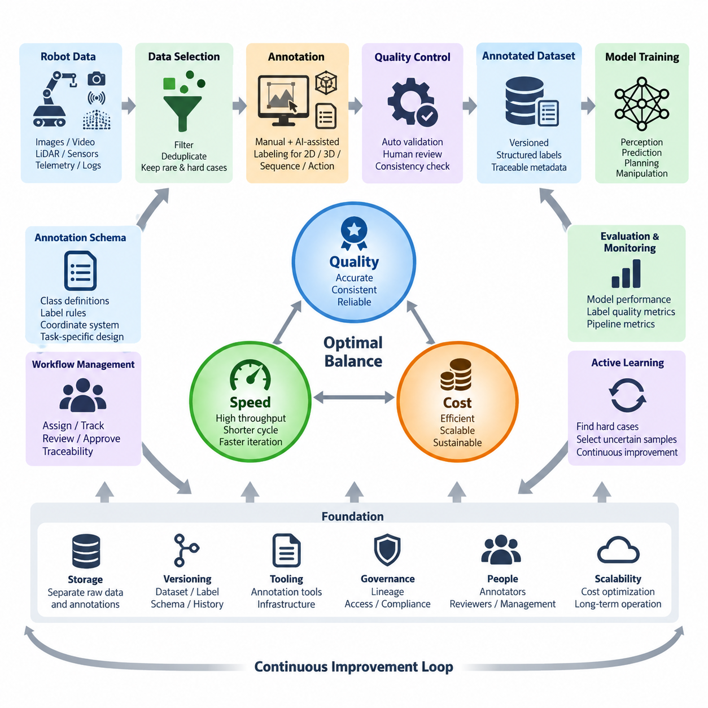
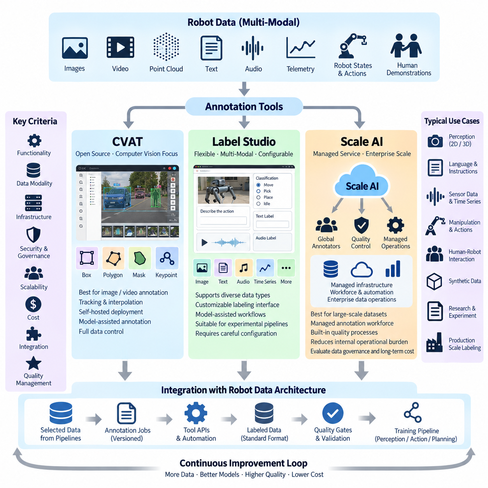
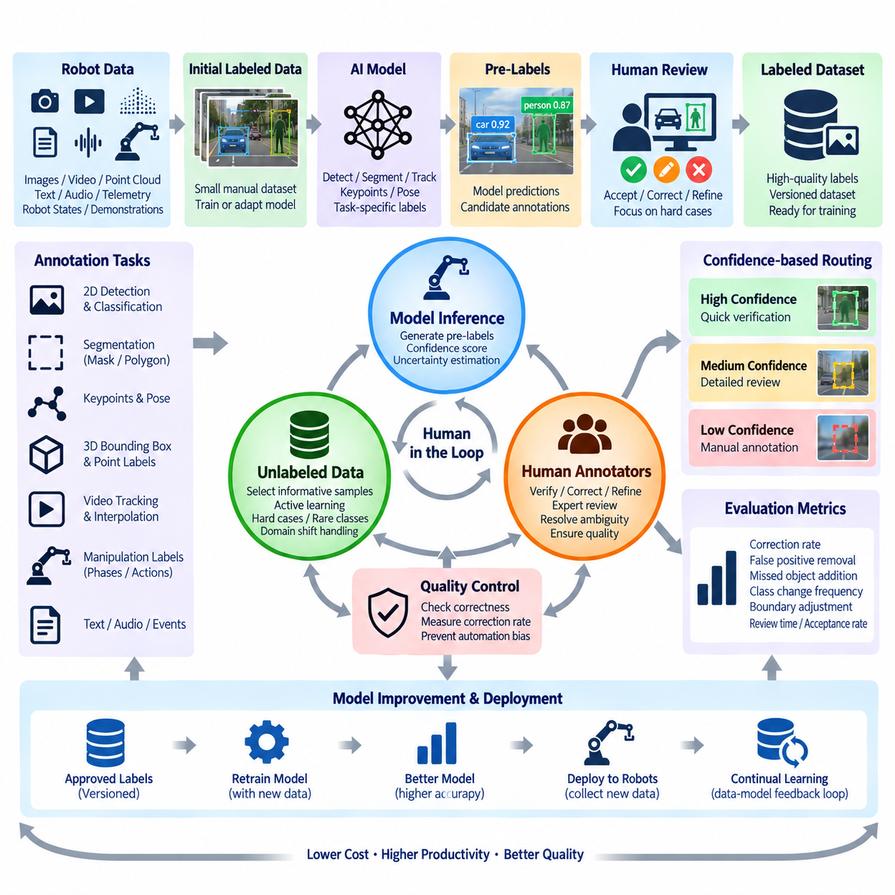
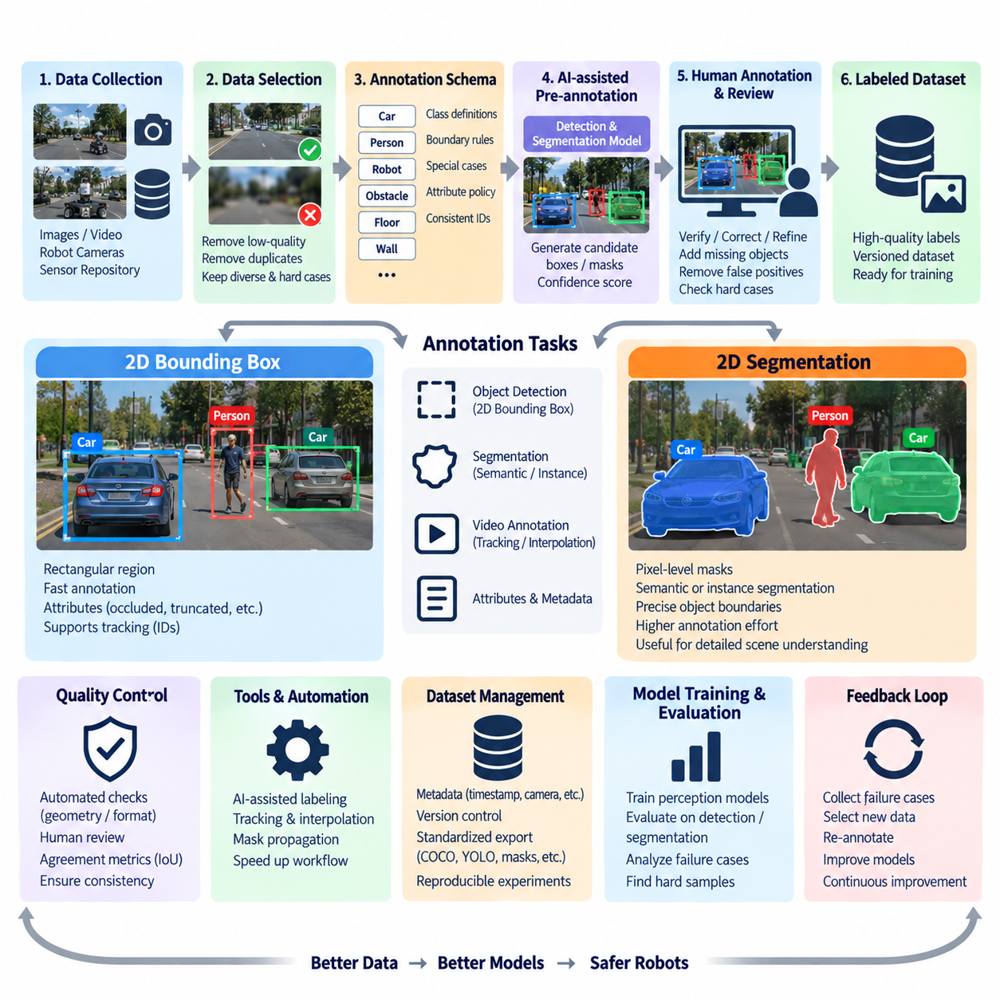
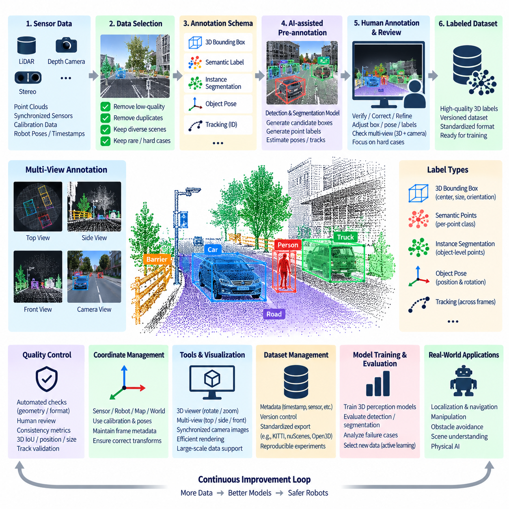
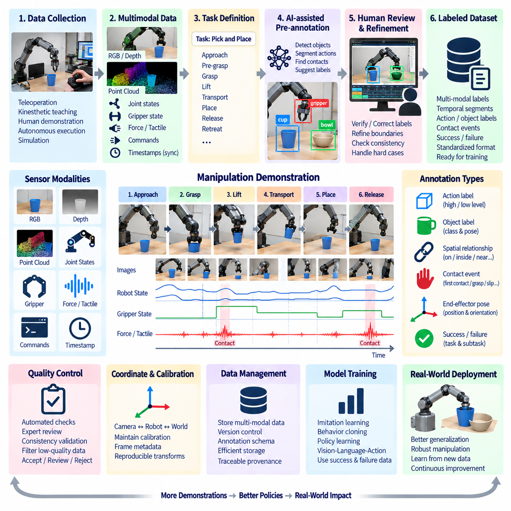
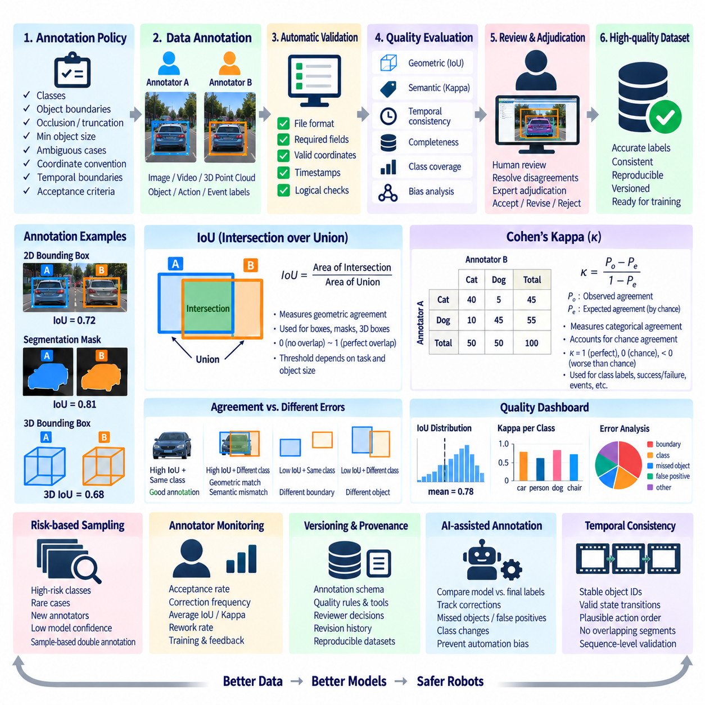
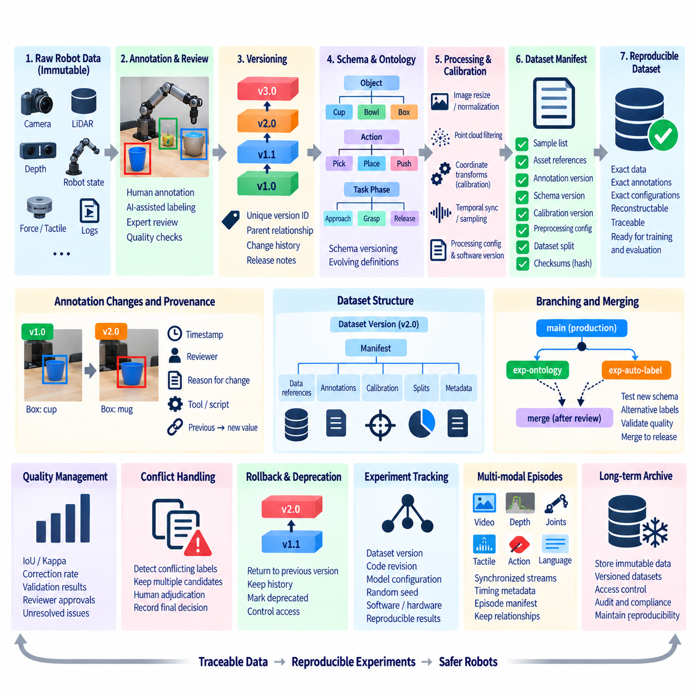
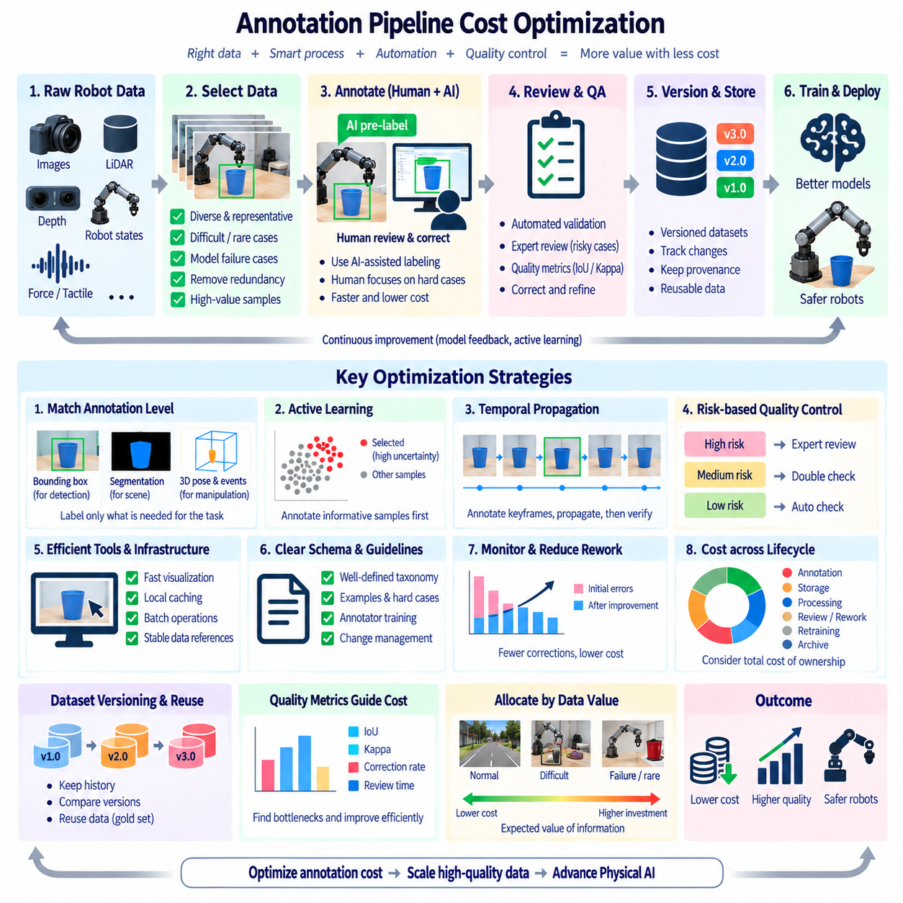
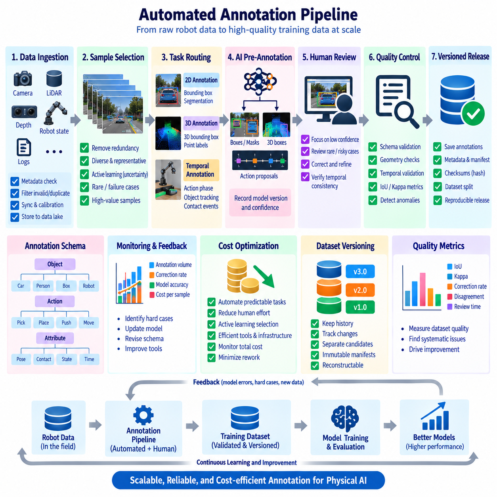

**Volume 07 Robot Data Architecture**

# 10. Data Annotation Pipeline

## 10.01 Annotation Pipeline Design: Quality, Speed, Cost

{width="7.268055555555556in" height="7.268055555555556in"}

주석 파이프라인(Annotation Pipeline)은 원시 로봇 데이터(Raw Robot Data)를 인식(Perception), 예측(Prediction), 계획(Planning), 조작(Manipulation), 피지컬 AI(Physical AI) 학습에 안정적으로 사용할 수 있는 구조화된 지도 데이터(Structured Supervision)로 변환한다. 로봇 데이터 아키텍처(Robot Data Architecture)에서 주석은 독립적인 수작업 라벨링(Manual Labeling) 활동으로 취급해서는 안 된다. 센서 수집(Sensor Collection), 데이터셋 선택(Dataset Selection), 작업 정의(Task Definition), 라벨링(Labeling), 검증(Validation), 버전 관리(Versioning), 저장(Storage), 후속 모델 학습(Downstream Model Training)을 연결하는 공학적 데이터 파이프라인(Data Pipeline)으로 설계해야 한다.

핵심적인 설계 과제는 주석 품질(Annotation Quality), 처리 속도(Processing Speed), 운영 비용(Operational Cost) 사이의 균형을 확보하는 것이다. 이러한 목표들은 서로 독립적이지 않고 지속적으로 영향을 주고받는다. 검토 깊이(Review Depth)를 높이면 라벨 정확도(Label Accuracy)는 향상될 수 있지만 처리량(Throughput)이 감소하고 인건비가 증가한다. 반대로 속도를 극대화하면 모델 개발 주기(Model Development Cycle)를 단축할 수 있지만 일관성이 떨어지거나 불완전한 라벨이 생성될 가능성이 커진다. 따라서 실용적인 파이프라인은 각 데이터셋과 주석 작업에 대해 측정 가능한 승인 기준(Acceptance Criteria)을 정의해야 한다.

파이프라인 설계는 목표로 하는 머신러닝 작업(Machine Learning Task)에서 시작한다. 객체 탐지(Object Detection)는 클래스 라벨(Class Label)과 경계 상자(Bounding Box)가 필요할 수 있고, 의미론적 분할(Semantic Segmentation)은 픽셀 단위 영역(Pixel-level Region)을 요구한다. 3차원 인식(3D Perception)은 포인트 단위 클래스(Point-level Class), 3D 직육면체(Cuboid), 추적 정보(Track), 객체 자세(Object Pose) 등이 필요할 수 있다. 조작 데이터셋(Manipulation Dataset)에는 로봇 상태(Robot State), 행동(Action), 궤적(Trajectory), 접촉 이벤트(Contact Event), 시연(Demonstration), 작업 결과(Task Outcome)가 추가될 수 있다. 따라서 주석 스키마(Annotation Schema)는 모든 센서 데이터셋에 일률적으로 적용하기보다 모델의 목표에 따라 정의해야 한다.

원시 데이터(Raw Data)는 비용이 많이 드는 주석 작업을 시작하기 전에 선택 단계(Selection Stage)를 거쳐야 한다. 로봇 플릿(Robot Fleet)은 RGB 이미지, 깊이 맵(Depth Map), 라이다 포인트 클라우드(LiDAR Point Cloud), 비디오(Video), 텔레메트리(Telemetry), 동기화된 멀티모달 시퀀스(Synchronized Multimodal Sequence)를 대규모로 생성하지만 상당한 부분은 반복적일 수 있다. 데이터셋 필터링(Dataset Filtering)을 통해 손상된 샘플, 장시간 정지 구간, 중복 장면, 사용할 수 없는 센서 프레임, 관련성이 낮은 운용 구간을 제거하면서 희귀 이벤트(Rare Event)와 어려운 환경 조건을 보존해야 한다.

견고한 워크플로(Workflow)는 주석 작업을 후보(Candidate), 할당(Assigned), 진행 중(In Progress), 완료(Completed), 검토(Reviewed), 승인(Accepted), 거부(Rejected)와 같은 명확한 상태로 구분한다. 각각의 상태 전환(State Transition)은 추적 가능해야 하며, 이를 통해 운영자는 누가 라벨을 생성했는지, 어떤 주석 사양(Annotation Specification)이 적용되었는지, 어떤 도구 버전(Tool Version)이 사용되었는지, 해당 샘플이 품질 관리(Quality Control)를 통과했는지를 확인할 수 있다. 이러한 워크플로는 라벨링을 비공식 작업에서 처리량과 실패 지점을 관찰할 수 있는 재현 가능한 생산 프로세스(Reproducible Production Process)로 전환한다.

품질(Quality)은 명확한 주석 사양(Annotation Specification)에서 시작된다. 클래스 정의(Class Definition), 객체 경계(Object Boundary), 가림 규칙(Occlusion Rule), 잘림 규칙(Truncation Rule), 최소 객체 크기(Minimum Object Size), 모호한 사례(Ambiguous Case), 좌표 규칙(Coordinate Convention), 시간적 연관 정책(Temporal Association Policy)을 대규모 생산 전에 문서화해야 한다. 이러한 규칙이 없다면 숙련된 두 명의 주석 작업자(Annotator)도 동일한 로봇 장면을 서로 다르게 해석할 수 있다. 이러한 불일치는 라벨 노이즈(Label Noise)가 되며, 수집된 데이터의 양과 관계없이 모델 정확도의 한계 요인이 될 수 있다.

품질 관리(Quality Control)는 자동 검증(Automated Validation)과 사람의 검토(Human Review)를 결합해야 한다. 자동화된 검사는 잘못된 좌표, 필수 필드 누락, 허용되지 않는 클래스 값, 비정상적인 폴리곤(Polygon), 중복 식별자(Duplicate Identifier), 일관되지 않은 타임스탬프(Timestamp), 이미지 경계를 벗어난 주석 등을 탐지할 수 있다. 사람 검토자는 의미론적 모호성(Semantic Ambiguity), 잘못된 객체 해석, 복잡한 가림 현상, 미묘한 장면 관계를 판단하는 데 더 적합하다. 두 메커니즘을 결합하면 어느 한쪽만 사용하는 것보다 강력한 품질 관리 체계를 구축할 수 있다.

주석 속도(Annotation Speed)는 작업 중 어느 정도를 수작업으로 수행하는지에 크게 좌우된다. 완전 수동 라벨링(Fully Manual Labeling)은 높은 유연성을 제공하지만 대규모 로봇 데이터셋, 특히 비디오, 분할(Segmentation), 3D 포인트 클라우드(Point Cloud)에서는 비효율적이다. AI 지원 라벨링(AI-assisted Labeling)은 초기 경계 상자, 마스크(Mask), 클래스, 추적 정보, 3D 후보(3D Proposal)를 자동으로 생성하고 주석 작업자가 이를 검증하고 수정하도록 할 수 있다. 모델이 개선될수록 파이프라인은 사람의 역할을 직접 라벨 생성에서 불확실하거나 어려운 예측을 검토하는 방향으로 점진적으로 전환할 수 있다.

사전 주석(Pre-annotation)을 자동 생성된 정답 데이터(Ground Truth)로 간주해서는 안 된다. 모델이 생성한 라벨은 희귀 클래스(Rare Class), 비정상적인 시점(Unusual Viewpoint), 열악한 조명(Poor Illumination), 혼잡한 환경, 기존에 관찰하지 못한 객체에서 발생하는 체계적인 오류를 포함하여 해당 모델의 장점과 약점을 그대로 계승한다. 신뢰도 임계값(Confidence Threshold)과 불확실성 지표(Uncertainty Indicator)를 사용하면 쉬운 샘플은 빠른 검증으로 전달하고 모호한 샘플은 숙련된 검토자에게 전달할 수 있다. 이를 통해 사람의 작업을 가장 가치가 높은 데이터에 집중할 수 있다.

비용(Cost)은 라벨링된 이미지나 프레임당 가격만으로 측정해서는 안 된다. 실제 주석 비용(Annotation Cost)에는 데이터 준비(Data Preparation), 도구 인프라(Tool Infrastructure), 저장 공간(Storage), 주석 작업 시간, 검토 시간, 재작업(Rework), 프로젝트 관리(Project Management), 품질 감사(Quality Audit), 불명확한 사양으로 발생하는 지연이 모두 포함된다. 저렴한 라벨링 프로세스라도 부정확한 라벨을 반복적으로 수정하거나 성능이 낮은 모델로 인해 추가적인 데이터 수집과 재학습(Retraining)이 필요해지면 전체 비용은 오히려 증가한다. 따라서 비용 최적화(Cost Optimization)는 전체 생명주기(Lifecycle)를 고려해야 한다.

주석 작업에 따라 요구되는 품질 수준(Quality Level)도 달라야 한다. 안전 중요 보행자 탐지(Safety-critical Pedestrian Detection), 장애물 인식(Obstacle Perception), 조작 접촉 상태(Manipulation Contact State), 자율주행 경계(Autonomous Navigation Boundary)는 초기 탐색 실험용 데이터셋보다 엄격한 검토가 필요할 수 있다. 계층형 품질 정책(Tiered Quality Policy)을 적용하면 위험도 또는 가치가 높은 샘플에는 강력한 검증을 적용하고 낮은 위험도의 데이터에는 상대적으로 가벼운 검증을 적용할 수 있다. 이를 통해 중요도가 서로 다른 데이터에 동일한 주석 비용을 투입하는 비효율을 방지할 수 있다.

처리량(Throughput)은 시간당 완료 샘플 수, 샘플당 주석 시간, 검토 시간, 거부율(Rejection Rate), 재작업률(Rework Rate), 백로그 크기(Backlog Size), 데이터 수집에서 학습 준비 완료까지의 종단 간 지연(End-to-end Latency)과 같은 운영 지표(Operational Metric)를 이용해 모니터링해야 한다. 품질 지표(Quality Metric)도 동시에 추적해야 한다. 거부와 수정 비율이 증가한다면 높은 처리량은 의미가 없으며, 지나치게 높은 라벨 정밀도(Label Precision)를 추구하여 주석 지연이 모델 반복 개발(Model Iteration)을 방해한다면 경제적으로 비효율적일 수 있다.

파이프라인은 능동 학습(Active Learning)과 오류 기반 데이터 선택(Error-driven Data Selection)도 지원해야 한다. 사용 가능한 모든 샘플을 동일하게 라벨링하는 대신 학습 시스템이 불확실한 예측, 모델 실패(Model Failure), 희귀 클래스, 도메인 변화(Domain Shift), 운용 엣지 케이스(Operational Edge Case)를 식별할 수 있다. 이러한 샘플에 더 높은 주석 우선순위를 부여하고 이후 다시 학습 과정에 투입할 수 있다. 이에 따라 주석은 모델 성능이 다음에 어떤 로봇 데이터를 라벨링해야 하는지를 결정하는 폐쇄형 학습 루프(Closed Learning Loop)의 일부가 된다.

멀티모달 로보틱스(Multimodal Robotics)는 추가적인 동기화 요구사항(Synchronization Requirement)을 가진다. RGB, 깊이(Depth), 라이다(LiDAR), 레이더(Radar), 관성측정장치(IMU), 로봇 자세(Robot Pose), 관절 상태(Joint State), 제어 데이터(Control Data)는 서로 다른 관점과 샘플링 주기로 동일한 물리적 이벤트를 표현할 수 있다. 주석 메타데이터(Annotation Metadata)는 타임스탬프, 센서 식별자(Sensor Identity), 보정 버전(Calibration Version), 좌표 프레임(Coordinate Frame), 시퀀스 관계(Sequence Relationship)를 보존해야 한다. 이러한 연관성이 손실되면 개별 라벨이 정확하더라도 센서 융합(Sensor Fusion), 3D 인식, 체화 학습(Embodied Learning)에 사용할 수 없게 될 수 있다.

데이터셋 및 주석 버전 관리(Dataset and Annotation Versioning)는 라벨이 지속적으로 변화하기 때문에 필수적이다. 클래스 분류 체계(Class Taxonomy)가 변경되거나 잘못된 주석이 수정되고 새로운 객체 속성이 추가되며 주석 지침이 개선될 수 있다. 따라서 각 학습 실행(Training Run)은 특정 원시 데이터셋 버전(Raw Dataset Version), 주석 스키마 버전(Annotation Schema Version), 라벨 버전(Label Version), 변환 이력(Transformation History)까지 추적할 수 있어야 한다. 이를 통해 재현성(Reproducibility)을 확보하고 정답 데이터의 조용한 변경이 모델 비교 결과를 무효화하는 문제를 방지할 수 있다.

확장 가능한 아키텍처(Scalable Architecture)는 가능한 경우 원시 센서 자산(Raw Sensor Asset)과 주석 메타데이터를 분리해야 한다. 대용량 이미지, 비디오, 포인트 클라우드는 객체 저장소(Object Storage) 또는 데이터셋 저장소(Dataset Repository)에 유지하고, 주석 레코드(Annotation Record)는 안정적인 자산 식별자(Asset Identifier)를 참조하면서 라벨, 작업 메타데이터, 워크플로 상태, 데이터 출처 정보(Provenance)를 포함하도록 구성할 수 있다. 이러한 분리는 불필요한 데이터 복제를 줄이고 동일한 물리 데이터를 여러 주석 프로젝트, 스키마, 모델 세대(Model Generation), 실험 목적에 재사용할 수 있도록 한다.

품질-속도-비용(Quality-Speed-Cost)의 균형은 궁극적으로 전체 시스템 수준(System Level)에서 최적화해야 한다. 고품질 라벨은 모델을 개선하거나 운영 위험(Operational Risk)을 줄일 때 가치가 있고, 속도는 데이터에서 모델로 이어지는 피드백 주기(Data-to-model Feedback Cycle)를 단축할 때 가치가 있으며, 비용 효율성(Cost Efficiency)은 지속 가능한 확장을 가능하게 할 때 의미가 있다. 어느 하나도 독립적으로 극대화해서는 안 된다. 적절한 운영 지점(Operating Point)은 모델 성숙도(Model Maturity), 응용 위험도(Application Risk), 데이터셋 복잡성(Dataset Complexity), 자동화 수준, 배포 요구사항(Deployment Requirement)에 따라 결정된다.

로봇 및 피지컬 AI(Physical AI) 시스템에서 성숙한 주석 파이프라인은 지속적인 생산 루프(Continuous Production Loop)로 발전한다. 운용 로봇이 데이터를 생성하고, 선택 메커니즘(Selection Mechanism)이 가치 있는 샘플을 식별하며, 주석 시스템이 구조화된 지도 정보(Structured Supervision)를 생성하고, 품질 관리가 결과를 검증한 후 버전 관리된 데이터셋(Versioned Dataset)이 학습에 투입된다. 배포된 모델은 다시 약점과 엣지 케이스에 대한 새로운 증거를 생성한다. 이러한 루프는 데이터 운영(Data Operations)을 모델 개선과 직접 연결하며 이후의 주석 도구, 자동화, 품질 관리, 버전 제어, 비용 최적화 및 운영 사례를 위한 기반을 형성한다.

## 10.02 Annotation Tool Comparison: CVAT, LabelStudio, ScaleAI [w/Code]

{width="7.268055555555556in" height="7.268055555555556in"}

주석 도구(Annotation Tool)는 원시 이미지, 비디오, 포인트 클라우드(Point Cloud), 텍스트, 센서 시퀀스(Sensor Sequence), 로봇 시연(Robot Demonstration)을 구조화된 학습 라벨(Structured Training Label)로 변환하는 운영 환경을 제공한다. 주석 파이프라인(Annotation Pipeline)에서 도구 선택은 라벨링 생산성(Labeling Productivity), 품질 보증(Quality Assurance), 자동화(Automation), 협업(Collaboration), 인프라 통제(Infrastructure Control), 전체 운영 비용(Total Operating Cost)에 직접적인 영향을 준다. CVAT, Label Studio, Scale AI는 자체 관리형 오픈소스 플랫폼(Self-managed Open-source Platform)에서 관리형 엔터프라이즈 데이터 운영(Managed Enterprise Data Operations)에 이르는 서로 다른 접근 방식을 대표한다.

CVAT는 원래 컴퓨터 비전 주석(Computer Vision Annotation)을 위해 개발되었으며 특히 이미지와 비디오 라벨링 워크플로(Image and Video Labeling Workflow)에 적합하다. 인터페이스는 경계 상자(Bounding Box), 폴리곤(Polygon), 폴리라인(Polyline), 포인트(Point), 마스크(Mask), 키포인트(Keypoint), 태그(Tag), 객체 추적(Object Tracking)과 같은 일반적인 컴퓨터 비전 작업을 지원한다. 카메라 또는 녹화된 비디오로 인식 데이터셋(Perception Dataset)을 구축하는 로보틱스 팀에게 이러한 전문화는 객체 탐지(Object Detection), 분할(Segmentation), 추적(Tracking) 및 관련 비전 중심 주석 작업을 효율적으로 수행할 수 있는 환경을 제공한다.

CVAT의 주요 장점 중 하나는 자체 호스팅 데이터 인프라(Self-hosted Data Infrastructure)와의 높은 호환성이다. 조직은 자체 서버 또는 통제된 클라우드 환경(Controlled Cloud Environment)에 주석 환경을 배포하여 민감한 로봇 데이터에 대한 직접적인 통제 권한을 유지할 수 있다. 데이터셋에 공장 내부, 물류 시설, 사람, 독점 장비(Proprietary Equipment), 외부로 반출해서는 안 되는 운영 정보가 포함된 경우 특히 중요하다. 그러나 자체 호스팅(Self-hosting)은 배포, 업그레이드, 모니터링, 백업, 보안, 확장에 대한 책임을 운영 조직이 직접 부담해야 한다.

CVAT는 컴퓨터 비전 워크플로에 자동 및 반자동 주석(Automated and Semi-automated Annotation)을 결합할 수도 있다. 기존 모델이 후보 라벨(Candidate Label)을 생성하면 사람이 이를 검증하거나 수정하여 반복적인 수작업을 줄일 수 있다. 비디오 보간(Video Interpolation)과 추적 기능은 연속된 프레임에 동일한 객체가 나타날 때 특히 유용하다. 모든 프레임을 독립적으로 라벨링하는 대신 선택된 프레임에서 객체 상태를 정의하고 도구가 지원하는 전파(Propagation) 기능을 이용하여 시퀀스 주석(Sequence Annotation)을 가속할 수 있다.

Label Studio는 보다 광범위한 구성 중심 접근 방식(Configuration-oriented Approach)을 취한다. 전통적인 컴퓨터 비전에 주로 집중하기보다는 다양한 데이터 모달리티(Data Modality)와 사용자 정의 가능한 라벨링 인터페이스(Customizable Labeling Interface)를 지원한다. 프로젝트는 이미지, 텍스트, 오디오, 시계열 정보(Time-series Information), 기타 구조화된 주석 작업을 위해 구성할 수 있다. 로봇 학습 데이터셋은 독립적인 이미지뿐만 아니라 시각적 인식, 텔레메트리(Telemetry), 언어 명령(Language Instruction), 작업 상태(Task State), 행동(Action), 이벤트(Event), 사람의 시연(Human Demonstration)을 결합하는 경우가 많기 때문에 이러한 유연성이 유용하다.

Label Studio의 구성 가능한 특성은 특정 학습 문제의 의미 구조(Semantics)를 반영하는 라벨링 인터페이스를 정의할 수 있게 한다. 프로젝트에 따라 분류(Classification), 객체 영역(Object Region), 텍스트 범주(Text Category), 시퀀스 상태(Sequence State) 또는 여러 주석 개념을 결합한 형태가 필요할 수 있다. 이러한 유연성은 모델과 데이터셋 스키마(Dataset Schema)가 발전함에 따라 주석 요구사항도 변화하는 실험적 AI 파이프라인(Experimental AI Pipeline)에 적합하다. 반면 고도로 사용자 정의된 프로젝트는 신중한 구성과 더욱 강력한 주석 정의 거버넌스(Annotation Definition Governance)를 필요로 한다.

Label Studio는 모델 예측(Model Prediction)과 사람의 주석을 연결하여 머신러닝 지원 워크플로(Machine-learning-assisted Workflow)에 활용할 수 있다. 모델이 초기 예측을 제공하면 주석 작업자가 이를 승인, 수정 또는 거부할 수 있다. 이를 통해 머신 추론(Machine Inference)이 반복 작업을 줄이고 사람은 모호한 사례에 대한 책임을 유지하는 실용적인 휴먼 인 더 루프(Human-in-the-loop) 아키텍처를 구성할 수 있다. 이러한 통합은 소규모 수작업 시드 데이터셋(Seed Dataset)에서 점차 자동화된 생산 체계로 발전하는 주석 프로그램에 특히 유용하다.

Scale AI는 단순히 주석 소프트웨어를 제공하는 것보다 관리형 데이터 주석(Managed Data Annotation)과 엔터프라이즈 규모의 데이터 운영(Enterprise-scale Data Operations)을 강조한다는 점에서 다른 운영 모델을 가진다. 조직은 데이터셋과 주석 요구사항을 제공하면서 관리형 인프라, 작업 인력 프로세스(Workforce Process), 품질 관리, 자동화 기능을 활용할 수 있다. 이를 통해 주석 작업자 모집, 작업 대기열 관리(Queue Management), 주석 시스템 유지관리, 대규모 라벨링 프로그램 조정과 관련된 내부 운영 부담을 줄일 수 있다.

로보틱스 및 자율 시스템(Autonomous System) 프로젝트에서 데이터셋 규모가 빠르게 증가하거나 전문적인 라벨링 작업에 상당한 작업 인력이 필요한 경우 관리형 주석(Managed Annotation)이 유용할 수 있다. 대규모 이미지 컬렉션, 비디오 시퀀스, 센서 데이터셋, 복잡한 인식 작업은 내부 조직이 빠르게 처리하기 어려운 주석 백로그(Annotation Backlog)를 만들 수 있다. 관리형 서비스는 이러한 운영 문제의 일부를 외부 서비스 관계로 전환할 수 있지만 데이터 거버넌스(Data Governance), 계약상 통제(Contractual Control), 보안 요구사항, 장기 비용을 신중하게 평가해야 한다.

따라서 세 가지 접근 방식은 인프라 소유권(Infrastructure Ownership) 측면에서 상당한 차이를 가진다. CVAT는 컴퓨터 비전 중심의 자체 호스팅 환경에서 높은 통제력을 제공한다. Label Studio는 다양한 AI 데이터 유형을 대상으로 유연한 주석 구성을 제공하면서 통제된 인프라 전략에도 적용할 수 있다. Scale AI는 더 많은 책임을 관리형 플랫폼 및 서비스 모델(Managed Platform and Service Model)로 이전한다. 올바른 아키텍처 선택은 인터페이스 기능뿐만 아니라 조직이 주석 시스템을 직접 운영할 것인지 여부에 따라서도 결정된다.

데이터 모달리티(Data Modality)는 또 다른 중요한 선택 기준이다. 카메라 기반 로봇 인식 프로젝트는 이미지 및 비디오 주석 기능과 자연스럽게 연결되므로 CVAT가 특히 적합할 수 있다. 언어, 센서 상태, 분류 작업, 사용자 정의 인간-로봇 상호작용(Human-Robot Interaction) 데이터를 포함하는 멀티모달 프로젝트(Multimodal Project)는 Label Studio의 유연한 작업 구성에서 이점을 얻을 수 있다. 대규모 외부 주석 인력이 필요한 생산 프로그램은 내부 주석 운영이 병목(Bottleneck)이 되는 경우 Scale AI와 같은 관리형 접근 방식을 고려할 수 있다.

품질 관리(Quality Management)는 주석 편의성과 별도로 평가해야 한다. 라벨을 빠르게 생성할 수 있는 도구라고 해서 신뢰할 수 있는 정답 데이터(Ground Truth)가 자동으로 보장되는 것은 아니다. 생산 파이프라인에는 작업 할당 관리(Assignment Management), 검토 단계(Review Stage), 승인 기준(Acceptance Criteria), 주석 작업자 지침, 의견 불일치 해결(Disagreement Resolution), 자동 검증(Automated Validation), 감사 가능성(Auditability)이 필요하다. 플랫폼과 관계없이 누가 라벨을 생성하거나 수정했는지, 어떤 사양이 적용되었는지, 결과가 요구되는 품질 게이트(Quality Gate)를 통과했는지를 주석 아키텍처가 보존해야 한다.

더 넓은 로봇 데이터 아키텍처(Robot Data Architecture)와의 통합도 중요하다. 주석 시스템은 센서 데이터 및 AI 데이터 파이프라인에서 선택된 자산을 입력받고 후속 학습 시스템이 사용할 수 있는 통제된 스키마(Controlled Schema) 형태로 라벨을 반환해야 한다. 안정적인 데이터셋 식별자(Dataset Identifier), 타임스탬프(Timestamp), 시퀀스 관계(Sequence Relationship), 보정 메타데이터(Calibration Metadata), 좌표 프레임(Coordinate Frame), 주석 버전(Annotation Version)은 원본 센서 자산과 계속 연결되어야 한다. 따라서 주석 도구는 모든 학습 정보를 관리하는 유일한 저장소가 아니라 더 큰 데이터 생명주기(Data Lifecycle)를 구성하는 하나의 요소이다.

주석 데이터가 도구, 저장 시스템, 모델 학습 프레임워크(Model-training Framework), 평가 환경 사이를 이동할 때 내보내기 형식(Export Format)과 상호운용성(Interoperability)이 중요해진다. 컴퓨터 비전 파이프라인에서는 COCO, YOLO, VOC, 마스크, 추적 레코드 또는 프로젝트별 스키마를 기반으로 하는 형식을 사용할 수 있다. 로보틱스 응용에서는 동기화된 시퀀스, 3D 좌표, 행동, 궤적, 시간 이벤트를 위한 추가적인 변환이 필요할 수 있다. 지속 가능한 아키텍처는 장기 데이터셋이 특정 주석 인터페이스에 불필요하게 종속되지 않도록 변환 및 검증 계층(Conversion and Validation Layer)을 사용해야 한다.

자동화(Automation) 역시 도구 선택에 영향을 주어야 한다. 소규모 환경에서는 주석 작업자가 프로젝트를 수동으로 생성하고 데이터를 업로드한 후 라벨을 내보낼 수 있지만 데이터셋 규모가 커지면 이러한 절차는 비효율적이 된다. 생산 환경에서는 API, 프로그래밍 방식 작업 생성(Programmatic Task Creation), 자동 데이터 할당, 모델 생성 사전 라벨(Model-generated Pre-label), 검증 작업(Validation Job), 통제된 내보내기 기능이 유용하다. 궁극적으로 주석은 더 넓은 AI 데이터 파이프라인의 일부로 운영되어 새로운 후보 데이터셋이 최소한의 수동 관리만으로 라벨링에 투입되고 검증된 결과가 학습 단계로 이동할 수 있어야 한다.

비용 비교(Cost Comparison)는 라이선스 또는 구독 비용만 포함해서는 안 된다. 자체 호스팅 오픈소스 도구(Self-hosted Open-source Tool)는 소프트웨어 도입 비용을 줄일 수 있지만 엔지니어, 서버, 저장 공간, 보안 관리, 업그레이드, 내부 주석 운영이 필요하다. 관리형 플랫폼(Managed Platform)은 인프라와 인력 관리 부담을 줄일 수 있지만 데이터 규모와 주석 복잡성이 증가하면 상당한 서비스 비용이 발생할 수 있다. 따라서 의미 있는 비교 기준은 인프라, 인력, 엔지니어링, 품질 관리, 운영 관리를 모두 포함하는 총소유비용(Total Cost of Ownership)이다.

하이브리드 아키텍처(Hybrid Architecture)는 로봇 조직에서 실용적인 선택이 될 수 있다. 민감하거나 실험적인 데이터셋은 자체 호스팅된 CVAT 또는 Label Studio 환경에 유지하면서, 거버넌스 요구사항이 허용하는 경우 선택된 대용량 프로젝트에 관리형 주석 역량을 사용할 수 있다. AI 지원 사전 라벨링(AI-assisted Pre-labeling)을 적용하면 두 환경 모두에서 수작업량을 추가로 줄일 수 있다. 이러한 방식은 모든 데이터셋을 하나의 도구로 처리해야 하는 영구적인 선택으로 주석 플랫폼 결정을 제한하지 않는다.

피지컬 AI(Physical AI)에서 주석 요구사항은 점차 정적인 시각 객체를 넘어 확장되고 있다. 학습 데이터에는 로봇 행동(Robot Action), 조작 단계(Manipulation Phase), 접촉 상태(Contact State), 성공 및 실패 결과, 자연어 명령(Natural-language Instruction), 공간 관계(Spatial Relationship), 궤적(Trajectory), 동기화된 멀티모달 관측(Synchronized Multimodal Observation)이 포함될 수 있다. 따라서 주석 인프라는 현재의 인식 요구사항만이 아니라 확장성(Extensibility)을 기준으로 평가해야 한다. 선택된 시스템은 3D 포인트 클라우드, 시연, 시간적 시퀀스, 미래의 체화 학습(Embodied Learning) 데이터셋을 위한 전문 파이프라인과 공존할 수 있어야 한다.

따라서 CVAT, Label Studio, Scale AI는 완전히 상호 교환 가능한 제품이라기보다 전체 주석 아키텍처 안에서 서로 다른 구성 요소 또는 운영 전략으로 이해해야 한다. CVAT는 컴퓨터 비전 생산성(Computer-vision Productivity)과 인프라 통제에 중점을 두고, Label Studio는 구성 가능한 멀티모달 라벨링(Configurable Multimodal Labeling)에 중점을 두며, Scale AI는 생산 규모의 관리형 주석 운영(Managed Annotation Operations)에 중점을 둔다. 적절한 조합은 데이터 모달리티, 보안, 인력 전략, 자동화 성숙도(Automation Maturity), 처리량 요구사항, 생명주기 비용(Lifecycle Cost)에 따라 결정된다.

성숙한 로봇 주석 아키텍처는 이러한 차이를 공통 데이터셋 워크플로(Common Dataset Workflow) 뒤에서 추상화할 수 있다. 원시 자산은 거버넌스가 적용된 저장소(Governed Storage)에 유지되고, 주석 작업은 안정적인 데이터셋 버전을 참조하며, 선택된 도구가 사람 및 AI 지원 라벨링을 제공하고, 품질 게이트가 결과를 검증한 후 승인된 라벨이 버전 관리된 학습 데이터셋(Version-controlled Training Dataset)으로 반환된다. 이러한 접근 방식은 기반 로봇 데이터 아키텍처를 손상시키지 않으면서 주석 기술을 발전시킬 수 있게 하며, 이후 다루게 될 반자동 라벨링(Semi-automatic Labeling), 전문화된 2D 및 3D 주석, 품질 측정, 재현성(Reproducibility), 비용 최적화(Cost Optimization)를 위한 기반을 제공한다.

## 10.03 Semi-Auto Annotation: AI-Assisted Labeling [w/Code]

{width="7.268055555555556in" height="7.268055555555556in"}

반자동 주석(Semi-automatic Annotation)은 머신이 생성한 예측(Machine-generated Prediction)과 사람의 검증(Human Verification)을 결합하여 고품질 학습 데이터셋(High-quality Training Dataset)을 구축하는 데 필요한 노동량을 줄이는 방식이다. 주석 작업자가 빈 프레임에서 모든 라벨을 처음부터 생성하는 대신 AI 모델이 초기 주석(Initial Annotation)을 생성하고, 작업자는 이를 승인, 수정, 정제 또는 거부한다. 이를 통해 주석 작업은 반복적인 수동 생성에서 검증과 어려운 사례에 점차 집중하는 휴먼 인 더 루프(Human-in-the-loop) 프로세스로 전환된다.

기본 워크플로(Basic Workflow)는 초기 모델을 학습하거나 적응시키는 데 사용하는 소규모 수동 주석 데이터(Manually Annotated Data)에서 시작한다. 이 모델은 더 큰 규모의 미라벨링 로봇 데이터(Unlabeled Robot Data)를 처리하여 후보 경계 상자(Bounding Box), 마스크(Mask), 클래스(Class), 키포인트(Keypoint), 추적 정보(Track), 자세(Pose) 또는 작업별 라벨(Task-specific Label)을 생성한다. 이러한 예측은 사전 라벨(Pre-label)로 주석 환경에 입력되고, 사람이 정확성을 확인하고 수정한 후 학습 데이터로 승인된다.

AI 지원 라벨링(AI-assisted Labeling)은 모델이 일반적인 사례에서 이미 합리적인 수준의 성능을 보일 때 특히 효과적이다. 대부분의 객체가 정확하게 탐지된다면 주석 작업자는 경계를 조정하고, 잘못된 클래스를 변경하고, 누락된 객체를 추가하거나 오탐지(False Detection)를 제거하는 작업만 수행하면 된다. 따라서 샘플당 필요한 수작업을 크게 줄일 수 있다. 목표는 사람의 참여를 즉시 제거하는 것이 아니라 모델 추론(Model Inference)을 이용하여 가치가 낮은 반복 작업을 감소시키는 것이다.

신뢰도 점수(Confidence Score)는 워크플로를 제어하는 중요한 메커니즘을 제공한다. 신중하게 설정된 신뢰도 임계값(Confidence Threshold)보다 높은 예측은 빠른 검증으로 전달하고, 중간 수준의 신뢰도를 가진 결과는 보다 상세한 검토가 필요하도록 구성할 수 있다. 매우 불확실한 샘플은 완전 수동 주석(Full Manual Annotation) 또는 전문가 검토(Specialist Review)에 할당할 수 있다. 신뢰도 보정(Confidence Calibration)은 모델, 클래스, 환경, 운영 조건마다 다르므로 임계값을 보편적인 정확성 척도로 해석해서는 안 된다.

불확실성(Uncertainty)은 단일 신뢰도 값보다 더 광범위하게 활용할 수 있다. 여러 모델 사이의 불일치, 인접 비디오 프레임에서 불안정한 예측, 일관되지 않은 분할 경계(Segmentation Boundary), 비정상적인 특징 표현(Feature Representation), 작은 입력 변화에 따른 큰 예측 변화는 어려운 샘플을 나타낼 수 있다. 주석 파이프라인은 이러한 신호를 이용하여 사람의 검토 우선순위를 결정하고, 제한된 전문가 시간을 자동 라벨링 실패 가능성이 가장 높은 사례에 집중시킬 수 있다.

능동 학습(Active Learning)은 이러한 개념을 확장하여 어떤 미라벨링 샘플을 다음에 주석해야 하는지를 선택한다. 로봇 데이터를 균일하게 라벨링하는 대신 시스템은 불확실한 예측, 희귀 클래스(Rare Class), 새로운 환경, 모델 실패(Model Failure), 비정상적인 시점(Unusual Viewpoint), 운영 엣지 케이스(Operational Edge Case)처럼 높은 학습 가치를 제공할 것으로 예상되는 샘플을 식별한다. 주석이 완료된 샘플은 학습 데이터셋에 추가되어 다음 모델을 개선하며 반복적인 데이터-모델 피드백 루프(Data-model Feedback Loop)를 형성한다.

컴퓨터 비전(Computer Vision)은 반자동 주석의 대표적인 사례를 제공한다. 객체 탐지기(Object Detector)는 2D 경계 상자와 클래스 라벨을 제안할 수 있고, 분할 모델(Segmentation Model)은 초기 마스크를 생성할 수 있다. 자세 추정 시스템(Pose-estimation System)은 키포인트를 제안하고, 추적 알고리즘(Tracking Algorithm)은 비디오 시퀀스 전체에 객체 식별자를 전파할 수 있다. 사람은 모든 주석을 직접 생성하는 대신 위치 오류, 누락 객체, 식별자 전환(Identity Switch), 부정확한 마스크, 모호한 범주를 수정하는 데 집중한다.

비디오 주석(Video Annotation)은 시간적 연속성(Temporal Continuity)을 활용하여 추가적인 효율성을 얻을 수 있다. 객체는 일반적으로 인접한 프레임 사이에서 점진적으로 이동하기 때문에 한 프레임의 라벨을 이후 프레임으로 전파하거나 보간(Interpolation)할 수 있다. 탐지 및 추적 모델은 이러한 과정을 더 긴 시퀀스로 확장할 수 있다. 그러나 가림(Occlusion), 빠른 움직임, 카메라 이동, 객체의 등장과 이탈, 추적 실패가 발생하면 자동 전파된 오류가 누적될 수 있으므로 사람의 검토가 여전히 중요하다.

3차원 로봇 데이터(Three-dimensional Robot Data)는 추가적인 과제를 가진다. AI 모델은 라이다(LiDAR)와 깊이 정보(Depth Information)를 기반으로 3D 직육면체(3D Cuboid), 의미론적 포인트 라벨(Semantic Point Label), 객체 인스턴스(Object Instance), 자세(Pose)를 제안할 수 있지만 단일 시점에서 오류를 식별하기 어려울 수 있다. 주석 인터페이스는 필요에 따라 여러 카메라 시점, 투영된 센서 뷰(Projected Sensor View), 3D 시각화를 제공해야 한다. 기하학적으로 잘못된 라벨이 후속 센서 융합(Sensor Fusion)과 인식 학습을 손상시킬 수 있으므로 보정(Calibration)과 좌표 프레임(Coordinate Frame)의 일관성도 유지해야 한다.

로봇 조작 데이터(Robot Manipulation Data)는 AI 지원 라벨링을 더욱 광범위하게 해석할 필요가 있다. 모델은 시연(Demonstration)에서 조작 단계(Manipulation Phase), 파지 이벤트(Grasp Event), 접촉 상태(Contact State), 객체 상호작용(Object Interaction), 행동 경계(Action Boundary), 성공 또는 실패 결과, 관련 시간 구간(Temporal Segment)을 식별하는 데 도움을 줄 수 있다. 자동 제안은 긴 로봇 궤적을 검토하는 데 필요한 작업량을 크게 줄일 수 있지만 작업의 의미(Task Semantics)는 모델이 안정적으로 추론하기 어려울 수 있으므로 모호한 물리적 상호작용에서는 사람의 전문성이 중요하다.

사전 라벨링(Pre-labeling)의 효과는 도메인 유사성(Domain Similarity)에 크게 의존한다. 실외 자율주행 이미지로 학습한 모델은 창고 내부에서 성능이 저하될 수 있으며, 창고용 모델도 비정상적인 조명, 새로운 로봇 카메라, 서로 다른 렌즈 특성, 기존에 보지 못한 객체에서 실패할 수 있다. 따라서 주석 모델을 재사용할 때는 도메인 변화(Domain Shift)를 모니터링해야 한다. 품질이 낮은 사전 라벨은 작업자가 체계적인 오류를 먼저 발견하고 다시 수정해야 하므로 오히려 주석 시간을 증가시킬 수 있다.

자동화 편향(Automation Bias)도 중요한 위험 요소이다. AI 시스템이 그럴듯한 주석을 제시하면 사람 검토자가 원본 데이터를 충분히 확인하지 않고 이를 승인할 가능성이 있다. 그 결과 체계적인 모델 오류(Systematic Model Error)가 학습 데이터셋에 포함되고 이후의 학습 주기에서 다시 강화될 수 있다. 따라서 주석 인터페이스와 품질 절차는 특히 안전 중요 클래스(Safety-critical Class), 희귀 이벤트, 낮은 신뢰도 예측, 이전 모델이 실패하여 선택된 샘플에 대해 적극적인 검증(Active Verification)을 유도해야 한다.

품질 관리(Quality Control)는 AI가 생성한 제안과 사람이 최종 승인한 주석을 비교해야 한다. 수정률(Correction Rate), 오탐 제거율(False-positive Removal Rate), 누락 객체 추가율(Missed-object Addition Rate), 클래스 변경 빈도(Class-change Frequency), 경계 조정 크기(Boundary Adjustment Magnitude), 검토 시간(Review Time), 승인율(Acceptance Rate)을 측정하면 사전 라벨링이 실제로 워크플로를 개선하는지 판단할 수 있다. 이러한 측정은 주석 모델의 성능이 낮아 자동 제안을 중단하거나 더욱 강력한 검토를 적용해야 하는 클래스와 환경을 식별하는 데도 활용할 수 있다.

주석 모델(Annotation Model) 자체도 다른 생산 모델과 마찬가지로 버전 관리(Versioning)해야 한다. 생성된 각 사전 라벨은 모델 버전(Model Version), 추론 설정(Inference Configuration), 신뢰도 임계값, 주석 스키마(Annotation Schema), 원본 데이터셋(Source Dataset)까지 추적할 수 있어야 한다. 이러한 데이터 출처 정보(Provenance)가 없다면 데이터셋 릴리스 사이에서 주석 동작이 왜 달라졌는지 설명하기 어려울 수 있다. 버전 관리를 통해 동일한 데이터에서 각 모델이 얼마나 많은 사람의 수정을 필요로 하는지를 측정하여 주석 모델을 객관적으로 비교할 수도 있다.

반자동 파이프라인(Semi-automatic Pipeline)은 API와 예약 처리(Scheduled Processing)를 통한 통합에서 이점을 얻는다. 새롭게 선택된 데이터는 자동으로 사전 라벨링 서비스(Pre-labeling Service)에 입력되고, 예측 결과는 주석 작업으로 기록되며, 완료된 작업은 검증 단계를 통과하고 승인된 라벨은 버전 관리된 데이터셋으로 반환될 수 있다. 이러한 아키텍처는 불필요한 수동 파일 전송을 제거하고 주석을 독립적인 데스크톱 작업이 아니라 더 넓은 로봇 AI 데이터 파이프라인(Robot AI Data Pipeline)의 반복 가능한 구성 요소로 운영할 수 있게 한다.

자동화 수준이 향상되면서 사람의 역할(Human Role)도 변화한다. 초기 프로젝트에서는 주석 작업자가 대부분의 라벨을 직접 생성해야 하지만 성숙한 프로젝트에서는 머신이 생성한 주석을 검증하는 검토자(Reviewer)의 역할이 점차 중요해진다. 도메인 전문가(Domain Expert)는 복잡한 엣지 케이스, 온톨로지 결정(Ontology Decision), 의견 불일치 해결, 품질 감사(Quality Audit)에 집중할 수 있다. 이러한 전환은 생산성을 향상시킬 수 있지만 작업자에게 단순히 라벨을 생성하는 방법뿐만 아니라 모델 실패 패턴(Model Failure Pattern)을 이해하도록 교육해야 한다.

비용 최적화(Cost Optimization)는 단순한 추론 속도가 아니라 수정 작업까지 포함한 전체 주석 시간(Corrected Annotation Time)을 기준으로 평가해야 한다. AI 모델 실행에는 계산 비용(Computational Cost)이 발생하지만, 생성된 예측이 요구되는 품질을 유지하면서 전체 사람의 작업량을 감소시킬 때 경제적 가치가 있다. 수정하기 어려운 오류를 생성하는 복잡한 모델보다 보수적이고 예측 가능한 제안을 생성하는 단순한 모델이 더 유용할 수도 있다. 따라서 가장 적합한 주석 모델은 요구 품질 수준에서 검증된 라벨당 총비용(Total Validated-label Cost)을 최소화하는 모델이다.

피지컬 AI(Physical AI) 시스템에서 반자동 주석은 지속 학습(Continual Learning)의 일부가 될 수 있다. 배포된 로봇이 새로운 운영 데이터를 수집하고, 자동화 시스템이 유용하거나 문제가 있는 샘플을 식별하며, 주석 모델이 초기 라벨을 생성하고, 사람이 어려운 사례를 검증한 후 승인된 데이터가 다음 학습 주기에 투입된다. 새롭게 학습된 모델은 다시 배포되어 남아 있는 약점에 대한 새로운 증거를 생성하며, 현장 운영(Field Operation), 주석, 모델 개발, 평가를 지속적으로 연결한다.

성숙한 AI 지원 주석 아키텍처(AI-assisted Annotation Architecture)는 자동화를 단순한 수작업 대체가 아니라 모델과 사람 사이의 적응형 협업(Adaptive Collaboration)으로 취급한다. 모델은 반복적이고 예측 가능한 라벨링을 담당하고, 사람은 모호성을 해결하며 의미론적 품질(Semantic Quality)을 보호하고, 능동 학습은 어디에 사람의 관심을 집중할지를 결정하며, 품질 지표는 자동화가 실제로 효과적인지를 검증한다. 이러한 기반은 이후의 주석 섹션에서 다루는 전문화된 2D 및 3D 주석, 조작 데이터 주석, 품질 관리, 버전 관리, 비용 최적화 파이프라인으로 자연스럽게 확장된다.

## 10.04 2D BBox / Segmentation Annotation Pipeline [w/Code]

{width="7.268055555555556in" height="7.268055555555556in"}

2D 경계 상자 및 분할 주석 파이프라인(2D Bounding Box and Segmentation Annotation Pipeline)은 카메라 이미지와 비디오 프레임을 객체가 어디에 존재하는지, 그리고 어떤 픽셀이 해당 객체에 속하는지를 표현하는 공간 라벨(Spatial Label)로 변환한다. 경계 상자(Bounding Box)는 간결한 객체 위치 정보를 제공하고, 분할 마스크(Segmentation Mask)는 보다 정밀한 객체 또는 의미론적 경계를 표현한다. 로봇 인식(Robot Perception)에서 이러한 주석은 객체 탐지(Object Detection), 장면 이해(Scene Understanding), 장애물 인식(Obstacle Recognition), 조작 인식(Manipulation Perception), 내비게이션(Navigation) 및 기타 비전 기반 AI 모델을 지원한다.

파이프라인은 로봇 센서 저장소(Robot Sensor Repository)에서 선택된 이미지 및 비디오 데이터로 시작한다. 원시 카메라 스트림(Raw Camera Stream)에는 매우 반복적인 수백만 개의 프레임이 포함될 수 있으므로 무차별적인 라벨링으로 주석 작업을 시작해서는 안 된다. 데이터 선택(Data Selection)은 손상된 이미지, 흐릿한 프레임, 중복 데이터, 불필요한 정지 구간, 사용할 수 없는 노출 상태를 제거하는 동시에 다양한 환경, 희귀 객체, 어려운 조명, 가림(Occlusion), 비정상적인 시점, 모델 강건성(Model Robustness)을 향상시킬 수 있는 운영 엣지 케이스(Operational Edge Case)를 보존해야 한다.

라벨링을 시작하기 전에 주석 스키마(Annotation Schema)를 통해 모델에 필요한 클래스와 기하학적 표현(Geometric Representation)을 정의해야 한다. 각 클래스에는 어떤 대상을 객체로 간주하는지, 부분적으로 보이는 객체를 어떻게 처리하는지, 작은 객체를 언제 제외하는지, 모호한 범주를 어떻게 판단하는지를 설명하는 명확한 정의가 필요하다. 동일한 의미의 객체를 표현하는 경우 경계 상자와 분할 프로젝트는 일관된 클래스 식별자(Class Identifier)를 공유해야 하며, 이를 통해 서로 다른 인식 작업에서도 데이터셋의 상호운용성(Interoperability)을 유지할 수 있다.

2D 경계 상자(2D Bounding Box)는 일반적으로 객체를 포함하는 직사각형 영역을 나타내는 좌표로 표현한다. 데이터셋 형식에 따라 최소 및 최대 모서리 좌표(Minimum and Maximum Corner Coordinates)를 사용하거나 시작 좌표와 너비 및 높이를 조합하여 사용할 수 있다. 주석 지침은 상자가 보이는 픽셀에 밀착해야 하는지, 가려진 부분을 포함해야 하는지, 또는 객체의 전체 물리적 범위를 추정해야 하는지를 명확하게 규정해야 한다. 주석 작업자 간의 체계적인 차이가 탐지 모델 학습에서 노이즈가 될 수 있으므로 일관된 기하학적 규칙이 중요하다.

경계 상자 주석(Bounding-box Annotation)은 기하학적 표현이 단순하기 때문에 상대적으로 빠르게 수행할 수 있다. 주석 작업자는 객체를 식별하고 클래스를 지정한 다음 필요한 영역을 둘러싸는 직사각형을 생성한다. 가림(Occluded), 잘림(Truncated), 이동 중(Moving), 정지 상태(Stationary), 손상(Damaged), 불확실(Uncertain)과 같은 속성이 학습에 유용한 정보를 제공한다면 함께 추가할 수 있다. 로봇 데이터셋에서는 연속된 프레임에서 객체 식별자(Object Identifier)를 유지하여 탐지 주석을 추적 및 시간적 인식(Temporal Perception) 작업에도 활용할 수 있다.

분할(Segmentation)은 객체의 경계를 픽셀 수준(Pixel Level)에서 표현하여 더욱 정밀한 공간 지도 정보(Spatial Supervision)를 제공한다. 의미론적 분할(Semantic Segmentation)은 관련된 각 픽셀을 하나의 클래스에 할당하고, 인스턴스 분할(Instance Segmentation)은 동일한 클래스에 속하는 개별 객체를 서로 구분한다. 주석 환경에 따라 폴리곤(Polygon), 브러시 도구(Brush Tool), 윤곽선 추출(Contour Extraction), AI 지원 분할(AI-assisted Segmentation)을 사용하여 마스크를 생성할 수 있다. 분할은 일반적으로 경계 상자보다 많은 작업이 필요하지만 정밀한 장면 이해를 위한 풍부한 정보를 제공한다.

이동 로봇(Mobile Robot)의 경우 분할은 바닥, 벽, 문, 선반, 사람, 차량, 장애물, 식생(Vegetation), 주행 가능 영역(Traversable Area) 및 기타 환경 영역을 표현할 수 있다. 조작 시스템(Manipulation System)에서는 파지하거나 복잡한 배경으로부터 분리해야 하는 객체에 대해 정밀한 마스크가 필요할 수 있다. 분할은 대략적인 위치뿐만 아니라 형상(Shape)을 표현하므로 후속 모델이 자유 공간(Free Space), 경계, 접촉 영역(Contact Region), 객체 기하학(Object Geometry), 중첩 객체(Overlapping Object)를 판단해야 하는 경우 유용하다.

주석 사양(Annotation Specification)은 경계 처리 방식(Boundary Behavior)을 명확하게 정의해야 한다. 그림자, 반사, 투명 표면, 모션 블러(Motion Blur), 객체 내부의 구멍, 얇은 구조물, 부분적으로 가려진 영역은 명확한 정책이 없을 경우 일관되지 않은 마스크를 생성할 수 있다. 예를 들어 객체 내부에서 실제로 보이는 빈 공간을 배경으로 유지할 것인지, 심하게 가려진 영역을 추론하여 포함할 것인지 작업자가 판단할 수 있어야 한다. 이러한 결정은 임의적인 시각적 선호가 아니라 목표 모델 작업(Intended Model Task)을 기준으로 정의해야 한다.

AI 지원 주석(AI-assisted Annotation)은 경계 상자와 분할 워크플로 모두를 크게 가속할 수 있다. 객체 탐지기는 초기 경계 상자를 생성할 수 있고, 분할 모델은 탐지된 객체, 포인트, 프롬프트(Prompt), 기존 영역을 기반으로 마스크를 제안할 수 있다. 이후 사람이 예측 결과를 검증하고 수정한다. 모델 정확도가 충분히 높아지면 모든 라벨을 직접 그리는 작업에서 경계를 수정하고, 누락된 객체를 추가하며, 오탐(False Positive)을 제거하고, 잘못된 클래스를 해결하는 작업으로 주석 과정이 전환된다.

비디오 데이터셋(Video Dataset)은 인접 프레임 사이에 시간적 연관성(Temporal Relationship)이 있기 때문에 추가적인 자동화 기회를 제공한다. 경계 상자는 수동으로 선택된 키프레임(Keyframe) 사이에서 보간할 수 있으며, 추적 모델(Tracking Model)은 객체 식별자와 위치를 전파할 수 있다. 분할 마스크도 추적 또는 비디오 분할(Video Segmentation) 방법을 이용해 짧은 시퀀스에 걸쳐 전파할 수 있다. 이러한 기술은 반복 작업을 줄이지만 객체가 가려지거나 형태가 변하고 장면에서 사라지거나 다른 객체와 상호작용할 때 전파된 라벨을 반드시 검토해야 한다.

품질 검증(Quality Validation)은 자동화된 기하학적 검사(Automated Geometric Check)에서 시작해야 한다. 음수 크기를 가진 경계 상자, 이미지 경계를 벗어난 좌표, 누락된 클래스 식별자, 중복 레코드, 비정상적인 종횡비(Aspect Ratio)는 자동으로 탐지할 수 있다. 분할 마스크에서는 유효하지 않은 폴리곤, 빈 영역, 자기 교차(Self-intersection), 지원되지 않는 클래스 값, 일관되지 않은 이미지 크기를 검사할 수 있다. 자동 검증은 비용이 높은 사람의 검토 전에 단순한 구조적 오류를 제거한다.

사람의 품질 검토(Human Quality Review)는 의미론적 및 기하학적 정확성에 집중한다. 검토자는 필요한 모든 객체가 라벨링되었는지, 클래스가 정확한지, 경계 상자가 지정된 정책을 따르는지, 마스크가 객체 경계를 정확하게 표현하는지, 어려운 사례가 일관되게 처리되었는지를 확인한다. 성숙하고 안정적인 데이터셋에는 표본 기반 검토(Sampling-based Review)를 사용할 수 있지만 안전 중요 클래스(Safety-critical Class), 새롭게 추가된 범주, 경험이 부족한 주석 작업자, 어려운 환경에서는 더 강력하거나 전체적인 검증이 필요할 수 있다.

일치도 지표(Agreement Metric)를 사용하면 주석의 일관성을 정량화할 수 있다. 경계 상자는 두 개의 직사각형 영역 또는 예측과 기준 라벨 사이의 중첩 정도를 측정하는 교집합 대비 합집합(Intersection over Union, IoU)을 사용하여 비교할 수 있다. 분할 마스크에서도 IoU 또는 관련 픽셀 수준 중첩 지표(Pixel-level Overlap Metric)를 사용할 수 있다. 낮은 일치도가 반드시 주석 작업자의 부주의를 의미하는 것은 아니며, 모호한 주석 규칙, 불명확한 클래스 정의 또는 본질적으로 어려운 시각적 경계를 나타낼 수 있다.

주석 메타데이터(Annotation Metadata)는 원본 카메라 데이터와 계속 연결되어 있어야 한다. 각 라벨은 안정적인 이미지 또는 프레임 식별자를 참조하고 데이터셋 버전(Dataset Version), 카메라 식별자(Camera Identity), 타임스탬프(Timestamp), 시퀀스 식별자(Sequence Identifier), 주석 스키마, 도구 버전(Tool Version), 주석 작업자 또는 프로세스 식별 정보, 검토 상태(Review Status)를 보존해야 한다. 동기화된 로보틱스 데이터셋에서는 현재 작업이 2D 이미지만 사용하더라도 깊이, 라이다(LiDAR), 로봇 자세(Robot Pose), 보정(Calibration) 또는 다른 센서 레코드와의 연결을 유지해야 할 수 있다.

승인된 라벨은 하나의 주석 도구에 영구적으로 종속되지 않도록 표준화되거나 통제된 형식(Standardized or Controlled Format)을 통해 내보내야 한다. 객체 탐지 파이프라인은 일반적으로 클래스 식별자와 상자 좌표를 필요로 하며, 분할 파이프라인은 폴리곤, 마스크 또는 인코딩된 픽셀 영역(Encoded Pixel Region)을 필요로 한다. 변환 계층(Conversion Layer)은 표준 주석 표현(Canonical Annotation Representation)을 학습별 형식으로 변환할 수 있으며, 검증 과정은 클래스 매핑, 좌표, 이미지 크기, 식별자의 일관성을 보장해야 한다.

2D 라벨은 시간이 지나면서 변경되기 때문에 버전 관리(Version Control)가 필수적이다. 잘못된 경계 상자가 수정되고, 분할 경계가 정제되며, 클래스가 병합 또는 분리되고, 새로운 속성이 추가되거나 주석 정책이 변경될 수 있다. 따라서 학습 데이터셋은 변경되지 않거나 추적 가능한 주석 버전(Annotation Version)을 참조해야 한다. 모델 실험(Model Experiment)을 재현하려면 어떤 이미지, 주석 스키마, 라벨 수정본(Label Revision), 전처리 설정(Preprocessing Configuration), 학습-검증-시험 분할(Train-validation-test Split)이 사용되었는지를 정확하게 식별할 수 있어야 한다.

파이프라인은 모델 평가(Model Evaluation)를 다시 데이터 선택 과정과 연결해야 한다. 탐지 실패, 분할 오류, 희귀 클래스, 낮은 신뢰도 예측, 혼잡한 장면, 새로운 운영 환경을 배포된 로봇에서 수집하여 주석 우선순위를 높일 수 있다. 이러한 어려운 샘플은 라벨링 워크플로에 투입되고 사람 또는 AI 지원 주석을 받은 후 품질 관리를 통과하여 다시 학습 데이터셋으로 반환된다. 결과적으로 주석은 반복적인 인식 성능 개선 루프(Iterative Perception Improvement Loop)의 일부가 된다.

비용과 처리량(Cost and Throughput)은 경계 상자와 분할 사이에서 상당한 차이를 보인다. 경계 상자는 일반적으로 더 빠르게 생성할 수 있으며 대략적인 위치 정보만으로 충분한 지도 학습(Supervision)을 제공할 수 있는 경우 적합하다. 픽셀 단위의 정확한 분할은 더 많은 주석 작업이 필요하므로 상세한 기하학 정보가 의미 있는 모델 가치를 제공할 때 사용해야 한다. 데이터셋 아키텍처는 두 표현을 결합하여 저비용 경계 상자를 광범위하게 적용하고, 중요한 클래스, 어려운 장면 또는 정밀한 경계가 필요한 응용에는 상세한 마스크를 선택적으로 적용할 수 있다.

피지컬 AI(Physical AI)에서 2D 주석은 이미지가 획득된 물리적 맥락(Physical Context)과 계속 연결되어 있어야 한다. 카메라 프레임에 보이는 객체는 로봇 상호작용(Robot Interaction), 내비게이션 의사결정(Navigation Decision), 조작 대상(Manipulation Target), 안전 이벤트(Safety Event), 동기화된 3D 관측(Synchronized 3D Observation)과 연결될 수 있다. 이러한 관계를 보존하면 단순한 2D 라벨을 독립적인 컴퓨터 비전 주석으로만 사용하는 것이 아니라 멀티모달 및 체화 학습 데이터셋(Multimodal and Embodied-learning Dataset)의 일부로 활용할 수 있다.

성숙한 2D 주석 파이프라인(2D Annotation Pipeline)은 선택적 데이터 입력(Selective Data Ingestion), 명확한 스키마, 경계 상자 및 분할 라벨링, AI 지원 사전 주석(AI-assisted Pre-annotation), 시간적 전파(Temporal Propagation), 자동 검증, 사람 검토, 버전 관리, 표준화된 내보내기(Standardized Export), 모델 기반 피드백(Model-driven Feedback)을 통합한다. 이러한 아키텍처는 기하학적 정밀도(Geometric Precision), 주석 속도, 운영 비용 사이의 균형을 유지하면서 추적 가능하고 재현 가능한 시각 학습 데이터를 생성하며, 이어지는 3D 포인트 클라우드 주석 파이프라인(3D Point-cloud Annotation Pipeline)을 위한 자연스러운 기반을 제공한다.

## 10.05 3D Point Cloud Annotation Pipeline [w/Code]

{width="7.268055555555556in" height="7.268055555555556in"}

3D 포인트 클라우드 주석 파이프라인(3D Point Cloud Annotation Pipeline)은 공간 센서 측정값(Spatial Sensor Measurement)을 3차원 인식(Three-dimensional Perception)과 물리적 추론(Physical Reasoning)에 사용할 수 있는 구조화된 라벨(Structured Label)로 변환한다. 라이다(LiDAR), 깊이 카메라(Depth Camera), 스테레오 시스템(Stereo System), 재구성된 3D 장면(Reconstructed 3D Scene)은 이미지 평면을 넘어 객체와 환경의 기하학적 정보를 제공한다. 이러한 주석은 3D 객체 탐지(3D Object Detection), 의미론적 이해(Semantic Understanding), 위치 추정(Localization), 내비게이션(Navigation), 조작(Manipulation), 센서 융합(Sensor Fusion), 피지컬 AI(Physical AI) 학습을 지원한다.

2D 이미지와 달리 포인트 클라우드(Point Cloud)는 희소하고(Sparse), 불규칙하며(Irregular), 관측 시점에 의존한다(Viewpoint Dependent). 측정되는 포인트의 밀도는 거리, 표면 반사율(Surface Reflectivity), 센서 해상도, 가림(Occlusion), 스캐닝 기하학(Scanning Geometry)에 따라 달라진다. 가까운 객체는 수천 개의 포인트로 표현될 수 있지만 멀리 있는 객체는 소수의 포인트 집합으로만 나타날 수 있다. 따라서 주석 규칙은 모든 물리적 객체가 연속적인 표면으로 관측된다고 가정하기보다 불완전한 기하학(Incomplete Geometry)을 고려해야 한다.

파이프라인은 동기화되고 보정된 센서 데이터(Synchronized and Calibrated Sensor Data)에서 시작한다. 포인트 클라우드는 타임스탬프(Timestamp), 센서 식별자(Sensor Identity), 좌표 프레임(Coordinate Frame), 보정 파라미터(Calibration Parameter), 시퀀스 식별자(Sequence Identifier), 관련 카메라 이미지, 로봇 자세(Robot Pose), 기타 센서와의 관계를 유지해야 한다. 이러한 메타데이터는 3D 포인트를 카메라 영상에 투영하거나 라벨을 라이다, 로봇, 지도, 월드 좌표계(World Coordinate System) 사이에서 변환할 때 필수적이다.

비용이 높은 3D 라벨링을 시작하기 전에 데이터 선택(Data Selection)을 수행해야 한다. 로봇 플릿(Robot Fleet)은 방대한 포인트 클라우드 시퀀스를 생성할 수 있으며, 이 가운데 상당수는 거의 동일한 환경을 포함하거나 정보 가치가 낮은 장시간의 데이터를 포함할 수 있다. 선택 메커니즘은 중복 프레임과 손상된 측정값을 줄이는 동시에 다양한 장면, 동적 객체(Dynamic Object), 희귀 장애물, 복잡한 기하학, 비정상적인 지형, 근접 상호작용, 센서 성능 저하, 모델 실패 사례를 보존해야 한다.

3D 주석 스키마(3D Annotation Schema)는 후속 모델에 필요한 의미론적 클래스(Semantic Class)와 기하학적 라벨 유형(Geometric Label Type)을 정의한다. 일반적인 표현에는 3D 경계 상자(3D Bounding Box), 의미론적 포인트 라벨(Semantic Point Label), 인스턴스 분할(Instance Segmentation), 객체 자세(Object Pose), 추적 정보(Track), 장면 영역(Scene Region)이 포함된다. 로보틱스 데이터셋에서는 운영 영역에 따라 주행 가능 표면(Traversable Surface), 구조물, 조작 대상, 사람, 차량, 팔레트, 선반, 지형 클래스 또는 안전 구역(Safety Zone)을 추가로 식별할 수 있다.

3차원 경계 상자(3D Bounding Box)는 일반적으로 중심 위치(Center Position), 크기(Dimensions), 방향(Orientation)으로 표현한다. 2D 직사각형과 달리 여러 축을 따라 객체의 공간적 범위를 나타내야 하며 헤딩(Heading) 또는 회전(Rotation) 정보도 포함하는 경우가 많다. 주석 지침은 상자가 관측된 포인트와 어떻게 대응해야 하는지, 가려진 기하학을 추정할 것인지, 지면 접촉을 어떻게 처리할 것인지, 방향을 어떻게 정의할 것인지를 규정해야 한다. 작은 기하학적 오류도 위치 추정과 계획 모델에 직접 영향을 줄 수 있으므로 일관성이 중요하다.

의미론적 포인트 클라우드 주석(Semantic Point-cloud Annotation)은 개별 포인트 또는 포인트 그룹에 클래스 정보를 할당한다. 이를 통해 바닥, 벽, 식생, 차량, 사람, 장비, 장애물과 같은 표면을 세밀하게 구분할 수 있다. 인스턴스 수준 주석(Instance-level Annotation)은 동일한 클래스에 속하는 개별 객체를 추가로 구분한다. 포인트 수준 라벨(Point-level Label)은 풍부한 기하학 정보를 제공하지만 단순한 3D 경계 상자보다 생성 비용이 훨씬 높기 때문에 자동화(Automation)의 효과가 특히 크다.

신뢰할 수 있는 3D 라벨링을 위해서는 다중 시점 시각화(Multi-view Visualization)가 중요하다. 하나의 시점만으로는 특히 포인트 밀도가 낮거나 객체가 겹쳐 있는 경우 공간 관계를 이해하기 어렵다. 주석 환경은 상단, 측면, 정면, 자유롭게 회전 가능한 3D 뷰와 동기화된 카메라 이미지를 함께 제공할 수 있다. 포인트와 3D 경계 상자를 이미지 평면(Image Plane)에 투영하면 작업자가 시각적 질감과 색상 정보를 이용하여 기하학 정보만으로 판단하기 어려운 모호성을 해결할 수 있다.

카메라-라이다 융합(Camera-LiDAR Fusion)은 주석 생산성을 크게 향상시킬 수 있다. RGB 이미지에서 명확하게 보이는 2D 객체가 포인트 클라우드에서는 모호한 포인트 집합으로 나타날 수 있다. 보정 정보가 존재하면 이미지 탐지 결과, 분할 마스크(Segmentation Mask), 수동으로 선택한 영역을 3D 공간으로 투영하여 후보 포인트 라벨이나 공간 영역을 생성할 수 있다. 반대로 3D 주석을 카메라 이미지에 투영하여 기하학적 정렬을 검증하고 보정 또는 라벨링 오류를 식별할 수도 있다.

AI 지원 사전 주석(AI-assisted Pre-annotation)은 사람의 검토 전에 후보 3D 경계 상자, 의미론적 라벨, 객체 인스턴스(Object Instance), 자세(Pose)를 생성할 수 있다. 기존 인식 모델(Perception Model)이 입력 포인트 클라우드를 처리하여 주석 작업에 초기 결과를 제공하면 작업자는 모든 라벨을 처음부터 생성하는 대신 위치, 크기, 방향, 클래스, 포인트 소속(Point Membership)을 조정할 수 있다. 다만 체계적으로 잘못된 3D 제안은 수동 주석보다 수정에 더 많은 시간이 필요할 수 있으므로 효과는 모델 품질에 크게 의존한다.

시간 정보(Temporal Information)는 작업 효율성을 높이는 또 다른 중요한 요소이다. 이동 로봇과 자율 시스템은 포인트 클라우드를 독립적인 프레임이 아니라 연속적인 시퀀스로 수집한다. 객체가 한 번 식별되면 추적 알고리즘(Tracking Algorithm)을 통해 인접 프레임으로 객체 식별자와 대략적인 3D 위치를 전파할 수 있다. 작업자는 주요 키프레임(Keyframe)을 수정하고 중간 상태를 보간하여 반복적인 라벨링을 줄이면서 동작 예측(Motion Prediction)과 동적 장면 이해(Dynamic-scene Understanding)에 유용한 궤적을 보존할 수 있다.

좌표 프레임 관리(Coordinate-frame Management)는 파이프라인 전체에서 명확하게 수행해야 한다. 라벨은 처음에는 센서 프레임(Sensor Frame)에서 생성될 수 있지만 이후 로봇, 오도메트리(Odometry), 지도(Map), 월드 좌표(World Coordinate)에서 사용될 수 있다. 변환에는 각 타임스탬프에 대응하는 정확한 보정 및 자세 정보를 사용해야 한다. 시각적으로 올바르게 보이는 라벨도 잘못된 변환(Transform)과 연결되면 기하학적으로 유효하지 않을 수 있으므로 프레임 식별자와 변환 출처 정보(Transformation Provenance)를 주석 메타데이터에 유지해야 한다.

자동 검증(Automated Validation)을 통해 사람의 검토 전에 다양한 구조적 오류를 탐지할 수 있다. 시스템은 잘못된 크기, 불가능한 방향, 너무 적은 포인트를 포함하는 경계 상자, 중복 객체 식별자, 예상 공간 범위를 벗어난 라벨, 지원되지 않는 클래스, 누락된 타임스탬프, 일관되지 않은 좌표 프레임을 식별할 수 있다. 시간적 검증(Temporal Validation)은 인접 프레임 사이에서 갑작스러운 객체 위치 변화, 비현실적인 크기 변화 또는 객체 식별자의 불연속성을 탐지할 수 있다.

사람의 검토(Human Review)는 의미론적 정확성과 기하학적 정밀도(Geometric Accuracy)에 집중한다. 검토자는 클래스 할당, 객체의 공간 범위, 방향, 포인트 소속, 가림 처리, 추적 연속성(Track Continuity), 복잡한 경계 판단이 올바른지를 확인해야 한다. 사람, 차량, 위험 장애물, 제한 구역과 같이 안전과 관련된 객체에는 더욱 엄격한 검토 정책이 필요할 수 있다. 포인트 밀도가 낮아 판단하기 어려운 객체는 신뢰할 수 있는 결정을 위해 동기화된 카메라 뷰나 인접 프레임을 함께 검토해야 할 수도 있다.

품질 지표(Quality Metric)는 평가 대상 3D 주석의 유형을 반영해야 한다. 3차원 경계 상자는 3D 교집합 대비 합집합(3D Intersection over Union, 3D IoU), 중심 위치 오차(Center-position Error), 크기 오차(Dimension Error), 방향 차이(Orientation Difference)를 사용하여 비교할 수 있다. 의미론적 포인트 라벨은 클래스별 IoU와 포인트 일치도(Point Agreement)를 활용할 수 있으며, 추적 라벨에는 식별자 일관성(Identity Consistency)을 포함할 수 있다. 이러한 지표는 기하학적 부정확성과 의미론적 불일치를 구분하고 개선이 필요한 주석 지침을 식별하는 데 도움을 준다.

포인트 클라우드 주석은 많은 사람의 작업뿐만 아니라 상당한 계산 자원도 요구한다. 대규모 스캔은 수백만 개의 포인트를 포함할 수 있고 긴 시퀀스는 상당한 메모리, 저장 공간, 렌더링 성능, 네트워크 대역폭을 요구한다. 실용적인 파이프라인에서는 공간 분할(Spatial Partitioning), 세부 수준 시각화(Level-of-detail Visualization), 압축 표현(Compressed Representation), 선택적 프레임 로딩(Selective Frame Loading), 로컬 캐싱(Local Caching)을 사용할 수 있다. 시각화 성능이 사람의 생산성을 제한하는 병목이 되지 않도록 주석 인프라를 설계해야 한다.

승인된 주석은 원본 센서 자산과 해당 보정 상태(Calibration State)에 계속 연결되어야 한다. 각 라벨은 안정적인 데이터셋 및 프레임 식별자와 함께 주석 스키마 버전, 좌표계, 보정 버전, 도구 설정(Tool Configuration), 모델 생성 사전 라벨 버전(Model-generated Pre-label Version), 주석 작업자 또는 프로세스, 검토 상태를 참조해야 한다. 이러한 데이터 출처 정보(Provenance)는 재현 가능한 학습(Reproducible Training)과 데이터셋 릴리스 사이에서 발생하는 예상하지 못한 차이를 분석하는 데 필요하다.

내보내기 및 변환 계층(Export and Transformation Layer)은 표준 주석 표현(Canonical Annotation Representation)을 개별 학습 프레임워크와 분리해야 한다. 서로 다른 3D 인식 시스템은 서로 다른 경계 상자 규칙, 축 정의(Axis Definition), 회전 표현(Rotation Format), 포인트 라벨 인코딩(Point-label Encoding), 좌표 프레임을 요구할 수 있다. 통제된 변환(Controlled Conversion)을 사용하면 각 주석 프로젝트가 특정 모델 구현에 종속되는 것을 방지하고 동일한 검증된 공간 라벨을 여러 인식 및 로보틱스 파이프라인에서 사용할 수 있다.

비용 최적화(Cost Optimization)를 위해서는 주석 정밀도(Annotation Precision)를 모델 요구사항에 맞춰야 한다. 모든 포인트 클라우드에 완전한 포인트 수준 분할(Full Point-level Segmentation)이 필요한 것은 아니다. 대규모 데이터셋에서는 상대적으로 비용이 낮은 3D 경계 상자를 광범위한 객체 지도 학습에 사용하고, 중요한 환경이나 어려운 객체 또는 정밀한 기하학을 요구하는 모델에는 상세한 의미론적 또는 인스턴스 라벨을 선택적으로 사용할 수 있다. AI 지원 라벨링, 시간적 전파(Temporal Propagation), 능동 학습(Active Learning)을 활용하면 학습 가치가 높은 샘플에 비용이 높은 사람의 작업을 더욱 집중시킬 수 있다.

피지컬 AI(Physical AI)에서 3D 주석은 행동이 발생하는 공간의 기하학을 표현하기 때문에 일반적인 객체 탐지 이상의 가치를 가진다. 라벨링된 객체는 로봇 자세, 파지 궤적(Grasp Trajectory), 내비게이션 경로(Navigation Path), 접촉 이벤트(Contact Event), 작업 상태(Task State), 언어 명령(Language Instruction)과 연결될 수 있다. 이러한 관계를 유지하면 포인트 클라우드 데이터를 인식, 공간 추론(Spatial Reasoning), 물리적 행동(Physical Action)을 함께 학습하는 멀티모달 체화 데이터셋(Multimodal Embodied Dataset)에 활용할 수 있다.

성숙한 3D 포인트 클라우드 주석 파이프라인은 보정된 센서 데이터 입력(Calibrated Sensor Ingestion), 선택적 샘플링(Selective Sampling), 공간 스키마(Spatial Schema), 다중 시점 시각화, 카메라-라이다 융합, AI 지원 라벨링, 시간적 전파, 자동 검증, 사람 검토, 좌표 관리, 버전 관리, 표준화된 내보내기(Standardized Export)를 통합한다. 그 결과 기하학적 정확성, 주석 작업량, 계산 효율성, 비용 사이의 균형을 유지하는 추적 가능한 공간 지도 정보(Traceable Spatial Supervision)를 구축할 수 있으며, 이어지는 조작 시연 주석(Manipulation Demonstration Annotation)과 품질 관리 단계(Quality-management Stage)를 위한 데이터 아키텍처 기반을 제공한다.

## 10.06 Robot Manipulation Demo Data Annotation [w/Code]

{width="7.268055555555556in" height="7.268055555555556in"}

로봇 조작 시연 데이터(Robot Manipulation Demonstration Data)는 로봇 또는 사람 작업자가 시간의 흐름에 따라 물리적 작업을 수행하는 과정을 기록하고, 이러한 경험을 모방 학습(Imitation Learning), 행동 복제(Behavior Cloning), 정책 학습(Policy Learning), 피지컬 AI(Physical AI)를 위한 학습 데이터로 변환한다. 일반적인 이미지 주석과 달리 조작 주석(Manipulation Annotation)은 어떤 객체가 보이는지만 표현하는 것이 아니라 상호작용 과정에서 인식(Perception), 로봇 상태(Robot State), 행동(Action), 접촉(Contact), 작업 단계(Task Phase), 결과(Outcome)가 어떻게 변화하는지를 함께 기술해야 한다.

시연(Demonstration)은 원격 조작(Teleoperation), 직접 교시(Kinesthetic Teaching), 사람 동작 캡처(Human Motion Capture), 자율 로봇 실행(Autonomous Robot Execution), 시뮬레이션(Simulation), 수동 유도 조작(Manually Guided Manipulation) 등을 통해 생성할 수 있다. 각 기록은 RGB 및 깊이 이미지, 관절 위치(Joint Position), 관절 속도(Joint Velocity), 말단장치 자세(End-effector Pose), 그리퍼 상태(Gripper State), 힘-토크 측정(Force-torque Measurement), 촉각 신호(Tactile Signal), 명령(Command), 환경 상태(Environment State)를 결합할 수 있다. 주석은 행동이 해당 행동을 유발하거나 그 결과로 나타난 물리적 관측과 정확하게 연결되도록 이러한 모달리티 사이의 동기화를 유지해야 한다.

주석 파이프라인(Annotation Pipeline)은 조작 작업(Manipulation Task)과 그 의미론적 구조(Semantic Structure)를 정의하는 것에서 시작한다. 단순한 집기-놓기(Pick-and-place) 시연은 접근(Approach), 파지 전(Pre-grasp), 파지(Grasp), 들어 올리기(Lift), 이동(Transport), 배치(Place), 해제(Release), 후퇴(Retreat) 단계로 구성될 수 있다. 복잡한 작업에는 반복 행동, 조건 분기(Conditional Branch), 도구 사용(Tool Use), 양손 협응(Bimanual Coordination), 복구 행동(Recovery Behavior), 인간-로봇 상호작용(Human-Robot Interaction)이 포함될 수 있다. 대규모 주석을 시작하기 전에 작업 온톨로지(Task Ontology)를 정의하여 시연을 일관되게 해석할 수 있도록 해야 한다.

시간적 분할(Temporal Segmentation)은 가장 중요한 주석 작업 중 하나이다. 긴 시연을 기술(Skill), 하위 기술(Subskill), 행동(Action), 작업 상태(Task State)를 나타내는 의미 있는 시간 구간으로 나눈다. 정확한 경계는 학습 시스템이 하나의 행동이 언제 종료되고 다음 행동이 언제 시작되는지를 이해하는 데 도움을 준다. 경계는 타임스탬프(Timestamp), 프레임 인덱스(Frame Index), 로봇 상태 또는 탐지된 이벤트를 사용하여 정의할 수 있지만 전환 구간과 모호한 중간 동작을 어떻게 처리할지는 주석 정책에서 명확하게 규정해야 한다.

행동 라벨(Action Label)은 각 시간 구간에서 로봇이 무엇을 수행하고 있는지를 표현한다. 학습 목표에 따라 집기(Pick), 놓기(Place), 열기(Open), 삽입(Insert), 밀기(Push), 당기기(Pull), 전달(Handover)과 같은 상위 수준 행동을 표현하거나 객체에 접근하기, 그리퍼 닫기, 손목 회전, 목표 자세로 이동과 같은 하위 수준 기본 동작(Primitive)을 표현할 수 있다. 계층형 주석(Hierarchical Annotation)은 두 수준을 모두 보존하여 동일한 시연 데이터셋을 작업 계획(Task Planning)과 저수준 정책 학습(Low-level Policy Learning)에 활용할 수 있게 한다.

객체 중심 주석(Object-centric Annotation)은 행동을 시연에 포함된 물리적 객체와 연결한다. 파지 행동에는 대상 객체(Target Object), 관련 객체 자세(Object Pose), 그리퍼와 객체의 관계, 필요에 따라 목적 위치 또는 지지 표면(Supporting Surface)을 식별해야 한다. 위에 있음(On), 내부에 있음(Inside), 가까이 있음(Near), 정렬됨(Aligned With), 잡혀 있음(Held By), 삽입됨(Inserted Into)과 같은 공간 관계(Spatial Relationship)는 추가적인 의미 정보를 제공할 수 있다. 이러한 관계는 서로 다른 객체와 환경에서도 행동을 일반화해야 하는 모델에 중요한 정보를 제공한다.

접촉 이벤트(Contact Event)는 조작이 본질적으로 물리적 상호작용에 기반하기 때문에 매우 중요한 정보를 제공한다. 주석은 최초 접촉(First Contact), 안정적인 파지(Stable Grasp), 미끄러짐(Slip), 충돌(Collision), 해제(Release), 삽입 접촉(Insertion Contact), 지지 접촉(Support Contact), 예상하지 못한 충격(Unexpected Impact)을 식별할 수 있다. 힘-토크 및 촉각 신호를 활용하면 이러한 전환을 자동으로 탐지하는 데 도움을 받을 수 있다. 접촉 라벨을 시각적 관측과 로봇 상태에 연결하면 모델은 동작 패턴뿐만 아니라 행동의 물리적 결과도 학습할 수 있다.

그리퍼와 말단장치 상태(End-effector State)는 일관된 방식으로 표현해야 한다. 단순한 평행 그리퍼(Parallel Gripper)에서는 열림과 닫힘의 이진 라벨(Binary Label)만으로 충분할 수 있지만 정교한 로봇 손(Dexterous Hand)에서는 손가락 관절 구성(Finger Joint Configuration), 파지 유형(Grasp Type), 접촉 영역(Contact Region), 힘 정보가 필요할 수 있다. 말단장치 자세는 정의된 좌표 프레임(Coordinate Frame)을 기준으로 위치와 방향으로 저장할 수 있다. 동일한 수치의 자세라도 로봇, 객체 또는 월드 좌표를 기준으로 표현하는지에 따라 의미가 달라지므로 프레임 규칙(Frame Convention)을 명확하게 유지해야 한다.

성공 및 실패 주석(Success and Failure Annotation)은 실제 로봇 시연으로부터 학습하기 위해 필수적이다. 하나의 궤적(Trajectory)은 의도한 작업을 성공적으로 완료하거나, 부분적으로 성공하거나, 파지 과정에서 실패하거나, 환경과 충돌하거나, 객체를 떨어뜨리거나, 복구 작업이 필요할 수 있다. 따라서 적절한 경우 결과 라벨(Outcome Label)을 전체 시연 수준과 하위 작업(Subtask) 수준 모두에서 정의해야 한다. 실패 데이터는 모델이 어떤 상태와 행동을 피하거나 수정해야 하는지를 학습할 수 있다는 점에서 특히 가치가 있다.

복구 행동(Recovery Behavior)을 자동으로 노이즈로 간주하여 제거해서는 안 된다. 로봇이 파지에 실패한 후 다시 시도하거나, 잘못 배치된 객체의 위치를 조정하거나, 접촉 이후 궤적을 변경하는 경우 해당 시연에는 오류 인식(Error Recognition)과 교정 행동(Corrective Behavior)에 관한 정보가 포함된다. 주석을 통해 정상 실행(Nominal Execution)과 복구 구간(Recovery Segment)을 명시적으로 구분할 수 있다. 이러한 데이터는 통제된 실험실 환경을 벗어나 실제 환경에서 동작해야 하는 강건한 정책(Robust Policy)을 구축할수록 더욱 중요해진다.

모든 기록을 학습 데이터셋에 포함하기 전에 시연 품질(Demonstration Quality)을 평가해야 한다. 일부 시연에는 작업자의 망설임, 불필요한 동작, 센서 데이터 누락(Sensor Dropout), 보정 오류(Calibration Error), 안전하지 않은 행동 또는 불완전한 작업이 포함될 수 있다. 품질 메타데이터(Quality Metadata)를 사용하여 시연을 승인(Accepted), 검토 필요(Review Required), 거부(Rejected) 등으로 분류할 수 있다. 학습 전략에 따라 불완전한 시연도 영구적으로 폐기하지 않고 별도의 범주로 보존하여 활용할 수 있다.

AI 지원 주석(AI-assisted Annotation)은 긴 조작 시퀀스를 분할하는 데 필요한 작업량을 줄일 수 있다. 비전 모델(Vision Model)은 객체와 손을 탐지할 수 있고, 로봇 상태 신호는 그리퍼 전환(Gripper Transition)을 식별할 수 있으며, 힘 센서는 접촉 이벤트를 제안하고, 궤적 분석(Trajectory Analysis)은 정지 또는 움직임 변화를 탐지할 수 있다. 이러한 신호를 이용하여 후보 작업 경계(Candidate Task Boundary)와 행동 라벨을 생성하고 사람이 이를 검토하고 수정할 수 있다. 여러 모달리티가 동일한 이벤트에 대해 일관된 증거를 제공할 때 자동화의 효과가 가장 높아진다.

멀티모달 동기화(Multimodal Synchronization)는 조작 데이터셋에서 특히 중요하다. 접촉 장면을 보여주는 카메라 프레임은 정확한 로봇 자세, 그리퍼 상태, 힘 측정값, 행동 명령과 대응해야 한다. 빠른 조작에서는 작은 타임스탬프 오차도 관측과 행동의 관계를 왜곡할 수 있다. 따라서 주석 시스템은 원본 타임스탬프, 동기화 방식(Synchronization Method), 클록 도메인(Clock Domain), 전처리 과정에서 적용된 시간 보정(Temporal Correction)을 보존해야 한다.

좌표계(Coordinate System)와 보정 메타데이터(Calibration Metadata) 역시 주석과 계속 연결되어야 한다. 카메라 관측, 객체 자세, 말단장치 궤적, 힘 측정값은 서로 다른 프레임에서 생성될 수 있다. 카메라, 로봇 베이스(Robot Base), 도구(Tool), 객체(Object), 월드 프레임(World Frame) 사이의 변환은 저장된 보정 및 자세 정보를 이용하여 재현할 수 있어야 한다. 이를 통해 서로 다른 로봇이나 환경에서 학습하기에 적합한 공통 표현(Common Representation)으로 시연을 변환할 수 있다.

사람 시연(Human Demonstration)은 추가적인 표현상의 과제를 가진다. 사람의 손, 팔, 도구는 로봇 관절이나 그리퍼 명령과 직접적으로 대응하지 않는다. 따라서 모든 사람의 동작을 그대로 재현하려 하기보다 작업 의도(Task Intent), 손-객체 관계(Hand-object Relationship), 접촉 이벤트, 객체 궤적(Object Trajectory), 행동 단계를 주석으로 표현할 수 있다. 이후 리타게팅 시스템(Retargeting System)이 작업의 의미론적 구조를 유지하면서 관련 사람 행동을 로봇이 사용할 수 있는 표현으로 변환할 수 있다.

품질 관리(Quality Control)는 자동 일관성 검사(Automated Consistency Check)와 전문가 검토(Expert Review)를 결합해야 한다. 자동 시스템은 누락된 타임스탬프, 불가능한 관절 값, 불연속적인 궤적, 잘못된 객체 식별자, 일관되지 않은 작업 경계, 서로 모순되는 성공 라벨을 탐지할 수 있다. 사람 검토자는 행동 의미(Action Semantics), 객체 관계, 접촉 해석(Contact Interpretation), 작업 결과가 실제 발생한 상황을 정확하게 표현하는지 평가한다. 복잡한 물리적 상호작용은 동기화된 비디오와 로봇 상태를 함께 검토해야 하는 경우가 많다.

주석 출처 정보(Annotation Provenance)는 원본 시연, 주석 스키마(Annotation Schema), 주석 작업자 또는 자동화 프로세스, 사전 라벨링에 사용된 모델 버전(Model Version), 검토 상태(Review Status), 수정 이력(Revision History)을 식별할 수 있어야 한다. 라벨이 수정되거나 작업 온톨로지가 변경되더라도 이전 버전을 추적할 수 있어야 한다. 시간적 분할이나 행동 정의의 변경은 실제 학습 데이터의 의미를 크게 변화시킬 수 있으므로 재현 가능한 모방 학습(Reproducible Imitation Learning) 실험을 위해 이러한 관리가 필수적이다.

저장 아키텍처(Storage Architecture)는 대규모 센서 스트림과 구조화된 주석 레코드(Structured Annotation Record)를 분리하면서 안정적인 참조 관계를 유지해야 한다. 비디오, 깊이 데이터, 촉각 스트림, 고주파 로봇 상태(High-frequency Robot State)는 확장 가능한 저장소에 유지하고, 주석은 시간 구간, 이벤트, 행동, 객체, 관계, 결과를 기술하도록 구성할 수 있다. 이러한 설계는 불필요한 데이터 복제를 방지하고 하나의 시연을 여러 주석 스키마 또는 학습 목표에 재사용할 수 있게 한다.

대규모 데이터셋에서는 능동 학습(Active Learning)과 모델 기반 선택(Model-driven Selection)을 통해 어떤 시연에 추가 주석이 필요한지를 결정할 수 있다. 정책 실패(Policy Failure), 불확실한 행동 예측, 희귀한 객체 상호작용, 비정상적인 접촉 패턴, 새로운 작업 구성을 높은 우선순위로 지정할 수 있다. 이를 통해 배포되거나 평가된 조작 모델이 향후 라벨링과 재학습에 가장 가치 있는 시연을 식별하는 피드백 루프(Feedback Loop)를 형성할 수 있다.

조작 주석(Manipulation Annotation)은 점차 범용 로봇 정책(Generalist Robot Policy)과 비전-언어-행동 모델(Vision-Language-Action Model)을 지원하는 방향으로 확장되고 있다. 시연은 시각적 관측 및 로봇 행동을 작업 목표, 객체 참조, 단계 설명과 같은 자연어 명령(Natural-language Instruction)에 연결할 수 있다. 따라서 하나의 시퀀스는 동기화된 비전(Vision), 언어(Language), 고유수용감각(Proprioception), 행동(Action), 결과(Outcome) 정보를 포함할 수 있다. 이러한 모달리티에 일관된 주석을 적용하면 개별 시연을 재사용 가능한 체화 학습 에피소드(Embodied-learning Episode)로 변환할 수 있다.

성숙한 로봇 조작 시연 주석 파이프라인(Robot Manipulation Demonstration Annotation Pipeline)은 동기화된 멀티모달 기록(Synchronized Multimodal Recording), 작업 온톨로지, 시간적 분할, 행동 및 객체 라벨, 접촉 이벤트, 좌표 정보, 성공 및 실패 결과, AI 지원 사전 라벨링(AI-assisted Pre-labeling), 품질 검토, 버전 관리(Versioning), 재현 가능한 저장(Reproducible Storage)을 통합한다. 이를 통해 생성되는 데이터셋은 로봇이 무엇을 관측했는지만 기록하는 것이 아니라 무엇을 시도했고, 물리적 세계와 어떻게 상호작용했으며, 그 행동이 의도한 목표를 달성했는지까지 표현하여 체계적인 주석 품질 측정 및 관리(Annotation-quality Measurement and Management)를 위한 기반을 제공한다.

## 10.07 Annotation Quality Management: IOU / Kappa [w/Code]

{width="7.268055555555556in" height="7.268055555555556in"}

주석 품질 관리(Annotation Quality Management)는 로봇 및 피지컬 AI(Physical AI) 학습에 사용되는 라벨이 정확하고, 일관되며, 재현 가능하고, 의도된 학습 작업에 적합하도록 보장한다. 품질은 단순히 주석 파일이 문법적으로 유효한지만으로 판단할 수 없다. 전체 데이터셋에 걸쳐 기하학적 정밀도(Geometric Precision), 의미론적 정확성(Semantic Correctness), 주석 작업자 간 일치도(Inter-annotator Agreement), 완전성(Completeness), 시간적 일관성(Temporal Consistency), 주석 사양(Annotation Specification) 준수 여부를 함께 평가해야 한다.

품질 관리는 명확하게 정의된 주석 정책(Annotation Policy)에서 시작한다. 클래스(Class), 객체 경계(Object Boundary), 가림 처리(Occlusion Handling), 잘림 규칙(Truncation Rule), 최소 객체 크기(Minimum Object Size), 모호한 사례(Ambiguous Case), 좌표 규칙(Coordinate Convention), 시간적 경계(Temporal Boundary), 승인 기준(Acceptance Criteria)을 생산 작업 전에 문서화해야 한다. 공통된 사양이 없다면 주석 작업자 간 차이는 실제 오류가 아니라 서로 다른 해석에서 발생할 수 있으며, 이 경우 수치화된 품질 측정값을 정확하게 해석하기 어렵다.

주석 품질(Annotation Quality)은 여러 수준에서 평가할 수 있다. 구조적 품질(Structural Quality)은 파일, 식별자, 좌표, 타임스탬프(Timestamp), 필수 필드가 유효한지를 검증한다. 기하학적 품질(Geometric Quality)은 경계 상자(Box), 마스크(Mask), 포인트(Point), 자세(Pose)가 공간적 대상을 정확하게 표현하는지를 평가한다. 의미론적 품질(Semantic Quality)은 라벨이 클래스, 행동, 관계, 이벤트를 올바르게 기술하는지를 판단한다. 데이터셋 수준 품질(Dataset-level Quality)은 완전성, 일관성, 클래스 범위(Class Coverage), 체계적인 주석 편향(Annotation Bias)까지 추가로 평가한다.

교집합 대비 합집합(Intersection over Union, IoU)은 기하학적 일치도(Geometric Agreement)를 측정하는 데 가장 널리 사용되는 지표 중 하나이다. 두 주석이 서로 겹치는 영역을 두 주석 중 하나 이상이 차지하는 전체 영역과 비교한다. 개념적으로 IoU는 교집합 영역(Area of Intersection)을 합집합 영역(Area of Union)으로 나누어 계산한다. 1에 가까운 값은 높은 공간적 일치를 의미하며, 0에 가까운 값은 비교 대상 영역 사이에 중첩이 거의 없거나 전혀 없음을 의미한다.

2D 경계 상자(2D Bounding Box)의 경우 IoU를 사용하여 주석 작업자의 경계 상자와 기준 주석(Reference Annotation)을 비교하거나 두 작업자가 독립적으로 생성한 라벨을 비교할 수 있다. 높은 중첩은 두 주석이 대체로 동일한 객체 범위를 표현한다는 것을 의미한다. 낮은 IoU는 부정확한 위치 지정, 보이는 영역과 가려진 영역에 대한 서로 다른 해석 또는 일관되지 않은 경계 정책에서 발생할 수 있다. 허용 가능한 임계값은 보편적인 고정값으로 취급하기보다 객체 크기, 작업 요구사항, 주석 지침에 따라 결정해야 한다.

IoU는 분할 마스크(Segmentation Mask)에도 적용할 수 있다. 직사각형 영역을 비교하는 대신 관련 클래스 또는 객체에 할당된 픽셀을 기준으로 교집합과 합집합을 계산한다. 따라서 IoU는 의미론적 분할(Semantic Segmentation)과 인스턴스 분할(Instance Segmentation)의 품질 관리에도 유용하다. 경계에 민감한 객체, 얇은 구조물, 작은 객체, 불규칙한 형상은 시각적으로 유사한 주석이라도 낮은 IoU가 나타날 수 있으므로 품질을 해석할 때 각 클래스의 특성을 고려해야 한다.

3차원 주석(Three-dimensional Annotation)에서는 동일한 원리를 3D IoU로 확장할 수 있다. 두 개의 3D 경계 상자(3D Bounding Box)가 차지하는 결합 공간 부피에 대해 서로 겹치는 공간 부피의 비율을 비교한다. 이는 라이다(LiDAR)와 포인트 클라우드(Point Cloud) 주석을 평가하는 유용한 방법이지만 중심 위치 오차(Center-position Error), 방향 차이(Orientation Difference), 크기 오차(Dimension Error)와 같은 추가 지표가 필요할 수 있다. 하나의 중첩 값만으로 모든 형태의 3D 기하학적 불일치를 완전히 설명할 수는 없다.

IoU는 주로 공간적 일치도를 측정하므로 범주형 일치(Categorical Agreement)를 충분히 평가하지 못한다. 두 작업자가 완전히 동일한 경계 상자를 생성하더라도 서로 다른 클래스를 지정하면 기하학적 중첩은 완벽하지만 의미론적으로는 일치하지 않는다. 반대로 두 작업자가 객체가 보행자라는 점에는 동의하면서도 약간 다른 경계 상자를 생성할 수 있다. 따라서 주석 품질 시스템은 모든 오류를 하나의 지표로 결합하기보다 기하학적 일치와 클래스 일치를 분리하여 평가해야 한다.

코헨의 카파(Cohen\'s Kappa)는 우연히 발생할 수 있는 일치를 고려하면서 두 주석 작업자 사이의 범주형 일치도를 측정하는 방법이다. 이 지표는 관측된 일치도(Observed Agreement)를 우연에 의해 예상되는 일치도(Expected Chance Agreement)와 비교한다. 일반적으로 높은 카파(Kappa)는 우연 수준을 넘어서는 강한 일치를 의미하며, 0에 가까운 값은 관측된 일치가 무작위적으로 예상되는 수준과 비슷하다는 것을 의미한다. 음수 값은 예상되는 우연 수준보다 낮은 체계적인 불일치(Systematic Disagreement)를 나타낼 수 있다.

카파(Kappa)는 클래스 라벨(Class Label), 이진 결정(Binary Decision), 작업 상태(Task State), 품질 범주(Quality Category), 성공 및 실패 라벨(Success and Failure Label), 기타 이산형 주석 판단(Discrete Annotation Decision)에 유용하다. 예를 들어 두 검토자가 조작 시연(Manipulation Demonstration)을 성공 또는 실패로 독립적으로 분류하거나, 객체가 가려졌는지를 판단하거나, 행동 범주(Action Category)를 지정할 수 있다. 카파는 단순히 동일한 답변의 비율만 보고하는 것이 아니라 주석 정책이 반복 가능한 판단을 생성하는지를 평가하는 데 도움을 준다.

그러나 카파는 신중하게 해석해야 한다. 값은 클래스 유병률(Class Prevalence)과 주석 작업자의 판단 분포(Decision Distribution)에 영향을 받는다. 하나의 범주가 데이터셋 대부분을 차지하는 경우 원시 일치도(Raw Agreement)가 매우 높더라도 직관적이지 않은 카파 값이 나타날 수 있다. 희귀 클래스(Rare Class)에서도 비슷한 해석 문제가 발생할 수 있다. 따라서 이러한 요소가 품질 평가에 중요한 영향을 미치는 경우 카파를 원시 일치도, 클래스 분포, 샘플 수, 혼동 정보(Confusion Information)와 함께 보고해야 한다.

두 명보다 많은 주석 작업자가 참여하거나 서로 다른 주석 구조를 사용하는 프로젝트에서는 추가적인 일치도 측정 방법(Agreement Measure)이 적합할 수 있다. 핵심 원칙은 품질 지표가 해당 주석 작업과 일치해야 한다는 것이다. 공간 주석에는 기하학적 지표, 범주형 판단에는 일치도 통계, 시간 구간에는 경계 또는 구간 비교(Boundary or Interval Comparison), 자세나 좌표와 같은 연속형 값에는 거리 또는 오차 지표가 필요하다. 모든 주석 유형에 적합한 하나의 단일 지표는 존재하지 않는다.

실용적인 품질 관리 파이프라인(Quality-control Pipeline)은 자동 검증(Automated Validation), 표본 이중 주석(Sampled Double Annotation), 전문가 검토(Expert Review), 불일치 해결(Disagreement Resolution)을 결합할 수 있다. 자동 검사는 먼저 형식이 잘못되었거나 논리적으로 불가능한 주석을 제거한다. 이후 데이터셋의 일부를 여러 작업자가 독립적으로 라벨링할 수 있다. IoU, 카파 또는 작업별 지표(Task-specific Metric)를 통해 일치도를 정량화하고, 필요한 경우 전문가 판정(Expert Adjudication)을 통해 불일치를 검토하여 최종 승인 라벨을 결정한다.

이중 주석(Double Annotation)을 모든 샘플에 동일하게 적용할 필요는 없다. 위험도가 높은 클래스, 새로운 주석 작업, 어려운 환경, 새롭게 교육받은 주석 작업자 또는 모델 신뢰도가 낮은 샘플에는 독립적인 검토 비율을 높일 수 있다. 성숙하고 안정적인 범주에는 통계적 표본 추출(Statistical Sampling)을 사용할 수 있다. 이러한 위험 기반 전략(Risk-based Strategy)은 전체 비용과 검토 지연을 관리하면서 주석 오류가 가장 큰 영향을 줄 수 있는 영역에 품질 관리 자원을 집중한다.

불일치 분석(Disagreement Analysis)은 하나의 평균 품질 점수보다 더 가치 있는 정보를 제공하는 경우가 많다. 작은 객체에서 낮은 IoU가 집중된다면 최소 크기 규칙이 불명확하다는 것을 의미할 수 있다. 유사한 객체 사이에서 클래스 불일치가 반복된다면 분류 체계(Taxonomy)에 문제가 있을 수 있다. 조작 단계 경계에서 낮은 일치도가 나타난다면 시간적 정의가 모호하다는 것을 의미할 수 있다. 따라서 품질 지표는 단순한 통과 또는 실패 숫자가 아니라 주석 사양과 워크플로를 개선하기 위한 진단 수단으로 사용해야 한다.

주석 작업자 수준 모니터링(Annotator-level Monitoring)은 체계적인 패턴을 식별할 수 있지만 신중하게 설계해야 한다. 승인율(Acceptance Rate), 수정 빈도(Correction Frequency), 검토된 기준 데이터 대비 평균 IoU, 범주형 일치도, 재작업률(Rework Rate)과 같은 지표는 교육이 필요한 영역이나 혼란스러운 지침을 식별할 수 있다. 그러나 이러한 차이는 작업자의 능력이 아니라 작업 난이도에서 발생할 수도 있다. 따라서 성과 평가는 샘플 복잡성을 고려하고 품질 측정값을 주로 생산 프로세스를 개선하는 데 사용해야 한다.

기준 또는 골드 스탠더드 데이터셋(Reference or Gold-standard Dataset)은 품질 평가를 위한 안정적인 기준점을 제공할 수 있다. 일반적인 사례, 어려운 사례, 안전 관련 사례를 포함하는 전문가 검토 샘플을 주기적으로 주석 워크플로에 삽입할 수 있다. 결과를 이러한 기준과 비교하여 해석의 변화(Interpretation Drift)나 일관성 저하를 탐지할 수 있다. 주석 정책, 클래스 정의, 도메인 요구사항이 시간이 지나면서 변경될 수 있으므로 골드 데이터셋(Gold Set) 자체도 버전 관리해야 한다.

AI 지원 주석(AI-assisted Annotation)은 또 다른 품질 관리 차원을 추가한다. 사전 라벨링 모델(Pre-labeling Model)은 사람이 무의식적으로 승인할 수 있는 체계적인 오류를 생성하여 자동화 편향(Automation Bias)을 발생시킬 수 있다. 품질 관리는 머신이 제안한 라벨과 최종 승인 라벨을 비교하고 수정률, 누락 객체 추가(Missed-object Addition), 오탐 제거(False-positive Removal), 클래스 변경(Class Change), 경계 조정(Boundary Adjustment)을 추적해야 한다. 이러한 측정을 통해 자동화가 라벨 품질을 조용히 저하시키지 않으면서 실제로 생산성을 개선하는지를 확인할 수 있다.

시간적 주석(Temporal Annotation)은 개별 프레임뿐만 아니라 시퀀스 전체에서 일관성을 유지해야 한다. 추적 과정에서 객체 식별자(Object Identifier)는 안정적으로 유지되어야 하고, 행동 라벨은 정의된 규칙에 따라 전환되어야 하며, 조작 단계는 타당한 시간 순서를 따라야 한다. 자동 검사는 식별자 전환(Identity Switch), 불가능한 상태 전이(Impossible State Transition), 갑작스러운 기하학 변화, 중첩되는 작업 구간을 탐지할 수 있다. 따라서 로봇 시연과 비디오 데이터셋에서는 시퀀스 수준 검증(Sequence-level Validation)이 필수적이다.

품질 임계값(Quality Threshold)은 후속 작업의 위험도와 모델 민감도(Model Sensitivity)를 반영해야 한다. 안전 관련 장애물 라벨은 탐색적 연구용 라벨보다 엄격한 기하학적 및 의미론적 일치도를 요구할 수 있다. 정밀한 조작 또는 파지 작업은 정확한 자세와 경계를 요구하는 반면, 광범위한 장면 분류(Scene Classification)는 더 큰 공간적 차이를 허용할 수 있다. 계층형 품질 정책(Tiered Quality Policy)을 적용하면 주석 오류의 운영상 영향이 큰 영역에 더 엄격한 승인 기준을 적용할 수 있다.

주석 품질도 버전 관리되고 추적 가능해야 한다. 승인된 각 데이터셋에는 주석 스키마(Annotation Schema), 품질 규칙(Quality Rule), 검증 소프트웨어(Validation Software), 지표 설정(Metric Configuration), 검토자 판단, 적용된 수정 사항을 기록해야 한다. 라벨이 변경될 경우 이전 상태도 복구할 수 있어야 한다. 이러한 데이터 출처 정보(Provenance)를 통해 학습 데이터셋을 재현하고, 모델 성능 저하(Model Regression)를 조사하며, 성능 차이가 모델 변경에서 발생했는지 정답 데이터(Ground Truth)의 수정에서 발생했는지를 판단할 수 있다.

품질 대시보드(Quality Dashboard)는 운영 지표와 통계 지표를 함께 구성할 수 있다. 주석 처리량(Annotation Throughput), 검토 백로그(Review Backlog), 거부율(Rejection Rate), 수정률, 평균 또는 분포 기반 IoU, 범주형 일치도, 카파, 클래스별 오류(Class-specific Error), 미해결 불일치(Unresolved Disagreement)를 함께 모니터링할 수 있다. 단일 값보다 시간에 따른 추세가 더 유용한 경우가 많으며, 점진적인 변화는 주석 작업자 드리프트(Annotator Drift), 새로운 도메인 조건, 도구 문제 또는 AI 생성 사전 라벨의 성능 저하를 나타낼 수 있다.

피지컬 AI(Physical AI)에서 주석 품질은 궁극적으로 라벨이 물리적 세계와 로봇 행동을 학습에 충분할 정도로 신뢰성 있게 표현하는지에 관한 문제이다. 하나의 학습 에피소드(Training Episode)에는 기하학적 정확성, 의미론적 일치도, 시간적 일관성, 접촉 해석(Contact Interpretation), 행동 라벨링(Action Labeling), 성공 또는 실패 판단이 모두 포함될 수 있다. 따라서 품질 관리는 개별 라벨을 서로 분리된 레코드로 취급하는 것이 아니라 여러 모달리티에 걸쳐 통합적으로 수행해야 한다.

성숙한 주석 품질 관리 시스템(Annotation Quality-management System)은 명확한 사양, 자동 검증, IoU와 같은 기하학적 지표, 카파와 같은 범주형 일치도 측정, 독립 검토(Independent Review), 전문가 판정, 위험 기반 표본 추출, 품질 대시보드, 버전 관리된 데이터 출처 정보(Versioned Provenance)를 통합한다. 목표는 단순히 지표 값을 최대화하는 것이 아니라 로봇 데이터 생명주기(Robot Data Lifecycle) 전체에서 품질, 주석 속도, 비용 사이의 균형을 유지하면서 신뢰할 수 있고 재현 가능한 지도 정보(Trustworthy and Reproducible Supervision)를 지속적으로 확보하는 것이다.

## 10.08 Annotation Data Version Control and Reproducibility [w/Code]

{width="7.268055555555556in" height="7.268055555555556in"}

주석 데이터 버전 관리(Annotation Data Version Control)는 라벨, 스키마(Schema), 원본 데이터(Source Data), 검토 결정(Review Decision), 처리 규칙(Processing Rule)이 시간에 따라 어떻게 변경되는지를 보존하는 체계이다. 로보틱스(Robotics)와 피지컬 AI(Physical AI)에서 데이터셋은 최초 릴리스 이후에도 거의 정적인 상태로 유지되지 않는다. 라벨이 수정되고, 새로운 클래스가 추가되며, 작업 정의가 발전하고, 센서 시퀀스가 추가되며, 품질 규칙이 더욱 엄격해진다. 버전 관리는 이전 정답 데이터(Ground Truth)를 조용히 덮어쓰는 대신 이러한 변경을 명시적으로 관리한다.

재현성(Reproducibility)은 학습, 평가 또는 분석에 사용된 데이터셋을 기록된 입력과 변환 규칙을 이용하여 나중에 다시 구성할 수 있음을 의미한다. 데이터셋을 재현하려면 최종 주석 파일의 복사본을 보관하는 것만으로는 충분하지 않다. 특정 실험을 생성하는 데 사용된 정확한 원시 데이터(Raw Data), 주석 버전(Annotation Version), 스키마, 전처리 설정(Preprocessing Configuration), 보정 정보(Calibration Information), 필터링 규칙(Filtering Rule), 소프트웨어 환경(Software Environment), 데이터셋 분할(Dataset Split)을 식별할 수 있어야 한다.

원시 로봇 데이터(Raw Robot Data)는 일반적으로 변경 불가능한 원본 자료(Immutable Source Material)로 취급해야 한다. 카메라 이미지, 라이다 스캔(LiDAR Scan), 깊이 스트림(Depth Stream), 로봇 상태(Robot State), 힘-토크 측정(Force-torque Measurement), 촉각 신호(Tactile Signal), 시연 로그(Demonstration Log)는 파생 데이터셋(Derived Dataset)을 생성하는 근거가 된다. 주석 과정에서 이러한 자산을 직접 수정하는 대신 안정적인 식별자(Stable Identifier) 또는 콘텐츠 참조(Content Reference)를 유지하고, 원본 관측과 연결된 별도의 버전 관리 주석 레코드(Versioned Annotation Record)를 저장해야 한다.

주석 버전(Annotation Version)은 라벨링된 데이터셋의 의미 있는 상태를 나타낸다. 초기 릴리스에는 수동으로 생성된 라벨이 포함될 수 있으며, 이후 버전에서는 오류 수정, 검토된 라벨 추가, 새로운 속성 도입 또는 AI 지원 주석(AI-assisted Annotation) 통합이 이루어질 수 있다. 각 릴리스에는 고유한 버전 식별자(Version Identifier)와 문서화된 상위 버전 관계(Parent Relationship)가 있어야 한다. 이를 통해 무엇이, 언제 변경되었으며, 어떤 실험이 각 데이터셋 상태를 사용했는지 확인할 수 있는 데이터셋 이력(Dataset History)을 구축할 수 있다.

버전 식별자는 조직의 요구사항에 따라 의미론적 버전 규칙(Semantic Versioning Convention) 또는 순차적 버전 규칙(Sequential Versioning Convention)을 사용할 수 있다. 주요 변경(Major Change)은 호환되지 않는 스키마 변경을 나타낼 수 있으며, 부 버전(Minor Version)은 기본적인 해석을 변경하지 않으면서 라벨을 추가하거나 품질을 개선하는 데 사용할 수 있다. 패치 수준 수정(Patch-level Revision)은 국소적인 오류 수정을 표현할 수 있다. 정확한 명명 규칙보다 중요한 것은 하나의 버전이 항상 변경 불가능하고 복구 가능한 데이터셋 상태(Immutable and Recoverable Dataset State)를 의미하도록 보장하는 것이다.

주석 스키마(Annotation Schema)는 주석 인스턴스(Annotation Instance)와 독립적으로 버전 관리해야 한다. 기본 이미지나 로봇 에피소드(Robot Episode)가 변경되지 않더라도 클래스 정의는 변경될 수 있다. 예를 들어 일반적인 컨테이너(Container) 클래스가 이후 컵(Cup), 그릇(Bowl), 상자(Box)로 세분화되거나 조작 온톨로지(Manipulation Ontology)에 복구(Recovery)와 실패(Failure) 단계가 추가될 수 있다. 스키마 버전을 기록하면 이전 라벨이 생성 당시 존재하지 않았던 새로운 정의에 따라 잘못 해석되는 것을 방지할 수 있다.

버전 사이의 변경은 명시적인 데이터 출처 정보(Provenance)를 통해 표현해야 한다. 수정 작업에는 이전 값, 새로운 값, 변경 이유, 검토자(Reviewer), 타임스탬프(Timestamp), 관련 품질 문제(Quality Issue)를 기록할 수 있다. 대량 변환(Bulk Transformation)의 경우 변경을 생성한 소프트웨어 또는 스크립트도 추가로 기록해야 한다. 이러한 이력을 통해 수동 수정(Manual Correction), 자동 마이그레이션(Automated Migration), 모델 생성 업데이트(Model-generated Update), 정책 기반 재라벨링(Policy-driven Relabeling)을 서로 구분할 수 있다.

대규모 로봇 데이터셋에서는 모든 버전에 대해 전체 데이터를 물리적으로 복제하는 방식이 비효율적이다. 버전 관리 아키텍처(Version-control Architecture)는 대신 변경 불가능한 객체(Immutable Object)를 매니페스트(Manifest), 메타데이터(Metadata), 해시(Hash), 참조(Reference)와 결합할 수 있다. 따라서 하나의 데이터셋 버전은 어떤 센서 자산과 주석 레코드가 포함되는지를 정확하게 기술하는 매니페스트로 표현할 수 있다. 변경되지 않은 데이터는 여러 버전에서 재사용하고 새롭게 생성되거나 수정된 주석 객체만 추가 저장할 수 있다.

콘텐츠 해시(Content Hash)는 변경 불가능한 산출물(Immutable Artifact)을 식별하는 또 다른 방법을 제공한다. 해시를 사용하면 데이터셋 생성 이후 주석 파일, 보정 레코드(Calibration Record), 이미지 또는 매니페스트가 변경되었는지를 검증할 수 있다. 해시 기반 검증(Hash-based Verification)은 데이터셋이 로컬 저장소(Local Storage), 네트워크 연결 저장소(Network-attached Storage), 객체 저장소(Object Store), 학습 서버(Training Server), 아카이브(Archive) 사이를 이동할 때 특히 유용하다. 이를 통해 우발적인 변경을 탐지하고 재현된 실험에서 의도한 산출물이 사용되었는지를 확인할 수 있다.

데이터셋 매니페스트(Dataset Manifest)는 재현성 계약(Reproducibility Contract)의 역할을 한다. 매니페스트에는 샘플 식별자(Sample Identifier), 자산 위치(Asset Location), 주석 참조(Annotation Reference), 스키마 버전, 체크섬(Checksum), 보정 버전(Calibration Version), 전처리 설정, 데이터 분할 할당(Split Assignment)을 포함할 수 있다. 학습 시점에 특정 디렉터리에 우연히 존재했던 파일을 사용하는 대신 학습 시스템이 명시적인 매니페스트를 읽도록 구성한다. 이를 통해 느슨하게 구성된 파일 모음을 정확하게 정의된 데이터셋 스냅샷(Dataset Snapshot)으로 변환할 수 있다.

학습(Training), 검증(Validation), 테스트(Test) 분할도 버전 관리해야 한다. 동일한 데이터셋 이름을 유지하면서 분할 구성을 변경하면 성능 차이가 서로 다른 평가 샘플에서 발생했을 수 있기 때문에 실험 비교를 왜곡할 수 있다. 따라서 특정 실험 버전에 대한 분할 매니페스트(Split Manifest)는 변경 불가능해야 한다. 샘플이 추가, 제거 또는 재할당되는 경우 새로운 분할 버전을 생성하고 이전 버전과의 관계를 기록해야 한다.

로봇 데이터셋은 눈에 보이는 주석 파일 외부에 존재하는 보정(Calibration) 및 좌표 변환(Coordinate Transformation)에 의존하는 경우가 많다. 카메라 내부 파라미터(Camera Intrinsics), 카메라-로봇 변환(Camera-to-robot Transform), 라이다 외부 파라미터(LiDAR Extrinsics), 도구 프레임(Tool Frame), 지도 프레임(Map Frame), 동기화 보정(Synchronization Correction)은 재보정 이후 변경될 수 있다. 따라서 재현성을 확보하려면 이러한 파라미터도 라벨과 함께 버전 관리해야 한다. 3D 주석을 생성할 때 사용된 좌표 변환이 유실되면 해당 주석을 신뢰성 있게 재구성할 수 없다.

전처리(Preprocessing) 역시 데이터셋 정체성(Dataset Identity)의 일부이다. 이미지 크기 조정(Image Resizing), 자르기(Cropping), 정규화(Normalization), 포인트 클라우드 필터링(Point-cloud Filtering), 시간적 샘플링(Temporal Sampling), 좌표 변환, 시퀀스 청킹(Sequence Chunking), 데이터 증강(Data Augmentation)은 모델에 제공되는 입력을 크게 변화시킬 수 있다. 파이프라인은 동일한 원본 데이터를 일관되게 변환할 수 있도록 전처리 설정과 소프트웨어 버전을 기록해야 한다. 파생 데이터(Derived Data)는 원본 입력과 변환 레시피(Transformation Recipe) 모두를 추적할 수 있어야 한다.

주석 도구(Annotation Tool)와 AI 지원 모델(AI-assisted Model)도 최종 라벨에 영향을 미칠 수 있다. 사전 라벨링(Pre-labeling)을 사용하는 경우 데이터 출처 정보에는 후보 라벨을 생성한 모델 체크포인트(Model Checkpoint), 추론 설정(Inference Configuration), 신뢰도 임계값(Confidence Threshold), 후처리 로직(Post-processing Logic)을 포함해야 한다. 사람이 검토했다고 해서 이러한 정보의 필요성이 사라지는 것은 아니다. 모델 제안이 체계적인 편향(Systematic Bias)을 유발할 수 있으므로 주석 도구와 모델의 실행 맥락을 기록하면 이후 품질 문제를 더욱 정확하게 조사할 수 있다.

재현성은 데이터셋과 모델 실험(Model Experiment)을 연결해야 한다. 학습 실행(Training Run)은 최신(Latest) 또는 현재(Current)와 같은 변경 가능한 디렉터리가 아니라 특정 데이터셋 버전을 참조해야 한다. 실험 레코드(Experiment Record)는 데이터셋 매니페스트, 코드 리비전(Code Revision), 모델 설정(Model Configuration), 난수 시드(Random Seed), 소프트웨어 의존성(Software Dependency), 하드웨어 관련 설정을 연결할 수 있다. 이를 통해 원시 로봇 관측에서 주석과 전처리를 거쳐 학습된 모델 산출물(Trained Model Artifact)에 이르는 재현성 체인(Reproducibility Chain)을 구축할 수 있다.

브랜칭(Branching)은 운영 데이터셋의 안정성을 훼손하지 않으면서 주석 실험을 지원할 수 있다. 팀은 새로운 분류 체계(Taxonomy), 수정된 분할 정책(Segmentation Policy), 대체 조작 온톨로지, 자동 재라벨링 모델(Automated Relabeling Model)을 별도의 브랜치 또는 후보 버전(Candidate Version)에서 시험할 수 있다. 검증이 완료되면 승인된 변경을 통제된 릴리스(Controlled Release)에 병합할 수 있다. 개념적으로는 소프트웨어 버전 관리와 유사하지만 대규모 바이너리 센서 자산(Binary Sensor Asset)은 일반적으로 데이터셋에 특화된 저장 메커니즘이 필요하다.

여러 주석 작업자 또는 프로세스가 동일한 논리적 라벨(Logical Label)을 수정할 때 충돌(Conflict)이 발생한다. 데이터셋 버전 관리에서는 단순히 가장 최근의 변경을 자동으로 승인하여 이러한 충돌을 해결해서는 안 된다. 대신 검토(Review) 또는 전문가 판정(Adjudication)을 통해 승인된 결과가 결정될 때까지 서로 충돌하는 주석을 별도의 후보로 유지할 수 있다. 특히 안전과 관련되거나 모호한 로봇 데이터에서는 최종 버전이 어떤 대안이 선택되었고 그 이유가 무엇인지를 설명할 수 있는 충분한 데이터 출처 정보를 보존해야 한다.

롤백(Rollback)은 중요한 운영 기능이다. 새로운 주석 정책이 오류를 발생시키거나 대규모 마이그레이션(Bulk Migration)이 라벨을 손상시킨 경우 팀은 수작업으로 데이터셋을 재구성하지 않고 마지막으로 검증된 데이터셋 상태로 돌아갈 수 있어야 한다. 변경 불가능한 버전과 매니페스트를 사용하면 이전 릴리스가 그대로 유지되므로 롤백을 예측 가능하게 수행할 수 있다. 문제가 있는 버전을 조사하는 동안에도 검증된 안정적 데이터셋(Known Stable Dataset)을 사용하여 학습과 평가를 계속할 수 있다.

재현성은 통제된 삭제(Controlled Deletion)와 사용 중단(Deprecation)도 요구한다. 잘못된 데이터셋이라 하더라도 이전 실험이 해당 버전에 의존할 수 있으므로 반드시 이력에서 완전히 제거할 필요는 없다. 대신 버전을 사용 중단(Deprecated), 신규 학습 사용 금지(Invalid for New Training), 또는 다른 릴리스로 대체됨(Superseded)으로 표시하면서 감사(Audit)를 위해 유지할 수 있다. 접근 정책(Access Policy)을 통해 현재 운영 데이터셋, 과거 스냅샷, 임시 후보 버전, 보관된 버전을 구분할 수 있다.

품질 관리 결과(Quality-management Result)는 데이터셋 버전과 연결해야 한다. IoU 분포(IoU Distribution), 범주형 일치도(Categorical Agreement), 카파 값(Kappa Value), 수정률(Correction Rate), 검증 실패(Validation Failure), 검토자 승인(Reviewer Approval), 미해결 문제(Unresolved Issue)는 특정 릴리스의 품질 상태를 설명한다. 주석이 변경되면 품질 지표 역시 변경될 수 있다. 해당 버전에 품질 보고서(Quality Report)를 함께 저장하면 서로 다른 라벨을 포함하는 이후 데이터셋에 이전 측정값이 잘못 적용되는 것을 방지할 수 있다.

멀티모달 로봇 에피소드(Multimodal Robot Episode)의 버전 관리에서는 동기화된 스트림 사이의 관계를 보존해야 한다. 하나의 시연은 비디오, 깊이 데이터, 관절 상태(Joint State), 행동(Action), 촉각 신호, 언어 명령(Language Instruction), 결과 주석(Outcome Annotation)을 참조할 수 있다. 하나의 스트림을 교체하거나 시간 정렬(Temporal Alignment)을 변경하는 것만으로도 전체 에피소드의 의미가 달라질 수 있다. 따라서 에피소드 매니페스트(Episode Manifest)는 동기화된 구성요소와 시간 메타데이터(Timing Metadata)를 서로 독립적인 파일이 아니라 하나의 재현 가능한 논리적 단위(Reproducible Logical Unit)로 식별해야 한다.

성숙한 주석 버전 관리 아키텍처(Annotation Version-control Architecture)는 변경 불가능한 원시 자산(Immutable Raw Asset), 버전 관리된 스키마(Versioned Schema), 주석 수정 이력(Annotation Revision), 보정 레코드, 전처리 레시피, 매니페스트, 품질 보고서, 데이터셋 분할, 실험 메타데이터(Experiment Metadata)를 연결한다. 이를 통해 모든 모델 결과를 해당 결과를 생성한 정확한 지도 데이터(Supervision)까지 역방향으로 추적할 수 있고, 모든 주석 변경이 영향을 미친 데이터셋과 실험을 순방향으로 추적할 수 있다. 이러한 추적성(Traceability)은 재현성을 수동적인 문서화 작업에서 로봇 데이터 아키텍처(Robot Data Architecture) 자체가 제공하는 고유한 속성으로 전환한다.

## 10.09 Annotation Pipeline Cost Optimization Strategy

{width="7.268055555555556in" height="7.268055555555556in"}

주석 파이프라인 비용 최적화(Annotation Pipeline Cost Optimization)는 로보틱스(Robotics)와 피지컬 AI(Physical AI)에 필요한 학습 라벨(Training Label)의 품질을 유지하면서 신뢰할 수 있는 라벨을 생성하는 데 필요한 전체 자원을 줄이는 데 초점을 둔다. 주석 비용에는 사람의 노동력, 검토 작업, 도구 운영, 저장 공간, 연산 자원, 데이터 전송, 일관되지 않은 라벨로 인해 발생하는 재작업(Rework)이 포함된다. 따라서 효과적인 전략은 인건비만 최적화하는 것이 아니라 주석 품질, 생산 속도, 자동화, 데이터셋 가치를 하나의 연결된 시스템으로 취급해야 한다.

첫 번째 최적화 단계는 학습 목표(Learning Objective)에 따라 필요한 주석 수준(Annotation Level)을 정의하는 것이다. 모든 데이터셋에 상세한 픽셀 수준(Pixel-level), 포인트 수준(Point-level), 궤적 수준(Trajectory-level) 라벨이 필요한 것은 아니다. 광범위한 객체 탐지(Object Detection)에는 경계 상자(Bounding Box)만 필요할 수 있지만, 조작 학습(Manipulation Learning)에는 객체 자세(Object Pose), 접촉 이벤트(Contact Event), 시간적 단계(Temporal Phase), 행동 관계(Action Relationship)가 필요할 수 있다. 모델 요구사항에 맞춰 주석의 깊이를 결정하면 추가적인 학습 가치가 거의 없는 정보를 비싼 비용으로 라벨링하는 것을 방지할 수 있다.

데이터셋 선택(Dataset Selection)은 주석 비용에 직접적인 영향을 준다. 대규모 로봇 데이터셋에는 거의 동일한 장면이나 반복적인 관측을 포함하는 중복 프레임이 많이 존재할 수 있다. 주석 전에 대표 샘플(Representative Sample)을 선택하면 환경의 다양성을 유지하면서 사람이 처리해야 하는 레코드 수를 줄일 수 있다. 어려운 객체, 희귀 상황, 모델 실패 사례, 비정상적인 상호작용, 안전과 관련된 장면은 일반적인 반복 데이터보다 정보 가치가 높을 수 있으므로 더 높은 우선순위를 부여해야 한다.

사람의 노동력(Human Labor)은 자동화 시스템이 안정적으로 해결하기 어려운 판단에 집중해야 한다. AI 지원 사전 라벨링(AI-assisted Pre-labeling)은 후보 경계 상자, 분할 마스크, 객체 식별자(Object Identity), 행동 단계(Action Phase), 시간적 경계(Temporal Boundary)를 생성할 수 있다. 이후 사람의 주석 작업자는 모든 라벨을 처음부터 생성하는 대신 이러한 결과를 수정하고 승인한다. 경제적 효과는 얼마나 많은 예측을 생성했는지가 아니라 신뢰할 수 있는 사람의 작업량을 얼마나 줄였는지를 기준으로 평가해야 한다.

능동 학습(Active Learning)은 불필요한 주석을 더욱 줄일 수 있다. 학습된 모델은 높은 불확실성(Uncertainty), 모델 간 불일치, 비정상적인 기하학, 희귀 클래스, 중요한 예측 오류를 가진 샘플을 식별할 수 있다. 이러한 샘플은 사람의 라벨링 우선순위를 높이고 정보 가치가 낮은 사례는 낮은 우선순위로 처리할 수 있다. 이러한 피드백 루프(Feedback Loop)를 반복하면 모델 성능이나 강건성(Robustness)을 가장 효과적으로 향상시킬 수 있는 데이터에 주석 자원을 지속적으로 집중할 수 있다.

시간적 전파(Temporal Propagation)는 로봇 비디오와 조작 시연 데이터에서 특히 유용하다. 선택된 키프레임(Keyframe)에서 객체, 행동 단계 또는 궤적을 정확하게 주석한 후 추적(Tracking) 및 보간(Interpolation) 방법을 이용하여 인접 프레임으로 정보를 전파할 수 있다. 사람의 검토자는 이후 전파된 라벨을 검증하고 수정한다. 이를 통해 긴 로봇 시퀀스에서 반복적인 작업을 크게 줄이면서 시간적 연속성(Temporal Continuity)을 유지할 수 있다.

비용 효율적인 파이프라인(Cost-efficient Pipeline)은 모든 샘플에 가장 엄격한 검토 절차를 적용하기보다 서로 다른 품질 수준(Quality Level)을 사용해야 한다. 일반적인 샘플에는 자동 검증(Automated Validation)과 통계적 표본 검토(Statistical Sampling)를 적용할 수 있으며, 안전 중요 객체(Safety-critical Object), 어려운 조작 이벤트, 새로운 클래스, 신뢰도가 낮은 AI 라벨에는 추가적인 전문가 검토(Expert Review)를 적용할 수 있다. 위험 기반 품질 관리(Risk-based Quality Control)는 전체 검토 비용을 관리하면서 중요한 주석에 대한 보호 수준을 높일 수 있다.

주석 도구(Annotation Tool)와 인프라(Infrastructure) 역시 전체 비용에 영향을 준다. 느린 시각화, 반복적인 데이터 다운로드, 비효율적인 파일 형식, 과도한 네트워크 전송, 잘 설계되지 않은 인터페이스는 각각의 라벨링 판단에 필요한 시간을 증가시킨다. 로컬 캐싱(Local Caching), 최적화된 포인트 클라우드 렌더링(Point-cloud Rendering), 선택적 로딩(Selective Loading), 일괄 작업(Batch Operation), 키보드 중심 워크플로(Keyboard-driven Workflow), 안정적인 데이터셋 참조(Stable Dataset Reference)는 상호작용 오버헤드(Interaction Overhead)를 줄일 수 있다. 이러한 개선은 알고리즘보다는 운영 측면의 개선처럼 보이지만 대규모 환경에서는 누적 효과가 상당하다.

재작업(Rework)은 주석에서 가장 비용이 높은 숨은 요소 중 하나이다. 불명확한 정의에 따라 생성된 라벨은 분류 체계(Taxonomy)나 품질 규칙(Quality Rule)이 이후 더욱 정교해질 때 대규모 수정이 필요할 수 있다. 따라서 주석 지침, 사례 예시, 어려운 사례에 대한 정의, 주석 작업자 교육에 대한 초기 투자는 상당한 후속 비용을 방지할 수 있다. 버전 관리된 스키마(Version-controlled Schema)와 명시적인 변경 관리(Change Management)는 새로운 정책이 기존에 생성된 라벨을 조용히 무효화하는 위험도 줄여준다.

품질 지표(Quality Metric)는 비용 의사결정(Cost Decision)과 연결해야 한다. IoU, 카파(Kappa), 수정률(Correction Rate), 거부율(Rejection Rate), 불일치 빈도(Disagreement Frequency), 검토 시간(Review Time)은 주석 자원이 어디에 소비되고 있는지를 보여줄 수 있다. 특정 클래스에서 지속적으로 낮은 일치도와 높은 수정 작업이 발생한다면 문제는 인력 부족이 아니라 모호한 정의에 있을 수 있다. 따라서 단순히 주석 작업자를 추가하는 것보다 스키마 또는 도구 워크플로를 개선하는 것이 더 큰 비용 절감 효과를 가져올 수 있다.

데이터셋 버전 관리(Dataset Versioning)는 과거 정보를 잃지 않으면서 최적화를 수행할 수 있도록 한다. 후보 주석(Candidate Annotation)은 운영 데이터셋에 포함되기 전에 처리하고 평가할 수 있다. 비용이 많이 드는 고품질 라벨은 기준 또는 골드 스탠더드 샘플(Gold-standard Sample)로 보존하고, 더 넓은 데이터셋에는 상대적으로 낮은 비용의 주석 수준을 적용할 수 있다. 이러한 계층형 전략(Layered Strategy)은 매우 신뢰할 수 있는 소규모 지도 데이터와 효율적으로 생성된 대규모 학습 데이터를 함께 유지할 수 있게 한다.

비용은 초기 라벨링 과정만이 아니라 전체 데이터 생명주기(Data Lifecycle)를 기준으로 평가해야 한다. 저장, 전처리, 동기화, 품질 검토, 수정, 내보내기(Export), 재학습(Retraining), 아카이빙(Archiving)도 데이터셋의 실질적인 비용에 포함된다. 저렴한 주석 과정이 신뢰할 수 없는 라벨을 생성하면 반복적인 학습 실험, 디버깅(Debugging), 수동 수정 과정에서 오히려 더 많은 비용이 발생할 수 있다. 따라서 총소유비용(Total Cost of Ownership)은 생산 비용과 후속 재작업 비용을 모두 포함해야 한다.

피지컬 AI(Physical AI)에서는 궁극적으로 예상되는 정보 가치(Expected Value of Information)에 따라 주석 자원을 배분해야 한다. 높은 가치의 데이터에는 희귀한 조작 실패, 어려운 접촉 상황, 비정상적인 객체 구성, 안전 중요 상호작용, 현재 정책이 제대로 작동하지 않는 환경이 포함될 수 있다. 일반적이고 중복성이 높은 관측에는 더 가벼운 주석 방법을 적용할 수 있다. 이를 통해 주석 비용이 단순한 데이터셋 크기가 아니라 학습 가치에 따라 결정되는 데이터 전략(Data Strategy)을 구축할 수 있다.

성숙한 주석 비용 최적화 전략(Annotation Cost Optimization Strategy)은 작업별 주석 깊이(Task-specific Annotation Depth), 대표 데이터 선택, AI 지원 라벨링, 능동 학습, 시간적 전파, 위험 기반 검토, 효율적인 도구, 명확한 스키마, 품질 모니터링(Quality Monitoring), 버전 관리, 생명주기 비용 분석(Lifecycle Cost Analysis)을 통합한다. 목표는 어떤 비용을 치르더라도 주석 비용을 최소화하는 것이 아니라, 불필요한 사람의 작업, 연산 자원, 저장 공간, 재작업을 최소화하면서 신뢰할 수 있는 지도 정보(Trustworthy Supervision)에 필요한 품질 수준을 확보하는 것이다. 이러한 균형을 통해 로봇 데이터셋을 확장하면서도 피지컬 AI 학습과 평가에 필요한 신뢰성을 유지할 수 있다.

## 10.10 Automated Annotation Pipeline Operation Case

{width="7.268055555555556in" height="7.268055555555556in"}

자동화된 주석 파이프라인(Automated Annotation Pipeline)은 데이터 주석 워크플로(Data Annotation Workflow) 전반에서 개발된 주석 방법을 실제 운영 프로세스로 구현하며, 데이터 선택(Data Selection), AI 지원 라벨링(AI-assisted Labeling), 사람 검증(Human Verification), 품질 관리(Quality Management), 버전 관리(Version Control), 비용 최적화(Cost Optimization)를 하나의 반복 가능한 생산 프로세스로 연결한다. 목표는 사람의 참여를 제거하는 것이 아니라 예측 가능한 작업을 자동화하고 모호하거나 위험도가 높으며 가치가 높은 샘플에 사람의 관심을 집중시키는 것이다. 로보틱스 환경에서는 새로운 카메라, 라이다(LiDAR), 깊이 센서(Depth Sensor), 로봇 시연 데이터가 수집될 때마다 파이프라인이 지속적으로 운영될 수 있어야 한다.

운영 프로세스(Operational Process)는 새롭게 수집된 로봇 데이터가 통제된 수집 영역(Controlled Ingestion Area)에 들어오면서 시작된다. 주석을 시작하기 전에 로봇 식별자(Robot Identity), 센서 구성(Sensor Configuration), 타임스탬프(Timestamp), 시퀀스 식별자(Sequence Identifier), 환경(Environment), 작업 유형(Task Type), 보정 버전(Calibration Version)과 같은 메타데이터를 검사한다. 유효하지 않거나 불완전하거나 중복되거나 손상된 레코드는 자동으로 필터링한다. 이후 데이터 다양성, 모델 불확실성(Model Uncertainty), 희귀 이벤트, 이전에 관찰된 실패 패턴(Failure Pattern)에 따라 대표 샘플(Representative Sample)을 선택한다. 이를 통해 주석 시스템이 대량의 중복 관측에 자원을 낭비하는 것을 방지한다.

선택이 완료되면 파이프라인은 각 샘플을 적절한 주석 작업(Annotation Task)으로 전달한다. 카메라 이미지는 2D 경계 상자 또는 분할 주석(2D Bounding-box or Segmentation Annotation)으로, 포인트 클라우드는 3D 주석(3D Annotation)으로, 조작 시연(Manipulation Demonstration)은 시간적 행동 및 접촉 주석(Temporal Action and Contact Annotation)으로 전달할 수 있다. 주석 스키마(Annotation Schema)는 각 작업에 필요한 라벨을 결정한다. 이러한 라우팅 계층(Routing Layer)을 통해 하나의 자동화 시스템이 서로 다른 데이터 모달리티(Data Modality)를 지원하면서 모든 샘플을 동일한 고비용 주석 프로세스로 처리하는 것을 방지할 수 있다.

이후 선택된 작업에 따라 AI 지원 사전 주석(AI-assisted Pre-annotation)을 적용한다. 탐지 모델(Detection Model)은 경계 상자를 생성하고, 분할 모델(Segmentation Model)은 마스크를 제안하며, 3D 인식 모델(3D Perception Model)은 공간 경계 상자를 생성하고, 시간적 모델(Temporal Model)은 행동 단계나 객체 추적(Object Track)을 제안할 수 있다. 생성된 결과는 승인된 라벨과 별도로 저장하여 머신 예측(Machine Prediction)과 사람이 검증한 정답 데이터(Ground Truth)를 명확하게 구분한다. 모델 버전, 신뢰도 임계값(Confidence Threshold), 추론 설정(Inference Configuration), 전처리 설정(Preprocessing Setting)은 주석 데이터 출처 정보(Annotation Provenance)의 일부로 기록한다.

사람의 검토(Human Review)는 모든 샘플에 동일하게 적용하는 것이 아니라 신뢰도와 위험도에 따라 수행한다. 안정적인 클래스에 대한 높은 신뢰도의 예측은 빠른 검증만 필요할 수 있지만, 불확실한 예측, 희귀 객체, 안전과 관련된 사례, 비정상적인 조작 이벤트에는 상세한 검토를 적용한다. 주석 작업자는 필요한 경우 경계, 클래스, 시간적 단계, 객체 관계, 접촉 이벤트를 수정하고 승인한다. 시스템은 원래의 머신 제안(Machine Proposal)과 최종 승인된 주석을 모두 기록하여 얼마나 많은 수정이 필요했는지를 측정할 수 있도록 한다.

주석 릴리스(Annotation Release)를 승인하기 전에 자동 품질 관리(Automated Quality Control)를 수행한다. 구조적 검증(Structural Validation)은 식별자, 좌표, 타임스탬프, 클래스 값, 기하학 정보, 필수 필드를 검사한다. 기하학적 검사는 경계 상자 또는 3D 경계 상자의 일관성을 평가할 수 있으며, 분할 검증(Segmentation Validation)은 마스크와 폴리곤의 무결성을 검사한다. 시간적 검증(Temporal Validation)은 식별자 전환(Identity Switch), 불가능한 상태 전이, 불연속적인 궤적을 탐지할 수 있다. 이후 IoU, 카파(Kappa), 수정률(Correction Rate), 불일치 빈도(Disagreement Frequency)와 같은 통계적 품질 지표를 사용하여 체계적인 문제를 식별한다.

품질 문제가 발견되더라도 파이프라인은 전체 데이터셋을 단순히 거부해서는 안 된다. 문제가 있는 클래스, 환경, 주석 작업자, 모델 또는 작업 유형을 분리하고 대상별 수정(Targeted Correction)을 위해 다시 전달할 수 있다. 특정 모델이 지속적으로 잘못된 라벨을 생성한다면 해당 사전 주석 프로세스를 일시 중지하거나 다른 모델로 교체할 수 있다. 불일치가 불명확한 클래스 정의에서 발생한다면 주석 스키마를 수정하고 영향을 받은 샘플을 다시 처리할 수 있다. 이를 통해 반복적인 수작업 재작업(Rework)이 아니라 통제된 피드백 메커니즘(Controlled Feedback Mechanism)을 구축할 수 있다.

승인된 주석은 버전 관리된 데이터셋 릴리스(Versioned Dataset Release)에 반영된다. 릴리스에는 주석 스키마, 원본 데이터 참조(Source Data Reference), 모델 버전, 전처리 설정, 품질 결과(Quality Result), 보정 정보, 데이터셋 분할(Dataset Split)을 기록한다. 변경 불가능한 매니페스트(Immutable Manifest)와 체크섬(Checksum)을 사용하면 동일한 릴리스를 나중에 정확하게 재구성할 수 있다. 후보 또는 실험용 주석은 검증을 통과할 때까지 별도로 유지하여 미완성 작업이 운영 학습 데이터셋(Production Training Dataset)을 오염시키는 것을 방지한다.

파이프라인은 자체 운영 이력(Operational History)으로부터 지속적으로 학습할 수 있다. 광범위한 수정이 필요했던 샘플, 모델 실패를 발생시킨 샘플, 희귀한 물리적 상호작용을 나타내는 샘플을 능동 학습 큐(Active-learning Queue)에 추가할 수 있다. 이러한 샘플은 더 높은 학습 가치를 제공할 가능성이 높기 때문에 향후 주석 사이클에서 우선적으로 처리한다. 개선된 모델이 더 정확한 사전 라벨을 생성하면 사람의 수정 작업은 감소할 수 있으며, 새롭게 발견된 실패 사례는 다음 단계의 대상 주석(Targeted Annotation)을 위한 데이터가 된다.

비용 모니터링(Cost Monitoring)은 프로젝트가 끝난 후에만 수행하는 것이 아니라 운영 과정에 통합해야 한다. 시스템은 주석 처리량(Annotation Throughput), 사람의 검토 시간(Human Review Time), 수정률, 모델 추론 비용(Model Inference Cost), 저장 공간 사용량(Storage Consumption), 재작업량(Rework Volume), 품질 결과를 추적할 수 있다. 이러한 측정값은 자동화가 실제로 전체 비용을 줄이고 있는지를 보여준다. 많은 예측을 생성하지만 광범위한 수정이 필요한 모델은 더 적은 수의 예측을 생성하더라도 신뢰성이 높은 제안을 제공하는 단순한 모델보다 효율성이 낮을 수 있다.

실제 운영 아키텍처(Operational Architecture)는 로봇 데이터 입력에서 샘플 선택, AI 사전 주석, 사람 검증, 자동 품질 관리, 버전 관리된 릴리스, 모델 학습, 평가(Evaluation), 피드백 기반 재샘플링(Feedback-driven Resampling)으로 이어지는 폐쇄 루프(Closed Loop)를 형성한다. 각 단계는 다음 단계를 지원하는 메타데이터를 생성하며, 실패와 수정 결과는 향후 주석 사이클을 개선하기 위한 구조화된 정보가 된다. 이를 통해 주석은 일회성 라벨링 작업에서 지속적으로 운영되는 데이터 생산 시스템(Continuously Operating Data Production System)으로 전환된다.

피지컬 AI(Physical AI)의 관점에서 최종 목표는 데이터 품질, 자동화, 사람의 전문성, 비용, 재현성(Reproducibility)을 함께 관리할 수 있는 신뢰할 수 있고 확장 가능한 주석 운영(Trustworthy and Scalable Annotation Operation)을 구축하는 것이다. 카메라 이미지, 3D 센서 데이터, 로봇 상태, 조작 시연 데이터는 동일한 통제된 생명주기(Controlled Lifecycle)에 진입하면서도 각 작업에 맞는 주석 규칙을 적용할 수 있다. 이러한 시스템은 인식(Perception), 조작(Manipulation), 내비게이션(Navigation), 체화 AI(Embodied AI)를 위한 검증되고 추적 가능한 학습 데이터를 제공하며, 더 넓은 로봇 데이터 아키텍처(Robot Data Architecture)를 위한 운영 기반을 구축한다. 이 장의 구조에서는 이 자동화 운영 사례를 주석 설계(Annotation Design), 도구 선택(Tool Selection), AI 지원 라벨링, 2D 및 3D 주석, 조작 시연 주석, 품질 관리, 버전 관리, 비용 최적화 이후에 배치함으로써 주석 파이프라인을 통합적으로 운영하는 단계로 구성한다.
