**Volume 07 Robot Data Architecture**

# 11. Synthetic Data Management

## 11.01 Synthetic Data Necessity and Use Case Scenarios

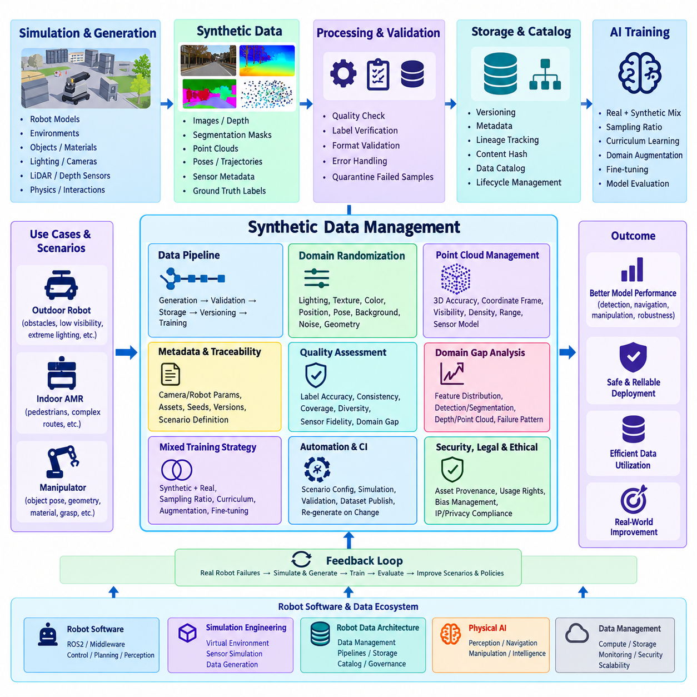{width="7.268055555555556in" height="7.268055555555556in"}

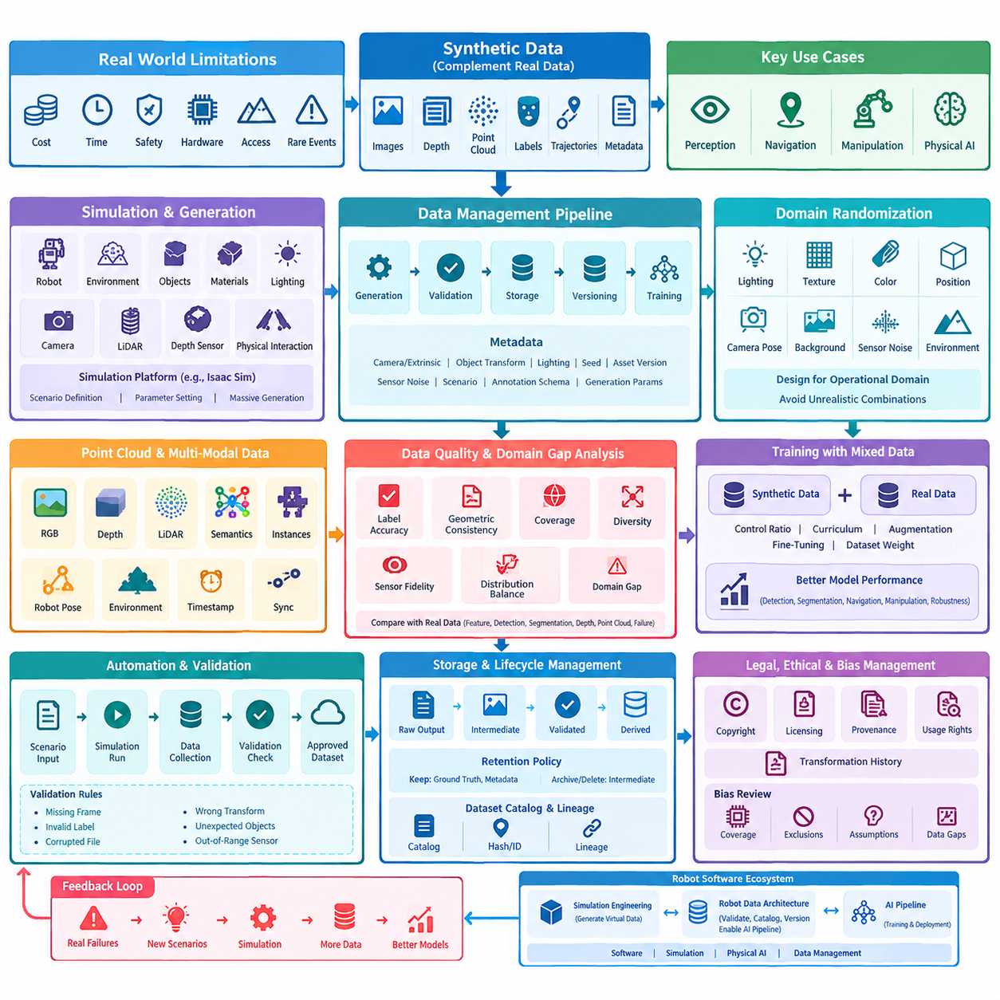{width="7.268055555555556in" height="7.268055555555556in"}

Synthetic data has become a core component of modern robot data architecture because physical robots cannot practically collect every condition required for robust AI training. Real-world acquisition is constrained by cost, time, safety, hardware availability, environmental access, and the low frequency of rare events. Synthetic data complements physical observations by creating controlled, repeatable, and scalable datasets for perception, navigation, manipulation, and Physical AI development.

Within a robot data architecture, synthetic data should be treated as a managed data asset rather than temporary simulation output. Images, depth maps, segmentation masks, point clouds, poses, trajectories, sensor metadata, and ground-truth annotations must pass through defined generation, validation, storage, versioning, and training pipelines. This approach connects simulation directly with AI data architecture, annotation processes, digital twins, and reproducible model development.

Synthetic data is particularly valuable when important operating conditions are difficult or dangerous to reproduce physically. Outdoor robots may require examples of unusual obstacles, poor visibility, extreme illumination, or near-collision situations, while indoor AMRs may need dense pedestrian traffic, unusual object placement, or complex corridor interactions. Manipulators can similarly benefit from large variations in object pose, geometry, material, and grasp configuration without repeatedly arranging physical scenes.

Simulation platforms provide the controlled environment needed to generate these datasets at scale. A synthetic generation workflow can define robot geometry, environments, objects, materials, lighting, cameras, LiDAR, depth sensors, and physical interactions before executing large numbers of scenarios. Platforms such as Isaac Sim can produce sensor observations together with automatically generated ground truth, reducing the manual labeling effort normally associated with real sensor data.

Synthetic image and sensor generation should preserve the relationships among scene state, sensor configuration, and generated labels. Camera intrinsic and extrinsic parameters, object transforms, illumination settings, simulation seeds, asset versions, and sensor noise models should therefore accompany each dataset. Without this metadata, visually convincing synthetic samples may still be difficult to reproduce, audit, compare, or regenerate when simulation assets and training requirements evolve.

Domain randomization expands the diversity of synthetic datasets by systematically varying parameters that should not dominate model behavior. Lighting intensity, texture, color, object position, camera pose, background appearance, sensor noise, and environmental geometry can be changed across simulation runs. Instead of training an AI model against one visually perfect virtual environment, the pipeline exposes it to a broad distribution of plausible conditions and encourages more robust feature learning.

Randomization must nevertheless be designed around the operational domain rather than applied without constraints. Unrealistic combinations can consume storage and training resources while contributing little useful information. Parameter ranges should therefore reflect intended deployment conditions, known failure modes, and deliberately selected stress cases. Randomization configurations themselves become version-controlled data artifacts so that engineers can determine exactly which scenario distribution produced a particular synthetic dataset.

Point-cloud generation introduces additional requirements because geometric accuracy, coordinate frames, visibility, sampling density, range limits, and sensor characteristics directly affect downstream perception. Synthetic LiDAR pipelines can generate large quantities of labeled 3D observations while retaining exact object identities and poses from the simulator. These properties make synthetic point clouds useful for detection, segmentation, localization, mapping, obstacle recognition, and other spatial AI tasks where manual 3D annotation is expensive.

Generated point clouds should remain linked to the corresponding simulation state and multimodal sensor observations. A synchronized sample may contain RGB images, depth, LiDAR, semantic labels, instance identifiers, robot pose, and environmental state under a common timestamp or scenario identifier. Maintaining this relationship enables multimodal training and allows engineers to trace unexpected model behavior back through generated sensor data to the exact virtual scene responsible for the observation.

Synthetic data quality cannot be judged solely by visual realism. A dataset may appear photorealistic while failing to represent the statistical or operational characteristics that matter to the target model. Quality assessment therefore considers label correctness, geometric consistency, scenario coverage, diversity, sensor fidelity, distribution balance, and the domain gap between simulated and real observations. Metrics such as FID may support image-distribution comparison, but they represent only one part of a broader evaluation process.

Domain-gap analysis should focus on model-relevant differences between synthetic and physical environments. Engineers can compare feature distributions, detection errors, segmentation performance, depth characteristics, point-cloud statistics, and failure patterns across both domains. The objective is not necessarily to make synthetic data indistinguishable from reality, but to determine whether training with it improves performance on representative real-world validation and test datasets.

For this reason, mixed synthetic and real training is often more useful than treating the two sources as competing alternatives. Synthetic data can provide broad coverage and inexpensive variation, while real data anchors learning to actual sensor behavior and deployment conditions. Training pipelines may control sampling ratios, curriculum stages, domain-specific augmentation, fine-tuning schedules, and dataset weights so that synthetic samples strengthen coverage without overwhelming important characteristics contained in physical observations.

The optimal mixture can change throughout model development. Early training may use large synthetic datasets to establish broad representations, followed by progressively greater emphasis on verified real data. Rare or safety-critical scenarios may remain intentionally overrepresented in synthetic form. Every experiment should record dataset versions, mixture ratios, sampling policies, preprocessing parameters, and model configuration so performance changes can be attributed to specific data decisions rather than uncontrolled pipeline differences.

At production scale, synthetic generation should be automated rather than executed as isolated simulation experiments. Generation pipelines can accept scenario definitions and parameter configurations, launch simulation workloads, capture sensor outputs, validate generated samples, construct metadata, and publish approved datasets into managed storage. Continuous-integration mechanisms can regenerate selected datasets when simulation assets, robot models, sensor configurations, or generation software change.

Automated validation is essential because large simulation jobs can produce technically complete but unusable samples. Pipeline checks can detect missing frames, invalid labels, corrupted files, incorrect coordinate transformations, unexpected object distributions, or sensor outputs outside predefined limits. Failed samples should be quarantined rather than silently entering training repositories, while generation logs and validation reports should remain associated with the dataset for later diagnosis and reproducibility.

Storage architecture must distinguish synthetic datasets by more than filenames and directories. Each dataset version should identify the simulator and software version, scene assets, robot configuration, sensor models, randomization policy, scenario definition, generation code, annotation schema, and creation parameters. Content hashes or immutable identifiers can prevent accidental replacement, while catalogs and lineage records connect generated data with the experiments and trained models that consumed it.

Because synthetic generation can create enormous volumes of data, lifecycle management is equally important. Raw simulator outputs, intermediate render products, validated training samples, and derived datasets may require different retention policies. Frequently reusable ground truth and configuration metadata can be retained while reproducible intermediate artifacts are deleted or moved to lower-cost storage. This balances reproducibility against the significant storage cost created by large-scale image, depth, and point-cloud generation.

Legal and ethical considerations remain relevant even when data originates in simulation. Synthetic datasets can inherit copyrighted assets, restricted 3D models, licensed textures, biased scenario assumptions, or representations derived from protected real-world data. Organizations should track asset provenance, usage rights, generation sources, and transformation history so that synthetic origin is not incorrectly interpreted as unrestricted ownership or automatic freedom from privacy and intellectual-property obligations.

Bias management is particularly important because simulation developers explicitly choose which people, objects, environments, behaviors, and failure situations appear in generated worlds. Poor scenario design can systematically exclude relevant deployment conditions and produce misleading confidence in model performance. Dataset reviews should therefore examine coverage across operational contexts and document intentional exclusions, assumptions, limitations, and known gaps before synthetic data is approved for training or validation.

Ultimately, synthetic data management should be evaluated through measurable model improvement rather than the quantity of generated samples. A successful program demonstrates that selected synthetic scenarios improve detection, segmentation, navigation, manipulation, robustness, or rare-event handling on independent real-world evaluation data. Performance should be compared across real-only, synthetic-only, and mixed-data experiments so that the contribution of synthetic information can be measured rather than assumed.

This closes the synthetic-data lifecycle as a feedback loop. Real robot failures reveal missing scenarios, simulation reproduces and varies those conditions, automated pipelines generate labeled datasets, training incorporates the new samples, and real-world evaluation determines whether performance improves. The resulting evidence feeds back into scenario design, randomization ranges, quality criteria, storage policy, and dataset selection, progressively aligning virtual data production with operational robot requirements.

In the broader robot software structure, this management layer complements synthetic data generation within simulation engineering rather than duplicating it. Simulation focuses on creating virtual environments and sensor observations, while robot data architecture governs how those outputs are validated, cataloged, versioned, combined with real observations, and delivered to AI pipelines. This distinction connects synthetic generation with the larger software, simulation, Physical AI, and data-management ecosystem.

## 11.02 Isaac Sim Synthetic Image / Sensor Data Gen [w/Code]

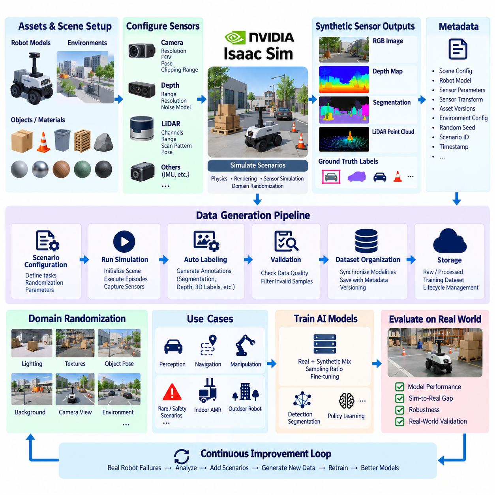{width="7.268055555555556in" height="7.268055555555556in"}

NVIDIA Isaac Sim provides a simulation environment for generating synthetic image and sensor datasets for robotics and Physical AI. Instead of relying entirely on physical data collection, developers can construct virtual robots, environments, objects, cameras, LiDAR sensors, and lighting conditions, then execute controlled scenarios repeatedly. The resulting data can support perception, navigation, manipulation, and multimodal AI training.

Synthetic data generation in Isaac Sim begins with a structured simulation scene containing robot models, environmental geometry, physical objects, materials, and sensor configurations. These components establish the virtual world from which observations are generated. Because scene parameters can be controlled programmatically, the same environment can be reproduced exactly or modified systematically to create large variations without rebuilding physical test environments.

A camera-based generation pipeline defines properties such as image resolution, camera pose, focal characteristics, clipping ranges, and observation viewpoints. Cameras may be attached to robots or positioned externally depending on the target application. During simulation, rendered RGB frames can be collected together with scene information, allowing visual observations to remain associated with the exact robot state and environmental configuration that produced them.

The major advantage of simulation-based image generation is the availability of ground-truth information directly from the virtual scene. Because the simulator already knows object identities, locations, geometry, and relationships, annotation information can be produced together with rendered observations. Semantic segmentation, instance information, depth, object poses, and other structured labels can therefore be generated without manually annotating every captured image.

Depth data provides geometric information that complements RGB appearance. A simulated depth sensor can record the distance between the observation point and visible surfaces while maintaining synchronization with the corresponding camera frame. This allows RGB and depth observations to be treated as a multimodal sample rather than unrelated files, supporting applications such as obstacle perception, object localization, scene reconstruction, and manipulation.

LiDAR simulation extends synthetic generation from image-space observations into three-dimensional spatial sensing. Virtual LiDAR can represent scanning behavior and produce point-cloud observations of simulated environments. Sensor position, orientation, range, sampling characteristics, and environmental geometry influence the resulting point distribution. The generated point cloud should therefore be stored with its sensor configuration and coordinate-frame information.

Sensor generation becomes more useful when multiple modalities share a common simulation timeline. RGB, depth, segmentation, LiDAR, robot pose, joint state, and environmental state can be captured around the same simulation step and connected through timestamps or frame identifiers. This synchronization enables downstream pipelines to reconstruct the complete observation context required for sensor fusion, multimodal learning, and Physical AI training.

A synthetic dataset should preserve more than the sensor payload itself. Each generated sample benefits from metadata describing the simulation scene, robot model, camera or LiDAR parameters, sensor transforms, asset versions, environmental configuration, and generation settings. Random seeds and scenario identifiers are particularly valuable because they allow engineers to reproduce specific samples or regenerate a dataset after modifying the pipeline.

Isaac Sim generation workflows can also vary scene parameters across repeated runs. Lighting, object positions, textures, materials, camera viewpoints, backgrounds, and environmental arrangements can be modified to increase dataset diversity. These variations form the foundation for domain randomization, where the objective is not simply to create more images but to expose learning systems to controlled changes that improve robustness against real-world variability.

Randomization parameters should be connected to explicit operational requirements. For an indoor AMR, useful variations may include corridor geometry, obstacle position, pedestrian-like objects, illumination, and camera viewpoint. For manipulation, the pipeline may vary object pose, surface appearance, clutter, gripper approach, and workspace configuration. This makes generated data represent intended robot tasks rather than an arbitrary collection of visually different simulation frames.

Synthetic generation also enables scenarios that are inefficient or risky to collect repeatedly with real robots. Near collisions, unusual obstacle arrangements, difficult lighting, partially occluded objects, and uncommon object poses can be deliberately reproduced. Scenario frequency can be controlled independently from its real-world occurrence rate, allowing rare but operationally important situations to receive sufficient representation in training datasets.

At scale, generation should operate as a repeatable data pipeline rather than a manual rendering procedure. A configuration can define simulation assets, sensors, scenario parameters, output modalities, randomization rules, and generation volume. Automated execution can then initialize scenes, run simulation episodes, capture sensor outputs, produce labels, validate results, and publish completed samples into a managed dataset repository.

Programmatic generation is particularly important when thousands or millions of observations are required. Scripts can iterate through scenario configurations and parameter combinations while maintaining consistent naming, metadata, and directory structures. Generation jobs can also be distributed across available compute resources when the workload permits. This transforms simulation from an interactive visualization environment into a scalable source of AI training data.

Output organization should preserve relationships among modalities. Rather than treating RGB images, depth maps, segmentation labels, and point clouds as independent datasets, a common sample or frame identifier can link them together. Metadata can additionally reference the corresponding robot pose, sensor transform, scene state, and simulation timestamp. Such organization simplifies later conversion into model-specific training formats.

Validation should occur immediately after generation because successful simulation execution does not guarantee usable data. Automated checks can identify missing frames, empty sensor outputs, invalid depth values, inconsistent dimensions, missing labels, incorrect coordinate transforms, or corrupted files. Samples that fail these checks should be separated from approved datasets instead of entering training pipelines silently.

Visual and statistical inspection complements automated validation. Engineers can examine whether object distributions, illumination ranges, depth values, point densities, and label frequencies match the intended scenario design. Dataset statistics can reveal excessive repetition or unexpected imbalance that may not be visible from individual samples. These checks are especially important when randomization generates large datasets without direct human supervision.

Generated datasets should be versioned together with the configuration that produced them. Changes to robot geometry, sensor placement, scene assets, simulation parameters, annotation definitions, or generation scripts can alter the resulting data even when output filenames remain similar. Associating every dataset version with its generation configuration and software environment makes experiments reproducible and supports reliable comparison between model versions.

Storage management becomes important because multimodal simulation can produce large data volumes rapidly. High-resolution RGB frames, depth maps, segmentation masks, point clouds, and metadata generated from the same scenario can multiply storage requirements. Pipelines should distinguish raw simulation output, validated training data, derived formats, and temporary artifacts so that retention policies can preserve valuable information without retaining every intermediate result indefinitely.

Synthetic data should ultimately be evaluated against its usefulness for real robot models. A visually impressive Isaac Sim dataset has limited value if models trained with it fail under physical sensor conditions. Generated data should therefore be compared with representative real observations, and model performance should be measured on real validation or test datasets to identify the remaining simulation-to-real domain gap.

A practical training strategy often combines Isaac Sim data with real robot data. Synthetic samples can provide broad scenario coverage, inexpensive annotations, and rare-event examples, while real samples capture sensor noise, environmental complexity, and physical characteristics that simulation may not reproduce completely. Sampling ratios and fine-tuning stages can be adjusted experimentally according to performance measured on real deployment conditions.

The resulting workflow forms a continuous simulation-to-data-to-model loop. Real-world model failures reveal missing conditions, those conditions are recreated in Isaac Sim, new sensor observations and labels are generated, validated datasets enter the training pipeline, and updated models are evaluated again on physical data. Through this feedback process, synthetic image and sensor generation becomes an operational component of robot data architecture rather than an isolated simulation activity.

## 11.03 Domain Randomization Design [w/Code]

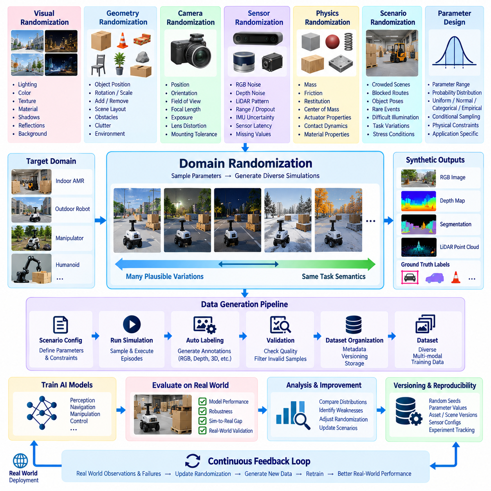{width="7.268055555555556in" height="7.268055555555556in"}

Domain randomization is a synthetic data design technique that intentionally varies simulation parameters so that an AI model learns features that remain useful across changing real-world conditions. Instead of attempting to reproduce one perfectly realistic environment, the simulator generates many plausible versions of objects, sensors, lighting, geometry, and physical conditions. The resulting diversity can improve robustness and reduce dependence on specific visual or environmental characteristics.

The central design principle is to define a distribution of possible environments rather than a single fixed simulation configuration. Each simulation episode samples parameters from this distribution and produces a different observation of the same underlying task. A robot may therefore encounter different colors, textures, object positions, camera viewpoints, illumination levels, sensor noise, or environmental layouts while maintaining the task semantics required for training.

Randomization should begin with an explicit definition of the target operational domain. Parameters must represent variations that the deployed robot is reasonably expected to encounter, together with selected stress conditions that expose model weaknesses. An indoor AMR, outdoor robot, manipulator, and humanoid operate under different distributions, so a reusable randomization framework should separate general mechanisms from application-specific parameter ranges and scenario constraints.

Visual domain randomization modifies appearance-related variables such as illumination, color, texture, material properties, shadows, reflections, and backgrounds. Lighting can vary in intensity, direction, temperature, or source placement, while surface materials can change roughness, reflectivity, and texture. These variations discourage perception models from associating object identity with one specific visual appearance and increase exposure to diverse imaging conditions.

Geometry randomization changes spatial characteristics of the simulated world. Objects can be translated, rotated, scaled, rearranged, added, or removed according to scenario rules. Furniture, pallets, boxes, obstacles, tools, or other assets may appear in different locations while maintaining physically meaningful constraints. This variation is particularly important for navigation and manipulation systems that must operate in environments whose layouts cannot be known completely in advance.

Camera randomization changes the observation process itself. Camera position, orientation, field of view, focal characteristics, exposure, and other parameters may be sampled within validated ranges. Small variations can represent installation tolerances or vibration, while larger variations can broaden viewpoint coverage during training. The selected ranges should remain compatible with the actual sensor configuration unless deliberate out-of-distribution testing is being performed.

Sensor randomization extends the same concept beyond RGB cameras. Depth measurements can include noise, missing values, or range-dependent uncertainty, while LiDAR simulations can vary measurement noise, sampling characteristics, range, and observation patterns. IMU and other simulated sensors can similarly incorporate uncertainty models. These variations help prevent models from assuming that synthetic sensor outputs are perfectly clean measurements unavailable in physical systems.

Physical properties can also be randomized when the training objective depends on interaction dynamics. Object mass, friction, restitution, center of mass, actuator characteristics, or contact properties may vary within appropriate ranges. Manipulation and reinforcement-learning applications benefit particularly from this approach because policies trained against one exact physical model may otherwise fail when real objects or robot mechanisms differ from their simulated counterparts.

Randomization parameters should not be treated as independent when physical or semantic relationships exist between them. For example, object placement must respect collision constraints, lighting changes should remain consistent with scene geometry, and sensor placement must preserve feasible mounting configurations. Conditional randomization allows one sampled parameter to constrain another, preventing the generator from producing large quantities of physically impossible or operationally meaningless data.

Parameter ranges require careful engineering because greater variation does not automatically produce better training data. Extremely broad distributions can create unrealistic observations that consume computation and storage while weakening learning efficiency. Ranges that are too narrow, however, may cause overfitting to simulation characteristics. Initial boundaries can be established from sensor specifications, operational measurements, engineering tolerances, field observations, and known failure cases.

Probability distributions provide another important design dimension. Uniform sampling is simple but may assign excessive probability to unusual extremes, whereas normal, truncated, categorical, weighted, or empirical distributions can better represent particular variables. Rare safety-critical conditions may intentionally receive higher sampling probability than their natural frequency so that the training dataset contains enough examples to learn meaningful responses.

Scenario-level randomization coordinates multiple variables around an operational situation. Instead of independently changing individual objects, the system can define scenarios such as crowded corridors, partially blocked routes, cluttered workspaces, difficult illumination, unusual object poses, or near-collision conditions. Each scenario can then randomize its internal parameters while preserving the semantic purpose of the situation, producing controlled diversity rather than arbitrary variation.

Reproducibility requires every randomized simulation run to retain its configuration. Random seeds, parameter values, asset identifiers, scene versions, sensor configurations, simulator versions, and scenario definitions should be recorded with generated samples or dataset metadata. When a model failure is discovered later, engineers can reconstruct the corresponding virtual condition, investigate the cause, modify the randomization policy, and regenerate related samples.

Domain randomization therefore depends closely on dataset versioning. A change in parameter range, probability distribution, asset pool, sensor noise model, or scenario constraint effectively creates a new data distribution even when the generation software remains unchanged. Randomization policies should receive explicit versions so that model experiments can identify exactly which simulated distribution contributed to each training dataset.

Automated generation pipelines can execute randomization policies at scale. A scenario configuration specifies parameter spaces and constraints, the simulation engine samples values, and each episode produces synchronized sensor outputs and labels. Validation stages then verify whether generated samples satisfy technical and semantic requirements before publication. Invalid configurations or corrupted outputs should be rejected without contaminating the approved training dataset.

Quality monitoring should examine the distribution created by the randomization process rather than validating individual files alone. Histograms, category frequencies, object counts, pose distributions, lighting ranges, sensor statistics, and scenario coverage can reveal whether the generated dataset actually matches the intended design. Large-scale generation can otherwise create hidden imbalances when nominal parameter ranges do not translate into balanced observations.

Domain-gap analysis provides feedback for refining the randomization policy. Synthetic and real datasets can be compared through image characteristics, feature distributions, depth statistics, point-cloud properties, detection errors, segmentation results, or other task-specific measurements. Differences that correlate with poor real-world performance indicate which simulated parameters, sensor models, or scenario distributions may require adjustment.

Model performance remains the most important evaluation criterion. A randomization strategy should be tested by training models with controlled dataset variants and evaluating them on representative real-world validation data. Comparisons between fixed simulation, randomized simulation, real-only training, and mixed real-synthetic training can reveal whether a particular randomization policy contributes useful robustness rather than simply increasing dataset size.

Curriculum-based randomization can gradually increase difficulty during training or data generation. Initial scenarios may use moderate variation around nominal operating conditions, while later stages introduce stronger visual changes, increased clutter, larger pose variation, sensor degradation, or more challenging interactions. This progression can help learning systems establish fundamental task behavior before confronting increasingly difficult environmental distributions.

Adaptive domain randomization extends this idea by allowing model performance to influence future parameter sampling. Conditions in which the model already performs reliably may receive less generation capacity, while difficult or failure-prone regions can receive greater attention. This creates a feedback mechanism in which synthetic data production becomes increasingly focused on unresolved weaknesses rather than continuously generating equivalent samples.

For Physical AI systems, domain randomization can span perception, state estimation, navigation, manipulation, and control simultaneously. A generated episode may vary visual appearance, spatial arrangement, sensor uncertainty, object dynamics, and robot properties while preserving synchronized multimodal observations. This enables the resulting dataset to represent interactions among sensing, physical state, and action rather than treating each modality as an isolated source.

The complete design forms a continuous real-to-simulation feedback loop. Real robot observations and failures identify missing variability, engineers translate those findings into randomization parameters and scenarios, simulation generates new datasets, models are retrained, and performance is evaluated again in physical environments. Domain randomization therefore becomes a controlled data-engineering mechanism for systematically expanding training coverage and reducing the gap between simulated learning and real robot operation.

## 11.04 Synthetic Point Cloud Data Gen Pipeline [w/Code]

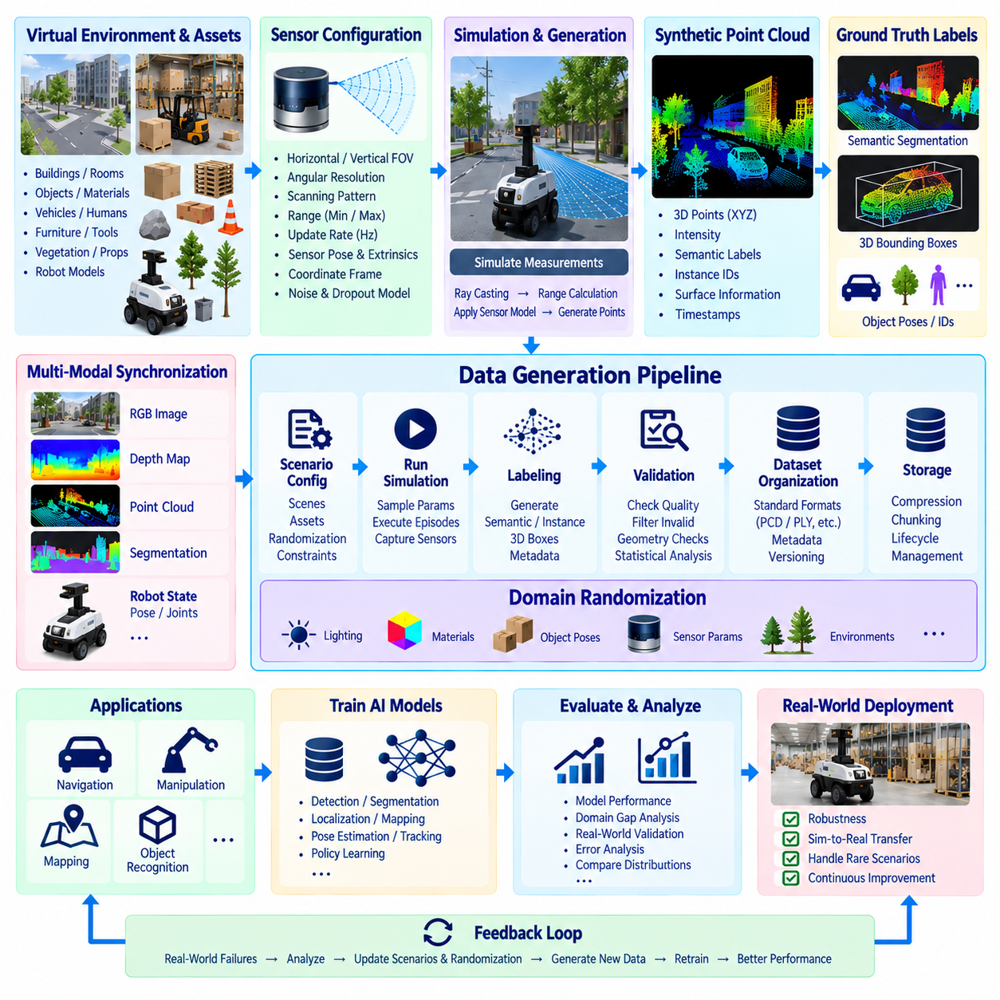{width="7.268055555555556in" height="7.268055555555556in"}

Synthetic point-cloud generation creates three-dimensional sensor datasets without requiring every scene to be physically scanned by a real robot. In robotics, point clouds are fundamental for obstacle detection, localization, mapping, object recognition, manipulation, and spatial reasoning. Simulation makes it possible to generate large quantities of labeled 3D observations while maintaining precise knowledge of scene geometry, sensor configuration, and object state.

A synthetic point-cloud pipeline begins with a virtual environment containing geometrically defined assets. Floors, walls, buildings, shelves, pallets, vehicles, tools, vegetation, and other objects are represented as 3D geometry with known positions and orientations. Robot models and movable objects are then inserted into the scene, creating a controlled spatial environment from which simulated ranging sensors can generate observations.

Sensor configuration is a critical part of the pipeline because point-cloud characteristics depend directly on the simulated sensing model. A virtual LiDAR may define horizontal and vertical field of view, angular resolution, scanning pattern, measurement range, update rate, sensor pose, and coordinate frame. These parameters should approximate the intended physical sensor when the generated dataset is expected to support simulation-to-real transfer.

The generation process simulates measurements between the sensor and visible surfaces in the environment. Each valid measurement produces a three-dimensional point expressed in the sensor or another defined coordinate frame. Depending on the simulation system, additional attributes such as intensity, semantic class, instance identity, surface information, or timestamps may be associated with points, producing richer data than raw XYZ coordinates alone.

Coordinate-frame management is essential because a point cloud has limited meaning without a clearly defined spatial reference. Sensor-frame observations may need to be transformed into robot base, odometry, map, or world coordinates. The pipeline should therefore preserve sensor extrinsic parameters and transformation relationships so that generated point clouds can be reconstructed consistently and combined with robot poses, maps, or observations from other sensors.

Ground-truth labeling is one of the major advantages of synthetic point-cloud generation. Because the simulation engine knows which virtual object produced each measurement, semantic and instance labels can be derived directly from the scene. Points can therefore be associated with categories such as floor, wall, vehicle, pedestrian, pallet, obstacle, or robot component without manually labeling millions of individual 3D points.

Object-level ground truth can also include three-dimensional bounding boxes, object poses, dimensions, velocities, and identifiers. These labels support tasks such as 3D object detection, tracking, semantic segmentation, instance segmentation, and pose estimation. For manipulation datasets, the same mechanism can connect point-cloud observations with object geometry, grasp targets, workspace state, and robot end-effector configuration.

Synthetic point clouds should rarely be managed as isolated sensor files. A complete generation pipeline can synchronize LiDAR observations with RGB images, depth maps, segmentation masks, robot poses, joint states, and environmental metadata. A shared timestamp, frame number, or scenario identifier links these modalities so that downstream AI systems can learn relationships between visual appearance, three-dimensional geometry, robot state, and physical context.

Sensor realism requires more than reproducing ideal geometric intersections. Real LiDAR and depth sensors exhibit measurement uncertainty, missing returns, limited range, occlusion, sampling artifacts, and sensitivity to surface characteristics. Synthetic pipelines can introduce configurable noise and dropout models to prevent training data from becoming unrealistically clean. Sensor imperfections should be based on plausible operating characteristics rather than arbitrary distortion.

Occlusion is particularly important in point-cloud generation because only surfaces visible from the sensor position should normally contribute measurements. Objects behind walls, shelves, vehicles, or other obstacles must not appear simply because their geometry exists in the simulation. Correct visibility handling ensures that synthetic observations preserve the partial and viewpoint-dependent nature of real three-dimensional sensing.

Point density also changes with range, scanning geometry, object orientation, and sensor resolution. Nearby objects may contain many measurements while distant or partially visible objects contain relatively few. A useful synthetic pipeline preserves these relationships instead of producing uniformly sampled object surfaces. This helps models learn from spatial patterns that more closely resemble observations produced by physical ranging sensors.

Domain randomization can expand the diversity of generated point clouds. Object positions, orientations, dimensions, environmental layouts, sensor poses, obstacle configurations, and physical assets can vary between simulation episodes. Sensor parameters and noise characteristics may also change within controlled ranges. This creates many geometrically different observations while preserving the semantic meaning of the target robot task.

Randomization should respect physical and operational constraints. Pallets should not appear inside walls, objects should normally rest on valid supporting surfaces, and sensor mounting positions should remain feasible for the robot platform. Conditional rules can maintain these relationships while still generating substantial diversity. Without such constraints, large-scale generation may produce unrealistic geometry that reduces the usefulness of the resulting dataset.

Rare scenarios can be intentionally overrepresented in synthetic 3D datasets. Partially visible obstacles, unusual object orientations, crowded environments, narrow passages, difficult grasp configurations, and near-collision situations can be generated repeatedly even if they occur infrequently during normal robot operation. This capability is especially useful when collecting equivalent real-world point clouds would be dangerous, expensive, or operationally impractical.

At scale, point-cloud generation should be implemented as an automated data pipeline. A scenario configuration defines scenes, assets, sensor models, randomization ranges, output formats, and generation volume. Simulation jobs execute these configurations, capture observations, create labels and metadata, validate the resulting samples, and publish approved data into managed storage. Automation makes generation repeatable and suitable for continuous AI development.

Output formats should be selected according to downstream requirements while retaining sufficient information for later conversion. Raw point arrays may be stored together with structured metadata, while formats such as PCD, PLY, or application-specific representations can support particular processing frameworks. Dataset organization should separate sensor payloads from metadata logically while preserving explicit references between observations, labels, and scenario configurations.

Automated validation should detect technically invalid samples before they enter training datasets. Checks can identify empty point clouds, non-finite coordinates, unexpected point counts, invalid labels, missing transformations, inconsistent timestamps, or points outside configured sensor ranges. Geometry-based checks can additionally verify bounding boxes, coordinate transformations, and relationships between object positions and associated point labels.

Statistical validation examines the generated dataset as a population rather than individual samples. Engineers can measure point-count distributions, object frequencies, range distributions, class balance, occlusion levels, spatial coverage, and scenario frequency. These statistics reveal whether large generation jobs actually represent the intended operating domain or accidentally concentrate data around a limited subset of configurations.

Visual inspection remains useful even in highly automated pipelines. Point clouds can be rendered together with bounding boxes, semantic colors, sensor poses, and scene geometry to verify spatial alignment. Overlaying projected 3D points onto synchronized camera images can reveal calibration or transformation errors that numerical file checks may not detect. Representative samples should therefore be inspected before a new dataset version is approved.

Dataset versioning must include the generation configuration as well as the point-cloud files themselves. Changes to sensor models, scanning patterns, noise parameters, scene assets, coordinate conventions, annotation schemas, or randomization policies can substantially change the data distribution. Recording these dependencies allows engineers to reproduce previous datasets and determine which generation changes affected model performance.

Storage requirements can become substantial because point-cloud pipelines may generate millions of points across large numbers of frames and scenarios. Compression, chunking, selective retention, and derived-data policies can reduce storage pressure. Raw simulation outputs may be retained only when regeneration is expensive, while validated training representations and essential metadata can receive longer retention according to reproducibility requirements.

Synthetic and real point clouds should eventually be compared to measure the domain gap. Useful comparisons include point density, range characteristics, noise distributions, missing-return patterns, object visibility, geometric features, and model error patterns. Differences that correlate with poor real-world performance can guide adjustments to sensor simulation, environmental assets, randomization ranges, and noise models.

Training strategies can combine synthetic point clouds with real sensor observations. Synthetic data provides scalable labels and controlled scenario coverage, while real data captures hardware-specific artifacts and environmental complexity. Models may first learn broad geometric representations from synthetic data and then be fine-tuned with real observations, or both sources may be sampled together according to experimentally selected ratios.

The complete pipeline therefore forms a feedback loop between physical robots and virtual data generation. Real-world failures identify missing geometries, sensor conditions, or scenarios; simulation recreates and varies those conditions; the pipeline generates synchronized labeled point clouds; models are retrained and evaluated again on real data. Synthetic point-cloud generation thus becomes a managed component of robot data architecture for continuously improving three-dimensional perception and Physical AI systems.

## 11.05 Synthetic Data Quality Assessment: FID / Domain Gap

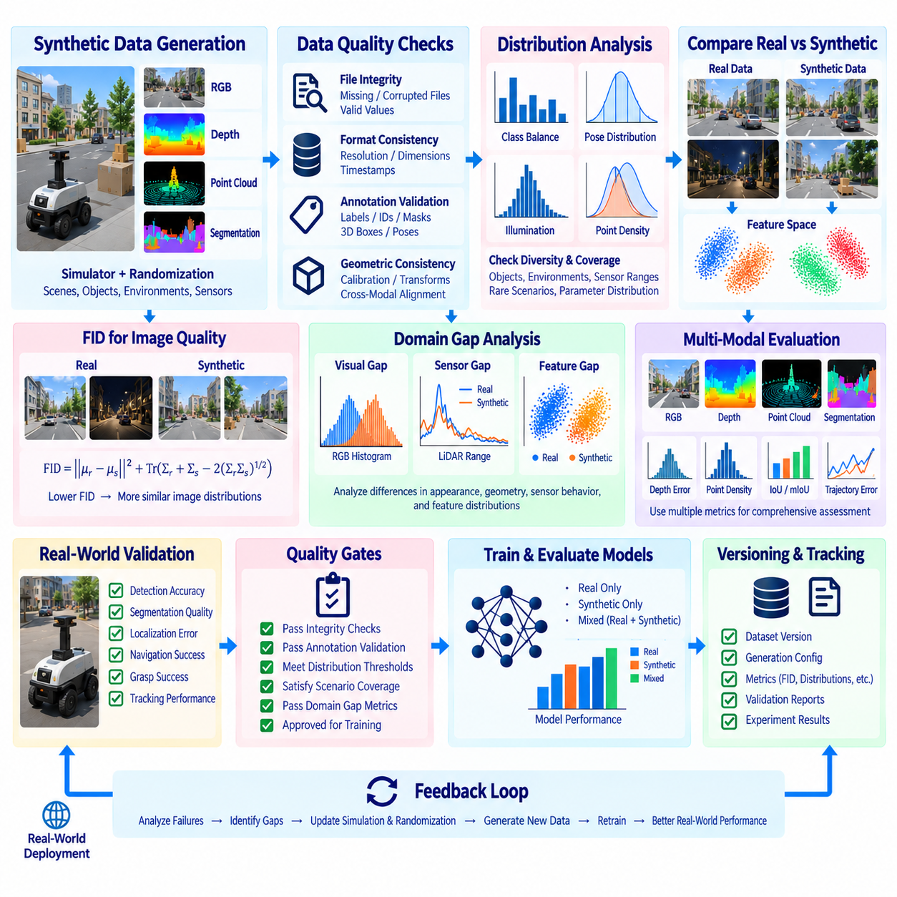{width="7.268055555555556in" height="7.268055555555556in"}

Synthetic data quality assessment determines whether generated datasets are sufficiently accurate, diverse, representative, and useful for training robot AI systems. High visual realism alone does not guarantee high data quality. A synthetic dataset must preserve task-relevant characteristics of the intended operational environment while providing correct labels, valid geometry, appropriate sensor behavior, and sufficient coverage of conditions that influence model performance.

Quality assessment should begin with technical integrity before considering statistical similarity or model performance. Generated samples should be checked for missing files, corrupted frames, invalid values, inconsistent dimensions, incorrect timestamps, broken coordinate transforms, and incomplete annotations. These checks prevent technically defective samples from entering later evaluation stages where they could distort distribution statistics or produce misleading conclusions about the synthetic data.

Annotation quality is especially important because automatic ground truth is one of the primary advantages of simulation. Semantic labels, instance identifiers, segmentation masks, depth values, 3D bounding boxes, object poses, and trajectories should remain consistent with the simulated scene. Validation can detect impossible bounding boxes, mislabeled points, overlapping instance identifiers, invalid depth ranges, or discrepancies between visible objects and generated annotations.

Geometric consistency provides another quality dimension for robotics datasets. Camera calibration, sensor extrinsics, robot poses, coordinate frames, and object transforms must agree across modalities. A point cloud projected into an RGB image should align with the corresponding scene geometry, while depth and segmentation outputs should describe the same visible surfaces. Such cross-modal checks are critical for sensor fusion, 3D perception, localization, and Physical AI training.

Statistical quality assessment examines whether synthetic data covers the intended distribution rather than merely producing technically valid files. Engineers can analyze object frequencies, class balance, pose distributions, illumination conditions, sensor ranges, point densities, occlusion levels, environmental layouts, and scenario frequencies. These measurements reveal whether a generation pipeline unintentionally concentrates samples around a narrow subset of its configured parameter space.

Diversity must be distinguished from uncontrolled variation. A dataset containing many visually different samples may still provide poor operational coverage if the variations do not correspond to meaningful deployment conditions. Useful diversity includes changes in viewpoints, object arrangements, environmental geometry, sensor characteristics, physical properties, and rare scenarios that affect robot behavior. Quality assessment should therefore compare generated diversity with explicit operational requirements.

Fréchet Inception Distance, commonly abbreviated as FID, is one method for comparing distributions of real and generated images. Instead of comparing images pixel by pixel, FID represents image collections through features extracted by a neural network and compares statistical properties of those feature distributions. Lower FID values generally indicate that two evaluated image distributions are closer within the selected feature representation.

Conceptually, FID compares the mean and covariance of feature vectors extracted from real and synthetic image sets. Differences in the feature means reflect shifts in their central representation, while covariance differences capture discrepancies in variation and relationships among features. The resulting distance provides a compact numerical indicator that can help engineers compare alternative synthetic generation configurations or monitor changes between dataset versions.

FID should not be interpreted as a complete measure of synthetic data quality. Its value depends on the feature extractor, sample population, image preprocessing, dataset size, and evaluated domain. A lower FID does not automatically demonstrate better robot perception, safer behavior, more accurate geometry, or improved simulation-to-real transfer. It should therefore be combined with task-specific and sensor-specific quality measurements.

This limitation is particularly important in robotics because synthetic datasets frequently contain modalities that FID was not designed to evaluate directly. Depth maps, LiDAR point clouds, occupancy representations, robot trajectories, tactile measurements, and control states require other metrics. Even RGB images may contain task-critical geometric or semantic differences that are poorly represented by a general image feature distance.

Domain gap describes the difference between simulated data and observations obtained from the physical deployment environment. This gap can arise from rendering appearance, lighting, materials, geometry, sensor noise, calibration, object behavior, environmental complexity, or physical dynamics. Synthetic data quality assessment should identify which differences are merely cosmetic and which differences cause measurable degradation in downstream robot AI performance.

Visual domain-gap analysis can compare brightness, contrast, color distributions, texture statistics, feature embeddings, object appearance, shadows, and environmental composition. These comparisons can reveal whether synthetic images systematically differ from physical camera observations. However, visual similarity should remain connected to model behavior because visually obvious differences are not always the differences that most strongly affect learned perception systems.

Sensor-domain analysis examines characteristics that arise from the measurement process itself. Synthetic depth and LiDAR data can be compared with real observations using range distributions, point density, dropout patterns, measurement noise, occlusion characteristics, and spatial coverage. IMU or other sensor simulations can similarly be assessed using noise distributions, bias, drift, timing behavior, and other characteristics relevant to their physical counterparts.

Feature-space comparison provides a bridge between low-level statistics and model-level evaluation. Real and synthetic samples can be passed through a relevant feature extractor, perception backbone, or trained model to compare internal representations. If both datasets produce substantially different feature distributions, engineers can investigate which environmental or sensor characteristics are responsible and refine simulation assets, rendering, randomization, or noise models.

Coverage analysis asks whether synthetic generation represents the operational conditions required by the robot. A dataset may have a relatively small global domain gap while still omitting rare but important situations. Scenario-level metrics should therefore measure coverage of difficult illumination, unusual obstacles, partial occlusions, crowded environments, extreme viewpoints, uncommon object poses, sensor degradation, and other application-specific conditions.

Quality assessment should also examine balance across scenarios and classes. Large synthetic pipelines can easily generate millions of samples, but quantity may conceal severe imbalance. Frequently sampled environments or common objects can dominate training while rare classes receive insufficient representation. Distribution reports should therefore accompany dataset versions and describe class counts, scenario frequencies, parameter ranges, and important combinations of conditions.

Real-world validation provides the most meaningful test of whether synthetic data is useful. Models trained using synthetic datasets should be evaluated on independent real-world validation or test data representing the intended deployment environment. Detection accuracy, segmentation quality, localization error, navigation success, grasp success, tracking performance, or other task-specific metrics can reveal whether improvements in synthetic data quality translate into operational gains.

Controlled experiments are useful for separating the contribution of synthetic data from other training factors. Engineers can compare models trained with real data only, synthetic data only, and different mixtures of real and synthetic samples while keeping model architecture and evaluation conditions consistent. Additional experiments can isolate changes in randomization policies, sensor models, rendering quality, scenario coverage, or synthetic-to-real sampling ratios.

Quality gates can formalize acceptance criteria before generated data enters production training repositories. A dataset version may be required to pass file-integrity checks, annotation validation, geometric consistency tests, distribution thresholds, scenario-coverage requirements, and selected domain-gap evaluations. These gates make synthetic data management more systematic and reduce dependence on subjective visual inspection of a small number of samples.

Assessment results should be stored as part of dataset metadata and lineage. FID values, distribution statistics, validation reports, scenario coverage, sensor-quality measurements, and model evaluation results should remain associated with the dataset version and generation configuration that produced them. This allows engineers to compare dataset generations over time and trace model performance changes back to specific modifications in synthetic data production.

Domain-gap measurements can directly guide domain-randomization design. If real images exhibit greater illumination variability, lighting ranges can be expanded. If physical LiDAR produces more missing returns, the simulated sensor model can be adjusted. If failures occur primarily with partially occluded objects, scenario generation can increase their frequency. Assessment therefore becomes an input to generation rather than merely a final reporting activity.

The same feedback principle can support adaptive synthetic data generation. Model errors on real validation data can be grouped by environmental condition, object type, sensor state, or scenario. Generation resources can then focus on regions where performance remains weak. New datasets are generated, assessed, incorporated into training, and evaluated again, gradually directing synthetic data production toward unresolved real-world weaknesses.

No single metric should determine whether a synthetic dataset is suitable for robotics. FID can contribute useful information for image-distribution comparison, but it should be interpreted alongside technical validity, annotation correctness, geometric consistency, diversity, coverage, sensor realism, domain-gap measurements, and downstream model performance. The combination of these perspectives provides a more reliable definition of synthetic data quality.

A mature quality-assessment pipeline therefore forms a closed loop connecting simulation, synthetic datasets, real observations, and AI models. Generation produces candidate data, automated checks verify integrity, statistical and domain-gap analyses characterize distributions, real-world model evaluation measures practical usefulness, and the findings update simulation parameters and scenarios. This cycle continuously improves the alignment between synthetic data and the physical environments in which robots must operate.

## 11.06 Synthetic and Real Data Mixed Training Strategy [w/Code]

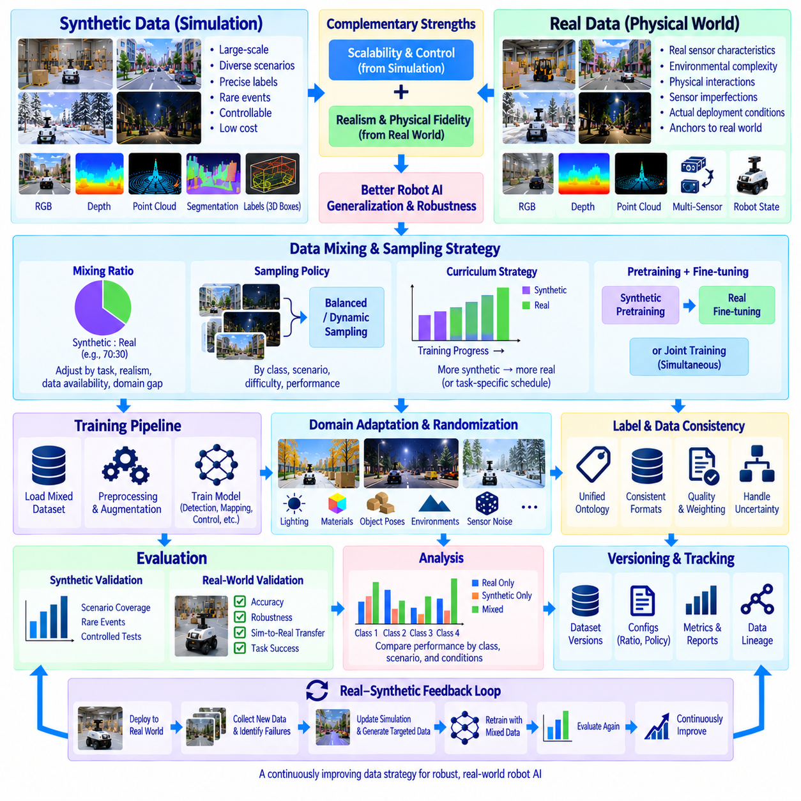{width="7.268055555555556in" height="7.268055555555556in"}

Mixed training with synthetic and real data combines the scalability and controllability of simulation with the physical fidelity of observations collected from deployed robots. Synthetic datasets can provide extensive scenario coverage, precise annotations, and rare-event examples, while real datasets capture sensor imperfections, environmental complexity, and physical interactions that simulation cannot reproduce completely. The objective is to exploit the strengths of both sources while controlling their different distributions.

A mixed-training strategy begins by defining the role of each data source rather than simply merging all available samples. Synthetic data may be used to broaden environmental coverage, increase class balance, generate difficult cases, or provide inexpensive ground truth. Real data provides evidence of actual deployment conditions and anchors the learned representation to physical sensors, objects, environments, and robot behavior.

The proportion of synthetic and real samples is an important training parameter. A fixed ratio can be used when both datasets have stable distributions, but the optimal ratio depends on task complexity, synthetic realism, real-data availability, and the remaining domain gap. Excessive synthetic data may cause the model to learn simulation-specific patterns, while insufficient synthetic data may fail to provide the diversity that motivated its generation.

Sampling policies should therefore be designed explicitly. Training batches can contain predefined proportions of synthetic and real samples, or the two sources can be sampled dynamically according to classes, scenarios, difficulty, or model performance. Balanced sampling is especially useful when real datasets contain dominant common conditions while synthetic generation provides targeted examples of rare objects, unusual poses, difficult illumination, or safety-critical situations.

A common strategy is synthetic pretraining followed by real-data fine-tuning. Large synthetic datasets are first used to establish broad visual, geometric, or behavioral representations without requiring extensive physical collection. The pretrained model is then adapted using verified real observations. Fine-tuning shifts the learned representation toward the actual deployment domain while retaining useful coverage acquired from simulation.

Joint training provides another approach in which synthetic and real samples are presented throughout the same training process. This can prevent the model from forgetting useful synthetic diversity during later adaptation and allows both domains to influence feature learning simultaneously. Joint training requires careful sampling and loss monitoring because a much larger synthetic dataset can otherwise dominate optimization simply through sample volume.

Curriculum-based mixed training changes the data composition over time. Early stages can emphasize synthetic data to expose the model to broad variations and establish fundamental task knowledge. Later stages progressively increase the proportion of real observations, allowing training to focus on physical sensor characteristics and deployment-specific details. Difficult synthetic scenarios may remain active throughout the curriculum when they provide coverage unavailable in the real dataset.

The strategy can also operate in the opposite direction when real data reveals specific weaknesses. A baseline model trained on physical observations may fail under rare lighting, unusual obstacles, partial occlusion, or uncommon object configurations. Simulation can reproduce these conditions and generate targeted synthetic samples. Training then incorporates the new data to strengthen specific failure regions without requiring repeated physical collection.

Domain randomization plays an important role in mixed training because it prevents synthetic observations from representing only one narrow virtual appearance. Lighting, materials, object poses, environmental layouts, sensor parameters, noise, and physical properties can be varied across generated samples. Proper randomization broadens the synthetic distribution so that real observations are less likely to lie far outside the conditions encountered during training.

Domain adaptation can further reduce differences between synthetic and real representations. Adaptation may occur through image transformations, feature alignment, normalization, fine-tuning, or model architectures designed to learn domain-invariant features. The purpose is not necessarily to make synthetic and real samples visually identical, but to reduce differences that interfere with the downstream perception, navigation, manipulation, or control task.

Data preprocessing must remain carefully controlled across both domains. Image resizing, normalization, coordinate conventions, label schemas, point-cloud formats, augmentation, and temporal sampling should be compatible unless a deliberate domain-specific transformation is required. Differences introduced accidentally by separate preprocessing pipelines can become artificial domain indicators that a model learns instead of meaningful task features.

Label consistency is equally important. Synthetic data may contain perfectly generated semantic labels, instance masks, depth, poses, or 3D boxes, while real data may contain human annotations with different definitions or uncertainty. A shared ontology and annotation schema should define class meanings, ignored regions, coordinate conventions, and quality rules so supervision remains semantically compatible across the two sources.

Confidence and data quality can influence sample weighting. Verified real observations may receive greater weight when physical fidelity is essential, while high-quality synthetic examples may be emphasized for underrepresented classes or scenarios. Samples with uncertain real annotations or unrealistic simulated conditions can receive lower weights or be excluded. Weighting policies should be recorded as part of the experiment configuration rather than adjusted informally.

Rare-event handling is one of the strongest reasons for mixed training. Real datasets naturally reflect event frequency, meaning safety-critical situations may appear too rarely for effective learning. Synthetic generation can intentionally increase the representation of near collisions, unusual obstacles, sensor degradation, difficult grasp poses, or other low-frequency conditions. Training can then control their influence without pretending that synthetic frequency represents natural occurrence probability.

Mixed training should preserve separate validation sets for meaningful evaluation. Real validation and test datasets should remain independent from training and represent the intended operational environment. Synthetic validation can measure performance across controlled scenario variations, but it cannot replace real-world evaluation. Maintaining both allows engineers to distinguish improvements in simulation performance from improvements that actually transfer to physical deployment.

Ablation experiments are useful for determining how each data source contributes to performance. Models can be trained using real-only, synthetic-only, and mixed configurations while keeping architecture, preprocessing, and evaluation conditions consistent. Additional experiments can vary synthetic-to-real ratios, randomization policies, pretraining duration, fine-tuning schedules, or scenario composition to identify which elements provide measurable benefits.

Evaluation should include more than aggregate accuracy. Performance can be separated by object class, distance, illumination, occlusion, environment, sensor condition, or scenario difficulty. A mixed dataset may improve average performance while degrading an important operational subset. Scenario-level analysis reveals these tradeoffs and provides direct evidence for adjusting sampling ratios or generating additional targeted synthetic data.

Training metrics can also be monitored separately for synthetic and real samples. Large differences in loss, confidence, feature distribution, or error patterns may indicate that the model treats the two domains differently. Feature-space analysis and domain-gap measurements can help determine whether training is converging toward shared representations or simply learning parallel behaviors for synthetic and physical observations.

Dataset versioning is essential because the effective training distribution depends on both sources and their mixture. Each experiment should record synthetic dataset versions, real dataset versions, sampling ratios, weighting rules, preprocessing configurations, augmentation policies, and random seeds. Without this information, a model may be technically reproducible at the code level while its actual data composition remains impossible to reconstruct.

Data lineage should extend from generated or collected samples through the final trained model. Synthetic records can reference simulator versions, scene assets, randomization policies, and generation configurations, while real records can reference collection sessions, sensor configurations, and annotation versions. The training manifest then identifies which portions of these datasets were consumed, creating traceability between data decisions and model behavior.

Storage architecture can support mixed training by maintaining synthetic and real data as distinct governed sources while exposing unified training views. This avoids physically duplicating large datasets merely to create different mixtures. Dataset manifests or query-based selections can define training compositions dynamically, allowing experiments to change ratios, scenarios, or subsets while preserving the original datasets and their provenance.

Continuous training can turn mixed-data strategy into a feedback process. Real robot deployment produces new observations and reveals failure cases, which are added to governed real datasets after validation. Simulation reproduces difficult conditions and generates complementary synthetic examples. Updated mixtures are then assembled, models are retrained, and performance is measured again on independent real-world evaluation data.

Over time, the synthetic-to-real ratio should be treated as an evidence-driven variable rather than a permanent design choice. As more high-quality real data becomes available, some synthetic coverage may become less necessary, while new robot tasks or rare scenarios may increase its value again. Training composition should evolve according to measured model performance, domain-gap analysis, data availability, and operational risk.

For Physical AI, mixed training can connect perception, spatial understanding, state estimation, navigation, manipulation, and control within the same data strategy. Synthetic environments provide controlled variation across sensing and physical interaction, while real robots provide observations of actual dynamics and deployment complexity. Coordinated multimodal datasets can therefore support models that learn relationships among environment state, robot state, sensor observations, and actions.

The complete strategy forms a closed real-synthetic learning loop. Real-world data anchors the model to physical operation, synthetic generation expands coverage around known and anticipated conditions, mixed training combines both sources, and independent real-world evaluation measures whether the resulting model improves. Failures then guide new collection and simulation, turning the synthetic-real mixture into a continuously optimized component of robot data architecture.

## 11.07 Synthetic Data Gen Pipeline Automation: CI [w/Code]

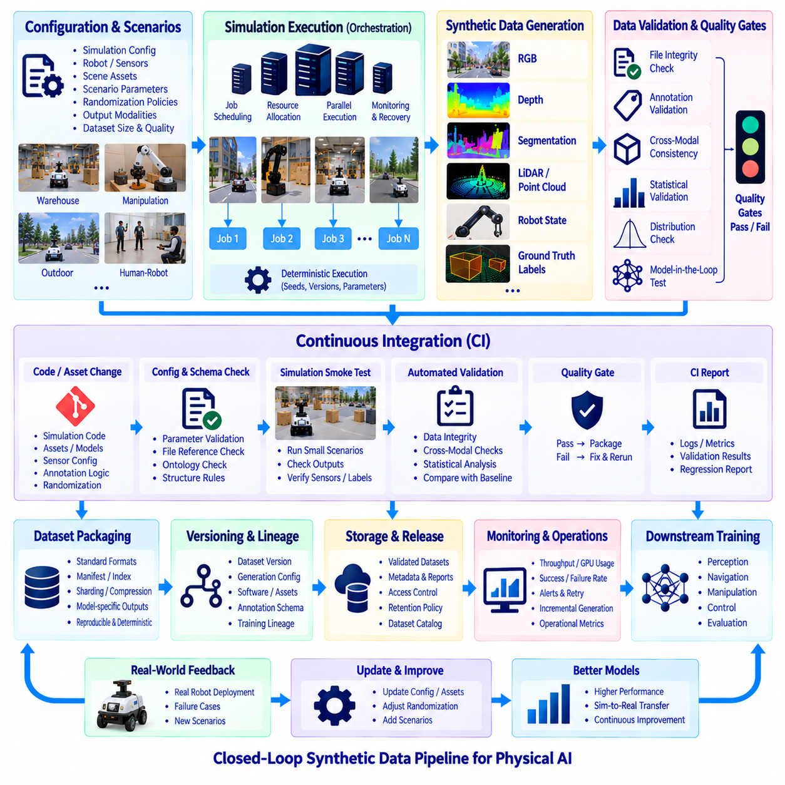{width="7.268055555555556in" height="7.268055555555556in"}

Synthetic data generation pipeline automation transforms simulation-based data production from a manual engineering activity into a repeatable, scalable, and governed operational process. In robotics and Physical AI, datasets may contain RGB images, depth maps, segmentation masks, point clouds, robot states, and ground-truth labels. Automation coordinates their generation, validation, packaging, versioning, and publication so that synthetic data can continuously support AI development.

A production pipeline begins with declarative generation configurations rather than manually configured simulation sessions. Configuration files can define simulation environments, robot models, sensors, scene assets, scenario parameters, randomization policies, output modalities, dataset size, and quality requirements. Separating configuration from execution allows the same pipeline logic to generate different datasets while preserving a clear record of how each dataset was produced.

Scenario definitions provide the operational context for automated generation. A scenario may describe warehouse navigation, object manipulation, outdoor mobility, human-robot interaction, sensor degradation, or rare safety-related conditions. Each scenario can reference parameter distributions and constraints that control object placement, environmental state, sensor configuration, robot behavior, and physical interactions while maintaining the semantic purpose of the generated data.

The orchestration layer converts these configurations into executable simulation jobs. It determines which scenarios must run, allocates compute resources, initializes simulation environments, monitors execution, and collects generated outputs. Large workloads can be divided into independent jobs based on scenes, random seeds, scenario groups, or episode ranges, allowing synthetic data production to scale across multiple GPUs or compute nodes without changing dataset semantics.

Deterministic execution is important for debugging and reproducibility. Every generation job should record random seeds, configuration versions, simulation software versions, robot models, sensor definitions, asset identifiers, and execution parameters. When an invalid sample or model failure is discovered later, engineers can reconstruct the corresponding simulation condition instead of attempting to approximate the original environment manually.

Generated sensor outputs should be synchronized and organized automatically. RGB, depth, semantic segmentation, instance segmentation, LiDAR, point clouds, robot poses, joint states, trajectories, and environmental states may belong to the same simulation frame or episode. Common timestamps, frame identifiers, and scenario identifiers preserve these relationships and enable downstream multimodal training without requiring manual reconstruction of data associations.

Automated annotation generation is integrated directly into the pipeline because the simulator already contains structured knowledge of the virtual environment. Object classes, instance identities, poses, segmentation masks, depth, 3D bounding boxes, and other ground-truth information can be produced alongside sensor observations. Annotation schemas should be versioned so that changes in class definitions or labeling rules remain traceable across dataset generations.

Domain randomization can be executed as a managed pipeline stage rather than embedded informally in simulation scripts. Lighting, materials, textures, object poses, environment layouts, sensor parameters, noise models, and physical properties can be sampled from explicitly versioned distributions. This allows engineers to compare randomization policies and determine which parameter ranges contribute to improved real-world model performance.

Continuous Integration, or CI, extends software engineering practices into synthetic data generation. Changes to simulation code, robot descriptions, sensor models, assets, annotation logic, or randomization policies can trigger automated checks before they are accepted into the production generation environment. The objective is to detect changes that silently alter dataset quality or semantics before large and expensive generation jobs are executed.

A CI pipeline can begin with lightweight configuration and schema validation. It can verify that required parameters exist, file references are valid, class identifiers follow the approved ontology, sensor configurations remain within permitted ranges, and scenario definitions satisfy structural rules. These inexpensive checks should occur before simulation execution because they can identify many errors without consuming significant GPU resources.

The next CI stage can execute small representative simulation tests. Instead of generating an entire dataset, the system produces a limited number of frames or episodes from selected scenarios. These smoke tests confirm that environments load correctly, robots initialize, sensors produce outputs, annotations are generated, coordinate transforms remain available, and output directories follow the expected structure.

Data validation follows successful simulation execution. Automated checks can detect missing frames, empty point clouds, invalid depth values, corrupted images, incorrect dimensions, missing labels, non-finite coordinates, inconsistent timestamps, or broken relationships between sensor data and annotations. Failed samples and failed jobs should be isolated automatically so that invalid outputs cannot silently enter approved training datasets.

Cross-modal validation provides stronger guarantees for multimodal synthetic data. Depth values can be compared with scene geometry, point clouds can be projected into camera images, segmentation labels can be checked against visible objects, and robot poses can be validated against coordinate transforms. These tests verify that individual files are not merely valid in isolation but remain spatially and temporally consistent with related modalities.

Statistical validation examines the distribution produced by a generation job. Class frequencies, object counts, pose distributions, lighting ranges, sensor distances, point densities, occlusion levels, and scenario coverage can be compared against expected boundaries. This detects failures where the pipeline produces technically valid samples but generates an unintended distribution because of changes in randomization logic, assets, or scenario configuration.

Quality gates determine whether generated data can advance to the next lifecycle stage. A generation run may be rejected if integrity checks fail, annotation errors exceed thresholds, required scenarios are missing, or distribution statistics fall outside approved ranges. Passing these gates converts raw generated output into a validated dataset candidate suitable for packaging, cataloging, and controlled use in AI training.

Pipeline automation should distinguish temporary outputs from durable data products. Intermediate rendering artifacts, simulator caches, debug logs, raw frames, validated samples, derived training formats, and reports have different lifecycle requirements. Temporary artifacts can be removed after successful validation, while essential metadata, generation configurations, quality reports, and approved datasets should be retained according to reproducibility and governance requirements.

Dataset packaging converts validated outputs into standardized structures expected by downstream AI systems. The pipeline may create manifests, indexes, shards, compressed archives, or model-specific representations while preserving references to original samples and metadata. Packaging should be deterministic so that identical validated inputs and configuration produce equivalent training artifacts whenever the transformation is repeated.

Versioning connects each published dataset to the exact pipeline state that produced it. A dataset version should reference generation configuration, simulation software, scene assets, robot models, sensor definitions, randomization policy, annotation schema, validation rules, and packaging logic. This information allows teams to determine whether performance changes originate from models, training settings, or changes in synthetic data production.

Data lineage extends this traceability through subsequent training. Published datasets can receive immutable identifiers, and training manifests can record which dataset versions and subsets were consumed by each model experiment. Model evaluation results can then be traced backward through training data, validation reports, generation jobs, and simulation configurations, creating an auditable relationship between synthetic data engineering and AI performance.

CI can also include regression testing against previously approved dataset baselines. Representative generation runs can be compared using image statistics, point-cloud characteristics, label distributions, scenario coverage, or selected model-based metrics. Significant deviations do not necessarily indicate failure, but they should be identified explicitly so engineers can determine whether the change is intentional before approving a new pipeline version.

Model-in-the-loop validation provides an additional level of automation. A small reference model can be evaluated using newly generated data, or a controlled training experiment can compare the new dataset against a previous version. Unexpected changes in model behavior may reveal data problems that file-level and statistical checks cannot detect, particularly when modifications alter subtle task-relevant characteristics.

Continuous Delivery principles can be applied after CI validation. Approved pipeline versions can automatically generate scheduled or requested dataset releases, while failed validation prevents publication. Production generation should remain separated from experimental simulation development so that exploratory changes do not automatically modify governed datasets used by training teams or deployed AI systems.

Monitoring is necessary because large simulation jobs can fail partially even when the pipeline definition is correct. Operational metrics can track completed episodes, failed jobs, generation throughput, GPU utilization, output volume, validation failure rates, and processing latency. Alerts can identify abnormal conditions early, while retry policies can recover from transient failures without regenerating already completed and verified data.

Efficient automation should support incremental generation rather than rebuilding entire datasets after every change. If only a specific scenario, asset group, or sensor configuration changes, the pipeline can regenerate affected partitions while preserving valid unchanged data. Dependency tracking is therefore important for determining which dataset components are invalidated by modifications to simulation inputs or generation logic.

Security and governance should also be integrated into automation. Access controls can restrict who modifies approved generation configurations, assets, validation rules, and published datasets. Asset licenses, provenance information, dataset ownership, and retention policies can be checked during pipeline execution. This ensures that technically valid synthetic data also satisfies organizational requirements before it becomes part of the training ecosystem.

The complete automated architecture forms a continuous simulation-data-model feedback loop. Real robot failures and model evaluations identify missing scenarios, engineers update simulation configurations or randomization policies, CI verifies the changes, automated generation produces validated dataset versions, and training pipelines consume them. New models are evaluated again in real environments, turning synthetic data generation into a continuously governed data production system for Physical AI.

## 11.08 Synthetic Data Storage Management: Versioning [w/Code]

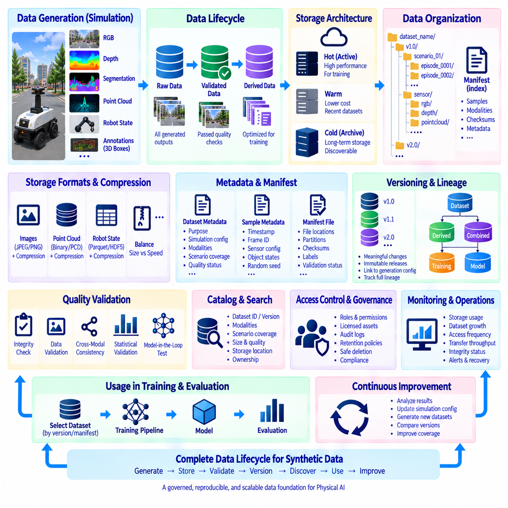{width="7.268055555555556in" height="7.268055555555556in"}

Synthetic data storage management must treat generated datasets as governed data products rather than temporary outputs of simulation. Robotics pipelines can produce millions of RGB images, depth maps, segmentation masks, point clouds, trajectories, robot states, and annotations. Without an explicit storage architecture, these outputs rapidly become difficult to locate, reproduce, validate, and associate with the simulation configurations that created them.

Storage design begins by separating data according to lifecycle and purpose. Raw simulation outputs preserve the original generated observations, validated datasets contain samples that passed quality controls, and derived datasets provide formats optimized for particular training frameworks or models. Temporary render files, caches, and intermediate artifacts should remain separate because their retention requirements differ from those of reproducible training data.

A logical namespace should identify datasets independently from their physical storage locations. Dataset names can encode project, task, modality, scenario family, or generation campaign while immutable identifiers distinguish individual releases. This abstraction allows data to move between local storage, network-attached storage, object storage, or archival systems without changing the identity referenced by training pipelines and experiment records.

Directory and object-key structures should remain predictable across dataset generations. A hierarchy can organize data by dataset version, scenario, episode, sensor, modality, and frame while manifests provide a higher-level index. Consistent organization reduces custom loading logic and allows automated tools to discover related RGB, depth, point-cloud, annotation, and robot-state records without relying on manually maintained paths.

Large synthetic datasets benefit from partitioning because individual-file access can become inefficient at scale. Data can be partitioned by scenario, scene, episode range, modality, or generation job and packaged into shards or archives of manageable size. Appropriate partitioning improves parallel training access, transfer efficiency, validation, and recovery while avoiding extremely large directories containing millions of small independent files.

Storage formats should reflect the characteristics of each modality. Images may use standard compressed image formats, point clouds may require binary or structured representations, and numerical robot states can use columnar or array-oriented formats. The storage strategy should balance fidelity, compression ratio, decoding cost, random-access requirements, interoperability, and the ability to preserve metadata required for reproducible robotics experiments.

Compression can significantly reduce storage requirements, but the selected method should match downstream access patterns. Maximum compression may save capacity while increasing CPU overhead and training latency. Frequently accessed datasets may favor faster decompression, whereas cold archives can prioritize storage efficiency. Compression settings should therefore be considered part of the dataset configuration and recorded with each published version.

Metadata is the connection between stored files and their engineering meaning. Dataset-level metadata can describe purpose, creation time, simulation environment, modalities, schema versions, scenario coverage, and quality status. Sample-level metadata can record timestamps, frame identifiers, sensor configuration, object states, random seeds, and generation parameters. Both levels are necessary for search, debugging, filtering, and reproducibility.

A dataset manifest provides a machine-readable inventory of the data product. It can reference sample locations, partitions, checksums, modalities, labels, scenario identifiers, and validation status without requiring applications to scan the entire storage hierarchy. Training pipelines can consume manifests to construct reproducible subsets, while validation and governance systems can use the same records to verify dataset completeness and provenance.

Checksums should be generated for durable dataset artifacts so that corruption or unintended modification can be detected. Verification can occur after generation, transfer, archival, restoration, or replication. For very large datasets, checksums may be maintained at file, shard, or partition level depending on operational requirements. Integrity metadata becomes especially valuable when synthetic datasets are copied across multiple storage tiers or sites.

Versioning should represent meaningful changes to data rather than simply changes to file names. A new version may be required when generation parameters, scene assets, sensor models, annotation schemas, randomization policies, validation rules, or sample composition changes. The version should describe the complete logical dataset state used by a model experiment so that the same training input can later be reconstructed.

Immutable dataset releases provide a strong foundation for reproducibility. Once a validated version is published and referenced by model training, its contents should not be silently modified. Corrections can be released as a new version while the previous version remains identifiable. This prevents an experiment from producing different results later because files associated with the same dataset name were replaced or edited.

Dataset versioning should be connected to generation configuration versioning. A published dataset can reference the exact simulator version, scenario configuration, randomization policy, robot model, sensor definition, scene assets, annotation schema, and pipeline code used during generation. This relationship distinguishes the version of the stored data product from the versions of the components that produced it while preserving full traceability.

Data lineage extends version information into a graph of transformations. A validated dataset may originate from several generation jobs, a training dataset may combine multiple validated partitions, and a model-specific dataset may be derived through filtering, resizing, conversion, or augmentation. Recording these parent-child relationships allows engineers to trace a training sample back through every transformation to its simulation origin.

Storage systems should support references instead of unnecessary physical duplication. Different training experiments may require alternative subsets, class balances, scenario mixtures, or synthetic-real combinations, but each combination does not need a complete copy of the underlying files. Manifests, views, or index layers can define logical datasets while shared immutable objects remain stored only once whenever the infrastructure permits.

Deduplication can further reduce capacity consumption when simulation campaigns reuse identical assets or generated artifacts. Content hashes can identify duplicate objects, while shared scene resources and metadata can be referenced rather than copied into every dataset release. Deduplication must remain transparent to dataset identity so that storage optimization does not weaken reproducibility or make historical versions dependent on mutable external files.

A tiered storage architecture can align cost and performance with dataset usage. Active datasets used for training require high-throughput storage close to compute resources, while recently completed datasets may reside in lower-cost warm storage. Older validated versions, raw simulation outputs, and audit records can move to cold archival tiers while remaining discoverable through the catalog and recoverable when required.

Retention policies determine how long each class of synthetic data should remain available. Temporary simulation caches may be deleted quickly, failed generation outputs may be retained only for debugging, and validated releases used by important models may require long-term preservation. Policies should consider reproducibility, regulatory obligations, asset licenses, storage cost, model lifecycle, and the probability that historical datasets will be needed for investigation.

Deletion must be governed as carefully as retention. Removing a dataset that is referenced by a deployed model, experiment, validation report, or derived dataset can destroy lineage and reproducibility. Before deletion, dependency checks should identify downstream references. Where physical removal is necessary, essential manifests, metadata, quality reports, and lineage records may need to remain as durable evidence of the historical data product.

A dataset catalog makes large synthetic repositories usable by humans and automated systems. Catalog entries can expose dataset identifiers, versions, modalities, scenario coverage, size, quality status, creation configuration, ownership, and storage location. Searchable metadata allows engineers to discover existing data before generating duplicates and helps training systems select appropriate datasets according to task and quality requirements.

Access control should be applied at appropriate storage and dataset boundaries. Synthetic data may include licensed commercial assets, proprietary robot designs, customer-specific environments, or restricted simulation scenarios even when no real-world personal data is present. Roles and permissions can control who creates, modifies, publishes, reads, archives, or deletes dataset versions, while audit logs record significant management actions.

Backup and replication strategies should reflect the cost of reproducing the dataset. Although synthetic data can theoretically be generated again, regeneration may require expensive GPU time, unavailable software versions, licensed assets, or historical configurations. Critical validated datasets and metadata therefore may justify replication, while easily reproducible intermediate artifacts can use less expensive protection according to their recovery value.

Storage monitoring provides visibility into capacity and operational health. Systems can track dataset growth, modality-level volume, shard counts, replication status, access frequency, transfer throughput, failed reads, integrity-check results, and storage-tier utilization. These measurements help identify inefficient generation patterns and support decisions about compression, migration, retention, or expansion before storage constraints interrupt AI development.

Training integration should resolve datasets by immutable version or manifest rather than by mutable directory names. A training job can record the dataset identifier, version, selected partitions, preprocessing configuration, and synthetic-real mixture in its experiment metadata. Model artifacts can then retain these references, allowing evaluation results and deployed behavior to be traced directly to the exact data composition used during learning.

Version comparison can reveal how synthetic data evolves across generation cycles. Reports can compare sample counts, class distributions, scenario coverage, sensor configurations, domain-gap metrics, validation results, and storage volume between releases. These comparisons help engineers understand whether a new version expands coverage, corrects defects, changes distribution, or introduces unintended differences that may affect model behavior.

Storage management ultimately connects simulation engineering with model governance. A model should not merely reference "synthetic data," but a precisely identified, validated, immutable, and traceable dataset composition. By combining structured storage, manifests, integrity verification, versioning, lineage, cataloging, lifecycle policies, and access controls, synthetic data becomes a reproducible engineering asset rather than an accumulation of simulation files.

The resulting architecture forms a continuous data lifecycle from generation to archival. Simulation produces raw observations, validation promotes acceptable samples, packaging creates governed dataset versions, catalogs make them discoverable, training consumes immutable references, and model evaluation generates evidence about their usefulness. Feedback drives new dataset versions while lineage preserves history, enabling Physical AI systems to evolve without losing control of the data foundation behind their models.

## 11.09 Synthetic Data Legal and Ethical Considerations

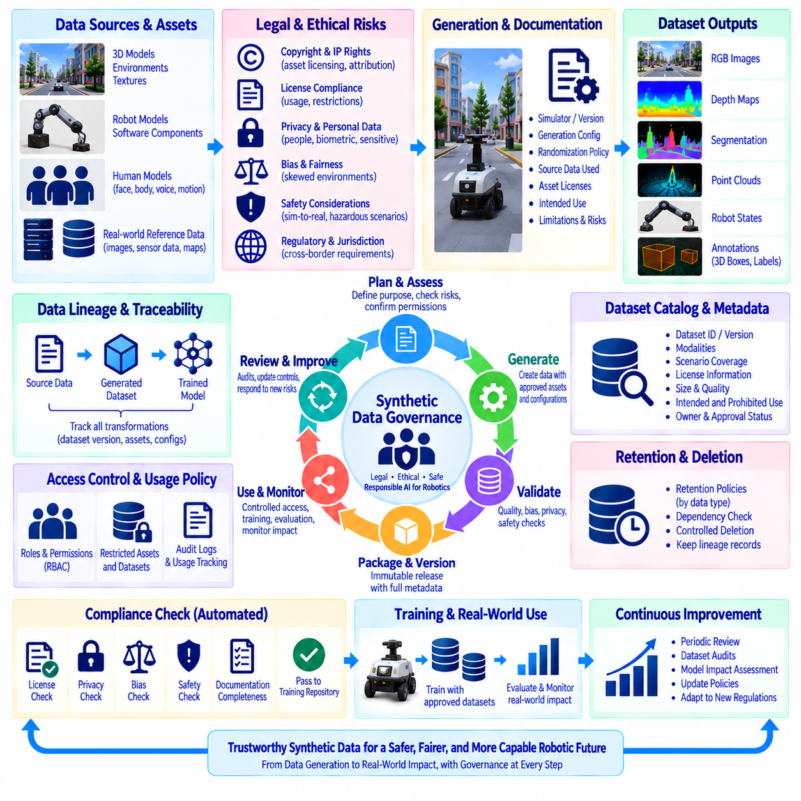{width="7.268055555555556in" height="7.268055555555556in"}

Synthetic data can reduce the cost and difficulty of collecting large robotics datasets, but its artificial origin does not remove legal or ethical responsibilities. A synthetic dataset may still incorporate copyrighted assets, licensed simulation environments, proprietary robot models, personal likenesses, restricted source data, or information derived from real observations. Legal and ethical assessment should therefore be treated as part of the synthetic-data lifecycle rather than as a separate review performed only before publication or deployment.

Data provenance is the starting point for responsible synthetic-data management. Every dataset should identify the simulator, source assets, generation configuration, randomization policy, software dependencies, and any real-world data used to design or calibrate the simulation. Provenance records allow an organization to determine where a generated asset originated, which permissions apply to it, and whether downstream training or commercial use is consistent with those permissions.

Copyright and intellectual-property rights require particular attention when simulation assets are obtained from external sources. A 3D model, texture, environment, sound file, robot description, or software component may be subject to copyright, contractual restrictions, or other intellectual-property protections. The fact that an asset can technically be imported into a simulator does not establish that it can legally be redistributed, incorporated into a commercial dataset, or used for every intended training purpose.

Licensing information should therefore be preserved together with asset and dataset metadata. Each external asset can be associated with its license, source, permitted uses, attribution requirements, restrictions, and applicable version. Dataset packaging should not remove this information. When a dataset combines assets with different licensing conditions, the resulting dataset should be reviewed as a composite product so that the most restrictive applicable conditions are not overlooked.

Synthetic data may also be generated from real-world reference data, and this creates a different set of legal considerations. A simulator may use real images, measurements, trajectories, maps, or sensor statistics to construct realistic environments or calibrate noise models. Even when the final output is synthetic, the source information may remain subject to privacy, contractual, confidentiality, intellectual-property, or data-protection requirements. The organization should therefore document the relationship between source data and generated outputs.

Privacy risks require special consideration when synthetic environments contain representations of people. Human models, faces, body characteristics, voices, behavioral patterns, or trajectories may be derived from real data or intentionally designed to resemble realistic individuals. Synthetic generation can reduce direct exposure to personal information, but it should not automatically be assumed that every synthetic representation is legally or ethically free of privacy concerns.

Biometric and sensitive attributes require additional controls when they are represented or inferred in synthetic datasets. A system designed for perception or human-robot interaction may generate variations in faces, body posture, age-related appearance, clothing, or other human characteristics. The purpose of these variations should be clearly defined, and unnecessary representation of sensitive characteristics should be avoided. Data generation should remain proportional to the actual robotics task and evaluation requirement.

Human representation also raises consent and likeness considerations when real individuals are used as references. If photographs, scans, motion-capture recordings, voices, or other identifiable materials contribute to synthetic assets, the organization should establish the permitted purpose and scope of use before generation. Consent obtained for one activity should not automatically be interpreted as permission for unrelated commercial, research, training, or public-distribution purposes.

Bias can be introduced through the design of synthetic environments even when no personal data is directly used. Asset selection, object distributions, human representations, environmental assumptions, lighting conditions, and scenario frequencies can encode assumptions about how the world should look or how people should behave. Quality assessment should therefore consider whether the generated dataset systematically underrepresents relevant environments or produces distorted representations that could affect downstream model behavior.

Synthetic data can also create an artificial sense of objectivity because its labels are generated automatically. Perfect ground-truth labels do not guarantee that the underlying scenario design is neutral, realistic, or appropriate. A simulator may assign technically correct labels to situations that are poorly representative of actual operations. Ethical review should therefore consider both label correctness and whether the scenarios themselves reflect legitimate and relevant use cases.

Safety is another important consideration for synthetic-data generation in robotics. Synthetic datasets may be used to train perception, navigation, manipulation, or control systems that eventually interact with physical environments. Rare hazardous scenarios can appropriately be overrepresented for testing and training, but generated behavior should not be interpreted as proof of physical safety. Simulation results must remain distinguishable from validated evidence obtained from appropriate physical testing.

Traceability becomes particularly important when synthetic data contributes to a safety-relevant model. The organization should be able to identify which dataset version, generation configuration, simulation environment, and asset collection contributed to the model. If a problematic asset, scenario, or generation rule is later discovered, lineage information should make it possible to identify affected datasets and models and determine whether retraining or additional validation is required.

Transparency should extend to the intended users of synthetic datasets. Dataset documentation should state that the data is synthetic, describe its generation methodology at an appropriate level, identify important limitations, and explain whether real data was used to design, calibrate, or validate the generation process. Clear documentation prevents downstream users from treating synthetic observations as direct measurements of the physical world.

Synthetic-data governance should also address contractual and organizational responsibilities. A dataset may be generated internally but still depend on licensed simulation software, external assets, cloud services, commercial models, or customer-provided environments. Contracts may define restrictions on processing, redistribution, derivative works, model training, or public disclosure. These conditions should be incorporated into dataset governance rather than being maintained only in separate legal documents.

Cross-border and jurisdictional considerations can become relevant when synthetic datasets are generated, stored, transferred, or used by teams in different countries. Applicable requirements may depend on the origin of source data, the location of processing, contractual relationships, and the nature of the information represented. Organizations should identify applicable jurisdictions and avoid assuming that a dataset has identical legal treatment in every location.

Ethical review should be proportional to the intended application and potential impact. A synthetic dataset for basic object-detection research may present different concerns from one used for surveillance, workplace monitoring, human-robot interaction, or safety-critical autonomous control. The review should consider the purpose of the system, affected people, potential misuse, foreseeable consequences, and whether the selected data-generation approach is necessary for the intended objective.

Dataset documentation can provide a practical control mechanism for these concerns. A synthetic-data record can include provenance, asset licenses, source-data dependencies, privacy classification, intended use, prohibited use, generation configuration, quality status, known limitations, responsible owner, and approval status. Maintaining this information alongside dataset versions makes legal and ethical requirements visible to engineering, research, and operations teams.

Automated governance checks can integrate these requirements into the generation pipeline. Before publication, the system can verify that required license metadata exists, restricted assets are excluded, approved configurations are used, privacy classifications are present, and mandatory documentation has been completed. A dataset that fails governance checks should be prevented from entering the approved training repository until the issue is reviewed and resolved.

Version control is necessary because legal and ethical status can change when dataset composition changes. Adding a new asset, changing a human representation, incorporating a new reference dataset, modifying a license, or expanding the intended use may require a new review even if the underlying simulation software remains unchanged. Dataset versioning should therefore preserve both technical lineage and governance history.

Responsible synthetic-data management also requires controlled access and deletion procedures. Restricted assets or source-derived materials should be accessible only to authorized users, while derived datasets should inherit applicable handling requirements. When an asset is withdrawn or a permission expires, dependency tracking should identify affected dataset versions and prevent further use where necessary. Deletion decisions should preserve sufficient lineage records to maintain historical accountability.

The relationship between synthetic and real data should remain explicit throughout the lifecycle. Synthetic datasets may be combined with real observations for training, validation, or domain adaptation, and the resulting model may inherit characteristics from both sources. Training manifests should record these relationships so that organizations can distinguish what was generated artificially, what was physically observed, and how the two sources were combined.

A mature governance process treats legal and ethical considerations as continuous controls rather than a one-time approval step. New simulation assets, source datasets, generation methods, model applications, and deployment environments can introduce new risks. Periodic review, dataset audits, lineage inspection, and model-impact assessment allow organizations to update controls as the synthetic-data ecosystem evolves.

The complete framework connects provenance, licensing, privacy, consent, bias, safety, transparency, governance, access control, and lifecycle management. Synthetic data becomes a responsible engineering asset when its origin, permitted use, limitations, transformations, and downstream dependencies can be demonstrated. This approach allows robotics organizations to obtain the scalability of simulation while maintaining appropriate legal, ethical, and operational accountability throughout the Physical AI data lifecycle.

## 11.10 Model Performance Improvement via Synthetic Data Case

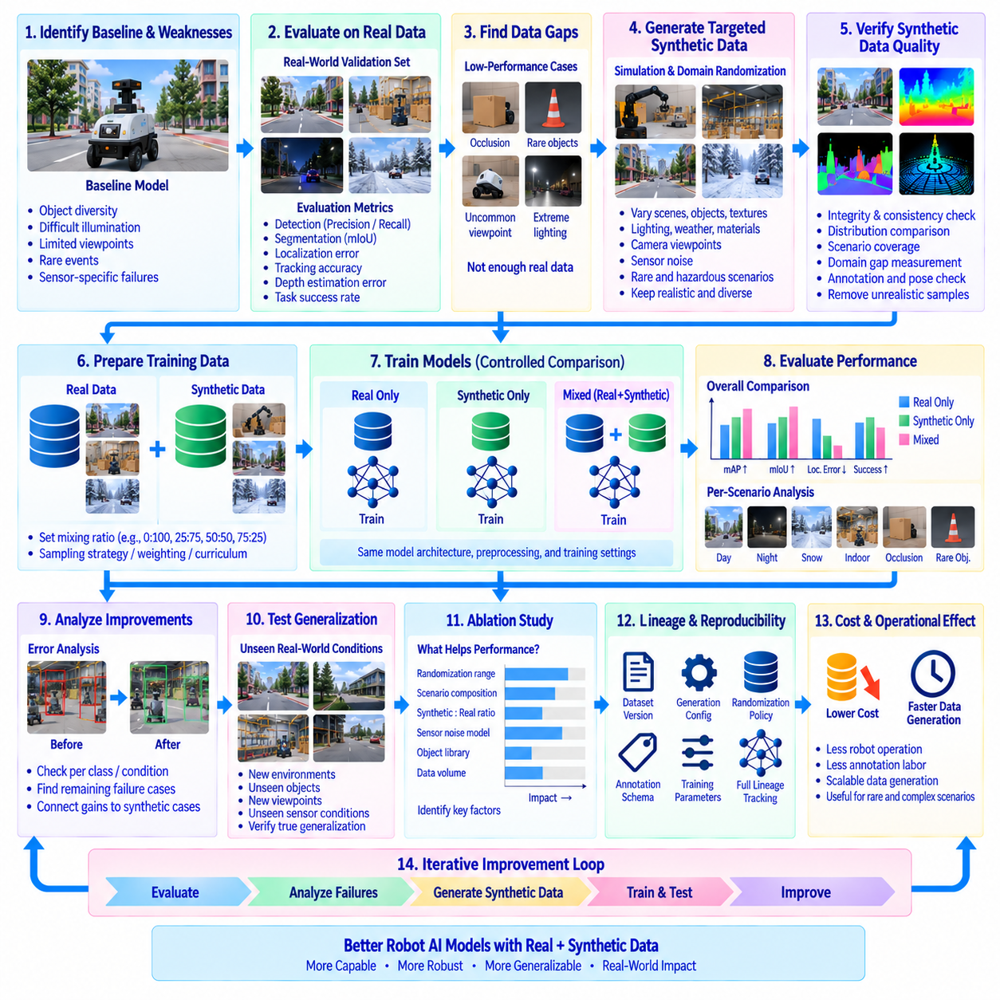{width="7.268055555555556in" height="7.268055555555556in"}

Synthetic data can improve robot AI model performance by expanding the training distribution beyond what can be collected efficiently in physical environments. A performance-improvement case should begin with a clearly identified weakness in the baseline model, such as insufficient object diversity, poor performance under difficult illumination, limited viewpoints, sparse rare-event samples, or sensor-specific failures. Synthetic data is then introduced as a controlled mechanism for addressing those weaknesses rather than simply increasing dataset size.

The baseline model should first be evaluated using an independent real-world validation dataset. Metrics may include detection precision and recall, segmentation quality, localization error, tracking accuracy, depth estimation error, or task-specific success rates. Evaluation should also be separated by relevant conditions such as object class, distance, illumination, occlusion, viewpoint, environment, and sensor state. This establishes a measurable reference against which the contribution of synthetic data can be assessed.

The next stage identifies performance gaps that can realistically be addressed through simulation. For example, a perception model may perform adequately on common objects but fail when objects are partially occluded or observed from uncommon viewpoints. A real dataset may contain too few examples of these conditions to support effective learning. Simulation can deliberately generate additional samples covering these specific conditions while maintaining precise ground-truth annotations.

Synthetic data generation should be controlled by the identified failure modes. Scene configuration, object placement, camera viewpoints, lighting, materials, textures, sensor noise, occlusion, and environmental conditions can be varied according to defined distributions. Domain randomization should provide sufficient diversity without producing unrealistic samples. The objective is not to maximize variation indiscriminately, but to increase useful coverage in regions where the baseline model demonstrates measurable weakness.

Synthetic samples can then be combined with real training data using an explicit mixed-training strategy. The synthetic-to-real ratio should be treated as an experimental variable because excessive synthetic data may cause the model to learn simulation-specific characteristics, while too little synthetic data may provide insufficient additional coverage. Different sampling ratios, weighting policies, or curriculum schedules can be evaluated while keeping the model architecture and evaluation protocol consistent.

A controlled comparison should include at least a real-data baseline and a mixed-data configuration. A synthetic-only configuration can also be useful for understanding how much of the task can be learned from simulation alone. These experiments should use the same model architecture, preprocessing pipeline, optimization settings where appropriate, and independent real-world test data. This makes it possible to distinguish genuine transfer improvements from changes caused by unrelated training conditions.

The quality of synthetic data must be verified before it is used to explain model improvements. Generated images, depth maps, point clouds, annotations, poses, and sensor outputs should pass integrity and consistency checks. Distribution statistics, scenario coverage, sensor characteristics, and domain-gap measurements can be compared with real observations. A larger synthetic dataset should not automatically be considered beneficial if it introduces unrealistic patterns or reinforces a distribution that differs substantially from deployment conditions.

Model performance should be analyzed at both aggregate and scenario levels after mixed training. An improvement in average accuracy may conceal degradation in a particular object class or operational condition. Conversely, a small overall improvement may be highly meaningful if synthetic data substantially reduces failures in rare but important scenarios. Error analysis should therefore connect performance changes to the synthetic conditions that were intentionally introduced during generation.

A useful case study should also examine whether synthetic data improves generalization rather than memorization. Models should be tested on real environments, objects, viewpoints, and sensor conditions that were not directly represented in the training set. If performance improves on previously unseen real conditions, this provides stronger evidence that synthetic data contributed useful representations instead of simply matching a narrow set of training examples.

Ablation experiments can identify which elements of synthetic generation produce the observed improvement. The study may compare different domain-randomization ranges, scenario compositions, synthetic-to-real ratios, sensor-noise models, object libraries, or generation volumes. Such comparisons help determine whether performance is primarily driven by additional samples, greater diversity, improved sensor realism, better rare-event coverage, or more accurate simulation conditions.

The training pipeline should preserve complete dataset and experiment lineage throughout the case. Each model result should reference the real dataset version, synthetic dataset version, generation configuration, randomization policy, annotation schema, sampling ratio, preprocessing configuration, and training parameters. This makes the performance improvement reproducible and allows engineers to determine exactly which synthetic data configuration contributed to a particular model version.

The economic and operational effect of synthetic data should also be considered. Physical data collection can require robot operation, camera or LiDAR deployment, annotation labor, facility access, and repeated experiments. Simulation can generate large quantities of labeled data after the initial environment and scenario models have been prepared. The relevant comparison is therefore not simply the number of synthetic samples produced, but the engineering cost required to obtain equivalent improvements in real-world model performance.

A mature performance-improvement case closes the loop between model evaluation and synthetic-data generation. Real-world evaluation identifies failures, failure analysis defines the missing data conditions, simulation generates targeted synthetic samples, mixed training incorporates them, and independent real-world testing measures the resulting change. The new evaluation results then determine whether additional synthetic generation is necessary, creating an iterative simulation-to-training-to-real-world feedback process.

The final objective is not to replace real data with synthetic data, but to use simulation where it provides a measurable advantage. Real observations remain essential for representing physical sensors, environmental complexity, and deployment behavior, while synthetic data provides scalable coverage, precise annotations, controllable variation, and efficient generation of rare conditions. When these sources are governed through quality assessment, versioning, lineage, and controlled experimentation, synthetic data becomes a practical mechanism for continuous robot AI model improvement.
