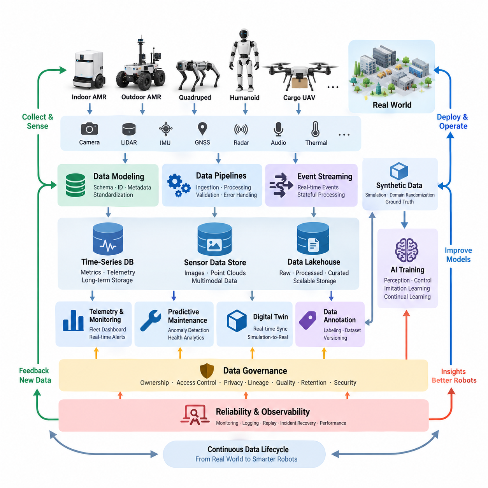
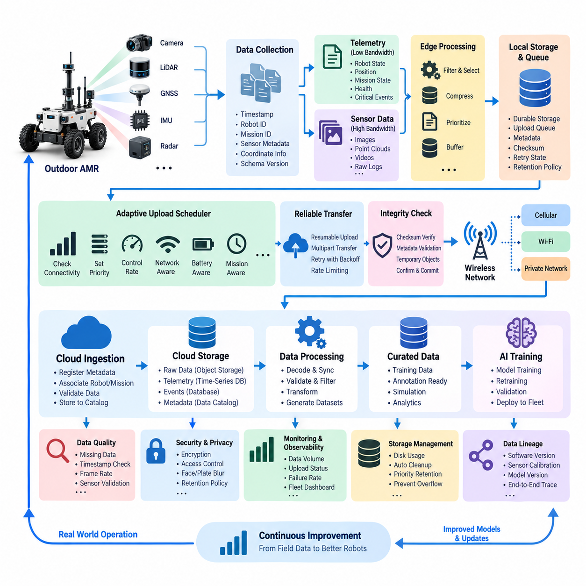
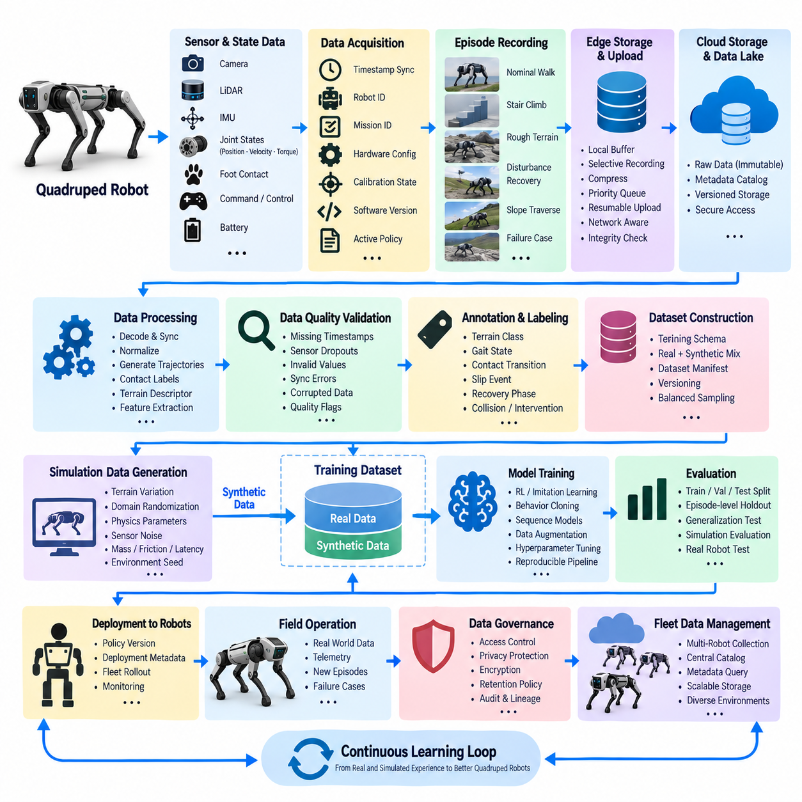
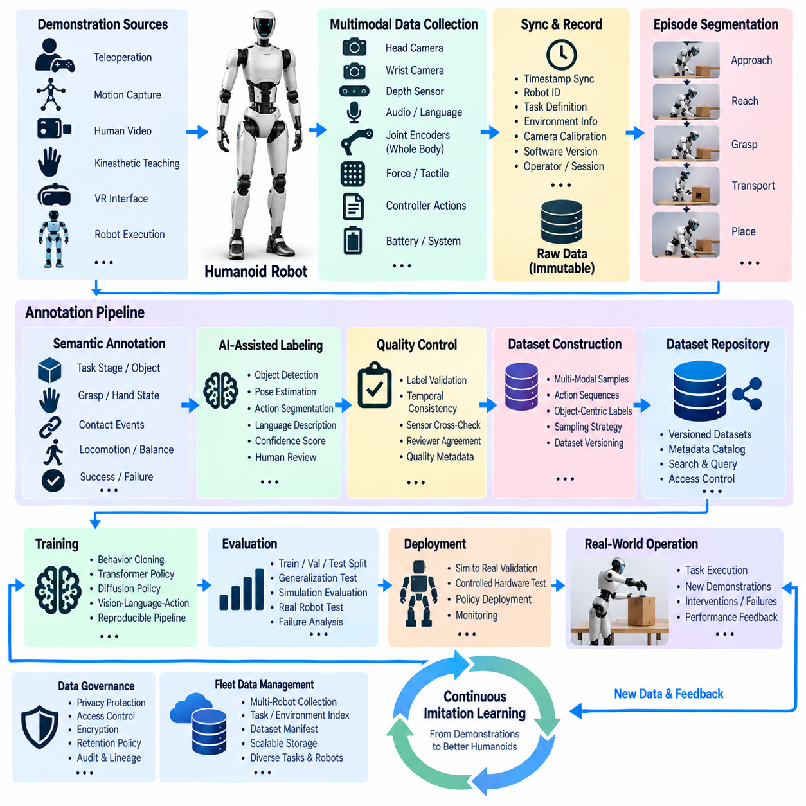
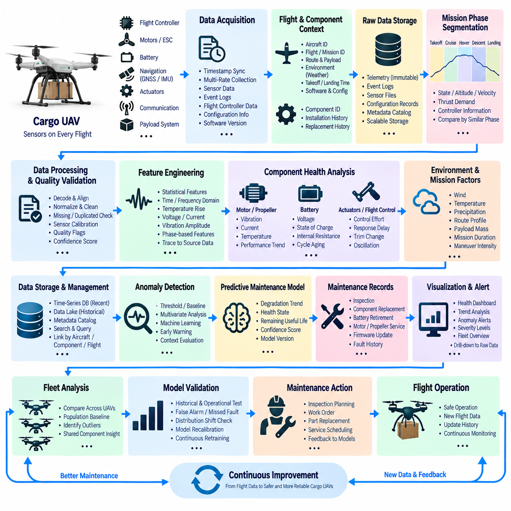
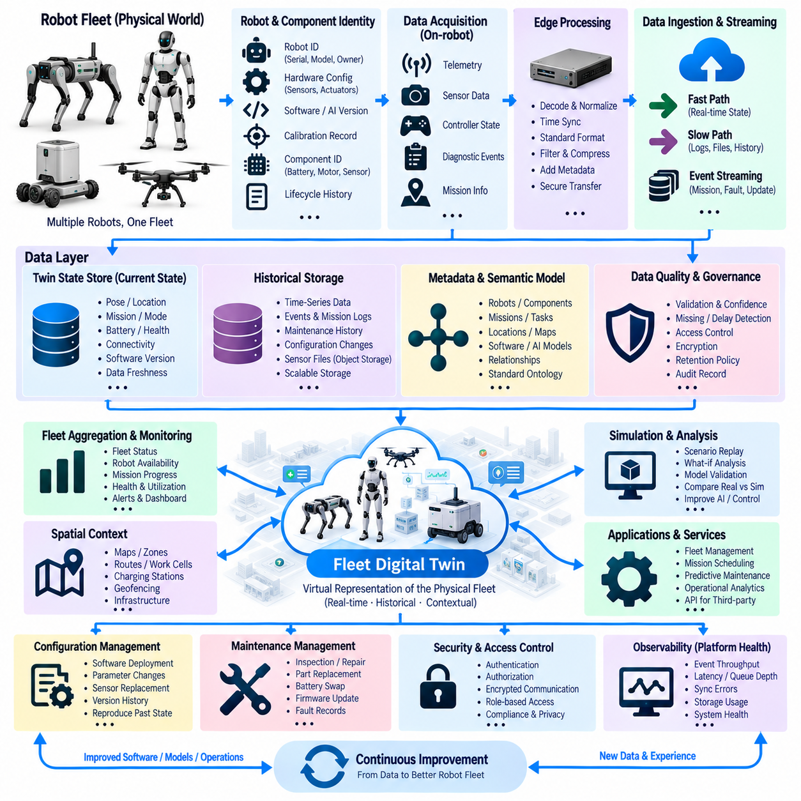
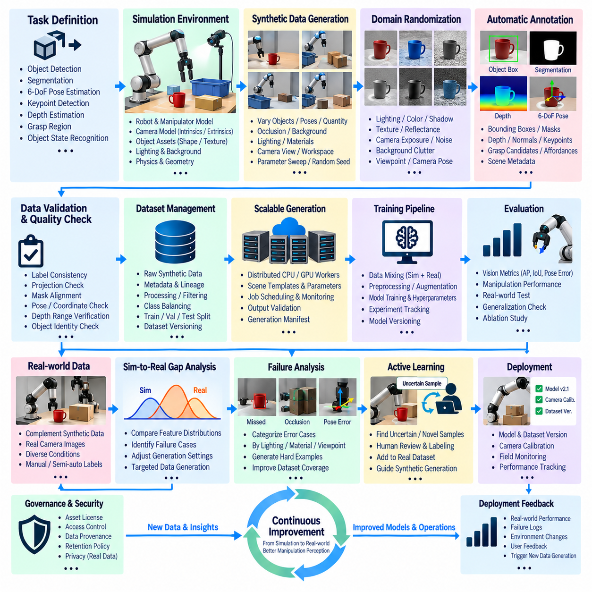
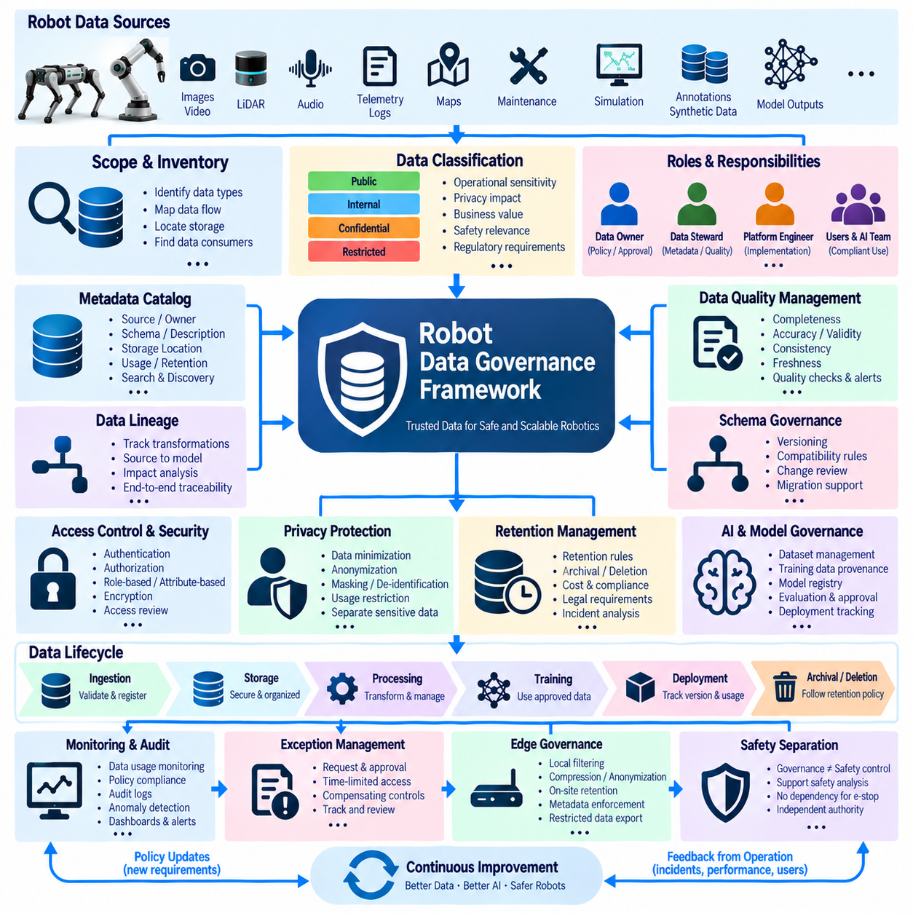
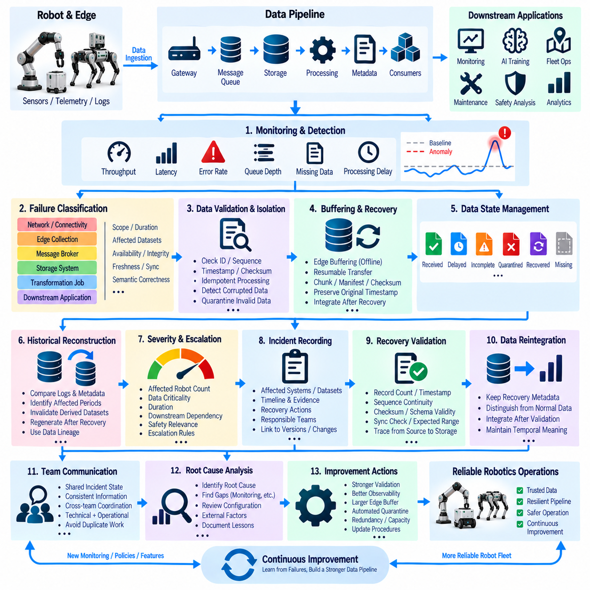
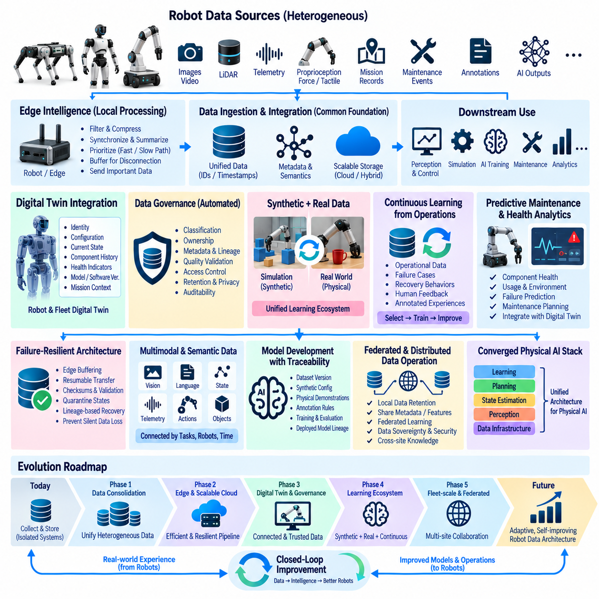

**Volume 07 Robot Data Architecture**

# 12. Data Case Studies

## 12.01 Indoor AMR Telemetry Pipeline Build and Operation

{width="7.268055555555556in" height="7.268055555555556in"}

Robot data architecture becomes meaningful when its individual mechanisms are combined into operational systems that must function continuously under physical, network, computational, and organizational constraints. The case studies in this chapter examine how data modeling, pipelines, telemetry, event streaming, time-series storage, sensor management, AI datasets, digital twins, governance, annotation, and synthetic data operate together across representative robotic platforms.

An indoor autonomous mobile robot provides a practical example of a telemetry-centered architecture. Navigation state, battery condition, motor current, localization confidence, mission progress, safety events, and diagnostic information are collected onboard and converted into standardized telemetry records. Lightweight edge processing filters unnecessary samples, while important operational states are transmitted to fleet services for monitoring, historical analysis, maintenance planning, and mission optimization.

Because indoor robots frequently operate through Wi-Fi environments with variable coverage, telemetry pipelines cannot assume permanent connectivity. Local buffering preserves records during communication interruptions, timestamps maintain event ordering, and retransmission mechanisms restore missing information after reconnection. Time-series databases support long-term operational analysis, while event streams distribute urgent conditions such as emergency stops, localization failures, blocked routes, charging faults, and abnormal motor behavior.

Outdoor AMRs introduce substantially larger sensor-data volumes and less predictable communication conditions. Cameras, LiDAR, depth sensors, GNSS, IMU, radar, thermal devices, and other sensors may generate more information than cellular or wireless networks can continuously upload. The architecture therefore separates real-time operational telemetry from high-bandwidth raw sensor data and applies selective recording, compression, event-triggered capture, metadata indexing, and prioritized edge-to-cloud transfer.

This separation creates a layered data strategy. Compact health and mission information can be streamed continuously, while raw images, point clouds, and synchronized multimodal sequences remain onboard until bandwidth or operational policies permit transfer. Critical incidents can trigger preservation of sensor windows before and after an event. Cloud ingestion then validates checksums, timestamps, synchronization metadata, robot identity, mission context, and schema versions before datasets enter long-term storage or AI pipelines.

Quadruped robot learning illustrates a different data problem because locomotion training depends on tightly synchronized observations, actions, terrain interactions, and outcomes. Joint positions, velocities, torques, IMU measurements, contact states, perception features, commands, and controller outputs must retain temporal relationships. Training datasets therefore require explicit episode boundaries, robot configuration metadata, environment descriptions, policy versions, reward information, and failure classifications to preserve reproducibility across experiments.

Humanoid imitation learning extends this requirement to demonstrations containing vision, language, body motion, manipulation, and task context. Human demonstrations may be segmented into meaningful action phases and associated with object states, poses, contact transitions, task outcomes, and quality indicators. Annotation becomes part of the data architecture rather than a separate labeling activity, because annotation schemas, dataset versions, transformation histories, and model-training references must remain traceable throughout repeated learning cycles.

Cargo UAV operations demonstrate the importance of time-series analysis and predictive maintenance. Flight-controller measurements, propulsion data, battery parameters, vibration signals, environmental conditions, navigation states, mission phases, and fault events can be correlated across flights. Instead of treating every flight as an isolated log, the architecture associates records with aircraft identity, component configuration, maintenance history, software version, route context, and accumulated operating exposure.

Such historical organization enables maintenance analytics to search for degradation patterns that appear gradually rather than as immediate failures. Changes in vibration, temperature, electrical load, energy consumption, actuator behavior, or other health indicators can be evaluated against comparable operating conditions. Data quality is especially important because missing samples, clock drift, sensor replacement, firmware changes, and inconsistent mission metadata can create false trends unless lineage and configuration history are preserved.

Fleet digital twins demonstrate how operational data can become a continuously updated representation of physical assets. Each robot maintains a logical identity linked to configuration, current state, location, mission, health, software, battery condition, and relevant historical records. Streaming updates modify the digital representation, while persistent time-series and event stores retain historical behavior. Fleet-level aggregation then supports visualization, analysis, simulation, maintenance, and operational planning.

A useful digital twin architecture does not simply duplicate every raw measurement. It organizes physical state according to different update rates and business meanings. Fast-changing motion information may remain near the edge, operational status may update fleet services frequently, and long-term engineering data may be stored asynchronously. This hierarchy reduces unnecessary traffic while maintaining sufficient fidelity for monitoring, simulation-to-real comparison, predictive maintenance, and fleet-level decision support.

Synthetic data provides another case in which architecture determines whether generated information becomes useful engineering evidence. Manipulator perception systems can generate simulated images, depth maps, segmentation masks, object poses, and scene metadata across controlled variations of lighting, materials, backgrounds, camera viewpoints, clutter, and object placement. Automatic ground-truth generation reduces manual annotation effort, but synthetic datasets still require versioning, quality evaluation, and traceable generation configurations.

The value of synthetic information is ultimately measured through its contribution to real-world model performance. Consequently, simulated and physical datasets should not become isolated repositories. Their schemas, class definitions, coordinate conventions, preprocessing stages, and evaluation splits must remain compatible. Domain-gap analysis can identify conditions where simulation poorly represents reality, and those findings can guide additional physical collection, improved simulation assets, domain randomization, or revised mixed-training ratios.

Data governance becomes essential as these pipelines expand across robots, teams, sites, and AI development environments. A governance implementation defines ownership, classification, access permissions, retention rules, privacy requirements, encryption policies, dataset lineage, and quality expectations. Sensor recordings containing people or sensitive environments may require additional controls such as access restriction, anonymization, face blurring, limited retention, and auditable deletion procedures before broader engineering use.

Governance must also cover derived information. A training dataset may originate from raw sensor recordings, pass through filtering and annotation, be combined with synthetic data, and then produce multiple model versions. Without lineage tracking, engineers may know which model performs well but not which exact data produced it. Catalogs, immutable identifiers, dataset versions, schema histories, annotation versions, and training references create the traceability required to reproduce results and investigate later failures.

Pipeline failures provide a particularly important operational case study because robot data systems interact with unreliable networks, heterogeneous software, distributed storage, and continuously evolving schemas. Failures may include malformed messages, incompatible schema versions, duplicated events, corrupted files, delayed streams, incomplete uploads, storage exhaustion, synchronization errors, or downstream service outages. Robust architectures detect these conditions rather than allowing silent data loss or contamination.

Recovery therefore depends on observable and replayable pipelines. Data can be retained at intermediate boundaries, failed records can be isolated, offsets or checkpoints can identify processing progress, and idempotent operations can prevent replay from producing incorrect duplicates. Monitoring of throughput, latency, queue depth, consumer lag, error rates, storage capacity, and data-quality indicators provides early warning, while incident records become engineering data for improving future reliability.

Across all cases, the architecture evolves from simple data collection toward a closed-loop robotic intelligence platform. Operational telemetry supports fleet optimization, sensor recordings become training resources, digital twins connect physical and virtual systems, annotations transform observations into supervised knowledge, synthetic generation expands rare scenarios, and governance maintains trust. These functions increasingly converge into a continuous data lifecycle rather than remaining independent engineering subsystems.

Future robot data architectures will therefore need to support heterogeneous fleets, multimodal foundation models, continual learning, large-scale simulation, edge intelligence, and increasingly autonomous data selection. Robots will determine which experiences are informative, preserve unusual situations, request additional labeling, compare real observations with simulated expectations, and feed validated experience back into training pipelines. Data architecture becomes part of the robot learning architecture itself.

The long-term objective is a traceable loop connecting physical operation, data acquisition, edge processing, cloud or on-premise storage, governance, AI training, validation, deployment, and renewed field experience. This loop must preserve the relationship between a robot\'s behavior and the data, software, model, configuration, and environment that produced it. Such traceability provides the foundation for scalable Physical AI systems whose capabilities can improve while remaining measurable, reproducible, and operationally manageable.

## 12.02 Outdoor AMR Sensor Data Cloud Upload Case

{width="7.268055555555556in" height="7.268055555555556in"}

Outdoor autonomous mobile robots operate in environments where sensor data volumes are high, communication quality changes continuously, and cloud connectivity cannot be guaranteed. A practical cloud upload architecture must therefore separate robot operation from data transfer. Navigation and safety functions continue locally, while the data subsystem independently determines what information should be recorded, prioritized, compressed, buffered, and eventually transferred to centralized storage.

An outdoor AMR may simultaneously generate camera images, LiDAR point clouds, GNSS measurements, IMU signals, radar observations, localization states, control commands, diagnostic events, and system telemetry. These sources differ greatly in frequency, size, and operational importance. The data architecture therefore assigns standardized timestamps, robot identifiers, mission identifiers, sensor metadata, coordinate information, and schema versions so that independently generated records can later be reconstructed as a synchronized operational sequence.

Continuous transmission of every raw sensor stream is normally inefficient because available wireless bandwidth can be substantially smaller than the robot\'s sensor generation rate. The onboard collection layer consequently separates lightweight telemetry from high-bandwidth sensor payloads. Robot health, position, mission state, connectivity, and critical events can be transmitted continuously, while images, point clouds, and other large files are retained temporarily in edge storage and uploaded according to configurable policies.

Selective recording further reduces unnecessary storage and network consumption. Instead of preserving every sensor frame at full fidelity, the robot can retain information associated with operationally valuable situations such as localization uncertainty, obstacle encounters, emergency stops, route deviations, perception failures, abnormal vibration, or human intervention. Circular buffers can preserve several seconds of information before an event so that engineers receive both the triggering condition and the preceding context required for analysis.

Reliable timestamps are essential because uploaded sensor files may arrive in the cloud at completely different times from when they were generated. Camera, LiDAR, IMU, GNSS, radar, and robot-state messages must therefore preserve acquisition timestamps independently of upload timestamps. Clock synchronization and explicit timing metadata allow downstream systems to reconstruct multimodal sequences, analyze cause-and-effect relationships, create training samples, and replay incidents without depending on network delivery order.

Before upload, large sensor payloads can be compressed using formats appropriate to their characteristics. Images and video may use efficient image or video codecs, while point clouds can use specialized compression or reduced representations when loss is acceptable. Compression policies should distinguish archival, debugging, and AI-training requirements because excessive compression may remove details needed later. Metadata should record the encoding method and parameters so that downstream processing remains reproducible.

Edge buffering protects data when the robot enters areas with weak cellular, Wi-Fi, or private-network coverage. Files are first committed to durable local storage and registered in an upload queue rather than deleted immediately after transmission begins. Each queue entry can include file location, checksum, size, priority, retry state, creation time, mission context, and destination. This design decouples sensor acquisition from network availability and prevents temporary outages from interrupting robot operation.

The upload scheduler continuously evaluates connectivity and queue conditions before selecting the next transfer. Small critical records and incident packages receive higher priority than routine bulk data, while very large datasets can wait for high-bandwidth connectivity. Policies may consider signal quality, available throughput, network cost, battery condition, mission state, local storage utilization, and cloud urgency. Upload behavior therefore becomes an adaptive resource-management process rather than a simple file-copy operation.

Large files should be transferred using resumable or multipart mechanisms so that a connection failure does not require restarting an entire upload. Each completed segment can be acknowledged independently, while retries continue from the last confirmed position. Exponential backoff can prevent unstable networks from generating excessive retry traffic. Upload workers should also be rate limited so that background data transfer never consumes network or compute resources required by navigation and safety services.

Data integrity must be verified at both ends of the transfer. The robot calculates checksums before transmission, and the receiving service verifies them after upload before declaring an object complete. Temporary cloud objects remain separate from validated objects so that interrupted transfers cannot be mistaken for usable datasets. Only after integrity verification and metadata validation should local retention policies permit deletion of the corresponding edge copy.

Cloud ingestion performs more than storage. Incoming objects are associated with robot identity, mission, sensor type, acquisition period, geographic or operational context, software version, and configuration information. Metadata records may be written to searchable catalogs while large binary payloads remain in scalable object storage. Time-series telemetry, events, and raw sensor objects can therefore use different storage technologies while remaining connected through common identifiers and timestamps.

A practical architecture often organizes cloud sensor information into raw, processed, and curated layers. The raw layer preserves uploaded evidence as close as possible to its acquired form. Processing pipelines then decode, synchronize, validate, filter, or transform the data. Curated datasets contain selected and quality-controlled samples suitable for analytics, simulation, annotation, or AI training. This separation preserves original evidence while allowing downstream representations to evolve independently.

Data quality validation begins immediately after ingestion. The system can detect missing files, impossible timestamps, unexpected frame rates, corrupted payloads, sensor dropouts, inconsistent coordinate frames, incomplete mission metadata, or synchronization gaps. Quality results become metadata rather than merely log messages. Engineers can therefore query not only which data exists, but also whether a particular sequence satisfies the requirements for debugging, mapping, perception training, or system validation.

Outdoor environments frequently include people, vehicles, buildings, license plates, and location information, making privacy and security integral to the upload pipeline. Sensitive sensor data should be encrypted during transfer and protected through access control in storage. Depending on operational requirements, privacy transformations such as face or license-plate blurring may be performed before broader use, while original data can remain restricted under stronger authorization and retention policies.

Observability is required to operate the pipeline across an entire fleet. Dashboards can track generated data volume, local storage utilization, queued bytes, upload throughput, retry counts, transfer latency, failure rates, cloud ingestion delay, and validation results for every robot. Fleet operators can identify robots accumulating excessive backlogs or repeatedly losing connectivity, while engineers can distinguish network problems from sensor, storage, application, or cloud-service failures.

Storage pressure requires explicit protection mechanisms because prolonged network outages may fill onboard disks. Retention policies can reserve capacity for safety and incident data while progressively removing low-value information. Previously uploaded and verified files are deleted first, followed by expendable routine recordings if necessary. Critical incident packages, diagnostic evidence, and manually protected datasets receive longer retention so that automatic cleanup does not destroy information needed for investigation.

The uploaded information becomes more valuable when connected to the AI data lifecycle. Difficult perception scenes, unusual obstacles, localization failures, and intervention events can be automatically indexed as candidates for annotation or retraining. Engineers can select these samples from the cloud, create labeled datasets, train improved perception or navigation models, validate them, and deploy updated models back to the fleet. Field operation consequently becomes a source of targeted learning data.

A mature outdoor AMR architecture closes this loop by linking every uploaded sequence with the software, configuration, sensor calibration, and AI model versions active when it was collected. When an incident occurs, engineers can reconstruct not only what the sensors observed but also which system state produced the behavior. The same lineage allows model-development teams to determine exactly which field experiences contributed to later training datasets and deployed models.

The resulting design treats cloud upload as a resilient distributed data pipeline rather than continuous raw-data streaming. Edge autonomy protects robot operation, buffering absorbs network instability, prioritization protects important information, resumable transfer improves reliability, validation protects data quality, and governance controls long-term use. Together these mechanisms transform heterogeneous outdoor sensor streams into trustworthy operational records and reusable AI assets without making robot autonomy dependent on uninterrupted cloud connectivity.

## 12.03 Quadruped AI Training Data Pipeline Case

{width="7.268055555555556in" height="7.268055555555556in"}

A quadruped AI training data pipeline must preserve the relationship between perception, robot state, control actions, physical interaction, and task outcomes. Unlike conventional image datasets, locomotion data is inherently sequential and embodied. Every observation is influenced by previous actions and terrain contacts, so the pipeline must organize synchronized episodes rather than isolated samples while maintaining enough context to reconstruct how each behavior occurred.

During operation, the quadruped can generate joint positions, joint velocities, actuator torques, IMU measurements, foot contact states, commanded velocities, controller outputs, battery information, and perception data from cameras or LiDAR. These signals operate at different frequencies and data rates. A unified acquisition layer therefore assigns timestamps and associates each stream with robot identity, mission, hardware configuration, calibration state, software version, and active policy.

Accurate time synchronization is particularly important for learning locomotion because small temporal errors can incorrectly associate an observation with the wrong action or contact event. High-frequency proprioceptive measurements may be sampled much faster than vision or terrain perception. The pipeline must preserve original acquisition timestamps and provide synchronization rules that align heterogeneous streams into training windows without destroying the temporal resolution required for control analysis.

Raw recordings are typically organized into episodes representing meaningful periods of robot behavior. An episode may correspond to walking across terrain, climbing stairs, recovering from disturbance, following a velocity command, traversing a slope, or experiencing a failure. Episode metadata records initial conditions, environment properties, command profiles, policy versions, robot configuration, termination reasons, and performance outcomes so that training samples retain their operational context.

Not every recorded episode has equal training value. Repeated nominal walking on simple terrain may generate large quantities of redundant information, while slipping, unexpected contact, difficult terrain transitions, recovery behavior, and near-failure conditions may be comparatively rare. Data selection mechanisms can classify episodes by novelty, difficulty, failure type, terrain characteristics, or model uncertainty and preserve valuable experiences at higher priority for future training.

A useful pipeline separates raw evidence from processed training representations. Raw sensor and control streams are retained in an immutable or strongly versioned layer, while processing jobs generate synchronized trajectories, normalized observations, action sequences, contact labels, terrain descriptors, and derived features. This separation allows preprocessing algorithms to change without destroying the original data and enables historical datasets to be regenerated when observation definitions or training methods evolve.

Data quality validation occurs before trajectories enter the training dataset. The pipeline checks for missing timestamps, discontinuous joint measurements, invalid actuator values, sensor dropouts, corrupted images, inconsistent episode boundaries, synchronization errors, or incomplete configuration metadata. Episodes containing problems are not necessarily discarded; they can be marked with quality flags so engineers can distinguish unusable corruption from meaningful physical failures that should remain available for learning.

Training schemas define how robot experience is represented to learning algorithms. A sample may contain a sequence of observations, previous actions, commanded motion, terrain information, contact states, and target actions. Reinforcement learning, imitation learning, behavior cloning, and sequence-model approaches may require different representations, but all should reference a common source episode so derived datasets remain traceable to the physical or simulated experience from which they originated.

Simulation can provide a large fraction of quadruped locomotion experience because terrain, disturbances, friction, payload, sensor noise, and robot parameters can be varied systematically. Synthetic trajectories generated in parallel simulation can be stored using schemas compatible with physical recordings. Metadata identifies the simulator, robot model, physics configuration, randomization parameters, controller or policy version, and environment seed so simulated experiences remain reproducible and distinguishable from real-world data.

Domain randomization expands simulated training coverage by varying mass, inertia, friction, motor strength, latency, sensor noise, terrain geometry, external forces, and other conditions. The data pipeline should preserve these parameters rather than storing only resulting trajectories. When a trained policy succeeds or fails in the real world, engineers can compare field conditions with simulated distributions and determine whether additional randomization or targeted data generation is required.

Real and synthetic datasets can then be combined according to explicit training policies. Large simulated datasets may provide broad locomotion coverage, while smaller real-world datasets correct modeling errors and represent hardware-specific behavior. Dataset manifests identify the proportion, source, quality state, environment category, and version of each component. This makes mixed training reproducible and prevents changes in dataset composition from becoming hidden variables in model evaluation.

Annotation requirements for quadruped learning extend beyond conventional visual labels. Episodes may receive terrain classes, gait states, contact transitions, slip events, recovery phases, collision events, intervention markers, or failure categories. Some labels can be calculated automatically from robot state, while others require algorithmic or human review. Annotation versions remain associated with the original episode because definitions of events and terrain categories may evolve during development.

Dataset versioning becomes essential as new field experience continuously enters the system. Each training release should have a stable identifier and a manifest describing included episodes, transformations, filters, annotations, and source versions. Rather than modifying an existing dataset silently, the pipeline creates a new version when samples or processing rules change. Models can then record exactly which dataset version was used for training, validation, and benchmarking.

The training pipeline transforms approved datasets into reproducible model-development jobs. Data loaders construct temporal sequences, apply normalization, balance terrain or failure categories, and optionally perform augmentation. Training configuration, random seeds, model architecture, hyperparameters, software dependencies, and dataset identifiers are recorded with each experiment. The resulting checkpoint is therefore linked not only to code but also to the exact experience distribution used to produce it.

Evaluation should preserve separation between training, validation, and test experiences at the episode or environment level. Randomly splitting individual frames can create leakage because adjacent observations from the same trajectory are highly correlated. More meaningful evaluation holds out complete trajectories, terrain configurations, operating conditions, or physical test sessions. This reveals whether the model generalizes beyond experiences that closely resemble those already encountered during training.

After offline evaluation, candidate policies can progress through simulation, controlled hardware tests, and increasingly realistic field trials. Deployment metadata records which policy version is active on each quadruped and when it became operational. Field telemetry and episode data are therefore automatically associated with the responsible model. Performance regressions can be traced to specific deployments, while successful behaviors can become additional examples for subsequent learning cycles.

Failure cases are especially valuable because they connect model behavior with physical consequences. Falls, slips, unstable contacts, tracking errors, unexpected terrain responses, thermal limitations, actuator saturation, or safety interventions can trigger protected recording windows. These episodes are uploaded with elevated priority and indexed for analysis. Engineers can reproduce the conditions in simulation, add targeted training scenarios, and verify whether the next policy improves the observed weakness.

Fleet operation further increases the value of the pipeline because multiple quadrupeds can collect diverse experiences simultaneously. A centralized catalog can index episodes by robot, terrain, task, hardware revision, software version, policy, location category, and outcome. Instead of transferring every recording into every experiment, researchers can construct datasets through metadata queries and manifests, allowing large experience repositories to remain manageable as the fleet grows.

Governance and access control remain important because sensor recordings may contain people, facilities, or sensitive operational environments. Raw visual data can require stronger restrictions than derived proprioceptive trajectories. Retention rules, encryption, dataset permissions, lineage records, and audit information should therefore follow the data through collection, processing, annotation, training, and archival stages without preventing authorized researchers from reproducing approved experiments.

The mature quadruped training architecture forms a continuous learning loop connecting simulation, physical operation, data collection, quality validation, dataset construction, training, evaluation, deployment, and renewed field experience. Its central asset is not simply a large volume of robot logs but a traceable history of observations, actions, conditions, and outcomes. This structure allows locomotion intelligence to improve systematically while preserving reproducibility, safety evidence, and engineering understanding across successive generations of AI policies.

## 12.04 Humanoid Imitation Learning Annotation Pipeline Case

{width="7.268055555555556in" height="7.268055555555556in"}

Humanoid imitation learning depends on training data that preserves not only what a human or robot observed, but also how a complete task unfolded through perception, body motion, manipulation, contact, and interaction with the environment. An annotation pipeline therefore converts raw demonstrations into structured episodes in which visual observations, joint states, end-effector motion, actions, object states, and task outcomes remain synchronized and semantically connected.

Demonstrations may originate from teleoperation, motion capture, human video, kinesthetic teaching, virtual reality interfaces, or successful robot executions. Each source provides different levels of observability and precision. The acquisition layer records source type, operator or session identifier, robot configuration, camera calibration, software version, task definition, environment context, and timestamps so that demonstrations collected through different mechanisms can later be interpreted consistently.

A humanoid produces highly heterogeneous data during a single demonstration. Head and wrist cameras capture visual context, joint encoders describe whole-body configuration, force and tactile sensors measure physical interaction, and controller streams record executed actions. Audio, language instructions, object tracking, depth sensing, and external cameras may provide additional context. The pipeline must align these streams without losing their original timing characteristics or coordinate relationships.

Raw demonstrations should first be stored as immutable or strongly versioned records before annotation begins. This preserves evidence that can be reprocessed when annotation rules, perception algorithms, coordinate transforms, or learning representations change. A demonstration manifest links every sensor file and state stream to the corresponding task, robot, environment, calibration, software configuration, and collection session, providing a stable foundation for all derived datasets.

Long demonstrations are difficult to use directly for imitation learning because meaningful behavior usually consists of multiple stages. A manipulation task may include approaching an object, reaching, grasping, lifting, transporting, placing, releasing, and returning to a neutral posture. Temporal segmentation identifies these boundaries and converts continuous demonstrations into reusable action phases while preserving their relationship to the complete task sequence and final outcome.

Annotation adds semantic meaning to each phase. Labels may describe task stage, manipulated object, object pose, hand or gripper state, contact transition, locomotion state, success condition, failure condition, human intervention, or recovery behavior. For whole-body tasks, annotations can additionally describe support state, balance transition, active limb, and coordination between locomotion and manipulation. These labels provide structured supervision beyond raw motor trajectories.

Object-centered annotation is particularly important because humanoid behavior often depends on relationships between the body and surrounding objects. Instead of representing only absolute joint positions, the dataset can associate actions with object identity, pose, affordance, target region, grasp point, and spatial relationship to the robot. This representation helps learning systems distinguish the task objective from incidental differences in camera position, robot posture, or environment arrangement.

Contact events require special treatment because small timing errors can significantly change the meaning of an action. Grasp initiation, stable grasp, release, foot contact, support transfer, collision, and unintended contact should be aligned with force, tactile, proprioceptive, and visual evidence whenever available. Automatic detectors can propose contact boundaries, while uncertain cases can be flagged for review rather than forcing potentially incorrect labels into the training dataset.

AI-assisted annotation reduces the cost of processing large demonstration repositories. Existing perception models can propose object detections, segmentation masks, poses, hand-object relationships, action phases, or language descriptions. Automated proposals should remain distinguishable from verified labels and include confidence information. Human reviewers can then focus on ambiguous samples, complex contacts, unusual failures, and task transitions instead of manually labeling every frame from the beginning.

Quality control must evaluate both annotation correctness and temporal consistency. A label can be semantically correct yet still be unusable if its boundary is shifted relative to the physical event. Validation can check missing labels, impossible transitions, inconsistent object identities, discontinuous poses, contradictory success states, or disagreement between contact labels and sensor evidence. Reviewer agreement and targeted reinspection can be applied to critical annotation categories.

Demonstration quality should also be evaluated independently from annotation quality. A perfectly annotated demonstration may still be unsuitable for learning if it contains unstable control, unnecessary motion, accidental collisions, poor visibility, or an unsuccessful strategy. Quality metadata can describe execution smoothness, task completion, intervention frequency, sensor completeness, and demonstration confidence so that training pipelines can select examples according to learning objectives.

Annotation schemas must evolve without destroying historical reproducibility. Early datasets may contain only task and action labels, while later versions introduce object affordances, contact phases, language descriptions, or whole-body coordination states. Each annotation release should therefore record schema version, labeling rules, tool version, automated model version, reviewer state, and transformation history while continuing to reference the immutable source demonstration.

Dataset construction transforms approved annotations and synchronized demonstrations into representations suitable for imitation learning. Depending on the model, samples may contain image sequences, proprioceptive states, language instructions, object features, previous actions, and target actions. Behavior cloning, transformer policies, diffusion policies, and vision-language-action models may consume different representations, but every derived sample should remain traceable to its source episode and annotation version.

Temporal sampling requires careful design because humanoid demonstrations contain both slow task transitions and fast contact dynamics. Uniform sampling may overrepresent long inactive periods while undersampling brief but critical interactions. Training pipelines can construct windows around contact transitions, task boundaries, failures, and recoveries while retaining representative nominal behavior. Sampling policies themselves should be versioned because they directly influence the behavior distribution seen during training.

Training, validation, and test partitions should be separated at meaningful semantic boundaries rather than randomly splitting neighboring frames. Complete demonstrations, operators, object arrangements, environments, or task variations can be held out to evaluate generalization. This prevents nearly identical observations from appearing across dataset partitions and provides a more realistic measurement of whether the learned policy can transfer to demonstrations and conditions that were not present during training.

Failure demonstrations can provide valuable supervision when they are explicitly distinguished from successful behavior. Failed grasps, dropped objects, balance disturbances, incorrect placements, collisions, aborted tasks, and human interventions reveal boundaries between acceptable and unsafe actions. They may support failure prediction, recovery learning, or negative-example construction, but the dataset must prevent unsuccessful actions from being unintentionally treated as desired imitation targets.

Privacy and governance become important when demonstrations contain people, workplaces, voice recordings, or sensitive environments. Access control, encryption, retention policies, anonymization, and audit records should follow the data from raw collection through annotation and training. Derived datasets may expose less sensitive information than original video, allowing different access levels while preserving controlled links to restricted source records for authorized validation.

Operational deployment closes the data loop. A policy trained from annotated demonstrations is validated in simulation and controlled hardware tests before deployment to a humanoid. During execution, successful tasks, uncertain behavior, interventions, and failures can be recorded as new demonstrations. High-value episodes return to the annotation pipeline, where existing models provide preliminary labels and reviewers validate the difficult portions before the data enters a new training release.

As multiple humanoids and tasks are introduced, a centralized catalog becomes necessary to search demonstrations by robot configuration, task, object, environment, annotation state, outcome, policy version, and quality level. Dataset manifests can reference selected episodes without physically duplicating every recording. This enables researchers to construct specialized datasets for manipulation, locomotion, whole-body coordination, recovery, or generalist policies from a shared repository of experiences.

The mature annotation architecture therefore forms a continuous imitation-learning loop connecting demonstration acquisition, synchronization, segmentation, semantic labeling, quality control, dataset versioning, model training, evaluation, deployment, and renewed experience collection. Its purpose is not merely to create labels, but to transform complex humanoid behavior into traceable learning evidence that preserves what happened, when it happened, why it mattered, and how each training example relates to physical execution.

## 12.05 Cargo UAV Flight Data Analysis PdM Case

{width="7.268055555555556in" height="7.268055555555556in"}

Cargo UAV predictive maintenance depends on transforming large volumes of flight data into evidence about aircraft health, component degradation, and future maintenance needs. Unlike maintenance based only on fixed service intervals, predictive maintenance uses operational history to identify changes that develop gradually across missions. The data architecture must therefore connect flight measurements with aircraft identity, component configuration, mission context, software state, and maintenance history.

A cargo UAV continuously generates information from the flight controller, propulsion system, batteries, navigation sensors, actuators, communication modules, and payload systems. Typical records include motor speed, current, voltage, temperature, vibration, battery state, attitude, altitude, velocity, GNSS position, IMU measurements, control commands, and fault events. These signals operate at different sampling frequencies and must be synchronized through reliable timestamps before meaningful cross-system analysis is possible.

Flight data should be organized around a clear operational hierarchy rather than stored as unrelated telemetry streams. Aircraft identity provides the highest-level reference, while each flight contains mission identifiers, route information, payload condition, environmental context, departure and landing times, and software configuration. Component identifiers can additionally connect propulsion units, batteries, actuators, or sensors to installation and replacement histories, enabling analysis to follow individual hardware throughout its service life.

Mission phases provide essential context because identical sensor values may have different meanings during takeoff, cruise, maneuvering, hovering, descent, and landing. The processing pipeline can segment each flight into operational phases using flight state, altitude, velocity, thrust demand, and controller information. Health indicators can then be compared under similar operating conditions rather than mixing measurements generated by fundamentally different aerodynamic and propulsion loads.

Raw flight records should first enter a protected storage layer before extensive transformation occurs. Original telemetry, event logs, configuration records, and sensor files provide engineering evidence that may need to be reprocessed when diagnostic algorithms evolve. Processing pipelines subsequently decode messages, align timestamps, normalize units, remove invalid records, associate component metadata, and generate analysis-ready time-series datasets while preserving links to the immutable source information.

Data quality directly affects predictive maintenance reliability. Missing samples, timestamp discontinuities, duplicated records, sensor saturation, calibration errors, communication losses, and configuration mismatches can resemble equipment degradation if they are not detected. Quality validation should therefore assign explicit flags and confidence information to processed data. Analysts can then distinguish actual changes in physical behavior from artifacts introduced by sensors, networks, or data-processing failures.

Feature engineering converts high-frequency flight signals into health indicators that can be compared across missions. Statistical measures such as mean, variance, peak value, rate of change, frequency-domain energy, temperature rise, voltage drop, current imbalance, or vibration amplitude may summarize specific operating windows. Features should retain references to their source signals, extraction algorithms, parameters, and flight phases so that abnormal results can be traced back to original measurements.

Propulsion systems are particularly suitable for condition monitoring because motors, propellers, bearings, electronic speed controllers, and associated structures generate measurable electrical, thermal, and vibration patterns. Increasing vibration under comparable thrust, abnormal current consumption, asymmetric motor behavior, or changing temperature response may indicate developing problems. Trends become more meaningful when evaluated across repeated flights instead of relying on a single measurement threshold.

Battery health requires similarly contextual analysis. Voltage, current, temperature, state of charge, charge cycles, discharge depth, energy consumption, and internal resistance estimates can be accumulated over the battery lifecycle. A battery identifier should follow the pack across aircraft and missions if packs are interchangeable. This prevents maintenance analytics from incorrectly treating aircraft identity as battery identity and allows degradation trends to remain continuous after batteries are moved between platforms.

Actuator and flight-control data can reveal additional degradation patterns. Increasing control effort, persistent trim changes, actuator response delays, command-to-response discrepancies, or unusual oscillation may indicate mechanical wear, alignment problems, aerodynamic changes, or control-system issues. These indicators should be interpreted together with payload, wind, flight phase, and configuration information because operational conditions can produce patterns that resemble equipment faults.

Environmental and mission variables are therefore important inputs to predictive maintenance models. Wind, ambient temperature, precipitation, route profile, altitude, payload mass, flight duration, maneuver intensity, and operating location can influence component stress. Comparing flights without accounting for these factors may produce misleading conclusions. Context-aware normalization allows health trends to be evaluated against comparable missions and improves the separation between normal operating variation and actual degradation.

Time-series databases and analytical storage systems serve complementary roles in this architecture. Recent operational metrics can be stored in a time-series platform for rapid queries, dashboards, and alerting, while detailed historical flight records can reside in scalable object or lakehouse storage. Metadata catalogs connect these systems through aircraft, component, mission, timestamp, and dataset identifiers, allowing engineers to move from fleet-level trends to detailed raw evidence.

Anomaly detection provides an early warning layer before a complete failure pattern is known. Statistical thresholds, rolling baselines, multivariate methods, or machine-learning models can identify measurements that deviate from established behavior. An anomaly should not automatically be interpreted as a fault; instead, it becomes evidence requiring contextual evaluation. Repeated anomalies across comparable flights generally provide stronger maintenance information than a single isolated excursion.

Predictive maintenance models extend anomaly detection by estimating degradation trends, health states, or remaining useful life when sufficient historical evidence is available. Model inputs may combine engineered features, operating exposure, component age, environmental conditions, and maintenance records. Predictions should include confidence information and remain connected to the source data and model version so maintenance teams can understand which evidence contributed to a recommendation.

Maintenance events provide critical labels for improving the analytics system. Inspections, component replacements, battery retirement, motor servicing, propeller changes, firmware updates, and confirmed faults should be recorded with timestamps and component identifiers. These records allow historical flight patterns to be compared with known outcomes. Without reliable maintenance labels, the system may detect anomalies but cannot easily determine which patterns correspond to meaningful degradation.

A fleet-level architecture makes it possible to compare similar components operating across many aircraft. Instead of evaluating one UAV in isolation, engineers can establish population baselines for motors, batteries, actuators, and other replaceable units. Aircraft showing persistent deviation from comparable fleet behavior can receive additional inspection. Population analysis also helps distinguish platform-wide characteristics from problems affecting only a specific aircraft or hardware component.

Visualization translates complex flight histories into information that operators and engineers can interpret. Dashboards may present health trends, vibration evolution, battery degradation, temperature behavior, anomaly frequency, component utilization, and maintenance history. Engineers should be able to move from a fleet overview to an aircraft, component, flight, and finally the original sensor interval, preserving traceability between summarized indicators and physical evidence.

Alert management must avoid overwhelming maintenance teams with excessive notifications. Thresholds, persistence requirements, severity levels, and multi-signal confirmation can reduce false alarms. A single unusual measurement may only create an observation, while repeated deterioration across several flights can escalate into an inspection recommendation. Safety-critical conditions remain separate from long-term predictive maintenance because immediate flight protection must not depend on cloud analytics or historical processing.

Model validation requires historical and operational testing. Predictive algorithms should be evaluated against flights and maintenance outcomes that were not used during training, while changes in aircraft configuration or operating environment should be monitored for distribution shift. After deployment, prediction quality, false alarms, missed faults, and maintenance outcomes provide feedback for recalibration and retraining, creating a controlled lifecycle for maintenance intelligence.

The resulting architecture creates a closed data loop connecting flight operation, telemetry collection, contextual processing, health-feature extraction, anomaly detection, predictive models, inspection, maintenance actions, and renewed flight data. Its objective is not merely to accumulate UAV logs, but to preserve a traceable relationship between operating conditions, component behavior, analytical conclusions, and maintenance decisions. This foundation enables cargo UAV fleets to move toward evidence-driven and increasingly proactive maintenance.

## 12.06 Fleet Digital Twin Data Architecture Implementation

{width="7.268055555555556in" height="7.268055555555556in"}

A fleet digital twin data architecture creates a continuously updated digital representation of every robot and connects those representations into a unified operational view of the fleet. The objective is not to duplicate every physical signal in the cloud, but to maintain the state, configuration, history, relationships, and operational context required to understand each robot and the fleet as a coordinated physical system.

Each physical robot requires a persistent digital identity that remains stable across missions, software updates, maintenance events, and temporary communication failures. The identity links robot serial information, hardware configuration, sensor inventory, software versions, AI models, calibration records, ownership, and operational role. Replaceable components such as batteries, motors, sensors, or compute modules may also maintain independent identities and lifecycle histories.

The digital twin state is constructed from multiple data sources operating at different frequencies. Position, velocity, battery condition, navigation mode, mission progress, actuator health, safety state, connectivity, and diagnostic information may update continuously, while configuration and maintenance information changes less frequently. The architecture therefore separates rapidly changing operational state from relatively stable descriptive and lifecycle data instead of forcing everything into one uniform update model.

Robot-side data collection begins with telemetry, sensor summaries, controller states, diagnostic events, and mission information. Edge processing converts platform-specific messages into standardized records before they enter the fleet data layer. This normalization is important when different robot models use different sensors, controllers, ROS 2 topics, coordinate systems, or vendor interfaces. A common semantic model allows fleet applications to interpret heterogeneous robots through consistent concepts.

Time is a fundamental part of the twin because the current state alone cannot explain how a robot reached that condition. Every state update should preserve an acquisition timestamp, source, sequence information, and relevant synchronization metadata. Historical state transitions can then reconstruct mission execution, navigation behavior, battery degradation, communication interruptions, safety events, and component changes without relying on the order in which messages happened to arrive at centralized services.

The architecture typically distinguishes fast-path and slow-path data flows. Fast-path streams carry operational information needed for monitoring, alerting, coordination, and near-real-time fleet decisions. Slow-path pipelines transport large sensor files, detailed logs, maintenance records, and historical datasets used for engineering and AI development. Separating these paths prevents high-volume data transfer from interfering with time-sensitive fleet-state updates and operational services.

An event-streaming layer distributes meaningful changes instead of requiring every application to continuously query every robot. Events may represent mission start, mission completion, localization loss, obstacle blockage, charging connection, battery warning, emergency stop, component fault, software deployment, or maintenance action. Consumers can subscribe to relevant event types while the digital twin service updates the corresponding persistent state and historical event record.

The twin state store maintains the latest known representation of each robot. It can contain current pose, mission, operating mode, battery level, connectivity, health indicators, active software, AI model version, and component configuration. Because communication can be interrupted, the architecture should distinguish current confirmed state from stale or uncertain state. Last-update timestamps and data freshness indicators prevent old information from being incorrectly interpreted as a real-time condition.

Historical information requires storage optimized for time-oriented analysis. Telemetry and health measurements can be written to a time-series database, while events, mission records, maintenance history, and configuration changes are stored according to their access patterns. Large sensor objects and logs can reside in scalable object storage. Common robot, mission, component, and timestamp identifiers connect these different storage systems into one logical digital twin history.

A semantic data model defines relationships among robots, components, missions, locations, tasks, software, AI models, and operational events. For example, a robot may execute a mission using a particular navigation model while carrying a specific battery and operating within a designated zone. Preserving these relationships makes it possible to investigate behavior using operational context rather than examining isolated telemetry values without knowledge of the system configuration that produced them.

Fleet aggregation builds higher-level information from individual twins. Operators can view robot availability, mission status, charging demand, utilization, health conditions, connectivity, and workload distribution across the fleet. Aggregated services can identify congestion, idle resources, repeated failures, or capacity limitations. The fleet twin therefore represents not only a collection of robots but also interactions between robots, infrastructure, missions, and shared operational resources.

Spatial context can be integrated by connecting robot twins with maps, zones, routes, charging stations, work cells, doors, elevators, or outdoor operating regions. Location data then becomes part of a broader operational model. A blockage event can be associated with a particular route segment, repeated localization failures can be correlated with a zone, and charging behavior can be analyzed in relation to infrastructure availability and fleet demand.

Digital twins also provide a bridge between physical operation and simulation. A recorded robot state or mission can initialize a virtual scenario, allowing engineers to reproduce incidents or compare alternative control strategies. Simulation results can be linked back to the originating physical episode. Differences between simulated and real behavior provide evidence for improving robot models, environment representations, planners, controllers, and AI systems.

Configuration management is essential because a robot\'s behavior cannot be interpreted correctly without knowing which hardware and software were active at the time. Software deployments, parameter changes, sensor replacements, calibration updates, and AI model releases should generate versioned configuration records. Historical queries can then reconstruct the exact operational configuration associated with an event, preventing later configuration changes from obscuring the cause of earlier behavior.

Maintenance information extends the digital twin from an operational representation into an asset lifecycle model. Inspections, repairs, component replacements, firmware changes, battery swaps, and confirmed faults become part of the robot history. Health analytics can combine current telemetry with accumulated operating hours and maintenance events. Component-level histories remain valuable even when replaceable hardware moves between robots because the component identity persists independently.

Data quality and confidence should be represented explicitly within the twin. Missing telemetry, delayed updates, inconsistent timestamps, sensor faults, or uncertain localization can reduce confidence in the represented state. Instead of presenting all values as equally reliable, the system can attach freshness, validity, source, and quality indicators. Applications can then decide whether a state is sufficiently trustworthy for visualization, analytics, automation, or operational decisions.

Fleet digital twins require clear authority boundaries. The twin can describe, analyze, and recommend actions, but safety-critical control should remain within appropriately designed robot and control systems unless an explicitly validated architecture assigns remote authority. Cloud connectivity must not become a hidden dependency for emergency stopping, collision avoidance, or fundamental stabilization. The data architecture should preserve this separation between operational intelligence and safety authority.

Security and governance apply across robot, edge, network, and centralized data layers. Robot identities should be authenticated, communication encrypted, and service access controlled according to operational roles. Sensitive sensor information may require additional restrictions, retention policies, or privacy transformations. Audit records should capture configuration changes, administrative actions, software deployments, and access to protected datasets so that the twin remains a trustworthy operational record.

Observability is necessary to operate the architecture itself. Engineers should monitor event throughput, telemetry latency, stale twins, synchronization errors, message loss, queue depth, database performance, storage growth, and failed ingestion. These indicators reveal whether an apparent robot problem originates in the physical platform or in the digital infrastructure. The health of the twin platform therefore becomes an observable system alongside the health of the robots.

The implementation ultimately creates a closed information loop. Physical robots generate operational evidence, edge systems normalize and prioritize it, streaming services update digital states, historical stores preserve experience, fleet applications analyze behavior, and simulation or AI systems use selected data for improvement. Updated software, models, missions, or maintenance actions return to the physical fleet, producing new evidence that further updates the twins.

A mature fleet digital twin is therefore more than a visualization dashboard or virtual robot model. It is a traceable data architecture connecting physical assets, operational state, historical evidence, configuration, maintenance, simulation, and AI development. By maintaining consistent identities, timestamps, relationships, versions, and quality information, the architecture provides a scalable foundation for monitoring heterogeneous robot fleets, understanding their behavior, and systematically improving Physical AI operations.

## 12.07 Synthetic Data-Based Manipulator Perception Model Case

{width="7.268055555555556in" height="7.268055555555556in"}

Synthetic-data-based perception development for robotic manipulators uses simulation to generate large, controllable datasets for learning how robots recognize objects, estimate poses, understand scenes, and identify manipulation targets. The central objective is not simply to replace real images with rendered images, but to construct a repeatable data pipeline in which scene conditions, labels, training datasets, model versions, and physical evaluation results remain traceable throughout the perception lifecycle.

The pipeline begins by defining the manipulation task and the perception outputs required by the robot. Depending on the application, these outputs may include object detection, semantic or instance segmentation, six-degree-of-freedom pose estimation, keypoint detection, depth estimation, grasp-region identification, or object-state recognition. Defining these targets first determines which synthetic annotations, scene parameters, sensor models, and validation metrics must be generated.

A simulation environment represents the robot, manipulators, cameras, objects, work surfaces, lighting, and surrounding geometry. Robot and object assets should preserve dimensions, coordinate frames, collision geometry, visual appearance, and relevant physical properties. Camera intrinsics, extrinsics, resolution, field of view, and mounting position should correspond as closely as practical to the intended deployment system so generated observations remain geometrically meaningful.

Synthetic scenes can be generated automatically by varying object identity, position, orientation, quantity, occlusion, background, lighting, camera viewpoint, material, and workspace arrangement. Instead of manually collecting every combination in the physical world, the generator systematically explores a defined parameter space. Each generated frame should retain the scene parameters and random seed so important examples can later be reproduced exactly for debugging or dataset regeneration.

Domain randomization expands the visual diversity of the synthetic dataset. Light intensity, color temperature, surface texture, reflectance, shadows, camera exposure, sensor noise, object appearance, background clutter, and camera pose can be varied within controlled ranges. The objective is to prevent the model from depending excessively on narrow rendering characteristics and encourage it to learn features that remain useful when transferred to physical camera images.

Synthetic data provides an important advantage because ground-truth annotations can be generated directly from the virtual scene. Object classes, bounding boxes, segmentation masks, depth maps, surface normals, keypoints, object poses, visibility, occlusion ratios, and coordinate transforms can be exported without manual labeling. For manipulation tasks, grasp candidates, contact regions, support relationships, or object affordances may also be derived when the simulation contains the required geometric and semantic information.

Annotation quality still requires validation even when labels are generated automatically. Incorrect coordinate conventions, asset origins, camera transforms, unit conversions, object identifiers, or visibility calculations can create perfectly formatted but physically incorrect labels. Automated tests should verify projection consistency, mask alignment, pose transformations, depth ranges, object identity, and expected scene geometry before large-scale generation begins.

Generated samples should be accompanied by metadata describing the simulator version, scene configuration, asset versions, sensor settings, randomization parameters, rendering mode, annotation schema, and generation software. This information forms the lineage of the synthetic dataset. Without it, researchers may know which images were used for training but remain unable to reconstruct the conditions that produced them or explain differences between dataset releases.

A scalable generation architecture can distribute scene creation and rendering across multiple CPU or GPU workers. Jobs receive scene templates and parameter ranges, generate independent samples, validate outputs, and write results into shared storage. Generation manifests record completed jobs, failed samples, dataset partitions, and output checksums. This structure allows millions of synthetic observations to be produced while maintaining reproducibility and preventing incomplete jobs from silently entering training datasets.

The storage architecture can separate raw synthetic outputs from curated training datasets. Raw layers preserve rendered images, depth information, annotations, and generation metadata, while processing layers convert them into standardized model-specific representations. Curated layers apply quality filters, class balancing, scene selection, and dataset partitioning. This separation allows the same generated evidence to support different perception models without repeatedly executing expensive simulation workloads.

Synthetic datasets should be analyzed before training because large volume alone does not guarantee useful coverage. Distribution reports can measure object frequency, pose diversity, occlusion, visibility, depth range, illumination, background variation, and camera viewpoint. Rare but operationally important conditions can then be intentionally increased. Coverage analysis turns synthetic generation into a controlled engineering process rather than an unrestricted production of random images.

Real-world data remains important because simulation cannot perfectly reproduce physical sensors, materials, illumination, contamination, motion blur, manufacturing variation, and unexpected workspace conditions. A smaller real dataset can therefore complement a much larger synthetic dataset. Dataset manifests should explicitly identify synthetic and real samples, their proportions, collection conditions, annotation versions, and preprocessing so mixed-data experiments remain reproducible.

The synthetic-to-real gap can be evaluated by comparing feature distributions and model performance across virtual and physical datasets. If performance decreases under particular materials, lighting conditions, viewpoints, or object arrangements, the generation configuration can be adjusted to produce targeted examples. This creates a feedback mechanism in which real-world failures guide subsequent synthetic-data generation rather than relying only on broader randomization.

Training pipelines consume approved dataset versions and record the exact synthetic and real data composition used by each experiment. Preprocessing, augmentation, normalization, architecture, hyperparameters, random seeds, software dependencies, and model checkpoints should be versioned together. A trained perception model can then be traced back through its dataset manifest to individual synthetic scenes and the simulation parameters from which those scenes originated.

Evaluation should use physically meaningful data partitions. Randomly splitting nearly identical synthetic frames may produce unrealistically optimistic results because closely related scenes can appear in both training and validation datasets. Holding out object instances, poses, backgrounds, scene layouts, randomization ranges, or complete physical test sessions provides stronger evidence of generalization. Final evaluation should include real camera data representative of the intended manipulator workspace.

Perception evaluation must also consider downstream manipulation performance rather than only conventional vision metrics. A small pose error may have little effect on an image benchmark but can cause a failed grasp or collision during execution. Detection accuracy, segmentation quality, or pose error should therefore be connected with grasp success, placement accuracy, planning feasibility, collision rate, and task completion whenever the perception output directly drives physical actions.

Failure analysis closes the gap between model evaluation and dataset improvement. False detections, missed objects, inaccurate masks, pose errors, and manipulation failures can be grouped according to lighting, material, viewpoint, occlusion, object type, or scene complexity. Engineers can identify underrepresented conditions and generate additional synthetic scenes specifically around these weaknesses, creating a targeted hard-example generation process.

Active learning can further reduce the amount of physical annotation required. The deployed model can identify uncertain, novel, or unsuccessful real-world observations and prioritize them for human review. These samples become a compact real-world correction dataset while their characteristics guide synthetic generation. The pipeline therefore concentrates expensive physical collection and manual labeling on conditions where simulation and the current perception model provide insufficient coverage.

Deployment metadata should identify which perception model, dataset version, camera calibration, preprocessing configuration, and software release are active on each manipulator. Field observations can then be associated with the responsible model configuration. When performance changes after an update, engineers can compare model lineage and dataset composition instead of treating deployment behavior as disconnected from the training process.

Governance remains necessary even for predominantly synthetic pipelines. Asset licenses, dataset versions, annotation definitions, model lineage, access permissions, retention policies, and generated-data provenance should be recorded. Real images introduced for validation or adaptation may additionally contain people, workplaces, or sensitive industrial information and can require stronger access controls than synthetic data generated entirely inside simulation.

The mature architecture forms a continuous perception-learning loop connecting task definition, simulation, domain randomization, automatic annotation, quality validation, dataset construction, model training, real-world evaluation, failure analysis, and targeted regeneration. Synthetic data becomes most valuable when it is treated not as an isolated source of inexpensive images, but as a controllable data system that continuously responds to evidence collected from physical manipulator operation.

This approach allows manipulator perception development to scale while preserving traceability between virtual conditions and physical outcomes. Simulation provides controllable coverage, automatic labels reduce annotation effort, real-world evaluation exposes the synthetic-to-real gap, and targeted regeneration addresses observed weaknesses. Together these mechanisms create an iterative data architecture in which synthetic and physical experience jointly improve perception models for reliable robotic manipulation.

## 12.08 Data Governance Framework Implementation Case

{width="7.268055555555556in" height="7.268055555555556in"}

A robot data governance framework establishes the rules, responsibilities, controls, and evidence required to manage data throughout its lifecycle. In a robotics environment, governance must cover more than enterprise databases because information originates from sensors, controllers, AI models, simulation systems, maintenance tools, and human interaction. The framework therefore connects technical data architecture with organizational accountability and operational requirements.

Implementation begins by defining the scope of governed data. Robot telemetry, images, video, LiDAR, audio, diagnostic logs, mission records, maps, annotations, synthetic data, maintenance history, AI training datasets, and model outputs may require different controls. A data inventory identifies where each category originates, how it moves through edge and centralized systems, where it is stored, and which applications or teams consume it.

Clear ownership is necessary because governance cannot operate only through technical infrastructure. Data domains should have accountable owners who define acceptable use, quality expectations, retention requirements, and access conditions. Data stewards can maintain metadata, classification, documentation, and operational controls. Platform engineers implement the technical mechanisms, while users and AI teams remain responsible for following approved policies when consuming governed information.

Data classification provides a common basis for applying different controls. Information can be categorized according to operational sensitivity, privacy impact, business value, safety relevance, intellectual property, or regulatory requirements. Public reference data may require minimal restriction, while internal operational logs, customer-site images, security records, or sensitive human-related sensor data may require stronger access, encryption, retention, and audit controls.

A metadata catalog becomes the operational foundation of the framework. Each governed dataset should describe its source, owner, schema, creation time, update frequency, storage location, classification, quality status, retention rule, permitted uses, and related systems. Searchable metadata reduces undocumented data silos and allows engineers to understand available information without directly opening large sensor archives or confidential datasets merely to determine their contents.

Data lineage records how information changes as it passes through the architecture. A raw camera frame may be transformed into an annotation dataset, combined with other sources, filtered into a training release, and used to produce an AI model. Lineage should preserve these relationships so an operational model can be traced backward to the datasets, processing jobs, annotations, and source records that contributed to its development.

Schema governance prevents uncontrolled changes from silently breaking downstream systems. Telemetry messages, event formats, annotation schemas, metadata definitions, and business-level data models should have explicit versions and compatibility rules. Proposed changes can be reviewed before deployment, and producers and consumers can migrate through defined transition periods. Schema history also allows historical records to be interpreted according to the definitions that existed when they were generated.

Data quality policies define what trustworthy information means for each domain. Completeness, timestamp accuracy, synchronization, validity, consistency, uniqueness, sensor calibration, annotation accuracy, and freshness may all be relevant. Instead of treating quality as a single universal score, the framework can establish measurable checks appropriate to each dataset. Failed checks generate quality status, exceptions, and remediation records that remain visible to consumers.

Access control should follow identity, role, purpose, and data classification. Engineers may need access to diagnostic telemetry without requiring unrestricted access to human-related images, while annotation teams may require only selected datasets. Role-based or attribute-based policies can enforce these boundaries. Authentication, authorization, encryption, and periodic access reviews ensure that permissions remain aligned with current responsibilities rather than accumulating indefinitely.

Retention management controls how long different forms of robot data remain available. High-volume raw sensor recordings may have short online retention followed by archival or deletion, while maintenance history, model lineage, audit records, or approved benchmark datasets may require longer preservation. Retention rules should consider operational value, storage cost, contractual requirements, privacy obligations, and the possibility that data may be needed for future incident analysis.

Privacy controls become important when robots operate around people. Cameras, microphones, location information, interaction logs, and workplace observations can contain personal or sensitive information even when the original purpose is navigation or manipulation. Governance can restrict collection, minimize unnecessary fields, apply masking or de-identification, control secondary use, and separate sensitive data from broadly accessible engineering datasets.

AI training data requires additional governance because dataset composition directly influences model behavior. Dataset manifests should identify sources, licenses, annotation versions, filtering rules, synthetic and real-data proportions, known limitations, and approved usage. Training experiments should reference immutable dataset versions so a deployed model can be associated with the exact data release used during development rather than a continuously changing directory.

Synthetic data also requires provenance even when privacy risks are lower. Simulation assets, environment configurations, generation software, randomization ranges, annotation logic, and source licenses should be recorded. If synthetic scenes are derived from real facilities or proprietary objects, their origin may still impose restrictions. Governance therefore focuses on traceability and authorized use rather than assuming generated information is automatically unrestricted.

Model governance extends the data framework into the AI lifecycle. A model registry can associate model versions with training datasets, source code, hyperparameters, evaluation results, approval status, deployment targets, and responsible teams. When a model is updated, reviewers can determine what changed in both the algorithm and underlying data. Deployment records then connect operational robot behavior with the specific model version active at that time.

Governance controls should be integrated into automated pipelines wherever practical. Ingestion can validate required metadata, classification, schemas, and checksums before accepting data. Dataset-building workflows can reject records that fail quality or licensing rules, while training systems can require approved dataset identifiers. Automation converts governance from a document-based review activity into executable controls that operate continuously as data moves through the platform.

Exceptions remain necessary because unusual engineering or incident-analysis tasks may require access outside normal policy. An exception process should identify the requester, purpose, affected datasets, additional risks, approval authority, expiration time, and compensating controls. Temporary permissions should automatically expire when possible. Recording exceptions also reveals recurring situations where existing governance policies may need to be revised rather than repeatedly bypassed.

Auditability provides evidence that policies are actually being followed. Access to sensitive datasets, administrative changes, schema modifications, dataset releases, model approvals, retention actions, and policy exceptions can generate audit records. These records should be protected from unauthorized alteration and connected with identities and timestamps. Auditing supports incident investigation, internal assurance, customer requirements, and continuous improvement of governance processes.

Monitoring transforms governance from periodic documentation into an operational capability. Dashboards can track datasets without owners, missing metadata, failed quality checks, excessive retention, unusual access patterns, expired approvals, incompatible schemas, or unregistered model deployments. Alerts direct attention to conditions that require intervention, while trend analysis reveals whether governance quality is improving as the robot fleet and data platform expand.

Governance must also span edge systems because important data decisions occur before information reaches centralized infrastructure. Robots and edge computers may filter, compress, anonymize, prioritize, or temporarily retain sensor information. Policies should define which transformations are permitted, which metadata must remain attached, and which data must never leave the operational site. Edge enforcement reduces dependence on downstream controls after sensitive information has already been transferred.

The framework should preserve separation between governance authority and operational safety authority. Data policies determine how information is collected, accessed, retained, and reused, while robot safety mechanisms determine whether physical actions are permitted. Governance information can support safety analysis and evidence, but database permissions or cloud policy services should not become unintended dependencies for emergency stopping or other time-critical protective functions.

Implementation is most effective when governance evolves incrementally with the architecture. Organizations can begin with critical datasets, ownership, classification, cataloging, access control, and basic quality rules, then extend toward automated lineage, retention enforcement, AI governance, and continuous monitoring. Policies, technical controls, and operational practices should evolve together so governance remains usable rather than becoming a separate administrative layer disconnected from engineering.

A mature robot data governance framework creates a continuous control loop connecting data creation, classification, cataloging, quality validation, access, processing, AI development, deployment, retention, and audit. Every important dataset and model can be associated with accountable ownership and traceable evidence. This transforms governance from restrictive paperwork into an architectural capability that enables trusted data reuse, scalable Physical AI development, and responsible fleet operation.

## 12.09 Data Pipeline Failure Response Case

{width="7.268055555555556in" height="7.268055555555556in"}

A robot data pipeline failure can affect much more than data availability because downstream systems may use the affected information for monitoring, AI training, fleet coordination, maintenance, or safety analysis. A failure-response architecture must therefore identify where data was lost or corrupted, determine which services are affected, preserve available evidence, and restore trustworthy processing without silently propagating incomplete or incorrect information.

The response process begins with continuous observation of the data pipeline itself. Ingestion services, message queues, edge gateways, storage systems, transformation jobs, metadata services, and downstream consumers should expose operational indicators such as throughput, latency, error rate, queue depth, missing records, and processing delay. Comparing these indicators with established baselines allows abnormal conditions to be detected before they become large-scale data availability problems.

Pipeline failures can originate from many different layers. A robot may lose network connectivity, an edge computer may stop collecting sensor data, a message broker may reject events, a storage system may become unavailable, or a transformation job may produce invalid records. A downstream model or application can also fail while the underlying data remains intact. Failure classification should therefore identify the affected layer, failure scope, duration, affected datasets, and whether the problem concerns availability, integrity, freshness, synchronization, or semantic correctness.

When a failure is detected, the system should first determine whether the incoming data is still trustworthy. Automatically retrying every failed operation may duplicate records or propagate corrupted information. The pipeline should use message identifiers, sequence numbers, timestamps, checksums, and idempotent processing rules where appropriate. Data that cannot be validated should be isolated or quarantined rather than being presented to downstream applications as if it were complete and reliable.

Edge buffering provides an important recovery mechanism for robots operating under unstable network conditions. Sensor summaries, events, and mission records can be temporarily retained on the robot or edge computer until connectivity is restored. The buffer should preserve original timestamps and sequence information so delayed records can be inserted into the central pipeline according to their acquisition time rather than their eventual arrival time.

For large sensor files, recovery may require resumable transfer rather than retransmitting an entire recording. File manifests, chunk identifiers, checksums, and completion markers allow interrupted transfers to continue from the last verified portion. A central system should confirm the integrity of the reconstructed object before making it available to analytics or training pipelines. Failed transfers remain identifiable so they do not silently appear as complete datasets.

Data pipeline recovery should distinguish between missing data and late-arriving data. A temporary communication outage may delay information without permanently losing it, while a damaged local recording may create an actual gap. Processing systems should therefore maintain explicit states such as received, delayed, incomplete, quarantined, recovered, or permanently missing. These states allow downstream applications to interpret the dataset correctly and prevent temporary conditions from being mistaken for permanent data loss.

Historical reconstruction becomes important when a failure affects an operational dataset. The system can compare raw records, event logs, metadata, sequence information, and downstream outputs to determine which time intervals were affected. If a derived dataset was generated while source data was incomplete, the derived result may need to be invalidated and regenerated after source recovery. Data lineage makes this impact analysis possible without manually inspecting every downstream artifact.

Not every failure should trigger the same response. A short telemetry delay may require only automatic retry and buffering, while corrupted training data or inconsistent robot state may require quarantine and human investigation. Severity can be determined using affected robot count, data criticality, duration, downstream dependency, safety relevance, and recovery confidence. Clear escalation rules prevent minor transient problems from consuming excessive engineering resources while ensuring significant failures receive appropriate attention.

Incident records should preserve the technical history of each failure. The record can associate the incident with affected robots, datasets, services, timestamps, detected symptoms, diagnostic evidence, recovery actions, responsible systems, and final disposition. Linking the incident to pipeline versions and configuration changes makes it possible to determine whether a software deployment, schema change, infrastructure event, or external condition contributed to the failure.

After recovery, validation must confirm that the restored pipeline is not merely operational but producing trustworthy data. Record counts, timestamps, sequence continuity, checksums, schema validity, synchronization relationships, and expected statistical ranges can be compared against known baselines. For critical datasets, selected records can be traced from source acquisition through transformation and storage to verify that recovery did not introduce duplication, omission, corruption, or incorrect ordering.

Recovered data should remain distinguishable from continuously collected data when this distinction matters for analysis. A model or analytics process may otherwise interpret a large batch of delayed records as a sudden operational event. Metadata can identify recovery time, original acquisition period, recovery method, and affected source systems. This preserves temporal meaning while still allowing recovered records to become part of the normal historical dataset after validation.

Failure response also requires controlled communication between technical and operational teams. Engineers responsible for ingestion, storage, networking, AI pipelines, and robot platforms may see different parts of the same incident. A shared incident state should therefore provide a consistent description of what failed, what remains available, which datasets are trustworthy, and which services are affected. This reduces conflicting interpretations and helps teams coordinate recovery without repeatedly rebuilding the same diagnosis.

The final stage is learning from the incident and improving the pipeline. Root-cause analysis can identify missing monitoring, insufficient buffering, weak validation, inadequate capacity, unclear ownership, or ineffective recovery procedures. Corrective actions may include stronger integrity checks, additional observability, improved retry logic, larger edge buffers, schema validation, automated quarantine, redundancy, or revised operational procedures. The objective is not only to restore service but to reduce the probability and impact of future failures.

A mature robot data pipeline therefore treats failure response as a continuous operational capability rather than an emergency procedure performed only after an outage. Detection, classification, isolation, buffering, recovery, validation, lineage analysis, incident recording, and improvement form a closed loop. By preserving trustworthy evidence and explicitly representing incomplete or uncertain data, the architecture allows robotics and Physical AI systems to continue operating with controlled risk while steadily improving their resilience.

## 12.10 Future Robot Data Architecture Evolution Roadmap

{width="7.268055555555556in" height="7.268055555555556in"}

Future robot data architecture will evolve from systems that primarily collect and store robot information into continuously adaptive infrastructures that connect physical robots, edge computing, cloud platforms, simulation, AI models, digital twins, and operational knowledge. The central direction is toward a data architecture capable of understanding not only what a robot is doing, but also why it is doing it, how its condition is changing, and how accumulated experience can improve future physical operations.

The first stage of this evolution is the consolidation of heterogeneous robot data into a common architectural foundation. Images, video, LiDAR, telemetry, proprioception, force, tactile signals, mission records, maintenance events, annotations, and AI outputs will increasingly be connected through common identities, timestamps, metadata, and semantic relationships. This foundation allows data generated by different robot platforms and sensors to become reusable across perception, control, maintenance, simulation, and Physical AI development.

Edge intelligence will become increasingly important as robot fleets expand and sensor volumes increase. Rather than transferring every raw observation to centralized infrastructure, robots and edge computers will filter, synchronize, compress, summarize, and prioritize information close to the source. Time-sensitive operational data can remain on fast paths while large historical datasets move through slower paths. This architecture reduces communication dependency while allowing important information to reach centralized systems when bandwidth and connectivity permit.

Future architectures will also strengthen the relationship between operational data and digital twins. Each robot can maintain a continuously updated digital representation containing identity, configuration, current state, component history, mission context, health indicators, and software or model versions. Fleet-level digital twins can then represent relationships among robots, environments, infrastructure, missions, and shared resources. This provides a foundation for understanding individual robot behavior while also analyzing the fleet as a coordinated physical system.

Data governance will evolve from static policy documents into executable controls embedded throughout the data lifecycle. Classification, ownership, metadata, lineage, quality validation, access control, retention, privacy protection, and auditability will increasingly operate automatically as data moves from robots through edge systems, storage platforms, analytics pipelines, and AI development environments. This shift allows governance to scale with the growing volume and diversity of robot-generated information without creating a separate administrative process for every dataset.

Synthetic and physical data will increasingly operate as a unified learning ecosystem. Simulation can generate controlled variations, precise ground-truth annotations, rare conditions, and large-scale training examples, while physical robots provide evidence about real sensor behavior, environmental variation, failures, and unexpected interactions. Future pipelines will use real-world failures to guide targeted synthetic generation and use synthetic data to reduce the amount of expensive physical collection and manual annotation required.

The architecture will also become more capable of learning from continuous operational experience. Flight records, manipulation episodes, navigation trajectories, failure events, recovery behaviors, and maintenance outcomes can be converted into structured learning evidence. Instead of treating data collection as a separate activity performed before model training, future systems will continuously identify valuable experiences, annotate them, evaluate their quality, and return selected examples to training and validation pipelines.

Predictive maintenance and operational health analytics will become more tightly integrated with robot data architecture. Component identities, operating exposure, telemetry, environmental conditions, maintenance events, and failure histories can be combined to estimate changing equipment conditions. Health information can become part of the digital twin and fleet state, allowing maintenance decisions to consider both current measurements and accumulated lifecycle evidence rather than isolated threshold violations.

Failure response will evolve toward resilient data infrastructure that assumes temporary disconnection, delayed messages, incomplete recordings, corrupted files, and service interruptions will occur. Edge buffering, resumable transfer, checksums, sequence validation, quarantine states, lineage-based reconstruction, and recovery validation will become standard architectural capabilities. The objective will be to prevent incomplete information from silently becoming trusted information and to restore data processing without losing temporal or operational meaning.

Future robot data architectures will increasingly support multimodal and semantic representations. Instead of treating camera frames, telemetry values, language instructions, actions, object states, and maintenance events as unrelated records, systems will connect them through shared task, object, robot, and temporal relationships. This enables AI systems to reason across multiple forms of evidence and supports richer applications such as vision-language-action learning, embodied intelligence, task understanding, and experience-based planning.

Model development will become increasingly connected to operational lineage. A deployed AI model should be traceable to the dataset version, synthetic generation configuration, physical demonstrations, annotation rules, preprocessing pipeline, training configuration, and evaluation results that produced it. When behavior changes after deployment, engineers will be able to determine whether the cause is associated with data distribution, model architecture, software configuration, sensor calibration, or environmental conditions rather than treating the model as an isolated software artifact.

Fleet-scale architectures will also move toward federated and distributed data operation. Different robots, sites, organizations, or edge environments may retain sensitive data locally while sharing selected metadata, features, models, or approved learning results. This approach can reduce unnecessary movement of large or sensitive datasets while still allowing knowledge to be aggregated across multiple physical environments. Data sovereignty, privacy, security, and operational constraints will therefore become architectural design factors rather than after-the-fact restrictions.

Over time, the distinction between data infrastructure and Physical AI infrastructure will become less pronounced. Data will no longer be merely an input to AI models; it will become part of the operational intelligence layer connecting perception, state estimation, planning, execution, safety, maintenance, simulation, and learning. The architecture will continuously connect physical evidence with computational reasoning and return improved models, configurations, and operational strategies to the physical fleet.

The long-term roadmap therefore leads toward a closed-loop robot data architecture in which physical robots generate experience, edge systems organize and prioritize it, digital twins maintain operational context, governance controls its use, AI systems learn from selected evidence, and improved intelligence returns to the robots. Each cycle produces additional operational evidence and enables the architecture to become more accurate, traceable, resilient, and adaptive. The ultimate objective is a scalable data foundation capable of supporting heterogeneous robot fleets and continuously improving Physical AI systems throughout their operational lifecycle.
